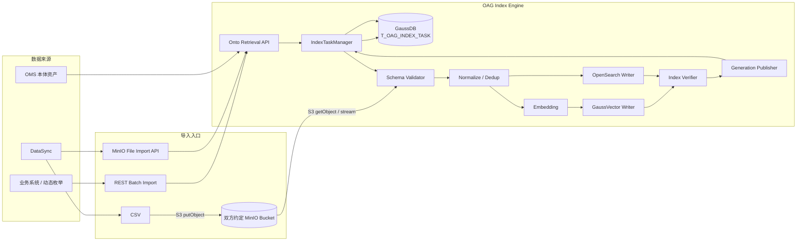

# 3. 索引构建与 DataSync Bulk Import

本章定义 OAG 索引数据的构建、动态导入、MinIO 文件交互、任务持久化和双存储发布机制。索引数据仍由第 2 章定义的三张物理表承载：

```text
t_ontoretrieval_{ontology_id} → ObjectType / Property 种子节点
t_metadata_evidence_{ontology_id} → Enum Value
t_instance_evidence_{ontology_id} → Instance Value
```

其中种子节点索引由 OAG 根据 OMS 本体资产构建；Enum Value 和 Instance Value 除随本体构建外，还支持运行期动态导入。动态数据导入统一为两类入口：

```text
REST 批量导入
  → 适合动态枚举值、少量/中等规模实例值的实时或准实时更新

MinIO CSV 文件导入
  → 适合 DataSync 生成的大规模枚举值/实例值全量或增量文件
```

两类入口最终进入同一套 OAG Import Pipeline，不允许分别维护两套 Embedding、去重、GaussVector/OpenSearch 写入和任务状态逻辑。

---

## 3.1 职责边界

### OMS

负责提供 ObjectType / Property、多语言 display/description、SynonymType、EnumType / values[]、Property→ObjectType 和 Property→EnumType 等本体资产。OAG 根据 OMS 资产构建 `t_ontoretrieval_{ontology_id}` 和静态 Enum Value 索引。

### DataSync

DataSync 负责大规模实例数据准备与文件交付：

```text
读取 capability=DIMENSION 的 Property
访问实际数据源
提取真实 Instance Value
源侧去重 / 基础标准化
建立 value 与 Property 的映射
生成 UTF-8 CSV 文件
上传到双方约定的 MinIO Bucket
调用 OAG 文件导入接口注册导入任务
```

当 DataSync 能够产生动态 Enum Value 时，也可以使用相同 CSV 文件接口提交 `METADATA_ENUM` 数据。

DataSync 不负责 Embedding、GaussVector/OpenSearch Client、ANN/全文索引构建、OAG 物理表创建、Generation 发布以及最终去重和双存储一致性。

### OAG

OAG 统一负责：

```text
API / 文件导入任务创建
GaussDB 任务状态持久化
请求 / CSV Schema 校验
Enum / Instance 本体映射校验
Normalize / Dedup
Embedding
GaussVector Bulk Write
OpenSearch Bulk Write
ANN / 全文索引校验
Generation 发布
在线检索
任务重试 / 取消 / 错误查询
```

> **DataSync/业务系统只提交业务语义数据，OAG 负责把业务数据转换为可检索的向量/全文索引。**

---

## 3.2 总体索引构建架构



两条入口仅在数据进入 OAG 前不同：REST 直接在 Body 中携带 records；MinIO 接口只携带 bucket/objectKey/checksum 等文件描述，OAG 从 MinIO 流式读取 CSV。从 `Schema Validator` 开始，两类入口使用完全相同的处理链路。
