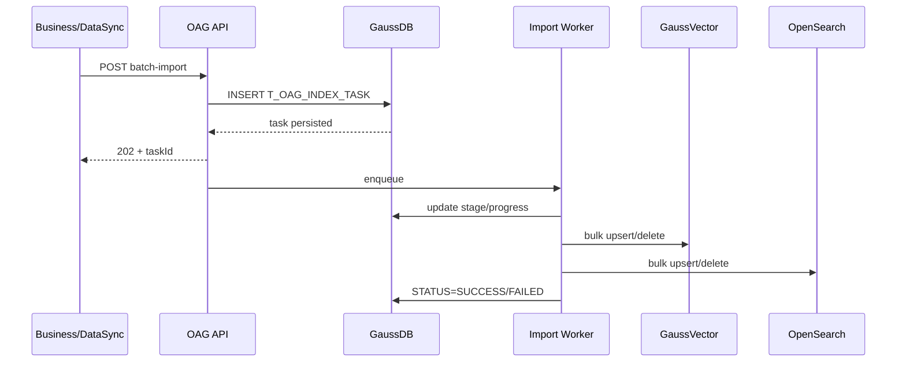
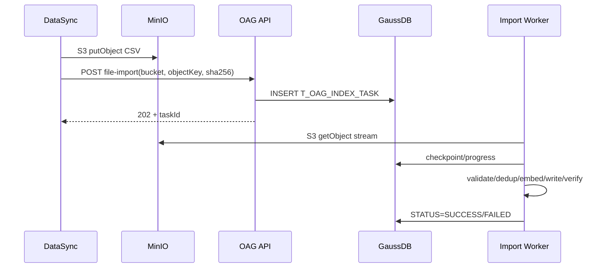

## 3.16 错误处理与可观测性

统一错误分类：

```text
INVALID_REQUEST
INVALID_DATA_TYPE
ONTOLOGY_NOT_FOUND
PROPERTY_NOT_FOUND
OBJECT_TYPE_MISMATCH
CSV_SCHEMA_ERROR
MINIO_OBJECT_NOT_FOUND
CHECKSUM_MISMATCH
EMBEDDING_FAILED
VECTOR_WRITE_FAILED
SEARCH_WRITE_FAILED
VERIFY_FAILED
PUBLISH_FAILED
```

任务级错误通过 `ERROR_CODE / ERROR_MESSAGE` 写入 `T_OAG_INDEX_TASK`；记录级错误至少保留 taskId、objectKey/rowNumber 或 recordIndex、propertyid、objectTypeId、必要时脱敏后的 value、errorCode、errorMessage。

`GET /v1/onto-retrieval/{ontologyId}/index-tasks/{taskId}/errors` 返回记录级错误，避免将百万条错误塞入任务主表。

关键指标：

```text
oag_index_task_total
oag_index_task_duration
oag_import_records_total
oag_import_failed_records
oag_import_deduplicated_records
oag_minio_read_bytes
oag_embedding_qps
oag_vector_write_qps
oag_opensearch_write_qps
```

---

## 3.17 端到端时序

### REST Batch



### MinIO CSV



---

## 3.18 本章最终约束

1. **所有 OAG REST API 统一使用 `/v1/onto-retrieval/{ontologyId}` Namespace。**
2. **语义检索固定使用 `POST /subgraph/semantic-search`。**
3. **Enum/Instance 动态索引支持 REST Batch 和 MinIO CSV 两类入口。**
4. **两类入口使用 `dataType=METADATA_ENUM/INSTANCE_VALUE` 显式区分数据。**
5. **REST/CSV 字段必须与第 2.8/2.10 节物理业务字段一致，不接受外部 vector。**
6. **DataSync → MinIO 数据文件统一使用 UTF-8 CSV。**
7. **DataSync 与 OAG 约定专用 MinIO Bucket；使用 S3 API 和 Path-style 访问。**
8. **索引任务必须先持久化到 GaussDB `T_OAG_INDEX_TASK`，再异步执行。**
9. **任务查询以 GaussDB 为事实来源。**
10. **REST 和文件导入共享 Normalize/Dedup/Embedding/双写/Verify/Publish Pipeline。**
11. **百万/千万级数据默认走 MinIO CSV Streaming，不通过超大 JSON Body。**
12. **GaussVector/OpenSearch 不使用分布式事务，通过唯一键、幂等、Verify 和任务重试保证一致性。**

---

## 3.19 兼容与迁移说明

本次只统一 API、动态导入、CSV 文件协议和任务持久化，不改变第 2 章已经确定的三类物理索引和向量化规则。

```text
旧 /v1/ontologies/{ontologyId}/... → /v1/onto-retrieval/{ontologyId}/...
旧 instance-evidence/import-jobs → batch-import / file-import + index-tasks
旧 Parquet / NDJSON 导入描述 → DataSync 文件统一为 UTF-8 CSV
旧内存任务状态 → GaussDB T_OAG_INDEX_TASK 权威状态
```

若已有线上调用方需要兼容窗口，可以在 Controller 层临时保留旧 URI 转发，但文档、SDK 和新代码只使用新 Namespace；兼容接口不得形成独立任务和索引处理链路。

---

## 3.20 设计结论

索引导入统一抽象为：

```text
dataType   = METADATA_ENUM | INSTANCE_VALUE
sourceType = REST | MINIO
importMode = FULL_REPLACE | INCREMENTAL
```

动态枚举和实例列值共享协议、任务、去重、Embedding 和双存储能力，同时保留 REST 的动态性和 MinIO CSV 的规模能力。
