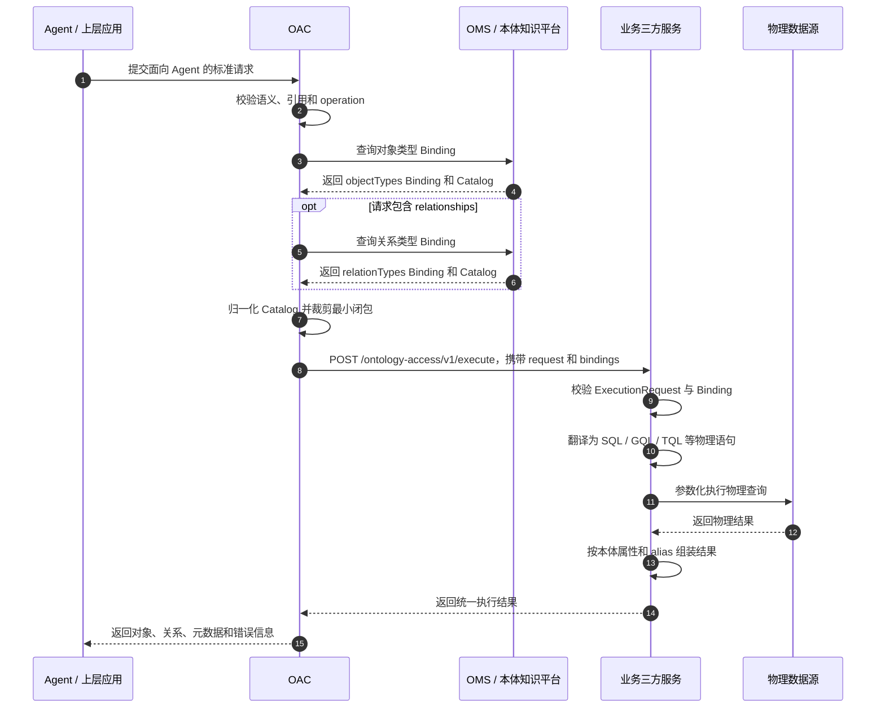
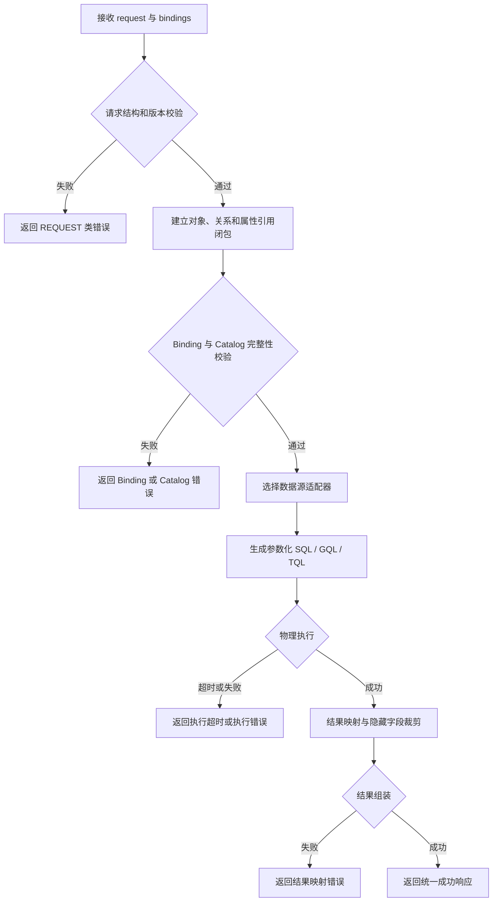

# OAC 业务三方定制接口开发规范

> **文档版本**：1.0  
> **发布日期**：2026-07  
> **执行请求版本**：1.0  
> **语法来源**：《本体对象操作语言（OQL）DSL 规范 - 面向Agent.md》  
> **Binding 数据来源**：《数据模型对接本体知识平台规范_v1.0.md》全文  
> **适用范围**：业务或三方数据访问服务对接 OAC，接收精简执行请求与执行所需 Binding，完成物理查询翻译、执行和结果组装

---

## 1. 规范目标与边界

本规范定义 OAC 到业务三方服务的执行接口。三方接口不直接暴露面向 Agent 的语言名称，而使用独立的“执行请求（Execution Request）”概念，避免三方接口模型与 OAC 面向 Agent 的语言模型发生混淆。

### 1.1 单一事实来源

| 内容 | 事实来源 |
|---|---|
| `operation`、`objects`、`relationships`、`conditions`、`returns`、`aggregateFilter`、`orders`、`maxResults`、`sourceQuery`、`mutation`、`items`、`options`、`extensions` 的结构和语义 | 《本体对象操作语言（OQL）DSL 规范 - 面向Agent.md》 |
| 数据资产类型与目录组合方式 | 《数据模型对接本体知识平台规范_v1.0.md》第 1 章 |
| 数据模型层级、`assetType`、`possibleChildDefines` 和访问规范 | 同一规范第 5.1、5.4 节 |
| 通用资产标识、父子关系、`platform`、`levelName`、`datasetType`、`isPrimaryKey`、`isNullable` 等字段 | 同一规范第 5.5、6.1～6.4 节 |
| 对象类型 Binding 根结构和属性 Binding | 同一规范第 5.6 节 |
| 关系类型 Binding 根结构和关系上下文 | 同一规范第 5.7 节 |
| 三方请求包络、字段裁剪、字段归一化和接口错误码 | 本规范 |

### 1.2 执行请求投影原则

OAC 校验上游 Agent 请求后，生成面向三方服务的执行请求：

1. `version` 固定为字符串 `"1.0"`；
2. 不传递 `strict`；
3. 不传递 `schemaRef`；
4. 其余字段名称、结构和语义沿用来源规范；
5. 未使用字段必须省略，不输出 `null`、空对象或无意义空数组；
6. 三方接口、DTO、日志、错误路径中统一使用 `request` 或 `ExecutionRequest`，不得使用 `oql` 作为入参名称。

### 1.3 Binding 投影原则

1. 对象和关系 Binding 根结构分别来源于第 5.6、5.7 节；
2. Catalog 字段同时审视第 1 章、第 5.1、5.4、5.5 和第 6 章；
3. 只对规范中已经出现的同义字段做确定性归一化；
4. 不新增来源规范未定义的关系 Join、图 Edge、Binding 选择或路由字段；
5. 无法从已定义字段确定物理执行信息时返回 `BINDING_INCOMPLETE`，禁止猜测。

### 1.4 核心流程

```text
Agent / 上层应用
      │ 面向 Agent 的标准请求
      ▼
OAC
      │ 1. 校验语义和引用
      │ 2. 生成 version=1.0 的 ExecutionRequest
      │ 3. 查询对象类型 Binding
      │ 4. 查询关系类型 Binding
      │ 5. 归一化 Catalog
      │ 6. 按本次执行裁剪 Binding
      ▼
业务三方服务
      │ POST /ontology-access/v1/execute
      │ Content-Type: application/json
      │ { request, bindings }
      ▼
物理查询翻译、参数化执行、结果组装
```

### 1.5 模块交互时序图

下图说明 Agent、OAC、OMS/本体知识平台、业务三方服务和物理数据源之间的一次完整调用顺序。图中只表达模块职责和调用关系，具体字段约束以正文定义为准。



### 1.6 三方执行流程图

下图说明业务三方服务接收到 `{ request, bindings }` 后的内部处理流程以及主要失败分支。



---

## 2. 接口定义

### 2.1 端点

```http
POST /ontology-access/v1/execute
Content-Type: application/json
```
注：接口可以通过模型注册到datasources，覆盖上述的默认路径

### 2.2 请求头

| Header | 必填 | 说明                                       |
|---|:---:|------------------------------------------|
| `Content-Type` | 是 | 固定为 `application/json`                   |
| `X-Request-Id` | 是 | 全链路唯一请求标识，用于调用链                         |
| `X-Tenant-Id` | 条件必填 | 多租户场景必填                                  |
| `X-Timeout-Ms` | 否 | 本次执行超时时间，单位毫秒                            |
| `Idempotency-Key` | 写操作必填 | `CREATE`、`UPDATE`、`DELETE`、`UPSERT` 的幂等键 |

执行请求版本只由 `request.version` 表达，不增加重复版本 Header。

### 2.3 请求体

```json
{
  "request": {
    "version": "1.0",
    "operation": "QUERY",
    "objects": [
      {
        "objectType": "Order",
        "alias": "o"
      }
    ],
    "returns": [
      {
        "kind": "FIELDS",
        "ref": "o",
        "fields": ["orderNo"]
      }
    ]
  },
  "bindings": {
    "objectTypes": []
  }
}
```

| 字段 | 类型 | 必填 | 说明 |
|---|---|:---:|---|
| `request` | object | 是 | 三方执行请求 1.0 |
| `bindings` | object | 是 | 本次执行所需 Binding 包络 |
| `bindings.objectTypes` | array | 条件必填 | 本次请求涉及对象类型时必填 |
| `bindings.relationTypes` | array | 条件必填 | 本次请求涉及关系类型时必填 |

省略和去重规则：

- 未使用关系时省略 `bindings.relationTypes`；
- 同一对象类型或关系类型只传一份 Binding，不按 alias 重复；
- `sourceQuery` 和 `BATCH.items` 中涉及的类型必须递归汇总；
- Binding 包络内不增加 alias、`bindingKind` 或 Binding 选择结果字段。

---

## 3. ExecutionRequest 1.0 参数定义

### 3.1 顶层字段

| 字段 | 类型 | 必填 | 说明 |
|---|---|:---:|---|
| `version` | string | 是 | 固定为 `"1.0"` |
| `operation` | enum | 是 | `QUERY` / `AGGREGATE` / `ASSOCIATION_QUERY` / `CREATE` / `UPDATE` / `DELETE` / `UPSERT` / `BATCH` |
| `objects` | array | 条件必填 | 对象声明；`BATCH` 顶层不使用 |
| `relationships` | array | 条件必填 | 关系路径，仅 `ASSOCIATION_QUERY` 使用 |
| `conditions` | object | 条件必填 | 对象级、明细级过滤条件树 |
| `returns` | array | 查询类操作必填 | 返回字段、表达式、字段类型指定函数、分组字段或聚合指标 |
| `aggregateFilter` | object | 否 | 聚合后过滤，仅 `AGGREGATE` 使用 |
| `orders` | array | 否 | 排序定义 |
| `maxResults` | object | 否 | 数量和偏移量控制 |
| `sourceQuery` | array | 否 | 中间结果查询 |
| `mutation` | object | 写操作条件必填 | 写操作参数块 |
| `items` | array | `BATCH` 必填 | 批处理子操作，子项不得继续嵌套 `BATCH` |
| `options` | object | 否 | 执行选项 |
| `extensions` | object | 否 | 已治理扩展；无明确约定时省略 |

注：当前阶段先实现**查询**操作

### 3.2 objects

```json
{
  "objectType": "Order",
  "alias": "o"
}
```

| 字段 | 类型 | 必填 | 说明 |
|---|---|:---:|---|
| `objectType` | string | 是 | 本体对象类型名称 |
| `alias` | string | 是 | 当前层唯一对象别名 |
| `fromSource` | string | 否 | 引用同层 `sourceQuery[].outputAs` |

约束：

- `alias` 在当前层唯一；
- `CREATE`、`UPDATE`、`DELETE`、`UPSERT` 必须且只能声明一个对象；
- `ASSOCIATION_QUERY` 的对象声明必须覆盖全部关系端点；
- `BATCH` 顶层不声明 `objects`。

### 3.3 relationships

```json
{
  "relationshipType": "order_has_product",
  "alias": "r1",
  "from": "o",
  "to": "p",
  "direction": "OUTBOUND",
  "mode": "LIST"
}
```

| 字段 | 类型 | 必填 | 说明 |
|---|---|:---:|---|
| `relationshipType` | string | 是 | 本体关系类型名称 |
| `alias` | string | 是 | 当前层唯一关系别名 |
| `from` | string | 是 | 源对象 alias |
| `to` | string | 是 | 目标对象 alias |
| `direction` | enum | 是 | `OUTBOUND` / `INBOUND` / `BIDIRECTIONAL` |
| `mode` | enum | 否 | `ONE` / `LIST`，默认 `LIST` |

关系查询统一使用 `ASSOCIATION_QUERY + relationships`，多跳路径按数组顺序表达。

### 3.4 Expr 表达式

字段表达式：

```json
{
  "kind": "FIELD",
  "ref": "o",
  "field": "amount"
}
```

字面量表达式：

```json
{
  "kind": "VALUE",
  "value": 100
}
```

受控函数表达式：

```json
{
  "kind": "FUNCTION",
  "name": "ABS",
  "args": [
    {
      "kind": "FIELD",
      "ref": "o",
      "field": "deltaAmount"
    }
  ]
}
```

扩展函数可以增加 `namespace`，但必须先在 OAC 函数注册表登记。聚合函数不得使用 Expr `FUNCTION` 表达，必须使用 `returns.kind = "METRIC"`。

### 3.5 conditions

字段条件：

```json
{
  "kind": "PREDICATE",
  "ref": "o",
  "field": "status",
  "operator": "EQ",
  "values": ["completed"]
}
```

表达式条件使用 `left`：

```json
{
  "kind": "PREDICATE",
  "left": {
    "kind": "FUNCTION",
    "name": "LENGTH",
    "args": [
      {
        "kind": "FIELD",
        "ref": "o",
        "field": "comment"
      }
    ]
  },
  "operator": "GT",
  "values": [100]
}
```

逻辑组：

```json
{
  "kind": "GROUP",
  "relation": "AND",
  "children": [
    {
      "kind": "PREDICATE",
      "ref": "o",
      "field": "status",
      "operator": "EQ",
      "values": ["completed"]
    }
  ]
}
```

操作符：

```text
EQ / NE / GT / GTE / LT / LTE
IN / NOT_IN / BETWEEN
LIKE / CONTAINS / STARTS_WITH / ENDS_WITH
IS_NULL / IS_NOT_NULL
IS_EMPTY / IS_NOT_EMPTY
EXISTS / NOT_EXISTS
```

### 3.6 returns

字段返回：

```json
{
  "kind": "FIELDS",
  "ref": "o",
  "fields": ["orderNo", "amount"]
}
```

派生表达式：

```json
{
  "kind": "EXPR",
  "expr": {
    "kind": "FUNCTION",
    "name": "ABS",
    "args": [
      {
        "kind": "FIELD",
        "ref": "o",
        "field": "deltaAmount"
      }
    ]
  },
  "alias": "absDeltaAmount"
}
```

普通分组：

```json
{
  "kind": "GROUP_BY",
  "ref": "o",
  "field": "region",
  "alias": "region"
}
```

聚合指标：

```json
{
  "kind": "METRIC",
  "function": "COUNT",
  "ref": "o",
  "field": "*",
  "alias": "orderCount"
}
```

ID/NAME 字段类型指定函数：

```json
{
  "kind": "FUNCTION",
  "ref": "o",
  "field": "NAME(release_cause)",
  "alias": "release_cause_name"
}
```

约束：

- `QUERY`、`ASSOCIATION_QUERY` 允许 `FIELDS`、`EXPR` 和字段类型指定 `FUNCTION`；
- `AGGREGATE` 只允许 `GROUP_BY` 和 `METRIC`；
- `FIELDS.fields` 不允许 `*`；
- `COUNT` 允许 `field = "*"`，其他聚合函数不允许；
- 聚合函数仅允许 `COUNT`、`SUM`、`AVG`、`MIN`、`MAX`；
- `ID(field)`、`NAME(field)` 只允许出现在 `returns.kind = "FUNCTION"` 中。

### 3.7 aggregateFilter

```json
{
  "kind": "METRIC_PREDICATE",
  "metricAlias": "totalAmount",
  "operator": "GT",
  "values": [10000]
}
```

- 仅允许用于 `AGGREGATE`；
- `metricAlias` 必须引用 `returns.kind = "METRIC"` 的 alias；
- 组合条件使用 `kind = "GROUP"`、`relation` 和 `children`；
- 不得直接引用对象原始字段。

### 3.8 orders 与 maxResults

普通字段排序：

```json
{
  "ref": "o",
  "field": "createdAt",
  "direction": "DESC"
}
```

聚合结果排序可以直接引用返回 alias：

```json
{
  "field": "totalAmount",
  "direction": "DESC"
}
```

分页：

```json
{
  "limit": 100,
  "offset": 0
}
```

`limit > 0`，`offset >= 0`；未指定时由 OAC 使用平台默认值，可以不传limit和offset参数。

### 3.9 mutation

CREATE：

```json
{
  "data": {
    "properties": {
      "name": "Product A",
      "price": 100
    }
  }
}
```

UPDATE：

```json
{
  "scope": "ONE",
  "set": {
    "price": 90
  }
}
```

DELETE：

```json
{
  "scope": "ONE"
}
```

UPSERT：

```json
{
  "matchBy": ["sourceSystem", "orderNo"],
  "data": {
    "properties": {
      "sourceSystem": "ERP",
      "orderNo": "ORD-001"
    }
  }
}
```

### 3.10 operation 约束

| operation | 必须包含 | 禁止包含 |
|---|---|---|
| `QUERY` | `objects`、`returns` | `relationships`、`aggregateFilter`、`mutation` |
| `AGGREGATE` | `objects`、至少一个 `METRIC` | `relationships`、`mutation` |
| `ASSOCIATION_QUERY` | `objects`、`relationships`、`returns` | `mutation` |
| `CREATE` | 单个 `objects`、`mutation.data.properties` | `returns`、`orders`、`relationships`、`aggregateFilter`、`sourceQuery` |
| `UPDATE` | 单个 `objects`、`conditions`、`mutation.scope`、非空 `mutation.set` | `returns`、`orders`、`relationships`、`aggregateFilter`、`sourceQuery` |
| `DELETE` | 单个 `objects`、`conditions`、`mutation.scope` | `returns`、`orders`、`relationships`、`aggregateFilter`、`sourceQuery` |
| `UPSERT` | 单个 `objects`、非空 `mutation.matchBy`、`mutation.data.properties` | `returns`、`orders`、`relationships`、`aggregateFilter`、`sourceQuery` |
| `BATCH` | 非空 `items` | 顶层 `objects`；`items[]` 不得嵌套 `BATCH` |

---

## 4. Binding 包络与字段来源

### 4.1 包络结构

```json
{
  "bindings": {
    "objectTypes": [],
    "relationTypes": []
  }
}
```

- `objectTypes[]` 根结构来源于对象类型绑定查询响应 `data`；
- `relationTypes[]` 根结构来源于关系类型绑定查询响应 `data`；
- `catalogContext` 同时参考数据资产特征、目录组合规则、层级定义、通用资产接口和 Binding 详细字段；
- 数组元素不增加 alias 或类型标记，业务服务通过上下文中的类型名称或 ID 建立索引。

### 4.2 禁止新增的内部字段

```text
bindingKind
relationBindings
bindingMode
role
selectedBindingId
field_ids
edgeDatasetId
sourceJoinKeys
targetJoinKeys
junctionFieldId
queryDialect
connectionRef
storageLayout
```

### 4.3 Catalog 字段归一化

| 来源字段 | 三方输出字段 | 规则 |
|---|---|---|
| `id`、`assetId` | `id` | 保留原值 |
| `parentAssetId`、`parentId` | `parentAssetId` | 保留原值 |
| Schema 示例中的 `datasourceId` | `parentAssetId` | 仅用于 Schema 父级 |
| Dataset 示例中的 `schemaId` | `parentAssetId` | 仅用于 Dataset 父级 |
| Field 示例中的 `datasetId` | `parentAssetId` | 仅用于 Field 父级 |
| `storageType`、`datasetType` | `storageType` | 保留原值 |
| JSON 字符串形式 `extendAttribute` | `extendAttribute` object | 仅在字符串为合法 JSON object 时解析 |

除上表外，不进行字段改名、类型推断或语义转换。来源字段同时存在且值冲突时返回 `CATALOG_NORMALIZE_ERROR`。

---

## 5. objectTypes[]

### 5.1 元素结构

```json
{
  "objectTypeContext": {},
  "propertyBindings": [],
  "catalogContext": {}
}
```

### 5.2 objectTypeContext

| 字段 | 类型 | 必填 | 处理 |
|---|---|:---:|---|
| `objectTypeId` | string | 是 | 保留 |
| `name` | string | 是 | 用于匹配 `request.objects[].objectType` |
| `description` | string | 否 | 默认裁剪 |
| `primaryKeys` | array | 是 | 保留 |
| `bindings` | array | 否 | 当前为预留；为空时省略，不定义内部结构 |

不得为 `objectTypeContext.bindings` 补造 Dataset、角色或对象级映射字段。

### 5.3 propertyBindings

```json
{
  "propertyId": "prop_001",
  "propertyName": "order_id",
  "dataType": "BIGINT",
  "bindings": [
    {
      "assetId": "field_001"
    }
  ]
}
```

| 字段 | 类型 | 必填 | 说明 |
|---|---|:---:|---|
| `propertyId` | string | 是 | 本体属性 ID |
| `propertyName` | string | 是 | 本体属性名称 |
| `dataType` | string | 是 | 属性逻辑数据类型 |
| `bindings` | array | 条件必填 | 属性绑定记录 |
| `bindings[].bindingId` | string | 否 | 绑定记录 ID |
| `bindings[].assetId` | string | 条件 | 一对一资产绑定 |
| `bindings[].groupId` | string | 否 | 多绑定分组 ID |
| `bindings[].assetIds` | array | 条件 | 一对多资产绑定 |
| `bindings[].expression` | string | 否 | 绑定表达式 |
| `bindings[].joinKeys` | string | 否 | Join 关联键，内部格式按原值使用 |
| `bindings[].timeseriesFieldId` | string | 否 | 时序字段 ID |
| `bindings[].extendAttribute` | object | 否 | 扩展属性 |

处理规则：

- 只保留本次请求使用的属性以及 `primaryKeys` 对应属性；
- `null`、空扩展对象和非执行必需的诊断字段默认裁剪；
- `assetIds` 是资产 ID 列表，不解释为目录祖先链；
- `expression`、`joinKeys` 不转换为自定义结构。

---

## 6. relationTypes[]

### 6.1 元素结构

```json
{
  "relationshipContext": {},
  "propertyBindings": [],
  "catalogContext": {}
}
```

### 6.2 relationshipContext

| 字段 | 类型 | 必填 | 说明 |
|---|---|:---:|---|
| `relationTypeId` | string | 是 | 关系类型 ID |
| `name` | string | 是 | 用于匹配 `request.relationships[].relationshipType` |
| `description` | string | 否 | 默认裁剪 |
| `sourceObjectTypeId` | string | 是 | 源对象类型 ID |
| `targetObjectTypeId` | string | 是 | 目标对象类型 ID |
| `connectionType` | string | 是 | `OBJECT_TO_OBJECT` / `PROPERTY_TO_PROPERTY` |
| `junctionDatasetId` | string | 否 | 关联数据集 ID |
| `backingObjectTypeId` | string | 否 | 支撑对象类型 ID |
| `junctionConfig` | string | 否 | 按原值传递 |
| `relationProperties` | string | 否 | 按原值传递 |
| `junctionDatasetName` | string | 否 | 关联数据集名称 |

关系属性继续使用与对象属性相同的 `propertyBindings`，不新增关系专用 Binding 模型。无法确定 Join 或 Edge 信息时返回 `BINDING_INCOMPLETE`。

---

## 7. catalogContext

### 7.1 目录层级语义

来源规范支持：

```text
datasource → dataset → field
datasource → schema → dataset → field
datasource → schema → schema → dataset → field
```

业务服务不得假设 Schema 一定存在、只有一层，或 Dataset 父级一定是 Schema。统一使用 `parentAssetId` 沿父链解析。

### 7.2 结构

```json
{
  "dataSources": [],
  "schemas": [],
  "datasets": [],
  "fields": []
}
```

无 Schema 模式可以省略 `schemas`。

### 7.3 DataSource

| 字段 | 类型 | 必填 | 说明 |
|---|---|:---:|---|
| `id` | string | 是 | 由 `id` 或 `assetId` 归一化 |
| `name` | string | 条件 | 执行需要时保留 |
| `displayName` | string | 否 | 默认裁剪 |
| `datasourceType` | string | 条件 | 选择数据源适配器时保留 |
| `parentAssetId` | string | 否 | 顶级数据源通常省略 |
| `platform` | string | 否 | 多模型路由需要时保留 |
| `levelName` | string | 否 | 层级定位需要时保留 |
| `connectionConfig` | object | 条件 | 执行连接需要时保留 |
| `description` | string | 否 | 默认裁剪 |
| `extendAttribute` | object | 否 | 执行需要时保留 |

`connectionConfig` 已定义字段：`connectionType`、`name`、`datasourceId`、`datasourceType`、`modelType`。不得新增或透传密码、Token、私钥。

### 7.4 Schema

| 字段 | 类型 | 必填 | 说明 |
|---|---|:---:|---|
| `id` | string | 是 | 统一资产 ID |
| `parentAssetId` | string | 是 | 可以指向 DataSource 或上一级 Schema |
| `name` | string | 是 | 物理或逻辑容器名称 |
| `platform` | string | 否 | 执行需要时保留 |
| `levelName` | string | 否 | 多级 Schema 时建议保留 |
| `displayName` | string | 否 | 默认裁剪 |
| `description` | string | 否 | 默认裁剪 |

### 7.5 Dataset

| 字段 | 类型 | 必填 | 说明 |
|---|---|:---:|---|
| `id` | string | 是 | 统一资产 ID |
| `parentAssetId` | string | 是 | 可指向 DataSource 或 Schema |
| `name` | string | 是 | 表、视图、Tag、Edge 或维度名称 |
| `storageType` | string | 是 | `Table` / `View` / `Tag` / `Edge` / `Dimension` |
| `platform` | string | 否 | 执行需要时保留 |
| `levelName` | string | 否 | 自定义层级需要时保留 |
| `primaryKeys` | string | 否 | 保留上游 JSON 数组格式字符串 |
| `displayName` | string | 否 | 默认裁剪 |
| `description` | string | 否 | 默认裁剪 |
| `extendAttribute` | object | 否 | 执行需要时保留 |

### 7.6 Field

| 字段 | 类型 | 必填 | 说明 |
|---|---|:---:|---|
| `id` | string | 是 | 统一资产 ID |
| `parentAssetId` | string | 是 | 所属 Dataset ID |
| `name` | string | 是 | 物理字段或属性名称 |
| `dataType` | string | 是 | 字段数据类型 |
| `platform` | string | 否 | 执行需要时保留 |
| `levelName` | string | 否 | 如 `column`、`property` |
| `description` | string | 否 | 默认裁剪 |
| `sortOrder` | string | 否 | 默认裁剪 |
| `semanticRole` | string | 否 | `DIMENSION` / `MEASURE` / `TIMESTAMP` |
| `technicalType` | string | 否 | 物理字段类型 |
| `cubeContext` | object | 否 | 多维模型需要时保留 |
| `timeSeriesInfo` | object | 否 | 时序模型需要时保留 |
| `isPrimaryKey` | boolean | 否 | 字段是否为主键 |
| `isNullable` | boolean | 否 | 字段是否可为空 |
| `extendAttribute` | object | 否 | 执行需要时保留 |

`cubeContext` 已定义字段：`attributeId`、`type`、`name`、`levelId`、`levelName`。  
`timeSeriesInfo` 已定义字段：`timeRole`、`format`、`timeValueType`、`interval`。

---

## 8. Binding 裁剪规则

### 8.1 请求属性闭包

OAC 递归收集以下位置引用的属性：

```text
conditions.ref + field
conditions.left 中的 FIELD
returns 的 fields / field / expr
orders.ref + field
aggregateFilter 间接引用的 METRIC 字段
mutation.data.properties
mutation.set
mutation.matchBy
sourceQuery
BATCH.items
```

同时补充：

- `objectTypeContext.primaryKeys` 对应属性；
- `timeseriesFieldId`；
- `assetId`、`assetIds`、`joinKeys`、`expression` 所需资产；
- 结果组装所需主键字段。

### 8.2 Catalog 最小闭包

对每个保留的 Field，必须递归保留其 `parentAssetId` 祖先，直到 DataSource。所有资产数组按 `id` 去重。

### 8.3 完整性校验

以下情况不得调用三方服务：

- 请求引用的对象、关系或属性缺少 Binding；
- 属性 Binding 引用的资产不存在；
- Catalog 父链断裂；
- 归一化来源字段值冲突；
- 关系执行信息不足；
- 多个 Binding 无法由平台配置确定唯一执行映射。

---

## 9. 完整请求示例

### 9.1 普通查询

```json
{
  "request": {
    "version": "1.0",
    "operation": "QUERY",
    "objects": [
      {
        "objectType": "OrderObject",
        "alias": "o"
      }
    ],
    "conditions": {
      "kind": "PREDICATE",
      "ref": "o",
      "field": "status",
      "operator": "EQ",
      "values": ["completed"]
    },
    "returns": [
      {
        "kind": "FIELDS",
        "ref": "o",
        "fields": ["order_id", "status"]
      }
    ],
    "maxResults": {
      "limit": 100,
      "offset": 0
    }
  },
  "bindings": {
    "objectTypes": [
      {
        "objectTypeContext": {
          "objectTypeId": "obj_001",
          "name": "OrderObject",
          "primaryKeys": ["order_id"]
        },
        "propertyBindings": [
          {
            "propertyId": "prop_001",
            "propertyName": "order_id",
            "dataType": "BIGINT",
            "bindings": [
              {
                "assetId": "field_order_id"
              }
            ]
          },
          {
            "propertyId": "prop_002",
            "propertyName": "status",
            "dataType": "STRING",
            "bindings": [
              {
                "assetId": "field_status"
              }
            ]
          }
        ],
        "catalogContext": {
          "dataSources": [
            {
              "id": "ds_001",
              "name": "mysql_prod",
              "datasourceType": "MYSQL"
            }
          ],
          "schemas": [
            {
              "id": "schema_001",
              "parentAssetId": "ds_001",
              "name": "sales_db"
            }
          ],
          "datasets": [
            {
              "id": "dataset_orders",
              "parentAssetId": "schema_001",
              "name": "t_orders",
              "storageType": "Table"
            }
          ],
          "fields": [
            {
              "id": "field_order_id",
              "parentAssetId": "dataset_orders",
              "name": "order_id",
              "dataType": "BIGINT",
              "isPrimaryKey": true
            },
            {
              "id": "field_status",
              "parentAssetId": "dataset_orders",
              "name": "status",
              "dataType": "VARCHAR"
            }
          ]
        }
      }
    ]
  }
}
```

### 9.2 关系查询

```json
{
  "request": {
    "version": "1.0",
    "operation": "ASSOCIATION_QUERY",
    "objects": [
      {
        "objectType": "OrderObject",
        "alias": "o"
      },
      {
        "objectType": "ProductObject",
        "alias": "p"
      }
    ],
    "relationships": [
      {
        "relationshipType": "order_has_product",
        "alias": "r1",
        "from": "o",
        "to": "p",
        "direction": "OUTBOUND",
        "mode": "LIST"
      }
    ],
    "returns": [
      {
        "kind": "FIELDS",
        "ref": "p",
        "fields": ["product_id", "product_name"]
      }
    ]
  },
  "bindings": {
    "objectTypes": [],
    "relationTypes": [
      {
        "relationshipContext": {
          "relationTypeId": "rel_001",
          "name": "order_has_product",
          "sourceObjectTypeId": "obj_order",
          "targetObjectTypeId": "obj_product",
          "connectionType": "OBJECT_TO_OBJECT",
          "junctionDatasetId": "dataset_order_product",
          "junctionDatasetName": "t_order_product",
          "junctionConfig": "{}",
          "relationProperties": "[]"
        },
        "propertyBindings": [],
        "catalogContext": {
          "dataSources": [],
          "datasets": [],
          "fields": []
        }
      }
    ]
  }
}
```

关系示例中的空数组表示该示例未展开对应对象 Binding 和 Catalog 资产；生产请求必须满足第 8 章完整性要求。

---

## 10. Java 开发建议

### 10.1 DTO

```java
public record ExecuteEnvelope(
        ExecutionRequest request,
        BindingBundle bindings) {
}

public record ExecutionRequest(
        String version,
        String operation,
        List<ObjectDeclaration> objects,
        List<RelationshipDeclaration> relationships,
        ConditionNode conditions,
        List<ReturnItem> returns,
        ConditionNode aggregateFilter,
        List<OrderItem> orders,
        MaxResults maxResults,
        List<ExecutionRequest> sourceQuery,
        Mutation mutation,
        List<ExecutionRequest> items,
        Map<String, Object> options,
        Map<String, Object> extensions) {
}

public record BindingBundle(
        List<ObjectTypeBinding> objectTypes,
        List<RelationTypeBinding> relationTypes) {
}
```

### 10.2 Controller

```java
@PostMapping("/execute")
public OntologyAccessResponse execute(
        @RequestHeader("X-Request-Id") String requestId,
        @RequestHeader(value = "X-Tenant-Id", required = false) String tenantId,
        @RequestHeader(value = "Idempotency-Key", required = false) String idempotencyKey,
        @RequestBody ExecuteEnvelope envelope) {

    validator.validate(envelope.request(), envelope.bindings());
    return executionService.execute(
        envelope.request(),
        envelope.bindings(),
        requestId,
        tenantId,
        idempotencyKey);
}
```

### 10.3 Bean 兼容要求

- Binding DTO 配置 `FAIL_ON_UNKNOWN_PROPERTIES = false`；
- 执行请求按 `request.version` 选择对应 DTO 和校验器；
- 未知枚举映射为 `UNKNOWN`，再由业务校验决定是否支持；
- 不使用 `Map<String, Object>` 替代核心请求结构；
- 代码、日志和错误路径统一使用 `request`，不使用 `oql` 作为外部接口变量名。

---

## 11. 响应规范

### 11.1 成功响应

```json
{
  "code": 20000,
  "message": "Success",
  "data": {
    "taskStatus": "SUCCESS",
    "objects": [],
    "relationships": [],
    "metadata": {
      "totalCount": 0,
      "successTaskCount": 1,
      "failedTaskCount": 0
    },
    "trace": {
      "requestId": "req-001",
      "executionTime": 25
    }
  },
  "errors": []
}
```

### 11.2 失败响应

```json
{
  "code": 40010030201,
  "message": "validation failed",
  "data": {
    "taskStatus": "FAILED",
    "objects": [],
    "relationships": []
  },
  "errors": [
    {
      "code": "REQUEST_REFERENCE_ERROR",
      "message": "returns.ref must reference a declared alias",
      "path": "$.request.returns[0].ref",
      "details": {
        "ref": "x"
      }
    }
  ]
}
```

响应属性使用本体属性名或返回 alias，不返回物理表名、列名、SQL、连接凭据或未在 `returns` 中声明的隐藏技术字段。

---

## 12. 错误码

| 错误码 | HTTP | 说明 |
|---|:---:|---|
| `REQUEST_VERSION_UNSUPPORTED` | 400 | `request.version` 不支持 |
| `REQUEST_STRUCTURE_INVALID` | 400 | 执行请求结构不合法 |
| `REQUEST_REFERENCE_ERROR` | 400 | alias、属性或指标引用错误 |
| `REQUEST_OPERATION_UNSUPPORTED` | 400 | operation 不支持 |
| `BINDING_OBJECT_NOT_FOUND` | 400 | 对象 Binding 缺失 |
| `BINDING_RELATION_NOT_FOUND` | 400 | 关系 Binding 缺失 |
| `BINDING_PROPERTY_NOT_FOUND` | 400 | 属性 Binding 缺失 |
| `BINDING_ASSET_NOT_FOUND` | 400 | 引用的数据资产缺失 |
| `BINDING_INCOMPLETE` | 400 | Binding 无法支持物理执行 |
| `CATALOG_NORMALIZE_ERROR` | 400 | Catalog 同义字段冲突或格式错误 |
| `TRANSLATE_ERROR` | 500 | 物理查询翻译失败 |
| `EXECUTION_ERROR` | 500 | 物理执行失败 |
| `EXECUTION_TIMEOUT` | 504 | 执行超时 |
| `RESULT_MAPPING_ERROR` | 500 | 结果组装失败 |

---

## 13. 安全与可观测性

### 13.1 安全

- 条件值和写入值必须参数化绑定；
- 表名、列名、Schema、Tag、Edge 只能来自 Binding；
- 禁止从 `values`、URL 参数或任意扩展字符串构造物理标识；
- `UPDATE`、`DELETE` 必须有非空条件和明确 `scope`；
- Binding 和日志不得包含密码、Token、私钥；
- 原始物理查询和完整参数默认不进入响应或普通日志。

### 13.2 日志字段

```text
requestId=req-001
requestVersion=1.0
operation=QUERY
objectTypes=OrderObject
datasourceType=MYSQL
translateMs=4
executeMs=25
assembleMs=2
result=SUCCESS
```

---

## 14. 兼容与版本演进

1. `request.version` 是执行请求唯一版本字段；
2. 1.x 版本只能新增可选字段、可选枚举和不改变既有语义的能力；
3. 删除字段、字段改名、类型变化或语义变化必须升级主版本；
4. Binding 新增可选字段时，旧 DTO 必须能够忽略；
5. Binding 已有字段的名称、类型和语义不得由本接口单方面修改；
6. 破坏性接口包络变化通过新的 `/ontology-access/v2/execute` 发布；
7. 不提供 `oql` 入参别名，避免同一接口长期维护两套外部模型。

---

## 15. 测试与接入清单

### 15.1 契约测试

- [ ] 顶层入参为 `request` 和 `bindings`；
- [ ] 请求 JSON 不包含 `oql`、`strict`、`schemaRef`；
- [ ] `request.version` 固定为 `1.0`；
- [ ] QUERY、AGGREGATE、ASSOCIATION_QUERY、写操作和 BATCH 结构校验通过；
- [ ] alias 和属性引用闭包校验通过；
- [ ] 对象、关系和属性 Binding 缺失时返回明确错误；
- [ ] Catalog 支持无 Schema、单级 Schema 和多级 Schema；
- [ ] `assetId`、`parentId`、`datasetType` 等字段归一化正确；
- [ ] Binding 内没有无来源字段；
- [ ] 隐藏主键和 Join 字段不泄露到返回属性。

### 15.2 开发检查

- [ ] Controller 接收 `ExecuteEnvelope`；
- [ ] Java 类型使用 `ExecutionRequest`，不使用外部 `OqlRequest`；
- [ ] 日志使用 `requestVersion`，不使用 `oqlVersion`；
- [ ] 错误路径以 `$.request` 开头；
- [ ] 物理查询值全部参数化；
- [ ] 写操作具备幂等和范围保护；
- [ ] DTO 忽略 Binding 新增可选字段；
- [ ] 关键示例通过 JSON 解析和契约测试。

---

## 16. 参考规范

| 规范 | 用途 |
|---|---|
| 《本体对象操作语言（OQL）DSL 规范 - 面向Agent.md》 | 仅作为执行请求字段结构和语义来源，不作为三方接口入参名称 |
| 《数据模型对接本体知识平台规范_v1.0.md》 | Binding、Catalog、目录层级和资产字段来源 |
| 《OAC业务三方定制接口开发规范.md》 | OAC 到业务三方服务的执行接口契约 |
