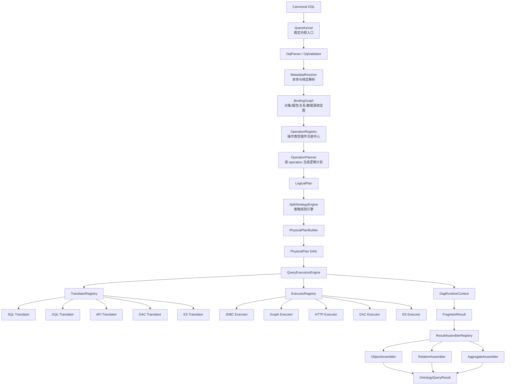
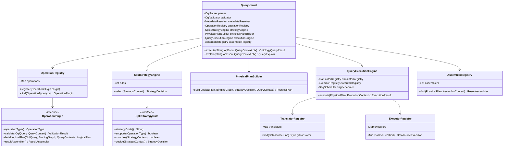
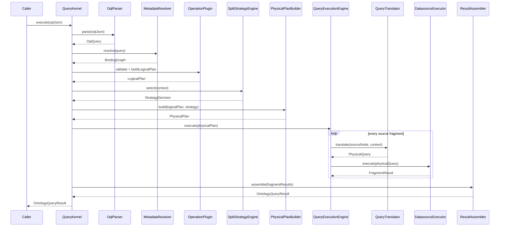
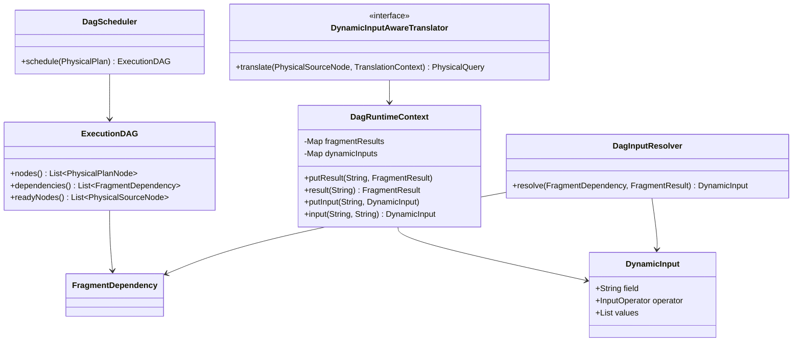
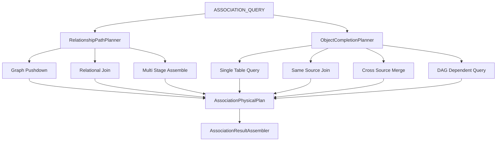
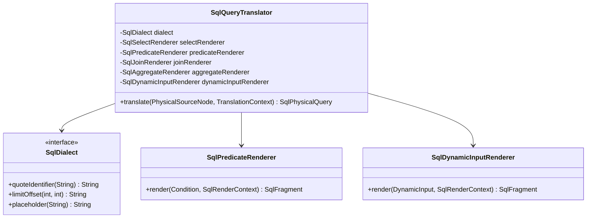

# OAC 本体查询转换框架稳定内核设计方案

## 1. 设计目标

OAC 查询转换框架需要长期支持多种操作类型、多种执行策略、多种数据源、多种查询语言和多阶段 DAG 查询。因此代码架构不能把 `operationType`、`SplitStrategy`、`datasourceType`、SQL/GQL/API/DAC/ES 语句拼装、数据源执行逻辑写死在一个类中。

框架应从一开始设计为：

```text
稳定内核 Core Kernel
  + 操作类型插件 Operation Plugin
  + 策略规则插件 SplitStrategy Rule
  + 物理查询翻译插件 QueryTranslator
  + 数据源执行插件 DatasourceExecutor
  + 结果装配插件 ResultAssembler
  + 函数与表达式插件 FunctionProvider
  + 元数据与能力插件 MetadataProvider / CapabilityProvider
```

核心目标：

1. 新增 operation 不修改内核主流程；
2. 新增 SplitStrategy 不修改 Planner 主体；
3. 新增数据源不修改 ExecutionEngine；
4. 新增 SQL/GQL/API/DAC/ES 方言不影响其它数据源；
5. 支持 `A -> B` DAG 依赖查询；
6. 支持 ASSOCIATION_QUERY 中对象属性补全也走普通 QUERY 的策略；
7. 支持 Explain、Trace、单元测试和端到端转换测试；
8. 保证可靠性、安全性、可维护性和长期扩展能力。

------

## 2. 总体架构



------

## 3. 稳定内核职责边界

### 3.1 内核负责什么

稳定内核只负责不可变主流程：

```text
OQL
  -> validate
  -> resolve metadata
  -> build binding graph
  -> choose operation planner
  -> build logical plan
  -> select split strategy
  -> build physical DAG
  -> translate fragment
  -> execute fragment
  -> assemble result
```

内核不直接关心：

```text
MySQL 怎么拼 SQL
NebulaGraph 怎么拼 GQL
API 请求参数怎么组织
DAC 请求体怎么构造
ES DSL 怎么生成
某个新增 operation 的特殊规则
某个新增 SplitStrategy 的判断细节
```

这些都交给扩展点。

------

### 3.2 内核不应写死的内容

不建议出现以下硬编码：

```java
if (operation == QUERY) { ... }
else if (operation == AGGREGATE) { ... }
else if (operation == ASSOCIATION_QUERY) { ... }
if (datasourceType == MYSQL) { ... }
else if (datasourceType == NEBULA_GRAPH) { ... }
else if (datasourceType == API) { ... }
if (strategy == SINGLE_SOURCE_SINGLE_TABLE) { ... }
else if (strategy == CROSS_SOURCE_MEMORY_MERGE) { ... }
```

推荐改成：

```text
OperationRegistry
SplitStrategyRuleChain
TranslatorRegistry
ExecutorRegistry
AssemblerRegistry
```

------

## 4. 核心扩展点设计

## 4.1 Operation 插件扩展

### 设计目标

操作类型不能只依赖枚举。因为未来可能新增：

```text
QUERY
AGGREGATE
ASSOCIATION_QUERY
PATH_QUERY
SUBGRAPH_QUERY
BATCH_QUERY
WRITE
UPSERT
DELETE
EXPLAIN
```

推荐使用 `OperationType` 值对象，而不是固定 enum。

```java
public final class OperationType {
    private final String code;

    public OperationType(String code) {
        if (code == null || code.trim().isEmpty()) {
            throw new IllegalArgumentException("operation code must not be blank");
        }
        this.code = code;
    }

    public String code() {
        return code;
    }
}
```

### OperationPlugin

```java
public interface OperationPlugin {
    OperationType operationType();

    ValidationResult validate(OqlQuery query, QueryContext context);

    LogicalPlan buildLogicalPlan(OqlQuery query, BindingGraph graph, QueryContext context);

    ResultAssembler<?> resultAssembler();
}
```

预置实现：

```text
QueryOperationPlugin
AggregateOperationPlugin
AssociationQueryOperationPlugin
DagDependentQueryOperationPlugin
ExplainOperationPlugin
```

------

## 4.2 SplitStrategy 策略扩展

### 设计目标

SplitStrategy 不应该写死在一个大 `SplitStrategySelector` 中，而应该是规则链。

每个策略规则只判断自己是否适用，并给出候选物理计划。

```java
public interface SplitStrategyRule {
    String strategyCode();

    boolean supports(OperationType operationType);

    boolean matches(StrategyContext context);

    StrategyDecision decide(StrategyContext context);
}
```

### StrategyContext

```java
public class StrategyContext {
    private final OqlQuery query;
    private final BindingGraph bindingGraph;
    private final LogicalPlan logicalPlan;
    private final DatasourceCapabilityRegistry capabilityRegistry;
    private final QueryContext queryContext;
}
```

### StrategyDecision

```java
public class StrategyDecision {
    private final String strategyCode;
    private final int priority;
    private final String reason;
    private final Map<String, Object> attributes;
}
```

### SplitStrategyEngine

```java
public class SplitStrategyEngine {
    private final List<SplitStrategyRule> rules;

    public StrategyDecision select(StrategyContext context) {
        return rules.stream()
                .filter(rule -> rule.supports(context.operationType()))
                .filter(rule -> rule.matches(context))
                .map(rule -> rule.decide(context))
                .max(Comparator.comparingInt(StrategyDecision::priority))
                .orElseThrow(() -> new PlanningException("no split strategy matched"));
    }
}
```

### 预置 SplitStrategy 规则

```text
SingleSourceSingleTableRule
SingleSourceMultiTableJoinRule
CrossSourceMemoryMergeRule
AssociationGraphPushdownRule
AssociationRelationalJoinRule
AssociationObjectCompletionRule
AssociationMultiStageAssembleRule
AggregatePushdownRule
AggregatePartialMergeRule
AggregateMemoryRule
DagDependentQueryRule
DagDependentAggregateRule
```

------

## 4.3 数据源类型扩展

### 设计目标

数据源类型也不建议只用 enum。未来可能新增：

```text
MYSQL
GAUSSDB
POSTGRESQL
CLICKHOUSE
NEBULA_GRAPH
INFINITY_GRAPH
API
DAC
ES
PROMETHEUS
KAFKA
HIVE
HUDI
ICEBERG
```

推荐使用 `DatasourceKind` 值对象。

```java
public final class DatasourceKind {
    private final String code;

    public DatasourceKind(String code) {
        if (code == null || code.trim().isEmpty()) {
            throw new IllegalArgumentException("datasource kind must not be blank");
        }
        this.code = code;
    }

    public String code() {
        return code;
    }
}
```

预置常量可以放在：

```java
public final class BuiltinDatasourceKinds {
    public static final DatasourceKind MYSQL = new DatasourceKind("MYSQL");
    public static final DatasourceKind GAUSSDB = new DatasourceKind("GAUSSDB");
    public static final DatasourceKind NEBULA_GRAPH = new DatasourceKind("NEBULA_GRAPH");
    public static final DatasourceKind API = new DatasourceKind("API");
    public static final DatasourceKind DAC = new DatasourceKind("DAC");
    public static final DatasourceKind ES = new DatasourceKind("ES");
}
```

------

## 4.4 QueryTranslator SPI

### 设计目标

每种数据源的物理语句组装都通过 Translator 插件实现。

```java
public interface QueryTranslator<Q extends PhysicalQuery> {
    DatasourceKind datasourceKind();

    boolean supports(PhysicalSourceNode sourceNode, TranslationContext context);

    Q translate(PhysicalSourceNode sourceNode, TranslationContext context);
}
```

### TranslationContext

需要包含静态上下文和 DAG 动态输入。

```java
public class TranslationContext {
    private final QueryContext queryContext;
    private final DagRuntimeContext dagRuntimeContext;
    private final FunctionRegistry functionRegistry;
    private final DialectRegistry dialectRegistry;
}
```

### 预置 Translator

```text
SqlQueryTranslator
GqlQueryTranslator
ApiQueryTranslator
DacQueryTranslator
EsQueryTranslator
MockQueryTranslator
```

### SQL Translator 可扩展点

SQL 语句组装建议拆成更小插件：

```text
SqlDialect
SqlSelectRenderer
SqlPredicateRenderer
SqlAggregateRenderer
SqlJoinRenderer
SqlDynamicInputRenderer
SqlPaginationRenderer
```

避免一个 `SqlQueryTranslator` 无限膨胀。

------

## 4.5 DatasourceExecutor SPI

### 设计目标

Translator 只生成查询对象，不执行查询。Executor 负责数据源对接。

```java
public interface DatasourceExecutor<Q extends PhysicalQuery> {
    DatasourceKind datasourceKind();

    FragmentResult execute(Q query, ExecutionContext context);
}
```

预置实现：

```text
JdbcDatasourceExecutor
GraphDatasourceExecutor
HttpApiDatasourceExecutor
DacDatasourceExecutor
EsDatasourceExecutor
MockDatasourceExecutor
```

每个 Executor 必须统一支持：

```text
timeout
retry
rate limit
circuit breaker
tenant isolation
audit logging
metric collection
sensitive data masking
```

可以通过 Decorator 实现：

```java
DatasourceExecutor executor =
    new MetricExecutorDecorator(
        new RetryExecutorDecorator(
            new TimeoutExecutorDecorator(
                new JdbcDatasourceExecutor(...)
            )
        )
    );
```

------

## 4.6 ResultAssembler SPI

### 设计目标

结果装配也需要可定制，尤其是 ASSOCIATION_QUERY 中：

```text
关系路径查询
对象属性补全
跨源对象合并
关系实例装配
聚合指标装配
```

都可能有不同策略。

```java
public interface ResultAssembler {
    boolean supports(PhysicalPlan plan, AssemblyContext context);

    OntologyQueryResult assemble(List<FragmentResult> fragments, AssemblyContext context);
}
```

预置实现：

```text
ObjectResultAssembler
RelationResultAssembler
AggregateResultAssembler
AssociationResultAssembler
DagResultAssembler
```

------

## 5. 稳定内核类图



------

## 6. 运行时主流程



------

## 7. DAG 依赖查询扩展设计

### 7.1 设计目标

支持：

```text
A -> B
```

其中：

```text
A 查询结果字段作为 B 查询输入条件
```

例如：

```text
A: NebulaGraph 查询 Cell ID
B: MySQL 查询 WHERE cell_id IN (...)
```

------

### 7.2 DAG 模型

```java
public class FragmentDependency {
    private String upstreamNodeId;
    private String upstreamOutputField;
    private String downstreamNodeId;
    private String downstreamInputField;
    private InputOperator operator;
    private boolean required;
    private int maxInputSize;
}
public enum InputOperator {
    EQ,
    IN
}
```

------

### 7.3 DAG 执行类图



------

## 8. ASSOCIATION_QUERY 的两层策略

ASSOCIATION_QUERY 不能只看关系怎么查，还必须看关系两端对象的属性如何补全。

因此建议拆成两层策略：

```text
关系路径层 Strategy
  + 对象属性补全层 Strategy
```

### 8.1 关系路径层

```text
ASSOCIATION_GRAPH_PUSHDOWN
ASSOCIATION_RELATIONAL_JOIN
ASSOCIATION_MULTI_STAGE_ASSEMBLE
```

### 8.2 对象属性补全层

对象属性补全与普通 QUERY 一样，也可能出现：

```text
SINGLE_SOURCE_SINGLE_TABLE
SINGLE_SOURCE_MULTI_TABLE_JOIN
CROSS_SOURCE_MEMORY_MERGE
DAG_DEPENDENT_QUERY
```

架构图：



------

## 9. 数据源语句组装架构

### 9.1 SQL



### 9.2 GQL

```text
GqlQueryTranslator
  -> GqlPatternRenderer
  -> GqlWhereRenderer
  -> GqlReturnRenderer
  -> GqlPathRenderer
```

### 9.3 API

```text
ApiQueryTranslator
  -> ApiPathTemplateRenderer
  -> ApiQueryParamRenderer
  -> ApiBodyRenderer
  -> ApiHeaderRenderer
```

### 9.4 DAC

```text
DacQueryTranslator
  -> DacMetricRenderer
  -> DacDimensionRenderer
  -> DacFilterRenderer
  -> DacTimeRangeRenderer
```

### 9.5 ES

```text
EsQueryTranslator
  -> EsQueryDslRenderer
  -> EsTermsRenderer
  -> EsAggregationRenderer
  -> EsSortRenderer
```

------

## 10. 推荐包结构

```text
oac-query-framework/
  src/main/java/com/oac/framework/
    kernel/
      QueryKernel.java
      QueryContext.java
      QueryExplain.java

    operation/
      OperationType.java
      OperationPlugin.java
      OperationRegistry.java
      QueryOperationPlugin.java
      AggregateOperationPlugin.java
      AssociationQueryOperationPlugin.java

    model/
      oql/
      binding/
      logical/
      physical/
      result/

    metadata/
      OntologyMetadataProvider.java
      BindingMetadataProvider.java
      DatasourceCapabilityProvider.java

    planner/
      LogicalPlanBuilder.java
      PhysicalPlanBuilder.java

    strategy/
      SplitStrategyRule.java
      SplitStrategyEngine.java
      rules/
        SingleSourceSingleTableRule.java
        SameSourceJoinRule.java
        CrossSourceMergeRule.java
        AssociationGraphPushdownRule.java
        AggregatePushdownRule.java
        DagDependentQueryRule.java

    translator/
      QueryTranslator.java
      TranslatorRegistry.java
      sql/
      gql/
      api/
      dac/
      es/

    executor/
      DatasourceExecutor.java
      ExecutorRegistry.java
      decorators/
        TimeoutExecutorDecorator.java
        RetryExecutorDecorator.java
        MetricExecutorDecorator.java
      jdbc/
      graph/
      http/
      dac/
      es/

    dag/
      FragmentDependency.java
      DagScheduler.java
      DagRuntimeContext.java
      DagInputResolver.java

    assembler/
      ResultAssembler.java
      AssemblerRegistry.java
      ObjectAssembler.java
      RelationAssembler.java
      AggregateAssembler.java
      AssociationAssembler.java

    function/
      FunctionProvider.java
      FunctionRegistry.java

    error/
      OacException.java
      ErrorCode.java
      ValidationException.java
      PlanningException.java
      TranslationException.java
      ExecutionException.java
```

------

## 11. 内核稳定性设计原则

### 11.1 核心接口长期稳定

以下接口需要保持稳定：

```text
OperationPlugin
SplitStrategyRule
QueryTranslator
DatasourceExecutor
ResultAssembler
MetadataProvider
FunctionProvider
```

它们是扩展生态的契约。

------

### 11.2 模型分层稳定

```text
OqlQuery
BindingGraph
LogicalPlan
PhysicalPlan
PhysicalQuery
FragmentResult
OntologyQueryResult
```

这些模型要保持版本兼容。

------

### 11.3 内核不依赖具体数据源

内核禁止直接依赖：

```text
JDBC Connection
Nebula Client
HTTP Client
Elasticsearch Client
DAC SDK
```

这些只能出现在 Executor 扩展包里。

------

### 11.4 查询生成和执行解耦

Translator 只生成 `PhysicalQuery`，不执行。

Executor 只执行 `PhysicalQuery`，不理解 OQL。

Assembler 只装配 `FragmentResult`，不访问数据源。

------

## 12. 预置扩展实现

### 12.1 Operation

```text
QueryOperationPlugin
AggregateOperationPlugin
AssociationQueryOperationPlugin
DagDependentQueryOperationPlugin
ExplainOperationPlugin
```

### 12.2 SplitStrategy

```text
SingleSourceSingleTableRule
SingleSourceMultiTableJoinRule
CrossSourceMemoryMergeRule
AssociationGraphPushdownRule
AssociationRelationalJoinRule
AssociationObjectCompletionRule
AssociationMultiStageAssembleRule
AggregatePushdownRule
AggregatePartialMergeRule
AggregateMemoryRule
DagDependentQueryRule
DagDependentAggregateRule
```

### 12.3 Translator

```text
SqlQueryTranslator
GqlQueryTranslator
ApiQueryTranslator
DacQueryTranslator
EsQueryTranslator
MockQueryTranslator
```

### 12.4 Executor

```text
JdbcDatasourceExecutor
GraphDatasourceExecutor
HttpApiDatasourceExecutor
DacDatasourceExecutor
EsDatasourceExecutor
MockDatasourceExecutor
```

### 12.5 Assembler

```text
ObjectAssembler
RelationAssembler
AggregateAssembler
AssociationAssembler
DagAssembler
```

------

## 13. 端到端测试设计

每种策略都需要至少一个端到端测试：

| 策略                               | 测试内容                              |
| ---------------------------------- | ------------------------------------- |
| `SINGLE_SOURCE_SINGLE_TABLE`       | OQL -> SQL 单表查询                   |
| `SINGLE_SOURCE_MULTI_TABLE_JOIN`   | OQL -> SQL Join                       |
| `CROSS_SOURCE_MEMORY_MERGE`        | OQL -> 多个 PhysicalQuery + MergeNode |
| `ASSOCIATION_GRAPH_PUSHDOWN`       | OQL -> GQL path query                 |
| `ASSOCIATION_RELATIONAL_JOIN`      | OQL -> SQL relationship join          |
| `ASSOCIATION_MULTI_STAGE_ASSEMBLE` | OQL -> 多阶段关系查询                 |
| `ASSOCIATION_OBJECT_COMPLETION`    | 关系路径查询 + 对象属性补全           |
| `AGGREGATE_PUSHDOWN`               | OQL -> SQL group by / having          |
| `AGGREGATE_PARTIAL_PUSHDOWN_MERGE` | 多源局部聚合 + OAC merge              |
| `AGGREGATE_MEMORY`                 | 明细查询 + 内存聚合                   |
| `DAG_DEPENDENT_QUERY`              | A 输出作为 B 的 IN 条件               |
| `DAG_DEPENDENT_AGGREGATE`          | A 输出对象集合，B 做聚合查询          |

端到端测试断言不只看结果，还要断言：

```text
LogicalPlan 是否正确
PhysicalPlan 节点是否正确
SplitStrategy 是否正确
PhysicalQuery 文本是否正确
参数是否正确
DAG dependency 是否正确
FragmentResult 是否正确装配
```

------

## 14. 可靠性、安全性与治理设计

### 14.1 可靠性

```text
超时控制
重试控制
熔断控制
限流控制
批量 IN 列表截断
空结果短路
DAG 环检测
最大 DAG 深度控制
最大 Fragment 数控制
```

### 14.2 安全性

```text
OQL schema 校验
字段白名单
SQL 标识符白名单
SQL 参数化
禁止字符串拼接用户值
API path 模板白名单
敏感字段脱敏
租户隔离
数据源访问权限校验
审计日志
```

### 14.3 可观测性

```text
QueryId
TraceId
OperationType
SplitStrategy
PhysicalPlan explain
Fragment latency
Datasource latency
Rows returned
Error code
Retry count
```

------

## 15. 总结

推荐的最终架构是：

```text
稳定内核：
  QueryKernel
  BindingGraph
  LogicalPlan
  PhysicalPlan
  DAG Runtime
  Extension Registry

可插拔扩展：
  OperationPlugin
  SplitStrategyRule
  QueryTranslator
  DatasourceExecutor
  ResultAssembler
  FunctionProvider
```

这套设计可以保证：

1. 新增 operation 不改内核；
2. 新增 SplitStrategy 不改主流程；
3. 新增数据源不改执行引擎；
4. 新增语句组装规则只扩展 translator；
5. 新增数据源对接只扩展 executor；
6. ASSOCIATION_QUERY 的对象补全可以复用普通 QUERY 策略；
7. DAG 依赖查询可以统一支持 `A.output -> B.input`；
8. 框架长期稳定、可测试、可治理、可扩展。