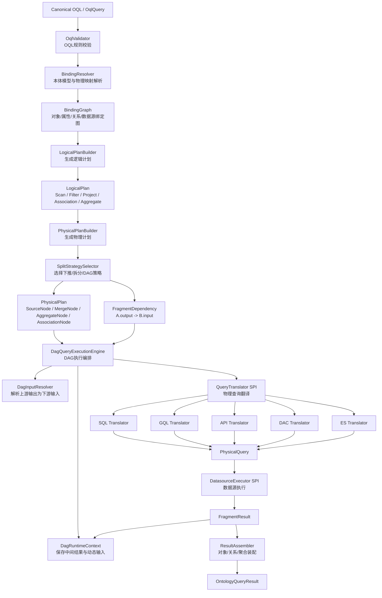
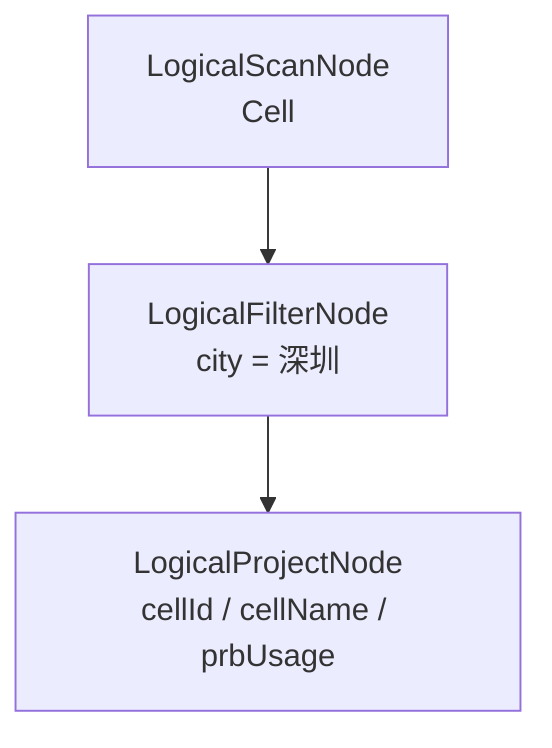
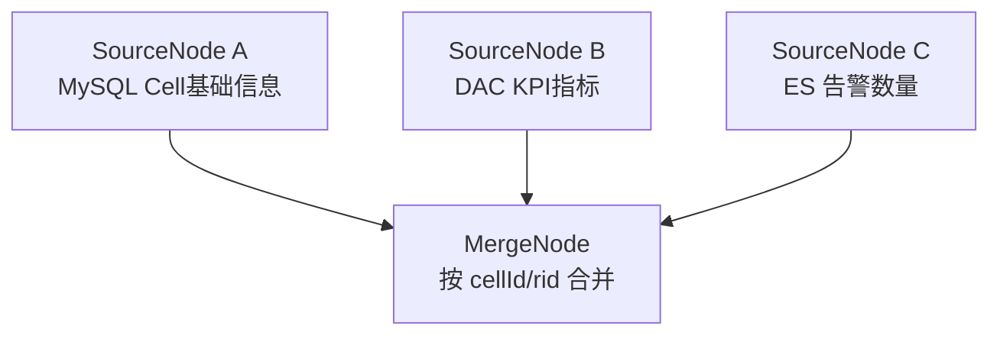
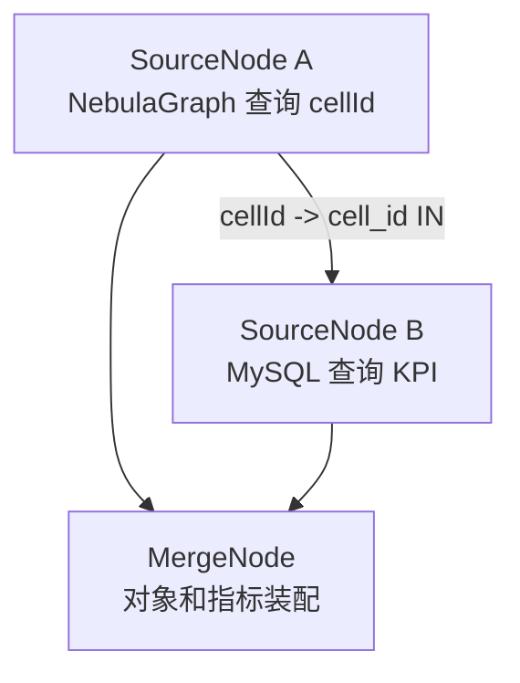
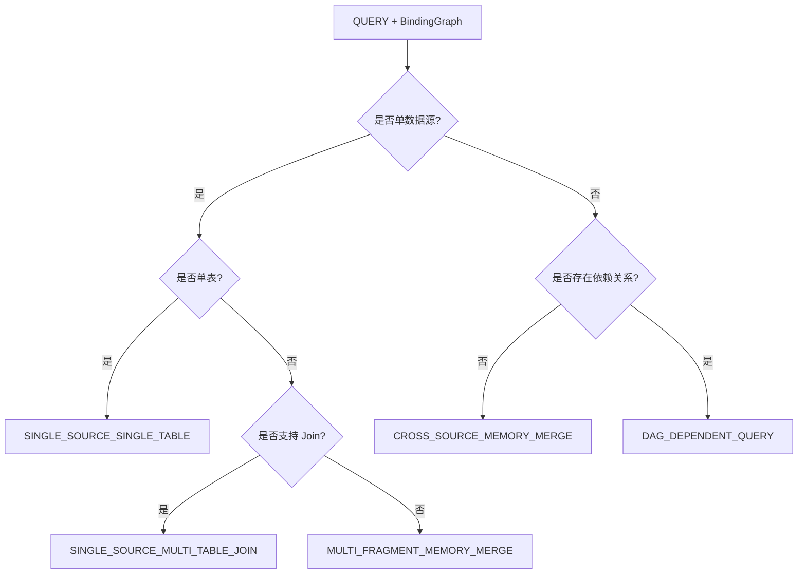
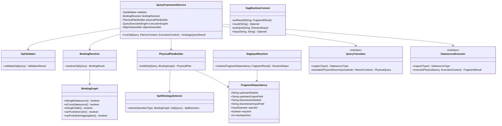

# OAC 本体实例查询转换框架设计方案

## 1. 设计背景

OAC（Ontology Access Service）面向 Agent、Skill、大模型和上层业务系统，提供统一的本体实例查询能力。调用方通过 canonical OQL 描述本体对象、属性、关系、过滤条件、聚合指标和返回字段，OAC 根据本体模型、属性映射、关系映射和数据源能力，将 OQL 转换为面向 SQL、GQL、API、DAC、ES 等物理数据源的查询请求，并完成执行与结果装配。

在实际业务场景中，OAC 不仅要支持简单单源查询，还要支持：

1. 单对象、多对象、多属性查询；
2. 单数据源单表查询；
3. 单数据源多表 Join 查询；
4. 多 schema、多 database 查询；
5. 跨 MySQL、GaussDB、NebulaGraph、API、DAC、ES 等多源组合查询；
6. 对象关系子图查询；
7. 聚合查询；
8. 多阶段依赖型 DAG 查询，即前一步查询结果作为后一步查询条件。

典型 DAG 场景如下：

```text
Step A：通过 NebulaGraph 查询用户关联的小区 ID 列表；
Step B：将 A 查询出的 cellId 列表作为 MySQL 的 WHERE cell_id IN (...) 条件；
Step C：查询 KPI 明细并装配成本体结果。
```

因此，本框架的核心目标不是实现一个简单的 OQL-to-SQL 转换器，而是构建一套面向多源、多模、多阶段、多策略的本体语义查询规划与执行框架。

---

## 2. 设计目标

本框架围绕以下目标设计：

1. **本体语义与物理数据源解耦**：OQL 只表达对象、属性、关系、条件、聚合等本体语义，不直接感知物理表、字段、图边、API 参数或 ES index。
2. **逻辑计划与物理计划解耦**：OQL 先转换为统一 LogicalPlan，再根据 BindingGraph 和 DatasourceCapability 转换为 PhysicalPlan。
3. **支持多源、多模、多阶段查询**：同时支持 SQL、GQL、API、DAC、ES 等数据源，并支持一次查询、跨源并行查询、多阶段 DAG 依赖查询。
4. **支持 A → B 依赖型查询**：上游 fragment 的输出可以作为下游 fragment 的输入条件，例如 `A.rows[*].cellId -> B.where.cell_id IN (...)`。
5. **面向接口编程**：数据源翻译和执行通过 SPI 扩展，新增数据源不修改主流程。
6. **满足工程质量要求**：代码结构清晰、高内聚低耦合，具备良好的可测试性、可靠性、安全性和可维护性。
7. **可演进**：支持 QueryExplain、DAG 并发执行、函数下推、内存聚合、限流熔断、链路追踪等后续能力。

---

## 3. 总体架构

整体架构采用分层流水线：

```text
OQL
  -> Validator
  -> BindingResolver
  -> BindingGraph
  -> LogicalPlan
  -> PhysicalPlan
  -> DAG Execution
  -> Translator SPI
  -> Executor SPI
  -> ResultAssembler
  -> OntologyQueryResult
```

总体架构图如下：



---

## 4. 核心处理流程

### 4.1 OQL 接收与校验

OAC 接收 canonical OQL 后，首先由 `OqlValidator` 进行结构和规则校验。校验内容包括：

1. operation 是否合法；
2. QUERY 是否禁止 relationships、aggregateFilter；
3. AGGREGATE 是否只允许 GROUP_BY 和 METRIC；
4. ASSOCIATION_QUERY 是否必须包含 relationships；
5. alias 引用是否闭包；
6. conditions 操作符是否合法；
7. returns 字段是否合法；
8. aggregateFilter 是否只引用聚合指标 alias；
9. FUNCTION 使用位置是否合法；
10. maxResults、IN 列表、DAG 输入规模是否超过系统保护阈值。

### 4.2 本体绑定与 BindingGraph 构建

`BindingResolver` 根据 OQL 中的对象、属性和关系，从本体元数据和映射元数据中解析物理绑定。

示例：

```text
Cell.cellId     -> MySQL.dim_cell.cell_id
Cell.cellName   -> MySQL.dim_cell.cell_name
Cell.prbUsage   -> DAC.prb_usage
Cell.alarmCount -> ES.alarm_index.alarm_count
User.locatedIn  -> NebulaGraph Edge locatedIn
```

BindingGraph 用于表达：

```text
本体对象
  -> 本体属性
  -> 关系
  -> 物理数据源
  -> 数据库/schema/table/field/index/API/DAC metric
```

BindingGraph 同时提供能力判断：

```java
boolean isSingleDatasource();
boolean isCrossDatasource();
boolean isSingleTable();
boolean requiresJoin();
boolean requiresMemoryMerge();
boolean canPushdownJoin();
boolean canPushdownAggregation();
boolean canPushdownHaving();
```

---

## 5. 逻辑计划设计

LogicalPlan 表达本体语义层的查询结构，只描述“查什么”，不描述“怎么查物理数据源”。

| 节点 | 职责 |
|---|---|
| `LogicalScanNode` | 扫描本体对象 |
| `LogicalFilterNode` | 表达条件过滤 |
| `LogicalProjectNode` | 表达返回字段 |
| `LogicalAssociationNode` | 表达对象关系查询 |
| `LogicalAggregateNode` | 表达聚合查询 |
| `LogicalOrderNode` | 表达排序 |
| `LogicalLimitNode` | 表达分页限制 |

逻辑计划示意：



---

## 6. 物理计划设计

PhysicalPlan 表达物理执行层的查询计划，描述“如何查”。

| 节点 | 职责 |
|---|---|
| `PhysicalSourceQueryNode` | 一次面向具体数据源的查询 |
| `PhysicalMergeJoinNode` | 跨源结果合并 |
| `PhysicalAssociationAssembleNode` | 对象关系结果组装 |
| `PhysicalMemoryAggregateNode` | OAC 内存聚合 |
| `FragmentDependency` | Fragment 之间的运行时依赖关系 |

物理计划是 DAG，而不是简单链表。

跨源并行查询：



依赖型 DAG 查询：



---

## 7. SplitStrategy 策略选择

`SplitStrategySelector` 根据 operation、BindingGraph 和 DatasourceCapability 选择执行策略。

| Operation | 场景 | 策略 |
|---|---|---|
| QUERY | 单源单表 | `SINGLE_SOURCE_SINGLE_TABLE` |
| QUERY | 单源多表且支持 Join | `SINGLE_SOURCE_MULTI_TABLE_JOIN` |
| QUERY | 跨源无依赖 | `CROSS_SOURCE_MEMORY_MERGE` |
| QUERY | 跨源且前后依赖 | `DAG_DEPENDENT_QUERY` |
| ASSOCIATION_QUERY | 图数据库原生边 | `ASSOCIATION_GRAPH_PUSHDOWN` |
| ASSOCIATION_QUERY | SQL 关系表 | `ASSOCIATION_RELATIONAL_JOIN` |
| ASSOCIATION_QUERY | 跨源关系或依赖查询 | `ASSOCIATION_MULTI_STAGE_ASSEMBLE` |
| AGGREGATE | 同源且支持 groupBy/having | `AGGREGATE_PUSHDOWN` |
| AGGREGATE | 多源可局部聚合 | `AGGREGATE_PARTIAL_PUSHDOWN_MERGE` |
| AGGREGATE | 无法下推 | `AGGREGATE_MEMORY` |
| AGGREGATE | 聚合对象集合依赖前序查询 | `DAG_DEPENDENT_AGGREGATE` |

策略选择示意：



---


### 7.4 SplitStrategy 转换样例

本节给出各类 `SplitStrategy` 的典型转换样例。每个样例均包含三部分：

1. **OQL 语句**：调用方输入的 canonical OQL；
2. **数据源绑定信息**：本体对象、属性、关系到物理数据源的映射；
3. **最终物理查询**：OAC 根据逻辑计划、物理计划和策略选择生成的 SQL、GQL、API、DAC、ES 请求或多阶段查询计划。

> 说明：以下 SQL 均采用参数化表达，示例中的 `?` 表示绑定参数，避免直接拼接用户输入。

---

#### 7.4.1 `SINGLE_SOURCE_SINGLE_TABLE`：单数据源单表下推

**适用场景**：查询对象的所有返回字段和过滤字段都来自同一个数据源、同一个物理表，且数据源支持投影、过滤、排序和分页下推。

**OQL 示例**

```json
{
  "operation": "QUERY",
  "schemaRef": "telecom-kpi",
  "objects": [
    {"objectType": "Cell", "alias": "c"}
  ],
  "conditions": {
    "kind": "PREDICATE",
    "ref": "c",
    "field": "city",
    "operator": "EQ",
    "values": ["深圳"]
  },
  "returns": [
    {"kind": "FIELDS", "ref": "c", "fields": ["cellId", "cellName", "city"]}
  ],
  "orders": [
    {"ref": "c", "field": "cellId", "direction": "ASC"}
  ],
  "maxResults": {"limit": 100, "offset": 0}
}
```

**数据源绑定信息**

| 本体字段 | 数据源 | 数据库/Schema/表 | 物理字段 |
|---|---|---|---|
| `Cell.cellId` | `mysql_1` | `oac.public.dim_cell` | `cell_id` |
| `Cell.cellName` | `mysql_1` | `oac.public.dim_cell` | `cell_name` |
| `Cell.city` | `mysql_1` | `oac.public.dim_cell` | `city` |

**生成物理查询**

```sql
SELECT cell_id AS cellId,
       cell_name AS cellName,
       city AS city
FROM dim_cell
WHERE city = ?
ORDER BY cell_id ASC
LIMIT ? OFFSET ?
```

**参数**

```json
["深圳", 100, 0]
```

**执行计划**

```text
PhysicalSourceQueryNode(mysql_1)
  -> SqlPhysicalQuery
  -> SqlExecutor
  -> ObjectAssembler
```

---

#### 7.4.2 `SINGLE_SOURCE_MULTI_TABLE_JOIN`：单数据源多表 Join 下推

**适用场景**：对象属性来自同一个 SQL 数据源的多个表，并且数据源支持 Join，Join Key 可由 `PropertyBinding` 或 `RelationshipBinding` 推导。

**OQL 示例**

```json
{
  "operation": "QUERY",
  "schemaRef": "telecom-kpi",
  "objects": [
    {"objectType": "Cell", "alias": "c"}
  ],
  "conditions": {
    "kind": "PREDICATE",
    "ref": "c",
    "field": "city",
    "operator": "EQ",
    "values": ["深圳"]
  },
  "returns": [
    {"kind": "FIELDS", "ref": "c", "fields": ["cellId", "cellName", "prbUsage"]}
  ],
  "maxResults": {"limit": 100}
}
```

**数据源绑定信息**

| 本体字段 | 数据源 | 表 | 物理字段 | 说明 |
|---|---|---|---|---|
| `Cell.cellId` | `mysql_1` | `dim_cell` | `cell_id` | 主键/Join Key |
| `Cell.cellName` | `mysql_1` | `dim_cell` | `cell_name` | 维度属性 |
| `Cell.city` | `mysql_1` | `dim_cell` | `city` | 过滤字段 |
| `Cell.prbUsage` | `mysql_1` | `sdr_cell_kpi` | `prb_usage` | 指标字段 |

**Join 规则**

```text
dim_cell.cell_id = sdr_cell_kpi.cell_id
```

**生成物理查询**

```sql
SELECT c.cell_id AS cellId,
       c.cell_name AS cellName,
       k.prb_usage AS prbUsage
FROM dim_cell c
LEFT JOIN sdr_cell_kpi k
       ON c.cell_id = k.cell_id
WHERE c.city = ?
LIMIT ?
```

**参数**

```json
["深圳", 100]
```

**执行计划**

```text
PhysicalSourceQueryNode(mysql_1, joinPushdown=true)
  -> SqlPhysicalQuery(join)
  -> SqlExecutor
  -> ObjectAssembler
```

---

#### 7.4.3 `CROSS_SOURCE_MEMORY_MERGE`：跨数据源查询后内存合并

**适用场景**：同一个本体对象的属性来自多个不同数据源，底层无法直接 Join，需要 OAC 分别查询后按 `rid` 或主键合并。

**OQL 示例**

```json
{
  "operation": "QUERY",
  "schemaRef": "telecom-kpi",
  "objects": [
    {"objectType": "Cell", "alias": "c"}
  ],
  "conditions": {
    "kind": "PREDICATE",
    "ref": "c",
    "field": "city",
    "operator": "EQ",
    "values": ["深圳"]
  },
  "returns": [
    {"kind": "FIELDS", "ref": "c", "fields": ["cellId", "cellName", "prbUsage", "alarmCount"]}
  ]
}
```

**数据源绑定信息**

| 本体字段 | 数据源 | 物理位置 |
|---|---|---|
| `Cell.cellId` | `mysql_1` | `dim_cell.cell_id` |
| `Cell.cellName` | `mysql_1` | `dim_cell.cell_name` |
| `Cell.city` | `mysql_1` | `dim_cell.city` |
| `Cell.prbUsage` | `dac_1` | `metric=prb_usage` |
| `Cell.alarmCount` | `es_1` | `index=alarm_index, field=alarm_count` |

**生成物理查询一：MySQL**

```sql
SELECT cell_id AS cellId,
       cell_name AS cellName
FROM dim_cell
WHERE city = ?
```

**参数**

```json
["深圳"]
```

**生成物理查询二：DAC**

```json
{
  "requestType": "QUERY",
  "dimensions": ["cell_id"],
  "metrics": ["prb_usage"],
  "filters": [
    {"field": "city", "operator": "EQ", "values": ["深圳"]}
  ]
}
```

**生成物理查询三：ES**

```json
{
  "index": "alarm_index",
  "query": {
    "term": {"city": "深圳"}
  },
  "aggs": {
    "alarmCountByCell": {
      "terms": {"field": "cell_id"}
    }
  }
}
```

**OAC 合并规则**

```text
rid = Cell:{cellId}
MySQL.cellId = DAC.cell_id = ES.cell_id
合并策略 = FIRST_NON_NULL
```

**执行计划**

```text
PhysicalSourceQueryNode(mysql_1)
PhysicalSourceQueryNode(dac_1)
PhysicalSourceQueryNode(es_1)
  -> PhysicalMergeJoinNode(joinKey=cellId)
  -> ObjectAssembler
```

---

#### 7.4.4 `ASSOCIATION_GRAPH_PUSHDOWN`：图数据库关系查询下推

**适用场景**：对象关系存储为图数据库原生边，且数据源支持图遍历，可直接生成 GQL / nGQL / Gremlin 等图查询。

**OQL 示例**

```json
{
  "operation": "ASSOCIATION_QUERY",
  "schemaRef": "telecom-relation",
  "objects": [
    {"objectType": "User", "alias": "u"},
    {"objectType": "Grid", "alias": "g"},
    {"objectType": "Cell", "alias": "c"}
  ],
  "relationships": [
    {"relationshipType": "locatedIn", "alias": "r1", "from": "u", "to": "g", "direction": "OUTBOUND", "mode": "ONE"},
    {"relationshipType": "contains", "alias": "r2", "from": "g", "to": "c", "direction": "OUTBOUND", "mode": "LIST"}
  ],
  "conditions": {
    "kind": "PREDICATE",
    "ref": "u",
    "field": "userId",
    "operator": "EQ",
    "values": ["user_001"]
  },
  "returns": [
    {"kind": "FIELDS", "ref": "c", "fields": ["cellId", "cellName"]}
  ]
}
```

**数据源绑定信息**

| 本体元素 | 数据源 | 图空间/Tag/Edge |
|---|---|---|
| `User` | `nebula_1` | `space=telecom, tag=User` |
| `Grid` | `nebula_1` | `space=telecom, tag=Grid` |
| `Cell` | `nebula_1` | `space=telecom, tag=Cell` |
| `locatedIn` | `nebula_1` | `edge=locatedIn` |
| `contains` | `nebula_1` | `edge=contains` |

**生成物理查询：nGQL 示例**

```ngql
MATCH (u:User {userId: $userId})-[:locatedIn]->(g:Grid)-[:contains]->(c:Cell)
RETURN c.cellId AS cellId,
       c.cellName AS cellName
```

**参数**

```json
{"userId": "user_001"}
```

**执行计划**

```text
PhysicalSourceQueryNode(nebula_1, graphTraversal=true)
  -> GqlPhysicalQuery
  -> GqlExecutor
  -> RelationRows + ObjectAssembler
```

---

#### 7.4.5 `ASSOCIATION_RELATIONAL_JOIN`：关系表 Join 下推

**适用场景**：对象关系不在图数据库中，而是通过关系表存储，且源对象表、关系表、目标对象表位于同一个 SQL 数据源。

**OQL 示例**

```json
{
  "operation": "ASSOCIATION_QUERY",
  "schemaRef": "telecom-relation",
  "objects": [
    {"objectType": "Cell", "alias": "c"},
    {"objectType": "Grid", "alias": "g"}
  ],
  "relationships": [
    {"relationshipType": "belongsToGrid", "alias": "r", "from": "c", "to": "g", "direction": "OUTBOUND", "mode": "ONE"}
  ],
  "conditions": {
    "kind": "PREDICATE",
    "ref": "c",
    "field": "cellId",
    "operator": "EQ",
    "values": ["cell_001"]
  },
  "returns": [
    {"kind": "FIELDS", "ref": "g", "fields": ["gridId", "gridName"]}
  ]
}
```

**数据源绑定信息**

| 本体元素 | 数据源 | 物理表/字段 |
|---|---|---|
| `Cell.cellId` | `mysql_1` | `dim_cell.cell_id` |
| `Grid.gridId` | `mysql_1` | `dim_grid.grid_id` |
| `Grid.gridName` | `mysql_1` | `dim_grid.grid_name` |
| `belongsToGrid` | `mysql_1` | `rel_cell_grid(cell_id, grid_id)` |

**生成物理查询**

```sql
SELECT g.grid_id AS gridId,
       g.grid_name AS gridName,
       r.cell_id AS sourceRid,
       r.grid_id AS targetRid
FROM dim_cell c
JOIN rel_cell_grid r
  ON c.cell_id = r.cell_id
JOIN dim_grid g
  ON r.grid_id = g.grid_id
WHERE c.cell_id = ?
```

**参数**

```json
["cell_001"]
```

**执行计划**

```text
PhysicalSourceQueryNode(mysql_1, relationalJoin=true)
  -> SqlPhysicalQuery(join)
  -> SqlExecutor
  -> RelationRows + ObjectAssembler
```

---

#### 7.4.6 `ASSOCIATION_MULTI_STAGE_ASSEMBLE`：跨源关系多阶段组装

**适用场景**：关系路径跨越多个数据源，或其中某段关系只能通过 API/DAC/ES 查询，无法一次下推到同一个物理引擎。

**OQL 示例**

```json
{
  "operation": "ASSOCIATION_QUERY",
  "schemaRef": "telecom-relation",
  "objects": [
    {"objectType": "User", "alias": "u"},
    {"objectType": "Grid", "alias": "g"},
    {"objectType": "Cell", "alias": "c"}
  ],
  "relationships": [
    {"relationshipType": "locatedInGrid", "alias": "r1", "from": "u", "to": "g", "direction": "OUTBOUND", "mode": "ONE"},
    {"relationshipType": "gridContainsCell", "alias": "r2", "from": "g", "to": "c", "direction": "OUTBOUND", "mode": "LIST"}
  ],
  "conditions": {
    "kind": "PREDICATE",
    "ref": "u",
    "field": "userId",
    "operator": "EQ",
    "values": ["user_001"]
  },
  "returns": [
    {"kind": "FIELDS", "ref": "c", "fields": ["cellId", "cellName"]}
  ]
}
```

**数据源绑定信息**

| 本体元素 | 数据源 | 物理位置 |
|---|---|---|
| `User.userId` | `mysql_1` | `dim_user.user_id` |
| `locatedInGrid` | `mysql_1` | `dim_user.grid_id` |
| `Grid.gridId` | `mysql_1` | `dim_grid.grid_id` |
| `gridContainsCell` | `api_1` | `GET /grid/{gridId}/cells` |
| `Cell.cellId` | `api_1` | `cellId` |
| `Cell.cellName` | `api_1` | `cellName` |

**生成物理查询一：MySQL 查询用户所在栅格**

```sql
SELECT user_id AS userId,
       grid_id AS gridId
FROM dim_user
WHERE user_id = ?
```

**参数**

```json
["user_001"]
```

**生成物理查询二：API 查询栅格下小区**

```http
GET /grid/{gridId}/cells
```

**动态输入**

```text
Fragment-1.gridId -> Fragment-2.path.gridId
```

**执行计划**

```text
PhysicalSourceQueryNode(mysql_1)
  -> FragmentResult(gridId)
  -> DagInputResolver
  -> PhysicalSourceQueryNode(api_1, path.gridId = 上游 gridId)
  -> PhysicalAssociationAssembleNode
  -> RelationRows + ObjectAssembler
```

---

#### 7.4.7 `AGGREGATE_PUSHDOWN`：聚合完全下推

**适用场景**：分组字段、指标字段、过滤字段都来自同一个支持 `GROUP BY` 和 `HAVING` 的 SQL / DAC / ES 数据源。

**OQL 示例**

```json
{
  "operation": "AGGREGATE",
  "schemaRef": "telecom-kpi",
  "objects": [
    {"objectType": "CellKpi", "alias": "k"}
  ],
  "conditions": {
    "kind": "PREDICATE",
    "ref": "k",
    "field": "collectTime",
    "operator": "GTE",
    "values": ["2026-06-01 00:00:00"]
  },
  "returns": [
    {"kind": "GROUP_BY", "ref": "k", "field": "city", "alias": "city"},
    {"kind": "METRIC", "ref": "k", "field": "prbUsage", "function": "AVG", "alias": "avgPrbUsage"}
  ],
  "aggregateFilter": {
    "kind": "METRIC_PREDICATE",
    "metricAlias": "avgPrbUsage",
    "operator": "GT",
    "values": [80]
  },
  "orders": [
    {"field": "avgPrbUsage", "direction": "DESC"}
  ],
  "maxResults": {"limit": 20}
}
```

**数据源绑定信息**

| 本体字段 | 数据源 | 表 | 物理字段 |
|---|---|---|---|
| `CellKpi.city` | `mysql_1` | `sdr_cell_kpi` | `city` |
| `CellKpi.collectTime` | `mysql_1` | `sdr_cell_kpi` | `collect_time` |
| `CellKpi.prbUsage` | `mysql_1` | `sdr_cell_kpi` | `prb_usage` |

**生成物理查询**

```sql
SELECT city AS city,
       AVG(prb_usage) AS avgPrbUsage
FROM sdr_cell_kpi
WHERE collect_time >= ?
GROUP BY city
HAVING AVG(prb_usage) > ?
ORDER BY avgPrbUsage DESC
LIMIT ?
```

**参数**

```json
["2026-06-01 00:00:00", 80, 20]
```

**执行计划**

```text
PhysicalSourceQueryNode(mysql_1, aggregatePushdown=true)
  -> SqlPhysicalQuery(groupBy/having)
  -> SqlExecutor
  -> MetricRows
```

---

#### 7.4.8 `AGGREGATE_PARTIAL_PUSHDOWN_MERGE`：局部聚合下推 + OAC 二次合并

**适用场景**：聚合数据分布在多个库、多个分区或多个数据源中，各数据源支持局部聚合，但最终聚合结果需要由 OAC 合并。

**OQL 示例**

```json
{
  "operation": "AGGREGATE",
  "schemaRef": "telecom-kpi",
  "objects": [
    {"objectType": "CellKpi", "alias": "k"}
  ],
  "returns": [
    {"kind": "GROUP_BY", "ref": "k", "field": "city", "alias": "city"},
    {"kind": "METRIC", "ref": "k", "field": "prbUsage", "function": "AVG", "alias": "avgPrbUsage"}
  ]
}
```

**数据源绑定信息**

| 本体字段 | 数据源 | 物理表 |
|---|---|---|
| `CellKpi.city` | `mysql_202605` | `sdr_cell_kpi_202605` |
| `CellKpi.prbUsage` | `mysql_202605` | `sdr_cell_kpi_202605` |
| `CellKpi.city` | `mysql_202606` | `sdr_cell_kpi_202606` |
| `CellKpi.prbUsage` | `mysql_202606` | `sdr_cell_kpi_202606` |

**生成物理查询一：202605 分区**

```sql
SELECT city AS city,
       SUM(prb_usage) AS sum_prbUsage,
       COUNT(prb_usage) AS count_prbUsage
FROM sdr_cell_kpi_202605
GROUP BY city
```

**生成物理查询二：202606 分区**

```sql
SELECT city AS city,
       SUM(prb_usage) AS sum_prbUsage,
       COUNT(prb_usage) AS count_prbUsage
FROM sdr_cell_kpi_202606
GROUP BY city
```

**OAC 二次合并逻辑**

```text
totalSum(city) = sum(sum_prbUsage)
totalCount(city) = sum(count_prbUsage)
avgPrbUsage(city) = totalSum(city) / totalCount(city)
```

**执行计划**

```text
PhysicalSourceQueryNode(mysql_202605, partialAggregate=true)
PhysicalSourceQueryNode(mysql_202606, partialAggregate=true)
  -> PhysicalMemoryAggregateNode(groupKey=city, metric=AVG)
  -> AvgAccumulator(sum/count)
  -> MetricRows
```

---

#### 7.4.9 `AGGREGATE_MEMORY`：明细查询 + OAC 内存聚合

**适用场景**：数据源不支持聚合下推，或者分组字段和指标字段来自不同数据源，必须先查询明细，再由 OAC 聚合。

**OQL 示例**

```json
{
  "operation": "AGGREGATE",
  "schemaRef": "telecom-kpi",
  "objects": [
    {"objectType": "Cell", "alias": "c"}
  ],
  "returns": [
    {"kind": "GROUP_BY", "ref": "c", "field": "city", "alias": "city"},
    {"kind": "METRIC", "ref": "c", "field": "prbUsage", "function": "AVG", "alias": "avgPrbUsage"}
  ],
  "aggregateFilter": {
    "kind": "METRIC_PREDICATE",
    "metricAlias": "avgPrbUsage",
    "operator": "GT",
    "values": [80]
  }
}
```

**数据源绑定信息**

| 本体字段 | 数据源 | 物理位置 |
|---|---|---|
| `Cell.city` | `mysql_1` | `dim_cell.city` |
| `Cell.cellId` | `mysql_1` | `dim_cell.cell_id` |
| `Cell.prbUsage` | `api_1` | `GET /cell/{cellId}/kpi.prbUsage` |

**生成物理查询一：MySQL 查询城市和小区 ID**

```sql
SELECT cell_id AS cellId,
       city AS city
FROM dim_cell
```

**生成物理查询二：API 批量查询 KPI**

```http
POST /cell/kpi/batch
Content-Type: application/json

{
  "cellIds": ["cell_001", "cell_002", "cell_003"],
  "metrics": ["prbUsage"]
}
```

**OAC 内存聚合逻辑**

```text
1. 按 cellId 合并 city 与 prbUsage；
2. 按 city 分组；
3. 计算 AVG(prbUsage)；
4. 执行 aggregateFilter: avgPrbUsage > 80；
5. 输出 aggregations。
```

**执行计划**

```text
PhysicalSourceQueryNode(mysql_1)
PhysicalSourceQueryNode(api_1)
  -> PhysicalMergeJoinNode(joinKey=cellId)
  -> PhysicalMemoryAggregateNode(groupKey=city, metric=AVG)
  -> MetricRows
```

---

#### 7.4.10 `DAG_DEPENDENT_QUERY`：上游输出驱动下游查询

**适用场景**：B 查询需要依赖 A 的结果才能构造输入条件，典型为图数据库查询结果驱动 SQL / API / DAC / ES 查询。

**OQL 示例**

```json
{
  "operation": "ASSOCIATION_QUERY",
  "schemaRef": "telecom-kpi",
  "objects": [
    {"objectType": "User", "alias": "u"},
    {"objectType": "Cell", "alias": "c"},
    {"objectType": "CellKpi", "alias": "k"}
  ],
  "relationships": [
    {"relationshipType": "accessCell", "alias": "r", "from": "u", "to": "c", "direction": "OUTBOUND", "mode": "LIST"}
  ],
  "conditions": {
    "kind": "PREDICATE",
    "ref": "u",
    "field": "userId",
    "operator": "EQ",
    "values": ["user_001"]
  },
  "returns": [
    {"kind": "FIELDS", "ref": "c", "fields": ["cellId", "cellName"]},
    {"kind": "FIELDS", "ref": "k", "fields": ["prbUsage", "userCount"]}
  ]
}
```

**数据源绑定信息**

| 本体元素 | 数据源 | 物理位置 |
|---|---|---|
| `User` | `nebula_1` | `tag=User` |
| `Cell` | `nebula_1` | `tag=Cell` |
| `accessCell` | `nebula_1` | `edge=accessCell` |
| `CellKpi.cellId` | `mysql_1` | `sdr_cell_kpi.cell_id` |
| `CellKpi.prbUsage` | `mysql_1` | `sdr_cell_kpi.prb_usage` |
| `CellKpi.userCount` | `mysql_1` | `sdr_cell_kpi.user_count` |

**生成物理查询 A：NebulaGraph**

```ngql
MATCH (u:User {userId: $userId})-[:accessCell]->(c:Cell)
RETURN c.cellId AS cellId,
       c.cellName AS cellName
```

**参数**

```json
{"userId": "user_001"}
```

**FragmentDependency**

```json
{
  "upstreamNodeId": "A",
  "upstreamOutputField": "cellId",
  "downstreamNodeId": "B",
  "downstreamInputField": "cell_id",
  "operator": "IN",
  "required": true,
  "maxInputSize": 1000
}
```

**生成物理查询 B：MySQL**

```sql
SELECT cell_id AS cellId,
       prb_usage AS prbUsage,
       user_count AS userCount
FROM sdr_cell_kpi
WHERE cell_id IN (?, ?, ?)
```

**动态参数来源**

```text
A.rows[*].cellId -> B.cell_id IN (...)
```

**执行计划**

```text
PhysicalSourceQueryNode(A, nebula_1)
  -> FragmentResult(cellId)
  -> DagInputResolver(A.cellId -> B.cell_id IN)
  -> DagRuntimeContext
  -> PhysicalSourceQueryNode(B, mysql_1)
  -> PhysicalMergeJoinNode(joinKey=cellId)
  -> ObjectAssembler
```

---

#### 7.4.11 `DAG_DEPENDENT_AGGREGATE`：依赖型查询后的聚合

**适用场景**：先通过图查询或关系查询确定对象集合，再对这些对象在 SQL / DAC / ES 中进行聚合统计。

**OQL 示例**

```json
{
  "operation": "AGGREGATE",
  "schemaRef": "telecom-kpi",
  "objects": [
    {"objectType": "User", "alias": "u"},
    {"objectType": "CellKpi", "alias": "k"}
  ],
  "conditions": {
    "kind": "PREDICATE",
    "ref": "u",
    "field": "userId",
    "operator": "EQ",
    "values": ["user_001"]
  },
  "returns": [
    {"kind": "GROUP_BY", "ref": "k", "field": "city", "alias": "city"},
    {"kind": "METRIC", "ref": "k", "field": "prbUsage", "function": "AVG", "alias": "avgPrbUsage"}
  ],
  "aggregateFilter": {
    "kind": "METRIC_PREDICATE",
    "metricAlias": "avgPrbUsage",
    "operator": "GT",
    "values": [80]
  }
}
```

**数据源绑定信息**

| 本体元素 | 数据源 | 物理位置 |
|---|---|---|
| `User -> Cell` | `nebula_1` | `User-[:accessCell]->Cell` |
| `CellKpi.cellId` | `mysql_1` | `sdr_cell_kpi.cell_id` |
| `CellKpi.city` | `mysql_1` | `sdr_cell_kpi.city` |
| `CellKpi.prbUsage` | `mysql_1` | `sdr_cell_kpi.prb_usage` |

**生成物理查询 A：获取用户关联小区**

```ngql
MATCH (u:User {userId: $userId})-[:accessCell]->(c:Cell)
RETURN c.cellId AS cellId
```

**生成物理查询 B：对关联小区做聚合**

```sql
SELECT city AS city,
       AVG(prb_usage) AS avgPrbUsage
FROM sdr_cell_kpi
WHERE cell_id IN (?, ?, ?)
GROUP BY city
HAVING AVG(prb_usage) > ?
```

**动态参数来源**

```text
A.rows[*].cellId -> B.cell_id IN (...)
```

**执行计划**

```text
PhysicalSourceQueryNode(A, nebula_1)
  -> DagInputResolver(cellId)
  -> PhysicalSourceQueryNode(B, mysql_1, aggregatePushdown=true)
  -> MetricRows
```

## 8. DAG 依赖型多阶段查询设计

### 8.1 场景说明

在复杂本体查询中，经常存在前一步查询结果作为后一步查询输入条件的场景。

```text
A -> B
A.rows[*].cellId -> B.where.cell_id IN (...)
```

这种场景不同于普通跨源并行查询，因为 B 必须等待 A 执行完成，才能构造查询条件。

### 8.2 DAG 依赖查询架构


执行逻辑：

1. 执行 Fragment A；
2. 保存 A 的 FragmentResult；
3. 根据 FragmentDependency 提取 A 的输出字段；
4. 生成 B 的动态输入条件；
5. 将输入条件写入 DagRuntimeContext；
6. 执行 Fragment B；
7. 合并 A 和 B 的结果；
8. 装配成本体结果。

### 8.3 FragmentDependency 模型

```java
public record FragmentDependency(
        String upstreamNodeId,
        String upstreamOutputField,
        String downstreamNodeId,
        String downstreamInputField,
        InputOperator operator,
        boolean required,
        int maxInputSize
) {
    public enum InputOperator {
        EQ,
        IN
    }
}
```

字段说明：

| 字段 | 含义 |
|---|---|
| `upstreamNodeId` | 上游 fragment ID，例如 A |
| `upstreamOutputField` | 上游输出字段，例如 `cellId` |
| `downstreamNodeId` | 下游 fragment ID，例如 B |
| `downstreamInputField` | 下游输入字段，例如 `cell_id` |
| `operator` | 下游条件操作符，支持 `EQ` 和 `IN` |
| `required` | 上游无结果时是否跳过下游 |
| `maxInputSize` | 最大输入数量，避免 IN 过大 |

### 8.4 DagInputResolver

`DagInputResolver` 负责从上游 fragment 结果中抽取字段值，并转换为下游输入条件。

处理逻辑：

1. 遍历 upstreamResult.rows；
2. 提取 upstreamOutputField；
3. 去重；
4. 过滤 null；
5. 按 maxInputSize 截断；
6. 生成 ResolvedInput；
7. 写入 DagRuntimeContext。

### 8.5 DagRuntimeContext

`DagRuntimeContext` 保存 DAG 执行期间的中间结果和动态输入。

| 信息 | 示例 |
|---|---|
| Fragment 结果 | `A -> FragmentResult` |
| 下游动态输入 | `B.cell_id -> ["c1", "c2"]` |

### 8.6 空结果与大输入保护

当上游无结果时，下游执行行为由 `FragmentDependency.required` 控制。

| required | 行为 |
|---|---|
| `true` | 下游跳过执行，返回空结果 |
| `false` | 下游继续执行，但不注入该条件 |

当 A 输出大量 ID 时，需要通过 `maxInputSize`、`batchSize`、`maxBatchConcurrency` 控制输入规模，避免超长 IN 列表造成数据库压力或内存膨胀。

---

## 9. Translator / Executor SPI 设计

### 9.1 PhysicalQuery

所有物理查询都实现统一接口：

```java
public interface PhysicalQuery {
    String datasourceId();
    DatasourceType datasourceType();
}
```

具体实现：

| 类型 | 说明 |
|---|---|
| `SqlPhysicalQuery` | SQL 查询 |
| `GqlPhysicalQuery` | GQL 查询 |
| `ApiPhysicalQuery` | API 请求 |
| `DacPhysicalQuery` | DAC 请求 |
| `EsPhysicalQuery` | ES DSL 查询 |

### 9.2 QueryTranslator

`QueryTranslator` 负责将 `PhysicalSourceQueryNode` 翻译为具体数据源查询对象。

```java
public interface QueryTranslator<T extends PhysicalQuery> {
    DatasourceType supportType();
    boolean canTranslate(PhysicalSourceQueryNode fragment, PlannerContext context);
    T translate(PhysicalSourceQueryNode fragment, PlannerContext context);
}
```

### 9.3 DatasourceExecutor

`DatasourceExecutor` 负责执行物理查询。

```java
public interface DatasourceExecutor<T extends PhysicalQuery> {
    DatasourceType supportType();
    FragmentResult execute(T query, ExecutionContext context);
}
```

---

## 10. 结果装配设计

OAC 查询最终统一返回 `OntologyQueryResult`。

### 10.1 对象装配

`ObjectAssembler` 按 `rid` 合并不同数据源返回的对象属性。

默认冲突策略为 `FIRST_NON_NULL`，后续可扩展 `SOURCE_PRIORITY`、`LATEST_BY_TIME`、`ERROR_ON_CONFLICT`。

### 10.2 关系装配

`RelationRows` 将 fragment rows 中的关系字段转换为 `OntologyRelationshipInstance`。

### 10.3 聚合装配

`MetricRows` 收集聚合结果。对于跨源 AVG，不能使用 `avg(avg1, avg2)`，必须使用 `sum / count`，对应 `AvgAccumulator`。

---

## 11. 简洁性与高效性设计

### 11.1 高内聚低耦合

框架按职责拆分为 Validator、BindingResolver、Planner、Strategy、Translator、Executor、Assembler、DAG Runtime。每个类只关注一个变化点，避免在 Service 层堆积复杂逻辑。

### 11.2 命名规范

命名遵循“领域语义 + 角色职责”原则：

| 命名 | 含义 |
|---|---|
| `OqlValidator` | OQL 校验器 |
| `BindingResolver` | 本体到物理绑定解析器 |
| `SplitStrategySelector` | 执行策略选择器 |
| `PhysicalPlanBuilder` | 物理计划构建器 |
| `DagInputResolver` | DAG 输入解析器 |
| `QueryTranslator` | 查询翻译 SPI |
| `DatasourceExecutor` | 数据源执行 SPI |

### 11.3 抽象合理

抽象层级只围绕稳定变化点展开：

1. OQL 语义模型；
2. 本体绑定模型；
3. 逻辑计划；
4. 物理计划；
5. 数据源翻译 SPI；
6. 数据源执行 SPI；
7. 结果装配。

避免过早引入复杂优化器或重型框架，先以轻量可演进架构支撑多源查询。

### 11.4 无冗余设计

公共能力通过统一 SPI 和 registry 复用，不为每种数据源复制一套主流程。新增数据源时只新增 translator/executor，不新增 service 分支。

### 11.5 资源合理使用

1. DAG 执行限制并发度；
2. IN 列表限制 `maxInputSize`；
3. 大输入支持分批查询；
4. FragmentResult 可按需流式化；
5. 元数据、capability、binding 支持缓存；
6. 外部连接通过连接池管理。

---

## 12. 可测试性与可维护性设计

### 12.1 函数功能单一

每个核心类只承担一个职责：

| 类 | 单一职责 |
|---|---|
| `OqlValidator` | OQL 规则校验 |
| `BindingResolver` | 本体绑定解析 |
| `SplitStrategySelector` | 策略选择 |
| `PhysicalPlanBuilder` | 物理计划生成 |
| `DagInputResolver` | 上游结果转下游输入 |
| `QueryExecutionEngine` | 执行编排 |
| `ObjectAssembler` | 对象装配 |

### 12.2 参数简单

各阶段输入输出均为稳定模型：

```text
OqlQuery -> BindingGraph -> LogicalPlan -> PhysicalPlan -> FragmentResult -> OntologyQueryResult
```

避免方法参数过多、Map 滥用和跨层传递复杂上下文。

### 12.3 圈复杂度控制

复杂策略通过 `SplitStrategySelector`、Assembler 和 SPI 分散，避免巨型 if-else。每个方法优先保持在短函数范围内，条件分支通过策略枚举表达。

### 12.4 日志与错误定位

错误对象包含：

```text
errorCode
message
path
operation
alias
objectType
field
datasourceId
fragmentId
translatorName
executorName
```

支持快速定位是 OQL 校验问题、本体映射问题、计划生成问题、翻译问题、执行问题还是装配问题。

### 12.5 测试策略

| 测试类型 | 覆盖内容 |
|---|---|
| Validator 单测 | operation、alias、conditions、returns、aggregateFilter |
| BindingResolver 单测 | 对象、属性、关系到物理绑定 |
| SplitStrategy 单测 | join 下推、跨源 merge、DAG 查询、聚合下推 |
| Translator 单测 | SQL/GQL/API/DAC/ES 查询对象生成 |
| Executor Mock 测试 | FragmentResult 返回和异常处理 |
| Assembler 单测 | 对象合并、关系装配、聚合装配 |
| DAG 单测 | A.output -> B.input IN 条件注入 |
| 集成测试 | QueryFrameworkService 端到端链路 |

---

## 13. 可靠性与韧性设计

### 13.1 场景覆盖

框架覆盖以下关键场景：

1. 单源单表查询；
2. 单源多表 Join；
3. 跨源并行查询；
4. 跨源结果合并；
5. 对象关系子图查询；
6. 聚合下推；
7. 聚合内存计算；
8. DAG 依赖型查询；
9. 上游空结果；
10. 大 IN 列表保护；
11. 数据源不支持能力降级；
12. 数据源执行失败隔离。

### 13.2 异常保护

统一异常分层：

| 错误类型 | 处理方式 |
|---|---|
| OQL 校验失败 | 直接返回结构化错误，不进入执行 |
| 本体绑定缺失 | 返回 binding error，不生成物理查询 |
| 数据源能力不足 | 策略降级或返回 capability error |
| Translator 失败 | 标记 fragment 翻译失败 |
| Executor 失败 | 标记数据源执行失败，支持局部失败策略 |
| Assembler 失败 | 返回装配错误并保留 fragment 信息 |

### 13.3 服务降级

1. 数据源不支持 Join 时降级为多次查询 + 内存合并；
2. 数据源不支持 having 时降级为 OAC 聚合后过滤；
3. 图数据库不支持复杂聚合时降级为明细查询 + OAC 聚合；
4. 上游 DAG 结果为空时按 required 策略跳过下游；
5. 部分非关键数据源失败时可返回基础对象并附带 warning。

### 13.4 快速恢复

1. 支持 fragment 级重试；
2. 支持数据源级超时；
3. 支持熔断和隔离；
4. 支持执行上下文 traceId；
5. 支持 QueryExplain 辅助定位问题；
6. 支持通过 registry 下线异常数据源插件。

### 13.5 内存与资源保护

1. 限制 maxResults；
2. 限制 maxInputSize；
3. 限制 DAG 最大节点数；
4. 限制 FragmentResult 最大行数；
5. 大结果支持分页或流式处理；
6. JDBC、HTTP、ES 客户端通过连接池管理；
7. try-with-resources 确保句柄释放；
8. Executor 不持有跨请求可变状态。

---

## 14. 安全性与隐私保护设计

### 14.1 输入校验

1. OQL schema 校验；
2. operation 白名单；
3. operator 白名单；
4. function 白名单；
5. alias 引用闭包；
6. 字段必须来自本体模型；
7. 物理字段必须来自绑定元数据；
8. SQL 表名、列名通过 `SqlName.safe()` 白名单校验；
9. IN 列表长度限制；
10. API path、ES index、DAC metric 不接受用户直接输入。

### 14.2 SQL 注入防护

1. 用户值只作为参数绑定；
2. 表名、字段名只来自可信元数据；
3. 物理标识符使用白名单正则校验；
4. 禁止将 OQL value 直接拼接到 SQL；
5. FUNCTION 必须通过 FunctionRegistry 注册后才能下推。

### 14.3 数据权限控制

1. QueryContext 携带 tenantId、userId、roles、scope；
2. BindingResolver 根据租户和权限过滤可访问对象、属性、关系；
3. Translator 自动注入租户过滤条件；
4. Executor 按数据源凭据和租户隔离执行；
5. 对敏感字段执行字段级授权。

### 14.4 敏感数据保护

1. 日志中不打印完整 OQL value；
2. 对手机号、用户 ID、账号、Token 等字段脱敏；
3. 错误信息不返回数据库连接串、密钥、内部 API 地址；
4. FragmentResult 调试输出受开关控制；
5. trace 日志只记录字段名、行数、耗时，不记录明文敏感值。

### 14.5 文件与配置权限

1. 数据源密钥通过配置中心或密钥管理服务读取；
2. 配置文件不存储明文密码；
3. 插件加载路径受控；
4. 查询导出文件设置最小权限；
5. 临时文件执行后清理。

### 14.6 可用性保护

1. 限流；
2. 超时；
3. 熔断；
4. DAG 节点数限制；
5. 查询复杂度评分；
6. 大结果分页；
7. 聚合扫描量保护；
8. API/DAC/ES 调用重试次数限制。

---

## 15. SOLID 原则体现

| 原则 | 设计体现 |
|---|---|
| SRP 单一职责 | Validator、Binding、Planner、Translator、Executor、Assembler 各自独立 |
| OCP 开闭原则 | 新增数据源只新增 SPI 实现，不改主流程 |
| LSP 里氏替换 | 所有 Translator / Executor 可通过接口替换 |
| ISP 接口隔离 | 元数据、绑定、能力、翻译、执行接口拆分 |
| DIP 依赖倒置 | 高层服务依赖抽象，不依赖具体数据源 SDK |

---

## 16. 关键设计模式

| 模式 | 落点 | 价值 |
|---|---|---|
| Pipeline | Validate -> Bind -> Plan -> Execute -> Assemble | 主流程清晰 |
| Strategy | SplitStrategySelector | 多场景策略选择 |
| SPI / Plugin | QueryTranslator / DatasourceExecutor | 数据源可扩展 |
| Registry | QueryExtensionRegistry | 插件查找和解耦 |
| Adapter | SQL/GQL/API/DAC/ES Translator | 屏蔽数据源差异 |
| Composite | PhysicalPlan DAG | 表达复杂查询组合 |
| Assembler | Object/Relation/Metric Assembler | 统一结果装配 |
| DAG Scheduler | DagQueryExecutionEngine | 支持依赖型多阶段查询 |
| Accumulator | AvgAccumulator | 正确处理跨源聚合 |

---

## 17. 核心类图



---

## 18. 后续演进方向

1. `DagQueryExecutionEngine` 支持完整拓扑排序执行；
2. `PhysicalPlan.dependencies` 显式保存依赖边；
3. `DynamicInputAwareTranslator` 支持动态输入注入；
4. `BatchInputSplitter` 支持大 IN 列表分批；
5. `SqlExecutor`、`GqlExecutor`、`ApiExecutor`、`DacExecutor`、`EsExecutor`；
6. `QueryExplainService` 输出逻辑计划、物理计划和 DAG 依赖；
7. `FunctionRegistry` 支持函数下推和 OAC fallback；
8. `MemoryAggregateProcessor` 支持完整内存聚合；
9. `Metrics` 和 `TraceId` 支持执行链路可观测；
10. 租户级限流、熔断、超时和隔离控制。

---

## 19. 总结

OAC 本体实例查询转换框架通过统一的查询规划、物理计划和 DAG 执行机制，将本体语义查询与多模物理数据源访问解耦。

它能够支持：

```text
一次 OQL
  -> 多个本体对象
  -> 多个物理数据源
  -> 一次或多次查询
  -> 上下游依赖输入
  -> 对象/关系/聚合结果统一装配
```

该框架具备结构清晰、职责单一、面向接口、资源受控、异常保护完善、输入校验严格、数据权限可扩展等特点，既可以支撑当前 OAC 的多数据源查询需求，也可以作为后续 Agent 语义数据访问、统一对象查询中台、多模数据源编排执行引擎的长期演进基础。
