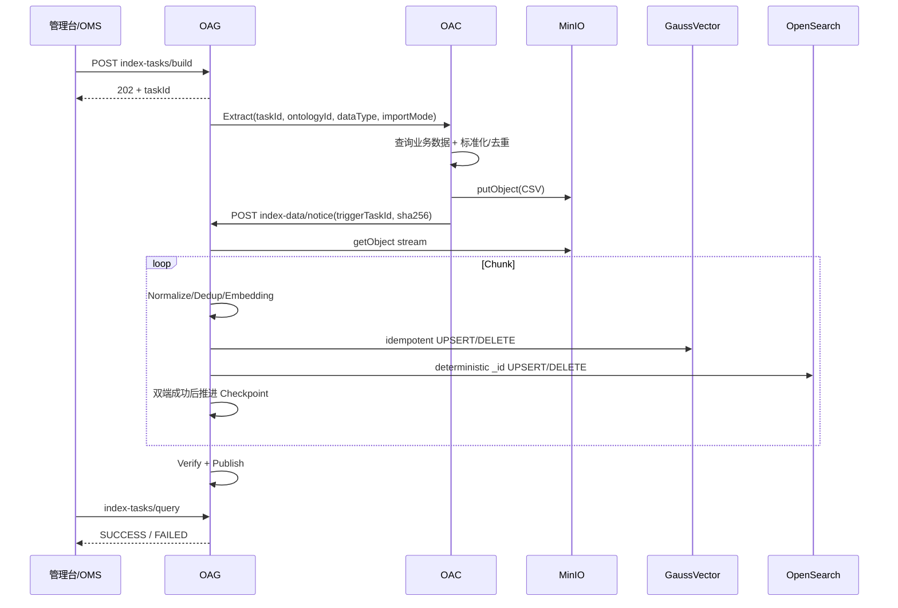

# OAG 本体子图检索 PR #42 检视意见优化方案

> 版本：V1.0  
> 日期：2026-08-23  
> 适用 PR：#42 `docs: 完善 OAG 本体子图检索完整方案`  
> 关联主方案：[OAG本体锚点语义检索与向量索引设计方案.md](./OAG本体锚点语义检索与向量索引设计方案.md)  
> 关联实体提取方案：[OAG语义子图检索接口extractedEntities结构设计方案.md](./OAG语义子图检索接口extractedEntities结构设计方案.md)

---

## 1. 文档定位

本文对 PR #42 当前检视意见进行统一设计收敛，重点解决以下 4 类问题：

1. **OAC 与业务服务两类数据接入模式如何统一**；
2. **Software / SEC 实例索引容量边界如何定义**；
3. **MinIO 文件校验使用 MD5 还是 SHA-256**；
4. **不新增 Chunk 持久化表时如何实现断点恢复**。

本文是主方案 V5.15 的 **V5.16 规范性增量设计**。对于索引构建、MinIO 文件交付、容量规格、文件校验、Chunk/Checkpoint 恢复等内容，如果本文与主方案 V5.15 存在冲突，**以本文为准**；主方案其他实体提取、Entity Linking、RRF、LLM 精排、子图策略、PathProbePlan、nGQL 和结果生成内容保持不变。

本轮检视不改变本体子图检索五阶段主流程：

```text
① 实体提取
  ↓
② 实体链接
  ↓
③ 子图检索策略 / PathProbePlan
  ↓
④ nGQL / 图算法入参生成
  ↓
⑤ 结果生成
```

优化范围集中在上述流程依赖的 **索引构建与运行数据准备链路**。

---

# 2. 检视意见与设计结论总表

| # | 检视意见 | 设计结论 |
|---:|---|---|
| 1 | 区分 OAC 可对接数据源与非 OAC 场景；增加配置项 | 增加 `indexBuild.instanceDataSourceMode=OAC\|BUSINESS_NOTICE`，配置“谁负责读取业务数据” |
| 2 | OAC 场景无论大小数据量都由 OAC 读取后传 MinIO | **确认**。取消 `OAC_QUERY` 直返路径，OAC 动态数据统一 `OAC → MinIO → notice → OAG` |
| 3 | Software 1W 用户、SEC 最大 100W | 作为当前正式源侧容量规格；同时监控实际去重 Value/索引记录数 |
| 4 | 是否可用 MD5，比较并选择最优算法 | 正式协议统一选择 **SHA-256**；MD5 仅可做辅助诊断，MinIO ETag 不能当作 MD5/SHA-256 |
| 5 | 首次入库性能基线按上述意见更新 | Software/SEC **对外协议不再分叉**，都走 MinIO；只在 OAG 内部选择 Lightweight/Recoverable Bulk Profile |
| 6 | 没有持久化 Chunk 表，如何记录恢复信息 | **不新增 Chunk 表**；复用 `T_OAG_INDEX_TASK.CHECKPOINT` 保存最后一个双端成功连续检查点，故障后整 Chunk 幂等重放 |

---

# 3. 数据接入方案收敛：只区分数据读取方，MinIO 交付协议唯一

## 3.1 核心设计

原方案中存在以下潜在分叉：

```text
小数据量 → OAC 分页/流式直接返回 OAG
大数据量 → OAC/业务服务写 MinIO → OAG 读取
```

本轮检视后取消该分叉。

**新的核心原则：**

> **动态 Enum Value / Instance Value 无论数据量大小，都通过 MinIO CSV 交付给 OAG。配置项只决定“谁负责读取业务数据”，不决定“是否使用 MinIO”。**

统一配置：

```yaml
indexBuild:
  instanceDataSourceMode: OAC   # OAC | BUSINESS_NOTICE
```

不再设计：

```text
OAC_QUERY
MINIO_NOTICE
AUTO
 directQueryMaxRows
```

其中 `AUTO` 不建议保留，是因为数据源责任属于部署/业务架构决策，不应在运行时根据一次任务的数据量动态切换责任方，否则会导致调用链、权限、故障定位和 SLA 不可预测。

## 3.2 模式一：OAC

适用于 OAC 能够访问实际业务数据源的部署。

```text
管理台 / OMS
  ↓ build
OAG
  ↓ 触发抽取（taskId / ontologyId / dataType / importMode）
OAC
  ↓ 访问业务数据源
读取数据 / 标准化 / 源侧去重
  ↓
生成不可变 CSV
  ↓
MinIO putObject
  ↓
OAC → OAG index-data/notice(triggerTaskId)
  ↓
OAG Streaming Read
  ↓
Normalize / Dedup / Embedding
  ↓
GaussVector + OpenSearch
  ↓
Verify / Publish
```

**无论 100 条、1 万条还是百万级数据，时序不变。** 小数据量只意味着：

```text
CSV 更小
Chunk 更少
Embedding Batch 更少
任务耗时更短
```

不能因此把协议切换成 OAC 直接返回记录给 OAG。

### OAC 模式时序



## 3.3 模式二：BUSINESS_NOTICE

适用于：

- OAC 无法访问目标业务数据源；
- 业务已经有 DataSync / CDC / 定时同步服务；
- 数据生产责任明确属于业务域服务。

```text
DataSync / 业务服务
  ↓ 读取业务数据
标准化 / 去重
  ↓
生成不可变 CSV
  ↓
MinIO putObject
  ↓
POST OAG index-data/notice
  ↓
OAG Streaming Read
  ↓
统一 Import Pipeline
```

OAG 在该模式下 **不主动调用 OAC**。

## 3.4 两种模式的共同边界

| 能力 | OAC | BUSINESS_NOTICE | OAG |
|---|---|---|---|
| 访问业务源 | ✔ | ✔（业务服务） | ✘ |
| 源侧基础去重 | ✔ | ✔ | 再次兜底去重 |
| 生成 CSV | ✔ | ✔ | ✘ |
| 上传 MinIO | ✔ | ✔ | ✘ |
| Embedding | ✘ | ✘ | ✔ |
| GaussVector 写入 | ✘ | ✘ | ✔ |
| OpenSearch 写入 | ✘ | ✘ | ✔ |
| Checkpoint/恢复 | ✘ | ✘ | ✔ |
| Verify/Publish | ✘ | ✘ | ✔ |

从 `index-data/notice` 之后两种模式完全复用同一套代码：

```text
MinIO Reader
→ Schema Validator
→ Ontology Mapping Validator
→ Normalizer
→ Deduplicator
→ Embedding
→ GaussVector Writer
→ OpenSearch Writer
→ Verify
→ Publish
```

---

# 4. 容量规格：Software 1W、SEC 100W

## 4.1 正式容量定义

本轮评审将当前产品规格收敛为：

| 业务档位 | 当前正式源侧用户规模 | 数据交付 | OAG 执行模式 |
|---|---:|---|---|
| Software | **≤ 10,000 用户（1W）** | MinIO CSV | `LIGHTWEIGHT_BULK` |
| SEC | **≤ 1,000,000 用户（100W）** | MinIO CSV | `RECOVERABLE_BULK` |
| > SEC 规格 | > 1,000,000 用户 | MinIO CSV | 专项容量与性能评估后开放 |

这里的 **1W / 100W 是业务用户规模，不是去重后 Instance Value 条数**。

例如：

```text
100 万用户
× 10 个 capability=DIMENSION Property
≠ 必然只有 100 万条索引记录
```

不同 Property 的基数不同，因此容量验收必须同时记录：

```text
sourceUsers
sourceRows
semanticProperties
uniqueValues
finalIndexRows
```

## 4.2 为什么用户规模和索引规模必须同时观测

假设 100 万用户存在：

```text
customerLevel → 4 个唯一值
province      → 31 个唯一值
brand         → 500 个唯一值
productName   → 20,000 个唯一值
```

源数据量可能为千万级，但最终向量值远小于源记录数。

反过来，如果多个 DIMENSION Property 都是高基数业务文本，最终索引记录也可能显著增大。因此：

> **用户规模用于产品规格约束，uniqueValues/finalIndexRows 用于存储、Embedding 和检索性能容量控制。**

## 4.3 OAG 内部执行 Profile

外部协议固定 MinIO，只在 OAG 内部根据任务规模选择执行 Profile。

### LIGHTWEIGHT_BULK

适用于 Software 和小文件：

```text
单文件或少量文件
较少 Chunk
Embedding Batch
GaussVector Bulk
OpenSearch Bulk
Checkpoint 仍启用
```

### RECOVERABLE_BULK

适用于 SEC 最大规格：

```text
Streaming CSV Parser
固定 Chunk
Embedding Worker Pool
Vector / Search 独立 Writer Queue
Backpressure
Checkpoint
失败重试
Verify / Publish
```

推荐初始参数仍保持配置化：

```yaml
embeddingBatchSize: 32~128
storageBulkSize: 500~2000
chunkRows: 10000~50000
```

这些值不是协议常量，最终由目标环境压测确定。

---

# 5. 文件完整性算法：MD5 vs SHA-256

## 5.1 使用场景

本方案的文件摘要不仅用于发现随机传输错误，还用于：

```text
1. index-data/notice 文件不可变校验
2. request/task 幂等判断
3. Chunk ID 稳定生成
4. OAG 重启后的断点恢复
5. 判断 objectKey 是否被覆盖成另一份内容
```

因此它本质上是 **恢复协议中的文件身份标识**。

## 5.2 对比

| 对比项 | MD5 | SHA-256 |
|---|---|---|
| 输出长度 | 128 bit / 32 hex | 256 bit / 64 hex |
| 随机错误检测 | 可以 | 可以 |
| 碰撞安全性 | 已存在实际可构造碰撞，不适合作为可信内容身份 | 当前工程场景下安全裕量高 |
| 流式计算 | 支持 | 支持 |
| CPU 开销 | 较低 | 略高 |
| 相对 OAG 总成本 | 很低 | 同样很低；通常远低于 MinIO IO / Embedding / 双写成本 |
| 适合恢复协议 | 不推荐作为权威身份 | **推荐** |

## 5.3 MinIO ETag 为什么不能替代

不能使用：

```text
ETag == MD5(file)
```

作为协议假设。

在 S3 / MinIO Multipart Upload、服务端实现差异等情况下，ETag 不保证等于完整对象的 MD5。因此：

```text
MinIO ETag
  ≠ 权威 MD5
  ≠ SHA-256
  ≠ OAG 文件身份
```

## 5.4 最终选择

> **正式协议统一使用 SHA-256。**

原因：

1. 校验结果需要参与恢复与不可变文件身份判断，而非只做偶发传输错误检测；
2. SHA-256 可流式计算，不需要把完整文件加载到内存；
3. 相比 Embedding、MinIO IO、GaussVector/OpenSearch 写入，其额外 CPU 开销通常不是端到端瓶颈；
4. 避免未来在任务幂等和恢复协议中再次迁移摘要算法。

正式 Schema 保持：

```yaml
sha256:
  type: string
  pattern: '^[A-Fa-f0-9]{64}$'
```

MD5 如业务已有，可作为生产者本地诊断信息，但：

```text
不进入 OAG 正式必选 Schema
不参与 task 幂等
不参与 Chunk ID
不替代 sha256
```

---

# 6. Checkpoint 持久化：不新增 Chunk 表

## 6.1 问题

原方案描述了每个 Chunk 的：

```text
gauss_status
opensearch_status
retry_count
row range
chunk_id
```

但当前没有 `T_OAG_INDEX_CHUNK` 持久化表。如果强行保存所有 Chunk 状态，需要新增一套表和生命周期管理，复杂度较高。

本轮设计不引入该表。

## 6.2 设计原则

> **只持久化“最后一个 GaussVector + OpenSearch 都成功的连续安全恢复点”，不持久化所有 Chunk 的执行历史。**

现有任务表已经有：

```text
T_OAG_INDEX_TASK.CHECKPOINT
```

将该字段定义为版本化 JSON，推荐数据库类型由：

```text
VARCHAR(1024)
```

扩展为：

```text
TEXT
```

这是已有表字段演进，不是新增持久化表。

## 6.3 Checkpoint 数据结构

```json
{
  "version": 1,
  "fileIndex": 0,
  "objectKey": "onto-retrieval/t1/ontology/INSTANCE_VALUE/task/part-00000.csv",
  "fileSha256": "7c222fb2927d828af22f592134e8932480637c0d4d7b31a7d7e6c80b7f5506ab",
  "fileSize": 183421234,
  "committedRowEnd": 49999,
  "lastChunkId": "c4b2...",
  "updatedAt": "2026-08-23T15:00:00+08:00"
}
```

字段语义：

| 字段 | 说明 |
|---|---|
| `version` | Checkpoint Schema 版本，便于后续演进 |
| `fileIndex` | 当前处理的 `FILE_LIST` 下标 |
| `objectKey` | 当前 MinIO 对象 |
| `fileSha256` | 当前对象权威 SHA-256 |
| `fileSize` | 文件大小，恢复时和 MinIO HEAD 对比 |
| `committedRowEnd` | 最后一个双端成功 Chunk 的最后一行 |
| `lastChunkId` | 最后一个成功 Chunk 的确定性 ID |
| `updatedAt` | 最近推进时间 |

`FILE_LIST` 本身是有序、不可变的任务输入快照，因此不需要在 Checkpoint 里重复保存全部文件。

## 6.4 Chunk ID

```text
chunkSource =
    objectKey
    + "\n"
    + fileSha256
    + "\n"
    + rowStart + ":" + rowEnd

chunkId = SHA-256(UTF-8(chunkSource))
```

只要：

```text
objectKey
fileSha256
row range
```

不变，重试时生成的 Chunk ID 就稳定。

## 6.5 Checkpoint 推进原则

```text
Chunk N
  ↓
GaussVector UPSERT 成功
  ↓
OpenSearch UPSERT 成功
  ↓
必要 Verify 成功
  ↓
UPDATE T_OAG_INDEX_TASK.CHECKPOINT = Chunk N
```

**只有双端都成功才推进。**

不需要持久化：

```text
chunkN.gauss_status
chunkN.opensearch_status
```

这些信息写日志和指标即可。

## 6.6 单端成功后进程崩溃怎么办

例如：

```text
Chunk 10
GaussVector → SUCCESS
OpenSearch  → 尚未执行
OAG         → Crash
```

此时 Checkpoint 仍然停在 Chunk 9。

重启后：

```text
从 Chunk 10 重新执行
  ├─ GaussVector：组合业务键幂等 UPSERT，覆盖原记录
  └─ OpenSearch：确定性 _id UPSERT，补齐记录
```

因此不需要知道“Chunk 10 的 GaussVector 曾经成功过”。

幂等键：

```text
Enum:
objectTypeId + propertyId + normalized(value)

Instance:
objectTypeId + propertyid + normalized(value)
```

OpenSearch `_id` 从相同业务键确定性生成。

## 6.7 恢复流程

```text
1. 从 T_OAG_INDEX_TASK 读取 FILE_LIST + CHECKPOINT
2. 使用 fileIndex 定位当前 objectKey
3. HEAD MinIO 校验 size
4. 流式重新计算 SHA-256
5. 若 objectKey / size / sha256 变化：
      → CHECKSUM_MISMATCH / FILE_CHANGED
      → 禁止续跑
6. nextRow = committedRowEnd + 1
7. 按固定 chunkRows 重新生成 row range + chunkId
8. 对当前 Chunk 双端幂等重放
9. 两端成功并 Verify 后，单次 DB UPDATE 原子推进 Checkpoint
10. 当前文件完成：fileIndex++
11. 全部文件完成：VERIFYING → PUBLISHING → FINISHED
```

## 6.8 多文件任务

```text
FILE_LIST = [part-00000, part-00001, part-00002]
```

如果 Checkpoint：

```json
{
  "fileIndex": 1,
  "committedRowEnd": 99999
}
```

则：

```text
part-00000 → 已完成
part-00001 → 从 100000 行继续
part-00002 → 未开始
```

不需要逐文件建立独立持久化记录。

## 6.9 与 FULL_REPLACE / INCREMENTAL 的关系

### FULL_REPLACE

```text
Old Active Generation
  ↓ 在线继续服务
New Staging Generation
  ↓ Chunk 导入 + Checkpoint
Verify
  ↓
Atomic Publish
```

失败恢复不会污染旧在线 Generation。

### INCREMENTAL

依赖幂等 UPSERT/DELETE；同一 Chunk 可安全重放。

---

# 7. 首次入库性能基线更新

检视后，原先：

```text
Software → OAC Query
SEC      → MinIO Bulk
```

收敛为：

```text
Software → MinIO + LIGHTWEIGHT_BULK
SEC      → MinIO + RECOVERABLE_BULK
```

外部链路一致：

```text
Producer(OAC/Business)
→ CSV
→ MinIO
→ notice
→ OAG
```

内部差异：

| 能力 | Software ≤1W | SEC ≤100W |
|---|---|---|
| Streaming | 支持 | 必须 |
| Chunk | 支持，可少量 | 必须 |
| Checkpoint | 启用 | 必须 |
| Worker Pool | 小规模 | 按压测配置 |
| Writer Backpressure | 支持 | 必须 |
| 双写幂等 | 必须 | 必须 |
| 故障恢复压测 | 基础 | 必须专项验证 |

性能验收指标：

```text
sourceUsers
sourceRows
uniqueValues
finalIndexRows
fileBytes
readRows/s
embedRows/s
gaussRows/s
opensearchRows/s
endToEndRows/s
P50/P95/P99 Chunk Latency
retryRate
checkpointReplayRows
heapPeak
directMemoryPeak
```

端到端分钟级 SLA 不在接口协议中写死，由最终 Embedding CPU/GPU 实例数、Batch、存储规格和网络环境压测确定。

---

# 8. 推荐配置

```yaml
oag:
  indexBuild:
    # 谁负责访问源业务数据；不决定是否使用 MinIO
    instanceDataSourceMode: OAC  # OAC | BUSINESS_NOTICE

    capacity:
      softwareMaxUsers: 10000
      secMaxUsers: 1000000

    fileIntegrity:
      algorithm: SHA-256
      trustMinioETagAsChecksum: false

    importProfile:
      software: LIGHTWEIGHT_BULK
      sec: RECOVERABLE_BULK

    chunk:
      rows: 20000

    checkpoint:
      store: T_OAG_INDEX_TASK.CHECKPOINT
      format: JSON
      version: 1
      persistOnlyAfterBothStoresCommitted: true
      replayIncompleteChunk: true

    embedding:
      batchSize: 64

    writer:
      bulkSize: 1000
      backpressureEnabled: true
```

上述数值属于起始值，容量与性能参数必须根据正式部署环境压测调整。

---

# 9. 错误码补充

| 错误码 | 含义 | 动作 |
|---|---|---|
| `CHECKSUM_MISMATCH` | 实际 SHA-256 与 notice 不一致 | 禁止继续，重新上传新 objectKey 并新建任务 |
| `FILE_CHANGED` | 恢复时文件 size/hash 与 Task 快照变化 | 禁止续跑 |
| `SOURCE_FILE_EXPIRED` | MinIO 文件超过硬 TTL | 重新上传并新建任务 |
| `MINIO_READ_FAILED` | 临时读取失败 | 原 Task Retry |
| `VECTOR_WRITE_FAILED` | Vector 临时写失败 | 从 Checkpoint 幂等重放 |
| `SEARCH_WRITE_FAILED` | OpenSearch 临时写失败 | 从 Checkpoint 幂等重放 |
| `VERIFY_FAILED` | 双端写后校验异常 | 按 Stage/Checkpoint 恢复 |
| `PUBLISH_FAILED` | Generation 发布失败 | 从 Publish 阶段恢复 |

业务侧自动化判断只能依赖稳定错误码和任务状态，不解析 `errorMessage` 自然语言。

---

# 10. 可观测性补充

索引构建新增/明确以下指标：

```text
oag_import_source_users
oag_import_source_rows
oag_import_unique_values
oag_import_final_index_rows
oag_import_file_bytes
oag_import_sha256_verify_duration
oag_import_chunk_total
oag_import_chunk_duration
oag_import_checkpoint_advance_total
oag_import_checkpoint_replay_rows
oag_import_vector_write_rows
oag_import_opensearch_write_rows
oag_import_retry_total
```

必须能够回答：

```text
1. 当前业务规模是否超过 Software / SEC 规格？
2. 源数据到去重 Value 的压缩比例是多少？
3. 瓶颈在 MinIO、Embedding、GaussVector 还是 OpenSearch？
4. 发生过多少 Chunk 重放？
5. Checkpoint 是否持续前进？
```

---

# 11. 验收与故障注入测试

## 11.1 容量测试

至少覆盖：

```text
Software：1 万用户 FULL_REPLACE
Software：1 万用户 INCREMENTAL
SEC：100 万用户 FULL_REPLACE
SEC：100 万用户 INCREMENTAL
```

同时记录 sourceRows / uniqueValues / finalIndexRows。

## 11.2 两种数据源模式一致性

同一数据集分别执行：

```text
instanceDataSourceMode=OAC
instanceDataSourceMode=BUSINESS_NOTICE
```

最终：

```text
GaussVector 业务键集合一致
OpenSearch _id 集合一致
Embedding 输入一致
检索结果一致
```

## 11.3 文件校验测试

覆盖：

```text
正确 SHA-256
错误 SHA-256
同 objectKey 内容被覆盖
Multipart Upload ETag 与文件摘要不相等
文件 size 变化
```

## 11.4 Checkpoint 故障注入

在每个 Chunk 的以下时刻强制 Kill OAG：

```text
CSV 已读，Embedding 前
Embedding 后，Vector 前
Vector 成功，OpenSearch 前
Vector + OpenSearch 成功，Checkpoint 前
Checkpoint 成功后
Verify 阶段
Publish 阶段
```

验证：

```text
无重复业务记录
无漏数据
Checkpoint 单调前进
重启后能够从安全点恢复
FULL_REPLACE 未发布前不影响旧 Generation
INCREMENTAL 重放幂等
```

---

# 12. 对主方案的具体修订规则

后续将 V5.16 增量完全吸收到主方案时，必须按以下规则统一，避免只修改评论所在行：

1. 第 3 章所有 `OAC_QUERY / AUTO / directQueryMaxRows` 删除，统一为 `OAC / BUSINESS_NOTICE`；
2. 所有“OAC 小数据量直接分页返回 OAG”的描述删除；
3. 所有动态 Enum/Instance 的 OAC 时序改为 `OAC → MinIO → notice → OAG`；
4. 场景选择矩阵中大小数据量不再决定数据交付协议；
5. 首次入库性能表改为 Software/SEC 同协议、不同 OAG 内部 Profile；
6. Software/SEC 容量字段明确单位为“源侧用户数”；
7. `MinioCsvFile.sha256` 保持正式必选字段，并新增 MD5/ETag 选型解释；
8. `T_OAG_INDEX_TASK.CHECKPOINT` 改为 `TEXT`，明确 JSON Schema；
9. 删除“持久化每个 Chunk 的 gauss/opensearch status”要求；
10. 恢复策略统一为“最后双端成功安全点 + 未完成 Chunk 整体幂等重放”；
11. `SOURCE_TYPE` 新任务正式值统一为 `OMS / OAC / MINIO`，`REST` 只保留历史兼容读取；
12. 第 7 章配置、可观测性、评测和灰度策略同步增加本方案配置与验收项。

---

# 13. 最终设计决策

1. **动态 Enum/Instance 的唯一数据交付协议是 MinIO CSV + `index-data/notice`。**
2. **OAG 配置 `instanceDataSourceMode=OAC|BUSINESS_NOTICE` 只决定源数据读取责任方。**
3. **OAC 可对接业务数据源时，无论大小数据量，都由 OAC 读取后上传 MinIO，不直接返回 OAG。**
4. **Software 当前正式规格为 ≤1 万用户，SEC 当前最大正式规格为 ≤100 万用户。**
5. **用户规模是产品容量规格；`uniqueValues/finalIndexRows` 是实际索引容量和性能指标，两者同时观测。**
6. **MinIO 文件正式校验算法统一为 SHA-256；MD5 不作为恢复协议权威身份，ETag 不作为文件摘要。**
7. **Chunk 恢复不新增持久化表，复用 `T_OAG_INDEX_TASK.CHECKPOINT`。**
8. **Checkpoint 只记录最后一个双端成功连续点，单端成功窗口通过幂等 Chunk 重放恢复。**
9. **GaussVector 使用组合业务键幂等 UPSERT，OpenSearch 使用确定性 `_id`，共同保证重放安全。**
10. **Software/SEC 对外协议一致，仅 OAG 内部 Bulk Profile 不同。**

## 一句话总结

> **OAG 将索引数据接入收敛为“一种 MinIO 交付协议、两种数据读取责任模式”：OAC 能访问数据源时统一由 OAC 抽取后写 MinIO，不能访问时由业务服务写 MinIO；Software 规格 ≤1 万用户、SEC ≤100 万用户；文件身份统一使用 SHA-256；Chunk 状态不新增表，只在 `T_OAG_INDEX_TASK.CHECKPOINT` 保存最后双端成功安全点，通过幂等重放实现可恢复导入。**
