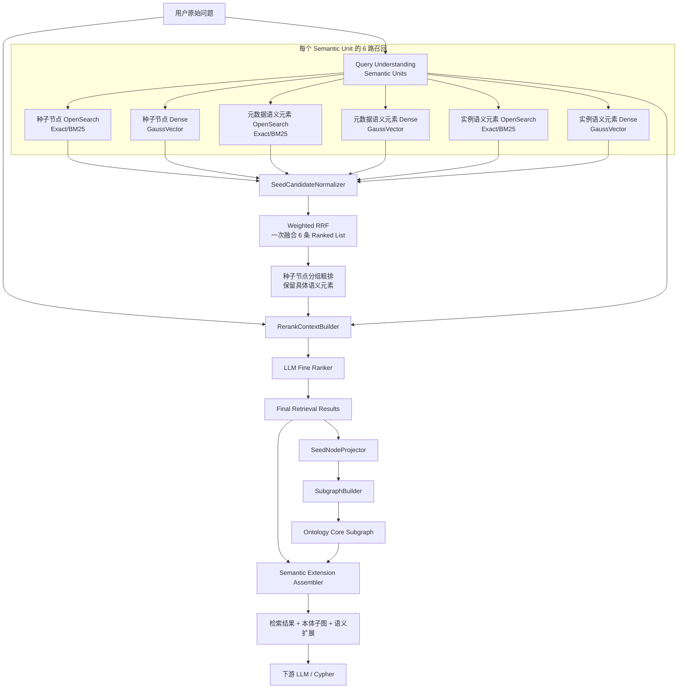
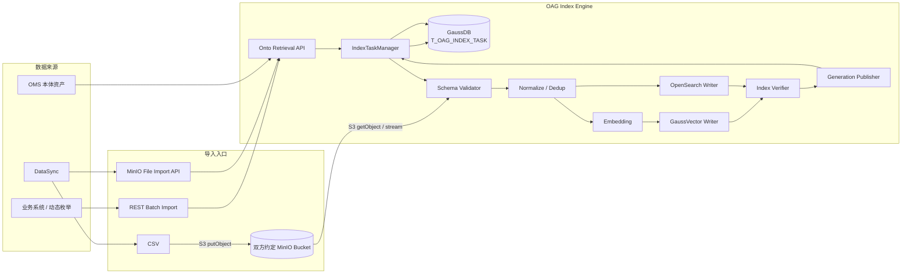
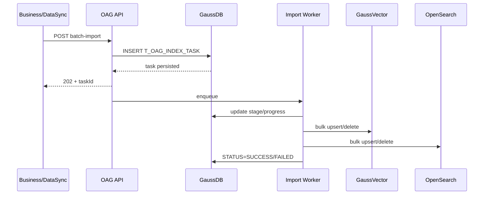
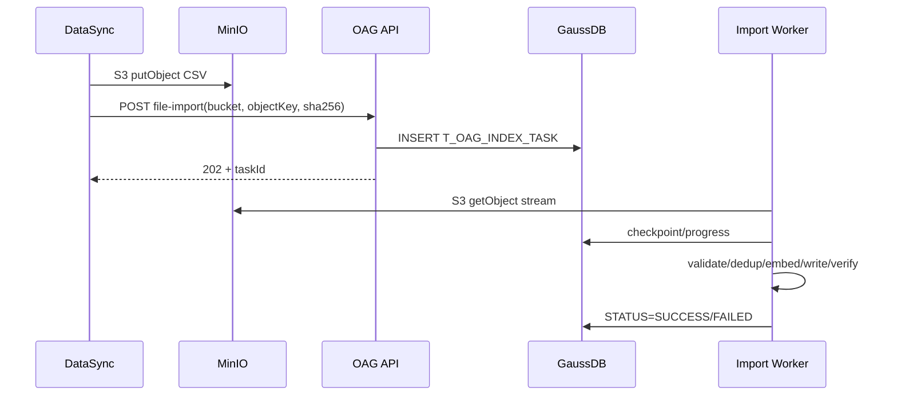
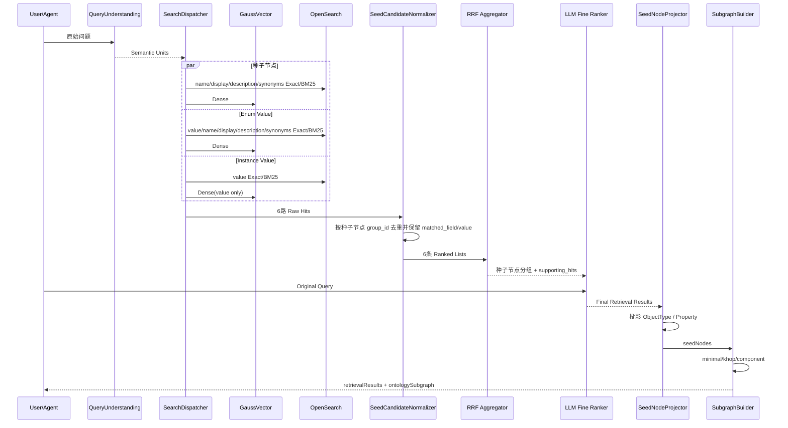

# OAG 面向本体种子节点的语义检索、混合排序与本体子图构建设计方案

> 版本：V5.9  
> 目标：在不丢失既有 Bulk Import、混合召回、RRF、LLM 精排和子图算法设计的基础上，进一步对齐现有 OMS 本体 JSON 资产：统一三张索引表命名，种子节点和枚举值直接内嵌 `synonyms`，固定支持中文/英文并额外支持最多 2 种语言，实例索引只保存去重后的真实列值。  
> 核心决策：**ObjectType/Property = 种子节点；Synonym 是种子节点或枚举值的结构化字段而非独立物理行；Metadata Evidence 只承载 Enum Value；Instance Evidence 只承载真实 Instance Value；种子节点使用 `id`，Enum/Instance 统一使用 `propertyid + objectTypeId` 表达本体归属；每个 Semantic Unit 默认 6 路一次 Weighted RRF。**

---

## 文档结构

1. 设计目标、术语与总体架构  
2. 数据模型与索引结构  
3. 索引构建与 DataSync Bulk Import  
4. Query Understanding 与 6 路召回  
5. LLM 精排与最终检索结果  
6. 种子节点投影与本体子图构建  
7. 性能、配置、可观测性、评测与迁移  

> 本次章节整理将原 V5.3 的 116 个一级章节完整归并到以上 7 个主章节；已有 Bulk Import、三类子图算法、GraphTopologyCache、性能/评测/灰度等信息均保留，只做术语、字段和执行顺序上的收敛。

---

# 1. 设计目标、术语与总体架构


## 1.1 设计目标与边界

OAG 同时承担索引构建、语义检索和本体子图构建三类能力。V5.7 进一步收敛检索数据模型，只保留三个业务层次：

```text
种子节点（Seed Node）
  = ObjectType / Property

元数据元素（Metadata Element）
  = Enum Value

实例元素（Instance Element）
  = 真实 Instance Value
```

同义词统一使用 **Synonym** 概念，并且不再建成独立物理记录：

```text
ObjectType / Property Synonym
  → 存在种子节点记录的 synonyms 字段

Enum Value Synonym
  → 存在 Enum Value 记录的 synonyms 字段

Instance Value
  → 只索引真实 value，不建立实例同义词记录
```

因此需要区分：

```text
最终检索命中（Matched Value）
        ≠
物理索引记录定位字段
        ≠
图算法输入（Seed Node）
```

种子节点记录继续使用自身 `id`；Enum Value / Instance Value 不再引入独立记录 `id`，而是使用 `propertyid + objectTypeId + value` 定位业务记录。

最终检索可以命中：

```text
ObjectType / Property 的 name、display、description、synonyms
Enum Value 的 value、name、display、description、synonyms
Instance Value 的 value
```

如果命中的是 synonyms 中的某个词，OAG 必须保留：

```text
matched_field
matched_value
```

命中 Synonym 时不为同义词制造新的业务 ID：ObjectType / Property 仍返回种子节点 `id`；Enum Value 返回 `propertyid + objectTypeId + value` 以及实际命中的 `matched_field/matched_value`。

例如：

```text
用户：色泽
   ↓
命中：bodyColor 对应 Enum Value 的 synonyms.zh = 色泽
   ↓
propertyid = prop:ont:vehicle:sp:bodyColor
objectTypeId = vehicle-object-id
value = red
matched_field = synonyms.zh
matched_value = 色泽
```

对于 Enum Value，还必须同时保留真实业务 `value`；对于 Property/Enum/Instance 场景，还要补齐 Property + ObjectType 上下文，供后续子图构建和 Cypher 生成使用。

本方案只排除以下内容作为业务检索结果：

```text
底层 Vector 文档物理身份
OpenSearch 内部 _id
ANN distance / BM25 _score / RRF score 本身
```

这些只属于检索实现和排序证据。


## 1.2 端到端总体架构



运行阶段统一为：

```text
阶段0：索引构建 / Bulk Import
阶段1：Query Understanding / Semantic Units
阶段2：6 路召回
阶段3：一次 Weighted RRF 粗排
阶段4：LLM 精排
阶段5：检索结果 → 种子节点投影
阶段6：minimal / khop / component 子图构建
阶段7：语义扩展与 Cypher 上下文组装
```

核心边界：

> **检索层返回“命中的对象本身”，图算法只消费 ObjectType / Property 种子节点。**


## 1.3 与现有 OAG 代码的兼容基线

当前代码已经形成以下主链路：

```text
graphSearchV3()
  └─ performGraphSearchOptimized()
       ├─ interpretQueryIntent()
       ├─ getSeedIds()
       │    ├─ vectorService.searchOntologyByQuery()
       │    ├─ elasticSearchRestRepository.searchOntologyByQuery()
       │    └─ hybridRecallHelper.hybridRecall()
       ├─ loadAllEdges()
       └─ subgraphQuery()
            ├─ getPathInfos()
            │    ├─ computePairwiseShortestPaths()
            │    └─ computePairwiseNumPaths()
            │          └─ findAllPath()
            └─ buildMstSubgraph() / buildAllSubgraph()
```

现有请求参数主要包括：

```text
graphExpansionStrategy = minimal
hopLimit = 3
seedRetrievalMode = vector
topK = 3
includeFunctions = 0
includeActions = 0
```

V5.7 不要求一次性替换现有链路，而是在现有类和接口上渐进演进：

```text
现有 getSeedIds()
    ↓
SearchDispatcher
    ↓
SemanticCandidateNormalizer
    ↓
Weighted RRF 种子节点分组
    ↓
LLM Fine Ranker
    ↓
Final Semantic Matches
    ├─ ObjectType / Property（name/display/description/synonyms 命中）
    ├─ Enum Value（value/name/display/description/synonyms 命中）
    └─ Instance Value（value 命中）
    ↓
SeedNodeProjector
    ↓
最终图构建种子节点
```

现有 `seedIds` / `seedNodes` 仍然可以作为**图构建种子节点兼容字段**保留，但不能再代表完整检索结果；完整检索结果由新增的 `retrievalResults` 表达。

现有 `subgraphQuery()`：

```text
保留 external strategy 名称
    ↓
minimal / khop / component
    ↓
内部支持 legacy / enhanced 两套算法
```

因此本次调整不改变三种图算法的边界，只改变“检索输出是什么”以及“何时投影成 种子节点”。

---


## 1.4 核心设计原则

### 设计原则 1：三张表分别表达三类稳定实体

```text
t_ontoretrieval_{ontology_id}
  → ObjectType / Property

t_metadata_evidence_{ontology_id}
  → Enum Value

t_instance_evidence_{ontology_id}
  → Instance Value
```

Synonym 只是所属实体的一个可检索字段，不再单独占一行。

### 设计原则 2：种子节点与 Evidence 使用各自最直接的本体定位字段

```text
种子节点：id = ObjectType / Property 本体 ID
Enum Value：propertyid = Property.id，objectTypeId = ObjectType.id
Instance Value：propertyid = Property.id，objectTypeId = ObjectType.id
```

Enum/Instance 不再增加额外的 Evidence 主键或父级映射字段；真实业务值由 `value` 保存，OAG 使用 `objectTypeId + propertyid + value` 作为去重和幂等定位依据。

### 设计原则 3：Matched Value 必须保留

无论命中：

```text
name
display
description
synonyms
value
```

都必须在 SearchHit / RetrievalResult 中保留 `matched_field + matched_value`。特别是 synonym 命中不能只剩所属种子节点或枚举值。

### 设计原则 4：RRF 按种子节点分组，组内保留具体命中

RRF 公平性单位仍然是种子节点：

```text
种子节点 hit：group_id = hit.id
Enum Value / Instance Value hit：group_id = hit.propertyid
```

这样一个 Property 即使有大量枚举值、实例值或同义词，也不会因为记录/字段数量多而重复加分。

### 设计原则 5：Core Graph 与检索字段分离

```text
图算法：ObjectType / Property / Relation
检索字段：name / display / description / synonyms / enum value / instance value
```

Enum/Instance 和 synonym 都可以帮助形成最终语义结果，但不直接成为最短路径、K-hop、Connected Component 的拓扑节点。

### 设计原则 6：召回保 Recall，RRF 保公平，LLM 保 Precision，Graph 保最小充分

```text
多路召回：宁可多召回
RRF：稳定融合不同引擎排序
LLM：结合原始问题、matched_value 和上下文做语义裁决
Graph：只返回支持推理/Cypher 的必要拓扑
```

# 2. 数据模型与索引结构


## 2.1 数据模型：种子节点、枚举值、实例值与 Synonym

V5.7 的物理索引模型只保留三类记录：

| 类型 | 物理实体 | Synonym 处理 | 本体归属字段 |
|---|---|---|---|
| 种子节点 | ObjectType / Property | 内嵌 `synonyms` | 使用种子节点自身 `id`；Property→ObjectType 走拓扑 |
| 元数据元素 | Enum Value | 内嵌 `synonyms` | `propertyid + objectTypeId` |
| 实例元素 | Instance Value | 不单独建实例同义词记录 | `propertyid + objectTypeId` |

同义词统一来源于 `synonym-type` 资产，结构固定使用：

```json
{
  "id": "term-color-synonyms",
  "name": "color-synonyms",
  "display": {
    "zh": "颜色近义词",
    "en": "Color Synonyms"
  },
  "description": {
    "zh": "颜色相关术语的近义词定义",
    "en": "Synonyms for color-related terms"
  },
  "synonyms": {
    "zh": ["颜色", "色彩", "色泽", "色"],
    "en": ["Color", "Colour", "Hue", "Tint"]
  },
  "status": "ACTIVE"
}
```

约束：

```text
synonyms 最多包含 3 种语言
3 种语言不固定
每种语言下面可以有多个同义词
语言使用 BCP 47 风格，如 zh/en/es/es-MX/pt-BR
```

对象、属性或枚举值通过 `refSynonymTypeId`（或 OMS 中等价的现有引用关系）关联 SynonymType。OAG 建索引时解析引用，并把最终同义词内容写入索引记录的 `synonyms` 字段。

SynonymType 自身不建立独立向量记录；其 `name / description / synonyms` 作为所属业务实体向量化内容的一部分。


## 2.2 三类物理索引与统一命名

三张 GaussVector 表和对应 OpenSearch Index 统一命名：

| 逻辑类型 | 物理表 / Index | Owner | 数据 |
|---|---|---|---|
| 种子节点 | `t_ontoretrieval_{ontology_id}` | OAG | ObjectType / Property |
| 元数据元素 | `t_metadata_evidence_{ontology_id}` | OAG | Enum Value + Synonyms |
| 实例元素 | `t_instance_evidence_{ontology_id}` | OAG，DataSync 提供数据 | Instance Value |

三类数据继续物理隔离，原因不变：

```text
规模差异
更新频率差异
ANN 算法差异
数据 Owner 差异
检索 TopK / 阈值差异
```


## 2.3 `t_ontoretrieval_{ontology_id}` GaussVector 表结构

种子节点表增加两个额外语言槽位，并增加 `synonyms`。中文和英文仍保留固定列，另外最多支持 2 种语言：

| 字段                   | 类型 | 非空 | 说明 |
|----------------------|---|--|---|
| `vector`             | `DOUBLE[]` | ✔ | 1024 维向量 |
| `type`               | `INT` |  | 0 ObjectType，1 Property |
| `id`                 | `VARCHAR(256 CHAR)` | ✔ | ObjectType / Property 全局唯一 ID |
| `parent_id`          | `VARCHAR(256 CHAR)` |  | 父元素ID，当type=1时，parent_ID记录的是Property所属的ObjectType ID。 |
| `name`               | `VARCHAR(256 CHAR)` |  | 本体真实名称 |
| `display_zh`         | `VARCHAR(512 CHAR)` |  | 中文显示名 |
| `display_en`         | `VARCHAR(512 CHAR)` |  | 英文显示名 |
| `display_lang_1`     | `VARCHAR(512 CHAR)` |  | 第 1 个额外语言显示名 |
| `display_lang_2`     | `VARCHAR(512 CHAR)` |  | 第 2 个额外语言显示名 |
| `description_zh`     | `VARCHAR(1024 CHAR)` |  | 中文描述 |
| `description_en`     | `VARCHAR(1024 CHAR)` |  | 英文描述 |
| `description_lang_1` | `VARCHAR(1024 CHAR)` |  | 第 1 个额外语言描述 |
| `description_lang_2` | `VARCHAR(1024 CHAR)` |  | 第 2 个额外语言描述 |
| `synonyms`           | `TEXT` |  | JSON 序列化的多语言同义词 Map，最多 3 种语言 |

`synonyms` 示例：

```json
{
  "zh": ["小区", "无线小区"],
  "en": ["Cell", "Radio Cell"],
  "es": ["Celda", "Celda de radio"]
}
```

注意：额外 display/description 最多 2 种语言；`synonyms` 最多 3 种语言，且语言组合不固定，两者是两个独立约束。


## 2.4 种子节点向量化内容

OAG 在内存中解析 ObjectType / Property 及其 SynonymType，按以下顺序构建 Embedding 文本：

```text
{name}
{display_zh}
{display_en}
{display_lang_1}
{display_lang_2}
{description_zh}
{description_en}
{description_lang_1}
{description_lang_2}
{synonyms_value}
{synonyms_description}
```

其中：

```text
synonyms_value
  = synonyms 中最多 3 种语言的所有同义词按稳定顺序展开

synonyms_description
  = 被引用 SynonymType 的 name + description（按存在语言展开）
```

因此 SynonymType 的：

```text
name
description
synonyms
```

全部参与向量化，但不额外建立 Synonym 向量记录。

空字段直接跳过，不写占位字符串。不要把 ObjectType 名称额外强制拼到 Property 向量开头；Property 自身语义、display、description、synonyms 已足够作为主表达。

当前 BGE-M3 向量维度继续沿用 1024。Embedding 批大小和重试次数属于 OAG 工程配置，不进入表 Schema。


## 2.5 多语言槽位与 Synonym 语言规则

### 2.5.1 Display / Description 最多 4 种语言

```text
固定语言：zh + en
额外语言：lang_1 + lang_2
总计最多 4 种
```

没有配置某个额外语言时，对应列为空。

### 2.5.2 Synonyms 最多 3 种语言且不固定

`synonyms` 使用语言 Map，不绑定固定 zh/en：

```json
{
  "en": ["Color", "Colour"],
  "es": ["Color", "Tono"],
  "pt-BR": ["Cor", "Tonalidade"]
}
```

最多 3 个 language key。这样可以支持：

```text
zh + en + es
en + es + pt-BR
zh + ar + fr
...
```

## 2.6 Property Vector 是否带 ObjectType

Property Dense 向量默认不增加 ObjectType 名称前缀。原因：

1. 用户经常只表达属性概念；
2. ObjectType 前缀可能改变语义重心；
3. 同名 Property 的消歧由原始问题、其他 Semantic Units、LLM 精排和图关系完成；
4. Property → ObjectType 由拓扑缓存确定，不依赖向量文本恢复。

如果评测显示同名 Property 冲突严重，可以启用内部 Shadow Vector，但最终仍回到同一 Property `id`。


## 2.7 `t_ontoretrieval_{ontology_id}` OpenSearch Index

OpenSearch 与 GaussVector 共享同一业务字段语义：

```text
type
id
name
display_zh
display_en
display_lang_1
display_lang_2
description_zh
description_en
description_lang_1
description_lang_2
synonyms
```

推荐映射：

| 字段 | OpenSearch 类型 | 说明 |
|---|---|---|
| `type` | `integer` | 0 ObjectType / 1 Property |
| `id` | `keyword` | 本体 ID |
| `name` | `keyword` + `text` | Exact / BM25 |
| `display_*` | `keyword` + `text` | 多语言显示名 |
| `description_*` | `text` | 多语言描述 |
| `synonyms` | `object` | language → synonym string array，最多 3 种语言 |

对 `synonyms.*` 使用 dynamic template 或索引构建时确定的语言映射，使数组内容既可 Exact 也可 BM25。

检索优先级：

```text
id/name/display exact
> synonyms exact
> name/display/synonyms phrase/BM25
> description BM25
```

不再使用扁平 `i18n_content`。


## 2.8 `t_metadata_evidence_{ontology_id}`：Enum Value 模型与表结构

Metadata Evidence 只承载本体模型中定义的枚举值。

### 2.8.1 EnumType 源结构

```json
{
  "id": "ei.veh12.enum.Col35.1",
  "name": "Color",
  "display": {
    "en": "Color",
    "zh": "颜色"
  },
  "description": {
    "en": "Vehicle body color enumeration",
    "zh": "车身颜色枚举"
  },
  "status": "ACTIVE",
  "creatorByOntology": "vehicle",
  "valueType": "string",
  "refSynonymTypeId": "term-color-synonyms",
  "values": [
    {
      "id": "ei.veh12.enum.Col35.val.red8.1",
      "name": "red",
      "display": {
        "en": "Red",
        "zh": "红色"
      },
      "description": {
        "en": "Red color",
        "zh": "红色"
      },
      "value": "red",
      "order": 1,
      "refSynonymTypeId": "term-color-red-synonyms"
    },
    {
      "id": "ei.veh12.enum.Col35.val.blue9.1",
      "name": "blue",
      "display": {
        "en": "Blue",
        "zh": "蓝色"
      },
      "description": {
        "en": "Blue color",
        "zh": "蓝色"
      },
      "value": "blue",
      "order": 2,
      "refSynonymTypeId": "term-color-blue-synonyms"
    }
  ],
  "extensions": {}
}
```

真正进入 `t_metadata_evidence_{ontology_id}` 的粒度是 `values[]` 中的每个枚举值。

### 2.8.2 SynonymType 源结构

```json
{
  "id": "term-color-synonyms",
  "name": "color-synonyms",
  "display": {
    "zh": "颜色近义词",
    "en": "Color Synonyms"
  },
  "description": {
    "zh": "颜色相关术语的近义词定义",
    "en": "Synonyms for color-related terms"
  },
  "synonyms": {
    "zh": ["颜色", "色彩", "色泽", "色"],
    "en": ["Color", "Colour", "Hue", "Tint"]
  },
  "status": "ACTIVE"
}
```

`synonyms` 最多 3 种语言，语言不固定。

### 2.8.3 Property 引用 Enum

```json
{
  "id": "prop:ont:vehicle:sp:bodyColor",
  "name": "bodyColor",
  "display": {
    "en": "Body Color",
    "zh": "车身颜色"
  },
  "description": {
    "en": "Vehicle body color",
    "zh": "车身颜色"
  },
  "dataType": "enum",
  "valueType": "string",
  "referenceEnumName": "Color",
  "referenceEnumId": "ei.vehicle.enum.Color.1",
  "extensions": {}
}
```

OAG 按：

```text
Property.referenceEnumId
  → EnumType.values[]
  → EnumValue.refSynonymTypeId
  → SynonymType.synonyms
```

展开索引。

### 2.8.4 GaussVector 表结构

```text
t_metadata_evidence_{ontology_id}
```

| 字段                   | 类型 | 非空 | 说明 |
|----------------------|---|--|---|
| `vector`             | `DOUBLE[]` | ✔ | Enum Value 向量 |
| `type`               | `INT` |  | 固定表示 ENUM_VALUE |
| `propertyId`         | `VARCHAR(512 CHAR)` | ✔ | 引用该 Enum 的 Property.id |
| `objectTypeId`       | `VARCHAR(256 CHAR)` |  | Property 所属 ObjectType.id |
| `value`              | `VARCHAR(4096 CHAR)` |  | 真实枚举值 |
| `name`               | `VARCHAR(4096 CHAR)` |  | `values[].name` |
| `display_zh`         | `VARCHAR(512 CHAR)` |  | 中文 display |
| `display_en`         | `VARCHAR(512 CHAR)` |  | 英文 display |
| `display_lang_1`     | `VARCHAR(512 CHAR)` |  | 额外语言 1 display |
| `display_lang_2`     | `VARCHAR(512 CHAR)` |  | 额外语言 2 display |
| `description_zh`     | `TEXT` |  | 中文 description |
| `description_en`     | `TEXT` |  | 英文 description |
| `description_lang_1` | `TEXT` |  | 额外语言 1 description |
| `description_lang_2` | `TEXT` |  | 额外语言 2 description |
| `synonyms`           | `TEXT` |  | 当前 Enum Value 的 SynonymType.synonyms，最多 3 种语言 |

如果一个 EnumType 被多个 Property 复用，需要按实际引用 Property 展开记录，并显式写入 `id + parent_id`。向量库必须保证同一业务范围内的枚举记录不重复，推荐唯一键为：

```text
objectTypeId + "::" + propertyId + "::" + normalized(value)
```

`values[].id` 仍可用于 OMS 源数据追踪和质量校验，但不作为 `t_metadata_evidence_{ontology_id}` 的持久化字段。


## 2.9 Enum Value 向量化规则

每个 `values[]` 元素按以下内容生成一个向量：

```text
{value}
{name}
{display_zh}
{display_en}
{display_lang_1}
{display_lang_2}
{description_zh}
{description_en}
{description_lang_1}
{description_lang_2}
{synonyms_value}
{synonyms_description}
```

其中：

```text
synonyms_value
  = 当前 Enum Value.refSynonymTypeId 对应 synonyms 中最多 3 种语言的所有同义词

synonyms_description
  = 对应 SynonymType 的 name + description（按存在语言展开）
```

向量顺序坚持：

```text
Value First
→ Name / Display
→ Description
→ Synonyms
```

不在向量文本开头追加 ObjectType / Property 文本；`propertyid + objectTypeId` 已提供确定性归属。


## 2.10 `t_instance_evidence_{ontology_id}` 实例列值表结构

实例索引保存去重后的真实列值，每条记录直接携带所属 Property 和 ObjectType。

```text
t_instance_evidence_{ontology_id}
```

| 字段 | 类型 | 非空 | 说明 |
|---|---|--|---|
| `vector` | `DOUBLE[]` | ✔ | Instance Value 向量 |
| `type` | `INT` |  | 固定表示 INSTANCE_VALUE |
| `propertyid` | `VARCHAR(512 CHAR)` | ✔ | 所属 Property.id |
| `objectTypeId` | `VARCHAR(256 CHAR)` |  | Property 所属 ObjectType.id |
| `value` | `VARCHAR(4096 CHAR)` | ✔ | 去重后的真实列值 |


## 2.11 Instance Value 向量准入规则

Property 中的 `"capability":"DIMENSION"` 是实例列值进入向量索引的准入标识，同时还需要满足数据类型和值形态约束：

```text
instance_index_enabled =
  property.capability == "DIMENSION"
  AND datatype_eligible
  AND value_shape_eligible
  AND cardinality_eligible
```

向量库最终必须保证实例值记录不重复。DataSync 可以在源侧先做去重，OAG 在写入 `t_instance_evidence_{ontology_id}` 前仍必须按 `objectTypeId + propertyid + normalized(value)` 再次去重并使用幂等 UPSERT。例：5000 万 Subscriber 行中 `subLevel` 只有 VIP/GOLD/SILVER/NORMAL，最终向量库只保留 4 条唯一实例值记录。

默认不向量化：

```text
UUID
手机号
纯技术主键
时间戳
日期
连续数值
高随机编码
```

适合向量化：

```text
产品名称
品牌名称
客户等级
区域名称
业务状态
自然语言标签
人可理解业务分类
```

高基数自由文本进入单独 Document/RAG Index，不进入本体种子节点 Resolver 的 Instance Value Index。


## 2.12 Instance Value 向量化内容

实例列值 Dense 内容严格只使用：

```text
{value}
```

这样 Instance Dense 表达始终由真实业务值主导；Property/ObjectType 归属直接由记录中的 `propertyid + objectTypeId` 提供。

可以只用组合的Struct 结构的value。

## 2.13 Metadata / Instance OpenSearch Index

### `t_metadata_evidence_{ontology_id}`

核心字段与 GaussVector 一致：

```text
type
propertyId
objectTypeId
value
name
display_zh
display_en
display_lang_1
display_lang_2
description_zh
description_en
description_lang_1
description_lang_2
synonyms
```

Exact 优先：

```text
propertyId
objectTypeId
value.keyword
name.keyword
display_*.keyword
synonyms.*.keyword
```

BM25：

```text
name
display_*
description_*
synonyms.*
```

### `t_instance_evidence_{ontology_id}`

只需要：

```text
type          integer
propertyId    keyword
objectTypeId  keyword
value         keyword + text
language      keyword（可选）
```

Exact 主要搜索 `propertyid/objectTypeId/value.keyword`，BM25 搜索 `value`。


## 2.14 规范化规则

规范化属于索引构建/查询处理逻辑，不增加额外持久化字段：

```text
trim
Unicode normalize
casefold（适用语言）
连续空白归一
全半角归一
```

原始 `name/value/display/description/synonyms` 始终保留；OpenSearch 通过 normalizer/analyzer 实现 Exact/BM25 规范化，GaussVector 在 Embedding 前使用相同基础规范化。


## 2.15 language_hint 与语言槽位

查询理解阶段仍可以输出：

```text
language_hint = BCP 47 language tag / mixed / und
```

但物理存储按两种机制处理：

```text
种子节点/Enum Value display、description
  → zh/en 固定 + lang_1/lang_2 两个 ontology 级语言槽位

synonyms
  → language Map，最多 3 种语言，不固定

Instance Value
  → 仅 value；language 为可选观测/Analyzer Hint
```

检索规则：

```text
同语言 Exact/BM25 可以 Boost
跨语言候选不硬过滤
Dense 不按 language_hint 过滤
LLM 精排继续看到原始问题和所有候选
```


## 2.16 数据质量治理

OAG 元数据同步阶段必须检查：

```text
ObjectType / Property id 重复或缺失
name/display/description 格式非法
additionalLanguages 槽位配置不一致
synonyms 语言数 > 3
synonyms 某语言值重复
synonyms 与 canonical name/display 完全重复
同一业务范围内 synonym 映射冲突
Enum Ref 不存在
Enum values[].id/value 源数据重复
Enum Value.refSynonymTypeId 不存在
Property.referenceEnumId 不存在
Parent ObjectType 缺失
```

冲突处理原则：不能静默覆盖，必须可观测；严重结构错误阻断当前记录或当前批次入库。

DataSync 实例值额外检查：

```text
空 value
超长 value
unique_value_count
同一 objectTypeId + propertyid 下重复 value
高基数
无意义随机串
非法 UTF-8
```


## 2.17 增量索引与幂等

三类表按各自稳定业务键做幂等 UPSERT / DELETE：

```text
种子节点：id
Enum Value：objectTypeId + propertyId + normalized(value)
Instance Value：objectTypeId + propertyId + normalized(value)
```

同一业务键重复 UPSERT 必须覆盖当前记录而不是新增重复向量；DELETE 必须同时删除 GaussVector 与 OpenSearch 中对应记录。

不在记录中保留：

```text
content_hash
model_version
source_version
updated_at
```

版本和构建信息统一放到 OAG 的 Import Job / Generation 元数据，不进入每条向量记录。

Embedding 模型升级时：

```text
创建新的 Generation
→ 全量重新 Embedding
→ Verify
→ 原子发布
```

如果未来需要“内容未变化则跳过 Embedding”，可以作为 OAG 内部缓存优化实现，但不扩展业务表 Schema。


## 2.18 GaussVector 索引算法

种子节点 / Metadata 语义元素：

```text
GsIVFFLAT
COSINE
```

适用规模：

```text
约 1*10^4 ～ 2*10^6
```

推荐：

```text
IVF_NLIST = 4 * sqrt(N)
```

其中：

```text
N = 当前物理表实际记录数
```

Instance 语义元素：

```text
中小规模 → GsIVFFLAT
千万 / 亿级 → GsDiskANN
```

Metadata 与 Instance 分表的一个核心原因就是允许 ANN 算法独立演进。

---


# 3. 索引构建与 DataSync Bulk Import

本章定义 OAG 索引数据的构建、动态导入、MinIO 文件交互、任务持久化和双存储发布机制。索引数据仍由第 2 章定义的三张物理表承载：

```text
t_ontoretrieval_{ontology_id} → ObjectType / Property 种子节点
t_metadata_evidence_{ontology_id} → Enum Value
t_instance_evidence_{ontology_id} → Instance Value
```

其中种子节点索引由 OAG 根据 OMS 本体资产构建；Enum Value 和 Instance Value 除随本体构建外，还支持运行期动态导入。动态数据导入统一为两类入口：

```text
REST 批量导入
  → 适合动态枚举值、少量/中等规模实例值的实时或准实时更新

MinIO CSV 文件导入
  → 适合 DataSync 生成的大规模枚举值/实例值全量或增量文件
```

两类入口最终进入同一套 OAG Import Pipeline，不允许分别维护两套 Embedding、去重、GaussVector/OpenSearch 写入和任务状态逻辑。

---

## 3.1 职责边界

### OMS

负责提供 ObjectType / Property、多语言 display/description、SynonymType、EnumType / values[]、Property→ObjectType 和 Property→EnumType 等本体资产。OAG 根据 OMS 资产构建 `t_ontoretrieval_{ontology_id}` 和静态 Enum Value 索引。

### DataSync

DataSync 负责大规模实例数据准备与文件交付：

```text
读取 capability=DIMENSION 的 Property
访问实际数据源
提取真实 Instance Value
源侧去重 / 基础标准化
建立 value 与 Property 的映射
生成 UTF-8 CSV 文件
上传到双方约定的 MinIO Bucket
调用 OAG 文件导入接口注册导入任务
```

当 DataSync 能够产生动态 Enum Value 时，也可以使用相同 CSV 文件接口提交 `METADATA_ENUM` 数据。

DataSync 不负责 Embedding、GaussVector/OpenSearch Client、ANN/全文索引构建、OAG 物理表创建、Generation 发布以及最终去重和双存储一致性。

### OAG

OAG 统一负责：

```text
API / 文件导入任务创建
GaussDB 任务状态持久化
请求 / CSV Schema 校验
Enum / Instance 本体映射校验
Normalize / Dedup
Embedding
GaussVector Bulk Write
OpenSearch Bulk Write
ANN / 全文索引校验
Generation 发布
在线检索
任务重试 / 取消 / 错误查询
```

> **DataSync/业务系统只提交业务语义数据，OAG 负责把业务数据转换为可检索的向量/全文索引。**

---

## 3.2 总体索引构建架构



两条入口仅在数据进入 OAG 前不同：REST 直接在 Body 中携带 records；MinIO 接口只携带 bucket/objectKey/checksum 等文件描述，OAG 从 MinIO 流式读取 CSV。从 `Schema Validator` 开始，两类入口使用完全相同的处理链路。
## 3.3 统一 REST API 规范

OAG 对外接口统一使用 Namespace：

```text
/v1/onto-retrieval/{ontologyId}
```

不再新增 `/v1/ontologies/{ontologyId}/...` 或 `/instance-evidence/import-jobs/...` 风格接口。

本章接口按 **OpenAPI 3.0.3** 规范定义。所有 URI、Path/Header/Query 参数、Request Body、HTTP Status Code 和 Response Schema 都必须能够直接映射为 OpenAPI `paths / parameters / requestBody / responses / components.schemas`。

### 3.3.1 公共协议约束

#### Content-Type

```http
Content-Type: application/json
Accept: application/json
```

MinIO 文件导入接口自身仍使用 JSON 注册文件，不通过 `multipart/form-data` 直接上传大文件；CSV 先由 DataSync 上传到双方约定的 MinIO Bucket，再调用 `file-import`。

#### 公共 Path 参数

**表 1  OntologyPath 参数列表**

| 参数名称 | 类型 | 是否必选 | 默认值 | OpenAPI 约束 | 说明 |
|:--|:--|:--|:--|:--|:--|
| `ontologyId` | String | 是 | - | `in: path`，`required: true`，`maxLength: 256` | 本体唯一 ID；必须与 URI 中的目标本体一致 |

#### 公共 Header 参数

**表 2  OAGCommonHeaders 参数列表**

| 参数名称 | 类型 | 是否必选 | 默认值 | OpenAPI 约束 | 说明 |
|:--|:--|:--|:--|:--|:--|
| `x-gde-tenant-id` | String | 是 | - | `in: header`，`required: true`，`maxLength: 256` | 租户 ID；OAG 按租户隔离本体和任务 |
| `Content-Type` | String | POST 请求是 | `application/json` | `application/json` | 请求体编码类型 |
| `Accept` | String | 否 | `application/json` | `application/json` | 响应类型 |

#### 公共 HTTP 状态码

| HTTP 状态码 | 场景 | Response Schema |
|:--|:--|:--|
| `200 OK` | 同步查询成功 | 对应接口 Success Response |
| `202 Accepted` | 异步导入、重试或取消请求已接受 | `AsyncTaskAcceptedResponse` / `TaskOperationAcceptedResponse` |
| `400 Bad Request` | Path/Header/Body/Query 参数校验失败 | `ValidationErrorResponse` |
| `404 Not Found` | Ontology、Task 或同步校验的资源不存在 | `BusinessErrorResponse` |
| `409 Conflict` | 幂等键冲突、任务状态不允许当前操作 | `BusinessErrorResponse` |
| `413 Payload Too Large` | REST Batch 超过 `maxRecordsPerRequest` 或 Body 限制 | `BusinessErrorResponse` |
| `429 Too Many Requests` | 导入任务或接口触发限流 | `BusinessErrorResponse` |
| `500 Internal Server Error` | OAG 内部未预期异常 | `BusinessErrorResponse` |
| `503 Service Unavailable` | GaussDB、Embedding、GaussVector、OpenSearch、MinIO 等依赖暂不可用 | `BusinessErrorResponse` |

> 对异步导入接口，`202 Accepted` 仅表示任务已成功写入 GaussDB 并进入执行队列，不表示数据已经完成 Embedding、双写或发布。

#### 幂等规则

`requestId` 是调用方生成的业务幂等键，最大长度 256。OAG 使用：

```text
ontologyId + requestId
```

作为任务级幂等约束：

```text
相同 ontologyId + requestId + 相同请求语义
  → 返回原 taskId，不重复创建任务

相同 ontologyId + requestId + 不同 dataType/importMode/数据内容
  → HTTP 409 IDEMPOTENCY_CONFLICT
```

---

### 3.3.2 语义子图检索接口

#### 典型场景

Agent、Skill 或上层业务根据自然语言问题获取与问题相关的 ObjectType、Property、Enum Value、Instance Value、Relation、Function/Action 等检索结果和本体子图。

#### 接口功能

执行 Query Understanding、6 路混合召回、Weighted RRF、LLM 精排和本体子图生成。该接口只负责语义检索与子图返回，不承担索引数据导入。

#### 调用方法

POST

#### URI

```text
/v1/onto-retrieval/{ontologyId}/subgraph/semantic-search
```

对应 Spring 接口：

```java
@PostMapping("/v1/onto-retrieval/{ontologyId}/subgraph/semantic-search")
```

#### 请求参数

除表 1、表 2 的公共 Path/Header 参数外，请求 Body 使用 `SemanticSearchRequest`。

**表 3  SemanticSearchRequest 参数列表**

| 参数名称 | 类型 | 是否必选 | 默认值 | OpenAPI 约束 | 说明 |
|:--|:--|:--|:--|:--|:--|
| `query` | String | 是 | - | `minLength: 1` | 自然语言业务问题或 Planning 层整理后的语义检索问题 |
| `similarityThreshold` | Number(float) | 否 | `0.6` | `minimum: 0`，`maximum: 1` | Dense 相似度阈值；Exact 命中不受该阈值过滤 |
| `includeFunctions` | Integer | 否 | `1` | `enum: [0,1]` | 是否返回 Function，1 返回，0 不返回 |
| `includeActions` | Integer | 否 | `0` | `enum: [0,1]` | 是否返回 Action，1 返回，0 不返回 |
| `seedRetrievalMode` | String | 否 | `vector` | 当前支持值以服务配置为准 | 种子节点检索模式 |
| `topK` | Integer | 否 | `3` | `minimum: 1` | 种子节点候选 TopK |
| `graphExpansionStrategy` | String | 否 | `minimal` | `enum: [minimal,khop,component]` | 子图扩展策略 |
| `hopLimit` | Integer | 否 | `3` | `minimum: 1` | `khop` 策略下的最大扩散深度 |

#### 请求示例

```json
{
  "query": "查询正式用户的 Mobile Number",
  "similarityThreshold": 0.6,
  "includeFunctions": 1,
  "includeActions": 0,
  "seedRetrievalMode": "vector",
  "topK": 3,
  "graphExpansionStrategy": "minimal",
  "hopLimit": 3
}
```

#### 返回参数

成功响应沿用后续第 5、6 章定义的最终检索与子图结构。OpenAPI 中 `result` 至少声明为 Object，内部字段包括 `retrievalResults / seedNodes / nodes / edges / semanticExtensions / capabilityExtensions / metadata`，具体字段以第 5、6 章为准。

**表 4  SemanticSearchResponse 参数列表（HTTP 200）**

| 参数名称 | 类型 | 说明 |
|:--|:--|:--|
| `result` | Object | 最终语义检索结果与本体子图 |

#### OpenAPI 3.0.3 Path 定义

```yaml
/v1/onto-retrieval/{ontologyId}/subgraph/semantic-search:
  post:
    operationId: semanticSearchSubgraph
    summary: 本体语义子图检索
    parameters:
      - $ref: '#/components/parameters/OntologyId'
      - $ref: '#/components/parameters/TenantId'
    requestBody:
      required: true
      content:
        application/json:
          schema:
            $ref: '#/components/schemas/SemanticSearchRequest'
    responses:
      '200':
        description: 检索成功
        content:
          application/json:
            schema:
              $ref: '#/components/schemas/SemanticSearchResponse'
      '400': { $ref: '#/components/responses/BadRequest' }
      '404': { $ref: '#/components/responses/NotFound' }
      '429': { $ref: '#/components/responses/TooManyRequests' }
      '500': { $ref: '#/components/responses/InternalError' }
      '503': { $ref: '#/components/responses/ServiceUnavailable' }
```

---

### 3.3.3 索引导入与任务接口清单

| 场景 | Method | URI | OpenAPI operationId | 说明 |
|---|---|---|---|---|
| REST 批量导入 | POST | `/v1/onto-retrieval/{ontologyId}/index-data/batch-import` | `batchImportIndexData` | Body 直接提交 Enum/Instance records |
| MinIO 文件导入 | POST | `/v1/onto-retrieval/{ontologyId}/index-data/file-import` | `importIndexDataFromMinio` | 注册已经上传到 MinIO 的 CSV 文件 |
| 查询任务 | GET | `/v1/onto-retrieval/{ontologyId}/index-tasks/{taskId}` | `getIndexTask` | 查询持久化任务状态和进度 |
| 重试任务 | POST | `/v1/onto-retrieval/{ontologyId}/index-tasks/{taskId}/retry` | `retryIndexTask` | 对失败任务重新执行 |
| 取消任务 | POST | `/v1/onto-retrieval/{ontologyId}/index-tasks/{taskId}/cancel` | `cancelIndexTask` | 请求取消未完成任务 |
| 查询错误 | GET | `/v1/onto-retrieval/{ontologyId}/index-tasks/{taskId}/errors` | `listIndexTaskErrors` | 分页查询任务记录级错误 |

所有导入接口采用异步任务模型：

```text
提交请求 → 同步基础参数校验 → GaussDB 创建/复用 T_OAG_INDEX_TASK → HTTP 202 + taskId → 后台执行
```

统一数据类型：`METADATA_ENUM`、`INSTANCE_VALUE`；统一导入模式：`FULL_REPLACE`、`INCREMENTAL`；统一记录操作：`UPSERT`、`DELETE`。

---

## 3.4 REST 批量导入接口

REST Batch Import 是 MinIO 文件导入的补充，主要面向动态枚举值实时/准实时增加、删除或修订，以及少量/中等规模实例值增量。超大数据不应通过 HTTP JSON Body 替代 MinIO 文件通道。`maxRecordsPerRequest` 为 OAG 工程配置，建议默认从 1000 条起步并通过压测调整。

### 3.4.1 接口定义

#### 典型场景

业务系统动态增加/删除枚举值，或 DataSync/业务应用需要实时、准实时导入少量实例列值，不希望先生成 MinIO 文件。

#### 接口功能

接收 `METADATA_ENUM` 或 `INSTANCE_VALUE` 批量记录，完成同步协议校验并创建异步索引任务。后台统一执行本体映射校验、Normalize、Dedup、Embedding、GaussVector/OpenSearch 双写、Verify 和 Publish。

#### 调用方法

POST

#### URI

```text
/v1/onto-retrieval/{ontologyId}/index-data/batch-import
```

对应 Spring 接口：

```java
@PostMapping("/v1/onto-retrieval/{ontologyId}/index-data/batch-import")
```

#### 请求参数

**表 5  IndexBatchImportRequest 参数列表**

| 参数名称 | 类型 | 是否必选 | 默认值 | OpenAPI 约束 | 说明 |
|:--|:--|:--|:--|:--|:--|
| `requestId` | String | 是 | - | `minLength: 1`，`maxLength: 256` | 调用方幂等键 |
| `dataType` | String | 是 | - | `enum: [METADATA_ENUM, INSTANCE_VALUE]` | 指定本批记录类型，禁止一个请求混合两类数据 |
| `importMode` | String | 是 | - | `enum: [FULL_REPLACE, INCREMENTAL]` | 全量替换或增量导入 |
| `records` | Array[MetadataEnumRecord] / Array[InstanceValueRecord] | 是 | - | `minItems: 1`；最大条数由 `maxRecordsPerRequest` 配置 | 记录类型必须与 `dataType` 一致 |

`records` 是 OpenAPI `oneOf` 语义：

```text
dataType = METADATA_ENUM
  → records[] 必须满足 MetadataEnumRecord

dataType = INSTANCE_VALUE
  → records[] 必须满足 InstanceValueRecord
```

OAG 不接受调用方提交 `vector`；物理 `type` 由 `dataType` 推导：`METADATA_ENUM → ENUM_VALUE`，`INSTANCE_VALUE → INSTANCE_VALUE`。

##### METADATA_ENUM 记录

> **字段名严格与第 2.8 节一致：使用 `propertyId`，不是 `propertyid`。字段名大小写敏感。**

**表 6  MetadataEnumRecord 参数列表**

| 参数名称 | 类型 | 是否必选 | 默认值 | OpenAPI 约束 | 说明 |
|:--|:--|:--|:--|:--|:--|
| `propertyId` | String | 是 | - | `maxLength: 512` | 引用该 Enum 的 Property.id |
| `objectTypeId` | String | 否 | - | `maxLength: 256` | Property 所属 ObjectType.id；如传入必须与本体映射一致 |
| `value` | String | 是 | - | `maxLength: 4096` | 真实枚举值；用于唯一键和向量内容 |
| `name` | String | 否 | - | `maxLength: 4096` | Enum Value name |
| `display_zh` | String | 否 | - | `maxLength: 512` | 中文 display |
| `display_en` | String | 否 | - | `maxLength: 512` | 英文 display |
| `display_lang_1` | String | 否 | - | `maxLength: 512` | ontology 级额外语言槽位 1 display |
| `display_lang_2` | String | 否 | - | `maxLength: 512` | ontology 级额外语言槽位 2 display |
| `description_zh` | String | 否 | - | - | 中文 description |
| `description_en` | String | 否 | - | - | 英文 description |
| `description_lang_1` | String | 否 | - | - | 额外语言槽位 1 description |
| `description_lang_2` | String | 否 | - | - | 额外语言槽位 2 description |
| `synonyms` | Map[String, Array[String]] | 否 | `{}` | `maxProperties: 3` | 当前 Enum Value 的多语言同义词；语言 key 最多 3 个 |
| `op` | String | 否 | `UPSERT` | `enum: [UPSERT, DELETE]` | 增量操作；`FULL_REPLACE` 默认只使用 `UPSERT` |

枚举唯一业务键：

```text
objectTypeId + propertyId + normalized(value)
```

如果 `objectTypeId` 未传，OAG 可以根据 `propertyId` 的本体归属补齐；若调用方传入，则必须校验与 OMS 本体映射一致，不一致返回 `OBJECT_TYPE_MISMATCH`。

##### INSTANCE_VALUE 记录

> **字段名严格与第 2.10 节一致：使用 `propertyid`。该字段与第 2.8 的 `propertyId` 大小写不同，当前协议保持与既有物理模型一致。**

**表 7  InstanceValueRecord 参数列表**

| 参数名称 | 类型 | 是否必选 | 默认值 | OpenAPI 约束 | 说明 |
|:--|:--|:--|:--|:--|:--|
| `propertyid` | String | 是 | - | `maxLength: 512` | 所属 Property.id |
| `objectTypeId` | String | 否 | - | `maxLength: 256` | Property 所属 ObjectType.id；如传入必须与本体映射一致 |
| `value` | String | 是 | - | `maxLength: 4096` | 去重后的真实 Instance Value；EmbeddingInput 严格为 `{value}` |
| `language` | String | 否 | `und` | BCP 47 / `und` | 导入协议扩展字段，只用于 Analyzer/观测 Hint，不改变第 2.10 的向量表核心字段 |
| `op` | String | 否 | `UPSERT` | `enum: [UPSERT, DELETE]` | 增量操作；`FULL_REPLACE` 默认只使用 `UPSERT` |

实例唯一业务键：

```text
objectTypeId + propertyid + normalized(value)
```

#### 请求示例：动态枚举

```json
{
  "requestId": "req-enum-20260816-000001",
  "dataType": "METADATA_ENUM",
  "importMode": "INCREMENTAL",
  "records": [
    {
      "propertyId": "prop:ont:vehicle:sp:bodyColor",
      "objectTypeId": "obj:ont:vehicle:Vehicle",
      "value": "red",
      "name": "red",
      "display_zh": "红色",
      "display_en": "Red",
      "display_lang_1": "Rojo",
      "description_zh": "红色",
      "description_en": "Red color",
      "description_lang_1": "Color rojo",
      "synonyms": {
        "zh": ["红", "赤色"],
        "en": ["Red"],
        "es": ["Rojo"]
      },
      "op": "UPSERT"
    }
  ]
}
```

#### 请求示例：实例列值

```json
{
  "requestId": "req-instance-20260816-000001",
  "dataType": "INSTANCE_VALUE",
  "importMode": "INCREMENTAL",
  "records": [
    {
      "propertyid": "prop:subscriber:subLevel",
      "objectTypeId": "obj:subscriber:Subscriber",
      "value": "VIP",
      "language": "und",
      "op": "UPSERT"
    }
  ]
}
```

#### 返回参数

**表 8  AsyncTaskAcceptedResponse 参数列表（HTTP 202）**

| 参数名称 | 类型 | 说明 | 示例 |
|:--|:--|:--|:--|
| `ontologyId` | String | 本体 ID | `dtmi.ontology.xxx.1` |
| `taskId` | String | GaussDB 持久化任务 ID | `idx-task-20260816-000001` |
| `requestId` | String | 调用幂等键 | `req-enum-20260816-000001` |
| `dataType` | String | `METADATA_ENUM` / `INSTANCE_VALUE` | `METADATA_ENUM` |
| `sourceType` | String | 固定 `REST` | `REST` |
| `status` | Integer | 任务状态：0 构建中，1 成功，2 失败，3 已取消 | `0` |
| `stage` | String | 当前阶段，任务创建时通常为 `CREATED` | `CREATED` |

#### 响应示例

```http
HTTP/1.1 202 Accepted
Content-Type: application/json
```

```json
{
  "ontologyId": "dtmi.ontology.xxx.1",
  "taskId": "idx-task-20260816-000001",
  "requestId": "req-enum-20260816-000001",
  "dataType": "METADATA_ENUM",
  "sourceType": "REST",
  "status": 0,
  "stage": "CREATED"
}
```

#### OpenAPI 3.0.3 Path 定义

```yaml
/v1/onto-retrieval/{ontologyId}/index-data/batch-import:
  post:
    operationId: batchImportIndexData
    summary: REST 批量导入枚举值或实例列值
    parameters:
      - $ref: '#/components/parameters/OntologyId'
      - $ref: '#/components/parameters/TenantId'
    requestBody:
      required: true
      content:
        application/json:
          schema:
            $ref: '#/components/schemas/IndexBatchImportRequest'
          examples:
            metadataEnum:
              $ref: '#/components/examples/MetadataEnumBatchImportExample'
            instanceValue:
              $ref: '#/components/examples/InstanceValueBatchImportExample'
    responses:
      '202':
        description: 导入任务已创建或命中幂等任务
        content:
          application/json:
            schema:
              $ref: '#/components/schemas/AsyncTaskAcceptedResponse'
      '400': { $ref: '#/components/responses/BadRequest' }
      '404': { $ref: '#/components/responses/NotFound' }
      '409': { $ref: '#/components/responses/Conflict' }
      '413': { $ref: '#/components/responses/PayloadTooLarge' }
      '429': { $ref: '#/components/responses/TooManyRequests' }
      '500': { $ref: '#/components/responses/InternalError' }
      '503': { $ref: '#/components/responses/ServiceUnavailable' }
```

---

## 3.5 MinIO CSV 文件导入接口

对于百万/千万级实例值及大规模枚举数据，默认使用 MinIO 文件通道：

```text
DataSync → 生成 CSV → S3 putObject 到双方约定 Bucket → POST file-import
         → OAG 创建任务 → S3 getObject 流式读取
         → Normalize/Dedup/Embedding/Bulk Write/Verify/Publish
```

### 3.5.1 接口定义

#### 典型场景

DataSync 定期或按事件生成大规模枚举/实例列值文件，数据量不适合通过 HTTP JSON Body 直接提交，需要使用 MinIO 进行解耦、流式消费和失败重试。

#### 接口功能

注册已经上传到 MinIO 的一个或多个 UTF-8 CSV 对象。接口同步校验请求结构和基础资源信息，创建持久化异步任务；后台按文件流式读取并进入与 REST Batch 相同的 Import Pipeline。

#### 调用方法

POST

#### URI

```text
/v1/onto-retrieval/{ontologyId}/index-data/file-import
```

对应 Spring 接口：

```java
@PostMapping("/v1/onto-retrieval/{ontologyId}/index-data/file-import")
```

#### 请求参数

**表 9  IndexFileImportRequest 参数列表**

| 参数名称 | 类型 | 是否必选 | 默认值 | OpenAPI 约束 | 说明 |
|:--|:--|:--|:--|:--|:--|
| `requestId` | String | 是 | - | `minLength: 1`，`maxLength: 256` | 调用方幂等键 |
| `dataType` | String | 是 | - | `enum: [METADATA_ENUM, INSTANCE_VALUE]` | 当前文件批次的数据类型 |
| `importMode` | String | 是 | - | `enum: [FULL_REPLACE, INCREMENTAL]` | 全量替换或增量导入 |
| `files` | Array[MinioCsvFile] | 是 | - | `minItems: 1` | 待导入的 MinIO CSV 对象列表 |

**表 10  MinioCsvFile 参数列表**

| 参数名称 | 类型 | 是否必选 | 默认值 | OpenAPI 约束 | 说明 |
|:--|:--|:--|:--|:--|:--|
| `bucket` | String | 是 | - | `minLength: 3`，`maxLength: 63` | 双方部署时约定并加入 OAG allowlist 的 MinIO Bucket |
| `objectKey` | String | 是 | - | `minLength: 1`，`maxLength: 1024` | CSV 对象 Key；任务完成前不得覆盖同一 Key |
| `fileFormat` | String | 否 | `CSV` | `enum: [CSV]` | 当前只支持 CSV |
| `encoding` | String | 否 | `UTF-8` | `enum: [UTF-8]` | 当前只支持 UTF-8 |
| `hasHeader` | Boolean | 否 | `true` | 当前必须为 `true` | CSV 第一行为 Header |
| `rowCount` | Integer(int64) | 否 | - | `minimum: 0` | DataSync 侧统计的预期记录数；OAG 用于校验/观测 |
| `size` | Integer(int64) | 否 | - | `minimum: 0` | 预期文件字节数；OAG 可通过 `headObject` 二次校验 |
| `sha256` | String | 是 | - | `pattern: ^[A-Fa-f0-9]{64}$` | 文件 SHA-256；用于不可变校验和 Chunk 稳定标识 |

MinIO 的 `endpoint / accessKey / secretKey` 属于部署配置，不属于业务 API 参数，禁止通过 `file-import` Body 传输。

#### 请求示例

```json
{
  "requestId": "datasync-20260816-000001",
  "dataType": "INSTANCE_VALUE",
  "importMode": "FULL_REPLACE",
  "files": [
    {
      "bucket": "oag-retrieval-import",
      "objectKey": "onto-retrieval/tenant-a/dtmi.ontology.xxx.1/INSTANCE_VALUE/datasync-20260816-000001/part-00000.csv",
      "fileFormat": "CSV",
      "encoding": "UTF-8",
      "hasHeader": true,
      "rowCount": 1200000,
      "size": 183421234,
      "sha256": "7c222fb2927d828af22f592134e8932480637c0d4d7b31a7d7e6c80b7f5506ab"
    }
  ]
}
```

#### 返回参数

复用表 8 `AsyncTaskAcceptedResponse`，其中：

```text
sourceType = MINIO
status     = 0
stage      = CREATED
```

#### 响应示例

```json
{
  "ontologyId": "dtmi.ontology.xxx.1",
  "taskId": "idx-task-20260816-000101",
  "requestId": "datasync-20260816-000001",
  "dataType": "INSTANCE_VALUE",
  "sourceType": "MINIO",
  "status": 0,
  "stage": "CREATED"
}
```

#### OpenAPI 3.0.3 Path 定义

```yaml
/v1/onto-retrieval/{ontologyId}/index-data/file-import:
  post:
    operationId: importIndexDataFromMinio
    summary: 从 MinIO CSV 导入枚举值或实例列值
    parameters:
      - $ref: '#/components/parameters/OntologyId'
      - $ref: '#/components/parameters/TenantId'
    requestBody:
      required: true
      content:
        application/json:
          schema:
            $ref: '#/components/schemas/IndexFileImportRequest'
    responses:
      '202':
        description: 文件导入任务已创建或命中幂等任务
        content:
          application/json:
            schema:
              $ref: '#/components/schemas/AsyncTaskAcceptedResponse'
      '400': { $ref: '#/components/responses/BadRequest' }
      '404': { $ref: '#/components/responses/NotFound' }
      '409': { $ref: '#/components/responses/Conflict' }
      '429': { $ref: '#/components/responses/TooManyRequests' }
      '500': { $ref: '#/components/responses/InternalError' }
      '503': { $ref: '#/components/responses/ServiceUnavailable' }
```

### 3.5.2 同步校验与异步校验边界

接口返回 `202` 前至少完成：

```text
ontologyId / tenant 基础校验
requestId 幂等校验
dataType / importMode Schema 校验
files 非空
bucket allowlist 校验
objectKey 格式校验
sha256 格式校验
T_OAG_INDEX_TASK 持久化成功
```

MinIO 对象存在性、size/checksum、CSV Header、逐行 Schema、Ontology Mapping 等校验可以在后台任务阶段执行；如果后台校验失败，任务进入 `STATUS=2` 并通过任务查询/错误查询接口返回详细错误。实现如果选择在 `202` 前执行 `headObject`，则对象不存在可以同步返回 `404 MINIO_OBJECT_NOT_FOUND`，但不得因此把百万级 CSV 内容同步加载到 API 线程。

---

## 3.6 CSV 文件结构

所有 DataSync → MinIO 的索引数据文件统一采用：

```text
CSV
UTF-8
首行 Header
逗号分隔
双引号作为 quote character
LF 作为推荐换行符
```

CSV 不包含 `vector`，因为向量必须由 OAG 使用当前配置的 Embedding 模型统一生成；CSV 也不要求携带物理 `type`，因为 `file-import.dataType` 已唯一确定目标类型。

文本中出现逗号、双引号或换行时按标准 CSV quoting 规则转义；双引号使用 `""` 表示。`synonyms` 使用 JSON Object 字符串写入单个 CSV 字段。

### 3.6.1 METADATA_ENUM CSV

Header：

```csv
propertyId,objectTypeId,value,name,display_zh,display_en,display_lang_1,display_lang_2,description_zh,description_en,description_lang_1,description_lang_2,synonyms,op
```

| CSV 字段 | 目标字段 | 说明 |
|---|---|---|
| `propertyId` | `propertyId` | 引用 Enum 的 Property.id |
| `objectTypeId` | `objectTypeId` | Property 所属 ObjectType.id |
| `value` | `value` | 真实枚举值 |
| `name` | `name` | Enum Value name |
| `display_zh` | `display_zh` | 中文 display |
| `display_en` | `display_en` | 英文 display |
| `display_lang_1` | `display_lang_1` | 额外语言 1 |
| `display_lang_2` | `display_lang_2` | 额外语言 2 |
| `description_zh` | `description_zh` | 中文描述 |
| `description_en` | `description_en` | 英文描述 |
| `description_lang_1` | `description_lang_1` | 额外语言 1 描述 |
| `description_lang_2` | `description_lang_2` | 额外语言 2 描述 |
| `synonyms` | `synonyms` | JSON Object，最多 3 种语言 |
| `op` | 导入操作 | `UPSERT` / `DELETE` |

示例：

```csv
propertyId,objectTypeId,value,name,display_zh,display_en,display_lang_1,display_lang_2,description_zh,description_en,description_lang_1,description_lang_2,synonyms,op
prop:ont:vehicle:sp:bodyColor,obj:ont:vehicle:Vehicle,red,red,红色,Red,Rojo,,红色,Red color,Color rojo,,"{""zh"":[""红"",""赤色""],""en"":[""Red""],""es"":[""Rojo""]}",UPSERT
```

### 3.6.2 INSTANCE_VALUE CSV

Header：

```csv
propertyid,objectTypeId,value,language,op
```

| CSV 字段 | 目标字段 | 说明 |
|---|---|---|
| `propertyid` | `propertyid` | 所属 Property.id |
| `objectTypeId` | `objectTypeId` | 所属 ObjectType.id |
| `value` | `value` | 真实 Instance Value |
| `language` | `language` | 可选；未知使用 `und` |
| `op` | 导入操作 | `UPSERT` / `DELETE` |

```csv
propertyid,objectTypeId,value,language,op
prop:subscriber:subLevel,obj:subscriber:Subscriber,VIP,und,UPSERT
prop:subscriber:subLevel,obj:subscriber:Subscriber,GOLD,und,UPSERT
```

OAG 最终按 `objectTypeId + propertyid + normalized(value)` 保证 GaussVector 和 OpenSearch 中不存在重复业务记录。

---

## 3.7 MinIO 文件交互协议

OAG 文件导入参考 BDI/DataFactory 已有 MinIO 交互模式：生产者通过 S3 兼容 API 上传对象，消费者通过统一 S3 Client 读取；双方预先约定 Bucket，并启用 MinIO 所需的 Path-style 访问。OAG 不复用日志业务的 `bdi/minio/` 路径，而定义独立索引导入 Bucket/Prefix。

### 3.7.1 Bucket 与 Object Key

双方通过部署配置约定专用 Bucket，例如 `oag-retrieval-import`，Bucket 名称不能硬编码。推荐 Object Key：

```text
onto-retrieval/{tenantId}/{ontologyId}/{dataType}/{requestId}/part-00000.csv
```

### 3.7.2 S3 协议

DataSync 上传：`S3 putObject(bucket, objectKey, csvFile)`；OAG 读取：`S3 getObject(bucket, objectKey)`。

MinIO Client 启用：

```java
S3Configuration.builder()
    .pathStyleAccessEnabled(true)
    .build();
```

连接配置包括 endpoint/accessKey/secretKey/bucket，凭证通过平台配置或 Secret 管理，不写入 CSV，也不放在 import API Body 中。

### 3.7.3 文件不可变与校验

文件上传成功并提交 `file-import` 后，同一个 objectKey 在任务结束前不得覆盖。OAG 至少校验 Bucket 允许列表、Object 是否存在、size、sha256、CSV Header、dataType 对应 Schema 和可选 rowCount。百万/千万级数据必须流式读取，不允许一次性加载完整 CSV 到 JVM Heap。任务成功后按保留策略延迟清理；失败时默认保留文件用于重试和定位。
## 3.8 GaussDB 索引任务持久化

索引任务不能只保存在 JVM 内存中。REST Batch Import、MinIO File Import、OMS 全量索引构建都必须创建持久化任务。

沿用现有关系：

```text
T_OAG_INDEX (1)
      │ ONTOLOGY_ID
      ↓
T_OAG_INDEX_TASK (N)
```

`T_OAG_INDEX` 保存本体级索引配置；`T_OAG_INDEX_TASK` 保存每次构建/导入执行实例。

### 3.8.1 `T_OAG_INDEX_TASK` 表结构

在现有 `ONTOLOGY_ID / TASK_ID / STATUS / CREATE_* / COMPLETION_TIME` 基础上扩展数据来源、导入类型、进度和错误字段：

| 字段名 | 类型 | 约束 | 说明 |
|---|---|---|---|
| `TENANT_ID` | VARCHAR(256) |  | 租户 ID |
| `ONTOLOGY_ID` | VARCHAR(256) | NOT NULL | 本体 ID |
| `TASK_ID` | VARCHAR(256) | PK | 索引任务 ID |
| `REQUEST_ID` | VARCHAR(256) | NOT NULL | 调用幂等键 |
| `DATA_TYPE` | VARCHAR(64) | NOT NULL | `SEED_NODE` / `METADATA_ENUM` / `INSTANCE_VALUE` |
| `SOURCE_TYPE` | VARCHAR(32) | NOT NULL | `OMS` / `REST` / `MINIO` |
| `IMPORT_MODE` | VARCHAR(32) |  | `FULL_REPLACE` / `INCREMENTAL` |
| `STATUS` | INT | NOT NULL | 0 构建中；1 成功；2 失败；3 已取消 |
| `STAGE` | VARCHAR(64) |  | 当前执行阶段 |
| `TOTAL_COUNT` | BIGINT |  | 总记录数 |
| `SUCCESS_COUNT` | BIGINT |  | 成功记录数 |
| `FAILED_COUNT` | BIGINT |  | 失败记录数 |
| `SKIPPED_COUNT` | BIGINT |  | 去重/过滤记录数 |
| `BUCKET_NAME` | VARCHAR(256) |  | MinIO Bucket；REST/OMS 可空 |
| `OBJECT_PREFIX` | VARCHAR(1024) |  | MinIO Object/Prefix；REST/OMS 可空 |
| `CHECKPOINT` | VARCHAR(1024) |  | CSV 文件/行号或内部 Chunk Checkpoint |
| `RETRY_COUNT` | INT | NOT NULL | 重试次数，默认 0 |
| `ERROR_CODE` | VARCHAR(128) |  | 最后错误码 |
| `ERROR_MESSAGE` | TEXT |  | 最后错误摘要 |
| `CREATE_USER_ACCOUNT` | VARCHAR(256) | NOT NULL | 创建者 |
| `CREATE_TIME` | TIMESTAMP | NOT NULL | 创建时间 |
| `START_TIME` | TIMESTAMP |  | 实际开始时间 |
| `UPDATE_TIME` | TIMESTAMP | NOT NULL | 最近状态更新时间 |
| `COMPLETION_TIME` | TIMESTAMP |  | 完成时间 |

兼容原则：`STATUS=0/1/2` 继续兼容现有构建中/成功/失败语义，新增 `STATUS=3` 表示取消；更细执行阶段写入 `STAGE`，推荐值：`CREATED / VALIDATING / READING / DEDUPLICATING / EMBEDDING / WRITING_VECTOR / WRITING_SEARCH / VERIFYING / PUBLISHING / CANCEL_REQUESTED / FINISHED`。

### 3.8.2 索引与约束

```sql
PRIMARY KEY (TASK_ID);

CREATE UNIQUE INDEX UQ_T_OAG_INDEX_TASK_REQUEST
ON T_OAG_INDEX_TASK (ONTOLOGY_ID, REQUEST_ID);

CREATE INDEX IDX_T_OAG_INDEX_TASK_ONTOLOGY_TIME
ON T_OAG_INDEX_TASK (ONTOLOGY_ID, CREATE_TIME);

CREATE INDEX IDX_T_OAG_INDEX_TASK_STATUS_TIME
ON T_OAG_INDEX_TASK (STATUS, UPDATE_TIME);
```

`ONTOLOGY_ID + REQUEST_ID` 唯一约束确保 API 重试不会创建重复任务。

### 3.8.3 GaussDB 建表示例

```sql
CREATE TABLE T_OAG_INDEX_TASK
(
    TENANT_ID           VARCHAR(256),
    ONTOLOGY_ID         VARCHAR(256) NOT NULL,
    TASK_ID             VARCHAR(256) NOT NULL,
    REQUEST_ID          VARCHAR(256) NOT NULL,
    DATA_TYPE           VARCHAR(64)  NOT NULL,
    SOURCE_TYPE         VARCHAR(32)  NOT NULL,
    IMPORT_MODE         VARCHAR(32),
    STATUS              INT          NOT NULL,
    STAGE               VARCHAR(64),
    TOTAL_COUNT         BIGINT,
    SUCCESS_COUNT       BIGINT,
    FAILED_COUNT        BIGINT,
    SKIPPED_COUNT       BIGINT,
    BUCKET_NAME         VARCHAR(256),
    OBJECT_PREFIX       VARCHAR(1024),
    CHECKPOINT          VARCHAR(1024),
    RETRY_COUNT         INT          NOT NULL DEFAULT 0,
    ERROR_CODE          VARCHAR(128),
    ERROR_MESSAGE       TEXT,
    CREATE_USER_ACCOUNT VARCHAR(256) NOT NULL,
    CREATE_TIME         TIMESTAMP    NOT NULL,
    START_TIME          TIMESTAMP,
    UPDATE_TIME         TIMESTAMP    NOT NULL,
    COMPLETION_TIME     TIMESTAMP,
    CONSTRAINT PK_T_OAG_INDEX_TASK_TASK_ID PRIMARY KEY (TASK_ID)
);

CREATE UNIQUE INDEX UQ_T_OAG_INDEX_TASK_REQUEST
ON T_OAG_INDEX_TASK (ONTOLOGY_ID, REQUEST_ID);
CREATE INDEX IDX_T_OAG_INDEX_TASK_ONTOLOGY_TIME
ON T_OAG_INDEX_TASK (ONTOLOGY_ID, CREATE_TIME);
CREATE INDEX IDX_T_OAG_INDEX_TASK_STATUS_TIME
ON T_OAG_INDEX_TASK (STATUS, UPDATE_TIME);
```

如果现网已经存在精简版 `T_OAG_INDEX_TASK`，通过数据库升级脚本增加字段，不新建第二张任务主表。
### 3.8.4 索引任务管理接口详细定义

任务管理接口统一以 GaussDB `T_OAG_INDEX_TASK` 为事实来源，不以内存线程/Future 状态作为权威结果。

#### 3.8.4.1 查询索引任务

##### 典型场景

调用方提交 REST Batch 或 MinIO File Import 后，根据 `taskId` 轮询任务当前阶段、进度、结果和最后错误摘要。

##### 接口功能

查询指定本体下的索引任务状态。接口必须同时校验 `ontologyId + taskId + tenant` 归属，禁止跨租户/跨本体读取任务。

##### 调用方法

GET

##### URI

```text
/v1/onto-retrieval/{ontologyId}/index-tasks/{taskId}
```

##### 请求参数

**表 11  GetIndexTask 参数列表**

| 参数名称 | 类型 | 参数位置 | 是否必选 | 默认值 | OpenAPI 约束 | 说明 |
|:--|:--|:--|:--|:--|:--|:--|
| `ontologyId` | String | Path | 是 | - | `maxLength: 256` | 本体 ID |
| `taskId` | String | Path | 是 | - | `maxLength: 256` | 索引任务 ID |
| `x-gde-tenant-id` | String | Header | 是 | - | `maxLength: 256` | 租户 ID |

##### 返回参数

**表 12  IndexTaskResponse 参数列表（HTTP 200）**

| 参数名称 | 类型 | 说明 |
|:--|:--|:--|
| `tenantId` | String | 租户 ID |
| `ontologyId` | String | 本体 ID |
| `taskId` | String | 任务 ID |
| `requestId` | String | 调用幂等键 |
| `dataType` | String | `SEED_NODE / METADATA_ENUM / INSTANCE_VALUE` |
| `sourceType` | String | `OMS / REST / MINIO` |
| `importMode` | String | `FULL_REPLACE / INCREMENTAL`；OMS 内部任务可为空 |
| `status` | Integer | 0 构建中；1 成功；2 失败；3 已取消 |
| `stage` | String | 当前执行阶段 |
| `totalCount` | Integer(int64) | 总记录数；未知时可为空 |
| `successCount` | Integer(int64) | 成功处理数 |
| `failedCount` | Integer(int64) | 失败记录数 |
| `skippedCount` | Integer(int64) | 去重/过滤记录数 |
| `retryCount` | Integer | 已执行重试次数 |
| `errorCode` | String | 任务最后错误码；非失败状态可为空 |
| `errorMessage` | String | 最后错误摘要；非失败状态可为空 |
| `createTime` | String(date-time) | 创建时间 |
| `startTime` | String(date-time) | 实际开始时间 |
| `updateTime` | String(date-time) | 最近更新时间 |
| `completionTime` | String(date-time) | 完成时间；未结束可为空 |

##### 响应示例

```json
{
  "tenantId": "tenant-a",
  "ontologyId": "dtmi.ontology.xxx.1",
  "taskId": "idx-task-20260816-000001",
  "requestId": "req-enum-20260816-000001",
  "dataType": "METADATA_ENUM",
  "sourceType": "REST",
  "importMode": "INCREMENTAL",
  "status": 0,
  "stage": "EMBEDDING",
  "totalCount": 1000,
  "successCount": 640,
  "failedCount": 2,
  "skippedCount": 8,
  "retryCount": 0,
  "errorCode": null,
  "errorMessage": null,
  "createTime": "2026-08-16T22:10:00+08:00",
  "startTime": "2026-08-16T22:10:01+08:00",
  "updateTime": "2026-08-16T22:10:08+08:00",
  "completionTime": null
}
```

##### OpenAPI 3.0.3 Path 定义

```yaml
/v1/onto-retrieval/{ontologyId}/index-tasks/{taskId}:
  get:
    operationId: getIndexTask
    summary: 查询索引任务
    parameters:
      - $ref: '#/components/parameters/OntologyId'
      - $ref: '#/components/parameters/TaskId'
      - $ref: '#/components/parameters/TenantId'
    responses:
      '200':
        description: 查询成功
        content:
          application/json:
            schema:
              $ref: '#/components/schemas/IndexTaskResponse'
      '400': { $ref: '#/components/responses/BadRequest' }
      '404': { $ref: '#/components/responses/NotFound' }
      '500': { $ref: '#/components/responses/InternalError' }
```

---

#### 3.8.4.2 重试索引任务

##### 典型场景

索引任务因 MinIO、Embedding、GaussVector、OpenSearch 或 Verify 等临时故障失败后，调用方希望从持久化 Source/Checkpoint 重试，而不是重新提交整批业务数据。

##### 接口功能

对 `STATUS=2` 的失败任务发起重试。OAG 复用原 `taskId`、`requestId`、输入 Source 和 Checkpoint，增加 `RETRY_COUNT` 并重新进入执行队列，不创建重复业务任务。

##### 调用方法

POST

##### URI

```text
/v1/onto-retrieval/{ontologyId}/index-tasks/{taskId}/retry
```

##### 请求参数

无 Request Body。Path/Header 参数复用表 11。

##### 前置条件

```text
任务存在
AND tenant/ontology 归属一致
AND STATUS = 2（FAILED）
AND 原始 REST Payload 或 MinIO Source/Checkpoint 仍可恢复
```

否则返回 `409 TASK_STATE_CONFLICT` 或相应资源错误。

##### 返回参数

**表 13  TaskOperationAcceptedResponse 参数列表（HTTP 202）**

| 参数名称 | 类型 | 说明 | 示例 |
|:--|:--|:--|:--|
| `ontologyId` | String | 本体 ID | `dtmi.ontology.xxx.1` |
| `taskId` | String | 原任务 ID | `idx-task-20260816-000001` |
| `operation` | String | 当前接受的任务操作 | `RETRY` |
| `accepted` | Boolean | 是否已接受 | `true` |
| `status` | Integer | 接受后任务状态，通常重新进入 0 | `0` |
| `stage` | String | 接受后的阶段 | `CREATED` |

##### 响应示例

```json
{
  "ontologyId": "dtmi.ontology.xxx.1",
  "taskId": "idx-task-20260816-000001",
  "operation": "RETRY",
  "accepted": true,
  "status": 0,
  "stage": "CREATED"
}
```

##### OpenAPI 3.0.3 Path 定义

```yaml
/v1/onto-retrieval/{ontologyId}/index-tasks/{taskId}/retry:
  post:
    operationId: retryIndexTask
    summary: 重试失败的索引任务
    parameters:
      - $ref: '#/components/parameters/OntologyId'
      - $ref: '#/components/parameters/TaskId'
      - $ref: '#/components/parameters/TenantId'
    responses:
      '202':
        description: 重试请求已接受
        content:
          application/json:
            schema:
              $ref: '#/components/schemas/TaskOperationAcceptedResponse'
      '404': { $ref: '#/components/responses/NotFound' }
      '409': { $ref: '#/components/responses/Conflict' }
      '429': { $ref: '#/components/responses/TooManyRequests' }
      '500': { $ref: '#/components/responses/InternalError' }
      '503': { $ref: '#/components/responses/ServiceUnavailable' }
```

---

#### 3.8.4.3 取消索引任务

##### 典型场景

调用方发现导入数据错误、提交范围错误或需要停止长时间运行的文件导入任务。

##### 接口功能

请求取消尚未进入终态的索引任务。接口返回 `202` 代表取消请求已接受，不代表 Worker 已立即停止；Worker 在安全检查点停止后将任务更新为 `STATUS=3`。

##### 调用方法

POST

##### URI

```text
/v1/onto-retrieval/{ontologyId}/index-tasks/{taskId}/cancel
```

##### 请求参数

无 Request Body。Path/Header 参数复用表 11。

##### 前置条件

只有 `STATUS=0` 的未完成任务允许取消；`STATUS=1/2/3` 返回 `409 TASK_STATE_CONFLICT`。

##### 返回参数

复用表 13 `TaskOperationAcceptedResponse`，其中 `operation=CANCEL`。

##### 响应示例

```json
{
  "ontologyId": "dtmi.ontology.xxx.1",
  "taskId": "idx-task-20260816-000001",
  "operation": "CANCEL",
  "accepted": true,
  "status": 0,
  "stage": "CANCEL_REQUESTED"
}
```

`CANCEL_REQUESTED` 作为取消请求已接收的瞬态阶段；Worker 安全停止后更新为 `STATUS=3`。

##### OpenAPI 3.0.3 Path 定义

```yaml
/v1/onto-retrieval/{ontologyId}/index-tasks/{taskId}/cancel:
  post:
    operationId: cancelIndexTask
    summary: 取消索引任务
    parameters:
      - $ref: '#/components/parameters/OntologyId'
      - $ref: '#/components/parameters/TaskId'
      - $ref: '#/components/parameters/TenantId'
    responses:
      '202':
        description: 取消请求已接受
        content:
          application/json:
            schema:
              $ref: '#/components/schemas/TaskOperationAcceptedResponse'
      '404': { $ref: '#/components/responses/NotFound' }
      '409': { $ref: '#/components/responses/Conflict' }
      '500': { $ref: '#/components/responses/InternalError' }
```

---

#### 3.8.4.4 查询索引任务错误

##### 典型场景

批量或文件导入存在部分记录失败，需要定位具体 `recordIndex / objectKey / rowNumber / Property / value` 的错误原因。

##### 接口功能

分页查询任务记录级错误。百万级错误不得整体塞入 `T_OAG_INDEX_TASK.ERROR_MESSAGE` 或一次性返回。

##### 调用方法

GET

##### URI

```text
/v1/onto-retrieval/{ontologyId}/index-tasks/{taskId}/errors
```

##### 请求参数

**表 14  ListIndexTaskErrors 参数列表**

| 参数名称 | 类型 | 参数位置 | 是否必选 | 默认值 | OpenAPI 约束 | 说明 |
|:--|:--|:--|:--|:--|:--|:--|
| `ontologyId` | String | Path | 是 | - | `maxLength: 256` | 本体 ID |
| `taskId` | String | Path | 是 | - | `maxLength: 256` | 任务 ID |
| `x-gde-tenant-id` | String | Header | 是 | - | `maxLength: 256` | 租户 ID |
| `page` | Integer | Query | 否 | `0` | `minimum: 0` | 页码，从 0 开始 |
| `pageSize` | Integer | Query | 否 | `100` | `minimum: 1`，`maximum: 1000` | 每页条数 |

**表 15  IndexTaskErrorItem 参数列表**

| 参数名称 | 类型 | 说明 |
|:--|:--|:--|
| `recordIndex` | Integer(int64) | REST records[] 下标；文件导入可为空 |
| `objectKey` | String | MinIO Object Key；REST 导入可为空 |
| `rowNumber` | Integer(int64) | CSV 行号；REST 导入可为空 |
| `propertyId` | String | 统一错误输出中的 Property.id；从 Enum `propertyId` 或 Instance `propertyid` 规范化得到 |
| `objectTypeId` | String | ObjectType.id |
| `value` | String | 必要时脱敏/截断后的业务值 |
| `errorCode` | String | 记录级错误码 |
| `errorMessage` | String | 记录级错误信息 |

**表 16  IndexTaskErrorPage 参数列表（HTTP 200）**

| 参数名称 | 类型 | 说明 |
|:--|:--|:--|
| `taskId` | String | 任务 ID |
| `page` | Integer | 当前页码 |
| `pageSize` | Integer | 当前页大小 |
| `total` | Integer(int64) | 错误总数 |
| `items` | Array[IndexTaskErrorItem] | 当前页错误明细 |

##### 响应示例

```json
{
  "taskId": "idx-task-20260816-000001",
  "page": 0,
  "pageSize": 100,
  "total": 2,
  "items": [
    {
      "recordIndex": 8,
      "objectKey": null,
      "rowNumber": null,
      "propertyId": "prop:ont:vehicle:sp:bodyColor",
      "objectTypeId": "obj:ont:vehicle:Vehicle",
      "value": "red",
      "errorCode": "OBJECT_TYPE_MISMATCH",
      "errorMessage": "objectTypeId does not match the Property owner"
    }
  ]
}
```

##### OpenAPI 3.0.3 Path 定义

```yaml
/v1/onto-retrieval/{ontologyId}/index-tasks/{taskId}/errors:
  get:
    operationId: listIndexTaskErrors
    summary: 分页查询索引任务记录级错误
    parameters:
      - $ref: '#/components/parameters/OntologyId'
      - $ref: '#/components/parameters/TaskId'
      - $ref: '#/components/parameters/TenantId'
      - name: page
        in: query
        required: false
        schema: { type: integer, minimum: 0, default: 0 }
      - name: pageSize
        in: query
        required: false
        schema: { type: integer, minimum: 1, maximum: 1000, default: 100 }
    responses:
      '200':
        description: 查询成功
        content:
          application/json:
            schema:
              $ref: '#/components/schemas/IndexTaskErrorPage'
      '400': { $ref: '#/components/responses/BadRequest' }
      '404': { $ref: '#/components/responses/NotFound' }
      '500': { $ref: '#/components/responses/InternalError' }
```

---

### 3.8.5 OpenAPI 3.0.3 公共 Components 定义

以下 Components 与 3.3～3.8 的 Path 定义组合后，可以直接形成 OpenAPI 3.0.3 契约。工程实现可以将这些定义拆到独立 `openapi.yaml`，设计文档保留同名 Schema 作为接口评审基线。

```yaml
openapi: 3.0.3
info:
  title: OAG Onto Retrieval API
  version: 1.0.0

components:
  parameters:
    OntologyId:
      name: ontologyId
      in: path
      required: true
      schema:
        type: string
        maxLength: 256
    TaskId:
      name: taskId
      in: path
      required: true
      schema:
        type: string
        maxLength: 256
    TenantId:
      name: x-gde-tenant-id
      in: header
      required: true
      schema:
        type: string
        maxLength: 256

  schemas:
    SemanticSearchRequest:
      type: object
      required: [query]
      properties:
        query:
          type: string
          minLength: 1
        similarityThreshold:
          type: number
          format: float
          minimum: 0
          maximum: 1
          default: 0.6
        includeFunctions:
          type: integer
          enum: [0, 1]
          default: 1
        includeActions:
          type: integer
          enum: [0, 1]
          default: 0
        seedRetrievalMode:
          type: string
          default: vector
        topK:
          type: integer
          minimum: 1
          default: 3
        graphExpansionStrategy:
          type: string
          enum: [minimal, khop, component]
          default: minimal
        hopLimit:
          type: integer
          minimum: 1
          default: 3

    SemanticSearchResponse:
      type: object
      required: [result]
      properties:
        result:
          type: object
          additionalProperties: true

    MetadataEnumRecord:
      type: object
      required: [propertyId, value]
      properties:
        propertyId: { type: string, maxLength: 512 }
        objectTypeId: { type: string, maxLength: 256 }
        value: { type: string, maxLength: 4096 }
        name: { type: string, maxLength: 4096 }
        display_zh: { type: string, maxLength: 512 }
        display_en: { type: string, maxLength: 512 }
        display_lang_1: { type: string, maxLength: 512 }
        display_lang_2: { type: string, maxLength: 512 }
        description_zh: { type: string }
        description_en: { type: string }
        description_lang_1: { type: string }
        description_lang_2: { type: string }
        synonyms:
          type: object
          maxProperties: 3
          additionalProperties:
            type: array
            items: { type: string }
        op:
          type: string
          enum: [UPSERT, DELETE]
          default: UPSERT
      additionalProperties: false

    InstanceValueRecord:
      type: object
      required: [propertyid, value]
      properties:
        propertyid: { type: string, maxLength: 512 }
        objectTypeId: { type: string, maxLength: 256 }
        value: { type: string, maxLength: 4096 }
        language: { type: string, default: und }
        op:
          type: string
          enum: [UPSERT, DELETE]
          default: UPSERT
      additionalProperties: false

    MetadataEnumBatchImportRequest:
      type: object
      required: [requestId, dataType, importMode, records]
      properties:
        requestId: { type: string, minLength: 1, maxLength: 256 }
        dataType: { type: string, enum: [METADATA_ENUM] }
        importMode: { type: string, enum: [FULL_REPLACE, INCREMENTAL] }
        records:
          type: array
          minItems: 1
          items: { $ref: '#/components/schemas/MetadataEnumRecord' }
      additionalProperties: false

    InstanceValueBatchImportRequest:
      type: object
      required: [requestId, dataType, importMode, records]
      properties:
        requestId: { type: string, minLength: 1, maxLength: 256 }
        dataType: { type: string, enum: [INSTANCE_VALUE] }
        importMode: { type: string, enum: [FULL_REPLACE, INCREMENTAL] }
        records:
          type: array
          minItems: 1
          items: { $ref: '#/components/schemas/InstanceValueRecord' }
      additionalProperties: false

    IndexBatchImportRequest:
      oneOf:
        - $ref: '#/components/schemas/MetadataEnumBatchImportRequest'
        - $ref: '#/components/schemas/InstanceValueBatchImportRequest'
      discriminator:
        propertyName: dataType
        mapping:
          METADATA_ENUM: '#/components/schemas/MetadataEnumBatchImportRequest'
          INSTANCE_VALUE: '#/components/schemas/InstanceValueBatchImportRequest'

    MinioCsvFile:
      type: object
      required: [bucket, objectKey, sha256]
      properties:
        bucket: { type: string, minLength: 3, maxLength: 63 }
        objectKey: { type: string, minLength: 1, maxLength: 1024 }
        fileFormat: { type: string, enum: [CSV], default: CSV }
        encoding: { type: string, enum: [UTF-8], default: UTF-8 }
        hasHeader: { type: boolean, enum: [true], default: true }
        rowCount: { type: integer, format: int64, minimum: 0 }
        size: { type: integer, format: int64, minimum: 0 }
        sha256:
          type: string
          pattern: '^[A-Fa-f0-9]{64}$'
      additionalProperties: false

    IndexFileImportRequest:
      type: object
      required: [requestId, dataType, importMode, files]
      properties:
        requestId: { type: string, minLength: 1, maxLength: 256 }
        dataType: { type: string, enum: [METADATA_ENUM, INSTANCE_VALUE] }
        importMode: { type: string, enum: [FULL_REPLACE, INCREMENTAL] }
        files:
          type: array
          minItems: 1
          items: { $ref: '#/components/schemas/MinioCsvFile' }
      additionalProperties: false

    AsyncTaskAcceptedResponse:
      type: object
      required: [ontologyId, taskId, requestId, dataType, sourceType, status, stage]
      properties:
        ontologyId: { type: string }
        taskId: { type: string }
        requestId: { type: string }
        dataType: { type: string, enum: [METADATA_ENUM, INSTANCE_VALUE] }
        sourceType: { type: string, enum: [REST, MINIO] }
        status: { type: integer, enum: [0, 1, 2, 3] }
        stage: { type: string }

    IndexTaskResponse:
      type: object
      required: [ontologyId, taskId, requestId, dataType, sourceType, status, stage, createTime, updateTime]
      properties:
        tenantId: { type: string, nullable: true }
        ontologyId: { type: string }
        taskId: { type: string }
        requestId: { type: string }
        dataType: { type: string, enum: [SEED_NODE, METADATA_ENUM, INSTANCE_VALUE] }
        sourceType: { type: string, enum: [OMS, REST, MINIO] }
        importMode: { type: string, enum: [FULL_REPLACE, INCREMENTAL], nullable: true }
        status: { type: integer, enum: [0, 1, 2, 3] }
        stage: { type: string }
        totalCount: { type: integer, format: int64, nullable: true }
        successCount: { type: integer, format: int64, nullable: true }
        failedCount: { type: integer, format: int64, nullable: true }
        skippedCount: { type: integer, format: int64, nullable: true }
        retryCount: { type: integer, minimum: 0 }
        errorCode: { type: string, nullable: true }
        errorMessage: { type: string, nullable: true }
        createTime: { type: string, format: date-time }
        startTime: { type: string, format: date-time, nullable: true }
        updateTime: { type: string, format: date-time }
        completionTime: { type: string, format: date-time, nullable: true }

    TaskOperationAcceptedResponse:
      type: object
      required: [ontologyId, taskId, operation, accepted, status, stage]
      properties:
        ontologyId: { type: string }
        taskId: { type: string }
        operation: { type: string, enum: [RETRY, CANCEL] }
        accepted: { type: boolean }
        status: { type: integer, enum: [0, 1, 2, 3] }
        stage: { type: string }

    IndexTaskErrorItem:
      type: object
      required: [errorCode, errorMessage]
      properties:
        recordIndex: { type: integer, format: int64, nullable: true }
        objectKey: { type: string, nullable: true }
        rowNumber: { type: integer, format: int64, nullable: true }
        propertyId: { type: string, nullable: true }
        objectTypeId: { type: string, nullable: true }
        value: { type: string, nullable: true }
        errorCode: { type: string }
        errorMessage: { type: string }

    IndexTaskErrorPage:
      type: object
      required: [taskId, page, pageSize, total, items]
      properties:
        taskId: { type: string }
        page: { type: integer, minimum: 0 }
        pageSize: { type: integer, minimum: 1, maximum: 1000 }
        total: { type: integer, format: int64, minimum: 0 }
        items:
          type: array
          items: { $ref: '#/components/schemas/IndexTaskErrorItem' }

    ValidationErrorResponse:
      type: object
      required: [message]
      properties:
        message:
          type: string

    BusinessErrorResponse:
      type: object
      required: [code, descriptions]
      properties:
        code: { type: string }
        descriptions:
          type: object
          additionalProperties: { type: string }
        solutions:
          type: object
          additionalProperties: true
        descriptionDetails:
          nullable: true

  examples:
    MetadataEnumBatchImportExample:
      value:
        requestId: req-enum-20260816-000001
        dataType: METADATA_ENUM
        importMode: INCREMENTAL
        records:
          - propertyId: prop:ont:vehicle:sp:bodyColor
            objectTypeId: obj:ont:vehicle:Vehicle
            value: red
            name: red
            display_zh: 红色
            display_en: Red
            op: UPSERT
    InstanceValueBatchImportExample:
      value:
        requestId: req-instance-20260816-000001
        dataType: INSTANCE_VALUE
        importMode: INCREMENTAL
        records:
          - propertyid: prop:subscriber:subLevel
            objectTypeId: obj:subscriber:Subscriber
            value: VIP
            language: und
            op: UPSERT

  responses:
    BadRequest:
      description: 请求参数校验失败
      content:
        application/json:
          schema: { $ref: '#/components/schemas/ValidationErrorResponse' }
    NotFound:
      description: 指定资源不存在
      content:
        application/json:
          schema: { $ref: '#/components/schemas/BusinessErrorResponse' }
    Conflict:
      description: 幂等键或任务状态冲突
      content:
        application/json:
          schema: { $ref: '#/components/schemas/BusinessErrorResponse' }
    PayloadTooLarge:
      description: REST Batch 请求体或 records 超过服务限制
      content:
        application/json:
          schema: { $ref: '#/components/schemas/BusinessErrorResponse' }
    TooManyRequests:
      description: 请求被限流
      content:
        application/json:
          schema: { $ref: '#/components/schemas/BusinessErrorResponse' }
    InternalError:
      description: 服务内部错误
      content:
        application/json:
          schema: { $ref: '#/components/schemas/BusinessErrorResponse' }
    ServiceUnavailable:
      description: 外部依赖暂不可用
      content:
        application/json:
          schema: { $ref: '#/components/schemas/BusinessErrorResponse' }
```

### 3.8.6 公共错误响应示例

#### 参数校验失败：HTTP 400

```json
{
  "message": "requestId must not be empty"
}
```

#### 幂等键冲突：HTTP 409

```json
{
  "code": "IDEMPOTENCY_CONFLICT",
  "descriptions": {
    "zh_CN": "相同 requestId 已用于不同的导入请求",
    "en_US": "The same requestId has already been used for a different import request"
  },
  "solutions": {
    "zh_CN": "复用原请求内容，或使用新的 requestId"
  },
  "descriptionDetails": null
}
```

#### 服务内部异常：HTTP 500

```json
{
  "code": "OAG_INTERNAL_ERROR",
  "descriptions": {
    "zh_CN": "服务内部错误",
    "en_US": "service internal server error"
  },
  "solutions": {},
  "descriptionDetails": null
}
```

## 3.9 任务状态机与恢复

任务创建流程：

```text
API 收到请求
  ↓
校验 ontologyId / requestId / dataType
  ↓
INSERT T_OAG_INDEX_TASK
STATUS=0, STAGE=CREATED
  ↓
提交后台执行队列
  ↓
HTTP 202
```

如果任务记录写 GaussDB 失败，不返回“已接受”，也不开始索引执行。后台持续更新 `STAGE / TOTAL_COUNT / SUCCESS_COUNT / FAILED_COUNT / SKIPPED_COUNT / CHECKPOINT / UPDATE_TIME`。

终态：

```text
SUCCESS   → STATUS=1, STAGE=FINISHED, COMPLETION_TIME
FAILED    → STATUS=2, ERROR_CODE/ERROR_MESSAGE, COMPLETION_TIME
CANCELLED → STATUS=3, COMPLETION_TIME
```

OAG 重启后从 GaussDB 找到未完成任务，根据 `SOURCE_TYPE + CHECKPOINT` 决定恢复、重试或标记失败。任务查询接口必须以 GaussDB 为事实来源，而不是以内存 Future/线程状态作为权威状态。

---

## 3.10 统一 Import Pipeline

无论数据来自 REST 还是 MinIO，统一执行：

```text
Input → SchemaValidator → OntologyMappingValidator → Normalizer → Deduplicator
      → EmbeddingInputBuilder → Embedding
      → GaussVector Bulk Writer + OpenSearch Bulk Writer
      → Verifier → Publisher
```

### METADATA_ENUM

唯一业务范围：`objectTypeId + propertyId + normalized(value)`。Embedding 严格复用第 2.9 节：`value + name + display_* + description_* + synonyms_value + synonyms_description`。

### INSTANCE_VALUE

唯一业务范围：`objectTypeId + propertyid + normalized(value)`。Embedding 严格复用第 2.12 节：`{value}`。

> **所有导入路径都必须保证同一个业务唯一键最终在 GaussVector 和 OpenSearch 中各只有一条有效记录。**

---

## 3.11 FULL_REPLACE 与 INCREMENTAL

### FULL_REPLACE

适用于 Ontology 全量安装/升级、某个 Property 实例值全量重建、大规模动态枚举域重建：

```text
Create Task → Build Staging Generation → Import/Embed/Write → Verify → Atomic Publish → Cleanup Old Generation
```

发布前在线检索始终读取旧 Generation。

### INCREMENTAL

适用于动态 Enum Value UPSERT/DELETE、实例值新增/删除和小规模业务数据变化。METADATA_ENUM 使用 `objectTypeId + propertyId + normalized(value)`，INSTANCE_VALUE 使用 `objectTypeId + propertyid + normalized(value)` 作为幂等业务键；相同请求或 Chunk 重试只能覆盖原记录，不能追加重复记录。

---

## 3.12 CSV Streaming、Chunk 与 Checkpoint

百万/千万级 CSV 必须流式处理：

```text
MinIO InputStream → CSV Streaming Parser → Chunk → Normalize/Dedup → Embedding Batch → Storage Bulk Batch
```

Chunk 大小属于性能参数，通过压测配置，不写入协议常量。Checkpoint 至少包含 objectKey、已处理行号或可恢复 offset、最近 committed chunk。任务表 `CHECKPOINT` 保存恢复位置摘要。

稳定 Chunk ID 可由 `objectKey + file sha256 + row-range` 计算。只有 Chunk 完成 GaussVector/OpenSearch 写入并通过幂等校验后，才能推进 Checkpoint。

---

## 3.13 GaussVector / OpenSearch 双写一致性

不引入跨 GaussVector 和 OpenSearch 的分布式事务，采用：

> **业务唯一键 + Chunk 幂等 + 任务持久化 + 发布前 Verify + 最终一致性。**

FULL_REPLACE 使用 Staging Generation，两边全部写入并完成 Count/Sample/Query Verify 后再切换 Active Generation；任一侧失败都不发布新 Generation。

INCREMENTAL 对同一业务唯一键在 GaussVector/OpenSearch 执行 UPSERT/DELETE；失败记录进入 task error，由任务重试补齐，不能因为一侧成功就把任务标记成功。

---

## 3.14 接口与文件通道选型

| 数据规模/场景 | 首选入口 | 原因 |
|---|---|---|
| 单条/几十条动态枚举 | REST Batch | 延迟低、无需文件 |
| 数百/数千动态枚举 | REST Batch 或 MinIO CSV | 按频率和批量选择 |
| 少量实例增量 | REST Batch | 调用简单 |
| 大规模实例全量 | MinIO CSV | 避免大 JSON、支持流式/断点 |
| 百万/千万实例值 | MinIO CSV | 文件不可变、易重试、适合批处理 |
| 定期 DataSync 同步 | MinIO CSV | DataSync/OAG 解耦 |

> **REST 解决动态性，MinIO CSV 解决规模；两者不能演化成两套索引实现。**

---

## 3.15 资源隔离与限流

在线检索优先级高于 Bulk Import。建议独立 REST Import Executor、File Import Executor、Embedding Executor、GaussVector Bulk Writer、OpenSearch Bulk Writer，并至少配置：

```text
REST maxRecordsPerRequest
import maxConcurrentTasks
CSV read buffer
embedding batchSize / QPS
vector bulkSize
opensearch bulkSize
task progress flush interval
```

后端压力过高时 Import Task 排队/降速，不能挤占语义检索线程池。
## 3.16 错误处理与可观测性

统一错误分类：

```text
INVALID_REQUEST
INVALID_DATA_TYPE
ONTOLOGY_NOT_FOUND
PROPERTY_NOT_FOUND
OBJECT_TYPE_MISMATCH
CSV_SCHEMA_ERROR
MINIO_OBJECT_NOT_FOUND
CHECKSUM_MISMATCH
EMBEDDING_FAILED
VECTOR_WRITE_FAILED
SEARCH_WRITE_FAILED
VERIFY_FAILED
PUBLISH_FAILED
```

任务级错误通过 `ERROR_CODE / ERROR_MESSAGE` 写入 `T_OAG_INDEX_TASK`；记录级错误至少保留 taskId、objectKey/rowNumber 或 recordIndex、Property 标识（Enum 为 propertyId，Instance 为 propertyid）、objectTypeId、必要时脱敏后的 value、errorCode、errorMessage。

`GET /v1/onto-retrieval/{ontologyId}/index-tasks/{taskId}/errors` 返回记录级错误，避免将百万条错误塞入任务主表。

关键指标：

```text
oag_index_task_total
oag_index_task_duration
oag_import_records_total
oag_import_failed_records
oag_import_deduplicated_records
oag_minio_read_bytes
oag_embedding_qps
oag_vector_write_qps
oag_opensearch_write_qps
```

---

## 3.17 端到端时序

### REST Batch



### MinIO CSV



---

## 3.18 本章最终约束

1. **所有 OAG REST API 统一使用 `/v1/onto-retrieval/{ontologyId}` Namespace。**
2. **语义检索固定使用 `POST /subgraph/semantic-search`。**
3. **Enum/Instance 动态索引支持 REST Batch 和 MinIO CSV 两类入口。**
4. **两类入口使用 `dataType=METADATA_ENUM/INSTANCE_VALUE` 显式区分数据。**
5. **REST/CSV 字段必须与第 2.8/2.10 节物理业务字段一致，不接受外部 vector。**
6. **DataSync → MinIO 数据文件统一使用 UTF-8 CSV。**
7. **DataSync 与 OAG 约定专用 MinIO Bucket；使用 S3 API 和 Path-style 访问。**
8. **索引任务必须先持久化到 GaussDB `T_OAG_INDEX_TASK`，再异步执行。**
9. **任务查询以 GaussDB 为事实来源。**
10. **REST 和文件导入共享 Normalize/Dedup/Embedding/双写/Verify/Publish Pipeline。**
11. **百万/千万级数据默认走 MinIO CSV Streaming，不通过超大 JSON Body。**
12. **GaussVector/OpenSearch 不使用分布式事务，通过唯一键、幂等、Verify 和任务重试保证一致性。**

---

## 3.19 兼容与迁移说明

本次只统一 API、动态导入、CSV 文件协议和任务持久化，不改变第 2 章已经确定的三类物理索引和向量化规则。

```text
历史 Ontologies Namespace → 统一 Onto Retrieval Namespace
历史单一 Instance Import Job → batch-import / file-import + index-tasks
历史文件导入格式 → DataSync 文件统一为 UTF-8 CSV
旧内存任务状态 → GaussDB T_OAG_INDEX_TASK 权威状态
```

若已有线上调用方需要兼容窗口，可以在 Controller 层临时保留旧 URI 转发，但文档、SDK 和新代码只使用新 Namespace；兼容接口不得形成独立任务和索引处理链路。

---

## 3.20 设计结论

索引导入统一抽象为：

```text
dataType   = METADATA_ENUM | INSTANCE_VALUE
sourceType = REST | MINIO
importMode = FULL_REPLACE | INCREMENTAL
```

动态枚举和实例列值共享协议、任务、去重、Embedding 和双存储能力，同时保留 REST 的动态性和 MinIO CSV 的规模能力。

# 4. Query Understanding 与 6 路召回


## 4.1 Query Understanding：Semantic Phrase Extraction

LLM 应执行：

> **Semantic Phrase Extraction**

而不是按词法逐词拆分。

错误：

```text
FORMAL
用户
Mobile
Number
```

推荐主单元：

```text
FORMAL用户
Mobile Number
```

必要时可同时保留辅助短语：

```text
FORMAL用户
FORMAL
用户
Mobile Number
```

但完整业务短语优先。

---


## 4.2 Query Understanding 推荐结构

兼容现有：

```json
{
  "main_object": "Cell",
  "aggregation": "sum",
  "objectType": ["Type1"],
  "property": ["prop1"],
  "concepts": ["concept1"],
  "essential_ids": ["id1"],
  "slot_top_k_overrides": {
    "slot1": 5
  }
}
```

目标结构：

```json
{
  "main_object_hint": "Cell",
  "aggregation": {
    "operator": "sum",
    "target": null
  },
  "semantic_units": [
    {
      "id": "u1",
      "text": "影响业务的活跃告警",
      "role_hint": "unknown",
      "language_hint": "zh",
      "importance": "required"
    },
    {
      "id": "u2",
      "text": "发生时间",
      "role_hint": "property_or_value",
      "language_hint": "zh",
      "importance": "required"
    }
  ],
  "object_type_hints": ["Cell"],
  "constraints": [],
  "output_intent": "ontology_subgraph"
}
```

`role_hint` 可取：

```text
object
property
value
object_or_property
property_or_value
object_or_property_or_value
unknown
```

只用于 Boost，不关闭其他检索通道。

`language_hint` 支持 BCP 47 风格语言码，例如：

```text
zh / en / es / es-MX / pt-BR / fr / ar / id / mixed / und
```

西语等小语种与中英文一样进入 6 路召回；Dense 不按语言硬过滤，Lexical 根据语言选择 Analyzer 或 Boost。

---


## 4.3 为什么不建议 LLM 直接输出底层 TopK

TopK 属于检索系统策略，应由：

```text
表规模
索引类型
召回评测
延迟预算
查询 Profile
```

控制。

LLM 可以输出：

```text
importance = required / optional
```

系统映射：

```text
required → high_recall profile
optional → normal profile
```

避免让 LLM 直接决定底层性能参数。

---


## 4.4 6 路检索通道

每个 Semantic Unit 同时进入三类数据、两种检索方式，共 **6 条 Ranked List**：

| 数据类型 | OpenSearch | GaussVector |
|---|---|---|
| 种子节点 | Exact/BM25 | Dense |
| 元数据语义元素 | Exact/BM25 | Dense |
| 实例语义元素 | Exact/BM25 | Dense |

即：

```text
1. seed_lexical
2. seed_dense
3. metadata_lexical
4. metadata_dense
5. instance_lexical
6. instance_dense
```

其中 OpenSearch 的 Exact 与 BM25 默认在同一查询中通过字段 Boost / `should` 子句形成一条 lexical 排名列表，例如：

```text
keyword exact（最高 boost）
+ name/display phrase
+ name/display/description BM25
→ 1 条 lexical ranked list
```

这样 Exact 是 lexical 内的强证据，而不是额外引入一层融合。

如果后续工程上将 Exact 和 BM25 拆成两条独立 Ranked List，则总通道数变成：

```text
3 类数据 × Exact/BM25/Dense = 9 路
```

此时仍建议一次性进入 Weighted RRF，而不是先做类内 RRF。


## 4.5 Exact/BM25 与 Dense 阈值关系

Exact/BM25 与 Dense 的分数空间不同：

```text
Exact：确定性字符串命中
BM25：全文相关度
Dense：向量相似度
```

因此：

```text
Dense：ANN TopK → similarityThreshold
Exact/BM25：不使用 Dense similarityThreshold 过滤
```

Exact 命中仍不是绝对最终结果，因为 `name/status/active/1` 等值可能跨对象重复；它应获得较高 RRF 权重并进入 LLM 精排。


## 4.6 topK / similarityThreshold 分表配置

三类物理索引独立配置召回参数：

```yaml
semanticRetrieval:
  defaults:
    topK: 3
    similarityThreshold: 0.6

  seed:
    topK: 10
    similarityThreshold: 0.6

  metadata:
    topK: 10
    similarityThreshold: 0.6

  instance:
    topK: 5
    similarityThreshold: 0.6
```

说明：

- `3 / 0.6` 只作为历史兼容默认值；
- 种子节点优先 Recall；
- Metadata Enum Value 允许多个值或 synonyms 命中同一种子节点；
- 实例数据量最大，TopK 初始更保守；
- 三类 Dense 分数分布不同，阈值必须可独立校准。

配置优先级：

```text
Request Retrieval Profile
>
Table-level Config
>
System Defaults
```


## 4.7 legacy GraphSearchRequest.topK 兼容语义

现有 `GraphSearchRequest.topK=3` 不应被复用于所有内部通道。

建议兼容语义：

```text
legacy topK
→ 最终每个 Semantic Unit 输出数量上限
```

内部召回仍使用：

```text
seed.topK
metadata.topK
instance.topK
```

避免所有通道只取 3 条，导致正确候选在 RRF 之前被裁掉。


## 4.8 seedRetrievalMode 兼容

现有：

```text
vector
```

目标支持：

```text
vector
keyword
hybrid
```

推荐目标模式：

```text
hybrid
```

但为了兼容，接口默认值可暂时维持现有行为，通过配置灰度切换。

语义：

```text
vector → Dense only
keyword → Exact/BM25
hybrid → Exact/BM25/Dense + 语义元素 + RRF
```

---


## 4.9 GaussVector / OpenSearch 返回结构与结果标准化

RRF 前，OAG 将三张表的查询结果统一成 SearchHit，不向上层直接透出 GaussVector SQL 行格式或 OpenSearch 原生 `_source/_score` 包装。

### 种子节点 Dense SearchHit

```json
{
  "id": "dtmi:com:huawei:ict:Cell:1.0",
  "type": "OBJECT_TYPE",
  "name": "Cell",
  "display_zh": "无线小区",
  "display_en": "Cell",
  "display_lang_1": "Celda inalámbrica",
  "display_lang_2": null,
  "description_zh": "通信网络中的小区实体",
  "description_en": "Cell in communication network",
  "description_lang_1": "Entidad de celda en una red de comunicaciones",
  "description_lang_2": null,
  "synonyms": {
    "zh": ["小区"],
    "en": ["Cell", "Radio Cell"],
    "es": ["Celda"]
  },
  "matched_field": "DENSE_VECTOR",
  "matched_value": null,
  "distance": 0.18,
  "score": 0.82,
  "source": "SEED_DENSE"
}
```

### 种子节点 OpenSearch SearchHit

```json
{
  "id": "dtmi:com:huawei:ict:Cell:1.0",
  "type": "OBJECT_TYPE",
  "name": "Cell",
  "matched_field": "synonyms.zh",
  "matched_value": "小区",
  "score": 12.37,
  "match_mode": "EXACT_BM25",
  "source": "SEED_LEXICAL"
}
```

### Metadata Enum Value Dense SearchHit

```json
{
  "propertyId": "prop:ont:vehicle:sp:bodyColor",
  "objectTypeId": "vehicle-object-id",
  "type": "ENUM_VALUE",
  "value": "red",
  "name": "red",
  "display_zh": "红色",
  "display_en": "Red",
  "synonyms": {
    "zh": ["红", "红色"],
    "en": ["Red"],
    "es": ["Rojo"]
  },
  "matched_field": "DENSE_VECTOR",
  "matched_value": null,
  "distance": 0.09,
  "score": 0.91,
  "source": "METADATA_DENSE"
}
```

### Metadata Enum Value OpenSearch SearchHit

```json
{
  "propertyId": "prop:ont:vehicle:sp:bodyColor",
  "objectTypeId": "vehicle-object-id",
  "type": "ENUM_VALUE",
  "value": "red",
  "name": "red",
  "matched_field": "synonyms.es",
  "matched_value": "Rojo",
  "score": 18.42,
  "match_mode": "EXACT_BM25",
  "source": "METADATA_LEXICAL"
}
```

### Instance Value SearchHit

```json
{
  "propertyid": "subClass-property-id",
  "objectTypeId": "subscriber-object-id",
  "type": "INSTANCE_VALUE",
  "value": "VIP",
  "language": "und",
  "matched_field": "value",
  "matched_value": "VIP",
  "score": 0.88,
  "source": "INSTANCE_DENSE"
}
```

统一分组规则：

```text
种子节点 hit：group_id = hit.id
Enum Value hit：group_id = hit.propertyid
Instance Value hit：group_id = hit.propertyid
```

`matched_field/matched_value` 是最终解释“用户到底命中了 name/display/description/synonyms/value 哪一项”的关键字段，不能在 RRF 前丢失。


## 4.10 通道内按种子节点去重并保留具体命中

同一 Property 可能通过多个 Enum Value、Instance Value 或 `synonyms` 字段命中。RRF 前按：

```text
semantic_unit_id + channel + group_id
```

去重，使同一种子节点在单通道只占一个排名位置。

组内保留：

```text
primary_hit
top 3~5 supporting_hits
hit_count
```

每个 supporting hit 都保留实际身份字段：Seed 保留 `id/type/name`；Enum/Instance 保留 `propertyid/objectTypeId/type/value`，Enum 可继续携带 `name`；所有命中统一保留 `matched_field/matched_value`。


## 4.11 RRF Aggregator：一次 Weighted RRF

默认仍采用一次 Weighted RRF，不做“类内 RRF → 总 RRF”两级融合。

```text
Semantic Unit
  ↓
Seed Lexical
Seed Dense
Metadata Lexical
Metadata Dense
Instance Lexical
Instance Dense
  ↓
每通道按 group_id 去重
  ↓
一次 Weighted RRF
  ↓
种子节点分组粗排 + supporting_hits
```

原因保持不变：两级 RRF 会提前压缩 6 路 rank 信息、增加 TopK 截断风险、让权重解释和排障更复杂。只有离线评测证明一次 Weighted RRF 无法通过权重校准解决数据源噪声差异时，才作为实验 Profile。

公式：

```text
RRF(seed) = Σ weight(channel) / (rrf_k + rank_channel(seed))
```

初始权重：

```yaml
rrf:
  k: 60
  coarseTopKPerSemanticUnit: 20
  maxGlobalCandidates: 50
  channelWeights:
    seedLexical: 1.3
    seedDense: 1.0
    metadataLexical: 1.2
    metadataDense: 1.0
    instanceLexical: 1.0
    instanceDense: 0.8
```

若 Exact 与 BM25 后续拆成独立 Ranked List，则直接扩为 9 路一次融合。


## 4.12 Exact 不是绝对锁定

Exact 是强证据，但 `name/status/active/1/A` 或某个 synonym 仍可能在多个记录中重复。推荐：

```text
Exact/BM25 → 高权重 RRF → LLM 结合原始问题消歧
```

只有种子节点全局唯一 `id` 的直接查询才可以绕过语义消歧；Enum/Instance 仍按 `objectTypeId + propertyid + value` 判断具体记录。


## 4.13 RRF 粗排输出

```json
{
  "semantic_unit_id": "u4",
  "text": "红色车辆",
  "groups": [
    {
      "seedNode": {
        "id": "prop:ont:vehicle:sp:bodyColor",
        "type": "PROPERTY",
        "name": "bodyColor"
      },
      "rrf_score": 0.071,
      "channel_hits": [
        {"channel": "metadataLexical", "rank": 1},
        {"channel": "metadataDense", "rank": 2}
      ],
      "supporting_hits": [
        {
          "propertyId": "prop:ont:vehicle:sp:bodyColor",
          "objectTypeId": "vehicle-object-id",
          "type": "ENUM_VALUE",
          "value": "red",
          "name": "red",
          "matched_field": "synonyms.zh",
          "matched_value": "红色"
        }
      ]
    }
  ]
}
```

LLM 面对的是“种子节点分组 + 具体命中记录/字段”，而不是只看到 Property。


## 4.14 RRF 与 LLM 的分组层级

每个 Semantic Unit 独立执行：

```text
6 路 Raw Hits
  ↓
按 group_id 去重
  ↓
保留 supporting_hits
  ↓
一次 Weighted RRF
  ↓
Top 种子节点分组
```

不要直接按 synonyms 数量计分；Synonym 是记录字段，不形成额外 RRF 行。

推荐裁剪：RRF Top 10~20 分组 / Unit，每组 3~5 supporting hits，全局 30~50 分组，LLM 每个 Unit 选择 0~5 个最终结果。


# 5. LLM 精排与最终检索结果


## 5.1 LLM Fine Ranking 目标

LLM 从 RRF 分组中选择用户真正命中的记录，并判断具体命中字段。

输入：

```text
原始问题
Semantic Units
RRF 种子节点分组
Seed / Enum / Instance 记录
matched_field / matched_value
ObjectType / Property 上下文
轻量一跳 Graph Hint
```

输出类型只需要：

```text
OBJECT_TYPE
PROPERTY
ENUM_VALUE
INSTANCE_VALUE
```

Synonym 不再是独立 `type`。当用户命中 synonym 时，结果仍返回所属记录，同时：

```text
matched_field = synonyms.<language>
matched_value = 实际同义词
```

LLM 不创造新的 `id/value/synonyms`，只能从候选中选择。


## 5.2 为什么精排必须使用原始问题

例如 Semantic Unit=`发生时间` 可能命中多个 Property；只有结合“查询站点上影响业务的活跃告警首次发生时间”才能判断应选择 `firstoccurrence`。因此不能只使用拆词或局部向量相似度。


## 5.3 Rerank Context

```json
{
  "original_query": "查询红色车辆",
  "semantic_units": ["红色"],
  "groups": [
    {
      "seedNode": {
        "id": "prop:ont:vehicle:sp:bodyColor",
        "type": "PROPERTY",
        "name": "bodyColor"
      },
      "objectType": {
        "id": "vehicle-object-id",
        "name": "Vehicle"
      },
      "rrf_score": 0.071,
      "supporting_hits": [
        {
          "propertyId": "prop:ont:vehicle:sp:bodyColor",
          "objectTypeId": "vehicle-object-id",
          "type": "ENUM_VALUE",
          "value": "red",
          "name": "red",
          "matched_field": "synonyms.zh",
          "matched_value": "红色"
        }
      ],
      "graph_hint": {
        "neighbor_object_types": [],
        "relation_names": []
      }
    }
  ]
}
```

Graph Hint 只取一跳或轻量摘要，不在精排前构建完整 K-hop 子图。


## 5.4 LLM 精排 Prompt 约束

```text
Role:
你是 OAG 语义检索精排器。

Rules:
1. 只能选择输入候选中真实存在的记录；种子节点按 `id` 识别，Enum/Instance 按 `objectTypeId + propertyid + value` 识别。
2. 必须结合原始问题，而不是只看相似度。
3. Enum Value / Instance Value 必须结合 `propertyid + objectTypeId` 判断本体归属。
4. synonym 命中时保留 matched_field/matched_value，不创建 synonym 独立记录。
5. Exact/BM25/Dense/RRF 分数只是证据。
6. 必须考虑不同 Semantic Unit 的上下文一致性。
7. 每个 Unit 可以返回 0/1/N。
8. 无匹配允许 no_match=true。
9. 不创造不存在的种子节点 id、propertyid、objectTypeId 或 value。
10. 仅输出简短 reason，不输出详细思维过程。
11. 严格输出 JSON Schema。
```


## 5.5 精排输出与 0/1/N

```json
{
  "semantic_unit_results": [
    {
      "semantic_unit_id": "u4",
      "selected": [
        {
          "propertyId": "prop:ont:vehicle:sp:bodyColor",
          "objectTypeId": "vehicle-object-id",
          "type": "ENUM_VALUE",
          "value": "red",
          "name": "red",
          "matched_field": "synonyms.zh",
          "matched_value": "红色",
          "rerank_score": 0.97,
          "reason": "与用户的红色车辆条件一致"
        }
      ],
      "no_match": false
    }
  ],
  "unresolved_units": []
}
```

Enum/Instance 的 Property/ObjectType 上下文直接来自 `propertyid + objectTypeId`；种子节点 Property 的父 ObjectType 仍由 GraphTopologyCache 补齐，不要求 LLM 推断。


## 5.6 LLM 精排可靠性与降级

程序校验 JSON Schema、候选身份是否存在于输入（Seed=`id`；Enum/Instance=`objectTypeId+propertyid+value`）、分数范围、结果去重和数量上限。

```text
LLM Timeout / JSON 错误
→ 重试 1 次
→ 仍失败
→ fallback = RRF group primary_hit
→ rerank_status = DEGRADED
```

合法 `no_match` 不属于异常。


## 5.7 Retrieval Results 与 Semantic Extensions

最终响应继续分三层：

```text
retrievalResults
  = 用户真正命中的 Seed / Enum Value / Instance Value，并保留 matched_field/matched_value

ontologySubgraph
  = 从 retrievalResults 投影种子节点后构建的本体核心图

semanticExtensions
  = 为结果补充的 synonyms / enum domain 等语义上下文
```

Synonym 本身可以成为 `matched_value`，但不作为独立物理记录或独立 `type`。


## 5.8 Enum Retrieval Result 与 Extension 返回模式

如果最终选中 Enum Value，必须返回：

```text
id
value
name
display/description（按需）
synonyms（按需）
matched_field
matched_value
Property + ObjectType
```

例如用户输入“红色”，可以得到：

```text
id = ei...red8.1
value = red
matched_field = synonyms.zh
matched_value = 红色
Property = Vehicle.bodyColor
```

`semanticExtensions.enumMode` 仍可控制额外枚举域上下文：`matched_only`（默认）或 `all_values`。这不影响真正命中的 Enum Value 必须出现在 `retrievalResults`。


## 5.9 Instance Retrieval Result 与 Extension 返回模式

Instance 只支持 `INSTANCE_VALUE`。

如果最终选中真实列值，必须出现在 `retrievalResults`。禁止的是“命中 Property 就返回所有实例值”，而不是禁止返回实际命中的值。

```yaml
extension:
  instanceMode: matched_only
  maxInstanceElementsPerProperty: 10
```

实例结果只包含真实实例值，不返回独立实例同义词记录。


## 5.10 retrievalResults 与 seedNodes

### retrievalResults

```json
{
  "semanticUnitId": "u4",
  "text": "红色",
  "results": [
    {
      "propertyId": "prop:ont:vehicle:sp:bodyColor",
      "objectTypeId": "vehicle-object-id",
      "type": "ENUM_VALUE",
      "value": "red",
      "name": "red",
      "matched_field": "synonyms.zh",
      "matched_value": "红色",
      "objectType": {
        "id": "vehicle-object-id",
        "name": "Vehicle"
      },
      "property": {
        "id": "prop:ont:vehicle:sp:bodyColor",
        "name": "bodyColor"
      },
      "source": "METADATA",
      "rrf_score": 0.071,
      "rerank_score": 0.97
    }
  ]
}
```

### seedNodes

由 retrievalResults 投影生成，只用于图构建兼容。Enum Value / Instance Value 直接投影到其 `propertyid` Property，并使用记录中的 `objectTypeId` 补齐父 ObjectType。


## 5.11 Final Response 数据结构

```json
{
  "message_type": "message_ontology_subgraph",
  "content": {
    "retrievalResults": [],
    "seedNodes": [],
    "nodes": [],
    "edges": [],
    "semanticExtensions": {},
    "capabilityExtensions": {
      "functions": [],
      "actions": []
    },
    "metadata": {
      "retrievalMode": "hybrid",
      "rerankStatus": "SUCCESS",
      "graphStrategy": "minimal",
      "graphAlgorithm": "metric_closure_mst",
      "connected": true,
      "truncated": false,
      "unresolvedSemanticUnits": [],
      "unconnectedSeedNodeIds": []
    }
  }
}
```

`retrievalResults` 是完整语义结果权威字段；`seedNodes/nodes/edges` 继续兼容图构建。


## 5.12 Cypher 生成最小充分上下文

下游最小上下文：

```text
检索结果：id / type / value / name / matched_field / matched_value / source
种子节点：ObjectType id/name + Property id/name
关系：relation id/name/businessSemanticType/cardinality/linkType/junctionConfig/source-target mapping
```

Enum Value 的 `value` 直接作为真实过滤值，不再需要 `canonical_value` 或 `ENUM_ALIAS` 映射。

例如：

```text
result.type      = ENUM_VALUE
result.value     = red
matched_value    = 红色
Property         = Vehicle.bodyColor
ObjectType       = Vehicle
```

因此 LLM 不需要猜“红色是属性名还是同义词”“真实过滤值是什么”“属于哪个 Property/ObjectType”。


## 5.13 完整检索运行时序




# 6. 种子节点投影与本体子图构建


## 6.1 检索结果 → 种子节点投影

`SeedNodeProjector` 只处理四类最终记录：

| 最终结果类型 | 投影出的种子节点 |
|---|---|
| ObjectType | 当前 `id` |
| Property | 当前 `id` |
| Enum Value | `propertyid` 对应 Property；`objectTypeId` 为父 ObjectType |
| Instance Value | `propertyid` 对应 Property；`objectTypeId` 为父 ObjectType |

Synonym 不是独立结果类型：如果用户命中 `synonyms.*`，记录仍按所属 ObjectType/Property/Enum Value 的规则投影。

Property 还需要补齐父 ObjectType：

```text
Property.id
  ↓ GraphTopologyCache.propertyToObject
ObjectType.id
```

形成 `explicit_property_seed_nodes / object_terminals / mandatory_has_property_edges`。检索结果本身仍保留在 `retrievalResults`，不会因为投影丢失 `matched_field/matched_value`。


## 6.2 Property → ObjectType：Topology Cache 优先

当前种子节点向量表保持现有 Seed Schema，不额外保存 Property 的 `objectTypeId`；但 Metadata/Instance Evidence 记录会直接保存 `propertyid + objectTypeId`。

因此 Property → ObjectType 的推荐实现为：

```text
GraphTopologyCache.propertyToObject
```

缓存来源：

```text
本体 has_property 关系
```

流程：

```text
Property 种子节点 id
  ↓
Topology Cache hit?
  ├─ yes → 直接得到 ObjectType id
  └─ no  → 调用现有 addObjectTypeByProperty() GQL 兜底
```

这样既保持种子节点表职责简洁，又让 Enum/Instance 命中可以直接获得完整 Property/ObjectType 归属；只有 Property 种子节点自身需要通过拓扑缓存补父 ObjectType。


## 6.3 当前三种子图策略：接口语义与真实算法

外部策略名：

```text
minimal
khop
component
```

保持不变。

但当前实现事实是：

| Strategy | 当前真实实现 | 不是严格意义上的 |
|---|---|---|
| minimal | Seed 两两最短路径 → 按路径长度排序 → 贪心加入直到连通 | 标准 MST / 最优 Steiner Tree |
| khop | Seed 两两组合 → `FIND ALL PATH ... UPTO k STEPS` | 真正 Multi-Source BFS |
| component | Seed 两两 `FIND ALL PATH ... UPTO 10 STEPS` | 真正无界 Connected Component |

文档和代码必须明确这一点。

---


## 6.4 minimal：当前实现分析

当前流程：

```text
Seeds
 ↓
computePairwiseShortestPaths
 ↓
Pair Paths
 ↓
按 Path Length 排序
 ↓
逐条 collectFromPath
 ↓
DisjointSet 判断所有 Seed 是否连通
 ↓
addMissingEdgesFromObjects
 ↓
removeEdgesWithMismatchedId
```

其优点：

```text
实现简单
可复用现有最短路径能力
输出通常比较紧凑
已有线上代码基础
```

限制：

1. 路径按长度贪心加入，不等价于先构造 Terminal Metric Closure 再做标准 MST；
2. 不保证得到全局最小 Steiner Tree；
3. 多条等长最短路径的业务语义优先级没有充分表达；
4. Seed 数增大后两两最短路径数量 O(S²)；
5. Property Seed 没先折叠 Parent ObjectType 时会增加 Pair 数。

---


## 6.5 minimal：增强方案

建议保留：

```text
minimal.algorithm = legacy_greedy
```

并增加：

```text
minimal.algorithm = metric_closure_mst
```

目标实现：

```text
1. Property → Parent ObjectType
2. 得到 object_terminals
3. 计算 terminal pair shortest path
4. 构造 Metric Closure
5. Metric Closure 上做 MST
6. 将 MST virtual edge 展开回原始 shortest path
7. 合并节点 / 边
8. 加回 Property + has_property
9. 剪除非 种子节点 的无意义叶子
```

这是更规范的：

```text
Shortest Path + MST Steiner Approximation
```

但仍然不是严格 NP-hard Steiner Tree 的最优解，应在文档中称：

```text
Steiner Tree Approximation
```

---


## 6.6 minimal 路径选择增强

当前最短路径主要按 Hop 数。

如果多个等长路径，可按稳定 tie-break：

```text
1. 与 Query / 已命中 relation hint 语义更匹配
2. active relation 优先
3. 中间 ObjectType 更少
4. junction/backing 复杂度更低
5. relationship priority
6. 稳定 ID 排序
```

建议配置：

```yaml
subgraph:
  minimal:
    pathCostMode: hop_count
    tieBreak:
      semanticRelation: true
      preferActive: true
      preferLowerJunctionComplexity: true
```

第一阶段保持 `hop_count` 兼容，后续可灰度 `semantic_weighted`。

---


## 6.7 khop：当前实现分析

当前 `khop` 实际：

```text
getPairs(seedIds)
 ↓
parallelStream
 ↓
每个 src/dst
 ↓
FIND ALL PATH FROM src TO dst OVER * UPTO k STEPS
 ↓
收集所有 PathInfo
```

优点：

```text
能显式获得 Seed 间多条 k-hop 路径
实现基于现有 NebulaGraph GQL
```

核心风险：

1. 不是 Multi-Source BFS；
2. Seed 数为 S 时 Pair 数 O(S²)；
3. `FIND ALL PATH` 的路径数量在稠密图中可能组合爆炸，复杂度不能简单理解成 O(S²×k)；
4. 大量路径在后续又会共享相同节点和边，存在重复 IO / 解析；
5. `parallelStream` 会把路径爆炸转化成更高瞬时 GraphDB 压力；
6. 默认 k=3 通常可控，但仍需要 Path/Node/Time 上限。

---


## 6.8 khop：兼容模式与增强模式

保留：

```text
khop.algorithm = pairwise_all_path
```

作为现有兼容实现。

增加：

```text
khop.algorithm = multi_source_bfs
```

目标行为：

```text
所有 object_terminals 同时入队
visited[node] = min_hop
reachable_from[node] = seed_set
frontier 按层批量扩展
达到 hop_limit 停止
```

目标输出：

```text
node.min_hop
node.reachable_from_seed_ids
edge.discovery_hop
```

优势：

```text
避免 Seed Pair 两两重复
避免枚举所有路径
更适合“邻域扩展”语义
更容易 maxNodes/maxEdges 截断
```

---


## 6.9 Multi-Source BFS 实现建议

若图数据库没有直接满足需求的多源 API，可在 OAG 层做分层 frontier：

```text
frontier[0] = all terminals
for depth = 1..k:
    batch query neighbors(frontier[depth-1])
    remove visited
    add frontier[depth]
    update reached_from
```

关键：

```text
批量查询
visited 去重
edge type filter
active filter
maxNodes/maxEdges
timeout
```

不需要枚举所有简单路径。

---


## 6.10 legacy khop 防爆参数

在完全替换为 Multi-Source BFS 前，现有 `FIND ALL PATH` 模式至少增加：

```yaml
subgraph:
  khop:
    hopLimit: 3
    maxPathsPerPair: 20
    maxTotalPaths: 200
    maxNodes: 100
    maxEdges: 200
    queryTimeoutMs: 2000
    pairConcurrency: 8
```

并记录：

```text
path_truncated
timeout_pairs
total_path_count
```

---


## 6.11 component：当前实现分析

当前代码：

```text
component
 → computePairwiseNumPaths(seedIds, 10)
 → FIND ALL PATH ... UPTO 10 STEPS
```

这是：

> **有界 10-hop 连通近似**

并不是真正的 Graph Connected Component。

风险：

1. 两个节点可能实际同一连通分量，但最短路径 > 10，因此被错误判定不连通；
2. 仍然枚举 `ALL PATH`，大分量中成本高；
3. `10` 是工程上“大值”，不是图论意义的全连通；
4. component 语义和实现语义存在偏差。

---


## 6.12 component：增强为真实 Connected Component

当前 OAG 已有：

```text
loadAllEdges()
DisjointSet
buildDsuFromNodesAndEdges()
```

因此最优增强不是继续扩大：

```text
UPTO 10 → UPTO 20
```

而是：

```text
本体版本加载/变更时
  ↓
加载 active ontology core edges
  ↓
构建 DSU / Connected Component Index
  ↓
component_id[node]
```

请求时：

```text
最终种子节点
  ↓
component_id
  ↓
直接取相关 connected component
```

这样得到真正的 Connected Component 语义。

---


## 6.13 GraphTopologyCache / Component Cache

建议新增：

```text
GraphTopologyCache
```

按：

```text
ontology_id + ontology_version
```

缓存：

```text
adjacency
active_edges
component_id
object_type metadata
property parent mapping
relation metadata
```

优势：

```text
避免每次 loadAllEdges
Component O(1) 判断
支持 Multi-Source BFS
支持本地快速连通性校验
```

本体版本变化后整体失效重建。

---


## 6.14 component API 兼容策略

外部仍使用：

```text
graphExpansionStrategy=component
```

内部配置：

```yaml
component:
  algorithm: dsu_cached
  legacyHopLimit: 10
```

灰度阶段：

```text
shadow execute:
 legacy bounded-component
 enhanced dsu-component

比较:
 connectivity
 nodes
 latency
```

验证后切换默认。

---


## 6.15 三种策略最终定义

| Strategy | 最终推荐算法 | 默认用途 | 输出规模 |
|---|---|---|---|
| `minimal` | Metric Closure + MST Approximation | Cypher / 确定性问数 | 最小 |
| `khop` | Multi-Source BFS | 探索、补桥、邻域 | 中 |
| `component` | DSU / BFS 真连通分量 | 模型诊断、全局探索 | 最大 |

同时保留 legacy implementation 供灰度。

---


## 6.16 auto 策略

推荐：

```text
auto
```

但为了兼容现有 `GraphSearchRequest`，可先作为新值引入。

流程：

```text
最终种子节点
  ↓
minimal
  ↓
全部连通?
  ├─ yes → 返回 minimal
  └─ no
       ↓
     khop multi-source BFS(k=3)
       ↓
     发现合理桥接?
       ├─ yes → 返回 enhanced khop result
       └─ no
            ↓
          connected_groups
          + unresolved seed nodes
```

不默认自动进入完整 component，避免上下文爆炸。

---


## 6.17 子图构建中的种子节点 Terminal

LLM 最终 种子节点 可能包含：

```text
ObjectType
Property
```

构图时：

```text
ObjectType → Terminal
Property → parent ObjectType 作为 Terminal
```

Property 自身作为：

```text
mandatory leaf
```

即：

```text
Parent ObjectType
  └─ has_property
      └─ Property
```

这能减少：

```text
Terminal count
Pairwise shortest path count
路径搜索成本
```

---


## 6.18 本体图中关系的作用

核心本体子图需要保留：

```text
has_property
defines_relation
relation node / metadata
junction mapping
businessSemanticType
cardinality
linkType
```

下游 Cypher 真正的关系连接依据来自本体图，而不是 Vector。

例如：

```text
SITE_TO_ALARM
NE_TO_SITE
NE_TO_2G
```

及其：

```text
junctionConfig
sourceName
targetName
```

必须在最终 Core Graph / Relation Metadata 中保留。

---


## 6.19 Relation 路径选择

当一个 种子节点 Pair 存在多条路径：

```text
A → B
A → C → B
A → D → B
```

不应仅依据向量分数。

推荐 Path Score：

```text
PathCost =
  hop_cost
  + relation_complexity_penalty
  + inactive_penalty
  - semantic_relation_bonus
```

第一版可只做 tie-break，不改变现有 shortest-hop 主语义。

---


## 6.20 includeFunctions / includeActions

现有请求已经支持：

```text
includeFunctions
includeActions
```

V5.7 保留。

推荐处理阶段：

```text
Final Core Subgraph
  ↓
CapabilityExtensionAssembler
  ├─ includeFunctions=1 → 扩展相关 Function
  └─ includeActions=1   → 扩展相关 Action
```

Function/Action 默认不进入 种子节点 RRF 主排序，除非未来明确把它们升级为 种子节点 类型。

最终输出可独立：

```json
{
  "capabilityExtensions": {
    "functions": [],
    "actions": []
  }
}
```

避免 Function/Action 干扰 ObjectType/Property 核心拓扑。

---


## 6.21 GraphTopologyCache

由于当前子图代码存在：

```text
loadAllEdges()
```

建议将静态本体拓扑按版本缓存：

```text
Key = ontology_id + ontology_version
```

Value：

```text
nodesById
edgesById
adjacency
reverseAdjacency
propertyParentMap
componentId
relationMetadata
```

失效条件：

```text
本体版本变化
Relation变更
ObjectType/Property删除
```

收益：

```text
降低重复 loadAllEdges
加速 component
加速 one-hop graph hint
支持 Multi-Source BFS
支持 Rerank Context
```

---


## 6.22 图遍历方向与边类型策略

子图“连通性搜索”和最终 Cypher “关系方向”是两个不同问题，必须分开处理。

推荐建立 **Topology Projection**：

```text
用于连通性/最短路径的投影图
  ├─ ObjectType nodes
  ├─ defines_relation 等允许的对象关系
  └─ 可配置是否按无向方式参与 connectivity

最终输出图
  └─ 始终保留原始 sourceId / targetId / direction / relation metadata
```

Property：

```text
不作为跨对象桥接节点
通过 mandatory has_property 挂载
```

避免出现：

```text
ObjectA → PropertyA → ... → PropertyB → ObjectB
```

这种不符合本体业务关系语义的“属性桥接”。

推荐配置：

```yaml
graph:
  traversal:
    bridgeEdgeTypes:
      - defines_relation
    propertyEdgeType: has_property
    connectivityDirection: configurable
    preserveOriginalDirection: true
```

如果现网当前路径查询严格按有向边运行，灰度初期保持同样语义；只有经过用例验证后才允许使用 undirected connectivity projection。

---


# 7. 性能、配置、可观测性、评测与迁移


## 7.1 性能风险控制

### Retrieval

```text
table-level TopK
similarityThreshold
timeout
并行通道隔离
Instance 语义元素 限流
```

### Candidate Normalize / RRF

```text
channel 内 group_id 去重
maxMatchedItemsPerSeedGroup
coarseTopKPerSemanticUnit
maxGlobalCandidates
```

这里必须同时控制：

```text
种子节点分组 数量
每个 Group 内 Matched Item 数量
```

否则虽然 RRF Group 数量可控，但某个高频 Property 仍可能携带过多 Enum/Instance 语义元素 进入 Prompt。

### LLM

```text
maxCandidateGroupsPerSemanticUnit
maxMatchedItemsPerSeedGroup
maxGlobalCandidates
maxSelectedSemanticMatchesPerUnit
Prompt token budget
retry=1
fallback=RRF primary_hit
```

### Graph

```text
maxObjectTerminals
maxPairShortestPathQueries
maxPathsPerPair
maxTotalPaths
hopLimit
maxNodes
maxEdges
timeout
```

Final Semantic Matches 可以多于最终图构建种子节点数，因为多个值可能映射到同一个 Property。

---


## 7.2 推荐配置

```yaml
oag:
  semanticRetrieval:
    defaults:
      topK: 3
      similarityThreshold: 0.6

    seed:
      topK: 10
      similarityThreshold: 0.6

    metadata:
      topK: 10
      similarityThreshold: 0.6

    instance:
      topK: 5
      similarityThreshold: 0.6

  multilingual:
    enabled: true
    languageTagStandard: BCP47
    includeAllLocalizedTextInSeedEmbedding: true
    denseHardFilterByLanguage: false
    lexicalLanguageBoost: true
    responseFallbackLanguages:
      - en
      - zh
    commonLanguages:
      - zh
      - en
      - es
    smallLanguageFallbackAnalyzer: standard

  rrf:
    k: 60
    coarseTopKPerSemanticUnit: 20
    maxGlobalCandidates: 50
    maxMatchedItemsPerSeedGroup: 5
    channelWeights:
      seedLexical: 1.3
      seedDense: 1.0
      metadataLexical: 1.2
      metadataDense: 1.0
      instanceLexical: 1.0
      instanceDense: 0.8

  rerank:
    enabled: true
    promptName: ontology_semantic_rerank
    temperature: 0.0
    maxCandidatesPerSemanticUnit: 20
    maxGlobalCandidates: 50
    maxSelectedPerSemanticUnit: 5
    maxSelectedSemanticMatchesPerUnit: 5
    retryCount: 1
    fallback: RRF

  graph:
    topologyCache: true

    strategy:
      default: auto

    minimal:
      algorithm: metric_closure_mst
      fallbackAlgorithm: legacy_greedy
      maxPathLength: 6
      pathCostMode: hop_count

    khop:
      algorithm: multi_source_bfs
      fallbackAlgorithm: pairwise_all_path
      hopLimit: 3
      maxPathsPerPair: 20
      maxTotalPaths: 200
      pairConcurrency: 8

    component:
      algorithm: dsu_cached
      legacyHopLimit: 10

    limits:
      maxNodes: 100
      maxEdges: 200
      timeoutMs: 3000
      includeInactive: false

  indexSchema:
    seedTable: t_ontoretrieval_{ontology_id}
    metadataTable: t_metadata_evidence_{ontology_id}
    instanceTable: t_instance_evidence_{ontology_id}
    additionalLanguages:
      lang_1: es
      lang_2: null
    maxSynonymLanguages: 3

  extension:
    includeSynonyms: true
    enumMode: matched_only
    instanceMode: matched_only
    maxInstanceElementsPerProperty: 10

  capabilityExtension:
    includeFunctionsDefault: false
    includeActionsDefault: false
```

所有数值都是起始值，必须通过真实数据评测调整。

---


## 7.3 异常与降级

| 异常 | 降级 |
|---|---|
| 单个检索通道失败 | 其他通道继续 |
| Instance 语义元素 超时 | 不阻塞 种子节点/Metadata |
| RRF 无候选 | unresolved unit |
| LLM 超时/JSON错误 | 重试1次 → RRF fallback |
| LLM 返回不存在 ID | 丢弃并记录 |
| Property→ObjectType 缓存未命中 | 调用现有 `addObjectTypeByProperty()` GQL 兜底 |
| enhanced minimal 失败 | fallback legacy_greedy |
| multi-source BFS 不可用 | fallback pairwise_all_path |
| DSU component cache 不可用 | fallback legacy hop=10 |
| K-hop 路径过多 | 截断，`truncated=true` |
| 最终种子节点 不连通 | 返回 connected_groups |
| Instance Extension 过大 | matched/topN |

---


## 7.4 可观测性

### Retrieval

```text
semantic_unit_count
channel_latency
channel_return_count
threshold_filtered_count
exact_hit_count
semantic_element_hit_count
type_count{type}
```

### Candidate Normalize / RRF

```text
before_dedup_count
after_seed_group_dedup_count
rrf_seed_group_count
matched_items_retained_count
matched_items_truncated_count
channel_contribution
```

### Rerank

```text
candidate_group_count
candidate_item_count
input_tokens
output_tokens
latency
rerank_status
selected_semantic_match_count
selected_type_count{type}
selected_seed_count
no_match_count
```

### Graph Projection

```text
semantic_match_count
graph_seed_count
match_to_seed_projection_count
projection_error_count
```

### Graph

```text
strategy
algorithm
object_terminal_count
pair_count
path_query_count
path_count
node_count
edge_count
connected_groups
unconnected_seed_ids
truncated
graph_cache_hit
```

可观测性必须能回答两个不同问题：

```text
1. 用户最终命中了什么语义项？
2. 这些语义项最终投影成了哪些图构建种子节点？
```

---


## 7.5 评测体系

### Final Semantic Target

```text
SemanticTargetRecall@1/3/10
SemanticTargetPrecision@1/3/10
TargetTypeAccuracy
MatchedValueAccuracy
```

按记录类型分别统计：

```text
ObjectTypeTargetAccuracy
PropertyTargetAccuracy
EnumValueTargetAccuracy
InstanceValueTargetAccuracy
```

Synonym 不再是独立 Target Type，而作为命中字段单独评测：

```text
SeedSynonymHitAccuracy
EnumSynonymHitAccuracy
SynonymMatchedValueAccuracy
SynonymLanguageAccuracy
```

### 种子节点上下文

```text
ObjectSeedRecall@1/3/10
PropertySeedRecall@1/3/10
TargetToObjectTypeAccuracy
TargetToPropertyAccuracy
TargetToSeedContextAccuracy
SeedMRR
SeedNDCG
```

### Enum / Instance / Matched Field

```text
EnumResolveAccuracy
EnumValueToPropertyAccuracy
InstanceValueToPropertyAccuracy
MatchedFieldAccuracy
MatchedValueAccuracy
MatchedItemRetentionRate
```

### 多语言

固定评测：

```text
zh
en
lang_1
lang_2
```

并根据 ontology 语言槽位映射输出实际语言，例如 `lang_1=es`。

指标：

```text
LanguageRecall@K
CrossLanguageRecall
SmallLanguageRecall@K
MixedLanguageRecall
CrossLanguageTargetAccuracy
SynonymLanguageRecall@K
```

`synonyms` 最多 3 种语言且语言不固定，因此必须按实际 language key 分桶统计，不能只看 display/description 的四个语言槽位。

### RRF

```text
RRFSeedGroupRecall@10/20
RRFMRR
ChannelContributionRate
MatchedItemRetentionAfterRRF
SynonymMatchedValueRetentionAfterRRF
```

RRF 不仅看种子节点分组是否召回，还要确认正确的 Enum/Instance 记录以及 synonym `matched_value` 是否保留在 Group 内。

### LLM 精排

```text
SemanticMatchPrecision@K
SemanticMatchRecall@K
TargetTypeAccuracy
MatchedFieldAccuracy
MatchedValueAccuracy
SeedContextAccuracy
WrongMatchDropRate
RequiredSemanticUnitCoverage
NoMatchAccuracy
P50/P95/P99
Tokens
```

### 子图

继续使用既有：Anchor/Seed Connectivity、Subgraph Node/Edge Precision、MinimalSubgraphSize、BridgeNodeCount、KhopExpansionSize、DisconnectedSeedRate、ComponentAccuracy、GraphLatency、PathExplosionRate 等指标。

### Cypher / End-to-End

```text
CypherSeedAccuracy
CypherRelationAccuracy
CypherValueAccuracy
CypherExecutableRate
EndToEndQueryAccuracy
```

对于 Enum Value，`CypherValueAccuracy` 直接校验 `values[].value`；不再依赖 ENUM_ALIAS → canonical_value 二次映射。


## 7.6 子图算法专项对比测试

同一组 Query 同时执行：

```text
minimal legacy_greedy
minimal metric_closure_mst

khop pairwise_all_path
khop multi_source_bfs

component bounded_hop_10
component dsu_cached
```

比较：

```text
节点数
边数
种子节点连通率
是否缺失正确路径
NebulaGraph查询次数
返回Path数量
P95延迟
CPU
内存
结果稳定性
Cypher准确率
```

---


## 7.7 迁移与灰度

### Phase 0：指标基线

记录当前：

```text
vector/es seed recall
minimal/khop/component latency
subgraph size
Cypher accuracy
```

### Phase 1：索引 V2

```text
种子节点
Metadata 语义元素
Instance 语义元素
```

双写，旧检索保持。

### Phase 2：Hybrid + RRF

影子执行：

```text
legacy getSeedIds
vs
hybrid/RRF
```

### Phase 3：LLM Rerank

灰度启用，保留 RRF fallback。

### Phase 4：Graph Enhanced

逐策略灰度：

```text
minimal enhanced
khop enhanced
component enhanced
```

### Phase 5：切换默认

数据证明：

```text
Recall提升
Cypher准确率提升
Latency可控
```

后再切换。

---


## 7.8 代码迁移总体原则

现有图算法实现不推倒重写，迁移重点放在图算法之前：

```text
getSeedIds / hybridRecall
  ↓
6 路 SearchDispatcher + 一次 Weighted RRF
  ↓
SemanticResultRanker
  ↓
SeedNodeProjector
  ↓
现有/增强 SubgraphBuilder
```

现有 Java 类名如果包含历史 `Anchor` 字样，可以在代码兼容期继续存在；文档、接口字段和新增类统一使用“种子节点/Seed”语义。详细方法级映射见下一节。

## 7.9 现有方法级增强映射

| 当前方法/结构 | 当前职责 | V5.7 建议 |
|---|---|---|
| `interpretQueryIntent()` | LLM 意图解析 | 输出 Semantic Units / hints |
| `getSeedIds()` | Vector/ES 获取 Seed | 升级为 6 路 SearchDispatcher |
| `hybridRecall()` | 混合召回 | 一次 Weighted RRF |
| `AnchorCandidateNormalizer`（现有类名） | 旧 语义元素→种子节点 | 逻辑升级为 `SeedCandidateNormalizer`：保留语义元素并按种子节点分组 |
| `OntologyAnchorRanker`（现有类名） | 旧 种子节点 精排 | 逻辑升级为 `SemanticResultRanker` |
| 新增 `SeedNodeProjector` | 无 | Final Retrieval Result → ObjectType/Property 种子节点 |
| `addObjectTypeByProperty()` | Property 查父对象 | Topology Cache 优先，GQL fallback |
| `loadAllEdges()` | 请求时加载拓扑 | `GraphTopologyCache` 按本体版本缓存 |
| `computePairwiseShortestPaths()` | minimal 最短路径 | 复用为 Metric Closure 输入 |
| `buildMstSubgraph()` | Greedy path union | 保留 legacy；新增 MST approximation |
| `computePairwiseNumPaths()` | khop/component | 保留 legacy fallback |
| `findAllPath()` | 枚举 k-hop 路径 | 仅 legacy 使用并增加防爆限制 |
| `DisjointSet` | 子图连通性 | 扩展到 component cache |

> 现有 Java 类名可以在代码迁移阶段保留，文档业务术语统一使用“种子节点”，避免继续扩散旧的 Anchor 术语。


## 7.10 设计中不应出现的误区

需要避免：

1. **把 Synonym 建成独立物理记录。** V5.7 使用所属记录的 `synonyms` 字段。
2. **为了多语言无限增加 display_xx/description_xx 列。** 固定 zh/en + 最多两个额外语言槽位。
3. **认为 synonyms 语言必须固定 zh/en/es。** Synonyms 最多 3 种语言，但组合不固定。
4. **为实例值额外建立独立同义词记录。** Instance Evidence 只保存去重后的真实 value。
5. **实例向量拼接 Property/描述/同义词。** Instance Dense 严格只使用 `{value}`。
6. **Enum synonym 命中后丢失真正过滤值。** 返回 Enum Value 记录的 `value`，同时保留 `matched_field/matched_value`。
7. **直接按 synonym 数量做 RRF 加分。** Synonym 是记录字段，不产生额外 Ranked Item。
8. **默认做两级 RRF。** 默认仍采用 6 路一次 Weighted RRF。
9. **LLM 精排必须选一个。** 应允许 0/1/N。
10. **Property Vector 必须加 ObjectType 前缀。** 默认不推荐。
11. **所有表统一 topK=3 / threshold=0.6。** 三类 Dense 应独立配置。
12. **seedNodes 就是完整检索结果。** `retrievalResults` 才是权威语义结果。
13. **为每条向量记录增加版本/Hash 等运维字段。** 版本放 Import Job / Generation 元数据。


## 7.11 最终设计决策

1. **ObjectType / Property 统一称为种子节点。**
2. **种子节点表统一命名 `t_ontoretrieval_{ontology_id}`。**
3. **Metadata 表统一命名 `t_metadata_evidence_{ontology_id}`，只承载 Enum Value。**
4. **Instance 表统一命名 `t_instance_evidence_{ontology_id}`，只承载 Instance Value。**
5. **种子节点使用自身 `id`；Enum/Instance 使用 `propertyid + objectTypeId + value` 表达本体归属与业务值，不再引入额外 Evidence 主键。**
6. **ObjectType/Property 同义词直接写入种子节点 `synonyms` 字段。**
7. **Enum Value 同义词直接写入 Enum Value 记录 `synonyms` 字段。**
8. **Synonym 不建立独立物理行；Instance Evidence 只保存真实实例值。**
9. **种子节点 display/description 固定 zh/en，并额外支持最多 2 个 ontology 级语言槽位 `lang_1/lang_2`。**
10. **`synonyms` 最多支持 3 种语言，三种语言不固定，每种语言可有多个词。**
11. **种子节点向量化使用 name + 4语言 display/description + synonyms_value + synonyms_description。**
12. **Enum Value 向量化使用 value + name + 4语言 display/description + synonyms_value + synonyms_description。**
13. **Instance Value 向量化严格只使用 `{value}`。**
14. **Property 种子节点 → ObjectType 使用 GraphTopologyCache/has_property；Enum/Instance 记录直接保存 `objectTypeId`。**
15. **每个 Semantic Unit 默认形成 6 条 Ranked List：三类数据 × Lexical/Dense。**
16. **默认采用 6 路一次 Weighted RRF，不采用两级 RRF；Exact/BM25 独立后可扩为 9 路。**
17. **RRF 每通道先按种子节点 group_id 去重。**
18. **SearchHit 必须保留 `matched_field/matched_value`，用于解释 synonym/display/value 等具体命中。**
19. **LLM 使用原始问题 + 种子节点分组 + supporting hits + Graph Hint 精排，允许 0/1/N。**
20. **SeedNodeProjector 只处理 ObjectType/Property/Enum Value/Instance Value 四类记录。**
21. **Enum/Instance 可以是最终结果，但不直接参与 Core Graph 路径算法。**
22. **minimal/khop/component 的 legacy 与 enhanced 算法设计保持不变。**
23. **GraphTopologyCache 继续服务 Property→ObjectType、Graph Hint、BFS 和 Component。**
24. **DataSync 对实例值做源侧预去重，OAG 按 `objectTypeId + propertyid + normalized(value)` 保证向量库最终无重复，并统一完成 Embedding、GaussVector/OpenSearch 和索引发布。**
25. **FULL_REPLACE 使用 staging generation，INCREMENTAL 使用幂等 UPSERT/DELETE。**
26. **最终优化目标：检索结果准确 + Synonym 命中可解释 + Enum/Instance Value 准确 + 种子节点上下文准确 + Relation 准确 + Cypher 端到端准确。**


## 7.12 一句话总结

> **OAG 使用三张稳定索引表承载种子节点、Enum Value 和 Instance Value：种子节点使用 `id`，Enum/Instance 使用 `propertyid + objectTypeId + value`；ObjectType/Property 及 Enum Value 的 Synonym 内嵌在 `synonyms` 字段中，中文/英文之外最多再支持两个 display/description 语言槽位，Synonym 最多三种非固定语言；Seed/Enum 向量包含 name/display/description/synonyms，Instance 向量只包含 value。查询阶段对三类数据执行 6 路一次 Weighted RRF，Enum/Instance 按 `propertyid` 归并到 Property 种子节点，保留 `matched_field/matched_value` 后进行 LLM 精排，再构建本体子图。**


