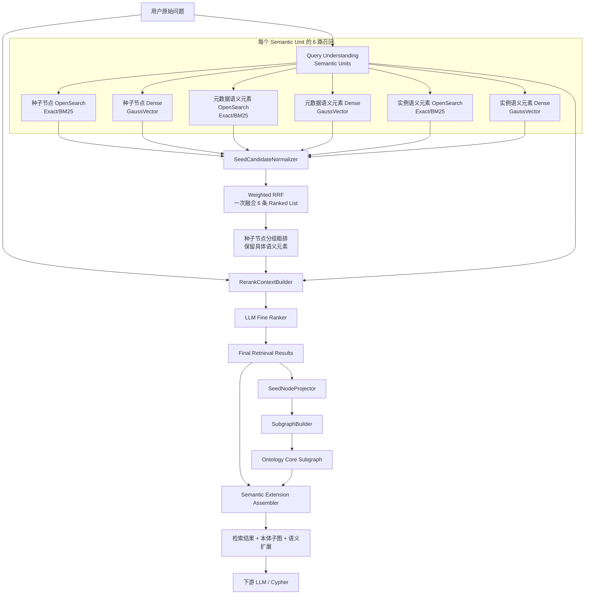
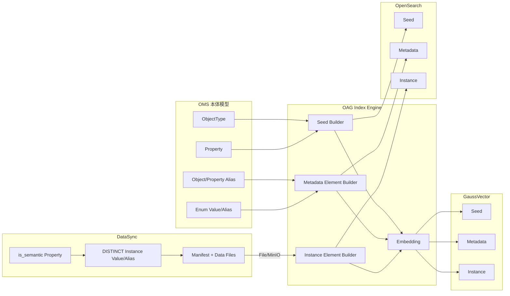
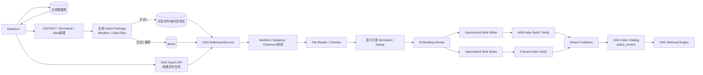
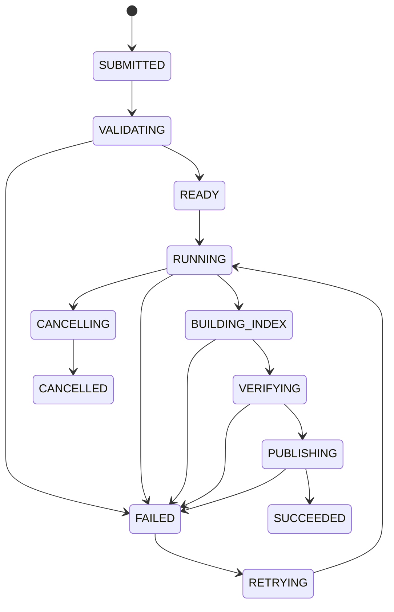
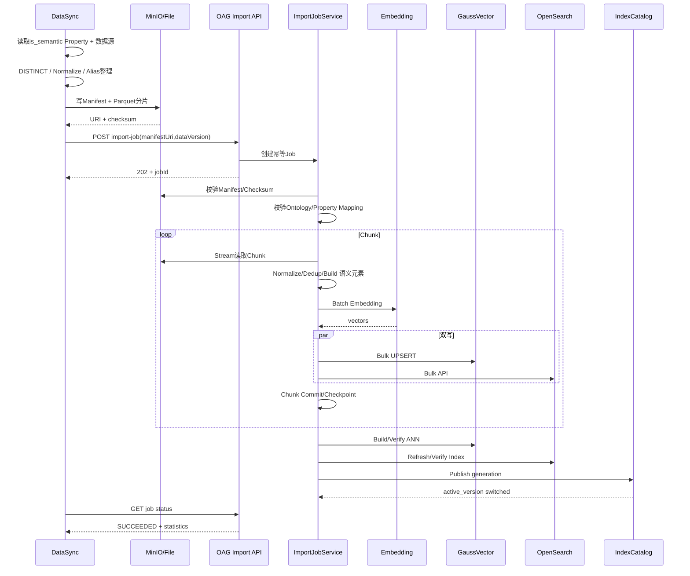
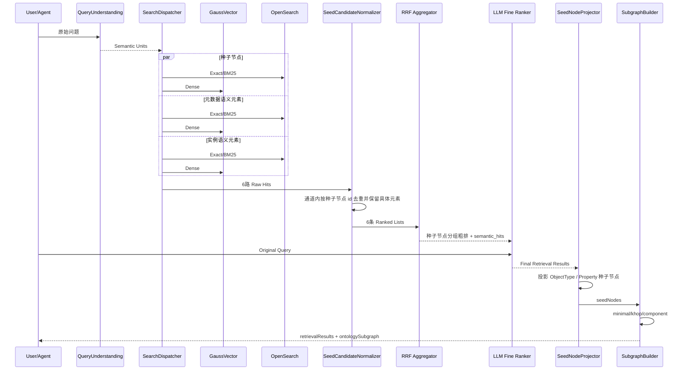

# OAG 面向本体种子节点的语义检索、混合排序与本体子图构建设计方案

> 版本：V5.4  
> 目标：在不丢失既有索引、Bulk Import、混合召回、RRF、LLM 精排和子图算法设计的基础上，统一术语、收敛字段、重排章节，并保持与 OAG 现有种子节点表结构兼容。  
> 核心决策：**ObjectType/Property = 种子节点；Alias/Enum/Instance = 语义元素；所有记录自身主键统一为 `id`；每个 Semantic Unit 默认 6 路一次 Weighted RRF。**

---

## 文档结构

1. 设计目标、术语与总体架构  
2. 数据模型与索引结构  
3. 索引构建与 DataSync Bulk Import  
4. Query Understanding 与 6 路召回  
5. LLM 精排与最终检索结果  
6. 种子节点投影与本体子图构建  
7. 性能、配置、可观测性、评测与迁移  

> 本次章节整理将原 V5.3 的 116 个一级章节完整归并到以上 7 个主章节；已有 Bulk Import、三类子图算法、GraphTopologyCache、性能/评测/灰度等信息均保留，只做术语、字段和执行顺序上的收敛。

---

# 1. 设计目标、术语与总体架构


## 1.1 设计目标与边界

OAG 同时承担三类能力：索引构建、语义检索和本体子图构建。为了减少概念数量，本方案统一使用以下三个业务概念：

```text
种子节点（Seed Node）
  = ObjectType / Property

语义元素（Semantic Element）
  = ObjectType/Property 同义词、Enum Value/Alias、Instance Value/Alias

检索结果（Retrieval Result）
  = 命中的种子节点或语义元素本身 + ObjectType / Property 上下文
```

需要明确：

```text
最终检索结果
        ≠
图算法输入
```

最终检索目标包括：

```text
ObjectType
Property
ObjectType Alias
Property Alias
Enum Value
Enum Alias
Instance Value
Instance Alias
```

其中 ObjectType / Property 本身就是种子节点；Alias / Enum / Instance 属于语义元素。语义元素命中后不能只返回其所属 Property，而必须保留语义元素本身。

例如：

```text
用户：正式用户
   ↓
命中：ENUM_ALIAS = FORMAL
canonical_value = 1
   ↓
所属 Property：Subscriber.subClass
所属 ObjectType：Subscriber
```

最终返回 `FORMAL` 本身，同时携带 `Subscriber.subClass + Subscriber`。随后子图构建阶段只提取 ObjectType / Property 作为种子节点。

本方案只排除以下内容作为业务检索结果：

```text
底层 Vector 文档物理身份
OpenSearch 内部 _id
ANN distance / BM25 _score / RRF score 本身
```

这些只属于检索实现和排序信息。


## 1.2 端到端总体架构



运行阶段统一为：

```text
阶段0：索引构建 / Bulk Import
阶段1：Query Understanding / Semantic Units
阶段2：6 路召回
阶段3：一次 Weighted RRF 粗排
阶段4：LLM 精排
阶段5：检索结果 → 种子节点投影
阶段6：minimal / khop / component 子图构建
阶段7：语义扩展与 Cypher 上下文组装
```

核心边界：

> **检索层返回“命中的对象本身”，图算法只消费 ObjectType / Property 种子节点。**


## 1.3 与现有 OAG 代码的兼容基线

当前代码已经形成以下主链路：

```text
graphSearchV3()
  └─ performGraphSearchOptimized()
       ├─ interpretQueryIntent()
       ├─ getSeedIds()
       │    ├─ vectorService.searchOntologyByQuery()
       │    ├─ elasticSearchRestRepository.searchOntologyByQuery()
       │    └─ hybridRecallHelper.hybridRecall()
       ├─ loadAllEdges()
       └─ subgraphQuery()
            ├─ getPathInfos()
            │    ├─ computePairwiseShortestPaths()
            │    └─ computePairwiseNumPaths()
            │          └─ findAllPath()
            └─ buildMstSubgraph() / buildAllSubgraph()
```

现有请求参数主要包括：

```text
graphExpansionStrategy = minimal
hopLimit = 3
seedRetrievalMode = vector
topK = 3
includeFunctions = 0
includeActions = 0
```

V5.4 不要求一次性替换现有链路，而是在现有类和接口上渐进演进：

```text
现有 getSeedIds()
    ↓
SearchDispatcher
    ↓
SemanticCandidateNormalizer
    ↓
Weighted RRF 种子节点分组
    ↓
LLM Fine Ranker
    ↓
Final Semantic Matches
    ├─ ObjectType / Property
    ├─ Alias
    ├─ Enum Value / Alias
    └─ Instance Value / Alias
    ↓
SeedNodeProjector
    ↓
最终图构建种子节点
```

现有 `seedIds` / `seedNodes` 仍然可以作为**图构建种子节点兼容字段**保留，但不能再代表完整检索结果；完整检索结果由新增的 `retrievalResults` 表达。

现有 `subgraphQuery()`：

```text
保留 external strategy 名称
    ↓
minimal / khop / component
    ↓
内部支持 legacy / enhanced 两套算法
```

因此本次调整不改变三种图算法的边界，只改变“检索输出是什么”以及“何时投影成 种子节点”。

---


## 1.4 核心设计原则

### 设计原则 1：种子节点是图构建语义，不是所有检索结果的唯一身份

ObjectType / Property 统一称为**种子节点**。Alias / Enum / Instance 统一称为**语义元素**。

所有物理表的 `id` 都表示“当前记录自身的 ID”：

```text
种子节点表：id = ObjectType / Property 的本体 ID
元数据表：id = Alias / Enum 元素自身 ID
实例表：id = Instance Value / Alias 元素自身 ID
```

语义元素通过：

```text
parent_id
```

指向所属种子节点。

### 设计原则 2：Matched Item 必须保留

语义元素命中后：

```text
不能：语义元素 → Property → 丢弃语义元素
```

必须返回：

```text
语义元素自身 id/type/name/canonical_value
+
所属 Property / ObjectType 上下文
```

### 设计原则 3：RRF 按种子节点分组，组内保留具体元素

RRF 的公平性单位是种子节点：

```text
种子节点命中：分组 ID = hit.id
语义元素命中：分组 ID = hit.parent_id
```

这样同一个 Property 即使拥有大量 Alias / Enum / Instance，也不会因为元素数量多而被重复加分。

### 设计原则 4：Core Graph 与语义元素分离

```text
图算法：ObjectType / Property / Relation
语义扩展：Alias / Enum / Instance
```

语义元素可以是最终检索结果，但不直接作为最短路径、K-hop、Connected Component 的拓扑节点。

### 设计原则 5：召回保 Recall，RRF 保公平，LLM 保 Precision，Graph 保最小充分

```text
多路召回：宁可多召回
RRF：稳定融合不同引擎排序
LLM：结合原始问题和上下文做语义裁决
Graph：只返回支持推理/Cypher 的必要拓扑
```


# 2. 数据模型与索引结构


## 2.1 种子节点与语义元素模型

### 种子节点

当前种子节点只包括：

```text
type = 0：ObjectType
type = 1：Property
```

Relation / Function / Action / Metric 仍保留为未来可扩展类型，但**当前不进入种子节点主表的 0/1 类型定义**；Function/Action 继续按后文扩展能力返回。

种子节点物理记录统一使用现有 OAG 字段：

```text
vector
type
id
name
display_zh
display_en
description_zh
description_en
```

其中：

```text
id = 本体元素全局唯一 ID
```

不再引入另一套种子节点/语义元素主键概念，统一使用 `id`。

### 语义元素

语义元素包括：

| 类型 | 含义 | parent_id 指向 |
|---|---|---|
| `OBJECT_ALIAS` | ObjectType 同义词 | ObjectType 种子节点 |
| `PROPERTY_ALIAS` | Property 同义词 | Property 种子节点 |
| `ENUM_VALUE` | 枚举真实值 | Property 种子节点 |
| `ENUM_ALIAS` | 枚举值同义词 | Property 种子节点 |
| `INSTANCE_VALUE` | 实例列值 | Property 种子节点 |
| `INSTANCE_ALIAS` | 实例值同义词 | Property 种子节点 |

语义元素不再使用旧的多组 ID/Type 映射字段。字段统一简化为：

```text
id          当前语义元素自身 ID
type        当前语义元素类型
parent_id   所属种子节点 ID
name        当前可检索字符串
canonical_value 真实业务值，可空
```

### 统一检索结果

OAG 对上层统一返回：

```json
{
  "id": "enum-alias-id",
  "type": "ENUM_ALIAS",
  "name": "FORMAL",
  "canonical_value": "1",
  "objectType": {
    "id": "subscriber-object-id",
    "name": "Subscriber"
  },
  "property": {
    "id": "subClass-property-id",
    "name": "subClass"
  },
  "source": "METADATA",
  "rrf_score": 0.071,
  "rerank_score": 0.97
}
```

ObjectType / Object Alias 场景 `property` 可为空；其余 Property/Enum/Instance 场景必须补齐 Property + ObjectType。

`type` 的使用约定：

```text
物理表：使用 INT 枚举，保证现有表结构和存储效率
OAG API：适配为 OBJECT_TYPE / PROPERTY / ENUM_ALIAS 等字符串，提升可读性
```

因此不再增加多套平行的类型字段；物理表只保留一个 `type`。


## 2.2 三类物理索引划分

逻辑上只保留三类数据：

```text
种子节点
元数据语义元素
实例语义元素
```

物理上继续三表/三索引隔离：

| 逻辑类型 | 推荐物理表/Index | Owner | 数据 | 典型规模 |
|---|---|---|---|---|
| 种子节点 | `{ontology_id}_anchor`（现有物理名可继续兼容） | OAG | ObjectType / Property | 万～百万 |
| 元数据语义元素 | `{ontology_id}_metadata_evidence`（现有物理名可继续兼容） | OAG | Alias / Enum | 万～百万 |
| 实例语义元素 | `{ontology_id}_instance_evidence`（现有物理名可继续兼容） | OAG，DataSync 提供数据 | Instance Value / Alias | 百万～千万/亿 |

> 文档语义统一使用“种子节点/元数据语义元素/实例语义元素”；现有物理表名为了兼容代码和存量索引可以暂不修改。

三类数据保持物理隔离的原因：

```text
规模差异
更新频率差异
ANN 算法差异
数据 Owner 差异
检索 TopK / 阈值差异
```


## 2.3 GaussVector 种子节点表结构

推荐沿用现有 OAG 种子节点表结构，不扩展无必要字段：

```text
{ontology_id}_anchor
```

| 字段 | 类型 | 非空 | 说明 |
|---|---|---|---|
| `vector` | `DOUBLE[]` | ✔ | 1024 维向量 |
| `type` | `INT` | ✔ | 0 ObjectType，1 Property |
| `id` | `VARCHAR(256 CHAR)` | ✔ | 本体元素全局唯一 ID |
| `name` | `VARCHAR(256 CHAR)` | ✔ | 本体真实名称 |
| `display_zh` | `VARCHAR(512 CHAR)` |  | 中文显示名 |
| `display_en` | `VARCHAR(512 CHAR)` |  | 英文显示名 |
| `description_zh` | `VARCHAR(1024 CHAR)` |  | 中文描述 |
| `description_en` | `VARCHAR(1024 CHAR)` |  | 英文描述 |

示例：

| vector | type | id | name | display_zh | display_en | description_zh | description_en |
|---|---|---|---|---|---|---|---|
| `[0.123, -0.456, ...]` | 0 | `dtmi:com:huawei:ict:Cell:1.0` | `Cell` | 无线小区 | Cell | 通信网络中的小区实体 | Cell in communication network |
| `[0.789, 0.234, ...]` | 1 | `dtmi:com:huawei:ict:throughput:1.0` | `throughput` | 吞吐量 | Throughput | 小区吞吐量指标 | Cell throughput metric |

明确去除以下种子节点表字段：

```text
normalized_name
content_hash
model_version
source_version
updated_at
parent_id
aliases
i18n_content
content
```

Property → ObjectType 映射由本体 `has_property` 关系和 `GraphTopologyCache` 提供，不在种子节点向量表重复存储。


## 2.4 种子节点 Vector 内容

种子节点向量只表达种子节点自身语义，Embedding 输入在 OAG 内存中临时组装，不要求持久化 `content` 字段：

```text
{name}
{display_zh}
{display_en}
{description_zh}
{description_en}
```

当前 BGE-M3 向量维度继续沿用：

```text
1024
```

同义词已经作为独立的元数据语义元素建索引，因此不再把全部 Alias 拼进种子节点向量，避免同一个检索目标在两类索引中重复表达。

Embedding 批大小、重试次数属于 OAG 工程配置，不进入物理表 Schema。


## 2.5 多语言向量设计

当前核心物理表仅保留中英文显示名和描述：

```text
display_zh / display_en
description_zh / description_en
```

同一记录默认生成一个多语言向量：

```text
name + 中文 + 英文
```

不按语言拆成多条种子节点记录，避免同一 `id` 占用多个 TopK 位置。

如果未来评测证明某语言 Recall 明显不足，可以增加 Shadow Vector，但必须满足：

```text
Shadow Vector 只是内部索引副本
最终仍按同一记录 id 去重
不改变业务返回结构
```

其他语言可在后续 Schema 版本中扩展，不在当前兼容表中增加 `i18n_content`。


## 2.6 Property Vector 是否带 ObjectType

Property Dense 向量默认不增加 ObjectType 名称前缀：

```text
推荐：
throughput
吞吐量
Throughput
小区吞吐量指标
Cell throughput metric
```

不推荐默认：

```text
Cell
throughput
...
```

原因：

1. 用户经常只表达属性概念；
2. ObjectType 前缀容易改变向量语义重心；
3. 同名 Property 的消歧由原始问题、其他 Semantic Units、LLM 精排和本体关系完成；
4. Property → ObjectType 映射由拓扑缓存提供，不需要依赖向量文本恢复。

如果评测显示同名 Property 冲突严重，可增加内部 Shadow Vector，但最终仍回到同一 Property `id`。


## 2.7 OpenSearch 种子节点索引

推荐 OpenSearch 种子节点 Index 与 GaussVector 核心字段保持一致：

```text
{ontology_id}_anchor
```

| 字段 | OpenSearch 类型 | 说明 |
|---|---|---|
| `type` | `integer` | 0 ObjectType / 1 Property |
| `id` | `keyword` | 本体元素 ID |
| `name` | `keyword` + `text` | 真实名称，支持 Exact/BM25 |
| `display_zh` | `keyword` + `text` | 中文显示名 |
| `display_en` | `keyword` + `text` | 英文显示名 |
| `description_zh` | `text` | 中文描述 |
| `description_en` | `text` | 英文描述 |

明确不保留：

```text
normalized_name
source_version
content
i18n_content
```

检索优先级建议：

```text
id/name/display exact
> name/display phrase/BM25
> description BM25
```

字段规范化由 OpenSearch normalizer/analyzer 完成，不额外增加 `normalized_name`。


## 2.8 元数据语义元素表结构

元数据语义元素包括：ObjectType/Property 同义词、Enum Value、Enum Alias。

推荐物理表保持简单：

```text
{ontology_id}_metadata_evidence
```

| 字段 | 类型 | 非空 | 说明 |
|---|---|---|---|
| `vector` | `DOUBLE[]` | ✔ | 语义元素向量 |
| `type` | `INT` | ✔ | 0 OBJECT_ALIAS，1 PROPERTY_ALIAS，2 ENUM_VALUE，3 ENUM_ALIAS |
| `id` | `VARCHAR(512 CHAR)` | ✔ | 当前具体元素自身 ID |
| `parent_id` | `VARCHAR(256 CHAR)` | ✔ | 所属种子节点 ID |
| `name` | `VARCHAR(4096 CHAR)` | ✔ | 当前可检索字符串 |
| `canonical_value` | `VARCHAR(4096 CHAR)` |  | Enum Alias 对应真实值；非枚举可空 |
| `description_zh` | `TEXT` |  | 中文描述 |
| `description_en` | `TEXT` |  | 英文描述 |

相比旧模型，明确删除重复/冗余概念：

```text
多组 ID/Type 映射字段
父级名称冗余字段
normalized_value
content_hash
source_version
```

映射规则：

```text
OBJECT_ALIAS.parent_id   → ObjectType.id
PROPERTY_ALIAS.parent_id → Property.id
ENUM_VALUE.parent_id     → Property.id
ENUM_ALIAS.parent_id     → Property.id
```

Enum 定义引用不再作为向量表必备字段；如精排/Cypher 需要完整 EnumType 信息，OAG 根据当前语义元素 `id + parent_id` 从 OMS 元数据缓存补充，避免在每条向量记录重复保存 `enum_ref`。

ObjectType 上下文在运行时通过 Property → ObjectType 拓扑补齐。


## 2.9 元数据语义元素 Vector 规则

元数据语义元素 Dense 内容坚持“元素本身优先”：

```text
{name}
{canonical_value（适用时）}
{description_zh}
{description_en}
```

不默认在向量开头拼接 ObjectType / Property 名称，避免父级上下文压过实际 Alias/Enum 语义。

如果同一个 Enum 被多个 Property 复用，应为每个 Property 建立独立语义元素记录：

```text
id 唯一
parent_id = 对应 Property.id
```

这样相同枚举值可以在不同 Property 上分别召回和精排，而不会丢失 Property 归属。


## 2.10 统一 id 设计

所有记录统一使用字段名 `id`，不再引入其他平行 ID 字段。

ID 规则：

```text
种子节点：直接使用 OMS 中 ObjectType / Property 全局 ID
元数据语义元素：优先使用源模型中该 Alias/Enum 元素的稳定 ID
实例语义元素：优先使用 DataSync 提供的稳定元素 ID
```

如果源数据没有独立 ID，则由 OAG 稳定构造：

```text
{parent_id}::{type}::{source_key}
```

例如：

```text
PropertyId::ENUM_VALUE::SubClass::1
PropertyId::ENUM_ALIAS::SubClass::1::FORMAL
PropertyId::INSTANCE_VALUE::VIP
PropertyId::INSTANCE_ALIAS::VIP::高价值客户
```

只允许在 `source_key` 过长时局部 Hash，不对种子节点 `id` 做 Hash。


## 2.11 实例语义元素表结构

实例语义元素物理表：

```text
{ontology_id}_instance_evidence
```

Owner：OAG；DataSync 通过 Bulk Import 提供数据。

推荐与元数据语义元素保持同构：

| 字段 | 类型 | 非空 | 说明 |
|---|---|---|---|
| `vector` | `DOUBLE[]` | ✔ | 实例语义向量 |
| `type` | `INT` | ✔ | 0 INSTANCE_VALUE，1 INSTANCE_ALIAS |
| `id` | `VARCHAR(512 CHAR)` | ✔ | 当前具体元素自身 ID |
| `parent_id` | `VARCHAR(256 CHAR)` | ✔ | 所属 Property.id |
| `name` | `VARCHAR(4096 CHAR)` | ✔ | 实例值或实例同义词 |
| `canonical_value` | `VARCHAR(4096 CHAR)` | ✔ | 真实业务值；INSTANCE_VALUE 时通常等于 name |
| `description_zh` | `TEXT` |  | 可选业务描述 |
| `description_en` | `TEXT` |  | 可选业务描述 |

`INSTANCE_ALIAS` 保留真实业务支持。Alias 本身是独立检索目标，通过 `canonical_value` 映射到真实实例值。


## 2.12 Instance Value 向量准入规则

`is_semantic=true` 是必要条件，不是充分条件。

推荐：

```text
semantic_enabled =
  is_semantic
  AND datatype_eligible
  AND value_shape_eligible
  AND cardinality_eligible
```

### 只索引 DISTINCT Value

例如：

```text
5000万 Subscriber 行
subLevel 只有 VIP/GOLD/SILVER/NORMAL
```

只生成 4 组 Value 语义元素，而不是 5000 万个向量。

### 默认不向量化

以下值通常不进入 Dense：

```text
UUID
手机号
纯技术主键
时间戳
日期
连续数值
高随机编码
```

它们仍可在 OpenSearch keyword / 数据源查询中精确处理。

### 适合向量化

```text
产品名称
品牌名称
客户等级
区域名称
业务状态
自然语言标签
人可理解业务分类
```

### 高基数自由文本

高基数自然语言长文本不应无限进入 Instance 语义元素。

建议进入单独的：

```text
Document / RAG Index
```

而不是本体 种子节点 Resolver 的 Instance Value Index。

---


## 2.13 实例语义元素 Vector 内容

实例语义元素 Dense 内容：

```text
{name}
{canonical_value}
{description_zh}
{description_en}
```

坚持：

> **Value First，Property Context 不写入向量主文本。**

Property 归属使用 `parent_id` 确定，ObjectType 归属由本体拓扑补齐，而不是从向量文本解析。


## 2.14 OpenSearch 语义元素索引

Metadata / Instance 两个 OpenSearch Index 使用与对应 GaussVector 表一致的业务字段：

```text
type             integer
id               keyword
parent_id        keyword
name             keyword + text
canonical_value  keyword + text
description_zh   text
description_en   text
```

Exact Priority：

```text
id
name.keyword
canonical_value.keyword
```

BM25：

```text
name
description_zh
description_en
```

不再保留：

```text
normalized_value
source_version
content
aliases 数组
```

Alias 已经作为独立语义元素记录，不需要再在同一文档中重复存一个 Alias 数组。


## 2.15 规范化规则

规范化属于索引构建/查询处理逻辑，不增加额外持久化字段。

推荐在写入和查询侧使用一致规则：

```text
trim
Unicode normalize
casefold（适用语言）
连续空白归一
全半角归一
```

原始 `name` 和 `canonical_value` 始终保留；OpenSearch 通过 normalizer/analyzer 实现 Exact/BM25 规范化，GaussVector 在生成 Embedding 文本前使用相同基础规范化。


## 2.16 language_hint 与语言处理

为了减少持久化字段，当前物理表**不保存 `term_language`**。

查询理解阶段可以输出：

```text
language_hint = zh / en / mixed / und
```

它只用于：

```text
OpenSearch analyzer 选择/Boost
可观测性
LLM Context
```

Dense 检索不使用语言强过滤。对于 `FORMAL / IOT_FORMAL / A001` 等无法可靠判断语言的 Token，统一视为 `und`，不增加持久化字段。

## 2.17 数据质量治理

OAG 元数据同步阶段必须检查：

```text
Alias 与 Canonical 重复
Alias 重复
同一 ObjectType 下 Property Alias 冲突
一个 Alias 映射多个不相关 种子节点
Enum Ref 不存在
Enum Value 重复
Enum Alias 冲突
Description 多语言格式错误
Parent ObjectType 缺失
```

冲突处理原则：

```text
不能静默覆盖
必须可观测
必要时阻断当前 语义元素 入库
```

DataSync 额外检查：

```text
空值
超长 Value
distinct_count
高基数
无意义随机串
Instance Alias 冲突
```

---


## 2.18 增量索引与幂等

所有表以 `id` 做幂等 UPSERT / DELETE 主键。

```text
同 id UPSERT → 覆盖当前记录
同 id DELETE → 删除 GaussVector + OpenSearch 对应记录
```

不在记录中保留：

```text
content_hash
model_version
source_version
updated_at
```

版本和构建信息统一放到 OAG 的 Import Job / Generation 元数据，不进入每条向量记录。

Embedding 模型升级时：

```text
创建新的 Generation
→ 全量重新 Embedding
→ Verify
→ 原子发布
```

如果未来需要“内容未变化则跳过 Embedding”，可以作为 OAG 内部缓存优化实现，但不扩展业务表 Schema。


## 2.19 GaussVector 索引算法

种子节点 / Metadata 语义元素：

```text
GsIVFFLAT
COSINE
```

适用规模：

```text
约 1*10^4 ～ 2*10^6
```

推荐：

```text
IVF_NLIST = 4 * sqrt(N)
```

其中：

```text
N = 当前物理表实际记录数
```

Instance 语义元素：

```text
中小规模 → GsIVFFLAT
千万 / 亿级 → GsDiskANN
```

Metadata 与 Instance 分表的一个核心原因就是允许 ANN 算法独立演进。

---


# 3. 索引构建与 DataSync Bulk Import


## 3.1 OAG 与 DataSync 职责边界

### OAG

OAG 是统一索引构建和检索引擎，负责：

```text
OMS 元数据读取
种子节点索引
元数据语义元素索引
实例语义元素 Bulk Import
Embedding
GaussVector / OpenSearch 写入
ANN/全文索引构建
Generation 发布
在线检索
```

### DataSync

DataSync 负责：

```text
读取 is_semantic=true Property
访问实际数据源
DISTINCT / 基础标准化
整理 INSTANCE_VALUE / INSTANCE_ALIAS
建立实例数据与 Property 的映射
生成 Manifest + Data Files
通过 File / MinIO 交付 OAG
```

DataSync 不负责：

```text
Embedding
GaussVector / OpenSearch Client
ANN 参数
物理表结构
索引发布
```

统一关联方式：

```text
DataSync Manifest.propertyId
   ↓
OAG 校验 Property
   ↓
实例语义元素 parent_id = Property.id
```

ObjectType 上下文不要求 DataSync 每行重复传输，由 OAG 通过本体拓扑缓存补齐。


## 3.2 完整索引构建流程



种子节点表保持现有 8 字段；语义元素用 `id + type + parent_id + name + canonical_value` 建模。


## 3.3 OAG 实例数据 Bulk Import 总体设计

本节定义 OAG 的大规模实例语义元素导入能力。

职责边界：

```text
DataSync
  负责：数据源访问 / DISTINCT / 基础标准化 / 实例值与 Property 映射 / 文件生成

OAG
  负责：导入任务 / Mapping 校验 / 语义元素构造 / Embedding
       / GaussVector / OpenSearch / ANN / Generation 发布 / 在线检索
```

核心原则：

> **DataSync 交付“实例数据 + Property 映射”，OAG 把它转换为实例语义元素索引。**

大数据不通过同步 JSON Body 直接灌入 OAG。生产默认使用 MinIO，兼容 File/Shared Storage；REST API 只负责创建任务、状态查询、重试、取消和错误报告。


## 3.4 Bulk Import 总体架构



设计上严格分为：

```text
控制面：REST API + Import Job Metadata
数据面：File / MinIO + Streaming Reader
计算面：Normalize + Embedding + Bulk Writer
存储面：GaussVector + OpenSearch
发布面：Version/Generation Switch
```

---


## 3.5 为什么采用 File / MinIO 中转

不推荐：

```text
DataSync
  ↓
每100/1000条同步HTTP JSON
  ↓
OAG实时Embedding并写库
```

原因：

1. 大量 HTTP 请求放大序列化、网络和连接开销；
2. DataSync 与 OAG 强耦合，OAG短时限流会反压数据同步链路；
3. Embedding、GaussVector、OpenSearch 任一阶段抖动都会导致同步调用超时；
4. 难以做到断点续传和批次级重试；
5. 重试容易造成重复数据；
6. 无法方便保存原始输入用于失败复盘；
7. 大批量全量重建时需要数十分钟甚至更长，天然不适合同步接口。

推荐：

```text
DataSync 先生成不可变批量文件
      ↓
OAG 创建异步 Import Job
      ↓
OAG 自己按可承受速率消费
```

MinIO 模式优先级最高，原因是：

```text
支持大文件
天然跨Pod/跨节点
易于校验checksum
易保留失败现场
支持生命周期清理
DataSync/OAG无需共享本地磁盘
```

共享文件模式主要作为：

```text
单机/边缘部署
无MinIO环境
测试环境
兼容模式
```

---


## 3.6 导入模式

支持两类主模式：

### FULL_REPLACE

表示 DataSync 提交某个导入 Scope 的完整实例语义快照。

```text
旧 active generation
       ↓
创建 staging generation
       ↓
全量导入
       ↓
构建 ANN / OpenSearch Index
       ↓
一致性校验
       ↓
原子发布 active generation
       ↓
异步清理旧 generation
```

适合：

```text
首次建库
Embedding模型升级后的重建
大规模数据重新同步
实例语义索引整体修复
```

### INCREMENTAL

每条记录携带：

```text
UPSERT
DELETE
```

按照稳定 `id` 幂等修改当前 active generation。

适合：

```text
日常增量同步
新增枚举式实例值
实例 Alias 调整
数据源删除值
```

FULL_REPLACE 推荐支持 Scope：

```text
ONTOLOGY
OBJECT_TYPE
PROPERTY_SET
PROPERTY
```

大规模场景优先 Property/PropertySet 分区，可减少一次全量重建范围。

---


## 3.7 Import Package 结构

一个 Import Package 由：

```text
manifest.json
+
N 个 data file
```

组成。

推荐目录：

```text
/oag-import/{ontology_id}/{data_version}/{job_request_id}/
  manifest.json
  property_001/part-00000.parquet
  property_001/part-00001.parquet
  property_002/part-00000.parquet
  ...
```

推荐文件格式：

| 格式 | 建议 | 场景 |
|---|---|---|
| Parquet + Snappy/ZSTD | **首选** | 千万/亿级、批量、高吞吐 |
| NDJSON + gzip | 支持 | 兼容、调试、流式生成 |
| CSV | 不推荐作为主格式 | Alias数组、转义、多语言复杂 |

推荐一个文件只承载一个 Property 种子节点 的实例 语义元素；这样：

```text
id / parent_id / property mapping
```

可以放在 Manifest 中，不必在每行重复，能明显减少数据体积。

若业务必须混合多个 Property，可启用：

```text
mappingMode = PER_RECORD
```

由每条记录携带 Property ID，但不是默认方案。

---


## 3.8 Manifest 设计

Manifest 示例：

```json
{
  "schemaVersion": "1.0",
  "ontologyId": "dtmi.ontology.xxx.1",
  "dataVersion": "20260811-001",
  "requestId": "datasync-20260811-000001",
  "generatedAt": "2026-08-11T08:20:00+08:00",
  "sourceSystem": "datasync",
  "importMode": "FULL_REPLACE",
  "scope": "PROPERTY_SET",
  "files": [
    {
      "uri": "minio://oag-import/.../subclass/part-00000.parquet",
      "format": "PARQUET",
      "compression": "SNAPPY",
      "sizeBytes": 268435456,
      "rowCount": 1200000,
      "sha256": "...",
      "mapping": {
        "propertyId": "subClass-property-id",
        "propertyName": "subClass",
        "isSemantic": true,
        "idColumn": "id",
        "typeColumn": "type",
        "nameColumn": "name",
        "canonicalValueColumn": "canonical_value",
        "operationColumn": "op"
      }
    }
  ]
}
```

一个文件推荐只承载一个 Property 的实例语义元素，因此 `parent_id` 不必在每行重复；OAG 根据 Manifest.propertyId 写入 `parent_id`。

Manifest 必须使用 `schemaVersion` 做协议版本化。


## 3.9 Data File Record 设计

Property 固定映射模式下，每行只传语义元素自身信息。

#### INSTANCE_VALUE

```json
{
  "id": "subscriber-subClass::INSTANCE_VALUE::VIP",
  "type": "INSTANCE_VALUE",
  "name": "VIP",
  "canonical_value": "VIP",
  "op": "UPSERT"
}
```

#### INSTANCE_ALIAS

```json
{
  "id": "subscriber-subClass::INSTANCE_ALIAS::VIP::高价值客户",
  "type": "INSTANCE_ALIAS",
  "name": "高价值客户",
  "canonical_value": "VIP",
  "op": "UPSERT"
}
```

OAG 内部转换：

```text
Manifest.propertyId
+
Record.id/type/name/canonical_value
   ↓
parent_id = Property.id
   ↓
Embedding + GaussVector/OpenSearch
```

DataSync 不发送：

```text
vector
Embedding模型版本
OpenSearch document
GaussVector物理表名
ANN参数
```


## 3.10 id 生成与幂等

所有语义元素直接使用 `id` 作为幂等键。

优先级：

```text
DataSync 提供稳定 id
>
OAG 根据 parent_id + type + source_key 稳定构造
```

同一个 Job/Chunk 重试：

```text
UPSERT 同 id → 覆盖/无变化，不产生重复
DELETE 同 id → 删除 GaussVector + OpenSearch
```

幂等作用域：

```text
ontology_id + generation + id
```

不再引入单独的语义元素 ID 字段，统一使用记录自身 `id`。


## 3.11 OAG Import API

接口采用异步 Job 模型。

### 创建导入任务

```http
POST /v1/ontologies/{ontologyId}/instance-elements/import-jobs
Content-Type: application/json
```

MinIO 请求：

```json
{
  "requestId": "datasync-20260811-000001",
  "dataVersion": "20260811-001",
  "importMode": "FULL_REPLACE",
  "transport": {
    "type": "MINIO",
    "manifestUri": "minio://oag-import/dtmi.ontology.xxx.1/20260811-001/manifest.json",
    "connectionRef": "oag-shared-minio"
  },
  "validateOnly": false
}
```

返回：

```http
HTTP/1.1 202 Accepted
```

```json
{
  "jobId": "imp-01K2...",
  "requestId": "datasync-20260811-000001",
  "status": "SUBMITTED",
  "ontologyId": "dtmi.ontology.xxx.1",
  "dataVersion": "20260811-001"
}
```

`requestId` 必须幂等：同一个 DataSync requestId 重复提交时返回原 Job，而不是重新执行。

### 查询任务

```http
GET /v1/ontologies/{ontologyId}/instance-elements/import-jobs/{jobId}
```

返回：

```json
{
  "jobId": "imp-01K2...",
  "status": "RUNNING",
  "stage": "EMBEDDING",
  "progress": 0.63,
  "statistics": {
    "fileCount": 32,
    "totalRows": 15000000,
    "parsedRows": 10000000,
    "deduplicatedRows": 9500000,
    "embeddedRows": 9000000,
    "vectorWrittenRows": 8700000,
    "openSearchWrittenRows": 8700000,
    "failedRows": 12
  },
  "startedAt": "...",
  "updatedAt": "..."
}
```

### 重试

```http
POST /v1/ontologies/{ontologyId}/instance-elements/import-jobs/{jobId}:retry
```

仅重跑：

```text
FAILED / RETRYABLE chunks
```

不从文件头全部重来。

### 取消

```http
POST /v1/ontologies/{ontologyId}/instance-elements/import-jobs/{jobId}:cancel
```

取消后：

```text
停止领取新 Chunk
正在执行的 Chunk 完成或超时退出
staging generation 不发布
```

### 错误报告

```http
GET /v1/ontologies/{ontologyId}/instance-elements/import-jobs/{jobId}/errors
```

大错误报告建议返回：

```json
{
  "errorReportUri": "minio://oag-import-errors/.../errors.parquet"
}
```

避免将百万级错误行直接塞进 HTTP Response。

---


## 3.12 File 模式接口

File 模式支持两种部署形态。

### Shared Path

DataSync 与 OAG 能访问同一共享文件系统：

```json
{
  "transport": {
    "type": "FILE",
    "manifestUri": "file:///oag-import/xxx/manifest.json"
  }
}
```

OAG 必须限制允许的根目录：

```text
/oag-import
```

禁止任意文件系统路径访问。

### OAG Staging Upload

无共享盘但文件不太大时，可先上传 OAG staging：

```http
POST /v1/ontologies/{ontologyId}/instance-elements/staging-files
Content-Type: multipart/form-data
```

返回内部：

```text
staging://{uploadId}/manifest.json
```

再使用 Import Job API 创建任务。

对于超大文件仍推荐 DataSync 直接上传 MinIO，避免 OAG API Pod 成为文件转发瓶颈。

---


## 3.13 MinIO 模式设计

推荐生产默认模式：

```text
DataSync → MinIO → OAG
```

关键约束：

1. DataSync 上传完成后才提交 Job；
2. Manifest 和 Data File 在 Job 生命周期中视为 immutable；
3. OAG 校验 `size + ETag/sha256`；
4. 文件变化则拒绝继续断点任务；
5. OAG 使用预配置 `connectionRef` 获取凭据；
6. API 请求中禁止传长期 `accessKey/secretKey`；
7. OAG 流式读取 Object，不要求完整下载到本地；
8. import prefix 配置生命周期，成功后延时清理。

MinIO Object Key 推荐包含：

```text
ontology_id
data_version
request_id
property_id
part_number
```

便于：

```text
问题定位
生命周期清理
权限隔离
任务重跑
```

---


## 3.14 Import Job 状态机



状态含义：

| 状态 | 含义 |
|---|---|
| SUBMITTED | API已接收 |
| VALIDATING | Manifest、文件、本体映射校验 |
| READY | 可以开始消费 |
| RUNNING | Parse/Normalize/Embedding/Bulk Write |
| BUILDING_INDEX | 构建/刷新ANN和全文索引 |
| VERIFYING | 双存储数量/checksum抽检 |
| PUBLISHING | 发布新的 active generation |
| SUCCEEDED | 成功 |
| FAILED | 失败，可判断是否可重试 |
| CANCELLED | 用户取消，未发布 |

---


## 3.15 OAG 内部处理流水线

```text
ImportJobService
   ↓
ManifestValidator
   ↓
OntologyMappingValidator
   ↓
ObjectReader(File/MinIO)
   ↓
ChunkPlanner
   ↓
RecordParser
   ↓
SemanticElementNormalizer
   ↓
Deduplicator(id)
   ↓
EmbeddingTextBuilder
   ↓
EmbeddingBatcher
   ↓
┌──────────────────────┐
│                      │
GaussVectorBulkWriter  OpenSearchBulkWriter
│                      │
└──────────┬───────────┘
           ↓
ChunkCommitCoordinator
           ↓
IndexBuilder / Verifier
           ↓
GenerationPublisher
```

OAG 统一复用：

```text
id/type/parent_id/name/canonical_value
Value First 向量规则
1024维 Embedding
```

DataSync 不复制索引和 Embedding 逻辑。


## 3.16 Chunk 与断点续传

导入不能以整个文件作为一个事务单元。

推荐：

```text
File
  ↓
Chunk
  ↓
Embedding Batch
  ↓
Storage Bulk Batch
```

Parquet：

```text
优先按 row group 切 Chunk
```

NDJSON：

```text
按 byte offset + record boundary 切 Chunk
```

Chunk ID 推荐：

```text
sha256(file_checksum + start_offset/row_group + end_offset)
```

每个 Chunk 持久化：

```text
chunk_id
file_uri
range
input_count
output_count
embedding_count
vector_write_count
os_write_count
retry_count
status
last_error
```

Worker 崩溃后：

```text
重新领取未 COMMITTED Chunk
```

已 COMMITTED Chunk 不重复执行；即使重复执行，稳定 id 仍保证幂等。

---


## 3.17 GaussVector 与 OpenSearch 双写一致性

OAG 不是使用分布式事务强行绑定两种存储，而采用：

> **Chunk 级幂等 + 状态协调 + 最终一致 + 发布前校验。**

流程：

```text
Chunk transformed
  ↓
GaussVector UPSERT
  ↓ success
OpenSearch BULK UPSERT
  ↓ success
Chunk = COMMITTED
```

如果：

```text
OpenSearch成功
GaussVector失败
```

Chunk 状态仍为 FAILED/RETRYABLE，重试时按照 `id` 幂等补写 GaussVector。

反之同理。

FULL_REPLACE 在所有 Chunk COMMITTED 前：

```text
禁止将 staging generation 暴露给在线查询
```

只有两边均通过 Verify 后才能 PUBLISH。

---


## 3.18 Full Import 的版本化发布

为了避免：

```text
全量导入一半时在线查询看到新旧混合数据
```

FULL_REPLACE 必须采用 Generation 模型。

逻辑：

```text
ontology_id
  ↓
instance_generation = g123
```

OpenSearch：

```text
建立 versioned physical index
完成后切 Alias
```

GaussVector：

如果底层没有原生 Alias，OAG 维护：

```text
IndexCatalog:
ontology_id + logical_index
  → active physical table/generation
```

检索永远通过 OAG 的 IndexCatalog 找 active generation，不允许调用方直接绑定物理表名。

发布操作：

```text
DB metadata transaction:
active_generation g122 → g123
```

旧 generation 延迟删除，保留短期 rollback 能力。

---


## 3.19 Incremental Import 一致性

INCREMENTAL 不创建完整新 generation，而对 active generation 做幂等变更。

每个 Record：

```text
UPSERT
DELETE
```

建议 DataSync 提供单调递增：

```text
dataVersion
```

OAG 对同一 Property 记录：

```text
last_applied_data_version
```

拒绝明显过旧的批次覆盖新数据。

对于乱序增量，需使用：

```text
source_update_version / event_time
```

做业务级版本判定。

---


## 3.20 本体映射校验

OAG 收到 Manifest Mapping 后必须验证：

```text
ontologyId 存在
Property ID 存在
Property.is_semantic == true
Property未删除/未失效
记录 type ∈ INSTANCE_VALUE / INSTANCE_ALIAS
记录 id 唯一/格式合法
INSTANCE_ALIAS.canonical_value 合法
```

ObjectType 通过本体 `has_property` 关系推导，不要求 DataSync 重复传输 `objectTypeId`。

Mapping 错误属于 `JOB_FATAL`，必须在大规模 Embedding 前失败。


## 3.21 行级错误与隔离

错误分两类。

### Job Fatal

```text
Manifest不可解析
Checksum不一致
Ontology不存在
Property映射非法
Embedding模型不可用
目标索引创建失败
```

直接停止 Job。

### Row Rejectable

```text
空Value
Value超长
非法UTF-8
Alias格式错误
不支持的type
单条标准化失败
```

可写入：

```text
Reject / DLQ File
```

推荐阈值：

```text
rejectRatio <= configured threshold
```

低于阈值允许任务继续并最终：

```text
SUCCEEDED_WITH_WARNINGS
```

超过阈值则 FAILED。

---


## 3.22 大数据量性能设计

### DataSync 侧

尽量提前：

```text
DISTINCT
过滤NULL/空串
基础Normalize
按Property分区
生成Parquet
```

避免把5000万业务明细行传给 OAG，再让 OAG 做 DISTINCT。

OAG仍执行轻量二次去重作为防御。

### 文件大小

建议起始值：

```text
单文件 128MB～512MB
```

避免：

```text
数十GB单文件 → 重试粒度过大
数百万小文件 → 对象存储/List开销过大
```

### Pipeline 并发隔离

分别配置：

```text
readerConcurrency
normalizeConcurrency
embeddingConcurrency
vectorWriterConcurrency
openSearchWriterConcurrency
```

中间使用有界 Queue：

```text
Reader快于Embedding
 → Queue满
 → Reader反压
```

禁止无限堆积内存。

### Embedding Batch

建议按模型吞吐评测配置，例如：

```text
64～256 records / batch
```

不是协议固定值。

### OpenSearch Bulk

建议同时以：

```text
doc count
bulk bytes
```

控制，例如起始：

```text
1000～5000 docs
或 5～15MB / bulk
```

FULL_REPLACE 的 staging index 可降低 refresh 频率，批量完成后再恢复并 refresh。

### GaussVector Bulk

优先批量写入，再在 FULL_REPLACE 数据加载完成后统一：

```text
Build/Rebuild ANN Index
```

避免每写一条记录都维护高成本 ANN 结构。

大规模 Instance 语义元素 根据前文规模策略选择：

```text
GsIVFFLAT
或
GsDiskANN
```

---


## 3.23 在线检索与导入资源隔离

OAG 同时承担：

```text
Online Retrieval
Bulk Indexing
```

必须保证：

> **在线查询优先级高于离线导入。**

推荐：

```text
独立线程池
独立连接池
Bulk QPS/并发限额
Embedding worker限额
OpenSearch Bulk限速
GaussVector写入限速
```

系统资源达到阈值时：

```text
暂停领取新的Import Chunk
```

而不是让在线检索 P95/P99 被批量导入拖垮。

同一 ontology：

```text
FULL_REPLACE 默认最多1个运行任务
```

避免两个 Generation 相互竞争。

---


## 3.24 MinIO / File 安全与可靠性边界

虽然本方案重点是性能和可靠性，接口仍需满足基础边界：

```text
connectionRef引用预配置凭据
禁止请求体明文secret
File模式限制根目录
MinIO bucket/prefix白名单
对象checksum校验
文件不可变校验
最大文件/任务配额
Manifest schema校验
```

Import Job 只允许访问：

```text
该任务 Manifest 明确声明的对象
```

不能把 OAG 变成通用 Object Storage Reader。

---


## 3.25 Import Metadata 表

建议 OAG 持久化四类任务元数据。

### import_job

```text
job_id
request_id
ontology_id
data_version
import_mode
scope
transport_type
manifest_uri
status
stage
active_generation_before
staging_generation
statistics
created_at
started_at
finished_at
last_error
```

### import_file

```text
job_id
file_id
uri
checksum
size
row_count
property_id
status
```

### import_chunk

```text
job_id
chunk_id
file_id
range
status
input_count
output_count
vector_write_count
os_write_count
retry_count
last_error
```

### import_generation

```text
ontology_id
generation_id
vector_physical_index
os_physical_index
status
created_by_job
created_at
published_at
```

这些状态是断点续传、重试、审计和版本发布的基础。

---


## 3.26 Import 可观测性

新增 Import 指标：

```text
import_job_count{status}
import_running_jobs
import_files_total
import_bytes_total
import_rows_total
import_rows_per_second
import_parse_latency
import_embedding_latency
import_embedding_batch_size
import_vector_write_latency
import_os_bulk_latency
import_chunk_retry_count
import_rejected_rows
import_checkpoint_lag
import_generation_build_latency
import_publish_latency
```

必须关联：

```text
job_id
ontology_id
data_version
property_id
```

日志中禁止打印完整海量业务值，只记录：

```text
source_key / id / truncated value / error code
```

---


## 3.27 错误码建议

| 错误码 | 含义 | 是否可重试 |
|---|---|---|
| IMPORT_MANIFEST_INVALID | Manifest格式错误 | 否 |
| IMPORT_SOURCE_NOT_FOUND | File/Object不存在 | 是/视情况 |
| IMPORT_SOURCE_CHANGED | ETag/checksum变化 | 否，需重新提交 |
| IMPORT_MAPPING_INVALID | 本体映射非法 | 否 |
| IMPORT_ONTOLOGY_VERSION_CONFLICT | 本体版本冲突 | 否/重新生成包 |
| IMPORT_EMBEDDING_UNAVAILABLE | Embedding不可用 | 是 |
| IMPORT_VECTOR_WRITE_FAILED | GaussVector写失败 | 是 |
| IMPORT_OS_BULK_FAILED | OpenSearch Bulk失败 | 是 |
| IMPORT_INDEX_BUILD_FAILED | ANN/全文索引构建失败 | 是 |
| IMPORT_VERIFY_FAILED | 双存储校验失败 | 是 |
| IMPORT_PUBLISH_FAILED | Generation发布失败 | 是 |
| IMPORT_REJECT_RATIO_EXCEEDED | 行错误比例超阈值 | 否/修数据 |
| IMPORT_CANCELLED | 用户取消 | 否 |

错误响应同时提供：

```text
面向调用方的message
面向开发定位的detail/errorStage/jobId/chunkId
```

---


## 3.28 Import 配置建议

```yaml
oag:
  import:
    enabled: true
    preferredTransport: minio

    job:
      maxRunningPerOntology: 1
      retryCount: 3
      retryBackoffMs: 1000

    file:
      allowedRoots:
        - /oag-import
      targetFileSizeMB: 256

    minio:
      allowedConnectionRefs:
        - oag-shared-minio
      allowedBuckets:
        - oag-import
      streamRead: true

    chunk:
      targetRows: 50000
      checkpointEnabled: true

    pipeline:
      readerConcurrency: 4
      normalizeConcurrency: 4
      embeddingConcurrency: 4
      vectorWriterConcurrency: 2
      openSearchWriterConcurrency: 2
      queueCapacity: 16

    embedding:
      batchSize: 128

    openSearch:
      bulkDocs: 2000
      bulkMaxBytesMB: 10

    reliability:
      verifyChecksum: true
      rejectRatioThreshold: 0.001
      retainFailedPackageDays: 7
      retainOldGenerationHours: 24
```

所有并发和批量数值均为工程起始值，最终通过：

```text
Embedding TPS
GaussVector写吞吐
OpenSearch Bulk吞吐
OAG CPU/内存
在线检索P95/P99
```

联合压测确定。

---


## 3.29 DataSync → OAG 完整时序



---


## 3.30 与索引设计的衔接

Bulk Import 不改变三类检索数据模型，只明确索引构建职责：

```text
种子节点：OMS → OAG
元数据语义元素：OMS → OAG
实例语义元素：DataSync → File/MinIO → OAG
```

实例元素保持：

```text
INSTANCE_VALUE / INSTANCE_ALIAS
id = 当前元素自身 ID
parent_id = Property.id
Value First
```

DataSync 不再依赖 Embedding SDK、GaussVector Client、OpenSearch Client、具体 Mapping 或 ANN 参数。


## 3.31 导入接口最终设计决策

1. **OAG 是三类语义索引的统一构建和检索引擎。**
2. **DataSync 是实例数据生产方，不直接写 GaussVector/OpenSearch。**
3. **大数据量采用异步 Import Job + File/MinIO 数据面。**
4. **生产环境优先 MinIO；File 仅用于兼容部署。**
5. **Data Package = Manifest + 不可变数据分片。**
6. **Parquet 是大规模场景首选格式。**
7. **推荐按 Property 分区，Property 映射放 Manifest。**
8. **每条实例语义元素使用 id/type/name/canonical_value。**
9. **OAG 写入 parent_id = Property.id，并通过拓扑补 ObjectType。**
10. **INSTANCE_VALUE / INSTANCE_ALIAS 均支持。**
11. **id 稳定且 Chunk 重试幂等。**
12. **Parquet RowGroup / NDJSON Offset 作为 Checkpoint。**
13. **GaussVector/OpenSearch 使用 Chunk 级双写协调和最终一致。**
14. **FULL_REPLACE 使用 staging generation 原子发布。**
15. **INCREMENTAL 使用 UPSERT/DELETE + dataVersion。**
16. **在线检索优先于 Bulk Import，必须独立线程池/限流。**
17. **失败行进入 Reject/DLQ，Job Fatal 与 Row Rejectable 分级。**
18. **任务、文件、Chunk、Generation 状态持久化，支持重启续传。**


## 3.32 索引构建职责一句话总结

> **DataSync 负责把底层真实实例数据加工成按 Property 分区的 Import Package；OAG 以异步、可断点、可重试、可版本发布的 Bulk Import Pipeline，把 `id/type/name/canonical_value` 实例元素转成 `parent_id=Property.id` 的实例语义索引，并统一完成 Embedding、GaussVector/OpenSearch 写入和发布。**


# 4. Query Understanding 与 6 路召回


## 4.1 Query Understanding：Semantic Phrase Extraction

LLM 应执行：

> **Semantic Phrase Extraction**

而不是按词法逐词拆分。

错误：

```text
FORMAL
用户
Mobile
Number
```

推荐主单元：

```text
FORMAL用户
Mobile Number
```

必要时可同时保留辅助短语：

```text
FORMAL用户
FORMAL
用户
Mobile Number
```

但完整业务短语优先。

---


## 4.2 Query Understanding 推荐结构

兼容现有：

```json
{
  "main_object": "Cell",
  "aggregation": "sum",
  "objectType": ["Type1"],
  "property": ["prop1"],
  "concepts": ["concept1"],
  "essential_ids": ["id1"],
  "slot_top_k_overrides": {
    "slot1": 5
  }
}
```

目标结构：

```json
{
  "main_object_hint": "Cell",
  "aggregation": {
    "operator": "sum",
    "target": null
  },
  "semantic_units": [
    {
      "id": "u1",
      "text": "影响业务的活跃告警",
      "role_hint": "unknown",
      "language_hint": "zh",
      "importance": "required"
    },
    {
      "id": "u2",
      "text": "发生时间",
      "role_hint": "property_or_value",
      "language_hint": "zh",
      "importance": "required"
    }
  ],
  "object_type_hints": ["Cell"],
  "constraints": [],
  "output_intent": "ontology_subgraph"
}
```

`role_hint` 可取：

```text
object
property
value
object_or_property
property_or_value
object_or_property_or_value
unknown
```

只用于 Boost，不关闭其他检索通道。

---


## 4.3 为什么不建议 LLM 直接输出底层 TopK

TopK 属于检索系统策略，应由：

```text
表规模
索引类型
召回评测
延迟预算
查询 Profile
```

控制。

LLM 可以输出：

```text
importance = required / optional
```

系统映射：

```text
required → high_recall profile
optional → normal profile
```

避免让 LLM 直接决定底层性能参数。

---


## 4.4 6 路检索通道

每个 Semantic Unit 同时进入三类数据、两种检索方式，共 **6 条 Ranked List**：

| 数据类型 | OpenSearch | GaussVector |
|---|---|---|
| 种子节点 | Exact/BM25 | Dense |
| 元数据语义元素 | Exact/BM25 | Dense |
| 实例语义元素 | Exact/BM25 | Dense |

即：

```text
1. seed_lexical
2. seed_dense
3. metadata_lexical
4. metadata_dense
5. instance_lexical
6. instance_dense
```

其中 OpenSearch 的 Exact 与 BM25 默认在同一查询中通过字段 Boost / `should` 子句形成一条 lexical 排名列表，例如：

```text
keyword exact（最高 boost）
+ name/display phrase
+ name/display/description BM25
→ 1 条 lexical ranked list
```

这样 Exact 是 lexical 内的强证据，而不是额外引入一层融合。

如果后续工程上将 Exact 和 BM25 拆成两条独立 Ranked List，则总通道数变成：

```text
3 类数据 × Exact/BM25/Dense = 9 路
```

此时仍建议一次性进入 Weighted RRF，而不是先做类内 RRF。


## 4.5 Exact/BM25 与 Dense 阈值关系

Exact/BM25 与 Dense 的分数空间不同：

```text
Exact：确定性字符串命中
BM25：全文相关度
Dense：向量相似度
```

因此：

```text
Dense：ANN TopK → similarityThreshold
Exact/BM25：不使用 Dense similarityThreshold 过滤
```

Exact 命中仍不是绝对最终结果，因为 `name/status/active/1` 等值可能跨对象重复；它应获得较高 RRF 权重并进入 LLM 精排。


## 4.6 topK / similarityThreshold 分表配置

三类物理索引独立配置召回参数：

```yaml
semanticRetrieval:
  defaults:
    topK: 3
    similarityThreshold: 0.6

  seed:
    topK: 10
    similarityThreshold: 0.6

  metadata:
    topK: 10
    similarityThreshold: 0.6

  instance:
    topK: 5
    similarityThreshold: 0.6
```

说明：

- `3 / 0.6` 只作为历史兼容默认值；
- 种子节点优先 Recall；
- 元数据语义元素允许多个 Alias/Enum 命中同一种子节点；
- 实例数据量最大，TopK 初始更保守；
- 三类 Dense 分数分布不同，阈值必须可独立校准。

配置优先级：

```text
Request Retrieval Profile
>
Table-level Config
>
System Defaults
```


## 4.7 legacy GraphSearchRequest.topK 兼容语义

现有 `GraphSearchRequest.topK=3` 不应被复用于所有内部通道。

建议兼容语义：

```text
legacy topK
→ 最终每个 Semantic Unit 输出数量上限
```

内部召回仍使用：

```text
seed.topK
metadata.topK
instance.topK
```

避免所有通道只取 3 条，导致正确候选在 RRF 之前被裁掉。


## 4.8 seedRetrievalMode 兼容

现有：

```text
vector
```

目标支持：

```text
vector
keyword
hybrid
```

推荐目标模式：

```text
hybrid
```

但为了兼容，接口默认值可暂时维持现有行为，通过配置灰度切换。

语义：

```text
vector → Dense only
keyword → Exact/BM25
hybrid → Exact/BM25/Dense + 语义元素 + RRF
```

---


## 4.9 GaussVector / OpenSearch 返回结构与结果标准化

RRF 前，OAG 将 GaussVector / OpenSearch 的结果统一成简单 SearchHit。以下结构定义的是 **OAG Search Adapter 输出**，不直接向上层透出 GaussVector SQL 行格式或 OpenSearch 原生 `_source/_score` 包装。

### GaussVector 种子节点返回结构

```json
{
  "id": "dtmi:com:huawei:ict:Cell:1.0",
  "type": 0,
  "name": "Cell",
  "display_zh": "无线小区",
  "display_en": "Cell",
  "description_zh": "通信网络中的小区实体",
  "description_en": "Cell in communication network",
  "distance": 0.18,
  "score": 0.82,
  "source": "SEED_DENSE"
}
```

`score` 由 OAG 统一换算成“越大越相关”的展示分，仅用于诊断；RRF 主要使用 `rank`。

### OpenSearch 种子节点返回结构

```json
{
  "id": "dtmi:com:huawei:ict:Cell:1.0",
  "type": 0,
  "name": "Cell",
  "display_zh": "无线小区",
  "display_en": "Cell",
  "description_zh": "通信网络中的小区实体",
  "description_en": "Cell in communication network",
  "score": 12.37,
  "match_mode": "EXACT_BM25",
  "source": "SEED_LEXICAL"
}
```

### GaussVector 元数据/实例语义元素返回结构

```json
{
  "id": "property-id::ENUM_ALIAS::1::FORMAL",
  "type": "ENUM_ALIAS",
  "parent_id": "property-id",
  "name": "FORMAL",
  "canonical_value": "1",
  "description_zh": "正式用户",
  "description_en": "Formal subscriber",
  "distance": 0.09,
  "score": 0.91,
  "source": "METADATA_DENSE"
}
```

### OpenSearch 元数据/实例语义元素返回结构

```json
{
  "id": "property-id::ENUM_ALIAS::1::FORMAL",
  "type": "ENUM_ALIAS",
  "parent_id": "property-id",
  "name": "FORMAL",
  "canonical_value": "1",
  "description_zh": "正式用户",
  "description_en": "Formal subscriber",
  "score": 18.42,
  "match_mode": "EXACT_BM25",
  "source": "METADATA_LEXICAL"
}
```

随后 OAG 通过 `parent_id` 补齐 Property/ObjectType 上下文。

### 统一规则

```text
种子节点 hit：RRF 分组种子节点 id = hit.id
语义元素 hit：RRF 分组种子节点 id = hit.parent_id
```

同时保留具体 hit 的 `id/type/name/canonical_value`，不能只剩种子节点。


## 4.10 通道内按种子节点去重并保留语义元素

同一通道内，同一个种子节点可能被多个语义元素命中，例如：

```text
subClass
  ├─ 正式用户
  ├─ FORMAL
  ├─ VIP
  └─ 高价值客户
```

RRF 前必须先按：

```text
semantic_unit_id + channel + 种子节点 id
```

去重，使一个种子节点在单通道只占一个排名位置。

组内保留：

```text
primary_hit
top 3~5 semantic_hits
hit_count
```

这样既避免“元素越多越容易加分”，又保留最终精排需要的具体 Alias/Enum/Instance。


## 4.11 RRF Aggregator：一次 Weighted RRF

### 推荐：一次 Weighted RRF，不做两级 RRF

用户提出的方案可以实现为：

```text
每类内部：Lexical + Dense → RRF
再将三类结果 → 第二次 RRF
```

需要先澄清一个层级关系：如果第一层已经把每类的 `Lexical + Dense` 融合，那么第二层实际输入是 **3 条类级 Ranked List**，而不是 6 条；如果第二层仍然接收 6 条原始路径，则第一层 RRF 没有形成真正的分层收益。

因此**不建议作为默认方案**。

主要原因：

1. 第一层 RRF 会把原始 6 条 Ranked List 压缩成 3 条列表，丢失通道级 rank 信息；
2. 第一层 TopK 截断可能提前丢掉只在某一路召回较靠后的正确候选；
3. 两次 rank 变换会让权重更难解释和校准；
4. 排障时难回答“最终候选到底由哪一路贡献”；
5. 6 路本身规模有限，一次 RRF 已足够解决 BM25/Dense score 不可比问题。

因此推荐：

```text
Semantic Unit
  ↓
6 条 Ranked List
  ↓
每通道按种子节点 id 去重
  ↓
一次 Weighted RRF
  ↓
种子节点分组粗排 + 具体 semantic_hits
```

公式：

```text
RRF(seed) = Σ weight(channel) / (rrf_k + rank_channel(seed))
```

推荐初始权重：

```yaml
rrf:
  k: 60
  coarseTopKPerSemanticUnit: 20
  maxGlobalCandidates: 50
  channelWeights:
    seedLexical: 1.3
    seedDense: 1.0
    metadataLexical: 1.2
    metadataDense: 1.0
    instanceLexical: 1.0
    instanceDense: 0.8
```

若 Exact 与 BM25 拆成独立列表，则直接增加对应 channel weight，形成 9 路一次融合。

#### 何时才考虑两级 RRF

仅当评测证明三类数据规模/噪声差异极大，并且一次 Weighted RRF 无法通过权重校准稳定控制某一类来源时，才把“两级 RRF”作为实验 Profile。必须用同一评测集比较：

```text
SeedRecall@K
SemanticResultRecall@K
MRR/NDCG
ChannelContributionRate
LLM最终准确率
P95 latency
```

没有数据证明前，不增加第二层融合复杂度。


## 4.12 Exact 不是绝对锁定

Exact 是强证据，但不是无条件最终锁定：

```text
name
status
active
1
A
```

都可能在多个种子节点或多个语义元素中重复。

推荐流程：

```text
Exact/BM25
→ 高权重进入一次 RRF
→ LLM 结合原始问题消歧
```

只有全局唯一 `id` 的直接查询才可以绕过语义消歧。


## 4.13 RRF 粗排输出

RRF 粗排按 Semantic Unit 输出种子节点分组，同时保留具体语义元素：

```json
{
  "semantic_unit_id": "u4",
  "text": "正式用户",
  "groups": [
    {
      "seedNode": {
        "id": "subClass-property-id",
        "type": 1,
        "name": "subClass"
      },
      "rrf_score": 0.071,
      "channel_hits": [
        {"channel": "metadataLexical", "rank": 1},
        {"channel": "metadataDense", "rank": 2}
      ],
      "semantic_hits": [
        {
          "id": "subClass-property-id::ENUM_ALIAS::1::FORMAL",
          "type": "ENUM_ALIAS",
          "name": "FORMAL",
          "canonical_value": "1"
        }
      ]
    }
  ]
}
```

LLM 精排面对的是“种子节点分组 + 组内具体语义元素”，而不是只看到 Property。


## 4.14 RRF 与 LLM 的分组层级

RRF 首先按 `semantic_unit_id` 独立执行，避免不同语义目标互相挤压。

每个 Semantic Unit 内：

```text
6 路 Raw Hits
  ↓
每路按种子节点 id 去重
  ↓
保留组内具体语义元素
  ↓
一次 Weighted RRF
  ↓
Top 种子节点分组
```

这里的“种子节点 id”按来源确定：

```text
种子节点 hit：hit.id
语义元素 hit：hit.parent_id
```

不直接对每个 Alias/Enum/Instance `id` 做 RRF，否则语义元素数量多的 Property 会被抬高。

LLM 随后完成两件事：

```text
1. 在组内选择真正命中的语义元素/种子节点
2. 在所有 Semantic Units 之间检查 ObjectType/Property 上下文一致性
```

推荐候选裁剪：

```text
RRF Top 10~20 种子节点分组 / Semantic Unit
每组 top 3~5 具体语义元素
全局分组去重后 30~50
LLM 每个 Unit 选择 0~5 个最终结果
```

默认不使用“类内 RRF → 总 RRF”的两级方案，除非离线评测证明有稳定收益。


# 5. LLM 精排与最终检索结果


## 5.1 LLM Fine Ranking 目标

LLM Fine Ranking 的目标是从 RRF 粗排结果中选出用户真正命中的检索结果，并验证其种子节点上下文。

输入：

```text
原始问题
Semantic Units
RRF 种子节点分组
种子节点名称/描述
组内 semantic_hits
canonical_value
ObjectType / Property 上下文
轻量一跳 Graph Hint
```

输出可以是：

```text
ObjectType
Property
Object/Property Alias
Enum Value/Alias
Instance Value/Alias
```

LLM 的精排任务包括：

```text
深度语义理解
业务限定词校验
ObjectType / Property 上下文对齐
Alias/Enum/Instance → canonical_value 映射验证
多候选消歧
必要结果完整性检查
```

LLM 不负责创造新的 `id`，只能从候选中选择。


## 5.2 为什么精排必须使用原始问题

例如：

```text
Semantic Unit = 发生时间
```

可能匹配：

```text
update_time
firstoccurrence
lastoccurrence
```

原始问题：

```text
查询站点上影响业务的活跃告警首次发生时间
```

能进一步确定：

```text
AP_ALARM_LIVE.firstoccurrence
```

因此 LLM 不得只使用拆词结果。

---


## 5.3 Rerank Context

推荐 Rerank Context：

```json
{
  "original_query": "查询正式用户的套餐",
  "semantic_units": [...],
  "groups": [
    {
      "seedNode": {
        "id": "subClass-property-id",
        "type": 1,
        "name": "subClass"
      },
      "objectType": {
        "id": "subscriber-object-id",
        "name": "Subscriber"
      },
      "rrf_score": 0.071,
      "semantic_hits": [
        {
          "id": "...FORMAL",
          "type": "ENUM_ALIAS",
          "name": "FORMAL",
          "canonical_value": "1"
        }
      ],
      "graph_hint": {
        "neighbor_object_types": ["Offering"],
        "relation_names": ["SUBSCRIBE_TO"]
      }
    }
  ]
}
```

Graph Hint 只取一跳或轻量摘要，不在 LLM 精排前构建完整 K-hop 子图。


## 5.4 LLM 精排 Prompt 约束

System Prompt 约束建议：

```text
Role:
你是 OAG 语义检索精排器。

Objective:
根据原始问题、Semantic Units、种子节点分组、具体语义元素和轻量本体关系，选择真正表达用户意图的检索结果。

Rules:
1. 只能返回输入候选中存在的 id。
2. 必须结合原始问题，不得仅依据名称相似。
3. Property 及其 Alias/Enum/Instance 必须结合所属 ObjectType 判断。
4. 语义元素命中时必须校验 parent_id → Property/ObjectType 映射。
5. Exact/BM25/Dense/RRF 分数只是证据。
6. 必须考虑其他 Semantic Unit 的上下文一致性。
7. 每个 Semantic Unit 可以返回 0/1/N 个结果。
8. 全部不匹配允许 no_match=true。
9. 不创造不存在的 id/canonical_value。
10. 仅输出简短 reason，不输出详细思维过程。
11. 严格输出 JSON Schema。
```


## 5.5 精排输出与 0/1/N

精排允许：

```text
0：无匹配
1：唯一结果
N：多个业务上同时必要的结果
```

示例：

```json
{
  "semantic_unit_results": [
    {
      "semantic_unit_id": "u4",
      "selected": [
        {
          "id": "subClass-property-id::ENUM_ALIAS::1::FORMAL",
          "type": "ENUM_ALIAS",
          "name": "FORMAL",
          "canonical_value": "1",
          "rerank_score": 0.97,
          "reason": "与正式用户语义一致"
        }
      ],
      "no_match": false
    }
  ],
  "unresolved_units": []
}
```

具体 ObjectType / Property 上下文由 OAG 根据候选中的 `parent_id` 和拓扑缓存补齐，不要求 LLM 自己生成。


## 5.6 LLM 精排可靠性与降级

程序必须校验：

```text
JSON Schema
id ∈ Input Candidate
rerank_score 合法
结果去重
数量上限
```

异常：

```text
LLM Timeout / JSON错误
→ 重试1次
→ 仍失败
→ fallback = RRF 分组 primary_hit
→ rerank_status = DEGRADED
```

正常 `no_match` 不属于异常。


## 5.7 Retrieval Results 与 Semantic Extensions

最终响应分成三个清晰层次：

```text
retrievalResults
  = 用户真正命中的种子节点/语义元素

ontologySubgraph
  = 从 retrievalResults 投影种子节点后构建的本体核心图

semanticExtensions
  = 为结果补充的相关 Alias / Enum / Instance 上下文
```

三者不能混为同一个数组。

语义元素可以是最终检索结果，但不直接进入 Core Graph 路径算法。


## 5.8 Enum Retrieval Result 与 Extension 返回模式

如果最终精排选中：

```text
ENUM_VALUE
ENUM_ALIAS
```

该命中项必须无条件出现在：

```text
retrievalResults
```

例如：

```text
FORMAL → canonical_value=1
```

不能因为 `enumMode=matched_only` 而只返回 Property 种子节点。

`semanticExtensions.enumMode` 控制的是**额外枚举域上下文**：

```text
matched_only
all_values
```

推荐默认：

```text
matched_only
```

含义：

```text
retrievalResults：始终返回真正命中的 Enum Item
semanticExtensions：默认只附带已命中的 Enum；显式 all_values 时再返回完整枚举域
```

这样既保证检索结果准确，又避免把完整枚举列表无条件塞给下游。

---


## 5.9 Instance Retrieval Result 与 Extension 返回模式

Instance 可能百万/千万/亿，但最终命中的单个或少量实例值本身仍然是合法检索目标。

如果 LLM 最终选中：

```text
INSTANCE_VALUE
INSTANCE_ALIAS
```

必须出现在：

```text
retrievalResults
```

禁止的是：

```text
因为命中了某 Property，就返回该 Property 的所有 Instance Value
```

而不是禁止返回实际命中的 Instance Value。

`semanticExtensions.instanceMode` 只控制额外上下文：

```text
matched_only
matched + topN
```

例如：

```yaml
extension:
  instanceMode: matched_only
  maxInstanceElementsPerProperty: 10
```

含义：

```text
retrievalResults：保留 LLM 最终选中的 Instance Value / Alias
semanticExtensions：默认只附带 matched items；需要时最多额外 topN
```

这样不会因为实例库规模巨大而污染响应，同时保证“实例列值本身是最终检索目标”。

---


## 5.10 retrievalResults 与 seedNodes

### retrievalResults

```json
{
  "semanticUnitId": "u4",
  "text": "正式用户",
  "results": [
    {
      "id": "subClass-property-id::ENUM_ALIAS::1::FORMAL",
      "type": "ENUM_ALIAS",
      "name": "FORMAL",
      "canonical_value": "1",
      "objectType": {
        "id": "subscriber-object-id",
        "name": "Subscriber"
      },
      "property": {
        "id": "subClass-property-id",
        "name": "subClass"
      },
      "source": "METADATA",
      "rrf_score": 0.071,
      "rerank_score": 0.97
    }
  ]
}
```

### seedNodes

由 `retrievalResults` 投影生成，只用于图构建兼容：

```json
{
  "semanticUnitId": "u4",
  "seedNodes": [
    {
      "id": "subClass-property-id",
      "type": 1,
      "name": "subClass"
    }
  ]
}
```

同一个语义结果可能投影出 Property + ObjectType；ObjectType 是否放入 `seedNodes` 由现有子图接口兼容策略决定。


## 5.11 Final Response 数据结构

推荐最终响应：

```json
{
  "message_type": "message_ontology_subgraph",
  "content": {
    "retrievalResults": [],
    "seedNodes": [],
    "nodes": [],
    "edges": [],
    "semanticExtensions": {},
    "capabilityExtensions": {
      "functions": [],
      "actions": []
    },
    "metadata": {
      "retrievalMode": "hybrid",
      "rerankStatus": "SUCCESS",
      "graphStrategy": "minimal",
      "graphAlgorithm": "metric_closure_mst",
      "connected": true,
      "truncated": false,
      "unresolvedSemanticUnits": [],
      "unconnectedSeedNodeIds": []
    }
  }
}
```

兼容字段继续保留：

```text
seedNodes
nodes
edges
```

新增 `retrievalResults` 是完整最终检索结果的权威字段。


## 5.12 Cypher 生成最小充分上下文

下游 Cypher 的最小充分上下文由三部分组成。

### 检索结果

```text
id
type
name
canonical_value
source
```

### 种子节点上下文

```text
ObjectType id / name
Property id / name
```

### 关系上下文

```text
relation id / name
businessSemanticType
cardinality
linkType
junctionConfig
source/target mapping
```

例如：

```text
result.type        = ENUM_ALIAS
result.name        = FORMAL
canonical_value    = 1
Property           = Subscriber.subClass
ObjectType         = Subscriber
```

LLM 因此不再需要猜：

```text
FORMAL 是属性名还是枚举同义词
真实过滤值是什么
属于哪个 Property/ObjectType
对象之间如何关联
```

即：

> **检索结果 + 种子节点上下文 + Relation Context。**


## 5.13 完整检索运行时序




# 6. 种子节点投影与本体子图构建


## 6.1 检索结果 → 种子节点投影

LLM 精排完成后，使用 `SeedNodeProjector` 将最终检索结果转换为子图算法输入。

规则：

| 最终结果类型 | 投影出的种子节点 |
|---|---|
| ObjectType | 当前 `id` |
| ObjectType Alias | `parent_id` 对应 ObjectType |
| Property | 当前 `id` |
| Property Alias | `parent_id` 对应 Property |
| Enum Value/Alias | `parent_id` 对应 Property |
| Instance Value/Alias | `parent_id` 对应 Property |

Property 种子节点还需要补齐其父 ObjectType：

```text
Property.id
  ↓ GraphTopologyCache.propertyToObject
ObjectType.id
```

形成：

```text
explicit_property_seed_nodes
object_terminals
mandatory_has_property_edges
```

检索结果本身仍保留在 `retrievalResults`，不会因为投影而丢失。


## 6.2 Property → ObjectType：Topology Cache 优先

当前种子节点向量表为了兼容现有 OAG Schema，不保存 `parent_id`。

因此 Property → ObjectType 的推荐实现为：

```text
GraphTopologyCache.propertyToObject
```

缓存来源：

```text
本体 has_property 关系
```

流程：

```text
Property 种子节点 id
  ↓
Topology Cache hit?
  ├─ yes → 直接得到 ObjectType id
  └─ no  → 调用现有 addObjectTypeByProperty() GQL 兜底
```

这样既保持 8 字段种子节点表兼容，又避免每次查询都访问图数据库。


## 6.3 当前三种子图策略：接口语义与真实算法

外部策略名：

```text
minimal
khop
component
```

保持不变。

但当前实现事实是：

| Strategy | 当前真实实现 | 不是严格意义上的 |
|---|---|---|
| minimal | Seed 两两最短路径 → 按路径长度排序 → 贪心加入直到连通 | 标准 MST / 最优 Steiner Tree |
| khop | Seed 两两组合 → `FIND ALL PATH ... UPTO k STEPS` | 真正 Multi-Source BFS |
| component | Seed 两两 `FIND ALL PATH ... UPTO 10 STEPS` | 真正无界 Connected Component |

文档和代码必须明确这一点。

---


## 6.4 minimal：当前实现分析

当前流程：

```text
Seeds
 ↓
computePairwiseShortestPaths
 ↓
Pair Paths
 ↓
按 Path Length 排序
 ↓
逐条 collectFromPath
 ↓
DisjointSet 判断所有 Seed 是否连通
 ↓
addMissingEdgesFromObjects
 ↓
removeEdgesWithMismatchedId
```

其优点：

```text
实现简单
可复用现有最短路径能力
输出通常比较紧凑
已有线上代码基础
```

限制：

1. 路径按长度贪心加入，不等价于先构造 Terminal Metric Closure 再做标准 MST；
2. 不保证得到全局最小 Steiner Tree；
3. 多条等长最短路径的业务语义优先级没有充分表达；
4. Seed 数增大后两两最短路径数量 O(S²)；
5. Property Seed 没先折叠 Parent ObjectType 时会增加 Pair 数。

---


## 6.5 minimal：增强方案

建议保留：

```text
minimal.algorithm = legacy_greedy
```

并增加：

```text
minimal.algorithm = metric_closure_mst
```

目标实现：

```text
1. Property → Parent ObjectType
2. 得到 object_terminals
3. 计算 terminal pair shortest path
4. 构造 Metric Closure
5. Metric Closure 上做 MST
6. 将 MST virtual edge 展开回原始 shortest path
7. 合并节点 / 边
8. 加回 Property + has_property
9. 剪除非 种子节点 的无意义叶子
```

这是更规范的：

```text
Shortest Path + MST Steiner Approximation
```

但仍然不是严格 NP-hard Steiner Tree 的最优解，应在文档中称：

```text
Steiner Tree Approximation
```

---


## 6.6 minimal 路径选择增强

当前最短路径主要按 Hop 数。

如果多个等长路径，可按稳定 tie-break：

```text
1. 与 Query / 已命中 relation hint 语义更匹配
2. active relation 优先
3. 中间 ObjectType 更少
4. junction/backing 复杂度更低
5. relationship priority
6. 稳定 ID 排序
```

建议配置：

```yaml
subgraph:
  minimal:
    pathCostMode: hop_count
    tieBreak:
      semanticRelation: true
      preferActive: true
      preferLowerJunctionComplexity: true
```

第一阶段保持 `hop_count` 兼容，后续可灰度 `semantic_weighted`。

---


## 6.7 khop：当前实现分析

当前 `khop` 实际：

```text
getPairs(seedIds)
 ↓
parallelStream
 ↓
每个 src/dst
 ↓
FIND ALL PATH FROM src TO dst OVER * UPTO k STEPS
 ↓
收集所有 PathInfo
```

优点：

```text
能显式获得 Seed 间多条 k-hop 路径
实现基于现有 NebulaGraph GQL
```

核心风险：

1. 不是 Multi-Source BFS；
2. Seed 数为 S 时 Pair 数 O(S²)；
3. `FIND ALL PATH` 的路径数量在稠密图中可能组合爆炸，复杂度不能简单理解成 O(S²×k)；
4. 大量路径在后续又会共享相同节点和边，存在重复 IO / 解析；
5. `parallelStream` 会把路径爆炸转化成更高瞬时 GraphDB 压力；
6. 默认 k=3 通常可控，但仍需要 Path/Node/Time 上限。

---


## 6.8 khop：兼容模式与增强模式

保留：

```text
khop.algorithm = pairwise_all_path
```

作为现有兼容实现。

增加：

```text
khop.algorithm = multi_source_bfs
```

目标行为：

```text
所有 object_terminals 同时入队
visited[node] = min_hop
reachable_from[node] = seed_set
frontier 按层批量扩展
达到 hop_limit 停止
```

目标输出：

```text
node.min_hop
node.reachable_from_seed_ids
edge.discovery_hop
```

优势：

```text
避免 Seed Pair 两两重复
避免枚举所有路径
更适合“邻域扩展”语义
更容易 maxNodes/maxEdges 截断
```

---


## 6.9 Multi-Source BFS 实现建议

若图数据库没有直接满足需求的多源 API，可在 OAG 层做分层 frontier：

```text
frontier[0] = all terminals
for depth = 1..k:
    batch query neighbors(frontier[depth-1])
    remove visited
    add frontier[depth]
    update reached_from
```

关键：

```text
批量查询
visited 去重
edge type filter
active filter
maxNodes/maxEdges
timeout
```

不需要枚举所有简单路径。

---


## 6.10 legacy khop 防爆参数

在完全替换为 Multi-Source BFS 前，现有 `FIND ALL PATH` 模式至少增加：

```yaml
subgraph:
  khop:
    hopLimit: 3
    maxPathsPerPair: 20
    maxTotalPaths: 200
    maxNodes: 100
    maxEdges: 200
    queryTimeoutMs: 2000
    pairConcurrency: 8
```

并记录：

```text
path_truncated
timeout_pairs
total_path_count
```

---


## 6.11 component：当前实现分析

当前代码：

```text
component
 → computePairwiseNumPaths(seedIds, 10)
 → FIND ALL PATH ... UPTO 10 STEPS
```

这是：

> **有界 10-hop 连通近似**

并不是真正的 Graph Connected Component。

风险：

1. 两个节点可能实际同一连通分量，但最短路径 > 10，因此被错误判定不连通；
2. 仍然枚举 `ALL PATH`，大分量中成本高；
3. `10` 是工程上“大值”，不是图论意义的全连通；
4. component 语义和实现语义存在偏差。

---


## 6.12 component：增强为真实 Connected Component

当前 OAG 已有：

```text
loadAllEdges()
DisjointSet
buildDsuFromNodesAndEdges()
```

因此最优增强不是继续扩大：

```text
UPTO 10 → UPTO 20
```

而是：

```text
本体版本加载/变更时
  ↓
加载 active ontology core edges
  ↓
构建 DSU / Connected Component Index
  ↓
component_id[node]
```

请求时：

```text
最终种子节点
  ↓
component_id
  ↓
直接取相关 connected component
```

这样得到真正的 Connected Component 语义。

---


## 6.13 GraphTopologyCache / Component Cache

建议新增：

```text
GraphTopologyCache
```

按：

```text
ontology_id + ontology_version
```

缓存：

```text
adjacency
active_edges
component_id
object_type metadata
property parent mapping
relation metadata
```

优势：

```text
避免每次 loadAllEdges
Component O(1) 判断
支持 Multi-Source BFS
支持本地快速连通性校验
```

本体版本变化后整体失效重建。

---


## 6.14 component API 兼容策略

外部仍使用：

```text
graphExpansionStrategy=component
```

内部配置：

```yaml
component:
  algorithm: dsu_cached
  legacyHopLimit: 10
```

灰度阶段：

```text
shadow execute:
 legacy bounded-component
 enhanced dsu-component

比较:
 connectivity
 nodes
 latency
```

验证后切换默认。

---


## 6.15 三种策略最终定义

| Strategy | 最终推荐算法 | 默认用途 | 输出规模 |
|---|---|---|---|
| `minimal` | Metric Closure + MST Approximation | Cypher / 确定性问数 | 最小 |
| `khop` | Multi-Source BFS | 探索、补桥、邻域 | 中 |
| `component` | DSU / BFS 真连通分量 | 模型诊断、全局探索 | 最大 |

同时保留 legacy implementation 供灰度。

---


## 6.16 auto 策略

推荐：

```text
auto
```

但为了兼容现有 `GraphSearchRequest`，可先作为新值引入。

流程：

```text
最终种子节点
  ↓
minimal
  ↓
全部连通?
  ├─ yes → 返回 minimal
  └─ no
       ↓
     khop multi-source BFS(k=3)
       ↓
     发现合理桥接?
       ├─ yes → 返回 enhanced khop result
       └─ no
            ↓
          connected_groups
          + unresolved seed nodes
```

不默认自动进入完整 component，避免上下文爆炸。

---


## 6.17 子图构建中的种子节点 Terminal

LLM 最终 种子节点 可能包含：

```text
ObjectType
Property
```

构图时：

```text
ObjectType → Terminal
Property → parent ObjectType 作为 Terminal
```

Property 自身作为：

```text
mandatory leaf
```

即：

```text
Parent ObjectType
  └─ has_property
      └─ Property
```

这能减少：

```text
Terminal count
Pairwise shortest path count
路径搜索成本
```

---


## 6.18 本体图中关系的作用

核心本体子图需要保留：

```text
has_property
defines_relation
relation node / metadata
junction mapping
businessSemanticType
cardinality
linkType
```

下游 Cypher 真正的关系连接依据来自本体图，而不是 Vector。

例如：

```text
SITE_TO_ALARM
NE_TO_SITE
NE_TO_2G
```

及其：

```text
junctionConfig
sourceName
targetName
```

必须在最终 Core Graph / Relation Metadata 中保留。

---


## 6.19 Relation 路径选择

当一个 种子节点 Pair 存在多条路径：

```text
A → B
A → C → B
A → D → B
```

不应仅依据向量分数。

推荐 Path Score：

```text
PathCost =
  hop_cost
  + relation_complexity_penalty
  + inactive_penalty
  - semantic_relation_bonus
```

第一版可只做 tie-break，不改变现有 shortest-hop 主语义。

---


## 6.20 includeFunctions / includeActions

现有请求已经支持：

```text
includeFunctions
includeActions
```

V5.4 保留。

推荐处理阶段：

```text
Final Core Subgraph
  ↓
CapabilityExtensionAssembler
  ├─ includeFunctions=1 → 扩展相关 Function
  └─ includeActions=1   → 扩展相关 Action
```

Function/Action 默认不进入 种子节点 RRF 主排序，除非未来明确把它们升级为 种子节点 类型。

最终输出可独立：

```json
{
  "capabilityExtensions": {
    "functions": [],
    "actions": []
  }
}
```

避免 Function/Action 干扰 ObjectType/Property 核心拓扑。

---


## 6.21 GraphTopologyCache

由于当前子图代码存在：

```text
loadAllEdges()
```

建议将静态本体拓扑按版本缓存：

```text
Key = ontology_id + ontology_version
```

Value：

```text
nodesById
edgesById
adjacency
reverseAdjacency
propertyParentMap
componentId
relationMetadata
```

失效条件：

```text
本体版本变化
Relation变更
ObjectType/Property删除
```

收益：

```text
降低重复 loadAllEdges
加速 component
加速 one-hop graph hint
支持 Multi-Source BFS
支持 Rerank Context
```

---


## 6.22 图遍历方向与边类型策略

子图“连通性搜索”和最终 Cypher “关系方向”是两个不同问题，必须分开处理。

推荐建立 **Topology Projection**：

```text
用于连通性/最短路径的投影图
  ├─ ObjectType nodes
  ├─ defines_relation 等允许的对象关系
  └─ 可配置是否按无向方式参与 connectivity

最终输出图
  └─ 始终保留原始 sourceId / targetId / direction / relation metadata
```

Property：

```text
不作为跨对象桥接节点
通过 mandatory has_property 挂载
```

避免出现：

```text
ObjectA → PropertyA → ... → PropertyB → ObjectB
```

这种不符合本体业务关系语义的“属性桥接”。

推荐配置：

```yaml
graph:
  traversal:
    bridgeEdgeTypes:
      - defines_relation
    propertyEdgeType: has_property
    connectivityDirection: configurable
    preserveOriginalDirection: true
```

如果现网当前路径查询严格按有向边运行，灰度初期保持同样语义；只有经过用例验证后才允许使用 undirected connectivity projection。

---


# 7. 性能、配置、可观测性、评测与迁移


## 7.1 性能风险控制

### Retrieval

```text
table-level TopK
similarityThreshold
timeout
并行通道隔离
Instance 语义元素 限流
```

### Candidate Normalize / RRF

```text
channel 内 id Group 去重
maxMatchedItemsPerSeedGroup
coarseTopKPerSemanticUnit
maxGlobalCandidates
```

这里必须同时控制：

```text
种子节点分组 数量
每个 Group 内 Matched Item 数量
```

否则虽然 RRF Group 数量可控，但某个高频 Property 仍可能携带过多 Enum/Instance 语义元素 进入 Prompt。

### LLM

```text
maxCandidateGroupsPerSemanticUnit
maxMatchedItemsPerSeedGroup
maxGlobalCandidates
maxSelectedSemanticMatchesPerUnit
Prompt token budget
retry=1
fallback=RRF primary_hit
```

### Graph

```text
maxObjectTerminals
maxPairShortestPathQueries
maxPathsPerPair
maxTotalPaths
hopLimit
maxNodes
maxEdges
timeout
```

Final Semantic Matches 可以多于最终图构建种子节点数，因为多个值可能映射到同一个 Property。

---


## 7.2 推荐配置

```yaml
oag:
  semanticRetrieval:
    defaults:
      topK: 3
      similarityThreshold: 0.6

    seed:
      topK: 10
      similarityThreshold: 0.6

    metadata:
      topK: 10
      similarityThreshold: 0.6

    instance:
      topK: 5
      similarityThreshold: 0.6

  rrf:
    k: 60
    coarseTopKPerSemanticUnit: 20
    maxGlobalCandidates: 50
    maxMatchedItemsPerSeedGroup: 5
    channelWeights:
      seedLexical: 1.3
      seedDense: 1.0
      metadataLexical: 1.2
      metadataDense: 1.0
      instanceLexical: 1.0
      instanceDense: 0.8

  rerank:
    enabled: true
    promptName: ontology_semantic_rerank
    temperature: 0.0
    maxCandidatesPerSemanticUnit: 20
    maxGlobalCandidates: 50
    maxSelectedPerSemanticUnit: 5
    maxSelectedSemanticMatchesPerUnit: 5
    retryCount: 1
    fallback: RRF

  graph:
    topologyCache: true

    strategy:
      default: auto

    minimal:
      algorithm: metric_closure_mst
      fallbackAlgorithm: legacy_greedy
      maxPathLength: 6
      pathCostMode: hop_count

    khop:
      algorithm: multi_source_bfs
      fallbackAlgorithm: pairwise_all_path
      hopLimit: 3
      maxPathsPerPair: 20
      maxTotalPaths: 200
      pairConcurrency: 8

    component:
      algorithm: dsu_cached
      legacyHopLimit: 10

    limits:
      maxNodes: 100
      maxEdges: 200
      timeoutMs: 3000
      includeInactive: false

  extension:
    includeObjectAliases: true
    includePropertyAliases: true
    enumMode: matched_only
    instanceMode: matched_only
    maxInstanceElementsPerProperty: 10

  capabilityExtension:
    includeFunctionsDefault: false
    includeActionsDefault: false
```

所有数值都是起始值，必须通过真实数据评测调整。

---


## 7.3 异常与降级

| 异常 | 降级 |
|---|---|
| 单个检索通道失败 | 其他通道继续 |
| Instance 语义元素 超时 | 不阻塞 种子节点/Metadata |
| RRF 无候选 | unresolved unit |
| LLM 超时/JSON错误 | 重试1次 → RRF fallback |
| LLM 返回不存在 ID | 丢弃并记录 |
| Property→ObjectType 缓存未命中 | 调用现有 `addObjectTypeByProperty()` GQL 兜底 |
| enhanced minimal 失败 | fallback legacy_greedy |
| multi-source BFS 不可用 | fallback pairwise_all_path |
| DSU component cache 不可用 | fallback legacy hop=10 |
| K-hop 路径过多 | 截断，`truncated=true` |
| 最终种子节点 不连通 | 返回 connected_groups |
| Instance Extension 过大 | matched/topN |

---


## 7.4 可观测性

### Retrieval

```text
semantic_unit_count
channel_latency
channel_return_count
threshold_filtered_count
exact_hit_count
semantic_element_hit_count
type_count{type}
```

### Candidate Normalize / RRF

```text
before_dedup_count
after_seed_group_dedup_count
rrf_seed_group_count
matched_items_retained_count
matched_items_truncated_count
channel_contribution
```

### Rerank

```text
candidate_group_count
candidate_item_count
input_tokens
output_tokens
latency
rerank_status
selected_semantic_match_count
selected_type_count{type}
selected_seed_count
no_match_count
```

### Graph Projection

```text
semantic_match_count
graph_seed_count
match_to_seed_projection_count
projection_error_count
```

### Graph

```text
strategy
algorithm
object_terminal_count
pair_count
path_query_count
path_count
node_count
edge_count
connected_groups
unconnected_seed_ids
truncated
graph_cache_hit
```

可观测性必须能回答两个不同问题：

```text
1. 用户最终命中了什么语义项？
2. 这些语义项最终投影成了哪些图构建种子节点？
```

---


## 7.5 评测体系

### Final Semantic Target

```text
SemanticTargetRecall@1/3/10
SemanticTargetPrecision@1/3/10
TargetTypeAccuracy
MatchedValueAccuracy
```

分别统计：

```text
ObjectTypeTargetAccuracy
PropertyTargetAccuracy
ObjectAliasTargetAccuracy
PropertyAliasTargetAccuracy
EnumValueTargetAccuracy
EnumAliasTargetAccuracy
InstanceValueTargetAccuracy
InstanceAliasTargetAccuracy
```

### 种子节点上下文

```text
ObjectSeedRecall@1/3/10
PropertySeedRecall@1/3/10
TargetToObjectTypeAccuracy
TargetToPropertyAccuracy
TargetToSeedContextAccuracy
SeedMRR
SeedNDCG
```

### 语义元素 / Canonical Value

```text
AliasHit@K
EnumResolveAccuracy
InstanceValueToPropertyAccuracy
SemanticElementToSeedAccuracy
CanonicalValueAccuracy
MatchedItemRetentionRate
```

### 多语言

```text
CrossLanguageRecall
MixedLanguageRecall
CrossLanguageTargetAccuracy
```

### RRF

```text
RRFSeedGroupRecall@10/20
RRFMRR
ChannelContributionRate
MatchedItemRetentionAfterRRF
```

RRF 的评测不仅看 种子节点分组是否召回，还要看正确的 Alias/Enum/Instance Item 是否仍保留在该 Group 内。

### LLM 精排

```text
SemanticMatchPrecision@K
SemanticMatchRecall@K
TargetTypeAccuracy
MatchedValueAccuracy
CanonicalValueAccuracy
SeedContextAccuracy
WrongMatchDropRate
RequiredSemanticUnitCoverage
NoMatchAccuracy
P50/P95/P99
Tokens
```

### 子图

```text
SeedConnectivityRate
SubgraphNodePrecision
SubgraphEdgePrecision
MinimalSubgraphSize
BridgeNodeCount
KhopExpansionSize
DisconnectedSeedRate
ComponentAccuracy
GraphLatency
PathExplosionRate
```

### Cypher

```text
CypherSemanticTargetAccuracy
CypherSeedAccuracy
CypherRelationAccuracy
CypherCanonicalValueAccuracy
CypherExecutableRate
EndToEndQueryAccuracy
```

最终端到端准确率必须同时覆盖：

```text
是否找对具体语义项
+
是否携带正确 ObjectType / Property
+
是否生成正确关系与 canonical value
```

---


## 7.6 子图算法专项对比测试

同一组 Query 同时执行：

```text
minimal legacy_greedy
minimal metric_closure_mst

khop pairwise_all_path
khop multi_source_bfs

component bounded_hop_10
component dsu_cached
```

比较：

```text
节点数
边数
种子节点连通率
是否缺失正确路径
NebulaGraph查询次数
返回Path数量
P95延迟
CPU
内存
结果稳定性
Cypher准确率
```

---


## 7.7 迁移与灰度

### Phase 0：指标基线

记录当前：

```text
vector/es seed recall
minimal/khop/component latency
subgraph size
Cypher accuracy
```

### Phase 1：索引 V2

```text
种子节点
Metadata 语义元素
Instance 语义元素
```

双写，旧检索保持。

### Phase 2：Hybrid + RRF

影子执行：

```text
legacy getSeedIds
vs
hybrid/RRF
```

### Phase 3：LLM Rerank

灰度启用，保留 RRF fallback。

### Phase 4：Graph Enhanced

逐策略灰度：

```text
minimal enhanced
khop enhanced
component enhanced
```

### Phase 5：切换默认

数据证明：

```text
Recall提升
Cypher准确率提升
Latency可控
```

后再切换。

---


## 7.8 代码迁移总体原则

现有图算法实现不推倒重写，迁移重点放在图算法之前：

```text
getSeedIds / hybridRecall
  ↓
6 路 SearchDispatcher + 一次 Weighted RRF
  ↓
SemanticResultRanker
  ↓
SeedNodeProjector
  ↓
现有/增强 SubgraphBuilder
```

现有 Java 类名如果包含历史 `Anchor` 字样，可以在代码兼容期继续存在；文档、接口字段和新增类统一使用“种子节点/Seed”语义。详细方法级映射见下一节。

## 7.9 现有方法级增强映射

| 当前方法/结构 | 当前职责 | V5.4 建议 |
|---|---|---|
| `interpretQueryIntent()` | LLM 意图解析 | 输出 Semantic Units / hints |
| `getSeedIds()` | Vector/ES 获取 Seed | 升级为 6 路 SearchDispatcher |
| `hybridRecall()` | 混合召回 | 一次 Weighted RRF |
| `AnchorCandidateNormalizer`（现有类名） | 旧 语义元素→种子节点 | 逻辑升级为 `SeedCandidateNormalizer`：保留语义元素并按种子节点分组 |
| `OntologyAnchorRanker`（现有类名） | 旧 种子节点 精排 | 逻辑升级为 `SemanticResultRanker` |
| 新增 `SeedNodeProjector` | 无 | Final Retrieval Result → ObjectType/Property 种子节点 |
| `addObjectTypeByProperty()` | Property 查父对象 | Topology Cache 优先，GQL fallback |
| `loadAllEdges()` | 请求时加载拓扑 | `GraphTopologyCache` 按本体版本缓存 |
| `computePairwiseShortestPaths()` | minimal 最短路径 | 复用为 Metric Closure 输入 |
| `buildMstSubgraph()` | Greedy path union | 保留 legacy；新增 MST approximation |
| `computePairwiseNumPaths()` | khop/component | 保留 legacy fallback |
| `findAllPath()` | 枚举 k-hop 路径 | 仅 legacy 使用并增加防爆限制 |
| `DisjointSet` | 子图连通性 | 扩展到 component cache |

> 现有 Java 类名可以在代码迁移阶段保留，文档业务术语统一使用“种子节点”，避免继续扩散旧的 Anchor 术语。


## 7.10 设计中不应出现的误区

需要避免以下误区：

1. **把 Alias/Enum/Instance 拼进种子节点 Vector。** 应保持独立语义元素索引。
2. **认为 Alias/Enum/Instance 不能成为最终结果。** 它们可以成为 `retrievalResults`，只是不能直接作为 Core Graph 路径节点。
3. **直接对语义元素 id 做 RRF。** 会造成元素数量偏置；应按所属种子节点分组。
4. **语义元素映射到 Property 后丢弃自身。** 会丢失用户真正命中的值/同义词。
5. **默认做两级 RRF。** 会二次压缩 rank，默认采用 6 路一次 Weighted RRF。
6. **LLM 精排必须选一个。** 应允许 0/1/N。
7. **认为 khop 已经是 Multi-Source BFS。** 当前 legacy 是 pairwise `FIND ALL PATH`。
8. **认为 component 已经是真 Connected Component。** 当前 legacy 是 hop=10 近似。
9. **Property Vector 必须加 ObjectType 前缀。** 默认不推荐。
10. **所有表统一 topK=3 / threshold=0.6。** 三类 Dense 应独立配置。
11. **seedNodes 就是完整检索结果。** `seedNodes` 是图算法输入，`retrievalResults` 才是最终语义结果。
12. **为每条向量记录增加大量版本/Hash字段。** 版本与构建状态应放到 Import Job / Generation 元数据。


## 7.11 最终设计决策

1. **ObjectType / Property 统一称为“种子节点”。**
2. **Alias / Enum / Instance 统一称为“语义元素”。**
3. **最终检索结果可以是种子节点，也可以是语义元素本身。**
4. **所有物理记录自身主键统一叫 `id`。**
5. **不再使用多组重复的 ID/Type 映射字段；记录自身统一为 `id/type`。**
6. **语义元素使用 `parent_id` 指向所属种子节点。**
7. **种子节点表严格兼容现有 8 字段：vector/type/id/name/display_zh/display_en/description_zh/description_en。**
8. **种子节点表不保留 normalized_name/content_hash/model_version/source_version/updated_at/parent_id/content 等扩展字段。**
9. **OpenSearch 种子节点 Index 不保留 source_version。**
10. **Property → ObjectType 使用 GraphTopologyCache/has_property 关系，不依赖种子节点表 parent 字段。**
11. **元数据/实例语义元素字段收敛为 vector/type/id/parent_id/name/canonical_value/description_zh/description_en。**
12. **INSTANCE_ALIAS 保留。**
13. **三类数据物理隔离：种子节点、元数据语义元素、实例语义元素。**
14. **每个 Semantic Unit 默认形成 6 条 Ranked List。**
15. **默认采用 6 路一次 Weighted RRF，不采用两级 RRF。**
16. **如果 Exact 与 BM25 拆成独立列表，直接扩为 9 路一次 RRF。**
17. **RRF 每通道先按所属种子节点 id 去重，组内保留具体语义元素。**
18. **LLM 使用原始问题 + 种子节点分组 + 具体语义元素 + Graph Hint 精排。**
19. **精排允许 0/1/N，并可降级到 RRF primary hit。**
20. **SeedNodeProjector 将最终检索结果投影为图构建种子节点。**
21. **Enum/Alias/Instance 可以是最终结果，但不直接参与 Core Graph 路径算法。**
22. **minimal 保留 legacy 并增强为 Metric Closure MST Approximation。**
23. **khop 从 pairwise ALL PATH 演进到 Multi-Source BFS。**
24. **component 从 hop=10 近似演进到 DSU/BFS 真 Connected Component。**
25. **GraphTopologyCache 同时服务 Property→ObjectType、Graph Hint、BFS 和 Component。**
26. **DataSync 只提供实例数据包，OAG 统一完成 Embedding、GaussVector/OpenSearch 和索引发布。**
27. **FULL_REPLACE 使用 staging generation，INCREMENTAL 使用 idempotent UPSERT/DELETE。**
28. **最终优化目标是：检索结果准确 + 种子节点上下文准确 + Relation/Canonical Value 准确 + Cypher 端到端准确。**


## 7.12 一句话总结

> **OAG 最终是“语义检索 + 种子节点投影 + 本体子图构建”引擎：对每个 Semantic Unit 同时检索种子节点、元数据语义元素和实例语义元素，通过 6 路一次 Weighted RRF 与 LLM 精排准确返回 ObjectType、Property、同义词、枚举值或实例值本身；所有结果使用简单的 `id/type/name` 语义并携带 Property/ObjectType 上下文，再投影为种子节点执行 minimal/khop/component 子图算法。DataSync 通过 File/MinIO 向 OAG 提供实例数据，OAG 统一完成向量化、全文索引和版本发布。**