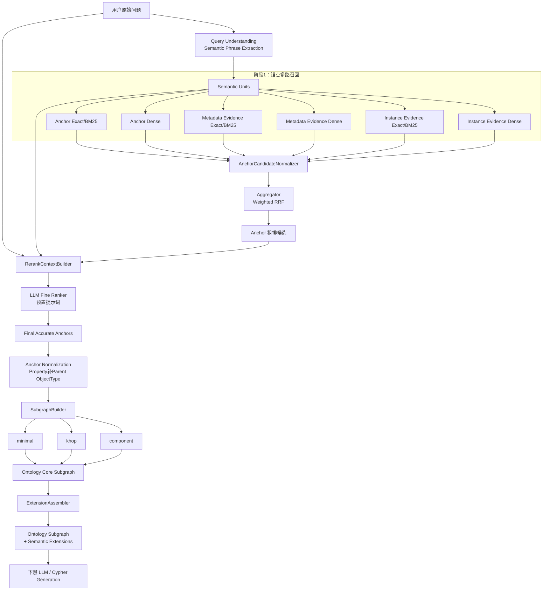
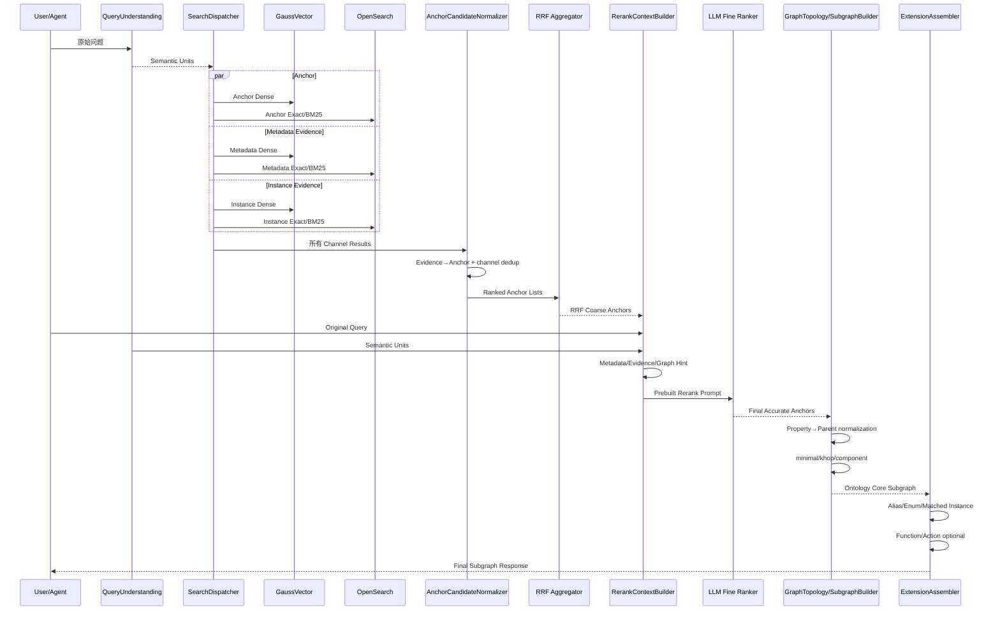
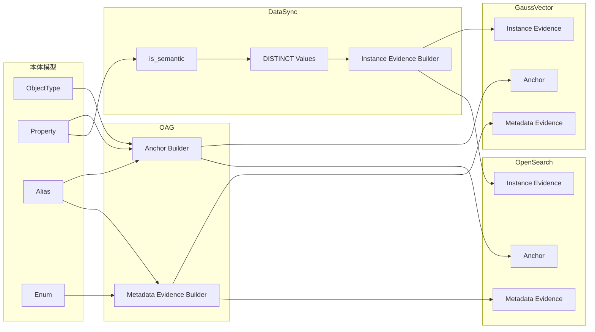
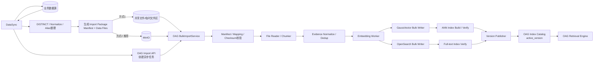
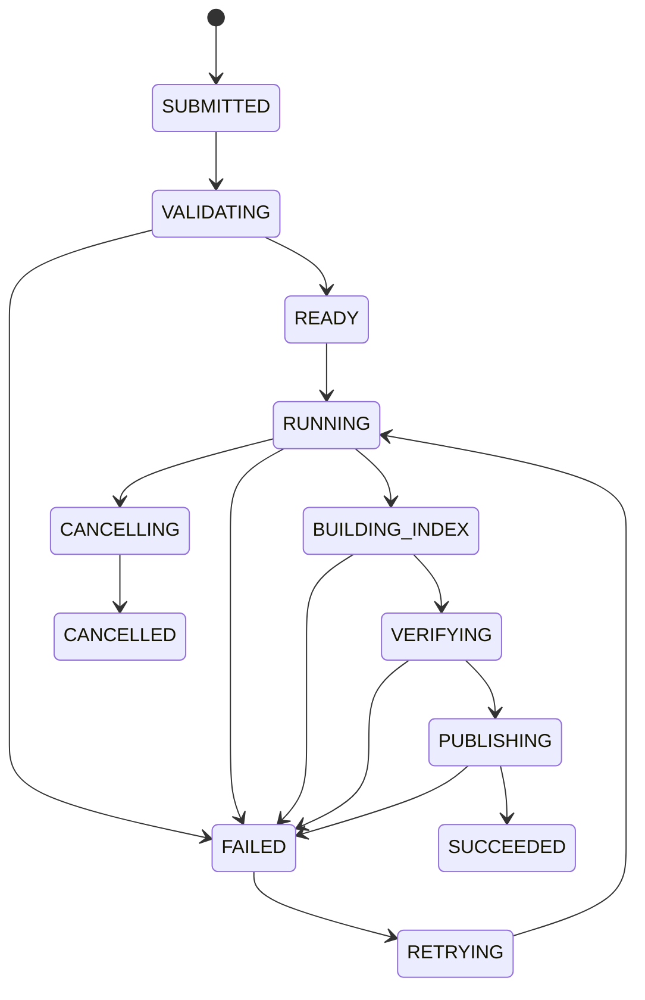
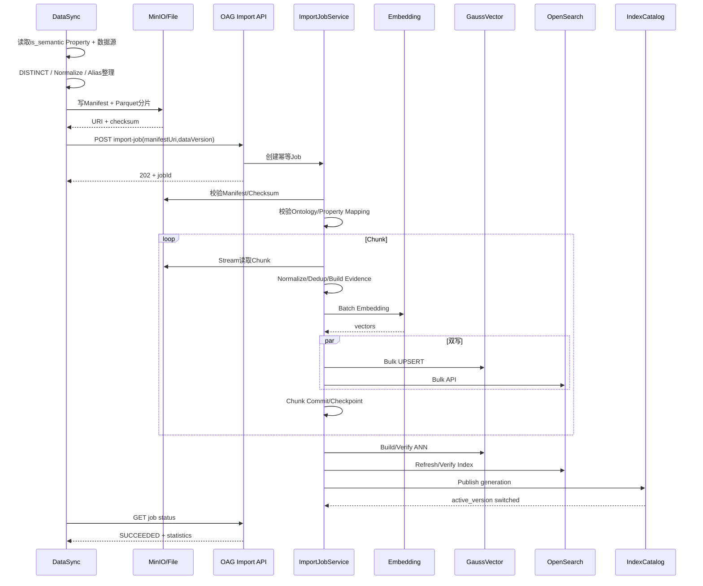

# OAG 面向本体锚点的语义检索、混合排序与本体子图构建设计方案

> 版本：V5.2  
> 目标：在保留既有 OAG 索引设计、Anchor/Evidence 模型、DataSync 分工、混合召回、RRF、LLM 精排和三类子图策略的基础上，结合当前代码真实实现，形成一份可直接指导研发落地、灰度演进、性能评测和下游 Cypher 生成的完整方案。  
> 设计原则：**Anchor First，Evidence for Anchor，Evidence for Cypher，Core Graph 与 Semantic Extension 分离，兼容现状、渐进增强。**

---

# 1. 文档目标与设计边界

OAG 的向量检索、OpenSearch 全文检索、同义词检索、枚举值检索、实例列值检索，以及后续的 RRF、LLM 精排和图算法，本质上都服务于同一个目标：

> **将用户自然语言问题稳定映射为全局唯一的 ObjectType / Property 本体锚点，保留 Alias、Enum、Instance Value 与锚点的确定性映射，再基于精确锚点构建最小且充分的本体子图，为下游 LLM 生成 Cypher 提供完整、准确、可解释的语义依据。**

本方案不把以下内容作为最终检索目标：

- 向量文档本身；
- 同义词本身；
- 枚举值本身；
- 实例列值本身；
- RRF 分数本身；
- 单纯的相似文本。

最终目标始终是：

```text
ObjectType Anchor
Property Anchor
```

同时为了生成 Cypher，还必须保留：

```text
用户原始短语
 → Evidence
 → Property Anchor
 → canonical_value
```

例如：

```text
用户：正式用户
    ↓
ENUM_ALIAS: FORMAL
    ↓
Property: Subscriber.subClass
    ↓
canonical_value = 1
    ↓
WHERE s.subClass = '1'
```

---

# 2. 完整端到端架构



运行阶段划分：

```text
阶段0：索引构建
阶段1：Semantic Unit 多路召回
阶段2：Evidence → Anchor 归一化 + RRF 粗排
阶段3：LLM 精排
阶段4：Anchor Normalization
阶段5：本体子图构建
阶段6：Semantic Extension 挂载
阶段7：下游 Cypher 生成
```

---

# 3. 与当前 OAG 代码的兼容基线

当前代码已经形成以下主链路：

```text
graphSearchV3()
  └─ performGraphSearchOptimized()
       ├─ interpretQueryIntent()
       ├─ getSeedIds()
       │    ├─ vectorService.searchOntologyByQuery()
       │    ├─ elasticSearchRestRepository.searchOntologyByQuery()
       │    └─ hybridRecallHelper.hybridRecall()
       ├─ loadAllEdges()
       └─ subgraphQuery()
            ├─ getPathInfos()
            │    ├─ computePairwiseShortestPaths()
            │    └─ computePairwiseNumPaths()
            │          └─ findAllPath()
            └─ buildMstSubgraph() / buildAllSubgraph()
```

现有请求参数主要包括：

```text
graphExpansionStrategy = minimal
hopLimit = 3
seedRetrievalMode = vector
topK = 3
includeFunctions = 0
includeActions = 0
```

V5.0 方案不要求一次性替换现有链路，而是在现有类和接口上演进：

```text
现有 getSeedIds()
    ↓
升级为 SearchDispatcher + CandidateNormalizer + RRF

现有 seedIds
    ↓
升级为 RRF Coarse Anchors
    ↓
LLM Fine Ranker
    ↓
Final Anchors

现有 subgraphQuery()
    ↓
保留 external strategy 名称
    ↓
内部支持 legacy / enhanced 两套算法
```

---

# 4. 核心设计原则

## 4.1 Anchor First

最终排序、精排、构图的业务主键统一为：

```text
anchor_ID
```

而不是：

```text
vector_doc_id
evidence_ID
enum value
instance value
alias
```

## 4.2 Evidence for Anchor

以下信息统一定义为 Evidence：

```text
ObjectType Alias
Property Alias
Enum Value
Enum Alias
Enum Description
Instance Value
Instance Value Alias
业务黑话
```

Evidence 必须能反向定位 Anchor。

## 4.3 Evidence for Cypher

Evidence 命中不能在映射为 Anchor 后被丢弃。

下游还需要：

```text
evidence_value
canonical_value
aliases
enum_ref
matched_phrase
```

## 4.4 Core Graph 与 Evidence 分离

真实本体拓扑中参与最短路径 / K-hop / 连通分量的节点主要是：

```text
ObjectType
Property
Relation
以及按配置扩展的 Function / Action
```

而：

```text
FORMAL
VIP
Mobile Number
Subscriber category
```

不作为最短路径图节点。

## 4.5 召回保 Recall，精排保 Precision，子图保最小充分

```text
多路召回：宁可多召回
RRF：跨通道稳健融合
LLM：结合完整问题做语义裁决
Graph：只保留足够支持推理和 Cypher 的结构
```

---

# 5. Anchor 与 Evidence 逻辑模型

## 5.1 Anchor

当前 Anchor 类型：

```text
type = 0：ObjectType
type = 1：Property
```

未来可扩展：

```text
Relation
Function
Action
Metric
```

但当前索引主表仍保持 `0/1`，避免破坏既有实现。

Anchor 字段语义：

```text
ID          = 本体元素全局唯一 ID，即 anchor_ID
type        = 0 ObjectType / 1 Property
parent_ID   = Property 所属 ObjectType ID
name        = 本体真实名称
display_*   = 多语言显示名
description_*= 多语言描述
aliases     = ObjectType / Property 同义词
```

## 5.2 Evidence

推荐 `evidence_type`：

| evidence_type | 含义 | 最终映射 |
|---|---|---|
| `OBJECT_ALIAS` | ObjectType 同义词 | ObjectType |
| `PROPERTY_ALIAS` | Property 同义词 | Property |
| `ENUM_VALUE` | 枚举真实值 | Property |
| `ENUM_ALIAS` | 枚举值同义词 | Property |
| `INSTANCE_VALUE` | 语义实例列值 | Property |
| `INSTANCE_ALIAS` | 实例值同义词 | Property |

所有 Evidence 至少保存：

```text
evidence_ID
evidence_type
anchor_ID
anchor_type
parent_ID
anchor_name
parent_name
evidence_value
canonical_value
aliases
```

---

# 6. 物理索引划分

逻辑上是：

```text
Anchor
Evidence
```

物理上拆成三类：

| 物理表 / Index | Owner | 数据 | 典型规模 |
|---|---|---|---|
| `{ontology_id}_anchor` | OAG | ObjectType / Property | 万～百万 |
| `{ontology_id}_metadata_evidence` | OAG | Alias / Enum | 万～百万 |
| `{ontology_id}_instance_evidence` | DataSync | Instance Value / Alias | 百万～千万/亿 |

这一设计同时保留历史逻辑通道：

```text
Object / Property canonical
Object / Property synonym
Enum value
Enum synonym
Instance semantic value
Instance value synonym
```

但不再为每一种逻辑通道创建一张独立物理表。

---

# 7. OAG 与 DataSync 分工

## 7.1 OAG：元数据层

OAG 负责：

```text
ObjectType
Property
ObjectType Alias
Property Alias
Enum Type
Enum Value
Enum Alias
多语言 display / description
```

流程：

```text
OMS / 本体模型
  ↓
OAG Metadata Reader
  ↓
Anchor Builder
  ├─ GaussVector Anchor
  └─ OpenSearch Anchor

Metadata Evidence Builder
  ├─ GaussVector Metadata Evidence
  └─ OpenSearch Metadata Evidence
```

## 7.2 DataSync：实例层

DataSync 负责：

```text
读取 is_semantic=true Property
访问实际数据源
DISTINCT / 标准化实例值
实例值同义词
写 Instance Evidence
```

流程：

```text
Property Metadata
  ↓
is_semantic eligibility
  ↓
Data Source
  ↓
DISTINCT / Normalize / Statistics
  ↓
Instance Evidence Builder
  ├─ GaussVector
  └─ OpenSearch
```

## 7.3 统一关联键

```text
ontology_id
anchor_ID  = Property ID
parent_ID  = ObjectType ID
```

DataSync 不维护独立的本体语义主键体系。

---

# 8. GaussVector Anchor 表结构

推荐表：

```text
{ontology_id}_anchor
```

| # | 字段名称 | 字段类型 | 是否非空 | 说明 |
|---|---|---|---|---|
| 1 | `vector` | `DOUBLE[]` | ✔ | 本体元素向量 |
| 2 | `type` | `INT` | ✔ | 0 ObjectType，1 Property |
| 3 | `ID` | `VARCHAR(256 CHAR)` | ✔ | 本体元素全局唯一 ID |
| 4 | `parent_ID` | `VARCHAR(256 CHAR)` |  | type=1 时记录父 ObjectType ID |
| 5 | `name` | `VARCHAR(256 CHAR)` | ✔ | 本体真实名称 |
| 6 | `display_en` | `VARCHAR(512 CHAR)` |  | 英文显示名 |
| 7 | `display_zh` | `VARCHAR(512 CHAR)` |  | 中文显示名 |
| 8 | `description_en` | `VARCHAR(1024 CHAR)` |  | 英文描述 |
| 9 | `description_zh` | `VARCHAR(1024 CHAR)` |  | 中文描述 |
| 10 | `aliases` | `TEXT` |  | 同义词 JSON Array |
| 11 | `i18n_content` | `TEXT` |  | 西语等扩展语言 |
| 12 | `content` | `TEXT` | ✔ | 实际 Embedding 文本 |
| 13 | `normalized_name` | `VARCHAR(512 CHAR)` |  | 规范化 name |
| 14 | `content_hash` | `VARCHAR(64 CHAR)` |  | 判断内容是否变化 |
| 15 | `model_version` | `VARCHAR(128 CHAR)` |  | Embedding 模型版本 |
| 16 | `source_version` | `VARCHAR(128 CHAR)` |  | 本体版本 |
| 17 | `updated_at` | `BIGINT` |  | 更新时间 |

关键约束：

> `ID` 就是 `anchor_ID`，不做 Hash。

---

# 9. Anchor Vector 内容

当前代码基础结构：

```text
{name}
{display_zh}
{display_en}
{description_zh}
{description_en}
```

V5.0 保持兼容并增强为：

```text
{name}
{display_zh}
{display_en}
{aliases}
{description_zh}
{description_en}
{other_i18n_display_description}
```

当前 BGE-M3 向量维度沿用：

```text
1024
```

当前代码 Embedding 批处理和失败重试机制可以继续保留，例如：

```text
batch size = 30
retry = 3
```

具体数值作为工程配置，不作为协议约束。

---

# 10. 多语言向量设计

## 10.1 默认策略：同一语义目标，多语言共用一个 Vector

若以下内容描述同一个 Anchor：

```text
中文名称
英文名称
西语名称
中文描述
英文描述
西语描述
多语言 Alias
```

默认构成一个 Global Multilingual Semantic Profile。

例如：

```text
Subscriber
用户
Subscriber
Mobile Number; Number; Mobile Phone
用户实体，代表服务的实际使用者...
Subscriber entity representing...
Suscriptor ...
```

只生成一个 Anchor Vector。

判断标准不是：

```text
有多少语言
```

而是：

> **是否描述同一个 Anchor / Evidence。**

## 10.2 不允许跨目标拼接

不推荐：

```text
Property
+ 全部 Enum
+ 全部 Instance
+ 其他 Property
```

因为语义目标已经改变。

## 10.3 Shadow Vector

只有评测证明某语言 Recall 明显下降时，才允许可选增加：

```text
global vector
zh shadow vector
en shadow vector
es shadow vector
```

Shadow Vector 必须最终 GROUP BY 同一 `anchor_ID`，避免 TopK 被同一 Anchor 多语言副本占满。

---

# 11. Property Vector 是否带 ObjectType

默认：

> **Property Vector 第一行只使用 Property 自身 name，不把 ObjectType 名称作为固定前缀。**

推荐：

```text
subClass
用户类别
Subscriber category
...
```

不推荐默认：

```text
Subscriber
subClass
...
```

原因：

1. 用户经常只表达 Property 概念；
2. ObjectType 前缀会改变主向量语义重心；
3. 同名 Property 的消歧应交给 `parent_ID + Query Context + Rerank + Graph`；
4. 当前实际子图中同一自然语言短语可以对应多个不同对象下的同名/近义 Property，应该允许 Recall 后再消歧。

若评测显示同名 Property 冲突严重，可增加可选 Shadow Vector：

```text
主向量：
Property自身语义

上下文Shadow：
Property + Parent ObjectType
```

---

# 12. OpenSearch Anchor 索引

推荐 Index：

```text
{ontology_id}_anchor
```

| # | 字段 | 类型 | 非空 | 说明 |
|---|---|---|---|---|
| 1 | `content` | `text` | ✔ | 与 Vector content 一致 |
| 2 | `type` | `integer` | ✔ | 0 ObjectType / 1 Property |
| 3 | `ID` | `keyword` | ✔ | 本体全局 ID |
| 4 | `parent_ID` | `keyword` |  | 父 ObjectType |
| 5 | `name` | `keyword` | ✔ | 本体真实名称 |
| 6 | `display_en` | `keyword` |  | 英文显示名 |
| 7 | `display_zh` | `keyword` |  | 中文显示名 |
| 8 | `description_en` | `keyword` + `text` |  | 英文描述 |
| 9 | `description_zh` | `keyword` + `text` |  | 中文描述 |
| 10 | `aliases` | `keyword` + `text` |  | 同义词 |
| 11 | `normalized_name` | `keyword` |  | 规范化名称 |
| 12 | `i18n_content` | `text` |  | 扩展语言 |
| 13 | `source_version` | `keyword` |  | 本体版本 |

职责优先级：

```text
ID/name/alias exact
> phrase/BM25
> content fallback
```

---

# 13. Metadata Evidence 表结构

推荐：

```text
{ontology_id}_metadata_evidence
```

| # | 字段 | 类型 | 非空 | 说明 |
|---|---|---|---|---|
| 1 | `vector` | `DOUBLE[]` | ✔ | Evidence 向量 |
| 2 | `evidence_ID` | `VARCHAR(512 CHAR)` | ✔ | Evidence 唯一键 |
| 3 | `evidence_type` | `INT` | ✔ | Alias / Enum 类型 |
| 4 | `anchor_ID` | `VARCHAR(256 CHAR)` | ✔ | 映射 ObjectType / Property |
| 5 | `anchor_type` | `INT` | ✔ | 0 ObjectType / 1 Property |
| 6 | `parent_ID` | `VARCHAR(256 CHAR)` |  | Property 所属 ObjectType |
| 7 | `anchor_name` | `VARCHAR(256 CHAR)` | ✔ | Property/ObjectType 真实 name |
| 8 | `parent_name` | `VARCHAR(256 CHAR)` |  | ObjectType name |
| 9 | `evidence_value` | `VARCHAR(4096 CHAR)` | ✔ | 当前可检索字符串 |
| 10 | `normalized_value` | `VARCHAR(4096 CHAR)` |  | 规范化值 |
| 11 | `canonical_value` | `VARCHAR(4096 CHAR)` |  | 枚举真实值 |
| 12 | `aliases` | `TEXT` |  | Alias 集合 |
| 13 | `enum_ref` | `VARCHAR(256 CHAR)` |  | 枚举引用 |
| 14 | `description` | `TEXT` |  | 多语言描述 |
| 15 | `term_language` | `VARCHAR(16 CHAR)` |  | zh/en/es/mixed/und |
| 16 | `content` | `TEXT` | ✔ | Embedding 文本 |
| 17 | `content_hash` | `VARCHAR(64 CHAR)` |  | 内容变化检测 |
| 18 | `source_version` | `VARCHAR(128 CHAR)` |  | 本体版本 |

---

# 14. Metadata Evidence Vector 规则

Enum / Alias 主向量：

```text
{value}
{aliases}
{description_zh/en/es}
{optional property display/description}
```

原则：

> **Value First，Property Context Last，Mapping in Metadata。**

不默认以：

```text
ObjectType: ...
Property: ...
```

作为向量开头。

### Enum 被多个 Property 复用

若一个 EnumType 被多个 Property 引用，不能只创建：

```text
enum_id + enum_value
```

一个全局语义文档。

必须建立**Property Context Mapping**：

```text
shared enum value
    ↓
Property A anchor_ID
Property B anchor_ID
...
```

可共享 `enum_value_source_id`，但 Evidence 文档的 Anchor Mapping 必须是 Property-specific。

---

# 15. evidence_ID 设计

`anchor_ID` 直接使用本体 ID。

`evidence_ID` 若源模型有唯一 ID，直接复用。

若没有唯一 ID，推荐稳定构造：

```text
{anchor_ID}::{evidence_type}::{source_key}
```

例如：

```text
PropertyID::ENUM_VALUE::SubClass::1
PropertyID::ENUM_ALIAS::SubClass::1::FORMAL
```

只有 `source_key` 过长或含数据库不适合作为 Key 的字符时，可对 `source_key` 局部 Hash。

禁止对 `anchor_ID` 再 Hash。

---

# 16. Instance Evidence 表

推荐：

```text
{ontology_id}_instance_evidence
```

Owner：DataSync。

| 字段 | 说明 |
|---|---|
| `vector` | 实例语义向量 |
| `evidence_ID` | 稳定唯一键 |
| `evidence_type` | INSTANCE_VALUE / INSTANCE_ALIAS |
| `anchor_ID` | Property ID |
| `anchor_type` | 固定 1 |
| `parent_ID` | ObjectType ID |
| `anchor_name` | Property name |
| `parent_name` | ObjectType name |
| `evidence_value` | 实际 DISTINCT Value |
| `normalized_value` | 标准化值 |
| `canonical_value` | 默认等于真实 Value |
| `aliases` | 实例值同义词 |
| `term_language` | 语言 Hint |
| `content` | Embedding 文本 |
| `content_hash` | 增量判断 |
| `data_version` | 数据同步版本 |

Instance 与 Metadata Evidence 字段逻辑一致，但物理表必须分开。

---

# 17. Instance Value 向量准入规则

`is_semantic=true` 是必要条件，不是充分条件。

推荐：

```text
semantic_enabled =
  is_semantic
  AND datatype_eligible
  AND value_shape_eligible
  AND cardinality_eligible
```

## 17.1 只索引 DISTINCT Value

例如：

```text
5000万 Subscriber 行
subLevel 只有 VIP/GOLD/SILVER/NORMAL
```

只生成 4 组 Value Evidence，而不是 5000 万个向量。

## 17.2 默认不向量化

以下值通常不进入 Dense：

```text
UUID
手机号
纯技术主键
时间戳
日期
连续数值
高随机编码
```

它们仍可在 OpenSearch keyword / 数据源查询中精确处理。

## 17.3 适合向量化

```text
产品名称
品牌名称
客户等级
区域名称
业务状态
自然语言标签
人可理解业务分类
```

## 17.4 高基数自由文本

高基数自然语言长文本不应无限进入 Instance Evidence。

建议进入单独的：

```text
Document / RAG Index
```

而不是本体 Anchor Resolver 的 Instance Value Index。

---

# 18. Instance Vector 内容

推荐：

```text
{instance_value}
{instance_aliases}
{optional property display}
{optional property description}
```

仍然坚持：

> **Value First，Property Context Last。**

Property/ObjectType 映射完全依赖：

```text
anchor_ID
parent_ID
```

而不是依赖向量文本解析。

---

# 19. OpenSearch Evidence Index

Metadata / Instance 两个物理 Index 均建议：

```text
content           text
evidence_ID       keyword
evidence_type     integer
anchor_ID         keyword
anchor_type       integer
parent_ID         keyword
anchor_name       keyword
parent_name       keyword
evidence_value    keyword + text
normalized_value  keyword
canonical_value   keyword
aliases           keyword + text
enum_ref          keyword
description       text
term_language     keyword
source_version    keyword
```

Exact Priority：

```text
evidence_value.keyword
normalized_value
canonical_value
aliases.keyword
anchor_name
```

---

# 20. 规范化规则

所有可检索字符串保留原值，并额外生成：

```text
normalized_name
normalized_value
```

推荐标准化：

```text
trim
Unicode normalize
casefold（仅用于 normalized field）
连续空白归一
全半角归一
```

禁止直接覆盖原始值，因为 Cypher 和业务展示仍需要原始 Canonical Value。

---

# 21. term_language 与 language_hint

对于：

```text
FORMAL
IOT_FORMAL
Subscriber
subClass
A001
```

无法可靠归类为自然语言的 Token：

```text
term_language = und
```

对于混合短语：

```text
FORMAL用户
```

可标：

```text
mixed
```

Language 仅作为：

```text
可观测
Analyzer Hint
Ranking Boost
```

不作为 Dense 强过滤条件。

---

# 22. 数据质量治理

OAG 元数据同步阶段必须检查：

```text
Alias 与 Canonical 重复
Alias 重复
同一 ObjectType 下 Property Alias 冲突
一个 Alias 映射多个不相关 Anchor
Enum Ref 不存在
Enum Value 重复
Enum Alias 冲突
Description 多语言格式错误
Parent ObjectType 缺失
```

冲突处理原则：

```text
不能静默覆盖
必须可观测
必要时阻断当前 Evidence 入库
```

DataSync 额外检查：

```text
空值
超长 Value
distinct_count
高基数
无意义随机串
Instance Alias 冲突
```

---

# 23. 增量索引与幂等

Anchor / Evidence 建议维护：

```text
content_hash
model_version
source_version
updated_at
```

更新策略：

```text
content 无变化
 → 不重新 Embedding

仅 Metadata 非向量字段变化
 → 只更新 Metadata

Embedding 模型变化
 → 按 model_version 重建 Vector

本体删除
 → 删除 Anchor + 对应 Metadata Evidence
 → 通知 DataSync 清理对应 Instance Evidence
```

---

# 24. GaussVector 索引算法

Anchor / Metadata Evidence：

```text
GsIVFFLAT
COSINE
```

适用规模：

```text
约 1*10^4 ～ 2*10^6
```

推荐：

```text
IVF_NLIST = 4 * sqrt(N)
```

其中：

```text
N = 当前物理表实际记录数
```

Instance Evidence：

```text
中小规模 → GsIVFFLAT
千万 / 亿级 → GsDiskANN
```

Metadata 与 Instance 分表的一个核心原因就是允许 ANN 算法独立演进。

---

# 25. Query Understanding：LLM 不是普通分词器

LLM 应执行：

> **Semantic Phrase Extraction**

而不是按词法逐词拆分。

错误：

```text
FORMAL
用户
Mobile
Number
```

推荐主单元：

```text
FORMAL用户
Mobile Number
```

必要时可同时保留辅助短语：

```text
FORMAL用户
FORMAL
用户
Mobile Number
```

但完整业务短语优先。

---

# 26. Query Understanding 推荐结构

兼容现有：

```json
{
  "main_object": "Cell",
  "aggregation": "sum",
  "objectType": ["Type1"],
  "property": ["prop1"],
  "concepts": ["concept1"],
  "essential_ids": ["id1"],
  "slot_top_k_overrides": {
    "slot1": 5
  }
}
```

目标结构：

```json
{
  "main_object_hint": "Cell",
  "aggregation": {
    "operator": "sum",
    "target": null
  },
  "semantic_units": [
    {
      "id": "u1",
      "text": "影响业务的活跃告警",
      "role_hint": "unknown",
      "language_hint": "zh",
      "importance": "required"
    },
    {
      "id": "u2",
      "text": "发生时间",
      "role_hint": "property_or_value",
      "language_hint": "zh",
      "importance": "required"
    }
  ],
  "object_type_hints": ["Cell"],
  "constraints": [],
  "output_intent": "ontology_subgraph"
}
```

`role_hint` 可取：

```text
object
property
value
object_or_property
property_or_value
object_or_property_or_value
unknown
```

只用于 Boost，不关闭其他检索通道。

---

# 27. 为什么不建议 LLM 直接输出 slot_top_k_overrides

TopK 属于检索系统策略，应由：

```text
表规模
索引类型
召回评测
延迟预算
查询 Profile
```

控制。

LLM 可以输出：

```text
importance = required / optional
```

系统映射：

```text
required → high_recall profile
optional → normal profile
```

避免让 LLM 直接决定底层性能参数。

---

# 28. 多路检索通道

每个 Semantic Unit 同时执行：

```text
Anchor Exact/BM25
Anchor Dense

Metadata Evidence Exact/BM25
Metadata Evidence Dense

Instance Evidence Exact/BM25
Instance Evidence Dense
```

运行时不要求提前判断：

```text
FORMAL 是 enum？
VIP 是 instance？
Cell 是 object？
name 是 property？
```

未知字符串统一进入多路检索。

---

# 29. Exact 与 Dense 阈值的关系

Exact / Keyword 命中：

```text
不受 similarityThreshold 限制
```

Dense：

```text
ANN TopK
  ↓
similarityThreshold
```

原因：

```text
Exact 是确定性字符串证据
Dense threshold 只表示向量相似度过滤
```

不能用 Dense 阈值删除已经精确命中的真实名称或 Value。

---

# 30. topK / similarityThreshold 分表配置

三类物理表必须支持独立配置。

```yaml
semanticRetrieval:
  defaults:
    topK: 3
    similarityThreshold: 0.6

  anchor:
    topK: 10
    similarityThreshold: 0.6

  metadataEvidence:
    topK: 10
    similarityThreshold: 0.6

  instanceEvidence:
    topK: 5
    similarityThreshold: 0.6
```

说明：

- `3 / 0.6` 为历史兼容默认值；
- Anchor 优先 Recall；
- Metadata Evidence 允许多个 Evidence 回收到 Anchor；
- Instance Evidence 数据巨大，TopK 初始更保守；
- `0.6` 可作为共同起始值，但必须独立校准。

参数优先级：

```text
Request Retrieval Profile
    >
Table-level Config
    >
System Defaults
```

---

# 31. legacy GraphSearchRequest.topK 的兼容语义

当前 `GraphSearchRequest.topK=3` 不应继续被简单复用于所有内部物理表。

V5.0 建议：

```text
legacy topK
 → 最终 Seed / Rerank 输出上限的兼容值
```

内部召回使用：

```text
anchor.topK
metadataEvidence.topK
instanceEvidence.topK
```

若旧调用方只传 `topK`：

```text
内部仍使用表级默认召回
最终精排输出数量受 legacy topK 限制
```

避免：

```text
内部每个通道都只取3
```

导致 Recall 在 RRF 前丢失。

---

# 32. seedRetrievalMode 兼容

现有：

```text
vector
```

目标支持：

```text
vector
keyword
hybrid
```

推荐目标模式：

```text
hybrid
```

但为了兼容，接口默认值可暂时维持现有行为，通过配置灰度切换。

语义：

```text
vector → Dense only
keyword → Exact/BM25
hybrid → Exact/BM25/Dense + Evidence + RRF
```

---

# 33. AnchorCandidateNormalizer

RRF 前统一把所有结果变成 Anchor Candidate。

Evidence 示例：

```text
“正式用户”
  ↓
FORMAL
  ↓
canonical_value=1
  ↓
Subscriber.subClass
```

Normalized Candidate：

```json
{
  "semantic_unit_id": "u1",
  "anchor_ID": "property-subClass-id",
  "anchor_type": 1,
  "name": "subClass",
  "parent_ID": "subscriber-object-id",
  "parent_name": "Subscriber",
  "source_channel": "metadata_vector",
  "source_rank": 2,
  "source_score": 0.81,
  "matched_evidence": {
    "evidence_type": "ENUM_ALIAS",
    "evidence_value": "FORMAL",
    "canonical_value": "1"
  }
}
```

---

# 34. 通道内 Anchor 去重

同一 Property 可能存在很多：

```text
Alias
Enum Value
Enum Alias
Instance Value
```

必须：

```text
GROUP BY semantic_unit_id + channel + anchor_ID
```

单通道一个 Anchor 只占一个排名位置。

同时保留：

```text
primary_hit
supporting_evidence top 3~5
evidence_hit_count
```

否则 Evidence 数量越多的 Property 会被不公平抬高。

---

# 35. Aggregator：Weighted RRF

融合单位：

> **anchor_ID**

公式：

```text
RRF(anchor) = Σ weight(channel) / (rrf_k + rank_channel(anchor))
```

推荐起始配置：

```yaml
rrf:
  k: 60
  coarseTopKPerSemanticUnit: 20
  maxGlobalCandidates: 50
  channelWeights:
    anchorExact: 1.5
    anchorBm25: 1.1
    anchorVector: 1.0
    metadataExact: 1.4
    metadataBm25: 1.0
    metadataVector: 1.0
    instanceExact: 1.2
    instanceBm25: 0.8
    instanceVector: 0.8
```

这些仅是初始值。

RRF 的优势：

```text
不要求 BM25、Cosine、Exact 的原始 score 在同一数值空间
主要利用 rank
降低跨检索引擎 score 不可比问题
```

---

# 36. Exact 不是绝对锁定

Exact 是强证据，但：

```text
name
status
active
1
A
```

可能跨对象、跨属性重复。

因此：

```text
Exact
 → 高权重
 → RRF
 → LLM Rerank
```

而不是无条件：

```text
Exact → Final Anchor
```

只有：

```text
ID 全局唯一 exact
```

可以直接视为强确定性锚点。

---

# 37. RRF 粗排输出

```json
{
  "semantic_unit_id": "u2",
  "semantic_unit": "发生时间",
  "candidates": [
    {
      "anchor_ID": "property-first-id",
      "anchor_type": 1,
      "name": "firstoccurrence",
      "parent_ID": "alarm-object-id",
      "rrf_score": 0.064,
      "channel_hits": [
        {"channel": "anchor_bm25", "rank": 1},
        {"channel": "anchor_vector", "rank": 2}
      ],
      "supporting_evidence": []
    }
  ]
}
```

---

# 38. LLM Fine Ranking 目标

LLM 使用预置提示词，输入：

```text
原始问题
Semantic Units
RRF 粗排 Anchor
Anchor Metadata
Parent ObjectType
Matched Evidence
Canonical Value
轻量 Graph Hint
```

任务：

```text
深度语义理解
业务限定词校验
对象/属性上下文对齐
枚举/实例值到属性的映射验证
多候选消歧
必要锚点完整性检查
```

输出：

```text
准确 ObjectType / Property Anchor
```

---

# 39. 为什么精排必须使用原始问题

例如：

```text
Semantic Unit = 发生时间
```

可能匹配：

```text
update_time
firstoccurrence
lastoccurrence
```

原始问题：

```text
查询站点上影响业务的活跃告警首次发生时间
```

能进一步确定：

```text
AP_ALARM_LIVE.firstoccurrence
```

因此 LLM 不得只使用拆词结果。

---

# 40. Rerank Context

推荐：

```json
{
  "original_query": "...",
  "semantic_units": [...],
  "candidates": [
    {
      "anchor_ID": "...",
      "anchor_type": 1,
      "name": "firstoccurrence",
      "display": {"zh": "告警首次发生时间"},
      "description": {"zh": "..."},
      "aliases": [],
      "parent": {
        "ID": "...",
        "name": "AP_ALARM_LIVE",
        "display": "活动告警"
      },
      "rrf_score": 0.064,
      "channel_hits": [],
      "matched_evidence": [],
      "graph_hint": {
        "neighbor_object_types": ["SYS_SITE"],
        "relation_names": ["SITE_TO_ALARM"]
      }
    }
  ]
}
```

Graph Hint 只取一跳或轻量摘要，不在精排前构建完整子图。

---

# 41. LLM 精排 Prompt 约束

System Prompt：

```text
Role:
你是 OAG 本体锚点精排器。

Objective:
根据原始问题、语义单元、候选 Anchor 元数据、Evidence 和轻量本体关系上下文，
选出真正表达用户意图的 ObjectType / Property Anchor。

Rules:
1. 只能返回 candidates 中存在的 anchor_ID。
2. 必须结合原始问题，不得仅依赖名称相似。
3. Property 必须结合 Parent ObjectType 判断。
4. Evidence 命中时必须验证 Evidence → Property 是否合理。
5. Exact/BM25/Vector/RRF 分数只是证据。
6. 必须考虑其他 Semantic Unit 已命中锚点的一致性。
7. 一个 Semantic Unit 可以选择多个必要 Anchor。
8. 全部不匹配允许 no_match=true。
9. 不创造不存在的 Anchor。
10. 输出简洁 reason，不输出内部详细思维过程。
11. 严格输出 JSON Schema。
```

---

# 42. 精排输出与 0/1/N

允许：

```text
0：全部不匹配
1：唯一准确 Anchor
N：多个业务上同时必要的 Anchor
```

不采用：

```text
必须返回一个
```

的数据库选表式强制兜底。

示例：

```json
{
  "semantic_unit_results": [
    {
      "semantic_unit_id": "u2",
      "selected": [
        {
          "anchor_ID": "property-first-id",
          "rank_score": 0.96,
          "reason": "与原始问题中的首次发生时间一致"
        }
      ],
      "no_match": false
    }
  ],
  "final_anchor_ids": [
    "object-site-id",
    "object-alarm-id",
    "property-first-id"
  ],
  "unresolved_units": []
}
```

---

# 43. LLM 精排可靠性与降级

程序校验：

```text
JSON Schema
anchor_ID ∈ Input Candidate
rank_score 合法
去重
数量上限
```

异常：

```text
LLM Timeout / JSON错误
 → 重试1次
 → 仍失败
 → fallback=RRF
 → rerank_status=DEGRADED
```

正常 `no_match` 不属于异常。

---

# 44. Anchor Normalization

图算法前必须把 Property Anchor 规范化。

Property：

```text
Property ID
  ↓ parent_ID
ObjectType ID
```

形成：

```text
explicit_property_anchors
object_terminals
mandatory_has_property_edges
```

ObjectType Anchor：

```text
直接进入 object_terminals
```

最终图算法跨对象连接时主要处理：

```text
object_terminals
```

Property 通过强制 `has_property` 挂回。

这样可显著减少：

```text
Seed Pair 数
最短路径组合数
```

---

# 45. Property → ObjectType 扩展：优先 parent_ID

当前代码存在：

```text
MATCH (n)-[:has_property]->(nodes)
WHERE id(nodes) IN [...]
RETURN distinct n
```

运行时根据 Property ID 查父 ObjectType。

V5.0 推荐优先：

```text
Anchor.parent_ID
```

因为索引阶段已经记录该映射。

流程：

```text
Property Anchor
  ↓
parent_ID available?
  ├─ yes → 直接补 Parent ObjectType
  └─ no  → 调用现有 GQL addObjectTypeByProperty() 兼容兜底
```

并可使用本体图 `has_property` 做一致性校验。

这样既保留现有实现，又减少每次查询额外 GQL。

---

# 46. 当前三种子图策略：必须区分“接口语义”与“实际算法”

外部策略名：

```text
minimal
khop
component
```

保持不变。

但当前实现事实是：

| Strategy | 当前真实实现 | 不是严格意义上的 |
|---|---|---|
| minimal | Seed 两两最短路径 → 按路径长度排序 → 贪心加入直到连通 | 标准 MST / 最优 Steiner Tree |
| khop | Seed 两两组合 → `FIND ALL PATH ... UPTO k STEPS` | 真正 Multi-Source BFS |
| component | Seed 两两 `FIND ALL PATH ... UPTO 10 STEPS` | 真正无界 Connected Component |

文档和代码必须明确这一点。

---

# 47. minimal：当前实现分析

当前流程：

```text
Seeds
 ↓
computePairwiseShortestPaths
 ↓
Pair Paths
 ↓
按 Path Length 排序
 ↓
逐条 collectFromPath
 ↓
DisjointSet 判断所有 Seed 是否连通
 ↓
addMissingEdgesFromObjects
 ↓
removeEdgesWithMismatchedId
```

其优点：

```text
实现简单
可复用现有最短路径能力
输出通常比较紧凑
已有线上代码基础
```

限制：

1. 路径按长度贪心加入，不等价于先构造 Terminal Metric Closure 再做标准 MST；
2. 不保证得到全局最小 Steiner Tree；
3. 多条等长最短路径的业务语义优先级没有充分表达；
4. Seed 数增大后两两最短路径数量 O(S²)；
5. Property Seed 没先折叠 Parent ObjectType 时会增加 Pair 数。

---

# 48. minimal：增强方案

建议保留：

```text
minimal.algorithm = legacy_greedy
```

并增加：

```text
minimal.algorithm = metric_closure_mst
```

目标实现：

```text
1. Property → Parent ObjectType
2. 得到 object_terminals
3. 计算 terminal pair shortest path
4. 构造 Metric Closure
5. Metric Closure 上做 MST
6. 将 MST virtual edge 展开回原始 shortest path
7. 合并节点 / 边
8. 加回 Property + has_property
9. 剪除非 Anchor 的无意义叶子
```

这是更规范的：

```text
Shortest Path + MST Steiner Approximation
```

但仍然不是严格 NP-hard Steiner Tree 的最优解，应在文档中称：

```text
Steiner Tree Approximation
```

---

# 49. minimal 路径选择增强

当前最短路径主要按 Hop 数。

如果多个等长路径，可按稳定 tie-break：

```text
1. 与 Query / 已命中 relation hint 语义更匹配
2. active relation 优先
3. 中间 ObjectType 更少
4. junction/backing 复杂度更低
5. relationship priority
6. 稳定 ID 排序
```

建议配置：

```yaml
subgraph:
  minimal:
    pathCostMode: hop_count
    tieBreak:
      semanticRelation: true
      preferActive: true
      preferLowerJunctionComplexity: true
```

第一阶段保持 `hop_count` 兼容，后续可灰度 `semantic_weighted`。

---

# 50. khop：当前实现分析

当前 `khop` 实际：

```text
getPairs(seedIds)
 ↓
parallelStream
 ↓
每个 src/dst
 ↓
FIND ALL PATH FROM src TO dst OVER * UPTO k STEPS
 ↓
收集所有 PathInfo
```

优点：

```text
能显式获得 Seed 间多条 k-hop 路径
实现基于现有 NebulaGraph GQL
```

核心风险：

1. 不是 Multi-Source BFS；
2. Seed 数为 S 时 Pair 数 O(S²)；
3. `FIND ALL PATH` 的路径数量在稠密图中可能组合爆炸，复杂度不能简单理解成 O(S²×k)；
4. 大量路径在后续又会共享相同节点和边，存在重复 IO / 解析；
5. `parallelStream` 会把路径爆炸转化成更高瞬时 GraphDB 压力；
6. 默认 k=3 通常可控，但仍需要 Path/Node/Time 上限。

---

# 51. khop：兼容模式与增强模式

保留：

```text
khop.algorithm = pairwise_all_path
```

作为现有兼容实现。

增加：

```text
khop.algorithm = multi_source_bfs
```

目标行为：

```text
所有 object_terminals 同时入队
visited[node] = min_hop
reachable_from[node] = anchor_set
frontier 按层批量扩展
达到 hop_limit 停止
```

目标输出：

```text
node.min_hop
node.reachable_from_anchor_ids
edge.discovery_hop
```

优势：

```text
避免 Seed Pair 两两重复
避免枚举所有路径
更适合“邻域扩展”语义
更容易 maxNodes/maxEdges 截断
```

---

# 52. Multi-Source BFS 实现建议

若图数据库没有直接满足需求的多源 API，可在 OAG 层做分层 frontier：

```text
frontier[0] = all terminals
for depth = 1..k:
    batch query neighbors(frontier[depth-1])
    remove visited
    add frontier[depth]
    update reached_from
```

关键：

```text
批量查询
visited 去重
edge type filter
active filter
maxNodes/maxEdges
timeout
```

不需要枚举所有简单路径。

---

# 53. legacy khop 必须增加防爆参数

在完全替换为 Multi-Source BFS 前，现有 `FIND ALL PATH` 模式至少增加：

```yaml
subgraph:
  khop:
    hopLimit: 3
    maxPathsPerPair: 20
    maxTotalPaths: 200
    maxNodes: 100
    maxEdges: 200
    queryTimeoutMs: 2000
    pairConcurrency: 8
```

并记录：

```text
path_truncated
timeout_pairs
total_path_count
```

---

# 54. component：当前实现分析

当前代码：

```text
component
 → computePairwiseNumPaths(seedIds, 10)
 → FIND ALL PATH ... UPTO 10 STEPS
```

这是：

> **有界 10-hop 连通近似**

并不是真正的 Graph Connected Component。

风险：

1. 两个节点可能实际同一连通分量，但最短路径 > 10，因此被错误判定不连通；
2. 仍然枚举 `ALL PATH`，大分量中成本高；
3. `10` 是工程上“大值”，不是图论意义的全连通；
4. component 语义和实现语义存在偏差。

---

# 55. component：增强为真实 Connected Component

当前 OAG 已有：

```text
loadAllEdges()
DisjointSet
buildDsuFromNodesAndEdges()
```

因此最优增强不是继续扩大：

```text
UPTO 10 → UPTO 20
```

而是：

```text
本体版本加载/变更时
  ↓
加载 active ontology core edges
  ↓
构建 DSU / Connected Component Index
  ↓
component_id[node]
```

请求时：

```text
Final Anchor
  ↓
component_id
  ↓
直接取相关 connected component
```

这样得到真正的 Connected Component 语义。

---

# 56. Component Cache

建议新增：

```text
GraphTopologyCache
```

按：

```text
ontology_id + source_version
```

缓存：

```text
adjacency
active_edges
component_id
object_type metadata
property parent mapping
relation metadata
```

优势：

```text
避免每次 loadAllEdges
Component O(1) 判断
支持 Multi-Source BFS
支持本地快速连通性校验
```

本体版本变化后整体失效重建。

---

# 57. `component` API 兼容策略

外部仍使用：

```text
graphExpansionStrategy=component
```

内部配置：

```yaml
component:
  algorithm: dsu_cached
  legacyHopLimit: 10
```

灰度阶段：

```text
shadow execute:
 legacy bounded-component
 enhanced dsu-component

比较:
 connectivity
 nodes
 latency
```

验证后切换默认。

---

# 58. 三种策略最终定义

| Strategy | 最终推荐算法 | 默认用途 | 输出规模 |
|---|---|---|---|
| `minimal` | Metric Closure + MST Approximation | Cypher / 确定性问数 | 最小 |
| `khop` | Multi-Source BFS | 探索、补桥、邻域 | 中 |
| `component` | DSU / BFS 真连通分量 | 模型诊断、全局探索 | 最大 |

同时保留 legacy implementation 供灰度。

---

# 59. auto 策略

推荐：

```text
auto
```

但为了兼容现有 `GraphSearchRequest`，可先作为新值引入。

流程：

```text
Final Anchors
  ↓
minimal
  ↓
全部连通?
  ├─ yes → 返回 minimal
  └─ no
       ↓
     khop multi-source BFS(k=3)
       ↓
     发现合理桥接?
       ├─ yes → 返回 enhanced khop result
       └─ no
            ↓
          connected_groups
          + unresolved anchors
```

不默认自动进入完整 component，避免上下文爆炸。

---

# 60. 子图构建中的 Anchor Terminal 设计

LLM 最终 Anchor 可能包含：

```text
ObjectType
Property
```

构图时：

```text
ObjectType → Terminal
Property → parent ObjectType 作为 Terminal
```

Property 自身作为：

```text
mandatory leaf
```

即：

```text
Parent ObjectType
  └─ has_property
      └─ Property
```

这能减少：

```text
Terminal count
Pairwise shortest path count
路径搜索成本
```

---

# 61. 本体图中关系的作用

核心本体子图需要保留：

```text
has_property
defines_relation
relation node / metadata
junction mapping
businessSemanticType
cardinality
linkType
```

下游 Cypher 真正的关系连接依据来自本体图，而不是 Vector。

例如：

```text
SITE_TO_ALARM
NE_TO_SITE
NE_TO_2G
```

及其：

```text
junctionConfig
sourceName
targetName
```

必须在最终 Core Graph / Relation Metadata 中保留。

---

# 62. Relation 路径选择

当一个 Anchor Pair 存在多条路径：

```text
A → B
A → C → B
A → D → B
```

不应仅依据向量分数。

推荐 Path Score：

```text
PathCost =
  hop_cost
  + relation_complexity_penalty
  + inactive_penalty
  - semantic_relation_bonus
```

第一版可只做 tie-break，不改变现有 shortest-hop 主语义。

---

# 63. includeFunctions / includeActions

现有请求已经支持：

```text
includeFunctions
includeActions
```

V5.0 保留。

推荐处理阶段：

```text
Final Core Subgraph
  ↓
CapabilityExtensionAssembler
  ├─ includeFunctions=1 → 扩展相关 Function
  └─ includeActions=1   → 扩展相关 Action
```

Function/Action 默认不进入 Anchor RRF 主排序，除非未来明确把它们升级为 Anchor 类型。

最终输出可独立：

```json
{
  "capabilityExtensions": {
    "functions": [],
    "actions": []
  }
}
```

避免 Function/Action 干扰 ObjectType/Property 核心拓扑。

---

# 64. Semantic Extensions

最终返回两层：

```text
ontologySubgraph
semanticExtensions
```

Semantic Extensions：

```text
ObjectType → Alias
Property → Alias
Property → Enum Value / Alias
Property → matched Instance Value / Alias
```

它们不参与图算法。

---

# 65. Enum Extension 返回模式

Enum 属于元数据，可支持：

```text
matched_only
all_values
```

推荐默认：

```text
matched_only
```

生成 Cypher 时，若需要让 LLM了解完整枚举域，可以显式请求：

```text
all_values
```

---

# 66. Instance Extension 返回模式

Instance 可能百万/千万/亿。

禁止：

```text
返回 Property 的所有 Instance Value
```

允许：

```text
matched_only
matched + topN
```

例如：

```yaml
extension:
  instanceMode: matched_only
  maxInstanceEvidencePerProperty: 10
```

---

# 67. 最终 seedNodes 结构

建议兼容现有 `seedNodes`，并增强：

```json
{
  "semanticUnitId": "u2",
  "llmDrawEntityName": "发生时间",
  "anchors": [
    {
      "ID": "property-first-id",
      "type": 1,
      "name": "firstoccurrence",
      "parent_ID": "alarm-object-id",
      "parent_name": "AP_ALARM_LIVE",
      "rrf_score": 0.064,
      "rerank_score": 0.96,
      "match": {
        "source": "ANCHOR",
        "channels": ["anchor_bm25", "anchor_vector"]
      }
    }
  ]
}
```

Evidence：

```json
{
  "semanticUnitId": "u4",
  "llmDrawEntityName": "正式用户",
  "anchors": [
    {
      "ID": "subClass-property-id",
      "type": 1,
      "name": "subClass",
      "parent_ID": "subscriber-object-id",
      "rrf_score": 0.071,
      "rerank_score": 0.97,
      "match": {
        "source": "METADATA_EVIDENCE",
        "evidence_type": "ENUM_ALIAS",
        "evidence_value": "FORMAL",
        "canonical_value": "1"
      }
    }
  ]
}
```

---

# 68. Final Response 数据结构

```json
{
  "message_type": "message_ontology_subgraph",
  "content": {
    "seedNodes": [],
    "nodes": [],
    "edges": [],
    "semanticExtensions": {
      "anchors": []
    },
    "capabilityExtensions": {
      "functions": [],
      "actions": []
    },
    "metadata": {
      "retrievalMode": "hybrid",
      "rerankStatus": "SUCCESS",
      "graphStrategy": "minimal",
      "graphAlgorithm": "metric_closure_mst",
      "connected": true,
      "truncated": false,
      "unresolvedSemanticUnits": [],
      "unconnectedAnchorIds": []
    }
  }
}
```

保持：

```text
nodes
edges
seedNodes
```

兼容已有调用方。

新增字段全部可选。

---

# 69. Cypher 生成最小充分上下文

## Anchor Context

```text
ObjectType ID / name
Property ID / name
Property parent_ID
```

## Evidence Context

```text
matched phrase
evidence type
evidence value
canonical value
aliases
enum_ref
```

## Relation Context

```text
relation id / name
businessSemanticType
cardinality
linkType
junctionConfig
source/target mapping
```

LLM 生成 Cypher 时，不再需要猜：

```text
FORMAL 是真实值还是 alias
Property 属于哪个 ObjectType
两个 ObjectType 用什么字段关联
```

---

# 70. 完整运行时序



---

# 71. 索引构建流程



---

# 72. GraphTopologyCache

由于当前子图代码存在：

```text
loadAllEdges()
```

建议将静态本体拓扑按版本缓存：

```text
Key = ontology_id + source_version
```

Value：

```text
nodesById
edgesById
adjacency
reverseAdjacency
propertyParentMap
componentId
relationMetadata
```

失效条件：

```text
本体版本变化
Relation变更
ObjectType/Property删除
```

收益：

```text
降低重复 loadAllEdges
加速 component
加速 one-hop graph hint
支持 Multi-Source BFS
支持 Rerank Context
```

---

# 73. 性能风险控制

## Retrieval

```text
table-level TopK
similarityThreshold
timeout
并行通道隔离
Instance Evidence 限流
```

## RRF

```text
coarseTopKPerSemanticUnit
maxGlobalCandidates
```

## LLM

```text
maxCandidatesPerSemanticUnit
maxGlobalCandidates
Prompt token budget
retry=1
fallback=RRF
```

## Graph

```text
maxObjectTerminals
maxPairShortestPathQueries
maxPathsPerPair
maxTotalPaths
hopLimit
maxNodes
maxEdges
timeout
```

---

# 74. 推荐配置

```yaml
oag:
  semanticRetrieval:
    defaults:
      topK: 3
      similarityThreshold: 0.6

    anchor:
      topK: 10
      similarityThreshold: 0.6

    metadataEvidence:
      topK: 10
      similarityThreshold: 0.6

    instanceEvidence:
      topK: 5
      similarityThreshold: 0.6

  rrf:
    k: 60
    coarseTopKPerSemanticUnit: 20
    maxGlobalCandidates: 50
    channelWeights:
      anchorExact: 1.5
      anchorBm25: 1.1
      anchorVector: 1.0
      metadataExact: 1.4
      metadataBm25: 1.0
      metadataVector: 1.0
      instanceExact: 1.2
      instanceBm25: 0.8
      instanceVector: 0.8

  rerank:
    enabled: true
    promptName: ontology_anchor_rerank
    temperature: 0.0
    maxCandidatesPerSemanticUnit: 20
    maxGlobalCandidates: 50
    maxSelectedPerSemanticUnit: 5
    retryCount: 1
    fallback: RRF

  graph:
    topologyCache: true

    strategy:
      default: auto

    minimal:
      algorithm: metric_closure_mst
      fallbackAlgorithm: legacy_greedy
      maxPathLength: 6
      pathCostMode: hop_count

    khop:
      algorithm: multi_source_bfs
      fallbackAlgorithm: pairwise_all_path
      hopLimit: 3
      maxPathsPerPair: 20
      maxTotalPaths: 200
      pairConcurrency: 8

    component:
      algorithm: dsu_cached
      legacyHopLimit: 10

    limits:
      maxNodes: 100
      maxEdges: 200
      timeoutMs: 3000
      includeInactive: false

  extension:
    includeObjectAliases: true
    includePropertyAliases: true
    enumMode: matched_only
    instanceMode: matched_only
    maxInstanceEvidencePerProperty: 10

  capabilityExtension:
    includeFunctionsDefault: false
    includeActionsDefault: false
```

所有数值都是起始值，必须通过真实数据评测调整。

---

# 75. 异常与降级

| 异常 | 降级 |
|---|---|
| 单个检索通道失败 | 其他通道继续 |
| Instance Evidence 超时 | 不阻塞 Anchor/Metadata |
| RRF 无候选 | unresolved unit |
| LLM 超时/JSON错误 | 重试1次 → RRF fallback |
| LLM 返回不存在 ID | 丢弃并记录 |
| parent_ID 缺失 | 调用现有 `addObjectTypeByProperty()` |
| enhanced minimal 失败 | fallback legacy_greedy |
| multi-source BFS 不可用 | fallback pairwise_all_path |
| DSU component cache 不可用 | fallback legacy hop=10 |
| K-hop 路径过多 | 截断，`truncated=true` |
| Final Anchor 不连通 | 返回 connected_groups |
| Instance Extension 过大 | matched/topN |

---

# 76. 可观测性

## Retrieval

```text
semantic_unit_count
channel_latency
channel_return_count
threshold_filtered_count
exact_hit_count
Evidence→Anchor count
```

## RRF

```text
before_dedup_count
after_anchor_dedup_count
rrf_candidate_count
channel_contribution
```

## Rerank

```text
candidate_count
input_tokens
output_tokens
latency
rerank_status
selected_anchor_count
no_match_count
```

## Graph

```text
strategy
algorithm
object_terminal_count
pair_count
path_query_count
path_count
node_count
edge_count
connected_groups
unconnected_anchor_ids
truncated
graph_cache_hit
```

---

# 77. 评测体系

## 77.1 Anchor Recall

```text
ObjectAnchorRecall@1/3/10
PropertyAnchorRecall@1/3/10
AnchorMRR
AnchorNDCG
```

## 77.2 Evidence

```text
AliasHit@K
EnumResolveAccuracy
InstanceValueToPropertyAccuracy
EvidenceToAnchorAccuracy
CanonicalValueAccuracy
```

## 77.3 多语言

```text
CrossLanguageRecall
MixedLanguageRecall
```

## 77.4 RRF

```text
RRFAnchorRecall@10/20
RRFMRR
ChannelContributionRate
```

## 77.5 LLM 精排

```text
RerankPrecision@K
RerankRecall@K
WrongAnchorDropRate
RequiredSemanticUnitCoverage
NoMatchAccuracy
P50/P95/P99
Tokens
```

## 77.6 子图

```text
AnchorConnectivityRate
SubgraphNodePrecision
SubgraphEdgePrecision
MinimalSubgraphSize
BridgeNodeCount
KhopExpansionSize
DisconnectedAnchorRate
ComponentAccuracy
GraphLatency
PathExplosionRate
```

## 77.7 Cypher

```text
CypherAnchorAccuracy
CypherRelationAccuracy
CypherCanonicalValueAccuracy
CypherExecutableRate
EndToEndQueryAccuracy
```

---

# 78. 子图算法专项对比测试

同一组 Query 同时执行：

```text
minimal legacy_greedy
minimal metric_closure_mst

khop pairwise_all_path
khop multi_source_bfs

component bounded_hop_10
component dsu_cached
```

比较：

```text
节点数
边数
Anchor连通率
是否缺失正确路径
NebulaGraph查询次数
返回Path数量
P95延迟
CPU
内存
结果稳定性
Cypher准确率
```

---

# 79. 迁移与灰度

## Phase 0：指标基线

记录当前：

```text
vector/es seed recall
minimal/khop/component latency
subgraph size
Cypher accuracy
```

## Phase 1：索引 V2

```text
Anchor
Metadata Evidence
Instance Evidence
```

双写，旧检索保持。

## Phase 2：Hybrid + RRF

影子执行：

```text
legacy getSeedIds
vs
hybrid/RRF
```

## Phase 3：LLM Rerank

灰度启用，保留 RRF fallback。

## Phase 4：Graph Enhanced

逐策略灰度：

```text
minimal enhanced
khop enhanced
component enhanced
```

## Phase 5：切换默认

数据证明：

```text
Recall提升
Cypher准确率提升
Latency可控
```

后再切换。

---

# 80. 与现有类的建议映射

```text
GraphSearchHelper
  └─ 保留总编排入口

LlmQueryInterpreter
  └─ 升级 Semantic Unit 输出

getSeedIds()
  └─ SearchDispatcher

HybridRecallHelper
  └─ 扩展为 AnchorCandidateNormalizer + RRF Aggregator

新增：
  AnchorCandidateNormalizer
  WeightedRrfAggregator
  RerankContextBuilder
  OntologyAnchorRanker
  GraphTopologyCache
  EnhancedSubgraphBuilder
  ExtensionAssembler
```

现有：

```text
computePairwiseShortestPaths
computePairwiseNumPaths
findAllPath
buildMstSubgraph
DisjointSet
addObjectTypeByProperty
```

全部保留，作为：

```text
legacy / fallback / reuse implementation
```

---

# 81. 图遍历方向与边类型策略

子图“连通性搜索”和最终 Cypher “关系方向”是两个不同问题，必须分开处理。

推荐建立 **Topology Projection**：

```text
用于连通性/最短路径的投影图
  ├─ ObjectType nodes
  ├─ defines_relation 等允许的对象关系
  └─ 可配置是否按无向方式参与 connectivity

最终输出图
  └─ 始终保留原始 sourceId / targetId / direction / relation metadata
```

Property：

```text
不作为跨对象桥接节点
通过 mandatory has_property 挂载
```

避免出现：

```text
ObjectA → PropertyA → ... → PropertyB → ObjectB
```

这种不符合本体业务关系语义的“属性桥接”。

推荐配置：

```yaml
graph:
  traversal:
    bridgeEdgeTypes:
      - defines_relation
    propertyEdgeType: has_property
    connectivityDirection: configurable
    preserveOriginalDirection: true
```

如果现网当前路径查询严格按有向边运行，灰度初期保持同样语义；只有经过用例验证后才允许使用 undirected connectivity projection。

---

# 82. RRF 与 LLM 的分组层级

RRF 建议首先按：

```text
semantic_unit_id
```

独立融合。

原因：

```text
“站点”
“活跃告警”
“首次发生时间”
```

是三个不同语义目标，不能在粗排阶段被一个高频 Anchor 的得分互相覆盖。

流程：

```text
每个 Semantic Unit
  ↓
各 Channel Ranked Lists
  ↓
RRF
  ↓
Top Anchors per Unit
```

随后 LLM 精排输入所有 Semantic Unit 的候选集合，执行**跨单元一致性判断**：

```text
站点 Anchor
  ↓ relation consistency
活跃告警 Anchor
  ↓ parent consistency
首次发生时间 Property
```

因此：

```text
RRF：局部高 Recall
LLM：全局上下文一致性
```

候选裁剪推荐：

```text
RRF Top 10~20 / Semantic Unit
全局 Anchor 去重后 30~50
LLM 每个 Unit 最多选择 3~5
```

`LLM rank_score` 是精排语义分，不与 Cosine `similarityThreshold` 共用阈值，也不应直接与 RRF score 相加。

---

# 83. 现有方法级增强映射

| 当前方法/结构 | 当前职责 | V5.0 增强 |
|---|---|---|
| `interpretQueryIntent()` | LLM 意图解析 | 输出 Semantic Units / hints |
| `getSeedIds()` | Vector/ES 获取 Seed | 多物理表、多通道 Dispatcher |
| `hybridRecall()` | 混合召回 | AnchorNormalizer + Weighted RRF |
| `addObjectTypeByProperty()` | Property 查父对象 | `parent_ID` 优先，GQL fallback |
| `loadAllEdges()` | 请求时加载拓扑 | `GraphTopologyCache` 按版本缓存 |
| `computePairwiseShortestPaths()` | minimal 最短路径 | 可复用为 Metric Closure 输入 |
| `buildMstSubgraph()` | Greedy path union | 保留 legacy；新增标准 MST approximation |
| `computePairwiseNumPaths()` | khop/component | 保留 legacy fallback |
| `findAllPath()` | 枚举 k-hop 路径 | 仅 legacy 模式使用并增加防爆限制 |
| `DisjointSet` | 子图连通性判断 | 扩展到全图 component cache |
| `collectFromPath()` | 收集 Path 节点/边 | 继续复用 |
| `addMissingEdgesFromObjects()` | 边补齐 | 继续复用并增加 edge-type 校验 |
| `removeEdgesWithMismatchedId()` | 清理异常边 | 继续作为输出校验 |

这样可以做到：

> **增强方案最大程度复用当前稳定代码，不要求推倒重写。**

---

# 84. 设计中不应出现的误区

## 误区1

```text
把所有 Enum/Instance 拼进 Property Vector
```

错误：混淆 Anchor 语义。

## 误区2

```text
Enum/Instance 搜到后直接作为最终节点
```

错误：最终目标是 Property Anchor。

## 误区3

```text
RRF 对 evidence_ID 排名
```

错误：Evidence 多的属性被人为抬高。

## 误区4

```text
LLM 精排必须选一个
```

错误：会污染图。

## 误区5

```text
khop 当前就是 Multi-Source BFS
```

错误：当前是 Pairwise FIND ALL PATH。

## 误区6

```text
component 当前就是全连通分量
```

错误：当前是 10-hop 近似。

## 误区7

```text
Property 一定要把 ObjectType 放在向量开头
```

不推荐。Parent Context 应在 Metadata/Rerank 中使用。

## 误区8

```text
所有表用 topK=3 / threshold=0.6
```

不推荐。必须支持独立配置。

---

# 85. 最终设计决策

1. **最终检索对象始终是 ObjectType / Property Anchor。**
2. **Anchor ID 直接使用本体元素全局唯一 ID，不 Hash。**
3. **Property 保存 parent_ID。**
4. **Alias / Enum / Instance 统一作为 Evidence。**
5. **Evidence 必须保留 canonical_value 等 Cypher 映射信息。**
6. **Anchor / Metadata Evidence / Instance Evidence 物理隔离。**
7. **OAG 管元数据，DataSync 管实例。**
8. **Instance 只索引符合语义规则的 DISTINCT Value。**
9. **高基数自由文本进入独立 RAG，不污染本体实例 Evidence。**
10. **同一 Anchor 的多语言描述默认放入一个 Vector。**
11. **Property Vector 默认不以 ObjectType 开头。**
12. **Enum/Instance Vector 坚持 Value First。**
13. **未知字符串无需预分类，统一走多路检索。**
14. **Exact 不受 Dense similarityThreshold 限制。**
15. **每张物理表独立 topK / similarityThreshold。**
16. **Evidence 先映射 Anchor，再进行 RRF。**
17. **RRF Key 为 anchor_ID。**
18. **同一通道先按 Anchor 去重。**
19. **LLM 使用原始问题 + 多维上下文精排。**
20. **精排允许 0/1/N Anchor，并支持 RRF 降级。**
21. **Property 构图前优先通过 parent_ID 补 Parent ObjectType。**
22. **当前 minimal 是 greedy path union，应保留兼容并增强为 Metric Closure MST Approximation。**
23. **当前 khop 是 pairwise FIND ALL PATH，应增强为真正 Multi-Source BFS。**
24. **当前 component 是 hop=10 近似，应增强为 DSU/BFS 真 Connected Component。**
25. **loadAllEdges 相关拓扑建议按 ontology version 缓存。**
26. **图算法只处理真实本体拓扑。**
27. **Alias / Enum / Instance 通过 Semantic Extensions 独立挂载。**
28. **Function / Action 按 includeFlags 在 Core Graph 后扩展。**
29. **所有 enhanced 算法必须有 legacy fallback 和灰度评测。**
30. **最终优化目标是 Anchor + Relation + Canonical Value + Cypher 端到端正确性。**

---

# 86. 一句话总结

> **OAG 最终应成为一个“Ontology Anchor Resolver + Subgraph Constructor”：先利用 Anchor、Alias、Enum、Instance 等多源语义证据，通过 Exact/BM25/Dense 多路召回、Anchor 归一化、Weighted RRF 和 LLM 精排得到准确 ObjectType / Property，再基于真实本体拓扑按 minimal/khop/component 构建核心子图，并将 Alias、Enum、Instance、Function、Action 作为独立扩展挂载；同时对当前 pairwise shortest path、FIND ALL PATH、hop=10 component 现状保持兼容，通过 Metric Closure MST、Multi-Source BFS、DSU Connected Component 渐进增强，从而为 Cypher 生成提供最小、准确、完整、可解释且可执行的本体上下文。**

---

# 87. OAG 实例数据 Bulk Import 总体设计

> 本节是对第 6、7、16、71 节中“DataSync 直接构建/写入 Instance Evidence 索引”描述的职责边界升级。历史内容保留用于说明方案演进；**从 V5.2 起，以本节定义为准：DataSync 是实例数据生产方，OAG 是统一索引构建、向量化、OpenSearch/GaussVector 写入和检索引擎。**

新的职责边界：

```text
DataSync
  负责：数据源访问 / DISTINCT / 基础标准化 / 实例值与本体 Property 映射 / 文件生成
  不负责：Embedding / Vector表结构 / ANN索引 / OpenSearch Mapping / 双写一致性

OAG
  负责：导入任务管理 / 映射校验 / Evidence构造 / 向量化 / OpenSearch全文索引
       / GaussVector写入与ANN构建 / 版本发布 / 在线检索
```

核心原则：

> **DataSync 交付“业务数据 + 本体映射”，OAG 负责把它转换为可检索的 Instance Evidence。**

不建议大批量数据通过同步 JSON Body 直接调用 OAG 入库。大规模实例索引使用：

```text
File / Shared Storage
或
MinIO Object Storage
```

作为数据面，HTTP API 只承担控制面：创建任务、提交 Manifest、查询状态、重试、取消和获取错误报告。

---

# 88. Bulk Import 总体架构



设计上严格分为：

```text
控制面：REST API + Import Job Metadata
数据面：File / MinIO + Streaming Reader
计算面：Normalize + Embedding + Bulk Writer
存储面：GaussVector + OpenSearch
发布面：Version/Generation Switch
```

---

# 89. 为什么采用 File / MinIO 中转

不推荐：

```text
DataSync
  ↓
每100/1000条同步HTTP JSON
  ↓
OAG实时Embedding并写库
```

原因：

1. 大量 HTTP 请求放大序列化、网络和连接开销；
2. DataSync 与 OAG 强耦合，OAG短时限流会反压数据同步链路；
3. Embedding、GaussVector、OpenSearch 任一阶段抖动都会导致同步调用超时；
4. 难以做到断点续传和批次级重试；
5. 重试容易造成重复数据；
6. 无法方便保存原始输入用于失败复盘；
7. 大批量全量重建时需要数十分钟甚至更长，天然不适合同步接口。

推荐：

```text
DataSync 先生成不可变批量文件
      ↓
OAG 创建异步 Import Job
      ↓
OAG 自己按可承受速率消费
```

MinIO 模式优先级最高，原因是：

```text
支持大文件
天然跨Pod/跨节点
易于校验checksum
易保留失败现场
支持生命周期清理
DataSync/OAG无需共享本地磁盘
```

共享文件模式主要作为：

```text
单机/边缘部署
无MinIO环境
测试环境
兼容模式
```

---

# 90. 导入模式

支持两类主模式：

## 90.1 FULL_REPLACE

表示 DataSync 提交某个导入 Scope 的完整实例语义快照。

```text
旧 active generation
       ↓
创建 staging generation
       ↓
全量导入
       ↓
构建 ANN / OpenSearch Index
       ↓
一致性校验
       ↓
原子发布 active generation
       ↓
异步清理旧 generation
```

适合：

```text
首次建库
Embedding模型升级后的重建
大规模数据重新同步
实例语义索引整体修复
```

## 90.2 INCREMENTAL

每条记录携带：

```text
UPSERT
DELETE
```

按照稳定 `evidence_ID` 幂等修改当前 active generation。

适合：

```text
日常增量同步
新增枚举式实例值
实例 Alias 调整
数据源删除值
```

FULL_REPLACE 推荐支持 Scope：

```text
ONTOLOGY
OBJECT_TYPE
PROPERTY_SET
PROPERTY
```

大规模场景优先 Property/PropertySet 分区，可减少一次全量重建范围。

---

# 91. Import Package 结构

一个 Import Package 由：

```text
manifest.json
+
N 个 data file
```

组成。

推荐目录：

```text
/oag-import/{ontology_id}/{data_version}/{job_request_id}/
  manifest.json
  property_001/part-00000.parquet
  property_001/part-00001.parquet
  property_002/part-00000.parquet
  ...
```

推荐文件格式：

| 格式 | 建议 | 场景 |
|---|---|---|
| Parquet + Snappy/ZSTD | **首选** | 千万/亿级、批量、高吞吐 |
| NDJSON + gzip | 支持 | 兼容、调试、流式生成 |
| CSV | 不推荐作为主格式 | Alias数组、转义、多语言复杂 |

推荐一个文件只承载一个 Property Anchor 的实例 Evidence；这样：

```text
anchor_ID / parent_ID / property mapping
```

可以放在 Manifest 中，不必在每行重复，能明显减少数据体积。

若业务必须混合多个 Property，可启用：

```text
mappingMode = PER_RECORD
```

由每条记录携带 Property ID，但不是默认方案。

---

# 92. Manifest 设计

示例：

```json
{
  "schemaVersion": "1.0",
  "ontologyId": "dtmi.ontology.xxx.1",
  "dataVersion": "20260811-001",
  "requestId": "datasync-20260811-000001",
  "importMode": "FULL_REPLACE",
  "scope": "PROPERTY_SET",
  "generatedAt": "2026-08-11T08:20:00+08:00",
  "sourceSystem": "datasync",
  "files": [
    {
      "uri": "minio://oag-import/dtmi.ontology.xxx.1/20260811-001/subclass/part-00000.parquet",
      "format": "PARQUET",
      "compression": "SNAPPY",
      "sizeBytes": 268435456,
      "rowCount": 1200000,
      "sha256": "...",
      "mapping": {
        "objectTypeId": "subscriber-object-id",
        "objectTypeName": "Subscriber",
        "propertyId": "subClass-property-id",
        "propertyName": "subClass",
        "isSemantic": true,
        "valueColumn": "value",
        "evidenceTypeColumn": "evidence_type",
        "canonicalValueColumn": "canonical_value",
        "aliasesColumn": "aliases",
        "sourceKeyColumn": "source_key",
        "operationColumn": "op"
      }
    }
  ]
}
```

Manifest 是导入协议的一部分，必须做版本化：

```text
schemaVersion
```

以后增加字段时保持向后兼容。

---

# 93. Data File Record 设计

Property 固定映射模式下，每行只需要业务 Evidence 数据。

## INSTANCE_VALUE

```json
{
  "source_key": "VIP",
  "evidence_type": "INSTANCE_VALUE",
  "value": "VIP",
  "canonical_value": "VIP",
  "aliases": ["高价值客户", "重要客户"],
  "op": "UPSERT"
}
```

## INSTANCE_ALIAS

真实业务存在实例值同义词时，可以显式传入 Alias Evidence：

```json
{
  "source_key": "VIP::高价值客户",
  "evidence_type": "INSTANCE_ALIAS",
  "value": "高价值客户",
  "canonical_value": "VIP",
  "aliases": [],
  "op": "UPSERT"
}
```

OAG 内部转换：

```text
Manifest.propertyId
       +
Record.evidence_type/value/canonical_value
       ↓
Evidence Builder
       ↓
anchor_ID / parent_ID / evidence_ID / normalized_value / content
```

DataSync **不发送**：

```text
vector
embedding model version
OpenSearch document
GaussVector physical table name
ANN index parameter
```

这些全部属于 OAG 内部实现。

---

# 94. evidence_ID 生成与幂等

沿用 V5.0 既有规则：

```text
{anchor_ID}::{evidence_type}::{source_key}
```

若 DataSync 已提供全局稳定 ID，可直接作为 `source_key`。

幂等键：

```text
ontology_id
+
data_version / active_generation
+
evidence_ID
```

同一个 Job/Chunk 重试：

```text
UPSERT 同 evidence_ID
 → 覆盖/无变化
 → 不产生重复记录
```

DELETE：

```text
按 evidence_ID 删除 GaussVector + OpenSearch
```

如果 `content_hash` 未变化：

```text
不重新调用 Embedding
```

---

# 95. OAG Import API

接口采用异步 Job 模型。

## 95.1 创建导入任务

```http
POST /v1/ontologies/{ontologyId}/instance-evidence/import-jobs
Content-Type: application/json
```

MinIO 请求：

```json
{
  "requestId": "datasync-20260811-000001",
  "dataVersion": "20260811-001",
  "importMode": "FULL_REPLACE",
  "transport": {
    "type": "MINIO",
    "manifestUri": "minio://oag-import/dtmi.ontology.xxx.1/20260811-001/manifest.json",
    "connectionRef": "oag-shared-minio"
  },
  "validateOnly": false
}
```

返回：

```http
HTTP/1.1 202 Accepted
```

```json
{
  "jobId": "imp-01K2...",
  "requestId": "datasync-20260811-000001",
  "status": "SUBMITTED",
  "ontologyId": "dtmi.ontology.xxx.1",
  "dataVersion": "20260811-001"
}
```

`requestId` 必须幂等：同一个 DataSync requestId 重复提交时返回原 Job，而不是重新执行。

## 95.2 查询任务

```http
GET /v1/ontologies/{ontologyId}/instance-evidence/import-jobs/{jobId}
```

返回：

```json
{
  "jobId": "imp-01K2...",
  "status": "RUNNING",
  "stage": "EMBEDDING",
  "progress": 0.63,
  "statistics": {
    "fileCount": 32,
    "totalRows": 15000000,
    "parsedRows": 10000000,
    "deduplicatedRows": 9500000,
    "embeddedRows": 9000000,
    "vectorWrittenRows": 8700000,
    "openSearchWrittenRows": 8700000,
    "failedRows": 12
  },
  "startedAt": "...",
  "updatedAt": "..."
}
```

## 95.3 重试

```http
POST /v1/ontologies/{ontologyId}/instance-evidence/import-jobs/{jobId}:retry
```

仅重跑：

```text
FAILED / RETRYABLE chunks
```

不从文件头全部重来。

## 95.4 取消

```http
POST /v1/ontologies/{ontologyId}/instance-evidence/import-jobs/{jobId}:cancel
```

取消后：

```text
停止领取新 Chunk
正在执行的 Chunk 完成或超时退出
staging generation 不发布
```

## 95.5 错误报告

```http
GET /v1/ontologies/{ontologyId}/instance-evidence/import-jobs/{jobId}/errors
```

大错误报告建议返回：

```json
{
  "errorReportUri": "minio://oag-import-errors/.../errors.parquet"
}
```

避免将百万级错误行直接塞进 HTTP Response。

---

# 96. File 模式接口

File 模式支持两种部署形态。

## 96.1 Shared Path

DataSync 与 OAG 能访问同一共享文件系统：

```json
{
  "transport": {
    "type": "FILE",
    "manifestUri": "file:///oag-import/xxx/manifest.json"
  }
}
```

OAG 必须限制允许的根目录：

```text
/oag-import
```

禁止任意文件系统路径访问。

## 96.2 OAG Staging Upload

无共享盘但文件不太大时，可先上传 OAG staging：

```http
POST /v1/ontologies/{ontologyId}/instance-evidence/staging-files
Content-Type: multipart/form-data
```

返回内部：

```text
staging://{uploadId}/manifest.json
```

再使用 Import Job API 创建任务。

对于超大文件仍推荐 DataSync 直接上传 MinIO，避免 OAG API Pod 成为文件转发瓶颈。

---

# 97. MinIO 模式设计

推荐生产默认模式：

```text
DataSync → MinIO → OAG
```

关键约束：

1. DataSync 上传完成后才提交 Job；
2. Manifest 和 Data File 在 Job 生命周期中视为 immutable；
3. OAG 校验 `size + ETag/sha256`；
4. 文件变化则拒绝继续断点任务；
5. OAG 使用预配置 `connectionRef` 获取凭据；
6. API 请求中禁止传长期 `accessKey/secretKey`；
7. OAG 流式读取 Object，不要求完整下载到本地；
8. import prefix 配置生命周期，成功后延时清理。

MinIO Object Key 推荐包含：

```text
ontology_id
data_version
request_id
property_id
part_number
```

便于：

```text
问题定位
生命周期清理
权限隔离
任务重跑
```

---

# 98. Import Job 状态机



状态含义：

| 状态 | 含义 |
|---|---|
| SUBMITTED | API已接收 |
| VALIDATING | Manifest、文件、本体映射校验 |
| READY | 可以开始消费 |
| RUNNING | Parse/Normalize/Embedding/Bulk Write |
| BUILDING_INDEX | 构建/刷新ANN和全文索引 |
| VERIFYING | 双存储数量/checksum抽检 |
| PUBLISHING | 发布新的 active generation |
| SUCCEEDED | 成功 |
| FAILED | 失败，可判断是否可重试 |
| CANCELLED | 用户取消，未发布 |

---

# 99. OAG 内部处理流水线

```text
ImportJobService
   ↓
ManifestValidator
   ↓
OntologyMappingValidator
   ↓
ObjectReader(File/MinIO)
   ↓
ChunkPlanner
   ↓
RecordParser
   ↓
EvidenceNormalizer
   ↓
Deduplicator
   ↓
ContentBuilder
   ↓
EmbeddingBatcher
   ↓
┌──────────────────────┐
│                      │
GaussVectorBulkWriter  OpenSearchBulkWriter
│                      │
└──────────┬───────────┘
           ↓
ChunkCommitCoordinator
           ↓
IndexBuilder / Verifier
           ↓
GenerationPublisher
```

OAG 复用前文已有：

```text
normalized_value
content_hash
evidence_ID
Value First vector content
BGE-M3 1024 dimension
```

DataSync 不复制这些规则，避免两套实现长期漂移。

---

# 100. Chunk 与断点续传

导入不能以整个文件作为一个事务单元。

推荐：

```text
File
  ↓
Chunk
  ↓
Embedding Batch
  ↓
Storage Bulk Batch
```

Parquet：

```text
优先按 row group 切 Chunk
```

NDJSON：

```text
按 byte offset + record boundary 切 Chunk
```

Chunk ID 推荐：

```text
sha256(file_checksum + start_offset/row_group + end_offset)
```

每个 Chunk 持久化：

```text
chunk_id
file_uri
range
input_count
output_count
embedding_count
vector_write_count
os_write_count
retry_count
status
last_error
```

Worker 崩溃后：

```text
重新领取未 COMMITTED Chunk
```

已 COMMITTED Chunk 不重复执行；即使重复执行，稳定 evidence_ID 仍保证幂等。

---

# 101. GaussVector 与 OpenSearch 双写一致性

OAG 不是使用分布式事务强行绑定两种存储，而采用：

> **Chunk 级幂等 + 状态协调 + 最终一致 + 发布前校验。**

流程：

```text
Chunk transformed
  ↓
GaussVector UPSERT
  ↓ success
OpenSearch BULK UPSERT
  ↓ success
Chunk = COMMITTED
```

如果：

```text
OpenSearch成功
GaussVector失败
```

Chunk 状态仍为 FAILED/RETRYABLE，重试时按照 `evidence_ID` 幂等补写 GaussVector。

反之同理。

FULL_REPLACE 在所有 Chunk COMMITTED 前：

```text
禁止将 staging generation 暴露给在线查询
```

只有两边均通过 Verify 后才能 PUBLISH。

---

# 102. Full Import 的版本化发布

为了避免：

```text
全量导入一半时在线查询看到新旧混合数据
```

FULL_REPLACE 必须采用 Generation 模型。

逻辑：

```text
ontology_id
  ↓
instance_evidence_generation = g123
```

OpenSearch：

```text
建立 versioned physical index
完成后切 Alias
```

GaussVector：

如果底层没有原生 Alias，OAG 维护：

```text
IndexCatalog:
ontology_id + logical_index
  → active physical table/generation
```

检索永远通过 OAG 的 IndexCatalog 找 active generation，不允许调用方直接绑定物理表名。

发布操作：

```text
DB metadata transaction:
active_generation g122 → g123
```

旧 generation 延迟删除，保留短期 rollback 能力。

---

# 103. Incremental Import 一致性

INCREMENTAL 不创建完整新 generation，而对 active generation 做幂等变更。

每个 Record：

```text
UPSERT
DELETE
```

建议 DataSync 提供单调递增：

```text
dataVersion
```

OAG 对同一 Property 记录：

```text
last_applied_data_version
```

拒绝明显过旧的批次覆盖新数据。

对于乱序增量，需使用：

```text
source_update_version / event_time
```

做业务级版本判定。

---

# 104. 本体映射校验

OAG 收到 DataSync 的 Mapping 后必须基于当前本体元数据验证：

```text
ontologyId 存在
ObjectType ID 存在
Property ID 存在
Property.parent_ID == ObjectType ID
Property.is_semantic == true
Property未删除/未失效
Alias/Instance Alias映射到合法canonical value
```

不允许 DataSync 传一个不存在的 `anchor_ID` 后由 OAG 静默建索引。

Mapping 错误属于：

```text
JOB_FATAL
```

应在 VALIDATING 阶段直接失败，不进入大规模 Embedding。

---

# 105. 行级错误与隔离

错误分两类。

## 105.1 Job Fatal

```text
Manifest不可解析
Checksum不一致
Ontology不存在
Property映射非法
Embedding模型不可用
目标索引创建失败
```

直接停止 Job。

## 105.2 Row Rejectable

```text
空Value
Value超长
非法UTF-8
Alias格式错误
不支持的evidence_type
单条标准化失败
```

可写入：

```text
Reject / DLQ File
```

推荐阈值：

```text
rejectRatio <= configured threshold
```

低于阈值允许任务继续并最终：

```text
SUCCEEDED_WITH_WARNINGS
```

超过阈值则 FAILED。

---

# 106. 大数据量性能设计

## 106.1 DataSync 侧

尽量提前：

```text
DISTINCT
过滤NULL/空串
基础Normalize
按Property分区
生成Parquet
```

避免把5000万业务明细行传给 OAG，再让 OAG 做 DISTINCT。

OAG仍执行轻量二次去重作为防御。

## 106.2 文件大小

建议起始值：

```text
单文件 128MB～512MB
```

避免：

```text
数十GB单文件 → 重试粒度过大
数百万小文件 → 对象存储/List开销过大
```

## 106.3 Pipeline 并发隔离

分别配置：

```text
readerConcurrency
normalizeConcurrency
embeddingConcurrency
vectorWriterConcurrency
openSearchWriterConcurrency
```

中间使用有界 Queue：

```text
Reader快于Embedding
 → Queue满
 → Reader反压
```

禁止无限堆积内存。

## 106.4 Embedding Batch

建议按模型吞吐评测配置，例如：

```text
64～256 records / batch
```

不是协议固定值。

## 106.5 OpenSearch Bulk

建议同时以：

```text
doc count
bulk bytes
```

控制，例如起始：

```text
1000～5000 docs
或 5～15MB / bulk
```

FULL_REPLACE 的 staging index 可降低 refresh 频率，批量完成后再恢复并 refresh。

## 106.6 GaussVector Bulk

优先批量写入，再在 FULL_REPLACE 数据加载完成后统一：

```text
Build/Rebuild ANN Index
```

避免每写一条记录都维护高成本 ANN 结构。

大规模 Instance Evidence 根据前文规模策略选择：

```text
GsIVFFLAT
或
GsDiskANN
```

---

# 107. 在线检索与导入资源隔离

OAG 同时承担：

```text
Online Retrieval
Bulk Indexing
```

必须保证：

> **在线查询优先级高于离线导入。**

推荐：

```text
独立线程池
独立连接池
Bulk QPS/并发限额
Embedding worker限额
OpenSearch Bulk限速
GaussVector写入限速
```

系统资源达到阈值时：

```text
暂停领取新的Import Chunk
```

而不是让在线检索 P95/P99 被批量导入拖垮。

同一 ontology：

```text
FULL_REPLACE 默认最多1个运行任务
```

避免两个 Generation 相互竞争。

---

# 108. MinIO / File 安全与可靠性边界

虽然本方案重点是性能和可靠性，接口仍需满足基础边界：

```text
connectionRef引用预配置凭据
禁止请求体明文secret
File模式限制根目录
MinIO bucket/prefix白名单
对象checksum校验
文件不可变校验
最大文件/任务配额
Manifest schema校验
```

Import Job 只允许访问：

```text
该任务 Manifest 明确声明的对象
```

不能把 OAG 变成通用 Object Storage Reader。

---

# 109. Import Metadata 表

建议 OAG 持久化四类任务元数据。

## import_job

```text
job_id
request_id
ontology_id
data_version
import_mode
scope
transport_type
manifest_uri
status
stage
active_generation_before
staging_generation
statistics
created_at
started_at
finished_at
last_error
```

## import_file

```text
job_id
file_id
uri
checksum
size
row_count
property_id
status
```

## import_chunk

```text
job_id
chunk_id
file_id
range
status
input_count
output_count
vector_write_count
os_write_count
retry_count
last_error
```

## import_generation

```text
ontology_id
generation_id
vector_physical_index
os_physical_index
status
created_by_job
created_at
published_at
```

这些状态是断点续传、重试、审计和版本发布的基础。

---

# 110. 可观测性

新增 Import 指标：

```text
import_job_count{status}
import_running_jobs
import_files_total
import_bytes_total
import_rows_total
import_rows_per_second
import_parse_latency
import_embedding_latency
import_embedding_batch_size
import_vector_write_latency
import_os_bulk_latency
import_chunk_retry_count
import_rejected_rows
import_checkpoint_lag
import_generation_build_latency
import_publish_latency
```

必须关联：

```text
job_id
ontology_id
data_version
property_id
```

日志中禁止打印完整海量业务值，只记录：

```text
source_key / evidence_ID / truncated value / error code
```

---

# 111. 错误码建议

| 错误码 | 含义 | 是否可重试 |
|---|---|---|
| IMPORT_MANIFEST_INVALID | Manifest格式错误 | 否 |
| IMPORT_SOURCE_NOT_FOUND | File/Object不存在 | 是/视情况 |
| IMPORT_SOURCE_CHANGED | ETag/checksum变化 | 否，需重新提交 |
| IMPORT_MAPPING_INVALID | 本体映射非法 | 否 |
| IMPORT_ONTOLOGY_VERSION_CONFLICT | 本体版本冲突 | 否/重新生成包 |
| IMPORT_EMBEDDING_UNAVAILABLE | Embedding不可用 | 是 |
| IMPORT_VECTOR_WRITE_FAILED | GaussVector写失败 | 是 |
| IMPORT_OS_BULK_FAILED | OpenSearch Bulk失败 | 是 |
| IMPORT_INDEX_BUILD_FAILED | ANN/全文索引构建失败 | 是 |
| IMPORT_VERIFY_FAILED | 双存储校验失败 | 是 |
| IMPORT_PUBLISH_FAILED | Generation发布失败 | 是 |
| IMPORT_REJECT_RATIO_EXCEEDED | 行错误比例超阈值 | 否/修数据 |
| IMPORT_CANCELLED | 用户取消 | 否 |

错误响应同时提供：

```text
面向调用方的message
面向开发定位的detail/errorStage/jobId/chunkId
```

---

# 112. 配置建议

```yaml
oag:
  import:
    enabled: true
    preferredTransport: minio

    job:
      maxRunningPerOntology: 1
      retryCount: 3
      retryBackoffMs: 1000

    file:
      allowedRoots:
        - /oag-import
      targetFileSizeMB: 256

    minio:
      allowedConnectionRefs:
        - oag-shared-minio
      allowedBuckets:
        - oag-import
      streamRead: true

    chunk:
      targetRows: 50000
      checkpointEnabled: true

    pipeline:
      readerConcurrency: 4
      normalizeConcurrency: 4
      embeddingConcurrency: 4
      vectorWriterConcurrency: 2
      openSearchWriterConcurrency: 2
      queueCapacity: 16

    embedding:
      batchSize: 128

    openSearch:
      bulkDocs: 2000
      bulkMaxBytesMB: 10

    reliability:
      verifyChecksum: true
      rejectRatioThreshold: 0.001
      retainFailedPackageDays: 7
      retainOldGenerationHours: 24
```

所有并发和批量数值均为工程起始值，最终通过：

```text
Embedding TPS
GaussVector写吞吐
OpenSearch Bulk吞吐
OAG CPU/内存
在线检索P95/P99
```

联合压测确定。

---

# 113. DataSync → OAG 完整时序



---

# 114. 与现有索引设计的衔接

本导入模块不改变 V5.0 已确定的 Instance Evidence 语义模型，只改变“谁负责真正构建索引”的职责边界。

保持不变：

```text
INSTANCE_VALUE
INSTANCE_ALIAS
anchor_ID = Property ID
parent_ID = ObjectType ID
Value First
Property Context Last
Evidence → Anchor
Instance Evidence 与 Metadata Evidence 物理隔离
```

职责更新为：

```text
旧描述：
DataSync → Instance Evidence Builder → GaussVector/OpenSearch

V5.2：
DataSync → Import Package → OAG BulkImportService
                         → Instance Evidence Builder
                         → Embedding
                         → GaussVector/OpenSearch
```

因此 DataSync 不再依赖：

```text
Embedding SDK
GaussVector Client
OpenSearch Client
具体Index Mapping
ANN索引参数
```

所有索引实现统一封装在 OAG 内部。

---

# 115. 导入接口最终设计决策

1. **OAG 是 Instance Evidence 索引的唯一构建和检索引擎。**
2. **DataSync 是实例数据生产方，负责数据源读取、DISTINCT、基础标准化和本体映射。**
3. **DataSync 不生成 vector，也不直接写 GaussVector/OpenSearch。**
4. **大数据量导入采用异步 Job，不使用同步海量 JSON API。**
5. **生产环境优先 MinIO，中小部署支持受控 File/Shared Path。**
6. **Data Package = Manifest + 不可变数据分片。**
7. **Parquet 是大规模场景首选格式。**
8. **推荐按 Property 分区/分片，Mapping 放 Manifest，减少每行重复字段。**
9. **OAG 必须校验 Property/Parent ObjectType/is_semantic 映射。**
10. **OAG 复用统一 Evidence Builder、Normalize、Embedding Content 规则。**
11. **INSTANCE_VALUE 与 INSTANCE_ALIAS 均通过同一导入协议支持。**
12. **evidence_ID 稳定生成，Chunk 重试必须幂等。**
13. **Parquet RowGroup / NDJSON Offset 作为断点 Checkpoint。**
14. **GaussVector/OpenSearch 使用 Chunk 级双写协调和最终一致。**
15. **FULL_REPLACE 使用 staging generation，全部成功后原子发布。**
16. **INCREMENTAL 使用 UPSERT/DELETE + dataVersion 防止旧数据覆盖。**
17. **OAG 在线查询资源优先于 Bulk Import，必须独立线程池和限流。**
18. **失败行进入 Reject/DLQ File，Job Fatal 与 Row Rejectable 分级处理。**
19. **任务、文件、Chunk、Generation 状态全部持久化，支持重启续传。**
20. **最终目标是在不牺牲在线检索 SLA 的前提下，支持千万/亿级实例 Evidence 稳定导入。**

---

# 116. 更新后的索引构建职责一句话总结

> **DataSync 负责把“底层真实实例数据”加工成带本体 Property 映射的批量 Import Package，并通过 File/MinIO 交付给 OAG；OAG 作为唯一索引引擎，以异步、可断点、可重试、可版本发布的 Bulk Import Pipeline 统一完成 Evidence 构造、Embedding、GaussVector 与 OpenSearch 双写和索引发布，从而把大规模数据同步链路与在线本体检索能力稳定解耦。**