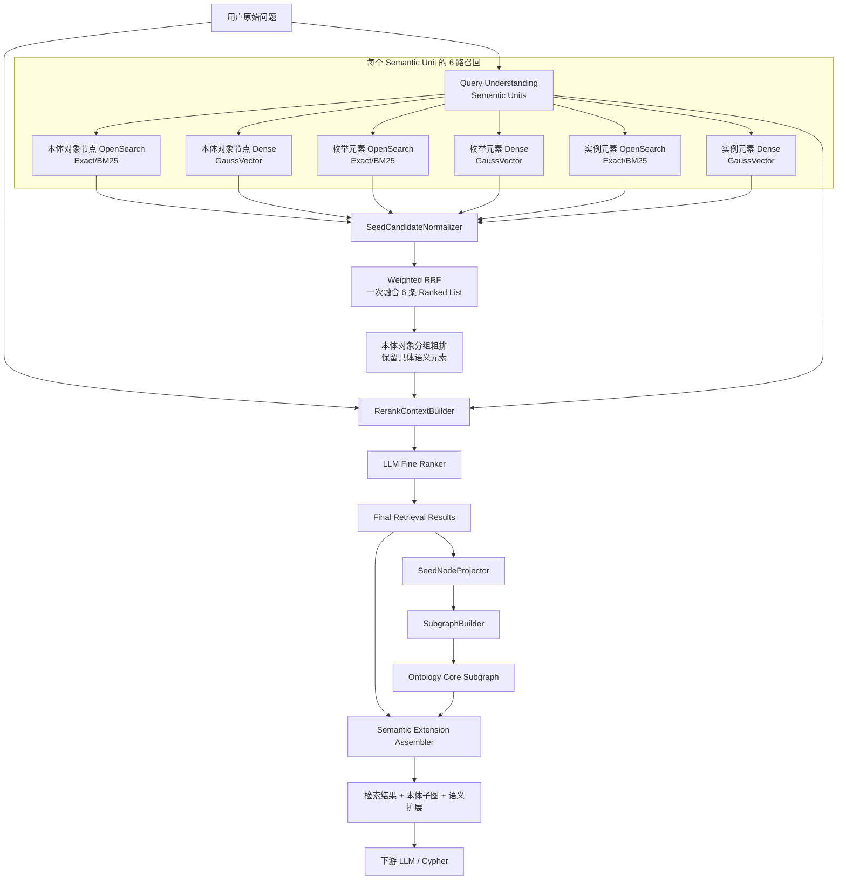
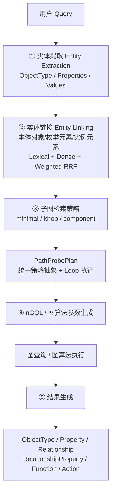
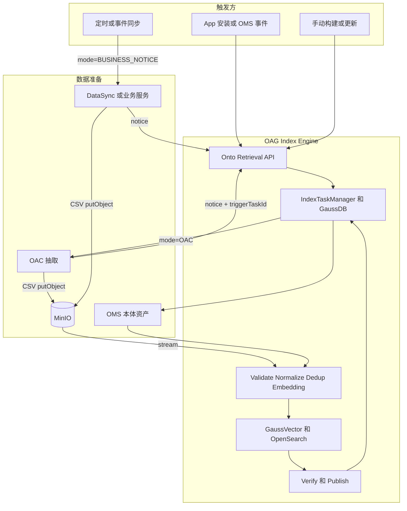
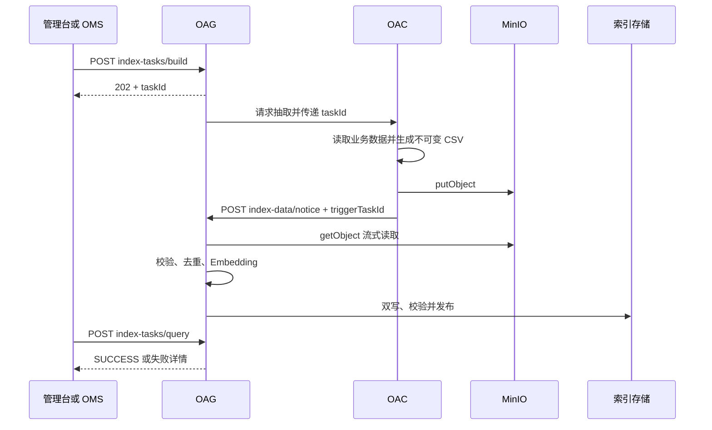
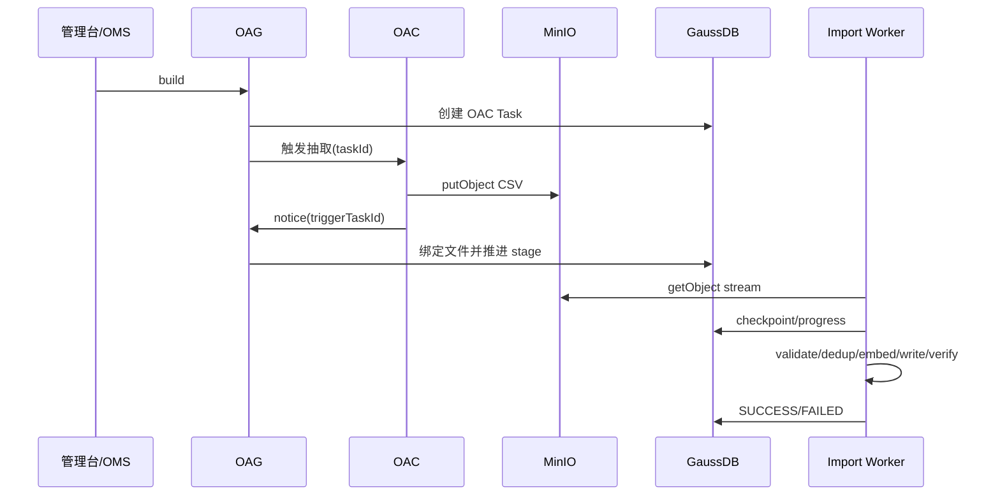
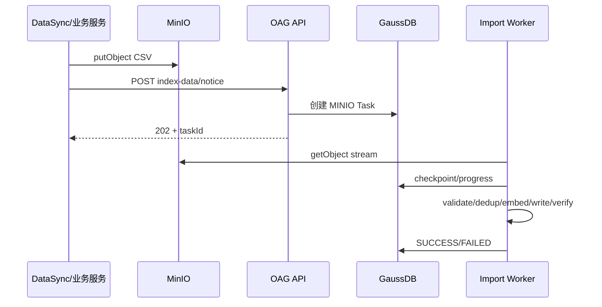
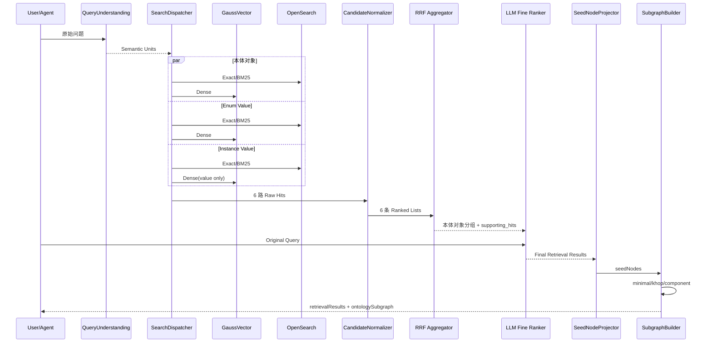

# OAG 面向本体对象的语义检索、混合排序与本体子图构建设计方案

> 版本：V5.16  
> 目标：在不丢失既有 Bulk Import、混合召回、RRF、LLM 精排和子图算法设计的基础上，进一步对齐现有 OMS 本体 JSON 资产，补齐手动构建、OAC 数据抽取、MinIO 文件通知的对外接口及全量/增量组合，并规范阶段 2 Entity Linking 的 ObjectType 作用域内 Property 匹配与 RRF 粗排输出：统一三张索引表命名，本体对象和枚举值直接内嵌 `synonyms`，固定支持中文/英文并额外支持最多 2 种语言，实例索引只保存去重后的真实列值。  
> 核心决策：**ObjectType/Property = 本体对象；SynonymType 在 OMS 中保留多语言源结构，OAG 物理索引中的 `synonyms` 统一为 LF 分隔的平铺字符串且不建立独立物理行；Enum Evidence 只承载 Enum Value；Instance Evidence 只承载真实 Instance Value；本体对象使用 `id`，Enum/Instance 统一使用 `propertyid + objectTypeId` 表达本体归属；每个 Semantic Unit 默认 6 路一次 Weighted RRF。动态 Enum/Instance 数据无论规模大小都统一经 MinIO 交付，OAG 只通过配置决定由 OAC 还是业务服务负责源数据抽取。**

---

## 文档结构

1. 设计目标、术语与总体架构  
2. 数据模型与索引结构  
3. 索引构建、OAC 数据抽取与入库接口组合  
4. 实体提取、Entity Linking 与 6 路召回  
5. LLM 精排与最终检索结果  
6. 本体对象投影、子图策略、路径探测与 nGQL 生成  
7. 性能、配置、可观测性、评测与迁移  

> 本次章节整理将原 V5.3 的 116 个一级章节完整归并到以上 7 个主章节；已有 Bulk Import、三类子图算法、GraphTopologyCache、性能/评测/灰度等信息均保留，只做术语、字段和执行顺序上的收敛。

---

# 1. 设计目标、术语与总体架构

围绕软件、SEC、AMS等业务场景，明确实例值语义索引需求范围，确定语义索引内容全景如下：

| 本体元素 | 自身语义化内容 | 同义词语义化 | 多语言(小语种)语义化 |
|---|---|---|---|
| 对象类型（ObjectType） | 名称、显示名称、描述 | 名称同义词 | 多语言名称、显示名称、描述及同义词 |
| 属性（Property） | 名称、显示名称、描述 | 名称同义词 | 多语言名称、显示名称、描述及同义词 |
| 枚举（Enum） | 枚举值、显示名称、描述 | 枚举值同义词 | 多语言显示名称、描述及同义词 |
| 实例数据（Instance） | 实例值 | 实例值同义词 | × 不配置多语言 |

## 1.1 设计目标与边界

OAG 同时承担索引构建、语义检索和本体子图构建三类能力。V5.16 将检索数据模型统一为三个业务层次：

```text
本体对象（Ontology Object）
  = ObjectType / Property

枚举元素（Enum Element）
  = Enum Value

实例元素（Instance Element）
  = 真实 Instance Value
```

三类名称在索引、Entity Linking、RRF、精排和结果解释中保持一致。历史 API/代码中的 `seed*`、`metadata*` 字段可以在兼容层继续读取，但新设计文档统一使用“本体对象 / 枚举元素 / 实例元素”的逻辑术语。

## 1.2 子图端到端总体架构



运行阶段统一为：

```text
阶段0：索引构建 / Bulk Import
阶段1：Query Understanding / Semantic Units
阶段2：6 路召回
阶段3：一次 Weighted RRF 粗排
阶段4：LLM 精排
阶段5：检索结果 → 本体对象投影
阶段6：minimal / khop / component 子图构建
阶段7：语义扩展与 Cypher 上下文组装
```

核心边界：

> **检索层返回“命中的对象本身”，图算法只消费 ObjectType / Property 本体对象。**

### 1.2.1 本体子图检索五阶段主流程

对外统一把运行链路抽象为五个阶段，现有更细的“召回/RRF/精排/投影”仍作为阶段 ② 内部实现，不改变已有章节顺序：



阶段边界：

1. **实体提取**只回答“用户提到了哪些对象、属性和值”，正式结构见 [extractedEntities / 实体提取设计方案](./OAG语义子图检索接口extractedEntities结构设计方案.md)；
2. **实体链接**把业务表达链接到真实本体对象，并用枚举/实例命中作为语义证据；
3. **子图策略**只消费已解析的 ObjectType/Property terminal，生成可执行 `PathProbePlan`；
4. **nGQL 生成**只负责把 Plan 翻译成参数化图查询或图算法入参，不承载语义判断；
5. **结果生成**把执行结果还原为稳定 API 结构，并按开关扩展 Function/Action。

业务扩展原则：新增业务图策略时实现统一 Strategy SPI 生成 `PathProbePlan`，而不是在 Entity Linking 或 nGQL Assembler 中硬编码业务分支。

## 1.3 与现有 OAG 代码的兼容基线

当前代码已经形成以下主链路：

```text
graphSearchV3()
  └─ performGraphSearchOptimized()
       ├─ interpretQueryIntent()
       ├─ getSeedIds()
       │    ├─ vectorService.searchOntologyByQuery()
       │    ├─ elasticSearchRestRepository.searchOntologyByQuery()
       │    └─ hybridRecallHelper.hybridRecall()
       ├─ loadAllEdges()
       └─ subgraphQuery()
            ├─ getPathInfos()
            │    ├─ computePairwiseShortestPaths()
            │    └─ computePairwiseNumPaths()
            │          └─ findAllPath()
            └─ buildMstSubgraph() / buildAllSubgraph()
```

现有请求参数主要包括：

```text
graphExpansionStrategy = minimal
hopLimit = 3
seedRetrievalMode = vector
topK = 3
includeFunctions = 0
includeActions = 0
```

V5.16 不要求一次性替换现有链路，而是在现有类和接口上渐进演进：

```text
现有 getSeedIds()
    ↓
SearchDispatcher
    ↓
SemanticCandidateNormalizer
    ↓
Weighted RRF 本体对象分组
    ↓
LLM Fine Ranker
    ↓
Final Semantic Matches
    ├─ ObjectType / Property（name/display/description/synonyms 命中）
    ├─ Enum Value（value/name/display/description/synonyms 命中）
    └─ Instance Value（value 命中）
    ↓
SeedNodeProjector
    ↓
最终图构建本体对象
```

现有 `seedIds` / `seedNodes` 仍然可以作为**图构建本体对象兼容字段**保留，但不能再代表完整检索结果；完整检索结果由新增的 `retrievalResults` 表达。

现有 `subgraphQuery()`：

```text
保留 external strategy 名称
    ↓
minimal / khop / component
    ↓
内部支持 legacy / enhanced 两套算法
```

因此本次调整不改变三种图算法的边界，只改变“检索输出是什么”以及“何时投影成本体对象”。

---

## 1.4 核心设计原则

### 设计原则 1：三张表分别表达三类稳定实体

```text
t_oag_{ontology_id}
  → ObjectType / Property

t_oag_enum_{ontology_id}
  → Enum Value

t_oag_instance_{ontology_id}
  → Instance Value
```

### 设计原则 2：Core Graph 与检索字段分离

```text
图算法：ObjectType / Property / Relation
检索字段：name / display / description / synonyms / enum value / instance value
```

Enum/Instance 和 synonym 都可以帮助形成最终语义结果，但不直接成为最短路径、K-hop、Connected Component 的拓扑节点。

# 2. 数据模型与索引结构

## 2.1 数据模型：本体对象、枚举值、实例值与 Synonym

| 类型 | 物理实体 | Synonym 处理 | 本体归属字段 |
|---|---|---|---|
| 本体对象定义 | ObjectType / Property | `synonyms` 以 LF 分隔的平铺字符串内嵌 | 使用本体对象自身 `id`；Property→ObjectType 走拓扑 |
| 枚举元素 | Enum Value | `synonyms` 以 LF 分隔的平铺字符串内嵌 | `propertyId + objectTypeId` |
| 实例元素 | Instance Value | 不建立实例同义词记录 | `propertyid + objectTypeId` |

### 2.1.1 OMS SynonymType：保留多语言源结构

OMS 的 `synonym-type` 仍是建模资产，允许保留语言信息、显示名和描述。例如：

```json
{
  "id": "term-color-synonyms",
  "name": "color-synonyms",
  "display": {
    "zh": "颜色近义词",
    "en": "Color Synonyms"
  },
  "description": {
    "zh": "颜色相关术语的近义词定义",
    "en": "Synonyms for color-related terms"
  },
  "synonyms": {
    "zh": ["颜色", "色彩", "色泽", "色"],
    "en": ["Color", "Colour", "Hue", "Tint"]
  },
  "status": "ACTIVE"
}
```

源模型约束保持：

```text
synonyms 最多包含 3 个 language key
语言组合不固定
每种语言可包含多个同义词
language key 使用 BCP 47 风格，如 zh/en/es/es-MX/pt-BR
```

这些语言 key 用于 OMS 建模、治理和离线评测，不直接作为 OAG 热索引字段层级。

### 2.1.2 OAG `synonyms`：统一平铺为 String/TEXT

OAG 解析 ObjectType / Property / Enum Value 的 `refSynonymTypeId` 后，只提取 SynonymType 中真正参与检索的同义词值，并规范化为一个平铺字符串：

```text
颜色
色彩
色泽
色
Color
Colour
Hue
Tint
```

逻辑分隔符固定为 **LF**。在 JSON/CSV 传输中用字面量 `\n` 表达，例如：

```json
{
  "synonyms": "颜色\n色彩\n色泽\n色\nColor\nColour\nHue\nTint"
}
```

统一转换流程：

```text
SynonymType.synonyms(language → values[])
  ↓
语言块稳定排序
  ↓
语言内保持源数组顺序
  ↓
trim / Unicode normalize / 去空
  ↓
按规范化值去重并保留首次出现原文
  ↓
LF join
  ↓
OAG synonyms TEXT/String
```

稳定排序规则：`zh`、`en` 存在时优先，其余 language tag 按字典序排列；同一语言内保持 OMS 数组顺序。这样同一 SynonymType 在重复构建、FULL_REPLACE 和增量 UPSERT 时可得到确定性字符串。

> **关键边界：** OMS 保留“语言 → 同义词列表”的建模结构；GaussVector、OpenSearch、REST Batch 和 CSV 使用同一个平铺 `synonyms` 字段。OAG 不在热路径中重复反序列化 Synonym Map。

SynonymType 自身不建立独立向量记录。其 `name/display/description` 继续作为 OMS 管理元数据保留，但默认不复制到 `synonyms` 热索引字段，也不再通过 `synonyms_description` 重复拼入 Embedding；真正参与检索的是所属业务实体自身的 name/display/description 与平铺后的 synonym values。

## 2.2 三类物理索引与统一命名

三张 GaussVector 表和对应 OpenSearch Index 统一命名：

| 逻辑类型 | 物理表 / Index | Owner | 数据 |
|---|---|---|---|
| 本体对象定义 | `t_oag_{ontology_id}` | OAG | ObjectType / Property |
| 枚举元素 | `t_oag_enum_{ontology_id}` | OAG | Enum Value + Synonyms |
| 实例元素 | `t_oag_instance_{ontology_id}` | OAG，业务服务提供数据 | Instance Value |

三类数据继续物理隔离，原因不变：

```text
规模差异
更新频率差异
ANN 算法差异
数据 Owner 差异
检索 TopK / 阈值差异
```

## 2.3 `t_oag_{ontology_id}` GaussVector 表结构

本体对象表保留两个额外语言槽位，并增加平铺 `synonyms`。中文和英文仍保留固定列，另外最多支持 2 种 display/description 语言：

| 字段 | 类型 | 非空 | 说明 |
|---|---|---|---|
| `vector` | `DOUBLE[]` | ✔ | 1024 维向量 |
| `type` | `INT` | | 0 ObjectType，1 Property |
| `id` | `VARCHAR(256 CHAR)` | ✔ | ObjectType / Property 全局唯一 ID |
| `parent_id` | `VARCHAR(256 CHAR)` | | 父元素 ID；当 type=1 时记录 Property 所属 ObjectType ID |
| `name` | `VARCHAR(256 CHAR)` | | 本体真实名称 |
| `display_zh` | `VARCHAR(512 CHAR)` | | 中文显示名 |
| `display_en` | `VARCHAR(512 CHAR)` | | 英文显示名 |
| `display_lang_1` | `VARCHAR(512 CHAR)` | | 第 1 个额外语言显示名 |
| `display_lang_2` | `VARCHAR(512 CHAR)` | | 第 2 个额外语言显示名 |
| `description_zh` | `VARCHAR(1024 CHAR)` | | 中文描述 |
| `description_en` | `VARCHAR(1024 CHAR)` | | 英文描述 |
| `description_lang_1` | `VARCHAR(1024 CHAR)` | | 第 1 个额外语言描述 |
| `description_lang_2` | `VARCHAR(1024 CHAR)` | | 第 2 个额外语言描述 |
| `synonyms` | `TEXT` | | LF 分隔的同义词平铺字符串；不保存 JSON Map/Array |

`synonyms` 逻辑值示例：

```text
小区
无线小区
Cell
Radio Cell
Celda
Celda de radio
```

传输表示：

```text
小区\n无线小区\nCell\nRadio Cell\nCelda\nCelda de radio
```

额外 display/description 最多 2 个语言槽位；“Synonym 最多 3 种语言”是 **OMS SynonymType 源模型约束**。

## 2.4 本体对象向量化内容

OAG 在内存中解析 ObjectType / Property 及其 SynonymType，先按 2.1.2 生成 canonical `synonyms` 字符串，再按以下顺序构建 Embedding 文本：

```text
{name}
{display_zh}
{display_en}
{display_lang_1}
{display_lang_2}
{description_zh}
{description_en}
{description_lang_1}
{description_lang_2}
{synonyms}
```

其中 `{synonyms}` 就是 LF 分隔后的同义词值列表。EmbeddingInputBuilder 可以直接把该字符串作为最后一个文本块追加，不再构造 `synonyms_value` / `synonyms_description` 两个中间字段。

这样可保证：

```text
OMS 静态构建
MinIO CSV 动态导入
        ↓
都使用同一种 synonyms 物理表达和 Embedding 规则
```

SynonymType 的 `name/display/description` 不再额外重复拼接到向量中，避免与所属 ObjectType / Property 自身的 name/display/description 形成重复语义权重。

空字段直接跳过，不写占位字符串。不要把 ObjectType 名称额外强制拼到 Property 向量开头；Property 自身语义、display、description、synonyms 已足够作为主表达。

当前 BGE-M3 向量维度继续沿用 1024。Embedding 批大小和重试次数属于 OAG 工程配置，不进入表 Schema。

## 2.5 多语言槽位与 Synonym 语言规则

### 2.5.1 Display / Description 最多 4 种语言

```text
固定语言：zh + en
额外语言：lang_1 + lang_2
总计最多 4 种
```

没有配置某个额外语言时，对应列为空。

### 2.5.2 Synonym：源模型保留语言，索引模型语言无关

Synonym 的语言规则只在 OMS 源模型层生效：

```text
OMS SynonymType.synonyms
  → 最多 3 个 language key
  → language key 不固定
  → 每种语言可有多个词
```

进入 OAG 后统一转换为：

```text
synonyms = term1<LF>term2<LF>term3...
```

因此 OAG 物理索引不再存在：

```text
synonyms.zh
synonyms.en
synonyms.es
synonyms.<language>
```

也不再通过 language key 对 synonym 做 Dense 过滤或 Lexical 硬过滤。`language_hint` 仍可作用于 display/description Analyzer 和查询理解，但 synonym 字段本身按语言无关文本检索。

如果未来确实需要“按语言返回 synonym”或线上语言级统计，应从 OMS SynonymType 源资产补充上下文，或新增独立冷元数据能力；不应重新把多语言 Map 放回高频检索记录。

## 2.7 `t_oag_{ontology_id}` OpenSearch Index

OpenSearch 与 GaussVector 共享同一业务字段语义：

```text
type
id
parent_id
name
display_zh
display_en
display_lang_1
display_lang_2
description_zh
description_en
description_lang_1
description_lang_2
synonyms
```

推荐映射：

| 字段 | OpenSearch 类型 | 说明 |
|---|---|---|
| `type` | `integer` | 0 ObjectType / 1 Property |
| `id` | `keyword` | 本体 ID |
| `name` | `keyword` + `text` | Exact / BM25 |
| `display_*` | `keyword` + `text` | 多语言显示名 |
| `description_*` | `text` | 多语言描述 |
| `synonyms` | `text` multi-field | 主字段按 LF 切成“整条 synonym token”做 Exact；`synonyms.bm25` 用普通 Analyzer 做 BM25 |

`synonyms` 不再映射为 dynamic object。推荐 Analyzer：

```yaml
analysis:
  tokenizer:
    synonym_line_tokenizer:
      type: pattern
      pattern: '\\n+'
  analyzer:
    synonym_line_analyzer:
      type: custom
      tokenizer: synonym_line_tokenizer
      filter: [lowercase, asciifolding]
```

字段映射示意：

```yaml
synonyms:
  type: text
  analyzer: synonym_line_analyzer
  search_analyzer: synonym_line_analyzer
  fields:
    bm25:
      type: text
      analyzer: standard
```

这样：

```text
Exact synonym
  → 查询 synonyms 主字段；一个 LF 行作为一个完整 token

BM25 synonym
  → 查询 synonyms.bm25；把平铺文本按普通全文规则召回
```

检索优先级：

```text
id/name/display exact
> synonyms line-exact
> name/display phrase/BM25
> synonyms.bm25
> description BM25
```

Synonym 命中统一返回：

```text
matched_field = synonyms
matched_value = 实际命中的某一行 synonym
```

Exact 命中可以直接定位匹配行；BM25 命中由 `SynonymMatchResolver` 对 `synonyms` 做一次 LF split，并用与检索一致的 normalizer 在候选行中选出最匹配的 `matched_value`。这一步是简单字符串处理，不再执行 JSON 反序列化。

不再使用扁平 `i18n_content`，也不再建立 `synonyms.*` dynamic template。

## 2.8 `t_oag_enum_{ontology_id}`：Enum Value 模型与表结构

t_oag_enum 只承载本体模型中定义的枚举值。

### 2.8.1 EnumType 源结构

```json
{
  "id": "ei.veh12.enum.Col35.1",
  "name": "Color",
  "display": {"en": "Color", "zh": "颜色"},
  "description": {"en": "Vehicle body color enumeration", "zh": "车身颜色枚举"},
  "status": "ACTIVE",
  "creatorByOntology": "vehicle",
  "valueType": "string",
  "refSynonymTypeId": "term-color-synonyms",
  "values": [
    {
      "id": "ei.veh12.enum.Col35.val.red8.1",
      "code": "0",
      "value": "red",
      "description": {"en": "Red color", "zh": "红色"},
      "order": 1,
      "refSynonymTypeId": "term-color-red-synonyms"
    },
    {
      "id": "ei.veh12.enum.Col35.val.blue9.1",
      "value": "blue",
      "description": {"en": "Blue color", "zh": "蓝色"},
      "order": 2,
      "refSynonymTypeId": "term-color-blue-synonyms"
    }
  ],
  "extensions": {}
}
```

真正进入 `t_oag_enum_{ontology_id}` 的粒度是 `values[]` 中的每个枚举值。

### 2.8.2 SynonymType 源结构与索引转换

OMS SynonymType 仍保留结构化多语言信息：

```json
{
  "id": "term-color-red-synonyms",
  "name": "color-red-synonyms",
  "display": {"zh": "红色近义词", "en": "Red Synonyms"},
  "description": {"zh": "红色相关术语", "en": "Synonyms for red"},
  "synonyms": {
    "zh": ["红", "赤色"],
    "en": ["Red"],
    "es": ["Rojo"]
  },
  "status": "ACTIVE"
}
```

OMS 源模型仍要求 `synonyms` 最多 3 个 language key，语言不固定。OAG 建索引时只把 synonym values 平铺：

```text
红
赤色
Red
Rojo
```

最终 `t_oag_enum_{ontology_id}.synonyms` 保存：

```text
红\n赤色\nRed\nRojo
```

其中不再包含 language key、JSON Object 或 Array。

### 2.8.3 Property 引用 Enum

```json
{
  "id": "prop:ont:vehicle:sp:bodyColor",
  "name": "bodyColor",
  "display": {"en": "Body Color", "zh": "车身颜色"},
  "description": {"en": "Vehicle body color", "zh": "车身颜色"},
  "dataType": "enum",
  "valueType": "string",
  "referenceEnumName": "Color",
  "referenceEnumId": "ei.vehicle.enum.Color.1",
  "extensions": {}
}
```

OAG 按：

```text
Property.referenceEnumId
  → EnumType.values[]
  → EnumValue.refSynonymTypeId
  → SynonymType.synonyms
  → SynonymFlattener
  → LF String
```

展开索引。

### 2.8.4 向量库表结构

```text
t_oag_enum_{ontology_id}
```

| 字段 | 类型 | 非空 | 说明 |
|---|---|---|---|
| `vector` | `DOUBLE[]` | ✔ | Enum Value 向量 |
| `value` | `VARCHAR(4096 CHAR)` | | 真实枚举值 |
| `property_id` | `VARCHAR(512 CHAR)` | ✔ | 引用该 Enum 的 Property.id |
| `object_type_id` | `VARCHAR(256 CHAR)` | | Property 所属 ObjectType.id |
| `display_zh` | `VARCHAR(512 CHAR)` | | 中文 display |
| `display_en` | `VARCHAR(512 CHAR)` | | 英文 display |
| `display_lang_1` | `VARCHAR(512 CHAR)` | | 额外语言 1 display |
| `display_lang_2` | `VARCHAR(512 CHAR)` | | 额外语言 2 display |
| `description_zh` | `TEXT` | | 中文 description |
| `description_en` | `TEXT` | | 英文 description |
| `description_lang_1` | `TEXT` | | 额外语言 1 description |
| `description_lang_2` | `TEXT` | | 额外语言 2 description |
| `synonyms` | `TEXT` | | LF 分隔的 Enum Value 同义词平铺字符串 |

如果一个 EnumType 被多个 Property 复用，需要按实际引用 Property 展开记录。Evidence 不重新引入 `id/parent_id`；业务定位和数据库唯一性统一使用：

```text
objectTypeId + propertyId + normalized(value)
```

`values[].id` 仍可用于 OMS 源数据追踪和质量校验，但不作为 `t_oag_enum_{ontology_id}` 的持久化字段。

## 2.9 Enum Value 向量化规则

每个 `values[]` 元素按以下内容生成一个向量：

```text
{value}
{display_zh}
{display_en}
{display_lang_1}
{display_lang_2}
{description_zh}
{description_en}
{description_lang_1}
{description_lang_2}
{synonyms}
```

其中 `{synonyms}` 为当前 Enum Value 关联 SynonymType 经 2.1.2 规则平铺后的 LF String。

向量顺序坚持：

```text
Value First
→ Name（存在时）/ Display
→ Description
→ Synonyms
```

不再构造 `synonyms_value` / `synonyms_description`，也不把 SynonymType 自身的 name/display/description 追加到向量文本。

不在向量文本开头追加 ObjectType / Property 文本；`propertyId + objectTypeId` 已提供确定性归属。

## 2.10 `t_oag_instance_{ontology_id}` 实例列值表结构

实例索引保存去重后的真实列值，每条记录直接携带所属 Property 和 ObjectType。

```text
t_oag_instance_{ontology_id}
```

| 字段 | 类型 | 非空 | 说明 |
|---|---|---|---|
| `vector` | `DOUBLE[]` | ✔ | Instance Value 向量 |
| `value` | `VARCHAR(4096 CHAR)` | | 去重后的真实列值 |
| `synonym` | `VARCHAR(4096 CHAR)` | | 真实列值的同义词 |
| `property_id` | `VARCHAR(512 CHAR)` | ✔ | 所属 Property.id |
| `object_type_id` | `VARCHAR(256 CHAR)` | | Property 所属 ObjectType.id |

**实例值多归属演进方案：** 当前版本不要求 `value` 单列全局唯一，同一个规范化值如果属于多组 Property/ObjectType，允许保存多条物理记录，业务唯一键使用 `(normalized_value, property_id, object_type_id)`，从而避免数组字段导致的更新放大和索引过滤复杂化。

未来如果业务明确要求“一个 value 只保存一份向量”，升级为**值表 + 归属映射表**两层模型，而不是直接把 `property_id/object_type_id` 改成数组：

```text
t_oag_instance_value_{ontology_id}
  value_id
  normalized_value UNIQUE
  value
  vector

    1 : N
      ↓

t_oag_instance_binding_{ontology_id}
  value_id
  property_id
  object_type_id
  UNIQUE(value_id, property_id, object_type_id)
```

查询链路：先在 Value 表执行 Exact/BM25/Dense 召回得到 `value_id`，再批量查询 Binding 表展开成多组 `(property_id, object_type_id)`，随后按当前 ObjectType/Property 上下文进入 RRF/LLM 消歧。对上层统一预留 `ownerships[]` 逻辑结构；当前“一值多行”实现也在 Normalizer 层聚合成同一逻辑候选，因此未来切换两层存储不改变 Entity Linking 和子图构建接口。

当前方案实例数据先放在一张表，不同列的语义值放在一个表内，并明确数据量规模和性能规格；拆表方案后续需求驱动。候选包括水平拆分、按对象拆表、保持单表并通过规格约束，当前不提前复杂化。

## 2.11 Instance Value 向量准入规则

Property 中的 `"capability":"DIMENSION"` 是实例列值进入向量索引的准入标识，同时还需要满足数据类型和值形态约束：

```text
instance_index_enabled =
  property.capability == "DIMENSION"
  AND datatype_eligible
  AND value_shape_eligible
  AND cardinality_eligible
```

向量库最终必须保证实例值记录不重复。业务服务比如软件的 DataSync 可以在源侧先做去重，OAG 在写入 `t_oag_instance_{ontology_id}` 前仍必须按 `objectTypeId + propertyid + normalized(value)` 再次去重并使用幂等 UPSERT。例：5000 万 Subscriber 行中 `subLevel` 只有 VIP/GOLD/SILVER/NORMAL，最终向量库只保留 4 条唯一实例值记录。

默认不向量化：

```text
UUID
手机号
纯技术主键
时间戳
日期
连续数值
高随机编码
```

适合向量化：

```text
产品名称
品牌名称
客户等级
区域名称
业务状态
自然语言标签
人可理解业务分类
```

高基数自由文本进入单独 Document/RAG Index，不进入本体对象 Resolver 的 Instance Value Index。

## 2.12 Instance Value 向量化内容

实例列值 Dense 内容严格只使用：

```text
{value}
```

这样 Instance Dense 表达始终由真实业务值主导；Property/ObjectType 归属直接由记录中的 `propertyid + objectTypeId` 提供。

可以只用组合的 Struct 结构的 value。

## 2.13 Enum / Instance OpenSearch Index

### `t_oag_enum_{ontology_id}`

核心字段与 GaussVector 一致：

```text
type
propertyId
objectTypeId
value
display_zh
display_en
display_lang_1
display_lang_2
description_zh
description_en
description_lang_1
description_lang_2
synonyms
```

Exact 优先：

```text
propertyId
objectTypeId
value.keyword
display_*.keyword
synonyms（synonym_line_analyzer，一行一个完整 synonym token）
```

BM25：

```text
display_*
description_*
synonyms.bm25
```

枚举元素的 `synonyms` 映射与 2.7 完全一致，不再使用按语言展开的 keyword 子字段或语言 dynamic object。

### `t_oag_instance_{ontology_id}`

只需要：

```text
type          integer
propertyid    keyword
objectTypeId  keyword
value         keyword + text
```

Exact 主要搜索 `propertyid/objectTypeId/value.keyword`，BM25 搜索 `value`。

## 2.14 规范化规则

规范化属于索引构建/查询处理逻辑，不增加额外持久化字段：

```text
trim
Unicode normalize
casefold（适用语言）
连续空白归一
全半角归一
```

`name/value/display/description` 保留原始业务文本。OMS 中原始 SynonymType 多语言结构继续由 OMS 维护；OAG 的 `synonyms` 保存规范化展开后的 canonical LF String。

SynonymFlattener 处理规则：

```text
CRLF / CR → LF
按 LF 切分
trim
去空行
按基础规范化值去重，保留首次出现原文
重新 LF join
```

OpenSearch 使用 2.7 的 line analyzer / BM25 multi-field；GaussVector 在 Embedding 前直接使用同一 canonical `synonyms`，避免不同存储各自做一套解析。

## 2.15 language_hint 与语言槽位

查询理解阶段仍可以输出：

```text
language_hint = BCP 47 language tag / mixed / und
```

物理存储分三种情况：

```text
本体对象 / Enum Value display、description
  → zh/en 固定 + lang_1/lang_2 两个 ontology 级语言槽位

SynonymType 源资产
  → OMS 中保留 language Map，最多 3 个 language key

OAG synonyms 热索引
  → 单个 LF 分隔 String，不保留 language key

Instance Value
  → 仅 value；language 为可选观测/Analyzer Hint
```

检索规则：

```text
display/description 可根据 language_hint 选择 Analyzer 或 Boost
synonyms 不按 language_hint 硬过滤，也不做 synonyms.<language> Boost
Dense 不按 language_hint 过滤
LLM 精排继续看到原始问题和所有候选
```

因此 `matched_field` 对 synonym 统一为 `synonyms`；如果需要知道该同义词在 OMS 中原本属于哪种语言，只能通过源 SynonymType 或离线标注补充，不能从热索引字段名反推。

## 2.16 数据质量治理

OAG 元数据同步阶段必须先校验 OMS 源结构，再校验平铺后的热索引值。

### OMS SynonymType 源结构校验

```text
ObjectType / Property id 重复或缺失
name/display/description 格式非法
additionalLanguages 槽位配置不一致
SynonymType.synonyms language key 数 > 3
language key 非法或不符合约定的 BCP 47 风格
同一 language 内 synonym 重复
synonym 与 canonical name/display 完全重复
同一业务范围内 synonym 映射冲突
Enum Ref 不存在
Enum values[].id/value 源数据重复
Enum Value.refSynonymTypeId 不存在
Property.referenceEnumId 不存在
Parent ObjectType 缺失
```

### OAG 平铺 synonyms 校验

```text
统一 CRLF/CR 为 LF
禁止空 synonym 行进入索引
去除首尾空白
规范化后重复 synonym 只保留第一次出现的原文
禁止 JSON Object / JSON Array 形式写入 synonyms 热字段
字段总长度和 synonym 数量受服务配置保护
```

动态 REST/CSV 已经不携带 language key，因此只能执行平铺值质量校验，不能在 OAG API 层声称“校验动态 synonyms 最多 3 种语言”。该限制属于 OMS SynonymType 源建模约束。

冲突处理原则：不能静默覆盖，必须可观测；严重结构错误阻断当前记录或当前批次入库。

DataSync 实例值额外检查：

```text
空 value
超长 value
unique_value_count
同一 objectTypeId + propertyid 下重复 value
高基数
无意义随机串
非法 UTF-8
```

## 2.17 增量索引与幂等

三类表按各自稳定业务键做幂等 UPSERT / DELETE：

```text
本体对象：id
Enum Value：objectTypeId + propertyId + normalized(value)
Instance Value：objectTypeId + propertyid + normalized(value)
```

同一业务键重复 UPSERT 必须覆盖当前记录而不是新增重复向量；`synonyms` 以 canonical LF String 整字段覆盖，不执行 Map merge。DELETE 必须同时删除 GaussVector 与 OpenSearch 中对应记录。

不在记录中保留：

```text
content_hash
model_version
source_version
updated_at
```

版本和构建信息统一放到 OAG 的 Import Job / Generation 元数据，不进入每条向量记录。

Embedding 模型升级时：

```text
创建新的 Generation
→ 全量重新 Embedding
→ Verify
→ 原子发布
```

如果未来需要“内容未变化则跳过 Embedding”，可以作为 OAG 内部缓存优化实现，但不扩展业务表 Schema。

## 2.18 GaussVector 索引算法

本体对象 / 枚举元素：

```text
GsIVFFLAT
COSINE
```

适用规模：

```text
约 1*10^4 ～ 2*10^6
```

推荐：

```text
IVF_NLIST = 4 * sqrt(N)
```

其中：

```text
N = 当前物理表实际记录数
```

实例元素：

```text
中小规模 → GsIVFFLAT
千万 / 亿级 → GsDiskANN
```

枚举元素与实例元素分表的一个核心原因就是允许 ANN 算法独立演进。

---

# 3. 索引构建与入库

本章定义 OAG 索引数据的构建、OAC 抽取编排、MinIO 文件交互、任务持久化和双存储发布机制。索引数据仍由第 2 章定义的三张物理表承载：

```text
t_oag_{ontology_id} → ObjectType / Property 本体对象
t_oag_enum_{ontology_id} → Enum Value
t_oag_instance_{ontology_id} → Instance Value
```

其中本体对象索引由 OAG 根据 OMS 本体资产构建；Enum Value 和 Instance Value 还支持运行期抽取与导入。动态 Enum/Instance 数据统一使用 **MinIO CSV** 作为数据交付协议，区别仅在于谁负责读取业务数据：

```text
OAC 模式
  → 管理台或 OMS 调用 OAG 手动构建/更新
  → OAG 触发 OAC 读取业务数据
  → OAC 生成 CSV、上传 MinIO、通知 OAG
  → OAG 从 MinIO 读取并完成索引

BUSINESS_NOTICE 模式
  → OAG 不调用 OAC
  → DataSync / 业务服务读取业务数据
  → 生成 CSV、上传 MinIO、通知 OAG
  → OAG 从 MinIO 读取并完成索引
```

> **关键约束：有 OAC 的场景，无论小数据量还是大数据量，OAC 都必须“读取数据 → 写入 MinIO → 通知 OAG”，不再设计 OAC 分页/流式把业务记录直接返回 OAG 的新路径。**

OMS 静态本体资产和 MinIO 动态数据最终进入同一套 OAG Import Pipeline，不允许分别维护多套 Embedding、去重、GaussVector/OpenSearch 写入和任务状态逻辑。历史 REST Batch 仅作为存量兼容能力，不作为本方案新增业务数据交付路径。

---

## 3.1 职责边界

### OMS

负责提供 ObjectType / Property、多语言 display/description、SynonymType、EnumType / values[]、Property→ObjectType 和 Property→EnumType 等本体资产。OAG 根据 OMS 资产构建 `t_oag_{ontology_id}` 和静态 Enum Value 索引；App 安装事件可以触发 OAG 创建种子索引任务。

### OAC

OAC 是 `instanceDataSourceMode=OAC` 时的业务数据统一抽取入口，负责：

```text
接收 OAG 下发的 tenantId / ontologyId / taskId / dataType / importMode
根据本体映射访问业务数据源
抽取 Enum Value / Instance Value
执行源侧基础标准化和必要去重
生成 UTF-8 CSV
上传 MinIO
调用 OAG index-data/notice，并携带 triggerTaskId 绑定原构建任务
```

OAC 不负责 Embedding、GaussVector/OpenSearch 写入、Generation 发布或索引任务终态管理。**OAC 不向 OAG 直接返回大批业务数据，也不因数据量小而切换成分页直返。**

### DataSync / 业务数据服务

当 `instanceDataSourceMode=BUSINESS_NOTICE` 时，DataSync 或业务数据服务负责定时/事件驱动的实例数据准备与文件交付：

```text
读取 capability=DIMENSION 的 Property
访问实际数据源
提取真实 Instance Value
源侧去重 / 基础标准化
建立 value 与 Property 的映射
生成 UTF-8 CSV 文件
上传到双方约定的 MinIO Bucket
调用 OAG index-data/notice 注册导入任务
```

当生产者能够产生动态 Enum Value 时，也可以使用相同 CSV 通知接口提交 `METADATA_ENUM` 数据。

DataSync/业务数据服务不负责 Embedding、GaussVector/OpenSearch Client、ANN/全文索引构建、OAG 物理表创建、Generation 发布以及最终去重和双存储一致性。

### OAG

OAG 统一负责：

```text
对外 API 和索引任务创建
OMS 资产读取与 OAC 抽取编排
GaussDB 任务状态持久化
请求 / CSV Schema 校验
Enum / Instance 本体映射校验
Normalize / Dedup
Embedding
GaussVector Bulk Write
OpenSearch Bulk Write
ANN / 全文索引校验
Generation 发布
在线检索
任务查询 / 重试 / 取消 / 错误查询
```

> **OMS/OAC/DataSync/业务服务提供资产或业务语义数据，OAG 统一把数据转换为可检索的向量/全文索引并对发布结果负责。**

---

## 3.2 总体索引构建架构

![[Pasted image 20260823094556.png]]

### 数据源接入模式、容量规格与 DataSeek 对齐结论

OAG 增加服务端配置项，配置的是“**由谁负责读取业务数据**”，而不是“是否使用 MinIO”。动态 Enum/Instance 数据的交付通道固定为 MinIO：

```yaml
indexBuild:
  instanceDataSourceMode: OAC   # OAC | BUSINESS_NOTICE
```

| 模式 | 数据流 | 适用场景 |
|---|---|---|
| `OAC` | Build API → OAG → OAC 抽取 → MinIO → notice → OAG 读取 → Embedding → 双写 | 部署中 OAC 可以访问业务数据源；首次全量和后续更新均适用，不区分数据量 |
| `BUSINESS_NOTICE` | DataSync/业务服务抽取 → MinIO → notice → OAG 读取 → Embedding → 双写 | OAC 不可对接业务数据源，或业务已有独立数据同步服务 |

配置原则：

```text
instanceDataSourceMode = OAC
  → 手动 Build/更新由 OAG 主动触发 OAC
  → OAC 必须把抽取结果写入 MinIO，再调用 index-data/notice

instanceDataSourceMode = BUSINESS_NOTICE
  → OAG 不主动访问 OAC
  → 业务/DataSync 自行准备 MinIO 文件并调用 index-data/notice
```

两种模式从 `index-data/notice` 之后完全共用同一 Import Pipeline；禁止根据数据量在运行时切换成“OAC 直接分页返回 OAG”。

### 容量约束

容量基线按**源侧业务用户规模**定义：

| 业务档位 | 当前支持的源侧用户规模 | 数据来源 | 统一交付通道 | 设计约束 |
|---|---:|---|---|---|
| Software | ≤ 1 万用户 | 按配置选择 `OAC` 或 `BUSINESS_NOTICE` | MinIO CSV | 当前正式规格；支持 FULL_REPLACE / INCREMENTAL |
| SEC | ≤ 100 万用户 | 按配置选择 `OAC` 或 `BUSINESS_NOTICE` | MinIO CSV | 当前最大正式规格；必须启用 Streaming、Chunk、Checkpoint、限流、幂等双写 |
| > 100 万用户 | 超出当前正式规格 | 专项评估 | MinIO CSV | 完成容量、Embedding 吞吐、GaussVector/OpenSearch 写入与检索专项压测后再开放 |

这里的 **1 万 / 100 万是业务用户规模约束，不等同于“去重后 Value 数”**。OAG 仍按 Property 对真实列值去重；任务同时观测 `sourceRows / uniqueValues / finalIndexRows`，防止多 Property 场景仅用用户数低估实际索引规模。

与 DataSeek/NL2SQL 的对齐采用统一语义值逻辑模型：`ontology_id / object_type_id / property_id / value / normalized_value / source / version / update_type`。OAG 保持 Exact/BM25 + Dense 的混合检索契约和“值 → Property/ObjectType”归属解析能力；未来 NL2SQL 可以复用同一语义值字典和归属信息，而不要求共享 OAG 的物理向量表。



数据准备方不同，但动态数据交付方式只有一套：**OAC / DataSync / 业务服务 → MinIO → notice → OAG**。从 `SchemaValidator` 开始统一使用 Normalize/Dedup/Embedding/双写/Verify/Publish 流水线。

## 3.3 统一 REST API 规范

OAG 对外接口统一使用 Namespace：

```text
/v1/onto-retrieval/{ontologyId}
```

本章接口按 **OpenAPI 3.0.3** 规范定义。所有 URI、Path/Header/Query 参数、Request Body、HTTP Status Code 和 Response Schema 都必须能够直接映射为 OpenAPI `paths / parameters / requestBody / responses / components.schemas`。

### 3.3.1 公共协议约束

#### Content-Type

```http
Content-Type: application/json
Accept: application/json
```

MinIO 文件导入接口自身仍使用 JSON 注册文件，不通过 `multipart/form-data` 直接上传大文件；CSV 先由数据生产者上传到双方约定的 MinIO Bucket，再调用 `index-data/notice`。

#### 公共 Path 参数

| 参数名称 | 类型 | 是否必选 | 默认值 | OpenAPI 约束 | 说明 |
|---|---|---|---|---|---|
| `ontologyId` | String | 是 | - | `in: path`，`required: true`，`maxLength: 256` | 本体唯一 ID；必须与 URI 中的目标本体一致 |

#### 公共 Header 参数

| 参数名称 | 类型 | 是否必选 | 默认值 | OpenAPI 约束 | 说明 |
|---|---|---|---|---|---|
| `x-gde-tenant-id` | String | 是 | - | `in: header`，`required: true`，`maxLength: 256` | 租户 ID；OAG 按租户隔离本体和任务 |
| `Content-Type` | String | POST 请求是 | `application/json` | `application/json` | 请求体编码类型 |
| `Accept` | String | 否 | `application/json` | `application/json` | 响应类型 |

#### 公共 HTTP 状态码

| HTTP 状态码 | 场景 | Response Schema |
|---|---|---|
| `200 OK` | 同步查询成功 | 对应接口 Success Response |
| `202 Accepted` | 异步导入、重试或取消请求已接受 | `AsyncTaskAcceptedResponse` / `BatchTaskOperationResponse` |
| `400 Bad Request` | Path/Header/Body/Query 参数校验失败 | `ValidationErrorResponse` |
| `404 Not Found` | Ontology、Task 或同步校验的资源不存在 | `BusinessErrorResponse` |
| `409 Conflict` | 幂等键冲突、任务状态不允许当前操作 | `BusinessErrorResponse` |
| `429 Too Many Requests` | 导入任务或接口触发限流 | `BusinessErrorResponse` |
| `500 Internal Server Error` | OAG 内部未预期异常 | `BusinessErrorResponse` |
| `503 Service Unavailable` | GaussDB、Embedding、GaussVector、OpenSearch、MinIO 等依赖暂不可用 | `BusinessErrorResponse` |

> 对异步导入接口，`202 Accepted` 仅表示任务已成功写入 GaussDB 并进入执行队列，不表示数据已经完成 Embedding、双写或发布。

#### 幂等规则

`requestId` 是调用方生成的业务幂等键，最大长度 256。OAG 使用：

```text
ontologyId + requestId
```

作为任务级幂等约束：

```text
相同 ontologyId + requestId + 相同请求语义
  → 返回原 taskId，不重复创建任务

相同 ontologyId + requestId + 不同 dataType/importMode/数据内容
  → HTTP 409 IDEMPOTENCY_CONFLICT
```

---

### 3.3.2 语义子图检索接口

#### 典型场景

Agent、Skill 或上层业务根据自然语言问题获取与问题相关的 ObjectType、Property、Enum Value、Instance Value、Relation、Function/Action 等检索结果和本体子图。

#### 接口功能

执行 Query Understanding、6 路混合召回、Weighted RRF、LLM 精排和本体子图生成。该接口只负责语义检索与子图返回，不承担索引数据导入。

#### 调用方法

POST

#### URI

```text
/v1/onto-retrieval/{ontologyId}/subgraph/semantic-search
```

对应 Spring 接口：

```java
@PostMapping("/v1/onto-retrieval/{ontologyId}/subgraph/semantic-search")
```

#### 请求参数

除公共 Path/Header 参数外，请求 Body 使用 `SemanticSearchRequest`。

| 参数名称 | 类型 | 是否必选 | 默认值 | OpenAPI 约束 | 说明 |
|---|---|---|---|---|---|
| `query` | String | 是 | - | `minLength: 1` | 自然语言业务问题或 Planning 层整理后的语义检索问题 |
| `similarityThreshold` | Number(float) | 否 | `0.6` | `minimum: 0`，`maximum: 1` | Dense 相似度阈值；Exact 命中不受该阈值过滤 |
| `includeFunctions` | Integer | 否 | `1` | `enum: [0,1]` | 是否返回 Function |
| `includeActions` | Integer | 否 | `0` | `enum: [0,1]` | 是否返回 Action |
| `seedRetrievalMode` | String | 否 | `vector` | 当前支持值以服务配置为准 | 本体对象检索模式 |
| `topK` | Integer | 否 | `3` | `minimum: 1` | 本体对象候选 TopK |
| `graphExpansionStrategy` | String | 否 | `minimal` | `enum: [minimal,khop,component]` | 子图扩展策略 |
| `hopLimit` | Integer | 否 | `3` | `minimum: 1` | `khop` 策略下的最大扩散深度 |

#### 请求示例

```json
{
  "query": "查询正式用户的 Mobile Number",
  "similarityThreshold": 0.6,
  "includeFunctions": 1,
  "includeActions": 0,
  "seedRetrievalMode": "vector",
  "topK": 3,
  "graphExpansionStrategy": "minimal",
  "hopLimit": 3
}
```

#### 返回参数

成功响应沿用后续第 5、6 章定义的最终检索与子图结构。OpenAPI 中 `result` 至少声明为 Object，内部字段包括 `retrievalResults / seedNodes / nodes / edges / semanticExtensions / capabilityExtensions / metadata`。

---

### 3.3.3 索引导入与任务接口清单

| 场景 | Method | URI | OpenAPI operationId | 说明 |
|---|---|---|---|---|
| 索引数据通知接口 | POST | `/v1/onto-retrieval/{ontologyId}/index-data/notice` | `importIndexDataFromMinio` | 注册已上传到 MinIO 的 CSV；可用 `triggerTaskId` 关联手动构建任务；Enum/Instance 全量和增量统一使用，不区分数据量 |
| 批量查询任务 | POST | `/v1/onto-retrieval/{ontologyId}/index-tasks/query` | `batchQueryIndexTasks` | Body 传 taskIds，批量查询持久化任务状态和进度 |
| 批量重试任务 | POST | `/v1/onto-retrieval/{ontologyId}/index-tasks/retry` | `batchRetryIndexTasks` | 业务基于错误码与失败文件选择 task，OAG 校验状态和源文件可恢复性，允许部分成功 |
| 批量取消任务 | POST | `/v1/onto-retrieval/{ontologyId}/index-tasks/cancel` | `batchCancelIndexTasks` | 逐 task 请求取消，允许部分成功 |

所有导入接口采用异步任务模型：

```text
提交请求 → 同步基础参数校验 → GaussDB 创建/复用 T_OAG_INDEX_TASK → HTTP 202 + taskId → 后台执行
```

文件通知的数据类型为 `METADATA_ENUM`、`INSTANCE_VALUE`。统一导入模式为 `FULL_REPLACE`、`INCREMENTAL`，统一记录操作为 `UPSERT`、`DELETE`。

---

## 3.4 对外接口边界与调用组合

本节给出索引写入侧的唯一推荐用法。调用方不需要理解 Embedding、GaussVector/OpenSearch 双写或 Generation 发布，只需要根据数据来源模式选择入口，并通过任务接口闭环跟踪结果。

### 3.4.1 对外接口清单

| 接口角色 | Method | URI | 直接调用方 | 是否创建任务 | 用途 |
|---|---|---|---|---|---|
| 语义检索 | POST | `/v1/onto-retrieval/{ontologyId}/subgraph/semantic-search` | Agent、Skill、业务应用 | 否 | 查询已经发布的索引并返回语义结果与本体子图 |
| MinIO 索引数据通知 | POST | `/v1/onto-retrieval/{ontologyId}/index-data/notice` | OAC、DataSync、业务数据服务 | 是；关联已有构建任务时复用原任务 | 文件已上传 MinIO 后通知 OAG 读取；Enum/Instance 全量和增量统一走该接口 |
| 批量查询任务 | POST | `/v1/onto-retrieval/{ontologyId}/index-tasks/query` | 上述任务发起方 | 否 | 查询进度、终态、错误码及失败文件 |
| 批量重试任务 | POST | `/v1/onto-retrieval/{ontologyId}/index-tasks/retry` | 上述任务发起方 | 复用原任务 | 对可恢复失败任务进行幂等重试 |
| 批量取消任务 | POST | `/v1/onto-retrieval/{ontologyId}/index-tasks/cancel` | 上述任务发起方 | 复用原任务 | 请求取消尚未进入终态的任务 |

边界约束：

1. `indexBuild.instanceDataSourceMode` 决定动态业务数据由 OAC 抽取还是由业务/DataSync 主动通知；该配置不改变 MinIO 数据交付协议。
2. `OAC` 模式中，管理台/OMS 不直接访问业务库；调用手动构建接口后，由 OAG 触发 OAC，OAC 无论数据量大小都生成 MinIO 文件并通知 OAG，禁止直接把分页业务数据返回给 OAG。
3. `BUSINESS_NOTICE` 模式下 OAG 不调用 OAC，业务/DataSync 自行抽取并通过 MinIO + `index-data/notice` 交付。
4. OAC、DataSync 和业务数据服务只负责抽取、源侧基础标准化、生成文件与通知；**Embedding、去重终检、向量/全文双写、校验和发布始终由 OAG 完成**。
5. MinIO 是两种模式统一的数据交付通道，不是任务状态源。任务状态以 GaussDB `T_OAG_INDEX_TASK` 为准。

### 3.4.2 场景选择矩阵

| 场景 | 外部调用组合 | `importMode` | 数据交付 | 说明 |
|---|---|---|---|---|
| App 安装触发种子索引 | OMS 内部事件 → OAG | `FULL_REPLACE` | OMS 本体资产 | 构建 `SEED_NODE`；动态枚举/实例按配置模式继续执行 |
| 首次全量，OAC 模式 | 手动构建 → OAC 上传 MinIO 并通知 OAG → 任务查询 | `FULL_REPLACE` | MinIO CSV | 无论数据量大小都走同一交付链路；OAC 使用 `triggerTaskId` 关联原任务 |
| 人工触发索引更新，OAC 模式 | 手动构建 → OAC 上传 MinIO 并通知 OAG → 任务查询 | `INCREMENTAL` | MinIO CSV | 小数据量可生成小文件/少量 Chunk，但不改变协议 |
| 定时/事件增量同步，业务通知模式 | 生产者上传 MinIO → 数据通知 → 任务查询 | `INCREMENTAL` | MinIO CSV | DataSync/业务服务直接调用通知接口，不先调用手动构建接口 |
| 已有全量文件的首次导入或重建 | 生产者上传 MinIO → 数据通知 → 任务查询 | `FULL_REPLACE` | MinIO CSV | 已有文件时不要重复触发 OAC 抽取 |
| 索引完成后的业务查询 | 语义检索 | - | 已发布索引 | 只有任务成功且 Generation 发布后，新数据才对检索可见 |

`FULL_REPLACE` 与 `INCREMENTAL` 的选择规则：首次创建或明确重建选择 `FULL_REPLACE`；非首次、只提交变化数据选择 `INCREMENTAL`。不要用 `INCREMENTAL` 模拟首次全量，也不要把日常增量错误地提交为全量替换。

### 3.4.3 组合一：手动构建/更新索引，经 OAC 抽取

#### 3.4.3.1 外部接口

```http
POST /v1/onto-retrieval/{ontologyId}/index-tasks/build
Content-Type: application/json
x-gde-tenant-id: {tenantId}
```

`IndexBuildRequest`：

| 参数 | 类型 | 必选 | 默认值 | 约束与说明 |
|---|---|---|---|---|
| `requestId` | String | 是 | - | 调用方幂等键，1～256 字符 |
| `dataTypes` | Array[String] | 是 | - | 非空且不重复；可选 `SEED_NODE`、`METADATA_ENUM`、`INSTANCE_VALUE` |
| `importMode` | String | 是 | - | `FULL_REPLACE` 或 `INCREMENTAL` |
| `reason` | String | 否 | - | 人工操作原因或工单号，最大 512 字符；只用于审计 |

请求示例：

```json
{
  "requestId": "manual-build-20260820-000001",
  "dataTypes": ["SEED_NODE", "METADATA_ENUM", "INSTANCE_VALUE"],
  "importMode": "FULL_REPLACE",
  "reason": "首次创建本体检索索引"
}
```

路由规则：

- `SEED_NODE`：OAG 读取 OMS 本体资产构建，不访问业务库。
- `METADATA_ENUM`、`INSTANCE_VALUE`：`instanceDataSourceMode=OAC` 时由 OAG 调用 OAC，OAC 抽取后必须上传 MinIO 并通知 OAG。
- `instanceDataSourceMode=BUSINESS_NOTICE` 时，手动 Build 不主动调用 OAC；动态数据由业务/DataSync 另行通过 `index-data/notice` 提交。
- OAG 为每个 `dataType` 创建可独立查询、重试和取消的持久化任务。相同 `requestId` 和相同请求语义返回同一组任务。

HTTP `202 Accepted` 响应示例：

```json
{
  "ontologyId": "dtmi.ontology.xxx.1",
  "requestId": "manual-build-20260820-000001",
  "status": "ACCEPTED",
  "tasks": [
    {"taskId": "task-seed-001", "dataType": "SEED_NODE", "sourceType": "OMS", "stage": "CREATED"},
    {"taskId": "task-enum-001", "dataType": "METADATA_ENUM", "sourceType": "OAC", "stage": "WAITING_SOURCE"},
    {"taskId": "task-instance-001", "dataType": "INSTANCE_VALUE", "sourceType": "OAC", "stage": "WAITING_SOURCE"}
  ]
}
```

#### 3.4.3.2 OAC 模式统一时序（大小数据量一致）



数据同步过程中，管理台/OMS **不得再次调用** `index-data/notice`；该通知由持有文件信息和校验和的 OAC 发起。小数据量和大数据量只影响文件大小、Chunk 数和 OAG 内部执行 Profile，不改变时序。

### 3.4.4 组合二：业务服务准备 MinIO 文件并通知 OAG

当配置为 `BUSINESS_NOTICE` 或调用方已经拥有全量/增量文件时，不调用 OAC。推荐组合：

```text
业务/DataSync 读取数据
  → 生成不可变 CSV
  → S3 putObject
  → POST index-data/notice
  → POST index-tasks/query
  → 失败时按错误码选择 retry、修复并重新提交或放弃
```

直接增量通知示例：

```json
{
  "requestId": "datasync-incremental-20260820-000042",
  "dataType": "INSTANCE_VALUE",
  "importMode": "INCREMENTAL",
  "files": [
    {
      "bucket": "oag-retrieval-import",
      "objectKey": "onto-retrieval/t1/dtmi.ontology.xxx.1/INSTANCE_VALUE/datasync-incremental-20260820-000042/part-00000.csv",
      "fileFormat": "CSV",
      "encoding": "UTF-8",
      "hasHeader": true,
      "rowCount": 235000,
      "size": 18922107,
      "sha256": "0123456789abcdef0123456789abcdef0123456789abcdef0123456789abcdef"
    }
  ]
}
```

OAC 关联手动任务通知示例：

```json
{
  "requestId": "oac-delivery-20260820-000001",
  "triggerTaskId": "task-instance-001",
  "dataType": "INSTANCE_VALUE",
  "importMode": "FULL_REPLACE",
  "files": [
    {
      "bucket": "oag-retrieval-import",
      "objectKey": "onto-retrieval/t1/dtmi.ontology.xxx.1/INSTANCE_VALUE/task-instance-001/part-00000.csv",
      "fileFormat": "CSV",
      "encoding": "UTF-8",
      "hasHeader": true,
      "rowCount": 1200000,
      "size": 96733142,
      "sha256": "abcdef0123456789abcdef0123456789abcdef0123456789abcdef0123456789"
    }
  ]
}
```

`triggerTaskId` 规则：

- 不传：OAG 新建 `SOURCE_TYPE=MINIO` 的导入任务，适用于 DataSync/业务服务直接提交全量文件或增量文件。
- 传入：OAG 校验任务属于相同 `tenantId + ontologyId`，且 `dataType/importMode` 与原任务一致；校验通过后把文件绑定到原 OAC 任务，不再创建第二个任务。
- 同一 `triggerTaskId` 重复提交完全相同的 `files + sha256` 时返回原任务；内容不同则返回 `409 IDEMPOTENCY_CONFLICT`。
- 该字段只允许 OAC 或受信任的数据生产服务使用；普通管理台不应自行拼装。

### 3.4.5 调用方完成条件

所有写入接口返回 `202` 后，调用方必须继续使用任务查询接口，不能把 `202` 当作索引已经可检索：

```text
status=0
  → 继续查询；stage 可用于展示当前阶段

status=1 且 stage=FINISHED
  → 索引已校验并发布，可以调用 semantic-search 验证

status=2
  → 根据 errorCodes、errFileList、fileRetentionUntil 决定 retry 或重新生成文件

status=3
  → 任务已取消；如仍需构建，使用新的 requestId 重新提交
```

推荐调用组合固定为：

```text
OAC 模式：build → OAC → MinIO → notice(triggerTaskId) → query → [retry | cancel] → semantic-search
业务通知：putObject → notice → query → [retry | cancel] → semantic-search
```

---

## 3.5 索引数据通知和抽取接口

Enum/Instance 动态数据统一使用 MinIO 文件通道；百万级时必须启用 Streaming/Chunk/Checkpoint，但小数据量也不切换为 OAC 直返：

```text
OAC / DataSync / 业务服务 → 生成 CSV → S3 putObject 到双方约定 Bucket → POST index-data/notice
         → OAG 创建/绑定任务 → S3 getObject 流式读取
         → Normalize/Dedup/Embedding/Bulk Write/Verify/Publish
```

### 3.5.1 接口定义

#### 典型场景

OAC、DataSync 或业务数据服务生成枚举/实例列值文件，通过统一 MinIO 文件协议与 OAG 解耦，并获得不可变文件、流式消费和失败重试能力。该接口不是“大数据专用接口”，而是动态 Enum/Instance 的统一数据交付接口。

#### 接口功能

注册已经上传到 MinIO 的一个或多个 UTF-8 CSV 对象。接口同步校验请求结构和基础资源信息，创建或绑定持久化异步任务。

#### URI

```text
POST /v1/onto-retrieval/{ontologyId}/index-data/notice
```

#### 请求参数

| 参数名称 | 类型 | 是否必选 | 默认值 | OpenAPI 约束 | 说明 |
|---|---|---|---|---|---|
| `requestId` | String | 是 | - | `minLength: 1`，`maxLength: 256` | 调用方幂等键 |
| `triggerTaskId` | String | 否 | - | `maxLength: 256` | OAC 交付时绑定手动 Build 创建的原任务 |
| `dataType` | String | 是 | - | `enum: [METADATA_ENUM, INSTANCE_VALUE]` | 当前文件批次的数据类型 |
| `importMode` | String | 是 | - | `enum: [FULL_REPLACE, INCREMENTAL, CLEAR]` | 全量替换、增量导入或清理 |
| `files` | Array[MinioCsvFile] | 是 | - | `minItems: 1` | 待导入的 MinIO CSV 对象列表；CLEAR 按具体实现可允许为空 |

`MinioCsvFile`：

| 参数名称 | 类型 | 是否必选 | 默认值 | OpenAPI 约束 | 说明 |
|---|---|---|---|---|---|
| `bucket` | String | 是 | - | `minLength: 3`，`maxLength: 63` | 双方部署时约定并加入 OAG allowlist 的 MinIO Bucket |
| `objectKey` | String | 是 | - | `minLength: 1`，`maxLength: 1024` | CSV 对象 Key；任务完成前不得覆盖同一 Key |
| `fileFormat` | String | 否 | `CSV` | `enum: [CSV]` | 当前只支持 CSV |
| `encoding` | String | 否 | `UTF-8` | `enum: [UTF-8]` | 当前只支持 UTF-8 |
| `hasHeader` | Boolean | 否 | `true` | 当前必须为 `true` | CSV 第一行为 Header |
| `rowCount` | Integer(int64) | 否 | - | `minimum: 0` | 生产者侧统计的预期记录数；OAG 用于校验/观测 |
| `size` | Integer(int64) | 否 | - | `minimum: 0` | 预期文件字节数；OAG 通过 `headObject` 二次校验 |
| `sha256` | String | 是 | - | `pattern: ^[A-Fa-f0-9]{64}$` | 文件 SHA-256；用于不可变校验和 Chunk 稳定身份 |

`sha256` 定义为**MinIO 对象原始字节流**的 SHA-256（FIPS 180-4），按文件从第 0 字节顺序读取，不做换行符转换、字符集转码、CSV 解析或压缩内容重写；输出 64 位小写十六进制字符串。生产者上传完成后计算并发送，OAG 下载时再次流式计算并与 notice 值比较，校验失败立即终止任务，禁止对内容已变化的 objectKey 继续恢复。

##### MD5 与 SHA-256 选型

MD5 在“只检测随机传输错误”的场景仍可作为快速 checksum，但本方案的校验值还承担**不可变文件身份、任务重试和 Checkpoint 恢复边界**，因此不能只按摘要速度选型。

| 对比项 | MD5 | SHA-256 |
|---|---|---|
| 摘要长度 | 128 bit，32 个十六进制字符 | 256 bit，64 个十六进制字符 |
| 碰撞安全性 | 已存在实用碰撞/构造碰撞方法，不适合作为可信文件身份 | 当前工程场景下碰撞安全性显著更高 |
| 计算开销 | 通常略低 | 略高，但可流式计算；相对 MinIO 网络 IO、Embedding 和双写开销通常不是主瓶颈 |
| MinIO ETag 可否直接替代 | 不可以；Multipart Upload 等情况下 ETag 不能稳定等同于文件 MD5 | 不依赖 ETag，生产者和 OAG 对原始字节流独立计算 |
| 适合 OAG 恢复协议 | 仅适合作为兼容/诊断性校验 | **推荐作为唯一权威文件校验和与 Chunk 文件身份** |

**最终选择：统一使用 SHA-256。** 恢复协议要求“同一个 objectKey 的内容是否仍是同一份不可变文件”具有更强确定性，而 SHA-256 的额外 CPU 成本相对文件读取、Embedding 和索引写入可忽略。MD5 不进入 `index-data/notice` 正式 Schema，也不参与 Chunk ID；如果某业务已有 MD5，只能作为生产者侧辅助诊断字段，不能替代 `sha256`。同时禁止把 MinIO `ETag` 当成 MD5 或 SHA-256 使用。

Java 参考实现：

```java
import java.io.InputStream;
import java.security.MessageDigest;
import java.util.HexFormat;

public static String sha256(InputStream in) throws Exception {
    MessageDigest md = MessageDigest.getInstance("SHA-256");
    byte[] buffer = new byte[8 * 1024 * 1024];
    int n;
    while ((n = in.read(buffer)) >= 0) {
        if (n > 0) {
            md.update(buffer, 0, n);
        }
    }
    return HexFormat.of().formatHex(md.digest());
}
```

校验顺序：`HEAD(size) → stream download + SHA-256 → 与 notice.sha256 比较 → 开始 Chunk 导入`。同一个任务恢复时必须再次确认 `objectKey + size + sha256` 未变化。

MinIO 的 `endpoint / accessKey / secretKey` 属于部署配置，不属于业务 API 参数，禁止通过 `index-data/notice` Body 传输。

#### 请求示例

```json
{
  "requestId": "datasync-20260816-000001",
  "dataType": "INSTANCE_VALUE",
  "importMode": "FULL_REPLACE",
  "files": [
    {
      "bucket": "oag-retrieval-import",
      "objectKey": "onto-retrieval/tenant-a/dtmi.ontology.xxx.1/INSTANCE_VALUE/datasync-20260816-000001/part-00000.csv",
      "fileFormat": "CSV",
      "encoding": "UTF-8",
      "hasHeader": true,
      "rowCount": 1200000,
      "size": 183421234,
      "sha256": "7c222fb2927d828af22f592134e8932480637c0d4d7b31a7d7e6c80b7f5506ab"
    }
  ]
}
```

#### 返回参数

未传 `triggerTaskId` 时新建任务并返回 `sourceType=MINIO, stage=CREATED`；传入 `triggerTaskId` 时绑定并返回原任务，原任务的 `sourceType` 保持 `OAC`，`stage` 从 `WAITING_SOURCE` 推进到 `VALIDATING`。两种情况均返回 `status=0`。

### 3.5.2 同步校验与异步校验边界

接口返回 `202` 前至少完成：

```text
ontologyId / tenant 基础校验
requestId 幂等校验
triggerTaskId 存在时校验 tenant/ontology/dataType/importMode 与原任务一致
dataType / importMode Schema 校验
files 非空
bucket allowlist 校验
objectKey 格式校验
sha256 格式校验
T_OAG_INDEX_TASK 持久化成功
```

MinIO 对象存在性、size/checksum、CSV Header、逐行 Schema、Ontology Mapping 等校验可以在后台任务阶段执行；如果后台校验失败，任务进入 `STATUS=2` 并通过任务查询/错误查询接口返回详细错误。百万级 CSV 内容不得同步加载到 API 线程。

---

## 3.6 CSV 文件结构

所有 OAC / DataSync / 业务服务 → MinIO 的索引数据文件统一采用：

```text
CSV
UTF-8
首行 Header
逗号分隔
双引号作为 quote character
LF 作为推荐换行符
```

CSV 不包含 `vector`，因为向量必须由 OAG 使用当前配置的 Embedding 模型统一生成；CSV 也不要求携带物理 `type`，因为 `index-data/notice.dataType` 已唯一确定目标类型。

文本中出现逗号、双引号或换行时按标准 CSV quoting 规则转义；双引号使用 `""` 表示。`synonyms` 不保存 JSON Object。逻辑上仍以 LF 分隔；为保证“一条业务记录对应一条 CSV 物理行”，CSV 中推荐写入两个字符 `\n` 作为转义分隔，OAG 读取字段后一次性转换为 LF，再执行 trim/去空/去重。

### 3.6.1 METADATA_ENUM CSV

Header：

```csv
propertyId,objectTypeId,value,display_zh,display_en,display_lang_1,display_lang_2,description_zh,description_en,description_lang_1,description_lang_2,synonyms,op
```

示例：

```csv
propertyId,objectTypeId,value,display_zh,display_en,display_lang_1,display_lang_2,description_zh,description_en,description_lang_1,description_lang_2,synonyms,op
prop:ont:vehicle:sp:bodyColor,obj:ont:vehicle:Vehicle,red,红色,Red,Rojo,,红色,Red color,Color rojo,,"红\n赤色\nRed\nRojo",UPSERT
```

### 3.6.2 INSTANCE_VALUE CSV

Header：

```csv
propertyid,objectTypeId,value,language,op
```

```csv
propertyid,objectTypeId,value,language,op
prop:subscriber:subLevel,obj:subscriber:Subscriber,VIP,und,UPSERT
prop:subscriber:subLevel,obj:subscriber:Subscriber,GOLD,und,UPSERT
```

OAG 最终按 `objectTypeId + propertyid + normalized(value)` 保证 GaussVector 和 OpenSearch 中不存在重复业务记录。

---

## 3.7 MinIO 文件交互协议

OAG 文件导入参考 S3 兼容模式：生产者通过 S3 API 上传对象，OAG 通过统一 S3 Client 读取；双方预先约定 Bucket，并启用 MinIO 所需的 Path-style 访问。

### 3.7.1 Bucket 与 Object Key

双方通过部署配置约定专用 Bucket，例如 `oag-retrieval-import`，Bucket 名称不能硬编码。推荐 Object Key：

```text
onto-retrieval/{tenantId}/{ontologyId}/{dataType}/{requestId}/part-00000.csv
```

### 3.7.2 S3 协议

生产者上传：`S3 putObject(bucket, objectKey, csvFile)`；OAG 读取：`S3 getObject(bucket, objectKey)`。

MinIO Client 启用：

```java
S3Configuration.builder()
    .pathStyleAccessEnabled(true)
    .build();
```

连接配置包括 endpoint/accessKey/secretKey/bucket，凭证通过平台配置或 Secret 管理，不写入 CSV，也不放在 import API Body 中。

### 3.7.3 文件不可变与校验

文件上传成功并提交 `index-data/notice` 后，同一个 `objectKey` 在任务结束前不得覆盖。OAG 至少校验 Bucket allowlist、Object 是否存在、size、sha256、CSV Header、dataType 对应 Schema 和可选 rowCount。百万级数据必须流式读取，不允许一次性加载完整 CSV 到 JVM Heap。

同一个 Task 内所有 `files[]` 必须使用同一个 Bucket；`FILE_LIST` 只保存 objectKey 列表，Bucket 统一保存在任务级 `BUCKET_NAME`。如果调用方需要跨 Bucket 导入，应拆成多个 Task。

### 3.7.4 文件老化与删除策略

文件生命周期采用 **“生产者负责业务删除 + MinIO Lifecycle 硬 TTL 兜底 + OAG 只读消费”** 的职责边界。

| 角色 | 职责 |
|---|---|
| OAC / DataSync / 业务系统 | 上传源 CSV；任务终态后根据业务重试、审计和留存要求决定是否提前删除源文件 |
| OAG | 只读消费源 CSV；记录 `FILE_LIST / ERR_FILE_LIST / FILE_RETENTION_UNTIL`；不主动删除生产者源文件 |
| MinIO / 平台 | 对 OAG 导入 Bucket/Prefix 配置 Lifecycle，作为最大保留期限的硬兜底 |

推荐策略：

```text
SUCCESS → 业务确认不再需要重试后可删除源文件
FAILED → 在 retry / 修复后重新提交之前保留失败文件
CANCELLED → 业务确认无需恢复后可删除
达到 Lifecycle 硬 TTL → 对象自动过期，原 Task 不再保证可重试
```

MinIO 最大保留时间必须配置化，例如 `sourceFileMaxRetentionDays=30`；OAG 根据相同配置计算 `FILE_RETENTION_UNTIL`。

---

## 3.8 GaussDB 索引任务持久化

索引任务不能只保存在 JVM 内存中。手动构建、OAC 抽取、MinIO 文件通知和 OMS 全量索引构建都必须创建持久化任务。

沿用现有关系：

```text
T_OAG_INDEX (1)
      │ ONTOLOGY_ID
      ↓
T_OAG_INDEX_TASK (N)
```

### 3.8.1 `T_OAG_INDEX_TASK` 表结构

| 字段名 | 类型 | 约束 | 说明 |
|---|---|---|---|
| `TENANT_ID` | VARCHAR(256) | NOT NULL | 租户 ID |
| `ONTOLOGY_ID` | VARCHAR(256) | NOT NULL | 本体 ID |
| `TASK_ID` | VARCHAR(256) | PK | 索引任务 ID |
| `REQUEST_ID` | VARCHAR(256) | NOT NULL | 调用幂等键 |
| `DATA_TYPE` | VARCHAR(64) | NOT NULL | `SEED_NODE` / `METADATA_ENUM` / `INSTANCE_VALUE` |
| `SOURCE_TYPE` | VARCHAR(32) | NOT NULL | `OMS` / `OAC` / `MINIO`；`OAC` 表示由 OAG 触发 OAC 抽取，但数据仍经 MinIO 交付 |
| `IMPORT_MODE` | VARCHAR(32) | | `FULL_REPLACE` / `INCREMENTAL` |
| `STATUS` | INT | NOT NULL | 0 构建中；1 成功；2 失败；3 已取消 |
| `STAGE` | VARCHAR(64) | | 当前执行阶段 |
| `TOTAL_COUNT` | BIGINT | | 总记录数 |
| `SUCCESS_COUNT` | BIGINT | | 成功记录数 |
| `FAILED_COUNT` | BIGINT | | 失败记录数 |
| `SKIPPED_COUNT` | BIGINT | | 去重/过滤记录数 |
| `BUCKET_NAME` | VARCHAR(256) | | MinIO Bucket；OMS 可空，OAC/MINIO 任务绑定文件后必填 |
| `OBJECT_PREFIX` | VARCHAR(1024) | | MinIO 公共 Object Prefix；OMS 可空，OAC/MINIO 文件任务使用 |
| `FILE_LIST` | TEXT | | JSON String Array；Task 的全部 objectKey 有序不可变快照 |
| `ERR_FILE_LIST` | TEXT | | JSON String Array；本次执行失败或需要重处理的 objectKey |
| `FILE_RETENTION_UNTIL` | TIMESTAMP | | 源文件硬 TTL 对应的最晚可恢复时间 |
| `CHECKPOINT` | TEXT | | 紧凑 JSON；保存最后一个“GaussVector + OpenSearch 均成功”的连续恢复点，不新增 Chunk 持久化表 |
| `RETRY_COUNT` | INT | NOT NULL | 已执行重试次数，默认 0 |
| `ERROR_CODE` | VARCHAR(128) | | 兼容主错误码 |
| `ERROR_CODE_LIST` | TEXT | | JSON String Array；本次执行去重错误码集合 |
| `ERROR_MESSAGE` | TEXT | | 错误摘要，仅用于展示/定位 |
| `CREATE_USER_ACCOUNT` | VARCHAR(256) | NOT NULL | 创建者 |
| `CREATE_TIME` | TIMESTAMP | NOT NULL | 创建时间 |
| `START_TIME` | TIMESTAMP | | 实际开始时间 |
| `UPDATE_TIME` | TIMESTAMP | NOT NULL | 最近状态更新时间 |
| `COMPLETION_TIME` | TIMESTAMP | | 完成时间 |

数据库中的 `FILE_LIST / ERR_FILE_LIST / ERROR_CODE_LIST` 使用 `TEXT` 存储 JSON Array，API 层反序列化为 `Array[String]` 返回。`CHECKPOINT` 同样使用 `TEXT` 保存版本化紧凑 JSON，不需要新建 Chunk 主表。

### 3.8.2 索引与约束

```sql
PRIMARY KEY (TASK_ID);

CREATE UNIQUE INDEX UQ_T_OAG_INDEX_TASK_REQUEST
ON T_OAG_INDEX_TASK (TENANT_ID, ONTOLOGY_ID, REQUEST_ID);

CREATE INDEX IDX_T_OAG_INDEX_TASK_ONTOLOGY_TIME
ON T_OAG_INDEX_TASK (TENANT_ID, ONTOLOGY_ID, CREATE_TIME);

CREATE INDEX IDX_T_OAG_INDEX_TASK_STATUS_TIME
ON T_OAG_INDEX_TASK (STATUS, UPDATE_TIME);

CREATE INDEX IDX_T_OAG_INDEX_TASK_RETENTION
ON T_OAG_INDEX_TASK (FILE_RETENTION_UNTIL);
```

### 3.8.3 GaussDB 建表示例

```sql
CREATE TABLE T_OAG_INDEX_TASK
(
    TENANT_ID             VARCHAR(256)  NOT NULL,
    ONTOLOGY_ID           VARCHAR(256)  NOT NULL,
    TASK_ID               VARCHAR(256)  NOT NULL,
    REQUEST_ID            VARCHAR(256)  NOT NULL,
    DATA_TYPE             VARCHAR(64)   NOT NULL,
    SOURCE_TYPE           VARCHAR(32)   NOT NULL,
    IMPORT_MODE           VARCHAR(32),
    STATUS                INT           NOT NULL,
    STAGE                 VARCHAR(64),
    TOTAL_COUNT           BIGINT,
    SUCCESS_COUNT         BIGINT,
    FAILED_COUNT          BIGINT,
    SKIPPED_COUNT         BIGINT,
    BUCKET_NAME           VARCHAR(256),
    OBJECT_PREFIX         VARCHAR(1024),
    FILE_LIST             TEXT,
    ERR_FILE_LIST         TEXT,
    FILE_RETENTION_UNTIL  TIMESTAMP,
    CHECKPOINT            TEXT,
    RETRY_COUNT           INT           NOT NULL DEFAULT 0,
    ERROR_CODE            VARCHAR(128),
    ERROR_CODE_LIST       TEXT,
    ERROR_MESSAGE         TEXT,
    CREATE_USER_ACCOUNT   VARCHAR(256)  NOT NULL,
    CREATE_TIME           TIMESTAMP     NOT NULL,
    START_TIME            TIMESTAMP,
    UPDATE_TIME           TIMESTAMP     NOT NULL,
    COMPLETION_TIME       TIMESTAMP,
    CONSTRAINT PK_T_OAG_INDEX_TASK_TASK_ID PRIMARY KEY (TASK_ID)
);
```

如果现网已经存在 `CHECKPOINT VARCHAR(1024)`，数据库升级脚本将其扩为 `TEXT`；这是对既有任务表的字段演进，不新增第二张任务表或 Chunk 表。

### 3.8.4 索引任务管理接口

任务查询、重试、取消继续以 GaussDB `T_OAG_INDEX_TASK` 为事实来源，不以内存 Future/线程状态作为权威状态。

`IndexTaskResponse.sourceType` 正式语义：

```text
OMS   → OMS 静态资产构建
OAC   → OAG 触发 OAC 抽取，OAC 再通过 MinIO 交付
MINIO → 业务/DataSync 直接通过 MinIO 通知
```

历史 `REST` 值仅在兼容层读取，不作为 V5.16 新任务来源。

重试判断使用：

```text
status == 2
+ errorCode / errorCodes
+ fileList / errFileList
+ fileRetentionUntil
+ CHECKPOINT
+ 业务自身重试策略
```

不得解析 `errorMessage` 文本来决定是否重试。

---

## 3.9 任务状态机与恢复

任务创建流程：

```text
API 收到请求
  ↓
校验 ontologyId / requestId / dataType
  ↓
INSERT T_OAG_INDEX_TASK
STATUS=0, STAGE=CREATED
  ↓
提交后台执行队列
  ↓
HTTP 202
```

后台持续更新 `STAGE / TOTAL_COUNT / SUCCESS_COUNT / FAILED_COUNT / SKIPPED_COUNT / FILE_LIST / ERR_FILE_LIST / ERROR_CODE_LIST / CHECKPOINT / UPDATE_TIME`。

终态：

```text
SUCCESS   → STATUS=1, STAGE=FINISHED, COMPLETION_TIME
FAILED    → STATUS=2, ERROR_CODE/ERROR_CODE_LIST/ERROR_MESSAGE/ERR_FILE_LIST, COMPLETION_TIME
CANCELLED → STATUS=3, COMPLETION_TIME
```

OAG 重启后从 GaussDB 找到未完成任务，根据 `SOURCE_TYPE + CHECKPOINT + FILE_LIST` 决定恢复、重试或标记失败。对于 MinIO/OAC 文件任务，如果源对象已超过 `FILE_RETENTION_UNTIL` 或实际不存在，任务不能继续依赖原文件恢复。

---

## 3.10 统一 Import Pipeline

无论数据来自 OMS 还是 MinIO（OAC 与业务服务最终都通过 MinIO 交付动态数据），统一执行：

```text
Input → SchemaValidator → OntologyMappingValidator → Normalizer → Deduplicator
      → EmbeddingInputBuilder → Embedding
      → GaussVector Bulk Writer + OpenSearch Bulk Writer
      → Verifier → Publisher
```

### METADATA_ENUM

唯一业务范围：`objectTypeId + propertyId + normalized(value)`。

### INSTANCE_VALUE

唯一业务范围：`objectTypeId + propertyid + normalized(value)`。Embedding 严格复用第 2.12 节：`{value}`。

> **所有导入路径都必须保证同一个业务唯一键最终在 GaussVector 和 OpenSearch 中各只有一条有效记录；GaussVector 由组合唯一索引 + 幂等 UPSERT 提供数据库级兜底。**

### 首次入库性能与容量基线

对外数据交付协议不再按数据量分叉：Software 与 SEC 都统一走 **MinIO CSV → OAG Import Pipeline**。规模差异只影响 OAG 内部执行 Profile（Chunk、并发、Bulk Size、限流），不影响 OAC/业务侧接口。

| 档位 | 当前正式容量（源侧用户规模） | 统一交付链路 | 默认执行 Profile |
|---|---:|---|---|
| Software | ≤ 10,000 用户 | OAC/业务服务 → MinIO → notice | `LIGHTWEIGHT_BULK`：允许单文件、较少 Chunk，仍使用 Embedding Batch + 双存储 Bulk |
| SEC | ≤ 1,000,000 用户 | OAC/业务服务 → MinIO → notice | `RECOVERABLE_BULK`：Streaming + Chunk + Checkpoint + Worker 池 + 双 Writer + 反压 |
| > 1,000,000 用户 | 不在当前正式规格内 | MinIO | 专项容量与性能评估通过后再开放 |

执行 Profile 可以根据 `rowCount/size` 在 OAG 内部选择，但**不能改变数据源接入模式**：`instanceDataSourceMode=OAC` 时始终由 OAC 抽取并上传 MinIO；`BUSINESS_NOTICE` 时始终由业务/DataSync 上传 MinIO。

建议初始调优范围（均配置化，最终以环境压测为准）：Embedding batch `32~128`，写入 bulk `500~2000` 行，文件 Chunk `10,000~50,000` 行；Writer 队列达到高水位时必须反压读取和 Embedding，禁止无界缓存。性能验收至少同时记录：

```text
sourceRows
uniqueValues
finalIndexRows
readRows/s
embedRows/s
gaussRows/s
openSearchRows/s
endToEndRows/s
P95 chunk latency
retry rate
heap/direct-memory peak
```

容量验收原则：Software 1 万用户档验证构建体验和稳定性；SEC 100 万用户档验证完整可恢复 Bulk 能力。由于单个用户可能在多个 Property 上产生多个候选值，压测必须同时记录“用户规模”和“实际索引记录规模”。

## 3.11 FULL_REPLACE 与 INCREMENTAL

### FULL_REPLACE

```text
Create Task → Build Staging Generation → Import/Embed/Write → Verify → Atomic Publish → Cleanup Old Generation
```

发布前在线检索始终读取旧 Generation。

### INCREMENTAL

METADATA_ENUM 使用 `objectTypeId + propertyId + normalized(value)`，INSTANCE_VALUE 使用 `objectTypeId + propertyid + normalized(value)` 作为幂等业务键；相同请求或 Chunk 重试只能覆盖原记录，不能追加重复记录。

---

## 3.12 CSV Streaming、Chunk 与 Checkpoint

百万级 CSV 必须流式处理：

```text
MinIO InputStream → CSV Streaming Parser → Chunk → Normalize/Dedup → Embedding Batch → Storage Bulk Batch
```

Chunk 大小属于性能参数，通过压测配置。稳定 Chunk ID：

```text
chunkSource = objectKey + "\n" + fileSha256 + "\n" + rowStart + ":" + rowEnd
chunkId     = SHA-256(UTF-8(chunkSource))
```

只有 Chunk 完成 GaussVector/OpenSearch 两端写入并通过必要校验后，才能推进 Checkpoint。

### 3.12.1 Checkpoint 持久化：复用任务表，不新增 Chunk 表

本方案**不新建 `T_OAG_INDEX_CHUNK` 或其他 Chunk 持久化表**。恢复所需的最小状态直接写入现有 `T_OAG_INDEX_TASK.CHECKPOINT`（TEXT，JSON String）。`FILE_LIST` 本身是有序不可变输入快照，因此只需要持久化“当前文件 + 最后一个双端完成的连续行号”。

推荐 `CHECKPOINT` 内容：

```json
{
  "version": 1,
  "fileIndex": 0,
  "objectKey": "onto-retrieval/.../part-00000.csv",
  "fileSha256": "7c222fb2927d828af22f592134e8932480637c0d4d7b31a7d7e6c80b7f5506ab",
  "fileSize": 183421234,
  "committedRowEnd": 49999,
  "lastChunkId": "sha256:...",
  "updatedAt": "2026-08-23T14:30:00+08:00"
}
```

持久化原则：

1. `CHECKPOINT` **只在当前 Chunk 的 GaussVector 与 OpenSearch 均幂等写入成功，并完成必要 Verify 后推进**；
2. 不持久化每个 Chunk 的 `gauss_status/opensearch_status`，这些只作为运行时指标/日志；
3. 如果进程在“单端成功、另一端未成功”时崩溃，数据库里的 Checkpoint 仍停留在上一个双端成功 Chunk；恢复后从下一 Chunk 整体重放；
4. GaussVector 组合业务键 UPSERT + OpenSearch 确定性 `_id` 保证重放不会制造重复数据；
5. 多文件任务按 `FILE_LIST[fileIndex]` 顺序推进；`fileIndex` 之前的文件均视为完成，当前文件使用 `committedRowEnd` 恢复；
6. `fileSha256 + fileSize` 必须与 notice 注册快照一致，任何变化都返回 `FILE_CHANGED/CHECKSUM_MISMATCH`，禁止续跑。

恢复流程：

```text
1. 从 T_OAG_INDEX_TASK 读取 FILE_LIST + CHECKPOINT
2. 定位 FILE_LIST[fileIndex]，HEAD MinIO 校验 size，并重新校验 SHA-256
3. 若 objectKey/size/fileSha256 任一变化 → 禁止续跑
4. nextRow = committedRowEnd + 1
5. 根据 nextRow 重新生成确定性 chunk range / chunkId
6. 当前 Chunk 对 GaussVector + OpenSearch 全量幂等重放
7. 两端均成功 + Verify 通过后，以单次任务表 UPDATE 原子推进 CHECKPOINT
8. 当前文件完成后 fileIndex++；全部文件完成后进入 VERIFYING / PUBLISHING
```

这样持久化状态只有 Task 级一个 JSON Checkpoint，不需要记录所有 Chunk 历史；Chunk 详细执行信息进入日志/指标即可。Chunk ID、文件身份、恢复 offset 仍保持确定性，且不会因缺少独立 Chunk 表影响故障恢复。

---

## 3.13 GaussVector / OpenSearch 双写一致性

不引入跨 GaussVector 和 OpenSearch 的分布式事务，采用：

> **业务唯一键 + Chunk 幂等 + Task Checkpoint 持久化 + 发布前 Verify + 最终一致性。**

FULL_REPLACE 使用 Staging Generation，两边全部写入并完成 Count/Sample/Query Verify 后再切换 Active Generation；任一侧失败都不发布新 Generation。

INCREMENTAL 对同一业务唯一键在 GaussVector 使用幂等 UPSERT、在 OpenSearch 使用确定性 `_id` 执行幂等 UPSERT/DELETE；失败记录进入 task error，由任务重试补齐。

---

## 3.14 接口与文件通道选型

| 数据规模/场景 | 首选入口 | 原因 |
|---|---|---|
| OAC 可访问业务数据源 | Build → OAC → MinIO → notice | OAG 负责编排，OAC 负责抽取；数据交付仍统一 MinIO |
| OAC 不可访问 / 业务已有 DataSync | MinIO CSV + `index-data/notice` | 生产者与 OAG 解耦 |
| Software ≤1万用户 | MinIO CSV + Lightweight Bulk | 协议统一，执行成本较轻 |
| SEC ≤100万用户 | MinIO CSV + Recoverable Bulk | Streaming/Chunk/Checkpoint 可恢复 |

> **实例数据统一走 MinIO CSV，无论是 OAC 还是业务服务通知，统一一套实现。**

---

## 3.15 资源隔离与限流

在线检索优先级高于 Bulk Import。建议独立 File Import Executor、Embedding Executor、GaussVector Bulk Writer、OpenSearch Bulk Writer，并至少配置：

```text
import maxConcurrentTasks
CSV read buffer
embedding batchSize / QPS
vector bulkSize
opensearch bulkSize
task progress flush interval
```

后端压力过高时 Import Task 排队/降速，不能挤占语义检索线程池。

## 3.16 错误处理与可观测性

错误协议采用 **稳定错误码 + 业务侧重试决策**。

| 错误码 | 建议业务动作 | 说明 |
|---|---|---|
| `INVALID_REQUEST` | `FIX_AND_RESUBMIT` | 请求结构错误 |
| `INVALID_DATA_TYPE` | `FIX_AND_RESUBMIT` | dataType 非法 |
| `ONTOLOGY_NOT_FOUND` | `FIX_AND_RESUBMIT` | 本体不存在 |
| `PROPERTY_NOT_FOUND` | `FIX_AND_RESUBMIT` | Property 不存在或映射错误 |
| `OBJECT_TYPE_MISMATCH` | `FIX_AND_RESUBMIT` | ObjectType 与 Property 归属冲突 |
| `CSV_SCHEMA_ERROR` | `FIX_AND_RESUBMIT` | CSV Header/字段格式错误 |
| `MINIO_OBJECT_NOT_FOUND` | `REUPLOAD_AND_RESUBMIT` | MinIO 源对象不存在 |
| `CHECKSUM_MISMATCH` | `REUPLOAD_AND_RESUBMIT` | SHA-256 不一致，禁止继续恢复 |
| `FILE_CHANGED` | `REUPLOAD_AND_RESUBMIT` | objectKey 对应文件身份发生变化 |
| `SOURCE_FILE_EXPIRED` | `REUPLOAD_AND_RESUBMIT` | 已超过源文件硬 TTL |
| `MINIO_READ_FAILED` | `RETRY` | 临时读取失败 |
| `EMBEDDING_FAILED` | `RETRY` | Embedding 临时失败 |
| `VECTOR_WRITE_FAILED` | `RETRY` | GaussVector 临时写入失败 |
| `SEARCH_WRITE_FAILED` | `RETRY` | OpenSearch 临时写入失败 |
| `VERIFY_FAILED` | `RETRY` | 双写后校验失败 |
| `PUBLISH_FAILED` | `RETRY` | Generation 发布失败 |

关键指标：

```text
oag_index_task_total
oag_index_task_duration
oag_import_source_rows
oag_import_unique_values
oag_import_final_index_rows
oag_import_failed_records
oag_import_deduplicated_records
oag_import_retry_requested_total
oag_minio_read_bytes
oag_embedding_qps
oag_vector_write_qps
oag_opensearch_write_qps
oag_checkpoint_replay_rows
```

---

## 3.17 端到端时序

### OAC 模式



### BUSINESS_NOTICE 模式



---

## 3.18 本章最终约束

1. **所有 OAG REST API 统一使用 `/v1/onto-retrieval/{ontologyId}` Namespace。**
2. **语义检索固定使用 `POST /subgraph/semantic-search`。**
3. **Enum/Instance 动态数据无论规模大小、全量还是增量，都统一采用“先上传不可变 CSV，再调用 `POST /index-data/notice`”的组合。**
4. **OAG 通过 `indexBuild.instanceDataSourceMode=OAC|BUSINESS_NOTICE` 决定由 OAC 还是业务/DataSync 读取业务数据；该配置不改变 MinIO 交付协议。**
5. **OAC 模式无论大小数据量都必须“OAC → MinIO → notice → OAG”，禁止 OAC 分页/流式直返 OAG。**
6. **手动构建由 OAC 携带 `triggerTaskId` 发起 notice 并复用原任务；管理台/OMS 不重复通知。**
7. **正式容量基线：Software ≤ 1 万源侧用户，SEC ≤ 100 万源侧用户；更大规模必须专项评估。**
8. **OAC、DataSync 和业务服务不生成 vector；所有 Embedding 均由 OAG 使用当前生效模型统一完成。**
9. **MinIO 数据文件统一使用 UTF-8 CSV；同一个 Task 的 `files[]` 必须位于同一 Bucket。**
10. **文件身份和恢复校验统一使用 SHA-256；MD5/MinIO ETag 不作为权威恢复校验和。**
11. **索引任务必须先持久化到 GaussDB `T_OAG_INDEX_TASK`，再异步执行。**
12. **Chunk 恢复不新增持久化表，复用 `T_OAG_INDEX_TASK.CHECKPOINT` TEXT 保存最后一个双端成功的连续恢复点。**
13. **单端写入成功后崩溃时不推进 Checkpoint；恢复后整 Chunk 幂等重放，通过组合键 UPSERT 与 OpenSearch 确定性 `_id` 避免重复。**
14. **OMS 与 MinIO 文件共用 Normalize/Dedup/Embedding/双写/Verify/Publish Pipeline；OAC 和业务服务的动态数据都先落 MinIO。**
15. **GaussVector/OpenSearch 不使用分布式事务，通过唯一键、幂等、Verify 和任务重试保证一致性。**
16. **生产者拥有源 CSV 生命周期；OAG 不主动删除源文件，MinIO Lifecycle 作为硬 TTL 兜底。**

---

## 3.20 设计结论

索引导入统一抽象为：

```text
dataType   = SEED_NODE | METADATA_ENUM | INSTANCE_VALUE
sourceType = OMS | OAC | MINIO
importMode = FULL_REPLACE | INCREMENTAL
```

对外动态数据只有一套数据交付协议：**MinIO CSV + `index-data/notice`**。区别仅是 `instanceDataSourceMode=OAC` 时 OAG 主动编排 OAC 抽取，还是 `BUSINESS_NOTICE` 时业务/DataSync 主动生产文件。OAG 始终统一完成去重、Embedding、双存储写入、校验与发布。

Software 正式规格为 ≤1 万用户，SEC 最大正式规格为 ≤100 万用户；两者协议一致，仅 OAG 内部执行 Profile 不同。文件不可变身份统一使用 SHA-256。Chunk 恢复不引入额外持久化表，而是复用 `T_OAG_INDEX_TASK.CHECKPOINT` 保存最后一个双端成功的连续恢复点，并通过幂等重放处理崩溃窗口。

# 4. 实体提取、Entity Linking 与 6 路召回

## 4.0 实体提取（Entity Extraction）

实体提取是子图检索的第 ① 步，输入为 `query + searchContext`，或者直接接收业务侧提供的 `extractedEntities`。正式 `ExtractedEntity` 只包含：

```text
ObjectType
Properties[]
Values[]
```

其中 `Values` 统一承载需要语义定位的值，不在 NER 阶段区分 Enum/Instance：

```json
{
  "extractedEntities": [
    {
      "ObjectType": "Account",
      "Properties": ["accountStatus", "customerLevel"],
      "Values": [
        {"Property": "accountStatus", "Value": "在用"},
        {"Property": "customerLevel", "Value": "VIP"}
      ]
    }
  ]
}
```

核心规则：

1. Property 必须保持 ObjectType 作用域，Entity Linking 优先在该作用域匹配；
2. ObjectType/Property 都未知的值允许 value-only，跨枚举/实例索引召回后再解析归属；
3. 不根据编码形态猜测 Site/BaseStation/nativeId 等类型；
4. Relationship 不由实体提取直接输出，专家路径放入 `searchContext`，在阶段 ③ 作为 PathPlan 约束；
5. 连续数值、时间、比较和聚合语义默认留在原始 `query`，不强行塞入 Values；
6. 实体提取结果转换为 OBJECT_TYPE / PROPERTY / VALUE 三种 Semantic Unit，再进入下文 6 路召回。

完整 Schema、样例和兼容规则见 [OAG语义子图检索接口extractedEntities结构设计方案](./OAG语义子图检索接口extractedEntities结构设计方案.md)。

## 4.1 Query Understanding：Semantic Phrase Extraction

LLM 应执行 **Semantic Phrase Extraction**，而不是按词法逐词拆分。

错误：

```text
FORMAL
用户
Mobile
Number
```

推荐主单元：

```text
FORMAL用户
Mobile Number
```

必要时可同时保留辅助短语，但完整业务短语优先。

## 4.2 Query Understanding 推荐结构

```json
{
  "main_object_hint": "Cell",
  "aggregation": {"operator": "sum", "target": null},
  "semantic_units": [
    {
      "id": "u1",
      "text": "影响业务的活跃告警",
      "role_hint": "unknown",
      "language_hint": "zh",
      "importance": "required"
    },
    {
      "id": "u2",
      "text": "发生时间",
      "role_hint": "property_or_value",
      "language_hint": "zh",
      "importance": "required"
    }
  ],
  "object_type_hints": ["Cell"],
  "constraints": [],
  "output_intent": "ontology_subgraph"
}
```

`role_hint` 只用于 Boost，不关闭其他检索通道。`language_hint` 支持 BCP 47 风格语言码。

## 4.3 为什么不建议 LLM 直接输出底层 TopK

TopK 属于检索系统策略，应由表规模、索引类型、召回评测、延迟预算和查询 Profile 控制。LLM 可以输出 `importance = required / optional`，系统映射到检索 Profile。

## 4.4 6 路检索通道

每个 Semantic Unit 同时进入三类数据、两种检索方式，共 **6 条 Ranked List**：

| 数据类型 | OpenSearch | GaussVector |
|---|---|---|
| 本体对象 | Exact/BM25 | Dense |
| 枚举元素 | Exact/BM25 | Dense |
| 实例元素 | Exact/BM25 | Dense |

```text
1. ontology_object_lexical
2. ontology_object_dense
3. enum_lexical
4. enum_dense
5. instance_lexical
6. instance_dense
```

Exact 与 BM25 默认在同一 lexical 通道内形成一条排名列表；若工程上拆为两条，则扩为 9 路一次 Weighted RRF。

## 4.5 Exact/BM25 与 Dense 阈值关系

```text
Dense：ANN TopK → similarityThreshold
Exact/BM25：不使用 Dense similarityThreshold 过滤
```

Exact 是强证据，但仍可能跨对象重复，因此获得较高 RRF 权重并进入消歧。

## 4.6 topK / similarityThreshold 分表配置

```yaml
semanticRetrieval:
  defaults:
    topK: 3
    similarityThreshold: 0.6
  ontologyObject:
    topK: 10
    similarityThreshold: 0.6
  enum:
    topK: 10
    similarityThreshold: 0.6
  instance:
    topK: 5
    similarityThreshold: 0.6
```

三类 Dense 分数分布不同，阈值必须可独立校准。

## 4.7 legacy GraphSearchRequest.topK 兼容语义

legacy `topK` 只作为最终每个 Semantic Unit 输出数量上限，内部召回仍使用 `ontologyObject.topK / enum.topK / instance.topK`。

## 4.8 seedRetrievalMode 兼容

```text
vector → Dense only
keyword → Exact/BM25
hybrid → Exact/BM25/Dense + 语义元素 + RRF
```

推荐目标模式为 `hybrid`，兼容期可灰度切换。

## 4.9 GaussVector / OpenSearch 返回结构与结果标准化

RRF 前统一成 SearchHit，并保留 `matched_field/matched_value`。分组规则：

```text
ObjectType hit：group_id = "OT:" + hit.id
Property hit：group_id = "PROP:" + hit.parent_id + ":" + hit.id
Enum Value hit：group_id = "PROP:" + hit.objectTypeId + ":" + hit.propertyid
Instance Value hit：group_id = "PROP:" + hit.objectTypeId + ":" + hit.propertyid
```

## 4.10 通道内按本体对象去重并保留具体命中

同一本体对象在单通道只占一个排名位置，组内保留 `primary_hit / top supporting_hits / hit_count`，并保留具体命中值供精排解释。

## 4.11 RRF Aggregator：一次 Weighted RRF

默认采用一次 Weighted RRF：

```text
Semantic Unit
  ↓
Ontology Object Lexical / Dense
Enum Lexical / Dense
Instance Lexical / Dense
  ↓
每通道按 group_id 去重
  ↓
一次 Weighted RRF
  ↓
本体对象分组粗排 + supporting_hits
```

公式：

```text
RRF(candidate) = Σ weight(channel) / (rrf_k + rank_channel(candidate))
```

推荐权重：

```yaml
rrf:
  k: 60
  coarseTopKPerSemanticUnit: 20
  maxGlobalCandidates: 50
  channelWeights:
    ontologyObjectLexical: 1.3
    ontologyObjectDense: 1.0
    enumLexical: 1.2
    enumDense: 1.0
    instanceLexical: 1.0
    instanceDense: 0.8
```

示例：若 A=`Account.customerLevel` 在本体对象 Lexical/Dense、枚举 Lexical/Dense 排名分别为 2/1/1/2，则：

```text
A = 1.3/(60+2) + 1.0/(60+1) + 1.2/(60+1) + 1.0/(60+2)
  = 0.073162
```

RRF 只使用通道内 rank，不直接比较 BM25/Cosine 原始分数。

## 4.12 Exact 不是绝对锁定

只有本体对象全局唯一 `id` 的直接查询才可绕过语义消歧；Enum/Instance 仍按 `objectTypeId + propertyid + value` 判断具体记录。

## 4.13 RRF 粗排输出：Entity Linking 结果

阶段 2 使用 Exact/BM25、Embedding 和 Weighted RRF，将实体提取阶段得到的 `ObjectType / Property` 文本对齐到真实本体对象。

### 4.13.1 Property 必须在候选 ObjectType 范围内检索

```text
sourceObjectType
  → 召回 targetObjectTypes[]
  → 对每一个 targetObjectType.id 检索其所属 Property
  → 生成该 targetObjectType 自己的 propertyLinks[]
```

Property 检索必须施加 `parent_id = targetObjectType.id` 或等价拓扑过滤。禁止在全本体范围检索 Property 后无条件挂到所有 ObjectType 候选。

### 4.13.2 输出结构

```text
seedNodes[]
  ├─ sourceObjectType
  └─ targetObjectTypes[]
       ├─ name / id / score
       └─ propertyLinks[]
            ├─ sourceProperty
            └─ targetProperties[]
                 └─ name / id / score
```

本阶段 `seedNodes` 表示实体链接候选集合；最终响应中的 `seedNodes` 是 LLM 精排和 SeedNodeProjector 投影后的图构建种子，生命周期不同。

## 4.14 RRF 与 LLM 的分组层级

ObjectType 与 Property 分别在自己的语义单元及作用域内执行一次 Weighted RRF；Property 必须在 ObjectType 候选确定后按候选作用域执行，不构成“两级 RRF 融合”。

# 5. LLM 精排与最终检索结果

## 5.1 LLM Fine Ranking 目标

LLM 从 RRF 分组中选择用户真正命中的记录，并判断具体命中字段。输入包括原始问题、Semantic Units、RRF 分组、Seed/Enum/Instance 记录、matched_field/value、ObjectType/Property 上下文和轻量一跳 Graph Hint。

输出类型：

```text
OBJECT_TYPE
PROPERTY
ENUM_VALUE
INSTANCE_VALUE
```

Synonym 不是独立 type；命中 synonym 时保留 `matched_field=synonyms` 和实际 `matched_value`。

## 5.2 为什么精排必须使用原始问题

局部 Semantic Unit 可能匹配多个 Property，只有结合完整问题才能完成业务语义消歧。

## 5.3 Rerank Context

每个 Property Group 必须携带已经确定的 `objectType` 和 `supporting_hits`，不得在此阶段丢失 ObjectType 作用域。

## 5.4 LLM 精排 Prompt 约束

```text
1. 只能选择输入候选中真实存在的记录。
2. 必须结合原始问题，而不是只看相似度。
3. Enum/Instance 必须结合 propertyid + objectTypeId 判断归属。
4. synonym 命中时保留 matched_field/matched_value。
5. Exact/BM25/Dense/RRF 分数只是证据。
6. 每个 Unit 可以返回 0/1/N。
7. 无匹配允许 no_match=true。
8. 不创造不存在的本体 ID 或 value。
9. 只输出简短 reason，不输出详细思维过程。
```

## 5.5 精排输出与 0/1/N

LLM 输出必须通过 JSON Schema 和候选身份校验。

## 5.6 LLM 精排可靠性与降级

```text
LLM Timeout / JSON 错误
→ 重试 1 次
→ 仍失败
→ fallback = RRF group primary_hit
→ rerank_status = DEGRADED
```

## 5.7 Retrieval Results 与 Semantic Extensions

最终响应分三层：

```text
retrievalResults = 用户真正命中的本体对象 / Enum / Instance
ontologySubgraph = 投影本体对象后构建的核心图
semanticExtensions = synonyms / enum domain 等语义上下文
```

## 5.8 Enum Retrieval Result 与 Extension 返回模式

Enum 命中必须返回真实 `value`、matched_field/matched_value、Property 和 ObjectType；可通过 `enumMode=matched_only/all_values` 控制额外枚举域上下文。

## 5.9 Instance Retrieval Result 与 Extension 返回模式

Instance 只支持 `INSTANCE_VALUE`；只返回实际命中的真实列值，不因命中 Property 就返回所有实例值。

## 5.10 retrievalResults 与 seedNodes

`retrievalResults` 是完整语义结果；`seedNodes` 由其投影生成，只用于图构建兼容。

## 5.11 Final Response 数据结构

```json
{
  "message_type": "message_ontology_subgraph",
  "content": {
    "retrievalResults": [],
    "seedNodes": [],
    "nodes": [],
    "edges": [],
    "semanticExtensions": {},
    "capabilityExtensions": {"functions": [], "actions": []},
    "metadata": {
      "retrievalMode": "hybrid",
      "rerankStatus": "SUCCESS",
      "graphStrategy": "minimal",
      "graphAlgorithm": "metric_closure_mst",
      "connected": true,
      "truncated": false,
      "unresolvedSemanticUnits": [],
      "unconnectedSeedNodeIds": []
    }
  }
}
```

## 5.12 Cypher 生成最小充分上下文

下游上下文保留检索结果、本体对象和关系元数据。Enum Value 的真实 `value` 直接作为过滤值，避免 LLM 猜测。

## 5.13 完整检索运行时序



# 6. 本体对象投影、子图策略、路径探测与 nGQL 生成

## 6.1 检索结果 → 本体对象投影

| 最终结果类型 | 投影出的本体对象 |
|---|---|
| ObjectType | 当前 `id` |
| Property | 当前 `id` |
| Enum Value | `propertyid` 对应 Property；`objectTypeId` 为父 ObjectType |
| Instance Value | `propertyid` 对应 Property；`objectTypeId` 为父 ObjectType |

Synonym 不是独立结果类型。Property 通过 GraphTopologyCache 补齐父 ObjectType。

## 6.2 Property → ObjectType：Topology Cache 优先

```text
Property.id
  ↓
GraphTopologyCache.propertyToObject
  ├─ hit → ObjectType id
  └─ miss → addObjectTypeByProperty() GQL fallback
```

## 6.3 当前三种子图策略：接口语义与真实算法

| Strategy | 当前真实实现 | 不是严格意义上的 |
|---|---|---|
| minimal | Seed 两两最短路径 → 按路径长度排序 → 贪心加入直到连通 | 标准 MST / 最优 Steiner Tree |
| khop | Seed 两两组合 → `FIND ALL PATH ... UPTO k STEPS` | 真正 Multi-Source BFS |
| component | Seed 两两 `FIND ALL PATH ... UPTO 10 STEPS` | 真正无界 Connected Component |

### 6.3.1 统一策略抽象与 PathProbePlan

```java
public interface SubgraphRetrievalStrategy {
    String name();
    PathProbePlan plan(SubgraphPlanningContext context);
}
```

```text
PathProbePlan
  strategy
  terminals[]
  probes[]
    probeId
    probeType # SHORTEST_PATH / MULTI_SOURCE_BFS / COMPONENT
    sources[]
    targets[]
    hopLimit
    direction
    edgeConstraints[]
    required
  limits
    maxPaths
    maxNodes
    maxEdges
    timeoutMs
  fallbackPolicy
```

执行器统一 Loop：

```text
for probe in plan.probes:
    check limits/deadline
    compile probe
    execute
    merge partial graph
    update probe state
    if fallback required -> generate next probe
```

### 6.3.2 根据 PathProbePlan 动态装配 nGQL / 图算法入参

`GraphProbeAssembler`：

```java
CompiledProbe compile(PathProbe probe, GraphCapability capability);
```

```text
SHORTEST_PATH → FIND SHORTEST PATH / shortest-path API
MULTI_SOURCE_BFS → 图算法 BFS 或分层 frontier 查询
COMPONENT → GraphTopologyCache 内存算法优先，图查询兜底
```

所有 ID、hop、方向和过滤条件使用受控模板或参数绑定，禁止直接拼接用户 query。

### 6.3.3 结果生成

```text
OntologySubgraph
  ├─ ObjectType
  ├─ Property
  ├─ Relationship
  └─ RelationshipProperty
+ retrievalResults
+ Function / Action 扩展
```

## 6.4 minimal：当前实现分析

当前为 Seed 两两最短路径 + 贪心路径并集，优点是简单和兼容，限制是不等价于标准 MST 或全局最优 Steiner Tree，且 Seed 多时存在 O(S²) 路径计算。

## 6.5 minimal：增强方案

增加：

```text
minimal.algorithm = metric_closure_mst
```

流程：Property → Parent ObjectType → terminal pair shortest path → Metric Closure → MST → 展开虚拟边 → 合并原始路径 → 挂回 Property。定位为 **Steiner Tree Approximation**。

## 6.6 minimal 路径选择增强

等长路径按 semantic relation、active、junction complexity、relationship priority、稳定 ID 等规则 tie-break。

## 6.7 khop：当前实现分析

当前 `pairwise FIND ALL PATH` 不是 Multi-Source BFS，Seed Pair 为 O(S²)，稠密图中路径数量可能组合爆炸。

## 6.8 khop：兼容模式与增强模式

保留 `pairwise_all_path`，新增 `multi_source_bfs`，所有 terminal 同时入队，按层扩展并去重。

## 6.9 Multi-Source BFS 实现建议

```text
frontier[0] = all terminals
for depth = 1..k:
    batch query neighbors(frontier[depth-1])
    remove visited
    add frontier[depth]
    update reached_from
```

必须有 maxNodes/maxEdges/timeout 和边类型过滤。

## 6.10 legacy khop 防爆参数

```yaml
subgraph:
  khop:
    hopLimit: 3
    maxPathsPerPair: 20
    maxTotalPaths: 200
    maxNodes: 100
    maxEdges: 200
    queryTimeoutMs: 2000
    pairConcurrency: 8
```

## 6.11 component：当前实现分析

当前是 `UPTO 10 STEPS` 的有界连通近似，不是真正 Connected Component。

## 6.12 component：增强为真实 Connected Component

在本体版本加载/变更时构建 DSU/Connected Component Index，请求时通过 `component_id` 直接定位连通分量。

## 6.13 GraphTopologyCache / Component Cache

按 `ontology_id + ontology_version` 缓存 adjacency、active_edges、component_id、property parent mapping、relation metadata，本体版本变化整体失效。

## 6.14 component API 兼容策略

外部仍使用 `graphExpansionStrategy=component`，内部灰度 `legacy bounded-component` 与 `dsu_cached`。

## 6.15 三种策略最终定义

| Strategy | 最终推荐算法 | 默认用途 | 输出规模 |
|---|---|---|---|
| `minimal` | Metric Closure + MST Approximation | Cypher / 确定性问数 | 最小 |
| `khop` | Multi-Source BFS | 探索、补桥、邻域 | 中 |
| `component` | DSU / BFS 真连通分量 | 模型诊断、全局探索 | 最大 |

## 6.16 auto 策略

可新增 `auto`：先 minimal，未连通再 khop；不默认进入完整 component，避免上下文爆炸。

## 6.17 子图构建中的本体对象 Terminal

ObjectType 直接作为 Terminal；Property 先折叠到 Parent ObjectType 作为 Terminal，Property 自身作为 mandatory leaf 挂回。

## 6.18 本体图中关系的作用

核心子图保留 `has_property / defines_relation / relation metadata / junction mapping / businessSemanticType / cardinality / linkType`，下游 Cypher 连接依据来自本体图而非 Vector。

## 6.19 Relation 路径选择

第一版保持 shortest-hop 主语义，在等长路径中使用 relation complexity、active、semantic bonus 等 tie-break。

## 6.20 includeFunctions / includeActions

在 Final Core Subgraph 完成后扩展相关 Function/Action，不让能力元素干扰 ObjectType/Property 核心拓扑。

## 6.21 GraphTopologyCache

缓存 `nodesById / edgesById / adjacency / reverseAdjacency / propertyParentMap / componentId / relationMetadata`，用于 Graph Hint、BFS、Component 和 Property→ObjectType。

## 6.22 图遍历方向与边类型策略

连通性搜索与最终 Cypher 方向分离：Topology Projection 可配置连通方向，最终输出始终保留原始 source/target/direction。Property 不作为跨对象桥接节点。

# 7. 性能、配置、可观测性、评测与迁移

## 7.1 性能风险控制

### Retrieval

```text
table-level TopK
similarityThreshold
timeout
并行通道隔离
实例元素限流
```

### Candidate Normalize / RRF

```text
channel 内 group_id 去重
maxMatchedItemsPerSeedGroup
coarseTopKPerSemanticUnit
maxGlobalCandidates
```

### LLM

```text
maxCandidateGroupsPerSemanticUnit
maxMatchedItemsPerSeedGroup
Prompt token budget
retry=1
fallback=RRF primary_hit
```

### Graph

```text
maxObjectTerminals
maxPairShortestPathQueries
maxPathsPerPair
maxTotalPaths
hopLimit
maxNodes
maxEdges
timeout
```

## 7.2 推荐配置

```yaml
oag:
  indexBuild:
    instanceDataSourceMode: OAC   # OAC | BUSINESS_NOTICE
    capacity:
      softwareMaxUsers: 10000
      secMaxUsers: 1000000
    checksumAlgorithm: SHA-256
    checkpoint:
      store: T_OAG_INDEX_TASK.CHECKPOINT
      formatVersion: 1
      persistPerCommittedChunk: true

  semanticRetrieval:
    defaults:
      topK: 3
      similarityThreshold: 0.6
    ontologyObject:
      topK: 10
      similarityThreshold: 0.6
    enum:
      topK: 10
      similarityThreshold: 0.6
    instance:
      topK: 5
      similarityThreshold: 0.6

  multilingual:
    enabled: true
    languageTagStandard: BCP47
    denseHardFilterByLanguage: false
    lexicalLanguageBoost: true

  rrf:
    k: 60
    coarseTopKPerSemanticUnit: 20
    maxGlobalCandidates: 50
    maxMatchedItemsPerSeedGroup: 5
    channelWeights:
      ontologyObjectLexical: 1.3
      ontologyObjectDense: 1.0
      enumLexical: 1.2
      enumDense: 1.0
      instanceLexical: 1.0
      instanceDense: 0.8

  rerank:
    enabled: true
    temperature: 0.0
    maxCandidatesPerSemanticUnit: 20
    maxGlobalCandidates: 50
    maxSelectedPerSemanticUnit: 5
    retryCount: 1
    fallback: RRF

  graph:
    topologyCache: true
    strategy:
      default: auto
    minimal:
      algorithm: metric_closure_mst
      fallbackAlgorithm: legacy_greedy
    khop:
      algorithm: multi_source_bfs
      fallbackAlgorithm: pairwise_all_path
      hopLimit: 3
    component:
      algorithm: dsu_cached
      legacyHopLimit: 10
    limits:
      maxNodes: 100
      maxEdges: 200
      timeoutMs: 3000
```

所有数值都是起始值，必须通过真实数据评测调整。

## 7.3 异常与降级

| 异常 | 降级 |
|---|---|
| 单个检索通道失败 | 其他通道继续 |
| Instance 超时 | 不阻塞本体对象/Enum |
| RRF 无候选 | unresolved unit |
| LLM 超时/JSON错误 | 重试1次 → RRF fallback |
| Property→ObjectType 缓存未命中 | GQL 兜底 |
| enhanced minimal 失败 | fallback legacy_greedy |
| multi-source BFS 不可用 | fallback pairwise_all_path |
| DSU cache 不可用 | fallback legacy hop=10 |
| K-hop 路径过多 | 截断，`truncated=true` |
| MinIO SHA-256 不一致 | 禁止恢复，重新上传并新建任务 |
| Checkpoint 后单端写入残留 | 从下一 Chunk 双端幂等重放 |

## 7.4 可观测性

除 Retrieval/RRF/Rerank/Graph 指标外，索引构建必须观测：

```text
source_user_scale
source_rows
unique_values
final_index_rows
file_size_bytes
sha256_verify_latency
checkpoint_advance_count
checkpoint_replay_rows
embedding_qps
vector_write_qps
opensearch_write_qps
```

这样可以区分“业务用户规模”和“最终实际索引规模”。

## 7.5 评测体系

### Final Semantic Target

```text
SemanticTargetRecall@1/3/10
SemanticTargetPrecision@1/3/10
TargetTypeAccuracy
MatchedValueAccuracy
```

按 ObjectType/Property/EnumValue/InstanceValue 分桶统计，并单独评估 synonym matched_value 准确率。

### 本体对象上下文

```text
ObjectSeedRecall@1/3/10
PropertySeedRecall@1/3/10
TargetToObjectTypeAccuracy
TargetToPropertyAccuracy
SeedMRR
SeedNDCG
```

### 多语言

固定覆盖 zh/en/lang_1/lang_2，并统计 LanguageRecall@K、CrossLanguageRecall、MixedLanguageRecall 等。

### RRF / LLM / 子图 / End-to-End

继续统计 RRF Group Recall、精排 Precision/Recall、Subgraph Node/Edge Precision、Connectivity、GraphLatency、CypherExecutableRate、EndToEndQueryAccuracy。

### 索引构建专项评测

新增：

```text
Software 1万用户 FULL_REPLACE / INCREMENTAL
SEC 100万用户 FULL_REPLACE / INCREMENTAL
OAC 模式与 BUSINESS_NOTICE 模式结果一致性
MinIO 文件 SHA-256 校验正确性
进程在双写不同阶段崩溃后的 Checkpoint 恢复正确性
重复 Chunk 重放后双存储唯一性
sourceRows → uniqueValues → finalIndexRows 转换比例
```

## 7.6 子图算法专项对比测试

比较 minimal legacy/enhanced、khop pairwise/multi-source、component bounded/dsu 的节点数、边数、连通率、NebulaGraph 查询次数、P95 延迟、CPU、内存、结果稳定性和 Cypher 准确率。

## 7.7 迁移与灰度

```text
Phase 0：指标基线
Phase 1：索引 V2 双写
Phase 2：Hybrid + RRF 影子执行
Phase 3：LLM Rerank 灰度
Phase 4：Graph Enhanced 灰度
Phase 5：数据证明后切换默认
```

索引导入迁移额外增加：

```text
1. 禁止新增 OAC direct-query 数据交付路径
2. 存量 OAC 分页直返调用方迁移到 MinIO notice
3. CHECKPOINT VARCHAR → TEXT
4. 新任务统一 SHA-256
5. sourceType 统一 OMS/OAC/MINIO；REST 仅兼容历史记录
```

## 7.8 代码迁移总体原则

现有图算法不推倒重写，迁移重点放在图算法之前；索引构建侧则统一收口到 MinIO Import Pipeline。

## 7.9 现有方法级增强映射

| 当前方法/结构 | 当前职责 | V5.16 建议 |
|---|---|---|
| `interpretQueryIntent()` | LLM 意图解析 | 输出 Semantic Units / hints |
| `getSeedIds()` | Vector/ES 获取 Seed | 升级为 6 路 SearchDispatcher |
| `hybridRecall()` | 混合召回 | 一次 Weighted RRF |
| `AnchorCandidateNormalizer` | 旧语义元素→本体对象 | 升级为 `SeedCandidateNormalizer` |
| `OntologyAnchorRanker` | 旧精排 | 升级为 `SemanticResultRanker` |
| `SeedNodeProjector` | 新增 | Final Retrieval Result → ObjectType/Property |
| `loadAllEdges()` | 请求时加载拓扑 | `GraphTopologyCache` 按本体版本缓存 |
| `findAllPath()` | 枚举 k-hop 路径 | 仅 legacy 使用并增加防爆限制 |
| `IndexTaskManager` | Task 状态 | 负责 `CHECKPOINT` JSON 原子推进与恢复 |
| `MinioImportWorker` | 文件导入 | OAC/业务通知共享同一执行器 |

## 7.10 设计中不应出现的误区

需要避免：

1. 把 Synonym 建成独立物理记录。
2. 为多语言无限增加列。
3. 把 OAG synonyms 热字段重新设计成语言 Map。
4. 实例向量拼接大量 Property/描述上下文。
5. 默认做两级 RRF。
6. 把 `seedNodes` 当成完整检索结果。
7. **按数据量把 OAC 分成“直返 OAG”和“MinIO”两条数据交付路径。**
8. **把 Software 1 万 / SEC 100 万误解成“去重 Value 数”；它们是当前源侧用户容量规格。**
9. **因为 MD5 更快就把它作为恢复文件身份；本方案统一使用 SHA-256。**
10. **为保存每个 Chunk 状态新增持久化表；当前只需要任务表 CHECKPOINT + 幂等重放。**
11. **把 MinIO ETag 当作文件 MD5。**

## 7.11 最终设计决策

1. **ObjectType / Property 统一称为本体对象。**
2. **本体对象、Enum、Instance 使用三张稳定索引表。**
3. **每个 Semantic Unit 默认 6 路一次 Weighted RRF。**
4. **Property 必须在候选 ObjectType 作用域内检索。**
5. **Enum/Instance 可以是最终语义结果，但不直接参与 Core Graph 路径算法。**
6. **minimal/khop/component 保留 legacy 与 enhanced 算法演进。**
7. **动态 Enum/Instance 的数据交付协议统一为 MinIO CSV + notice。**
8. **OAG 通过 `instanceDataSourceMode=OAC|BUSINESS_NOTICE` 选择源数据抽取方。**
9. **OAC 模式无论数据量大小都由 OAC 读取业务数据后写 MinIO，再通知 OAG。**
10. **Software 当前正式容量 ≤1 万用户，SEC 当前最大正式容量 ≤100 万用户。**
11. **文件不可变校验和恢复身份统一使用 SHA-256；MD5/ETag 不作为权威校验。**
12. **Checkpoint 复用 `T_OAG_INDEX_TASK.CHECKPOINT TEXT`，不新增 Chunk 持久化表。**
13. **Checkpoint 只推进双端成功的连续点，崩溃窗口通过 Chunk 幂等重放恢复。**
14. **FULL_REPLACE 使用 staging generation，INCREMENTAL 使用幂等 UPSERT/DELETE。**
15. **最终优化目标：检索准确、语义命中可解释、索引构建可恢复、接口路径唯一且可运维。**

## 7.12 一句话总结

> **OAG 使用本体对象、Enum Value、Instance Value 三类稳定索引完成 6 路混合召回、Weighted RRF、LLM 精排和本体子图构建；索引构建侧则把动态 Enum/Instance 统一收口到 MinIO CSV：配置只决定由 OAC 还是业务服务负责源数据抽取，OAC 无论大小数据量都必须经 MinIO 交付；正式容量为 Software ≤1 万用户、SEC ≤100 万用户；文件身份统一使用 SHA-256；故障恢复复用 `T_OAG_INDEX_TASK.CHECKPOINT` 保存最后一个双端成功连续点，通过幂等重放恢复，不新增 Chunk 持久化表。**
