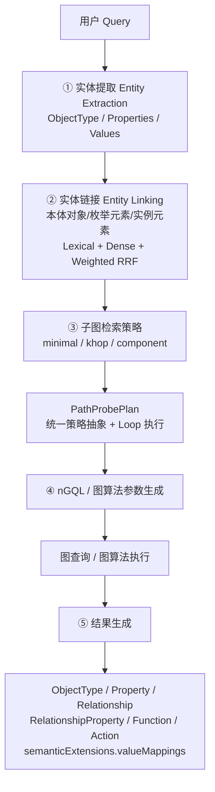
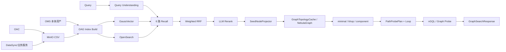
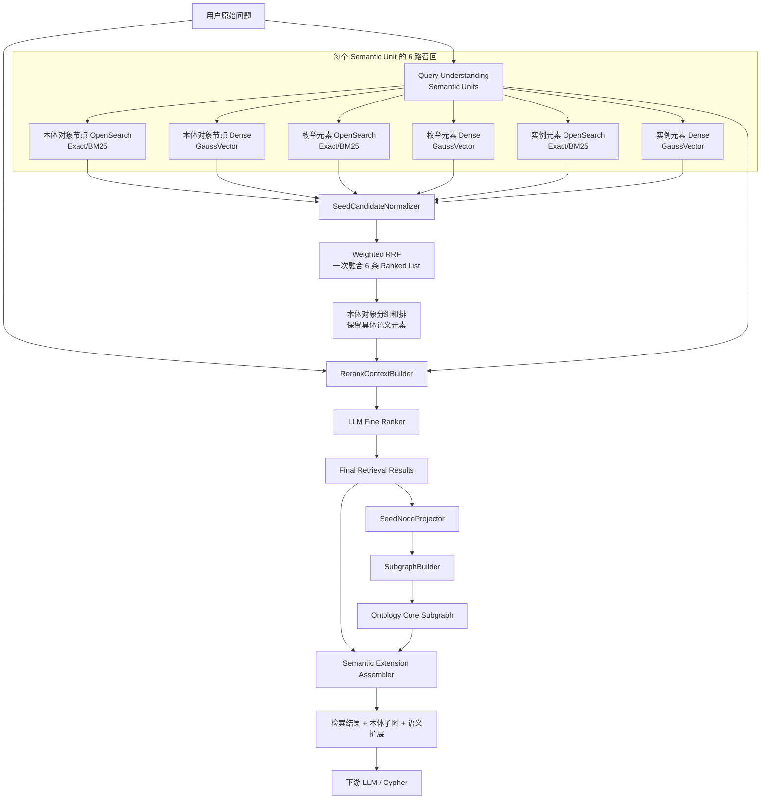
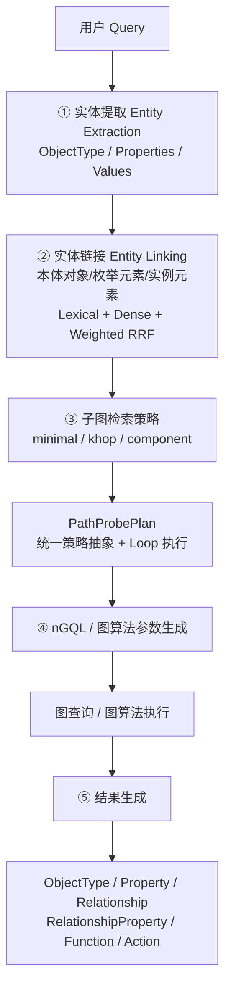
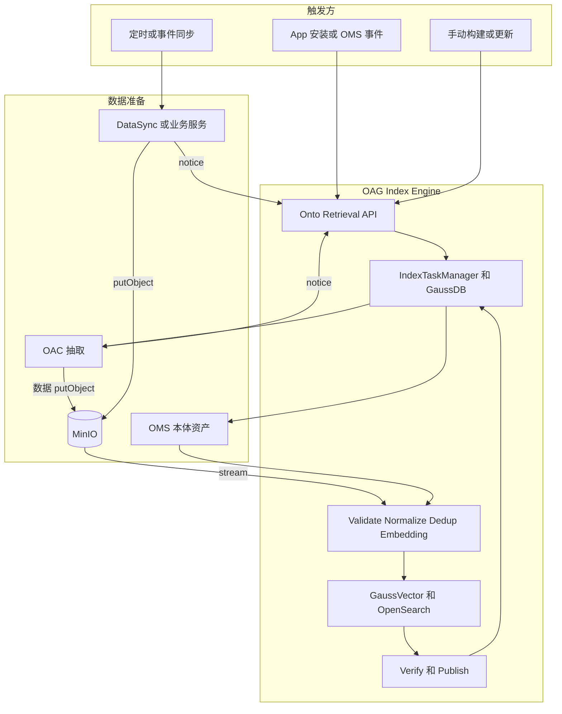
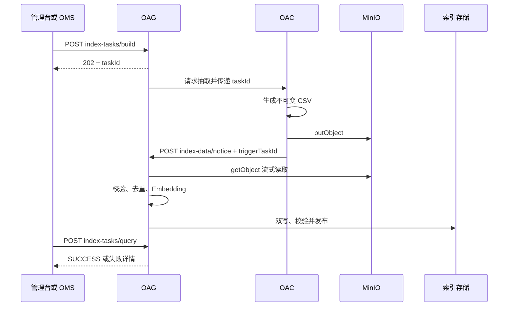
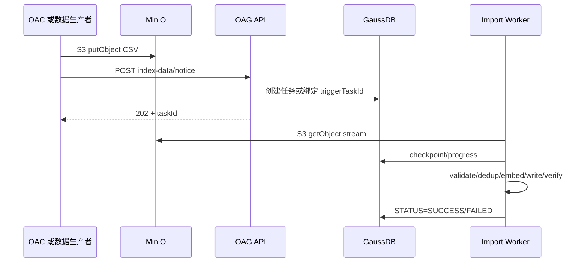
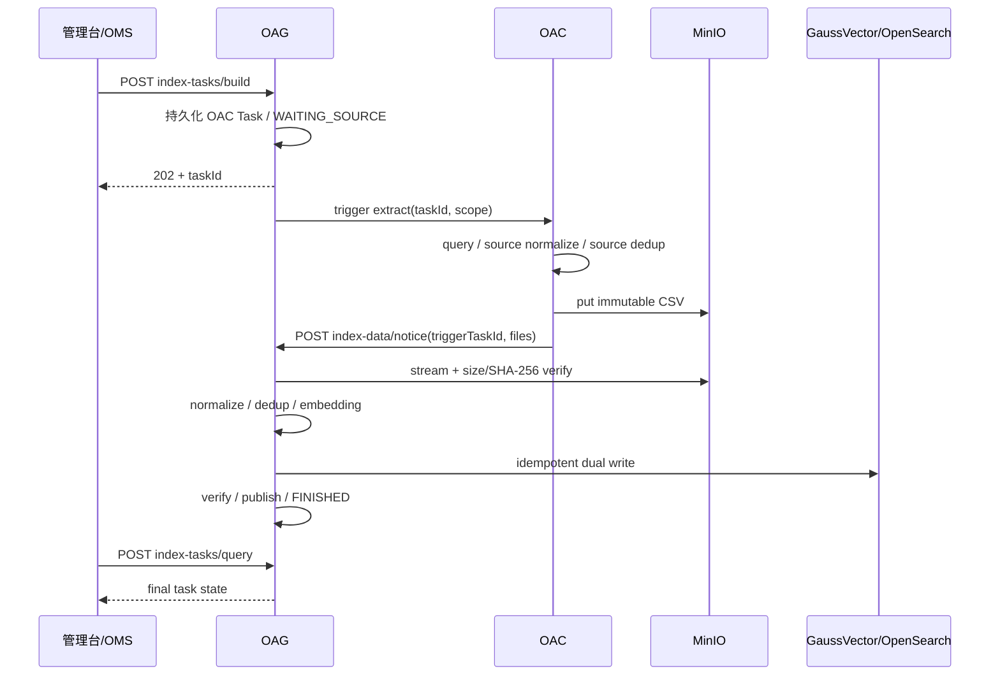
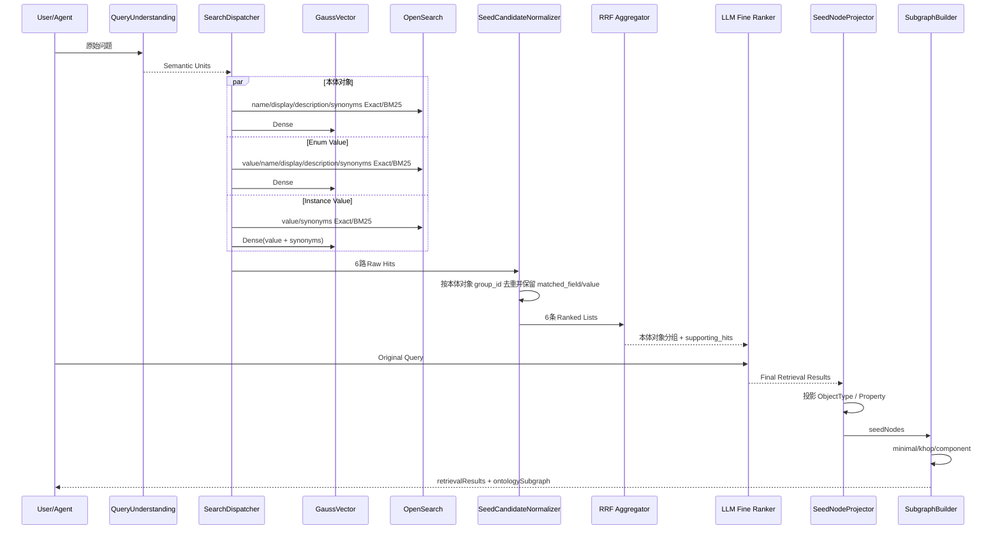

# OAG 本体锚点语义检索与向量索引设计方案

---

> 版本：V6.1  
> 日期：2026-08-23  
> 文档定位：OAG 本体语义索引管理、混合语义检索、本体对象投影与子图构建的正式设计规范。  
> 设计范围：覆盖索引模型与构建、OAC/MinIO 数据接入、Entity Extraction / Entity Linking、Lexical + Dense 混合召回、Weighted RRF、LLM 精排、PathProbePlan、nGQL/图算法执行以及最终结果返回。

---

## 文档结构

1. 设计目标、术语与总体架构  
2. 数据模型与语义索引结构  
3. 语义索引管理：构建、数据接入、任务、MinIO 与一致性  
4. 实体提取、Entity Linking 与 6 路混合召回  
5. LLM 精排与最终语义检索结果  
6. 本体对象投影、子图策略、路径探测、nGQL 与最终返回  
7. 性能、配置、可观测性、评测与迁移

阅读规则：第 2 章按“总体规则 → 本体对象 → 枚举元素 → 实例元素 → 统一治理”组织；第 3 章按“职责/接入 → API → 文件协议 → Task → Pipeline → Checkpoint → 一致性 → 恢复/性能”组织；其他章节保留“核心设计 + 详细设计与实现”。同一主题只保留一处权威定义。

---

# 1. 设计目标、术语与总体架构

---

## 1.0 核心设计

---

### 1.1 设计目标

OAG 同时承担两类核心能力：

1. **语义检索**：把自然语言中的 ObjectType、Property、Enum Value、Instance Value 对齐到真实本体元素；
2. **本体子图构建**：在真实图拓扑上把被选中的本体对象连接成可被 Agent/LLM 消费的业务子图，并输出生成查询所需的值语义映射。

设计目标：

- 支持 ObjectType / Property / Enum Value / Instance Value 四类语义证据；
- 支持 BM25/Exact + Dense 混合召回；
- 使用一次 Weighted RRF 融合 6 路检索结果；
- 使用 LLM 只做候选消歧与精排，不让 LLM 发明本体 ID；
- 使用 GraphTopologyCache + JGraphT/NebulaGraph 完成子图路径规划；
- `minimal / khop / component` 统一转换为 `PathProbePlan`，通过 Loop 执行；
- 最终返回 ObjectType、Property、Relationship、RelationshipProperty、Function、Action；
- 最终返回中补充 `semanticExtensions.valueMappings`，稳定表达 **用户原始值 → 标准真实值 → Property → ObjectType**，直接辅助下游 Agent/LLM 生成过滤条件与查询语句；
- 动态 Enum/Instance 的索引构建协议统一、可恢复、可观测、可压测。

### 1.2 术语统一

| 术语 | 定义 |
|---|---|
| 本体对象 | ObjectType / Property |
| 枚举元素 | Enum Value |
| 实例元素 | 真实 Instance Value |
| Semantic Unit | Query Understanding 后的一个检索语义单元 |
| Seed | 经 Entity Linking + LLM 精排后参与图构建的本体对象 |
| Supporting Hit | 支撑某个 Seed 的 Enum/Instance/同义词等具体命中证据 |
| Core Graph | 只由 ObjectType/Property/Relationship 等本体拓扑元素组成的路径计算图 |
| semanticExtensions | 最终响应中面向查询生成的确定性语义扩展 |

历史代码中的 `anchor/seed/metadata/instance` 可在兼容期存在，但新接口、新文档和新类统一使用上述语义。

### 1.3 本体子图检索五阶段主流程



阶段边界：

- Entity Extraction 只识别用户表达，不猜真实本体 ID；
- Entity Linking 负责把文本/值映射到真实本体与真实值；
- 图策略只在真实本体对象上规划；
- nGQL/图算法生成不重新做语义实体识别；
- 结果阶段把值归属关系投影为 `semanticExtensions`。

### 1.4 总体架构



关键原则：**索引语义与图拓扑职责分离**。GaussVector/OpenSearch 负责“找对本体对象和值”，NebulaGraph/JGraphT 负责“把本体对象连接成正确子图”。

---

---

## 1.1 详细设计与实现

---

围绕软件、SEC、AMS等业务场景，明确实例值语义索引需求范围，确定语义索引内容全景如下：

| 本体元素             | 自身语义化内容     | 同义词语义化 | 多语言(小语种)语义化       |
| ---------------- | ----------- | ------ | ----------------- |
| 对象类型（ObjectType） | 名称、显示名称、描述  | 名称同义词  | 多语言名称、显示名称、描述及同义词 |
| 属性（Property）     | 名称、显示名称、描述  | 名称同义词  | 多语言名称、显示名称、描述及同义词 |
| 枚举（Enum）         | 枚举值、显示名称、描述 | 枚举值同义词 | 多语言显示名称、描述及同义词    |
| 实例数据（Instance）   | 实例值         | 实例值同义词 | × 不配置多语言          |


### 1.1 设计目标与边界

OAG 同时承担索引构建、语义检索和本体子图构建三类能力。检索数据模型统一为三个业务层次：

```text
本体对象（Ontology Object）
  = ObjectType / Property

枚举元素（Enum Element）
  = Enum Value

实例元素（Instance Element）
  = 真实 Instance Value
```

三类名称在索引、Entity Linking、RRF、精排和结果解释中保持一致。历史 API/代码中的 `seed*`、`metadata*` 字段可以在兼容层继续读取，但新设计文档统一使用“本体对象 / 枚举元素 / 实例元素”的逻辑术语。

### 1.2 子图端到端总体架构



运行阶段统一为：

```text
阶段0：索引构建 / Bulk Import
阶段1：Query Understanding / Semantic Units
阶段2：6 路召回
阶段3：一次 Weighted RRF 粗排
阶段4：LLM 精排
阶段5：检索结果 → 本体对象投影
阶段6：minimal / khop / component 子图构建
阶段7：语义扩展与 Cypher 上下文组装
```

核心边界：

> **检索层返回“命中的对象本身”，图算法只消费 ObjectType / Property 本体对象。**


#### 1.2.1 本体子图检索五阶段主流程

对外统一把运行链路抽象为五个阶段，现有更细的“召回/RRF/精排/投影”仍作为阶段 ② 内部实现，不改变已有章节顺序：



阶段边界：

1. **实体提取**只回答“用户提到了哪些对象、属性和值”，正式结构见 [extractedEntities / 实体提取设计方案](./OAG语义子图检索接口extractedEntities结构设计方案.md)；
2. **实体链接**把业务表达链接到真实本体对象，并用枚举/实例命中作为语义证据；
3. **子图策略**只消费已解析的 ObjectType/Property terminal，生成可执行 `PathProbePlan`；
4. **nGQL 生成**只负责把 Plan 翻译成参数化图查询或图算法入参，不承载语义判断；
5. **结果生成**把执行结果还原为稳定 API 结构，并按开关扩展 Function/Action。

业务扩展原则：新增业务图策略时实现统一 Strategy SPI 生成 `PathProbePlan`，而不是在 Entity Linking 或 nGQL Assembler 中硬编码业务分支。

### 1.3 与现有 OAG 代码的兼容基线

当前代码已经形成以下主链路：

```text
graphSearchV3()
  └─ performGraphSearchOptimized()
       ├─ interpretQueryIntent()
       ├─ getSeedIds()
       │    ├─ vectorService.searchOntologyByQuery()
       │    ├─ elasticSearchRestRepository.searchOntologyByQuery()
       │    └─ hybridRecallHelper.hybridRecall()
       ├─ loadAllEdges()
       └─ subgraphQuery()
            ├─ getPathInfos()
            │    ├─ computePairwiseShortestPaths()
            │    └─ computePairwiseNumPaths()
            │          └─ findAllPath()
            └─ buildMstSubgraph() / buildAllSubgraph()
```

现有请求参数主要包括：

```text
graphExpansionStrategy = minimal
hopLimit = 3
seedRetrievalMode = vector
topK = 3
includeFunctions = 0
includeActions = 0
```

当前设计不要求一次性替换现有链路，而是在现有类和接口上渐进演进：

```text
现有 getSeedIds()
    ↓
SearchDispatcher
    ↓
SemanticCandidateNormalizer
    ↓
Weighted RRF 本体对象分组
    ↓
LLM Fine Ranker
    ↓
Final Semantic Matches
    ├─ ObjectType / Property（name/display/description/synonyms 命中）
    ├─ Enum Value（value/name/display/description/synonyms 命中）
    └─ Instance Value（value/synonyms 命中）
    ↓
SeedNodeProjector
    ↓
最终图构建本体对象
```

现有 `seedIds` / `seedNodes` 仍然可以作为**图构建本体对象兼容字段**保留，但不能再代表完整检索结果；完整检索结果由新增的 `retrievalResults` 表达。

现有 `subgraphQuery()`：

```text
保留 external strategy 名称
    ↓
minimal / khop / component
    ↓
内部支持 legacy / enhanced 两套算法
```

因此本次调整不改变三种图算法的边界，只改变“检索输出是什么”以及“何时投影成 本体对象”。

---


### 1.4 核心设计原则

#### 设计原则 1：三张表分别表达三类稳定实体

```text
t_oag_{ontology_id}
  → ObjectType / Property

t_oag_enum_{ontology_id}
  → Enum Value

t_oag_instance_{ontology_id}
  → Instance Value
```
#### 设计原则 2：Core Graph 与检索字段分离

```text
图算法：ObjectType / Property / Relation
检索字段：name / display / description / synonyms / enum value / instance value
```

Enum/Instance 和 synonym 都可以帮助形成最终语义结果，但不直接成为最短路径、K-hop、Connected Component 的拓扑节点。

---

# 2. 数据模型与语义索引结构

本章只定义 OAG 语义索引的**数据模型、向量化规则、全文索引规则和物理存储结构**。索引构建任务、MinIO、Checkpoint、FULL_REPLACE / INCREMENTAL 等生命周期机制统一在第 3 章定义。

整体按照三类稳定语义实体组织：

```text
本体对象：ObjectType / Property
枚举元素：Enum Value
实例元素：Instance Value
```

三类数据分别建立 GaussVector 向量索引和 OpenSearch 全文索引；两种存储使用同一业务语义和稳定业务键，在检索层统一归一化为 SearchHit。

---

## 2.1 总体索引模型

### 2.1.1 三类物理索引与统一命名

| 逻辑类型 | GaussVector 表 | OpenSearch Index | Owner | 索引粒度 | 稳定业务键 |
|---|---|---|---|---|---|
| 本体对象 | `t_oag_{ontology_id}` | `t_oag_{ontology_id}` | OAG | 1 个 ObjectType / Property 1 条记录 | `id` |
| 枚举元素 | `t_oag_enum_{ontology_id}` | `t_oag_enum_{ontology_id}` | OAG | 1 个 Property 下的 1 个 Enum Value 1 条记录 | `object_type_id + property_id + normalized(value)` |
| 实例元素 | `t_oag_instance_{ontology_id}` | `t_oag_instance_{ontology_id}` | OAG；业务侧提供源数据 | 1 个 Property 下去重后的 1 个 Instance Value 1 条记录 | `object_type_id + property_id + normalized(value)` |

三类数据保持物理隔离，主要原因：

```text
数据规模不同
更新频率不同
ANN 算法和参数不同
数据 Owner / 来源不同
TopK / similarityThreshold 不同
容量与分表策略不同
```

### 2.1.2 统一索引处理链路

```text
OMS / OAC / Business Data
        ↓
Schema / Ontology Mapping
        ↓
Normalize + Synonym Flatten + Dedup
        ↓
┌──────────────────────────┬──────────────────────────┐
│ EmbeddingInputBuilder    │ LexicalDocumentBuilder   │
│ BGE-M3 / 1024 dim        │ Exact / BM25             │
└────────────┬─────────────┴─────────────┬────────────┘
             ↓                           ↓
        GaussVector                 OpenSearch
             └────────────┬──────────────┘
                          ↓
                 SearchHit Normalizer
```

统一原则：

1. GaussVector 和 OpenSearch 必须使用同一条业务记录的相同 `id / property_id / object_type_id / value / synonyms` 语义；
2. Dense 与 Lexical 的差异只体现在索引方式和查询方式，不允许形成两套业务数据模型；
3. 同一业务键重复导入只能覆盖原记录，不能产生重复向量或重复全文文档；
4. Enum / Instance 可以成为最终语义检索结果，但不直接成为 Core Graph 路径算法顶点。

### 2.1.3 Core Graph 与语义索引边界

```text
语义索引负责：
ObjectType / Property / Enum Value / Instance Value 的语义定位

Core Graph 负责：
ObjectType / Property / Relationship 的拓扑连接
```

Enum / Instance 命中后，通过 `property_id + object_type_id` 投影回 Property / ObjectType，再进入子图算法。Synonym 只作为所属业务记录的检索字段，不建立独立图节点或独立物理索引记录。

---

## 2.2 公共建模与检索规则

### 2.2.1 多语言字段规则

本体对象和 Enum Value 的 Display / Description 使用固定槽位：

```text
固定语言：zh + en
额外语言：lang_1 + lang_2
总计最多 4 种语言
```

对应物理字段：

```text
display_zh
display_en
display_lang_1
display_lang_2

description_zh
description_en
description_lang_1
description_lang_2
```

规则：

- `lang_1 / lang_2` 是 ontology 级可配置语言槽位，不把具体小语种语言码写死到数据库 Schema；
- 未配置的语言槽位保持 NULL / 空值；
- Instance Value 不配置 `display_* / description_*` 多语言列；
- 不通过不断增加 `display_xx / description_xx` 列扩展语言数量。

### 2.2.2 OMS SynonymType 到 OAG `synonyms` 的统一表达

OMS 继续保留结构化、多语言 SynonymType：

```json
{
  "id": "term-color-synonyms",
  "synonyms": {
    "zh": ["颜色", "色彩", "色泽"],
    "en": ["Color", "Colour"],
    "es": ["Color"]
  }
}
```

OMS 源模型约束：

```text
synonyms 最多 3 个 language key
language key 不固定
每个 language 可包含多个 synonym
language key 使用 BCP 47 风格，例如 zh / en / es / es-MX / pt-BR
```

进入 OAG 后不保存 language Map，而统一平铺成 LF String：

```text
颜色
色彩
色泽
Color
Colour
```

转换规则：

```text
SynonymType.synonyms(language → values[])
  ↓
zh / en 存在时优先，其余 language tag 按字典序
  ↓
语言内保持源数组顺序
  ↓
trim / Unicode normalize / 去空
  ↓
按规范化值去重，保留第一次出现的原文
  ↓
LF join
  ↓
synonyms TEXT/String
```

传输到 JSON / CSV 时可使用字面量 `\n`：

```json
{
  "synonyms": "颜色\n色彩\n色泽\nColor\nColour"
}
```

关键边界：

1. OMS 保留多语言源结构，OAG 热索引只保留 LF 平铺 String；
2. GaussVector / OpenSearch / REST Batch / CSV 使用同一个 `synonyms` 物理表达；
3. SynonymType 不建立独立向量记录或独立全文记录；
4. SynonymType 自身的 `name / display / description` 不重复拼入所属实体 Embedding；
5. OAG 不建立 `synonyms.zh / synonyms.en / synonyms.<language>` dynamic object。

### 2.2.3 文本规范化规则

规范化属于索引构建和查询处理逻辑，不额外增加 `normalized_*` 持久化字段：

```text
trim
Unicode normalize
casefold（适用语言）
连续空白归一
全半角归一
```

`name / value / display / description` 保留原始业务文本；规范化值只用于去重、业务键比较、Exact 匹配和幂等判断。

`SynonymFlattener` 额外执行：

```text
CRLF / CR → LF
按 LF split
trim
去空行
按规范化值去重并保留首次出现原文
重新 LF join
```

### 2.2.4 OpenSearch `synonyms` 公共 Analyzer

ObjectType / Property / Enum / Instance 的 `synonyms` 统一使用“整行 Exact + 普通 BM25”双模式：

```yaml
analysis:
  tokenizer:
    synonym_line_tokenizer:
      type: pattern
      pattern: '\\n+'
  analyzer:
    synonym_line_analyzer:
      type: custom
      tokenizer: synonym_line_tokenizer
      filter: [lowercase, asciifolding]
```

字段映射：

```yaml
synonyms:
  type: text
  analyzer: synonym_line_analyzer
  search_analyzer: synonym_line_analyzer
  fields:
    bm25:
      type: text
      analyzer: standard
```

语义：

```text
synonyms 主字段
  → 一个 LF 行作为一个完整 synonym token
  → 用于 synonym line-exact

synonyms.bm25
  → 普通全文 Analyzer
  → 用于 synonym BM25
```

Synonym 命中统一保留：

```text
matched_field = synonyms
matched_value = 实际命中的 synonym 行
```

Exact 可直接定位命中行；BM25 命中由 `SynonymMatchResolver` 对原始 `synonyms` 做 LF split，再使用与检索一致的 normalizer 选择最匹配的 `matched_value`，不执行 JSON 反序列化。

### 2.2.5 `language_hint` 与语言检索规则

Query Understanding 可以输出：

```text
language_hint = BCP 47 language tag / mixed / und
```

使用规则：

```text
display / description
  → 可根据 language_hint 选择 Analyzer 或 Boost

synonyms
  → 不按 language_hint 硬过滤
  → 不做 synonyms.<language> Boost

Dense
  → 不按 language_hint 硬过滤

LLM Rerank
  → 始终看到原始 Query 与全部候选
```

由于 OAG `synonyms` 已经平铺，线上不能从字段名反推出 synonym 的源语言；需要语言级统计时，应使用 OMS SynonymType 或离线标注数据。

---

## 2.3 本体对象索引：ObjectType / Property

本体对象使用同一张物理表，通过 `type` 区分 ObjectType 和 Property。

### 2.3.1 GaussVector / OpenSearch 数据结构

```text
t_oag_{ontology_id}
```

| 字段 | GaussVector 类型 | OpenSearch 类型 | 非空 | 说明 |
|---|---|---|---:|---|
| `vector` | `DOUBLE[]` | - | ✔ | BGE-M3 1024 维向量，仅 GaussVector 保存 |
| `type` | `INT` | `integer` |  | 0 ObjectType；1 Property |
| `id` | `VARCHAR(256 CHAR)` | `keyword` | ✔ | ObjectType / Property 全局唯一 ID，也是业务键 |
| `parent_id` | `VARCHAR(256 CHAR)` | `keyword` |  | Property 所属 ObjectType.id；ObjectType 可空 |
| `name` | `VARCHAR(256 CHAR)` | `keyword + text` |  | 本体真实名称，支持 Exact / BM25 |
| `display_zh` | `VARCHAR(512 CHAR)` | `keyword + text` |  | 中文显示名 |
| `display_en` | `VARCHAR(512 CHAR)` | `keyword + text` |  | 英文显示名 |
| `display_lang_1` | `VARCHAR(512 CHAR)` | `keyword + text` |  | 第 1 个额外语言显示名 |
| `display_lang_2` | `VARCHAR(512 CHAR)` | `keyword + text` |  | 第 2 个额外语言显示名 |
| `description_zh` | `VARCHAR(1024 CHAR)` | `text` |  | 中文描述 |
| `description_en` | `VARCHAR(1024 CHAR)` | `text` |  | 英文描述 |
| `description_lang_1` | `VARCHAR(1024 CHAR)` | `text` |  | 第 1 个额外语言描述 |
| `description_lang_2` | `VARCHAR(1024 CHAR)` | `text` |  | 第 2 个额外语言描述 |
| `synonyms` | `TEXT` | `text multi-field` |  | LF 分隔同义词；主字段 Exact，`.bm25` 全文检索 |

Schema 必须逐语言列展开，不使用 `display_zh/en/lang_1/lang_2` 或 `description_zh/en/lang_1/lang_2` 这种合并字段定义。

### 2.3.2 向量化内容和规则

Embedding 文本固定按以下顺序拼接：

```text
{name}
{display_zh}
{display_en}
{display_lang_1}
{display_lang_2}
{description_zh}
{description_en}
{description_lang_1}
{description_lang_2}
{synonyms}
```

规则：

1. 使用 BGE-M3，向量维度 1024；
2. 空字段直接跳过，不写占位字符串；
3. `{synonyms}` 使用 2.2.2 生成的 canonical LF String；
4. SynonymType 自身 `name / display / description` 不重复加入 Embedding；
5. Property 不额外强制拼接所属 ObjectType 名称，避免父对象语义重复注入；
6. Embedding Batch、重试等属于第 3 / 7 章工程配置，不进入 Schema。

### 2.3.3 全文索引内容和规则

OpenSearch 检索字段：

```text
Exact / Filter:
  id
  type
  parent_id
  name.keyword
  display_*.keyword
  synonyms

BM25 / Phrase:
  name
  display_*
  description_*
  synonyms.bm25
```

推荐优先级：

```text
id / name / display exact
> synonyms line-exact
> name / display phrase/BM25
> synonyms.bm25
> description BM25
```

Property 检索时使用 `type=1 + parent_id=<ObjectType.id>` 约束所属 ObjectType 范围，避免跨 ObjectType 错挂 Property。

### 2.3.4 索引存储具体实现

GaussVector：

```text
ANN：GsIVFFLAT
Distance：COSINE
适用规模：约 1*10^4 ～ 2*10^6
IVF_NLIST 推荐初值：4 * sqrt(N)
N = 当前物理表实际记录数
```

OpenSearch：

```text
_id = id
业务过滤字段：type / parent_id
全文字段：name / display_* / description_* / synonyms
```

GaussVector 与 OpenSearch 都以 `id` 做幂等覆盖和删除定位。

### 2.3.5 注意事项

- Property → ObjectType 优先使用 `parent_id`，并由 GraphTopologyCache / `has_property` 做拓扑校验；
- `synonyms` 是所属 ObjectType / Property 的内嵌字段，不建立独立 synonym 记录；
- 不再使用扁平 `i18n_content`，也不建立 `synonyms.*` dynamic template；
- `name / display / description / synonyms` 负责语义召回，`id / parent_id / type` 负责确定性身份和归属。

---

## 2.4 枚举元素索引：Enum Value

`t_oag_enum_{ontology_id}` 只承载本体模型中真正定义的 Enum Value，不承载 EnumType 管理对象本身。

### 2.4.1 数据来源与 GaussVector / OpenSearch 数据结构

索引展开链路：

```text
Property.referenceEnumId
  → EnumType.values[]
  → EnumValue.value
  → EnumValue.refSynonymTypeId
  → SynonymType.synonyms
  → SynonymFlattener
  → t_oag_enum_{ontology_id}
```

真正入索引的粒度是 `EnumType.values[]` 的每一个枚举值。如果同一个 EnumType 被多个 Property 复用，必须按照实际引用 Property 展开为多条归属明确的记录。

```text
t_oag_enum_{ontology_id}
```

| 字段 | GaussVector 类型 | OpenSearch 类型 | 非空 | 说明 |
|---|---|---|---:|---|
| `vector` | `DOUBLE[]` | - | ✔ | Enum Value 1024 维向量，仅 GaussVector 保存 |
| `value` | `VARCHAR(4096 CHAR)` | `keyword + text` |  | 真实标准枚举值，是权威过滤值 |
| `property_id` | `VARCHAR(512 CHAR)` | `keyword` | ✔ | 引用该 Enum 的 Property.id |
| `object_type_id` | `VARCHAR(256 CHAR)` | `keyword` |  | Property 所属 ObjectType.id |
| `display_zh` | `VARCHAR(512 CHAR)` | `keyword + text` |  | 中文 display |
| `display_en` | `VARCHAR(512 CHAR)` | `keyword + text` |  | 英文 display |
| `display_lang_1` | `VARCHAR(512 CHAR)` | `keyword + text` |  | 第 1 个额外语言 display |
| `display_lang_2` | `VARCHAR(512 CHAR)` | `keyword + text` |  | 第 2 个额外语言 display |
| `description_zh` | `TEXT` | `text` |  | 中文 description |
| `description_en` | `TEXT` | `text` |  | 英文 description |
| `description_lang_1` | `TEXT` | `text` |  | 第 1 个额外语言 description |
| `description_lang_2` | `TEXT` | `text` |  | 第 2 个额外语言 description |
| `synonyms` | `TEXT` | `text multi-field` |  | LF 分隔的 Enum Value 同义词 |

业务唯一键：

```text
object_type_id + property_id + normalized(value)
```

`values[].id` 可用于 OMS 源数据追踪和质量校验，但不作为 `t_oag_enum_{ontology_id}` 持久化字段。SearchHit 层的 `recordType=ENUM_VALUE` 由 Normalizer 统一补充，不要求为此增加物理 `type` 字段。

### 2.4.2 向量化内容和规则

每个 Enum Value 独立生成一个向量：

```text
{value}
{display_zh}
{display_en}
{display_lang_1}
{display_lang_2}
{description_zh}
{description_en}
{description_lang_1}
{description_lang_2}
{synonyms}
```

规则：

1. **Value First**：真实 `value` 始终放在首行；
2. Display / Description / Synonyms 用于增强自然语言和多语言召回；
3. `{synonyms}` 使用 LF 平铺 String；
4. 不再构造 `synonyms_value / synonyms_description`；
5. 不追加 SynonymType 自身 `name / display / description`；
6. 不在向量前追加 ObjectType / Property 文本，归属由 `property_id + object_type_id` 确定；
7. 空字段跳过，不写占位值。

### 2.4.3 全文索引内容和规则

OpenSearch 检索字段：

```text
Exact / Filter:
  property_id
  object_type_id
  value.keyword
  display_*.keyword
  synonyms

BM25 / Phrase:
  value
  display_*
  description_*
  synonyms.bm25
```

推荐优先级：

```text
value exact
> display exact
> synonyms line-exact
> value / display phrase/BM25
> synonyms.bm25
> description BM25
```

命中 display / synonym 时，最终结果仍必须返回真实 `value`；`matched_field / matched_value` 只用于说明用户实际命中了哪一种表达。

### 2.4.4 索引存储具体实现

GaussVector：

```text
ANN：GsIVFFLAT
Distance：COSINE
推荐规模：约 1*10^4 ～ 2*10^6
IVF_NLIST 推荐初值：4 * sqrt(N)
```

数据库唯一性和 OpenSearch `_id` 均基于：

```text
object_type_id + property_id + normalized(value)
```

同一业务键再次 UPSERT 时覆盖原记录，包括 `display / description / synonyms / vector`；同义词变化不会生成新的 Enum 记录。

### 2.4.5 注意事项

- `value` 是唯一权威业务过滤值，display / description / synonyms 只负责召回、排序和解释；
- 一个 EnumType 被多个 Property 引用时必须展开，不能只按 EnumType/value 全局去重；
- Enum synonym 不建立独立记录；
- Enum / Property / ObjectType 的归属信息必须在入库前完成 Ontology Mapping 校验；
- 物理 Schema 按语言字段逐列展开，不能重新合并成多语言 JSON 对象。

---

## 2.5 实例元素索引：Instance Value

Instance 索引保存去重后的真实业务列值及其内嵌同义词，不保存整行业务数据。

### 2.5.1 数据范围与 GaussVector / OpenSearch 数据结构

入库粒度：

```text
同一个 Property / ObjectType 作用域内
按 normalized(value) 去重
每个真实 Instance Value 保存 1 条记录
```

例如 5000 万条 Subscriber 数据中，如果 `subLevel` 最终只有 `VIP / GOLD / SILVER / NORMAL` 四个唯一值，则该 Property 最终只保存 4 条实例语义索引记录。

```text
t_oag_instance_{ontology_id}
```

| 字段 | GaussVector 类型 | OpenSearch 类型 | 非空 | 说明 |
|---|---|---|---:|---|
| `vector` | `DOUBLE[]` | - | ✔ | Instance Value 1024 维向量，仅 GaussVector 保存 |
| `value` | `VARCHAR(4096 CHAR)` | `keyword + text` | ✔ | 去重后的真实标准列值，是权威过滤值 |
| `synonyms` | `TEXT` | `text multi-field` |  | 实例值同义词，LF 分隔；用于召回与解释 |
| `property_id` | `VARCHAR(512 CHAR)` | `keyword` | ✔ | 所属 Property.id |
| `object_type_id` | `VARCHAR(256 CHAR)` | `keyword` |  | Property 所属 ObjectType.id |

业务唯一键：

```text
object_type_id + property_id + normalized(value)
```

`synonyms` 不参与业务唯一键。SearchHit 层的 `recordType=INSTANCE_VALUE` 由 Normalizer 统一补充，不要求增加物理 `type` 字段。

### 2.5.2 向量化内容和规则

Instance Dense 只使用真实值及其同义词：

```text
{value}
{synonyms}
```

规则：

1. `value` 必须放在首行并作为主语义；
2. `synonyms` 只增强别名、黑话、业务俗称的 Dense 召回；
3. 不拼接 Property / ObjectType 名称、display、description，归属由结构字段确定；
4. Instance 不配置 `display_* / description_*` 多语言字段；
5. 对 Struct 等组合值，使用规范化后的可读 `value` 表达作为 `{value}`，不额外注入父对象文本。

### 2.5.3 全文索引内容和规则

OpenSearch 检索字段：

```text
Exact / Filter:
  property_id
  object_type_id
  value.keyword
  synonyms

BM25:
  value
  synonyms.bm25
```

推荐优先级：

```text
value exact
> synonyms line-exact
> value BM25
> synonyms.bm25
```

命中 synonym 时统一返回：

```text
matched_field = synonyms
matched_value = 实际命中的实例同义词
value         = 真实标准实例值
```

下游过滤条件和 `semanticExtensions.valueMappings[].canonicalValue` 始终使用 `value`，不能使用 synonym 作为真实过滤值。

### 2.5.4 索引存储具体实现

#### 当前实现

当前版本使用单张 `t_oag_instance_{ontology_id}`，同一个规范化值如果属于多组 Property / ObjectType，允许保存多条物理记录：

```text
(value=A, property=P1, objectType=O1)
(value=A, property=P2, objectType=O2)
```

这样可以避免 `property_id / object_type_id` 数组化带来的更新放大和索引过滤复杂度。

GaussVector ANN：

```text
中小规模：GsIVFFLAT + COSINE
千万 / 亿级：GsDiskANN
```

OpenSearch `_id` 与 GaussVector 幂等键均由：

```text
object_type_id + property_id + normalized(value)
```

确定。

#### 容量与分表演进

当前正式方案：

```text
单表 + 产品规格约束
```

达到单表容量或性能上限后，优先评估水平拆分；按 ObjectType 分表作为备选，不能在没有容量数据时提前制造大量物理表。

如果未来明确要求“同一个 value 只保存一份向量”，演进为值表 + 归属映射表：

```text
t_oag_instance_value_{ontology_id}
  value_id
  normalized_value UNIQUE
  value
  synonyms
  vector

        1 : N
          ↓

t_oag_instance_binding_{ontology_id}
  value_id
  property_id
  object_type_id
  UNIQUE(value_id, property_id, object_type_id)
```

查询链路：

```text
Value 表 Exact/BM25/Dense
  → value_id
  → Binding 批量展开 property_id / object_type_id
  → Entity Linking / RRF / LLM 消歧
```

存储演进不能改变上层 Entity Linking 和 `semanticExtensions.valueMappings` 的结果语义。

### 2.5.5 注意事项：索引准入与高基数控制

Instance Value 进入语义索引的基础准入条件：

```text
instance_index_enabled =
  Property.retrieval.enabled = true
  AND datatype_eligible
  AND value_shape_eligible
  AND cardinality_eligible
```

默认不建议向量化：

```text
UUID
手机号
纯技术主键
时间戳
日期
连续数值
高随机编码
```

适合向量化：

```text
产品名称
品牌名称
客户等级
区域名称
业务状态
自然语言标签
人可理解的业务分类
```

高基数自由文本进入单独 Document / RAG Index，不进入 Instance Value Resolver。

DataSync / 业务服务可以源侧预去重，但 OAG 写入前仍必须按 `object_type_id + property_id + normalized(value)` 再次去重并执行幂等 UPSERT。

---

## 2.6 三类索引统一存储与治理

### 2.6.1 幂等 UPSERT / DELETE 与 Generation

三类索引的稳定键：

```text
本体对象：id
Enum Value：object_type_id + property_id + normalized(value)
Instance Value：object_type_id + property_id + normalized(value)
```

统一规则：

1. GaussVector 和 OpenSearch 使用同一稳定业务键；
2. 重复 UPSERT 必须覆盖原记录，不能追加重复向量或全文文档；
3. `synonyms` 以 canonical LF String 整字段覆盖，不做语言 Map merge；
4. DELETE 必须同时删除 GaussVector 与 OpenSearch 中对应记录；
5. OpenSearch 使用稳定业务键生成确定性 `_id`；
6. 双写一致性、Chunk 重放和 Publish 由第 3 章统一保证。

每条索引记录不额外保存：

```text
content_hash
model_version
source_version
updated_at
```

版本、模型和构建信息统一由 Import Job / Generation 管理。Embedding 模型升级时：

```text
创建新 Generation
→ 全量重新 Embedding
→ Verify
→ 原子 Publish
```

### 2.6.2 数据质量治理

OMS / OAG 建索引前至少校验：

```text
ObjectType / Property id 重复或缺失
name / display / description 格式非法
additionalLanguages 槽位配置不一致
SynonymType.synonyms language key 数 > 3
language key 非法或不符合 BCP 47 约定
同一 language 内 synonym 重复
synonym 与 canonical name/display 完全重复
同一业务范围内 synonym 映射冲突
Enum Ref 不存在
Enum values[].id / value 源数据重复
Enum Value.refSynonymTypeId 不存在
Property.referenceEnumId 不存在
Parent ObjectType 缺失
```

OAG `synonyms` 热字段额外校验：

```text
CRLF / CR 统一为 LF
禁止空 synonym 行
去除首尾空白
规范化后重复 synonym 只保留第一次出现的原文
禁止 JSON Object / JSON Array 写入 synonyms
字段总长度和 synonym 数量受服务配置保护
```

动态 REST / CSV 已经不携带 language key，因此只能校验平铺值，不能在 OAG API 层声明“动态 synonyms 最多 3 种语言”；该约束属于 OMS SynonymType 源模型。

Instance 额外检查：

```text
空 value
超长 value
unique_value_count
同一 object_type_id + property_id 下重复 value
高基数
无意义随机串
非法 UTF-8
```

严重结构错误必须阻断当前记录或批次，不能静默覆盖；冲突必须可观测。

### 2.6.3 本体归属、检索结果与拓扑投影

```text
ObjectType
  → id 直接定位

Property
  → parent_id
  → GraphTopologyCache / has_property 双重校验

Enum Value / Instance Value
  → property_id + object_type_id 直接记录归属
```

SearchHit 在进入 RRF 前必须保留：

```text
recordType
id / propertyId / objectTypeId / value
matched_field
matched_value
channel
rank / rawScore
```

其中 `recordType` 是检索归一化字段，不要求所有物理表都持久化 `type`。

SeedNodeProjector 规则：

```text
ObjectType      → ObjectType
Property        → Property + 所属 ObjectType
Enum Value      → Property + 所属 ObjectType
Instance Value  → Property + 所属 ObjectType
```

Enum / Instance 作为最终语义证据和 ValueMapping 来源保留，但不直接成为最短路径、K-hop、Connected Component 的拓扑顶点。

### 2.6.4 存储选型汇总

| 类型 | Dense 主内容 | Lexical 主内容 | GaussVector ANN | 主要过滤字段 |
|---|---|---|---|---|
| 本体对象 | name + display + description + synonyms | id/name/display/description/synonyms | `GsIVFFLAT + COSINE` | `type / parent_id` |
| Enum Value | value + display + description + synonyms | value/display/description/synonyms | `GsIVFFLAT + COSINE` | `object_type_id / property_id` |
| Instance Value | value + synonyms | value/synonyms | 中小规模 `GsIVFFLAT`；千万/亿级 `GsDiskANN` | `object_type_id / property_id` |

### 2.6.5 关键注意事项

1. **三类稳定实体、三套物理索引**，不要把 Enum/Instance 混入本体对象表；
2. **Dense 与 Lexical 共用同一业务数据模型**，不能维护两套字段语义；
3. **多语言字段按列展开**：固定 zh/en + lang_1/lang_2；Instance 不配置 display/description 多语言列；
4. **Synonym 内嵌而不独立建记录**，OAG 中统一为 LF String；
5. **Enum/Instance 的真实过滤值始终是 `value`**，synonym/display 只能用于召回和解释；
6. **Instance 向量只使用 value + synonyms**，不拼 Property/ObjectType 文本；
7. **业务唯一键不包含 synonyms**，同义词变化只能覆盖现有业务记录；
8. **ANN 参数按表规模独立配置**，实例表不能机械复用本体对象表的 ANN 参数；
9. **Property 作用域必须由 parent_id / object_type_id 约束**，避免跨对象错误链接；
10. **版本信息放 Generation / Import Job**，不向每条向量记录扩散运维字段。

---

# 3. 语义索引管理：构建、数据接入、任务、MinIO 与一致性

本章定义 OAG 语义索引从**触发、数据准备、文件交付、任务执行、双存储写入到校验发布**的完整生命周期。第 2 章回答“索引存什么、怎么检索”，本章回答“这些索引如何可靠地构建、更新和恢复”。

统一执行主线：

```text
触发/通知
→ 创建或关联持久化 Task
→ OMS 读取或 MinIO 文件交付
→ Schema / Ontology Mapping 校验
→ Streaming / Normalize / Dedup
→ Embedding
→ GaussVector + OpenSearch 幂等双写
→ Verify
→ Publish
→ FINISHED
```

核心原则：**动态 Enum / Instance 无论数据量大小，都统一通过 MinIO CSV + `index-data/notice` 交付；`instanceDataSourceMode` 只决定谁读取业务数据源，不决定是否使用 MinIO。**

---

## 3.1 职责边界与总体架构

### 3.1.1 角色职责

#### OMS

负责提供 ObjectType / Property、多语言 display/description、SynonymType、EnumType / values[]、Property→ObjectType 和 Property→EnumType 等本体资产。OAG 根据 OMS 资产构建 `t_oag_{ontology_id}` 和静态 Enum Value 索引；App 安装事件可以触发 OAG 创建种子索引任务。

#### OAC

OAC 是有 OAC 部署中的业务数据统一抽取入口，负责：

```text
接收 OAG 下发的 tenantId / ontologyId / taskId / dataType / importMode
根据本体映射访问业务数据源
抽取 Enum Value / Instance Value
执行源侧基础标准化和必要去重
生成 UTF-8 CSV、上传 MinIO 并调用 OAG 通知接口
```
OAC 不负责 Embedding、GaussVector/OpenSearch 写入、Generation 发布或索引任务终态管理。手动构建场景由 OAG 编排 OAC，管理台/OMS 不直接调用 OAC 查询业务数据。

#### DataSync / 业务数据服务

DataSync 或业务数据服务负责定时/事件驱动的大规模实例数据准备与文件交付：

```text
读取 Property.retrieval.enabled = true 的 Property
访问实际数据源
提取真实 Instance Value
源侧去重 / 基础标准化
建立 value 与 Property 的映射
生成 UTF-8 CSV 文件
上传到双方约定的 MinIO Bucket
调用 OAG index-data/notice 注册导入任务
```

当生产者能够产生动态 Enum Value 时，也可以使用相同 CSV 通知接口提交 `METADATA_ENUM` 数据。

DataSync/业务数据服务不负责 Embedding、GaussVector/OpenSearch Client、ANN/全文索引构建、OAG 物理表创建、Generation 发布以及最终去重和双存储一致性。

#### OAG

OAG 统一负责：

```text
对外 API 和索引任务创建
OMS 资产读取与 OAC 抽取编排
GaussDB 任务状态持久化
请求 / CSV Schema 校验
Enum / Instance 本体映射校验
Normalize / Dedup
Embedding
GaussVector Bulk Write
OpenSearch Bulk Write
ANN / 全文索引校验
Generation 发布
在线检索
任务查询 / 重试 / 取消 / 错误查询
```

> **OMS/OAC/DataSync/业务服务提供资产或业务语义数据，OAG 统一把数据转换为可检索的向量/全文索引并对发布结果负责。**

---


![[Pasted image 20260824205207.png]]

1、手动创建索引->OAC : 应对首次全量索引创建 和 索引更新 场景  
2、通知OAG->OAG读取minio文件：应对大数据量首次全量和非首次增量数据索引入库

### 3.1.2 总体索引构建架构




#### 与 DataSeek / NL2SQL 的模型边界

与 DataSeek/NL2SQL 的对齐采用统一语义值逻辑模型：`ontology_id / object_type_id / property_id / value / normalized_value / source / version / update_type`。OAG 保持 Exact/BM25 + Dense 的混合检索契约和“值 → Property/ObjectType”归属解析能力；未来 NL2SQL 可以复用同一语义值字典和归属信息，而不要求共享 OAG 的物理向量表。


### 3.1.3 统一 Import Pipeline 边界

所有来源最终进入同一 Pipeline：

```text
Input
→ SchemaValidator
→ OntologyMappingValidator
→ Normalizer
→ Deduplicator
→ EmbeddingInputBuilder
→ Embedding
→ GaussVector Bulk Writer + OpenSearch Bulk Writer
→ Verifier
→ Publisher
```

生产者（OAC / DataSync / 业务服务）只提供**业务语义数据**，不生成 `vector`，不直接访问 GaussVector/OpenSearch，也不管理 Generation 终态。OAG 对最终去重、Embedding、双写一致性、Verify 和 Publish 负责。

---

## 3.2 数据来源、接入模式与场景选择

### 3.2.1 数据读取责任模式

```yaml
indexBuild:
  instanceDataSourceMode: OAC   # OAC | BUSINESS_NOTICE
```

| 模式 | 谁访问业务数据源 | 固定数据流 | 适用场景 |
|---|---|---|---|
| `OAC` | OAC | OAG build → OAC 抽取 → MinIO → `index-data/notice(triggerTaskId)` → OAG | OAC 能访问目标业务数据源，适合人工创建/更新 |
| `BUSINESS_NOTICE` | DataSync / 业务服务 | 业务服务抽取 → MinIO → `index-data/notice` → OAG | OAC 不对接该源，或同步责任属于业务域 |

`instanceDataSourceMode` 是部署/业务架构配置，不允许根据单次任务数据量动态切换。小数据量和大数据量的数据交付协议完全一致，差异只在文件大小、Chunk 数、Worker/Batch 参数。

### 3.2.2 数据类型与来源

```text
SEED_NODE
  → OMS 本体资产

METADATA_ENUM
  → OMS 静态 Enum；或 OAC / 业务生产者交付动态 Enum CSV

INSTANCE_VALUE
  → OAC / DataSync / 业务服务交付 Instance CSV
```

统一任务抽象：

```text
dataType   = SEED_NODE | METADATA_ENUM | INSTANCE_VALUE
sourceType = OMS | OAC | MINIO
importMode = FULL_REPLACE | INCREMENTAL | CLEAR
```

其中 `BUSINESS_NOTICE` 是数据读取责任模式；直接文件通知创建的 Task 使用 `sourceType=MINIO`。OAC 手动构建 Task 使用 `sourceType=OAC`，OAC 后续通过 `triggerTaskId` 绑定文件时仍保持原 Task 和原 sourceType。

### 3.2.3 场景选择矩阵

| 场景 | 外部调用组合 | `instanceDataSourceMode` | `importMode` | 数据交付 |
|---|---|---|---|---|
| App 安装/OMS 事件构建本体对象 | OMS → OAG | - | `FULL_REPLACE` | OMS 本体资产 |
| 首次全量，有 OAC | build → OAC → MinIO → notice → query | `OAC` | `FULL_REPLACE` | MinIO CSV |
| 人工触发增量更新，有 OAC | build → OAC → MinIO → notice → query | `OAC` | `INCREMENTAL` | MinIO CSV |
| 定时/事件同步，由业务侧负责 | putObject → notice → query | `BUSINESS_NOTICE` | `INCREMENTAL` | MinIO CSV |
| 已有全量文件导入/重建 | putObject → notice → query | `BUSINESS_NOTICE` | `FULL_REPLACE` | MinIO CSV |
| 清理当前本体全量实例索引 | `index-data/notice` → query | - | `CLEAR` | 无需文件；`dataType=INSTANCE_VALUE` |

选择规则：首次创建或明确重建使用 `FULL_REPLACE`；只提交变化数据使用 `INCREMENTAL`；需要清空当前本体全部实例值索引时使用 `INSTANCE_VALUE + CLEAR`。不要用 `INCREMENTAL` 模拟首次全量，也不要把日常增量提交为全量替换。

### 3.2.4 容量规格

| 档位 | 源侧用户规模 | 数据交付 | OAG Profile |
|---|---:|---|---|
| Software | ≤ 10,000 用户（1W） | MinIO CSV | `LIGHTWEIGHT_BULK` |
| SEC | ≤ 1,000,000 用户（100W） | MinIO CSV | `RECOVERABLE_BULK` |
| 超出 SEC | > 1,000,000 用户 | MinIO CSV | 专项容量/性能评估 |

1W/100W 表示**源侧业务用户数**，不是最终去重后的向量条数。容量验收至少同时记录：

```text
sourceUsers
sourceRows
semanticProperties
uniqueValues
finalIndexRows
```

实际 Embedding 和存储规模以 `uniqueValues / finalIndexRows` 为准。

---

## 3.3 对外接口与任务操作契约

本章只定义**索引管理接口**。语义检索 `subgraph/semantic-search` 属于第 4～6 章运行态检索链路，本章不重复定义其 Request/Response。

所有索引管理 REST API 使用统一 Namespace：

```text
/v1/onto-retrieval/{ontologyId}
```

### 3.3.1 公共协议

##### Content-Type

```http
Content-Type: application/json
Accept: application/json
```

MinIO 文件导入接口自身仍使用 JSON 注册文件，不通过 `multipart/form-data` 直接上传大文件；CSV 先由 DataSync 上传到双方约定的 MinIO Bucket，再调用 `index-data/notice`。

##### 公共 Path 参数

**OntologyPath 参数列表**

| 参数名称         | 类型     | 是否必选 | 默认值 | OpenAPI 约束                                   | 说明                       |
| :----------- | :----- | :--- | :-- | :------------------------------------------- | :----------------------- |
| `ontologyId` | String | 是    | -   | `in: path`，`required: true`，`maxLength: 256` | 本体唯一 ID；必须与 URI 中的目标本体一致 |

##### 公共 Header 参数

**OAGCommonHeaders 参数列表**

| 参数名称              | 类型     | 是否必选     | 默认值                | OpenAPI 约束                                     | 说明                   |
| :---------------- | :----- | :------- | :----------------- | :--------------------------------------------- | :------------------- |
| `x-gde-tenant-id` | String | 是        | -                  | `in: header`，`required: true`，`maxLength: 256` | 租户 ID；OAG 按租户隔离本体和任务 |
| `Content-Type`    | String | POST 请求是 | `application/json` | `application/json`                             | 请求体编码类型              |
| `Accept`          | String | 否        | `application/json` | `application/json`                             | 响应类型                 |

##### 公共 HTTP 状态码

| HTTP 状态码                    | 场景                                                     | Response Schema                                            |
| :-------------------------- | :----------------------------------------------------- | :--------------------------------------------------------- |
| `200 OK`                    | 同步查询成功                                                 | 对应接口 Success Response                                      |
| `202 Accepted`              | 异步导入、重试或取消请求已接受                                        | `AsyncTaskAcceptedResponse` / `BatchTaskOperationResponse` |
| `400 Bad Request`           | Path/Header/Body/Query 参数校验失败                          | `ValidationErrorResponse`                                  |
| `404 Not Found`             | Ontology、Task 或同步校验的资源不存在                              | `BusinessErrorResponse`                                    |
| `409 Conflict`              | 幂等键冲突、任务状态不允许当前操作                                      | `BusinessErrorResponse`                                    |
| `429 Too Many Requests`     | 导入任务或接口触发限流                                            | `BusinessErrorResponse`                                    |
| `500 Internal Server Error` | OAG 内部未预期异常                                            | `BusinessErrorResponse`                                    |
| `503 Service Unavailable`   | GaussDB、Embedding、GaussVector、OpenSearch、MinIO 等依赖暂不可用 | `BusinessErrorResponse`                                    |

> 对异步导入接口，`202 Accepted` 仅表示任务已成功写入 GaussDB 并进入执行队列，不表示数据已经完成 Embedding、双写或发布。

##### 幂等规则

`requestId` 是调用方生成的业务幂等键，最大长度 256。OAG 使用：

```text
ontologyId + requestId
```

作为任务级幂等约束：

```text
相同 ontologyId + requestId + 相同请求语义
  → 返回原 taskId，不重复创建任务

相同 ontologyId + requestId + 不同 dataType/importMode/数据内容
  → HTTP 409 IDEMPOTENCY_CONFLICT
```

---


当前索引管理接口清单：

| 场景         | Method | URI                                                  | 说明                                          |
| ---------- | ------ | ---------------------------------------------------- | ------------------------------------------- |
| MinIO 数据通知 | POST   | `/v1/onto-retrieval/{ontologyId}/index-data/notice`  | 注册不可变 CSV；可使用 `triggerTaskId` 绑定已有 OAC Task |
| 批量查询任务     | POST   | `/v1/onto-retrieval/{ontologyId}/index-tasks/query`  | 查询任务、进度、错误码和文件信息                            |
| 批量重试任务     | POST   | `/v1/onto-retrieval/{ontologyId}/index-tasks/retry`  | 对业务选择的失败 Task 执行技术可恢复性校验并重试                 |
| 批量取消任务     | POST   | `/v1/onto-retrieval/{ontologyId}/index-tasks/cancel` | 请求取消非终态 Task                                |


异步写入接口统一遵循：

```text
同步参数/幂等校验
→ Task 持久化成功
→ HTTP 202 + taskId
→ 后台执行
```

`202 Accepted` 只表示任务已接受，不表示索引已经可检索。

### 3.3.2 手动构建/更新索引

##### 大数据量时序



数据同步过程中，管理台/OMS **不得再次调用** `index-data/notice`；该通知由持有文件信息和校验和的 OAC 发起，从而避免一个文件被重复注册为两个任务。


### 3.3.3 MinIO 索引数据通知

`triggerTaskId` 语义：

- 不传：OAG 新建 `sourceType=MINIO` Task，适用于 DataSync/业务服务直接交付全量或增量文件；
- 传入：只允许 OAC/受信任生产者使用，必须与原 Task 的 tenant/ontology/dataType/importMode 一致；绑定后不创建第二个 Task；
- 同一 `triggerTaskId` 重复提交相同 `files + sha256` 返回原 Task；内容变化返回 `409 IDEMPOTENCY_CONFLICT`；
- 普通管理台不自行拼装 `triggerTaskId`。

对于百万/千万级实例值及大规模枚举数据，默认使用 MinIO 文件通道：

```text
OAC / DataSync / 业务服务 → 生成 CSV → S3 putObject 到双方约定 Bucket → POST index-data/notice
         → OAG 创建任务 → S3 getObject 流式读取
         → Normalize/Dedup/Embedding/Bulk Write/Verify/Publish
```

#### 接口定义

##### 典型场景

OAC、DataSync 或业务数据服务定期或按事件生成大规模枚举/实例列值文件，数据量不适合通过 HTTP JSON Body 直接提交，需要使用 MinIO 进行解耦、流式消费和失败重试。

##### 接口功能

注册已经上传到 MinIO 的一个或多个 UTF-8 CSV 对象，或在 `dataType=INSTANCE_VALUE, importMode=CLEAR` 时发起实例值全量索引清理。接口同步校验请求结构和基础资源信息，创建持久化异步任务。

##### 调用方法

POST

##### URI

```text
/v1/onto-retrieval/{ontologyId}/index-data/notice
```

对应 Spring 接口：

```java
@PostMapping("/v1/onto-retrieval/{ontologyId}/index-data/notice")
```

##### 请求参数

**IndexFileImportRequest 参数列表**

| 参数名称            | 类型                  | 是否必选 | 默认值 | OpenAPI 约束                                 | 说明                                                                 |
| :-------------- | :------------------ | :--- | :-- | :----------------------------------------- | :----------------------------------------------------------------- |
| `requestId`     | String              | 是    | -   | `minLength: 1`，`maxLength: 256`            | 调用方幂等键；文件直接导入时用于创建任务，关联任务时用于通知幂等                                   |
| `triggerTaskId` | String              | 否    | -   | `maxLength: 256`                           | OAC 交付文件时关联手动构建产生的原任务；直接文件导入不传                                     |
| `dataType`      | String              | 是    | -   | `enum: [METADATA_ENUM, INSTANCE_VALUE]`    | 当前文件批次的数据类型                                                        |
| `importMode`    | String              | 是    | -   | `enum: [FULL_REPLACE, INCREMENTAL, CLEAR]` | 全量替换、增量导入或全量清理索引；`CLEAR` 仅允许 `dataType=INSTANCE_VALUE`             |
| `files`         | Array[MinioCsvFile] | 条件必选 | -   | `minItems: 1`                              | `FULL_REPLACE/INCREMENTAL` 时必选；`CLEAR` 时选填，同时必须指定 `INSTANCE_VALUE` |

**MinioCsvFile 参数列表**

| 参数名称         | 类型             | 是否必选 | 默认值     | OpenAPI 约束                       | 说明                                      |
| :----------- | :------------- | :--- | :------ | :------------------------------- | :-------------------------------------- |
| `bucket`     | String         | 是    | -       | `minLength: 3`，`maxLength: 63`   | 双方部署时约定并加入 OAG allowlist 的 MinIO Bucket |
| `objectKey`  | String         | 是    | -       | `minLength: 1`，`maxLength: 1024` | CSV 对象 Key；任务完成前不得覆盖同一 Key              |
| `fileFormat` | String         | 否    | `CSV`   | `enum: [CSV]`                    | 当前只支持 CSV                               |
| `encoding`   | String         | 否    | `UTF-8` | `enum: [UTF-8]`                  | 当前只支持 UTF-8                             |
| `hasHeader`  | Boolean        | 否    | `true`  | 当前必须为 `true`                     | CSV 第一行为 Header                         |
| `rowCount`   | Integer(int64) | 否    | -       | `minimum: 0`                     | DataSync 侧统计的预期记录数；OAG 用于校验/观测          |
| `size`       | Integer(int64) | 否    | -       | `minimum: 0`                     | 预期文件字节数；OAG 可通过 `headObject` 二次校验       |
| `sha256`     | String         | 是    | -       | `pattern: ^[A-Fa-f0-9]{64}$`     | 文件 SHA-256；用于不可变校验和 Chunk 稳定标识          |

`sha256` 定义为**MinIO 对象原始字节流**的 SHA-256（FIPS 180-4），按文件从第 0 字节顺序读取，不做换行符转换、字符集转码、CSV 解析或压缩内容重写；输出 64 位小写十六进制字符串。生产者上传完成后计算并发送，OAG 下载时再次流式计算并与 notice 值比较，校验失败立即终止任务，禁止对内容已变化的 objectKey 继续恢复。

Java 参考实现：

```java
import java.io.InputStream;
import java.security.MessageDigest;
import java.util.HexFormat;

public static String sha256(InputStream in) throws Exception {
    MessageDigest md = MessageDigest.getInstance("SHA-256");
    byte[] buffer = new byte[8 * 1024 * 1024]; // 8 MiB，避免整文件入内存
    int n;
    while ((n = in.read(buffer)) >= 0) {
        if (n > 0) {
  md.update(buffer, 0, n);
        }
    }
    return HexFormat.of().formatHex(md.digest());
}
```

校验顺序：`HEAD(size) → stream download + SHA-256 → 与 notice.sha256 比较 → 开始 Chunk 导入`。同一个任务恢复时必须再次确认 `objectKey + size + sha256` 未变化。


MinIO 的 `endpoint / accessKey / secretKey` 属于部署配置，不属于业务 API 参数，禁止通过 `index-data/notice` Body 传输。

##### 请求示例

```json
{
  "requestId": "datasync-20260816-000001",
  "dataType": "INSTANCE_VALUE",
  "importMode": "FULL_REPLACE",
  "files": [
    {
      "bucket": "oag-retrieval-import",
      "objectKey": "onto-retrieval/tenant-a/dtmi.ontology.xxx.1/INSTANCE_VALUE/datasync-20260816-000001/part-00000.csv",
      "fileFormat": "CSV",
      "encoding": "UTF-8",
      "hasHeader": true,
      "rowCount": 1200000,
      "size": 183421234,
      "sha256": "7c222fb2927d828af22f592134e8932480637c0d4d7b31a7d7e6c80b7f5506ab"
    }
  ]
}
```


##### CLEAR 请求示例

`CLEAR` 用于清理当前本体的全量 `INSTANCE_VALUE` 索引，不依赖 MinIO 文件，因此 `files` 可以省略：

```json
{
  "requestId": "clear-instance-20260823-000001",
  "dataType": "INSTANCE_VALUE",
  "importMode": "CLEAR"
}
```

约束：

- `dataType` 必须为 `INSTANCE_VALUE`；
- `files` 为选填，OAG 不以文件内容作为 CLEAR 的执行前提；
- `METADATA_ENUM + CLEAR` 返回 `400 INVALID_IMPORT_MODE`；
- CLEAR 仍创建持久化 Task，并按双存储一致性规则完成清理、Verify 与 Publish。

##### 返回参数

复用 `AsyncTaskAcceptedResponse`。未传 `triggerTaskId` 时新建任务并返回 `sourceType=MINIO, stage=CREATED`；传入 `triggerTaskId` 时绑定并返回原任务，原任务的 `sourceType` 保持 `OAC`，`stage` 从 `WAITING_SOURCE` 推进到 `VALIDATING`。两种情况均返回 `status=0`。

##### 响应示例

```json
{
  "ontologyId": "dtmi.ontology.xxx.1",
  "taskId": "idx-task-20260816-000101",
  "requestId": "datasync-20260816-000001",
  "dataType": "INSTANCE_VALUE",
  "sourceType": "MINIO",
  "status": 0,
  "stage": "CREATED"
}
```

##### OpenAPI 3.0.3 Path 定义

```yaml
/v1/onto-retrieval/{ontologyId}/index-data/notice:
  post:
    operationId: importIndexDataFromMinio
    summary: 从 MinIO CSV 导入枚举/实例值，或清理全量实例值索引
    parameters:
      - $ref: '#/components/parameters/OntologyId'
      - $ref: '#/components/parameters/TenantId'
    requestBody:
      required: true
      content:
        application/json:
          schema:
            $ref: '#/components/schemas/IndexFileImportRequest'
    responses:
      '202':
        description: 文件导入任务已创建或命中幂等任务
        content:
          application/json:
            schema:
              $ref: '#/components/schemas/AsyncTaskAcceptedResponse'
      '400': { $ref: '#/components/responses/BadRequest' }
      '404': { $ref: '#/components/responses/NotFound' }
      '409': { $ref: '#/components/responses/Conflict' }
      '429': { $ref: '#/components/responses/TooManyRequests' }
      '500': { $ref: '#/components/responses/InternalError' }
      '503': { $ref: '#/components/responses/ServiceUnavailable' }
```

#### 同步校验与异步校验边界

接口返回 `202` 前至少完成：

```text
ontologyId / tenant 基础校验
requestId 幂等校验
triggerTaskId 存在时校验 tenant/ontology/dataType/importMode 与原任务一致
dataType / importMode Schema 校验
FULL_REPLACE / INCREMENTAL：files 非空
CLEAR：dataType 必须为 INSTANCE_VALUE，files 可省略
存在 files 时：bucket allowlist / objectKey / sha256 格式校验
T_OAG_INDEX_TASK 持久化成功
```

MinIO 对象存在性、size/checksum、CSV Header、逐行 Schema、Ontology Mapping 等校验可以在后台任务阶段执行；如果后台校验失败，任务进入 `STATUS=2` 并通过任务查询/错误查询接口返回详细错误。实现如果选择在 `202` 前执行 `headObject`，则对象不存在可以同步返回 `404 MINIO_OBJECT_NOT_FOUND`，但不得因此把百万级 CSV 内容同步加载到 API 线程。

---


### 3.3.4 任务查询、重试与取消

任务管理接口统一以 GaussDB `T_OAG_INDEX_TASK` 为事实来源，不以内存线程/Future 状态作为权威结果。

##### 批量查询索引任务

###### 典型场景

业务侧提交多个索引任务后，需要一次查询多个 `taskId` 的状态、进度、稳定错误码以及 MinIO 文件列表，再由业务规则决定是否重试、修复数据或重新提交。

###### 接口功能

按 `taskIds` 批量读取 GaussDB `T_OAG_INDEX_TASK`。接口校验 `tenant + ontologyId` 归属；单个 task 不存在或不属于当前本体时，不让整个批次失败，而是在 `notFoundTaskIds` 中返回。

批量查询选择 `POST + JSON Body` 而不是 GET Query 参数，避免大量 taskId 触发 URL/网关长度限制；该接口语义仍为只读、无副作用查询。

###### 调用方法

POST

###### URI

```text
/v1/onto-retrieval/{ontologyId}/index-tasks/query
```

###### 请求参数

**BatchTaskIdsRequest 参数列表**

| 参数名称 | 类型 | 是否必选 | 默认值 | OpenAPI 约束 | 说明 |
|:--|:--|:--|:--|:--|:--|
| `taskIds` | Array[String] | 是 | - | `minItems: 1`，`uniqueItems: true`；最大数量由 `maxTaskIdsPerRequest` 配置 | 待查询的索引任务 ID 列表 |

服务端对重复 `taskId` 去重并保持首次出现顺序。建议 `maxTaskIdsPerRequest` 默认从 100 起步，通过接口压测调整。

###### 请求示例

```json
{
  "taskIds": [
    "idx-task-20260816-000001",
    "idx-task-20260816-000002"
  ]
}
```

###### 返回参数

**BatchTaskQueryResponse 参数列表（HTTP 200）**

| 参数名称 | 类型 | 说明 |
|:--|:--|:--|
| `ontologyId` | String | 本体 ID |
| `requestedCount` | Integer | 去重后的请求 task 数量 |
| `foundCount` | Integer | 实际查询到的任务数量 |
| `tasks` | Array[IndexTaskResponse] | 已找到任务的状态、进度、错误和文件信息 |
| `notFoundTaskIds` | Array[String] | 不存在或不属于当前 tenant/ontology 的 taskId |

`IndexTaskResponse`：

| 参数名称                 | 类型                | 说明                                                                                 |
| :------------------- | :---------------- | :--------------------------------------------------------------------------------- |
| `tenantId`           | String            | 租户 ID                                                                              |
| `ontologyId`         | String            | 本体 ID                                                                              |
| `taskId`             | String            | 任务 ID                                                                              |
| `requestId`          | String            | 调用幂等键                                                                              |
| `dataType`           | String            | `SEED_NODE / METADATA_ENUM / INSTANCE_VALUE`                                       |
| `sourceType`         | String            | `OMS / OAC / MINIO`                                                                |
| `importMode`         | String            | `FULL_REPLACE / INCREMENTAL / CLEAR`；OMS 内部任务可为空；`CLEAR` 仅用于 `INSTANCE_VALUE` 全量清理 |
| `status`             | Integer           | 0 构建中；1 成功；2 失败；3 已取消                                                              |
| `stage`              | String            | 当前执行阶段                                                                             |
| `totalCount`         | Integer(int64)    | 总记录数；未知时可为空                                                                        |
| `successCount`       | Integer(int64)    | 成功处理数                                                                              |
| `failedCount`        | Integer(int64)    | 失败记录数                                                                              |
| `skippedCount`       | Integer(int64)    | 去重/过滤记录数                                                                           |
| `retryCount`         | Integer           | 已执行重试次数                                                                            |
| `errorCode`          | String            | 兼容主错误码；无错误时为空                                                                      |
| `errorCodes`         | Array[String]     | 本次执行出现的去重稳定错误码集合；业务重试判断优先使用                                                        |
| `errorMessage`       | String            | 错误摘要，仅用于展示/定位                                                                      |
| `fileList`           | Array[String]     | 有 MinIO 文件输入 Task 的全部 objectKey；无文件输入时返回空数组                                        |
| `errFileList`        | Array[String]     | 本次执行失败/需要重处理的 objectKey；其他来源或无失败返回空数组                                              |
| `fileRetentionUntil` | String(date-time) | MinIO 源文件硬 TTL 对应的最晚恢复时间；无文件输入时为空                                                  |
| `createTime`         | String(date-time) | 创建时间                                                                               |
| `startTime`          | String(date-time) | 实际开始时间                                                                             |
| `updateTime`         | String(date-time) | 最近更新时间                                                                             |
| `completionTime`     | String(date-time) | 完成时间；未结束可为空                                                                        |

业务侧重试判断推荐只使用稳定结构化信息：

```text
status == 2
+ errorCode / errorCodes
+ fileList / errFileList
+ fileRetentionUntil
+ 业务自身重试策略
```

不得解析 `errorMessage` 文本来决定是否重试。

###### 响应示例

```json
{
  "ontologyId": "dtmi.ontology.xxx.1",
  "requestedCount": 2,
  "foundCount": 2,
  "tasks": [
    {
      "ontologyId": "dtmi.ontology.xxx.1",
      "taskId": "idx-task-20260816-000001",
      "requestId": "req-enum-001",
      "dataType": "METADATA_ENUM",
      "sourceType": "OMS",
      "importMode": "INCREMENTAL",
      "status": 1,
      "stage": "FINISHED",
      "retryCount": 0,
      "errorCode": null,
      "errorCodes": [],
      "errorMessage": null,
      "fileList": [],
      "errFileList": [],
      "fileRetentionUntil": null,
      "createTime": "2026-08-16T22:10:00+08:00",
      "updateTime": "2026-08-16T22:10:08+08:00"
    },
    {
      "ontologyId": "dtmi.ontology.xxx.1",
      "taskId": "idx-task-20260816-000002",
      "requestId": "req-instance-002",
      "dataType": "INSTANCE_VALUE",
      "sourceType": "MINIO",
      "importMode": "INCREMENTAL",
      "status": 2,
      "stage": "WRITING_VECTOR",
      "retryCount": 0,
      "errorCode": "VECTOR_WRITE_FAILED",
      "errorCodes": ["VECTOR_WRITE_FAILED"],
      "errorMessage": "temporary vector storage write failure",
      "fileList": [
        "onto-retrieval/t1/dtmi.ontology.xxx.1/INSTANCE_VALUE/req-instance-002/part-00000.csv",
        "onto-retrieval/t1/dtmi.ontology.xxx.1/INSTANCE_VALUE/req-instance-002/part-00001.csv"
      ],
      "errFileList": [
        "onto-retrieval/t1/dtmi.ontology.xxx.1/INSTANCE_VALUE/req-instance-002/part-00001.csv"
      ],
      "fileRetentionUntil": "2026-09-15T22:11:00+08:00",
      "createTime": "2026-08-16T22:11:00+08:00",
      "updateTime": "2026-08-16T22:11:08+08:00"
    }
  ],
  "notFoundTaskIds": []
}
```

批量查询允许部分命中，因此单个 task 不存在时仍返回 `200`；只有 ontology 不存在、请求体非法或服务异常才使用请求级 `4xx/5xx`。

###### OpenAPI 3.0.3 Path 定义

```yaml
/v1/onto-retrieval/{ontologyId}/index-tasks/query:
  post:
    operationId: batchQueryIndexTasks
    summary: 批量查询索引任务
    parameters:
      - $ref: '#/components/parameters/OntologyId'
      - $ref: '#/components/parameters/TenantId'
    requestBody:
      required: true
      content:
        application/json:
          schema:
            $ref: '#/components/schemas/BatchTaskIdsRequest'
    responses:
      '200':
        description: 批量查询成功，允许部分 task 未找到
        content:
          application/json:
            schema:
              $ref: '#/components/schemas/BatchTaskQueryResponse'
      '400': { $ref: '#/components/responses/BadRequest' }
      '404': { $ref: '#/components/responses/NotFound' }
      '429': { $ref: '#/components/responses/TooManyRequests' }
      '500': { $ref: '#/components/responses/InternalError' }
```
---

##### 批量重试索引任务

###### 典型场景

业务侧先通过任务查询获取 `errorCode/errorCodes + fileList/errFileList + fileRetentionUntil`，结合自身规则判断哪些失败 Task 需要重试，然后一次提交多个 `taskId`。

###### 接口功能

OAG **不再根据错误码返回或维护服务端布尔重试标记**。重试接口只做服务端必须保证的技术前置校验：

```text
任务存在且 tenant/ontology 归属一致
AND STATUS = 2（FAILED）
AND RETRY_COUNT 未超过服务配置上限
AND 原始 Source/Checkpoint 仍可恢复
```

有 MinIO 文件输入的 Task 额外校验：

```text
当前时间 < FILE_RETENTION_UNTIL（配置了硬 TTL 时）
AND 需要重试的 objectKey 仍存在
AND 文件 sha256 与任务注册快照一致
```

重试文件范围：

```text
ERR_FILE_LIST 非空
  → 默认只重处理 ERR_FILE_LIST

ERR_FILE_LIST 为空，但失败发生在文件处理前/Task 级阶段
  → 根据 CHECKPOINT/STAGE 恢复；必要时使用 FILE_LIST

PUBLISH_FAILED / VERIFY_FAILED 等文件已处理完成的 Task 级失败
  → 优先从对应 STAGE/Checkpoint 继续，不强制重新读取全部 CSV
```

业务如果判断原始文件内容本身需要修正，不应覆盖原 objectKey 后调用 retry；应生成新文件、新 requestId，并重新调用 `index-data/notice`。

批量操作采用**逐任务判定、允许部分成功**。一个 Task 因状态、重试次数或源文件过期被拒绝，不阻断其他 Task。

###### 调用方法

POST

###### URI

```text
/v1/onto-retrieval/{ontologyId}/index-tasks/retry
```

###### 请求参数

复用 `BatchTaskIdsRequest`。业务侧传入已经根据错误码和文件信息筛选后的 taskIds。

###### 返回参数

**BatchTaskOperationResponse 参数列表（HTTP 202）**

| 参数名称 | 类型 | 说明 |
|:--|:--|:--|
| `ontologyId` | String | 本体 ID |
| `operation` | String | `RETRY` / `CANCEL` |
| `requestedCount` | Integer | 去重后的请求 task 数量 |
| `acceptedCount` | Integer | 已进入异步操作的任务数量 |
| `rejectedCount` | Integer | 未接受操作的任务数量 |
| `results` | Array[TaskOperationResult] | 每个 task 的独立处理结果 |

`TaskOperationResult`：

| 字段 | 类型 | 说明 |
|---|---|---|
| `taskId` | String | 任务 ID |
| `accepted` | Boolean | 当前操作是否被接受 |
| `status` | Integer | 当前任务状态；任务不存在时可为空 |
| `stage` | String | 当前任务阶段；任务不存在时可为空 |
| `reasonCode` | String | `TASK_NOT_FOUND / TASK_STATE_CONFLICT / RETRY_LIMIT_EXCEEDED / SOURCE_UNRECOVERABLE / SOURCE_FILE_EXPIRED / SOURCE_FILE_MISSING` 等 |
| `message` | String | 简短处理说明 |

###### 响应示例

```json
{
  "ontologyId": "dtmi.ontology.xxx.1",
  "operation": "RETRY",
  "requestedCount": 3,
  "acceptedCount": 1,
  "rejectedCount": 2,
  "results": [
    {
      "taskId": "idx-task-001",
      "accepted": true,
      "status": 0,
      "stage": "CREATED",
      "reasonCode": null,
      "message": "retry accepted; failed files will be resumed"
    },
    {
      "taskId": "idx-task-002",
      "accepted": false,
      "status": 2,
      "stage": "FINISHED",
      "reasonCode": "SOURCE_FILE_EXPIRED",
      "message": "source file retention window has expired; re-upload and create a new task"
    },
    {
      "taskId": "idx-task-404",
      "accepted": false,
      "status": null,
      "stage": null,
      "reasonCode": "TASK_NOT_FOUND",
      "message": "task not found"
    }
  ]
}
```

请求结构合法时返回 `202`；逐 task 是否真正进入队列由 `results[].accepted` 表达，不使用单个 task 的 `409/404` 把整个批次打失败。

###### OpenAPI 3.0.3 Path 定义

```yaml
/v1/onto-retrieval/{ontologyId}/index-tasks/retry:
  post:
    operationId: batchRetryIndexTasks
    summary: 批量重试失败的索引任务
    parameters:
      - $ref: '#/components/parameters/OntologyId'
      - $ref: '#/components/parameters/TenantId'
    requestBody:
      required: true
      content:
        application/json:
          schema:
            $ref: '#/components/schemas/BatchTaskIdsRequest'
    responses:
      '202':
        description: 批量重试请求已处理，逐 task 查看 accepted
        content:
          application/json:
            schema:
              $ref: '#/components/schemas/BatchTaskOperationResponse'
      '400': { $ref: '#/components/responses/BadRequest' }
      '404': { $ref: '#/components/responses/NotFound' }
      '429': { $ref: '#/components/responses/TooManyRequests' }
      '500': { $ref: '#/components/responses/InternalError' }
      '503': { $ref: '#/components/responses/ServiceUnavailable' }
```
---

##### 批量取消索引任务

###### 典型场景

业务侧发现多个导入任务的数据范围错误或需要停止一组耗时任务，希望一次取消多个任务。

###### 接口功能

对 `STATUS=0` 的运行中/排队任务设置 `STAGE=CANCEL_REQUESTED`。Worker 在安全检查点停止后更新为 `STATUS=3`。批量取消逐 task 判定、允许部分成功。

取消操作幂等：已处于 `STATUS=3` 的任务返回 `accepted=true`、`reasonCode=ALREADY_CANCELLED`；`STATUS=1/2` 的终态任务返回 `accepted=false`、`reasonCode=TASK_STATE_CONFLICT`。

###### 调用方法

POST

###### URI

```text
/v1/onto-retrieval/{ontologyId}/index-tasks/cancel
```

###### 请求参数

复用 `BatchTaskIdsRequest`。

###### 返回参数

复用 `BatchTaskOperationResponse`，其中 `operation=CANCEL`。

###### 响应示例

```json
{
  "ontologyId": "dtmi.ontology.xxx.1",
  "operation": "CANCEL",
  "requestedCount": 3,
  "acceptedCount": 2,
  "rejectedCount": 1,
  "results": [
    {
      "taskId": "idx-task-001",
      "accepted": true,
      "status": 0,
      "stage": "CANCEL_REQUESTED",
      "reasonCode": null,
      "message": "cancel accepted"
    },
    {
      "taskId": "idx-task-002",
      "accepted": true,
      "status": 3,
      "stage": "FINISHED",
      "reasonCode": "ALREADY_CANCELLED",
      "message": "task already cancelled"
    },
    {
      "taskId": "idx-task-003",
      "accepted": false,
      "status": 1,
      "stage": "FINISHED",
      "reasonCode": "TASK_STATE_CONFLICT",
      "message": "completed task cannot be cancelled"
    }
  ]
}
```

###### OpenAPI 3.0.3 Path 定义

```yaml
/v1/onto-retrieval/{ontologyId}/index-tasks/cancel:
  post:
    operationId: batchCancelIndexTasks
    summary: 批量取消索引任务
    parameters:
      - $ref: '#/components/parameters/OntologyId'
      - $ref: '#/components/parameters/TenantId'
    requestBody:
      required: true
      content:
        application/json:
          schema:
            $ref: '#/components/schemas/BatchTaskIdsRequest'
    responses:
      '202':
        description: 批量取消请求已处理，逐 task 查看 accepted
        content:
          application/json:
            schema:
              $ref: '#/components/schemas/BatchTaskOperationResponse'
      '400': { $ref: '#/components/responses/BadRequest' }
      '404': { $ref: '#/components/responses/NotFound' }
      '429': { $ref: '#/components/responses/TooManyRequests' }
      '500': { $ref: '#/components/responses/InternalError' }
```
---


### 3.3.5 OpenAPI 3.0.3 公共 Components

以下 Components 与本节 Path 定义组合后，可以直接形成 OpenAPI 3.0.3 契约。工程实现可以将这些定义拆到独立 `openapi.yaml`，设计文档保留同名 Schema 作为接口评审基线。

```yaml
openapi: 3.0.3
info:
  title: OAG Onto Retrieval API
  version: 1.0.0

components:
  parameters:
    OntologyId:
      name: ontologyId
      in: path
      required: true
      schema:
        type: string
        maxLength: 256
    TaskId:
      name: taskId
      in: path
      required: true
      schema:
        type: string
        maxLength: 256
    TenantId:
      name: x-gde-tenant-id
      in: header
      required: true
      schema:
        type: string
        maxLength: 256

  schemas:
    IndexBuildRequest:
      type: object
      required: [requestId, dataTypes, importMode]
      properties:
        requestId:
          type: string
          minLength: 1
          maxLength: 256
        dataTypes:
          type: array
          minItems: 1
          uniqueItems: true
          items:
            type: string
            enum: [SEED_NODE, METADATA_ENUM, INSTANCE_VALUE]
        importMode:
          type: string
          enum: [FULL_REPLACE, INCREMENTAL]
        reason:
          type: string
          maxLength: 512
      additionalProperties: false

    IndexBuildAcceptedTask:
      type: object
      required: [taskId, dataType, sourceType, stage]
      properties:
        taskId: { type: string }
        dataType: { type: string, enum: [SEED_NODE, METADATA_ENUM, INSTANCE_VALUE] }
        sourceType: { type: string, enum: [OMS, OAC] }
        stage: { type: string, enum: [CREATED, WAITING_SOURCE] }
      additionalProperties: false

    IndexBuildAcceptedResponse:
      type: object
      required: [ontologyId, requestId, status, tasks]
      properties:
        ontologyId: { type: string }
        requestId: { type: string }
        status: { type: string, enum: [ACCEPTED] }
        tasks:
          type: array
          minItems: 1
          items: { $ref: '#/components/schemas/IndexBuildAcceptedTask' }
      additionalProperties: false

    MinioCsvFile:
      type: object
      required: [bucket, objectKey, sha256]
      properties:
        bucket: { type: string, minLength: 3, maxLength: 63 }
        objectKey: { type: string, minLength: 1, maxLength: 1024 }
        fileFormat: { type: string, enum: [CSV], default: CSV }
        encoding: { type: string, enum: [UTF-8], default: UTF-8 }
        hasHeader: { type: boolean, enum: [true], default: true }
        rowCount: { type: integer, format: int64, minimum: 0 }
        size: { type: integer, format: int64, minimum: 0 }
        sha256:
          type: string
          pattern: '^[A-Fa-f0-9]{64}$'
      additionalProperties: false

    IndexFileImportRequest:
      type: object
      required: [requestId, dataType, importMode]
      description: FULL_REPLACE/INCREMENTAL 时 files 必选；CLEAR 时仅允许 dataType=INSTANCE_VALUE，files 选填
      properties:
        requestId: { type: string, minLength: 1, maxLength: 256 }
        triggerTaskId: { type: string, maxLength: 256 }
        dataType: { type: string, enum: [METADATA_ENUM, INSTANCE_VALUE] }
        importMode:
          type: string
          enum: [FULL_REPLACE, INCREMENTAL, CLEAR]
          description: CLEAR 用于清理全量 INSTANCE_VALUE 索引
        files:
          type: array
          minItems: 1
          description: FULL_REPLACE/INCREMENTAL 时必选；CLEAR 时选填
          items: { $ref: '#/components/schemas/MinioCsvFile' }
      additionalProperties: false

    AsyncTaskAcceptedResponse:
      type: object
      required: [ontologyId, taskId, requestId, dataType, sourceType, status, stage]
      properties:
        ontologyId: { type: string }
        taskId: { type: string }
        requestId: { type: string }
        dataType: { type: string, enum: [SEED_NODE, METADATA_ENUM, INSTANCE_VALUE] }
        sourceType: { type: string, enum: [OMS, OAC, MINIO] }
        status: { type: integer, enum: [0, 1, 2, 3] }
        stage: { type: string }

    IndexTaskResponse:
      type: object
      required: [ontologyId, taskId, requestId, dataType, sourceType, status, stage, errorCodes, fileList, errFileList, createTime, updateTime]
      properties:
        tenantId: { type: string, nullable: true }
        ontologyId: { type: string }
        taskId: { type: string }
        requestId: { type: string }
        dataType: { type: string, enum: [SEED_NODE, METADATA_ENUM, INSTANCE_VALUE] }
        sourceType: { type: string, enum: [OMS, OAC, MINIO] }
        importMode: { type: string, enum: [FULL_REPLACE, INCREMENTAL, CLEAR], nullable: true }
        status: { type: integer, enum: [0, 1, 2, 3] }
        stage: { type: string }
        totalCount: { type: integer, format: int64, nullable: true }
        successCount: { type: integer, format: int64, nullable: true }
        failedCount: { type: integer, format: int64, nullable: true }
        skippedCount: { type: integer, format: int64, nullable: true }
        retryCount: { type: integer, minimum: 0 }
        errorCode: { type: string, nullable: true }
        errorCodes:
          type: array
          items: { type: string }
        errorMessage: { type: string, nullable: true }
        fileList:
          type: array
          items: { type: string }
        errFileList:
          type: array
          items: { type: string }
        fileRetentionUntil: { type: string, format: date-time, nullable: true }
        createTime: { type: string, format: date-time }
        startTime: { type: string, format: date-time, nullable: true }
        updateTime: { type: string, format: date-time }
        completionTime: { type: string, format: date-time, nullable: true }

    BatchTaskIdsRequest:
      type: object
      required: [taskIds]
      properties:
        taskIds:
          type: array
          minItems: 1
          uniqueItems: true
          items: { type: string, maxLength: 256 }
      additionalProperties: false

    BatchTaskQueryResponse:
      type: object
      required: [ontologyId, requestedCount, foundCount, tasks, notFoundTaskIds]
      properties:
        ontologyId: { type: string }
        requestedCount: { type: integer, minimum: 0 }
        foundCount: { type: integer, minimum: 0 }
        tasks:
          type: array
          items: { $ref: '#/components/schemas/IndexTaskResponse' }
        notFoundTaskIds:
          type: array
          items: { type: string }

    TaskOperationResult:
      type: object
      required: [taskId, accepted]
      properties:
        taskId: { type: string }
        accepted: { type: boolean }
        status: { type: integer, enum: [0, 1, 2, 3], nullable: true }
        stage: { type: string, nullable: true }
        reasonCode: { type: string, nullable: true }
        message: { type: string, nullable: true }

    BatchTaskOperationResponse:
      type: object
      required: [ontologyId, operation, requestedCount, acceptedCount, rejectedCount, results]
      properties:
        ontologyId: { type: string }
        operation: { type: string, enum: [RETRY, CANCEL] }
        requestedCount: { type: integer, minimum: 0 }
        acceptedCount: { type: integer, minimum: 0 }
        rejectedCount: { type: integer, minimum: 0 }
        results:
          type: array
          items: { $ref: '#/components/schemas/TaskOperationResult' }

    IndexTaskErrorItem:
      type: object
      required: [errorCode, errorMessage]
      properties:
        recordIndex: { type: integer, format: int64, nullable: true }
        objectKey: { type: string, nullable: true }
        rowNumber: { type: integer, format: int64, nullable: true }
        propertyId: { type: string, nullable: true }
        objectTypeId: { type: string, nullable: true }
        value: { type: string, nullable: true }
        errorCode: { type: string }
        errorMessage: { type: string }

    IndexTaskErrorPage:
      type: object
      required: [taskId, page, pageSize, total, items]
      properties:
        taskId: { type: string }
        page: { type: integer, minimum: 0 }
        pageSize: { type: integer, minimum: 1, maximum: 1000 }
        total: { type: integer, format: int64, minimum: 0 }
        items:
          type: array
          items: { $ref: '#/components/schemas/IndexTaskErrorItem' }

    ValidationErrorResponse:
      type: object
      required: [message]
      properties:
        message:
          type: string

    BusinessErrorResponse:
      type: object
      required: [code, descriptions]
      properties:
        code: { type: string }
        descriptions:
          type: object
          additionalProperties: { type: string }
        solutions:
          type: object
          additionalProperties: true
        descriptionDetails:
          nullable: true


  responses:
    BadRequest:
      description: 请求参数校验失败
      content:
        application/json:
          schema: { $ref: '#/components/schemas/ValidationErrorResponse' }
    NotFound:
      description: 指定资源不存在
      content:
        application/json:
          schema: { $ref: '#/components/schemas/BusinessErrorResponse' }
    Conflict:
      description: 幂等键或任务状态冲突
      content:
        application/json:
          schema: { $ref: '#/components/schemas/BusinessErrorResponse' }

    TooManyRequests:
      description: 请求被限流
      content:
        application/json:
          schema: { $ref: '#/components/schemas/BusinessErrorResponse' }
    InternalError:
      description: 服务内部错误
      content:
        application/json:
          schema: { $ref: '#/components/schemas/BusinessErrorResponse' }
    ServiceUnavailable:
      description: 外部依赖暂不可用
      content:
        application/json:
          schema: { $ref: '#/components/schemas/BusinessErrorResponse' }
```


### 3.3.6 公共错误响应示例

##### 参数校验失败：HTTP 400

```json
{
  "message": "requestId must not be empty"
}
```

##### 幂等键冲突：HTTP 409

```json
{
  "code": "IDEMPOTENCY_CONFLICT",
  "descriptions": {
    "zh_CN": "相同 requestId 已用于不同的导入请求",
    "en_US": "The same requestId has already been used for a different import request"
  },
  "solutions": {
    "zh_CN": "复用原请求内容，或使用新的 requestId"
  },
  "descriptionDetails": null
}
```

##### 服务内部异常：HTTP 500

```json
{
  "code": "OAG_INTERNAL_ERROR",
  "descriptions": {
    "zh_CN": "服务内部错误",
    "en_US": "service internal server error"
  },
  "solutions": {},
  "descriptionDetails": null
}
```


---

## 3.4 CSV 与 MinIO 文件交付协议

除 `INSTANCE_VALUE + CLEAR` 外，动态 Enum / Instance 的唯一正式数据交付形式是**不可变 UTF-8 CSV + MinIO/S3 对象 + SHA-256 文件身份**。`CLEAR` 不要求源 CSV；其他导入模式只注册文件，不通过超大 JSON Body 传输业务记录。

### 3.4.1 CSV Schema 与编码规则

所有 OAC / DataSync / 业务服务 → MinIO 的索引数据文件统一采用：

```text
CSV
UTF-8
首行 Header
逗号分隔
双引号作为 quote character
LF 作为推荐换行符
```

CSV 不包含 `vector`，因为向量必须由 OAG 使用当前配置的 Embedding 模型统一生成；CSV 也不要求携带物理 `type`，因为 `index-data/notice.dataType` 已唯一确定目标类型。

文本中出现逗号、双引号或换行时按标准 CSV quoting 规则转义；双引号使用 `""` 表示。`synonyms` 不再保存 JSON Object。逻辑上仍以 LF 分隔；为保证“一条业务记录对应一条 CSV 物理行”，CSV 中推荐写入两个字符 `\n` 作为转义分隔，OAG 读取字段后一次性转换为 LF，再执行 trim/去空/去重。

#### METADATA_ENUM CSV

Header：

```csv
property_id,object_type_id,value,display_zh,display_en,display_lang_1,display_lang_2,description_zh,description_en,description_lang_1,description_lang_2,synonyms,op
```

| CSV 字段               | 目标字段                 | 说明                             |
| -------------------- | -------------------- | ------------------------------ |
| `property_id`        | `property_id`        | 引用 Enum 的 Property.id          |
| `object_type_id`     | `object_type_id`     | Property 所属 ObjectType.id      |
| `value`              | `value`              | 真实枚举值                          |
| `display_zh`         | `display_zh`         | 中文 display                     |
| `display_en`         | `display_en`         | 英文 display                     |
| `display_lang_1`     | `display_lang_1`     | 额外语言 1                         |
| `display_lang_2`     | `display_lang_2`     | 额外语言 2                         |
| `description_zh`     | `description_zh`     | 中文描述                           |
| `description_en`     | `description_en`     | 英文描述                           |
| `description_lang_1` | `description_lang_1` | 额外语言 1 描述                      |
| `description_lang_2` | `description_lang_2` | 额外语言 2 描述                      |
| `synonyms`           | `synonyms`           | 换行分隔的平铺同义词字符串；CSV 使用 `\n` 转义分隔 |
| `op`                 | 导入操作                 | `UPSERT` / `DELETE`            |

示例：

```csv
property_id,object_type_id,value,display_zh,display_en,display_lang_1,display_lang_2,description_zh,description_en,description_lang_1,description_lang_2,synonyms,op
prop:ont:vehicle:sp:bodyColor,obj:ont:vehicle:Vehicle,red,红色,Red,Rojo,,红色,Red color,Color rojo,,"红\n赤色\nRed\nRojo",UPSERT
```

#### INSTANCE_VALUE CSV

Header：

```csv
property_id,object_type_id,value,synonyms,op
```

| CSV 字段           | 目标字段                 | 说明                  |
| ---------------- | -------------------- | ------------------- |
| `property_id`    | `property_id`        | 所属 Property.id      |
| `object_type_id` | `object_type_id`     | 所属 ObjectType.id    |
| `value`          | `value`              | 真实 Instance Value   |
| `synonyms`       | `synonyms`           | 实例值同义词；CSV 中使用 `\n` 转义表达 LF 分隔 |
| `op`             | 导入操作                 | `UPSERT` / `DELETE` |

```csv
property_id,object_type_id,value,synonyms,op
prop:subscriber:subLevel,obj:subscriber:Subscriber,VIP,"重要客户\nVIP客户",UPSERT
prop:subscriber:subLevel,obj:subscriber:Subscriber,GOLD,"黄金客户\nGold Customer",UPSERT
```

OAG 最终按 `object_type_id + property_id + normalized(value)` 保证 GaussVector 和 OpenSearch 中不存在重复业务记录。

---


### 3.4.2 MinIO Bucket、Object Key 与 S3 访问

OAG 文件导入参考 BDI/DataFactory 已有 MinIO 交互模式：生产者通过 S3 兼容 API 上传对象，消费者通过统一 S3 Client 读取；双方预先约定 Bucket，并启用 MinIO 所需的 Path-style 访问。OAG 不复用日志业务的 `oag/minio/` 路径，而定义独立索引导入 Bucket/Prefix。

#### Bucket 与 Object Key

双方通过部署配置约定专用 Bucket，例如 `oag-retrieval-import`，Bucket 名称不能硬编码。推荐 Object Key：

```text
onto-retrieval/{tenantId}/{ontologyId}/{dataType}/{requestId}/part-00000.csv
```

#### S3 协议

DataSync 上传：`S3 putObject(bucket, objectKey, csvFile)`；OAG 读取：`S3 getObject(bucket, objectKey)`。

MinIO Client 启用：

```java
S3Configuration.builder()
    .pathStyleAccessEnabled(true)
    .build();
```

连接配置包括 endpoint/accessKey/secretKey/bucket，凭证通过平台配置或 Secret 管理，不写入 CSV，也不放在 import API Body 中。

#### 文件不可变与校验

文件上传成功并提交 `index-data/notice` 后，同一个 `objectKey` 在任务结束前不得覆盖。OAG 至少校验 Bucket 允许列表、Object 是否存在、size、sha256、CSV Header、dataType 对应 Schema 和可选 rowCount。百万/千万级数据必须流式读取，不允许一次性加载完整 CSV 到 JVM Heap。

同一个 `index-data/notice` Task 内的所有 `files[]` 必须使用同一个 Bucket；`FILE_LIST` 只保存 objectKey 列表，Bucket 统一保存在任务级 `BUCKET_NAME`。如果调用方需要跨 Bucket 导入，应拆成多个 Task，避免任务持久化和重试语义出现歧义。

任务执行期间 OAG 将 `FILE_LIST` 视为不可变输入快照：

```text
index-data/notice.files[]
  ↓
校验 bucket/objectKey/sha256
  ↓
写入 T_OAG_INDEX_TASK.FILE_LIST
  ↓
任务执行期间禁止覆盖同名 objectKey
```

#### 文件老化与删除策略

文件生命周期采用 **“生产者负责业务删除 + MinIO Lifecycle 硬 TTL 兜底 + OAG 只读消费”** 的职责边界，不由 OAG 周期线程主动删除 DataSync/业务上传的源 CSV。

职责如下：

| 角色 | 职责 |
|---|---|
| OAC / DataSync / 业务系统 | 上传源 CSV；任务终态后根据业务重试、审计和留存要求决定是否提前删除源文件 |
| OAG | 只读消费源 CSV；记录 `FILE_LIST / ERR_FILE_LIST / FILE_RETENTION_UNTIL`；不主动删除生产者源文件 |
| MinIO / 平台 | 对 OAG 导入 Bucket/Prefix 配置 Lifecycle，作为最大保留期限的硬兜底 |

推荐策略：

```text
SUCCESS
  → 业务确认不再需要重试后可删除源文件

FAILED
  → 在决定 retry / 修复后重新提交之前保留失败文件

CANCELLED
  → 业务确认无需恢复后可删除

达到 MinIO Lifecycle 硬 TTL
  → 对象允许自动过期
  → 原 Task 不再保证可重试
  → 业务需要重新上传并创建新的导入 Task
```

MinIO 最大保留时间必须配置化，例如可从 `sourceFileMaxRetentionDays=30` 起步，不能硬编码到业务协议。OAG 根据相同配置计算并持久化 `FILE_RETENTION_UNTIL`，用于向业务暴露当前 Task 的源文件最晚可恢复时间；该字段是重试窗口提示，不代表 OAG 拥有删除权限。

OAG 自己产生的 staging/chunk/cache 临时文件不属于生产者源文件，可以由 OAG 独立定期清理。


### 3.4.3 文件身份与 SHA-256 完整性

文件身份统一定义为：

```text
bucket + objectKey + size + sha256
```

`sha256` 是 MinIO 对象**原始字节流**的 SHA-256，输出 64 位十六进制字符串。校验顺序：

```text
HEAD object / size
→ stream getObject
→ 流式计算 SHA-256
→ 与 notice.sha256 比较
→ 校验通过后进入 CSV Chunk 导入
```

规则：

1. `objectKey` 在 Task 结束前不可覆盖；
2. 恢复任务时必须重新确认 `objectKey + size + sha256` 未变化；
3. MD5 只可用于生产者本地辅助诊断，不作为 OAG 权威文件身份；
4. **禁止假设 MinIO/S3 ETag 等于文件 MD5**，Multipart Upload 下该假设不成立；
5. SHA-256 同时参与任务幂等、Chunk ID 和断点恢复。

### 3.4.4 文件生命周期

源 CSV 的职责边界保持：

```text
生产者（OAC / DataSync / 业务服务）
  → 拥有业务源文件生命周期

OAG
  → 只读消费
  → 记录 FILE_LIST / ERR_FILE_LIST / FILE_RETENTION_UNTIL
  → 不主动删除生产者源文件

MinIO / 平台
  → Lifecycle 硬 TTL 兜底
```

`sourceFileMaxRetentionDays` 必须配置化；超过 `FILE_RETENTION_UNTIL` 后原 Task 不再保证可重试，需要重新上传并创建新 Task。OAG 自己生成的 staging/cache 临时文件可由 OAG 独立清理。

---

## 3.5 任务持久化与状态机

### 3.5.1 GaussDB `T_OAG_INDEX_TASK`

索引任务不能只保存在 JVM 内存中。手动构建、OAC 抽取、MinIO 文件通知和 OMS 全量索引构建都必须创建持久化任务。

沿用现有关系：

```text
T_OAG_INDEX (1)
      │ ONTOLOGY_ID
      ↓
T_OAG_INDEX_TASK (N)
```

`T_OAG_INDEX` 保存本体级索引配置；`T_OAG_INDEX_TASK` 保存每次构建/导入执行实例。

#### `T_OAG_INDEX_TASK` 表结构

任务表继续作为 Task 级事实来源，同时补齐 **稳定错误码集合 + 全量文件列表 + 失败文件列表 + 源文件保留截止时间**。业务侧据此决定是否调用重试接口，OAG 不再持久化或返回服务端布尔重试标记。

| 字段名                    | 类型            | 约束       | 说明                                                      |
| ---------------------- | ------------- | -------- | ------------------------------------------------------- |
| `TENANT_ID`            | VARCHAR(256)  | NOT NULL | 租户 ID                                                   |
| `ONTOLOGY_ID`          | VARCHAR(256)  | NOT NULL | 本体 ID                                                   |
| `TASK_ID`              | VARCHAR(256)  | PK       | 索引任务 ID                                                 |
| `REQUEST_ID`           | VARCHAR(256)  | NOT NULL | 调用幂等键                                                   |
| `DATA_TYPE`            | VARCHAR(64)   | NOT NULL | `SEED_NODE` / `METADATA_ENUM` / `INSTANCE_VALUE`        |
| `SOURCE_TYPE`          | VARCHAR(32)   | NOT NULL | `OMS` / `OAC` / `MINIO`                                        |
| `IMPORT_MODE`          | VARCHAR(32)   |          | `FULL_REPLACE` / `INCREMENTAL` / `CLEAR`                          |
| `STATUS`               | INT           | NOT NULL | 0 构建中；1 成功；2 失败；3 已取消                                   |
| `STAGE`                | VARCHAR(64)   |          | 当前执行阶段                                                  |
| `TOTAL_COUNT`          | BIGINT        |          | 总记录数                                                    |
| `SUCCESS_COUNT`        | BIGINT        |          | 成功记录数                                                   |
| `FAILED_COUNT`         | BIGINT        |          | 失败记录数                                                   |
| `SKIPPED_COUNT`        | BIGINT        |          | 去重/过滤记录数                                                |
| `BUCKET_NAME`          | VARCHAR(256)  |          | MinIO Bucket；OMS 任务可空；动态文件任务记录实际 Bucket；同一 Task 只允许一个 Bucket |
| `OBJECT_PREFIX`        | VARCHAR(1024) |          | MinIO 公共 Object Prefix；OMS 任务可空            |
| `FILE_LIST`            | TEXT          |          | JSON String Array；当前 Task 的全部 objectKey；有 MinIO 文件输入的任务使用      |
| `ERR_FILE_LIST`        | TEXT          |          | JSON String Array；本次执行失败或需要重处理的 objectKey               |
| `FILE_RETENTION_UNTIL` | TIMESTAMP     |          | 源文件硬 TTL 对应的最晚可恢复时间；OMS 可空                         |
| `CHECKPOINT`           | TEXT          |          | 版本化 JSON Checkpoint；数据库类型统一使用 TEXT |
| `RETRY_COUNT`          | INT           | NOT NULL | 已执行重试次数，默认 0                                            |
| `ERROR_CODE`           | VARCHAR(128)  |          | 兼容字段；Task 主错误码/最后一个高优先级错误码                              |
| `ERROR_CODE_LIST`      | TEXT          |          | JSON String Array；Task 本次执行出现的去重错误码集合，供业务决策             |
| `ERROR_MESSAGE`        | TEXT          |          | 错误摘要，仅用于展示/定位，不作为业务重试判断依据                               |
| `CREATE_USER_ACCOUNT`  | VARCHAR(256)  | NOT NULL | 创建者                                                     |
| `CREATE_TIME`          | TIMESTAMP     | NOT NULL | 创建时间                                                    |
| `START_TIME`           | TIMESTAMP     |          | 实际开始时间                                                  |
| `UPDATE_TIME`          | TIMESTAMP     | NOT NULL | 最近状态更新时间                                                |
| `COMPLETION_TIME`      | TIMESTAMP     |          | 完成时间                                                    |

数据库中的 `FILE_LIST / ERR_FILE_LIST / ERROR_CODE_LIST` 使用 `TEXT` 存储 JSON Array，而不是使用文档伪类型 `Array[String]`。API 层统一反序列化为 `Array[String]` 返回：

```text
FILE_LIST        = [".../part-00000.csv", ".../part-00001.csv"]
ERR_FILE_LIST    = [".../part-00001.csv"]
ERROR_CODE_LIST  = ["VECTOR_WRITE_FAILED", "SEARCH_WRITE_FAILED"]
```

字段语义：

```text
ERROR_CODE
  → 兼容已有单错误码调用方

ERROR_CODE_LIST
  → 当前执行发现的去重错误码集合
  → 业务侧重试/修复决策优先使用

FILE_LIST
  → 当前 Task 注册的完整 MinIO objectKey 快照

ERR_FILE_LIST
  → 当前执行失败、重试时优先处理的文件集合
```


#### 索引与约束

```sql
PRIMARY KEY (TASK_ID);

CREATE UNIQUE INDEX UQ_T_OAG_INDEX_TASK_REQUEST
ON T_OAG_INDEX_TASK (TENANT_ID, ONTOLOGY_ID, REQUEST_ID);

CREATE INDEX IDX_T_OAG_INDEX_TASK_ONTOLOGY_TIME
ON T_OAG_INDEX_TASK (TENANT_ID, ONTOLOGY_ID, CREATE_TIME);

CREATE INDEX IDX_T_OAG_INDEX_TASK_STATUS_TIME
ON T_OAG_INDEX_TASK (STATUS, UPDATE_TIME);

CREATE INDEX IDX_T_OAG_INDEX_TASK_RETENTION
ON T_OAG_INDEX_TASK (FILE_RETENTION_UNTIL);
```

`TENANT_ID + ONTOLOGY_ID + REQUEST_ID` 唯一约束确保同租户同本体的 API 重试不会创建重复任务；单租户部署也应写入固定租户值，不依赖 `NULL` 的唯一索引语义。

#### GaussDB 建表示例

```sql
CREATE TABLE T_OAG_INDEX_TASK
(
    TENANT_ID             VARCHAR(256)  NOT NULL,
    ONTOLOGY_ID           VARCHAR(256)  NOT NULL,
    TASK_ID               VARCHAR(256)  NOT NULL,
    REQUEST_ID            VARCHAR(256)  NOT NULL,
    DATA_TYPE             VARCHAR(64)   NOT NULL,
    SOURCE_TYPE           VARCHAR(32)   NOT NULL,
    IMPORT_MODE           VARCHAR(32),
    STATUS                INT           NOT NULL,
    STAGE                 VARCHAR(64),
    TOTAL_COUNT           BIGINT,
    SUCCESS_COUNT         BIGINT,
    FAILED_COUNT          BIGINT,
    SKIPPED_COUNT         BIGINT,
    BUCKET_NAME           VARCHAR(256),
    OBJECT_PREFIX         VARCHAR(1024),
    FILE_LIST             TEXT,
    ERR_FILE_LIST         TEXT,
    FILE_RETENTION_UNTIL  TIMESTAMP,
    CHECKPOINT            TEXT, -- TEXT JSON Checkpoint
    RETRY_COUNT           INT           NOT NULL DEFAULT 0,
    ERROR_CODE            VARCHAR(128),
    ERROR_CODE_LIST       TEXT,
    ERROR_MESSAGE         TEXT,
    CREATE_USER_ACCOUNT   VARCHAR(256)  NOT NULL,
    CREATE_TIME           TIMESTAMP     NOT NULL,
    START_TIME            TIMESTAMP,
    UPDATE_TIME           TIMESTAMP     NOT NULL,
    COMPLETION_TIME       TIMESTAMP,
    CONSTRAINT PK_T_OAG_INDEX_TASK_TASK_ID PRIMARY KEY (TASK_ID)
);

CREATE UNIQUE INDEX UQ_T_OAG_INDEX_TASK_REQUEST
ON T_OAG_INDEX_TASK (TENANT_ID, ONTOLOGY_ID, REQUEST_ID);
CREATE INDEX IDX_T_OAG_INDEX_TASK_ONTOLOGY_TIME
ON T_OAG_INDEX_TASK (TENANT_ID, ONTOLOGY_ID, CREATE_TIME);
CREATE INDEX IDX_T_OAG_INDEX_TASK_STATUS_TIME
ON T_OAG_INDEX_TASK (STATUS, UPDATE_TIME);
CREATE INDEX IDX_T_OAG_INDEX_TASK_RETENTION
ON T_OAG_INDEX_TASK (FILE_RETENTION_UNTIL);
```

如果现网已经存在精简版 `T_OAG_INDEX_TASK`，通过数据库升级脚本增加 `FILE_LIST / ERR_FILE_LIST / FILE_RETENTION_UNTIL / ERROR_CODE_LIST` 等字段并调整幂等索引，不新建第二张任务主表。


### 3.5.2 状态机与事实来源

任务创建流程：

```text
API 收到请求
  ↓
校验 ontologyId / requestId / dataType
  ↓
INSERT T_OAG_INDEX_TASK
STATUS=0, STAGE=CREATED
  ↓
提交后台执行队列
  ↓
HTTP 202
```

如果任务记录写 GaussDB 失败，不返回“已接受”，也不开始索引执行。后台持续更新 `STAGE / TOTAL_COUNT / SUCCESS_COUNT / FAILED_COUNT / SKIPPED_COUNT / FILE_LIST / ERR_FILE_LIST / ERROR_CODE_LIST / CHECKPOINT / UPDATE_TIME`。

终态：

```text
SUCCESS   → STATUS=1, STAGE=FINISHED, COMPLETION_TIME
FAILED    → STATUS=2, ERROR_CODE/ERROR_CODE_LIST/ERROR_MESSAGE/ERR_FILE_LIST, COMPLETION_TIME
CANCELLED → STATUS=3, COMPLETION_TIME
```

OAG 重启后从 GaussDB 找到未完成任务，根据 `SOURCE_TYPE + CHECKPOINT + FILE_LIST` 决定恢复、重试或标记失败。对于有 MinIO 文件输入的 Task，如果源对象已经超过 `FILE_RETENTION_UNTIL` 或实际不存在，任务不能继续依赖原文件恢复。批量任务查询接口必须以 GaussDB 为事实来源，而不是以内存 Future/线程状态作为权威状态。

---


任务状态采用“粗状态 + 细阶段”：

```text
STATUS=0  构建中
STATUS=1  成功
STATUS=2  失败
STATUS=3  已取消
```

执行阶段：

```text
CREATED
→ WAITING_SOURCE / EXTRACTING
→ VALIDATING
→ READING
→ DEDUPLICATING
→ EMBEDDING
→ WRITING_VECTOR
→ WRITING_SEARCH
→ VERIFYING
→ PUBLISHING
→ FINISHED
```

取消中的 Task 使用 `CANCEL_REQUESTED`。Task 查询以 GaussDB 为唯一事实来源，不能以内存线程、Future 或 Worker 状态作为权威结果。

### 3.5.3 Task 幂等

任务级幂等键：

```text
TENANT_ID + ONTOLOGY_ID + REQUEST_ID
```

规则：

```text
相同 requestId + 相同请求语义
→ 返回原 taskId / 原 tasks

相同 requestId + 不同 dataType/importMode/文件身份
→ 409 IDEMPOTENCY_CONFLICT
```

文件关联 Task 时进一步使用 `triggerTaskId + files[].objectKey + size + sha256` 校验通知幂等。

---

## 3.6 Import Pipeline 与导入模式

### 3.6.1 统一 Pipeline

无论数据来自 OMS 资产还是 MinIO 文件，统一执行：

```text
Input → SchemaValidator → OntologyMappingValidator → Normalizer → Deduplicator
      → EmbeddingInputBuilder → Embedding
      → GaussVector Bulk Writer + OpenSearch Bulk Writer
      → Verifier → Publisher
```

#### METADATA_ENUM

唯一业务范围：`object_type_id + property_id + normalized(value)`。

#### INSTANCE_VALUE

唯一业务范围：`object_type_id + property_id + normalized(value)`。Embedding 复用第 2.5.2 节：`{value}` + `{synonyms}`；`synonyms` 不参与业务唯一键。

> **所有导入路径都必须保证同一个业务唯一键最终在 GaussVector 和 OpenSearch 中各只有一条有效记录；GaussVector 由组合唯一索引 + `INSERT ... ON DUPLICATE KEY UPDATE` 提供数据库级兜底。**

---


### 3.6.2 FULL_REPLACE、INCREMENTAL 与 CLEAR

#### FULL_REPLACE

适用于 Ontology 全量安装/升级、某个 Property 实例值全量重建、大规模动态枚举域重建：

```text
Create Task → Build Staging Generation → Import/Embed/Write → Verify → Atomic Publish → Cleanup Old Generation
```

发布前在线检索始终读取旧 Generation。

#### INCREMENTAL

适用于动态 Enum Value UPSERT/DELETE、实例值新增/删除和小规模业务数据变化。METADATA_ENUM 使用 `object_type_id + property_id + normalized(value)`，INSTANCE_VALUE 使用 `object_type_id + property_id + normalized(value)` 作为幂等业务键；相同请求或 Chunk 重试只能覆盖原记录，不能追加重复记录。

#### CLEAR

`CLEAR` 用于清理当前本体的**全量实例值索引**，只允许：

```text
dataType = INSTANCE_VALUE
importMode = CLEAR
files = optional
```

执行语义：

```text
Create Task
→ Validate INSTANCE_VALUE + CLEAR
→ Build Empty/Staging Instance Generation
→ Verify GaussVector/OpenSearch 目标 Generation 为空
→ Atomic Publish Empty Generation
→ Retire/Cleanup Old Instance Generation
→ FINISHED
```

CLEAR 不要求读取 MinIO、不执行 Embedding，也不通过逐条 DELETE 清理百万/千万级实例数据。通过空 Staging Generation + Verify + Publish 保证 GaussVector/OpenSearch 清理边界一致；失败时旧 Active Generation 继续在线，避免单侧清空导致检索不一致。


---


### 3.6.3 发布可见性

```text
FULL_REPLACE
  → 新建 Staging Generation
  → 完成 GaussVector / OpenSearch 全量写入
  → Count / Sample / Query Verify
  → 原子切换 Active Generation
  → 再退休旧 Generation

INCREMENTAL
  → 对 Active Generation 使用稳定业务键幂等 UPSERT / DELETE
  → 双端均成功并校验后推进 Task/Checkpoint

CLEAR
  → 构建空的 Instance Staging Generation
  → 双端 Verify 为空
  → 原子 Publish
  → 再清理旧 Instance Generation
```

因此 `202 Accepted`、文件读取完成、Embedding 完成均不代表新数据已经对在线检索可见；只有 Publish/增量双端提交完成后才可见。

---

## 3.7 Streaming、Chunk、Checkpoint 与故障恢复

### 3.7.1 Streaming 与 Chunk

```text
MinIO InputStream
→ CSV Streaming Parser
→ Chunk
→ Normalize / Dedup
→ Embedding Batch
→ GaussVector Bulk
→ OpenSearch Bulk
```

百万/千万级 CSV 禁止整文件加载到 JVM Heap。Chunk 大小是性能参数，通过部署压测配置，不进入业务协议常量。

### 3.7.2 Checkpoint 数据结构

`T_OAG_INDEX_TASK.CHECKPOINT` 使用 `TEXT` 保存版本化 JSON，只表示**最后一个 GaussVector + OpenSearch 都成功的连续安全恢复点**：

```json
{
  "version": 1,
  "fileIndex": 0,
  "objectKey": "onto-retrieval/t1/ontology/INSTANCE_VALUE/task/part-00000.csv",
  "fileSha256": "7c222fb2927d828af22f592134e8932480637c0d4d7b31a7d7e6c80b7f5506ab",
  "fileSize": 183421234,
  "committedRowEnd": 49999,
  "lastChunkId": "c4b2...",
  "updatedAt": "2026-08-23T15:00:00+08:00"
}
```

**不新增 `T_OAG_INDEX_CHUNK`，也不逐 Chunk 持久化 `gauss_status / opensearch_status`。** 单 Chunk 过程状态进入日志和指标，Task 只持久化连续安全点。

### 3.7.3 稳定 Chunk ID

```text
chunkSource = objectKey + "\n" + fileSha256 + "\n" + rowStart + ":" + rowEnd
chunkId     = SHA-256(UTF-8(chunkSource))
```

Chunk ID 同时绑定不可变文件身份和确定性行范围。同一个文件使用固定 `chunkRows` 重建后必须得到相同 Chunk ID。

### 3.7.4 单端成功故障窗口

例如 Chunk 10：GaussVector 已写成功，OpenSearch 尚未成功时进程 Crash。Checkpoint 仍停在 Chunk 9；恢复后整体重放 Chunk 10：

```text
GaussVector
  → 业务唯一键 UPSERT，重复写安全

OpenSearch
  → 确定性 _id UPSERT，重复写安全

两端成功 + Verify
  → 原子推进 CHECKPOINT
```

不需要为单端成功额外维护 Chunk 状态表。

### 3.7.5 恢复流程

```text
1. 读取 FILE_LIST + CHECKPOINT
2. 根据 fileIndex 定位当前对象
3. HEAD MinIO 校验 size
4. 流式重新计算 SHA-256
5. objectKey/size/hash 变化 → FILE_CHANGED / CHECKSUM_MISMATCH，禁止续跑
6. nextRow = committedRowEnd + 1
7. 按固定 chunkRows 重建 row range + chunkId
8. 未完成 Chunk 对 GaussVector / OpenSearch 整体幂等重放
9. 两端成功并 Verify → 原子 UPDATE CHECKPOINT
10. 当前文件完成 → fileIndex++
11. 全部文件完成 → VERIFYING → PUBLISHING → FINISHED
```

恢复必须同时依赖 `FILE_LIST + fileSha256 + fileSize + committedRowEnd`；禁止只保存行号而丢失文件身份。

---

## 3.8 GaussVector / OpenSearch 双写一致性

OAG 不引入跨 GaussVector 和 OpenSearch 的分布式事务，统一采用：

> **稳定业务键 + 幂等双写 + Checkpoint 安全点 + 发布前 Verify + 最终一致性。**

### 3.8.1 稳定业务键与幂等写入

```text
本体对象
  key = id

Enum Value / Instance Value
  key = object_type_id + property_id + normalized(value)
```

两端写入规则：

```text
GaussVector
  → 组合唯一键
  → INSERT ... ON DUPLICATE KEY UPDATE

OpenSearch
  → 稳定业务键生成确定性 _id
  → UPSERT / DELETE 幂等
```

同一 Chunk 因 Crash、超时或单端成功而重放时，不允许产生重复业务记录。

### 3.8.2 双端提交与发布边界

```text
Chunk
  → GaussVector 成功
  → OpenSearch 成功
  → Verify 通过
  → 才允许推进 CHECKPOINT
```

`FULL_REPLACE` 使用 Staging Generation：两端全量写入并完成 Count / Sample / Query Verify 后，才原子切换 Active Generation；任一侧失败都保留旧 Generation 在线服务。

`INCREMENTAL` 直接对 Active Generation 执行同业务键 UPSERT / DELETE；只有两端写入都成功并通过校验后，该 Chunk 才视为提交完成。任一侧失败都不能把 Task 标记成功，由恢复/重试流程补齐。

---

## 3.9 重试、取消、错误与源文件恢复

### 3.9.1 重试原则

业务侧根据：

```text
status
errorCode / errorCodes
fileList / errFileList
fileRetentionUntil
```

决定是否调用 retry。OAG 不返回服务端 `retryable=true/false` 之类布尔判断，只校验技术恢复条件：Task 状态、重试次数、Checkpoint、文件存在性和 SHA-256 完整性。

对于 MinIO Task：

```text
ERR_FILE_LIST 非空
  → 默认优先重处理失败文件

失败位于 VERIFY / PUBLISH
  → 从对应 STAGE / Checkpoint 恢复
  → 不机械重读全部 CSV

文件内容需要修正
  → 不覆盖原 objectKey
  → 新文件 + 新 requestId + 新 Task
```

### 3.9.2 错误码与可观测错误信息

错误协议采用 **稳定错误码 + 业务侧重试决策**。OAG 不再输出服务端布尔重试标记；业务系统根据 `status / errorCode / errorCodes / fileList / errFileList / fileRetentionUntil` 和自身策略决定 `RETRY / FIX_AND_RESUBMIT / REUPLOAD_AND_RESUBMIT / IGNORE`。

错误码及建议动作：

| 错误码                      | 建议业务动作                  | 说明                                   |
| ------------------------ | ----------------------- | ------------------------------------ |
| `INVALID_REQUEST`        | `FIX_AND_RESUBMIT`      | 请求结构错误                               |
| `INVALID_DATA_TYPE`      | `FIX_AND_RESUBMIT`      | dataType 非法                          |
| `ONTOLOGY_NOT_FOUND`     | `FIX_AND_RESUBMIT`      | 本体不存在，先修复/安装本体                       |
| `PROPERTY_NOT_FOUND`     | `FIX_AND_RESUBMIT`      | Property 不存在或映射错误                    |
| `OBJECT_TYPE_MISMATCH`   | `FIX_AND_RESUBMIT`      | ObjectType 与 Property 归属冲突           |
| `CSV_SCHEMA_ERROR`       | `FIX_AND_RESUBMIT`      | CSV Header/字段格式错误，需要重新生成文件           |
| `MINIO_OBJECT_NOT_FOUND` | `REUPLOAD_AND_RESUBMIT` | MinIO 源对象不存在                         |
| `CHECKSUM_MISMATCH`      | `REUPLOAD_AND_RESUBMIT` | 文件内容已变化/损坏，不能覆盖原 objectKey 后直接 retry |
| `SOURCE_FILE_EXPIRED`    | `REUPLOAD_AND_RESUBMIT` | 已超过源文件硬 TTL，原 Task 不再保证可恢复           |
| `MINIO_READ_FAILED`      | `RETRY`                 | 已存在对象的临时读取失败                         |
| `EMBEDDING_FAILED`       | `RETRY`                 | Embedding 服务超时/5xx 等临时失败             |
| `VECTOR_WRITE_FAILED`    | `RETRY`                 | GaussVector 临时写入失败，组合键 UPSERT 可幂等恢复  |
| `SEARCH_WRITE_FAILED`    | `RETRY`                 | OpenSearch 临时写入失败，可按确定性 `_id` 幂等恢复   |
| `VERIFY_FAILED`          | `RETRY`                 | 双写后校验失败，可从 Verify/补写阶段恢复             |
| `PUBLISH_FAILED`         | `RETRY`                 | Generation 发布阶段临时失败，可从发布阶段恢复         |

表中的“建议业务动作”是接口设计建议，不是服务端布尔重试判定。业务可以按自身 SLA、重试次数、错误码组合和文件范围制定更严格策略，但不得依赖 `errorMessage` 自然语言文本做自动化决策。

Task 失败时：

```text
ERROR_CODE
  → 兼容主错误码

ERROR_CODE_LIST
  → 本次执行去重后的稳定错误码集合

FILE_LIST
  → 完整输入文件 objectKey 列表

ERR_FILE_LIST
  → 本次失败、重试时应优先处理的 objectKey 列表

FILE_RETENTION_UNTIL
  → 原 MinIO 文件可恢复窗口的硬截止时间
```

对于有 MinIO 文件输入的 Task，业务侧如果选择 retry，OAG 默认只重处理 `ERR_FILE_LIST`；如果失败发生在 VERIFY/PUBLISH 等 Task 级阶段，则按 `STAGE + CHECKPOINT` 恢复而不是机械重读全部文件。

任务级错误通过 `ERROR_CODE / ERROR_CODE_LIST / ERROR_MESSAGE` 写入 `T_OAG_INDEX_TASK`；记录级错误至少保留 taskId、objectKey/rowNumber 或 recordIndex、Property 标识（Enum 为 propertyId，Instance 为 property_id）、objectTypeId、必要时脱敏后的 value、errorCode、errorMessage。

`GET /v1/onto-retrieval/{ontologyId}/index-tasks/{taskId}/errors` 继续按单任务分页返回记录级错误，避免将百万条错误塞入任务主表。

关键指标：

```text
oag_index_task_total
oag_index_task_duration
oag_import_records_total
oag_import_failed_records
oag_import_deduplicated_records
oag_import_retry_requested_total
oag_import_source_file_expired_total
oag_minio_read_bytes
oag_embedding_qps
oag_vector_write_qps
oag_opensearch_write_qps
```
---


### 3.9.3 取消语义

```text
STATUS=0
  → 设置 CANCEL_REQUESTED
  → Worker 在安全点停止
  → STATUS=3

STATUS=3
  → 重复取消幂等成功

STATUS=1 / 2
  → 已进入终态，不重新进入取消流程
```

---

## 3.10 性能、资源隔离与可观测性

### 3.10.1 容量 Profile 与 Bulk 参数

首次全量按源侧业务规模分档，协议保持一致，只调整 Worker、Batch、Queue 和恢复能力：

| 档位 | 源侧用户规模 | OAG Profile | 运行特征 |
|---|---:|---|---|
| Software | ≤ 10,000 用户（1W） | `LIGHTWEIGHT_BULK` | Streaming / Chunk / Checkpoint 开启，较少 Worker、较小队列 |
| SEC / IOH | ≤ 1,000,000 用户（100W） | `RECOVERABLE_BULK` | Streaming、Embedding Worker 池、双 Writer、Backpressure、Checkpoint 恢复 |
| 超出 SEC | > 1,000,000 用户 | 专项 Profile | 结合 uniqueValues、文件规模和 Embedding 吞吐专项评估 |

建议初始参数范围：

```yaml
embeddingBatchSize: 32~128
storageBulkSize: 500~2000
chunkRows: 10000~50000
```

以上均为部署配置初值，必须通过目标环境压测校准。1W/100W 是**源侧用户数**，实际向量与全文索引规模以 `uniqueValues / finalIndexRows` 为准；不在协议中写死分钟级 SLA。

### 3.10.2 资源隔离与 Backpressure

在线语义检索优先级高于 Bulk Import。建议至少隔离：

```text
Index Task Executor
File Import Executor
Embedding Executor
GaussVector Bulk Writer
OpenSearch Bulk Writer
```

关键配置：

```text
import maxConcurrentTasks
CSV read buffer
embedding batchSize / QPS
vector bulkSize
opensearch bulkSize
task progress flush interval
writer queue high-water mark
```

后端压力过高时 Import Task 应排队或降速；Writer Queue 达到高水位后必须向上游反压 Embedding 和 MinIO Streaming Reader，禁止使用无界内存队列换取吞吐，也不能挤占在线检索线程池。

### 3.10.3 性能与任务指标

至少记录：

```text
oag_index_task_total
oag_index_task_duration
oag_import_records_total
oag_import_failed_records
oag_import_deduplicated_records
oag_import_retry_requested_total
oag_import_source_file_expired_total
oag_minio_read_bytes
oag_embedding_qps
oag_vector_write_qps
oag_opensearch_write_qps

readRows/s
embedRows/s
gaussRows/s
openSearchRows/s
endToEndRows/s
P95 chunk latency
retry rate
heap/direct-memory peak
```

容量验收：Software 档验证日常构建体验，SEC 档验证百万级可恢复 Bulk、反压和故障恢复能力。

---

## 3.11 端到端时序与最终约束

### 3.11.1 MinIO CSV 数据同步时序




---


### 3.11.2 OAC 手动构建时序



### 3.11.3 最终约束

1. 除 `dataType=INSTANCE_VALUE, importMode=CLEAR` 外，动态 Enum / Instance 统一使用 **MinIO CSV + `index-data/notice`**；`CLEAR` 复用同一任务接口但不要求 `files`；
2. `instanceDataSourceMode=OAC|BUSINESS_NOTICE` 只决定谁读取业务源；
3. OAC 手动构建通过 `triggerTaskId` 将文件绑定到原 Task，不重复创建 Task；
4. `SEED_NODE` 读取 OMS，本体外部生产者不生成 vector；
5. 首次创建/重建使用 `FULL_REPLACE`，变化数据使用 `INCREMENTAL`；清理当前本体全量实例索引使用 `dataType=INSTANCE_VALUE, importMode=CLEAR`，此时 `files` 选填；
6. MinIO 文件必须不可变，权威身份使用 `objectKey + size + SHA-256`，ETag/MD5 不参与恢复身份；
7. Task 必须先写入 `T_OAG_INDEX_TASK` 再异步执行，GaussDB 是任务事实来源；
8. Checkpoint 使用 TEXT JSON，只保存双端成功的连续安全点，不新增 Chunk 状态表；
9. GaussVector/OpenSearch 通过稳定业务键、幂等重放、Verify 和 Publish 实现最终一致性，不引入跨存储分布式事务；
10. 源 CSV 生命周期属于 OAC/DataSync/业务侧，MinIO Lifecycle 负责硬 TTL，OAG 只读消费；
11. 业务根据稳定错误码和失败文件范围决定 retry，禁止解析 `errorMessage` 做自动化决策；
12. 在线检索优先于 Bulk Import，导入必须配置并发、队列和 Backpressure。

---

# 4. 实体提取、Entity Linking 与 6 路混合召回

本章定义从自然语言实体到真实本体对象/属性/值归属的**粗召回与 Entity Linking**。执行主线统一为：

```text
query + searchContext / extractedEntities
→ Entity Extraction
→ Semantic Phrase Extraction
→ OBJECT_TYPE / PROPERTY / VALUE Semantic Units
→ 6 路 Lexical + Dense Recall
→ SearchHit 标准化
→ 通道内按真实本体归属去重
→ 一次 Weighted RRF
→ ObjectType 作用域内 Property Linking
→ Enum / Instance Value Linking
→ Entity Linking 粗排结果 + supporting_hits
→ 第 5 章 LLM Fine Rank
```

本章只负责**候选召回、归属解析和粗排**；LLM 最终选择、0/1/N 判定与 `retrievalResults` 生成由第 5 章负责。

---

## 4.1 实体提取与 Query Understanding

### 4.1.1 ExtractedEntity 数据模型

实体提取是子图检索的第 ① 步，输入为 `query + searchContext`，或者直接接收业务侧提供的 `extractedEntities`。正式 `ExtractedEntity` 只包含：

```text
ObjectType
Properties[]
Values[]
```

其中 `Values` 统一承载需要语义定位的值，不在 NER 阶段区分 Enum/Instance：

```json
{
  "extractedEntities": [
    {
      "ObjectType": "Account",
      "Properties": ["accountStatus", "customerLevel"],
      "Values": [
        {"Property": "accountStatus", "Value": "在用"},
        {"Property": "customerLevel", "Value": "VIP"}
      ]
    }
  ]
}
```

核心规则：

1. Property 必须保持 ObjectType 作用域，Entity Linking 优先在该作用域匹配；
2. ObjectType/Property 都未知的值允许 value-only，跨枚举/实例索引召回后再解析归属；
3. 不根据编码形态猜测 Site/BaseStation/nativeId 等类型；
4. Relationship 不由实体提取直接输出，专家路径放入 `searchContext`，在阶段 ③ 作为 PathPlan 约束；
5. 连续数值、时间、比较和聚合语义默认留在原始 `query`，不强行塞入 Values；
6. 实体提取结果转换为 OBJECT_TYPE / PROPERTY / VALUE 三种 Semantic Unit，再进入下文 6 路召回。

完整 Schema、样例和兼容规则见 [OAG语义子图检索接口extractedEntities结构设计方案](./OAG语义子图检索接口extractedEntities结构设计方案.md)。


### 4.1.2 Semantic Phrase Extraction

LLM 应执行：

> **Semantic Phrase Extraction**

而不是按词法逐词拆分。

错误：

```text
FORMAL
用户
Mobile
Number
```

推荐主单元：

```text
FORMAL用户
Mobile Number
```

必要时可同时保留辅助短语：

```text
FORMAL用户
FORMAL
用户
Mobile Number
```

但完整业务短语优先。

---


### 4.1.3 Query Understanding 推荐结构

```
{
  "extractedEntities": [
    {
      "ObjectType": "Account",
      "Properties": ["accountStatus", "customerLevel"],
      "Values": [
        {"Property": "accountStatus", "Value": "在用"},
        {"Property": "customerLevel", "Value": "VIP"}
      ]
    }
  ]
}
```

---

## 4.2 6 路混合召回与 Retrieval Profile

### 4.2.1 六路检索通道

每个 Semantic Unit 同时进入三类数据、两种检索方式，共 **6 条 Ranked List**：

本节逻辑数据类型统一使用 **本体对象 / 枚举元素 / 实例元素**。RRF 新配置名推荐 `ontologyObject* / enum* / instance*`；历史实现若仍读取 `seed* / metadata* / instance*`，只在配置兼容层做别名映射，业务语义和文档不再混用。

| 数据类型 | OpenSearch | GaussVector |
|---|---|---|
| 本体对象 | Exact/BM25 | Dense |
| 枚举元素 | Exact/BM25 | Dense |
| 实例元素 | Exact/BM25 | Dense |

即：

```text
1. ontology_object_lexical
2. ontology_object_dense
3. enum_lexical
4. enum_dense
5. instance_lexical
6. instance_dense
```

其中 OpenSearch 的 Exact 与 BM25 默认在同一查询中通过字段 Boost / `should` 子句形成一条 lexical 排名列表，例如：

```text
keyword exact（最高 boost）
+ name/display phrase
+ name/display/description BM25
→ 1 条 lexical ranked list
```

这样 Exact 是 lexical 内的强证据，而不是额外引入一层融合。

如果后续工程上将 Exact 和 BM25 拆成两条独立 Ranked List，则总通道数变成：

```text
3 类数据 × Exact/BM25/Dense = 9 路
```

此时仍建议一次性进入 Weighted RRF，而不是先做类内 RRF。


### 4.2.2 Exact/BM25 与 Dense 阈值边界

Exact/BM25 与 Dense 的分数空间不同：

```text
Exact：确定性字符串命中
BM25：全文相关度
Dense：向量相似度
```

因此：

```text
Dense：ANN TopK → similarityThreshold
Exact/BM25：不使用 Dense similarityThreshold 过滤
```

Exact 命中仍不是绝对最终结果，因为 `name/status/active/1` 等值可能跨对象重复；它应获得较高 RRF 权重并进入 LLM 精排。


### 4.2.3 topK / similarityThreshold 分表配置

三类物理索引独立配置召回参数：

```yaml
semanticRetrieval:
  defaults:
    topK: 3
    similarityThreshold: 0.6

  ontologyObject:
    topK: 10
    similarityThreshold: 0.6

  enum:
    topK: 10
    similarityThreshold: 0.6

  instance:
    topK: 5
    similarityThreshold: 0.6
```

说明：

- `3 / 0.6` 只作为兼容默认值；
- 本体对象优先 Recall；
- Metadata Enum Value 允许多个值或 synonyms 命中同一本体对象；
- 实例数据量最大，TopK 初始更保守；
- 三类 Dense 分数分布不同，阈值必须可独立校准。

配置优先级：

```text
Request Retrieval Profile
>
Table-level Config
>
System Defaults
```


### 4.2.4 legacy GraphSearchRequest.topK 兼容

现有 `GraphSearchRequest.topK=3` 不应被复用于所有内部通道。

建议兼容语义：

```text
legacy topK
→ 最终每个 Semantic Unit 输出数量上限
```

内部召回仍使用：

```text
ontologyObject.topK
enum.topK
instance.topK
```

避免所有通道只取 3 条，导致正确候选在 RRF 之前被裁掉。


### 4.2.5 seedRetrievalMode 兼容

现有：

```text
vector
```

目标支持：

```text
vector
keyword
hybrid
```

推荐目标模式：

```text
hybrid
```

但为了兼容，接口默认值可暂时维持现有行为，通过配置灰度切换。

语义：

```text
vector → Dense only
keyword → Exact/BM25
hybrid → Exact/BM25/Dense + 语义元素 + RRF
```

---


---

## 4.3 SearchHit 标准化与通道证据保留

### 4.3.1 GaussVector / OpenSearch SearchHit 标准化

RRF 前，OAG 将三张表的查询结果统一成 SearchHit，不向上层直接透出 GaussVector SQL 行格式或 OpenSearch 原生 `_source/_score` 包装。

#### 对象属性节点 Dense SearchHit

```json
{
  "id": "dtmi:com:huawei:ict:Cell:1.0",
  "type": "OBJECT_TYPE",
  "name": "Cell",
  "display_zh": "无线小区",
  "display_en": "Cell",
  "display_lang_1": "Celda inalámbrica",
  "display_lang_2": null,
  "description_zh": "通信网络中的小区实体",
  "description_en": "Cell in communication network",
  "description_lang_1": "Entidad de celda en una red de comunicaciones",
  "description_lang_2": null,
  "synonyms": "小区\nCell\nRadio Cell\nCelda",
  "matched_field": "DENSE_VECTOR",
  "matched_value": null,
  "distance": 0.18,
  "score": 0.82,
  "source": "SEED_DENSE"
}
```

#### 本体对象 OpenSearch SearchHit

```json
{
  "id": "dtmi:com:huawei:ict:Cell:1.0",
  "type": "OBJECT_TYPE",
  "name": "Cell",
  "matched_field": "synonyms",
  "matched_value": "小区",
  "score": 12.37,
  "match_mode": "EXACT_BM25",
  "source": "SEED_LEXICAL"
}
```

#### Metadata Enum Value Dense SearchHit

```json
{
  "propertyId": "prop:ont:vehicle:sp:bodyColor",
  "objectTypeId": "vehicle-object-id",
  "type": "ENUM_VALUE",
  "value": "red",
  "name": "red",
  "display_zh": "红色",
  "display_en": "Red",
  "synonyms": "红\n红色\nRed\nRojo",
  "matched_field": "DENSE_VECTOR",
  "matched_value": null,
  "distance": 0.09,
  "score": 0.91,
  "source": "METADATA_DENSE"
}
```

#### Metadata Enum Value OpenSearch SearchHit

```json
{
  "propertyId": "prop:ont:vehicle:sp:bodyColor",
  "objectTypeId": "vehicle-object-id",
  "type": "ENUM_VALUE",
  "value": "red",
  "name": "red",
  "matched_field": "synonyms",
  "matched_value": "Rojo",
  "score": 18.42,
  "match_mode": "EXACT_BM25",
  "source": "METADATA_LEXICAL"
}
```

#### Instance Value SearchHit

```json
{
  "propertyid": "subClass-property-id",
  "objectTypeId": "subscriber-object-id",
  "type": "INSTANCE_VALUE",
  "value": "VIP",
  "matched_field": "value",
  "matched_value": "VIP",
  "score": 0.88,
  "source": "INSTANCE_DENSE"
}
```

统一分组规则：

```text
ObjectType hit：group_id = "OT:" + hit.id
Property hit：group_id = "PROP:" + hit.parent_id + ":" + hit.id
Enum Value hit：group_id = "PROP:" + hit.objectTypeId + ":" + hit.propertyid
Instance Value hit：group_id = "PROP:" + hit.objectTypeId + ":" + hit.propertyid
```

`matched_field/matched_value` 是最终解释“用户到底命中了 name/display/description/synonyms/value 哪一项”的关键字段，不能在 RRF 前丢失。


### 4.3.2 通道内去重与 supporting_hits

同一 Property 可能通过多个 Enum Value、Instance Value 或 `synonyms` 字段命中。RRF 前按：

```text
semantic_unit_id + target_object_type_id + channel + group_id
```

去重，使同一本体对象在单通道只占一个排名位置。

组内保留：

```text
primary_hit
top 3~5 supporting_hits
hit_count
```

每个 supporting hit 都保留实际身份字段：Seed 保留 `id/type/name`；Enum/Instance 保留 `propertyid/objectTypeId/type/value`，Enum 可继续携带 `name`；所有命中统一保留 `matched_field/matched_value`。


---

## 4.4 Weighted RRF 粗排融合

### 4.4.1 一次 Weighted RRF

默认仍采用一次 Weighted RRF，不做“类内 RRF → 总 RRF”两级融合。

```text
Semantic Unit
  ↓
Ontology Object Lexical
Ontology Object Dense
Enum Lexical
Enum Dense
Instance Lexical
Instance Dense
  ↓
每通道按 group_id 去重
  ↓
一次 Weighted RRF
  ↓
本体对象分组粗排 + supporting_hits
```

原因保持不变：两级 RRF 会提前压缩 6 路 rank 信息、增加 TopK 截断风险、让权重解释和排障更复杂。只有离线评测证明一次 Weighted RRF 无法通过权重校准解决数据源噪声差异时，才作为实验 Profile。

公式：

```text
RRF(candidate) = Σ weight(channel) / (rrf_k + rank_channel(candidate))
```

初始权重：

```yaml
rrf:
  k: 60
  coarseTopKPerSemanticUnit: 20
  maxGlobalCandidates: 50
  channelWeights:
    ontologyObjectLexical: 1.3
    ontologyObjectDense: 1.0
    enumLexical: 1.2
    enumDense: 1.0
    instanceLexical: 1.0
    instanceDense: 0.8
```

若 Exact 与 BM25 后续拆成独立 Ranked List，则直接扩为 9 路一次融合。

#### Weighted RRF 执行样例

对同一个 Semantic Unit，6 条通道先各自形成**有序列表**，RRF 不直接使用 BM25/Cosine 原始分数，只使用通道内 `rank`：

```text
score(candidate) = Σ channelWeight / (k + rank)
k = 60
```

以下使用推荐权重：

```yaml
ontologyObjectLexical: 1.3
ontologyObjectDense:   1.0
enumLexical:           1.2
enumDense:             1.0
instanceLexical:       1.0
instanceDense:         0.8
```

假设候选已经按真实归属聚合到两个 Property：

| 通道 | A=`Account.customerLevel` | B=`Account.accountStatus` |
|---|---:|---:|
| 本体对象 Lexical | rank=2 | rank=1 |
| 本体对象 Dense | rank=1 | rank=3 |
| 枚举 Lexical | rank=1 | rank=3 |
| 枚举 Dense | rank=2 | rank=1 |
| 实例 Lexical | 未命中 | 未命中 |
| 实例 Dense | 未命中 | 未命中 |

则：

```text
A = 1.3/(60+2) + 1.0/(60+1) + 1.2/(60+1) + 1.0/(60+2)
  = 0.020968 + 0.016393 + 0.019672 + 0.016129
  = 0.073162

B = 1.3/(60+1) + 1.0/(60+3) + 1.2/(60+3) + 1.0/(60+1)
  = 0.021311 + 0.015873 + 0.019048 + 0.016393
  = 0.072626
```

所以 A 的粗排分数略高于 B。若某通道未命中，该通道贡献为 0；同一 Property 被多个具体 Enum/Instance 值命中时，先按 `semantic_unit + channel + group_id` 做通道内去重并保留最佳 rank，同时把具体 `matchedItems` 留给后续 LLM Fine Rank 解释。

开发伪代码：

```java
for (RankedList channel : channels) {
    double w = weights.get(channel.name());
    for (int i = 0; i < channel.size(); i++) {
        int rank = i + 1; // rank 从 1 开始
        Candidate c = normalizeAndProject(channel.get(i));
        c.rrfScore += w / (k + rank);
        c.addEvidence(channel.name(), rank, channel.get(i));
    }
}
return candidates.values().stream()
    .sorted(comparingDouble(Candidate::getRrfScore).reversed())
    .limit(maxGlobalCandidates)
    .toList();
```

注意：`similarityThreshold` 在进入 RRF 前过滤 Dense；Exact/BM25 是否进入列表由各自通道规则决定，RRF 本身不再比较原始异构分数。


### 4.4.2 Exact 是强证据但不是绝对锁定

Exact 是强证据，但 `name/status/active/1/A` 或某个 synonym 仍可能在多个记录中重复。推荐：

```text
Exact/BM25 → 高权重 RRF → LLM 结合原始问题消歧
```

只有本体对象全局唯一 `id` 的直接查询才可以绕过语义消歧；Enum/Instance 仍按 `objectTypeId + propertyid + value` 判断具体记录。


---

## 4.5 ObjectType / Property Entity Linking

### 4.5.1 ObjectType 作用域内 Property Linking 与粗排输出

阶段 2 的目标是完成实体映射与消歧（Entity Linking）：使用 Exact/BM25、Embedding 召回和 Weighted RRF，将实体提取阶段得到的 `ObjectType / Property` 文本对齐到 NebulaGraph 中真实存在的 ObjectType、Property 节点。

> ObjectType/Property 使用本节的作用域化链接流程；`Values[]` 使用第 4.6 节的 Enum/Instance Value Linking。Relationship、RelationshipProperty 不作为 Entity Linking 的直接检索目标。

#### Property 必须在候选 ObjectType 范围内检索

实体提取结果中的 ObjectType 与 Property 具有明确从属关系。因此链接顺序固定为：

```text
sourceObjectType
  → 召回并粗排 targetObjectTypes[]
  → 对每一个 targetObjectType.id 分别检索其所属 Property
  → 生成该 targetObjectType 自己的 propertyLinks[]
```

Property 检索必须同时施加 ObjectType 归属过滤：

```text
GaussVector:
  type = PROPERTY
  AND parent_id = targetObjectType.id

OpenSearch:
  type.keyword = PROPERTY
  AND parent_id.keyword = targetObjectType.id

Nebula / GraphTopologyCache:
  Property 必须存在属于该 ObjectType 的 has_property 映射
```

禁止先在全本体范围检索 Property，再把结果无条件挂到所有 ObjectType 候选下。相同的 `sourceProperty` 在不同 `targetObjectType` 下允许产生不同的 `targetProperties` 候选集合和分数。

如果一个 `sourceObjectType` 有多个 ObjectType 候选，`propertyLinks` 必须放在每个 `targetObjectTypes[]` 元素内部，不能放在 `sourceObjectType` 层级。否则无法表达 Property 是在哪个候选 ObjectType 范围内完成匹配的。

#### 输出结构

```text
seedNodes[]
  ├─ sourceObjectType
  └─ targetObjectTypes[]
       ├─ name / id / score
       └─ propertyLinks[]
            ├─ sourceProperty
            └─ targetProperties[]
                 └─ name / id / score
```

字段定义：

| 字段                          | 类型     | 必选  | 说明                                                                 |
| --------------------------- | ------ | --- | ------------------------------------------------------------------ |
| `seedNodes`                 | Array  | 是   | 按实体提取结果中的 ObjectType 分组的实体链接候选                                     |
| `sourceObjectType`          | String | 是   | 实体提取阶段得到的原始 ObjectType 文本                                          |
| `targetObjectTypes`         | Array  | 是   | RRF 粗排后的 Nebula ObjectType 候选，按 `score` 降序排列；允许为空                  |
| `targetObjectTypes[].name`  | String | 是   | 本体中的 ObjectType 名称                                                 |
| `targetObjectTypes[].id`    | String | 是   | 本体中的 ObjectType ID                                                 |
| `targetObjectTypes[].score` | Number | 是   | 归一化后的实体链接粗排分数，范围 `[0,1]`；不是单路向量 cosine，也不是 OpenSearch `_score`     |
| `propertyLinks`             | Array  | 是   | 在当前 `targetObjectType.id` 范围内生成的 Property 链接结果；没有源 Property 时返回空数组 |
| `sourceProperty`            | String | 是   | 从属于 `sourceObjectType` 的原始 Property 文本                             |
| `targetProperties`          | Array  | 是   | 只包含归属于当前候选 ObjectType 的 Property，按 `score` 降序排列；允许为空               |
| `targetProperties[].name`   | String | 是   | 本体中的 Property 名称                                                   |
| `targetProperties[].id`     | String | 是   | 本体中的 Property ID                                                   |
| `targetProperties[].score`  | Number | 是   | 当前 ObjectType 作用域内归一化后的 Property 粗排分数，范围 `[0,1]`                   |

`score` 是对 RRF 粗排结果进行单调归一化后的对外比较分数。同一候选的原始 `rrfScore / channelHits / supportingHits / matchedField / matchedValue` 仍在 OAG 内部 Rerank Context 中保留，供第 5 章 LLM 精排、解释和问题定位使用，但默认不展开到本阶段业务输出中。

本阶段的 `seedNodes` 表示“实体链接候选集合”；第 5、6 章最终响应中的 `seedNodes` 是经过 LLM 精排和 SeedNodeProjector 投影后的图构建种子，两者处于不同生命周期，不能直接等同。

#### 示例1：单个 ObjectType

实体提取输入：

```json
{
  "extractedEntities": [
    {
      "objectType": "WhatsApp应用",
      "properties": ["体验质量", "时间"]
    }
  ]
}
```

RRF 粗排输出：

```json
{
  "seedNodes": [
    {
      "sourceObjectType": "WhatsApp应用",
      "targetObjectTypes": [
        {
          "name": "WhatsAPP应用",
          "id": "xx",
          "score": 0.996,
          "propertyLinks": [
            {
              "sourceProperty": "体验质量",
              "targetProperties": [
                {
                  "name": "call_reconnect",
                  "id": "xx",
                  "score": 0.931
                },
                {
                  "name": "poor_cnt",
                  "id": "xx",
                  "score": 0.921
                },
                {
                  "name": "call_drop",
                  "id": "xx",
                  "score": 0.9111
                }
              ]
            },
            {
              "sourceProperty": "时间",
              "targetProperties": [
                {
                  "name": "occurrenceTime",
                  "id": "xx",
                  "score": 0.655
                }
              ]
            }
          ]
        }
      ]
    }
  ]
}
```

这里 `体验质量` 和 `时间` 的 Property 候选只从 `WhatsAPP应用(id=xx)` 所属 Property 中产生。

#### 示例2：多个 ObjectType，且一个源对象存在多个候选

```json
{
  "seedNodes": [
    {
      "sourceObjectType": "WhatsApp应用",
      "targetObjectTypes": [
        {
          "name": "WhatsAPP应用",
          "id": "xx",
          "score": 0.996,
          "propertyLinks": [
            {
              "sourceProperty": "数据包下行丢包率",
              "targetProperties": [
                {
                  "name": "packet_loss_rate_downlink",
                  "id": "xx",
                  "score": 0.912
                },
                {
                  "name": "dl_packet_loss_rate",
                  "id": "xx",
                  "score": 0.887
                }
              ]
            }
          ]
        }
      ]
    },
    {
      "sourceObjectType": "4G小区",
      "targetObjectTypes": [
        {
          "name": "4G小区",
          "id": "xx",
          "score": 0.995,
          "propertyLinks": [
            {
              "sourceProperty": "上行PRB平均利用率",
              "targetProperties": [
                {
                  "name": "avg_ul_prb_utilization",
                  "id": "xx",
                  "score": 0.934
                },
                {
                  "name": "uplink_prb_avg_usage",
                  "id": "xx",
                  "score": 0.901
                }
              ]
            },
            {
              "sourceProperty": "下行PRB平均利用率",
              "targetProperties": [
                {
                  "name": "avg_dl_prb_utilization",
                  "id": "xx",
                  "score": 0.936
                },
                {
                  "name": "downlink_prb_avg_usage",
                  "id": "xx",
                  "score": 0.903
                }
              ]
            }
          ]
        },
        {
          "name": "无线小区",
          "id": "xx",
          "score": 0.963,
          "propertyLinks": [
            {
              "sourceProperty": "上行PRB平均利用率",
              "targetProperties": [
                {
                  "name": "ul_prb_utilization",
                  "id": "xx",
                  "score": 0.921
                },
                {
                  "name": "uplink_prb_avg_usage",
                  "id": "xx",
                  "score": 0.895
                }
              ]
            },
            {
              "sourceProperty": "下行PRB平均利用率",
              "targetProperties": [
                {
                  "name": "dl_prb_utilization",
                  "id": "xx",
                  "score": 0.925
                },
                {
                  "name": "downlink_prb_avg_usage",
                  "id": "xx",
                  "score": 0.898
                }
              ]
            }
          ]
        }
      ]
    },
    {
      "sourceObjectType": "栅格",
      "targetObjectTypes": [
        {
          "name": "栅格",
          "id": "xx",
          "score": 0.997,
          "propertyLinks": [
            {
              "sourceProperty": "栅格中心经纬度",
              "targetProperties": [
                {
                  "name": "centerLongitudeLatitude",
                  "id": "xx",
                  "score": 0.936
                },
                {
                  "name": "grid_center_location",
                  "id": "xx",
                  "score": 0.882
                }
              ]
            }
          ]
        }
      ]
    },
    {
      "sourceObjectType": "用户",
      "targetObjectTypes": [
        {
          "name": "用户",
          "id": "xx",
          "score": 0.998,
          "propertyLinks": [
            {
              "sourceProperty": "msisdn",
              "targetProperties": [
                {
                  "name": "msisdn",
                  "id": "xx",
                  "score": 0.999
                }
              ]
            }
          ]
        }
      ]
    }
  ]
}
```

`4G小区` 同时链接到 `4G小区` 和 `无线小区` 两个候选时，两者的 `propertyLinks` 分别在各自 ObjectType 归属范围内检索和排序，不能复用同一个全局 Property 候选列表。

#### 排序、裁剪与异常规则

1. `targetObjectTypes` 按 ObjectType 的归一化 RRF 粗排分数降序排列。
2. 每个 `targetProperties` 只在对应 `targetObjectType.id` 范围内排序和裁剪。
3. ObjectType 默认保留 Top 3；每个 `sourceProperty` 默认保留 Top 3 Property，具体值由检索 Profile 配置。
4. ObjectType 低于阈值时可以返回空 `targetObjectTypes`，不得为保证非空而制造链接结果。
5. ObjectType 有候选但某个 Property 没有合格候选时，该 `sourceProperty` 仍保留，`targetProperties` 返回空数组，供 LLM 或上层识别未解析项。
6. 同一 `targetObjectType.id` 或 Property `id` 在同一层级内必须去重，只保留分数最高且证据最完整的候选。
7. `id/name` 必须来自本体或检索候选，LLM 不得生成新的 ObjectType、Property ID。

LLM 面对的是“源实体 → ObjectType 候选 → 该候选范围内的 Property 候选 + 内部 RRF 证据”，而不是只看到脱离 ObjectType 归属的全局 Property 列表。


### 4.5.2 ObjectType / Property 分组与 LLM 衔接

ObjectType 与 Property 仍以 Semantic Unit 为召回和 RRF 计算单元，但 Property 必须在 ObjectType 候选确定后按候选作用域执行：

```text
ObjectType Semantic Unit
  → 6 路 Raw Hits
  → 按 OT:{objectTypeId} 去重并执行 Weighted RRF
  → targetObjectTypes[]

每个 targetObjectType.id + 其 sourceProperty
  → 带 parent_id/objectTypeId Filter 的 Property 召回
  → 按 PROP:{objectTypeId}:{propertyId} 去重并执行 Weighted RRF
  → 当前 ObjectType 下的 targetProperties[]

两级候选组装
  → seedNodes[].targetObjectTypes[].propertyLinks[]
  → RerankContextBuilder 携带 supporting_hits 进入 LLM
```

这里的“两级候选组装”不是两级 RRF 融合：ObjectType 和 Property 分别在自己的语义单元及作用域内执行一次 Weighted RRF，不会再对两者的 RRF 排名做第二次融合。

不要直接按 synonyms 数量计分；Synonym 是记录字段，不形成额外 RRF 行。

推荐裁剪：每个源 ObjectType 保留 Top 3 ObjectType 候选；每个候选 ObjectType 下，每个源 Property 保留 Top 3 Property 候选；内部每组保留 3~5 个 supporting hits，全局候选数量继续受 `maxGlobalCandidates` 控制，LLM 每个 Unit 允许选择 0~5 个最终结果。

---


---

## 4.6 Enum / Instance Value Entity Linking

对于 `ExtractedEntity.Values[]`，OAG 不在 NER 阶段预判 Enum/Instance，而是同时查询枚举索引和实例索引：

```text
sourceValue
→ enumLexical / enumDense
→ instanceLexical / instanceDense
→ 按真实 Property/ObjectType 归属聚合
→ Weighted RRF + 上下文消歧
→ actual value + property_id + object_type_id
```

最终补齐：

```text
valueType = ENUM_VALUE | INSTANCE_VALUE
canonical/actual value
Property
ObjectType
matched_field / matched_value
supporting_hits
```

其中 `canonical` 只是对真实索引 `value` 的下游投影名称，不维护第二套 canonical 字典。

### 4.6.1 Property Hint 与 Value-only

两种输入都合法：

```json
{
  "ObjectType": "Account",
  "Properties": ["accountStatus"],
  "Values": [
    {"Property": "accountStatus", "Value": "在用"}
  ]
}
```

以及完全不知道归属时的 value-only：

```json
{
  "extractedEntities": [
    {
      "ObjectType": "ALARM",
      "Properties": ["告警TICKET ID", "告警发生时间"],
      "Values": []
    },
    {
      "Values": [
        {"Value": "12JKS0885_IN_RSNM_KALIBATA3_MC"}
      ]
    }
  ]
}
```

规则：

1. Value 携带 `Property` Hint 时优先在该 Property / ObjectType 作用域内召回；
2. Value-only 时允许跨 Enum/Instance 索引召回后再确定归属；
3. 不根据编码形态猜 Site/BaseStation/nativeId 等 ObjectType/Property；
4. Enum/Instance 自身不是本体图顶点，图规划时投影到其真实 Property/ObjectType；
5. 具体 `value/matched_field/matched_value/supporting_hits` 必须继续传给第 5 章 LLM Fine Rank，不能只留下 Property 节点。

### 4.6.2 Relationship 边界

Relationship / RelationshipProperty 不由 Entity Extraction 或 Entity Linking 直接输出。业务提供的专家路径、关系和方向提示进入 `searchContext`，在后续图规划阶段作为 PathPlan/Graph Hint 约束使用。


---

## 4.7 本章输出与第 5 章衔接

本章粗排阶段的输出不是最终语义检索结果，而是可供 LLM Fine Rank 使用的**真实候选集合 + 归属 + 证据**：

```text
ObjectType / Property
  → seedNodes[].targetObjectTypes[].propertyLinks[]
  → 每个候选携带 rrfScore/channelHits/supporting_hits

Enum / Instance Value
  → valueType + actual value + property_id + object_type_id
  → matched_field / matched_value + supporting_hits
```

核心约束：

1. ObjectType 候选先粗排，Property 必须在每个候选 ObjectType 作用域内独立召回和排序；
2. Enum/Instance 按真实 `Property + ObjectType` 归属聚合，具体 value 证据不能在投影时丢失；
3. `matched_field/matched_value` 必须一直保留到 LLM Fine Rank，用于解释 name/display/description/synonyms/value 的真实命中来源；
4. RRF 只融合各通道 rank，不直接比较 BM25、Exact 与 cosine 原始分数；
5. LLM 只能从这些真实候选中选择，不能生成新的 ObjectType/Property/Value ID；
6. Relationship 不在本章直接 Entity Linking，由后续图规划结合 `searchContext` 和 Graph Hint 处理。

---

# 5. LLM 精排与最终语义检索结果

---

## 5.0 核心设计

---

### 5.1 LLM 的职责

LLM Fine Rank 输入：

```text
原始 Query
Semantic Units
RRF 候选本体对象分组
supporting hits
matchedField / matchedValue
Graph Hint
searchContext
```

输出可以是 0 / 1 / N 个真实候选；LLM 只能选择或排序现有候选，不能生成新的 ObjectType/Property/Relationship ID。

### 5.2 Graph Hint

GraphTopologyCache 可向 Rerank 提供：

- Property 所属 ObjectType；
- 候选对象之间最短 hop；
- 是否同连通分量；
- Relationship 名称/方向摘要；
- Function/Action 所属对象。

Graph Hint 是辅助精排上下文，不替代后续图算法。

### 5.3 最终语义检索结果

最终语义事实分为两层：

```text
retrievalResults
  = 权威的最终本体/Enum/Instance 命中事实

semanticExtensions
  = 对最终 Enum/Instance 命中做查询生成友好的确定性投影
```

`retrievalResults[].value` 始终是真实标准过滤值；`semanticExtensions.valueMappings[].canonicalValue` 直接来自该 `value`，不是新建第二套 canonical 字典，也不恢复 `ENUM_ALIAS → canonical_value` 二次映射。

示意：

```json
{
  "retrievalResults": [
    {
      "semanticUnitId": "u2",
      "recordType": "ENUM_VALUE",
      "objectTypeId": "obj:alarm:Alarm",
      "propertyId": "prop:alarm:severity",
      "value": "CRITICAL",
      "matchedField": "synonyms",
      "matchedValue": "严重"
    }
  ],
  "semanticExtensions": {
    "valueMappings": []
  }
}
```

最终 `semanticExtensions` 的构造规则见第 6.23 节。

### 5.4 SeedNodeProjector 前置输出

LLM 精排后形成：

```text
SelectedCandidate
  objectTypeId
  propertyId?
  recordType
  value?
  supportingHits[]
  confidence
```

随后由 SeedNodeProjector 进行图顶点投影。

---

---

## 5.1 详细设计与实现

---

### 5.1 LLM Fine Ranking 目标

LLM 从 RRF 分组中选择用户真正命中的记录，并判断具体命中字段。

输入：

```text
原始问题
Semantic Units
RRF 本体对象分组
Seed / Enum / Instance 记录
matched_field / matched_value
ObjectType / Property 上下文
轻量一跳 Graph Hint
```

输出类型只需要：

```text
OBJECT_TYPE
PROPERTY
ENUM_VALUE
INSTANCE_VALUE
```

Synonym 不再是独立 `type`。当用户命中 synonym 时，结果仍返回所属记录，同时：

```text
matched_field = synonyms
matched_value = 实际同义词
```

LLM 不创造新的 `id/value/synonyms`，只能从候选中选择。


### 5.2 为什么精排必须使用原始问题

例如 Semantic Unit=`发生时间` 可能命中多个 Property；只有结合“查询站点上影响业务的活跃告警首次发生时间”才能判断应选择 `firstoccurrence`。因此不能只使用拆词或局部向量相似度。


### 5.3 Rerank Context

`RerankContextBuilder` 将 4.5 的嵌套 Entity Linking 结果与内部保留的 `rrfScore/channelHits/supportingHits` 合并为 LLM 输入。每个 Property Group 必须携带已经确定的 `objectType`，不得在此阶段丢失 ObjectType 作用域。以下 `groups` 是内部精排视图，不替代 4.5 对外输出的 `seedNodes[].targetObjectTypes[].propertyLinks[]`。

```json
{
  "original_query": "查询红色车辆",
  "semantic_units": ["红色"],
  "groups": [
    {
      "seedNode": {
        "id": "prop:ont:vehicle:sp:bodyColor",
        "type": "PROPERTY",
        "name": "bodyColor"
      },
      "objectType": {
        "id": "vehicle-object-id",
        "name": "Vehicle"
      },
      "rrf_score": 0.071,
      "supporting_hits": [
        {
          "propertyId": "prop:ont:vehicle:sp:bodyColor",
          "objectTypeId": "vehicle-object-id",
          "type": "ENUM_VALUE",
          "value": "red",
          "name": "red",
          "matched_field": "synonyms",
          "matched_value": "红色"
        }
      ],
      "graph_hint": {
        "neighbor_object_types": [],
        "relation_names": []
      }
    }
  ]
}
```

Graph Hint 只取一跳或轻量摘要，不在精排前构建完整 K-hop 子图。


### 5.4 LLM 精排 Prompt 约束

```text
Role:
你是 OAG 语义检索精排器。

Rules:
1. 只能选择输入候选中真实存在的记录；本体对象按 `id` 识别，Enum/Instance 按 `objectTypeId + propertyid + value` 识别。
2. 必须结合原始问题，而不是只看相似度。
3. Enum Value / Instance Value 必须结合 `propertyid + objectTypeId` 判断本体归属。
4. synonym 命中时保留 matched_field/matched_value，不创建 synonym 独立记录。
5. Exact/BM25/Dense/RRF 分数只是证据。
6. 必须考虑不同 Semantic Unit 的上下文一致性。
7. 每个 Unit 可以返回 0/1/N。
8. 无匹配允许 no_match=true。
9. 不创造不存在的本体对象 id、propertyid、objectTypeId 或 value。
10. 仅输出简短 reason，不输出详细思维过程。
11. 严格输出 JSON Schema。
```


### 5.5 精排输出与 0/1/N

```json
{
  "semantic_unit_results": [
    {
      "semantic_unit_id": "u4",
      "selected": [
        {
          "propertyId": "prop:ont:vehicle:sp:bodyColor",
          "objectTypeId": "vehicle-object-id",
          "type": "ENUM_VALUE",
          "value": "red",
          "name": "red",
          "matched_field": "synonyms",
          "matched_value": "红色",
          "rerank_score": 0.97,
          "reason": "与用户的红色车辆条件一致"
        }
      ],
      "no_match": false
    }
  ],
  "unresolved_units": []
}
```

Enum/Instance 的 Property/ObjectType 上下文直接来自 `propertyid + objectTypeId`；本体对象 Property 的父 ObjectType 仍由 GraphTopologyCache 补齐，不要求 LLM 推断。


### 5.6 LLM 精排可靠性与降级

程序校验 JSON Schema、候选身份是否存在于输入（Seed=`id`；Enum/Instance=`objectTypeId+propertyid+value`）、分数范围、结果去重和数量上限。

```text
LLM Timeout / JSON 错误
→ 重试 1 次
→ 仍失败
→ fallback = RRF group primary_hit
→ rerank_status = DEGRADED
```

合法 `no_match` 不属于异常。


### 5.7 Retrieval Results 与 Semantic Extensions

最终响应继续分三层：

```text
retrievalResults
  = 用户真正命中的 Seed / Enum Value / Instance Value，并保留 matched_field/matched_value

ontologySubgraph
  = 从 retrievalResults 投影本体对象后构建的本体核心图

semanticExtensions
  = 为结果补充的 synonyms / enum domain 等语义上下文
```

Synonym 本身可以成为 `matched_value`，但不作为独立物理记录或独立 `type`。


### 5.8 Enum Retrieval Result 与 Extension 返回模式

如果最终选中 Enum Value，必须返回：

```text
id
value
name
display/description（按需）
synonyms（按需）
matched_field
matched_value
Property + ObjectType
```

例如用户输入“红色”，可以得到：

```text
id = ei...red8.1
value = red
matched_field = synonyms
matched_value = 红色
Property = Vehicle.bodyColor
```

`semanticExtensions.enumMode` 仍可控制额外枚举域上下文：`matched_only`（默认）或 `all_values`。这不影响真正命中的 Enum Value 必须出现在 `retrievalResults`。


### 5.9 Instance Retrieval Result 与 Extension 返回模式

Instance 只支持 `INSTANCE_VALUE`。

如果最终选中真实列值，必须出现在 `retrievalResults`。禁止的是“命中 Property 就返回所有实例值”，而不是禁止返回实际命中的值。

```yaml
extension:
  instanceMode: matched_only
  maxInstanceElementsPerProperty: 10
```

实例结果只包含真实实例值，不返回独立实例同义词记录。


### 5.10 retrievalResults 与 seedNodes

#### retrievalResults

```json
{
  "semanticUnitId": "u4",
  "text": "红色",
  "results": [
    {
      "propertyId": "prop:ont:vehicle:sp:bodyColor",
      "objectTypeId": "vehicle-object-id",
      "type": "ENUM_VALUE",
      "value": "red",
      "name": "red",
      "matched_field": "synonyms",
      "matched_value": "红色",
      "objectType": {
        "id": "vehicle-object-id",
        "name": "Vehicle"
      },
      "property": {
        "id": "prop:ont:vehicle:sp:bodyColor",
        "name": "bodyColor"
      },
      "source": "METADATA",
      "rrf_score": 0.071,
      "rerank_score": 0.97
    }
  ]
}
```

#### seedNodes

由 retrievalResults 投影生成，只用于图构建兼容。Enum Value / Instance Value 直接投影到其 `propertyid` Property，并使用记录中的 `objectTypeId` 补齐父 ObjectType。


### 5.11 Final Response 数据结构

```json
{
  "message_type": "message_ontology_subgraph",
  "content": {
    "retrievalResults": [],
    "seedNodes": [],
    "nodes": [],
    "edges": [],
    "semanticExtensions": {
     
    },
    "capabilityExtensions": {
      "functions": [],
      "actions": []
    },
    "metadata": {
      "retrievalMode": "hybrid",
      "rerankStatus": "SUCCESS",
      "graphStrategy": "minimal",
      "graphAlgorithm": "metric_closure_mst",
      "connected": true,
      "truncated": false,
      "unresolvedSemanticUnits": [],
      "unconnectedSeedNodeIds": []
    }
  }
}
```

`retrievalResults` 是完整语义结果权威字段；`seedNodes/nodes/edges` 继续兼容图构建。


### 5.12 Cypher 生成最小充分上下文

下游最小上下文：

```text
检索结果：id / type / value / name / matched_field / matched_value / source
本体对象：ObjectType id/name + Property id/name
关系：relation id/name/businessSemanticType/cardinality/linkType/junctionConfig/source-target mapping
```

Enum Value 的 `value` 直接作为真实过滤值，不再需要 `canonical_value` 或 `ENUM_ALIAS` 映射。

例如：

```text
result.type      = ENUM_VALUE
result.value     = red
matched_value    = 红色
Property         = Vehicle.bodyColor
ObjectType       = Vehicle
```

因此 LLM 不需要猜“红色是属性名还是同义词”“真实过滤值是什么”“属于哪个 Property/ObjectType”。


### 5.13 完整检索运行时序



---

# 6. 本体对象投影、子图策略、路径探测、nGQL 与最终返回

---

## 6.0 核心设计

---

### 6.1 SeedNodeProjector

投影规则：

| 命中类型 | Core Graph Seed |
|---|---|
| ObjectType | ObjectType |
| Property | Property + 所属 ObjectType |
| Enum Value | Property + 所属 ObjectType；Enum 作为 supporting hit |
| Instance Value | Property + 所属 ObjectType；Instance 作为 supporting hit |

Enum/Instance 可以进入最终结果，但不直接参与 Core Graph 路径算法。

### 6.2 GraphTopologyCache

内存图负责缓存属性图拓扑，降低 OAG 图规划对 NebulaGraph 在线遍历的耦合：

```text
ObjectType
Property
Relationship
RelationshipProperty
Function
Action
has_property / source / target / belong / capability edges
```

推荐 JGraphT 作为内存算法实现；NebulaGraph 作为权威运行态图存储。Cache 需要版本号/ontology generation 与失效机制。

### 6.3 子图策略统一接口

```java
public interface SubgraphRetrievalStrategy {
    String name();
    PathProbePlan plan(SubgraphPlanningContext context);
}
```

策略：

```text
minimal
khop
component
```

策略只生成 Plan，不直接散落执行 Nebula nGQL。

### 6.4 PathProbePlan

```text
PathProbePlan
  strategy
  terminals[]
  probes[]
    probeId
    probeType   # SHORTEST_PATH / MULTI_SOURCE_BFS / COMPONENT
    sources[]
    targets[]
    hopLimit
    direction
    edgeConstraints[]
    required
  limits
    maxPaths
    maxNodes
    maxEdges
    timeoutMs
  fallbackPolicy
```

统一 Loop：

```text
for probe in plan.probes:
    check limits/deadline
    compile probe
    execute
    merge partial graph
    update probe state
    if fallback required:
        generate next probe
```

### 6.5 GraphProbeAssembler

```java
CompiledProbe compile(PathProbe probe, GraphCapability capability);
```

Assembler 根据运行图能力把 Probe 编译为：

- nGQL FIND SHORTEST PATH / GO / GET SUBGRAPH；
- JGraphT 内存算法参数；
- 受限 BFS/Component 查询。

这样策略层不绑定具体图库实现。

### 6.6 minimal 策略

目标：连接所有 terminals，尽量减少无关节点/边。

增强方案：

```text
terminals
→ pair shortest paths
→ metric closure
→ MST
→ union original paths
→ prune non-terminal leaves
```

这是 Steiner Tree 的工程近似。小 terminal 集时优先使用；超出成本阈值时可退化为 legacy shortest-path union。

限制：`maxPairProbes/maxPaths/maxNodes/maxEdges/timeoutMs`。

### 6.7 khop 策略

目标：围绕多个 Seed 做受限 K-hop 扩展。

增强方案：Multi-source BFS：

```text
all seeds enqueue(depth=0)
→ layer expansion
→ dedup node/edge
→ stop at k / node limit / edge limit / deadline
```

支持：方向、Relationship 白名单/黑名单、节点类型约束、Property 展开策略。

### 6.8 component 策略

目标：返回与 Seeds 所在的连通子图或受限连通区域。

优先：

- GraphTopologyCache 预计算 DSU/connected component；
- ontology generation 变化时重建；
- 大 component 必须受 `maxNodes/maxEdges` 限制；
- Cache 不可用时回退受限 BFS。

### 6.9 Fallback

推荐：

```text
minimal enhanced
→ timeout/no path
→ legacy shortest-path union
→ still fail
→ seed-only graph + unresolved warning
```

`khop/component` 同理，Fallback 必须显式记录到 metadata/trace，不能静默改变语义。

### 6.10 关系与属性投影

Core Graph 输出需要恢复：

```text
ObjectType
Property
Relationship
RelationshipProperty
Function
Action
```

Relationships 与 ObjectType 平级返回，并明确：

```text
sourceObjectType
targetObjectType
```

Property 归属通过图边/parent 映射，RelationshipProperty 归属 Relationship。

### 6.11 nGQL 生成

nGQL 只消费已经确定的：

```text
ObjectType / Property
Relationship / direction
terminal ids
hop/limit constraints
semanticExtensions.valueMappings
```

生成器不再重新做 Entity Linking。

值条件示意：

```text
Site.nativeId = "12JKS0885_IN_RSNM_KALIBATA3_MC"
Alarm.severity = "CRITICAL"
```

比较符、时间范围、聚合方式来自原始 Query/业务 Skill；OAG 的 valueMapping 只负责提供真实字段归属和值。

### 6.12 结果生成原则

1. 节点/边必须来自本体图或已发布能力资产；
2. Seed/Supporting hit 保留来源和解释；
3. 子图裁剪不能删除生成过滤条件必需的 Property；
4. Function/Action 只在请求允许时附带；
5. 结果按稳定 ID 去重；
6. `semanticExtensions` 与图拓扑结果一起生成，但不改变 Core Graph 拓扑。

### 6.13 子图检索最终返回结构与 semanticExtensions

最终返回结构以现有 `RestResponse<GraphSearchResponse>` 为兼容基线。附件设计中的 `seedNodes/nodes/edges/functions/actions` 保持不变，在其上新增 `semanticExtensions`。详细定义同步维护在 [OAG子图检索返回结构设计.md](./OAG子图检索返回结构设计.md)。

#### 6.13.1 GraphSearchResponse

| 字段 | 类型 | 说明 |
|---|---|---|
| `seedNodes` | `List<SeedNodes>` | 最终图构建种子节点 |
| `nodes` | `List<GraphObject>` | ObjectType/Property 等图节点 |
| `edges` | `List<GraphEdge>` | 本体关系/归属边 |
| `functions` | `List<Functions>` | Function |
| `actions` | `List<Actions>` | Action |
| `semanticExtensions` | `SemanticExtensions` | Enum/Instance 值语义映射 |

#### 6.13.2 SemanticExtensions / ValueMapping

```text
SemanticExtensions
└── valueMappings[]
    ├── sourceValue
    ├── canonicalValue
    ├── valueType
    ├── objectType { id, name }
    ├── property   { id, name }
```

| 字段               | 类型        |  必选 | 说明                                                        |
| ---------------- | --------- | --: | --------------------------------------------------------- |
| `valueMappings`  | Array     |   ✔ | 无最终 Enum/Instance 命中时为空数组                                 |
| `sourceValue`    | String    |   ✔ | 用户问题/ExtractedEntity 中的原始值                                |
| `canonicalValue` | String    |   ✔ | Entity Linking 确认的真实标准值；直接来自最终 `retrievalResults[].value` |
| `valueType`      | String    |   ✔ | ENUM_VALUE / INSTANCE_VALUE                               |
| `objectType`     | ObjectRef |   ✔ | `{id,name}`，值所属 ObjectType                                |
| `property`       | ObjectRef |   ✔ | `{id,name}`，值所属 Property                                  |


核心职责：

```text
sourceValue
  → 帮助 LLM 理解用户原始表达

canonicalValue + property + objectType
  → 帮助 Agent 生成真实过滤条件和查询语句
```

#### 6.13.3 生成规则

1. 只为最终选中的 Enum/Instance 生成 ValueMapping；
2. `sourceValue` 保留用户原文；
3. `canonicalValue` 必须来自真实索引 `value`，不得使用 display/synonym/LLM 新造值；
4. Enum synonym 示例：`严重 → CRITICAL → Alarm.severity`；
5. Instance 示例：`12JKS0885_IN_RSNM_KALIBATA3_MC → Site.nativeId`；
6. 同一个 sourceValue 存在多个合法归属时允许多个 Mapping，按 confidence 降序；
7. 下游过滤统一用 `canonicalValue`，`matchedValue` 只用于解释；
8. 第一版不在 OAG 返回可执行 `filterHints/operator`，避免把查询规划职责混入语义检索；比较/范围/时间/聚合条件由 Agent/LLM 结合原始问题生成。

#### 6.13.4 完整 JSON 示例

```json
{
  "code": 0,
  "message": "success",
  "data": {
    "seedNodes": [
      {
        "id": "ObjectType:Site",
        "name": "Site",
        "score": 0.9812,
        "llmDrawEntityName": "Site"
      },
      {
        "id": "ObjectType:Alarm",
        "name": "Alarm",
        "score": 0.9731,
        "llmDrawEntityName": "Alarm"
      }
    ],
    "nodes": [
      {"id":"obj:site:Site","label":"ObjectType","properties":{"name":"Site"}},
      {"id":"prop:site:nativeId","label":"PropertyType","properties":{"name":"nativeId"}},
      {"id":"obj:alarm:Alarm","label":"ObjectType","properties":{"name":"Alarm"}},
      {"id":"prop:alarm:severity","label":"PropertyType","properties":{"name":"severity"}}
    ],
    "edges": [
      {
        "id":"edge_site_alarm",
        "sourceId":"obj:site:Site",
        "targetId":"obj:alarm:Alarm",
        "edgeType":"associate",
        "properties":{}
      },
      {
        "id":"edge_site_native_id",
        "sourceId":"obj:site:Site",
        "targetId":"prop:site:nativeId",
        "edgeType":"compose",
        "properties":{}
      },
      {
        "id":"edge_alarm_severity",
        "sourceId":"obj:alarm:Alarm",
        "targetId":"prop:alarm:severity",
        "edgeType":"compose",
        "properties":{}
      }
    ],
    "functions": [],
    "actions": [],
    "semanticExtensions": {
      "valueMappings": [
        {
          "semanticUnitId": "u1",
          "sourceValue": "12JKS0885_IN_RSNM_KALIBATA3_MC",
          "canonicalValue": "12JKS0885_IN_RSNM_KALIBATA3_MC",
          "valueType": "INSTANCE_VALUE",
          "objectType": {
            "id": "obj:site:Site",
            "name": "Site"
          },
          "property": {
            "id": "prop:site:nativeId",
            "name": "nativeId"
          },
          "matchedField": "value",
          "matchedValue": "12JKS0885_IN_RSNM_KALIBATA3_MC",
          "matchedBy": "EXACT",
          "confidence": 1.0
        },
        {
          "semanticUnitId": "u2",
          "sourceValue": "严重",
          "canonicalValue": "CRITICAL",
          "valueType": "ENUM_VALUE",
          "objectType": {
            "id": "obj:alarm:Alarm",
            "name": "Alarm"
          },
          "property": {
            "id": "prop:alarm:severity",
            "name": "severity"
          },
          "matchedField": "synonyms",
          "matchedValue": "严重",
          "matchedBy": "SYNONYM",
          "confidence": 0.99
        }
      ]
    }
  }
}
```

下游可直接得到：

```text
Site.nativeId = "12JKS0885_IN_RSNM_KALIBATA3_MC"
Alarm.severity = "CRITICAL"
```

再结合原始问题中的比较符、时间范围、排序、聚合语义生成最终 nGQL/Cypher/OQL。

#### 6.13.5 与 richer semantic-search 的兼容

如果新接口内部保留：

```text
retrievalResults
metadata
capabilityExtensions
```

则：

- `retrievalResults` 是权威语义事实；
- `semanticExtensions.valueMappings` 是查询生成投影视图；
- 旧 `functions/actions` 可通过 Adapter 映射为 `capabilityExtensions.functions/actions`；
- 同一个 API 响应不要求重复返回两份完全相同能力数据。

---

---

## 6.1 详细设计与实现

---

### 6.1 检索结果 → 本体对象投影

`SeedNodeProjector` 只处理四类最终记录：

| 最终结果类型 | 投影出的本体对象 |
|---|---|
| ObjectType | 当前 `id` |
| Property | 当前 `id` |
| Enum Value | `propertyid` 对应 Property；`objectTypeId` 为父 ObjectType |
| Instance Value | `propertyid` 对应 Property；`objectTypeId` 为父 ObjectType |

Synonym 不是独立结果类型：如果用户命中 `synonyms`，记录仍按所属 ObjectType/Property/Enum Value 的规则投影。

Property 还需要补齐父 ObjectType：

```text
Property.id
  ↓ GraphTopologyCache.propertyToObject
ObjectType.id
```

形成 `explicit_property_seed_nodes / object_terminals / mandatory_has_property_edges`。检索结果本身仍保留在 `retrievalResults`，不会因为投影丢失 `matched_field/matched_value`。


### 6.2 Property → ObjectType：Topology Cache 优先

当前本体对象向量表保持现有 Seed Schema，不额外保存 Property 的 `objectTypeId`；但 Metadata/Instance Evidence 记录会直接保存 `propertyid + objectTypeId`。

因此 Property → ObjectType 的推荐实现为：

```text
GraphTopologyCache.propertyToObject
```

缓存来源：

```text
本体 has_property 关系
```

流程：

```text
Property 本体对象 id
  ↓
Topology Cache hit?
  ├─ yes → 直接得到 ObjectType id
  └─ no  → 调用现有 addObjectTypeByProperty() GQL 兜底
```

这样既保持本体对象表职责简洁，又让 Enum/Instance 命中可以直接获得完整 Property/ObjectType 归属；只有 Property 本体对象自身需要通过拓扑缓存补父 ObjectType。


### 6.3 当前三种子图策略：接口语义与真实算法

外部策略名：

```text
minimal
khop
component
```

保持不变。

但当前实现事实是：

| Strategy | 当前真实实现 | 不是严格意义上的 |
|---|---|---|
| minimal | Seed 两两最短路径 → 按路径长度排序 → 贪心加入直到连通 | 标准 MST / 最优 Steiner Tree |
| khop | Seed 两两组合 → `FIND ALL PATH ... UPTO k STEPS` | 真正 Multi-Source BFS |
| component | Seed 两两 `FIND ALL PATH ... UPTO 10 STEPS` | 真正无界 Connected Component |

文档和代码必须明确这一点。

---


#### 6.3.1 统一策略抽象与 PathProbePlan

`minimal / khop / component` 不直接在 Controller 中拼 nGQL，而统一实现策略接口：

```java
public interface SubgraphRetrievalStrategy {
    String name();
    PathProbePlan plan(SubgraphPlanningContext context);
}
```

建议 Plan 结构：

```text
PathProbePlan
  strategy
  terminals[]                 # 已解析的 ObjectType / Property
  probes[]
    probeId
    probeType                 # SHORTEST_PATH / MULTI_SOURCE_BFS / COMPONENT
    sources[]
    targets[]
    hopLimit
    direction
    edgeConstraints[]
    required                  # 是否必须成功
  limits
    maxPaths
    maxNodes
    maxEdges
    timeoutMs
  fallbackPolicy
```

规划映射：

| 策略 | Plan 重点 |
|---|---|
| `minimal` | terminal 两两/按启发式生成最短路径 probe，结果用于 MST/Steiner 近似连接 |
| `khop` | 所有 terminal 作为多源起点，生成 Multi-Source BFS probe，受 `hopLimit` 限制 |
| `component` | 以 terminal 为入口生成连通分量 probe，可优先走 GraphTopologyCache |
| 业务扩展 | 注册新的 `SubgraphRetrievalStrategy`，只产出标准 Plan，不修改执行器 |

执行器统一 Loop：

```text
for probe in plan.probes:
    check limits/deadline
    compile probe
    execute
    merge partial graph
    update probe state
    if fallback required -> generate next probe
```

这样 Strategy 只决定“探测什么”，Executor 只决定“如何执行”，便于后续增加业务定制策略而不侵入 Entity Linking。

#### 6.3.2 根据 PathProbePlan 动态装配 nGQL / 图算法入参

新增 `GraphProbeAssembler`：

```java
CompiledProbe compile(PathProbe probe, GraphCapability capability);
```

推荐映射：

```text
SHORTEST_PATH
  → 参数化 FIND SHORTEST PATH / 现有 shortest-path API

MULTI_SOURCE_BFS
  → 图算法服务支持时组装 BFS 入参
  → 否则使用 GET SUBGRAPH / 分层 frontier 查询模板

COMPONENT
  → GraphTopologyCache 内存算法优先
  → 缓存不可用时由图查询迭代扩展
```

装配原则：

1. 所有 ID、hop、方向和过滤条件通过参数绑定/受控模板生成，禁止直接拼接用户 query；
2. nGQL 模板只消费已完成 Entity Linking 的内部 ID；
3. `hopLimit/maxPaths/maxNodes/maxEdges/timeout` 在编译和执行两层都校验；
4. 图能力差异由 `GraphCapability` 决定使用 nGQL 还是内存/图算法实现；
5. 每个 `probeId` 记录生成模板、参数摘要、耗时和返回规模，支持 Explain 与故障定位。

#### 6.3.3 结果生成

所有 Probe 合并成统一 `OntologySubgraph` 后执行结果装配：

```text
OntologySubgraph
  ├─ ObjectType
  ├─ Property
  ├─ Relationship
  └─ RelationshipProperty

+ retrievalResults
  └─ matched enum/instance evidence

+ includeFunctions/includeActions
  ├─ Function
  └─ Action
```

返回原则：

1. ObjectType/Property 来自核心节点；
2. Relationship 来自路径边，RelationshipProperty 作为边属性元数据返回；
3. Enum/Instance 作为 `retrievalResults/semanticExtensions` 的语义证据，不作为图拓扑 terminal；
4. `includeFunctions=1`、`includeActions=1` 时在核心子图完成后扩展能力元素；
5. metadata 至少给出 `strategy/probeCount/connected/truncated/unresolvedSemanticUnits/unconnectedTerminals`，便于上层判断结果完整性。

### 6.4 minimal：当前实现分析

当前流程：

```text
Seeds
 ↓
computePairwiseShortestPaths
 ↓
Pair Paths
 ↓
按 Path Length 排序
 ↓
逐条 collectFromPath
 ↓
DisjointSet 判断所有 Seed 是否连通
 ↓
addMissingEdgesFromObjects
 ↓
removeEdgesWithMismatchedId
```

其优点：

```text
实现简单
可复用现有最短路径能力
输出通常比较紧凑
已有线上代码基础
```

限制：

1. 路径按长度贪心加入，不等价于先构造 Terminal Metric Closure 再做标准 MST；
2. 不保证得到全局最小 Steiner Tree；
3. 多条等长最短路径的业务语义优先级没有充分表达；
4. Seed 数增大后两两最短路径数量 O(S²)；
5. Property Seed 没先折叠 Parent ObjectType 时会增加 Pair 数。

---


### 6.5 minimal：增强方案

建议保留：

```text
minimal.algorithm = legacy_greedy
```

并增加：

```text
minimal.algorithm = metric_closure_mst
```

目标实现：

```text
1. Property → Parent ObjectType
2. 得到 object_terminals
3. 计算 terminal pair shortest path
4. 构造 Metric Closure
5. Metric Closure 上做 MST
6. 将 MST virtual edge 展开回原始 shortest path
7. 合并节点 / 边
8. 加回 Property + has_property
9. 剪除非 本体对象 的无意义叶子
```

这是更规范的：

```text
Shortest Path + MST Steiner Approximation
```

但仍然不是严格 NP-hard Steiner Tree 的最优解，应在文档中称：

```text
Steiner Tree Approximation
```

---


### 6.6 minimal 路径选择增强

当前最短路径主要按 Hop 数。

如果多个等长路径，可按稳定 tie-break：

```text
1. 与 Query / 已命中 relation hint 语义更匹配
2. active relation 优先
3. 中间 ObjectType 更少
4. junction/backing 复杂度更低
5. relationship priority
6. 稳定 ID 排序
```

建议配置：

```yaml
subgraph:
  minimal:
    pathCostMode: hop_count
    tieBreak:
      semanticRelation: true
      preferActive: true
      preferLowerJunctionComplexity: true
```

第一阶段保持 `hop_count` 兼容，后续可灰度 `semantic_weighted`。

---


### 6.7 khop：当前实现分析

当前 `khop` 实际：

```text
getPairs(seedIds)
 ↓
parallelStream
 ↓
每个 src/dst
 ↓
FIND ALL PATH FROM src TO dst OVER * UPTO k STEPS
 ↓
收集所有 PathInfo
```

优点：

```text
能显式获得 Seed 间多条 k-hop 路径
实现基于现有 NebulaGraph GQL
```

核心风险：

1. 不是 Multi-Source BFS；
2. Seed 数为 S 时 Pair 数 O(S²)；
3. `FIND ALL PATH` 的路径数量在稠密图中可能组合爆炸，复杂度不能简单理解成 O(S²×k)；
4. 大量路径在后续又会共享相同节点和边，存在重复 IO / 解析；
5. `parallelStream` 会把路径爆炸转化成更高瞬时 GraphDB 压力；
6. 默认 k=3 通常可控，但仍需要 Path/Node/Time 上限。

---


### 6.8 khop：兼容模式与增强模式

保留：

```text
khop.algorithm = pairwise_all_path
```

作为现有兼容实现。

增加：

```text
khop.algorithm = multi_source_bfs
```

目标行为：

```text
所有 object_terminals 同时入队
visited[node] = min_hop
reachable_from[node] = seed_set
frontier 按层批量扩展
达到 hop_limit 停止
```

目标输出：

```text
node.min_hop
node.reachable_from_seed_ids
edge.discovery_hop
```

优势：

```text
避免 Seed Pair 两两重复
避免枚举所有路径
更适合“邻域扩展”语义
更容易 maxNodes/maxEdges 截断
```

---


### 6.9 Multi-Source BFS 实现建议

若图数据库没有直接满足需求的多源 API，可在 OAG 层做分层 frontier：

```text
frontier[0] = all terminals
for depth = 1..k:
    batch query neighbors(frontier[depth-1])
    remove visited
    add frontier[depth]
    update reached_from
```

关键：

```text
批量查询
visited 去重
edge type filter
active filter
maxNodes/maxEdges
timeout
```

不需要枚举所有简单路径。

---


### 6.10 legacy khop 防爆参数

在完全替换为 Multi-Source BFS 前，现有 `FIND ALL PATH` 模式至少增加：

```yaml
subgraph:
  khop:
    hopLimit: 3
    maxPathsPerPair: 20
    maxTotalPaths: 200
    maxNodes: 100
    maxEdges: 200
    queryTimeoutMs: 2000
    pairConcurrency: 8
```

并记录：

```text
path_truncated
timeout_pairs
total_path_count
```

---


### 6.11 component：当前实现分析

当前代码：

```text
component
 → computePairwiseNumPaths(seedIds, 10)
 → FIND ALL PATH ... UPTO 10 STEPS
```

这是：

> **有界 10-hop 连通近似**

并不是真正的 Graph Connected Component。

风险：

1. 两个节点可能实际同一连通分量，但最短路径 > 10，因此被错误判定不连通；
2. 仍然枚举 `ALL PATH`，大分量中成本高；
3. `10` 是工程上“大值”，不是图论意义的全连通；
4. component 语义和实现语义存在偏差。

---


### 6.12 component：增强为真实 Connected Component

当前 OAG 已有：

```text
loadAllEdges()
DisjointSet
buildDsuFromNodesAndEdges()
```

因此最优增强不是继续扩大：

```text
UPTO 10 → UPTO 20
```

而是：

```text
本体版本加载/变更时
  ↓
加载 active ontology core edges
  ↓
构建 DSU / Connected Component Index
  ↓
component_id[node]
```

请求时：

```text
最终本体对象
  ↓
component_id
  ↓
直接取相关 connected component
```

这样得到真正的 Connected Component 语义。

---


### 6.13 GraphTopologyCache / Component Cache

建议新增：

```text
GraphTopologyCache
```

按：

```text
ontology_id + ontology_version
```

缓存：

```text
adjacency
active_edges
component_id
object_type metadata
property parent mapping
relation metadata
```

优势：

```text
避免每次 loadAllEdges
Component O(1) 判断
支持 Multi-Source BFS
支持本地快速连通性校验
```

本体版本变化后整体失效重建。

---


### 6.14 component API 兼容策略

外部仍使用：

```text
graphExpansionStrategy=component
```

内部配置：

```yaml
component:
  algorithm: dsu_cached
  legacyHopLimit: 10
```

灰度阶段：

```text
shadow execute:
 legacy bounded-component
 enhanced dsu-component

比较:
 connectivity
 nodes
 latency
```

验证后切换默认。

---


### 6.15 三种策略最终定义

| Strategy | 最终推荐算法 | 默认用途 | 输出规模 |
|---|---|---|---|
| `minimal` | Metric Closure + MST Approximation | Cypher / 确定性问数 | 最小 |
| `khop` | Multi-Source BFS | 探索、补桥、邻域 | 中 |
| `component` | DSU / BFS 真连通分量 | 模型诊断、全局探索 | 最大 |

同时保留 legacy implementation 供灰度。

---


### 6.16 auto 策略

推荐：

```text
auto
```

但为了兼容现有 `GraphSearchRequest`，可先作为新值引入。

流程：

```text
最终本体对象
  ↓
minimal
  ↓
全部连通?
  ├─ yes → 返回 minimal
  └─ no
       ↓
     khop multi-source BFS(k=3)
       ↓
     发现合理桥接?
       ├─ yes → 返回 enhanced khop result
       └─ no
            ↓
          connected_groups
          + unresolved seed nodes
```

不默认自动进入完整 component，避免上下文爆炸。

---


### 6.17 子图构建中的本体对象 Terminal

LLM 最终 本体对象 可能包含：

```text
ObjectType
Property
```

构图时：

```text
ObjectType → Terminal
Property → parent ObjectType 作为 Terminal
```

Property 自身作为：

```text
mandatory leaf
```

即：

```text
Parent ObjectType
  └─ has_property
      └─ Property
```

这能减少：

```text
Terminal count
Pairwise shortest path count
路径搜索成本
```

---


### 6.18 本体图中关系的作用

核心本体子图需要保留：

```text
has_property
defines_relation
relation node / metadata
junction mapping
businessSemanticType
cardinality
linkType
```

下游 Cypher 真正的关系连接依据来自本体图，而不是 Vector。

例如：

```text
SITE_TO_ALARM
NE_TO_SITE
NE_TO_2G
```

及其：

```text
junctionConfig
sourceName
targetName
```

必须在最终 Core Graph / Relation Metadata 中保留。

---


### 6.19 Relation 路径选择

当一个 本体对象 Pair 存在多条路径：

```text
A → B
A → C → B
A → D → B
```

不应仅依据向量分数。

推荐 Path Score：

```text
PathCost =
  hop_cost
  + relation_complexity_penalty
  + inactive_penalty
  - semantic_relation_bonus
```

第一版可只做 tie-break，不改变现有 shortest-hop 主语义。

---


### 6.20 includeFunctions / includeActions

现有请求已经支持：

```text
includeFunctions
includeActions
```

当前设计保留。

推荐处理阶段：

```text
Final Core Subgraph
  ↓
CapabilityExtensionAssembler
  ├─ includeFunctions=1 → 扩展相关 Function
  └─ includeActions=1   → 扩展相关 Action
```

Function/Action 默认不进入 本体对象 RRF 主排序，除非未来明确把它们升级为 本体对象 类型。

最终输出可独立：

```json
{
  "capabilityExtensions": {
    "functions": [],
    "actions": []
  }
}
```

避免 Function/Action 干扰 ObjectType/Property 核心拓扑。

---


### 6.21 GraphTopologyCache

由于当前子图代码存在：

```text
loadAllEdges()
```

建议将静态本体拓扑按版本缓存：

```text
Key = ontology_id + ontology_version
```

Value：

```text
nodesById
edgesById
adjacency
reverseAdjacency
propertyParentMap
componentId
relationMetadata
```

失效条件：

```text
本体版本变化
Relation变更
ObjectType/Property删除
```

收益：

```text
降低重复 loadAllEdges
加速 component
加速 one-hop graph hint
支持 Multi-Source BFS
支持 Rerank Context
```

---


### 6.22 图遍历方向与边类型策略

子图“连通性搜索”和最终 Cypher “关系方向”是两个不同问题，必须分开处理。

推荐建立 **Topology Projection**：

```text
用于连通性/最短路径的投影图
  ├─ ObjectType nodes
  ├─ defines_relation 等允许的对象关系
  └─ 可配置是否按无向方式参与 connectivity

最终输出图
  └─ 始终保留原始 sourceId / targetId / direction / relation metadata
```

Property：

```text
不作为跨对象桥接节点
通过 mandatory has_property 挂载
```

避免出现：

```text
ObjectA → PropertyA → ... → PropertyB → ObjectB
```

这种不符合本体业务关系语义的“属性桥接”。

推荐配置：

```yaml
graph:
  traversal:
    bridgeEdgeTypes:
      - defines_relation
    propertyEdgeType: has_property
    connectivityDirection: configurable
    preserveOriginalDirection: true
```

如果现网当前路径查询严格按有向边运行，灰度初期保持同样语义；只有经过用例验证后才允许使用 undirected connectivity projection。

---

---

# 7. 性能、配置、可观测性、评测与迁移

---

## 7.0 核心设计

---

### 7.1 性能目标分层

性能评估拆分：

```text
Index Build
  MinIO read
  Normalize/Dedup
  Embedding
  GaussVector/OpenSearch write
  Verify/Publish

Online Retrieval
  Query Understanding
  6-way Recall
  RRF
  LLM Rerank
  Graph Planning
  Graph Execution
  Result Assembly
```

不能只看 OAG 总耗时；必须知道瓶颈位于哪个阶段。

### 7.2 推荐配置

```yaml
oag:
  indexBuild:
    instanceDataSourceMode: OAC  # OAC | BUSINESS_NOTICE
    capacity:
      softwareMaxUsers: 10000
      secMaxUsers: 1000000
    fileIntegrity:
      algorithm: SHA-256
      trustMinioETagAsChecksum: false
    importProfile:
      software: LIGHTWEIGHT_BULK
      sec: RECOVERABLE_BULK
    chunk:
      rows: 20000
    checkpoint:
      store: T_OAG_INDEX_TASK.CHECKPOINT
      format: JSON
      version: 1
      persistOnlyAfterBothStoresCommitted: true
      replayIncompleteChunk: true
    embedding:
      batchSize: 64
    writer:
      bulkSize: 1000
      backpressureEnabled: true

  retrieval:
    denseModel: bge-m3
    vectorDimension: 1024
    rrf:
      k: 60
      coarseTopKPerSemanticUnit: 20
      maxGlobalCandidates: 50
      channelWeights:
        ontologyObjectLexical: 1.3
        ontologyObjectDense: 1.0
        enumLexical: 1.2
        enumDense: 1.0
        instanceLexical: 1.0
        instanceDense: 0.8

  graph:
    strategy: minimal
    maxHops: 5
    maxPaths: 20
    maxNodes: 200
    maxEdges: 400
    timeoutMs: 3000
```

### 7.3 在线并发

如果在线检索评估为 10 TPS，单请求 SLA 6s，则理论在途并发：

```text
Concurrency ≈ TPS × Latency = 10 × 6 = 60
```

因此需要重点评估：

- Embedding 并发队列；
- GaussVector/OpenSearch 连接池；
- LLM Rerank 并发/超时；
- NebulaGraph/JGraphT 执行资源；
- HTTP/线程池；
- 超时后的资源释放；
- 在线检索与离线 Index Build 的资源隔离。

### 7.4 可观测性

#### Index Build / Import

```text
oag_import_source_users
oag_import_source_rows
oag_import_unique_values
oag_import_final_index_rows
oag_import_file_bytes
oag_import_sha256_verify_duration
oag_import_chunk_total
oag_import_chunk_duration
oag_import_checkpoint_advance_total
oag_import_checkpoint_replay_rows
oag_import_vector_write_rows
oag_import_opensearch_write_rows
oag_import_retry_total
oag_embedding_qps
oag_vector_write_qps
oag_opensearch_write_qps
```

#### Retrieval

```text
oag_query_understanding_duration
oag_recall_duration{channel}
oag_recall_candidates{channel}
oag_rrf_duration
oag_llm_rerank_duration
oag_graph_plan_duration
oag_graph_probe_duration
oag_subgraph_nodes
oag_subgraph_edges
oag_semantic_value_mapping_total
```

Trace 至少记录：`taskId/queryId/ontologyId/semanticUnitId/channel/strategy/probeId/generation`。

### 7.5 评测体系

语义检索：

```text
ObjectType Recall@K
Property Recall@K
Enum Value Recall@K
Instance Value Recall@K
Value → Property/ObjectType Mapping Accuracy
MRR / NDCG
```

子图：

```text
Terminal Coverage
Relationship Precision
Path Length
Extra Node/Edge Ratio
Graph Build Latency
nGQL/Cypher End-to-End Accuracy
```

#### 索引容量验收

```text
Software 1W FULL_REPLACE
Software 1W INCREMENTAL
SEC 100W FULL_REPLACE
SEC 100W INCREMENTAL
```

每组记录 `sourceUsers/sourceRows/semanticProperties/uniqueValues/finalIndexRows`。

#### OAC / BUSINESS_NOTICE 一致性

同一数据集两种模式最终必须满足：

```text
GaussVector 业务键集合一致
OpenSearch _id 集合一致
Embedding 输入一致
检索结果一致
```

#### 文件完整性

覆盖：正确 SHA-256、错误 SHA-256、同 objectKey 被覆盖、Multipart ETag 不等于文件摘要、file size 变化。

#### Checkpoint 故障注入

至少在以下位置 Kill OAG：

```text
CSV 已读、Embedding 前
Embedding 后、Vector 前
Vector 成功、OpenSearch 前
两端成功、Checkpoint 前
Checkpoint 成功后
Verify
Publish
```

验收：无业务重复、无漏数据、Checkpoint 单调前进、重启从安全点恢复、FULL_REPLACE 发布前不影响旧 Generation、INCREMENTAL 重放幂等。

### 7.6 子图算法专项对比

对 `minimal`：比较 legacy shortest-path union 与 enhanced metric-closure/MST 方案的节点数、边数、耗时和 Terminal Coverage。

对 `khop`：比较单 Seed 重复扩展与 multi-source BFS 的重复遍历率、节点数、耗时。

对 `component`：比较运行时 BFS 与 DSU/cache 的延迟、内存和 generation 重建成本。

### 7.7 灰度迁移

```text
Phase 1：索引结构与 synonyms 平铺
Phase 2：6 路 SearchDispatcher + Weighted RRF
Phase 3：LLM Rerank，保留 RRF fallback
Phase 4：minimal/khop/component enhanced 策略逐步灰度
Phase 5：semanticExtensions.valueMappings 接入 Agent 查询生成
Phase 6：数据证明 Recall / Mapping Accuracy / Cypher Accuracy / Latency 可接受后切默认
```

现有图算法不推倒重写，迁移重点位于：

```text
Query Understanding
→ 6 路 Recall + Weighted RRF
→ SemanticResultRanker
→ SeedNodeProjector
→ SubgraphRetrievalStrategy / PathProbePlan
→ 现有或增强 Graph Builder
```

### 7.8 最终设计决策

1. ObjectType/Property 统一称为本体对象；
2. Enum Value 与 Instance Value 是语义证据，也是可返回结果，但不直接参与 Core Graph 路径算法；
3. 本体对象、Enum、Instance 三类索引物理隔离；
4. 本体对象使用 `id`；Enum/Instance 使用 `objectTypeId + propertyId + normalized(value)` 作为业务唯一定位；
5. ObjectType/Property/Enum/Instance 的同义词进入 OAG 后统一为 LF `synonyms`；
6. Instance 向量使用真实 `value` + 内嵌 `synonyms`，其中 `value` 为主语义和唯一真实过滤值；
7. BGE-M3 维度 1024；
8. 每个 Semantic Unit 默认 6 路召回并一次 Weighted RRF；
9. Property 必须在候选 ObjectType 作用域内召回；
10. `matchedField/matchedValue` 必须保留；
11. LLM 只选择真实候选，不生成本体 ID；
12. SeedNodeProjector 负责 Enum/Instance → Property/ObjectType 投影；
13. `minimal/khop/component` 统一生成 `PathProbePlan`；
14. GraphProbeAssembler 解耦策略与 Nebula/JGraphT 执行；
15. 动态 Enum/Instance 统一通过 MinIO CSV + `index-data/notice` 交付；
16. `instanceDataSourceMode=OAC|BUSINESS_NOTICE` 只决定业务源读取责任；
17. Software ≤1 万源侧用户，SEC ≤100 万源侧用户；外部协议相同，内部 Profile 不同；
18. MinIO 文件权威身份使用 SHA-256；MD5/ETag 不作为恢复协议摘要；
19. `T_OAG_INDEX_TASK.CHECKPOINT` 使用 TEXT JSON，只保存最后双端成功连续安全点；
20. 不新增 Chunk 持久化表，未完成 Chunk 整体幂等重放；
21. FULL_REPLACE 使用 Staging Generation，INCREMENTAL 使用幂等 UPSERT/DELETE；
22. 最终 `GraphSearchResponse` 新增 `semanticExtensions.valueMappings`；
23. `canonicalValue` 直接来自最终 Enum/Instance 的真实 `value`，不是第二套 canonical 字典；
24. `sourceValue → canonicalValue → Property → ObjectType` 是 OAG 向下游查询生成阶段输出的确定性语义桥梁；
25. 第一版不在 OAG 返回 operator/filterHints，查询规划仍由 Agent/LLM/业务 Skill 完成；
26. 最终优化目标：检索准确、Synonym 命中可解释、值归属准确、Relation 准确、子图紧凑、查询语句端到端准确。

### 7.9 一句话总结

> **OAG 用三类稳定索引完成 ObjectType/Property/Enum/Instance 的混合语义召回，用 6 路 Weighted RRF + LLM 精排确定真实本体对象和值，再通过 SeedNodeProjector、GraphTopologyCache、`minimal/khop/component` 与 PathProbePlan 构建本体子图；动态 Enum/Instance 统一由 OAC 或业务服务读取源数据后经 MinIO CSV 交付，使用 SHA-256 + TEXT JSON Checkpoint + 双端幂等重放保证可恢复构建；最终 `semanticExtensions.valueMappings` 把用户原始值稳定映射为真实 `canonicalValue + Property + ObjectType`，直接支撑下游 Agent/LLM 的过滤条件和查询语句生成。**

---

## 7.1 详细设计与实现

---

### 7.1 性能风险控制

#### Retrieval

```text
table-level TopK
similarityThreshold
timeout
并行通道隔离
实例元素 限流
```

#### Candidate Normalize / RRF

```text
channel 内 group_id 去重
maxMatchedItemsPerSeedGroup
coarseTopKPerSemanticUnit
maxGlobalCandidates
```

这里必须同时控制：

```text
本体对象分组 数量
每个 Group 内 Matched Item 数量
```

否则虽然 RRF Group 数量可控，但某个高频 Property 仍可能携带过多 Enum/实例元素 进入 Prompt。

#### LLM

```text
maxCandidateGroupsPerSemanticUnit
maxMatchedItemsPerSeedGroup
maxGlobalCandidates
maxSelectedSemanticMatchesPerUnit
Prompt token budget
retry=1
fallback=RRF primary_hit
```

#### Graph

```text
maxObjectTerminals
maxPairShortestPathQueries
maxPathsPerPair
maxTotalPaths
hopLimit
maxNodes
maxEdges
timeout
```

Final Semantic Matches 可以多于最终图构建本体对象数，因为多个值可能映射到同一个 Property。

---


### 7.2 推荐配置

```yaml
oag:
  semanticRetrieval:
    defaults:
      topK: 3
      similarityThreshold: 0.6

    ontologyObject:
      topK: 10
      similarityThreshold: 0.6

    enum:
      topK: 10
      similarityThreshold: 0.6

    instance:
      topK: 5
      similarityThreshold: 0.6

  multilingual:
    enabled: true
    languageTagStandard: BCP47
    includeAllLocalizedTextInSeedEmbedding: true
    denseHardFilterByLanguage: false
    lexicalLanguageBoost: true
    responseFallbackLanguages:
      - en
      - zh
    commonLanguages:
      - zh
      - en
      - es
    smallLanguageFallbackAnalyzer: standard

  rrf:
    k: 60
    coarseTopKPerSemanticUnit: 20
    maxGlobalCandidates: 50
    maxMatchedItemsPerSeedGroup: 5
    channelWeights:
      ontologyObjectLexical: 1.3
      ontologyObjectDense: 1.0
      enumLexical: 1.2
      enumDense: 1.0
      instanceLexical: 1.0
      instanceDense: 0.8

  rerank:
    enabled: true
    promptName: ontology_semantic_rerank
    temperature: 0.0
    maxCandidatesPerSemanticUnit: 20
    maxGlobalCandidates: 50
    maxSelectedPerSemanticUnit: 5
    maxSelectedSemanticMatchesPerUnit: 5
    retryCount: 1
    fallback: RRF

  graph:
    topologyCache: true

    strategy:
      default: auto

    minimal:
      algorithm: metric_closure_mst
      fallbackAlgorithm: legacy_greedy
      maxPathLength: 6
      pathCostMode: hop_count

    khop:
      algorithm: multi_source_bfs
      fallbackAlgorithm: pairwise_all_path
      hopLimit: 3
      maxPathsPerPair: 20
      maxTotalPaths: 200
      pairConcurrency: 8

    component:
      algorithm: dsu_cached
      legacyHopLimit: 10

    limits:
      maxNodes: 100
      maxEdges: 200
      timeoutMs: 3000
      includeInactive: false

  indexSchema:
    seedTable: t_oag_{ontology_id}
    metadataTable: t_oag_enum_{ontology_id}
    instanceTable: t_oag_instance_{ontology_id}
    additionalLanguages:
      lang_1: es
      lang_2: null
    maxSynonymLanguages: 3

  extension:
    includeSynonyms: true
    enumMode: matched_only
    instanceMode: matched_only
    maxInstanceElementsPerProperty: 10

  capabilityExtension:
    includeFunctionsDefault: false
    includeActionsDefault: false
```

所有数值都是起始值，必须通过真实数据评测调整。

---


### 7.3 异常与降级

| 异常 | 降级 |
|---|---|
| 单个检索通道失败 | 其他通道继续 |
| 实例元素 超时 | 不阻塞 本体对象/Metadata |
| RRF 无候选 | unresolved unit |
| LLM 超时/JSON错误 | 重试1次 → RRF fallback |
| LLM 返回不存在 ID | 丢弃并记录 |
| Property→ObjectType 缓存未命中 | 调用现有 `addObjectTypeByProperty()` GQL 兜底 |
| enhanced minimal 失败 | fallback legacy_greedy |
| multi-source BFS 不可用 | fallback pairwise_all_path |
| DSU component cache 不可用 | fallback legacy hop=10 |
| K-hop 路径过多 | 截断，`truncated=true` |
| 最终本体对象 不连通 | 返回 connected_groups |
| Instance Extension 过大 | matched/topN |

---


### 7.4 可观测性

#### Retrieval

```text
semantic_unit_count
channel_latency
channel_return_count
threshold_filtered_count
exact_hit_count
semantic_element_hit_count
type_count{type}
```

#### Candidate Normalize / RRF

```text
before_dedup_count
after_seed_group_dedup_count
rrf_seed_group_count
matched_items_retained_count
matched_items_truncated_count
channel_contribution
```

#### Rerank

```text
candidate_group_count
candidate_item_count
input_tokens
output_tokens
latency
rerank_status
selected_semantic_match_count
selected_type_count{type}
selected_seed_count
no_match_count
```

#### Graph Projection

```text
semantic_match_count
graph_seed_count
match_to_seed_projection_count
projection_error_count
```

#### Graph

```text
strategy
algorithm
object_terminal_count
pair_count
path_query_count
path_count
node_count
edge_count
connected_groups
unconnected_seed_ids
truncated
graph_cache_hit
```

可观测性必须能回答两个不同问题：

```text
1. 用户最终命中了什么语义项？
2. 这些语义项最终投影成了哪些图构建本体对象？
```

---


### 7.5 评测体系

#### Final Semantic Target

```text
SemanticTargetRecall@1/3/10
SemanticTargetPrecision@1/3/10
TargetTypeAccuracy
MatchedValueAccuracy
```

按记录类型分别统计：

```text
ObjectTypeTargetAccuracy
PropertyTargetAccuracy
EnumValueTargetAccuracy
InstanceValueTargetAccuracy
```

Synonym 不再是独立 Target Type，而作为命中字段单独评测：

```text
SeedSynonymHitAccuracy
EnumSynonymHitAccuracy
SynonymMatchedValueAccuracy
SynonymSourceLanguageAccuracy（离线标注）
```

#### 本体对象上下文

```text
ObjectSeedRecall@1/3/10
PropertySeedRecall@1/3/10
TargetToObjectTypeAccuracy
TargetToPropertyAccuracy
TargetToSeedContextAccuracy
SeedMRR
SeedNDCG
```

#### Enum / Instance / Matched Field

```text
EnumResolveAccuracy
EnumValueToPropertyAccuracy
InstanceValueToPropertyAccuracy
MatchedFieldAccuracy
MatchedValueAccuracy
MatchedItemRetentionRate
```

#### 多语言

固定评测：

```text
zh
en
lang_1
lang_2
```

并根据 ontology 语言槽位映射输出实际语言，例如 `lang_1=es`。

指标：

```text
LanguageRecall@K
CrossLanguageRecall
SmallLanguageRecall@K
MixedLanguageRecall
CrossLanguageTargetAccuracy
SynonymSourceLanguageRecall@K（离线标注）
```

`synonyms` 的 language key 只存在于 OMS SynonymType 源资产；语言级评测必须使用带源语言标签的离线测试集分桶，不能从 OAG 平铺热索引字段反推语言。

#### RRF

```text
RRFSeedGroupRecall@10/20
RRFMRR
ChannelContributionRate
MatchedItemRetentionAfterRRF
SynonymMatchedValueRetentionAfterRRF
```

RRF 不仅看本体对象分组是否召回，还要确认正确的 Enum/Instance 记录以及 synonym `matched_value` 是否保留在 Group 内。

#### LLM 精排

```text
SemanticMatchPrecision@K
SemanticMatchRecall@K
TargetTypeAccuracy
MatchedFieldAccuracy
MatchedValueAccuracy
SeedContextAccuracy
WrongMatchDropRate
RequiredSemanticUnitCoverage
NoMatchAccuracy
P50/P95/P99
Tokens
```

#### 子图

继续使用既有：Anchor/Seed Connectivity、Subgraph Node/Edge Precision、MinimalSubgraphSize、BridgeNodeCount、KhopExpansionSize、DisconnectedSeedRate、ComponentAccuracy、GraphLatency、PathExplosionRate 等指标。

#### Cypher / End-to-End

```text
CypherSeedAccuracy
CypherRelationAccuracy
CypherValueAccuracy
CypherExecutableRate
EndToEndQueryAccuracy
```

对于 Enum Value，`CypherValueAccuracy` 直接校验 `values[].value`；不再依赖 ENUM_ALIAS → canonical_value 二次映射。


### 7.6 子图算法专项对比测试

同一组 Query 同时执行：

```text
minimal legacy_greedy
minimal metric_closure_mst

khop pairwise_all_path
khop multi_source_bfs

component bounded_hop_10
component dsu_cached
```

比较：

```text
节点数
边数
本体对象连通率
是否缺失正确路径
NebulaGraph查询次数
返回Path数量
P95延迟
CPU
内存
结果稳定性
Cypher准确率
```

---


### 7.7 迁移与灰度

#### Phase 0：指标基线

记录当前：

```text
vector/es seed recall
minimal/khop/component latency
subgraph size
Cypher accuracy
```

#### Phase 1：索引 V2

```text
本体对象
枚举元素
实例元素
```

双写，旧检索保持。

#### Phase 2：Hybrid + RRF

影子执行：

```text
legacy getSeedIds
vs
hybrid/RRF
```

#### Phase 3：LLM Rerank

灰度启用，保留 RRF fallback。

#### Phase 4：Graph Enhanced

逐策略灰度：

```text
minimal enhanced
khop enhanced
component enhanced
```

#### Phase 5：切换默认

数据证明：

```text
Recall提升
Cypher准确率提升
Latency可控
```

后再切换。

---


### 7.8 代码迁移总体原则

现有图算法实现不推倒重写，迁移重点放在图算法之前：

```text
getSeedIds / hybridRecall
  ↓
6 路 SearchDispatcher + 一次 Weighted RRF
  ↓
SemanticResultRanker
  ↓
SeedNodeProjector
  ↓
现有/增强 SubgraphBuilder
```

现有 Java 类名如果包含历史 `Anchor` 字样，可以在代码兼容期继续存在；文档、接口字段和新增类统一使用“本体对象/Seed”语义。详细方法级映射见下一节。

### 7.9 现有方法级增强映射

| 当前方法/结构 | 当前职责 | V5.7 建议 |
|---|---|---|
| `interpretQueryIntent()` | LLM 意图解析 | 输出 Semantic Units / hints |
| `getSeedIds()` | Vector/ES 获取 Seed | 升级为 6 路 SearchDispatcher |
| `hybridRecall()` | 混合召回 | 一次 Weighted RRF |
| `AnchorCandidateNormalizer`（现有类名） | 旧 语义元素→本体对象 | 逻辑升级为 `SeedCandidateNormalizer`：保留语义元素并按本体对象分组 |
| `OntologyAnchorRanker`（现有类名） | 旧 本体对象 精排 | 逻辑升级为 `SemanticResultRanker` |
| 新增 `SeedNodeProjector` | 无 | Final Retrieval Result → ObjectType/Property 本体对象 |
| `addObjectTypeByProperty()` | Property 查父对象 | Topology Cache 优先，GQL fallback |
| `loadAllEdges()` | 请求时加载拓扑 | `GraphTopologyCache` 按本体版本缓存 |
| `computePairwiseShortestPaths()` | minimal 最短路径 | 复用为 Metric Closure 输入 |
| `buildMstSubgraph()` | Greedy path union | 保留 legacy；新增 MST approximation |
| `computePairwiseNumPaths()` | khop/component | 保留 legacy fallback |
| `findAllPath()` | 枚举 k-hop 路径 | 仅 legacy 使用并增加防爆限制 |
| `DisjointSet` | 子图连通性 | 扩展到 component cache |

> 现有 Java 类名可以在代码迁移阶段保留，文档业务术语统一使用“本体对象”，避免继续扩散旧的 Anchor 术语。


### 7.10 设计中不应出现的误区

需要避免：

1. **把 Synonym 建成独立物理记录。** V5.7 使用所属记录的 `synonyms` 字段。
2. **为了多语言无限增加 display_xx/description_xx 列。** 固定 zh/en + 最多两个额外语言槽位。
3. **把 OAG synonyms 热字段重新设计成语言 Map。** 最多 3 种语言是 OMS SynonymType 源模型约束；OAG 热索引统一使用 LF 平铺 String。
4. **为实例值额外建立独立同义词记录。** Instance 同义词必须内嵌在真实 value 记录的 `synonyms` 字段中。
5. **实例向量拼接 Property/ObjectType/描述。** Instance Dense 只使用 `{value}` + `{synonyms}`，不注入归属对象文本。
6. **Enum synonym 命中后丢失真正过滤值。** 返回 Enum Value 记录的 `value`，同时保留 `matched_field/matched_value`。
7. **直接按 synonym 数量做 RRF 加分。** Synonym 是记录字段，不产生额外 Ranked Item。
8. **默认做两级 RRF。** 默认仍采用 6 路一次 Weighted RRF。
9. **LLM 精排必须选一个。** 应允许 0/1/N。
10. **Property Vector 必须加 ObjectType 前缀。** 默认不推荐。
11. **所有表统一 topK=3 / threshold=0.6。** 三类 Dense 应独立配置。
12. **seedNodes 就是完整检索结果。** `retrievalResults` 才是权威语义结果。
13. **为每条向量记录增加版本/Hash 等运维字段。** 版本放 Import Job / Generation 元数据。


### 7.11 最终设计决策

1. **ObjectType / Property 统一称为本体对象。**
2. **本体对象表统一命名 `t_oag_{ontology_id}`。**
3. **Metadata 表统一命名 `t_oag_enum_{ontology_id}`，只承载 Enum Value。**
4. **Instance 表统一命名 `t_oag_instance_{ontology_id}`，只承载 Instance Value。**
5. **本体对象使用自身 `id`；Enum/Instance 使用 `propertyid + objectTypeId + value` 表达本体归属与业务值，不再引入额外 Evidence 主键。**
6. **ObjectType/Property 同义词直接写入本体对象 `synonyms` 字段。**
7. **Enum Value 同义词直接写入 Enum Value 记录 `synonyms` 字段。**
8. **Synonym 不建立独立物理行；Instance 记录保存真实实例值及内嵌 `synonyms`。**
9. **本体对象 display/description 固定 zh/en，并额外支持最多 2 个 ontology 级语言槽位 `lang_1/lang_2`。**
10. **OMS SynonymType 的 `synonyms` 最多 3 个非固定 language key；OAG 物理 `synonyms` 统一平铺为 LF String，不保存 language key。**
11. **本体对象向量化使用 name + 4语言 display/description + 平铺 synonyms。**
12. **Enum Value 向量化使用 value + 可选 name + 4语言 display/description + 平铺 synonyms。**
13. **Instance Value 向量化使用 `{value}` + `{synonyms}`，真实过滤值仍只使用 `value`。**
14. **Property 本体对象 → ObjectType 使用 GraphTopologyCache/has_property；Enum/Instance 记录直接保存 `objectTypeId`。**
15. **每个 Semantic Unit 默认形成 6 条 Ranked List：三类数据 × Lexical/Dense。**
16. **默认采用 6 路一次 Weighted RRF，不采用两级 RRF；Exact/BM25 独立后可扩为 9 路。**
17. **RRF 每通道先按带 ObjectType 作用域的 group_id 去重：ObjectType 使用 `OT:{objectTypeId}`，Property/Enum/Instance 使用 `PROP:{objectTypeId}:{propertyId}`。**
18. **SearchHit 必须保留 `matched_field/matched_value`，用于解释 synonym/display/value 等具体命中。**
19. **LLM 使用原始问题 + 本体对象分组 + supporting hits + Graph Hint 精排，允许 0/1/N。**
20. **SeedNodeProjector 只处理 ObjectType/Property/Enum Value/Instance Value 四类记录。**
21. **Enum/Instance 可以是最终结果，但不直接参与 Core Graph 路径算法。**
22. **minimal/khop/component 的 legacy 与 enhanced 算法设计保持不变。**
23. **GraphTopologyCache 继续服务 Property→ObjectType、Graph Hint、BFS 和 Component。**
24. **DataSync 对实例值做源侧预去重，OAG 按 `objectTypeId + propertyid + normalized(value)` 保证向量库最终无重复，并统一完成 Embedding、GaussVector/OpenSearch 和索引发布。**
25. **FULL_REPLACE 使用 staging generation，INCREMENTAL 使用幂等 UPSERT/DELETE。**
26. **最终优化目标：检索结果准确 + Synonym 命中可解释 + Enum/Instance Value 准确 + 本体对象上下文准确 + Relation 准确 + Cypher 端到端准确。**


### 7.12 一句话总结

> **OAG 使用三张稳定索引表承载本体对象、Enum Value 和 Instance Value：本体对象使用 `id`，Enum/Instance 使用 `propertyid + objectTypeId + value`；ObjectType/Property 及 Enum Value 的 Synonym 在 OMS 中保留最多三个非固定 language key，进入 OAG 后统一平铺为 LF 分隔的 `synonyms` String；中文/英文之外最多再支持两个 display/description 语言槽位；Seed/Enum/Instance 向量均可包含平铺 synonyms，其中 Instance 以 value 为首行主语义且不拼接 Property/ObjectType/description。查询阶段对三类数据执行 6 路一次 Weighted RRF，Enum/Instance 按 `propertyid` 归并到 Property 本体对象，保留 `matched_field/matched_value` 后进行 LLM 精排，再构建本体子图。**

---

---
