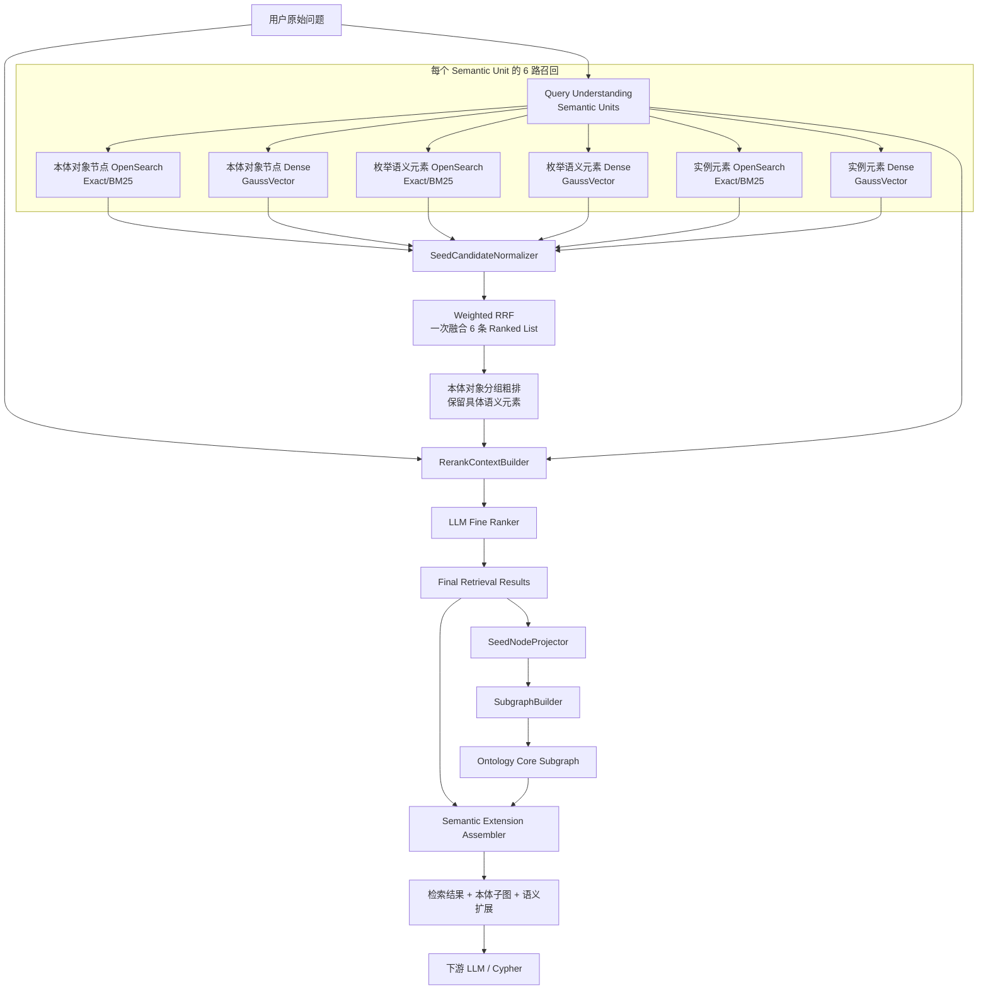
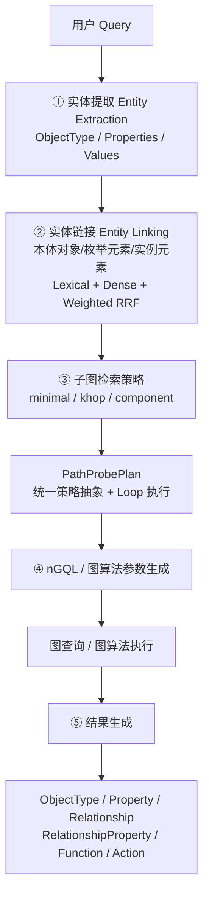
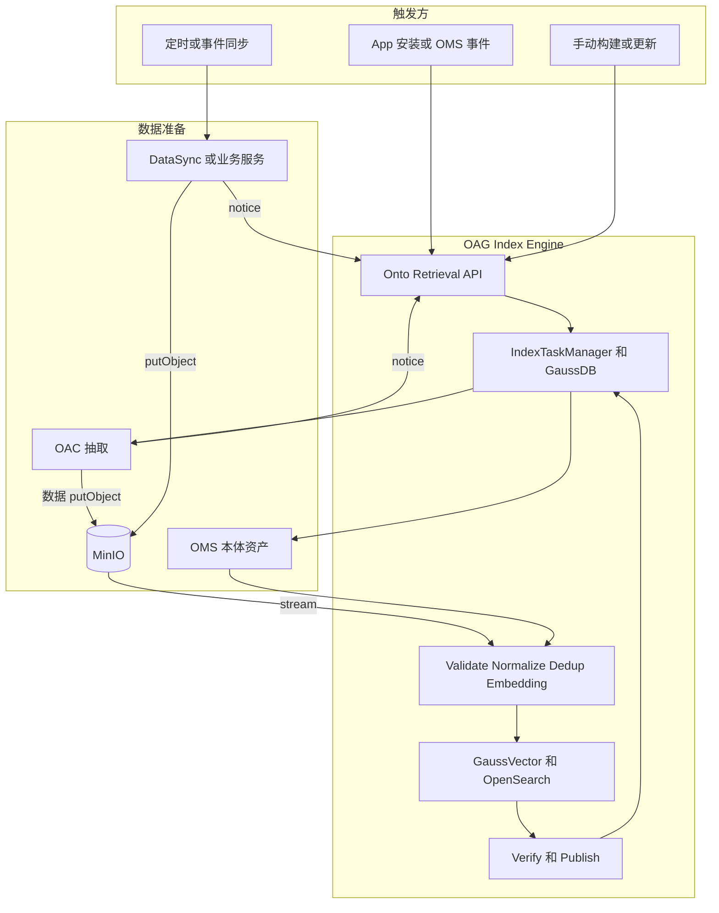
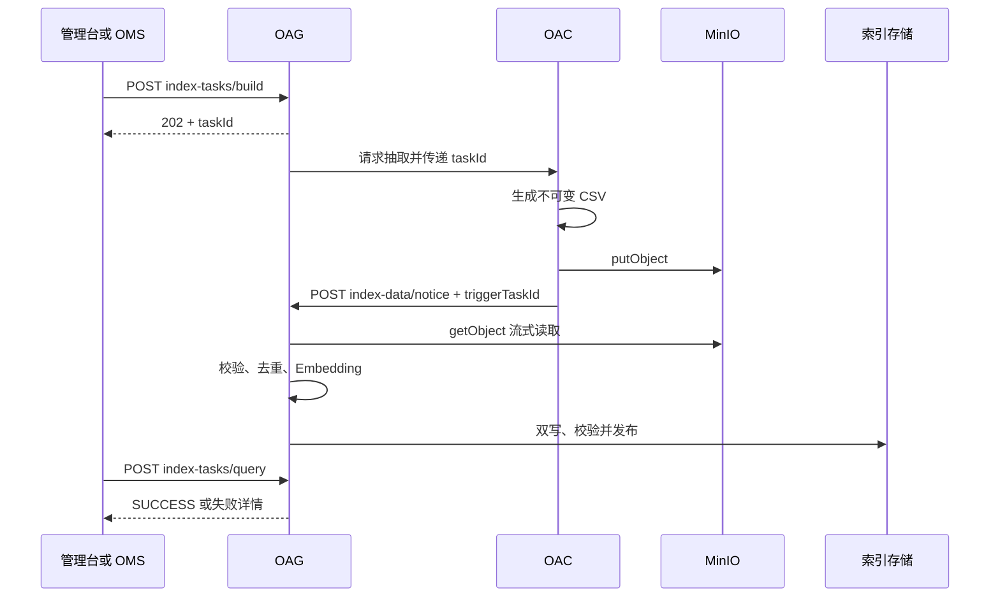
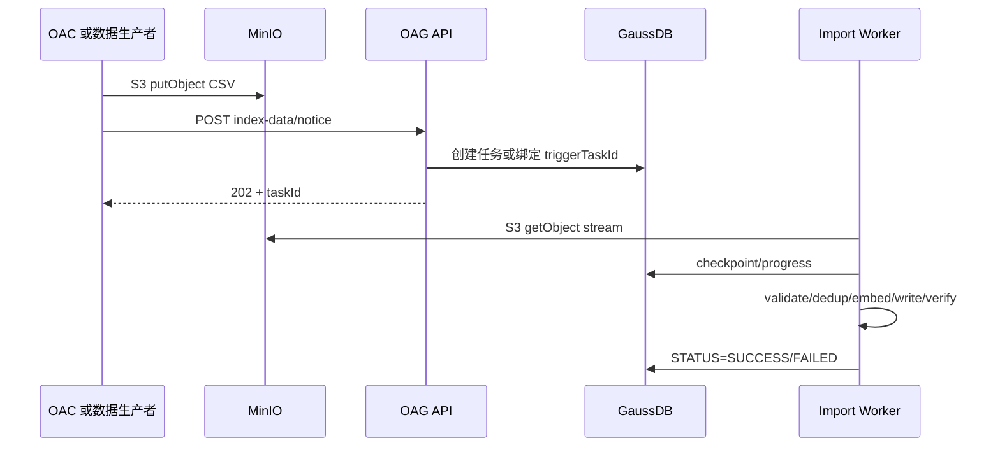

# OAG 面向本体本体对象的语义检索、混合排序与本体子图构建设计方案

> 版本：V5.15  
> 目标：在不丢失既有 Bulk Import、混合召回、RRF、LLM 精排和子图算法设计的基础上，进一步对齐现有 OMS 本体 JSON 资产，补齐手动构建、OAC 数据抽取、MinIO 文件通知的对外接口及全量/增量组合，并规范阶段 2 Entity Linking 的 ObjectType 作用域内 Property 匹配与 RRF 粗排输出：统一三张索引表命名，本体对象和枚举值直接内嵌 `synonyms`，固定支持中文/英文并额外支持最多 2 种语言，实例索引只保存去重后的真实列值。  
> 核心决策：**ObjectType/Property = 本体对象；SynonymType 在 OMS 中保留多语言源结构，OAG 物理索引中的 `synonyms` 统一为 LF 分隔的平铺字符串且不建立独立物理行；Enum Evidence 只承载 Enum Value；Instance Evidence 只承载真实 Instance Value；本体对象使用 `id`，Enum/Instance 统一使用 `propertyid + objectTypeId` 表达本体归属；每个 Semantic Unit 默认 6 路一次 Weighted RRF。**

---

## 文档结构

1. 设计目标、术语与总体架构  
2. 数据模型与索引结构  
3. 索引构建、OAC 数据抽取与入库接口组合  
4. 实体提取、Entity Linking 与 6 路召回  
5. LLM 精排与最终检索结果  
6. 本体对象投影、子图策略、路径探测与 nGQL 生成  
7. 性能、配置、可观测性、评测与迁移  

> 本次章节整理将原 V5.3 的 116 个一级章节完整归并到以上 7 个主章节；已有 Bulk Import、三类子图算法、GraphTopologyCache、性能/评测/灰度等信息均保留，只做术语、字段和执行顺序上的收敛。

---

# 1. 设计目标、术语与总体架构


围绕软件、SEC、AMS等业务场景，明确实例值语义索引需求范围，确定语义索引内容全景如下：

| 本体元素             | 自身语义化内容     | 同义词语义化 | 多语言(小语种)语义化       |
| ---------------- | ----------- | ------ | ----------------- |
| 对象类型（ObjectType） | 名称、显示名称、描述  | 名称同义词  | 多语言名称、显示名称、描述及同义词 |
| 属性（Property）     | 名称、显示名称、描述  | 名称同义词  | 多语言名称、显示名称、描述及同义词 |
| 枚举（Enum）         | 枚举值、显示名称、描述 | 枚举值同义词 | 多语言显示名称、描述及同义词    |
| 实例数据（Instance）   | 实例值         | 实例值同义词 | × 不配置多语言          |


## 1.1 设计目标与边界

OAG 同时承担索引构建、语义检索和本体子图构建三类能力。V5.15 将检索数据模型统一为三个业务层次：

```text
本体对象（Ontology Object）
  = ObjectType / Property

枚举元素（Enum Element）
  = Enum Value

实例元素（Instance Element）
  = 真实 Instance Value
```

三类名称在索引、Entity Linking、RRF、精排和结果解释中保持一致。历史 API/代码中的 `seed*`、`metadata*` 字段可以在兼容层继续读取，但新设计文档统一使用“本体对象 / 枚举元素 / 实例元素”的逻辑术语。

## 1.2 子图端到端总体架构



运行阶段统一为：

```text
阶段0：索引构建 / Bulk Import
阶段1：Query Understanding / Semantic Units
阶段2：6 路召回
阶段3：一次 Weighted RRF 粗排
阶段4：LLM 精排
阶段5：检索结果 → 本体对象投影
阶段6：minimal / khop / component 子图构建
阶段7：语义扩展与 Cypher 上下文组装
```

核心边界：

> **检索层返回“命中的对象本身”，图算法只消费 ObjectType / Property 本体对象。**


### 1.2.1 本体子图检索五阶段主流程

对外统一把运行链路抽象为五个阶段，现有更细的“召回/RRF/精排/投影”仍作为阶段 ② 内部实现，不改变已有章节顺序：



阶段边界：

1. **实体提取**只回答“用户提到了哪些对象、属性和值”，正式结构见 [extractedEntities / 实体提取设计方案](./OAG语义子图检索接口extractedEntities结构设计方案.md)；
2. **实体链接**把业务表达链接到真实本体对象，并用枚举/实例命中作为语义证据；
3. **子图策略**只消费已解析的 ObjectType/Property terminal，生成可执行 `PathProbePlan`；
4. **nGQL 生成**只负责把 Plan 翻译成参数化图查询或图算法入参，不承载语义判断；
5. **结果生成**把执行结果还原为稳定 API 结构，并按开关扩展 Function/Action。

业务扩展原则：新增业务图策略时实现统一 Strategy SPI 生成 `PathProbePlan`，而不是在 Entity Linking 或 nGQL Assembler 中硬编码业务分支。

## 1.3 与现有 OAG 代码的兼容基线

当前代码已经形成以下主链路：

```text
graphSearchV3()
  └─ performGraphSearchOptimized()
       ├─ interpretQueryIntent()
       ├─ getSeedIds()
       │    ├─ vectorService.searchOntologyByQuery()
       │    ├─ elasticSearchRestRepository.searchOntologyByQuery()
       │    └─ hybridRecallHelper.hybridRecall()
       ├─ loadAllEdges()
       └─ subgraphQuery()
            ├─ getPathInfos()
            │    ├─ computePairwiseShortestPaths()
            │    └─ computePairwiseNumPaths()
            │          └─ findAllPath()
            └─ buildMstSubgraph() / buildAllSubgraph()
```

现有请求参数主要包括：

```text
graphExpansionStrategy = minimal
hopLimit = 3
seedRetrievalMode = vector
topK = 3
includeFunctions = 0
includeActions = 0
```

V5.7 不要求一次性替换现有链路，而是在现有类和接口上渐进演进：

```text
现有 getSeedIds()
    ↓
SearchDispatcher
    ↓
SemanticCandidateNormalizer
    ↓
Weighted RRF 本体对象分组
    ↓
LLM Fine Ranker
    ↓
Final Semantic Matches
    ├─ ObjectType / Property（name/display/description/synonyms 命中）
    ├─ Enum Value（value/name/display/description/synonyms 命中）
    └─ Instance Value（value 命中）
    ↓
SeedNodeProjector
    ↓
最终图构建本体对象
```

现有 `seedIds` / `seedNodes` 仍然可以作为**图构建本体对象兼容字段**保留，但不能再代表完整检索结果；完整检索结果由新增的 `retrievalResults` 表达。

现有 `subgraphQuery()`：

```text
保留 external strategy 名称
    ↓
minimal / khop / component
    ↓
内部支持 legacy / enhanced 两套算法
```

因此本次调整不改变三种图算法的边界，只改变“检索输出是什么”以及“何时投影成 本体对象”。

---


## 1.4 核心设计原则

### 设计原则 1：三张表分别表达三类稳定实体

```text
t_oag_{ontology_id}
  → ObjectType / Property

t_oag_enum_{ontology_id}
  → Enum Value

t_oag_instance_{ontology_id}
  → Instance Value
```
### 设计原则 2：Core Graph 与检索字段分离

```text
图算法：ObjectType / Property / Relation
检索字段：name / display / description / synonyms / enum value / instance value
```

Enum/Instance 和 synonym 都可以帮助形成最终语义结果，但不直接成为最短路径、K-hop、Connected Component 的拓扑节点。

# 2. 数据模型与索引结构

## 2.1 数据模型：本体对象、枚举值、实例值与 Synonym

| 类型     | 物理实体                  | Synonym 处理                 | 本体归属字段                                |
| ------ | --------------------- | -------------------------- | ------------------------------------- |
| 本体对象定义 | ObjectType / Property | `synonyms` 以 LF 分隔的平铺字符串内嵌 | 使用本体对象自身 `id`；Property→ObjectType 走拓扑 |
| enum元素 | Enum Value            | `synonyms` 以 LF 分隔的平铺字符串内嵌 | `propertyId + objectTypeId`           |
| 实例元素   | Instance Value        | 不建立实例同义词记录                 | `propertyid + objectTypeId`           |

### 2.1.1 OMS SynonymType：保留多语言源结构

OMS 的 `synonym-type` 仍是建模资产，允许保留语言信息、显示名和描述。例如：

```json
{
  "id": "term-color-synonyms",
  "name": "color-synonyms",
  "display": {
    "zh": "颜色近义词",
    "en": "Color Synonyms"
  },
  "description": {
    "zh": "颜色相关术语的近义词定义",
    "en": "Synonyms for color-related terms"
  },
  "synonyms": {
    "zh": ["颜色", "色彩", "色泽", "色"],
    "en": ["Color", "Colour", "Hue", "Tint"]
  },
  "status": "ACTIVE"
}
```

源模型约束保持：

```text
synonyms 最多包含 3 个 language key
语言组合不固定
每种语言可包含多个同义词
language key 使用 BCP 47 风格，如 zh/en/es/es-MX/pt-BR
```

这些语言 key 用于 OMS 建模、治理和离线评测，不直接作为 OAG 热索引字段层级。

### 2.1.2 OAG `synonyms`：统一平铺为 String/TEXT

OAG 解析 ObjectType / Property / Enum Value 的 `refSynonymTypeId` 后，只提取 SynonymType 中真正参与检索的同义词值，并规范化为一个平铺字符串：

```text
颜色
色彩
色泽
色
Color
Colour
Hue
Tint
```

逻辑分隔符固定为 **LF**。在 JSON/CSV 传输中用字面量 `\n` 表达，例如：

```json
{
  "synonyms": "颜色\n色彩\n色泽\n色\nColor\nColour\nHue\nTint"
}
```

统一转换流程：

```text
SynonymType.synonyms(language → values[])
  ↓
语言块稳定排序
  ↓
语言内保持源数组顺序
  ↓
trim / Unicode normalize / 去空
  ↓
按规范化值去重并保留首次出现原文
  ↓
LF join
  ↓
OAG synonyms TEXT/String
```

稳定排序规则：`zh`、`en` 存在时优先，其余 language tag 按字典序排列；同一语言内保持 OMS 数组顺序。这样同一 SynonymType 在重复构建、FULL_REPLACE 和增量 UPSERT 时可得到确定性字符串。

> **关键边界：** OMS 保留“语言 → 同义词列表”的建模结构；GaussVector、OpenSearch、REST Batch 和 CSV 使用同一个平铺 `synonyms` 字段。OAG 不在热路径中重复反序列化 Synonym Map。

SynonymType 自身不建立独立向量记录。其 `name/display/description` 继续作为 OMS 管理元数据保留，但默认不复制到 `synonyms` 热索引字段，也不再通过 `synonyms_description` 重复拼入 Embedding；真正参与检索的是所属业务实体自身的 name/display/description 与平铺后的 synonym values。

## 2.2 三类物理索引与统一命名

三张 GaussVector 表和对应 OpenSearch Index 统一命名：

| 逻辑类型   | 物理表 / Index                    | Owner         | 数据                    |
| ------ | ------------------------------ | ------------- | --------------------- |
| 本体对象定义 | `t_oag_{ontology_id}`          | OAG           | ObjectType / Property |
| enum元素 | `t_oag_enum_{ontology_id}`     | OAG           | Enum Value + Synonyms |
| 实例元素   | `t_oag_instance_{ontology_id}` | OAG，业务服务 提供数据 | Instance Value        |

三类数据继续物理隔离，原因不变：

```text
规模差异
更新频率差异
ANN 算法差异
数据 Owner 差异
检索 TopK / 阈值差异
```


## 2.3 `t_oag_{ontology_id}` GaussVector 表结构

本体对象表保留两个额外语言槽位，并增加平铺 `synonyms`。中文和英文仍保留固定列，另外最多支持 2 种 display/description 语言：

| 字段                   | 类型                   | 非空  | 说明                                            |
| -------------------- | -------------------- | --- | --------------------------------------------- |
| `vector`             | `DOUBLE[]`           | ✔   | 1024 维向量                                      |
| `type`               | `INT`                |     | 0 ObjectType，1 Property                       |
| `id`                 | `VARCHAR(256 CHAR)`  | ✔   | ObjectType / Property 全局唯一 ID                 |
| `parent_id`          | `VARCHAR(256 CHAR)`  |     | 父元素 ID；当 type=1 时记录 Property 所属 ObjectType ID |
| `name`               | `VARCHAR(256 CHAR)`  |     | 本体真实名称                                        |
| `display_zh`         | `VARCHAR(512 CHAR)`  |     | 中文显示名                                         |
| `display_en`         | `VARCHAR(512 CHAR)`  |     | 英文显示名                                         |
| `display_lang_1`     | `VARCHAR(512 CHAR)`  |     | 第 1 个额外语言显示名                                  |
| `display_lang_2`     | `VARCHAR(512 CHAR)`  |     | 第 2 个额外语言显示名                                  |
| `description_zh`     | `VARCHAR(1024 CHAR)` |     | 中文描述                                          |
| `description_en`     | `VARCHAR(1024 CHAR)` |     | 英文描述                                          |
| `description_lang_1` | `VARCHAR(1024 CHAR)` |     | 第 1 个额外语言描述                                   |
| `description_lang_2` | `VARCHAR(1024 CHAR)` |     | 第 2 个额外语言描述                                   |
| `synonyms`           | `TEXT`               |     | LF 分隔的同义词平铺字符串；不保存 JSON Map/Array             |

`synonyms` 逻辑值示例：

```text
小区
无线小区
Cell
Radio Cell
Celda
Celda de radio
```

传输表示：

```text
小区\n无线小区\nCell\nRadio Cell\nCelda\nCelda de radio
```

额外 display/description 最多 2 个语言槽位；“Synonym 最多 3 种语言”是 **OMS SynonymType 源模型约束**。

## 2.4 本体对象向量化内容

OAG 在内存中解析 ObjectType / Property 及其 SynonymType，先按 2.1.2 生成 canonical `synonyms` 字符串，再按以下顺序构建 Embedding 文本：

```text
{name}
{display_zh}
{display_en}
{display_lang_1}
{display_lang_2}
{description_zh}
{description_en}
{description_lang_1}
{description_lang_2}
{synonyms}
```

其中 `{synonyms}` 就是 LF 分隔后的同义词值列表。EmbeddingInputBuilder 可以直接把该字符串作为最后一个文本块追加，不再构造 `synonyms_value` / `synonyms_description` 两个中间字段。

这样可保证：

```text
OMS 静态构建
MinIO CSV 动态导入
        ↓
都使用同一种 synonyms 物理表达和 Embedding 规则
```

SynonymType 的 `name/display/description` 不再额外重复拼接到向量中，避免与所属 ObjectType / Property 自身的 name/display/description 形成重复语义权重。

空字段直接跳过，不写占位字符串。不要把 ObjectType 名称额外强制拼到 Property 向量开头；Property 自身语义、display、description、synonyms 已足够作为主表达。

当前 BGE-M3 向量维度继续沿用 1024。Embedding 批大小和重试次数属于 OAG 工程配置，不进入表 Schema。

## 2.5 多语言槽位与 Synonym 语言规则

### 2.5.1 Display / Description 最多 4 种语言

```text
固定语言：zh + en
额外语言：lang_1 + lang_2
总计最多 4 种
```

没有配置某个额外语言时，对应列为空。

### 2.5.2 Synonym：源模型保留语言，索引模型语言无关

Synonym 的语言规则只在 OMS 源模型层生效：

```text
OMS SynonymType.synonyms
  → 最多 3 个 language key
  → language key 不固定
  → 每种语言可有多个词
```

进入 OAG 后统一转换为：

```text
synonyms = term1<LF>term2<LF>term3...
```

因此 OAG 物理索引不再存在：

```text
synonyms.zh
synonyms.en
synonyms.es
synonyms.<language>
```

也不再通过 language key 对 synonym 做 Dense 过滤或 Lexical 硬过滤。`language_hint` 仍可作用于 display/description Analyzer 和查询理解，但 synonym 字段本身按语言无关文本检索。

如果未来确实需要“按语言返回 synonym”或线上语言级统计，应从 OMS SynonymType 源资产补充上下文，或新增独立冷元数据能力；不应重新把多语言 Map 放回高频检索记录。

## 2.7 `t_oag_{ontology_id}` OpenSearch Index

OpenSearch 与 GaussVector 共享同一业务字段语义：

```text
type
id
parent_id
name
display_zh
display_en
display_lang_1
display_lang_2
description_zh
description_en
description_lang_1
description_lang_2
synonyms
```

推荐映射：

| 字段              | OpenSearch 类型      | 说明                                                                      |
| --------------- | ------------------ | ----------------------------------------------------------------------- |
| `type`          | `integer`          | 0 ObjectType / 1 Property                                               |
| `id`            | `keyword`          | 本体 ID                                                                   |
| `name`          | `keyword` + `text` | Exact / BM25                                                            |
| `display_*`     | `keyword` + `text` | 多语言显示名                                                                  |
| `description_*` | `text`             | 多语言描述                                                                   |
| `synonyms`      | `text` multi-field | 主字段按 LF 切成“整条 synonym token”做 Exact；`synonyms.bm25` 用普通 Analyzer 做 BM25 |

`synonyms` 不再映射为 dynamic object。推荐 Analyzer：

```yaml
analysis:
  tokenizer:
    synonym_line_tokenizer:
      type: pattern
      pattern: '\\n+'
  analyzer:
    synonym_line_analyzer:
      type: custom
      tokenizer: synonym_line_tokenizer
      filter: [lowercase, asciifolding]
```

字段映射示意：

```yaml
synonyms:
  type: text
  analyzer: synonym_line_analyzer
  search_analyzer: synonym_line_analyzer
  fields:
    bm25:
      type: text
      analyzer: standard
```

这样：

```text
Exact synonym
  → 查询 synonyms 主字段；一个 LF 行作为一个完整 token

BM25 synonym
  → 查询 synonyms.bm25；把平铺文本按普通全文规则召回
```

检索优先级：

```text
id/name/display exact
> synonyms line-exact
> name/display phrase/BM25
> synonyms.bm25
> description BM25
```

Synonym 命中统一返回：

```text
matched_field = synonyms
matched_value = 实际命中的某一行 synonym
```

Exact 命中可以直接定位匹配行；BM25 命中由 `SynonymMatchResolver` 对 `synonyms` 做一次 LF split，并用与检索一致的 normalizer 在候选行中选出最匹配的 `matched_value`。这一步是简单字符串处理，不再执行 JSON 反序列化。

不再使用扁平 `i18n_content`，也不再建立 `synonyms.*` dynamic template。

## 2.8 `t_oag_enum_{ontology_id}`：Enum Value 模型与表结构

t_oag_enum 只承载本体模型中定义的枚举值。

### 2.8.1 EnumType 源结构

```json
{
  "id": "ei.veh12.enum.Col35.1",
  "name": "Color",
  "display": {
    "en": "Color",
    "zh": "颜色"
  },
  "description": {
    "en": "Vehicle body color enumeration",
    "zh": "车身颜色枚举"
  },
  "status": "ACTIVE",
  "creatorByOntology": "vehicle",
  "valueType": "string",
  "refSynonymTypeId": "term-color-synonyms",
  "values": [
    {
      "id": "ei.veh12.enum.Col35.val.red8.1",
      "code": "0",
      "value": "red",
      "description": {
        "en": "Red color",
        "zh": "红色"
      },
      "order": 1,
      "refSynonymTypeId": "term-color-red-synonyms"
    },
    {
      "id": "ei.veh12.enum.Col35.val.blue9.1",
      "value": "blue",
      "description": {
        "en": "Blue color",
        "zh": "蓝色"
      },
      "order": 2,
      "refSynonymTypeId": "term-color-blue-synonyms"
    }
  ],
  "extensions": {}
}
```

真正进入 `t_oag_enum_{ontology_id}` 的粒度是 `values[]` 中的每个枚举值。

### 2.8.2 SynonymType 源结构与索引转换

OMS SynonymType 仍保留结构化多语言信息：

```json
{
  "id": "term-color-red-synonyms",
  "name": "color-red-synonyms",
  "display": {
    "zh": "红色近义词",
    "en": "Red Synonyms"
  },
  "description": {
    "zh": "红色相关术语",
    "en": "Synonyms for red"
  },
  "synonyms": {
    "zh": ["红", "赤色"],
    "en": ["Red"],
    "es": ["Rojo"]
  },
  "status": "ACTIVE"
}
```

OMS 源模型仍要求 `synonyms` 最多 3 个 language key，语言不固定。OAG 建索引时只把 synonym values 平铺：

```text
红
赤色
Red
Rojo
```

最终 `t_oag_enum_{ontology_id}.synonyms` 保存：

```text
红\n赤色\nRed\nRojo
```

其中不再包含 language key、JSON Object 或 Array。

### 2.8.3 Property 引用 Enum

```json
{
  "id": "prop:ont:vehicle:sp:bodyColor",
  "name": "bodyColor",
  "display": {
    "en": "Body Color",
    "zh": "车身颜色"
  },
  "description": {
    "en": "Vehicle body color",
    "zh": "车身颜色"
  },
  "dataType": "enum",
  "valueType": "string",
  "referenceEnumName": "Color",
  "referenceEnumId": "ei.vehicle.enum.Color.1",
  "extensions": {}
}
```

OAG 按：

```text
Property.referenceEnumId
  → EnumType.values[]
  → EnumValue.refSynonymTypeId
  → SynonymType.synonyms
  → SynonymFlattener
  → LF String
```

展开索引。

### 2.8.4 向量库 表结构

```text
t_oag_enum_{ontology_id}
```

| 字段                   | 类型                   | 非空  | 说明                                   |
| -------------------- | -------------------- | --- | ------------------------------------ |
| `vector`             | `DOUBLE[]`           | ✔   | Enum Value 向量                        |
| `value`              | `VARCHAR(4096 CHAR)` |     | 真实枚举值                                |
| `property_id`        | `VARCHAR(512 CHAR)`  | ✔   | 引用该 Enum 的 Property.id               |
| `object_type_id`     | `VARCHAR(256 CHAR)`  |     | Property 所属 ObjectType.id            |
| `display_zh`         | `VARCHAR(512 CHAR)`  |     | 中文 display                           |
| `display_en`         | `VARCHAR(512 CHAR)`  |     | 英文 display                           |
| `display_lang_1`     | `VARCHAR(512 CHAR)`  |     | 额外语言 1 display                       |
| `display_lang_2`     | `VARCHAR(512 CHAR)`  |     | 额外语言 2 display                       |
| `description_zh`     | `TEXT`               |     | 中文 description                       |
| `description_en`     | `TEXT`               |     | 英文 description                       |
| `description_lang_1` | `TEXT`               |     | 额外语言 1 description                   |
| `description_lang_2` | `TEXT`               |     | 额外语言 2 description                   |
| `synonyms`           | `TEXT`               |     | LF 分隔的 Enum Value 同义词平铺字符串           |

如果一个 EnumType 被多个 Property 复用，需要按实际引用 Property 展开记录。Evidence 不重新引入 `id/parent_id`；业务定位和数据库唯一性统一使用：

```text
objectTypeId + propertyId + normalized(value)
```

`values[].id` 仍可用于 OMS 源数据追踪和质量校验，但不作为 `t_oag_enum_{ontology_id}` 的持久化字段。

## 2.9 Enum Value 向量化规则

每个 `values[]` 元素按以下内容生成一个向量：

```text
{value}
{display_zh}
{display_en}
{display_lang_1}
{display_lang_2}
{description_zh}
{description_en}
{description_lang_1}
{description_lang_2}
{synonyms}
```

其中 `{synonyms}` 为当前 Enum Value 关联 SynonymType 经 2.1.2 规则平铺后的 LF String。

向量顺序坚持：

```text
Value First
→ Name（存在时）/ Display
→ Description
→ Synonyms
```

不再构造 `synonyms_value` / `synonyms_description`，也不把 SynonymType 自身的 name/display/description 追加到向量文本。

不在向量文本开头追加 ObjectType / Property 文本；`propertyId + objectTypeId` 已提供确定性归属。

## 2.10 `t_oag_instance_{ontology_id}` 实例列值表结构

实例索引保存去重后的真实列值，每条记录直接携带所属 Property 和 ObjectType。

```text
t_oag_instance_{ontology_id}
```

| 字段               | 类型                   | 非空  | 说明                        |
| ---------------- | -------------------- | --- | ------------------------- |
| `vector`         | `DOUBLE[]`           | ✔   | Instance Value 向量         |
| `value`          | `VARCHAR(4096 CHAR)` |     | 去重后的真实列值                  |
| `synonym`        | `VARCHAR(4096 CHAR)` |     | 真实列值的同义词                  |
| `property_id`    | `VARCHAR(512 CHAR)`  | ✔   | 所属 Property.id            |
| `object_type_id` | `VARCHAR(256 CHAR)`  |     | Property 所属 ObjectType.id |

**实例值多归属演进方案：** 当前版本不要求 `value` 单列全局唯一，同一个规范化值如果属于多组 Property/ObjectType，允许保存多条物理记录，业务唯一键使用 `(normalized_value, property_id, object_type_id)`，从而避免数组字段导致的更新放大和索引过滤复杂化。

未来如果业务明确要求“一个 value 只保存一份向量”，升级为**值表 + 归属映射表**两层模型，而不是直接把 `property_id/object_type_id` 改成数组：

```text
t_oag_instance_value_{ontology_id}
  value_id
  normalized_value UNIQUE
  value
  vector

    1 : N
      ↓

t_oag_instance_binding_{ontology_id}
  value_id
  property_id
  object_type_id
  UNIQUE(value_id, property_id, object_type_id)
```

查询链路：先在 Value 表执行 Exact/BM25/Dense 召回得到 `value_id`，再批量查询 Binding 表展开成多组 `(property_id, object_type_id)`，随后按当前 ObjectType/Property 上下文进入 RRF/LLM 消歧。对上层统一预留 `ownerships[]` 逻辑结构；当前“一值多行”实现也在 Normalizer 层聚合成同一逻辑候选，因此未来切换两层存储不改变 Entity Linking 和子图构建接口。

当前方案，实例数据先放在一张表里面，不同列做语义放在一个表里面，并明确数据量规模和性能规格，对于拆表方案，后续随着需求驱动。
分表策略：水平拆分，达到一个上限后分表
候选方案：
1、水平拆
2、按照对象分表
3、不拆，规格约束

## 2.11 Instance Value 向量准入规则

Property 中的 `"capability":"DIMENSION"` 是实例列值进入向量索引的准入标识，同时还需要满足数据类型和值形态约束：

```text
instance_index_enabled =
  property.capability == "DIMENSION"
  AND datatype_eligible
  AND value_shape_eligible
  AND cardinality_eligible
```

向量库最终必须保证实例值记录不重复。业务服务 比如软件的 DataSync 可以在源侧先做去重，OAG 在写入 `t_oag_instance_{ontology_id}` 前仍必须按 `objectTypeId + propertyid + normalized(value)` 再次去重并使用幂等 UPSERT。例：5000 万 Subscriber 行中 `subLevel` 只有 VIP/GOLD/SILVER/NORMAL，最终向量库只保留 4 条唯一实例值记录。

默认不向量化：

```text
UUID
手机号
纯技术主键
时间戳
日期
连续数值
高随机编码
```

适合向量化：

```text
产品名称
品牌名称
客户等级
区域名称
业务状态
自然语言标签
人可理解业务分类
```

高基数自由文本进入单独 Document/RAG Index，不进入本体本体对象 Resolver 的 Instance Value Index。


## 2.12 Instance Value 向量化内容

实例列值 Dense 内容严格只使用：

```text
{value}
```

这样 Instance Dense 表达始终由真实业务值主导；Property/ObjectType 归属直接由记录中的 `propertyid + objectTypeId` 提供。

可以只用组合的Struct 结构的value。

## 2.13 Metadata / Instance OpenSearch Index

### `t_oag_enum_{ontology_id}`

核心字段与 GaussVector 一致：

```text
type
propertyId
objectTypeId
value
display_zh
display_en
display_lang_1
display_lang_2
description_zh
description_en
description_lang_1
description_lang_2
synonyms
```

Exact 优先：

```text
propertyId
objectTypeId
value.keyword
display_*.keyword
synonyms（synonym_line_analyzer，一行一个完整 synonym token）
```

BM25：

```text
display_*
description_*
synonyms.bm25
```

Metadata 的 `synonyms` 映射与 2.7 完全一致，不再使用按语言展开的 keyword 子字段或语言 dynamic object。

### `t_oag_instance_{ontology_id}`

只需要：

```text
type          integer
propertyid    keyword
objectTypeId  keyword
value         keyword + text
```

Exact 主要搜索 `propertyid/objectTypeId/value.keyword`，BM25 搜索 `value`。

## 2.14 规范化规则

规范化属于索引构建/查询处理逻辑，不增加额外持久化字段：

```text
trim
Unicode normalize
casefold（适用语言）
连续空白归一
全半角归一
```

`name/value/display/description` 保留原始业务文本。OMS 中原始 SynonymType 多语言结构继续由 OMS 维护；OAG 的 `synonyms` 保存规范化展开后的 canonical LF String。

SynonymFlattener 处理规则：

```text
CRLF / CR → LF
按 LF 切分
trim
去空行
按基础规范化值去重，保留首次出现原文
重新 LF join
```

OpenSearch 使用 2.7 的 line analyzer / BM25 multi-field；GaussVector 在 Embedding 前直接使用同一 canonical `synonyms`，避免不同存储各自做一套解析。

## 2.15 language_hint 与语言槽位

查询理解阶段仍可以输出：

```text
language_hint = BCP 47 language tag / mixed / und
```

物理存储分三种情况：

```text
本体对象 / Enum Value display、description
  → zh/en 固定 + lang_1/lang_2 两个 ontology 级语言槽位

SynonymType 源资产
  → OMS 中保留 language Map，最多 3 个 language key

OAG synonyms 热索引
  → 单个 LF 分隔 String，不保留 language key

Instance Value
  → 仅 value；language 为可选观测/Analyzer Hint
```

检索规则：

```text
display/description 可根据 language_hint 选择 Analyzer 或 Boost
synonyms 不按 language_hint 硬过滤，也不做 synonyms.<language> Boost
Dense 不按 language_hint 过滤
LLM 精排继续看到原始问题和所有候选
```

因此 `matched_field` 对 synonym 统一为 `synonyms`；如果需要知道该同义词在 OMS 中原本属于哪种语言，只能通过源 SynonymType 或离线标注补充，不能从热索引字段名反推。

## 2.16 数据质量治理

OAG 元数据同步阶段必须先校验 OMS 源结构，再校验平铺后的热索引值。

### OMS SynonymType 源结构校验

```text
ObjectType / Property id 重复或缺失
name/display/description 格式非法
additionalLanguages 槽位配置不一致
SynonymType.synonyms language key 数 > 3
language key 非法或不符合约定的 BCP 47 风格
同一 language 内 synonym 重复
synonym 与 canonical name/display 完全重复
同一业务范围内 synonym 映射冲突
Enum Ref 不存在
Enum values[].id/value 源数据重复
Enum Value.refSynonymTypeId 不存在
Property.referenceEnumId 不存在
Parent ObjectType 缺失
```

### OAG 平铺 synonyms 校验

```text
统一 CRLF/CR 为 LF
禁止空 synonym 行进入索引
去除首尾空白
规范化后重复 synonym 只保留第一次出现的原文
禁止 JSON Object / JSON Array 形式写入 synonyms 热字段
字段总长度和 synonym 数量受服务配置保护
```

动态 REST/CSV 已经不携带 language key，因此只能执行平铺值质量校验，不能在 OAG API 层声称“校验动态 synonyms 最多 3 种语言”。该限制属于 OMS SynonymType 源建模约束。

冲突处理原则：不能静默覆盖，必须可观测；严重结构错误阻断当前记录或当前批次入库。

DataSync 实例值额外检查：

```text
空 value
超长 value
unique_value_count
同一 objectTypeId + propertyid 下重复 value
高基数
无意义随机串
非法 UTF-8
```

## 2.17 增量索引与幂等

三类表按各自稳定业务键做幂等 UPSERT / DELETE：

```text
本体对象：id
Enum Value：objectTypeId + propertyId + normalized(value)
Instance Value：objectTypeId + propertyid + normalized(value)
```

同一业务键重复 UPSERT 必须覆盖当前记录而不是新增重复向量；`synonyms` 以 canonical LF String 整字段覆盖，不执行 Map merge。DELETE 必须同时删除 GaussVector 与 OpenSearch 中对应记录。

不在记录中保留：

```text
content_hash
model_version
source_version
updated_at
```

版本和构建信息统一放到 OAG 的 Import Job / Generation 元数据，不进入每条向量记录。

Embedding 模型升级时：

```text
创建新的 Generation
→ 全量重新 Embedding
→ Verify
→ 原子发布
```

如果未来需要“内容未变化则跳过 Embedding”，可以作为 OAG 内部缓存优化实现，但不扩展业务表 Schema。

## 2.18 GaussVector 索引算法

本体对象 / Metadata 语义元素：

```text
GsIVFFLAT
COSINE
```

适用规模：

```text
约 1*10^4 ～ 2*10^6
```

推荐：

```text
IVF_NLIST = 4 * sqrt(N)
```

其中：

```text
N = 当前物理表实际记录数
```

Instance 语义元素：

```text
中小规模 → GsIVFFLAT
千万 / 亿级 → GsDiskANN
```

Metadata 与 Instance 分表的一个核心原因就是允许 ANN 算法独立演进。

---


# 3. 索引构建与入库

本章定义 OAG 索引数据的构建、OAC 抽取编排、MinIO 文件交互、任务持久化和双存储发布机制。索引数据仍由第 2 章定义的三张物理表承载：

```text
t_oag_{ontology_id} → ObjectType / Property 本体对象
t_oag_enum_{ontology_id} → Enum Value
t_oag_instance_{ontology_id} → Instance Value
```

其中本体对象索引由 OAG 根据 OMS 本体资产构建；Enum Value 和 Instance Value 还支持运行期抽取与导入。有 OAC 的部署统一推荐两类写入入口：

```text
手动构建/更新索引
  → 管理台或 OMS 调用 OAG
  → OAG 为动态数据编排 OAC 抽取
  → 适合首次全量创建、人工全量重建和人工触发增量更新

MinIO 索引数据通知
  → OAC、DataSync 或业务服务先上传不可变 CSV，再通知 OAG 读取
  → 适合大数据量首次全量和非首次增量
```

OAC 小批/分页结果、MinIO CSV 以及无 OAC 部署保留的兼容 REST Batch 最终都进入同一套 OAG Import Pipeline，不允许分别维护多套 Embedding、去重、GaussVector/OpenSearch 写入和任务状态逻辑。

---

## 3.1 职责边界

### OMS

负责提供 ObjectType / Property、多语言 display/description、SynonymType、EnumType / values[]、Property→ObjectType 和 Property→EnumType 等本体资产。OAG 根据 OMS 资产构建 `t_oag_{ontology_id}` 和静态 Enum Value 索引；App 安装事件可以触发 OAG 创建种子索引任务。

### OAC

OAC 是有 OAC 部署中的业务数据统一抽取入口，负责：

```text
接收 OAG 下发的 tenantId / ontologyId / taskId / dataType / importMode
根据本体映射访问业务数据源
抽取 Enum Value / Instance Value
执行源侧基础标准化和必要去重
生成 UTF-8 CSV、上传 MinIO 并调用 OAG 通知接口
```
OAC 不负责 Embedding、GaussVector/OpenSearch 写入、Generation 发布或索引任务终态管理。手动构建场景由 OAG 编排 OAC，管理台/OMS 不直接调用 OAC 查询业务数据。

### DataSync / 业务数据服务

DataSync 或业务数据服务负责定时/事件驱动的大规模实例数据准备与文件交付：

```text
读取 capability=DIMENSION 的 Property
访问实际数据源
提取真实 Instance Value
源侧去重 / 基础标准化
建立 value 与 Property 的映射
生成 UTF-8 CSV 文件
上传到双方约定的 MinIO Bucket
调用 OAG index-data/notice 注册导入任务
```

当生产者能够产生动态 Enum Value 时，也可以使用相同 CSV 通知接口提交 `METADATA_ENUM` 数据。

DataSync/业务数据服务不负责 Embedding、GaussVector/OpenSearch Client、ANN/全文索引构建、OAG 物理表创建、Generation 发布以及最终去重和双存储一致性。

### OAG

OAG 统一负责：

```text
对外 API 和索引任务创建
OMS 资产读取与 OAC 抽取编排
GaussDB 任务状态持久化
请求 / CSV Schema 校验
Enum / Instance 本体映射校验
Normalize / Dedup
Embedding
GaussVector Bulk Write
OpenSearch Bulk Write
ANN / 全文索引校验
Generation 发布
在线检索
任务查询 / 重试 / 取消 / 错误查询
```

> **OMS/OAC/DataSync/业务服务提供资产或业务语义数据，OAG 统一把数据转换为可检索的向量/全文索引并对发布结果负责。**

---

## 3.2 总体索引构建架构


![[Pasted image 20260823094556.png]]


1、手动创建索引->OAC : 应对首次全量索引创建 和 索引更新 场景  
2、通知OAG->OAG读取minio文件：应对大数据量首次全量和非首次增量数据索引入库
### 数据源访问模式、容量规格与 DataSeek 对齐结论

索引构建统一支持三种服务端配置模式，不把数据源选择暴露成业务侧每次请求都要判断的参数：

```yaml
indexBuild:
  instanceDataSourceMode: AUTO   # OAC_QUERY | MINIO_NOTICE | AUTO
  directQueryMaxRows: 10000
```

| 模式 | 数据流 | 适用场景 |
|---|---|---|
| `OAC_QUERY` | Build API → OAG → OAC 分页/流式查询 → 去重 → Embedding → 双写 | OAG 可访问 OAC；软件等中小规模场景；首次全量和日常更新 |
| `MINIO_NOTICE` | 业务/DataSync → MinIO → notice → OAG 读取文件 → 去重 → Embedding → 双写 | OAG 不能直连 OAC，或大数据量全量/增量导入 |
| `AUTO` | 按租户/本体配置和预估规模选择上面两条路径 | 默认模式；不依赖运行时临时探测网络可达性，保证行为可预测 |

容量基线：

| 业务档位 | 去重后语义值规模 | 默认路径 | 设计要求 |
|---|---:|---|---|
| Software | ≤ 1 万 | `OAC_QUERY` | 单表即可，支持在线重建/更新 |
| SEC | ≤ 100 万 | `MINIO_NOTICE` | Bulk、Chunk、Checkpoint、限流、可恢复、双写幂等 |
| > 100 万 | 超出当前基线 | MinIO + 水平分表 | 必须专项容量评估与压测后开放 |

与 DataSeek/NL2SQL 的对齐采用统一语义值逻辑模型：`ontology_id / object_type_id / property_id / value / normalized_value / source / version / update_type`。OAG 保持 Exact/BM25 + Dense 的混合检索契约和“值 → Property/ObjectType”归属解析能力；未来 NL2SQL 可以复用同一语义值字典和归属信息，而不要求共享 OAG 的物理向量表。 




三种数据交付方式只在进入 OAG 前不同：OMS 提供种子资产，OAC 可以交付小批/分页记录，OAC/DataSync/业务服务可以通过 MinIO 交付大文件。从 `Schema Validator` 开始统一使用 Normalize/Dedup/Embedding/双写/Verify/Publish 流水线。

## 3.3 统一 REST API 规范

OAG 对外接口统一使用 Namespace：

```text
/v1/onto-retrieval/{ontologyId}
```

本章接口按 **OpenAPI 3.0.3** 规范定义。所有 URI、Path/Header/Query 参数、Request Body、HTTP Status Code 和 Response Schema 都必须能够直接映射为 OpenAPI `paths / parameters / requestBody / responses / components.schemas`。

### 3.3.1 公共协议约束

#### Content-Type

```http
Content-Type: application/json
Accept: application/json
```

MinIO 文件导入接口自身仍使用 JSON 注册文件，不通过 `multipart/form-data` 直接上传大文件；CSV 先由 DataSync 上传到双方约定的 MinIO Bucket，再调用 `index-data/notice`。

#### 公共 Path 参数

**表 1  OntologyPath 参数列表**

| 参数名称         | 类型     | 是否必选 | 默认值 | OpenAPI 约束                                   | 说明                       |
| :----------- | :----- | :--- | :-- | :------------------------------------------- | :----------------------- |
| `ontologyId` | String | 是    | -   | `in: path`，`required: true`，`maxLength: 256` | 本体唯一 ID；必须与 URI 中的目标本体一致 |

#### 公共 Header 参数

**表 2  OAGCommonHeaders 参数列表**

| 参数名称              | 类型     | 是否必选     | 默认值                | OpenAPI 约束                                     | 说明                   |
| :---------------- | :----- | :------- | :----------------- | :--------------------------------------------- | :------------------- |
| `x-gde-tenant-id` | String | 是        | -                  | `in: header`，`required: true`，`maxLength: 256` | 租户 ID；OAG 按租户隔离本体和任务 |
| `Content-Type`    | String | POST 请求是 | `application/json` | `application/json`                             | 请求体编码类型              |
| `Accept`          | String | 否        | `application/json` | `application/json`                             | 响应类型                 |

#### 公共 HTTP 状态码

| HTTP 状态码                    | 场景                                                     | Response Schema                                            |
| :-------------------------- | :----------------------------------------------------- | :--------------------------------------------------------- |
| `200 OK`                    | 同步查询成功                                                 | 对应接口 Success Response                                      |
| `202 Accepted`              | 异步导入、重试或取消请求已接受                                        | `AsyncTaskAcceptedResponse` / `BatchTaskOperationResponse` |
| `400 Bad Request`           | Path/Header/Body/Query 参数校验失败                          | `ValidationErrorResponse`                                  |
| `404 Not Found`             | Ontology、Task 或同步校验的资源不存在                              | `BusinessErrorResponse`                                    |
| `409 Conflict`              | 幂等键冲突、任务状态不允许当前操作                                      | `BusinessErrorResponse`                                    |
| `429 Too Many Requests`     | 导入任务或接口触发限流                                            | `BusinessErrorResponse`                                    |
| `500 Internal Server Error` | OAG 内部未预期异常                                            | `BusinessErrorResponse`                                    |
| `503 Service Unavailable`   | GaussDB、Embedding、GaussVector、OpenSearch、MinIO 等依赖暂不可用 | `BusinessErrorResponse`                                    |

> 对异步导入接口，`202 Accepted` 仅表示任务已成功写入 GaussDB 并进入执行队列，不表示数据已经完成 Embedding、双写或发布。

#### 幂等规则

`requestId` 是调用方生成的业务幂等键，最大长度 256。OAG 使用：

```text
ontologyId + requestId
```

作为任务级幂等约束：

```text
相同 ontologyId + requestId + 相同请求语义
  → 返回原 taskId，不重复创建任务

相同 ontologyId + requestId + 不同 dataType/importMode/数据内容
  → HTTP 409 IDEMPOTENCY_CONFLICT
```

---

### 3.3.2 语义子图检索接口

#### 典型场景

Agent、Skill 或上层业务根据自然语言问题获取与问题相关的 ObjectType、Property、Enum Value、Instance Value、Relation、Function/Action 等检索结果和本体子图。

#### 接口功能

执行 Query Understanding、6 路混合召回、Weighted RRF、LLM 精排和本体子图生成。该接口只负责语义检索与子图返回，不承担索引数据导入。

#### 调用方法

POST

#### URI

```text
/v1/onto-retrieval/{ontologyId}/subgraph/semantic-search
```

对应 Spring 接口：

```java
@PostMapping("/v1/onto-retrieval/{ontologyId}/subgraph/semantic-search")
```

#### 请求参数

除表 1、表 2 的公共 Path/Header 参数外，请求 Body 使用 `SemanticSearchRequest`。

**表 3  SemanticSearchRequest 参数列表**

| 参数名称 | 类型 | 是否必选 | 默认值 | OpenAPI 约束 | 说明 |
|:--|:--|:--|:--|:--|:--|
| `query` | String | 是 | - | `minLength: 1` | 自然语言业务问题或 Planning 层整理后的语义检索问题 |
| `similarityThreshold` | Number(float) | 否 | `0.6` | `minimum: 0`，`maximum: 1` | Dense 相似度阈值；Exact 命中不受该阈值过滤 |
| `includeFunctions` | Integer | 否 | `1` | `enum: [0,1]` | 是否返回 Function，1 返回，0 不返回 |
| `includeActions` | Integer | 否 | `0` | `enum: [0,1]` | 是否返回 Action，1 返回，0 不返回 |
| `seedRetrievalMode` | String | 否 | `vector` | 当前支持值以服务配置为准 | 本体对象检索模式 |
| `topK` | Integer | 否 | `3` | `minimum: 1` | 本体对象候选 TopK |
| `graphExpansionStrategy` | String | 否 | `minimal` | `enum: [minimal,khop,component]` | 子图扩展策略 |
| `hopLimit` | Integer | 否 | `3` | `minimum: 1` | `khop` 策略下的最大扩散深度 |

#### 请求示例

```json
{
  "query": "查询正式用户的 Mobile Number",
  "similarityThreshold": 0.6,
  "includeFunctions": 1,
  "includeActions": 0,
  "seedRetrievalMode": "vector",
  "topK": 3,
  "graphExpansionStrategy": "minimal",
  "hopLimit": 3
}
```

#### 返回参数

成功响应沿用后续第 5、6 章定义的最终检索与子图结构。OpenAPI 中 `result` 至少声明为 Object，内部字段包括 `retrievalResults / seedNodes / nodes / edges / semanticExtensions / capabilityExtensions / metadata`，具体字段以第 5、6 章为准。

**表 4  SemanticSearchResponse 参数列表（HTTP 200）**

| 参数名称 | 类型 | 说明 |
|:--|:--|:--|
| `result` | Object | 最终语义检索结果与本体子图 |

#### OpenAPI 3.0.3 Path 定义

```yaml
/v1/onto-retrieval/{ontologyId}/subgraph/semantic-search:
  post:
    operationId: semanticSearchSubgraph
    summary: 本体语义子图检索
    parameters:
      - $ref: '#/components/parameters/OntologyId'
      - $ref: '#/components/parameters/TenantId'
    requestBody:
      required: true
      content:
        application/json:
          schema:
            $ref: '#/components/schemas/SemanticSearchRequest'
    responses:
      '200':
        description: 检索成功
        content:
          application/json:
            schema:
              $ref: '#/components/schemas/SemanticSearchResponse'
      '400': { $ref: '#/components/responses/BadRequest' }
      '404': { $ref: '#/components/responses/NotFound' }
      '429': { $ref: '#/components/responses/TooManyRequests' }
      '500': { $ref: '#/components/responses/InternalError' }
      '503': { $ref: '#/components/responses/ServiceUnavailable' }
```

---

### 3.3.3 索引导入与任务接口清单

| 场景       | Method | URI                                                  | OpenAPI operationId        | 说明                                             |
| -------- | ------ | ---------------------------------------------------- | -------------------------- | ---------------------------------------------- |
| 索引数据通知接口 | POST   | `/v1/onto-retrieval/{ontologyId}/index-data/notice`  | `importIndexDataFromMinio` | 注册已上传到 MinIO 的 CSV；可用 `triggerTaskId` 关联手动构建任务 |
| 批量查询任务   | POST   | `/v1/onto-retrieval/{ontologyId}/index-tasks/query`  | `batchQueryIndexTasks`     | Body 传 taskIds，批量查询持久化任务状态和进度                  |
| 批量重试任务   | POST   | `/v1/onto-retrieval/{ontologyId}/index-tasks/retry`  | `batchRetryIndexTasks`     | 业务基于错误码与失败文件选择 task，OAG 校验状态和源文件可恢复性，允许部分成功    |
| 批量取消任务   | POST   | `/v1/onto-retrieval/{ontologyId}/index-tasks/cancel` | `batchCancelIndexTasks`    | 逐 task 请求取消，允许部分成功                             |


所有导入接口采用异步任务模型：

```text
提交请求 → 同步基础参数校验 → GaussDB 创建/复用 T_OAG_INDEX_TASK → HTTP 202 + taskId → 后台执行
```

文件通知的数据类型为 `METADATA_ENUM`、`INSTANCE_VALUE`。统一导入模式为 `FULL_REPLACE`、`INCREMENTAL`，统一记录操作为 `UPSERT`、`DELETE`。

---

## 3.4 对外接口边界与调用组合

本节给出索引写入侧的唯一推荐用法。调用方不需要理解 Embedding、GaussVector/OpenSearch 双写或 Generation 发布，只需要根据数据来源和规模选择入口，并通过任务接口闭环跟踪结果。

### 3.4.1 对外接口清单

| 接口角色         | Method | URI                                                        | 直接调用方               | 是否创建任务           | 用途                                      |
| ------------ | ------ | ---------------------------------------------------------- | ------------------- | ---------------- | --------------------------------------- |
| 语义检索         | POST   | `/v1/onto-retrieval/{ontologyId}/subgraph/semantic-search` | Agent、Skill、业务应用    | 否                | 查询已经发布的索引并返回语义结果与本体子图                   |
| MinIO 索引数据通知 | POST   | `/v1/onto-retrieval/{ontologyId}/index-data/notice`        | OAC、DataSync、业务数据服务 | 是；关联已有构建任务时复用原任务 | 文件已上传 MinIO 后通知 OAG 读取；适用于大数据量首次全量和后续增量 |
| 批量查询任务       | POST   | `/v1/onto-retrieval/{ontologyId}/index-tasks/query`        | 上述任务发起方             | 否                | 查询进度、终态、错误码及失败文件                        |
| 批量重试任务       | POST   | `/v1/onto-retrieval/{ontologyId}/index-tasks/retry`        | 上述任务发起方             | 复用原任务            | 对可恢复失败任务进行幂等重试                          |
| 批量取消任务       | POST   | `/v1/onto-retrieval/{ontologyId}/index-tasks/cancel`       | 上述任务发起方             | 复用原任务            | 请求取消尚未进入终态的任务                           |

边界约束：

1. 有 OAC 的部署中，管理台/OMS 不直接访问业务库，也不把抽取后的大量业务记录塞进 OAG 请求体；调用手动构建接口后，由 OAG 调用 OAC 完成数据抽取。
2. OAC、DataSync 和业务数据服务只负责抽取、源侧基础标准化、生成文件与通知；**Embedding、去重终检、向量/全文双写、校验和发布始终由 OAG 完成**。
3. MinIO 是数据交付通道，不是任务状态源。任务状态以 GaussDB `T_OAG_INDEX_TASK` 为准。

### 3.4.2 场景选择矩阵

| 场景             | 外部调用组合                             | `importMode`   | 数据交付            | 说明                                          |
| -------------- | ---------------------------------- | -------------- | --------------- | ------------------------------------------- |
| App 安装触发种子索引   | OMS 内部事件 → OAG；外部不调用写入接口           | `FULL_REPLACE` | OMS 本体资产        | 构建 `SEED_NODE`；需要动态枚举/实例时继续按下述 OAC 组合执行     |
| 首次全量，有OAC的场景   | 手动构建 → OAC 上传 MinIO 并通知 OAG → 任务查询 | `FULL_REPLACE` | MinIO CSV       | 手动调用方只调用构建接口；OAC 使用 `triggerTaskId` 自动关联原任务 |
| 人工触发索引更新，小数据量  | 手动构建 → 任务查询                        | `INCREMENTAL`  | OAC 小批/分页返回 OAG | OAC 返回 UPSERT/DELETE 变化记录                   |
| 人工触发索引更新，大数据量  | 手动构建 → OAC 上传 MinIO 并通知 OAG → 任务查询 | `INCREMENTAL`  | MinIO CSV       | 仍复用手动构建产生的任务                                |
| 定时/事件增量同步      | 生产者上传 MinIO → 数据通知 → 任务查询          | `INCREMENTAL`  | MinIO CSV       | DataSync/业务服务直接调用通知接口，不需要先调用手动构建接口          |
| 已有全量文件的首次导入或重建 | 生产者上传 MinIO → 数据通知 → 任务查询          | `FULL_REPLACE` | MinIO CSV       | 已有文件时不要重复触发 OAC 抽取                          |
| 索引完成后的业务查询     | 语义检索                               | -              | 已发布索引           | 只有任务成功且 Generation 发布后，新数据才对检索可见            |

`FULL_REPLACE` 与 `INCREMENTAL` 的选择规则：首次创建或明确重建选择 `FULL_REPLACE`；非首次、只提交变化数据选择 `INCREMENTAL`。不要用 `INCREMENTAL` 模拟首次全量，也不要把日常增量错误地提交为全量替换。

### 3.4.3 组合一：手动构建/更新索引，经 OAC 抽取

#### 3.4.3.1 外部接口

```http
POST /v1/onto-retrieval/{ontologyId}/index-tasks/build
Content-Type: application/json
x-gde-tenant-id: {tenantId}
```

`IndexBuildRequest`：

| 参数           | 类型            | 必选  | 默认值 | 约束与说明                                                  |
| ------------ | ------------- | --- | --- | ------------------------------------------------------ |
| `requestId`  | String        | 是   | -   | 调用方幂等键，1～256 字符                                        |
| `dataTypes`  | Array[String] | 是   | -   | 非空且不重复；可选 `SEED_NODE`、`METADATA_ENUM`、`INSTANCE_VALUE` |
| `importMode` | String        | 是   | -   | `FULL_REPLACE` 或 `INCREMENTAL`                         |
| `reason`     | String        | 否   | -   | 人工操作原因或工单号，最大 512 字符；只用于审计                             |

请求示例：

```json
{
  "requestId": "manual-build-20260820-000001",
  "dataTypes": ["SEED_NODE", "METADATA_ENUM", "INSTANCE_VALUE"],
  "importMode": "FULL_REPLACE",
  "reason": "首次创建本体检索索引"
}
```

路由规则：

- `SEED_NODE`：OAG 读取 OMS 本体资产构建，不访问业务库。
- `METADATA_ENUM`、`INSTANCE_VALUE`：有 OAC 时由 OAG 调用 OAC；调用方不能改为直接访问业务库。
- OAG 为每个 `dataType` 创建一个可独立查询、重试和取消的持久化任务。相同 `requestId` 和相同请求语义返回同一组任务。

HTTP `202 Accepted` 响应示例：

```json
{
  "ontologyId": "dtmi.ontology.xxx.1",
  "requestId": "manual-build-20260820-000001",
  "status": "ACCEPTED",
  "tasks": [
    {"taskId": "task-seed-001", "dataType": "SEED_NODE", "sourceType": "OMS", "stage": "CREATED"},
    {"taskId": "task-enum-001", "dataType": "METADATA_ENUM", "sourceType": "OAC", "stage": "WAITING_SOURCE"},
    {"taskId": "task-instance-001", "dataType": "INSTANCE_VALUE", "sourceType": "OAC", "stage": "WAITING_SOURCE"}
  ]
}
```

OpenAPI 3.0.3 Path 定义：

```yaml
/v1/onto-retrieval/{ontologyId}/index-tasks/build:
  post:
    operationId: buildOrUpdateIndexFromOac
    summary: 手动触发本体索引全量构建或增量更新
    parameters:
      - $ref: '#/components/parameters/OntologyId'
      - $ref: '#/components/parameters/TenantId'
    requestBody:
      required: true
      content:
        application/json:
          schema:
            $ref: '#/components/schemas/IndexBuildRequest'
    responses:
      '202':
        description: 构建任务已接受
        content:
          application/json:
            schema:
              $ref: '#/components/schemas/IndexBuildAcceptedResponse'
      '400': { $ref: '#/components/responses/BadRequest' }
      '404': { $ref: '#/components/responses/NotFound' }
      '409': { $ref: '#/components/responses/Conflict' }
      '429': { $ref: '#/components/responses/TooManyRequests' }
      '500': { $ref: '#/components/responses/InternalError' }
      '503': { $ref: '#/components/responses/ServiceUnavailable' }
```


#### 3.4.3.4 大数据量时序



数据同步过程中，管理台/OMS **不得再次调用** `index-data/notice`；该通知由持有文件信息和校验和的 OAC 发起，从而避免一个文件被重复注册为两个任务。

### 3.4.4 组合二：MinIO 文件就绪后通知 OAG

调用方已经拥有全量或增量文件时，不调用手动构建接口。推荐组合为：

```text
生成不可变 CSV
  → S3 putObject
  → POST index-data/notice
  → POST index-tasks/query
  → 失败时按错误码选择 retry、修复并重新提交或放弃
```

直接增量通知示例：

```json
{
  "requestId": "datasync-incremental-20260820-000042",
  "dataType": "INSTANCE_VALUE",
  "importMode": "INCREMENTAL",
  "files": [
    {
      "bucket": "oag-retrieval-import",
      "objectKey": "onto-retrieval/t1/dtmi.ontology.xxx.1/INSTANCE_VALUE/datasync-incremental-20260820-000042/part-00000.csv",
      "fileFormat": "CSV",
      "encoding": "UTF-8",
      "hasHeader": true,
      "rowCount": 235000,
      "size": 18922107,
      "sha256": "0123456789abcdef0123456789abcdef0123456789abcdef0123456789abcdef"
    }
  ]
}
```

OAC 关联手动任务的大文件通知示例：

```json
{
  "requestId": "oac-delivery-20260820-000001",
  "triggerTaskId": "task-instance-001",
  "dataType": "INSTANCE_VALUE",
  "importMode": "FULL_REPLACE",
  "files": [
    {
      "bucket": "oag-retrieval-import",
      "objectKey": "onto-retrieval/t1/dtmi.ontology.xxx.1/INSTANCE_VALUE/task-instance-001/part-00000.csv",
      "fileFormat": "CSV",
      "encoding": "UTF-8",
      "hasHeader": true,
      "rowCount": 1200000,
      "size": 96733142,
      "sha256": "abcdef0123456789abcdef0123456789abcdef0123456789abcdef0123456789"
    }
  ]
}
```

`triggerTaskId` 规则：

- 不传：OAG 新建 `SOURCE_TYPE=MINIO` 的导入任务，适用于 DataSync/业务服务直接提交全量文件或增量文件。
- 传入：OAG 校验任务属于相同 `tenantId + ontologyId`，且 `dataType/importMode` 与原任务一致；校验通过后把文件绑定到原任务，不再创建第二个任务。
- 同一 `triggerTaskId` 重复提交完全相同的 `files + sha256` 时返回原任务；内容不同则返回 `409 IDEMPOTENCY_CONFLICT`。
- 该字段只允许 OAC 或受信任的数据生产服务使用；普通管理台不应自行拼装。

### 3.4.5 调用方完成条件

所有写入接口返回 `202` 后，调用方必须继续使用任务查询接口，不能把 `202` 当作索引已经可检索：

```text
status=0
  → 继续查询；stage 可用于展示当前阶段

status=1 且 stage=FINISHED
  → 索引已校验并发布，可以调用 semantic-search 验证

status=2
  → 根据 errorCodes、errFileList、fileRetentionUntil 决定 retry 或重新生成文件

status=3
  → 任务已取消；如仍需构建，使用新的 requestId 重新提交
```

推荐调用组合固定为：

```text
手动/OAC：build → query → [retry | cancel] → semantic-search
文件直送：putObject → notice → query → [retry | cancel] → semantic-search
```

---

## 3.5 索引数据通知和抽取接口

对于百万/千万级实例值及大规模枚举数据，默认使用 MinIO 文件通道：

```text
OAC / DataSync / 业务服务 → 生成 CSV → S3 putObject 到双方约定 Bucket → POST index-data/notice
         → OAG 创建任务 → S3 getObject 流式读取
         → Normalize/Dedup/Embedding/Bulk Write/Verify/Publish
```

### 3.5.1 接口定义

#### 典型场景

OAC、DataSync 或业务数据服务定期或按事件生成大规模枚举/实例列值文件，数据量不适合通过 HTTP JSON Body 直接提交，需要使用 MinIO 进行解耦、流式消费和失败重试。

#### 接口功能

注册已经上传到 MinIO 的一个或多个 UTF-8 CSV 对象。接口同步校验请求结构和基础资源信息，创建持久化异步任务。

#### 调用方法

POST

#### URI

```text
/v1/onto-retrieval/{ontologyId}/index-data/notice
```

对应 Spring 接口：

```java
@PostMapping("/v1/onto-retrieval/{ontologyId}/index-data/notice")
```

#### 请求参数

**表 9  IndexFileImportRequest 参数列表**

| 参数名称         | 类型                  | 是否必选 | 默认值 | OpenAPI 约束                                 | 说明                                                             |
| :----------- | :------------------ | :--- | :-- | :----------------------------------------- | :------------------------------------------------------------- |
| `requestId`  | String              | 是    | -   | `minLength: 1`，`maxLength: 256`            | 调用方幂等键；文件直接导入时用于创建任务，关联任务时用于通知幂等                               |
| `dataType`   | String              | 是    | -   | `enum: [METADATA_ENUM, INSTANCE_VALUE]`    | 当前文件批次的数据类型                                                    |
| `importMode` | String              | 是    | -   | `enum: [FULL_REPLACE, INCREMENTAL, CLEAR]` | 全量替换、增量导入或全量清理索引                                               |
| `files`      | Array[MinioCsvFile] | 是    | -   | `minItems: 1`                              | 待导入的 MinIO CSV 对象列表，当`importMode`是CLEAR时候选填，同时指定INSTANCE_VALUE |

**表 10  MinioCsvFile 参数列表**

| 参数名称         | 类型             | 是否必选 | 默认值     | OpenAPI 约束                       | 说明                                      |
| :----------- | :------------- | :--- | :------ | :------------------------------- | :-------------------------------------- |
| `bucket`     | String         | 是    | -       | `minLength: 3`，`maxLength: 63`   | 双方部署时约定并加入 OAG allowlist 的 MinIO Bucket |
| `objectKey`  | String         | 是    | -       | `minLength: 1`，`maxLength: 1024` | CSV 对象 Key；任务完成前不得覆盖同一 Key              |
| `fileFormat` | String         | 否    | `CSV`   | `enum: [CSV]`                    | 当前只支持 CSV                               |
| `encoding`   | String         | 否    | `UTF-8` | `enum: [UTF-8]`                  | 当前只支持 UTF-8                             |
| `hasHeader`  | Boolean        | 否    | `true`  | 当前必须为 `true`                     | CSV 第一行为 Header                         |
| `rowCount`   | Integer(int64) | 否    | -       | `minimum: 0`                     | DataSync 侧统计的预期记录数；OAG 用于校验/观测          |
| `size`       | Integer(int64) | 否    | -       | `minimum: 0`                     | 预期文件字节数；OAG 可通过 `headObject` 二次校验       |
| `sha256`     | String         | 是    | -       | `pattern: ^[A-Fa-f0-9]{64}$`     | 文件 SHA-256；用于不可变校验和 Chunk 稳定标识          |

`sha256` 定义为**MinIO 对象原始字节流**的 SHA-256（FIPS 180-4），按文件从第 0 字节顺序读取，不做换行符转换、字符集转码、CSV 解析或压缩内容重写；输出 64 位小写十六进制字符串。生产者上传完成后计算并发送，OAG 下载时再次流式计算并与 notice 值比较，校验失败立即终止任务，禁止对内容已变化的 objectKey 继续恢复。

Java 参考实现：

```java
import java.io.InputStream;
import java.security.MessageDigest;
import java.util.HexFormat;

public static String sha256(InputStream in) throws Exception {
    MessageDigest md = MessageDigest.getInstance("SHA-256");
    byte[] buffer = new byte[8 * 1024 * 1024]; // 8 MiB，避免整文件入内存
    int n;
    while ((n = in.read(buffer)) >= 0) {
        if (n > 0) {
  md.update(buffer, 0, n);
        }
    }
    return HexFormat.of().formatHex(md.digest());
}
```

校验顺序：`HEAD(size) → stream download + SHA-256 → 与 notice.sha256 比较 → 开始 Chunk 导入`。同一个任务恢复时必须再次确认 `objectKey + size + sha256` 未变化。


MinIO 的 `endpoint / accessKey / secretKey` 属于部署配置，不属于业务 API 参数，禁止通过 `index-data/notice` Body 传输。

#### 请求示例

```json
{
  "requestId": "datasync-20260816-000001",
  "dataType": "INSTANCE_VALUE",
  "importMode": "FULL_REPLACE",
  "files": [
    {
      "bucket": "oag-retrieval-import",
      "objectKey": "onto-retrieval/tenant-a/dtmi.ontology.xxx.1/INSTANCE_VALUE/datasync-20260816-000001/part-00000.csv",
      "fileFormat": "CSV",
      "encoding": "UTF-8",
      "hasHeader": true,
      "rowCount": 1200000,
      "size": 183421234,
      "sha256": "7c222fb2927d828af22f592134e8932480637c0d4d7b31a7d7e6c80b7f5506ab"
    }
  ]
}
```

#### 返回参数

复用表 8 `AsyncTaskAcceptedResponse`。未传 `triggerTaskId` 时新建任务并返回 `sourceType=MINIO, stage=CREATED`；传入 `triggerTaskId` 时绑定并返回原任务，原任务的 `sourceType` 保持 `OAC`，`stage` 从 `WAITING_SOURCE` 推进到 `VALIDATING`。两种情况均返回 `status=0`。

#### 响应示例

```json
{
  "ontologyId": "dtmi.ontology.xxx.1",
  "taskId": "idx-task-20260816-000101",
  "requestId": "datasync-20260816-000001",
  "dataType": "INSTANCE_VALUE",
  "sourceType": "MINIO",
  "status": 0,
  "stage": "CREATED"
}
```

#### OpenAPI 3.0.3 Path 定义

```yaml
/v1/onto-retrieval/{ontologyId}/index-data/notice:
  post:
    operationId: importIndexDataFromMinio
    summary: 从 MinIO CSV 导入枚举值或实例列值
    parameters:
      - $ref: '#/components/parameters/OntologyId'
      - $ref: '#/components/parameters/TenantId'
    requestBody:
      required: true
      content:
        application/json:
          schema:
            $ref: '#/components/schemas/IndexFileImportRequest'
    responses:
      '202':
        description: 文件导入任务已创建或命中幂等任务
        content:
          application/json:
            schema:
              $ref: '#/components/schemas/AsyncTaskAcceptedResponse'
      '400': { $ref: '#/components/responses/BadRequest' }
      '404': { $ref: '#/components/responses/NotFound' }
      '409': { $ref: '#/components/responses/Conflict' }
      '429': { $ref: '#/components/responses/TooManyRequests' }
      '500': { $ref: '#/components/responses/InternalError' }
      '503': { $ref: '#/components/responses/ServiceUnavailable' }
```

### 3.5.2 同步校验与异步校验边界

接口返回 `202` 前至少完成：

```text
ontologyId / tenant 基础校验
requestId 幂等校验
triggerTaskId 存在时校验 tenant/ontology/dataType/importMode 与原任务一致
dataType / importMode Schema 校验
files 非空
bucket allowlist 校验
objectKey 格式校验
sha256 格式校验
T_OAG_INDEX_TASK 持久化成功
```

MinIO 对象存在性、size/checksum、CSV Header、逐行 Schema、Ontology Mapping 等校验可以在后台任务阶段执行；如果后台校验失败，任务进入 `STATUS=2` 并通过任务查询/错误查询接口返回详细错误。实现如果选择在 `202` 前执行 `headObject`，则对象不存在可以同步返回 `404 MINIO_OBJECT_NOT_FOUND`，但不得因此把百万级 CSV 内容同步加载到 API 线程。

---

## 3.6 CSV 文件结构

所有 OAC / DataSync / 业务服务 → MinIO 的索引数据文件统一采用：

```text
CSV
UTF-8
首行 Header
逗号分隔
双引号作为 quote character
LF 作为推荐换行符
```

CSV 不包含 `vector`，因为向量必须由 OAG 使用当前配置的 Embedding 模型统一生成；CSV 也不要求携带物理 `type`，因为 `index-data/notice.dataType` 已唯一确定目标类型。

文本中出现逗号、双引号或换行时按标准 CSV quoting 规则转义；双引号使用 `""` 表示。`synonyms` 不再保存 JSON Object。逻辑上仍以 LF 分隔；为保证“一条业务记录对应一条 CSV 物理行”，CSV 中推荐写入两个字符 `\n` 作为转义分隔，OAG 读取字段后一次性转换为 LF，再执行 trim/去空/去重。

### 3.6.1 METADATA_ENUM CSV

Header：

```csv
propertyId,objectTypeId,value,display_zh,display_en,display_lang_1,display_lang_2,description_zh,description_en,description_lang_1,description_lang_2,synonyms,op
```

| CSV 字段               | 目标字段                 | 说明                             |
| -------------------- | -------------------- | ------------------------------ |
| `property_id`        | `property_id`        | 引用 Enum 的 Property.id          |
| `property_id`        | `property_id`        | Property 所属 ObjectType.id      |
| `value`              | `value`              | 真实枚举值                          |
| `display_zh`         | `display_zh`         | 中文 display                     |
| `display_en`         | `display_en`         | 英文 display                     |
| `display_lang_1`     | `display_lang_1`     | 额外语言 1                         |
| `display_lang_2`     | `display_lang_2`     | 额外语言 2                         |
| `description_zh`     | `description_zh`     | 中文描述                           |
| `description_en`     | `description_en`     | 英文描述                           |
| `description_lang_1` | `description_lang_1` | 额外语言 1 描述                      |
| `description_lang_2` | `description_lang_2` | 额外语言 2 描述                      |
| `synonyms`           | `synonyms`           | 换行分隔的平铺同义词字符串；CSV 使用 `\n` 转义分隔 |
| `op`                 | 导入操作                 | `UPSERT` / `DELETE`            |

示例：

```csv
propertyId,objectTypeId,value,display_zh,display_en,display_lang_1,display_lang_2,description_zh,description_en,description_lang_1,description_lang_2,synonyms,op
prop:ont:vehicle:sp:bodyColor,obj:ont:vehicle:Vehicle,red,红色,Red,Rojo,,红色,Red color,Color rojo,,"红\n赤色\nRed\nRojo",UPSERT
```

### 3.6.2 INSTANCE_VALUE CSV

Header：

```csv
propertyid,objectTypeId,value,language,op
```

| CSV 字段           | 目标字段                 | 说明                  |
| ---------------- | -------------------- | ------------------- |
| `property_id`    | `property_id`        | 所属 Property.id      |
| `object_type_id` | `object_type_id`     | 所属 ObjectType.id    |
| `value`          | `value`              | 真实 Instance Value   |
| `synonym`        | `VARCHAR(4096 CHAR)` | 真实列值的同义词            |
| `op`             | 导入操作                 | `UPSERT` / `DELETE` |

```csv
propertyid,objectTypeId,value,language,op
prop:subscriber:subLevel,obj:subscriber:Subscriber,VIP,und,UPSERT
prop:subscriber:subLevel,obj:subscriber:Subscriber,GOLD,und,UPSERT
```

OAG 最终按 `objectTypeId + propertyid + normalized(value)` 保证 GaussVector 和 OpenSearch 中不存在重复业务记录。

---

## 3.7 MinIO 文件交互协议

OAG 文件导入参考 BDI/DataFactory 已有 MinIO 交互模式：生产者通过 S3 兼容 API 上传对象，消费者通过统一 S3 Client 读取；双方预先约定 Bucket，并启用 MinIO 所需的 Path-style 访问。OAG 不复用日志业务的 `oag/minio/` 路径，而定义独立索引导入 Bucket/Prefix。

### 3.7.1 Bucket 与 Object Key

双方通过部署配置约定专用 Bucket，例如 `oag-retrieval-import`，Bucket 名称不能硬编码。推荐 Object Key：

```text
onto-retrieval/{tenantId}/{ontologyId}/{dataType}/{requestId}/part-00000.csv
```

### 3.7.2 S3 协议

DataSync 上传：`S3 putObject(bucket, objectKey, csvFile)`；OAG 读取：`S3 getObject(bucket, objectKey)`。

MinIO Client 启用：

```java
S3Configuration.builder()
    .pathStyleAccessEnabled(true)
    .build();
```

连接配置包括 endpoint/accessKey/secretKey/bucket，凭证通过平台配置或 Secret 管理，不写入 CSV，也不放在 import API Body 中。

### 3.7.3 文件不可变与校验

文件上传成功并提交 `index-data/notice` 后，同一个 `objectKey` 在任务结束前不得覆盖。OAG 至少校验 Bucket 允许列表、Object 是否存在、size、sha256、CSV Header、dataType 对应 Schema 和可选 rowCount。百万/千万级数据必须流式读取，不允许一次性加载完整 CSV 到 JVM Heap。

同一个 `index-data/notice` Task 内的所有 `files[]` 必须使用同一个 Bucket；`FILE_LIST` 只保存 objectKey 列表，Bucket 统一保存在任务级 `BUCKET_NAME`。如果调用方需要跨 Bucket 导入，应拆成多个 Task，避免任务持久化和重试语义出现歧义。

任务执行期间 OAG 将 `FILE_LIST` 视为不可变输入快照：

```text
index-data/notice.files[]
  ↓
校验 bucket/objectKey/sha256
  ↓
写入 T_OAG_INDEX_TASK.FILE_LIST
  ↓
任务执行期间禁止覆盖同名 objectKey
```

### 3.7.4 文件老化与删除策略

文件生命周期采用 **“生产者负责业务删除 + MinIO Lifecycle 硬 TTL 兜底 + OAG 只读消费”** 的职责边界，不由 OAG 周期线程主动删除 DataSync/业务上传的源 CSV。

职责如下：

| 角色 | 职责 |
|---|---|
| OAC / DataSync / 业务系统 | 上传源 CSV；任务终态后根据业务重试、审计和留存要求决定是否提前删除源文件 |
| OAG | 只读消费源 CSV；记录 `FILE_LIST / ERR_FILE_LIST / FILE_RETENTION_UNTIL`；不主动删除生产者源文件 |
| MinIO / 平台 | 对 OAG 导入 Bucket/Prefix 配置 Lifecycle，作为最大保留期限的硬兜底 |

推荐策略：

```text
SUCCESS
  → 业务确认不再需要重试后可删除源文件

FAILED
  → 在决定 retry / 修复后重新提交之前保留失败文件

CANCELLED
  → 业务确认无需恢复后可删除

达到 MinIO Lifecycle 硬 TTL
  → 对象允许自动过期
  → 原 Task 不再保证可重试
  → 业务需要重新上传并创建新的导入 Task
```

MinIO 最大保留时间必须配置化，例如可从 `sourceFileMaxRetentionDays=30` 起步，不能硬编码到业务协议。OAG 根据相同配置计算并持久化 `FILE_RETENTION_UNTIL`，用于向业务暴露当前 Task 的源文件最晚可恢复时间；该字段是重试窗口提示，不代表 OAG 拥有删除权限。

OAG 自己产生的 staging/chunk/cache 临时文件不属于生产者源文件，可以由 OAG 独立定期清理。
## 3.8 GaussDB 索引任务持久化

索引任务不能只保存在 JVM 内存中。手动构建、OAC 抽取、兼容 MinIO 文件通知和 OMS 全量索引构建都必须创建持久化任务。

沿用现有关系：

```text
T_OAG_INDEX (1)
      │ ONTOLOGY_ID
      ↓
T_OAG_INDEX_TASK (N)
```

`T_OAG_INDEX` 保存本体级索引配置；`T_OAG_INDEX_TASK` 保存每次构建/导入执行实例。

### 3.8.1 `T_OAG_INDEX_TASK` 表结构

任务表继续作为 Task 级事实来源，同时补齐 **稳定错误码集合 + 全量文件列表 + 失败文件列表 + 源文件保留截止时间**。业务侧据此决定是否调用重试接口，OAG 不再持久化或返回服务端布尔重试标记。

| 字段名                    | 类型            | 约束       | 说明                                                      |
| ---------------------- | ------------- | -------- | ------------------------------------------------------- |
| `TENANT_ID`            | VARCHAR(256)  | NOT NULL | 租户 ID                                                   |
| `ONTOLOGY_ID`          | VARCHAR(256)  | NOT NULL | 本体 ID                                                   |
| `TASK_ID`              | VARCHAR(256)  | PK       | 索引任务 ID                                                 |
| `REQUEST_ID`           | VARCHAR(256)  | NOT NULL | 调用幂等键                                                   |
| `DATA_TYPE`            | VARCHAR(64)   | NOT NULL | `SEED_NODE` / `METADATA_ENUM` / `INSTANCE_VALUE`        |
| `SOURCE_TYPE`          | VARCHAR(32)   | NOT NULL | `OMS` /  `MINIO`                                        |
| `IMPORT_MODE`          | VARCHAR(32)   |          | `FULL_REPLACE` / `INCREMENTAL`                          |
| `STATUS`               | INT           | NOT NULL | 0 构建中；1 成功；2 失败；3 已取消                                   |
| `STAGE`                | VARCHAR(64)   |          | 当前执行阶段                                                  |
| `TOTAL_COUNT`          | BIGINT        |          | 总记录数                                                    |
| `SUCCESS_COUNT`        | BIGINT        |          | 成功记录数                                                   |
| `FAILED_COUNT`         | BIGINT        |          | 失败记录数                                                   |
| `SKIPPED_COUNT`        | BIGINT        |          | 去重/过滤记录数                                                |
| `BUCKET_NAME`          | VARCHAR(256)  |          | MinIO Bucket；OMS、OAC 小批/分页、REST 可空；同一 Task 只允许一个 Bucket |
| `OBJECT_PREFIX`        | VARCHAR(1024) |          | MinIO 公共 Object Prefix；OMS、OAC 小批/分页、REST 可空            |
| `FILE_LIST`            | TEXT          |          | JSON String Array；当前 Task 的全部 objectKey，MINIO 任务使用      |
| `ERR_FILE_LIST`        | TEXT          |          | JSON String Array；本次执行失败或需要重处理的 objectKey               |
| `FILE_RETENTION_UNTIL` | TIMESTAMP     |          | 源文件硬 TTL 对应的最晚可恢复时间；REST/OMS 可空                         |
| `CHECKPOINT`           | VARCHAR(1024) |          | CSV 文件/行号或内部 Chunk Checkpoint                           |
| `RETRY_COUNT`          | INT           | NOT NULL | 已执行重试次数，默认 0                                            |
| `ERROR_CODE`           | VARCHAR(128)  |          | 兼容字段；Task 主错误码/最后一个高优先级错误码                              |
| `ERROR_CODE_LIST`      | TEXT          |          | JSON String Array；Task 本次执行出现的去重错误码集合，供业务决策             |
| `ERROR_MESSAGE`        | TEXT          |          | 错误摘要，仅用于展示/定位，不作为业务重试判断依据                               |
| `CREATE_USER_ACCOUNT`  | VARCHAR(256)  | NOT NULL | 创建者                                                     |
| `CREATE_TIME`          | TIMESTAMP     | NOT NULL | 创建时间                                                    |
| `START_TIME`           | TIMESTAMP     |          | 实际开始时间                                                  |
| `UPDATE_TIME`          | TIMESTAMP     | NOT NULL | 最近状态更新时间                                                |
| `COMPLETION_TIME`      | TIMESTAMP     |          | 完成时间                                                    |

数据库中的 `FILE_LIST / ERR_FILE_LIST / ERROR_CODE_LIST` 使用 `TEXT` 存储 JSON Array，而不是使用文档伪类型 `Array[String]`。API 层统一反序列化为 `Array[String]` 返回：

```text
FILE_LIST        = [".../part-00000.csv", ".../part-00001.csv"]
ERR_FILE_LIST    = [".../part-00001.csv"]
ERROR_CODE_LIST  = ["VECTOR_WRITE_FAILED", "SEARCH_WRITE_FAILED"]
```

字段语义：

```text
ERROR_CODE
  → 兼容已有单错误码调用方

ERROR_CODE_LIST
  → 当前执行发现的去重错误码集合
  → 业务侧重试/修复决策优先使用

FILE_LIST
  → 当前 Task 注册的完整 MinIO objectKey 快照

ERR_FILE_LIST
  → 当前执行失败、重试时优先处理的文件集合
```

`STATUS=0/1/2` 继续兼容现有构建中/成功/失败语义，`STATUS=3` 表示取消；更细执行阶段写入 `STAGE`：`CREATED / WAITING_SOURCE / EXTRACTING / VALIDATING / READING / DEDUPLICATING / EMBEDDING / WRITING_VECTOR / WRITING_SEARCH / VERIFYING / PUBLISHING / CANCEL_REQUESTED / FINISHED`。

### 3.8.2 索引与约束

```sql
PRIMARY KEY (TASK_ID);

CREATE UNIQUE INDEX UQ_T_OAG_INDEX_TASK_REQUEST
ON T_OAG_INDEX_TASK (TENANT_ID, ONTOLOGY_ID, REQUEST_ID);

CREATE INDEX IDX_T_OAG_INDEX_TASK_ONTOLOGY_TIME
ON T_OAG_INDEX_TASK (TENANT_ID, ONTOLOGY_ID, CREATE_TIME);

CREATE INDEX IDX_T_OAG_INDEX_TASK_STATUS_TIME
ON T_OAG_INDEX_TASK (STATUS, UPDATE_TIME);

CREATE INDEX IDX_T_OAG_INDEX_TASK_RETENTION
ON T_OAG_INDEX_TASK (FILE_RETENTION_UNTIL);
```

`TENANT_ID + ONTOLOGY_ID + REQUEST_ID` 唯一约束确保同租户同本体的 API 重试不会创建重复任务；单租户部署也应写入固定租户值，不依赖 `NULL` 的唯一索引语义。

### 3.8.3 GaussDB 建表示例

```sql
CREATE TABLE T_OAG_INDEX_TASK
(
    TENANT_ID             VARCHAR(256)  NOT NULL,
    ONTOLOGY_ID           VARCHAR(256)  NOT NULL,
    TASK_ID               VARCHAR(256)  NOT NULL,
    REQUEST_ID            VARCHAR(256)  NOT NULL,
    DATA_TYPE             VARCHAR(64)   NOT NULL,
    SOURCE_TYPE           VARCHAR(32)   NOT NULL,
    IMPORT_MODE           VARCHAR(32),
    STATUS                INT           NOT NULL,
    STAGE                 VARCHAR(64),
    TOTAL_COUNT           BIGINT,
    SUCCESS_COUNT         BIGINT,
    FAILED_COUNT          BIGINT,
    SKIPPED_COUNT         BIGINT,
    BUCKET_NAME           VARCHAR(256),
    OBJECT_PREFIX         VARCHAR(1024),
    FILE_LIST             TEXT,
    ERR_FILE_LIST         TEXT,
    FILE_RETENTION_UNTIL  TIMESTAMP,
    CHECKPOINT            VARCHAR(1024),
    RETRY_COUNT           INT           NOT NULL DEFAULT 0,
    ERROR_CODE            VARCHAR(128),
    ERROR_CODE_LIST       TEXT,
    ERROR_MESSAGE         TEXT,
    CREATE_USER_ACCOUNT   VARCHAR(256)  NOT NULL,
    CREATE_TIME           TIMESTAMP     NOT NULL,
    START_TIME            TIMESTAMP,
    UPDATE_TIME           TIMESTAMP     NOT NULL,
    COMPLETION_TIME       TIMESTAMP,
    CONSTRAINT PK_T_OAG_INDEX_TASK_TASK_ID PRIMARY KEY (TASK_ID)
);

CREATE UNIQUE INDEX UQ_T_OAG_INDEX_TASK_REQUEST
ON T_OAG_INDEX_TASK (TENANT_ID, ONTOLOGY_ID, REQUEST_ID);
CREATE INDEX IDX_T_OAG_INDEX_TASK_ONTOLOGY_TIME
ON T_OAG_INDEX_TASK (TENANT_ID, ONTOLOGY_ID, CREATE_TIME);
CREATE INDEX IDX_T_OAG_INDEX_TASK_STATUS_TIME
ON T_OAG_INDEX_TASK (STATUS, UPDATE_TIME);
CREATE INDEX IDX_T_OAG_INDEX_TASK_RETENTION
ON T_OAG_INDEX_TASK (FILE_RETENTION_UNTIL);
```

如果现网已经存在精简版 `T_OAG_INDEX_TASK`，通过数据库升级脚本增加 `FILE_LIST / ERR_FILE_LIST / FILE_RETENTION_UNTIL / ERROR_CODE_LIST` 等字段并调整幂等索引，不新建第二张任务主表。
### 3.8.4 索引任务管理接口详细定义

任务管理接口统一以 GaussDB `T_OAG_INDEX_TASK` 为事实来源，不以内存线程/Future 状态作为权威结果。

#### 3.8.4.1 批量查询索引任务

##### 典型场景

业务侧提交多个索引任务后，需要一次查询多个 `taskId` 的状态、进度、稳定错误码以及 MinIO 文件列表，再由业务规则决定是否重试、修复数据或重新提交。

##### 接口功能

按 `taskIds` 批量读取 GaussDB `T_OAG_INDEX_TASK`。接口校验 `tenant + ontologyId` 归属；单个 task 不存在或不属于当前本体时，不让整个批次失败，而是在 `notFoundTaskIds` 中返回。

批量查询选择 `POST + JSON Body` 而不是 GET Query 参数，避免大量 taskId 触发 URL/网关长度限制；该接口语义仍为只读、无副作用查询。

##### 调用方法

POST

##### URI

```text
/v1/onto-retrieval/{ontologyId}/index-tasks/query
```

##### 请求参数

**表 11  BatchTaskIdsRequest 参数列表**

| 参数名称 | 类型 | 是否必选 | 默认值 | OpenAPI 约束 | 说明 |
|:--|:--|:--|:--|:--|:--|
| `taskIds` | Array[String] | 是 | - | `minItems: 1`，`uniqueItems: true`；最大数量由 `maxTaskIdsPerRequest` 配置 | 待查询的索引任务 ID 列表 |

服务端对重复 `taskId` 去重并保持首次出现顺序。建议 `maxTaskIdsPerRequest` 默认从 100 起步，通过接口压测调整。

##### 请求示例

```json
{
  "taskIds": [
    "idx-task-20260816-000001",
    "idx-task-20260816-000002"
  ]
}
```

##### 返回参数

**表 12  BatchTaskQueryResponse 参数列表（HTTP 200）**

| 参数名称 | 类型 | 说明 |
|:--|:--|:--|
| `ontologyId` | String | 本体 ID |
| `requestedCount` | Integer | 去重后的请求 task 数量 |
| `foundCount` | Integer | 实际查询到的任务数量 |
| `tasks` | Array[IndexTaskResponse] | 已找到任务的状态、进度、错误和文件信息 |
| `notFoundTaskIds` | Array[String] | 不存在或不属于当前 tenant/ontology 的 taskId |

`IndexTaskResponse`：

| 参数名称 | 类型 | 说明 |
|:--|:--|:--|
| `tenantId` | String | 租户 ID |
| `ontologyId` | String | 本体 ID |
| `taskId` | String | 任务 ID |
| `requestId` | String | 调用幂等键 |
| `dataType` | String | `SEED_NODE / METADATA_ENUM / INSTANCE_VALUE` |
| `sourceType` | String | `OMS / REST / MINIO` |
| `importMode` | String | `FULL_REPLACE / INCREMENTAL`；OMS 内部任务可为空 |
| `status` | Integer | 0 构建中；1 成功；2 失败；3 已取消 |
| `stage` | String | 当前执行阶段 |
| `totalCount` | Integer(int64) | 总记录数；未知时可为空 |
| `successCount` | Integer(int64) | 成功处理数 |
| `failedCount` | Integer(int64) | 失败记录数 |
| `skippedCount` | Integer(int64) | 去重/过滤记录数 |
| `retryCount` | Integer | 已执行重试次数 |
| `errorCode` | String | 兼容主错误码；无错误时为空 |
| `errorCodes` | Array[String] | 本次执行出现的去重稳定错误码集合；业务重试判断优先使用 |
| `errorMessage` | String | 错误摘要，仅用于展示/定位 |
| `fileList` | Array[String] | MINIO Task 的全部 objectKey；其他来源返回空数组 |
| `errFileList` | Array[String] | 本次执行失败/需要重处理的 objectKey；其他来源或无失败返回空数组 |
| `fileRetentionUntil` | String(date-time) | MinIO 源文件硬 TTL 对应的最晚恢复时间；其他来源为空 |
| `createTime` | String(date-time) | 创建时间 |
| `startTime` | String(date-time) | 实际开始时间 |
| `updateTime` | String(date-time) | 最近更新时间 |
| `completionTime` | String(date-time) | 完成时间；未结束可为空 |

业务侧重试判断推荐只使用稳定结构化信息：

```text
status == 2
+ errorCode / errorCodes
+ fileList / errFileList
+ fileRetentionUntil
+ 业务自身重试策略
```

不得解析 `errorMessage` 文本来决定是否重试。

##### 响应示例

```json
{
  "ontologyId": "dtmi.ontology.xxx.1",
  "requestedCount": 2,
  "foundCount": 2,
  "tasks": [
    {
      "ontologyId": "dtmi.ontology.xxx.1",
      "taskId": "idx-task-20260816-000001",
      "requestId": "req-enum-001",
      "dataType": "METADATA_ENUM",
      "sourceType": "REST",
      "importMode": "INCREMENTAL",
      "status": 1,
      "stage": "FINISHED",
      "retryCount": 0,
      "errorCode": null,
      "errorCodes": [],
      "errorMessage": null,
      "fileList": [],
      "errFileList": [],
      "fileRetentionUntil": null,
      "createTime": "2026-08-16T22:10:00+08:00",
      "updateTime": "2026-08-16T22:10:08+08:00"
    },
    {
      "ontologyId": "dtmi.ontology.xxx.1",
      "taskId": "idx-task-20260816-000002",
      "requestId": "req-instance-002",
      "dataType": "INSTANCE_VALUE",
      "sourceType": "MINIO",
      "importMode": "INCREMENTAL",
      "status": 2,
      "stage": "WRITING_VECTOR",
      "retryCount": 0,
      "errorCode": "VECTOR_WRITE_FAILED",
      "errorCodes": ["VECTOR_WRITE_FAILED"],
      "errorMessage": "temporary vector storage write failure",
      "fileList": [
        "onto-retrieval/t1/dtmi.ontology.xxx.1/INSTANCE_VALUE/req-instance-002/part-00000.csv",
        "onto-retrieval/t1/dtmi.ontology.xxx.1/INSTANCE_VALUE/req-instance-002/part-00001.csv"
      ],
      "errFileList": [
        "onto-retrieval/t1/dtmi.ontology.xxx.1/INSTANCE_VALUE/req-instance-002/part-00001.csv"
      ],
      "fileRetentionUntil": "2026-09-15T22:11:00+08:00",
      "createTime": "2026-08-16T22:11:00+08:00",
      "updateTime": "2026-08-16T22:11:08+08:00"
    }
  ],
  "notFoundTaskIds": []
}
```

批量查询允许部分命中，因此单个 task 不存在时仍返回 `200`；只有 ontology 不存在、请求体非法或服务异常才使用请求级 `4xx/5xx`。

##### OpenAPI 3.0.3 Path 定义

```yaml
/v1/onto-retrieval/{ontologyId}/index-tasks/query:
  post:
    operationId: batchQueryIndexTasks
    summary: 批量查询索引任务
    parameters:
      - $ref: '#/components/parameters/OntologyId'
      - $ref: '#/components/parameters/TenantId'
    requestBody:
      required: true
      content:
        application/json:
          schema:
            $ref: '#/components/schemas/BatchTaskIdsRequest'
    responses:
      '200':
        description: 批量查询成功，允许部分 task 未找到
        content:
          application/json:
            schema:
              $ref: '#/components/schemas/BatchTaskQueryResponse'
      '400': { $ref: '#/components/responses/BadRequest' }
      '404': { $ref: '#/components/responses/NotFound' }
      '429': { $ref: '#/components/responses/TooManyRequests' }
      '500': { $ref: '#/components/responses/InternalError' }
```
---

#### 3.8.4.2 批量重试索引任务

##### 典型场景

业务侧先通过任务查询获取 `errorCode/errorCodes + fileList/errFileList + fileRetentionUntil`，结合自身规则判断哪些失败 Task 需要重试，然后一次提交多个 `taskId`。

##### 接口功能

OAG **不再根据错误码返回或维护服务端布尔重试标记**。重试接口只做服务端必须保证的技术前置校验：

```text
任务存在且 tenant/ontology 归属一致
AND STATUS = 2（FAILED）
AND RETRY_COUNT 未超过服务配置上限
AND 原始 Source/Checkpoint 仍可恢复
```

MINIO Task 额外校验：

```text
当前时间 < FILE_RETENTION_UNTIL（配置了硬 TTL 时）
AND 需要重试的 objectKey 仍存在
AND 文件 sha256 与任务注册快照一致
```

重试文件范围：

```text
ERR_FILE_LIST 非空
  → 默认只重处理 ERR_FILE_LIST

ERR_FILE_LIST 为空，但失败发生在文件处理前/Task 级阶段
  → 根据 CHECKPOINT/STAGE 恢复；必要时使用 FILE_LIST

PUBLISH_FAILED / VERIFY_FAILED 等文件已处理完成的 Task 级失败
  → 优先从对应 STAGE/Checkpoint 继续，不强制重新读取全部 CSV
```

业务如果判断原始文件内容本身需要修正，不应覆盖原 objectKey 后调用 retry；应生成新文件、新 requestId，并重新调用 `index-data/notice`。

批量操作采用**逐任务判定、允许部分成功**。一个 Task 因状态、重试次数或源文件过期被拒绝，不阻断其他 Task。

##### 调用方法

POST

##### URI

```text
/v1/onto-retrieval/{ontologyId}/index-tasks/retry
```

##### 请求参数

复用表 11 `BatchTaskIdsRequest`。业务侧传入已经根据错误码和文件信息筛选后的 taskIds。

##### 返回参数

**表 13  BatchTaskOperationResponse 参数列表（HTTP 202）**

| 参数名称 | 类型 | 说明 |
|:--|:--|:--|
| `ontologyId` | String | 本体 ID |
| `operation` | String | `RETRY` / `CANCEL` |
| `requestedCount` | Integer | 去重后的请求 task 数量 |
| `acceptedCount` | Integer | 已进入异步操作的任务数量 |
| `rejectedCount` | Integer | 未接受操作的任务数量 |
| `results` | Array[TaskOperationResult] | 每个 task 的独立处理结果 |

`TaskOperationResult`：

| 字段 | 类型 | 说明 |
|---|---|---|
| `taskId` | String | 任务 ID |
| `accepted` | Boolean | 当前操作是否被接受 |
| `status` | Integer | 当前任务状态；任务不存在时可为空 |
| `stage` | String | 当前任务阶段；任务不存在时可为空 |
| `reasonCode` | String | `TASK_NOT_FOUND / TASK_STATE_CONFLICT / RETRY_LIMIT_EXCEEDED / SOURCE_UNRECOVERABLE / SOURCE_FILE_EXPIRED / SOURCE_FILE_MISSING` 等 |
| `message` | String | 简短处理说明 |

##### 响应示例

```json
{
  "ontologyId": "dtmi.ontology.xxx.1",
  "operation": "RETRY",
  "requestedCount": 3,
  "acceptedCount": 1,
  "rejectedCount": 2,
  "results": [
    {
      "taskId": "idx-task-001",
      "accepted": true,
      "status": 0,
      "stage": "CREATED",
      "reasonCode": null,
      "message": "retry accepted; failed files will be resumed"
    },
    {
      "taskId": "idx-task-002",
      "accepted": false,
      "status": 2,
      "stage": "FINISHED",
      "reasonCode": "SOURCE_FILE_EXPIRED",
      "message": "source file retention window has expired; re-upload and create a new task"
    },
    {
      "taskId": "idx-task-404",
      "accepted": false,
      "status": null,
      "stage": null,
      "reasonCode": "TASK_NOT_FOUND",
      "message": "task not found"
    }
  ]
}
```

请求结构合法时返回 `202`；逐 task 是否真正进入队列由 `results[].accepted` 表达，不使用单个 task 的 `409/404` 把整个批次打失败。

##### OpenAPI 3.0.3 Path 定义

```yaml
/v1/onto-retrieval/{ontologyId}/index-tasks/retry:
  post:
    operationId: batchRetryIndexTasks
    summary: 批量重试失败的索引任务
    parameters:
      - $ref: '#/components/parameters/OntologyId'
      - $ref: '#/components/parameters/TenantId'
    requestBody:
      required: true
      content:
        application/json:
          schema:
            $ref: '#/components/schemas/BatchTaskIdsRequest'
    responses:
      '202':
        description: 批量重试请求已处理，逐 task 查看 accepted
        content:
          application/json:
            schema:
              $ref: '#/components/schemas/BatchTaskOperationResponse'
      '400': { $ref: '#/components/responses/BadRequest' }
      '404': { $ref: '#/components/responses/NotFound' }
      '429': { $ref: '#/components/responses/TooManyRequests' }
      '500': { $ref: '#/components/responses/InternalError' }
      '503': { $ref: '#/components/responses/ServiceUnavailable' }
```
---

#### 3.8.4.3 批量取消索引任务

##### 典型场景

业务侧发现多个导入任务的数据范围错误或需要停止一组耗时任务，希望一次取消多个任务。

##### 接口功能

对 `STATUS=0` 的运行中/排队任务设置 `STAGE=CANCEL_REQUESTED`。Worker 在安全检查点停止后更新为 `STATUS=3`。批量取消逐 task 判定、允许部分成功。

取消操作幂等：已处于 `STATUS=3` 的任务返回 `accepted=true`、`reasonCode=ALREADY_CANCELLED`；`STATUS=1/2` 的终态任务返回 `accepted=false`、`reasonCode=TASK_STATE_CONFLICT`。

##### 调用方法

POST

##### URI

```text
/v1/onto-retrieval/{ontologyId}/index-tasks/cancel
```

##### 请求参数

复用表 11 `BatchTaskIdsRequest`。

##### 返回参数

复用表 13 `BatchTaskOperationResponse`，其中 `operation=CANCEL`。

##### 响应示例

```json
{
  "ontologyId": "dtmi.ontology.xxx.1",
  "operation": "CANCEL",
  "requestedCount": 3,
  "acceptedCount": 2,
  "rejectedCount": 1,
  "results": [
    {
      "taskId": "idx-task-001",
      "accepted": true,
      "status": 0,
      "stage": "CANCEL_REQUESTED",
      "reasonCode": null,
      "message": "cancel accepted"
    },
    {
      "taskId": "idx-task-002",
      "accepted": true,
      "status": 3,
      "stage": "FINISHED",
      "reasonCode": "ALREADY_CANCELLED",
      "message": "task already cancelled"
    },
    {
      "taskId": "idx-task-003",
      "accepted": false,
      "status": 1,
      "stage": "FINISHED",
      "reasonCode": "TASK_STATE_CONFLICT",
      "message": "completed task cannot be cancelled"
    }
  ]
}
```

##### OpenAPI 3.0.3 Path 定义

```yaml
/v1/onto-retrieval/{ontologyId}/index-tasks/cancel:
  post:
    operationId: batchCancelIndexTasks
    summary: 批量取消索引任务
    parameters:
      - $ref: '#/components/parameters/OntologyId'
      - $ref: '#/components/parameters/TenantId'
    requestBody:
      required: true
      content:
        application/json:
          schema:
            $ref: '#/components/schemas/BatchTaskIdsRequest'
    responses:
      '202':
        description: 批量取消请求已处理，逐 task 查看 accepted
        content:
          application/json:
            schema:
              $ref: '#/components/schemas/BatchTaskOperationResponse'
      '400': { $ref: '#/components/responses/BadRequest' }
      '404': { $ref: '#/components/responses/NotFound' }
      '429': { $ref: '#/components/responses/TooManyRequests' }
      '500': { $ref: '#/components/responses/InternalError' }
```
---

### 3.8.5 OpenAPI 3.0.3 公共 Components 定义

以下 Components 与 3.3～3.8 的 Path 定义组合后，可以直接形成 OpenAPI 3.0.3 契约。工程实现可以将这些定义拆到独立 `openapi.yaml`，设计文档保留同名 Schema 作为接口评审基线。

```yaml
openapi: 3.0.3
info:
  title: OAG Onto Retrieval API
  version: 1.0.0

components:
  parameters:
    OntologyId:
      name: ontologyId
      in: path
      required: true
      schema:
        type: string
        maxLength: 256
    TaskId:
      name: taskId
      in: path
      required: true
      schema:
        type: string
        maxLength: 256
    TenantId:
      name: x-gde-tenant-id
      in: header
      required: true
      schema:
        type: string
        maxLength: 256

  schemas:
    IndexBuildRequest:
      type: object
      required: [requestId, dataTypes, importMode]
      properties:
        requestId:
          type: string
          minLength: 1
          maxLength: 256
        dataTypes:
          type: array
          minItems: 1
          uniqueItems: true
          items:
            type: string
            enum: [SEED_NODE, METADATA_ENUM, INSTANCE_VALUE]
        importMode:
          type: string
          enum: [FULL_REPLACE, INCREMENTAL]
        reason:
          type: string
          maxLength: 512
      additionalProperties: false

    IndexBuildAcceptedTask:
      type: object
      required: [taskId, dataType, sourceType, stage]
      properties:
        taskId: { type: string }
        dataType: { type: string, enum: [SEED_NODE, METADATA_ENUM, INSTANCE_VALUE] }
        sourceType: { type: string, enum: [OMS, OAC] }
        stage: { type: string, enum: [CREATED, WAITING_SOURCE] }
      additionalProperties: false

    IndexBuildAcceptedResponse:
      type: object
      required: [ontologyId, requestId, status, tasks]
      properties:
        ontologyId: { type: string }
        requestId: { type: string }
        status: { type: string, enum: [ACCEPTED] }
        tasks:
          type: array
          minItems: 1
          items: { $ref: '#/components/schemas/IndexBuildAcceptedTask' }
      additionalProperties: false

    SemanticSearchRequest:
      type: object
      required: [query]
      properties:
        query:
          type: string
          minLength: 1
        similarityThreshold:
          type: number
          format: float
          minimum: 0
          maximum: 1
          default: 0.6
        includeFunctions:
          type: integer
          enum: [0, 1]
          default: 1
        includeActions:
          type: integer
          enum: [0, 1]
          default: 0
        seedRetrievalMode:
          type: string
          default: vector
        topK:
          type: integer
          minimum: 1
          default: 3
        graphExpansionStrategy:
          type: string
          enum: [minimal, khop, component]
          default: minimal
        hopLimit:
          type: integer
          minimum: 1
          default: 3

    SemanticSearchResponse:
      type: object
      required: [result]
      properties:
        result:
          type: object
          additionalProperties: true

    MetadataEnumRecord:
      type: object
      required: [propertyId, value]
      properties:
        propertyId: { type: string, maxLength: 512 }
        objectTypeId: { type: string, maxLength: 256 }
        value: { type: string, maxLength: 4096 }
        display_zh: { type: string, maxLength: 512 }
        display_en: { type: string, maxLength: 512 }
        display_lang_1: { type: string, maxLength: 512 }
        display_lang_2: { type: string, maxLength: 512 }
        description_zh: { type: string }
        description_en: { type: string }
        description_lang_1: { type: string }
        description_lang_2: { type: string }
        synonyms:
          type: string
          description: 同义词平铺字符串，逻辑分隔符为 LF；REST JSON 使用 \n 转义
        op:
          type: string
          enum: [UPSERT, DELETE]
          default: UPSERT
      additionalProperties: false

    InstanceValueRecord:
      type: object
      required: [propertyid, value]
      properties:
        propertyid: { type: string, maxLength: 512 }
        objectTypeId: { type: string, maxLength: 256 }
        value: { type: string, maxLength: 4096 }
        language: { type: string, default: und }
        op:
          type: string
          enum: [UPSERT, DELETE]
          default: UPSERT
      additionalProperties: false

    MetadataEnumBatchImportRequest:
      type: object
      required: [requestId, dataType, importMode, records]
      properties:
        requestId: { type: string, minLength: 1, maxLength: 256 }
        dataType: { type: string, enum: [METADATA_ENUM] }
        importMode: { type: string, enum: [FULL_REPLACE, INCREMENTAL] }
        records:
          type: array
          minItems: 1
          items: { $ref: '#/components/schemas/MetadataEnumRecord' }
      additionalProperties: false

    InstanceValueBatchImportRequest:
      type: object
      required: [requestId, dataType, importMode, records]
      properties:
        requestId: { type: string, minLength: 1, maxLength: 256 }
        dataType: { type: string, enum: [INSTANCE_VALUE] }
        importMode: { type: string, enum: [FULL_REPLACE, INCREMENTAL] }
        records:
          type: array
          minItems: 1
          items: { $ref: '#/components/schemas/InstanceValueRecord' }
      additionalProperties: false

    IndexBatchImportRequest:
      oneOf:
        - $ref: '#/components/schemas/MetadataEnumBatchImportRequest'
        - $ref: '#/components/schemas/InstanceValueBatchImportRequest'
      discriminator:
        propertyName: dataType
        mapping:
          METADATA_ENUM: '#/components/schemas/MetadataEnumBatchImportRequest'
          INSTANCE_VALUE: '#/components/schemas/InstanceValueBatchImportRequest'

    MinioCsvFile:
      type: object
      required: [bucket, objectKey, sha256]
      properties:
        bucket: { type: string, minLength: 3, maxLength: 63 }
        objectKey: { type: string, minLength: 1, maxLength: 1024 }
        fileFormat: { type: string, enum: [CSV], default: CSV }
        encoding: { type: string, enum: [UTF-8], default: UTF-8 }
        hasHeader: { type: boolean, enum: [true], default: true }
        rowCount: { type: integer, format: int64, minimum: 0 }
        size: { type: integer, format: int64, minimum: 0 }
        sha256:
          type: string
          pattern: '^[A-Fa-f0-9]{64}$'
      additionalProperties: false

    IndexFileImportRequest:
      type: object
      required: [requestId, dataType, importMode, files]
      properties:
        requestId: { type: string, minLength: 1, maxLength: 256 }
        triggerTaskId: { type: string, maxLength: 256 }
        dataType: { type: string, enum: [METADATA_ENUM, INSTANCE_VALUE] }
        importMode: { type: string, enum: [FULL_REPLACE, INCREMENTAL] }
        files:
          type: array
          minItems: 1
          items: { $ref: '#/components/schemas/MinioCsvFile' }
      additionalProperties: false

    AsyncTaskAcceptedResponse:
      type: object
      required: [ontologyId, taskId, requestId, dataType, sourceType, status, stage]
      properties:
        ontologyId: { type: string }
        taskId: { type: string }
        requestId: { type: string }
        dataType: { type: string, enum: [SEED_NODE, METADATA_ENUM, INSTANCE_VALUE] }
        sourceType: { type: string, enum: [OMS, OAC, REST, MINIO] }
        status: { type: integer, enum: [0, 1, 2, 3] }
        stage: { type: string }

    IndexTaskResponse:
      type: object
      required: [ontologyId, taskId, requestId, dataType, sourceType, status, stage, errorCodes, fileList, errFileList, createTime, updateTime]
      properties:
        tenantId: { type: string, nullable: true }
        ontologyId: { type: string }
        taskId: { type: string }
        requestId: { type: string }
        dataType: { type: string, enum: [SEED_NODE, METADATA_ENUM, INSTANCE_VALUE] }
        sourceType: { type: string, enum: [OMS, OAC, REST, MINIO] }
        importMode: { type: string, enum: [FULL_REPLACE, INCREMENTAL], nullable: true }
        status: { type: integer, enum: [0, 1, 2, 3] }
        stage: { type: string }
        totalCount: { type: integer, format: int64, nullable: true }
        successCount: { type: integer, format: int64, nullable: true }
        failedCount: { type: integer, format: int64, nullable: true }
        skippedCount: { type: integer, format: int64, nullable: true }
        retryCount: { type: integer, minimum: 0 }
        errorCode: { type: string, nullable: true }
        errorCodes:
          type: array
          items: { type: string }
        errorMessage: { type: string, nullable: true }
        fileList:
          type: array
          items: { type: string }
        errFileList:
          type: array
          items: { type: string }
        fileRetentionUntil: { type: string, format: date-time, nullable: true }
        createTime: { type: string, format: date-time }
        startTime: { type: string, format: date-time, nullable: true }
        updateTime: { type: string, format: date-time }
        completionTime: { type: string, format: date-time, nullable: true }

    BatchTaskIdsRequest:
      type: object
      required: [taskIds]
      properties:
        taskIds:
          type: array
          minItems: 1
          uniqueItems: true
          items: { type: string, maxLength: 256 }
      additionalProperties: false

    BatchTaskQueryResponse:
      type: object
      required: [ontologyId, requestedCount, foundCount, tasks, notFoundTaskIds]
      properties:
        ontologyId: { type: string }
        requestedCount: { type: integer, minimum: 0 }
        foundCount: { type: integer, minimum: 0 }
        tasks:
          type: array
          items: { $ref: '#/components/schemas/IndexTaskResponse' }
        notFoundTaskIds:
          type: array
          items: { type: string }

    TaskOperationResult:
      type: object
      required: [taskId, accepted]
      properties:
        taskId: { type: string }
        accepted: { type: boolean }
        status: { type: integer, enum: [0, 1, 2, 3], nullable: true }
        stage: { type: string, nullable: true }
        reasonCode: { type: string, nullable: true }
        message: { type: string, nullable: true }

    BatchTaskOperationResponse:
      type: object
      required: [ontologyId, operation, requestedCount, acceptedCount, rejectedCount, results]
      properties:
        ontologyId: { type: string }
        operation: { type: string, enum: [RETRY, CANCEL] }
        requestedCount: { type: integer, minimum: 0 }
        acceptedCount: { type: integer, minimum: 0 }
        rejectedCount: { type: integer, minimum: 0 }
        results:
          type: array
          items: { $ref: '#/components/schemas/TaskOperationResult' }

    IndexTaskErrorItem:
      type: object
      required: [errorCode, errorMessage]
      properties:
        recordIndex: { type: integer, format: int64, nullable: true }
        objectKey: { type: string, nullable: true }
        rowNumber: { type: integer, format: int64, nullable: true }
        propertyId: { type: string, nullable: true }
        objectTypeId: { type: string, nullable: true }
        value: { type: string, nullable: true }
        errorCode: { type: string }
        errorMessage: { type: string }

    IndexTaskErrorPage:
      type: object
      required: [taskId, page, pageSize, total, items]
      properties:
        taskId: { type: string }
        page: { type: integer, minimum: 0 }
        pageSize: { type: integer, minimum: 1, maximum: 1000 }
        total: { type: integer, format: int64, minimum: 0 }
        items:
          type: array
          items: { $ref: '#/components/schemas/IndexTaskErrorItem' }

    ValidationErrorResponse:
      type: object
      required: [message]
      properties:
        message:
          type: string

    BusinessErrorResponse:
      type: object
      required: [code, descriptions]
      properties:
        code: { type: string }
        descriptions:
          type: object
          additionalProperties: { type: string }
        solutions:
          type: object
          additionalProperties: true
        descriptionDetails:
          nullable: true

  examples:
    MetadataEnumBatchImportExample:
      value:
        requestId: req-enum-20260816-000001
        dataType: METADATA_ENUM
        importMode: INCREMENTAL
        records:
          - propertyId: prop:ont:vehicle:sp:bodyColor
            objectTypeId: obj:ont:vehicle:Vehicle
            value: red
            display_zh: 红色
            display_en: Red
            synonyms: "红\n赤色\nRed\nRojo"
            op: UPSERT
    InstanceValueBatchImportExample:
      value:
        requestId: req-instance-20260816-000001
        dataType: INSTANCE_VALUE
        importMode: INCREMENTAL
        records:
          - propertyid: prop:subscriber:subLevel
            objectTypeId: obj:subscriber:Subscriber
            value: VIP
            language: und
            op: UPSERT

  responses:
    BadRequest:
      description: 请求参数校验失败
      content:
        application/json:
          schema: { $ref: '#/components/schemas/ValidationErrorResponse' }
    NotFound:
      description: 指定资源不存在
      content:
        application/json:
          schema: { $ref: '#/components/schemas/BusinessErrorResponse' }
    Conflict:
      description: 幂等键或任务状态冲突
      content:
        application/json:
          schema: { $ref: '#/components/schemas/BusinessErrorResponse' }
    PayloadTooLarge:
      description: REST Batch 请求体或 records 超过服务限制
      content:
        application/json:
          schema: { $ref: '#/components/schemas/BusinessErrorResponse' }
    TooManyRequests:
      description: 请求被限流
      content:
        application/json:
          schema: { $ref: '#/components/schemas/BusinessErrorResponse' }
    InternalError:
      description: 服务内部错误
      content:
        application/json:
          schema: { $ref: '#/components/schemas/BusinessErrorResponse' }
    ServiceUnavailable:
      description: 外部依赖暂不可用
      content:
        application/json:
          schema: { $ref: '#/components/schemas/BusinessErrorResponse' }
```

### 3.8.6 公共错误响应示例

#### 参数校验失败：HTTP 400

```json
{
  "message": "requestId must not be empty"
}
```

#### 幂等键冲突：HTTP 409

```json
{
  "code": "IDEMPOTENCY_CONFLICT",
  "descriptions": {
    "zh_CN": "相同 requestId 已用于不同的导入请求",
    "en_US": "The same requestId has already been used for a different import request"
  },
  "solutions": {
    "zh_CN": "复用原请求内容，或使用新的 requestId"
  },
  "descriptionDetails": null
}
```

#### 服务内部异常：HTTP 500

```json
{
  "code": "OAG_INTERNAL_ERROR",
  "descriptions": {
    "zh_CN": "服务内部错误",
    "en_US": "service internal server error"
  },
  "solutions": {},
  "descriptionDetails": null
}
```

## 3.9 任务状态机与恢复

任务创建流程：

```text
API 收到请求
  ↓
校验 ontologyId / requestId / dataType
  ↓
INSERT T_OAG_INDEX_TASK
STATUS=0, STAGE=CREATED
  ↓
提交后台执行队列
  ↓
HTTP 202
```

如果任务记录写 GaussDB 失败，不返回“已接受”，也不开始索引执行。后台持续更新 `STAGE / TOTAL_COUNT / SUCCESS_COUNT / FAILED_COUNT / SKIPPED_COUNT / FILE_LIST / ERR_FILE_LIST / ERROR_CODE_LIST / CHECKPOINT / UPDATE_TIME`。

终态：

```text
SUCCESS   → STATUS=1, STAGE=FINISHED, COMPLETION_TIME
FAILED    → STATUS=2, ERROR_CODE/ERROR_CODE_LIST/ERROR_MESSAGE/ERR_FILE_LIST, COMPLETION_TIME
CANCELLED → STATUS=3, COMPLETION_TIME
```

OAG 重启后从 GaussDB 找到未完成任务，根据 `SOURCE_TYPE + CHECKPOINT + FILE_LIST` 决定恢复、重试或标记失败。对于 MINIO Task，如果源对象已经超过 `FILE_RETENTION_UNTIL` 或实际不存在，任务不能继续依赖原文件恢复。批量任务查询接口必须以 GaussDB 为事实来源，而不是以内存 Future/线程状态作为权威状态。

---

## 3.10 统一 Import Pipeline

无论数据来自 OMS、 还是 MinIO，统一执行：

```text
Input → SchemaValidator → OntologyMappingValidator → Normalizer → Deduplicator
      → EmbeddingInputBuilder → Embedding
      → GaussVector Bulk Writer + OpenSearch Bulk Writer
      → Verifier → Publisher
```

### METADATA_ENUM

唯一业务范围：`objectTypeId + propertyId + normalized(value)`。

### INSTANCE_VALUE

唯一业务范围：`objectTypeId + propertyid + normalized(value)`。Embedding 严格复用第 2.12 节：`{value}`。

> **所有导入路径都必须保证同一个业务唯一键最终在 GaussVector 和 OpenSearch 中各只有一条有效记录；GaussVector 由组合唯一索引 + `INSERT ... ON DUPLICATE KEY UPDATE` 提供数据库级兜底。**

---


### 首次入库性能基线

首次全量必须按规模分档，避免 1 万和 100 万数据走同一同步链路：

| 档位 | 数据量（去重后 Value） | 推荐链路 | 默认执行模型 |
|---|---:|---|---|
| Software | ≤ 10,000 | OAC Query | 分页读取 + Embedding Batch + 双存储 Bulk，可单任务完成 |
| SEC / IOH | ≤ 1,000,000 | MinIO Bulk | 文件切 Chunk、Embedding Worker 池、GaussVector/OpenSearch 独立 Bulk Writer、Checkpoint 恢复 |

建议初始调优范围（均配置化，最终以环境压测为准）：Embedding batch `32~128`，写入 bulk `500~2000` 行，文件 Chunk `10,000~50,000` 行；Writer 队列达到高水位时必须反压读取和 Embedding，禁止无界缓存。性能验收至少同时记录 `readRows/s、embedRows/s、gaussRows/s、openSearchRows/s、endToEndRows/s、P95 chunk latency、retry rate、heap/direct-memory peak`。

容量验收原则：1 万档验证在线构建体验；100 万档验证可恢复 Bulk 能力。端到端耗时受 Embedding 部署（CPU/GPU、batch、模型实例数）影响，因此不在协议中写死分钟级 SLA，而是在目标环境压测后固化成部署规格。

## 3.11 FULL_REPLACE 与 INCREMENTAL

### FULL_REPLACE

适用于 Ontology 全量安装/升级、某个 Property 实例值全量重建、大规模动态枚举域重建：

```text
Create Task → Build Staging Generation → Import/Embed/Write → Verify → Atomic Publish → Cleanup Old Generation
```

发布前在线检索始终读取旧 Generation。

### INCREMENTAL

适用于动态 Enum Value UPSERT/DELETE、实例值新增/删除和小规模业务数据变化。METADATA_ENUM 使用 `objectTypeId + propertyId + normalized(value)`，INSTANCE_VALUE 使用 `objectTypeId + propertyid + normalized(value)` 作为幂等业务键；相同请求或 Chunk 重试只能覆盖原记录，不能追加重复记录。

---

## 3.12 CSV Streaming、Chunk 与 Checkpoint

百万/千万级 CSV 必须流式处理：

```text
MinIO InputStream → CSV Streaming Parser → Chunk → Normalize/Dedup → Embedding Batch → Storage Bulk Batch
```

Chunk 大小属于性能参数，通过压测配置，不写入协议常量。Checkpoint 至少包含 objectKey、已处理行号或可恢复 offset、最近 committed chunk。任务表 `CHECKPOINT` 保存恢复位置摘要。

稳定 Chunk ID 可由 `objectKey + file sha256 + row-range` 计算。只有 Chunk 完成 GaussVector/OpenSearch 写入并通过幂等校验后，才能推进 Checkpoint。

稳定 Chunk 必须显式记录不可变文件身份和行范围：

```text
chunkSource = objectKey + "\n" + fileSha256 + "\n" + rowStart + ":" + rowEnd
chunkId     = SHA-256(UTF-8(chunkSource))
```

任务/Checkpoint 至少持久化：

| 字段 | 说明 |
|---|---|
| `object_key` | MinIO 对象键 |
| `file_sha256` | 完整对象 SHA-256 |
| `file_size` | 文件字节数 |
| `row_start/row_end` | 当前 Chunk 半闭或闭区间，协议内固定一种口径 |
| `chunk_id` | 上述稳定哈希 |
| `committed_row_end` | 最近完成双写并校验通过的行 |
| `gauss_status` / `opensearch_status` | 两端提交状态 |
| `retry_count` | 重试次数 |
| `updated_at` | Checkpoint 更新时间 |

恢复流程：

```text
1. 读取任务 Checkpoint
2. HEAD MinIO，校验 objectKey/size；重新计算或读取可信 sha256
3. 若 fileSha256 变化 → FILE_CHANGED，禁止续跑
4. 找到最后一个双端 COMMITTED 的 chunk
5. 从 nextRow = committed_row_end + 1 重新生成确定性 chunk range/chunkId
6. 对可能“单端成功”的 chunk 再执行幂等 UPSERT
7. GaussVector + OpenSearch 均完成并通过计数/唯一键校验后推进 Checkpoint
```

因此 Chunk ID、文件身份、恢复 offset 是同一套协议数据，不允许只保存“最近行号”而丢失文件 SHA。

---

## 3.13 GaussVector / OpenSearch 双写一致性

不引入跨 GaussVector 和 OpenSearch 的分布式事务，采用：

> **业务唯一键 + Chunk 幂等 + 任务持久化 + 发布前 Verify + 最终一致性。**

FULL_REPLACE 使用 Staging Generation，两边全部写入并完成 Count/Sample/Query Verify 后再切换 Active Generation；任一侧失败都不发布新 Generation。

INCREMENTAL 对同一业务唯一键在 GaussVector 使用 `INSERT ... ON DUPLICATE KEY UPDATE`、在 OpenSearch 使用确定性 `_id` 执行幂等 UPSERT/DELETE；失败记录进入 task error，由任务重试补齐，不能因为一侧成功就把任务标记成功。

---

## 3.14 接口与文件通道选型

| 数据规模/场景          | 首选入口                            | 原因                   |
| ---------------- | ------------------------------- | -------------------- |
| 实例值              | MinIO CSV + `index-data/notice` | 文件不可变、易重试、适合批处理      |
| 定期 DataSync/业务增量 | MinIO CSV + `index-data/notice` | 生产者与 OAG 解耦          |

> **实例数据都走MinIO CSV ，无论是OAC还是业务服务通知，统一到minio一套实现。**

---

## 3.15 资源隔离与限流

在线检索优先级高于 Bulk Import。建议独立 REST Import Executor、File Import Executor、Embedding Executor、GaussVector Bulk Writer、OpenSearch Bulk Writer，并至少配置：

```text
REST maxRecordsPerRequest
import maxConcurrentTasks
CSV read buffer
embedding batchSize / QPS
vector bulkSize
opensearch bulkSize
task progress flush interval
```

后端压力过高时 Import Task 排队/降速，不能挤占语义检索线程池。
## 3.16 错误处理与可观测性

错误协议采用 **稳定错误码 + 业务侧重试决策**。OAG 不再输出服务端布尔重试标记；业务系统根据 `status / errorCode / errorCodes / fileList / errFileList / fileRetentionUntil` 和自身策略决定 `RETRY / FIX_AND_RESUBMIT / REUPLOAD_AND_RESUBMIT / IGNORE`。

错误码及建议动作：

| 错误码                      | 建议业务动作                  | 说明                                   |
| ------------------------ | ----------------------- | ------------------------------------ |
| `INVALID_REQUEST`        | `FIX_AND_RESUBMIT`      | 请求结构错误                               |
| `INVALID_DATA_TYPE`      | `FIX_AND_RESUBMIT`      | dataType 非法                          |
| `ONTOLOGY_NOT_FOUND`     | `FIX_AND_RESUBMIT`      | 本体不存在，先修复/安装本体                       |
| `PROPERTY_NOT_FOUND`     | `FIX_AND_RESUBMIT`      | Property 不存在或映射错误                    |
| `OBJECT_TYPE_MISMATCH`   | `FIX_AND_RESUBMIT`      | ObjectType 与 Property 归属冲突           |
| `CSV_SCHEMA_ERROR`       | `FIX_AND_RESUBMIT`      | CSV Header/字段格式错误，需要重新生成文件           |
| `MINIO_OBJECT_NOT_FOUND` | `REUPLOAD_AND_RESUBMIT` | MinIO 源对象不存在                         |
| `CHECKSUM_MISMATCH`      | `REUPLOAD_AND_RESUBMIT` | 文件内容已变化/损坏，不能覆盖原 objectKey 后直接 retry |
| `SOURCE_FILE_EXPIRED`    | `REUPLOAD_AND_RESUBMIT` | 已超过源文件硬 TTL，原 Task 不再保证可恢复           |
| `MINIO_READ_FAILED`      | `RETRY`                 | 已存在对象的临时读取失败                         |
| `EMBEDDING_FAILED`       | `RETRY`                 | Embedding 服务超时/5xx 等临时失败             |
| `VECTOR_WRITE_FAILED`    | `RETRY`                 | GaussVector 临时写入失败，组合键 UPSERT 可幂等恢复  |
| `SEARCH_WRITE_FAILED`    | `RETRY`                 | OpenSearch 临时写入失败，可按确定性 `_id` 幂等恢复   |
| `VERIFY_FAILED`          | `RETRY`                 | 双写后校验失败，可从 Verify/补写阶段恢复             |
| `PUBLISH_FAILED`         | `RETRY`                 | Generation 发布阶段临时失败，可从发布阶段恢复         |

表中的“建议业务动作”是接口设计建议，不是服务端布尔重试判定。业务可以按自身 SLA、重试次数、错误码组合和文件范围制定更严格策略，但不得依赖 `errorMessage` 自然语言文本做自动化决策。

Task 失败时：

```text
ERROR_CODE
  → 兼容主错误码

ERROR_CODE_LIST
  → 本次执行去重后的稳定错误码集合

FILE_LIST
  → 完整输入文件 objectKey 列表

ERR_FILE_LIST
  → 本次失败、重试时应优先处理的 objectKey 列表

FILE_RETENTION_UNTIL
  → 原 MinIO 文件可恢复窗口的硬截止时间
```

对于 MINIO Task，业务侧如果选择 retry，OAG 默认只重处理 `ERR_FILE_LIST`；如果失败发生在 VERIFY/PUBLISH 等 Task 级阶段，则按 `STAGE + CHECKPOINT` 恢复而不是机械重读全部文件。

任务级错误通过 `ERROR_CODE / ERROR_CODE_LIST / ERROR_MESSAGE` 写入 `T_OAG_INDEX_TASK`；记录级错误至少保留 taskId、objectKey/rowNumber 或 recordIndex、Property 标识（Enum 为 propertyId，Instance 为 propertyid）、objectTypeId、必要时脱敏后的 value、errorCode、errorMessage。

`GET /v1/onto-retrieval/{ontologyId}/index-tasks/{taskId}/errors` 继续按单任务分页返回记录级错误，避免将百万条错误塞入任务主表。

关键指标：

```text
oag_index_task_total
oag_index_task_duration
oag_import_records_total
oag_import_failed_records
oag_import_deduplicated_records
oag_import_retry_requested_total
oag_import_source_file_expired_total
oag_minio_read_bytes
oag_embedding_qps
oag_vector_write_qps
oag_opensearch_write_qps
```
---

## 3.17 端到端时序

### MinIO CSV 索引数据同步




---

## 3.18 本章最终约束

1. **所有 OAG REST API 统一使用 `/v1/onto-retrieval/{ontologyId}` Namespace。**
2. **语义检索固定使用 `POST /subgraph/semantic-search`。**
3. **大数据量首次全量和非首次增量统一采用“先上传不可变 CSV，再调用 `POST /index-data/notice`”的组合。**
4. **手动构建产生大文件时由 OAC 携带 `triggerTaskId` 发起通知并复用原任务；管理台/OMS 不重复通知。**
5. **`SEED_NODE` 从 OMS 读取；`METADATA_ENUM`、`INSTANCE_VALUE` 在有 OAC 时从 OAC 抽取或由受信任生产者通过 MinIO 交付。**
6. **首次创建或重建使用 `FULL_REPLACE`；非首次变化数据使用 `INCREMENTAL`。**
7. **OAC、DataSync 和业务服务不生成 vector；所有 Embedding 均由 OAG 使用当前生效模型统一完成。**
8. **CSV 核心定位字段与第 2.8/2.10 节一致，不接受外部 vector/type；动态 Enum 导入不再接收 name，synonyms 使用换行分隔平铺字符串。**
9. **MinIO 数据文件统一使用 UTF-8 CSV；同一个 Task 的 `files[]` 必须位于同一 Bucket。**
10. **生产者与 OAG 约定专用 MinIO Bucket，并使用 S3 API 和 Path-style 访问。**
11. **索引任务必须先持久化到 GaussDB `T_OAG_INDEX_TASK`，再异步执行。**
12. **任务查询以 GaussDB 为事实来源；`FILE_LIST / ERR_FILE_LIST / ERROR_CODE_LIST` 在数据库以 TEXT JSON Array 存储，在 API 以 Array[String] 返回。**
13. **OMS、OAC 小批/分页、兼容 REST Batch 和 MinIO 文件共用 Normalize/Dedup/Embedding/双写/Verify/Publish Pipeline。**
14. **百万/千万级数据默认走 MinIO CSV Streaming，不通过超大 JSON Body。**
15. **GaussVector/OpenSearch 不使用分布式事务，通过唯一键、幂等、Verify 和任务重试保证一致性。**
16. **GaussVector 使用 `(objectTypeId, propertyId/propertyid, value)` 组合唯一索引和 `INSERT ... ON DUPLICATE KEY UPDATE`，保证重复导入覆盖而不是新增向量。**
17. **任务查询、重试、取消统一提供批量接口；批量操作逐 task 返回结果，允许部分成功。**
18. **重试决策归业务侧：业务根据 `status + errorCode/errorCodes + fileList/errFileList + fileRetentionUntil` 选择 task；OAG 不返回服务端布尔重试标记。**
19. **OAG 重试接口只校验 Task 状态、重试次数、Checkpoint 和源文件存在性/完整性；MinIO Task 默认只重处理失败文件集合。**
20. **OAC/DataSync/业务侧拥有源 CSV 生命周期；OAG 不主动删除源文件，MinIO Lifecycle 作为硬 TTL 兜底；OAG 仅清理自身 staging/cache 临时文件。**
21. **批量取消幂等处理已经取消的任务；终态成功/失败任务不再进入取消流程。**

---

## 3.20 设计结论

索引导入统一抽象为：

```text
dataType   = SEED_NODE | METADATA_ENUM | INSTANCE_VALUE
sourceType = OMS | OAC | REST | MINIO
importMode = FULL_REPLACE | INCREMENTAL
```

对外推荐组合只有两组：手动场景使用 `build → query → [retry|cancel]`，文件场景使用 `putObject → notice → query → [retry|cancel]`。有 OAC 时，OAG 负责抽取编排，OAC 负责业务数据访问；无论小批交付还是 MinIO 文件交付，OAG 始终统一完成去重、Embedding、双存储写入、校验与发布。业务根据稳定错误码和失败文件列表决定是否重试，生产者拥有源 CSV 生命周期，MinIO Lifecycle 提供硬 TTL 兜底。数据库级组合键 UPSERT 使接口幂等、重试幂等与存储幂等形成闭环。

# 4. 实体提取、Entity Linking 与 6 路召回


## 4.0 实体提取（Entity Extraction）

实体提取是子图检索的第 ① 步，输入为 `query + searchContext`，或者直接接收业务侧提供的 `extractedEntities`。正式 `ExtractedEntity` 只包含：

```text
ObjectType
Properties[]
Values[]
```

其中 `Values` 统一承载需要语义定位的值，不在 NER 阶段区分 Enum/Instance：

```json
{
  "extractedEntities": [
    {
      "ObjectType": "Account",
      "Properties": ["accountStatus", "customerLevel"],
      "Values": [
        {"Property": "accountStatus", "Value": "在用"},
        {"Property": "customerLevel", "Value": "VIP"}
      ]
    }
  ]
}
```

核心规则：

1. Property 必须保持 ObjectType 作用域，Entity Linking 优先在该作用域匹配；
2. ObjectType/Property 都未知的值允许 value-only，跨枚举/实例索引召回后再解析归属；
3. 不根据编码形态猜测 Site/BaseStation/nativeId 等类型；
4. Relationship 不由实体提取直接输出，专家路径放入 `searchContext`，在阶段 ③ 作为 PathPlan 约束；
5. 连续数值、时间、比较和聚合语义默认留在原始 `query`，不强行塞入 Values；
6. 实体提取结果转换为 OBJECT_TYPE / PROPERTY / VALUE 三种 Semantic Unit，再进入下文 6 路召回。

完整 Schema、样例和兼容规则见 [OAG语义子图检索接口extractedEntities结构设计方案](./OAG语义子图检索接口extractedEntities结构设计方案.md)。

## 4.1 Query Understanding：Semantic Phrase Extraction

LLM 应执行：

> **Semantic Phrase Extraction**

而不是按词法逐词拆分。

错误：

```text
FORMAL
用户
Mobile
Number
```

推荐主单元：

```text
FORMAL用户
Mobile Number
```

必要时可同时保留辅助短语：

```text
FORMAL用户
FORMAL
用户
Mobile Number
```

但完整业务短语优先。

---


## 4.2 Query Understanding 推荐结构

兼容现有：

```json
{
  "main_object": "Cell",
  "aggregation": "sum",
  "objectType": ["Type1"],
  "property": ["prop1"],
  "concepts": ["concept1"],
  "essential_ids": ["id1"],
  "slot_top_k_overrides": {
    "slot1": 5
  }
}
```

目标结构：

```json
{
  "main_object_hint": "Cell",
  "aggregation": {
    "operator": "sum",
    "target": null
  },
  "semantic_units": [
    {
      "id": "u1",
      "text": "影响业务的活跃告警",
      "role_hint": "unknown",
      "language_hint": "zh",
      "importance": "required"
    },
    {
      "id": "u2",
      "text": "发生时间",
      "role_hint": "property_or_value",
      "language_hint": "zh",
      "importance": "required"
    }
  ],
  "object_type_hints": ["Cell"],
  "constraints": [],
  "output_intent": "ontology_subgraph"
}
```

`role_hint` 可取：

```text
object
property
value
object_or_property
property_or_value
object_or_property_or_value
unknown
```

只用于 Boost，不关闭其他检索通道。

`language_hint` 支持 BCP 47 风格语言码，例如：

```text
zh / en / es / es-MX / pt-BR / fr / ar / id / mixed / und
```

西语等小语种与中英文一样进入 6 路召回；Dense 不按语言硬过滤，Lexical 根据语言选择 Analyzer 或 Boost。

---


## 4.3 为什么不建议 LLM 直接输出底层 TopK

TopK 属于检索系统策略，应由：

```text
表规模
索引类型
召回评测
延迟预算
查询 Profile
```

控制。

LLM 可以输出：

```text
importance = required / optional
```

系统映射：

```text
required → high_recall profile
optional → normal profile
```

避免让 LLM 直接决定底层性能参数。

---


## 4.4 6 路检索通道

每个 Semantic Unit 同时进入三类数据、两种检索方式，共 **6 条 Ranked List**：

本节逻辑数据类型统一使用 **本体对象 / 枚举元素 / 实例元素**。RRF 新配置名推荐 `ontologyObject* / enum* / instance*`；历史实现若仍读取 `seed* / metadata* / instance*`，只在配置兼容层做别名映射，业务语义和文档不再混用。

| 数据类型 | OpenSearch | GaussVector |
|---|---|---|
| 本体对象 | Exact/BM25 | Dense |
| 枚举语义元素 | Exact/BM25 | Dense |
| 实例元素 | Exact/BM25 | Dense |

即：

```text
1. seed_lexical
2. seed_dense
3. metadata_lexical
4. metadata_dense
5. instance_lexical
6. instance_dense
```

其中 OpenSearch 的 Exact 与 BM25 默认在同一查询中通过字段 Boost / `should` 子句形成一条 lexical 排名列表，例如：

```text
keyword exact（最高 boost）
+ name/display phrase
+ name/display/description BM25
→ 1 条 lexical ranked list
```

这样 Exact 是 lexical 内的强证据，而不是额外引入一层融合。

如果后续工程上将 Exact 和 BM25 拆成两条独立 Ranked List，则总通道数变成：

```text
3 类数据 × Exact/BM25/Dense = 9 路
```

此时仍建议一次性进入 Weighted RRF，而不是先做类内 RRF。


## 4.5 Exact/BM25 与 Dense 阈值关系

Exact/BM25 与 Dense 的分数空间不同：

```text
Exact：确定性字符串命中
BM25：全文相关度
Dense：向量相似度
```

因此：

```text
Dense：ANN TopK → similarityThreshold
Exact/BM25：不使用 Dense similarityThreshold 过滤
```

Exact 命中仍不是绝对最终结果，因为 `name/status/active/1` 等值可能跨对象重复；它应获得较高 RRF 权重并进入 LLM 精排。


## 4.6 topK / similarityThreshold 分表配置

三类物理索引独立配置召回参数：

```yaml
semanticRetrieval:
  defaults:
    topK: 3
    similarityThreshold: 0.6

  seed:
    topK: 10
    similarityThreshold: 0.6

  metadata:
    topK: 10
    similarityThreshold: 0.6

  instance:
    topK: 5
    similarityThreshold: 0.6
```

说明：

- `3 / 0.6` 只作为历史兼容默认值；
- 本体对象优先 Recall；
- Metadata Enum Value 允许多个值或 synonyms 命中同一本体对象；
- 实例数据量最大，TopK 初始更保守；
- 三类 Dense 分数分布不同，阈值必须可独立校准。

配置优先级：

```text
Request Retrieval Profile
>
Table-level Config
>
System Defaults
```


## 4.7 legacy GraphSearchRequest.topK 兼容语义

现有 `GraphSearchRequest.topK=3` 不应被复用于所有内部通道。

建议兼容语义：

```text
legacy topK
→ 最终每个 Semantic Unit 输出数量上限
```

内部召回仍使用：

```text
seed.topK
metadata.topK
instance.topK
```

避免所有通道只取 3 条，导致正确候选在 RRF 之前被裁掉。


## 4.8 seedRetrievalMode 兼容

现有：

```text
vector
```

目标支持：

```text
vector
keyword
hybrid
```

推荐目标模式：

```text
hybrid
```

但为了兼容，接口默认值可暂时维持现有行为，通过配置灰度切换。

语义：

```text
vector → Dense only
keyword → Exact/BM25
hybrid → Exact/BM25/Dense + 语义元素 + RRF
```

---


## 4.9 GaussVector / OpenSearch 返回结构与结果标准化

RRF 前，OAG 将三张表的查询结果统一成 SearchHit，不向上层直接透出 GaussVector SQL 行格式或 OpenSearch 原生 `_source/_score` 包装。

### 对象属性节点 Dense SearchHit

```json
{
  "id": "dtmi:com:huawei:ict:Cell:1.0",
  "type": "OBJECT_TYPE",
  "name": "Cell",
  "display_zh": "无线小区",
  "display_en": "Cell",
  "display_lang_1": "Celda inalámbrica",
  "display_lang_2": null,
  "description_zh": "通信网络中的小区实体",
  "description_en": "Cell in communication network",
  "description_lang_1": "Entidad de celda en una red de comunicaciones",
  "description_lang_2": null,
  "synonyms": "小区\nCell\nRadio Cell\nCelda",
  "matched_field": "DENSE_VECTOR",
  "matched_value": null,
  "distance": 0.18,
  "score": 0.82,
  "source": "SEED_DENSE"
}
```

### 本体对象 OpenSearch SearchHit

```json
{
  "id": "dtmi:com:huawei:ict:Cell:1.0",
  "type": "OBJECT_TYPE",
  "name": "Cell",
  "matched_field": "synonyms",
  "matched_value": "小区",
  "score": 12.37,
  "match_mode": "EXACT_BM25",
  "source": "SEED_LEXICAL"
}
```

### Metadata Enum Value Dense SearchHit

```json
{
  "propertyId": "prop:ont:vehicle:sp:bodyColor",
  "objectTypeId": "vehicle-object-id",
  "type": "ENUM_VALUE",
  "value": "red",
  "name": "red",
  "display_zh": "红色",
  "display_en": "Red",
  "synonyms": "红\n红色\nRed\nRojo",
  "matched_field": "DENSE_VECTOR",
  "matched_value": null,
  "distance": 0.09,
  "score": 0.91,
  "source": "METADATA_DENSE"
}
```

### Metadata Enum Value OpenSearch SearchHit

```json
{
  "propertyId": "prop:ont:vehicle:sp:bodyColor",
  "objectTypeId": "vehicle-object-id",
  "type": "ENUM_VALUE",
  "value": "red",
  "name": "red",
  "matched_field": "synonyms",
  "matched_value": "Rojo",
  "score": 18.42,
  "match_mode": "EXACT_BM25",
  "source": "METADATA_LEXICAL"
}
```

### Instance Value SearchHit

```json
{
  "propertyid": "subClass-property-id",
  "objectTypeId": "subscriber-object-id",
  "type": "INSTANCE_VALUE",
  "value": "VIP",
  "matched_field": "value",
  "matched_value": "VIP",
  "score": 0.88,
  "source": "INSTANCE_DENSE"
}
```

统一分组规则：

```text
ObjectType hit：group_id = "OT:" + hit.id
Property hit：group_id = "PROP:" + hit.parent_id + ":" + hit.id
Enum Value hit：group_id = "PROP:" + hit.objectTypeId + ":" + hit.propertyid
Instance Value hit：group_id = "PROP:" + hit.objectTypeId + ":" + hit.propertyid
```

`matched_field/matched_value` 是最终解释“用户到底命中了 name/display/description/synonyms/value 哪一项”的关键字段，不能在 RRF 前丢失。


## 4.10 通道内按本体对象去重并保留具体命中

同一 Property 可能通过多个 Enum Value、Instance Value 或 `synonyms` 字段命中。RRF 前按：

```text
semantic_unit_id + target_object_type_id + channel + group_id
```

去重，使同一本体对象在单通道只占一个排名位置。

组内保留：

```text
primary_hit
top 3~5 supporting_hits
hit_count
```

每个 supporting hit 都保留实际身份字段：Seed 保留 `id/type/name`；Enum/Instance 保留 `propertyid/objectTypeId/type/value`，Enum 可继续携带 `name`；所有命中统一保留 `matched_field/matched_value`。


## 4.11 RRF Aggregator：一次 Weighted RRF

默认仍采用一次 Weighted RRF，不做“类内 RRF → 总 RRF”两级融合。

```text
Semantic Unit
  ↓
Seed Lexical
Seed Dense
Metadata Lexical
Metadata Dense
Instance Lexical
Instance Dense
  ↓
每通道按 group_id 去重
  ↓
一次 Weighted RRF
  ↓
本体对象分组粗排 + supporting_hits
```

原因保持不变：两级 RRF 会提前压缩 6 路 rank 信息、增加 TopK 截断风险、让权重解释和排障更复杂。只有离线评测证明一次 Weighted RRF 无法通过权重校准解决数据源噪声差异时，才作为实验 Profile。

公式：

```text
RRF(seed) = Σ weight(channel) / (rrf_k + rank_channel(seed))
```

初始权重：

```yaml
rrf:
  k: 60
  coarseTopKPerSemanticUnit: 20
  maxGlobalCandidates: 50
  channelWeights:
    ontologyObjectLexical: 1.3
    ontologyObjectDense: 1.0
    enumLexical: 1.2
    enumDense: 1.0
    instanceLexical: 1.0
    instanceDense: 0.8
```

若 Exact 与 BM25 后续拆成独立 Ranked List，则直接扩为 9 路一次融合。

### Weighted RRF 执行样例

对同一个 Semantic Unit，6 条通道先各自形成**有序列表**，RRF 不直接使用 BM25/Cosine 原始分数，只使用通道内 `rank`：

```text
score(candidate) = Σ channelWeight / (k + rank)
k = 60
```

以下使用推荐权重：

```yaml
ontologyObjectLexical: 1.3
ontologyObjectDense:   1.0
enumLexical:           1.2
enumDense:             1.0
instanceLexical:       1.0
instanceDense:         0.8
```

假设候选已经按真实归属聚合到两个 Property：

| 通道 | A=`Account.customerLevel` | B=`Account.accountStatus` |
|---|---:|---:|
| 本体对象 Lexical | rank=2 | rank=1 |
| 本体对象 Dense | rank=1 | rank=3 |
| 枚举 Lexical | rank=1 | rank=3 |
| 枚举 Dense | rank=2 | rank=1 |
| 实例 Lexical | 未命中 | 未命中 |
| 实例 Dense | 未命中 | 未命中 |

则：

```text
A = 1.3/(60+2) + 1.0/(60+1) + 1.2/(60+1) + 1.0/(60+2)
  = 0.020968 + 0.016393 + 0.019672 + 0.016129
  = 0.073162

B = 1.3/(60+1) + 1.0/(60+3) + 1.2/(60+3) + 1.0/(60+1)
  = 0.021311 + 0.015873 + 0.019048 + 0.016393
  = 0.072626
```

所以 A 的粗排分数略高于 B。若某通道未命中，该通道贡献为 0；同一 Property 被多个具体 Enum/Instance 值命中时，先按 `semantic_unit + channel + group_id` 做通道内去重并保留最佳 rank，同时把具体 `matchedItems` 留给后续 LLM Fine Rank 解释。

开发伪代码：

```java
for (RankedList channel : channels) {
    double w = weights.get(channel.name());
    for (int i = 0; i < channel.size(); i++) {
        int rank = i + 1; // rank 从 1 开始
        Candidate c = normalizeAndProject(channel.get(i));
        c.rrfScore += w / (k + rank);
        c.addEvidence(channel.name(), rank, channel.get(i));
    }
}
return candidates.values().stream()
    .sorted(comparingDouble(Candidate::getRrfScore).reversed())
    .limit(maxGlobalCandidates)
    .toList();
```

注意：`similarityThreshold` 在进入 RRF 前过滤 Dense；Exact/BM25 是否进入列表由各自通道规则决定，RRF 本身不再比较原始异构分数。


## 4.12 Exact 不是绝对锁定

Exact 是强证据，但 `name/status/active/1/A` 或某个 synonym 仍可能在多个记录中重复。推荐：

```text
Exact/BM25 → 高权重 RRF → LLM 结合原始问题消歧
```

只有本体对象全局唯一 `id` 的直接查询才可以绕过语义消歧；Enum/Instance 仍按 `objectTypeId + propertyid + value` 判断具体记录。


## 4.13 RRF 粗排输出：Entity Linking 结果

阶段 2 的目标是完成实体映射与消歧（Entity Linking）：使用 Exact/BM25、Embedding 召回和 Weighted RRF，将实体提取阶段得到的 `ObjectType / Property` 文本对齐到 NebulaGraph 中真实存在的 ObjectType、Property 节点。

> 当前阶段只处理 ObjectType、Property。Relationship、RelationshipProperty 不在本阶段实体链接范围内。

### 4.13.1 Property 必须在候选 ObjectType 范围内检索

实体提取结果中的 ObjectType 与 Property 具有明确从属关系。因此链接顺序固定为：

```text
sourceObjectType
  → 召回并粗排 targetObjectTypes[]
  → 对每一个 targetObjectType.id 分别检索其所属 Property
  → 生成该 targetObjectType 自己的 propertyLinks[]
```

Property 检索必须同时施加 ObjectType 归属过滤：

```text
GaussVector:
  type = PROPERTY
  AND parent_id = targetObjectType.id

OpenSearch:
  type.keyword = PROPERTY
  AND parent_id.keyword = targetObjectType.id

Nebula / GraphTopologyCache:
  Property 必须存在属于该 ObjectType 的 has_property 映射
```

禁止先在全本体范围检索 Property，再把结果无条件挂到所有 ObjectType 候选下。相同的 `sourceProperty` 在不同 `targetObjectType` 下允许产生不同的 `targetProperties` 候选集合和分数。

如果一个 `sourceObjectType` 有多个 ObjectType 候选，`propertyLinks` 必须放在每个 `targetObjectTypes[]` 元素内部，不能放在 `sourceObjectType` 层级。否则无法表达 Property 是在哪个候选 ObjectType 范围内完成匹配的。

### 4.13.2 输出结构

```text
seedNodes[]
  ├─ sourceObjectType
  └─ targetObjectTypes[]
       ├─ name / id / score
       └─ propertyLinks[]
            ├─ sourceProperty
            └─ targetProperties[]
                 └─ name / id / score
```

字段定义：

| 字段 | 类型 | 必选 | 说明 |
|---|---|---|---|
| `seedNodes` | Array | 是 | 按实体提取结果中的 ObjectType 分组的实体链接候选 |
| `sourceObjectType` | String | 是 | 实体提取阶段得到的原始 ObjectType 文本 |
| `targetObjectTypes` | Array | 是 | RRF 粗排后的 Nebula ObjectType 候选，按 `score` 降序排列；允许为空 |
| `targetObjectTypes[].name` | String | 是 | 本体中的 ObjectType 名称 |
| `targetObjectTypes[].id` | String | 是 | 本体中的 ObjectType ID |
| `targetObjectTypes[].score` | Number | 是 | 归一化后的实体链接粗排分数，范围 `[0,1]`；不是单路向量 cosine，也不是 OpenSearch `_score` |
| `propertyLinks` | Array | 是 | 在当前 `targetObjectType.id` 范围内生成的 Property 链接结果；没有源 Property 时返回空数组 |
| `sourceProperty` | String | 是 | 从属于 `sourceObjectType` 的原始 Property 文本 |
| `targetProperties` | Array | 是 | 只包含归属于当前候选 ObjectType 的 Property，按 `score` 降序排列；允许为空 |
| `targetProperties[].name` | String | 是 | 本体中的 Property 名称 |
| `targetProperties[].id` | String | 是 | 本体中的 Property ID |
| `targetProperties[].score` | Number | 是 | 当前 ObjectType 作用域内归一化后的 Property 粗排分数，范围 `[0,1]` |

`score` 是对 RRF 粗排结果进行单调归一化后的对外比较分数。同一候选的原始 `rrfScore / channelHits / supportingHits / matchedField / matchedValue` 仍在 OAG 内部 Rerank Context 中保留，供第 5 章 LLM 精排、解释和问题定位使用，但默认不展开到本阶段业务输出中。

本阶段的 `seedNodes` 表示“实体链接候选集合”；第 5、6 章最终响应中的 `seedNodes` 是经过 LLM 精排和 SeedNodeProjector 投影后的图构建种子，两者处于不同生命周期，不能直接等同。

### 4.13.3 示例1：单个 ObjectType

实体提取输入：

```json
{
  "extractedEntities": [
    {
      "objectType": "WhatsApp应用",
      "properties": ["体验质量", "时间"]
    }
  ]
}
```

RRF 粗排输出：

```json
{
  "seedNodes": [
    {
      "sourceObjectType": "WhatsApp应用",
      "targetObjectTypes": [
        {
          "name": "WhatsAPP应用",
          "id": "xx",
          "score": 0.996,
          "propertyLinks": [
            {
              "sourceProperty": "体验质量",
              "targetProperties": [
                {
                  "name": "call_reconnect",
                  "id": "xx",
                  "score": 0.931
                },
                {
                  "name": "poor_cnt",
                  "id": "xx",
                  "score": 0.921
                },
                {
                  "name": "call_drop",
                  "id": "xx",
                  "score": 0.9111
                }
              ]
            },
            {
              "sourceProperty": "时间",
              "targetProperties": [
                {
                  "name": "occurrenceTime",
                  "id": "xx",
                  "score": 0.655
                }
              ]
            }
          ]
        }
      ]
    }
  ]
}
```

这里 `体验质量` 和 `时间` 的 Property 候选只从 `WhatsAPP应用(id=xx)` 所属 Property 中产生。

### 4.13.4 示例2：多个 ObjectType，且一个源对象存在多个候选

```json
{
  "seedNodes": [
    {
      "sourceObjectType": "WhatsApp应用",
      "targetObjectTypes": [
        {
          "name": "WhatsAPP应用",
          "id": "xx",
          "score": 0.996,
          "propertyLinks": [
            {
              "sourceProperty": "数据包下行丢包率",
              "targetProperties": [
                {
                  "name": "packet_loss_rate_downlink",
                  "id": "xx",
                  "score": 0.912
                },
                {
                  "name": "dl_packet_loss_rate",
                  "id": "xx",
                  "score": 0.887
                }
              ]
            }
          ]
        }
      ]
    },
    {
      "sourceObjectType": "4G小区",
      "targetObjectTypes": [
        {
          "name": "4G小区",
          "id": "xx",
          "score": 0.995,
          "propertyLinks": [
            {
              "sourceProperty": "上行PRB平均利用率",
              "targetProperties": [
                {
                  "name": "avg_ul_prb_utilization",
                  "id": "xx",
                  "score": 0.934
                },
                {
                  "name": "uplink_prb_avg_usage",
                  "id": "xx",
                  "score": 0.901
                }
              ]
            },
            {
              "sourceProperty": "下行PRB平均利用率",
              "targetProperties": [
                {
                  "name": "avg_dl_prb_utilization",
                  "id": "xx",
                  "score": 0.936
                },
                {
                  "name": "downlink_prb_avg_usage",
                  "id": "xx",
                  "score": 0.903
                }
              ]
            }
          ]
        },
        {
          "name": "无线小区",
          "id": "xx",
          "score": 0.963,
          "propertyLinks": [
            {
              "sourceProperty": "上行PRB平均利用率",
              "targetProperties": [
                {
                  "name": "ul_prb_utilization",
                  "id": "xx",
                  "score": 0.921
                },
                {
                  "name": "uplink_prb_avg_usage",
                  "id": "xx",
                  "score": 0.895
                }
              ]
            },
            {
              "sourceProperty": "下行PRB平均利用率",
              "targetProperties": [
                {
                  "name": "dl_prb_utilization",
                  "id": "xx",
                  "score": 0.925
                },
                {
                  "name": "downlink_prb_avg_usage",
                  "id": "xx",
                  "score": 0.898
                }
              ]
            }
          ]
        }
      ]
    },
    {
      "sourceObjectType": "栅格",
      "targetObjectTypes": [
        {
          "name": "栅格",
          "id": "xx",
          "score": 0.997,
          "propertyLinks": [
            {
              "sourceProperty": "栅格中心经纬度",
              "targetProperties": [
                {
                  "name": "centerLongitudeLatitude",
                  "id": "xx",
                  "score": 0.936
                },
                {
                  "name": "grid_center_location",
                  "id": "xx",
                  "score": 0.882
                }
              ]
            }
          ]
        }
      ]
    },
    {
      "sourceObjectType": "用户",
      "targetObjectTypes": [
        {
          "name": "用户",
          "id": "xx",
          "score": 0.998,
          "propertyLinks": [
            {
              "sourceProperty": "msisdn",
              "targetProperties": [
                {
                  "name": "msisdn",
                  "id": "xx",
                  "score": 0.999
                }
              ]
            }
          ]
        }
      ]
    }
  ]
}
```

`4G小区` 同时链接到 `4G小区` 和 `无线小区` 两个候选时，两者的 `propertyLinks` 分别在各自 ObjectType 归属范围内检索和排序，不能复用同一个全局 Property 候选列表。

### 4.13.5 排序、裁剪与异常规则

1. `targetObjectTypes` 按 ObjectType 的归一化 RRF 粗排分数降序排列。
2. 每个 `targetProperties` 只在对应 `targetObjectType.id` 范围内排序和裁剪。
3. ObjectType 默认保留 Top 3；每个 `sourceProperty` 默认保留 Top 3 Property，具体值由检索 Profile 配置。
4. ObjectType 低于阈值时可以返回空 `targetObjectTypes`，不得为保证非空而制造链接结果。
5. ObjectType 有候选但某个 Property 没有合格候选时，该 `sourceProperty` 仍保留，`targetProperties` 返回空数组，供 LLM 或上层识别未解析项。
6. 同一 `targetObjectType.id` 或 Property `id` 在同一层级内必须去重，只保留分数最高且证据最完整的候选。
7. `id/name` 必须来自本体或检索候选，LLM 不得生成新的 ObjectType、Property ID。

LLM 面对的是“源实体 → ObjectType 候选 → 该候选范围内的 Property 候选 + 内部 RRF 证据”，而不是只看到脱离 ObjectType 归属的全局 Property 列表。

## 4.14 RRF 与 LLM 的分组层级

ObjectType 与 Property 仍以 Semantic Unit 为召回和 RRF 计算单元，但 Property 必须在 ObjectType 候选确定后按候选作用域执行：

```text
ObjectType Semantic Unit
  → 6 路 Raw Hits
  → 按 OT:{objectTypeId} 去重并执行 Weighted RRF
  → targetObjectTypes[]

每个 targetObjectType.id + 其 sourceProperty
  → 带 parent_id/objectTypeId Filter 的 Property 召回
  → 按 PROP:{objectTypeId}:{propertyId} 去重并执行 Weighted RRF
  → 当前 ObjectType 下的 targetProperties[]

两级候选组装
  → seedNodes[].targetObjectTypes[].propertyLinks[]
  → RerankContextBuilder 携带 supporting_hits 进入 LLM
```

这里的“两级候选组装”不是两级 RRF 融合：ObjectType 和 Property 分别在自己的语义单元及作用域内执行一次 Weighted RRF，不会再对两者的 RRF 排名做第二次融合。

不要直接按 synonyms 数量计分；Synonym 是记录字段，不形成额外 RRF 行。

推荐裁剪：每个源 ObjectType 保留 Top 3 ObjectType 候选；每个候选 ObjectType 下，每个源 Property 保留 Top 3 Property 候选；内部每组保留 3~5 个 supporting hits，全局候选数量继续受 `maxGlobalCandidates` 控制，LLM 每个 Unit 允许选择 0~5 个最终结果。


# 5. LLM 精排与最终检索结果


## 5.1 LLM Fine Ranking 目标

LLM 从 RRF 分组中选择用户真正命中的记录，并判断具体命中字段。

输入：

```text
原始问题
Semantic Units
RRF 本体对象分组
Seed / Enum / Instance 记录
matched_field / matched_value
ObjectType / Property 上下文
轻量一跳 Graph Hint
```

输出类型只需要：

```text
OBJECT_TYPE
PROPERTY
ENUM_VALUE
INSTANCE_VALUE
```

Synonym 不再是独立 `type`。当用户命中 synonym 时，结果仍返回所属记录，同时：

```text
matched_field = synonyms
matched_value = 实际同义词
```

LLM 不创造新的 `id/value/synonyms`，只能从候选中选择。


## 5.2 为什么精排必须使用原始问题

例如 Semantic Unit=`发生时间` 可能命中多个 Property；只有结合“查询站点上影响业务的活跃告警首次发生时间”才能判断应选择 `firstoccurrence`。因此不能只使用拆词或局部向量相似度。


## 5.3 Rerank Context

`RerankContextBuilder` 将 4.13 的嵌套 Entity Linking 结果与内部保留的 `rrfScore/channelHits/supportingHits` 合并为 LLM 输入。每个 Property Group 必须携带已经确定的 `objectType`，不得在此阶段丢失 ObjectType 作用域。以下 `groups` 是内部精排视图，不替代 4.13 对外输出的 `seedNodes[].targetObjectTypes[].propertyLinks[]`。

```json
{
  "original_query": "查询红色车辆",
  "semantic_units": ["红色"],
  "groups": [
    {
      "seedNode": {
        "id": "prop:ont:vehicle:sp:bodyColor",
        "type": "PROPERTY",
        "name": "bodyColor"
      },
      "objectType": {
        "id": "vehicle-object-id",
        "name": "Vehicle"
      },
      "rrf_score": 0.071,
      "supporting_hits": [
        {
          "propertyId": "prop:ont:vehicle:sp:bodyColor",
          "objectTypeId": "vehicle-object-id",
          "type": "ENUM_VALUE",
          "value": "red",
          "name": "red",
          "matched_field": "synonyms",
          "matched_value": "红色"
        }
      ],
      "graph_hint": {
        "neighbor_object_types": [],
        "relation_names": []
      }
    }
  ]
}
```

Graph Hint 只取一跳或轻量摘要，不在精排前构建完整 K-hop 子图。


## 5.4 LLM 精排 Prompt 约束

```text
Role:
你是 OAG 语义检索精排器。

Rules:
1. 只能选择输入候选中真实存在的记录；本体对象按 `id` 识别，Enum/Instance 按 `objectTypeId + propertyid + value` 识别。
2. 必须结合原始问题，而不是只看相似度。
3. Enum Value / Instance Value 必须结合 `propertyid + objectTypeId` 判断本体归属。
4. synonym 命中时保留 matched_field/matched_value，不创建 synonym 独立记录。
5. Exact/BM25/Dense/RRF 分数只是证据。
6. 必须考虑不同 Semantic Unit 的上下文一致性。
7. 每个 Unit 可以返回 0/1/N。
8. 无匹配允许 no_match=true。
9. 不创造不存在的本体对象 id、propertyid、objectTypeId 或 value。
10. 仅输出简短 reason，不输出详细思维过程。
11. 严格输出 JSON Schema。
```


## 5.5 精排输出与 0/1/N

```json
{
  "semantic_unit_results": [
    {
      "semantic_unit_id": "u4",
      "selected": [
        {
          "propertyId": "prop:ont:vehicle:sp:bodyColor",
          "objectTypeId": "vehicle-object-id",
          "type": "ENUM_VALUE",
          "value": "red",
          "name": "red",
          "matched_field": "synonyms",
          "matched_value": "红色",
          "rerank_score": 0.97,
          "reason": "与用户的红色车辆条件一致"
        }
      ],
      "no_match": false
    }
  ],
  "unresolved_units": []
}
```

Enum/Instance 的 Property/ObjectType 上下文直接来自 `propertyid + objectTypeId`；本体对象 Property 的父 ObjectType 仍由 GraphTopologyCache 补齐，不要求 LLM 推断。


## 5.6 LLM 精排可靠性与降级

程序校验 JSON Schema、候选身份是否存在于输入（Seed=`id`；Enum/Instance=`objectTypeId+propertyid+value`）、分数范围、结果去重和数量上限。

```text
LLM Timeout / JSON 错误
→ 重试 1 次
→ 仍失败
→ fallback = RRF group primary_hit
→ rerank_status = DEGRADED
```

合法 `no_match` 不属于异常。


## 5.7 Retrieval Results 与 Semantic Extensions

最终响应继续分三层：

```text
retrievalResults
  = 用户真正命中的 Seed / Enum Value / Instance Value，并保留 matched_field/matched_value

ontologySubgraph
  = 从 retrievalResults 投影本体对象后构建的本体核心图

semanticExtensions
  = 为结果补充的 synonyms / enum domain 等语义上下文
```

Synonym 本身可以成为 `matched_value`，但不作为独立物理记录或独立 `type`。


## 5.8 Enum Retrieval Result 与 Extension 返回模式

如果最终选中 Enum Value，必须返回：

```text
id
value
name
display/description（按需）
synonyms（按需）
matched_field
matched_value
Property + ObjectType
```

例如用户输入“红色”，可以得到：

```text
id = ei...red8.1
value = red
matched_field = synonyms
matched_value = 红色
Property = Vehicle.bodyColor
```

`semanticExtensions.enumMode` 仍可控制额外枚举域上下文：`matched_only`（默认）或 `all_values`。这不影响真正命中的 Enum Value 必须出现在 `retrievalResults`。


## 5.9 Instance Retrieval Result 与 Extension 返回模式

Instance 只支持 `INSTANCE_VALUE`。

如果最终选中真实列值，必须出现在 `retrievalResults`。禁止的是“命中 Property 就返回所有实例值”，而不是禁止返回实际命中的值。

```yaml
extension:
  instanceMode: matched_only
  maxInstanceElementsPerProperty: 10
```

实例结果只包含真实实例值，不返回独立实例同义词记录。


## 5.10 retrievalResults 与 seedNodes

### retrievalResults

```json
{
  "semanticUnitId": "u4",
  "text": "红色",
  "results": [
    {
      "propertyId": "prop:ont:vehicle:sp:bodyColor",
      "objectTypeId": "vehicle-object-id",
      "type": "ENUM_VALUE",
      "value": "red",
      "name": "red",
      "matched_field": "synonyms",
      "matched_value": "红色",
      "objectType": {
        "id": "vehicle-object-id",
        "name": "Vehicle"
      },
      "property": {
        "id": "prop:ont:vehicle:sp:bodyColor",
        "name": "bodyColor"
      },
      "source": "METADATA",
      "rrf_score": 0.071,
      "rerank_score": 0.97
    }
  ]
}
```

### seedNodes

由 retrievalResults 投影生成，只用于图构建兼容。Enum Value / Instance Value 直接投影到其 `propertyid` Property，并使用记录中的 `objectTypeId` 补齐父 ObjectType。


## 5.11 Final Response 数据结构

```json
{
  "message_type": "message_ontology_subgraph",
  "content": {
    "retrievalResults": [],
    "seedNodes": [],
    "nodes": [],
    "edges": [],
    "semanticExtensions": {
     
    },
    "capabilityExtensions": {
      "functions": [],
      "actions": []
    },
    "metadata": {
      "retrievalMode": "hybrid",
      "rerankStatus": "SUCCESS",
      "graphStrategy": "minimal",
      "graphAlgorithm": "metric_closure_mst",
      "connected": true,
      "truncated": false,
      "unresolvedSemanticUnits": [],
      "unconnectedSeedNodeIds": []
    }
  }
}
```

`retrievalResults` 是完整语义结果权威字段；`seedNodes/nodes/edges` 继续兼容图构建。


## 5.12 Cypher 生成最小充分上下文

下游最小上下文：

```text
检索结果：id / type / value / name / matched_field / matched_value / source
本体对象：ObjectType id/name + Property id/name
关系：relation id/name/businessSemanticType/cardinality/linkType/junctionConfig/source-target mapping
```

Enum Value 的 `value` 直接作为真实过滤值，不再需要 `canonical_value` 或 `ENUM_ALIAS` 映射。

例如：

```text
result.type      = ENUM_VALUE
result.value     = red
matched_value    = 红色
Property         = Vehicle.bodyColor
ObjectType       = Vehicle
```

因此 LLM 不需要猜“红色是属性名还是同义词”“真实过滤值是什么”“属于哪个 Property/ObjectType”。


## 5.13 完整检索运行时序


# 6. 本体对象投影、子图策略、路径探测与 nGQL 生成


## 6.1 检索结果 → 本体对象投影

`SeedNodeProjector` 只处理四类最终记录：

| 最终结果类型 | 投影出的本体对象 |
|---|---|
| ObjectType | 当前 `id` |
| Property | 当前 `id` |
| Enum Value | `propertyid` 对应 Property；`objectTypeId` 为父 ObjectType |
| Instance Value | `propertyid` 对应 Property；`objectTypeId` 为父 ObjectType |

Synonym 不是独立结果类型：如果用户命中 `synonyms`，记录仍按所属 ObjectType/Property/Enum Value 的规则投影。

Property 还需要补齐父 ObjectType：

```text
Property.id
  ↓ GraphTopologyCache.propertyToObject
ObjectType.id
```

形成 `explicit_property_seed_nodes / object_terminals / mandatory_has_property_edges`。检索结果本身仍保留在 `retrievalResults`，不会因为投影丢失 `matched_field/matched_value`。


## 6.2 Property → ObjectType：Topology Cache 优先

当前本体对象向量表保持现有 Seed Schema，不额外保存 Property 的 `objectTypeId`；但 Metadata/Instance Evidence 记录会直接保存 `propertyid + objectTypeId`。

因此 Property → ObjectType 的推荐实现为：

```text
GraphTopologyCache.propertyToObject
```

缓存来源：

```text
本体 has_property 关系
```

流程：

```text
Property 本体对象 id
  ↓
Topology Cache hit?
  ├─ yes → 直接得到 ObjectType id
  └─ no  → 调用现有 addObjectTypeByProperty() GQL 兜底
```

这样既保持本体对象表职责简洁，又让 Enum/Instance 命中可以直接获得完整 Property/ObjectType 归属；只有 Property 本体对象自身需要通过拓扑缓存补父 ObjectType。


## 6.3 当前三种子图策略：接口语义与真实算法

外部策略名：

```text
minimal
khop
component
```

保持不变。

但当前实现事实是：

| Strategy | 当前真实实现 | 不是严格意义上的 |
|---|---|---|
| minimal | Seed 两两最短路径 → 按路径长度排序 → 贪心加入直到连通 | 标准 MST / 最优 Steiner Tree |
| khop | Seed 两两组合 → `FIND ALL PATH ... UPTO k STEPS` | 真正 Multi-Source BFS |
| component | Seed 两两 `FIND ALL PATH ... UPTO 10 STEPS` | 真正无界 Connected Component |

文档和代码必须明确这一点。

---


### 6.3.1 统一策略抽象与 PathProbePlan

`minimal / khop / component` 不直接在 Controller 中拼 nGQL，而统一实现策略接口：

```java
public interface SubgraphRetrievalStrategy {
    String name();
    PathProbePlan plan(SubgraphPlanningContext context);
}
```

建议 Plan 结构：

```text
PathProbePlan
  strategy
  terminals[]                 # 已解析的 ObjectType / Property
  probes[]
    probeId
    probeType                 # SHORTEST_PATH / MULTI_SOURCE_BFS / COMPONENT
    sources[]
    targets[]
    hopLimit
    direction
    edgeConstraints[]
    required                  # 是否必须成功
  limits
    maxPaths
    maxNodes
    maxEdges
    timeoutMs
  fallbackPolicy
```

规划映射：

| 策略 | Plan 重点 |
|---|---|
| `minimal` | terminal 两两/按启发式生成最短路径 probe，结果用于 MST/Steiner 近似连接 |
| `khop` | 所有 terminal 作为多源起点，生成 Multi-Source BFS probe，受 `hopLimit` 限制 |
| `component` | 以 terminal 为入口生成连通分量 probe，可优先走 GraphTopologyCache |
| 业务扩展 | 注册新的 `SubgraphRetrievalStrategy`，只产出标准 Plan，不修改执行器 |

执行器统一 Loop：

```text
for probe in plan.probes:
    check limits/deadline
    compile probe
    execute
    merge partial graph
    update probe state
    if fallback required -> generate next probe
```

这样 Strategy 只决定“探测什么”，Executor 只决定“如何执行”，便于后续增加业务定制策略而不侵入 Entity Linking。

### 6.3.2 根据 PathProbePlan 动态装配 nGQL / 图算法入参

新增 `GraphProbeAssembler`：

```java
CompiledProbe compile(PathProbe probe, GraphCapability capability);
```

推荐映射：

```text
SHORTEST_PATH
  → 参数化 FIND SHORTEST PATH / 现有 shortest-path API

MULTI_SOURCE_BFS
  → 图算法服务支持时组装 BFS 入参
  → 否则使用 GET SUBGRAPH / 分层 frontier 查询模板

COMPONENT
  → GraphTopologyCache 内存算法优先
  → 缓存不可用时由图查询迭代扩展
```

装配原则：

1. 所有 ID、hop、方向和过滤条件通过参数绑定/受控模板生成，禁止直接拼接用户 query；
2. nGQL 模板只消费已完成 Entity Linking 的内部 ID；
3. `hopLimit/maxPaths/maxNodes/maxEdges/timeout` 在编译和执行两层都校验；
4. 图能力差异由 `GraphCapability` 决定使用 nGQL 还是内存/图算法实现；
5. 每个 `probeId` 记录生成模板、参数摘要、耗时和返回规模，支持 Explain 与故障定位。

### 6.3.3 结果生成

所有 Probe 合并成统一 `OntologySubgraph` 后执行结果装配：

```text
OntologySubgraph
  ├─ ObjectType
  ├─ Property
  ├─ Relationship
  └─ RelationshipProperty

+ retrievalResults
  └─ matched enum/instance evidence

+ includeFunctions/includeActions
  ├─ Function
  └─ Action
```

返回原则：

1. ObjectType/Property 来自核心节点；
2. Relationship 来自路径边，RelationshipProperty 作为边属性元数据返回；
3. Enum/Instance 作为 `retrievalResults/semanticExtensions` 的语义证据，不作为图拓扑 terminal；
4. `includeFunctions=1`、`includeActions=1` 时在核心子图完成后扩展能力元素；
5. metadata 至少给出 `strategy/probeCount/connected/truncated/unresolvedSemanticUnits/unconnectedTerminals`，便于上层判断结果完整性。

## 6.4 minimal：当前实现分析

当前流程：

```text
Seeds
 ↓
computePairwiseShortestPaths
 ↓
Pair Paths
 ↓
按 Path Length 排序
 ↓
逐条 collectFromPath
 ↓
DisjointSet 判断所有 Seed 是否连通
 ↓
addMissingEdgesFromObjects
 ↓
removeEdgesWithMismatchedId
```

其优点：

```text
实现简单
可复用现有最短路径能力
输出通常比较紧凑
已有线上代码基础
```

限制：

1. 路径按长度贪心加入，不等价于先构造 Terminal Metric Closure 再做标准 MST；
2. 不保证得到全局最小 Steiner Tree；
3. 多条等长最短路径的业务语义优先级没有充分表达；
4. Seed 数增大后两两最短路径数量 O(S²)；
5. Property Seed 没先折叠 Parent ObjectType 时会增加 Pair 数。

---


## 6.5 minimal：增强方案

建议保留：

```text
minimal.algorithm = legacy_greedy
```

并增加：

```text
minimal.algorithm = metric_closure_mst
```

目标实现：

```text
1. Property → Parent ObjectType
2. 得到 object_terminals
3. 计算 terminal pair shortest path
4. 构造 Metric Closure
5. Metric Closure 上做 MST
6. 将 MST virtual edge 展开回原始 shortest path
7. 合并节点 / 边
8. 加回 Property + has_property
9. 剪除非 本体对象 的无意义叶子
```

这是更规范的：

```text
Shortest Path + MST Steiner Approximation
```

但仍然不是严格 NP-hard Steiner Tree 的最优解，应在文档中称：

```text
Steiner Tree Approximation
```

---


## 6.6 minimal 路径选择增强

当前最短路径主要按 Hop 数。

如果多个等长路径，可按稳定 tie-break：

```text
1. 与 Query / 已命中 relation hint 语义更匹配
2. active relation 优先
3. 中间 ObjectType 更少
4. junction/backing 复杂度更低
5. relationship priority
6. 稳定 ID 排序
```

建议配置：

```yaml
subgraph:
  minimal:
    pathCostMode: hop_count
    tieBreak:
      semanticRelation: true
      preferActive: true
      preferLowerJunctionComplexity: true
```

第一阶段保持 `hop_count` 兼容，后续可灰度 `semantic_weighted`。

---


## 6.7 khop：当前实现分析

当前 `khop` 实际：

```text
getPairs(seedIds)
 ↓
parallelStream
 ↓
每个 src/dst
 ↓
FIND ALL PATH FROM src TO dst OVER * UPTO k STEPS
 ↓
收集所有 PathInfo
```

优点：

```text
能显式获得 Seed 间多条 k-hop 路径
实现基于现有 NebulaGraph GQL
```

核心风险：

1. 不是 Multi-Source BFS；
2. Seed 数为 S 时 Pair 数 O(S²)；
3. `FIND ALL PATH` 的路径数量在稠密图中可能组合爆炸，复杂度不能简单理解成 O(S²×k)；
4. 大量路径在后续又会共享相同节点和边，存在重复 IO / 解析；
5. `parallelStream` 会把路径爆炸转化成更高瞬时 GraphDB 压力；
6. 默认 k=3 通常可控，但仍需要 Path/Node/Time 上限。

---


## 6.8 khop：兼容模式与增强模式

保留：

```text
khop.algorithm = pairwise_all_path
```

作为现有兼容实现。

增加：

```text
khop.algorithm = multi_source_bfs
```

目标行为：

```text
所有 object_terminals 同时入队
visited[node] = min_hop
reachable_from[node] = seed_set
frontier 按层批量扩展
达到 hop_limit 停止
```

目标输出：

```text
node.min_hop
node.reachable_from_seed_ids
edge.discovery_hop
```

优势：

```text
避免 Seed Pair 两两重复
避免枚举所有路径
更适合“邻域扩展”语义
更容易 maxNodes/maxEdges 截断
```

---


## 6.9 Multi-Source BFS 实现建议

若图数据库没有直接满足需求的多源 API，可在 OAG 层做分层 frontier：

```text
frontier[0] = all terminals
for depth = 1..k:
    batch query neighbors(frontier[depth-1])
    remove visited
    add frontier[depth]
    update reached_from
```

关键：

```text
批量查询
visited 去重
edge type filter
active filter
maxNodes/maxEdges
timeout
```

不需要枚举所有简单路径。

---


## 6.10 legacy khop 防爆参数

在完全替换为 Multi-Source BFS 前，现有 `FIND ALL PATH` 模式至少增加：

```yaml
subgraph:
  khop:
    hopLimit: 3
    maxPathsPerPair: 20
    maxTotalPaths: 200
    maxNodes: 100
    maxEdges: 200
    queryTimeoutMs: 2000
    pairConcurrency: 8
```

并记录：

```text
path_truncated
timeout_pairs
total_path_count
```

---


## 6.11 component：当前实现分析

当前代码：

```text
component
 → computePairwiseNumPaths(seedIds, 10)
 → FIND ALL PATH ... UPTO 10 STEPS
```

这是：

> **有界 10-hop 连通近似**

并不是真正的 Graph Connected Component。

风险：

1. 两个节点可能实际同一连通分量，但最短路径 > 10，因此被错误判定不连通；
2. 仍然枚举 `ALL PATH`，大分量中成本高；
3. `10` 是工程上“大值”，不是图论意义的全连通；
4. component 语义和实现语义存在偏差。

---


## 6.12 component：增强为真实 Connected Component

当前 OAG 已有：

```text
loadAllEdges()
DisjointSet
buildDsuFromNodesAndEdges()
```

因此最优增强不是继续扩大：

```text
UPTO 10 → UPTO 20
```

而是：

```text
本体版本加载/变更时
  ↓
加载 active ontology core edges
  ↓
构建 DSU / Connected Component Index
  ↓
component_id[node]
```

请求时：

```text
最终本体对象
  ↓
component_id
  ↓
直接取相关 connected component
```

这样得到真正的 Connected Component 语义。

---


## 6.13 GraphTopologyCache / Component Cache

建议新增：

```text
GraphTopologyCache
```

按：

```text
ontology_id + ontology_version
```

缓存：

```text
adjacency
active_edges
component_id
object_type metadata
property parent mapping
relation metadata
```

优势：

```text
避免每次 loadAllEdges
Component O(1) 判断
支持 Multi-Source BFS
支持本地快速连通性校验
```

本体版本变化后整体失效重建。

---


## 6.14 component API 兼容策略

外部仍使用：

```text
graphExpansionStrategy=component
```

内部配置：

```yaml
component:
  algorithm: dsu_cached
  legacyHopLimit: 10
```

灰度阶段：

```text
shadow execute:
 legacy bounded-component
 enhanced dsu-component

比较:
 connectivity
 nodes
 latency
```

验证后切换默认。

---


## 6.15 三种策略最终定义

| Strategy | 最终推荐算法 | 默认用途 | 输出规模 |
|---|---|---|---|
| `minimal` | Metric Closure + MST Approximation | Cypher / 确定性问数 | 最小 |
| `khop` | Multi-Source BFS | 探索、补桥、邻域 | 中 |
| `component` | DSU / BFS 真连通分量 | 模型诊断、全局探索 | 最大 |

同时保留 legacy implementation 供灰度。

---


## 6.16 auto 策略

推荐：

```text
auto
```

但为了兼容现有 `GraphSearchRequest`，可先作为新值引入。

流程：

```text
最终本体对象
  ↓
minimal
  ↓
全部连通?
  ├─ yes → 返回 minimal
  └─ no
       ↓
     khop multi-source BFS(k=3)
       ↓
     发现合理桥接?
       ├─ yes → 返回 enhanced khop result
       └─ no
            ↓
          connected_groups
          + unresolved seed nodes
```

不默认自动进入完整 component，避免上下文爆炸。

---


## 6.17 子图构建中的本体对象 Terminal

LLM 最终 本体对象 可能包含：

```text
ObjectType
Property
```

构图时：

```text
ObjectType → Terminal
Property → parent ObjectType 作为 Terminal
```

Property 自身作为：

```text
mandatory leaf
```

即：

```text
Parent ObjectType
  └─ has_property
      └─ Property
```

这能减少：

```text
Terminal count
Pairwise shortest path count
路径搜索成本
```

---


## 6.18 本体图中关系的作用

核心本体子图需要保留：

```text
has_property
defines_relation
relation node / metadata
junction mapping
businessSemanticType
cardinality
linkType
```

下游 Cypher 真正的关系连接依据来自本体图，而不是 Vector。

例如：

```text
SITE_TO_ALARM
NE_TO_SITE
NE_TO_2G
```

及其：

```text
junctionConfig
sourceName
targetName
```

必须在最终 Core Graph / Relation Metadata 中保留。

---


## 6.19 Relation 路径选择

当一个 本体对象 Pair 存在多条路径：

```text
A → B
A → C → B
A → D → B
```

不应仅依据向量分数。

推荐 Path Score：

```text
PathCost =
  hop_cost
  + relation_complexity_penalty
  + inactive_penalty
  - semantic_relation_bonus
```

第一版可只做 tie-break，不改变现有 shortest-hop 主语义。

---


## 6.20 includeFunctions / includeActions

现有请求已经支持：

```text
includeFunctions
includeActions
```

V5.7 保留。

推荐处理阶段：

```text
Final Core Subgraph
  ↓
CapabilityExtensionAssembler
  ├─ includeFunctions=1 → 扩展相关 Function
  └─ includeActions=1   → 扩展相关 Action
```

Function/Action 默认不进入 本体对象 RRF 主排序，除非未来明确把它们升级为 本体对象 类型。

最终输出可独立：

```json
{
  "capabilityExtensions": {
    "functions": [],
    "actions": []
  }
}
```

避免 Function/Action 干扰 ObjectType/Property 核心拓扑。

---


## 6.21 GraphTopologyCache

由于当前子图代码存在：

```text
loadAllEdges()
```

建议将静态本体拓扑按版本缓存：

```text
Key = ontology_id + ontology_version
```

Value：

```text
nodesById
edgesById
adjacency
reverseAdjacency
propertyParentMap
componentId
relationMetadata
```

失效条件：

```text
本体版本变化
Relation变更
ObjectType/Property删除
```

收益：

```text
降低重复 loadAllEdges
加速 component
加速 one-hop graph hint
支持 Multi-Source BFS
支持 Rerank Context
```

---


## 6.22 图遍历方向与边类型策略

子图“连通性搜索”和最终 Cypher “关系方向”是两个不同问题，必须分开处理。

推荐建立 **Topology Projection**：

```text
用于连通性/最短路径的投影图
  ├─ ObjectType nodes
  ├─ defines_relation 等允许的对象关系
  └─ 可配置是否按无向方式参与 connectivity

最终输出图
  └─ 始终保留原始 sourceId / targetId / direction / relation metadata
```

Property：

```text
不作为跨对象桥接节点
通过 mandatory has_property 挂载
```

避免出现：

```text
ObjectA → PropertyA → ... → PropertyB → ObjectB
```

这种不符合本体业务关系语义的“属性桥接”。

推荐配置：

```yaml
graph:
  traversal:
    bridgeEdgeTypes:
      - defines_relation
    propertyEdgeType: has_property
    connectivityDirection: configurable
    preserveOriginalDirection: true
```

如果现网当前路径查询严格按有向边运行，灰度初期保持同样语义；只有经过用例验证后才允许使用 undirected connectivity projection。

---


# 7. 性能、配置、可观测性、评测与迁移


## 7.1 性能风险控制

### Retrieval

```text
table-level TopK
similarityThreshold
timeout
并行通道隔离
Instance 语义元素 限流
```

### Candidate Normalize / RRF

```text
channel 内 group_id 去重
maxMatchedItemsPerSeedGroup
coarseTopKPerSemanticUnit
maxGlobalCandidates
```

这里必须同时控制：

```text
本体对象分组 数量
每个 Group 内 Matched Item 数量
```

否则虽然 RRF Group 数量可控，但某个高频 Property 仍可能携带过多 Enum/Instance 语义元素 进入 Prompt。

### LLM

```text
maxCandidateGroupsPerSemanticUnit
maxMatchedItemsPerSeedGroup
maxGlobalCandidates
maxSelectedSemanticMatchesPerUnit
Prompt token budget
retry=1
fallback=RRF primary_hit
```

### Graph

```text
maxObjectTerminals
maxPairShortestPathQueries
maxPathsPerPair
maxTotalPaths
hopLimit
maxNodes
maxEdges
timeout
```

Final Semantic Matches 可以多于最终图构建本体对象数，因为多个值可能映射到同一个 Property。

---


## 7.2 推荐配置

```yaml
oag:
  semanticRetrieval:
    defaults:
      topK: 3
      similarityThreshold: 0.6

    seed:
      topK: 10
      similarityThreshold: 0.6

    metadata:
      topK: 10
      similarityThreshold: 0.6

    instance:
      topK: 5
      similarityThreshold: 0.6

  multilingual:
    enabled: true
    languageTagStandard: BCP47
    includeAllLocalizedTextInSeedEmbedding: true
    denseHardFilterByLanguage: false
    lexicalLanguageBoost: true
    responseFallbackLanguages:
      - en
      - zh
    commonLanguages:
      - zh
      - en
      - es
    smallLanguageFallbackAnalyzer: standard

  rrf:
    k: 60
    coarseTopKPerSemanticUnit: 20
    maxGlobalCandidates: 50
    maxMatchedItemsPerSeedGroup: 5
    channelWeights:
      ontologyObjectLexical: 1.3
      ontologyObjectDense: 1.0
      enumLexical: 1.2
      enumDense: 1.0
      instanceLexical: 1.0
      instanceDense: 0.8

  rerank:
    enabled: true
    promptName: ontology_semantic_rerank
    temperature: 0.0
    maxCandidatesPerSemanticUnit: 20
    maxGlobalCandidates: 50
    maxSelectedPerSemanticUnit: 5
    maxSelectedSemanticMatchesPerUnit: 5
    retryCount: 1
    fallback: RRF

  graph:
    topologyCache: true

    strategy:
      default: auto

    minimal:
      algorithm: metric_closure_mst
      fallbackAlgorithm: legacy_greedy
      maxPathLength: 6
      pathCostMode: hop_count

    khop:
      algorithm: multi_source_bfs
      fallbackAlgorithm: pairwise_all_path
      hopLimit: 3
      maxPathsPerPair: 20
      maxTotalPaths: 200
      pairConcurrency: 8

    component:
      algorithm: dsu_cached
      legacyHopLimit: 10

    limits:
      maxNodes: 100
      maxEdges: 200
      timeoutMs: 3000
      includeInactive: false

  indexSchema:
    seedTable: t_oag_{ontology_id}
    metadataTable: t_oag_enum_{ontology_id}
    instanceTable: t_oag_instance_{ontology_id}
    additionalLanguages:
      lang_1: es
      lang_2: null
    maxSynonymLanguages: 3

  extension:
    includeSynonyms: true
    enumMode: matched_only
    instanceMode: matched_only
    maxInstanceElementsPerProperty: 10

  capabilityExtension:
    includeFunctionsDefault: false
    includeActionsDefault: false
```

所有数值都是起始值，必须通过真实数据评测调整。

---


## 7.3 异常与降级

| 异常 | 降级 |
|---|---|
| 单个检索通道失败 | 其他通道继续 |
| Instance 语义元素 超时 | 不阻塞 本体对象/Metadata |
| RRF 无候选 | unresolved unit |
| LLM 超时/JSON错误 | 重试1次 → RRF fallback |
| LLM 返回不存在 ID | 丢弃并记录 |
| Property→ObjectType 缓存未命中 | 调用现有 `addObjectTypeByProperty()` GQL 兜底 |
| enhanced minimal 失败 | fallback legacy_greedy |
| multi-source BFS 不可用 | fallback pairwise_all_path |
| DSU component cache 不可用 | fallback legacy hop=10 |
| K-hop 路径过多 | 截断，`truncated=true` |
| 最终本体对象 不连通 | 返回 connected_groups |
| Instance Extension 过大 | matched/topN |

---


## 7.4 可观测性

### Retrieval

```text
semantic_unit_count
channel_latency
channel_return_count
threshold_filtered_count
exact_hit_count
semantic_element_hit_count
type_count{type}
```

### Candidate Normalize / RRF

```text
before_dedup_count
after_seed_group_dedup_count
rrf_seed_group_count
matched_items_retained_count
matched_items_truncated_count
channel_contribution
```

### Rerank

```text
candidate_group_count
candidate_item_count
input_tokens
output_tokens
latency
rerank_status
selected_semantic_match_count
selected_type_count{type}
selected_seed_count
no_match_count
```

### Graph Projection

```text
semantic_match_count
graph_seed_count
match_to_seed_projection_count
projection_error_count
```

### Graph

```text
strategy
algorithm
object_terminal_count
pair_count
path_query_count
path_count
node_count
edge_count
connected_groups
unconnected_seed_ids
truncated
graph_cache_hit
```

可观测性必须能回答两个不同问题：

```text
1. 用户最终命中了什么语义项？
2. 这些语义项最终投影成了哪些图构建本体对象？
```

---


## 7.5 评测体系

### Final Semantic Target

```text
SemanticTargetRecall@1/3/10
SemanticTargetPrecision@1/3/10
TargetTypeAccuracy
MatchedValueAccuracy
```

按记录类型分别统计：

```text
ObjectTypeTargetAccuracy
PropertyTargetAccuracy
EnumValueTargetAccuracy
InstanceValueTargetAccuracy
```

Synonym 不再是独立 Target Type，而作为命中字段单独评测：

```text
SeedSynonymHitAccuracy
EnumSynonymHitAccuracy
SynonymMatchedValueAccuracy
SynonymSourceLanguageAccuracy（离线标注）
```

### 本体对象上下文

```text
ObjectSeedRecall@1/3/10
PropertySeedRecall@1/3/10
TargetToObjectTypeAccuracy
TargetToPropertyAccuracy
TargetToSeedContextAccuracy
SeedMRR
SeedNDCG
```

### Enum / Instance / Matched Field

```text
EnumResolveAccuracy
EnumValueToPropertyAccuracy
InstanceValueToPropertyAccuracy
MatchedFieldAccuracy
MatchedValueAccuracy
MatchedItemRetentionRate
```

### 多语言

固定评测：

```text
zh
en
lang_1
lang_2
```

并根据 ontology 语言槽位映射输出实际语言，例如 `lang_1=es`。

指标：

```text
LanguageRecall@K
CrossLanguageRecall
SmallLanguageRecall@K
MixedLanguageRecall
CrossLanguageTargetAccuracy
SynonymSourceLanguageRecall@K（离线标注）
```

`synonyms` 的 language key 只存在于 OMS SynonymType 源资产；语言级评测必须使用带源语言标签的离线测试集分桶，不能从 OAG 平铺热索引字段反推语言。

### RRF

```text
RRFSeedGroupRecall@10/20
RRFMRR
ChannelContributionRate
MatchedItemRetentionAfterRRF
SynonymMatchedValueRetentionAfterRRF
```

RRF 不仅看本体对象分组是否召回，还要确认正确的 Enum/Instance 记录以及 synonym `matched_value` 是否保留在 Group 内。

### LLM 精排

```text
SemanticMatchPrecision@K
SemanticMatchRecall@K
TargetTypeAccuracy
MatchedFieldAccuracy
MatchedValueAccuracy
SeedContextAccuracy
WrongMatchDropRate
RequiredSemanticUnitCoverage
NoMatchAccuracy
P50/P95/P99
Tokens
```

### 子图

继续使用既有：Anchor/Seed Connectivity、Subgraph Node/Edge Precision、MinimalSubgraphSize、BridgeNodeCount、KhopExpansionSize、DisconnectedSeedRate、ComponentAccuracy、GraphLatency、PathExplosionRate 等指标。

### Cypher / End-to-End

```text
CypherSeedAccuracy
CypherRelationAccuracy
CypherValueAccuracy
CypherExecutableRate
EndToEndQueryAccuracy
```

对于 Enum Value，`CypherValueAccuracy` 直接校验 `values[].value`；不再依赖 ENUM_ALIAS → canonical_value 二次映射。


## 7.6 子图算法专项对比测试

同一组 Query 同时执行：

```text
minimal legacy_greedy
minimal metric_closure_mst

khop pairwise_all_path
khop multi_source_bfs

component bounded_hop_10
component dsu_cached
```

比较：

```text
节点数
边数
本体对象连通率
是否缺失正确路径
NebulaGraph查询次数
返回Path数量
P95延迟
CPU
内存
结果稳定性
Cypher准确率
```

---


## 7.7 迁移与灰度

### Phase 0：指标基线

记录当前：

```text
vector/es seed recall
minimal/khop/component latency
subgraph size
Cypher accuracy
```

### Phase 1：索引 V2

```text
本体对象
Metadata 语义元素
Instance 语义元素
```

双写，旧检索保持。

### Phase 2：Hybrid + RRF

影子执行：

```text
legacy getSeedIds
vs
hybrid/RRF
```

### Phase 3：LLM Rerank

灰度启用，保留 RRF fallback。

### Phase 4：Graph Enhanced

逐策略灰度：

```text
minimal enhanced
khop enhanced
component enhanced
```

### Phase 5：切换默认

数据证明：

```text
Recall提升
Cypher准确率提升
Latency可控
```

后再切换。

---


## 7.8 代码迁移总体原则

现有图算法实现不推倒重写，迁移重点放在图算法之前：

```text
getSeedIds / hybridRecall
  ↓
6 路 SearchDispatcher + 一次 Weighted RRF
  ↓
SemanticResultRanker
  ↓
SeedNodeProjector
  ↓
现有/增强 SubgraphBuilder
```

现有 Java 类名如果包含历史 `Anchor` 字样，可以在代码兼容期继续存在；文档、接口字段和新增类统一使用“本体对象/Seed”语义。详细方法级映射见下一节。

## 7.9 现有方法级增强映射

| 当前方法/结构 | 当前职责 | V5.7 建议 |
|---|---|---|
| `interpretQueryIntent()` | LLM 意图解析 | 输出 Semantic Units / hints |
| `getSeedIds()` | Vector/ES 获取 Seed | 升级为 6 路 SearchDispatcher |
| `hybridRecall()` | 混合召回 | 一次 Weighted RRF |
| `AnchorCandidateNormalizer`（现有类名） | 旧 语义元素→本体对象 | 逻辑升级为 `SeedCandidateNormalizer`：保留语义元素并按本体对象分组 |
| `OntologyAnchorRanker`（现有类名） | 旧 本体对象 精排 | 逻辑升级为 `SemanticResultRanker` |
| 新增 `SeedNodeProjector` | 无 | Final Retrieval Result → ObjectType/Property 本体对象 |
| `addObjectTypeByProperty()` | Property 查父对象 | Topology Cache 优先，GQL fallback |
| `loadAllEdges()` | 请求时加载拓扑 | `GraphTopologyCache` 按本体版本缓存 |
| `computePairwiseShortestPaths()` | minimal 最短路径 | 复用为 Metric Closure 输入 |
| `buildMstSubgraph()` | Greedy path union | 保留 legacy；新增 MST approximation |
| `computePairwiseNumPaths()` | khop/component | 保留 legacy fallback |
| `findAllPath()` | 枚举 k-hop 路径 | 仅 legacy 使用并增加防爆限制 |
| `DisjointSet` | 子图连通性 | 扩展到 component cache |

> 现有 Java 类名可以在代码迁移阶段保留，文档业务术语统一使用“本体对象”，避免继续扩散旧的 Anchor 术语。


## 7.10 设计中不应出现的误区

需要避免：

1. **把 Synonym 建成独立物理记录。** V5.7 使用所属记录的 `synonyms` 字段。
2. **为了多语言无限增加 display_xx/description_xx 列。** 固定 zh/en + 最多两个额外语言槽位。
3. **把 OAG synonyms 热字段重新设计成语言 Map。** 最多 3 种语言是 OMS SynonymType 源模型约束；OAG 热索引统一使用 LF 平铺 String。
4. **为实例值额外建立独立同义词记录。** Instance Evidence 只保存去重后的真实 value。
5. **实例向量拼接 Property/描述/同义词。** Instance Dense 严格只使用 `{value}`。
6. **Enum synonym 命中后丢失真正过滤值。** 返回 Enum Value 记录的 `value`，同时保留 `matched_field/matched_value`。
7. **直接按 synonym 数量做 RRF 加分。** Synonym 是记录字段，不产生额外 Ranked Item。
8. **默认做两级 RRF。** 默认仍采用 6 路一次 Weighted RRF。
9. **LLM 精排必须选一个。** 应允许 0/1/N。
10. **Property Vector 必须加 ObjectType 前缀。** 默认不推荐。
11. **所有表统一 topK=3 / threshold=0.6。** 三类 Dense 应独立配置。
12. **seedNodes 就是完整检索结果。** `retrievalResults` 才是权威语义结果。
13. **为每条向量记录增加版本/Hash 等运维字段。** 版本放 Import Job / Generation 元数据。


## 7.11 最终设计决策

1. **ObjectType / Property 统一称为本体对象。**
2. **本体对象表统一命名 `t_oag_{ontology_id}`。**
3. **Metadata 表统一命名 `t_oag_enum_{ontology_id}`，只承载 Enum Value。**
4. **Instance 表统一命名 `t_oag_instance_{ontology_id}`，只承载 Instance Value。**
5. **本体对象使用自身 `id`；Enum/Instance 使用 `propertyid + objectTypeId + value` 表达本体归属与业务值，不再引入额外 Evidence 主键。**
6. **ObjectType/Property 同义词直接写入本体对象 `synonyms` 字段。**
7. **Enum Value 同义词直接写入 Enum Value 记录 `synonyms` 字段。**
8. **Synonym 不建立独立物理行；Instance Evidence 只保存真实实例值。**
9. **本体对象 display/description 固定 zh/en，并额外支持最多 2 个 ontology 级语言槽位 `lang_1/lang_2`。**
10. **OMS SynonymType 的 `synonyms` 最多 3 个非固定 language key；OAG 物理 `synonyms` 统一平铺为 LF String，不保存 language key。**
11. **本体对象向量化使用 name + 4语言 display/description + 平铺 synonyms。**
12. **Enum Value 向量化使用 value + 可选 name + 4语言 display/description + 平铺 synonyms。**
13. **Instance Value 向量化严格只使用 `{value}`。**
14. **Property 本体对象 → ObjectType 使用 GraphTopologyCache/has_property；Enum/Instance 记录直接保存 `objectTypeId`。**
15. **每个 Semantic Unit 默认形成 6 条 Ranked List：三类数据 × Lexical/Dense。**
16. **默认采用 6 路一次 Weighted RRF，不采用两级 RRF；Exact/BM25 独立后可扩为 9 路。**
17. **RRF 每通道先按带 ObjectType 作用域的 group_id 去重：ObjectType 使用 `OT:{objectTypeId}`，Property/Enum/Instance 使用 `PROP:{objectTypeId}:{propertyId}`。**
18. **SearchHit 必须保留 `matched_field/matched_value`，用于解释 synonym/display/value 等具体命中。**
19. **LLM 使用原始问题 + 本体对象分组 + supporting hits + Graph Hint 精排，允许 0/1/N。**
20. **SeedNodeProjector 只处理 ObjectType/Property/Enum Value/Instance Value 四类记录。**
21. **Enum/Instance 可以是最终结果，但不直接参与 Core Graph 路径算法。**
22. **minimal/khop/component 的 legacy 与 enhanced 算法设计保持不变。**
23. **GraphTopologyCache 继续服务 Property→ObjectType、Graph Hint、BFS 和 Component。**
24. **DataSync 对实例值做源侧预去重，OAG 按 `objectTypeId + propertyid + normalized(value)` 保证向量库最终无重复，并统一完成 Embedding、GaussVector/OpenSearch 和索引发布。**
25. **FULL_REPLACE 使用 staging generation，INCREMENTAL 使用幂等 UPSERT/DELETE。**
26. **最终优化目标：检索结果准确 + Synonym 命中可解释 + Enum/Instance Value 准确 + 本体对象上下文准确 + Relation 准确 + Cypher 端到端准确。**


## 7.12 一句话总结

> **OAG 使用三张稳定索引表承载本体对象、Enum Value 和 Instance Value：本体对象使用 `id`，Enum/Instance 使用 `propertyid + objectTypeId + value`；ObjectType/Property 及 Enum Value 的 Synonym 在 OMS 中保留最多三个非固定 language key，进入 OAG 后统一平铺为 LF 分隔的 `synonyms` String；中文/英文之外最多再支持两个 display/description 语言槽位；Seed/Enum 向量直接包含平铺 synonyms，Instance 向量只包含 value。查询阶段对三类数据执行 6 路一次 Weighted RRF，Enum/Instance 按 `propertyid` 归并到 Property 本体对象，保留 `matched_field/matched_value` 后进行 LLM 精排，再构建本体子图。**


