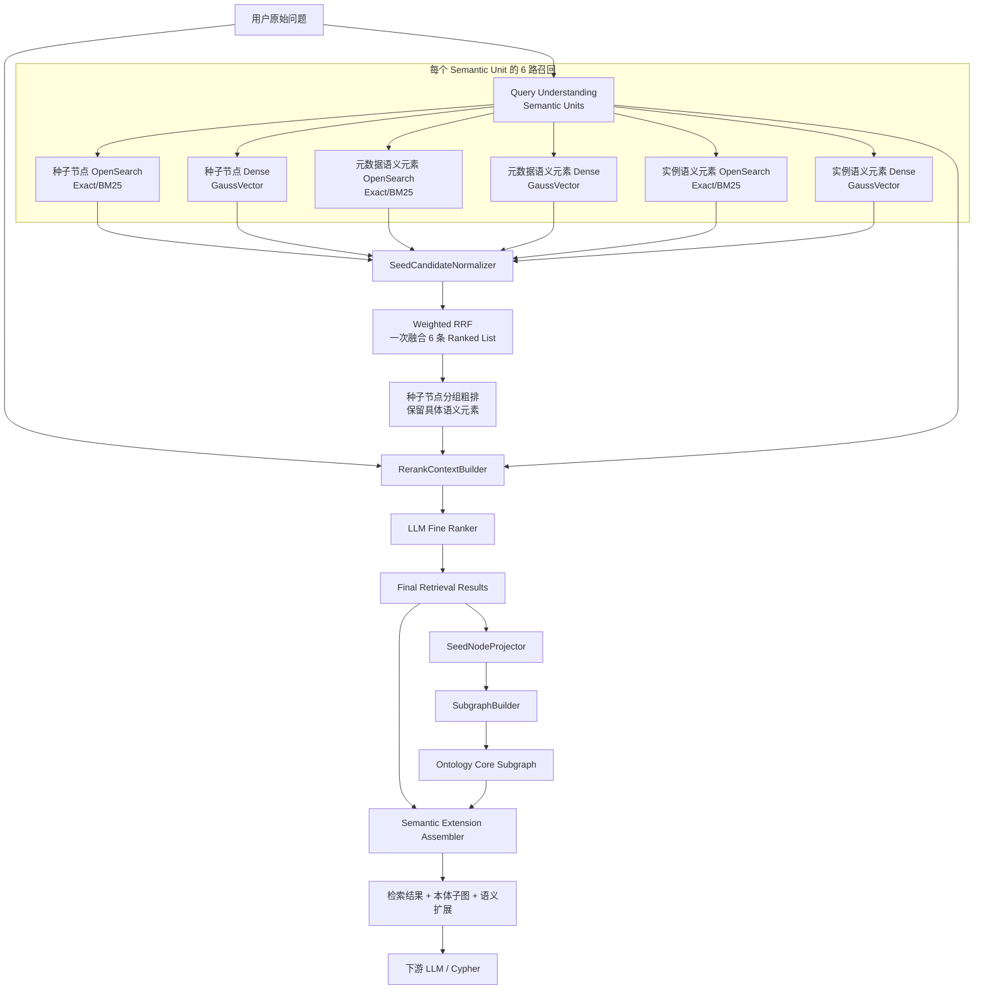
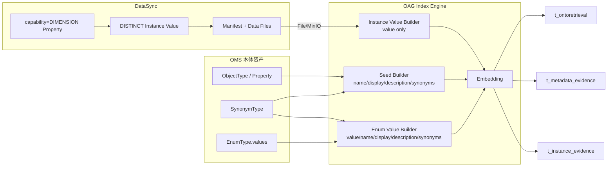
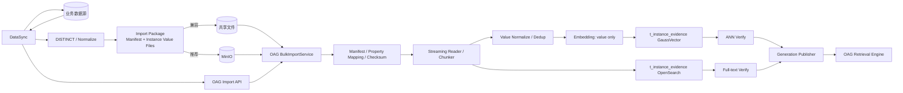
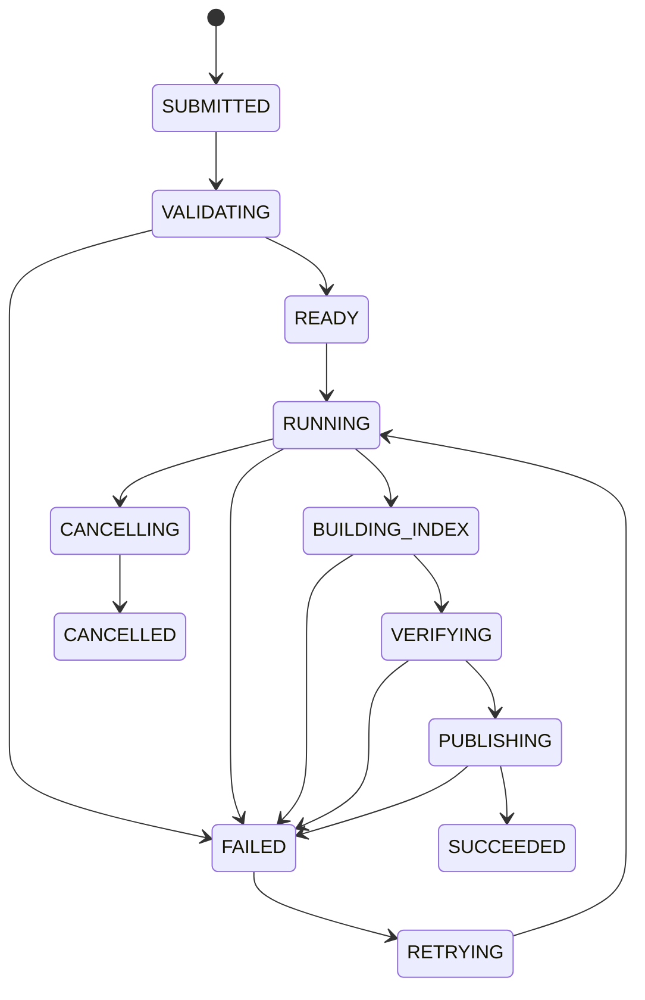
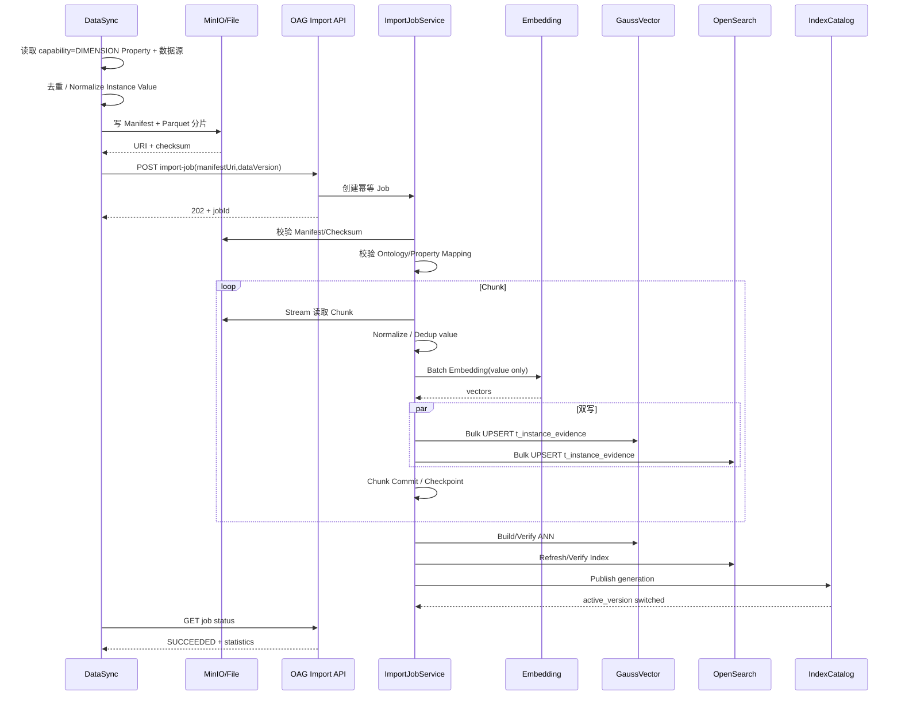
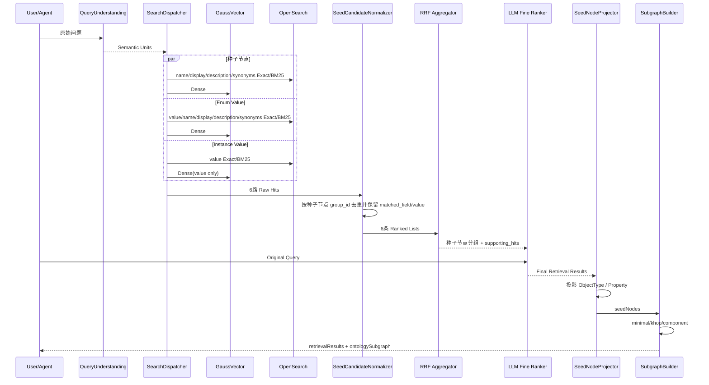

# OAG 面向本体种子节点的语义检索、混合排序与本体子图构建设计方案

> 版本：V5.7  
> 目标：在不丢失既有 Bulk Import、混合召回、RRF、LLM 精排和子图算法设计的基础上，进一步对齐 OAG 现有字段语义：种子节点继续使用 `id`，枚举值/实例值使用 `propertyid + objectTypeId` 显式表达归属；实例列值以 Property 的 `"capability":"DIMENSION"` 作为索引准入标识，并保证向量库中的实例值记录唯一。  
> 核心决策：**ObjectType/Property = 种子节点；种子节点使用 `id`；Enum/Instance 使用 `propertyid + objectTypeId` 表达所属 Property/ObjectType；Synonym 是种子节点或枚举值的结构化字段；Instance Value 按唯一值入库；每个 Semantic Unit 默认 6 路一次 Weighted RRF。**

---

## 文档结构

1. 设计目标、术语与总体架构  
2. 数据模型与索引结构  
3. 索引构建与 DataSync Bulk Import  
4. Query Understanding 与 6 路召回  
5. LLM 精排与最终检索结果  
6. 种子节点投影与本体子图构建  
7. 性能、配置、可观测性、评测与迁移  

> 本次章节整理将原 V5.3 的 116 个一级章节完整归并到以上 7 个主章节；已有 Bulk Import、三类子图算法、GraphTopologyCache、性能/评测/灰度等信息均保留，只做术语、字段和执行顺序上的收敛。

---

# 1. 设计目标、术语与总体架构


## 1.1 设计目标与边界

OAG 同时承担索引构建、语义检索和本体子图构建三类能力。V5.6 进一步收敛检索数据模型，只保留三个业务层次：

```text
种子节点（Seed Node）
  = ObjectType / Property

元数据元素（Metadata Element）
  = Enum Value

实例元素（Instance Element）
  = 真实 Instance Value
```

同义词统一使用 **Synonym** 概念，并且不再建成独立 `OBJECT_ALIAS / PROPERTY_ALIAS / ENUM_ALIAS / INSTANCE_ALIAS` 物理记录：

```text
ObjectType / Property Synonym
  → 存在种子节点记录的 synonyms 字段

Enum Value Synonym
  → 存在 Enum Value 记录的 synonyms 字段

Instance Value
  → 不定义 INSTANCE_ALIAS，只索引真实 value
```

因此需要区分：

```text
最终检索命中（Matched Value）
        ≠
物理索引记录身份（Record ID）
        ≠
图算法输入（Seed Node）
```

最终检索可以命中：

```text
ObjectType / Property 的 name、display、description、synonyms
Enum Value 的 value、name、display、description、synonyms
Instance Value 的 value
```

如果命中的是 synonyms 中的某个词，OAG 必须保留：

```text
matched_field
matched_value
```

命中 Synonym 时不创建新的同义词记录：ObjectType/Property 仍返回种子节点 `id`；Enum Value 使用 `propertyid + objectTypeId + value` 表达记录身份。

例如：

```text
用户：色泽
   ↓
命中：Color 相关 synonyms.zh = 色泽
   ↓
record identity = 种子节点 id，或 Enum 的 propertyid + objectTypeId + value
matched_field = synonyms.zh
matched_value = 色泽
```

对于 Enum Value，还必须同时保留真实业务 `value`；对于 Property/Enum/Instance 场景，还要补齐 Property + ObjectType 上下文，供后续子图构建和 Cypher 生成使用。

本方案只排除以下内容作为业务检索结果：

```text
底层 Vector 文档物理身份
OpenSearch 内部 _id
ANN distance / BM25 _score / RRF score 本身
```

这些只属于检索实现和排序证据。


## 1.2 端到端总体架构



运行阶段统一为：

```text
阶段0：索引构建 / Bulk Import
阶段1：Query Understanding / Semantic Units
阶段2：6 路召回
阶段3：一次 Weighted RRF 粗排
阶段4：LLM 精排
阶段5：检索结果 → 种子节点投影
阶段6：minimal / khop / component 子图构建
阶段7：语义扩展与 Cypher 上下文组装
```

核心边界：

> **检索层返回“命中的对象本身”，图算法只消费 ObjectType / Property 种子节点。**


## 1.3 与现有 OAG 代码的兼容基线

当前代码已经形成以下主链路：

```text
graphSearchV3()
  └─ performGraphSearchOptimized()
       ├─ interpretQueryIntent()
       ├─ getSeedIds()
       │    ├─ vectorService.searchOntologyByQuery()
       │    ├─ elasticSearchRestRepository.searchOntologyByQuery()
       │    └─ hybridRecallHelper.hybridRecall()
       ├─ loadAllEdges()
       └─ subgraphQuery()
            ├─ getPathInfos()
            │    ├─ computePairwiseShortestPaths()
            │    └─ computePairwiseNumPaths()
            │          └─ findAllPath()
            └─ buildMstSubgraph() / buildAllSubgraph()
```

现有请求参数主要包括：

```text
graphExpansionStrategy = minimal
hopLimit = 3
seedRetrievalMode = vector
topK = 3
includeFunctions = 0
includeActions = 0
```

V5.7 不要求一次性替换现有链路，而是在现有类和接口上渐进演进：

```text
现有 getSeedIds()
    ↓
SearchDispatcher
    ↓
SemanticCandidateNormalizer
    ↓
Weighted RRF 种子节点分组
    ↓
LLM Fine Ranker
    ↓
Final Semantic Matches
    ├─ ObjectType / Property（name/display/description/synonyms 命中）
    ├─ Enum Value（value/name/display/description/synonyms 命中）
    └─ Instance Value（value 命中）
    ↓
SeedNodeProjector
    ↓
最终图构建种子节点
```

现有 `seedIds` / `seedNodes` 仍然可以作为**图构建种子节点兼容字段**保留，但不能再代表完整检索结果；完整检索结果由新增的 `retrievalResults` 表达。

现有 `subgraphQuery()`：

```text
保留 external strategy 名称
    ↓
minimal / khop / component
    ↓
内部支持 legacy / enhanced 两套算法
```

因此本次调整不改变三种图算法的边界，只改变“检索输出是什么”以及“何时投影成 种子节点”。

---


## 1.4 核心设计原则

### 设计原则 1：三张表分别表达三类稳定实体

```text
t_ontoretrieval_{ontology_id}
  → ObjectType / Property

t_metadata_evidence_{ontology_id}
  → Enum Value

t_instance_evidence_{ontology_id}
  → Instance Value
```

Synonym 只是所属实体的一个可检索字段，不再单独占一行。

### 设计原则 2：种子节点与值索引使用清晰的归属字段

```text
种子节点：id = ObjectType / Property 本体 ID
枚举值：propertyid = 所属 Property.id，objectTypeId = 所属 ObjectType.id
实例值：propertyid = 所属 Property.id，objectTypeId = 所属 ObjectType.id
```

Enum/Instance 不再使用含义模糊的通用 ID 字段表达归属；具体命中的业务值由 `value` 保留。

### 设计原则 3：Matched Value 必须保留

无论命中：

```text
name
display
description
synonyms
value
```

都必须在 SearchHit / RetrievalResult 中保留 `matched_field + matched_value`。特别是 synonym 命中不能只剩所属种子节点或枚举值。

### 设计原则 4：RRF 按种子节点分组，组内保留具体命中

RRF 公平性单位仍然是种子节点：

```text
种子节点 hit：group_id = hit.id
Enum Value / Instance Value hit：group_id = hit.propertyid
```

这样一个 Property 即使有大量枚举值、实例值或同义词，也不会因为记录/字段数量多而重复加分。

### 设计原则 5：Core Graph 与检索字段分离

```text
图算法：ObjectType / Property / Relation
检索字段：name / display / description / synonyms / enum value / instance value
```

Enum/Instance 和 synonym 都可以帮助形成最终语义结果，但不直接成为最短路径、K-hop、Connected Component 的拓扑节点。

### 设计原则 6：召回保 Recall，RRF 保公平，LLM 保 Precision，Graph 保最小充分

```text
多路召回：宁可多召回
RRF：稳定融合不同引擎排序
LLM：结合原始问题、matched_value 和上下文做语义裁决
Graph：只返回支持推理/Cypher 的必要拓扑
```

# 2. 数据模型与索引结构


## 2.1 数据模型：种子节点、枚举值、实例值与 Synonym

V5.7 的物理索引模型只保留三类记录：

| 类型 | 物理实体 | Synonym 处理 | 归属字段 |
|---|---|---|---|
| 种子节点 | ObjectType / Property | 内嵌 `synonyms` | 种子节点自身使用 `id`；Property→ObjectType 走拓扑 |
| 元数据元素 | Enum Value | 内嵌 `synonyms` | `propertyid + objectTypeId` |
| 实例元素 | Instance Value | 不建立实例同义词记录 | `propertyid + objectTypeId` |

同义词统一来源于 `synonym-type` 资产，结构固定使用：

```json
{
  "id": "term-color-synonyms",
  "name": "color-synonyms",
  "display": {
    "zh": "颜色近义词",
    "en": "Color Synonyms"
  },
  "description": {
    "zh": "颜色相关术语的近义词定义",
    "en": "Synonyms for color-related terms"
  },
  "synonyms": {
    "zh": ["颜色", "色彩", "色泽", "色"],
    "en": ["Color", "Colour", "Hue", "Tint"]
  },
  "status": "ACTIVE"
}
```

约束：

```text
synonyms 最多包含 3 种语言
3 种语言不固定
每种语言下面可以有多个同义词
语言使用 BCP 47 风格，如 zh/en/es/es-MX/pt-BR
```

对象、属性或枚举值通过 `refSynonymTypeId`（或 OMS 中等价的现有引用关系）关联 SynonymType。OAG 建索引时解析引用，并把最终同义词内容写入索引记录的 `synonyms` 字段。

SynonymType 自身不建立独立向量记录；其 `name / description / synonyms` 作为所属业务实体向量化内容的一部分。


## 2.2 三类物理索引与统一命名

三张 GaussVector 表和对应 OpenSearch Index 统一命名：

| 逻辑类型 | 物理表 / Index | Owner | 数据 |
|---|---|---|---|
| 种子节点 | `t_ontoretrieval_{ontology_id}` | OAG | ObjectType / Property |
| 元数据元素 | `t_metadata_evidence_{ontology_id}` | OAG | Enum Value + Synonyms |
| 实例元素 | `t_instance_evidence_{ontology_id}` | OAG，DataSync 提供数据 | Instance Value |

旧名称：

```text
{ontology_id}_anchor
{ontology_id}_metadata_evidence
{ontology_id}_instance_evidence
```

仅作为历史迁移来源，不再作为目标设计名称。

三类数据继续物理隔离，原因不变：

```text
规模差异
更新频率差异
ANN 算法差异
数据 Owner 差异
检索 TopK / 阈值差异
```


## 2.3 `t_ontoretrieval_{ontology_id}` GaussVector 表结构

种子节点表增加两个额外语言槽位，并增加 `synonyms`。中文和英文仍保留固定列，另外最多支持 2 种语言：

| 字段 | 类型 | 非空 | 说明 |
|---|---|---|---|
| `vector` | `DOUBLE[]` | ✔ | 1024 维向量 |
| `type` | `INT` | ✔ | 0 ObjectType，1 Property |
| `id` | `VARCHAR(256 CHAR)` | ✔ | ObjectType / Property 全局唯一 ID |
| `name` | `VARCHAR(256 CHAR)` | ✔ | 本体真实名称 |
| `display_zh` | `VARCHAR(512 CHAR)` |  | 中文显示名 |
| `display_en` | `VARCHAR(512 CHAR)` |  | 英文显示名 |
| `display_lang_1` | `VARCHAR(512 CHAR)` |  | 第 1 个额外语言显示名 |
| `display_lang_2` | `VARCHAR(512 CHAR)` |  | 第 2 个额外语言显示名 |
| `description_zh` | `VARCHAR(1024 CHAR)` |  | 中文描述 |
| `description_en` | `VARCHAR(1024 CHAR)` |  | 英文描述 |
| `description_lang_1` | `VARCHAR(1024 CHAR)` |  | 第 1 个额外语言描述 |
| `description_lang_2` | `VARCHAR(1024 CHAR)` |  | 第 2 个额外语言描述 |
| `synonyms` | `TEXT` |  | JSON 序列化的多语言同义词 Map，最多 3 种语言 |

`lang_1/lang_2` 的具体语言不在每行重复存储，而由 ontology/index 级配置绑定，例如：

```yaml
additionalLanguages:
  lang_1: es
  lang_2: pt-BR
```

因此同一 ontology 内所有记录的 `display_lang_1/description_lang_1` 都表示同一语言。

`synonyms` 示例：

```json
{
  "zh": ["小区", "无线小区"],
  "en": ["Cell", "Radio Cell"],
  "es": ["Celda", "Celda de radio"]
}
```

注意：额外 display/description 最多 2 种语言；`synonyms` 最多 3 种语言，且语言组合不固定，两者是两个独立约束。

Property → ObjectType 映射继续由 `has_property` 与 `GraphTopologyCache` 提供；种子节点表不额外保存 ObjectType 归属字段。

明确不保留：

```text
normalized_name
content_hash
model_version
source_version
updated_at
i18n_content
content
```


## 2.4 种子节点向量化内容

OAG 在内存中解析 ObjectType / Property 及其 SynonymType，按以下顺序构建 Embedding 文本：

```text
{name}
{display_zh}
{display_en}
{display_lang_1}
{display_lang_2}
{description_zh}
{description_en}
{description_lang_1}
{description_lang_2}
{synonyms_value}
{synonyms_description}
```

其中：

```text
synonyms_value
  = synonyms 中最多 3 种语言的所有同义词按稳定顺序展开

synonyms_description
  = 被引用 SynonymType 的 name + description（按存在语言展开）
```

因此 SynonymType 的：

```text
name
description
synonyms
```

全部参与向量化，但不额外建立 Synonym 向量记录。

空字段直接跳过，不写占位字符串。不要把 ObjectType 名称额外强制拼到 Property 向量开头；Property 自身语义、display、description、synonyms 已足够作为主表达。

当前 BGE-M3 向量维度继续沿用 1024。Embedding 批大小和重试次数属于 OAG 工程配置，不进入表 Schema。


## 2.5 多语言槽位与 Synonym 语言规则

### 2.5.1 Display / Description 最多 4 种语言

```text
固定语言：zh + en
额外语言：lang_1 + lang_2
总计最多 4 种
```

例如：

```yaml
additionalLanguages:
  lang_1: es
  lang_2: pt-BR
```

则：

```text
display_lang_1 = 西语 display
description_lang_1 = 西语 description
display_lang_2 = 葡萄牙语 display
description_lang_2 = 葡萄牙语 description
```

没有配置某个额外语言时，对应列为空。

### 2.5.2 Synonyms 最多 3 种语言且不固定

`synonyms` 使用语言 Map，不绑定固定 zh/en：

```json
{
  "en": ["Color", "Colour"],
  "es": ["Color", "Tono"],
  "pt-BR": ["Cor", "Tonalidade"]
}
```

最多 3 个 language key。这样可以支持：

```text
zh + en + es
en + es + pt-BR
zh + ar + fr
...
```

### 2.5.3 Dense 与 Lexical 的语言处理

Dense 使用完整拼接文本生成一个多语言 Vector，不按语言复制多条记录。

OpenSearch 根据 ontology 级 `lang_1/lang_2` 配置为对应 display/description 字段选择 Analyzer；`synonyms` 则按其语言 key 选择对应 Analyzer 或通用 Analyzer。

查询 `language_hint` 用于 Analyzer、Boost、展示和观测，不作为 Dense 硬过滤条件。

### 2.5.4 Shadow Vector

若某个额外语言真实 Recall 明显不足，可以实验性增加语言 Shadow Vector，但必须：

```text
最终按同一个业务 id 去重
不让语言副本重复进入 RRF
不改变 API 主记录结构
```

Shadow Vector 不是默认方案。


## 2.6 Property Vector 是否带 ObjectType

Property Dense 向量默认不增加 ObjectType 名称前缀。原因：

1. 用户经常只表达属性概念；
2. ObjectType 前缀可能改变语义重心；
3. 同名 Property 的消歧由原始问题、其他 Semantic Units、LLM 精排和图关系完成；
4. Property → ObjectType 由拓扑缓存确定，不依赖向量文本恢复。

如果评测显示同名 Property 冲突严重，可以启用内部 Shadow Vector，但最终仍回到同一 Property `id`。


## 2.7 `t_ontoretrieval_{ontology_id}` OpenSearch Index

OpenSearch 与 GaussVector 共享同一业务字段语义：

```text
type
id
name
display_zh
display_en
display_lang_1
display_lang_2
description_zh
description_en
description_lang_1
description_lang_2
synonyms
```

推荐映射：

| 字段 | OpenSearch 类型 | 说明 |
|---|---|---|
| `type` | `integer` | 0 ObjectType / 1 Property |
| `id` | `keyword` | 本体 ID |
| `name` | `keyword` + `text` | Exact / BM25 |
| `display_*` | `keyword` + `text` | 多语言显示名 |
| `description_*` | `text` | 多语言描述 |
| `synonyms` | `object` | language → synonym string array，最多 3 种语言 |

对 `synonyms.*` 使用 dynamic template 或索引构建时确定的语言映射，使数组内容既可 Exact 也可 BM25。

检索优先级：

```text
id/name/display exact
> synonyms exact
> name/display/synonyms phrase/BM25
> description BM25
```

不再使用扁平 `i18n_content`。


## 2.8 `t_metadata_evidence_{ontology_id}`：Enum Value 模型与表结构

Metadata Evidence 只承载枚举值，不再为枚举同义词建立独立 `ENUM_ALIAS` 行。

### 2.8.1 EnumType 源结构

```json
{
  "id": "ei.veh12.enum.Col35.1",
  "name": "Color",
  "display": {
    "en": "Color",
    "zh": "颜色"
  },
  "description": {
    "en": "Vehicle body color enumeration",
    "zh": "车身颜色枚举"
  },
  "status": "ACTIVE",
  "creatorByOntology": "vehicle",
  "valueType": "string",
  "refSynonymTypeId": "term-color-synonyms",
  "values": [
    {
      "id": "ei.veh12.enum.Col35.val.red8.1",
      "name": "red",
      "display": {
        "en": "Red",
        "zh": "红色"
      },
      "description": {
        "en": "Red color",
        "zh": "红色"
      },
      "value": "red",
      "order": 1,
      "refSynonymTypeId": "term-color-red-synonyms"
    },
    {
      "id": "ei.veh12.enum.Col35.val.blue9.1",
      "name": "blue",
      "display": {
        "en": "Blue",
        "zh": "蓝色"
      },
      "description": {
        "en": "Blue color",
        "zh": "蓝色"
      },
      "value": "blue",
      "order": 2,
      "refSynonymTypeId": "term-color-blue-synonyms"
    }
  ],
  "extensions": {}
}
```

真正进入 `t_metadata_evidence_{ontology_id}` 的粒度是 `values[]` 中的每个枚举值。

### 2.8.2 SynonymType 源结构

```json
{
  "id": "term-color-synonyms",
  "name": "color-synonyms",
  "display": {
    "zh": "颜色近义词",
    "en": "Color Synonyms"
  },
  "description": {
    "zh": "颜色相关术语的近义词定义",
    "en": "Synonyms for color-related terms"
  },
  "synonyms": {
    "zh": ["颜色", "色彩", "色泽", "色"],
    "en": ["Color", "Colour", "Hue", "Tint"]
  },
  "status": "ACTIVE"
}
```

`synonyms` 最多 3 种语言，语言不固定。

### 2.8.3 Property 引用 Enum

```json
{
  "id": "prop:ont:vehicle:sp:bodyColor",
  "name": "bodyColor",
  "display": {
    "en": "Body Color",
    "zh": "车身颜色"
  },
  "description": {
    "en": "Vehicle body color",
    "zh": "车身颜色"
  },
  "dataType": "enum",
  "valueType": "string",
  "referenceEnumName": "Color",
  "referenceEnumId": "ei.vehicle.enum.Color.1",
  "extensions": {}
}
```

OAG 按：

```text
Property.referenceEnumId
  → EnumType.values[]
  → EnumValue.refSynonymTypeId
  → SynonymType.synonyms
```

展开索引。

### 2.8.4 GaussVector 表结构

```text
t_metadata_evidence_{ontology_id}
```

| 字段 | 类型 | 非空 | 说明 |
|---|---|---|---|
| `vector` | `DOUBLE[]` | ✔ | Enum Value 向量 |
| `type` | `INT` | ✔ | 固定表示 ENUM_VALUE |
| `propertyid` | `VARCHAR(256 CHAR)` | ✔ | 引用该 Enum 的 Property.id |
| `objectTypeId` | `VARCHAR(256 CHAR)` | ✔ | 该 Property 所属 ObjectType.id |
| `value` | `VARCHAR(4096 CHAR)` | ✔ | 真实枚举值 |
| `name` | `VARCHAR(4096 CHAR)` | ✔ | `values[].name` |
| `display_zh` | `VARCHAR(512 CHAR)` |  | 中文 display |
| `display_en` | `VARCHAR(512 CHAR)` |  | 英文 display |
| `display_lang_1` | `VARCHAR(512 CHAR)` |  | 额外语言 1 display |
| `display_lang_2` | `VARCHAR(512 CHAR)` |  | 额外语言 2 display |
| `description_zh` | `TEXT` |  | 中文 description |
| `description_en` | `TEXT` |  | 英文 description |
| `description_lang_1` | `TEXT` |  | 额外语言 1 description |
| `description_lang_2` | `TEXT` |  | 额外语言 2 description |
| `synonyms` | `TEXT` |  | 当前 Enum Value 的 SynonymType.synonyms，最多 3 种语言 |

如果一个 EnumType 被多个 Property 复用，需要按 Property 归属分别建立记录。向量库中同一个枚举值记录使用以下业务唯一组合保证不重复：

```text
propertyid + objectTypeId + value
```

`values[].id` 仍属于 OMS 枚举源数据标识，但不作为 `t_metadata_evidence_{ontology_id}` 的持久化字段。


## 2.9 Enum Value 向量化规则

每个 `values[]` 元素按以下内容生成一个向量：

```text
{value}
{name}
{display_zh}
{display_en}
{display_lang_1}
{display_lang_2}
{description_zh}
{description_en}
{description_lang_1}
{description_lang_2}
{synonyms_value}
{synonyms_description}
```

> 用户给出的模板最后两行 description 都写成了 `description_lang_1`；按两个额外语言槽位的对称设计，V5.7 将最后一个修正为 `description_lang_2`。

其中：

```text
synonyms_value
  = 当前 Enum Value.refSynonymTypeId 对应 synonyms 中最多 3 种语言的所有同义词

synonyms_description
  = 对应 SynonymType 的 name + description（按存在语言展开）
```

向量顺序坚持：

```text
Value First
→ Name / Display
→ Description
→ Synonyms
```

不在开头追加 ObjectType / Property 文本；`propertyid + objectTypeId` 已提供确定性归属。


## 2.10 `t_instance_evidence_{ontology_id}` 实例列值表结构

实例索引只保存去重后的真实列值。

```text
t_instance_evidence_{ontology_id}
```

| 字段 | 类型 | 非空 | 说明 |
|---|---|---|---|
| `vector` | `DOUBLE[]` | ✔ | Instance Value 向量 |
| `type` | `INT` | ✔ | 固定表示 INSTANCE_VALUE |
| `propertyid` | `VARCHAR(256 CHAR)` | ✔ | 所属 Property.id |
| `objectTypeId` | `VARCHAR(256 CHAR)` | ✔ | 所属 ObjectType.id |
| `value` | `VARCHAR(4096 CHAR)` | ✔ | 真实去重列值 |
| `language` | `VARCHAR(32 CHAR)` |  | 可选语言标识；未知为 und |


## 2.11 Instance Value 向量准入规则

Property 中 `"capability":"DIMENSION"` 是实例列值进入向量索引的必要标识，但仍需结合数据类型和数据形态做准入判断：

```text
instance_index_enabled =
  property.capability == "DIMENSION"
  AND datatype_eligible
  AND value_shape_eligible
  AND cardinality_eligible
```

向量库必须保证实例值记录不重复。DataSync 输出前按列值去重，OAG 入库前再次按 `propertyid + objectTypeId + normalized(value)` 去重并执行幂等 UPSERT；同一组合在 GaussVector 和 OpenSearch 中只能存在一条记录。例如 5000 万 Subscriber 行的 `subLevel` 只有 VIP/GOLD/SILVER/NORMAL，最终向量库只保留 4 条唯一实例值记录。

默认不向量化：

```text
UUID
手机号
纯技术主键
时间戳
日期
连续数值
高随机编码
```

适合向量化：

```text
产品名称
品牌名称
客户等级
区域名称
业务状态
自然语言标签
人可理解业务分类
```

高基数自由文本进入单独 Document/RAG Index，不进入本体种子节点 Resolver 的 Instance Value Index。


## 2.12 Instance Value 向量化内容

实例列值 Dense 内容严格只使用：

```text
{value}
```


这样 Instance Dense 表达始终由真实业务值主导，Property/ObjectType 归属直接由 `propertyid + objectTypeId` 提供。


## 2.13 Metadata / Instance OpenSearch Index

### `t_metadata_evidence_{ontology_id}`

核心字段与 GaussVector 一致：

```text
type
propertyid
objectTypeId
value
name
display_zh
display_en
display_lang_1
display_lang_2
description_zh
description_en
description_lang_1
description_lang_2
synonyms
```

Exact 优先：

```text
propertyid
objectTypeId
value.keyword
name.keyword
display_*.keyword
synonyms.*.keyword
```

BM25：

```text
name
display_*
description_*
synonyms.*
```

### `t_instance_evidence_{ontology_id}`

只需要：

```text
type          integer
propertyid    keyword
objectTypeId  keyword
value         keyword + text
language   keyword（可选）
```

Exact 主要搜索 `propertyid/objectTypeId/value.keyword`，BM25 搜索 `value`。


## 2.14 规范化规则

规范化属于索引构建/查询处理逻辑，不增加额外持久化字段：

```text
trim
Unicode normalize
casefold（适用语言）
连续空白归一
全半角归一
```

原始 `name/value/display/description/synonyms` 始终保留；OpenSearch 通过 normalizer/analyzer 实现 Exact/BM25 规范化，GaussVector 在 Embedding 前使用相同基础规范化。


## 2.15 language_hint 与语言槽位

查询理解阶段仍可以输出：

```text
language_hint = BCP 47 language tag / mixed / und
```

但物理存储按两种机制处理：

```text
种子节点/Enum Value display、description
  → zh/en 固定 + lang_1/lang_2 两个 ontology 级语言槽位

synonyms
  → language Map，最多 3 种语言，不固定

Instance Value
  → 仅 value；language 为可选观测/Analyzer Hint
```

检索规则：

```text
同语言 Exact/BM25 可以 Boost
跨语言候选不硬过滤
Dense 不按 language_hint 过滤
LLM 精排继续看到原始问题和所有候选
```


## 2.16 数据质量治理

OAG 元数据同步阶段必须检查：

```text
ObjectType / Property id 重复或缺失
name/display/description 格式非法
additionalLanguages 槽位配置不一致
synonyms 语言数 > 3
synonyms 某语言值重复
synonyms 与 canonical name/display 完全重复
同一业务范围内 synonym 映射冲突
Enum Ref 不存在
Enum values[].id/value 重复
Enum Value.refSynonymTypeId 不存在
Property.referenceEnumId 不存在
Parent ObjectType 缺失
```

冲突处理原则：不能静默覆盖，必须可观测；严重结构错误阻断当前记录或当前批次入库。

DataSync 实例值额外检查：

```text
空 value
超长 value
distinct_count
高基数
无意义随机串
非法 UTF-8
```

Instance Evidence 不再检查 Instance Alias，因为 V5.7 不支持 `INSTANCE_ALIAS`。


## 2.17 增量索引与幂等

不同表使用与业务语义一致的幂等键：

```text
t_ontoretrieval_{ontology_id}
  → id

t_metadata_evidence_{ontology_id}
  → propertyid + objectTypeId + value

t_instance_evidence_{ontology_id}
  → propertyid + objectTypeId + normalized(value)
```

同一唯一键 UPSERT 必须覆盖现有记录而不是新增重复数据；DELETE 必须同时删除 GaussVector 与 OpenSearch 对应记录。

不在记录中保留：

```text
content_hash
model_version
source_version
updated_at
```

版本和构建信息统一放到 OAG 的 Import Job / Generation 元数据，不进入每条向量记录。

Embedding 模型升级时：

```text
创建新的 Generation
→ 全量重新 Embedding
→ Verify
→ 原子发布
```

如果未来需要“内容未变化则跳过 Embedding”，可以作为 OAG 内部缓存优化实现，但不扩展业务表 Schema。


## 2.18 GaussVector 索引算法

种子节点 / Metadata 语义元素：

```text
GsIVFFLAT
COSINE
```

适用规模：

```text
约 1*10^4 ～ 2*10^6
```

推荐：

```text
IVF_NLIST = 4 * sqrt(N)
```

其中：

```text
N = 当前物理表实际记录数
```

Instance 语义元素：

```text
中小规模 → GsIVFFLAT
千万 / 亿级 → GsDiskANN
```

Metadata 与 Instance 分表的一个核心原因就是允许 ANN 算法独立演进。

---


# 3. 索引构建与 DataSync Bulk Import


## 3.1 OAG 与 DataSync 职责边界

### OAG

OAG 是统一索引构建和检索引擎，负责：

```text
OMS 元数据读取
ObjectType / Property + synonyms 构建 t_ontoretrieval_{ontology_id}
Enum values[] + synonyms 构建 t_metadata_evidence_{ontology_id}
Instance Value Bulk Import 构建 t_instance_evidence_{ontology_id}
Embedding
GaussVector / OpenSearch 写入
ANN/全文索引构建
Generation 发布
在线检索
```

### DataSync

DataSync 只负责实例列值数据：

```text
读取 `"capability":"DIMENSION"` 的 Property
访问实际数据源
DISTINCT / 基础标准化
输出真实 Instance Value
建立 Value 与 Property 的映射
生成 Manifest + Data Files
通过 File / MinIO 交付 OAG
```

DataSync **不再整理或提交 INSTANCE_ALIAS**。

DataSync 不负责 Embedding、GaussVector/OpenSearch Client、ANN 参数、物理表结构和索引发布。

统一关联：

```text
DataSync Manifest.propertyId
   ↓
OAG 校验 Property
   ↓
Instance propertyid = Property.id
   ↓
Instance objectTypeId = Property 所属 ObjectType.id
```

ObjectType 上下文由 OAG 通过本体拓扑缓存补齐。


## 3.2 完整索引构建流程



三类向量化模板：

```text
Seed：name + 4-language display/description + synonyms
Enum：value + name + 4-language display/description + synonyms
Instance：value only
```


## 3.3 OAG 实例数据 Bulk Import 总体设计

本节定义 OAG 的大规模实例语义元素导入能力。

职责边界：

```text
DataSync
  负责：数据源访问 / DISTINCT / 基础标准化 / 实例值与 Property 映射 / 文件生成

OAG
  负责：导入任务 / Mapping 校验 / 语义元素构造 / Embedding
       / GaussVector / OpenSearch / ANN / Generation 发布 / 在线检索
```

核心原则：

> **DataSync 交付“实例数据 + Property 映射”，OAG 把它转换为实例语义元素索引。**

大数据不通过同步 JSON Body 直接灌入 OAG。生产默认使用 MinIO，兼容 File/Shared Storage；REST API 只负责创建任务、状态查询、重试、取消和错误报告。


## 3.4 Bulk Import 总体架构



控制面、数据面、计算面、存储面、发布面的职责边界保持不变。

---

## 3.5 为什么采用 File / MinIO 中转

不推荐 DataSync 以数百/数千条为批次持续同步 HTTP JSON 调用 OAG。大批量实例值应先形成不可变文件，再由 OAG 异步消费。

原因保持不变：降低 HTTP/序列化开销，隔离 Embedding/存储抖动，支持断点续传、幂等重试、失败现场保留和大规模全量重建。

生产优先 MinIO；共享文件用于单机、边缘、测试或无 MinIO 环境。

---

## 3.6 导入模式

支持：

```text
FULL_REPLACE
INCREMENTAL（UPSERT / DELETE）
```

FULL_REPLACE 使用 staging generation → verify → active generation 原子发布；INCREMENTAL 使用稳定 `id` 幂等修改。

适用范围仍支持 ONTOLOGY / OBJECT_TYPE / PROPERTY_SET / PROPERTY。日常增量场景只处理 Instance Value 的新增、删除或值变化，不再存在“Instance Alias 调整”。

---

## 3.7 Import Package 结构

```text
/oag-import/{ontology_id}/{data_version}/{job_request_id}/
  manifest.json
  property_001/part-00000.parquet
  property_001/part-00001.parquet
  property_002/part-00000.parquet
```

推荐格式：Parquet + Snappy/ZSTD；NDJSON + gzip 作为兼容；CSV 不作为主格式。

一个文件默认只承载一个 Property 的去重后 Instance Value，Property 映射放在 Manifest 中，避免每行重复传输归属信息。

---

## 3.8 Manifest 设计

```json
{
  "schemaVersion": "1.1",
  "ontologyId": "dtmi.ontology.xxx.1",
  "dataVersion": "20260811-001",
  "requestId": "datasync-20260811-000001",
  "sourceSystem": "datasync",
  "importMode": "FULL_REPLACE",
  "scope": "PROPERTY_SET",
  "files": [
    {
      "uri": "minio://oag-import/.../subclass/part-00000.parquet",
      "format": "PARQUET",
      "compression": "SNAPPY",
      "rowCount": 1200000,
      "sha256": "...",
      "mapping": {
        "propertyId": "subClass-property-id",
        "propertyName": "subClass",
        "capability": "DIMENSION",
        "valueColumn": "value",
        "languageColumn": "language",
        "operationColumn": "op"
      }
    }
  ]
}
```

一个文件对应一个 Property 时，`propertyid/objectTypeId` 不在每行重复；OAG 根据 `mapping.propertyId` 写入 `propertyid`，并从本体拓扑解析对应 `objectTypeId`。

---

## 3.9 Data File Record 设计

每行只传真实实例值：

```json
{
  "value": "VIP",
  "language": "und",
  "op": "UPSERT"
}
```

OAG 内部转换：

```text
Manifest.propertyId
+
Record.value/language
   ↓
propertyid = Property.id
objectTypeId = Property 所属 ObjectType.id
   ↓
EmbeddingInput = value
   ↓
t_instance_evidence_{ontology_id}
```

DataSync 不发送 vector、Embedding 模型版本、OpenSearch Document、物理表名或 ANN 参数。

`language` 可选；仅用于 Analyzer/观测，不改变 `{value}` 的 Dense 向量化模板。

---

## 3.10 唯一键与幂等

实例值不再要求 DataSync 提供独立 `id`。OAG 使用以下组合保证唯一性和幂等：

```text
propertyid + objectTypeId + normalized(value)
```

同一个 Job/Chunk 重试时，相同组合键必须 UPSERT 覆盖而不新增重复记录；DELETE 按相同组合键删除。OpenSearch `_id` 或内部存储键可以由该组合稳定生成，但不作为业务字段暴露。


## 3.11 OAG Import API

接口采用异步 Job 模型。

### 创建导入任务

```http
POST /v1/ontologies/{ontologyId}/instance-elements/import-jobs
Content-Type: application/json
```

MinIO 请求：

```json
{
  "requestId": "datasync-20260811-000001",
  "dataVersion": "20260811-001",
  "importMode": "FULL_REPLACE",
  "transport": {
    "type": "MINIO",
    "manifestUri": "minio://oag-import/dtmi.ontology.xxx.1/20260811-001/manifest.json",
    "connectionRef": "oag-shared-minio"
  },
  "validateOnly": false
}
```

返回：

```http
HTTP/1.1 202 Accepted
```

```json
{
  "jobId": "imp-01K2...",
  "requestId": "datasync-20260811-000001",
  "status": "SUBMITTED",
  "ontologyId": "dtmi.ontology.xxx.1",
  "dataVersion": "20260811-001"
}
```

`requestId` 必须幂等：同一个 DataSync requestId 重复提交时返回原 Job，而不是重新执行。

### 查询任务

```http
GET /v1/ontologies/{ontologyId}/instance-elements/import-jobs/{jobId}
```

返回：

```json
{
  "jobId": "imp-01K2...",
  "status": "RUNNING",
  "stage": "EMBEDDING",
  "progress": 0.63,
  "statistics": {
    "fileCount": 32,
    "totalRows": 15000000,
    "parsedRows": 10000000,
    "deduplicatedRows": 9500000,
    "embeddedRows": 9000000,
    "vectorWrittenRows": 8700000,
    "openSearchWrittenRows": 8700000,
    "failedRows": 12
  },
  "startedAt": "...",
  "updatedAt": "..."
}
```

### 重试

```http
POST /v1/ontologies/{ontologyId}/instance-elements/import-jobs/{jobId}:retry
```

仅重跑：

```text
FAILED / RETRYABLE chunks
```

不从文件头全部重来。

### 取消

```http
POST /v1/ontologies/{ontologyId}/instance-elements/import-jobs/{jobId}:cancel
```

取消后：

```text
停止领取新 Chunk
正在执行的 Chunk 完成或超时退出
staging generation 不发布
```

### 错误报告

```http
GET /v1/ontologies/{ontologyId}/instance-elements/import-jobs/{jobId}/errors
```

大错误报告建议返回：

```json
{
  "errorReportUri": "minio://oag-import-errors/.../errors.parquet"
}
```

避免将百万级错误行直接塞进 HTTP Response。

---


## 3.12 File 模式接口

File 模式支持两种部署形态。

### Shared Path

DataSync 与 OAG 能访问同一共享文件系统：

```json
{
  "transport": {
    "type": "FILE",
    "manifestUri": "file:///oag-import/xxx/manifest.json"
  }
}
```

OAG 必须限制允许的根目录：

```text
/oag-import
```

禁止任意文件系统路径访问。

### OAG Staging Upload

无共享盘但文件不太大时，可先上传 OAG staging：

```http
POST /v1/ontologies/{ontologyId}/instance-elements/staging-files
Content-Type: multipart/form-data
```

返回内部：

```text
staging://{uploadId}/manifest.json
```

再使用 Import Job API 创建任务。

对于超大文件仍推荐 DataSync 直接上传 MinIO，避免 OAG API Pod 成为文件转发瓶颈。

---


## 3.13 MinIO 模式设计

推荐生产默认模式：

```text
DataSync → MinIO → OAG
```

关键约束：

1. DataSync 上传完成后才提交 Job；
2. Manifest 和 Data File 在 Job 生命周期中视为 immutable；
3. OAG 校验 `size + ETag/sha256`；
4. 文件变化则拒绝继续断点任务；
5. OAG 使用预配置 `connectionRef` 获取凭据；
6. API 请求中禁止传长期 `accessKey/secretKey`；
7. OAG 流式读取 Object，不要求完整下载到本地；
8. import prefix 配置生命周期，成功后延时清理。

MinIO Object Key 推荐包含：

```text
ontology_id
data_version
request_id
property_id
part_number
```

便于：

```text
问题定位
生命周期清理
权限隔离
任务重跑
```

---


## 3.14 Import Job 状态机



状态含义：

| 状态 | 含义 |
|---|---|
| SUBMITTED | API已接收 |
| VALIDATING | Manifest、文件、本体映射校验 |
| READY | 可以开始消费 |
| RUNNING | Parse/Normalize/Embedding/Bulk Write |
| BUILDING_INDEX | 构建/刷新ANN和全文索引 |
| VERIFYING | 双存储数量/checksum抽检 |
| PUBLISHING | 发布新的 active generation |
| SUCCEEDED | 成功 |
| FAILED | 失败，可判断是否可重试 |
| CANCELLED | 用户取消，未发布 |

---


## 3.15 OAG 内部处理流水线

```text
ImportJobService
   ↓
ManifestValidator
   ↓
OntologyMappingValidator
   ↓
ObjectReader(File/MinIO)
   ↓
ChunkPlanner
   ↓
RecordParser
   ↓
SemanticElementNormalizer
   ↓
Deduplicator(propertyid, objectTypeId, normalized(value))
   ↓
EmbeddingTextBuilder
   ↓
EmbeddingBatcher
   ↓
┌──────────────────────┐
│                      │
GaussVectorBulkWriter  OpenSearchBulkWriter
│                      │
└──────────┬───────────┘
           ↓
ChunkCommitCoordinator
           ↓
IndexBuilder / Verifier
           ↓
GenerationPublisher
```

OAG 实例导入统一使用：

```text
propertyid / objectTypeId / type=INSTANCE_VALUE / value
EmbeddingInput = value
1024维 Embedding
```

DataSync 不复制索引和 Embedding 逻辑。


## 3.16 Chunk 与断点续传

导入不能以整个文件作为一个事务单元。

推荐：

```text
File
  ↓
Chunk
  ↓
Embedding Batch
  ↓
Storage Bulk Batch
```

Parquet：

```text
优先按 row group 切 Chunk
```

NDJSON：

```text
按 byte offset + record boundary 切 Chunk
```

Chunk ID 推荐：

```text
sha256(file_checksum + start_offset/row_group + end_offset)
```

每个 Chunk 持久化：

```text
chunk_id
file_uri
range
input_count
output_count
embedding_count
vector_write_count
os_write_count
retry_count
status
last_error
```

Worker 崩溃后：

```text
重新领取未 COMMITTED Chunk
```

已 COMMITTED Chunk 不重复执行；即使 Chunk 被重复执行，`propertyid + objectTypeId + normalized(value)` 的唯一组合也必须保证幂等。

---


## 3.17 GaussVector 与 OpenSearch 双写一致性

OAG 不是使用分布式事务强行绑定两种存储，而采用：

> **Chunk 级幂等 + 状态协调 + 最终一致 + 发布前校验。**

流程：

```text
Chunk transformed
  ↓
GaussVector UPSERT
  ↓ success
OpenSearch BULK UPSERT
  ↓ success
Chunk = COMMITTED
```

如果：

```text
OpenSearch成功
GaussVector失败
```

Chunk 状态仍为 FAILED/RETRYABLE，重试时按照 `id` 幂等补写 GaussVector。

反之同理。

FULL_REPLACE 在所有 Chunk COMMITTED 前：

```text
禁止将 staging generation 暴露给在线查询
```

只有两边均通过 Verify 后才能 PUBLISH。

---


## 3.18 Full Import 的版本化发布

为了避免：

```text
全量导入一半时在线查询看到新旧混合数据
```

FULL_REPLACE 必须采用 Generation 模型。

逻辑：

```text
ontology_id
  ↓
instance_generation = g123
```

OpenSearch：

```text
建立 versioned physical index
完成后切 OpenSearch Index Alias
```

GaussVector：

如果 GaussVector 底层没有原生逻辑别名能力，OAG 维护：

```text
IndexCatalog:
ontology_id + logical_index
  → active physical table/generation
```

检索永远通过 OAG 的 IndexCatalog 找 active generation，不允许调用方直接绑定物理表名。

发布操作：

```text
DB metadata transaction:
active_generation g122 → g123
```

旧 generation 延迟删除，保留短期 rollback 能力。

---


## 3.19 Incremental Import 一致性

INCREMENTAL 不创建完整新 generation，而对 active generation 做幂等变更。

每个 Record：

```text
UPSERT
DELETE
```

建议 DataSync 提供单调递增：

```text
dataVersion
```

OAG 对同一 Property 记录：

```text
last_applied_data_version
```

拒绝明显过旧的批次覆盖新数据。

对于乱序增量，需使用：

```text
source_update_version / event_time
```

做业务级版本判定。

---


## 3.20 本体映射校验

OAG 收到 Manifest Mapping 后必须验证：

```text
ontologyId 存在
Property ID 存在
Property.capability == "DIMENSION"
Property 未删除/未失效
记录 value 非空且格式合法
```

实例导入协议不再接收 `INSTANCE_ALIAS`，也不接收 `name/canonical_value/synonyms`。

ObjectType 通过本体 `has_property` 关系推导；OAG 在入库时将结果写入 `objectTypeId`，不要求 DataSync 在每条数据中重复传输。

Mapping 错误属于 `JOB_FATAL`，必须在大规模 Embedding 前失败。


## 3.21 行级错误与隔离

### Job Fatal

```text
Manifest 不可解析
Checksum 不一致
Ontology 不存在
Property 映射非法
Embedding 模型不可用
目标索引创建失败
```

### Row Rejectable

```text
空 value
value 超长
非法 UTF-8
不支持的 op
id 格式非法
单条标准化失败
```

Rejectable 行写入 Reject/DLQ File；低于配置 rejectRatio 可 `SUCCEEDED_WITH_WARNINGS`，超过阈值则任务 FAILED。


## 3.22 大数据量性能设计

### DataSync 侧

尽量提前：

```text
DISTINCT
过滤NULL/空串
基础Normalize
按Property分区
生成Parquet
```

避免把5000万业务明细行传给 OAG，再让 OAG 做 DISTINCT。

OAG仍执行轻量二次去重作为防御。

### 文件大小

建议起始值：

```text
单文件 128MB～512MB
```

避免：

```text
数十GB单文件 → 重试粒度过大
数百万小文件 → 对象存储/List开销过大
```

### Pipeline 并发隔离

分别配置：

```text
readerConcurrency
normalizeConcurrency
embeddingConcurrency
vectorWriterConcurrency
openSearchWriterConcurrency
```

中间使用有界 Queue：

```text
Reader快于Embedding
 → Queue满
 → Reader反压
```

禁止无限堆积内存。

### Embedding Batch

建议按模型吞吐评测配置，例如：

```text
64～256 records / batch
```

不是协议固定值。

### OpenSearch Bulk

建议同时以：

```text
doc count
bulk bytes
```

控制，例如起始：

```text
1000～5000 docs
或 5～15MB / bulk
```

FULL_REPLACE 的 staging index 可降低 refresh 频率，批量完成后再恢复并 refresh。

### GaussVector Bulk

优先批量写入，再在 FULL_REPLACE 数据加载完成后统一：

```text
Build/Rebuild ANN Index
```

避免每写一条记录都维护高成本 ANN 结构。

大规模 Instance 语义元素 根据前文规模策略选择：

```text
GsIVFFLAT
或
GsDiskANN
```

---


## 3.23 在线检索与导入资源隔离

OAG 同时承担：

```text
Online Retrieval
Bulk Indexing
```

必须保证：

> **在线查询优先级高于离线导入。**

推荐：

```text
独立线程池
独立连接池
Bulk QPS/并发限额
Embedding worker限额
OpenSearch Bulk限速
GaussVector写入限速
```

系统资源达到阈值时：

```text
暂停领取新的Import Chunk
```

而不是让在线检索 P95/P99 被批量导入拖垮。

同一 ontology：

```text
FULL_REPLACE 默认最多1个运行任务
```

避免两个 Generation 相互竞争。

---


## 3.24 MinIO / File 安全与可靠性边界

虽然本方案重点是性能和可靠性，接口仍需满足基础边界：

```text
connectionRef引用预配置凭据
禁止请求体明文secret
File模式限制根目录
MinIO bucket/prefix白名单
对象checksum校验
文件不可变校验
最大文件/任务配额
Manifest schema校验
```

Import Job 只允许访问：

```text
该任务 Manifest 明确声明的对象
```

不能把 OAG 变成通用 Object Storage Reader。

---


## 3.25 Import Metadata 表

建议 OAG 持久化四类任务元数据。

### import_job

```text
job_id
request_id
ontology_id
data_version
import_mode
scope
transport_type
manifest_uri
status
stage
active_generation_before
staging_generation
statistics
created_at
started_at
finished_at
last_error
```

### import_file

```text
job_id
file_id
uri
checksum
size
row_count
property_id
status
```

### import_chunk

```text
job_id
chunk_id
file_id
range
status
input_count
output_count
vector_write_count
os_write_count
retry_count
last_error
```

### import_generation

```text
ontology_id
generation_id
vector_physical_index
os_physical_index
status
created_by_job
created_at
published_at
```

这些状态是断点续传、重试、审计和版本发布的基础。

---


## 3.26 Import 可观测性

新增 Import 指标：

```text
import_job_count{status}
import_running_jobs
import_files_total
import_bytes_total
import_rows_total
import_rows_per_second
import_parse_latency
import_embedding_latency
import_embedding_batch_size
import_vector_write_latency
import_os_bulk_latency
import_chunk_retry_count
import_rejected_rows
import_checkpoint_lag
import_generation_build_latency
import_publish_latency
```

必须关联：

```text
job_id
ontology_id
data_version
property_id
```

日志中禁止打印完整海量业务值，只记录：

```text
source_key / id / truncated value / error code
```

---


## 3.27 错误码建议

| 错误码 | 含义 | 是否可重试 |
|---|---|---|
| IMPORT_MANIFEST_INVALID | Manifest格式错误 | 否 |
| IMPORT_SOURCE_NOT_FOUND | File/Object不存在 | 是/视情况 |
| IMPORT_SOURCE_CHANGED | ETag/checksum变化 | 否，需重新提交 |
| IMPORT_MAPPING_INVALID | 本体映射非法 | 否 |
| IMPORT_ONTOLOGY_VERSION_CONFLICT | 本体版本冲突 | 否/重新生成包 |
| IMPORT_EMBEDDING_UNAVAILABLE | Embedding不可用 | 是 |
| IMPORT_VECTOR_WRITE_FAILED | GaussVector写失败 | 是 |
| IMPORT_OS_BULK_FAILED | OpenSearch Bulk失败 | 是 |
| IMPORT_INDEX_BUILD_FAILED | ANN/全文索引构建失败 | 是 |
| IMPORT_VERIFY_FAILED | 双存储校验失败 | 是 |
| IMPORT_PUBLISH_FAILED | Generation发布失败 | 是 |
| IMPORT_REJECT_RATIO_EXCEEDED | 行错误比例超阈值 | 否/修数据 |
| IMPORT_CANCELLED | 用户取消 | 否 |

错误响应同时提供：

```text
面向调用方的message
面向开发定位的detail/errorStage/jobId/chunkId
```

---


## 3.28 Import 配置建议

```yaml
oag:
  import:
    enabled: true
    preferredTransport: minio

    job:
      maxRunningPerOntology: 1
      retryCount: 3
      retryBackoffMs: 1000

    file:
      allowedRoots:
        - /oag-import
      targetFileSizeMB: 256

    minio:
      allowedConnectionRefs:
        - oag-shared-minio
      allowedBuckets:
        - oag-import
      streamRead: true

    chunk:
      targetRows: 50000
      checkpointEnabled: true

    pipeline:
      readerConcurrency: 4
      normalizeConcurrency: 4
      embeddingConcurrency: 4
      vectorWriterConcurrency: 2
      openSearchWriterConcurrency: 2
      queueCapacity: 16

    embedding:
      batchSize: 128

    openSearch:
      bulkDocs: 2000
      bulkMaxBytesMB: 10

    reliability:
      verifyChecksum: true
      rejectRatioThreshold: 0.001
      retainFailedPackageDays: 7
      retainOldGenerationHours: 24
```

所有并发和批量数值均为工程起始值，最终通过：

```text
Embedding TPS
GaussVector写吞吐
OpenSearch Bulk吞吐
OAG CPU/内存
在线检索P95/P99
```

联合压测确定。

---


## 3.29 DataSync → OAG 完整时序



---

## 3.30 与索引设计的衔接

```text
种子节点：OMS ObjectType/Property + SynonymType → OAG
元数据元素：OMS EnumType.values[] + SynonymType → OAG
实例元素：DataSync 去重后的 Value → File/MinIO → OAG
```

实例记录固定：

```text
type = INSTANCE_VALUE
propertyid = Property.id
objectTypeId = Property 所属 ObjectType.id
value = 真实列值
EmbeddingInput = value
```

DataSync 不依赖 Embedding SDK、GaussVector Client、OpenSearch Client、具体 Mapping 或 ANN 参数。


## 3.31 导入接口最终设计决策

1. **OAG 是三类索引的统一构建和检索引擎。**
2. **DataSync 只生产真实实例列值，不生产 INSTANCE_ALIAS。**
3. **大数据量采用异步 Import Job + File/MinIO 数据面。**
4. **生产优先 MinIO；File 用于兼容部署。**
5. **Data Package = Manifest + 不可变数据分片。**
6. **Parquet 是大规模场景首选。**
7. **推荐按 Property 分区，Property 映射放 Manifest。**
8. **每条实例记录使用 `propertyid + objectTypeId + value` 表达归属与业务值。**
9. **实例向量化只使用 `{value}`。**
10. **`propertyid + objectTypeId + normalized(value)` 唯一组合保证 Chunk 重试幂等并防止重复数据。**
11. **Parquet RowGroup / NDJSON Offset 作为 Checkpoint。**
12. **GaussVector/OpenSearch 使用 Chunk 级双写协调和最终一致。**
13. **FULL_REPLACE 使用 staging generation 原子发布。**
14. **INCREMENTAL 使用 UPSERT/DELETE + dataVersion。**
15. **在线检索优先于 Bulk Import，必须独立线程池/限流。**
16. **失败行进入 Reject/DLQ，Job Fatal 与 Row Rejectable 分级。**
17. **任务、文件、Chunk、Generation 状态持久化，支持重启续传。**


## 3.32 索引构建职责一句话总结

> **DataSync 负责把底层真实实例列值去重后加工成按 Property 分区的 Import Package；OAG 以异步、可断点、可重试、可版本发布的 Bulk Import Pipeline，补齐 `propertyid + objectTypeId`，以 `{value}` 生成向量，并按 `propertyid + objectTypeId + normalized(value)` 保证 GaussVector/OpenSearch 中记录唯一后发布。**


# 4. Query Understanding 与 6 路召回


## 4.1 Query Understanding：Semantic Phrase Extraction

LLM 应执行：

> **Semantic Phrase Extraction**

而不是按词法逐词拆分。

错误：

```text
FORMAL
用户
Mobile
Number
```

推荐主单元：

```text
FORMAL用户
Mobile Number
```

必要时可同时保留辅助短语：

```text
FORMAL用户
FORMAL
用户
Mobile Number
```

但完整业务短语优先。

---


## 4.2 Query Understanding 推荐结构

兼容现有：

```json
{
  "main_object": "Cell",
  "aggregation": "sum",
  "objectType": ["Type1"],
  "property": ["prop1"],
  "concepts": ["concept1"],
  "essential_ids": ["id1"],
  "slot_top_k_overrides": {
    "slot1": 5
  }
}
```

目标结构：

```json
{
  "main_object_hint": "Cell",
  "aggregation": {
    "operator": "sum",
    "target": null
  },
  "semantic_units": [
    {
      "id": "u1",
      "text": "影响业务的活跃告警",
      "role_hint": "unknown",
      "language_hint": "zh",
      "importance": "required"
    },
    {
      "id": "u2",
      "text": "发生时间",
      "role_hint": "property_or_value",
      "language_hint": "zh",
      "importance": "required"
    }
  ],
  "object_type_hints": ["Cell"],
  "constraints": [],
  "output_intent": "ontology_subgraph"
}
```

`role_hint` 可取：

```text
object
property
value
object_or_property
property_or_value
object_or_property_or_value
unknown
```

只用于 Boost，不关闭其他检索通道。

`language_hint` 支持 BCP 47 风格语言码，例如：

```text
zh / en / es / es-MX / pt-BR / fr / ar / id / mixed / und
```

西语等小语种与中英文一样进入 6 路召回；Dense 不按语言硬过滤，Lexical 根据语言选择 Analyzer 或 Boost。

---


## 4.3 为什么不建议 LLM 直接输出底层 TopK

TopK 属于检索系统策略，应由：

```text
表规模
索引类型
召回评测
延迟预算
查询 Profile
```

控制。

LLM 可以输出：

```text
importance = required / optional
```

系统映射：

```text
required → high_recall profile
optional → normal profile
```

避免让 LLM 直接决定底层性能参数。

---


## 4.4 6 路检索通道

每个 Semantic Unit 同时进入三类数据、两种检索方式，共 **6 条 Ranked List**：

| 数据类型 | OpenSearch | GaussVector |
|---|---|---|
| 种子节点 | Exact/BM25 | Dense |
| 元数据语义元素 | Exact/BM25 | Dense |
| 实例语义元素 | Exact/BM25 | Dense |

即：

```text
1. seed_lexical
2. seed_dense
3. metadata_lexical
4. metadata_dense
5. instance_lexical
6. instance_dense
```

其中 OpenSearch 的 Exact 与 BM25 默认在同一查询中通过字段 Boost / `should` 子句形成一条 lexical 排名列表，例如：

```text
keyword exact（最高 boost）
+ name/display phrase
+ name/display/description BM25
→ 1 条 lexical ranked list
```

这样 Exact 是 lexical 内的强证据，而不是额外引入一层融合。

如果后续工程上将 Exact 和 BM25 拆成两条独立 Ranked List，则总通道数变成：

```text
3 类数据 × Exact/BM25/Dense = 9 路
```

此时仍建议一次性进入 Weighted RRF，而不是先做类内 RRF。


## 4.5 Exact/BM25 与 Dense 阈值关系

Exact/BM25 与 Dense 的分数空间不同：

```text
Exact：确定性字符串命中
BM25：全文相关度
Dense：向量相似度
```

因此：

```text
Dense：ANN TopK → similarityThreshold
Exact/BM25：不使用 Dense similarityThreshold 过滤
```

Exact 命中仍不是绝对最终结果，因为 `name/status/active/1` 等值可能跨对象重复；它应获得较高 RRF 权重并进入 LLM 精排。


## 4.6 topK / similarityThreshold 分表配置

三类物理索引独立配置召回参数：

```yaml
semanticRetrieval:
  defaults:
    topK: 3
    similarityThreshold: 0.6

  seed:
    topK: 10
    similarityThreshold: 0.6

  metadata:
    topK: 10
    similarityThreshold: 0.6

  instance:
    topK: 5
    similarityThreshold: 0.6
```

说明：

- `3 / 0.6` 只作为历史兼容默认值；
- 种子节点优先 Recall；
- Metadata Enum Value 允许多个值或 synonyms 命中同一种子节点；
- 实例数据量最大，TopK 初始更保守；
- 三类 Dense 分数分布不同，阈值必须可独立校准。

配置优先级：

```text
Request Retrieval Profile
>
Table-level Config
>
System Defaults
```


## 4.7 legacy GraphSearchRequest.topK 兼容语义

现有 `GraphSearchRequest.topK=3` 不应被复用于所有内部通道。

建议兼容语义：

```text
legacy topK
→ 最终每个 Semantic Unit 输出数量上限
```

内部召回仍使用：

```text
seed.topK
metadata.topK
instance.topK
```

避免所有通道只取 3 条，导致正确候选在 RRF 之前被裁掉。


## 4.8 seedRetrievalMode 兼容

现有：

```text
vector
```

目标支持：

```text
vector
keyword
hybrid
```

推荐目标模式：

```text
hybrid
```

但为了兼容，接口默认值可暂时维持现有行为，通过配置灰度切换。

语义：

```text
vector → Dense only
keyword → Exact/BM25
hybrid → Exact/BM25/Dense + 语义元素 + RRF
```

---


## 4.9 GaussVector / OpenSearch 返回结构与结果标准化

RRF 前，OAG 将三张表的查询结果统一成 SearchHit，不向上层直接透出 GaussVector SQL 行格式或 OpenSearch 原生 `_source/_score` 包装。

### 种子节点 Dense SearchHit

```json
{
  "id": "dtmi:com:huawei:ict:Cell:1.0",
  "type": "OBJECT_TYPE",
  "name": "Cell",
  "display_zh": "无线小区",
  "display_en": "Cell",
  "display_lang_1": "Celda inalámbrica",
  "display_lang_2": null,
  "description_zh": "通信网络中的小区实体",
  "description_en": "Cell in communication network",
  "description_lang_1": "Entidad de celda en una red de comunicaciones",
  "description_lang_2": null,
  "synonyms": {
    "zh": ["小区"],
    "en": ["Cell", "Radio Cell"],
    "es": ["Celda"]
  },
  "matched_field": "DENSE_VECTOR",
  "matched_value": null,
  "distance": 0.18,
  "score": 0.82,
  "source": "SEED_DENSE"
}
```

### 种子节点 OpenSearch SearchHit

```json
{
  "id": "dtmi:com:huawei:ict:Cell:1.0",
  "type": "OBJECT_TYPE",
  "name": "Cell",
  "matched_field": "synonyms.zh",
  "matched_value": "小区",
  "score": 12.37,
  "match_mode": "EXACT_BM25",
  "source": "SEED_LEXICAL"
}
```

### Metadata Enum Value Dense SearchHit

```json
{
  "propertyid": "prop:ont:vehicle:sp:bodyColor",
  "objectTypeId": "vehicle-object-id",
  "type": "ENUM_VALUE",
  "value": "red",
  "name": "red",
  "display_zh": "红色",
  "display_en": "Red",
  "synonyms": {
    "zh": ["红", "红色"],
    "en": ["Red"],
    "es": ["Rojo"]
  },
  "matched_field": "DENSE_VECTOR",
  "matched_value": null,
  "distance": 0.09,
  "score": 0.91,
  "source": "METADATA_DENSE"
}
```

### Metadata Enum Value OpenSearch SearchHit

```json
{
  "propertyid": "prop:ont:vehicle:sp:bodyColor",
  "objectTypeId": "vehicle-object-id",
  "type": "ENUM_VALUE",
  "value": "red",
  "name": "red",
  "matched_field": "synonyms.es",
  "matched_value": "Rojo",
  "score": 18.42,
  "match_mode": "EXACT_BM25",
  "source": "METADATA_LEXICAL"
}
```

### Instance Value SearchHit

```json
{
  "propertyid": "subClass-property-id",
  "objectTypeId": "subscriber-object-id",
  "type": "INSTANCE_VALUE",
  "value": "VIP",
  "language": "und",
  "matched_field": "value",
  "matched_value": "VIP",
  "score": 0.88,
  "source": "INSTANCE_DENSE"
}
```

统一分组规则：

```text
种子节点 hit：group_id = hit.id
Enum Value hit：group_id = hit.propertyid
Instance Value hit：group_id = hit.propertyid
```

`matched_field/matched_value` 是最终解释“用户到底命中了 name/display/description/synonyms/value 哪一项”的关键字段，不能在 RRF 前丢失。


## 4.10 通道内按种子节点去重并保留具体命中

同一 Property 可能通过多个 Enum Value、Instance Value 或 `synonyms` 字段命中。RRF 前按：

```text
semantic_unit_id + channel + group_id
```

去重，使同一种子节点在单通道只占一个排名位置。

组内保留：

```text
primary_hit
top 3~5 supporting_hits
hit_count
```

每个 supporting hit 都保留 `id/type/value/name/matched_field/matched_value`。


## 4.11 RRF Aggregator：一次 Weighted RRF

默认仍采用一次 Weighted RRF，不做“类内 RRF → 总 RRF”两级融合。

```text
Semantic Unit
  ↓
Seed Lexical
Seed Dense
Metadata Lexical
Metadata Dense
Instance Lexical
Instance Dense
  ↓
每通道按 group_id 去重
  ↓
一次 Weighted RRF
  ↓
种子节点分组粗排 + supporting_hits
```

原因保持不变：两级 RRF 会提前压缩 6 路 rank 信息、增加 TopK 截断风险、让权重解释和排障更复杂。只有离线评测证明一次 Weighted RRF 无法通过权重校准解决数据源噪声差异时，才作为实验 Profile。

公式：

```text
RRF(seed) = Σ weight(channel) / (rrf_k + rank_channel(seed))
```

初始权重：

```yaml
rrf:
  k: 60
  coarseTopKPerSemanticUnit: 20
  maxGlobalCandidates: 50
  channelWeights:
    seedLexical: 1.3
    seedDense: 1.0
    metadataLexical: 1.2
    metadataDense: 1.0
    instanceLexical: 1.0
    instanceDense: 0.8
```

若 Exact 与 BM25 后续拆成独立 Ranked List，则直接扩为 9 路一次融合。


## 4.12 Exact 不是绝对锁定

Exact 是强证据，但 `name/status/active/1/A` 或某个 synonym 仍可能在多个记录中重复。推荐：

```text
Exact/BM25 → 高权重 RRF → LLM 结合原始问题消歧
```

只有全局唯一 `id` 的直接查询才可以绕过语义消歧。


## 4.13 RRF 粗排输出

```json
{
  "semantic_unit_id": "u4",
  "text": "红色车辆",
  "groups": [
    {
      "seedNode": {
        "id": "prop:ont:vehicle:sp:bodyColor",
        "type": "PROPERTY",
        "name": "bodyColor"
      },
      "rrf_score": 0.071,
      "channel_hits": [
        {"channel": "metadataLexical", "rank": 1},
        {"channel": "metadataDense", "rank": 2}
      ],
      "supporting_hits": [
        {
          "propertyid": "prop:ont:vehicle:sp:bodyColor",
          "objectTypeId": "vehicle-object-id",
          "type": "ENUM_VALUE",
          "value": "red",
          "name": "red",
          "matched_field": "synonyms.zh",
          "matched_value": "红色"
        }
      ]
    }
  ]
}
```

LLM 面对的是“种子节点分组 + 具体命中记录/字段”，而不是只看到 Property。


## 4.14 RRF 与 LLM 的分组层级

每个 Semantic Unit 独立执行：

```text
6 路 Raw Hits
  ↓
按 group_id 去重
  ↓
保留 supporting_hits
  ↓
一次 Weighted RRF
  ↓
Top 种子节点分组
```

不要直接按 synonyms 数量计分；Synonym 是记录字段，不形成额外 RRF 行。

推荐裁剪：RRF Top 10~20 分组 / Unit，每组 3~5 supporting hits，全局 30~50 分组，LLM 每个 Unit 选择 0~5 个最终结果。


# 5. LLM 精排与最终检索结果


## 5.1 LLM Fine Ranking 目标

LLM 从 RRF 分组中选择用户真正命中的记录，并判断具体命中字段。

输入：

```text
原始问题
Semantic Units
RRF 种子节点分组
Seed / Enum / Instance 记录
matched_field / matched_value
ObjectType / Property 上下文
轻量一跳 Graph Hint
```

输出类型只需要：

```text
OBJECT_TYPE
PROPERTY
ENUM_VALUE
INSTANCE_VALUE
```

Synonym 不再是独立 `type`。当用户命中 synonym 时，结果仍返回所属记录，同时：

```text
matched_field = synonyms.<language>
matched_value = 实际同义词
```

LLM 不创造新的 `id/propertyid/objectTypeId/value/synonyms`，只能从候选中选择。


## 5.2 为什么精排必须使用原始问题

例如 Semantic Unit=`发生时间` 可能命中多个 Property；只有结合“查询站点上影响业务的活跃告警首次发生时间”才能判断应选择 `firstoccurrence`。因此不能只使用拆词或局部向量相似度。


## 5.3 Rerank Context

```json
{
  "original_query": "查询红色车辆",
  "semantic_units": ["红色"],
  "groups": [
    {
      "seedNode": {
        "id": "prop:ont:vehicle:sp:bodyColor",
        "type": "PROPERTY",
        "name": "bodyColor"
      },
      "objectType": {
        "id": "vehicle-object-id",
        "name": "Vehicle"
      },
      "rrf_score": 0.071,
      "supporting_hits": [
        {
          "propertyid": "prop:ont:vehicle:sp:bodyColor",
          "objectTypeId": "vehicle-object-id",
          "type": "ENUM_VALUE",
          "value": "red",
          "name": "red",
          "matched_field": "synonyms.zh",
          "matched_value": "红色"
        }
      ],
      "graph_hint": {
        "neighbor_object_types": [],
        "relation_names": []
      }
    }
  ]
}
```

Graph Hint 只取一跳或轻量摘要，不在精排前构建完整 K-hop 子图。


## 5.4 LLM 精排 Prompt 约束

```text
Role:
你是 OAG 语义检索精排器。

Rules:
1. 只能选择输入候选中已存在的记录：种子节点按 `id` 识别，Enum/Instance 按 `type + propertyid + objectTypeId + value` 识别。
2. 必须结合原始问题，而不是只看相似度。
3. Enum Value / Instance Value 必须结合 `propertyid + objectTypeId` 判断所属 Property/ObjectType。
4. synonym 命中时保留 matched_field/matched_value，不创建 synonym id。
5. Exact/BM25/Dense/RRF 分数只是证据。
6. 必须考虑不同 Semantic Unit 的上下文一致性。
7. 每个 Unit 可以返回 0/1/N。
8. 无匹配允许 no_match=true。
9. 不创造不存在的 id/propertyid/objectTypeId/value。
10. 仅输出简短 reason，不输出详细思维过程。
11. 严格输出 JSON Schema。
```


## 5.5 精排输出与 0/1/N

```json
{
  "semantic_unit_results": [
    {
      "semantic_unit_id": "u4",
      "selected": [
        {
          "propertyid": "prop:ont:vehicle:sp:bodyColor",
          "objectTypeId": "vehicle-object-id",
          "type": "ENUM_VALUE",
          "value": "red",
          "name": "red",
          "matched_field": "synonyms.zh",
          "matched_value": "红色",
          "rerank_score": 0.97,
          "reason": "与用户的红色车辆条件一致"
        }
      ],
      "no_match": false
    }
  ],
  "unresolved_units": []
}
```

Enum/Instance 的 ObjectType / Property 上下文由 `propertyid + objectTypeId` 直接提供；种子节点 Property 的父 ObjectType 仍可由 GraphTopologyCache 补齐，不要求 LLM 生成。


## 5.6 LLM 精排可靠性与降级

程序校验 JSON Schema、候选身份是否来自 Input Candidate、分数范围、结果去重和数量上限。

```text
LLM Timeout / JSON 错误
→ 重试 1 次
→ 仍失败
→ fallback = RRF group primary_hit
→ rerank_status = DEGRADED
```

合法 `no_match` 不属于异常。


## 5.7 Retrieval Results 与 Semantic Extensions

最终响应继续分三层：

```text
retrievalResults
  = 用户真正命中的 Seed / Enum Value / Instance Value，并保留 matched_field/matched_value

ontologySubgraph
  = 从 retrievalResults 投影种子节点后构建的本体核心图

semanticExtensions
  = 为结果补充的 synonyms / enum domain 等语义上下文
```

Synonym 本身可以成为 `matched_value`，但不作为独立物理记录或独立 `type`。


## 5.8 Enum Retrieval Result 与 Extension 返回模式

如果最终选中 Enum Value，必须返回：

```text
propertyid
objectTypeId
value
name
display/description（按需）
synonyms（按需）
matched_field
matched_value
Property + ObjectType
```

例如用户输入“红色”，可以得到：

```text
propertyid = prop:ont:vehicle:sp:bodyColor
objectTypeId = vehicle-object-id
value = red
matched_field = synonyms.zh
matched_value = 红色
Property = Vehicle.bodyColor
```

`semanticExtensions.enumMode` 仍可控制额外枚举域上下文：`matched_only`（默认）或 `all_values`。这不影响真正命中的 Enum Value 必须出现在 `retrievalResults`。


## 5.9 Instance Retrieval Result 与 Extension 返回模式

Instance 只支持 `INSTANCE_VALUE`。

如果最终选中真实列值，必须出现在 `retrievalResults`。禁止的是“命中 Property 就返回所有实例值”，而不是禁止返回实际命中的值。

```yaml
extension:
  instanceMode: matched_only
  maxInstanceElementsPerProperty: 10
```

实例结果没有 `INSTANCE_ALIAS`，也没有实例 `synonyms`。


## 5.10 retrievalResults 与 seedNodes

### retrievalResults

```json
{
  "semanticUnitId": "u4",
  "text": "红色",
  "results": [
    {
      "propertyid": "prop:ont:vehicle:sp:bodyColor",
      "objectTypeId": "vehicle-object-id",
      "type": "ENUM_VALUE",
      "value": "red",
      "name": "red",
      "matched_field": "synonyms.zh",
      "matched_value": "红色",
      "objectType": {
        "id": "vehicle-object-id",
        "name": "Vehicle"
      },
      "property": {
        "id": "prop:ont:vehicle:sp:bodyColor",
        "name": "bodyColor"
      },
      "source": "METADATA",
      "rrf_score": 0.071,
      "rerank_score": 0.97
    }
  ]
}
```

### seedNodes

由 retrievalResults 投影生成，只用于图构建兼容。Enum Value / Instance Value 直接使用其 `propertyid` 作为 Property 种子节点，并使用 `objectTypeId` 补齐所属 ObjectType。


## 5.11 Final Response 数据结构

```json
{
  "message_type": "message_ontology_subgraph",
  "content": {
    "retrievalResults": [],
    "seedNodes": [],
    "nodes": [],
    "edges": [],
    "semanticExtensions": {},
    "capabilityExtensions": {
      "functions": [],
      "actions": []
    },
    "metadata": {
      "retrievalMode": "hybrid",
      "rerankStatus": "SUCCESS",
      "graphStrategy": "minimal",
      "graphAlgorithm": "metric_closure_mst",
      "connected": true,
      "truncated": false,
      "unresolvedSemanticUnits": [],
      "unconnectedSeedNodeIds": []
    }
  }
}
```

`retrievalResults` 是完整语义结果权威字段；`seedNodes/nodes/edges` 继续兼容图构建。


## 5.12 Cypher 生成最小充分上下文

下游最小上下文：

```text
检索结果：id / type / value / name / matched_field / matched_value / source
种子节点：ObjectType id/name + Property id/name
关系：relation id/name/businessSemanticType/cardinality/linkType/junctionConfig/source-target mapping
```

Enum Value 的 `value` 直接作为真实过滤值，不再需要 `canonical_value` 或 `ENUM_ALIAS` 映射。

例如：

```text
result.type      = ENUM_VALUE
result.value     = red
matched_value    = 红色
Property         = Vehicle.bodyColor
ObjectType       = Vehicle
```

因此 LLM 不需要猜“红色是属性名还是同义词”“真实过滤值是什么”“属于哪个 Property/ObjectType”。


## 5.13 完整检索运行时序




# 6. 种子节点投影与本体子图构建


## 6.1 检索结果 → 种子节点投影

`SeedNodeProjector` 只处理四类最终记录：

| 最终结果类型 | 投影出的种子节点 |
|---|---|
| ObjectType | 当前 `id` |
| Property | 当前 `id` |
| Enum Value | `propertyid` 对应 Property，并携带 `objectTypeId` |
| Instance Value | `propertyid` 对应 Property，并携带 `objectTypeId` |

Synonym 不是独立结果类型：如果用户命中 `synonyms.*`，记录仍按所属 ObjectType/Property/Enum Value 的规则投影。

Property 还需要补齐父 ObjectType：

```text
Property.id
  ↓ GraphTopologyCache.propertyToObject
ObjectType.id
```

形成 `explicit_property_seed_nodes / object_terminals / mandatory_has_property_edges`。检索结果本身仍保留在 `retrievalResults`，不会因为投影丢失 `matched_field/matched_value`。


## 6.2 Property → ObjectType：Topology Cache 优先

当前种子节点向量表不额外保存 Property→ObjectType 归属字段。

因此 Property → ObjectType 的推荐实现为：

```text
GraphTopologyCache.propertyToObject
```

缓存来源：

```text
本体 has_property 关系
```

流程：

```text
Property 种子节点 id
  ↓
Topology Cache hit?
  ├─ yes → 直接得到 ObjectType id
  └─ no  → 调用现有 addObjectTypeByProperty() GQL 兜底
```

这样既保持种子节点表职责简洁，又避免每次查询都访问图数据库。


## 6.3 当前三种子图策略：接口语义与真实算法

外部策略名：

```text
minimal
khop
component
```

保持不变。

但当前实现事实是：

| Strategy | 当前真实实现 | 不是严格意义上的 |
|---|---|---|
| minimal | Seed 两两最短路径 → 按路径长度排序 → 贪心加入直到连通 | 标准 MST / 最优 Steiner Tree |
| khop | Seed 两两组合 → `FIND ALL PATH ... UPTO k STEPS` | 真正 Multi-Source BFS |
| component | Seed 两两 `FIND ALL PATH ... UPTO 10 STEPS` | 真正无界 Connected Component |

文档和代码必须明确这一点。

---


## 6.4 minimal：当前实现分析

当前流程：

```text
Seeds
 ↓
computePairwiseShortestPaths
 ↓
Pair Paths
 ↓
按 Path Length 排序
 ↓
逐条 collectFromPath
 ↓
DisjointSet 判断所有 Seed 是否连通
 ↓
addMissingEdgesFromObjects
 ↓
removeEdgesWithMismatchedId
```

其优点：

```text
实现简单
可复用现有最短路径能力
输出通常比较紧凑
已有线上代码基础
```

限制：

1. 路径按长度贪心加入，不等价于先构造 Terminal Metric Closure 再做标准 MST；
2. 不保证得到全局最小 Steiner Tree；
3. 多条等长最短路径的业务语义优先级没有充分表达；
4. Seed 数增大后两两最短路径数量 O(S²)；
5. Property Seed 没先折叠 Parent ObjectType 时会增加 Pair 数。

---


## 6.5 minimal：增强方案

建议保留：

```text
minimal.algorithm = legacy_greedy
```

并增加：

```text
minimal.algorithm = metric_closure_mst
```

目标实现：

```text
1. Property → Parent ObjectType
2. 得到 object_terminals
3. 计算 terminal pair shortest path
4. 构造 Metric Closure
5. Metric Closure 上做 MST
6. 将 MST virtual edge 展开回原始 shortest path
7. 合并节点 / 边
8. 加回 Property + has_property
9. 剪除非 种子节点 的无意义叶子
```

这是更规范的：

```text
Shortest Path + MST Steiner Approximation
```

但仍然不是严格 NP-hard Steiner Tree 的最优解，应在文档中称：

```text
Steiner Tree Approximation
```

---


## 6.6 minimal 路径选择增强

当前最短路径主要按 Hop 数。

如果多个等长路径，可按稳定 tie-break：

```text
1. 与 Query / 已命中 relation hint 语义更匹配
2. active relation 优先
3. 中间 ObjectType 更少
4. junction/backing 复杂度更低
5. relationship priority
6. 稳定 ID 排序
```

建议配置：

```yaml
subgraph:
  minimal:
    pathCostMode: hop_count
    tieBreak:
      semanticRelation: true
      preferActive: true
      preferLowerJunctionComplexity: true
```

第一阶段保持 `hop_count` 兼容，后续可灰度 `semantic_weighted`。

---


## 6.7 khop：当前实现分析

当前 `khop` 实际：

```text
getPairs(seedIds)
 ↓
parallelStream
 ↓
每个 src/dst
 ↓
FIND ALL PATH FROM src TO dst OVER * UPTO k STEPS
 ↓
收集所有 PathInfo
```

优点：

```text
能显式获得 Seed 间多条 k-hop 路径
实现基于现有 NebulaGraph GQL
```

核心风险：

1. 不是 Multi-Source BFS；
2. Seed 数为 S 时 Pair 数 O(S²)；
3. `FIND ALL PATH` 的路径数量在稠密图中可能组合爆炸，复杂度不能简单理解成 O(S²×k)；
4. 大量路径在后续又会共享相同节点和边，存在重复 IO / 解析；
5. `parallelStream` 会把路径爆炸转化成更高瞬时 GraphDB 压力；
6. 默认 k=3 通常可控，但仍需要 Path/Node/Time 上限。

---


## 6.8 khop：兼容模式与增强模式

保留：

```text
khop.algorithm = pairwise_all_path
```

作为现有兼容实现。

增加：

```text
khop.algorithm = multi_source_bfs
```

目标行为：

```text
所有 object_terminals 同时入队
visited[node] = min_hop
reachable_from[node] = seed_set
frontier 按层批量扩展
达到 hop_limit 停止
```

目标输出：

```text
node.min_hop
node.reachable_from_seed_ids
edge.discovery_hop
```

优势：

```text
避免 Seed Pair 两两重复
避免枚举所有路径
更适合“邻域扩展”语义
更容易 maxNodes/maxEdges 截断
```

---


## 6.9 Multi-Source BFS 实现建议

若图数据库没有直接满足需求的多源 API，可在 OAG 层做分层 frontier：

```text
frontier[0] = all terminals
for depth = 1..k:
    batch query neighbors(frontier[depth-1])
    remove visited
    add frontier[depth]
    update reached_from
```

关键：

```text
批量查询
visited 去重
edge type filter
active filter
maxNodes/maxEdges
timeout
```

不需要枚举所有简单路径。

---


## 6.10 legacy khop 防爆参数

在完全替换为 Multi-Source BFS 前，现有 `FIND ALL PATH` 模式至少增加：

```yaml
subgraph:
  khop:
    hopLimit: 3
    maxPathsPerPair: 20
    maxTotalPaths: 200
    maxNodes: 100
    maxEdges: 200
    queryTimeoutMs: 2000
    pairConcurrency: 8
```

并记录：

```text
path_truncated
timeout_pairs
total_path_count
```

---


## 6.11 component：当前实现分析

当前代码：

```text
component
 → computePairwiseNumPaths(seedIds, 10)
 → FIND ALL PATH ... UPTO 10 STEPS
```

这是：

> **有界 10-hop 连通近似**

并不是真正的 Graph Connected Component。

风险：

1. 两个节点可能实际同一连通分量，但最短路径 > 10，因此被错误判定不连通；
2. 仍然枚举 `ALL PATH`，大分量中成本高；
3. `10` 是工程上“大值”，不是图论意义的全连通；
4. component 语义和实现语义存在偏差。

---


## 6.12 component：增强为真实 Connected Component

当前 OAG 已有：

```text
loadAllEdges()
DisjointSet
buildDsuFromNodesAndEdges()
```

因此最优增强不是继续扩大：

```text
UPTO 10 → UPTO 20
```

而是：

```text
本体版本加载/变更时
  ↓
加载 active ontology core edges
  ↓
构建 DSU / Connected Component Index
  ↓
component_id[node]
```

请求时：

```text
最终种子节点
  ↓
component_id
  ↓
直接取相关 connected component
```

这样得到真正的 Connected Component 语义。

---


## 6.13 GraphTopologyCache / Component Cache

建议新增：

```text
GraphTopologyCache
```

按：

```text
ontology_id + ontology_version
```

缓存：

```text
adjacency
active_edges
component_id
object_type metadata
property parent mapping
relation metadata
```

优势：

```text
避免每次 loadAllEdges
Component O(1) 判断
支持 Multi-Source BFS
支持本地快速连通性校验
```

本体版本变化后整体失效重建。

---


## 6.14 component API 兼容策略

外部仍使用：

```text
graphExpansionStrategy=component
```

内部配置：

```yaml
component:
  algorithm: dsu_cached
  legacyHopLimit: 10
```

灰度阶段：

```text
shadow execute:
 legacy bounded-component
 enhanced dsu-component

比较:
 connectivity
 nodes
 latency
```

验证后切换默认。

---


## 6.15 三种策略最终定义

| Strategy | 最终推荐算法 | 默认用途 | 输出规模 |
|---|---|---|---|
| `minimal` | Metric Closure + MST Approximation | Cypher / 确定性问数 | 最小 |
| `khop` | Multi-Source BFS | 探索、补桥、邻域 | 中 |
| `component` | DSU / BFS 真连通分量 | 模型诊断、全局探索 | 最大 |

同时保留 legacy implementation 供灰度。

---


## 6.16 auto 策略

推荐：

```text
auto
```

但为了兼容现有 `GraphSearchRequest`，可先作为新值引入。

流程：

```text
最终种子节点
  ↓
minimal
  ↓
全部连通?
  ├─ yes → 返回 minimal
  └─ no
       ↓
     khop multi-source BFS(k=3)
       ↓
     发现合理桥接?
       ├─ yes → 返回 enhanced khop result
       └─ no
            ↓
          connected_groups
          + unresolved seed nodes
```

不默认自动进入完整 component，避免上下文爆炸。

---


## 6.17 子图构建中的种子节点 Terminal

LLM 最终 种子节点 可能包含：

```text
ObjectType
Property
```

构图时：

```text
ObjectType → Terminal
Property → parent ObjectType 作为 Terminal
```

Property 自身作为：

```text
mandatory leaf
```

即：

```text
Parent ObjectType
  └─ has_property
      └─ Property
```

这能减少：

```text
Terminal count
Pairwise shortest path count
路径搜索成本
```

---


## 6.18 本体图中关系的作用

核心本体子图需要保留：

```text
has_property
defines_relation
relation node / metadata
junction mapping
businessSemanticType
cardinality
linkType
```

下游 Cypher 真正的关系连接依据来自本体图，而不是 Vector。

例如：

```text
SITE_TO_ALARM
NE_TO_SITE
NE_TO_2G
```

及其：

```text
junctionConfig
sourceName
targetName
```

必须在最终 Core Graph / Relation Metadata 中保留。

---


## 6.19 Relation 路径选择

当一个 种子节点 Pair 存在多条路径：

```text
A → B
A → C → B
A → D → B
```

不应仅依据向量分数。

推荐 Path Score：

```text
PathCost =
  hop_cost
  + relation_complexity_penalty
  + inactive_penalty
  - semantic_relation_bonus
```

第一版可只做 tie-break，不改变现有 shortest-hop 主语义。

---


## 6.20 includeFunctions / includeActions

现有请求已经支持：

```text
includeFunctions
includeActions
```

V5.6 保留。

推荐处理阶段：

```text
Final Core Subgraph
  ↓
CapabilityExtensionAssembler
  ├─ includeFunctions=1 → 扩展相关 Function
  └─ includeActions=1   → 扩展相关 Action
```

Function/Action 默认不进入 种子节点 RRF 主排序，除非未来明确把它们升级为 种子节点 类型。

最终输出可独立：

```json
{
  "capabilityExtensions": {
    "functions": [],
    "actions": []
  }
}
```

避免 Function/Action 干扰 ObjectType/Property 核心拓扑。

---


## 6.21 GraphTopologyCache

由于当前子图代码存在：

```text
loadAllEdges()
```

建议将静态本体拓扑按版本缓存：

```text
Key = ontology_id + ontology_version
```

Value：

```text
nodesById
edgesById
adjacency
reverseAdjacency
propertyParentMap
componentId
relationMetadata
```

失效条件：

```text
本体版本变化
Relation变更
ObjectType/Property删除
```

收益：

```text
降低重复 loadAllEdges
加速 component
加速 one-hop graph hint
支持 Multi-Source BFS
支持 Rerank Context
```

---


## 6.22 图遍历方向与边类型策略

子图“连通性搜索”和最终 Cypher “关系方向”是两个不同问题，必须分开处理。

推荐建立 **Topology Projection**：

```text
用于连通性/最短路径的投影图
  ├─ ObjectType nodes
  ├─ defines_relation 等允许的对象关系
  └─ 可配置是否按无向方式参与 connectivity

最终输出图
  └─ 始终保留原始 sourceId / targetId / direction / relation metadata
```

Property：

```text
不作为跨对象桥接节点
通过 mandatory has_property 挂载
```

避免出现：

```text
ObjectA → PropertyA → ... → PropertyB → ObjectB
```

这种不符合本体业务关系语义的“属性桥接”。

推荐配置：

```yaml
graph:
  traversal:
    bridgeEdgeTypes:
      - defines_relation
    propertyEdgeType: has_property
    connectivityDirection: configurable
    preserveOriginalDirection: true
```

如果现网当前路径查询严格按有向边运行，灰度初期保持同样语义；只有经过用例验证后才允许使用 undirected connectivity projection。

---


# 7. 性能、配置、可观测性、评测与迁移


## 7.1 性能风险控制

### Retrieval

```text
table-level TopK
similarityThreshold
timeout
并行通道隔离
Instance 语义元素 限流
```

### Candidate Normalize / RRF

```text
channel 内 id Group 去重
maxMatchedItemsPerSeedGroup
coarseTopKPerSemanticUnit
maxGlobalCandidates
```

这里必须同时控制：

```text
种子节点分组 数量
每个 Group 内 Matched Item 数量
```

否则虽然 RRF Group 数量可控，但某个高频 Property 仍可能携带过多 Enum/Instance 语义元素 进入 Prompt。

### LLM

```text
maxCandidateGroupsPerSemanticUnit
maxMatchedItemsPerSeedGroup
maxGlobalCandidates
maxSelectedSemanticMatchesPerUnit
Prompt token budget
retry=1
fallback=RRF primary_hit
```

### Graph

```text
maxObjectTerminals
maxPairShortestPathQueries
maxPathsPerPair
maxTotalPaths
hopLimit
maxNodes
maxEdges
timeout
```

Final Semantic Matches 可以多于最终图构建种子节点数，因为多个值可能映射到同一个 Property。

---


## 7.2 推荐配置

```yaml
oag:
  semanticRetrieval:
    defaults:
      topK: 3
      similarityThreshold: 0.6

    seed:
      topK: 10
      similarityThreshold: 0.6

    metadata:
      topK: 10
      similarityThreshold: 0.6

    instance:
      topK: 5
      similarityThreshold: 0.6

  multilingual:
    enabled: true
    languageTagStandard: BCP47
    includeAllLocalizedTextInSeedEmbedding: true
    denseHardFilterByLanguage: false
    lexicalLanguageBoost: true
    responseFallbackLanguages:
      - en
      - zh
    commonLanguages:
      - zh
      - en
      - es
    smallLanguageFallbackAnalyzer: standard

  rrf:
    k: 60
    coarseTopKPerSemanticUnit: 20
    maxGlobalCandidates: 50
    maxMatchedItemsPerSeedGroup: 5
    channelWeights:
      seedLexical: 1.3
      seedDense: 1.0
      metadataLexical: 1.2
      metadataDense: 1.0
      instanceLexical: 1.0
      instanceDense: 0.8

  rerank:
    enabled: true
    promptName: ontology_semantic_rerank
    temperature: 0.0
    maxCandidatesPerSemanticUnit: 20
    maxGlobalCandidates: 50
    maxSelectedPerSemanticUnit: 5
    maxSelectedSemanticMatchesPerUnit: 5
    retryCount: 1
    fallback: RRF

  graph:
    topologyCache: true

    strategy:
      default: auto

    minimal:
      algorithm: metric_closure_mst
      fallbackAlgorithm: legacy_greedy
      maxPathLength: 6
      pathCostMode: hop_count

    khop:
      algorithm: multi_source_bfs
      fallbackAlgorithm: pairwise_all_path
      hopLimit: 3
      maxPathsPerPair: 20
      maxTotalPaths: 200
      pairConcurrency: 8

    component:
      algorithm: dsu_cached
      legacyHopLimit: 10

    limits:
      maxNodes: 100
      maxEdges: 200
      timeoutMs: 3000
      includeInactive: false

  indexSchema:
    seedTable: t_ontoretrieval_{ontology_id}
    metadataTable: t_metadata_evidence_{ontology_id}
    instanceTable: t_instance_evidence_{ontology_id}
    additionalLanguages:
      lang_1: es
      lang_2: null
    maxSynonymLanguages: 3

  extension:
    includeSynonyms: true
    enumMode: matched_only
    instanceMode: matched_only
    maxInstanceElementsPerProperty: 10

  capabilityExtension:
    includeFunctionsDefault: false
    includeActionsDefault: false
```

所有数值都是起始值，必须通过真实数据评测调整。

---


## 7.3 异常与降级

| 异常 | 降级 |
|---|---|
| 单个检索通道失败 | 其他通道继续 |
| Instance 语义元素 超时 | 不阻塞 种子节点/Metadata |
| RRF 无候选 | unresolved unit |
| LLM 超时/JSON错误 | 重试1次 → RRF fallback |
| LLM 返回不存在 ID | 丢弃并记录 |
| Property→ObjectType 缓存未命中 | 调用现有 `addObjectTypeByProperty()` GQL 兜底 |
| enhanced minimal 失败 | fallback legacy_greedy |
| multi-source BFS 不可用 | fallback pairwise_all_path |
| DSU component cache 不可用 | fallback legacy hop=10 |
| K-hop 路径过多 | 截断，`truncated=true` |
| 最终种子节点 不连通 | 返回 connected_groups |
| Instance Extension 过大 | matched/topN |

---


## 7.4 可观测性

### Retrieval

```text
semantic_unit_count
channel_latency
channel_return_count
threshold_filtered_count
exact_hit_count
semantic_element_hit_count
type_count{type}
```

### Candidate Normalize / RRF

```text
before_dedup_count
after_seed_group_dedup_count
rrf_seed_group_count
matched_items_retained_count
matched_items_truncated_count
channel_contribution
```

### Rerank

```text
candidate_group_count
candidate_item_count
input_tokens
output_tokens
latency
rerank_status
selected_semantic_match_count
selected_type_count{type}
selected_seed_count
no_match_count
```

### Graph Projection

```text
semantic_match_count
graph_seed_count
match_to_seed_projection_count
projection_error_count
```

### Graph

```text
strategy
algorithm
object_terminal_count
pair_count
path_query_count
path_count
node_count
edge_count
connected_groups
unconnected_seed_ids
truncated
graph_cache_hit
```

可观测性必须能回答两个不同问题：

```text
1. 用户最终命中了什么语义项？
2. 这些语义项最终投影成了哪些图构建种子节点？
```

---


## 7.5 评测体系

### Final Semantic Target

```text
SemanticTargetRecall@1/3/10
SemanticTargetPrecision@1/3/10
TargetTypeAccuracy
MatchedValueAccuracy
```

按记录类型分别统计：

```text
ObjectTypeTargetAccuracy
PropertyTargetAccuracy
EnumValueTargetAccuracy
InstanceValueTargetAccuracy
```

Synonym 不再是独立 Target Type，而作为命中字段单独评测：

```text
SeedSynonymHitAccuracy
EnumSynonymHitAccuracy
SynonymMatchedValueAccuracy
SynonymLanguageAccuracy
```

### 种子节点上下文

```text
ObjectSeedRecall@1/3/10
PropertySeedRecall@1/3/10
TargetToObjectTypeAccuracy
TargetToPropertyAccuracy
TargetToSeedContextAccuracy
SeedMRR
SeedNDCG
```

### Enum / Instance / Matched Field

```text
EnumResolveAccuracy
EnumValueToPropertyAccuracy
InstanceValueToPropertyAccuracy
MatchedFieldAccuracy
MatchedValueAccuracy
MatchedItemRetentionRate
```

### 多语言

固定评测：

```text
zh
en
lang_1
lang_2
```

并根据 ontology 语言槽位映射输出实际语言，例如 `lang_1=es`。

指标：

```text
LanguageRecall@K
CrossLanguageRecall
SmallLanguageRecall@K
MixedLanguageRecall
CrossLanguageTargetAccuracy
SynonymLanguageRecall@K
```

`synonyms` 最多 3 种语言且语言不固定，因此必须按实际 language key 分桶统计，不能只看 display/description 的四个语言槽位。

### RRF

```text
RRFSeedGroupRecall@10/20
RRFMRR
ChannelContributionRate
MatchedItemRetentionAfterRRF
SynonymMatchedValueRetentionAfterRRF
```

RRF 不仅看种子节点分组是否召回，还要确认正确的 Enum/Instance 记录以及 synonym `matched_value` 是否保留在 Group 内。

### LLM 精排

```text
SemanticMatchPrecision@K
SemanticMatchRecall@K
TargetTypeAccuracy
MatchedFieldAccuracy
MatchedValueAccuracy
SeedContextAccuracy
WrongMatchDropRate
RequiredSemanticUnitCoverage
NoMatchAccuracy
P50/P95/P99
Tokens
```

### 子图

继续使用既有：Anchor/Seed Connectivity、Subgraph Node/Edge Precision、MinimalSubgraphSize、BridgeNodeCount、KhopExpansionSize、DisconnectedSeedRate、ComponentAccuracy、GraphLatency、PathExplosionRate 等指标。

### Cypher / End-to-End

```text
CypherSeedAccuracy
CypherRelationAccuracy
CypherValueAccuracy
CypherExecutableRate
EndToEndQueryAccuracy
```

对于 Enum Value，`CypherValueAccuracy` 直接校验 `values[].value`；不再依赖 ENUM_ALIAS → canonical_value 二次映射。


## 7.6 子图算法专项对比测试

同一组 Query 同时执行：

```text
minimal legacy_greedy
minimal metric_closure_mst

khop pairwise_all_path
khop multi_source_bfs

component bounded_hop_10
component dsu_cached
```

比较：

```text
节点数
边数
种子节点连通率
是否缺失正确路径
NebulaGraph查询次数
返回Path数量
P95延迟
CPU
内存
结果稳定性
Cypher准确率
```

---


## 7.7 迁移与灰度

### Phase 0：指标基线

记录当前：

```text
vector/es seed recall
minimal/khop/component latency
subgraph size
Cypher accuracy
```

### Phase 1：索引 V2

```text
种子节点
Metadata 语义元素
Instance 语义元素
```

双写，旧检索保持。

### Phase 2：Hybrid + RRF

影子执行：

```text
legacy getSeedIds
vs
hybrid/RRF
```

### Phase 3：LLM Rerank

灰度启用，保留 RRF fallback。

### Phase 4：Graph Enhanced

逐策略灰度：

```text
minimal enhanced
khop enhanced
component enhanced
```

### Phase 5：切换默认

数据证明：

```text
Recall提升
Cypher准确率提升
Latency可控
```

后再切换。

---


## 7.8 代码迁移总体原则

现有图算法实现不推倒重写，迁移重点放在图算法之前：

```text
getSeedIds / hybridRecall
  ↓
6 路 SearchDispatcher + 一次 Weighted RRF
  ↓
SemanticResultRanker
  ↓
SeedNodeProjector
  ↓
现有/增强 SubgraphBuilder
```

现有 Java 类名如果包含历史 `Anchor` 字样，可以在代码兼容期继续存在；文档、接口字段和新增类统一使用“种子节点/Seed”语义。详细方法级映射见下一节。

## 7.9 现有方法级增强映射

| 当前方法/结构 | 当前职责 | V5.6 建议 |
|---|---|---|
| `interpretQueryIntent()` | LLM 意图解析 | 输出 Semantic Units / hints |
| `getSeedIds()` | Vector/ES 获取 Seed | 升级为 6 路 SearchDispatcher |
| `hybridRecall()` | 混合召回 | 一次 Weighted RRF |
| `AnchorCandidateNormalizer`（现有类名） | 旧 语义元素→种子节点 | 逻辑升级为 `SeedCandidateNormalizer`：保留语义元素并按种子节点分组 |
| `OntologyAnchorRanker`（现有类名） | 旧 种子节点 精排 | 逻辑升级为 `SemanticResultRanker` |
| 新增 `SeedNodeProjector` | 无 | Final Retrieval Result → ObjectType/Property 种子节点 |
| `addObjectTypeByProperty()` | Property 查父对象 | Topology Cache 优先，GQL fallback |
| `loadAllEdges()` | 请求时加载拓扑 | `GraphTopologyCache` 按本体版本缓存 |
| `computePairwiseShortestPaths()` | minimal 最短路径 | 复用为 Metric Closure 输入 |
| `buildMstSubgraph()` | Greedy path union | 保留 legacy；新增 MST approximation |
| `computePairwiseNumPaths()` | khop/component | 保留 legacy fallback |
| `findAllPath()` | 枚举 k-hop 路径 | 仅 legacy 使用并增加防爆限制 |
| `DisjointSet` | 子图连通性 | 扩展到 component cache |

> 现有 Java 类名可以在代码迁移阶段保留，文档业务术语统一使用“种子节点”，避免继续扩散旧的 Anchor 术语。


## 7.10 设计中不应出现的误区

需要避免：

1. **把 Synonym 建成独立 OBJECT_ALIAS/PROPERTY_ALIAS/ENUM_ALIAS 行。** V5.7 使用所属记录的 `synonyms` 字段。
2. **为了多语言无限增加 display_xx/description_xx 列。** 固定 zh/en + 最多两个额外语言槽位。
3. **认为 synonyms 语言必须固定 zh/en/es。** Synonyms 最多 3 种语言，但组合不固定。
4. **实例值重复入库。** Instance Evidence 必须按 `propertyid + objectTypeId + normalized(value)` 保证唯一。
5. **实例向量拼接 Property/描述/同义词。** Instance Dense 严格只使用 `{value}`。
6. **Enum synonym 命中后丢失真正过滤值。** 返回 Enum Value 记录的 `value`，同时保留 `matched_field/matched_value`。
7. **直接按 synonym 数量做 RRF 加分。** Synonym 是记录字段，不产生额外 Ranked Item。
8. **默认做两级 RRF。** 默认仍采用 6 路一次 Weighted RRF。
9. **LLM 精排必须选一个。** 应允许 0/1/N。
10. **Property Vector 必须加 ObjectType 前缀。** 默认不推荐。
11. **所有表统一 topK=3 / threshold=0.6。** 三类 Dense 应独立配置。
12. **seedNodes 就是完整检索结果。** `retrievalResults` 才是权威语义结果。
13. **为每条向量记录增加版本/Hash 等运维字段。** 版本放 Import Job / Generation 元数据。


## 7.11 最终设计决策

1. **ObjectType / Property 统一称为种子节点。**
2. **种子节点表统一命名 `t_ontoretrieval_{ontology_id}`。**
3. **Metadata 表统一命名 `t_metadata_evidence_{ontology_id}`，只承载 Enum Value。**
4. **Instance 表统一命名 `t_instance_evidence_{ontology_id}`，只承载 Instance Value。**
5. **种子节点继续使用 `id`；Enum/Instance 使用 `propertyid + objectTypeId` 显式表达 Property/ObjectType 归属。**
6. **ObjectType/Property 同义词直接写入种子节点 `synonyms` 字段。**
7. **Enum Value 同义词直接写入 Enum Value 记录 `synonyms` 字段。**
8. **Synonym 不建立独立 OBJECT_ALIAS/PROPERTY_ALIAS/ENUM_ALIAS/INSTANCE_ALIAS 行。**
9. **Instance Evidence 明确去除 INSTANCE_ALIAS。**
10. **种子节点 display/description 固定 zh/en，并额外支持最多 2 个 ontology 级语言槽位 `lang_1/lang_2`。**
11. **`synonyms` 最多支持 3 种语言，三种语言不固定，每种语言可有多个词。**
12. **种子节点向量化使用 name + 4语言 display/description + synonyms_value + synonyms_description。**
13. **Enum Value 向量化使用 value + name + 4语言 display/description + synonyms_value + synonyms_description。**
14. **Instance Value 向量化严格只使用 `{value}`。**
15. **Property 种子节点 → ObjectType 使用 GraphTopologyCache/has_property；Enum/Instance 记录直接保存 `objectTypeId`。**
16. **每个 Semantic Unit 默认形成 6 条 Ranked List：三类数据 × Lexical/Dense。**
17. **默认采用 6 路一次 Weighted RRF，不采用两级 RRF；Exact/BM25 独立后可扩为 9 路。**
18. **RRF 每通道先按种子节点 group_id 去重。**
19. **SearchHit 必须保留 `matched_field/matched_value`，用于解释 synonym/display/value 等具体命中。**
20. **LLM 使用原始问题 + 种子节点分组 + supporting hits + Graph Hint 精排，允许 0/1/N。**
21. **SeedNodeProjector 只处理 ObjectType/Property/Enum Value/Instance Value 四类记录。**
22. **Enum/Instance 可以是最终结果，但不直接参与 Core Graph 路径算法。**
23. **minimal/khop/component 的 legacy 与 enhanced 算法设计保持不变。**
24. **GraphTopologyCache 继续服务 Property→ObjectType、Graph Hint、BFS 和 Component。**
25. **DataSync 对 `"capability":"DIMENSION"` 的 Property 提供去重后的真实实例值，OAG 再次按唯一组合去重并统一完成 Embedding、GaussVector/OpenSearch 和索引发布。**
26. **FULL_REPLACE 使用 staging generation，INCREMENTAL 使用幂等 UPSERT/DELETE。**
27. **最终优化目标：检索结果准确 + Synonym 命中可解释 + Enum/Instance Value 准确 + 种子节点上下文准确 + Relation 准确 + Cypher 端到端准确。**


## 7.12 一句话总结

> **OAG 使用三张稳定索引表承载种子节点、Enum Value 和 Instance Value：ObjectType/Property 及 Enum Value 的 Synonym 内嵌在 `synonyms` 字段中，中文/英文之外最多再支持两个 display/description 语言槽位，Synonym 最多三种非固定语言；Seed/Enum 向量包含 name/display/description/synonyms，Instance 向量只包含 value。查询阶段对三类数据执行 6 路一次 Weighted RRF，保留 `matched_field/matched_value` 后进行 LLM 精排，再投影 ObjectType/Property 种子节点构建本体子图。**


