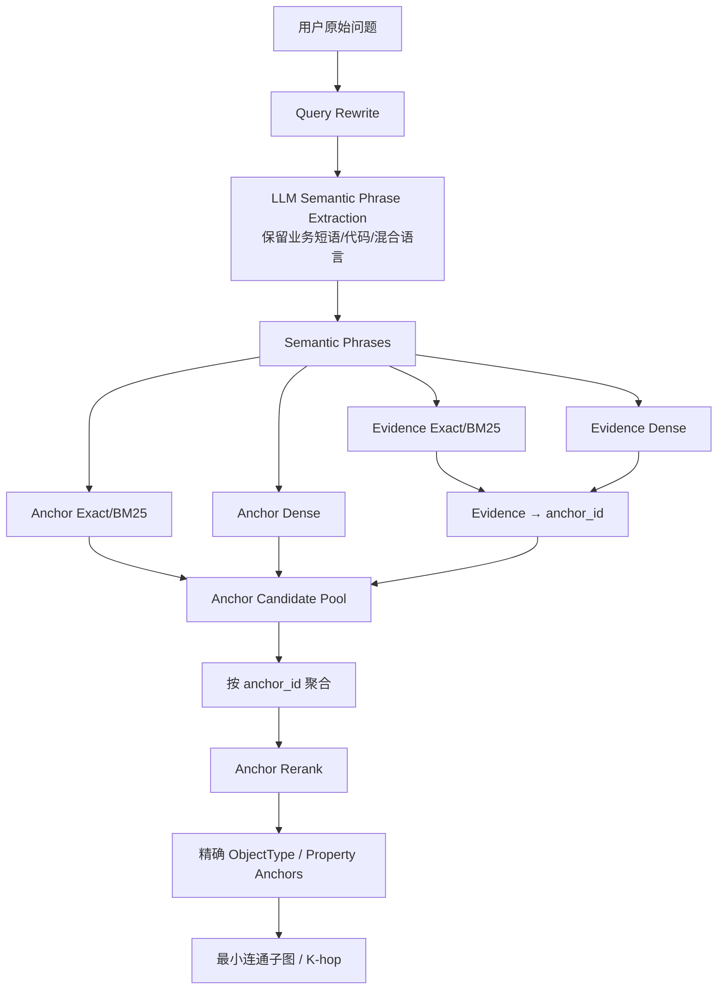
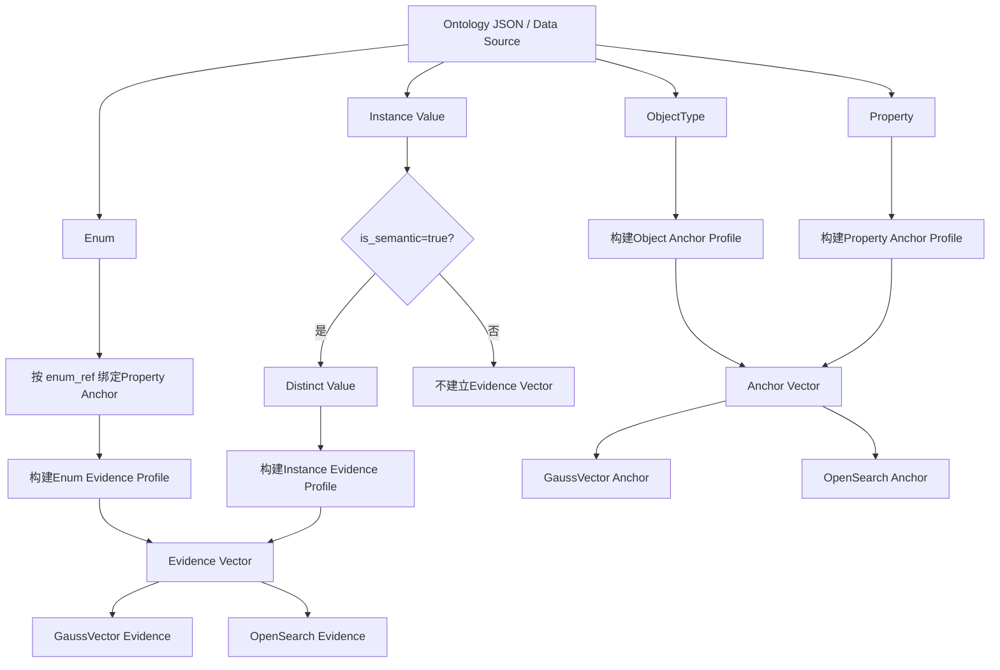
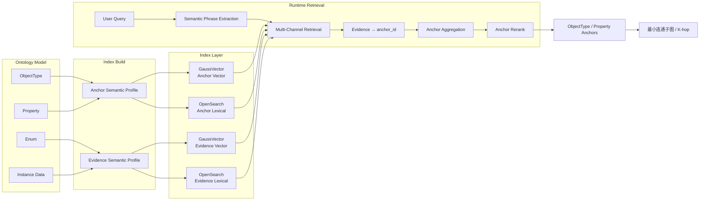

# OAG 面向本体锚点的语义检索与向量索引设计方案

## 1. 设计背景

OAG 的向量检索、同义词检索、枚举值检索、实例列值检索和多语言检索，本质上都不是为了返回“向量文档”本身，也不是为了把枚举值、列值当成最终业务实体。

**最终目标只有一个：从用户自然语言问题中，尽可能准确地定位本体模型上的 ObjectType、Property 等元数据锚点（Ontology Anchor），再基于锚点生成最小连通本体子图。**

因此本方案将检索架构从“按数据类型分别召回”调整为“**以锚点为中心，所有其他信息作为锚点证据**”。

以 `Subscriber.json` 为例：

```text
ObjectType Anchor
Subscriber
   │
   ├─ Property Anchor: subClass
   │       ├─ Alias: Subscriber category
   │       └─ Enum Evidence
   │              ├─ 1 / FORMAL / 正式用户...
   │              ├─ 2 / TEST / 测试用户...
   │              ├─ 3 / EXTERNAL / 外部用户...
   │              ├─ 4 / IOT_FORMAL / 物联网正式用户...
   │              └─ 5 / IOT_TEST / 物联网测试用户...
   │
   └─ Property Anchor: subLevel
           └─ Instance Value Evidence
                  ├─ VIP
                  ├─ GOLD
                  └─ ...
```

用户查询：

```text
查询正式签约用户的 Mobile Number
```

检索链路真正需要得到的是：

```text
Mobile Number
    ↓
Object Anchor: Subscriber

正式签约用户
    ↓
Enum Evidence: FORMAL / value=1
    ↓
Property Anchor: Subscriber.subClass
```

最终给子图构建模块的是：

```text
Subscriber
Subscriber.subClass
```

而不是把 `FORMAL` 或 `1` 当成最终本体锚点。

---

# 2. 设计目标

本方案优先优化以下指标：

1. ObjectType 锚点召回准确率；
2. Property 锚点召回准确率；
3. 枚举值 / 同义词 / 实例列值到 Property 锚点的映射准确率；
4. 中文、英文、西班牙语以及混合语言 Query 的锚点召回能力；
5. 任意字符串、业务代码、业务黑话无法预分类时的稳定召回能力；
6. 5000 万级实例数据场景下的索引规模和性能；
7. 向量库与 OpenSearch 的职责清晰、结果可解释；
8. 最终结果能够稳定服务于 OAG 最小连通子图和 K-hop 扩展。

因此核心原则从：

```text
尽量把所有可检索数据都向量化
```

调整为：

> **尽量利用所有语义证据，把 Query 映射到正确的本体锚点。**

---

# 3. 核心概念

## 3.1 Ontology Anchor：本体锚点

本体锚点是 OAG 检索阶段真正需要输出的元数据实体。

当前重点包括：

```text
OBJECT_TYPE
PROPERTY
```

未来可以扩展：

```text
RELATIONSHIP
FUNCTION
ACTION
METRIC
...
```

示例：

```text
Anchor: Subscriber
Anchor: Subscriber.subClass
```

锚点拥有稳定唯一 ID：

```text
object anchor_id: Subscriber
property anchor_id: Subscriber/subClass
```

后续链路：

```text
Anchor Retrieval
    ↓
Anchor Set
    ↓
Graph Expansion
    ↓
最小连通子图 / K-hop
```

## 3.2 Anchor Evidence：锚点证据

以下内容本身不是最终结果，而是帮助定位 Anchor 的 Evidence：

```text
Object Alias
Property Alias
Enum Value
Enum Alias
Enum Description
Instance Column Value
Instance Value Synonym
多语言名称
多语言描述
业务黑话
```

例如：

```text
Evidence: FORMAL
Mapped Anchor: Subscriber.subClass
```

以及：

```text
Evidence: Subscriber category
Mapped Anchor: Subscriber.subClass
```

因此所有索引都应该满足：

```text
Search Document
      ↓
anchor_id
```

而不是把 Search Document 本身作为最终业务目标。

---

# 4. 总体设计原则

## 4.1 Anchor First

所有召回通道最终必须归一到：

```text
anchor_id
anchor_type
```

因此排序的最终单位不是 vector document、enum value、alias 或 instance value，而是 **Ontology Anchor**。

## 4.2 Anchor 与 Evidence 分离

推荐物理上只保留两类语义索引：

```text
1. Anchor Index
2. Evidence Index
```

其中：

- **Anchor Index**：直接表达 ObjectType / Property 元数据本身；
- **Evidence Index**：保存能够反向定位 Anchor 的 Enum、Instance Value 以及必要扩展业务词；
- Object / Property Alias 优先作为 Anchor 自身 Semantic Profile 的一部分，不默认拆成独立向量。

---

# 5. 多语言描述是否可以放在一个向量

## 5.1 结论

对于同一个 ObjectType 或 Property：

> **中文、英文、西班牙语等多语言名称和描述，推荐默认拼接到同一个 Anchor Content 中生成一个向量。**

例如：

```text
ObjectType: Subscriber
Aliases: Subscriber | Mobile Number | Number | Mobile Phone
中文描述: 用户实体，代表服务的实际使用者，对应电话号码或宽带账号。
English: Subscriber entity representing the actual user of services, corresponding to a phone number or broadband.
Español: ...
```

生成 **一个 Anchor Vector**。

## 5.2 与“长文本拼接”的区别

不推荐的长文本拼接是：

```text
Subscriber
+ Subscriber的所有Property
+ 所有Enum Value
+ 所有Instance Value
+ 所有Description
```

因为这些内容对应多个不同语义目标。

而：

```text
中文 Subscriber Description
English Subscriber Description
Spanish Subscriber Description
```

虽然语言不同，但描述的是**同一个 Anchor**，语义目标一致，因此可以作为同一个 Anchor 的多语言 Semantic Profile。

关键判断标准不是“是不是多语言”，而是：

> **这些文本是不是在描述同一个 Anchor。**

如果是同一个 Anchor，可以合并；如果属于不同 Property / Enum / Instance Value，则不能为了覆盖更多词全部拼在一起。

## 5.3 为什么默认推荐一个多语言向量

OAG 最终只需要 `Subscriber`，而不是：

```text
Subscriber_zh
Subscriber_en
Subscriber_es
```

如果按语言建多个向量，会造成：

- 向量数量倍增；
- TopK 被同一 Anchor 的多语言副本占据；
- 聚合逻辑更复杂；
- 混合语言 Query 需要更多召回；
- 语言识别错误可能带来漏检。

因此第一版默认：

> **一个 Anchor = 一个 Global Multilingual Semantic Profile = 一个 Anchor Vector。**

BGE-M3 原生支持 100+ 工作语言，并支持跨语言检索，因此这种方案与模型能力匹配。

## 5.4 语言 Shadow Vector 只作为可选增强

仅当评测发现某些语言在 Global Vector 下召回显著下降，再增加：

```text
anchor_vector_global
anchor_vector_zh
anchor_vector_en
anchor_vector_es
```

`global` 始终为主向量，语言向量只作为增强召回，不作为默认第一版设计。

---

# 6. Anchor Vector 组装结构

## 6.1 ObjectType Anchor

`Subscriber.json` 中：

```json
{
  "class_name": "Subscriber",
  "description": "...中文...English...",
  "aliases": ["Subscriber", "Mobile Number", "Number", "Mobile Phone"]
}
```

推荐 Content：

```text
[ObjectType]
Name: Subscriber
Aliases: Subscriber; Mobile Number; Number; Mobile Phone
Description.zh: 用户实体，代表服务的实际使用者，对应电话号码或宽带账号。
Description.en: Subscriber entity representing the actual user of services, corresponding to a phone number or broadband.
Description.es: ...
```

生成：

```text
anchor_id = Subscriber
anchor_type = OBJECT_TYPE
vector = Embedding(content)
```

Alias 不需要默认拆成多个向量；OpenSearch 对 `canonical_name`、`aliases`、`content` 分字段索引。

## 6.2 Property Anchor

对于：

```json
{
  "attr_name": "subClass",
  "aliases": ["Subscriber category"],
  "enum_ref": "SubClass",
  "data_type": "string",
  "description": "中文描述：用户类别。 English Description: Subscriber category"
}
```

推荐：

```text
[Property]
ObjectType: Subscriber
Property: subClass
Aliases: Subscriber category
DataType: string
Description.zh: 用户类别。
Description.en: Subscriber category.
Description.es: ...
```

生成：

```text
anchor_id   = Subscriber/subClass
anchor_type = PROPERTY
object_id   = Subscriber
vector      = Embedding(content)
```

Property Vector 必须带 ObjectType 上下文，因为 `status`、`type`、`name`、`level` 等属性名在不同 Object 上大量重复。

---

# 7. Enum 和 Instance Value：Evidence，而不是 Anchor

## 7.1 Enum 的目标是定位 Property

以：

```text
Subscriber.subClass
      ↓
SubClass
      ↓
1 / FORMAL
```

为例，真正目标是：

```text
Subscriber.subClass
```

因此枚举索引记录应该直接保存：

```text
anchor_id = Subscriber/subClass
```

## 7.2 Enum Evidence Content

推荐一个枚举 Value 生成一条 Evidence Document：

```text
[Enum Value Evidence]
ObjectType: Subscriber
Property: subClass
Property Aliases: Subscriber category
Value: 1
Aliases: FORMAL
Description.zh: 正式用户，正式签订合同的用户。
Description.en: Formally contracted subscriber.
Description.es: ...
```

Metadata：

```text
anchor_id = Subscriber/subClass
anchor_type = PROPERTY
evidence_type = ENUM_VALUE
raw_value = 1
aliases = [FORMAL]
enum_id = SubClass
```

## 7.3 Value 与 Alias 默认合成一个 Evidence Vector

在 Anchor First 目标下：

```text
Value + Alias + 多语言描述
```

都在描述同一个 Enum Value，而这个 Value 又只用于定位一个 Property Anchor。

因此第一版推荐：

```text
一个 Enum Value
= 一个 Evidence Document
= 一个 Vector
= 一个 Property Anchor 映射
```

而不是默认把 `1` 和 `FORMAL` 分成两个独立向量。

仅当某个 Value 的 Alias 数量非常多、语义差异明显，并且评测证明单 Vector 召回不足时，再增加 Alias Shadow Evidence。

---

# 8. “1 / FORMAL”只是特例：任意字符串如何检索

## 8.1 不要求运行时识别字符串类型

实际 Query 可能出现：

```text
1
FORMAL
A001
套餐A
VIP
Gold
xx1套餐
abc_2026
Jakarta
任意业务字符串
```

检索前并不知道它是：

```text
枚举Value
枚举Alias
实例列值
对象Alias
属性Alias
普通自然语言
```

因此运行时**不应该先强分类，再决定走哪一路检索**。

## 8.2 每个业务短语统一多路检索

LLM 抽取出的每一个 Semantic Phrase 统一执行：

```text
1. Anchor OpenSearch：Exact + BM25
2. Anchor Dense Vector
3. Evidence OpenSearch：Exact + BM25
4. Evidence Dense Vector
```

因此即使不知道 `FORMAL` 是什么，也可以让它同时走所有通道，最后只有实际命中的结果参与 Anchor 聚合。

## 8.3 Exact Search 不需要提前知道字符串类型

Exact Search 不是：

```text
先判断这是枚举代码
→ 再做Exact
```

而是：

> **对所有 Query Phrase 都尝试 normalized keyword match。**

搜索字段包括：

```text
canonical_name.keyword
aliases.keyword
raw_value.keyword
normalized_value.keyword
```

如果没有 Exact Hit，返回空即可。

因此：

```text
不知道字符串类型
≠
不能执行Exact Match
```

## 8.4 任意字符串的三种自动覆盖方式

### 原始值直接出现

```text
Query: IOT_FORMAL
→ keyword Evidence
→ Subscriber.subClass
```

### Query 是自然语言改写

```text
Query: 物联网商用正式用户
→ Dense Evidence
→ IOT_FORMAL / value=4
→ Subscriber.subClass
```

### Query 是未知业务字符串

```text
Query: A8F3_X
```

如果源数据已有 `raw_value=A8F3_X`，keyword Exact 直接命中；如果 Query 是其语义改写，则 Dense 负责召回。

运行时不需要知道 `A8F3_X` 属于什么数据类型。

---

# 9. 同一个 Enum 被多个 Property 引用

`Subscriber` 中多个 Property 可以引用同一个 `SubStatusSuspendDetail`：

```text
customerSuspendStatus
dunningSuspendStatus
creditControlSuspendStatus
lifeCycleSuspendStatus
operatorSuspendStatus
prepaidInstallmentSuspendStatus
        ↓
SubStatusSuspendDetail
```

OAG 的最终目标是 Property Anchor，因此不能只建立：

```text
SubStatusSuspendDetail/valueX
```

一条全局 Evidence。

必须针对：

```text
EnumRef + Property Binding
```

实例化 Evidence：

```text
Evidence A
Object: Subscriber
Property: dunningSuspendStatus
Enum: SubStatusSuspendDetail
Value: X
anchor_id = Subscriber/dunningSuspendStatus
```

以及：

```text
Evidence B
Object: Subscriber
Property: operatorSuspendStatus
Enum: SubStatusSuspendDetail
Value: X
anchor_id = Subscriber/operatorSuspendStatus
```

即：

> **Enum 定义可以复用，但 Evidence 必须按 Property Anchor 绑定展开。**

---

# 10. Instance Column Value 设计

## 10.1 is_semantic 的真实含义

`Subscriber.json` 中：

```text
id: is_semantic=false
subLevel: is_semantic=true
```

建议定义：

```text
is_semantic=true
```

表示：

> **该 Property 的实例值允许作为定位 Property Anchor 的语义 Evidence。**

不是该列每一行都必须生成一个 Vector。

## 10.2 Instance Value Evidence

例如：

```text
Subscriber.subLevel = VIP
```

构建：

```text
[Instance Value Evidence]
ObjectType: Subscriber
Property: subLevel
Value: VIP
Property Description.zh: 用户等级/级别。
Property Description.en: Subscriber level/grade.
```

保存：

```text
anchor_id = Subscriber/subLevel
evidence_type = INSTANCE_VALUE
raw_value = VIP
```

用户查询 `VIP用户`，Evidence 命中后最终得到 `Subscriber.subLevel`。

## 10.3 必须 DISTINCT

5000 万实例中即使有 5000 万行，如果该属性只有：

```text
VIP
GOLD
SILVER
NORMAL
```

只生成 4 条 Evidence，而不是 5000 万个 Vector。

## 10.4 高基数控制

即使 `is_semantic=true`，如果 DISTINCT Value 达到百万、千万级，也必须使用：

```text
is_semantic
+ distinct_count
+ value_length
+ 业务配置
```

共同控制。

日志、工单长描述、客户备注等高基数自由文本更适合独立 RAG / Document Index，不应直接作为 OAG Anchor Evidence 全量灌入。

---

# 11. 最终物理索引设计

## 11.1 GaussVector

推荐收敛为两张核心表：

```text
{ontology_id}_anchor_vector
{ontology_id}_evidence_vector
```

其中：

- Anchor Vector：ObjectType / Property；
- Evidence Vector：Enum Value / Instance Semantic Value / 未来其他能够反向定位 Anchor 的证据。

## 11.2 OpenSearch

对应：

```text
{ontology_id}_anchor_lexical
{ontology_id}_evidence_lexical
```

总体关系：

```text
                  Ontology Retrieval
                         │
              ┌──────────┴──────────┐
              │                     │
          Anchor Index          Evidence Index
              │                     │
      Object / Property       Enum / Instance
              │                     │
              └──────────┬──────────┘
                         │
                      anchor_id
                         │
                         ▼
                  Ontology Anchor Set
```

---

# 12. GaussVector Anchor 表结构

| 字段 | 类型 | 说明 |
|---|---|---|
| `vector` | `FLOAT_VECTOR(1024)` | Anchor Semantic Profile 向量 |
| `anchor_id` | `VARCHAR(512)` | Anchor 唯一ID |
| `anchor_type` | `INT` | OBJECT_TYPE / PROPERTY |
| `object_type_id` | `VARCHAR(256)` | 所属 ObjectType |
| `property_id` | `VARCHAR(256)` | Property ID，Object记录为空 |
| `canonical_name` | `VARCHAR(512)` | 标准名称 |
| `aliases` | `TEXT/JSON` | 多语言 Alias 集 |
| `descriptions` | `TEXT/JSON` | 多语言描述 |
| `content` | `TEXT` | 实际 Embedding Content |
| `content_hash` | `VARCHAR(128)` | 语义内容Hash |
| `model_version` | `VARCHAR(128)` | Embedding模型版本 |
| `source_version` | `VARCHAR(128)` | 本体版本 |

向量索引继续使用当前可用的 1024 维 Vector；ANN 类型和参数根据实际 GaussVector 版本与 Recall/Latency 评测调优。

---

# 13. GaussVector Evidence 表结构

| 字段 | 类型 | 说明 |
|---|---|---|
| `vector` | `FLOAT_VECTOR(1024)` | Evidence Semantic Profile |
| `evidence_id` | `VARCHAR(512)` | Evidence唯一ID |
| `evidence_type` | `INT` | ENUM_VALUE / INSTANCE_VALUE |
| `anchor_id` | `VARCHAR(512)` | **最终映射的本体Anchor** |
| `anchor_type` | `INT` | 通常为 PROPERTY |
| `object_type_id` | `VARCHAR(256)` | 所属对象 |
| `property_id` | `VARCHAR(256)` | 所属属性 |
| `enum_id` | `VARCHAR(256)` | 枚举ID，实例值为空 |
| `raw_value` | `VARCHAR(4096)` | 原始值 |
| `aliases` | `TEXT/JSON` | 值的同义词/别名 |
| `descriptions` | `TEXT/JSON` | 多语言描述 |
| `normalized_value` | `VARCHAR(4096)` | 标准化值 |
| `content` | `TEXT` | Embedding Content |
| `content_hash` | `VARCHAR(128)` | 内容Hash |
| `model_version` | `VARCHAR(128)` | 模型版本 |
| `source_version` | `VARCHAR(128)` | 数据版本 |

最关键字段是：

```text
anchor_id
```

Evidence 命中之后立即转换成 Anchor Candidate。

---

# 14. OpenSearch Anchor Index

推荐逻辑字段：

```json
{
  "anchor_id": "keyword",
  "anchor_type": "keyword",
  "object_type_id": "keyword",
  "property_id": "keyword",
  "canonical_name": "text + keyword multi-field",
  "aliases": "text + keyword multi-field",
  "content": "text"
}
```

职责：

```text
canonical_name.keyword  → Exact
aliases.keyword         → Exact
canonical_name          → BM25
aliases                 → BM25
content                 → BM25补充
```

---

# 15. OpenSearch Evidence Index

推荐逻辑字段：

```json
{
  "evidence_id": "keyword",
  "evidence_type": "keyword",
  "anchor_id": "keyword",
  "anchor_type": "keyword",
  "object_type_id": "keyword",
  "property_id": "keyword",
  "enum_id": "keyword",
  "raw_value": "text + keyword multi-field",
  "normalized_value": "keyword",
  "aliases": "text + keyword multi-field",
  "descriptions": "text",
  "content": "text"
}
```

推荐 lexical 优先级：

```text
normalized_value exact
>
raw_value exact
>
alias exact
>
raw_value BM25
>
alias BM25
>
description/content BM25
```

这些命中最终都累积到 `anchor_id`，而不是直接输出 Evidence。

---

# 16. Query 侧不要做普通分词

## 16.1 推荐 Semantic Phrase Extraction

Query：

```text
查询FORMAL用户的Mobile Number
```

不应该拆成：

```text
查询
FORMAL
用户
Mobile
Number
```

应该让 LLM 按业务语义单位抽取：

```text
FORMAL用户
Mobile Number
```

或者：

```text
FORMAL
用户
Mobile Number
```

重点是保留 `Mobile Number`、`IOT_FORMAL` 等业务短语和标识符的完整性。

## 16.2 不建议标记“每个单词是什么语言”

例如：

```text
IOT_FORMAL
subClass
Mobile Number
5G用户
VIP用户
```

逐 token 标记语言会引入不稳定分类：

```text
IOT_FORMAL → en / identifier / und?
5G用户 → zh / mixed?
subClass → en / identifier?
```

而 BGE-M3 本身支持多语言，索引侧又使用 Global Multilingual Semantic Profile，因此没有必要通过 `<单词,语言>` 强制路由 Vector 检索。

## 16.3 推荐 LLM 输出

```json
{
  "phrases": [
    {
      "text": "FORMAL用户",
      "language_hint": "mixed"
    },
    {
      "text": "Mobile Number",
      "language_hint": "en"
    }
  ]
}
```

允许：

```text
zh / en / es / mixed / und
```

`language_hint`：

- 不作为 Vector 查询 WHERE 强过滤；
- 可用于日志与可观测；
- 可用于 OpenSearch analyzer 选择；
- 可用于轻量 Boost；
- 可用于召回不足时的语言补偿。

## 16.4 优先级

LLM Prompt 应优先保证：

```text
1. 保留业务复合短语
2. 不拆业务编码/标识符
3. 不拆已有英文短语
4. 保留数字+单位/数字+业务词组合
5. 语言标签仅作为可选Hint
```

因此最终原则是：

> **让 LLM 做语义短语抽取，不要让 LLM 做传统逐词分词和逐词语言识别。**

---

# 17. Query 运行流程



---

# 18. Anchor Candidate 聚合

一个 Query Phrase 可能同时命中：

```text
Property Anchor Vector
Property Alias BM25
Enum Evidence Dense
Enum Alias Exact
Instance Value Evidence
```

全部归一成：

```text
anchor_id
```

例如：

```json
{
  "anchor_id": "Subscriber/subClass",
  "direct_anchor_hits": [],
  "evidence_hits": [],
  "exact_hits": [],
  "bm25_hits": [],
  "dense_hits": []
}
```

最终排序对象始终是 `anchor_id`。

---

# 19. Anchor 排序原则

最终 Ranking 应关注：

```text
这个 Anchor 是否能解释用户问题
```

而不是单个 Evidence Vector 的 Cosine。

推荐逻辑：

```text
AnchorScore =
DirectAnchorScore
+ EvidenceScore
+ ExactBoost
+ PhraseCoverage
+ ObjectPropertyConsistency
```

具体权重通过真实 Query Set 调优。

## 19.1 Direct Anchor Hit

`Mobile Number` 直接命中 `Subscriber.aliases`，提升 `Subscriber`。

## 19.2 Evidence Hit

`正式签约用户` 命中 `FORMAL/value=1` Evidence，提升 `Subscriber.subClass`。

## 19.3 Object-Property 一致性

如果同时命中：

```text
Object = Subscriber
Property = Subscriber.subClass
```

因为二者属于同一个 Object，可以提升组合置信度；如果 Object 和 Property 归属不一致，则降权。

---

# 20. Rerank 输入应该是 Anchor，而不是原始文档

Rerank 推荐输入：

```text
原始用户问题
+
Semantic Phrases
+
Anchor Metadata
+
命中的 Evidence 摘要
```

示例：

```text
Query:
查询正式签约用户的Mobile Number

Candidate Anchor 1:
Subscriber
Aliases: Mobile Number, Mobile Phone
Description: ...

Candidate Anchor 2:
Subscriber.subClass
Description: 用户类别
Evidence: FORMAL / 1 / 正式用户，正式签订合同的用户
```

让 Reranker 判断哪些 Object / Property 是问题真正需要的元数据锚点，而不是在 `FORMAL`、`1`、`Mobile Number` 等文档之间排序。

---

# 21. OAG 检索输出模型

建议输出：

```json
{
  "anchors": [
    {
      "anchor_id": "Subscriber",
      "anchor_type": "OBJECT_TYPE",
      "score": 0.92,
      "matched_phrases": ["Mobile Number"]
    },
    {
      "anchor_id": "Subscriber/subClass",
      "anchor_type": "PROPERTY",
      "score": 0.89,
      "matched_phrases": ["正式签约用户"],
      "matched_evidence": [
        {
          "type": "ENUM_VALUE",
          "raw_value": "1",
          "aliases": ["FORMAL"]
        }
      ]
    }
  ]
}
```

Graph Builder 只消费 `anchors`。

Evidence 可以作为 `Query Constraint Hint` 传递给后续 Cypher / OQL 生成。

---

# 22. Evidence 同时为查询生成提供值约束

Evidence 第一职责是找到 Property Anchor，第二职责是提供值 Hint。

例如：

```text
正式签约用户
   ↓
Property Anchor:
Subscriber.subClass

Constraint Evidence:
raw_value = 1
alias = FORMAL
```

下游不仅知道使用 `subClass`，还可以生成：

```text
subClass = "1"
```

因此 Evidence 不进入最终 Anchor Set，但应该作为 Anchor 的附加约束信息保留。

---

# 23. DataSync 流程



---

# 24. 多语言元数据结构建议

当前：

```json
"description": "中文描述：...\n\nEnglish Description: ..."
```

短期 DataSync 可以解析。

长期推荐：

```json
{
  "descriptions": {
    "zh": "用户类别",
    "en": "Subscriber category",
    "es": "..."
  }
}
```

Alias 推荐：

```json
{
  "aliases": [
    {"value": "Subscriber category", "language": "en"},
    {"value": "...", "language": "es"}
  ]
}
```

这些语言字段主要用于数据治理、展示、Analyzer 与评测，不用于 Vector Query 的强过滤。

---

# 25. Anchor Content 拼接规范

## 25.1 ObjectType

```text
[ObjectType]
Name: {class_name}
Aliases: {aliases}
Description.zh: {description_zh}
Description.en: {description_en}
Description.es: {description_es}
```

## 25.2 Property

```text
[Property]
ObjectType: {class_name}
Property: {attr_name}
Aliases: {aliases}
DataType: {data_type}
Description.zh: {description_zh}
Description.en: {description_en}
Description.es: {description_es}
```

`enum_ref`、`is_semantic` 优先作为 Metadata 保存；如果评测证明其名称本身具备业务语义，再加入 Embedding Content。

---

# 26. Evidence Content 拼接规范

## 26.1 Enum Value

```text
[Enum Value]
ObjectType: {class_name}
Property: {attr_name}
Property Aliases: {property_aliases}
Value: {raw_value}
Aliases: {value_aliases}
Description.zh: {description_zh}
Description.en: {description_en}
Description.es: {description_es}
```

## 26.2 Instance Value

```text
[Instance Value]
ObjectType: {class_name}
Property: {attr_name}
Property Aliases: {property_aliases}
Value: {raw_value}
Value Aliases: {value_aliases}
Property Description.zh: {property_description_zh}
Property Description.en: {property_description_en}
Property Description.es: {property_description_es}
```

如果实例值自身有描述，优先使用值自身描述。

---

# 27. 不应该拼进 Anchor Vector 的内容

Object Anchor 不应加入：

```text
所有Property
所有Enum
所有Instance Value
所有Relationship
```

Property Anchor 不应加入：

```text
该Property的所有Enum Value
所有Instance Value
```

因为：

```text
Anchor Vector
```

必须表达：

```text
Anchor自身是什么
```

而 Evidence Vector 才表达：

```text
哪些值/词可以指向这个Anchor
```

这是两类向量最核心的职责边界。

---

# 28. TopK 与 Threshold

由于结果最终按 Anchor 聚合，粗排阶段不建议 `TopK=3` 过早截断。

第一版建议：

```text
每个 Phrase × 每条召回通道：TopK 10~20
聚合到 anchor_id 后：保留 10~30 个 Anchor
Rerank：保留最终 3~10 个 Anchor
```

具体值通过 OAG 评测确定。

Similarity Threshold 不建议全局固定 `0.6`，建议分别评测：

```text
Anchor Dense
Enum Evidence Dense
Instance Evidence Dense
Mixed Language
```

---

# 29. Alias 冲突治理

`Subscriber.json` 中存在类似：

```text
dunningSuspendStatus
Alias = Dunning suspend status
```

同时：

```text
operatorSuspendStatus
Alias = Dunning suspend status
```

但属性 Description 对应不同含义。

Embedding、BM25、Exact 都不能凭空判断元数据录入错误。

DataSync 必须增加：

```text
同Object下Alias冲突检查
Canonical-Alias重复检查
EnumRef有效性
空Description
重复Evidence
```

检索层可以利用 Description、Object Context、其他 Query Phrase、Graph Consistency 做消歧，但不能替代元数据质量治理。

---

# 30. 标准化策略

统一：

```text
Trim
Unicode Normalize
Case Normalize
Whitespace Normalize
```

生成：

```text
normalized_name
normalized_alias
normalized_value
```

原始值继续保留，用于最终查询约束。

---

# 31. anchor_id / evidence_id

Anchor：

```text
hash(
 ontology_id
 + anchor_type
 + object_type_id
 + property_id
)
```

Evidence：

```text
hash(
 ontology_id
 + anchor_id
 + evidence_type
 + enum_id
 + normalized_value
)
```

这样 DataSync 可以幂等；同一个 Enum 对不同 Property 会生成不同 Evidence ID。

---

# 32. 增量更新

Anchor / Evidence 保存：

```text
content_hash
model_version
source_version
```

规则：

```text
content_hash未变化 → 不重新Embedding
content变化 → 重算Vector
model_version变化 → 重算Vector
仅非语义Metadata变化 → Metadata Update
```

---

# 33. 示例：正式签约用户的 Mobile Number

Query：

```text
查询正式签约用户的 Mobile Number
```

Phrase Extraction：

```json
[
  {"text": "正式签约用户", "language_hint": "zh"},
  {"text": "Mobile Number", "language_hint": "en"}
]
```

`Mobile Number`：

```text
Anchor Index
→ Subscriber.aliases
→ Object Anchor: Subscriber
```

`正式签约用户`：

```text
Evidence Dense
→ Value=1 / Alias=FORMAL / 正式用户...
→ anchor_id=Subscriber/subClass
```

Anchor 输出：

```text
Subscriber
Subscriber.subClass
```

附加 Evidence：

```text
Subscriber.subClass
raw_value=1
alias=FORMAL
```

---

# 34. 示例：IOT 商用用户

Query：

```text
查询IOT商用用户
```

Dense Evidence：

```text
IOT商用用户
→ IOT_FORMAL
→ value=4
→ Description=物联网正式用户，物联网正式商用终端
→ Subscriber.subClass
```

最终 Anchor：

```text
Subscriber.subClass
```

Evidence Hint：

```text
subClass = 4
```

---

# 35. 示例：未知业务字符串

假设：

```text
Offering.packageType
```

存在实例语义值：

```text
A8F3_X
```

用户：

```text
查询A8F3_X套餐
```

无需判断 `A8F3_X` 是什么语言、是不是枚举、是不是实例值。

统一走：

```text
Anchor Exact/BM25/Dense
+
Evidence Exact/BM25/Dense
```

Evidence keyword：

```text
A8F3_X
→ Offering.packageType
```

最终输出 Property Anchor：

```text
Offering.packageType
```

---

# 36. 评测体系必须 Anchor-Centric

核心指标：

```text
ObjectAnchorRecall@1
ObjectAnchorRecall@3
PropertyAnchorRecall@1
PropertyAnchorRecall@3
AnchorPrecision@K
AnchorMRR
```

Evidence 映射指标：

```text
EnumToPropertyAnchorAccuracy
InstanceValueToPropertyAnchorAccuracy
AliasToAnchorAccuracy
UnknownStringToAnchorAccuracy
```

多语言：

```text
MixedLanguageAnchorRecall@K
CrossLanguageAnchorRecall@K
```

必须覆盖：

```text
纯中文
纯英文
纯西语
中英混合
中西混合
中文Query → 英文元数据
英文Query → 中文描述
混合语言Query → 多语言Anchor Profile
```

分词策略对比：

```text
A. 普通分词
B. LLM逐词+语言标记
C. LLM Semantic Phrase Extraction
```

最终以 `AnchorRecall@K` 判断优劣。

---

# 37. 推荐第一版配置

```text
Embedding:
BGE-M3 / 1024维

Anchor:
一个Anchor一个Global Multilingual Vector

Evidence:
一个Enum Value一个Property绑定Evidence Vector
一个Distinct Instance Semantic Value一个Evidence Vector

Query:
LLM Semantic Phrase Extraction
语言仅输出language_hint

Retrieval:
Anchor Exact
Anchor BM25
Anchor Dense
Evidence Exact
Evidence BM25
Evidence Dense

Fusion:
全部归一到anchor_id后融合

Rerank:
原始Query + Anchor + Evidence

Output:
ObjectType / Property Anchors
```

---

# 38. 最终总体架构



---

# 39. 与上一版方案的关键变化

| 维度 | 上一版 | 本版 |
|---|---|---|
| 最终目标 | Object / Property / Enum / Instance 候选 | **仅本体 Anchor** |
| Enum | 独立语义目标 | **Property Anchor Evidence** |
| Instance Value | 独立语义目标 | **Property Anchor Evidence** |
| Alias | 多个独立Vector | **优先合入Anchor/Evidence Profile** |
| 多语言 | 一语言一Vector | **同一Anchor多语言合成一个Global Vector** |
| 物理Vector表 | Schema / Enum / Instance | **Anchor / Evidence 两类** |
| Query切词 | 业务短语+语言 | **语义短语为主，语言只做Hint** |
| 未知字符串 | 尝试识别类型 | **无需识别，所有通道统一检索** |
| 排序对象 | 检索Document | **anchor_id** |
| Rerank | 多类候选Document | **Anchor + Evidence摘要** |
| 输出 | 本体元素+值候选 | **精确 ObjectType / Property Anchors** |

---

# 40. 最终结论

整个设计应围绕：

> **Query → Ontology Anchor。**

因此：

```text
对象名
对象同义词
属性名
属性同义词
枚举值
枚举值同义词
实例列值
多语言描述
业务黑话
```

都只是：

```text
Anchor Retrieval Evidence
```

最终推荐：

```text
Anchor Index
+
Evidence Index
```

两级索引。

Anchor Vector：

```text
一个ObjectType / Property
+
Canonical Name
+
Aliases
+
中文/英文/西语等多语言Description
```

由于这些内容都表达同一个 Anchor，因此多语言描述默认可以放在**一个向量**中。

Evidence Vector：

```text
一个Enum Value / 一个Distinct Instance Value
+
Aliases
+
多语言描述
+
所属Object/Property最小上下文
```

并且每条 Evidence 都必须明确：

```text
anchor_id
```

运行时不尝试提前判断：

```text
这个词是不是枚举
是不是编码
是什么语言
```

而是：

```text
LLM Semantic Phrase Extraction
        ↓
每个Phrase统一执行
Anchor Exact/BM25/Dense
+
Evidence Exact/BM25/Dense
        ↓
所有结果归一到anchor_id
        ↓
Anchor聚合
        ↓
Anchor Rerank
        ↓
ObjectType / Property
        ↓
本体子图
```

分词阶段最重要的不是给每个单词标记中文/英文/西语，而是：

> **正确保留业务语义短语边界。**

语言识别可以保留为：

```text
language_hint = zh / en / es / mixed / und
```

用于可观测、OpenSearch analyzer 或轻量排序增强，但不应成为 Vector 检索强过滤条件。

最终 OAG 的成功标准也不应该是某条 Vector 相似度有多高，而应该是：

> **正确的 ObjectType / Property Anchor 是否稳定进入 TopK，并最终进入最小连通本体子图。**
