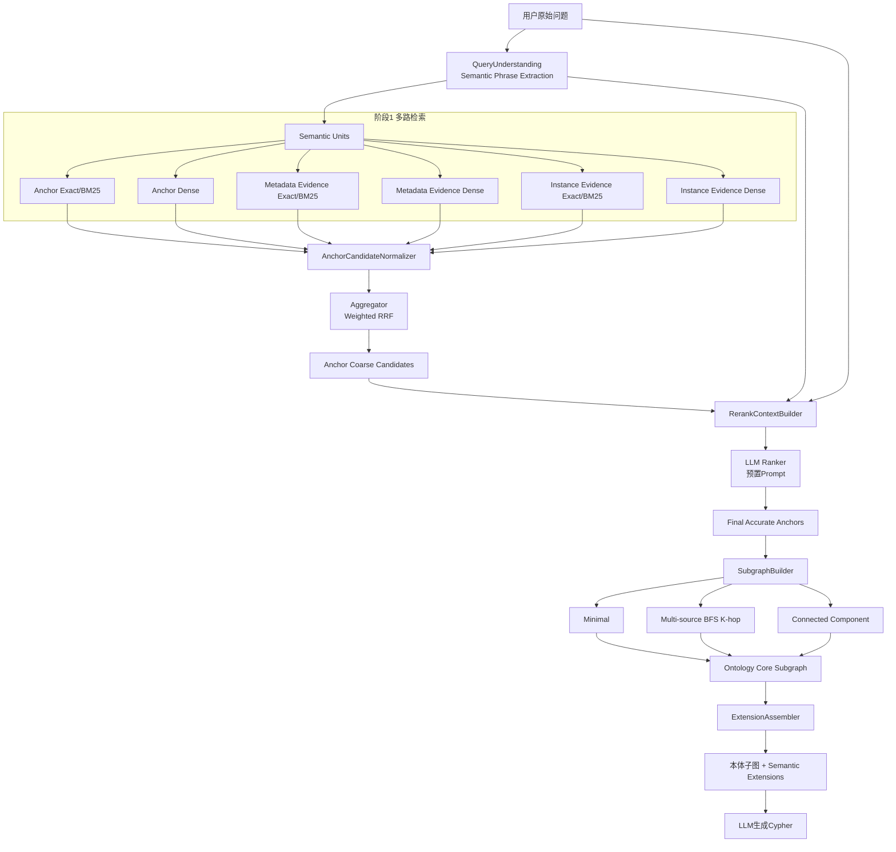
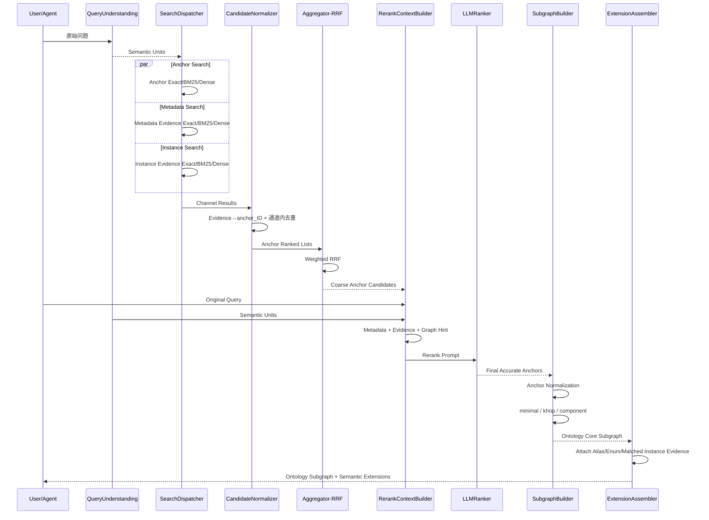

# OAG 面向本体锚点的语义检索与混合索引设计方案

> 版本：V4.0  
> 目标：完整定义从索引构建、锚点多路召回、RRF 粗排、LLM 精排到本体子图构建的 OAG 运行链路，为后续 Cypher 生成提供准确、紧凑、可解释的本体上下文。

---

# 1. 设计目标

OAG 的向量检索、OpenSearch 全文检索、同义词检索、枚举值检索和实例值检索，最终都服务于同一个目标：

> **将用户自然语言问题稳定映射为全局唯一的 ObjectType / Property 本体锚点，并保留 Alias、Enum、Instance Value 与锚点之间的映射，再基于锚点构建最小且充分的本体子图。**

完整链路：

```text
用户原始问题
   ↓
Semantic Phrase Extraction
   ↓
Anchor / Metadata Evidence / Instance Evidence 多路召回
   ↓
Evidence → Anchor 映射
   ↓
Aggregator Weighted RRF 粗排
   ↓
LLM Fine Ranking 精排
   ↓
准确 ObjectType / Property Anchors
   ↓
SubgraphBuilder
   ├─ 最小连通子图
   ├─ 多源 BFS K-hop，默认3
   └─ 全连通分量
   ↓
Ontology Core Subgraph
   +
Semantic Extensions
   ↓
下游 LLM / Cypher Generation
```

核心原则：

1. **Anchor First**：最终检索结果是 ObjectType / Property ID。
2. **Evidence for Anchor**：Alias、Enum、Instance Value 是定位 Anchor 的证据。
3. **Evidence for Cypher**：Evidence 还要保留 Canonical Value / Alias Mapping，供 Cypher 条件生成使用。
4. **Core Graph 与 Evidence 分离**：Alias、Enum、实例值不参与本体图最短路径和 K-hop。
5. **粗排保 Recall，精排保 Precision，子图保最小充分上下文。**

---

# 2. 总体架构



运行态可划分为四个阶段：

```text
阶段1：高 Recall 多路召回
阶段2：Aggregator RRF 粗排
阶段3：LLM 深度语义精排
阶段4：本体子图构建 + Evidence 扩展
```

---

# 3. Anchor 与 Evidence 数据模型

## 3.1 Anchor

当前 Anchor 类型：

```text
type = 0：ObjectType
type = 1：Property
```

字段语义：

```text
ID         = 本体元素全局唯一 ID，即 anchor_ID
parent_ID  = Property 所属 ObjectType ID；ObjectType 时为空
name       = 本体真实名称
display    = 多语言显示名称
description= 多语言描述
aliases    = ObjectType / Property 同义词
```

`ID` 直接使用本体模型的全局唯一 ID，不做 Hash。

## 3.2 Evidence

推荐类型：

| evidence_type | 含义 | 映射目标 |
|---|---|---|
| OBJECT_ALIAS | ObjectType 同义词 | ObjectType |
| PROPERTY_ALIAS | Property 同义词 | Property |
| ENUM_VALUE | 枚举值 | Property |
| ENUM_ALIAS | 枚举值同义词 | Property |
| INSTANCE_VALUE | 实例列值 | Property |
| INSTANCE_ALIAS | 实例值同义词 | Property |

每条 Evidence 必须至少保存：

```text
anchor_ID
anchor_type
parent_ID
anchor_name
parent_name
evidence_value
canonical_value
aliases
```

例如：

```text
用户短语：正式用户
Evidence：FORMAL
canonical_value：1
anchor_ID：Subscriber.subClass Property ID
```

下游即可得到：

```text
Property = subClass
WHERE value = '1'
```

而不是把 `FORMAL` 错误写入 Cypher 真实字段值。

---

# 4. 物理索引设计与职责分工

逻辑上分 Anchor / Evidence，物理上建议三类索引隔离：

| 物理索引 | Owner | 内容 | 典型规模 |
|---|---|---|---|
| `{ontology_id}_anchor` | OAG | ObjectType / Property | 万～百万级 |
| `{ontology_id}_metadata_evidence` | OAG | Object/Property Alias、Enum Value/Alias | 万～百万级 |
| `{ontology_id}_instance_evidence` | DataSync | `is_semantic=true` 的实例 Value/Alias | 百万～千万/亿级 |

职责：

```text
OAG：负责元数据层入库
  ObjectType
  Property
  Alias
  Enum
  多语言Display/Description

DataSync：负责数据实例层入库
  is_semantic=true实例列值
  DISTINCT/标准化
  实例值同义词
```

统一关联键：

```text
ontology_id
Property ID = anchor_ID
ObjectType ID = parent_ID
```

Instance Evidence 不与 Metadata Evidence 放在同一物理表，原因包括：

- 数据量级差异巨大；
- ANN 索引算法可能不同；
- 更新频率不同；
- 生命周期不同；
- Instance 候选容易淹没 Metadata 候选。

---

# 5. GaussVector Anchor 表

推荐：

| # | 字段 | 类型 | 非空 | 说明 |
|---|---|---|---|---|
| 1 | vector | DOUBLE[] | ✔ | Anchor Dense Vector |
| 2 | type | INT | ✔ | 0 ObjectType；1 Property |
| 3 | ID | VARCHAR(256 CHAR) | ✔ | 本体全局唯一 ID |
| 4 | parent_ID | VARCHAR(256 CHAR) |  | Property 所属 ObjectType ID |
| 5 | name | VARCHAR(256 CHAR) | ✔ | 本体真实名称 |
| 6 | display_en | VARCHAR(512 CHAR) |  | 英文显示名称 |
| 7 | display_zh | VARCHAR(512 CHAR) |  | 中文显示名称 |
| 8 | description_en | VARCHAR(1024 CHAR) |  | 英文描述 |
| 9 | description_zh | VARCHAR(1024 CHAR) |  | 中文描述 |
| 10 | aliases | TEXT |  | 多语言同义词 JSON Array |
| 11 | i18n_content | TEXT |  | 西语等扩展语言字段 |
| 12 | content | TEXT | ✔ | 实际 Embedding 文本 |
| 13 | content_hash | VARCHAR(64 CHAR) |  | 增量向量重建判断 |
| 14 | model_version | VARCHAR(128 CHAR) |  | Embedding 模型版本 |
| 15 | source_version | VARCHAR(128 CHAR) |  | 本体版本 |

Anchor 向量沿用当前代码基础结构：

```text
{name}
{display_zh}
{display_en}
{description_zh}
{description_en}
```

增量增强为：

```text
{name}
{display_zh}
{display_en}
{aliases}
{description_zh}
{description_en}
{other_i18n_content}
```

同一个 Anchor 的中文、英文、西语等描述默认放入一个 Vector，因为它们描述的是同一个语义目标。

Property Vector 第一行仍然使用 Property 自身 `name`，默认不把 ObjectType 名称放在开头；ObjectType 归属通过 `parent_ID`、精排上下文和图结构完成消歧。

---

# 6. Evidence 向量设计

## 6.1 Metadata Evidence

推荐核心字段：

```text
vector
evidence_ID
evidence_type
anchor_ID
anchor_type
parent_ID
anchor_name
parent_name
evidence_value
canonical_value
aliases
enum_ref
description
content
source_version
```

Enum / Alias Vector 推荐：

```text
{value}
{aliases}
{多语言description}
{可选property display/description}
```

原则：

> **Value First，Property Context Last，Mapping in Metadata。**

不要默认以 ObjectType / Property 名称作为向量开头，避免短 Value Query 被父级语义稀释。

## 6.2 Instance Evidence

由 DataSync 负责，核心字段与 Metadata Evidence 保持逻辑一致：

```text
vector
evidence_ID
anchor_ID
parent_ID
anchor_name
parent_name
evidence_value
canonical_value
aliases
content
data_version
```

Instance Vector：

```text
{instance_value}
{instance_aliases}
{optional property display/description}
```

Instance 数据仅针对符合 `is_semantic=true` 且满足语义索引规则的 DISTINCT Value 建索引。

---

# 7. OpenSearch 设计

三类 OpenSearch Index 与 GaussVector 使用相同的 `ID / anchor_ID / parent_ID` 映射。

Anchor 主要字段：

```text
content        text
ID             keyword
type           integer
parent_ID      keyword
name           keyword
aliases        keyword/text
display_zh/en  keyword
description    text
```

Evidence 主要字段：

```text
content          text
evidence_ID      keyword
evidence_type    integer
anchor_ID        keyword
parent_ID        keyword
anchor_name      keyword
parent_name      keyword
evidence_value   keyword + text
canonical_value  keyword
aliases          keyword + text
description      text
```

职责：

```text
Exact：ID/name/value/alias 精确命中
BM25：词法相关性
GaussVector：语义近似、跨语言、自然语言改写
```

---

# 8. 向量索引算法

Anchor / Metadata Evidence 一般使用：

```text
GsIVFFLAT
COSINE
```

适用规模参考：

```text
1 * 10^4 ～ 2 * 10^6
```

推荐：

```text
IVF_NLIST = 4 * sqrt(N)
```

其中 `N` 使用当前物理表实际记录数。

Instance Evidence 按规模选择：

```text
中小规模 → GsIVFFLAT
千万 / 亿级 → GsDiskANN
```

---

# 9. Query Understanding

LLM 不做普通 tokenizer，而做 **Semantic Phrase Extraction**。

错误：

```text
FORMAL
用户
Mobile
Number
```

推荐：

```text
FORMAL用户
Mobile Number
```

推荐输出：

```json
{
  "main_object_hint": "Cell",
  "semantic_units": [
    {
      "id": "u1",
      "text": "影响业务的活跃告警",
      "role_hint": "unknown",
      "language_hint": "zh",
      "importance": "required"
    },
    {
      "id": "u2",
      "text": "发生时间",
      "role_hint": "property_or_value",
      "language_hint": "zh",
      "importance": "required"
    }
  ]
}
```

`role_hint` 只是 Boost，不是 Hard Filter。

`language_hint` 建议标 Semantic Unit，不逐单词标语言；可取：

```text
zh / en / es / mixed / und
```

主要用于日志、Analyzer Hint 和轻量 Ranking Boost，不用于向量强过滤。

---

# 10. 多路检索

每个 Semantic Unit 同时尝试：

```text
Anchor Exact/BM25
Anchor Dense
Metadata Evidence Exact/BM25
Metadata Evidence Dense
Instance Evidence Exact/BM25
Instance Evidence Dense
```

不知道一个字符串是枚举、属性、实例值还是业务黑话，不影响检索：所有短语都可以尝试所有通道，没有命中则该通道为空。

Exact 命中不受 Dense `similarityThreshold` 过滤。

---

# 11. topK 与 similarityThreshold

三类表必须独立可配置：

```yaml
semanticRetrieval:
  defaults:
    topK: 3
    similarityThreshold: 0.6

  anchor:
    topK: 10
    similarityThreshold: 0.6

  metadataEvidence:
    topK: 10
    similarityThreshold: 0.6

  instanceEvidence:
    topK: 5
    similarityThreshold: 0.6
```

说明：

- `3 / 0.6` 仅作为当前兼容默认值；
- Anchor 优先保证 Recall；
- Metadata Evidence 允许更多证据回收到同一 Anchor；
- Instance Evidence 数据巨大，应更保守控制噪声和性能；
- 三类 `similarityThreshold` 初始可以同为 0.6，但必须支持独立覆盖并通过评测校准。

执行顺序：

```text
ANN TopK
 ↓
similarityThreshold Filter
 ↓
Evidence → Anchor
```

---

# 12. AnchorCandidateNormalizer

RRF 之前增加统一候选归一化层。

## 12.1 Evidence 先映射 Anchor

例如：

```text
“正式用户”
 → FORMAL
 → canonical_value=1
 → Subscriber.subClass Property ID
```

进入 Aggregator 的对象必须已经是 Anchor Candidate：

```json
{
  "semantic_unit_id": "u1",
  "anchor_ID": "property-subClass-id",
  "anchor_type": 1,
  "name": "subClass",
  "parent_ID": "subscriber-object-id",
  "parent_name": "Subscriber",
  "source_channel": "metadata_vector",
  "source_rank": 2,
  "source_score": 0.81,
  "matched_evidence": {
    "evidence_type": "ENUM_ALIAS",
    "evidence_value": "FORMAL",
    "canonical_value": "1"
  }
}
```

## 12.2 通道内按 anchor_ID 去重

同一个 Property 可能对应大量 Enum / Alias / Instance Value。如果原始 Evidence 文档直接进入 RRF，会因为 Evidence 数量多而人为抬高 Property 排名。

因此必须：

```text
GROUP BY semantic_unit_id + channel + anchor_ID
```

每个通道中同一 Anchor 只保留一个主排名位置，同时保留：

```text
primary_hit
supporting_evidence top 3~5
```

供后续 LLM 精排使用。

---

# 13. Aggregator：Weighted RRF 粗排

## 13.1 融合单位

最终定义：

> **RRF 的 Key 是 `anchor_ID`，不是 vector document / evidence_ID / instance value。**

## 13.2 RRF 公式

```text
RRF(anchor) = Σ channel_weight_i / (rrf_k + rank_i(anchor))
```

`rrf_k` 与向量检索 `topK` 是两个不同参数。

第一版建议：

```yaml
rrf:
  k: 60
  coarseTopKPerSemanticUnit: 20
  maxGlobalCandidates: 50
  channelWeights:
    anchorExact: 1.5
    anchorBm25: 1.1
    anchorVector: 1.0
    metadataExact: 1.4
    metadataBm25: 1.0
    metadataVector: 1.0
    instanceExact: 1.2
    instanceBm25: 0.8
    instanceVector: 0.8
```

权重属于工程起始值，最终通过 Recall/MRR 测试集校准。

## 13.3 Exact Hit

Exact 是高可信证据，但不是无条件最终结果，因为 `name/status/1/active` 等值可能跨 Property 重复。

推荐：

```text
Exact → 高权重 RRF 通道 → LLM精排
```

而不是：

```text
Exact → 直接锁定最终Anchor
```

## 13.4 粗排输出

```json
{
  "semantic_unit_id": "u2",
  "semantic_unit": "发生时间",
  "candidates": [
    {
      "anchor_ID": "property-first-id",
      "name": "firstoccurrence",
      "parent_ID": "alarm-object-id",
      "rrf_score": 0.064,
      "channel_hits": [
        {"channel": "anchor_bm25", "rank": 1},
        {"channel": "anchor_vector", "rank": 2}
      ]
    },
    {
      "anchor_ID": "property-last-id",
      "name": "lastoccurrence",
      "parent_ID": "alarm-object-id",
      "rrf_score": 0.058
    }
  ]
}
```

RRF 负责高 Recall 粗排，不承担最终语义裁决。

---

# 14. LLM Fine Ranking 精排

## 14.1 精排目标

使用预置提示词，结合：

```text
原始用户问题
Semantic Units
RRF粗排 Anchor
Anchor 元数据
Parent ObjectType
Matched Evidence
Canonical Value
一跳轻量图上下文
```

对候选进行深度语义理解、打分和精准排序，进一步缩小候选范围并得到准确 Anchor。

## 14.2 为什么必须使用原始问题

例如：

```text
Semantic Unit = 发生时间
```

可对应：

```text
update_time
firstoccurrence
lastoccurrence
```

但原始问题：

```text
查询站点上影响业务的活跃告警首次发生时间
```

可以把正确候选进一步收敛到：

```text
AP_ALARM_LIVE.firstoccurrence
```

因此精排的第一输入必须是原始问题，不能只看拆出的短语。

## 14.3 Rerank Context

推荐：

```json
{
  "original_query": "...",
  "semantic_units": [...],
  "candidates": [
    {
      "anchor_ID": "...",
      "anchor_type": 1,
      "name": "firstoccurrence",
      "display": {"zh": "告警首次发生时间"},
      "description": {...},
      "aliases": [...],
      "parent": {
        "ID": "...",
        "name": "AP_ALARM_LIVE",
        "display": "活动告警"
      },
      "rrf_score": 0.064,
      "channel_hits": [...],
      "matched_evidence": [...],
      "graph_hint": {
        "neighbor_object_types": ["SYS_SITE", "ALARM_LIVE_EXTEND"],
        "relation_names": ["SITE_TO_ALARM", "ALARM_TO_EXTEND"]
      }
    }
  ]
}
```

`graph_hint` 只取一跳或轻量关系摘要，精排前不执行完整 K-hop，避免 Prompt 膨胀。

## 14.4 候选裁剪

推荐：

```text
每个 Semantic Unit：RRF Top 10~20
全局 Anchor 去重：最多 30~50
```

然后进入 LLM。

## 14.5 精排允许 0 / 1 / N

本体检索不应强制一选一。

精排允许：

```text
0：候选均不匹配，no_match
1：唯一准确Anchor
N：多个语义必要Anchor
```

禁止为了保证非空结果而强制选择错误 Anchor。

## 14.6 推荐输出

```json
{
  "semantic_unit_results": [
    {
      "semantic_unit_id": "u2",
      "text": "发生时间",
      "selected": [
        {
          "anchor_ID": "property-first-id",
          "rank_score": 0.96,
          "reason": "与原始问题中的首次发生时间语义一致"
        }
      ],
      "no_match": false
    }
  ],
  "final_anchor_ids": [
    "object-site-id",
    "object-alarm-id",
    "property-first-id"
  ],
  "unresolved_units": []
}
```

`rank_score` 是 LLM Ranking Score，不与 Cosine `similarityThreshold` 共用阈值。

---

# 15. LLM 精排预置 Prompt

System Prompt 核心：

```text
Role:
你是 OAG 本体锚点精排器。

Objective:
根据原始问题、语义单元、候选Anchor元数据、Evidence和轻量图上下文，
选择真正表达用户意图的 ObjectType / Property Anchor。

Rules:
1. 只能返回输入 candidates 中存在的 anchor_ID。
2. 必须结合原始问题判断，不能只按候选名字相似度选择。
3. Property 必须结合 parent ObjectType 判断。
4. Enum/Instance Evidence 重点验证 Evidence → Property Mapping 是否符合问题约束。
5. Exact/BM25/Vector/RRF 分数只是证据，不替代语义判断。
6. 结合其他已命中 Anchor 和邻接关系判断多对象上下文一致性。
7. 一个语义单元允许返回多个必要 Anchor。
8. 全部不匹配时返回 no_match=true，禁止创造新 Anchor。
9. 只输出简洁 reason，不输出详细思维过程。
10. 严格输出约定 JSON Schema。
```

User Prompt 参数：

```text
${original_question}
${semantic_units}
${anchor_candidates}
${matched_evidence}
${graph_hints}
${output_schema}
```

---

# 16. 精排可靠性与降级

程序化校验：

```text
JSON Schema
anchor_ID ∈ input candidates
rank_score 合法
重复Anchor去重
selected数量上限
```

失败策略：

```text
LLM解析失败/超时
 → 重试1次
 → 仍失败：回退RRF粗排
 → rerank_status=DEGRADED
```

如果 LLM 正常判断候选都不匹配：

```text
返回 unresolved_semantic_units
```

不应强制填充错误 Anchor。

---

# 17. 精排后 Anchor Normalization

进入图算法前统一处理：

## ObjectType Anchor

直接作为图算法 Terminal。

## Property Anchor

自动补充：

```text
parent ObjectType
has_property edge
```

例如：

```text
AP_ALARM_LIVE
  └─ has_property
       └─ firstoccurrence
```

维护：

```text
explicit_anchors
object_terminals
mandatory_property_edges
```

跨对象关系路径主要在 ObjectType / Relation 层连接，Property 最后通过 `has_property` 挂回。

---

# 18. SubgraphBuilder 总体设计

最终响应分为：

```text
Final Response
  ├─ ontologySubgraph
  │    ├─ seedNodes
  │    ├─ nodes
  │    └─ edges
  │
  └─ semanticExtensions
       └─ Anchor → Alias / Enum / matched Instance Evidence
```

**图算法只作用于 ontologySubgraph。**

以下内容不参与拓扑算法：

```text
FORMAL
VIP
Mobile Number
Subscriber category
```

因为它们是检索证据，不是本体关系节点。

---

# 19. 最小连通子图

面向普通问数/Cypher 场景，默认优先使用 `minimal`。

推荐过程：

```text
1. 取 object_terminals
2. 计算 Terminal 两两最短路径
3. 构造 Terminal Metric Closure
4. 对 Metric Closure 计算 MST
5. 展开 MST 边回原始本体图最短路径
6. 合并节点/关系
7. 加回 mandatory has_property + Property Anchor
8. 去除非必要叶子节点
```

该方法本质是：

> **Shortest Path + MST 的 Steiner Tree 近似。**

目标是在连接所有 Anchor 的前提下尽可能减少中间对象和关系。

多条等长路径推荐优先级：

```text
业务语义关系匹配
> active状态
> 中间节点更少
> backing/junction复杂度更低
> 稳定ID排序
```

无法完全连通时：

```text
返回 connected_groups
返回 unconnected_anchor_ids
禁止构造不存在的伪关系
```

---

# 20. 多源 BFS K-hop

沿用当前图算法：

```text
khop 默认 = 3
```

推荐使用真正的 Multi-Source BFS：

```text
所有 object_terminals 同时进入 Queue
```

相比对每个 Anchor 单独 BFS 后 Union，可以减少重复遍历并记录：

```text
min_hop
reachable_from_anchor_ids
```

适用场景：

```text
探索性查询
minimal无法连通全部Anchor
需要邻近对象补充语义
关系路径存在不确定性
```

防爆参数：

```text
hop_limit=3
max_nodes
max_edges
allowed_edge_types
exclude_inactive
```

达到上限：

```text
truncated=true
```

---

# 21. 全连通分量

Connected Component 规则：

1. 为本体图计算 `component_id`；
2. 找到 Final Anchors 所属分量；
3. 所有 Anchor 同一分量时返回该分量；
4. Anchor 位于不同分量时返回多个 Connected Groups；
5. 禁止假装存在一个全连通结果；
6. 使用 `max_nodes/max_edges` 限制超大分量。

适用：

```text
本体探索
模型诊断
完整关系展示
人工分析
```

不建议作为普通 Cypher 默认上下文，因为节点规模通常远大于 Minimal。

---

# 22. 子图策略选择

支持：

```text
minimal
khop
component
auto
```

推荐默认：

```text
auto
```

流程：

```text
minimal
  ↓
全部 Anchor 连通
  → 返回 minimal

部分不连通
  ↓
multi-source khop(3)
  ↓
发现桥接路径
  → 返回扩展子图

仍不连通
  ↓
返回多个 connected_groups
+ unresolved anchors
```

`component` 不作为 auto 的默认最终兜底，避免超大上下文。

---

# 23. Semantic Extensions

## 23.1 为什么单独输出

子图还需要给下游提供：

```text
ObjectType → 同义词
Property → 同义词
Property → Enum Value/Alias
Property → matched Instance Value/Alias
```

这些信息对 Cypher 很重要，但不是本体拓扑，所以以独立 `semanticExtensions` 输出。

## 23.2 推荐结构

```json
{
  "ontologySubgraph": {
    "seedNodes": [...],
    "nodes": [...],
    "edges": [...],
    "metadata": {...}
  },
  "semanticExtensions": {
    "anchors": [
      {
        "anchor_ID": "subscriber-object-id",
        "anchor_type": "OBJECT_TYPE",
        "name": "Subscriber",
        "aliases": ["Mobile Number", "Mobile Phone"]
      },
      {
        "anchor_ID": "subClass-property-id",
        "anchor_type": "PROPERTY",
        "name": "subClass",
        "parent_ID": "subscriber-object-id",
        "aliases": ["Subscriber category"],
        "enum": {
          "enum_ref": "SubClass",
          "values": [
            {
              "canonical_value": "1",
              "aliases": ["FORMAL"],
              "description": {
                "zh": "正式用户，正式签订合同的用户",
                "en": "Formally contracted subscriber"
              }
            }
          ]
        },
        "matched_instance_values": [
          {
            "value": "VIP",
            "matched_phrase": "高价值客户",
            "score": 0.91
          }
        ]
      }
    ]
  }
}
```

Enum 属于元数据，可配置：

```text
matched_only
all_values
```

Instance Value 可能千万/亿级，响应禁止返回某 Property 的全部实例值，只允许：

```text
matched_only
或 matched + topN
```

例如：

```text
maxInstanceEvidencePerProperty=10
```

---

# 24. seedNodes 结构

精排后的 seedNodes 应保存最终 Anchor 和检索来源：

```json
{
  "semanticUnitId": "u2",
  "llmDrawEntityName": "发生时间",
  "anchors": [
    {
      "ID": "property-first-id",
      "type": 1,
      "name": "firstoccurrence",
      "parent_ID": "alarm-object-id",
      "parent_name": "AP_ALARM_LIVE",
      "rrf_score": 0.064,
      "rerank_score": 0.96,
      "match": {
        "source": "ANCHOR"
      }
    }
  ]
}
```

Evidence 命中时：

```json
{
  "semanticUnitId": "u4",
  "llmDrawEntityName": "正式用户",
  "anchors": [
    {
      "ID": "subClass-property-id",
      "type": 1,
      "name": "subClass",
      "parent_ID": "subscriber-object-id",
      "rrf_score": 0.071,
      "rerank_score": 0.97,
      "match": {
        "source": "METADATA_EVIDENCE",
        "evidence_type": "ENUM_ALIAS",
        "evidence_value": "FORMAL",
        "canonical_value": "1"
      }
    }
  ]
}
```

形成完整解释链：

```text
用户Phrase → Evidence → Anchor → Canonical Value
```

---

# 25. 完整编排时序



---

# 26. 最终配置建议

```yaml
oag:
  semanticRetrieval:
    defaults:
      topK: 3
      similarityThreshold: 0.6
    anchor:
      topK: 10
      similarityThreshold: 0.6
    metadataEvidence:
      topK: 10
      similarityThreshold: 0.6
    instanceEvidence:
      topK: 5
      similarityThreshold: 0.6

  rrf:
    k: 60
    coarseTopKPerSemanticUnit: 20
    maxGlobalCandidates: 50
    channelWeights:
      anchorExact: 1.5
      anchorBm25: 1.1
      anchorVector: 1.0
      metadataExact: 1.4
      metadataBm25: 1.0
      metadataVector: 1.0
      instanceExact: 1.2
      instanceBm25: 0.8
      instanceVector: 0.8

  rerank:
    enabled: true
    promptName: ontology_anchor_rerank
    temperature: 0.0
    maxCandidatesPerSemanticUnit: 20
    maxGlobalCandidates: 50
    maxSelectedPerSemanticUnit: 5
    retryCount: 1
    fallback: RRF

  subgraph:
    defaultStrategy: auto
    khop: 3
    maxNodes: 100
    maxEdges: 200
    minimalMaxPathLength: 6
    includeInactive: false

  extension:
    includeObjectAliases: true
    includePropertyAliases: true
    enumMode: matched_only
    instanceMode: matched_only
    maxInstanceEvidencePerProperty: 10
```

所有数值为第一版工程起始值，最终通过真实 OAG Query 评测确定。

---

# 27. 异常与降级

| 异常 | 降级策略 |
|---|---|
| 单个检索通道失败 | 其他通道继续，标记 degraded channel |
| Instance Evidence 超时 | 不阻塞 Anchor / Metadata 主链路 |
| RRF 无候选 | 返回 unresolved semantic unit，不伪造 Anchor |
| LLM 精排超时/JSON失败 | 重试1次，失败后回退 RRF |
| LLM 返回未知 ID | 丢弃非法结果并记录校验错误 |
| Final Anchors 不连通 | minimal 输出 connected groups，再尝试 khop(3) |
| K-hop 超过 maxNodes | 截断并标记 `truncated=true` |
| Component 过大 | 限制 maxNodes/maxEdges，不作为默认 Cypher Context |
| Instance Evidence 数量过大 | 只输出 matched/topN |

---

# 28. 可观测性

建议记录：

```text
每个Semantic Unit的检索通道耗时
每个通道返回候选数
similarityThreshold过滤数量
Evidence→Anchor映射数量
RRF前/后Anchor数量
各Channel对Top Anchor贡献
LLM输入候选数
LLM Token与Latency
rerank_status
Final Anchor数量
Subgraph节点/边数量
连接组数量
unconnected_anchor_ids
truncated状态
```

最终响应可携带：

```json
{
  "retrieval": {
    "semantic_unit_count": 4,
    "rrf_candidate_count": 23,
    "rerank_candidate_count": 18,
    "final_anchor_count": 7,
    "rerank_status": "SUCCESS"
  },
  "subgraph": {
    "strategy": "minimal",
    "hop_limit": 3,
    "node_count": 12,
    "edge_count": 14,
    "connected": true,
    "truncated": false,
    "unconnected_anchor_ids": []
  }
}
```

---

# 29. 评测体系

## 29.1 多路召回

```text
ObjectAnchorRecall@K
PropertyAnchorRecall@K
EvidenceToAnchorAccuracy
CrossLanguageAnchorRecall@K
```

## 29.2 RRF

```text
RRFAnchorRecall@10
RRFAnchorRecall@20
RRFMRR
ChannelContributionRate
```

## 29.3 LLM 精排

```text
RerankAnchorPrecision@K
RerankAnchorRecall@K
RequiredSemanticUnitCoverage
WrongAnchorDropRate
NoMatchAccuracy
RerankLatency P50/P95/P99
RerankInputTokens/OutputTokens
```

## 29.4 子图

```text
SubgraphNodePrecision
SubgraphEdgePrecision
AnchorConnectivityRate
MinimalSubgraphSize
AverageBridgeNodeCount
KhopExpansionSize
DisconnectedAnchorRate
```

## 29.5 Cypher 下游

```text
CypherAnchorAccuracy
CypherRelationAccuracy
CypherCanonicalValueAccuracy
CypherExecutableRate
EndToEndQueryAccuracy
```

最终优化目标：

> **以尽可能小、准确、可解释的本体上下文支撑 LLM 稳定生成正确 Cypher。**

---

# 30. 实施建议

推荐分阶段实现：

| 阶段 | 实现内容 |
|---|---|
| Phase 1 | `AnchorCandidateNormalizer + Weighted RRF Aggregator` |
| Phase 2 | `RerankContextBuilder + LLMRanker + Prompt + JSON校验/降级` |
| Phase 3 | `Anchor Normalization + minimal/khop/component SubgraphBuilder` |
| Phase 4 | `Semantic ExtensionAssembler` |
| Phase 5 | 完整 Orchestrator、可观测、性能与准确率测试 |

与已有代码兼容时：

```text
SearchPayloadCompiler：复用/升级Semantic Units输入
Dispatcher：复用并扩展三类物理索引多通道
Aggregator：保留RRF思想，融合Key改为anchor_ID
EntityResolver：逐步替换为LLMRanker
ContextAssembler：逐步拆分为SubgraphBuilder + ExtensionAssembler
```

---

# 31. 最终设计决策

1. **Anchor 是最终检索对象，Evidence 是检索和 Cypher 映射证据。**
2. **Anchor / Metadata Evidence / Instance Evidence 物理隔离。**
3. **OAG 管元数据，DataSync 管实例。**
4. **每个物理表独立配置 topK / similarityThreshold。**
5. **多路检索先把 Evidence 映射成 Anchor，再进入 RRF。**
6. **同一通道按 `anchor_ID` 去重，避免 Evidence 数量影响排名。**
7. **RRF 是高 Recall 粗排，融合单位是 `anchor_ID`。**
8. **LLM 使用原始问题 + 多维上下文做精排。**
9. **LLM 精排允许 0/1/N 个 Anchor，不强制错误选择。**
10. **LLM 只能选择候选中的真实 ID，失败时回退 RRF。**
11. **Property 构图前自动补 Parent ObjectType 和 `has_property`。**
12. **默认图策略为 auto：minimal 优先，必要时 khop=3。**
13. **Minimal 使用 shortest path + MST 的 Steiner Tree 近似。**
14. **K-hop 使用 Multi-Source BFS，并配置 maxNodes/maxEdges。**
15. **全连通分量主要用于探索/诊断。**
16. **核心本体图与 Alias/Enum/Instance 扩展严格分离。**
17. **Enum 可以按 matched/all 配置，Instance 只返回 matched/topN。**
18. **最终输出同时保留 RRF score、rerank score、Evidence Mapping、Relation 和图诊断信息。**
19. **端到端正确性以 Anchor + Relation + Canonical Value + Cypher 可执行性共同衡量。**

---

# 32. 一句话总结

> **OAG 完整本体检索应形成“Semantic Unit 多路召回 → Evidence 映射 Anchor → RRF 粗排 → LLM 结合原始问题和上下文精排 → 精确 Anchor → 最小连通/K-hop/连通分量构图 → Alias/Enum/Instance Evidence 独立挂载”的闭环；图算法只处理真实本体拓扑，Evidence 负责检索解释和 Cypher 值映射，从而输出既紧凑又具备完整查询生成依据的本体子图。**
