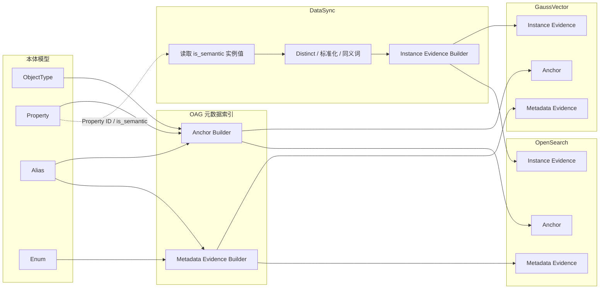
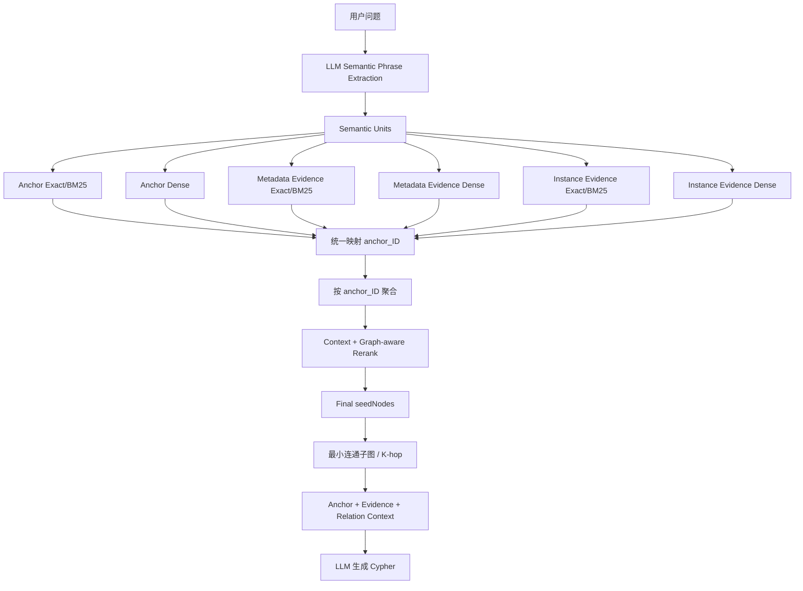

# OAG 面向本体锚点的语义检索与混合索引设计方案

> 版本：V3  
> 核心目标：所有检索能力最终服务于 **ObjectType / Property 本体元数据锚点的精准识别**，并同时保留同义词、枚举值、实例值与锚点之间的映射，为后续本体子图构建和 Cypher 生成提供充分依据。

---

## 1. 设计背景

OAG 的向量检索、OpenSearch 全文检索、同义词检索、枚举值检索、实例列值检索和多语言检索，本质上都不是为了返回“某个向量文档”本身。

最终目标是：

```text
用户自然语言问题
    ↓
识别业务语义短语
    ↓
召回本体对象 / 属性及相关语义证据
    ↓
统一映射到 ObjectType / Property Anchor
    ↓
形成 seedNodes
    ↓
结合本体关系构建最小连通子图 / K-hop 子图
    ↓
为 LLM 生成 Cypher 提供：
ObjectType + Property + Relation + Canonical Value + Alias Mapping
```

因此，本方案的核心设计原则为：

> **Anchor First，Evidence for Anchor，Evidence 同时保留 Cypher 所需的值映射信息。**

其中：

- `ObjectType`、`Property` 是最终需要精确定位的 **Anchor**；
- ObjectType/Property 同义词、枚举值、枚举别名、实例列值、实例值同义词是 **Evidence**；
- Evidence 检索命中后必须能够直接回溯到对应的 ObjectType / Property；
- Evidence 本身还需要保留 `canonical_value / alias / property_name / object_type_name` 等信息，供下游生成查询过滤条件。

---

## 2. 从当前本体子图结果得到的设计约束

当前 OAG 子图结构已经体现出以下运行特征：

### 2.1 一个自然语言短语可能对应多个 Property

例如一个用户语义短语可能得到：

```text
“发生时间”
 → update_time
 → firstoccurrence
 → lastoccurrence
```

以及：

```text
“基站”
 → base_station
 → base_station
 → name
```

因此检索阶段的目标不是：

```text
一个短语 → 强制唯一 Property
```

而是：

```text
一个 Semantic Unit
    ↓
TopK Anchor Candidates
    ↓
结合 ObjectType、其他语义单元、关系连通性和 Rerank 消歧
```

### 2.2 seedNodes 应保持“用户短语 → 候选 Anchor”映射

推荐继续保留类似：

```json
{
  "llmDrawEntityName": "发生时间",
  "id": [
    "property-id-1",
    "property-id-2",
    "property-id-3"
  ],
  "name": [
    "update_time",
    "firstoccurrence",
    "lastoccurrence"
  ]
}
```

但建议进一步补充匹配证据和 Parent ObjectType。

### 2.3 Relation 不需要全部进入向量索引

当前本体子图已经能够通过：

```text
has_property
defines_relation
```

连接 ObjectType 与 Property，以及不同 ObjectType。

关系边中还包含：

```text
businessSemanticType
junctionConfig
sourceName
targetName
cardinality
linkType
```

这些内容才是后续 Cypher JOIN / MATCH 路径生成的重要依据。

因此本方案仍然坚持：

> **向量召回阶段重点定位 ObjectType / Property Anchor；Relation 在 Anchor 命中后从本体图中扩展获得。**

无需为了生成 Cypher 而把所有 Relation 全量放入向量表。

---

# 3. 最终逻辑模型：Anchor + Evidence

```text
                    OAG Semantic Retrieval
                           │
             ┌─────────────┴─────────────┐
             │                           │
        Anchor Layer                Evidence Layer
             │                           │
     ObjectType / Property       Alias / Enum / Instance
             │                           │
             └─────────────┬─────────────┘
                           │
                      anchor_id
                           │
                           ▼
                 Ontology Anchor Set
                           │
                           ▼
             本体图扩展 / 最小连通子图
                           │
                           ▼
                Cypher Generation Context
```

---

# 4. Anchor 的定义

Anchor 是最终要返回给本体图扩展模块的元数据节点。

当前定义：

```text
type = 0 : ObjectType
type = 1 : Property
```

未来可扩展 Relation、Metric、Function 等，但本方案当前不修改 `type=0/1` 的既有约定。

Anchor 的核心字段：

```text
ID
type
parent_ID
name
display
description
aliases
```

其中：

- `ID`：直接使用本体元素全局唯一 ID；
- `parent_ID`：
  - ObjectType 为空；
  - Property 记录其所属 ObjectType ID；
- `name`：真实本体模型名称，供子图和 Cypher 使用；
- `aliases`：该锚点的同义词集合；
- `vector/content`：用于语义召回。

---

# 5. Evidence 的定义

Evidence 是可以帮助定位 Anchor 的检索证据，同时承担下游值映射职责。

推荐 Evidence 类型：

| evidence_type | 含义 | 最终映射 |
|---|---|---|
| `OBJECT_ALIAS` | ObjectType 同义词 | ObjectType Anchor |
| `PROPERTY_ALIAS` | Property 同义词 | Property Anchor |
| `ENUM_VALUE` | 属性枚举值 | Property Anchor |
| `ENUM_ALIAS` | 枚举值同义词 | Property Anchor |
| `INSTANCE_VALUE` | 语义实例列值 | Property Anchor |
| `INSTANCE_ALIAS` | 实例值同义词 | Property Anchor |

注意：

> Evidence 的最终目标仍然是 Anchor，但 Evidence 自身不能被丢弃，因为它可能决定 Cypher 中实际使用的过滤值。

例如：

```text
用户说：正式用户
Evidence 命中：FORMAL
canonical_value = 1
anchor_id = Subscriber.subClass 的 Property ID
```

下游最终需要同时知道：

```text
Property = subClass
Query Value = 1
Matched Alias = FORMAL
```

才能正确生成：

```text
WHERE s.subClass = '1'
```

而不是错误生成：

```text
WHERE s.subClass = 'FORMAL'
```

---

# 6. 物理索引划分

逻辑上只有两层：

```text
Anchor
Evidence
```

物理上建议拆成三类，主要考虑职责和数据量差异：

## 6.1 OAG Anchor Index

```text
{ontology_id}_anchor
```

由 **OAG** 创建和维护。

包含：

```text
ObjectType
Property
```

## 6.2 OAG Metadata Evidence Index

```text
{ontology_id}_metadata_evidence
```

由 **OAG** 创建和维护。

包含：

```text
ObjectType Alias
Property Alias
Enum Value
Enum Alias
Enum Description
```

## 6.3 DataSync Instance Evidence Index

```text
{ontology_id}_instance_evidence
```

由 **DataSync** 创建、更新和维护。

包含：

```text
is_semantic=true 的 Instance Value
Instance Value Alias / Synonym
```

这样既保持 Anchor/Evidence 逻辑统一，又明确 OAG 与 DataSync 的职责边界。

---

# 7. 多语言向量化设计

## 7.1 最终建议

对于描述**同一个 Anchor 或同一个 Evidence**的中文、英文、西班牙语等内容：

> **默认拼入同一个向量文本，不按语言拆多个 Vector。**

原因是最终目标不是识别语言，而是识别同一个本体锚点。

例如：

```text
name
display_zh
display_en
display_es
aliases_zh/en/es
description_zh
description_en
description_es
```

如果这些字段都在描述同一个 Property：

```text
Subscriber.subClass
```

则它们可以共同构成一个 multilingual semantic profile。

## 7.2 与“超长拼接”的区别

允许：

```text
Property name
+ 该 Property 的多语言显示名
+ 该 Property 的多语言 Alias
+ 该 Property 的多语言 Description
```

不允许：

```text
Property
+ 该 Property 的全部枚举值
+ 该 Property 的全部实例值
+ 其他 Property
```

判断原则：

> **是否仍然只表达一个 Anchor / Evidence。**

## 7.3 Language 字段

第一版不建议在 Anchor / Evidence Vector 表中强制增加 `language` 过滤字段。

因为一个 Vector 本身就是：

```text
zh + en + es + ...
```

混合语义 Profile。

LLM 可以输出 `language_hint`，但仅作为：

```text
日志
可观测性
OpenSearch analyzer hint
可选 ranking boost
```

不作为：

```text
WHERE language = xxx
```

的硬过滤条件。

---

# 8. Anchor Vector 拼接规范

现有 OAG 已实现：

```text
{name}
{display_zh}
{display_en}
{description_zh}
{description_en}
```

本方案以此为基线进行兼容性增强。

推荐顺序：

```text
{name}
{display_zh}
{display_en}
{aliases}
{description_zh}
{description_en}
{other_i18n_display_and_description}
```

约束：

1. `name` 永远第一行；
2. 中文、英文 Display 延续当前顺序；
3. Alias 数量较少时可直接加入；
4. Description 放在 Alias 后；
5. 西语等扩展语言放在后部；
6. 不拼入枚举值和实例值。

---

# 9. ObjectType Anchor Vector

示例：

```text
Subscriber
用户
Subscriber
Mobile Number; Number; Mobile Phone
用户实体，代表服务的实际使用者，对应电话号码或宽带账号。
Subscriber entity representing the actual user of services, corresponding to a phone number or broadband.
...
```

生成：

```text
ID   = ObjectType 全局唯一 ID
type = 0
```

---

# 10. Property Anchor Vector

## 10.1 是否要把 ObjectType 放在向量开头？

### 最终结论

> **默认不放。Property Anchor Vector 第一行仍然只使用 Property 自身的 `name`。**

即不推荐：

```text
Subscriber
subClass
Subscriber category
...
```

也不推荐：

```text
Subscriber.subClass
...
```

作为默认主向量格式。

推荐：

```text
subClass
用户类别
Subscriber category
Subscriber category
用户类别。
Subscriber category.
```

## 10.2 为什么不把 ObjectType 放在开头

OAG 最终是从用户短语中寻找 Property。

用户可能只说：

```text
发生时间
站点名称
告警原因
用户类别
```

而不一定明确说出 ObjectType。

如果将 ObjectType 放在最前面，会让 Property Vector 的主语义从：

```text
Property自身语义
```

偏移为：

```text
Object + Property联合语义
```

可能降低只输入 Property 概念时的召回。

## 10.3 Property 重名怎么解决

不通过修改主 Vector 解决，而通过以下字段和流程解决：

```text
Property Candidate
    ↓
ID
parent_ID
    ↓
Parent ObjectType
    ↓
结合 main_object_hint / 其他 Anchor / 图连通性
    ↓
Rerank
```

例如多个 ObjectType 都有：

```text
name
id
status
```

Vector 允许它们成为相似候选。

真正的消歧依据应该是：

```text
parent_ID
ObjectType candidate
图结构
Query全局上下文
```

而不是让 ObjectType 名称污染 Property 主向量。

## 10.4 可选增强

如果实际评测发现大量同名 Property 难以区分，可增加**上下文 Shadow Vector**：

```text
主向量：
{name}
{display}
{alias}
{description}

Shadow Vector：
{name}
{parent_object_name}
{display}
{description}
```

但第一版不建议默认启用。

---

# 11. GaussVector Anchor 表结构

推荐表名：

```text
{ontology_id}_anchor
```

结构：

| # | 字段名称 | 字段类型 | 是否非空 | 注释 |
|---|---|---|---|---|
| 1 | `vector` | `DOUBLE[]` | ✔ | 本体 Anchor 向量，用于 Dense 语义召回 |
| 2 | `type` | `INT` | ✔ | 本体元素类型：0 ObjectType，1 Property |
| 3 | `ID` | `VARCHAR(256 CHAR)` | ✔ | **直接使用本体元素全局唯一 ID，不做 Hash** |
| 4 | `parent_ID` | `VARCHAR(256 CHAR)` |  | 当 `type=1` 时记录 Property 所属 ObjectType ID |
| 5 | `name` | `VARCHAR(256 CHAR)` | ✔ | ObjectType / Property 真实名称 |
| 6 | `display_en` | `VARCHAR(512 CHAR)` |  | 英文显示名称 |
| 7 | `display_zh` | `VARCHAR(512 CHAR)` |  | 中文显示名称 |
| 8 | `description_en` | `VARCHAR(1024 CHAR)` |  | 英文描述 |
| 9 | `description_zh` | `VARCHAR(1024 CHAR)` |  | 中文描述 |
| 10 | `aliases` | `TEXT` |  | ObjectType / Property 多语言同义词，建议 JSON Array |
| 11 | `i18n_content` | `TEXT` |  | 西语等扩展语言的 display / description / alias |
| 12 | `content` | `TEXT` | ✔ | 实际送入 Embedding 的完整文本，便于追踪和重建 |
| 13 | `content_hash` | `VARCHAR(64 CHAR)` |  | 内容摘要，支持增量重建 |
| 14 | `model_version` | `VARCHAR(128 CHAR)` |  | Embedding 模型版本 |
| 15 | `source_version` | `VARCHAR(128 CHAR)` |  | 本体版本 |

说明：

- `ID` 就是 `anchor_id`；
- 不再额外维护一个 Hash `anchor_id`；
- 对 Property，`parent_ID` 是后续消歧和子图构建的关键字段。

---

# 12. Anchor 向量索引

当前 Anchor 元数据规模适合使用：

```text
GsIVFFLAT
COSINE
```

适用规模：

```text
1 * 10^4 ~ 2 * 10^6
```

推荐：

```text
IVF_NLIST = 4 * sqrt(N)
```

其中：

```text
N = Anchor 表实际记录数
```

工程实现建议：

```text
nlist = round(4 * sqrt(N))
```

并受 GaussVector 实际允许范围约束。

注意：

> `N` 应使用实际 Anchor 记录数，而不是本体实例数据量。

---

# 13. OpenSearch Anchor 索引

推荐：

```text
{ontology_id}_anchor
```

字段：

| # | 字段名称 | 字段类型 | 是否非空 | 注释 |
|---|---|---|---|---|
| 1 | `content` | `text` | ✔ | 与 Vector Embedding 文本保持一致 |
| 2 | `type` | `integer` | ✔ | 0 ObjectType，1 Property |
| 3 | `ID` | `keyword` | ✔ | 本体元素全局唯一 ID |
| 4 | `parent_ID` | `keyword` |  | Property 所属 ObjectType ID |
| 5 | `name` | `keyword` | ✔ | 元数据真实名称 |
| 6 | `display_en` | `keyword` |  | 英文显示名 |
| 7 | `display_zh` | `keyword` |  | 中文显示名 |
| 8 | `description_en` | `keyword` |  | 英文描述原值 |
| 9 | `description_zh` | `keyword` |  | 中文描述原值 |
| 10 | `aliases` | `keyword` |  | 同义词数组 |
| 11 | `i18n_content` | `text` |  | 扩展多语言文本 |
| 12 | `source_version` | `keyword` |  | 本体版本 |

全文召回主要使用：

```text
content
```

精确召回使用：

```text
ID
name
aliases
```

---

# 14. 为什么还需要 Evidence Index

只升级 Anchor 表仍然不足以覆盖：

```text
用户输入枚举值
用户输入枚举别名
用户输入实例列值
用户输入业务黑话
```

因为这些字符串可能完全不会出现在 Property 自身的：

```text
name/display/description
```

例如：

```text
用户输入：IOT_FORMAL
真正需要的 Anchor：Subscriber.subClass
```

必须通过：

```text
Evidence → Property ID
```

才能完成映射。

---

# 15. Metadata Evidence 表结构

推荐表名：

```text
{ontology_id}_metadata_evidence
```

由 OAG 负责。

| # | 字段 | 类型 | 是否非空 | 说明 |
|---|---|---|---|---|
| 1 | `vector` | `DOUBLE[]` | ✔ | Evidence Dense Vector |
| 2 | `evidence_ID` | `VARCHAR(512 CHAR)` | ✔ | Evidence 唯一标识 |
| 3 | `evidence_type` | `INT` | ✔ | 0 Object Alias；1 Property Alias；2 Enum Value；3 Enum Alias |
| 4 | `anchor_ID` | `VARCHAR(256 CHAR)` | ✔ | 映射到的 ObjectType / Property ID |
| 5 | `anchor_type` | `INT` | ✔ | 0 ObjectType；1 Property |
| 6 | `parent_ID` | `VARCHAR(256 CHAR)` |  | Property 对应 ObjectType ID |
| 7 | `anchor_name` | `VARCHAR(256 CHAR)` | ✔ | ObjectType / Property 真实名称 |
| 8 | `parent_name` | `VARCHAR(256 CHAR)` |  | Property 所属 ObjectType 名称 |
| 9 | `evidence_value` | `VARCHAR(4096 CHAR)` | ✔ | 实际 Evidence 字符串 |
| 10 | `canonical_value` | `VARCHAR(4096 CHAR)` |  | 枚举真实值；Alias 映射后的标准值 |
| 11 | `aliases` | `TEXT` |  | 当前 Value 对应的 Alias 集合 |
| 12 | `enum_ref` | `VARCHAR(256 CHAR)` |  | 枚举类型引用 |
| 13 | `description` | `TEXT` |  | 多语言 Evidence Description |
| 14 | `content` | `TEXT` | ✔ | Embedding 文本 |
| 15 | `source_type` | `INT` | ✔ | 固定为 OAG_METADATA |
| 16 | `source_version` | `VARCHAR(128 CHAR)` |  | 本体版本 |

关键点：

> Evidence 表直接冗余 `anchor_name + parent_name`，避免下游 Cypher 生成阶段为了知道真实 ObjectType / Property 名称再做一次查询。

---

# 16. OpenSearch Metadata Evidence 索引

推荐：

```text
{ontology_id}_metadata_evidence
```

主要字段：

```text
content            text
evidence_ID        keyword
evidence_type      integer
anchor_ID          keyword
anchor_type        integer
parent_ID          keyword
anchor_name        keyword
parent_name        keyword
evidence_value     keyword + text
canonical_value    keyword
aliases            keyword + text
enum_ref           keyword
description        text
```

OpenSearch 的职责：

1. 原始字符串直接命中；
2. Alias 命中；
3. BM25 召回；
4. 保留 Value → Canonical Value → Property 的确定性映射。

---

# 17. anchor_id / evidence_id 设计

## 17.1 anchor_id

不再 Hash。

直接定义：

```text
anchor_id = 本体元素 ID
```

例如：

```text
dtmi.07a3e859.object-type.637379322b80b4fe.1
dtmi.07a3e859.property-type.0d06c670-b068931c.1
```

原因：

- 本体元素 ID 已经全局唯一；
- GraphDB 节点同样使用该 ID；
- 检索结果可以零转换进入 seedNodes；
- 下游无需维护额外 ID 映射；
- 调试和问题定位更容易。

因此 Anchor 表字段统一使用：

```text
ID
```

语义上即：

```text
anchor_id
```

## 17.2 evidence_id

Evidence 通常没有天然的全局本体 ID，例如：

```text
Alias
Enum Alias
Instance Value
```

因此 `evidence_ID` 只承担存储唯一键职责，不作为下游业务 ID。

推荐优先策略：

### 如果源模型存在唯一 ID

直接复用：

```text
evidence_ID = source evidence id
```

### 如果源模型没有唯一 ID

构造稳定 ID：

```text
{anchor_ID}::{evidence_type}::{source_key}
```

其中 `source_key`：

- Enum 可使用 enum_ref + value；
- Alias 可使用 alias 序号或稳定 normalized value；
- Instance Value 可使用 DataSync 的稳定 value key。

只有当任意字符串过长或含特殊字符导致数据库主键不适合时，**仅对 evidence_ID 的 source_key 部分做 Hash**。

不对 `anchor_ID` 做 Hash。

---

# 18. Enum Value Vector 设计

## 18.1 是否把 ObjectType / Property 名称放在开头？

### 最终结论

> **不放在开头。Value / Alias 必须是 Evidence Vector 的首要语义。**

不推荐：

```text
ObjectType: Subscriber
Property: subClass
Value: FORMAL
...
```

因为用户真正输入的通常可能只有：

```text
FORMAL
正式用户
IOT商用终端
某个未知字符串
```

如果 ObjectType / Property 占据开头，会稀释 Value 本身。

## 18.2 推荐拼接

```text
{value}
{aliases}
{description_zh}
{description_en}
{description_es...}
{property_display_or_description_optional}
```

例如：

```text
1
FORMAL
正式用户，正式签订合同的用户。
Formally contracted subscriber.
用户类别
Subscriber category
```

其中：

- `1` / `FORMAL` / 描述是主语义；
- Property 语义只作为**尾部弱上下文**；
- 不默认加入 ObjectType 名称。

## 18.3 为什么仍保存 ObjectType / Property

不是放在向量开头，而是保存为 Metadata：

```text
anchor_ID
anchor_name
parent_ID
parent_name
```

这样可以做到：

```text
Query → Evidence
          ↓
       Property Anchor
          ↓
       ObjectType
```

并同时保留 Cypher 所需真实字段名。

---

# 19. 任意字符串不需要预判类型

`1 / FORMAL` 只是示例。

真实 Query 可能出现任意字符串：

```text
ABC_2026
套餐A
CELL-001
Jakarta
Gold
IOT_FORMAL
某个业务黑话
```

OAG 不需要在检索前知道：

```text
它是 Enum？
Alias？
Instance Value？
ObjectType？
Property？
```

每个 Semantic Unit 统一执行：

```text
Anchor Exact/BM25
Anchor Dense

Metadata Evidence Exact/BM25
Metadata Evidence Dense

Instance Evidence Exact/BM25
Instance Evidence Dense
```

因此：

> **“不知道字符串类型”不是不能做 Exact Search 的理由。**

Exact Search 的含义只是：

```text
用这个原始短语尝试 keyword 命中
```

没有命中即为空，不需要提前分类。

---

# 20. Instance Evidence 设计

Instance Value 与 Enum 的区别是：

```text
Enum：本体元数据
Instance：底层业务数据
```

因此必须由不同组件负责。

---

# 21. DataSync Instance Evidence 表结构

推荐：

```text
{ontology_id}_instance_evidence
```

由 DataSync 负责。

| 字段 | 说明 |
|---|---|
| `vector` | 实例 Value / Alias 向量 |
| `evidence_ID` | DataSync 生成的稳定唯一键 |
| `evidence_type` | INSTANCE_VALUE / INSTANCE_ALIAS |
| `anchor_ID` | 对应 Property ID |
| `anchor_type` | 固定为 1 |
| `parent_ID` | Property 所属 ObjectType ID |
| `anchor_name` | Property name |
| `parent_name` | ObjectType name |
| `evidence_value` | 实际列值 |
| `canonical_value` | 标准值，默认等于实际列值 |
| `aliases` | 实例值同义词 |
| `content` | 向量化文本 |
| `source_type` | DATASYNC_INSTANCE |
| `data_version` | 实例数据同步版本 |

---

# 22. Instance Value Vector 拼接

同样不建议以：

```text
ObjectType
Property
```

作为开头。

推荐：

```text
{instance_value}
{instance_value_aliases}
{optional_property_display}
{optional_property_description}
```

例如：

```text
VIP
VIP客户; 高价值客户
用户等级
Subscriber level
```

这样 Query：

```text
高价值客户
```

首先在 Vector 中接近：

```text
VIP / VIP客户
```

然后通过 Metadata：

```text
anchor_ID = subLevel Property ID
```

定位 Property。

---

# 23. DataSync 流程与职责分工

## 23.1 OAG 负责元数据层面入库

OAG 负责的数据来自本体模型：

```text
ObjectType
Property
ObjectType Alias
Property Alias
Enum Definition
Enum Value
Enum Alias
多语言 Display / Description
```

OAG 职责：

```text
读取本体模型
  ↓
构建 Anchor Document
  ↓
创建 / 更新 Anchor GaussVector
  ↓
创建 / 更新 Anchor OpenSearch
  ↓
构建 Metadata Evidence
  ↓
创建 / 更新 Metadata Evidence GaussVector/OpenSearch
```

## 23.2 DataSync 负责实例数据入库

DataSync 负责：

```text
读取 is_semantic=true Property
   ↓
访问底层实例数据
   ↓
提取 / 去重语义列值
   ↓
补充实例值同义词
   ↓
构建 Instance Evidence
   ↓
写 GaussVector + OpenSearch
```

## 23.3 边界原则

```text
本体模型定义的数据 → OAG
底层数据源中的真实实例值 → DataSync
```

OAG 不扫描业务数据库生成实例 Value。

DataSync 不重复创建 ObjectType / Property 元数据 Anchor。

## 23.4 DataSync 向 OAG 对齐的关键键

双方通过：

```text
ontology_id
Property ID = anchor_ID
ObjectType ID = parent_ID
```

完成统一关联。

这样 DataSync 不需要复制一套自己的语义模型。

---

# 24. Instance 数据量与索引类型

Anchor 和 Metadata Evidence 一般属于元数据量级：

```text
10^4 ~ 10^6
```

优先使用：

```text
GsIVFFLAT
```

Instance Evidence 可能达到：

```text
千万 / 亿
```

因此建议：

```text
N <= 2 * 10^6
 → GsIVFFLAT

千万级及以上
 → GsDiskANN
```

避免所有表机械使用同一种 ANN。

---

# 25. Property 向量上下文设计

## 25.1 Property 的目标

Property Anchor Vector 的目标是：

```text
“发生时间”
→ update_time / firstoccurrence / lastoccurrence

“基站”
→ base_station / name
```

允许一个短语召回多个 Property。

## 25.2 为什么不把 ObjectType 作为 Property Vector 开头

最终方案：

```text
第一行只使用 Property name
```

ObjectType 不作为默认向量开头。

原因：

1. 查询经常没有 ObjectType；
2. Property 本身才是当前检索目标；
3. ObjectType 名称会稀释 Property 语义；
4. 当前 OAG 已经有 `parent_ID` 可以恢复 ObjectType；
5. 本体图的 `has_property` 可以进一步验证归属；
6. Rerank 可以结合 main_object_hint 进行上下文消歧。

推荐主 Vector：

```text
{name}
{display_zh}
{display_en}
{aliases}
{description_zh}
{description_en}
```

Metadata：

```text
ID
parent_ID
```

联合解决召回和归属问题。

---

# 26. Enum / Instance Value 向量上下文设计

## 26.1 Enum Value 为什么不以 ObjectType / Property 开头

Enum Value 的用户 Query 通常是：

```text
Value
Alias
Value的自然语言解释
```

因此核心匹配目标是 Value 语义，而不是 Property 名称。

推荐：

```text
{value}
{aliases}
{description}
{optional property semantic context}
```

ObjectType / Property 映射通过：

```text
anchor_ID
parent_ID
anchor_name
parent_name
```

存储。

## 26.2 Instance Value 为什么不以 ObjectType / Property 开头

同理，实例值的主语义来自：

```text
column value
value synonym
```

例如：

```text
高价值客户
```

需要先召回：

```text
VIP
```

再映射：

```text
VIP
 → Subscriber.subLevel
```

如果 Vector 以：

```text
Subscriber
subLevel
```

开头，反而可能使短 Value Query 的语义权重下降。

## 26.3 什么时候追加 Property Context

对于高度泛化的 Value：

```text
active
normal
1
A
default
```

可以在向量尾部加入：

```text
property display
property description
```

作为弱上下文。

因此推荐规则是：

> **Value First，Property Context Last，Mapping in Metadata。**

---

# 27. OpenSearch 与 GaussVector 的职责

## 27.1 GaussVector

解决：

```text
语义近似
跨语言
同义改写
自然语言描述
业务黑话
```

## 27.2 OpenSearch

解决：

```text
原始字符串命中
名称命中
Alias 命中
BM25
未知类型字符串兜底
```

## 27.3 两者必须使用一致 Mapping

无论是 Vector 还是 OpenSearch Evidence，都必须至少带：

```text
anchor_ID
anchor_type
parent_ID
anchor_name
parent_name
canonical_value
evidence_value
aliases
```

确保任意检索通道返回后，都能直接映射到本体元数据和 Cypher 过滤条件。

---

# 28. 最终召回通道

对每一个 Semantic Unit：

```text
                         Semantic Unit
                               │
          ┌────────────────────┼────────────────────┐
          │                    │                    │
      Anchor Index       Metadata Evidence    Instance Evidence
          │                    │                    │
      Exact/BM25            Exact/BM25            Exact/BM25
      Dense                 Dense                 Dense
          │                    │                    │
          └────────────────────┼────────────────────┘
                               ▼
                       Anchor Candidate Pool
                               ▼
                    GROUP BY anchor_ID
                               ▼
                ObjectType / Property Rerank
                               ▼
                         Final Anchors
```

---

# 29. Anchor 聚合规则

一个 Semantic Unit 可能通过多个 Evidence 命中同一个 Property：

```text
“正式用户”
  ↓
FORMAL
  ↓
Value Description
  ↓
Property Alias
```

最终都映射：

```text
anchor_ID = subClass Property ID
```

因此最终排名单位必须是：

```text
anchor_ID
```

不是：

```text
vector document
```

建议聚合保留：

```text
max_dense_score
max_bm25_score
exact_hit_count
matched_evidence_count
matched_evidence_types
matched_values
matched_aliases
```

供 Rerank 使用。

---

# 30. LLM 分词 / Query Understanding 结构优化

当前结构：

```json
{
  "main_object": "Cell",
  "aggregation": "sum",
  "objectType": ["Type1", "Type2"],
  "property": ["prop1", "prop2"],
  "concepts": ["concept1"],
  "essential_ids": ["id1", "id2"],
  "slot_top_k_overrides": {
    "slot1": 5,
    "slot2": 10
  }
}
```

存在几个问题：

1. LLM 在检索前被要求过早判断 `objectType/property/concepts`；
2. 一个自然语言短语可能对应多个 Property，强分类容易造成漏召回；
3. 缺少“哪个原始短语产生哪个候选”的可追踪信息；
4. 缺少 phrase 级语言信息；
5. `essential_ids` 在 Anchor 尚未检索前语义不清；
6. `slot_top_k_overrides` 属于检索策略，不建议让 LLM 直接决定；
7. Mixed Language Query 不适合逐词分类。

---

# 31. 推荐 LLM Semantic Unit 输出结构

推荐改为：

```json
{
  "main_object_hint": "Cell",
  "aggregation": {
    "operator": "sum",
    "target": null
  },
  "semantic_units": [
    {
      "text": "影响业务的活跃告警",
      "role_hint": "unknown",
      "language_hint": "zh",
      "importance": "required"
    },
    {
      "text": "TICKETID",
      "role_hint": "unknown",
      "language_hint": "und",
      "importance": "required"
    },
    {
      "text": "发生时间",
      "role_hint": "property_or_value",
      "language_hint": "zh",
      "importance": "required"
    },
    {
      "text": "基站",
      "role_hint": "object_or_property_or_value",
      "language_hint": "zh",
      "importance": "required"
    }
  ],
  "object_type_hints": ["Cell"],
  "constraints": [],
  "output_intent": "ontology_subgraph"
}
```

## 31.1 role_hint 只是 Hint

允许：

```text
object
property
value
object_or_property
property_or_value
object_or_property_or_value
unknown
```

但检索层不能因为 `role_hint=property` 就关闭其他索引。

它只是：

```text
Boost
```

不是：

```text
Hard Filter
```

## 31.2 language_hint 是否需要 LLM 标记？

### 推荐：标记 Semantic Unit，不标记每一个“单词”

原因：

1. OAG 需要的是语义短语，不是普通 tokenizer；
2. `Mobile Number` 不应该拆成 `Mobile + Number`；
3. `FORMAL用户` 本身可以是 mixed phrase；
4. BGE-M3 已经支持多语言语义；
5. Language 不是主要召回条件。

推荐值：

```text
zh
en
es
mixed
und
```

用途：

```text
观测
OpenSearch analyzer hint
轻量 boost
```

不用于强制过滤 Vector。

## 31.3 不建议 LLM 输出 slot_top_k_overrides

TopK 属于检索系统策略，应由：

```text
OAG配置
数据规模
索引类型
Recall评测结果
```

共同决定。

LLM 可以输出：

```text
importance
```

系统再映射：

```text
required → higher topK
optional → normal topK
```

避免 LLM 直接控制底层性能参数。

---

# 32. Semantic Phrase Extraction 原则

错误：

```text
FORMAL
用户
Mobile
Number
```

推荐：

```text
FORMAL用户
Mobile Number
```

或者同时保留：

```text
FORMAL用户
FORMAL
用户
Mobile Number
```

但主检索单元必须优先是完整业务短语。

推荐 prompt 约束：

> 以“可独立映射到本体对象、属性、属性值或业务概念”的最小完整语义短语为单位拆分，不按自然语言词法逐词拆分；保留英文复合词、业务编码、大小写、下划线和混合语言表达。

---

# 33. seedNodes 输出结构升级

现有 seedNodes 可升级为：

```json
{
  "llmDrawEntityName": "基站",
  "candidates": [
    {
      "ID": "property-id-1",
      "type": 1,
      "name": "base_station",
      "parent_ID": "object-id-1",
      "parent_name": "RAN_2G_CELL",
      "score": 0.86,
      "match": {
        "source": "ANCHOR",
        "evidence_type": null,
        "evidence_value": null,
        "canonical_value": null
      }
    },
    {
      "ID": "property-id-2",
      "type": 1,
      "name": "name",
      "parent_ID": "object-id-2",
      "parent_name": "SYS_SITE",
      "score": 0.83,
      "match": {
        "source": "ANCHOR",
        "evidence_type": null
      }
    }
  ]
}
```

如果通过枚举命中：

```json
{
  "llmDrawEntityName": "正式用户",
  "candidates": [
    {
      "ID": "subClass-property-id",
      "type": 1,
      "name": "subClass",
      "parent_ID": "subscriber-object-id",
      "parent_name": "Subscriber",
      "score": 0.91,
      "match": {
        "source": "METADATA_EVIDENCE",
        "evidence_type": "ENUM_ALIAS",
        "evidence_value": "FORMAL",
        "canonical_value": "1",
        "aliases": ["FORMAL"]
      }
    }
  ]
}
```

这使后续 LLM 不仅知道“哪个 Property”，还知道：

```text
为什么命中
用户输入对应什么真实值
Cypher 应该使用哪个 canonical value
```

---

# 34. Cypher 生成需要的最小充分上下文

OAG 最终提供给下游的 Context 至少包含：

## Anchor

```text
ObjectType ID
ObjectType name

Property ID
Property name
Property parent_ID
```

## Value Mapping

如果命中 Evidence：

```text
matched user phrase
evidence_type
evidence_value
canonical_value
aliases
enum_ref
```

## Graph Context

从本体图扩展：

```text
defines_relation
has_property
businessSemanticType
relation name
cardinality
junctionConfig
source/target Property mapping
```

因此完整链路：

```text
Vector / BM25
 → 找 Anchor
 → Evidence 提供值映射
 → Graph 提供 Relation / JOIN 映射
 → LLM 生成 Cypher
```

职责清晰，不需要把所有 Cypher 信息都塞进向量表。

---

# 35. GsIVFFLAT / GsDiskANN 选择

## Anchor

```text
GsIVFFLAT
```

## Metadata Evidence

若规模：

```text
<= 2 * 10^6
```

使用：

```text
GsIVFFLAT
```

并：

```text
IVF_NLIST = 4 * sqrt(N)
```

## Instance Evidence

按规模动态选择：

```text
中小规模 → GsIVFFLAT
千万 / 亿级 → GsDiskANN
```

这样和数据层级的真实规模匹配。

---

# 36. OpenSearch 检索优先级

建议：

```text
1. ID / name / evidence_value / alias exact
2. Anchor content BM25
3. Evidence content BM25
4. GaussVector Dense
5. Anchor 聚合
6. Rerank
```

注意：

Exact 是“尝试匹配”，不是“预先识别字符串类型”。

---

# 37. Rerank 输入

Rerank 不应只看：

```text
query + candidate name
```

推荐输入：

```text
原始 Query
Semantic Unit
Anchor name/display/description
Parent ObjectType
matched Evidence
canonical_value
其他已命中的 Anchors
候选之间的图连通性
```

重点判断：

```text
这个 Anchor 是否是 Query 中当前短语在完整问题上下文下最合理的本体元数据落点。
```

---

# 38. TopK 策略

不建议：

```text
topK = 3
```

作为粗排固定值。

建议初始基线：

```text
每个 Semantic Unit / Channel：
TopK = 10 ~ 20

Anchor 聚合后：
20 ~ 50

Rerank 后：
3 ~ 10
```

实际值通过评测确定。

---

# 39. 多对象 Query 的处理

对于：

```text
站点上影响业务的活跃告警发生时间
```

Semantic Units：

```text
站点
影响业务的活跃告警
发生时间
```

分别允许多候选。

随后通过：

```text
SYS_SITE
 ↓ SITE_TO_ALARM
AP_ALARM_LIVE
```

以及：

```text
has_property
```

判断哪些 Property 处于同一个可连通子图中。

因此：

> **多对象场景的消歧应该在“Anchor Candidate + 本体图连通性”阶段完成，而不是完全依赖 LLM 分词阶段。**

---

# 40. 索引写入架构



---

# 41. 运行态检索架构



---

# 42. 数据更新策略

## OAG

本体模型变更：

```text
ObjectType/Property name/display/description/alias
 → 重建对应 Anchor

Enum/Alias
 → 重建对应 Metadata Evidence
```

## DataSync

实例变化：

```text
is_semantic Property
 → 增量提取 DISTINCT Value
 → 新增 / 删除 Instance Evidence
```

建议保留：

```text
content_hash
source_version
model_version
```

避免无效重复 Embedding。

---

# 43. 数据质量检查

OAG Metadata Sync：

```text
Alias重复
Alias与Canonical重复
同一Object下Property Alias冲突
Enum Ref不存在
Enum Alias冲突
多语言Description格式错误
```

DataSync：

```text
高基数检查
Value长度检查
空值检查
Instance Alias冲突
is_semantic配置检查
```

对于 Alias 冲突：

```text
不能静默覆盖
```

因为它会直接影响 Anchor 召回和 Cypher 条件生成。

---

# 44. 评测目标

最终不要只评测 Vector Similarity。

核心指标：

```text
ObjectAnchorRecall@K
PropertyAnchorRecall@K
AnchorMRR
AnchorNDCG
EvidenceToAnchorAccuracy
EnumCanonicalValueAccuracy
InstanceValueToPropertyAccuracy
CrossLanguageAnchorRecall@K
MultiObjectSubgraphRecall
CypherAnchorAccuracy
CypherValueMappingAccuracy
```

尤其新增两个直接面向下游的指标：

```text
CypherAnchorAccuracy
CypherValueMappingAccuracy
```

用于验证：

```text
检索结果是否真的帮助 LLM 生成正确 Cypher
```

---

# 45. 推荐最终表与职责清单

| 存储 | 表/索引 | Owner | 数据 |
|---|---|---|---|
| GaussVector | `{ontology_id}_anchor` | OAG | ObjectType / Property |
| OpenSearch | `{ontology_id}_anchor` | OAG | ObjectType / Property |
| GaussVector | `{ontology_id}_metadata_evidence` | OAG | Alias / Enum |
| OpenSearch | `{ontology_id}_metadata_evidence` | OAG | Alias / Enum |
| GaussVector | `{ontology_id}_instance_evidence` | DataSync | 实例 Value / Alias |
| OpenSearch | `{ontology_id}_instance_evidence` | DataSync | 实例 Value / Alias |

---

# 46. 最终设计决策

1. **最终目标是 ObjectType / Property Anchor，不是 Enum / Instance Value。**
2. **Evidence 必须保存到 Anchor 的映射，同时保留 canonical value / alias，服务 Cypher。**
3. **Anchor ID 直接使用本体元素全局唯一 ID，不做 Hash。**
4. **Property 通过 parent_ID 记录所属 ObjectType。**
5. **Anchor Vector 保持现有 `name → display → description` 结构，并增量加入 aliases / 扩展语言。**
6. **同一个 Anchor 的中英西等多语言内容默认进入一个 Vector。**
7. **Property Vector 默认不把 ObjectType 放在开头。**
8. **Enum / Instance Value Vector 默认 Value First，不把 ObjectType / Property 放在开头。**
9. **Property Context 必要时放在 Evidence Vector 尾部作为弱上下文，真正映射通过 Metadata 字段完成。**
10. **OAG 负责 ObjectType / Property / Alias / Enum 元数据索引。**
11. **DataSync 负责 is_semantic 实例值索引。**
12. **Anchor / Metadata Evidence 优先 GsIVFFLAT；超大规模 Instance Evidence 使用 GsDiskANN。**
13. **LLM 不做逐单词 tokenizer，而做 Semantic Phrase Extraction。**
14. **LLM 可标 Semantic Unit 的 language_hint，但不作为向量强过滤条件。**
15. **LLM role 只是 Hint，不提前强制确定 ObjectType / Property / Value。**
16. **TopK 由 OAG 配置和评测决定，不由 LLM 直接输出底层参数。**
17. **一个短语允许召回多个 Anchor，最终结合 Parent ObjectType、其他候选和图连通性消歧。**
18. **Relation / junctionConfig 在本体子图阶段提供，不需要塞进向量表。**
19. **seedNodes 建议增加 Parent ObjectType 和 Evidence Mapping。**
20. **最终提供 Anchor + Evidence + Relation 三类上下文给 LLM 生成 Cypher。**

---

# 47. 一句话总结

> **OAG 向量与全文检索的本质不是“找到相似文本”，而是利用 Anchor 本身和 Alias / Enum / Instance 等多源 Evidence，把用户 Query 稳定解析成全局唯一的 ObjectType / Property ID，并同步保留 Property 名称、ObjectType 名称、Canonical Value 与 Alias 映射；再依托本体图关系生成最小连通子图，为 Cypher 提供完整、可解释、可执行的语义依据。**