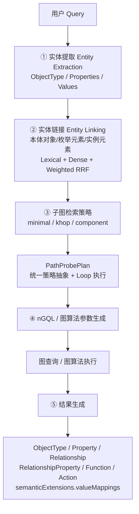
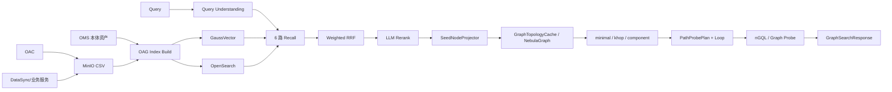
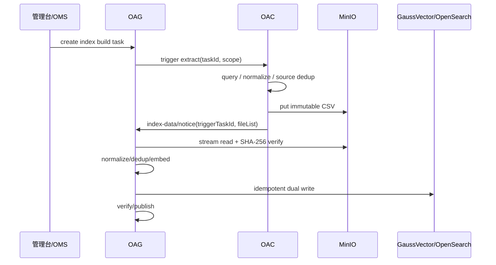

# OAG 面向本体对象的语义检索、混合排序与本体子图构建设计方案

> 版本：V5.17  
> 日期：2026-08-23  
> 目标：形成从 **索引构建 → 实体提取 → Entity Linking → 混合召回/RRF → LLM 精排 → 本体对象投影 → 子图策略/PathProbePlan → nGQL/图算法执行 → 最终子图返回** 的完整设计闭环。  
> V5.17 收敛：PR #42 检视意见已按职责完整吸收到正文对应章节，不再使用“附录覆盖正文”的方式维护规范。第 3 章统一 OAC/BUSINESS_NOTICE 数据读取责任、MinIO 唯一动态数据交付协议、Software/SEC 容量、SHA-256 和 Checkpoint 恢复；第 6 章补齐最终 `GraphSearchResponse` 与 `semanticExtensions.valueMappings`；第 7 章统一配置、观测和验收。本文各章节即为唯一权威规范。

> 历史完整快照：为保证设计信息可回溯，V5.16 原文保存在 `docs/archive/OAG本体锚点语义检索与向量索引设计方案-V5.16完整备份.md`，仅用于历史比对，不作为当前规范入口。

---

## 文档结构

1. 设计目标、术语与总体架构  
2. 数据模型与索引结构  
3. 索引构建、OAC 数据抽取与入库接口组合  
4. 实体提取、Entity Linking 与 6 路召回  
5. LLM 精排与最终检索结果  
6. 本体对象投影、子图策略、路径探测与 nGQL 生成  
7. 性能、配置、可观测性、评测与迁移

---

# 1. 设计目标、术语与总体架构

## 1.1 设计目标

OAG 同时承担两类核心能力：

1. **语义检索**：把自然语言中的 ObjectType、Property、Enum Value、Instance Value 对齐到真实本体元素；
2. **本体子图构建**：在真实图拓扑上把被选中的本体对象连接成可被 Agent/LLM 消费的业务子图，并输出生成查询所需的值语义映射。

设计目标：

- 支持 ObjectType / Property / Enum Value / Instance Value 四类语义证据；
- 支持 BM25/Exact + Dense 混合召回；
- 使用一次 Weighted RRF 融合 6 路检索结果；
- 使用 LLM 只做候选消歧与精排，不让 LLM 发明本体 ID；
- 使用 GraphTopologyCache + JGraphT/NebulaGraph 完成子图路径规划；
- `minimal / khop / component` 统一转换为 `PathProbePlan`，通过 Loop 执行；
- 最终返回 ObjectType、Property、Relationship、RelationshipProperty、Function、Action；
- 最终返回中补充 `semanticExtensions.valueMappings`，稳定表达 **用户原始值 → 标准真实值 → Property → ObjectType**，直接辅助下游 Agent/LLM 生成过滤条件与查询语句；
- 动态 Enum/Instance 的索引构建协议统一、可恢复、可观测、可压测。

## 1.2 术语统一

| 术语 | 定义 |
|---|---|
| 本体对象 | ObjectType / Property |
| 枚举元素 | Enum Value |
| 实例元素 | 真实 Instance Value |
| Semantic Unit | Query Understanding 后的一个检索语义单元 |
| Seed | 经 Entity Linking + LLM 精排后参与图构建的本体对象 |
| Supporting Hit | 支撑某个 Seed 的 Enum/Instance/同义词等具体命中证据 |
| Core Graph | 只由 ObjectType/Property/Relationship 等本体拓扑元素组成的路径计算图 |
| semanticExtensions | 最终响应中面向查询生成的确定性语义扩展 |

历史代码中的 `anchor/seed/metadata/instance` 可在兼容期存在，但新接口、新文档和新类统一使用上述语义。

## 1.3 本体子图检索五阶段主流程



阶段边界：

- Entity Extraction 只识别用户表达，不猜真实本体 ID；
- Entity Linking 负责把文本/值映射到真实本体与真实值；
- 图策略只在真实本体对象上规划；
- nGQL/图算法生成不重新做语义实体识别；
- 结果阶段把值归属关系投影为 `semanticExtensions`。

## 1.4 总体架构



关键原则：**索引语义与图拓扑职责分离**。GaussVector/OpenSearch 负责“找对本体对象和值”，NebulaGraph/JGraphT 负责“把本体对象连接成正确子图”。

---

# 2. 数据模型与索引结构

## 2.1 OMS SynonymType 到 OAG 的统一表达

OMS 继续保留结构化多语言 SynonymType：

```json
{
  "synonyms": {
    "zh": ["颜色", "色彩", "色泽"],
    "en": ["Color", "Colour"],
    "es": ["Color"]
  }
}
```

进入 OAG 物理索引后统一平铺为 LF String：

```text
颜色
色彩
色泽
Color
Colour
```

转换规则：

```text
SynonymType.synonyms(language → values[])
  ↓
zh/en 优先，其余 language tag 字典序
  ↓
语言内保持源数组顺序
  ↓
trim / Unicode normalize / 去空
  ↓
按规范化值去重，保留首次出现原文
  ↓
LF join
```

边界：

- OMS 保留多语言源结构；
- GaussVector/OpenSearch/REST Batch/CSV 使用同一个 `synonyms` 平铺字段；
- SynonymType 不建立独立向量记录；
- SynonymType 自身 name/display/description 不重复拼入所属元素 Embedding，避免重复权重。

## 2.2 三类物理索引与统一命名

| 逻辑类型 | GaussVector / OpenSearch | Owner | 数据 |
|---|---|---|---|
| 本体对象 | `t_oag_{ontology_id}` | OAG | ObjectType / Property |
| 枚举元素 | `t_oag_enum_{ontology_id}` | OAG | Enum Value + Synonyms |
| 实例元素 | `t_oag_instance_{ontology_id}` | OAG，业务侧提供源数据 | Instance Value |

保持物理隔离的原因：规模、更新频率、ANN 参数、数据 Owner、TopK/阈值不同。

## 2.3 `t_oag_{ontology_id}` 本体对象表

| 字段 | 类型 | 非空 | 说明 |
|---|---|---:|---|
| `vector` | `DOUBLE[]` | ✔ | BGE-M3 1024 维向量 |
| `type` | `INT` |  | 0 ObjectType / 1 Property |
| `id` | `VARCHAR(256 CHAR)` | ✔ | 本体对象全局 ID |
| `parent_id` | `VARCHAR(256 CHAR)` |  | Property 所属 ObjectType ID |
| `name` | `VARCHAR(256 CHAR)` |  | 真实名称 |
| `display_zh/en/lang_1/lang_2` | `VARCHAR` |  | 最多四语言显示名 |
| `description_zh/en/lang_1/lang_2` | `VARCHAR/TEXT` |  | 最多四语言描述 |
| `synonyms` | `TEXT` |  | LF 分隔同义词 |

向量化顺序：

```text
{name}
{display_zh}
{display_en}
{display_lang_1}
{display_lang_2}
{description_zh}
{description_en}
{description_lang_1}
{description_lang_2}
{synonyms}
```

空字段跳过，不写占位符。Property 不强制额外拼 ObjectType 名称，避免把父对象语义重复注入。

## 2.4 多语言规则

Display/Description：固定 `zh + en`，额外 `lang_1 + lang_2`，总计最多 4 种语言。

Synonym：OMS SynonymType 最多 3 个非固定 language key；进入 OAG 后语言无关平铺，不建立 `synonyms.zh` / `synonyms.en` 动态字段。

## 2.5 `t_oag_{ontology_id}` OpenSearch

字段与 GaussVector 共享业务语义：`type/id/parent_id/name/display_*/description_*/synonyms`。

建议：

- `id`：keyword；
- `name/display_*`：keyword + text；
- `description_*`：text；
- `synonyms`：主字段按 LF 切成整条 synonym token 用于 Exact，`synonyms.bm25` 用全文 Analyzer。

检索优先级：

```text
id/name/display exact
> synonyms line-exact
> name/display phrase/BM25
> synonyms.bm25
> description BM25
```

Synonym 命中统一保留：

```text
matched_field = synonyms
matched_value = 实际命中的 synonym 行
```

## 2.6 `t_oag_enum_{ontology_id}` Enum Value

真正入索引的粒度是 `EnumType.values[]` 的每一个枚举值；一个 EnumType 被多个 Property 复用时按实际 Property 引用展开。

| 字段 | 类型 | 非空 | 说明 |
|---|---|---:|---|
| `vector` | `DOUBLE[]` | ✔ | Enum Value 向量 |
| `value` | `VARCHAR(4096 CHAR)` |  | 真实标准枚举值 |
| `property_id` | `VARCHAR(512 CHAR)` | ✔ | 所属 Property |
| `object_type_id` | `VARCHAR(256 CHAR)` |  | 所属 ObjectType |
| `display_zh/en/lang_1/lang_2` | `VARCHAR` |  | 多语言 display |
| `description_zh/en/lang_1/lang_2` | `TEXT` |  | 多语言 description |
| `synonyms` | `TEXT` |  | LF 分隔的 Enum Value 同义词 |

业务唯一键：

```text
objectTypeId + propertyId + normalized(value)
```

向量化：

```text
{value}
{display_zh}
{display_en}
{display_lang_1}
{display_lang_2}
{description_zh}
{description_en}
{description_lang_1}
{description_lang_2}
{synonyms}
```

`value` 是权威真实过滤值；synonym/display 只负责召回与解释。

## 2.7 `t_oag_instance_{ontology_id}` Instance Value

实例索引只保存去重后的真实列值：

| 字段 | 类型 | 非空 | 说明 |
|---|---|---:|---|
| `vector` | `DOUBLE[]` | ✔ | Instance Value 向量 |
| `property_id` | `VARCHAR(512 CHAR)` | ✔ | 所属 Property |
| `object_type_id` | `VARCHAR(256 CHAR)` |  | 所属 ObjectType |
| `value` | `VARCHAR(4096 CHAR)` | ✔ | 去重后的真实值 |

向量化严格只使用：

```text
{value}
```

不把 ObjectType/Property 名称拼入 Instance Value 向量，归属通过结构字段表达。

同一个规范化值可属于多个 Property/ObjectType。当前实现允许多条物理记录：

```text
(normalized_value, property_id, object_type_id)
```

未来如需进一步节省空间，可演进为 value 表 + binding 表，但不改变 Entity Linking 结果语义。

## 2.8 数据归属与拓扑

- Property → ObjectType：优先由 `parent_id` + GraphTopologyCache/`has_property` 双重校验；
- Enum/Instance：记录直接保存 `property_id + object_type_id`；
- Enum/Instance 可以成为最终语义结果，但不直接作为 Core Graph 路径算法顶点；
- SeedNodeProjector 将 Enum/Instance 证据投影回其 Property/ObjectType 后再进入图算法。

---

# 3. 索引构建、OAC 数据抽取与入库接口组合

## 3.1 统一原则

OMS 本体资产与动态数据最终进入同一 OAG Import Pipeline：

```text
Input
→ Schema Validator
→ Normalize / Dedup
→ Embedding
→ GaussVector + OpenSearch
→ Verify
→ Publish
```

动态 Enum/Instance 无论大小数据量，**唯一正式数据交付协议为 MinIO CSV + `index-data/notice`**。不再保留“小数据 OAC 直接返回记录、大数据才走 MinIO”的双路径。

## 3.2 数据读取责任模式

```yaml
indexBuild:
  instanceDataSourceMode: OAC   # OAC | BUSINESS_NOTICE
```

配置只决定“谁访问业务数据源”，不决定是否走 MinIO。

| 模式 | 谁访问业务数据源 | 固定数据流 | 适用场景 |
|---|---|---|---|
| `OAC` | OAC | OAG build → OAC 抽取 → MinIO → notice(triggerTaskId) → OAG | OAC 可访问目标业务数据源 |
| `BUSINESS_NOTICE` | DataSync / 业务服务 | 业务服务抽取 → MinIO → notice → OAG | OAC 无法对接，或同步责任属于业务域 |

不再使用：

```text
OAC_QUERY
MINIO_NOTICE
AUTO
directQueryMaxRows
```

数据读取责任属于部署/业务架构决策，不应在运行时按本次任务数据量切换。

## 3.3 正式容量规格

| 档位 | 源侧用户规模 | 外部交付 | OAG Profile |
|---|---:|---|---|
| Software | ≤ 10,000 用户（1W） | MinIO CSV | `LIGHTWEIGHT_BULK` |
| SEC | ≤ 1,000,000 用户（100W） | MinIO CSV | `RECOVERABLE_BULK` |
| 超出 SEC | > 1,000,000 用户 | MinIO CSV | 专项容量/性能评估 |

1W/100W 表示**源侧业务用户数**，不是去重后的向量记录数。容量验收必须同时记录：

```text
sourceUsers
sourceRows
semanticProperties
uniqueValues
finalIndexRows
```

不同业务属性基数差异很大，实际 Embedding/存储规模以 `uniqueValues/finalIndexRows` 为准。

## 3.4 对外接口组合

### 3.4.1 手动创建/更新索引

建议：

```http
POST /v2/onto-retrieval/{ontologyId}/index-build/tasks
```

请求：

```json
{
  "dataType": "INSTANCE_VALUE",
  "importMode": "FULL_REPLACE",
  "scope": {
    "objectTypeIds": [],
    "propertyIds": []
  }
}
```

OAC 模式：



**小数据量也走相同流程**，区别仅为文件更小、Chunk 更少、Embedding Batch 更少。

### 3.4.2 业务服务通知

```http
POST /v2/onto-retrieval/{ontologyId}/index-data/notice
```

业务服务负责查询业务源、生成不可变 CSV、上传 MinIO，再通知 OAG。OAG 在 `BUSINESS_NOTICE` 模式下不反向调用 OAC。

### 3.4.3 场景矩阵

| 场景 | mode | importMode | 数据交付 |
|---|---|---|---|
| App 安装触发本体对象索引 | - | FULL_REPLACE | OMS 本体资产 |
| 首次全量，有 OAC | OAC | FULL_REPLACE | MinIO CSV |
| 手动增量，有 OAC | OAC | INCREMENTAL | MinIO CSV |
| 定时/事件同步，无 OAC | BUSINESS_NOTICE | INCREMENTAL | MinIO CSV |
| 已有全量文件重建 | BUSINESS_NOTICE | FULL_REPLACE | MinIO CSV |

## 3.5 MinIO 文件协议与完整性

通知至少包含：

```json
{
  "triggerTaskId": "task-20260823-001",
  "files": [
    {
      "bucket": "oag-index",
      "objectKey": "onto-retrieval/t1/ontology/INSTANCE_VALUE/task/part-00000.csv",
      "size": 183421234,
      "sha256": "7c222fb2927d828af22f592134e8932480637c0d4d7b31a7d7e6c80b7f5506ab"
    }
  ]
}
```

`sha256` Schema：

```yaml
sha256:
  type: string
  pattern: '^[A-Fa-f0-9]{64}$'
```

OAG 读取时必须重新流式计算 SHA-256，并校验 `objectKey + size + sha256` 未变化。

### 3.5.1 MD5 vs SHA-256

| 对比项 | MD5 | SHA-256 |
|---|---|---|
| 输出 | 128 bit / 32 hex | 256 bit / 64 hex |
| 传输错误检测 | 支持 | 支持 |
| 碰撞安全性 | 已存在实际可构造碰撞 | 当前工程场景安全裕量高 |
| 流式计算 | 支持 | 支持 |
| CPU 成本 | 更低 | 略高，但通常远低于 MinIO IO、Embedding、双写 |
| OAG 权威文件身份 | 不使用 | **正式选择** |

文件摘要参与：不可变文件身份、任务幂等、Chunk ID、断点恢复、检测 objectKey 被覆盖，因此正式协议统一采用 **SHA-256**。

MD5 只可作为生产者本地辅助诊断，不进入 OAG 必选 Schema、不参与 task 幂等、不参与 Chunk ID。

禁止假设 `MinIO/S3 ETag == 文件 MD5`。Multipart Upload 时 ETag 不保证等于完整对象 MD5，因此 ETag 不作为 OAG 权威摘要。

## 3.6 CSV 与 Schema

生产者只负责源数据抽取、基础规范化、生成 CSV、上传 MinIO 与通知；**不生成 vector**。Embedding 与索引写入全部由 OAG 统一完成。

CSV 按 dataType 使用稳定 Schema；字段语义与第 2 章三张索引表一致。Instance 至少包含：

```text
object_type_id
property_id
value
operation      # INCREMENTAL 时 UPSERT/DELETE
```

Enum 至少包含真实 `value` 及多语言 display/description/synonyms。

## 3.7 任务持久化

任务主表：

```text
T_OAG_INDEX_TASK
```

关键字段：

| 字段 | 类型 | 说明 |
|---|---|---|
| `TASK_ID` | VARCHAR | 任务 ID |
| `ONTOLOGY_ID` | VARCHAR | 本体 ID |
| `DATA_TYPE` | VARCHAR | SEED_NODE / METADATA_ENUM / INSTANCE_VALUE |
| `SOURCE_TYPE` | VARCHAR | 新任务正式值 OMS / OAC / MINIO；REST 仅历史兼容读取 |
| `IMPORT_MODE` | VARCHAR | FULL_REPLACE / INCREMENTAL |
| `STATUS` | VARCHAR | PENDING/RUNNING/VERIFYING/PUBLISHING/FINISHED/FAILED/CANCELLED |
| `FILE_LIST` | TEXT/JSON | 有序不可变输入快照 |
| `CHECKPOINT` | TEXT | 版本化 JSON，最后双端成功连续安全点 |
| `ERROR_CODE_LIST` | TEXT/JSON | 稳定错误码 |
| `FILE_RETENTION_UNTIL` | TIMESTAMP | 源文件可重试有效期 |

现网如 `CHECKPOINT` 为 `VARCHAR(1024)`，通过数据库升级脚本扩展为 `TEXT`。**不新增 `T_OAG_INDEX_CHUNK`**。

## 3.8 FULL_REPLACE 与 INCREMENTAL

### FULL_REPLACE

```text
create Staging Generation
→ import all data
→ verify count/sample/search
→ atomically publish generation
→ retire old generation
```

发布前旧 Active Generation 继续服务在线检索。

### INCREMENTAL

使用幂等 UPSERT/DELETE：

```text
Enum     key = objectTypeId + propertyId + normalized(value)
Instance key = objectTypeId + propertyId + normalized(value)
```

OpenSearch 使用确定性 `_id`，保证 Chunk 重放不会产生业务重复记录。

## 3.9 Streaming、Chunk 与 Checkpoint

```text
MinIO InputStream
→ CSV Streaming Parser
→ Chunk
→ Normalize/Dedup
→ Embedding Batch
→ GaussVector Bulk
→ OpenSearch Bulk
```

### 3.9.1 Checkpoint 原则

只持久化“最后一个 GaussVector + OpenSearch 都成功的连续安全恢复点”：

```json
{
  "version": 1,
  "fileIndex": 0,
  "objectKey": "onto-retrieval/t1/ontology/INSTANCE_VALUE/task/part-00000.csv",
  "fileSha256": "7c222fb2927d828af22f592134e8932480637c0d4d7b31a7d7e6c80b7f5506ab",
  "fileSize": 183421234,
  "committedRowEnd": 49999,
  "lastChunkId": "c4b2...",
  "updatedAt": "2026-08-23T15:00:00+08:00"
}
```

不持久化每个 Chunk 的 `gauss_status/opensearch_status` 历史；这些信息进入日志/指标。

### 3.9.2 稳定 Chunk ID

```text
chunkSource = objectKey + "\n" + fileSha256 + "\n" + rowStart + ":" + rowEnd
chunkId     = SHA-256(UTF-8(chunkSource))
```

### 3.9.3 单端成功故障窗口

例如 Chunk 10：GaussVector 已成功，OpenSearch 未执行时 OAG Crash。Checkpoint 仍停在 Chunk 9。

重启后：

```text
replay Chunk 10
GaussVector → 幂等 UPSERT
OpenSearch → 确定性 _id UPSERT
两端成功 + Verify
→ 原子推进 Checkpoint
```

因此无需新增 Chunk 持久化表。

### 3.9.4 恢复流程

```text
1. 读取 FILE_LIST + CHECKPOINT
2. fileIndex 定位当前对象
3. HEAD MinIO 校验 size
4. 流式重新计算 SHA-256
5. objectKey/size/hash 变化 → FILE_CHANGED/CHECKSUM_MISMATCH，禁止续跑
6. nextRow = committedRowEnd + 1
7. 按固定 chunkRows 重建 row range + chunkId
8. 未完成 Chunk 对两个存储整体幂等重放
9. 两端成功并 Verify → 原子 UPDATE CHECKPOINT
10. 文件完成 → fileIndex++
11. 全文件完成 → VERIFYING → PUBLISHING → FINISHED
```

## 3.10 性能 Profile

建议初值：

```yaml
embeddingBatchSize: 32~128
storageBulkSize: 500~2000
chunkRows: 10000~50000
```

均必须配置化并通过压测校准。Writer 队列达到高水位时反压 MinIO 读取和 Embedding，禁止无界缓存。

Software 与 SEC 对外协议相同，只是 OAG 内部并发、Worker Pool、Chunk、Backpressure、故障恢复要求不同。

## 3.11 错误码

至少包括：

| errorCode | 处理建议 |
|---|---|
| `CHECKSUM_MISMATCH` | 重新上传不可变文件并重新提交 |
| `FILE_CHANGED` | 文件 size/hash 与任务快照变化，禁止原任务续跑 |
| `SOURCE_FILE_EXPIRED` | 源文件过期，重新抽取/上传 |
| `MINIO_READ_FAILED` | 可重试读取错误 |
| `VECTOR_WRITE_FAILED` | 双写重试/任务失败 |
| `SEARCH_WRITE_FAILED` | 双写重试/任务失败 |
| `VERIFY_FAILED` | 保留旧 Active Generation |
| `PUBLISH_FAILED` | 不切换 Active Generation |

业务逻辑只依赖稳定 `errorCode`，不要解析 `errorMessage`。

## 3.12 本章最终约束

1. 动态 Enum/Instance 唯一正式交付协议为 MinIO CSV + `index-data/notice`；
2. `instanceDataSourceMode=OAC|BUSINESS_NOTICE` 只决定谁访问业务源；
3. OAC 模式无论大小数据量均为 OAC 抽取 → MinIO → notice → OAG；
4. BUSINESS_NOTICE 模式由业务服务抽取并通知 OAG；
5. Software ≤1 万源侧用户，SEC ≤100 万源侧用户；
6. 文件身份统一 SHA-256，MD5/ETag 不作为权威摘要；
7. Checkpoint 使用 TEXT JSON，不新增 Chunk 表；
8. 未完成 Chunk 整体幂等重放；
9. FULL_REPLACE 使用 Staging Generation，INCREMENTAL 使用幂等 UPSERT/DELETE；
10. OAC/DataSync/业务服务不生成 vector，OAG 统一 Embedding、双写、Verify、Publish。

---

# 4. 实体提取、Entity Linking 与 6 路召回

## 4.0 实体提取 Entity Extraction

正式 `ExtractedEntity` 只包含三个顶层业务字段：

```text
ObjectType
Properties[]
Values[]
```

`ValueHint`：

```text
Property   # optional
Value      # required
```

原则：

- Extraction 不区分 Enum/Instance；
- 不直接输出 Relationship；
- 不根据编码形状猜 ObjectType/Property；
- 专家关系/路径提示放 `searchContext`；
- Value-only 合法，归属由 Entity Linking 识别。

示例：

```json
{
  "extractedEntities": [
    {
      "ObjectType": "ALARM",
      "Properties": ["告警TICKET ID", "告警发生时间"],
      "Values": []
    },
    {
      "Values": [
        {"Value": "12JKS0885_IN_RSNM_KALIBATA3_MC"}
      ]
    }
  ]
}
```

这里 Extraction **不**直接推断该值属于 Site/BaseStation/nativeId。

## 4.1 Query Understanding 与 Semantic Unit

输入：

```json
{
  "query": "查询站点 12JKS0885_IN_RSNM_KALIBATA3_MC 的严重告警",
  "searchContext": "..."
}
```

Query Understanding 负责：实体提取、语义单元拆分、语言/领域提示；不负责生成最终本体 ID。

## 4.2 6 路召回

每个 Semantic Unit 默认产生六条 Ranked List：

```text
ontologyObjectLexical
ontologyObjectDense
enumLexical
enumDense
instanceLexical
instanceDense
```

Lexical：OpenSearch Exact/BM25；Dense：GaussVector BGE-M3 1024。

## 4.3 ObjectType 作用域内 Property 检索

固定顺序：

```text
sourceObjectType
→ targetObjectTypes[]
→ 对每个 targetObjectType.id 单独检索其所属 Property
→ propertyLinks[]
```

Property 检索必须增加归属约束：

```text
GaussVector: type=PROPERTY AND parent_id=targetObjectType.id
OpenSearch:   type=PROPERTY AND parent_id.keyword=targetObjectType.id
Topology:     has_property 必须成立
```

禁止全本体检索 Property 后无条件挂到所有 ObjectType 候选。

## 4.4 SearchHit 标准化

三类索引统一为 SearchHit，不向上层暴露数据库原生行格式：

```json
{
  "semanticUnitId": "u1",
  "recordType": "ENUM_VALUE",
  "objectTypeId": "obj:alarm:Alarm",
  "propertyId": "prop:alarm:severity",
  "value": "CRITICAL",
  "matchedField": "synonyms",
  "matchedValue": "严重",
  "channel": "enumLexical",
  "rank": 1,
  "rawScore": 12.37
}
```

必须保留 `matchedField/matchedValue`，用于解释具体是 name/display/synonym/value 哪个字段命中。

## 4.5 归并 group_id

RRF 前按真实本体归属聚合：

```text
ObjectType        → OT:{objectTypeId}
Property          → PROP:{objectTypeId}:{propertyId}
Enum/Instance     → PROP:{objectTypeId}:{propertyId}
```

Enum/Instance 自身的具体 value 作为 supporting hit 保留，但在图规划层投影到 Property/ObjectType。

## 4.6 Weighted RRF

推荐参数：

```yaml
rrf:
  k: 60
  coarseTopKPerSemanticUnit: 20
  maxGlobalCandidates: 50
  channelWeights:
    ontologyObjectLexical: 1.3
    ontologyObjectDense: 1.0
    enumLexical: 1.2
    enumDense: 1.0
    instanceLexical: 1.0
    instanceDense: 0.8
```

公式：

```text
RRF(c) = Σ_channel weight(channel) / (k + rank_channel(c))
```

同一 `semanticUnit + channel + group_id` 只保留最佳 rank，具体多个 Enum/Instance 命中仍作为 `matchedItems/supportingHits` 保存。

Dense 的 similarityThreshold 在进入 RRF 前过滤；RRF 本身不比较异构原始分数。

## 4.7 Exact 不是绝对锁定

`status/active/A/1` 等文本可能在多个属性中重复。推荐：

```text
Exact/BM25 → 高权重 RRF → LLM 结合原始问题消歧
```

只有本体全局唯一 ID 的直接查询可以绕过语义消歧。

## 4.8 Entity Linking 粗排结构

```text
seedNodes[]
  ├─ sourceObjectType
  └─ targetObjectTypes[]
       ├─ name / id / score
       └─ propertyLinks[]
            ├─ sourceProperty
            └─ targetProperties[]
                 └─ name / id / score
```

规则：

- `targetObjectTypes` 按归一化 RRF 分数降序；
- 每个 `targetProperties` 只在当前 ObjectType 范围内排序；
- 默认 ObjectType Top3、Property Top3，可配置；
- 低于阈值允许空，不为保证非空制造候选；
- Property 未解析时保留 `sourceProperty`，`targetProperties=[]`；
- ID 必须来自真实本体/索引，不允许 LLM 生成。

## 4.9 Enum / Instance Entity Linking

对于 `Values[]`，同时查询 Enum 与 Instance 索引：

```text
sourceValue
→ enumLexical / enumDense
→ instanceLexical / instanceDense
→ RRF + context disambiguation
→ actual value + property_id + object_type_id
```

Entity Linking 在这里补齐：

```text
valueType = ENUM_VALUE | INSTANCE_VALUE
canonical/actual value
Property
ObjectType
```

其中“canonical”只是对真实索引 `value` 的下游投影名称，不维护第二套 canonical 字典。

---

# 5. LLM 精排与最终检索结果

## 5.1 LLM 的职责

LLM Fine Rank 输入：

```text
原始 Query
Semantic Units
RRF 候选本体对象分组
supporting hits
matchedField / matchedValue
Graph Hint
searchContext
```

输出可以是 0 / 1 / N 个真实候选；LLM 只能选择或排序现有候选，不能生成新的 ObjectType/Property/Relationship ID。

## 5.2 Graph Hint

GraphTopologyCache 可向 Rerank 提供：

- Property 所属 ObjectType；
- 候选对象之间最短 hop；
- 是否同连通分量；
- Relationship 名称/方向摘要；
- Function/Action 所属对象。

Graph Hint 是辅助精排上下文，不替代后续图算法。

## 5.3 最终语义检索结果

最终语义事实分为两层：

```text
retrievalResults
  = 权威的最终本体/Enum/Instance 命中事实

semanticExtensions
  = 对最终 Enum/Instance 命中做查询生成友好的确定性投影
```

`retrievalResults[].value` 始终是真实标准过滤值；`semanticExtensions.valueMappings[].canonicalValue` 直接来自该 `value`，不是新建第二套 canonical 字典，也不恢复 `ENUM_ALIAS → canonical_value` 二次映射。

示意：

```json
{
  "retrievalResults": [
    {
      "semanticUnitId": "u2",
      "recordType": "ENUM_VALUE",
      "objectTypeId": "obj:alarm:Alarm",
      "propertyId": "prop:alarm:severity",
      "value": "CRITICAL",
      "matchedField": "synonyms",
      "matchedValue": "严重"
    }
  ],
  "semanticExtensions": {
    "valueMappings": []
  }
}
```

最终 `semanticExtensions` 的构造规则见第 6.23 节。

## 5.4 SeedNodeProjector 前置输出

LLM 精排后形成：

```text
SelectedCandidate
  objectTypeId
  propertyId?
  recordType
  value?
  supportingHits[]
  confidence
```

随后由 SeedNodeProjector 进行图顶点投影。

---

# 6. 本体对象投影、子图策略、路径探测与 nGQL 生成

## 6.1 SeedNodeProjector

投影规则：

| 命中类型 | Core Graph Seed |
|---|---|
| ObjectType | ObjectType |
| Property | Property + 所属 ObjectType |
| Enum Value | Property + 所属 ObjectType；Enum 作为 supporting hit |
| Instance Value | Property + 所属 ObjectType；Instance 作为 supporting hit |

Enum/Instance 可以进入最终结果，但不直接参与 Core Graph 路径算法。

## 6.2 GraphTopologyCache

内存图负责缓存属性图拓扑，降低 OAG 图规划对 NebulaGraph 在线遍历的耦合：

```text
ObjectType
Property
Relationship
RelationshipProperty
Function
Action
has_property / source / target / belong / capability edges
```

推荐 JGraphT 作为内存算法实现；NebulaGraph 作为权威运行态图存储。Cache 需要版本号/ontology generation 与失效机制。

## 6.3 子图策略统一接口

```java
public interface SubgraphRetrievalStrategy {
    String name();
    PathProbePlan plan(SubgraphPlanningContext context);
}
```

策略：

```text
minimal
khop
component
```

策略只生成 Plan，不直接散落执行 Nebula nGQL。

## 6.4 PathProbePlan

```text
PathProbePlan
  strategy
  terminals[]
  probes[]
    probeId
    probeType   # SHORTEST_PATH / MULTI_SOURCE_BFS / COMPONENT
    sources[]
    targets[]
    hopLimit
    direction
    edgeConstraints[]
    required
  limits
    maxPaths
    maxNodes
    maxEdges
    timeoutMs
  fallbackPolicy
```

统一 Loop：

```text
for probe in plan.probes:
    check limits/deadline
    compile probe
    execute
    merge partial graph
    update probe state
    if fallback required:
        generate next probe
```

## 6.5 GraphProbeAssembler

```java
CompiledProbe compile(PathProbe probe, GraphCapability capability);
```

Assembler 根据运行图能力把 Probe 编译为：

- nGQL FIND SHORTEST PATH / GO / GET SUBGRAPH；
- JGraphT 内存算法参数；
- 受限 BFS/Component 查询。

这样策略层不绑定具体图库实现。

## 6.6 minimal 策略

目标：连接所有 terminals，尽量减少无关节点/边。

增强方案：

```text
terminals
→ pair shortest paths
→ metric closure
→ MST
→ union original paths
→ prune non-terminal leaves
```

这是 Steiner Tree 的工程近似。小 terminal 集时优先使用；超出成本阈值时可退化为 legacy shortest-path union。

限制：`maxPairProbes/maxPaths/maxNodes/maxEdges/timeoutMs`。

## 6.7 khop 策略

目标：围绕多个 Seed 做受限 K-hop 扩展。

增强方案：Multi-source BFS：

```text
all seeds enqueue(depth=0)
→ layer expansion
→ dedup node/edge
→ stop at k / node limit / edge limit / deadline
```

支持：方向、Relationship 白名单/黑名单、节点类型约束、Property 展开策略。

## 6.8 component 策略

目标：返回与 Seeds 所在的连通子图或受限连通区域。

优先：

- GraphTopologyCache 预计算 DSU/connected component；
- ontology generation 变化时重建；
- 大 component 必须受 `maxNodes/maxEdges` 限制；
- Cache 不可用时回退受限 BFS。

## 6.9 Fallback

推荐：

```text
minimal enhanced
→ timeout/no path
→ legacy shortest-path union
→ still fail
→ seed-only graph + unresolved warning
```

`khop/component` 同理，Fallback 必须显式记录到 metadata/trace，不能静默改变语义。

## 6.10 关系与属性投影

Core Graph 输出需要恢复：

```text
ObjectType
Property
Relationship
RelationshipProperty
Function
Action
```

Relationships 与 ObjectType 平级返回，并明确：

```text
sourceObjectType
targetObjectType
```

Property 归属通过图边/parent 映射，RelationshipProperty 归属 Relationship。

## 6.11 nGQL 生成

nGQL 只消费已经确定的：

```text
ObjectType / Property
Relationship / direction
terminal ids
hop/limit constraints
semanticExtensions.valueMappings
```

生成器不再重新做 Entity Linking。

值条件示意：

```text
Site.nativeId = "12JKS0885_IN_RSNM_KALIBATA3_MC"
Alarm.severity = "CRITICAL"
```

比较符、时间范围、聚合方式来自原始 Query/业务 Skill；OAG 的 valueMapping 只负责提供真实字段归属和值。

## 6.12 结果生成原则

1. 节点/边必须来自本体图或已发布能力资产；
2. Seed/Supporting hit 保留来源和解释；
3. 子图裁剪不能删除生成过滤条件必需的 Property；
4. Function/Action 只在请求允许时附带；
5. 结果按稳定 ID 去重；
6. `semanticExtensions` 与图拓扑结果一起生成，但不改变 Core Graph 拓扑。

## 6.13 子图检索最终返回结构与 semanticExtensions

最终返回结构以现有 `RestResponse<GraphSearchResponse>` 为兼容基线。附件设计中的 `seedNodes/nodes/edges/functions/actions` 保持不变，在其上新增 `semanticExtensions`。详细定义同步维护在 [OAG子图检索返回结构设计.md](./OAG子图检索返回结构设计.md)。

### 6.13.1 GraphSearchResponse

| 字段 | 类型 | 说明 |
|---|---|---|
| `seedNodes` | `List<SeedNodes>` | 最终图构建种子节点 |
| `nodes` | `List<GraphObject>` | ObjectType/Property 等图节点 |
| `edges` | `List<GraphEdge>` | 本体关系/归属边 |
| `functions` | `List<Functions>` | Function |
| `actions` | `List<Actions>` | Action |
| `semanticExtensions` | `SemanticExtensions` | Enum/Instance 值语义映射 |

### 6.13.2 SemanticExtensions / ValueMapping

```text
SemanticExtensions
└── valueMappings[]
    ├── semanticUnitId
    ├── sourceValue
    ├── canonicalValue
    ├── valueType
    ├── objectType { id, name }
    ├── property   { id, name }
    ├── matchedField
    ├── matchedValue
    ├── matchedBy
    └── confidence
```

| 字段 | 类型 | 必选 | 说明 |
|---|---|---:|---|
| `valueMappings` | Array | ✔ | 无最终 Enum/Instance 命中时为空数组 |
| `semanticUnitId` | String |  | 来源 Semantic Unit |
| `sourceValue` | String | ✔ | 用户问题/ExtractedEntity 中的原始值 |
| `canonicalValue` | String | ✔ | Entity Linking 确认的真实标准值；直接来自最终 `retrievalResults[].value` |
| `valueType` | String | ✔ | ENUM_VALUE / INSTANCE_VALUE |
| `objectType` | ObjectRef | ✔ | `{id,name}`，值所属 ObjectType |
| `property` | ObjectRef | ✔ | `{id,name}`，值所属 Property |
| `matchedField` | String |  | value/synonyms/... |
| `matchedValue` | String |  | 实际命中文本 |
| `matchedBy` | String |  | EXACT / SYNONYM / LEXICAL / DENSE |
| `confidence` | Number |  | 0~1 |

核心职责：

```text
sourceValue
  → 帮助 LLM 理解用户原始表达

canonicalValue + property + objectType
  → 帮助 Agent 生成真实过滤条件和查询语句
```

### 6.13.3 生成规则

1. 只为最终选中的 Enum/Instance 生成 ValueMapping；
2. `sourceValue` 保留用户原文；
3. `canonicalValue` 必须来自真实索引 `value`，不得使用 display/synonym/LLM 新造值；
4. Enum synonym 示例：`严重 → CRITICAL → Alarm.severity`；
5. Instance 示例：`12JKS0885_IN_RSNM_KALIBATA3_MC → Site.nativeId`；
6. 同一个 sourceValue 存在多个合法归属时允许多个 Mapping，按 confidence 降序；
7. 下游过滤统一用 `canonicalValue`，`matchedValue` 只用于解释；
8. 第一版不在 OAG 返回可执行 `filterHints/operator`，避免把查询规划职责混入语义检索；比较/范围/时间/聚合条件由 Agent/LLM 结合原始问题生成。

### 6.13.4 完整 JSON 示例

```json
{
  "code": 0,
  "message": "success",
  "data": {
    "seedNodes": [
      {
        "id": "ObjectType:Site",
        "name": "Site",
        "score": 0.9812,
        "llmDrawEntityName": "Site"
      },
      {
        "id": "ObjectType:Alarm",
        "name": "Alarm",
        "score": 0.9731,
        "llmDrawEntityName": "Alarm"
      }
    ],
    "nodes": [
      {"id":"obj:site:Site","label":"ObjectType","properties":{"name":"Site"}},
      {"id":"prop:site:nativeId","label":"PropertyType","properties":{"name":"nativeId"}},
      {"id":"obj:alarm:Alarm","label":"ObjectType","properties":{"name":"Alarm"}},
      {"id":"prop:alarm:severity","label":"PropertyType","properties":{"name":"severity"}}
    ],
    "edges": [
      {
        "id":"edge_site_alarm",
        "sourceId":"obj:site:Site",
        "targetId":"obj:alarm:Alarm",
        "edgeType":"associate",
        "properties":{}
      },
      {
        "id":"edge_site_native_id",
        "sourceId":"obj:site:Site",
        "targetId":"prop:site:nativeId",
        "edgeType":"compose",
        "properties":{}
      },
      {
        "id":"edge_alarm_severity",
        "sourceId":"obj:alarm:Alarm",
        "targetId":"prop:alarm:severity",
        "edgeType":"compose",
        "properties":{}
      }
    ],
    "functions": [],
    "actions": [],
    "semanticExtensions": {
      "valueMappings": [
        {
          "semanticUnitId": "u1",
          "sourceValue": "12JKS0885_IN_RSNM_KALIBATA3_MC",
          "canonicalValue": "12JKS0885_IN_RSNM_KALIBATA3_MC",
          "valueType": "INSTANCE_VALUE",
          "objectType": {
            "id": "obj:site:Site",
            "name": "Site"
          },
          "property": {
            "id": "prop:site:nativeId",
            "name": "nativeId"
          },
          "matchedField": "value",
          "matchedValue": "12JKS0885_IN_RSNM_KALIBATA3_MC",
          "matchedBy": "EXACT",
          "confidence": 1.0
        },
        {
          "semanticUnitId": "u2",
          "sourceValue": "严重",
          "canonicalValue": "CRITICAL",
          "valueType": "ENUM_VALUE",
          "objectType": {
            "id": "obj:alarm:Alarm",
            "name": "Alarm"
          },
          "property": {
            "id": "prop:alarm:severity",
            "name": "severity"
          },
          "matchedField": "synonyms",
          "matchedValue": "严重",
          "matchedBy": "SYNONYM",
          "confidence": 0.99
        }
      ]
    }
  }
}
```

下游可直接得到：

```text
Site.nativeId = "12JKS0885_IN_RSNM_KALIBATA3_MC"
Alarm.severity = "CRITICAL"
```

再结合原始问题中的比较符、时间范围、排序、聚合语义生成最终 nGQL/Cypher/OQL。

### 6.13.5 与 richer semantic-search 的兼容

如果新接口内部保留：

```text
retrievalResults
metadata
capabilityExtensions
```

则：

- `retrievalResults` 是权威语义事实；
- `semanticExtensions.valueMappings` 是查询生成投影视图；
- 旧 `functions/actions` 可通过 Adapter 映射为 `capabilityExtensions.functions/actions`；
- 同一个 API 响应不要求重复返回两份完全相同能力数据。

---

# 7. 性能、配置、可观测性、评测与迁移

## 7.1 性能目标分层

性能评估拆分：

```text
Index Build
  MinIO read
  Normalize/Dedup
  Embedding
  GaussVector/OpenSearch write
  Verify/Publish

Online Retrieval
  Query Understanding
  6-way Recall
  RRF
  LLM Rerank
  Graph Planning
  Graph Execution
  Result Assembly
```

不能只看 OAG 总耗时；必须知道瓶颈位于哪个阶段。

## 7.2 推荐配置

```yaml
oag:
  indexBuild:
    instanceDataSourceMode: OAC  # OAC | BUSINESS_NOTICE
    capacity:
      softwareMaxUsers: 10000
      secMaxUsers: 1000000
    fileIntegrity:
      algorithm: SHA-256
      trustMinioETagAsChecksum: false
    importProfile:
      software: LIGHTWEIGHT_BULK
      sec: RECOVERABLE_BULK
    chunk:
      rows: 20000
    checkpoint:
      store: T_OAG_INDEX_TASK.CHECKPOINT
      format: JSON
      version: 1
      persistOnlyAfterBothStoresCommitted: true
      replayIncompleteChunk: true
    embedding:
      batchSize: 64
    writer:
      bulkSize: 1000
      backpressureEnabled: true

  retrieval:
    denseModel: bge-m3
    vectorDimension: 1024
    rrf:
      k: 60
      coarseTopKPerSemanticUnit: 20
      maxGlobalCandidates: 50
      channelWeights:
        ontologyObjectLexical: 1.3
        ontologyObjectDense: 1.0
        enumLexical: 1.2
        enumDense: 1.0
        instanceLexical: 1.0
        instanceDense: 0.8

  graph:
    strategy: minimal
    maxHops: 5
    maxPaths: 20
    maxNodes: 200
    maxEdges: 400
    timeoutMs: 3000
```

## 7.3 在线并发

如果在线检索评估为 10 TPS，单请求 SLA 6s，则理论在途并发：

```text
Concurrency ≈ TPS × Latency = 10 × 6 = 60
```

因此需要重点评估：

- Embedding 并发队列；
- GaussVector/OpenSearch 连接池；
- LLM Rerank 并发/超时；
- NebulaGraph/JGraphT 执行资源；
- HTTP/线程池；
- 超时后的资源释放；
- 在线检索与离线 Index Build 的资源隔离。

## 7.4 可观测性

### Index Build / Import

```text
oag_import_source_users
oag_import_source_rows
oag_import_unique_values
oag_import_final_index_rows
oag_import_file_bytes
oag_import_sha256_verify_duration
oag_import_chunk_total
oag_import_chunk_duration
oag_import_checkpoint_advance_total
oag_import_checkpoint_replay_rows
oag_import_vector_write_rows
oag_import_opensearch_write_rows
oag_import_retry_total
oag_embedding_qps
oag_vector_write_qps
oag_opensearch_write_qps
```

### Retrieval

```text
oag_query_understanding_duration
oag_recall_duration{channel}
oag_recall_candidates{channel}
oag_rrf_duration
oag_llm_rerank_duration
oag_graph_plan_duration
oag_graph_probe_duration
oag_subgraph_nodes
oag_subgraph_edges
oag_semantic_value_mapping_total
```

Trace 至少记录：`taskId/queryId/ontologyId/semanticUnitId/channel/strategy/probeId/generation`。

## 7.5 评测体系

语义检索：

```text
ObjectType Recall@K
Property Recall@K
Enum Value Recall@K
Instance Value Recall@K
Value → Property/ObjectType Mapping Accuracy
MRR / NDCG
```

子图：

```text
Terminal Coverage
Relationship Precision
Path Length
Extra Node/Edge Ratio
Graph Build Latency
nGQL/Cypher End-to-End Accuracy
```

### 索引容量验收

```text
Software 1W FULL_REPLACE
Software 1W INCREMENTAL
SEC 100W FULL_REPLACE
SEC 100W INCREMENTAL
```

每组记录 `sourceUsers/sourceRows/semanticProperties/uniqueValues/finalIndexRows`。

### OAC / BUSINESS_NOTICE 一致性

同一数据集两种模式最终必须满足：

```text
GaussVector 业务键集合一致
OpenSearch _id 集合一致
Embedding 输入一致
检索结果一致
```

### 文件完整性

覆盖：正确 SHA-256、错误 SHA-256、同 objectKey 被覆盖、Multipart ETag 不等于文件摘要、file size 变化。

### Checkpoint 故障注入

至少在以下位置 Kill OAG：

```text
CSV 已读、Embedding 前
Embedding 后、Vector 前
Vector 成功、OpenSearch 前
两端成功、Checkpoint 前
Checkpoint 成功后
Verify
Publish
```

验收：无业务重复、无漏数据、Checkpoint 单调前进、重启从安全点恢复、FULL_REPLACE 发布前不影响旧 Generation、INCREMENTAL 重放幂等。

## 7.6 子图算法专项对比

对 `minimal`：比较 legacy shortest-path union 与 enhanced metric-closure/MST 方案的节点数、边数、耗时和 Terminal Coverage。

对 `khop`：比较单 Seed 重复扩展与 multi-source BFS 的重复遍历率、节点数、耗时。

对 `component`：比较运行时 BFS 与 DSU/cache 的延迟、内存和 generation 重建成本。

## 7.7 灰度迁移

```text
Phase 1：索引结构与 synonyms 平铺
Phase 2：6 路 SearchDispatcher + Weighted RRF
Phase 3：LLM Rerank，保留 RRF fallback
Phase 4：minimal/khop/component enhanced 策略逐步灰度
Phase 5：semanticExtensions.valueMappings 接入 Agent 查询生成
Phase 6：数据证明 Recall / Mapping Accuracy / Cypher Accuracy / Latency 可接受后切默认
```

现有图算法不推倒重写，迁移重点位于：

```text
Query Understanding
→ 6 路 Recall + Weighted RRF
→ SemanticResultRanker
→ SeedNodeProjector
→ SubgraphRetrievalStrategy / PathProbePlan
→ 现有或增强 Graph Builder
```

## 7.8 最终设计决策

1. ObjectType/Property 统一称为本体对象；
2. Enum Value 与 Instance Value 是语义证据，也是可返回结果，但不直接参与 Core Graph 路径算法；
3. 本体对象、Enum、Instance 三类索引物理隔离；
4. 本体对象使用 `id`；Enum/Instance 使用 `objectTypeId + propertyId + normalized(value)` 作为业务唯一定位；
5. ObjectType/Property/Enum 的同义词进入 OAG 后统一为 LF `synonyms`；
6. Instance 向量严格只使用真实 `value`；
7. BGE-M3 维度 1024；
8. 每个 Semantic Unit 默认 6 路召回并一次 Weighted RRF；
9. Property 必须在候选 ObjectType 作用域内召回；
10. `matchedField/matchedValue` 必须保留；
11. LLM 只选择真实候选，不生成本体 ID；
12. SeedNodeProjector 负责 Enum/Instance → Property/ObjectType 投影；
13. `minimal/khop/component` 统一生成 `PathProbePlan`；
14. GraphProbeAssembler 解耦策略与 Nebula/JGraphT 执行；
15. 动态 Enum/Instance 统一通过 MinIO CSV + `index-data/notice` 交付；
16. `instanceDataSourceMode=OAC|BUSINESS_NOTICE` 只决定业务源读取责任；
17. Software ≤1 万源侧用户，SEC ≤100 万源侧用户；外部协议相同，内部 Profile 不同；
18. MinIO 文件权威身份使用 SHA-256；MD5/ETag 不作为恢复协议摘要；
19. `T_OAG_INDEX_TASK.CHECKPOINT` 使用 TEXT JSON，只保存最后双端成功连续安全点；
20. 不新增 Chunk 持久化表，未完成 Chunk 整体幂等重放；
21. FULL_REPLACE 使用 Staging Generation，INCREMENTAL 使用幂等 UPSERT/DELETE；
22. 最终 `GraphSearchResponse` 新增 `semanticExtensions.valueMappings`；
23. `canonicalValue` 直接来自最终 Enum/Instance 的真实 `value`，不是第二套 canonical 字典；
24. `sourceValue → canonicalValue → Property → ObjectType` 是 OAG 向下游查询生成阶段输出的确定性语义桥梁；
25. 第一版不在 OAG 返回 operator/filterHints，查询规划仍由 Agent/LLM/业务 Skill 完成；
26. 最终优化目标：检索准确、Synonym 命中可解释、值归属准确、Relation 准确、子图紧凑、查询语句端到端准确。

## 7.9 一句话总结

> **OAG 用三类稳定索引完成 ObjectType/Property/Enum/Instance 的混合语义召回，用 6 路 Weighted RRF + LLM 精排确定真实本体对象和值，再通过 SeedNodeProjector、GraphTopologyCache、`minimal/khop/component` 与 PathProbePlan 构建本体子图；动态 Enum/Instance 统一由 OAC 或业务服务读取源数据后经 MinIO CSV 交付，使用 SHA-256 + TEXT JSON Checkpoint + 双端幂等重放保证可恢复构建；最终 `semanticExtensions.valueMappings` 把用户原始值稳定映射为真实 `canonicalValue + Property + ObjectType`，直接支撑下游 Agent/LLM 的过滤条件和查询语句生成。**
