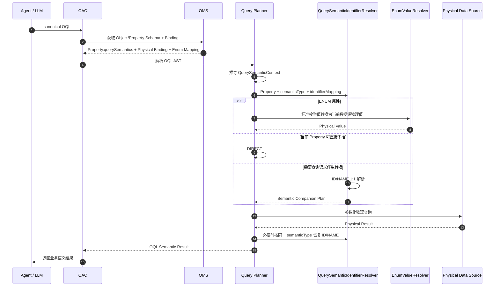

# SR20260829399078 多标识语义解析与自动转换 功能设计说明书

> 文档名称：SR20260829399078 多标识语义解析与自动转换 功能设计说明书  
> 适用服务：OMS（Ontology Model Service）、OAC（Ontology Access）  
> 需求编号：SR20260829399078  
> 文档版本：V1.2  
> 更新说明：在 V1.1“同对象、1:1、ID/NAME 伴生标识”基础上增加**数据查询语义分层**。通过 `semanticType` 将伴生标识归属到 DIMENSION / METRIC / TIME 等查询语义中；同一属性允许属于多个语义类型；OAC 根据 OQL 查询上下文选择对应语义类型的伴生关系进行转换。OMS 的 `Property` 领域模型增加查询语义元数据，使 OAG / Agent / LLM 能理解属性之间的业务语义关联，而不把物理字段 Binding 与语义关系混在一起。

---

## 0. 设计背景与总体原则

### 0.1 问题背景

同一个业务实体通常同时存在系统标识和业务名称，例如：

- 小区：`CGI`（ID）与 `CellName`（NAME）；
- 基站：`SiteId`（ID）与 `SiteName`（NAME）；
- 区域：`RegionId`（ID）与 `RegionName`（NAME）；
- 指标：`MetricId`（ID）与 `MetricName`（NAME）；
- 时间周期：`PeriodId`（ID）与 `PeriodName`（NAME）。

自然语言、OQL 和底层物理数据可能使用不同标识。用户可能输入：

> 查询“小区名称 = MTUTK_001_TaiKooMTR_A_SUB6G”的 PRB 利用率。

OQL 应保持业务语义：

```text
Cell.CellName = "MTUTK_001_TaiKooMTR_A_SUB6G"
```

而目标事实表可能只保存 CGI。OAC 需要根据 OMS 提供的数据查询语义识别：

```text
CellName
  ├─ semanticType = DIMENSION
  ├─ role = NAME
  └─ companion = CGI [ID]
                 ↓
            物理 Binding
                 ↓
           FACT_KPI.CGI
```

因此本需求不只是“ID/NAME 字段转换”，而是：

> **在本体属性上显式描述数据查询语义，并在每种查询语义下定义固定 1:1 的 ID/NAME 伴生关系，使 LLM 能理解属性之间为什么有关联，使 OAC 能根据 OQL 查询语义选择正确关系完成物理转换。**

---

### 0.2 数据查询语义分层

整体语义体系可分为 Knowledge、Query / Metric、Capability 三大类。本 SR 聚焦 **Query / Metric** 分支。

```text
Semantic
│
├── Knowledge
│   ├── Concept
│   ├── Taxonomy
│   ├── Classification
│   ├── Synonym
│   ├── Definition
│   ├── Context
│   ├── Constraint
│   ├── Provenance
│   └── Semantic Relation
│
├── Query / Metric
│   ├── Query
│   ├── Filter
│   ├── Aggregation
│   ├── Derived Property
│   ├── Metric
│   ├── Dimension
│   ├── Measure
│   ├── Indicator
│   ├── Formula
│   └── Time Semantics
│
└── Capability
    ├── Function
    ├── Action
    ├── Operation
    ├── Validation
    ├── Rule
    ├── Decision
    ├── Workflow
    ├── Automation
    ├── Prediction
    └── Agent Tool
```

本期不把所有 Query / Metric 子类一次性实现，而是先建立**结构稳定、类型可扩展**的模型。

首批语义类型：

```text
DIMENSION
METRIC
TIME
```

后续可扩展：

```text
FILTER
AGGREGATION
DERIVED_PROPERTY
MEASURE
INDICATOR
FORMULA
...
```

新增语义类型只扩展 `semanticType` 的取值，不改变伴生关系数据结构。

---

### 0.3 核心设计原则

| 设计点     | 说明                                                            |
| ------- | ------------------------------------------------------------- |
| 语义类型解耦  | `semanticType` 作为一级维度，首批支持 DIMENSION / METRIC / TIME，后续可扩展    |
| 一级语义    | 标识当前伴生关系属于哪一种数据查询语义                                           |
| 二级映射    | 每个 `semanticType` 下固定一个 1:1 的 `idPropertyId ↔ namePropertyId` |
| 属性多归属   | 同一个 Property 可以同时属于多个 `semanticType`                          |
| 同对象限定   | ID、NAME 两个 Property 必须属于当前同一个 ObjectType                      |
| 1:1 限定  | 一期不支持 1:N / N:1                                               |
| LLM 可理解 | OMS/OAG 对外输出查询语义，使 LLM 能识别属性之间的语义关联                           |
| OAC 解析  | OAC 根据 OQL 查询上下文选择对应 `semanticType` 的伴生关系                     |
| 未来扩展    | 新增 METRIC、TIME 或其他查询语义不改变现有 Property/Binding 主体结构             |

---

# 第一章 本体建模 OMS 服务属性绑定时数据查询语义定义

## 1.1 功能目标

OMS 在现有“物理模型字段 → 对象属性”的 Binding 能力上，增加对象属性级的数据查询语义：

1. 为 Property 声明一个或多个 `semanticType`；
2. 在 `semanticType` 为维度时，声明固定 1:1 的 ID / NAME 属性对；
3. 允许同一个 Property 属于多种数据查询语义；
4. 将查询语义作为 Property 元数据提供给 OAG / Agent / LLM；
5. 将查询语义提供给 OAC，用于 OQL 到物理查询的自动转换；

---

## 1.2 页面职责边界

### 1.2.1 左侧：物理模型

左侧保持现有语义，只表示：

- 物理表；
- 物理字段；
- 字段类型；

### 1.2.2 中间：物理 Binding 连线

连线固定表示：

> `Physical Field -> Ontology Property`

例如：

```text
radio_inventory.site_id ─────────────▶ Site.siteId
```

### 1.2.3 右侧：对象属性

数据查询语义全部归属于右侧对象属性。

对象属性需要展示：

- 属性数据类型；
- 查询语义类型；
- 当前属性在该语义下的 ID / NAME 角色；
- 伴生属性；

示例：

| 对象属性       | 类型     | 查询语义                                                   |
| ---------- | ------ | ------------------------------------------------------ |
| `siteId`   | String | `DIMENSION · ID ↔ siteName`                            |
| `siteName` | String | `DIMENSION · NAME ↔ siteId`                            |
| `metricId` | String | `METRIC · ID ↔ metricName`                             |
| `periodId` | String | `TIME · ID ↔ periodName`、`DIMENSION · ID ↔ periodName` |

---

## 1.3 查询语义数据模型

### 1.3.1 两级模型

数据查询语义采用两级结构：

```text
QuerySemantic
│
├── semanticType                  一级：查询语义类型
│
└── identifierMapping             二级：该语义类型下的 ID/NAME 映射
    ├── idPropertyId
    └── namePropertyId
```

推荐 JSON：

```json
{
  "semanticType": "DIMENSION",
  "identifierMapping": {
    "idPropertyId": "p_site_id",
    "namePropertyId": "p_site_name"
  }
}
```

其中：

- `semanticType` 表达“为什么这两个属性有关联”；
- `idPropertyId/namePropertyId` 表达“关联的两个属性是谁”；
- ID / NAME 固定 1:1；
- 两端固定属于当前对象。

---

## 1.4 Property.java 领域模型改造

### 1.4.1 当前模型

当前 `Property` 已包含：

```text
dataType
valueType
defaultValue
refSharedIds
primaryKey
extensions
```

现有 `validate()` 主要校验 Property 的 `name` 和 `dataType`。

本 SR 建议在 `Property.java` 中增加：

```java
/**
 * 数据查询语义。
 * 一个属性可属于多个查询语义类型，例如：
 * DIMENSION、METRIC、TIME。
 */
private List<QuerySemantic> querySemantics;
```

推荐新增值对象：

```java
@Data
public class QuerySemantic {

    /**
     * 一级查询语义类型。
     * 首批：DIMENSION / METRIC / TIME。
     * 后续可扩展 FILTER / AGGREGATION / MEASURE / INDICATOR / FORMULA 等。
     */
    private String semanticType;

    /**
     * 当前语义类型下的 1:1 ID/NAME 伴生关系。
     */
    private IdentifierMapping identifierMapping;
}
```

```java
@Data
public class IdentifierMapping {

    /**
     * ID 语义属性 ID。
     */
    private String idPropertyId;

    /**
     * NAME 语义属性 ID。
     */
    private String namePropertyId;
}
```

最终 `Property` 核心结构：

```java
public class Property extends AbstractElement {

    private String dataType;

    private String valueType;

    private String defaultValue;

    private List<String> refSharedIds;

    private Boolean primaryKey;

    private Extensions extensions;

    // 新增：数据查询语义
    private List<QuerySemantic> querySemantics;

    ...
}
```

例如“月份”既可以作为普通分析维度，也具有时间语义：

```json
{
  "propertyId": "p_period_id",
  "querySemantics": [
    {
      "semanticType": "TIME",
      "identifierMapping": {
        "idPropertyId": "p_period_id",
        "namePropertyId": "p_period_name"
      }
    },
    {
      "semanticType": "DIMENSION",
      "identifierMapping": {
        "idPropertyId": "p_period_id",
        "namePropertyId": "p_period_name"
      }
    }
  ]
}
```

因此 Property 与 QuerySemantic 是：

```text
Property 1 : N QuerySemantic
```

而每个 QuerySemantic 内仍保持：

```text
ID Property 1 : 1 NAME Property
```

---

## 1.5 semanticType 的扩展方式

### 1.5.1 推荐使用字符串代码 + 注册表

为避免 Property 模型随语义类型扩展而改变，推荐实体中使用：

```java
private String semanticType;
```

由 OMS 统一注册和校验合法取值。

首批：

```text
DIMENSION
METRIC
TIME
```

后续：

```text
FILTER
AGGREGATION
DERIVED_PROPERTY
MEASURE
INDICATOR
FORMULA
...
```

推荐集中定义常量或注册表，而不是在各模块中散落字符串判断。

示例：

```java
public final class QuerySemanticTypes {
    public static final String DIMENSION = "DIMENSION";
    public static final String METRIC = "METRIC";
    public static final String TIME = "TIME";

    private QuerySemanticTypes() {
    }
}
```

这样未来增加新类型时：

- Property JSON 结构不变；
- Binding 结构不变；
- OAC Resolver 主体结构不变；
- 仅增加语义类型注册、OQL 上下文识别规则和必要的执行策略。

---

## 1.6 Property 层与 Object 层校验

### 1.6.1 Property 本地校验

`Property.validate()` 增加结构校验：

1. `semanticType` 非空；
2. `identifierMapping` 非空；
3. `idPropertyId` 非空；
4. `namePropertyId` 非空；
5. `idPropertyId != namePropertyId`；
6. 当前 Property 的 ID 必须等于 `idPropertyId` 或 `namePropertyId`；
7. 同一个 Property 下，`semanticType` 不允许重复。

伪代码：

```java
private void validateQuerySemantics() {
    if (querySemantics == null || querySemantics.isEmpty()) {
        return;
    }

    Set<String> semanticTypes = new HashSet<>();

    for (QuerySemantic semantic : querySemantics) {
        if (semantic == null || semantic.getSemanticType() == null
            || semantic.getSemanticType().isBlank()) {
            throw new IllegalArgumentException("semanticType is required");
        }

        if (!semanticTypes.add(semantic.getSemanticType())) {
            throw new IllegalArgumentException(
                "Duplicated semanticType: " + semantic.getSemanticType());
        }

        IdentifierMapping mapping = semantic.getIdentifierMapping();
        if (mapping == null
            || mapping.getIdPropertyId() == null
            || mapping.getNamePropertyId() == null) {
            throw new IllegalArgumentException(
                "identifierMapping is incomplete");
        }

        if (mapping.getIdPropertyId().equals(mapping.getNamePropertyId())) {
            throw new IllegalArgumentException(
                "idPropertyId and namePropertyId must be different");
        }

        if (!this.id.equals(mapping.getIdPropertyId())
            && !this.id.equals(mapping.getNamePropertyId())) {
            throw new IllegalArgumentException(
                "Current property must be one endpoint of identifierMapping");
        }
    }
}
```

### 1.6.2 Object/OMS 服务层校验

“两个属性是否属于同一个对象”无法只依赖单个 Property 完成，应在 Object 聚合或 OMS Service 层校验：

1. `idPropertyId` 必须存在；
2. `namePropertyId` 必须存在；
3. 两个 Property 必须属于当前同一个 ObjectType；
4. 一个 Property 在同一个 `semanticType` 下只允许一个 1:1 伴生属性；
5. 两端的数据类型必须支持等值标识映射；
6. 更新/删除任一 Property 时检查语义关系引用；
7. 双端返回的语义关系必须保持一致。

---

## 1.7 推荐的持久化与投影方式

### 1.7.1 单一事实关系

逻辑上每条查询语义伴生关系只应存在一份：

```json
{
  "objectTypeId": "Site",
  "semanticType": "DIMENSION",
  "identifierMapping": {
    "idPropertyId": "p_site_id",
    "namePropertyId": "p_site_name"
  }
}
```

推荐将该关系作为 OMS 内部的 canonical relation 保存一次。

### 1.7.2 Property.java 作为语义投影

加载 ObjectType 时，OMS 将该关系投影到两个 Property：

```text
Site.siteId
└── DIMENSION
    └── p_site_id ↔ p_site_name

Site.siteName
└── DIMENSION
    └── p_site_id ↔ p_site_name
```

这样：

- LLM 查看任一属性都能看到关联；
- OAC 获取任一属性都能解析关系；
- 后端仍只有一份事实关系，避免双写不一致。

若当前存储模型只能直接持久化 Property，则允许一期双向写入，但必须由 OMS Service 原子维护两端，不允许前端分别维护两份。

---

## 1.8 页面配置方案

### 1.8.1 配置入口

伴生标识继续只从**右侧对象属性**进入。

因为同一属性可属于多种语义类型，原先单一“伴生标识”配置调整为“查询语义”列表。

示例：

```text
Site.siteId

查询语义
┌──────────────────────────────────────────────┐
│ DIMENSION   ID  ↔ siteName [NAME]      编辑 │
└──────────────────────────────────────────────┘

[ + 添加查询语义 ]
```

多归属示例：

```text
Period.periodId

查询语义
┌──────────────────────────────────────────────┐
│ TIME        ID  ↔ periodName [NAME]     编辑 │
│ DIMENSION   ID  ↔ periodName [NAME]     编辑 │
└──────────────────────────────────────────────┘

[ + 添加查询语义 ]
```

### 1.8.2 新增/编辑时仅保留三个必填字段

| 字段 | 必填 | 说明 |
|---|:---:|---|
| 查询语义类型 | 是 | 首批 DIMENSION / METRIC / TIME |
| 当前属性标识角色 | 是 | ID / NAME |
| 伴生属性 | 是 | 当前对象内除自身外的另一个属性 |

示例：

```text
配置查询语义

当前属性：siteId

查询语义类型 *
[ DIMENSION ▼ ]

当前属性标识角色 *
[ ID ▼ ]

伴生属性 *
[ siteName ▼ ]

预览：
DIMENSION
siteId [ID] ↔ siteName [NAME]

                         [取消] [保存]
```

### 1.8.3 不展示的确定性字段

以下字段由系统确定，不出现在页面：

```text
映射类型     = 对象属性映射
关联范围     = 当前对象
映射基数     = 1:1
伴生属性角色 = 当前角色的相反角色
启用状态     = 保存即生效
所属对象     = 当前对象
```

---

## 1.9 三类语义样例

### 1.9.1 DIMENSION：维度

对象：

```text
Site
├── siteId
└── siteName
```

配置：

```json
{
  "semanticType": "DIMENSION",
  "identifierMapping": {
    "idPropertyId": "p_site_id",
    "namePropertyId": "p_site_name"
  }
}
```

语义：

> `siteId` 与 `siteName` 是“站点维度”的两种标识表达。

LLM 可理解：

```text
"Tokyo-East-Site" 是 siteName，
与 siteId 共同标识同一个 Site。
```

---

### 1.9.2 METRIC：指标

对象：

```text
MetricDefinition
├── metricId
└── metricName
```

配置：

```json
{
  "semanticType": "METRIC",
  "identifierMapping": {
    "idPropertyId": "p_metric_id",
    "namePropertyId": "p_metric_name"
  }
}
```

用户说：

> 查询“PRB利用率”这个指标。

LLM 能根据 METRIC 语义识别：

```text
metricName = "PRB利用率"
    ↕
metricId
```

OAC 在需要使用物理 Metric ID 查询时执行 1:1 转换。

注意：

> 这里的 METRIC 表示“指标实体的 ID/NAME 语义”，不等同于 OQL `returns.kind=METRIC` 的数值聚合结果，两者在 Planner 中通过查询上下文关联。

---

### 1.9.3 TIME：时间语义

对象：

```text
Period
├── periodId
└── periodName
```

配置：

```json
{
  "semanticType": "TIME",
  "identifierMapping": {
    "idPropertyId": "p_period_id",
    "namePropertyId": "p_period_name"
  }
}
```

例如：

```text
202609  ↔  2026年9月
ID          NAME
```

用户说：

> 查询 2026 年 9 月的网络体验。

OAC 可以在 TIME 查询语义下将业务名称转换为物理时间标识。

---

## 1.10 属性多语义归属样例

同一个 `Period.periodId` 同时具有：

- TIME：表达时间周期；
- DIMENSION：在报表中作为分组维度。

```json
{
  "propertyId": "p_period_id",
  "querySemantics": [
    {
      "semanticType": "TIME",
      "identifierMapping": {
        "idPropertyId": "p_period_id",
        "namePropertyId": "p_period_name"
      }
    },
    {
      "semanticType": "DIMENSION",
      "identifierMapping": {
        "idPropertyId": "p_period_id",
        "namePropertyId": "p_period_name"
      }
    }
  ]
}
```

对应查询：

**场景 A：时间过滤**

> 查询 2026 年 9 月的数据。

OAC 选择：

```text
semanticType = TIME
```

**场景 B：维度分组**

> 按月份统计用户数。

OAC 选择：

```text
semanticType = DIMENSION
```

同一 Property 无需新增字段或复制对象，只通过 `querySemantics[]` 多归属表达。

---

## 1.11 面向 LLM / OAG 的 Schema 输出

### 1.11.1 目的

大模型需要知道：

- 某属性属于什么查询语义；
- 哪两个属性属于同一语义实体；
- 哪个是 ID；
- 哪个是 NAME；
- 同一属性是否同时属于多种语义。

推荐提供：

```json
{
  "objectType": "Site",
  "properties": [
    {
      "id": "p_site_id",
      "name": "siteId",
      "querySemantics": [
        {
          "semanticType": "DIMENSION",
          "identifierMapping": {
            "idPropertyId": "p_site_id",
            "namePropertyId": "p_site_name"
          }
        }
      ]
    },
    {
      "id": "p_site_name",
      "name": "siteName",
      "querySemantics": [
        {
          "semanticType": "DIMENSION",
          "identifierMapping": {
            "idPropertyId": "p_site_id",
            "namePropertyId": "p_site_name"
          }
        }
      ]
    }
  ]
}
```

LLM 可以由此推理：

```text
siteId 和 siteName 不是两个无关字段，
而是 DIMENSION 语义下同一 Site 的 ID/NAME 伴生属性。
```

### 1.11.2 LLM 与 OAC 的职责边界

LLM 使用查询语义：

- 理解属性之间的关联；
- Schema 对齐；
- 选择正确的业务属性；
- 生成保持业务语义的 OQL。

LLM 不负责：

- 查询物理 ID；
- 拼接 SQL JOIN；
- 根据物理表自行做 NAME -> ID 转换。

这些仍由 OAC 完成。

---

## 1.12 枚举值映射与查询语义的边界

枚举值映射和查询语义伴生关系仍是两套机制。

**查询语义伴生：**

```text
Property ↔ Property

Site.siteId [ID]
    ↕ DIMENSION
Site.siteName [NAME]
```

**枚举值映射：**

```text
Physical Raw Value -> Standard Enum Value

0 -> 正常
1 -> 故障
```

枚举值映射继续从右侧枚举属性入口配置；物理 Binding 连线上不显示值映射信息。

同一个枚举属性绑定不同物理数据源时，可分别选择对应映射：

| 物理 Binding | 值映射 |
|---|---|
| `radio_inventory_a.rat_type` | 网络制式 · 数值编码 |
| `radio_inventory_b.generation` | 网络制式 · 标准文本 |
| `radio_inventory_c.制式` | 网络制式 · 中文编码 |

---

## 1.13 OMS 面向 OAC 的输出结构

推荐输出：

```json
{
  "objectTypes": [
    {
      "objectTypeId": "Site",
      "properties": [
        {
          "propertyId": "p_site_id",
          "propertyName": "siteId",
          "querySemantics": [
            {
              "semanticType": "DIMENSION",
              "identifierMapping": {
                "idPropertyId": "p_site_id",
                "namePropertyId": "p_site_name"
              }
            }
          ],
          "physicalBindings": [
            {
              "dataAsset": "radio_inventory",
              "field": "site_id"
            }
          ]
        },
        {
          "propertyId": "p_site_name",
          "propertyName": "siteName",
          "querySemantics": [
            {
              "semanticType": "DIMENSION",
              "identifierMapping": {
                "idPropertyId": "p_site_id",
                "namePropertyId": "p_site_name"
              }
            }
          ],
          "physicalBindings": [
            {
              "dataAsset": "site_dimension",
              "field": "site_name"
            }
          ]
        }
      ]
    }
  ]
}
```

值映射继续使用现有枚举 Mapping / Binding 数据，不并入 `querySemantics`。

---

# 第二章 本体访问 OAC 服务解析多标识和物理查询组装

## 2.1 功能目标

OAC 在接收到 canonical OQL 后，结合 OMS Query Semantic 和 Physical Binding 完成：

1. 识别当前 OQL 节点的查询语义上下文；
2. 定位 OQL 业务属性；
3. 获取该 Property 的 `querySemantics[]`；
4. 根据查询上下文选择正确的 `semanticType`；
5. 获取该语义类型下固定 1:1 的 `idPropertyId/namePropertyId`；
6. 优先判断当前属性是否可直接物理下推；
7. 当前属性不可直接下推时，通过伴生属性完成 ID/NAME 1:1 转换；
8. 枚举属性独立应用值映射；
9. 生成 SQL / GQL / API 等物理请求；
10. 按 OQL 业务语义恢复结果。

---

## 2.2 OAC 查询语义上下文

OAC 内部建议增加：

```text
QuerySemanticContext
```

用于表达当前 OQL 节点的语义，例如：

```text
DIMENSION
METRIC
TIME
UNKNOWN
```

OQL 不要求立即新增 `semanticType` 字段，优先由 Planner 根据 OQL AST + Property 元数据生成内部上下文。

---

## 2.3 OQL 到 semanticType 的识别规则

推荐首批规则：

| OQL 上下文 | 优先 semanticType | 说明 |
|---|---|---|
| `GROUP_BY` 字段 | DIMENSION | 作为分析维度 |
| 维度属性的普通过滤 | DIMENSION | 例如站点、区域、套餐名称过滤 |
| `returns.kind=METRIC` 相关指标实体选择 | METRIC | 指标实体 ID/NAME 解析 |
| 时间范围、时间粒度、时间语义函数 | TIME | 时间属性伴生关系 |
| 属性只有一个 QuerySemantic | 该唯一类型 | 无歧义时直接选择 |
| 属性同时存在多类型且上下文无法判定 | 不自动选择 | 返回语义歧义错误 |

原则：

> OAC 不按照 `querySemantics[]` 数组顺序取第一条，也不根据属性名称猜测。

---

## 2.4 语义关系选择算法

伪代码：

```text
property = resolveProperty(predicate.ref, predicate.field)

semanticContext = inferQuerySemanticContext(
    oqlNode,
    property
)

semanticCandidates = property.querySemantics

if semanticCandidates is empty:
    continue with normal physical binding

if semanticContext is known:
    selectedSemantic =
        semanticCandidates.find(semanticType == semanticContext)

    if not found:
        continue with direct binding if executable
else:
    if semanticCandidates.size == 1:
        selectedSemantic = semanticCandidates[0]
    else:
        throw QUERY_SEMANTIC_AMBIGUOUS
```

得到 `selectedSemantic` 后，再取：

```text
selectedSemantic.identifierMapping.idPropertyId
selectedSemantic.identifierMapping.namePropertyId
```

---

## 2.5 物理过滤字段选择规则

语义关系确定后，执行顺序仍然坚持：

```text
DIRECT
  >
SEMANTIC_COMPANION
  >
ERROR
```

### 2.5.1 DIRECT

如果用户使用的对象属性在当前物理数据资产中已经有直接 Binding：

```text
Cell.cellName -> DIM_CELL.CELL_NAME
```

则直接：

```sql
WHERE CELL_NAME = ?
```

不因为存在 DIMENSION 伴生关系而强制转 CGI。

### 2.5.2 SEMANTIC_COMPANION

当前属性没有可用物理 Binding，但同一个 `semanticType` 下的伴生属性有可执行 Binding：

```text
semanticType = DIMENSION

Cell.cellName [NAME]
       ↕
Cell.cgi [ID]

FACT_KPI.CGI -> Cell.cgi
```

OAC 生成：

```text
NAME_TO_ID
```

再使用 CGI 过滤。

### 2.5.3 ERROR

如果当前属性和对应语义类型下的伴生属性都不能形成物理执行路径，则返回明确错误。

---

## 2.6 DIMENSION 场景完整样例

OMS：

```json
{
  "propertyId": "p_cell_name",
  "querySemantics": [
    {
      "semanticType": "DIMENSION",
      "identifierMapping": {
        "idPropertyId": "p_cgi",
        "namePropertyId": "p_cell_name"
      }
    }
  ]
}
```

OQL：

```json
{
  "conditions": {
    "kind": "PREDICATE",
    "ref": "c",
    "field": "cellName",
    "operator": "EQ",
    "values": [
      "MTUTK_001_TaiKooMTR_A_SUB6G"
    ]
  }
}
```

目标事实表：

```text
FACT_KPI.CGI
FACT_KPI.PRB_USAGE
```

OAC 识别：

```text
OQL property     = cellName
semanticType     = DIMENSION
semantic role    = NAME
companion        = cgi
companion role   = ID
physical filter  = FACT_KPI.CGI
```

最终：

```sql
SELECT f.PRB_USAGE
FROM FACT_KPI f
WHERE f.CGI = (
    SELECT d.CGI
    FROM DIM_CELL d
    WHERE d.CELL_NAME = ?
)
```

---

## 2.7 METRIC 场景完整样例

对象：

```text
MetricDefinition
├── metricId
└── metricName
```

OMS：

```json
{
  "semanticType": "METRIC",
  "identifierMapping": {
    "idPropertyId": "p_metric_id",
    "namePropertyId": "p_metric_name"
  }
}
```

用户问题：

> 查询 PRB 利用率指标最近一天的值。

Agent / LLM 通过 OMS Schema 理解：

```text
"PRB利用率" -> MetricDefinition.metricName
metricName 与 metricId 在 METRIC 语义下 1:1 伴生
```

OQL 保持：

```text
metricName = "PRB利用率"
```

物理指标事实表只存：

```text
METRIC_ID
METRIC_VALUE
```

OAC 根据 `semanticType=METRIC` 将：

```text
metricName -> metricId
```

然后：

```sql
WHERE METRIC_ID = ?
```

---

## 2.8 TIME 与 DIMENSION 多归属样例

Property：

```text
Period.periodId
Period.periodName
```

OMS：

```json
{
  "querySemantics": [
    {
      "semanticType": "TIME",
      "identifierMapping": {
        "idPropertyId": "p_period_id",
        "namePropertyId": "p_period_name"
      }
    },
    {
      "semanticType": "DIMENSION",
      "identifierMapping": {
        "idPropertyId": "p_period_id",
        "namePropertyId": "p_period_name"
      }
    }
  ]
}
```

### 查询 A：时间过滤

> 查询 2026 年 9 月的体验数据。

Planner：

```text
QuerySemanticContext = TIME
```

选择：

```text
TIME: periodId ↔ periodName
```

### 查询 B：维度聚合

> 按月份统计掉话次数。

Planner：

```text
returns.kind = GROUP_BY
QuerySemanticContext = DIMENSION
```

选择：

```text
DIMENSION: periodId ↔ periodName
```

这体现：

> 同一 Property 可以多语义归属，OAC 的选择依据是 OQL 查询语义，而不是 Property 上的固定唯一标签。

---

## 2.9 枚举值映射解析

枚举值映射独立于 QuerySemantic。

例如：

```text
BaseStation.operatingStatus
标准枚举：
正常
故障

物理值：
0
1
```

值映射：

```text
0 -> 正常
1 -> 故障
```

OQL：

```text
operatingStatus = "故障"
```

OAC 根据当前 Physical Binding 的枚举映射得到：

```text
"故障" -> 1
```

然后：

```sql
WHERE OPER_STATUS = ?
-- parameter = 1
```

OAC 内部保持两个 Resolver：

```text
QuerySemanticIdentifierResolver
负责：
semanticType + Property ID/NAME 1:1 伴生解析

EnumValueResolver
负责：
Physical Raw Value ↔ Standard Enum Value
```

---

## 2.10 推荐的 OAC 内部结构

建议将原 `CompanionIdentifierResolver` 收敛为：

```text
QuerySemanticIdentifierResolver
```

输入：

```text
- OQL node
- QuerySemanticContext
- Property
- selected QuerySemantic
- Physical Binding
```

输出：

```text
- semanticType
- sourcePropertyId
- sourceRole
- targetPropertyId
- targetRole
- physicalFilterField
- conversionDirection
- executionStrategy
```

示例：

```json
{
  "semanticType": "DIMENSION",
  "sourcePropertyId": "p_cell_name",
  "sourceRole": "NAME",
  "targetPropertyId": "p_cgi",
  "targetRole": "ID",
  "physicalFilterField": "FACT_KPI.CGI",
  "conversionDirection": "NAME_TO_ID",
  "executionStrategy": "SEMANTIC_COMPANION_LOOKUP"
}
```

---

## 2.11 1:1 约束

所有 `semanticType` 下的 identifierMapping 一期固定 1:1：

```text
一个 ID   <-> 一个 NAME
一个 NAME <-> 一个 ID
```

OAC 不做：

- NAME -> 多 ID；
- ID -> 多 NAME；
- 自动把 EQ 扩展成多值 IN；
- 多级 ID -> NAME -> ALIAS 链式转换。

如果运行期出现一个 NAME 命中多个 ID，返回：

```text
QUERY_SEMANTIC_IDENTIFIER_NOT_UNIQUE
```

这属于数据违反 OMS 语义模型约束。

---

## 2.12 Operator 支持范围

首期伴生转换支持精确匹配：

| OQL Operator | 处理 |
|---|---|
| `EQ` | 支持 |
| `NE` | 支持 |
| `IN` | 支持，对输入集合逐个做 1:1 转换 |
| `NOT_IN` | 支持，对输入集合逐个做 1:1 转换 |

不对以下操作符自动做 ID/NAME 转换：

```text
GT / GTE / LT / LTE / BETWEEN
LIKE / CONTAINS / STARTS_WITH / ENDS_WITH
```

原 Property 能直接物理下推时仍允许执行；只有依赖伴生属性才能执行时返回：

```text
UNSUPPORTED_QUERY_SEMANTIC_OPERATOR
```

---

## 2.13 结果恢复

如果 OQL 要求返回 NAME，但主物理查询只得到 ID：

```text
Cell.cgi = "460-00-12345-001"
```

OAC 根据已选查询语义：

```text
semanticType = DIMENSION

cgi [ID] ↔ cellName [NAME]
```

恢复：

```text
MTUTK_001_TaiKooMTR_A_SUB6G
```

结果恢复必须沿用与查询计划相同的 `semanticType`，不能查询时用 DIMENSION，返回时无条件取另一个语义类型。

---

## 2.14 完整处理时序



---

## 2.15 错误码设计

| 错误码 | 场景 |
|---|---|
| `QUERY_SEMANTIC_TYPE_INVALID` | semanticType 未注册 |
| `QUERY_SEMANTIC_MAPPING_INCOMPLETE` | idPropertyId / namePropertyId 缺失 |
| `QUERY_SEMANTIC_PROPERTY_INVALID` | 映射属性不存在或不属于当前对象 |
| `QUERY_SEMANTIC_DUPLICATED` | 同一 Property 下 semanticType 重复 |
| `QUERY_SEMANTIC_AMBIGUOUS` | Property 有多个语义类型，但 OQL 上下文无法唯一选择 |
| `QUERY_SEMANTIC_IDENTIFIER_NOT_UNIQUE` | 运行期违反 1:1 |
| `QUERY_SEMANTIC_RESOLUTION_PATH_NOT_FOUND` | 有语义关系但没有可执行物理 Binding |
| `UNSUPPORTED_QUERY_SEMANTIC_OPERATOR` | 当前操作符不支持伴生转换 |
| `ENUM_VALUE_MAPPING_NOT_FOUND` | 枚举属性缺少当前 Binding 的值映射 |
| `PROPERTY_BINDING_NOT_FOUND` | Property 和伴生 Property 均无法形成执行路径 |

---

## 2.16 日志与可观测性

建议记录：

```text
querySemanticResolution:
  requestId: xxx
  objectType: Cell
  semanticType: DIMENSION
  sourceProperty: cellName
  sourceRole: NAME
  targetProperty: cgi
  targetRole: ID
  strategy: SEMANTIC_COMPANION_LOOKUP
  resultCount: 1
```

多语义场景增加：

```text
semanticCandidates:
  - TIME
  - DIMENSION

selectedSemanticType:
  TIME

selectionReason:
  TIME_FILTER_CONTEXT
```

关键指标：

```text
oac_query_semantic_resolution_total
oac_query_semantic_resolution_failed_total
oac_query_semantic_resolution_latency_ms
oac_query_semantic_ambiguous_total
oac_enum_value_resolution_total
```

---

## 2.17 开发改造点汇总

### OMS

1. `Property.java` 增加 `List<QuerySemantic> querySemantics`；
2. 新增 `QuerySemantic` 值对象；
3. 新增 `IdentifierMapping` 值对象；
4. 建立 `semanticType` 注册表，首批 DIMENSION / METRIC / TIME；
5. Property 本地校验查询语义结构；
6. Object/Service 层校验同对象、1:1、引用完整性；
7. 查询语义配置页增加三个必填字段：semanticType、当前角色、伴生属性；
8. 同一 Property 支持新增多条不同 semanticType；
9. 从任意一端编辑时维护同一 canonical relation；
10. OMS/OAG Schema 输出 `querySemantics`；
11. Physical Binding 连线不展示任何 QuerySemantic / ID / NAME / 值映射信息；
12. 枚举值映射继续从对象属性入口管理。

### OAC

1. Binding/Schema DTO 增加 `querySemantics`；
2. 新增 `QuerySemanticContext`；
3. 新增 `QuerySemanticIdentifierResolver`；
4. 根据 OQL AST + Property 元数据选择 `semanticType`；
5. 禁止数组顺序兜底和字段名猜测；
6. 继续遵循 DIRECT > SEMANTIC_COMPANION > ERROR；
7. 固定处理 1:1 ID/NAME；
8. 多语义无法判定时返回 `QUERY_SEMANTIC_AMBIGUOUS`；
9. 枚举值映射继续由独立 `EnumValueResolver` 处理；
10. 结果恢复沿用执行计划已选择的 semanticType。

### OAG / Agent / LLM

1. 子图/Schema 中输出 Property 的 `querySemantics`；
2. Prompt 明确 semanticType 的业务含义；
3. 允许 LLM 根据 DIMENSION / METRIC / TIME 理解属性关联；
4. LLM 仅做业务语义选择，不执行物理 ID/NAME 转换；
5. canonical OQL 继续保持业务 Property。

---

## 2.18 核心测试用例

### 用例 1：DIMENSION ID/NAME

```text
Site.siteId [ID]
Site.siteName [NAME]
semanticType = DIMENSION
```

预期：

- LLM 能识别两个属性有关联；
- OAC 在 DIMENSION 上下文选择该关系。

### 用例 2：METRIC ID/NAME

```text
Metric.metricId [ID]
Metric.metricName [NAME]
semanticType = METRIC
```

预期：

- 用户输入指标名称；
- OAC 在 METRIC 上下文转换到 metricId。

### 用例 3：TIME ID/NAME

```text
Period.periodId [ID]
Period.periodName [NAME]
semanticType = TIME
```

预期：

- 时间查询选择 TIME 关系。

### 用例 4：一个属性多语义

```text
Period.periodId:
  TIME
  DIMENSION
```

预期：

- “查询 2026 年 9 月”选择 TIME；
- “按月份分组”选择 DIMENSION。

### 用例 5：多语义歧义

Property 同时存在 TIME / DIMENSION，但 OQL 上下文无法区分。

预期：

```text
QUERY_SEMANTIC_AMBIGUOUS
```

不允许按数组第一项自动选择。

### 用例 6：禁止跨对象

`Site.siteId` 尝试关联 `Cell.cellName`。

预期：

- UI 不提供跨对象选择；
- OMS API 服务端校验失败。

### 用例 7：固定 1:1

一个 NAME 查询到两个 ID。

预期：

```text
QUERY_SEMANTIC_IDENTIFIER_NOT_UNIQUE
```

### 用例 8：DIRECT 优先

`cellName` 自身在目标表有直接 Binding。

预期：

- 直接使用 cellName 物理字段；
- 不因为存在 DIMENSION 伴生 ID 而强制转换。

### 用例 9：物理连线纯 Binding

预期：

- 连线不显示 semanticType；
- 连线不显示 ID/NAME；
- 连线不显示值映射。

### 用例 10：枚举值映射独立

同一 ENUM Property 绑定多个物理表。

预期：

- 每条 Binding 可使用自己的 Enum Mapping；
- QuerySemantic 不参与枚举值转换。

---

## 2.19 验收标准

1. `Property.java` 支持 `querySemantics[]`；
2. QuerySemantic 一级字段为 `semanticType`；
3. 每个 semanticType 下只有一个固定 1:1 `idPropertyId ↔ namePropertyId`；
4. 同一 Property 可配置多个不同 semanticType；
5. 首批至少支持 DIMENSION / METRIC / TIME；
6. 新增 semanticType 不需要修改 Property JSON 主体结构；
7. ID / NAME 两端只能属于同一个 ObjectType；
8. 页面只配置 semanticType、当前属性角色、伴生属性三个必填字段；
9. 物理 Binding 连线只表达字段到属性映射；
10. 连线上不显示 semanticType、ID/NAME、值映射；
11. OAG / LLM 能获取 Property 查询语义并理解属性关系；
12. LLM 不承担物理 ID/NAME 转换；
13. OAC 根据 OQL 查询上下文选择 semanticType；
14. 多语义上下文无法判定时明确报错；
15. OAC 优先使用直接物理 Binding；
16. 必要时按已选 semanticType 使用伴生 Property 转换；
17. 伴生转换固定 1:1；
18. 枚举值映射与 QuerySemantic 独立；
19. 结果恢复必须沿用查询计划选择的 semanticType；
20. OQL 始终保持业务语义。

---

## 附录 A：一期能力边界

### 支持

```text
Property.querySemantics[]
semanticType = DIMENSION / METRIC / TIME
同一 Property 多语义归属
每个 semanticType 下 ID ↔ NAME
仅当前对象
固定 1:1
Physical Binding 与 QuerySemantic 解耦
Enum Value Mapping 与 QuerySemantic 解耦
LLM Schema 语义理解
OAC 按 OQL 上下文选择 semanticType
DIRECT / SEMANTIC_COMPANION
EQ / NE / IN / NOT_IN 精确转换
ID / NAME 结果恢复
```

### 不支持

```text
跨对象伴生
1:N / N:1
同一 Property 同一 semanticType 下多个伴生 Property
ID -> NAME -> ALIAS 多跳链
连线上配置或展示 semanticType
连线上配置或展示 ID/NAME
连线上配置或展示值映射
根据字段名猜 semanticType
根据 querySemantics 数组顺序兜底
模糊查询自动展开大量 ID
```

---

## 附录 B：推荐 Java 结构汇总

```java
@EqualsAndHashCode(callSuper = true)
@Data
@Slf4j
public class Property extends AbstractElement {

    private String dataType;

    private String valueType;

    private String defaultValue;

    private List<String> refSharedIds;

    private Boolean primaryKey;

    private Extensions extensions;

    /**
     * 数据查询语义。
     * 一个 Property 可属于多个 semanticType。
     */
    private List<QuerySemantic> querySemantics;

    ...
}
```

```java
@Data
public class QuerySemantic {

    /**
     * 一级查询语义：
     * DIMENSION / METRIC / TIME / ...
     */
    private String semanticType;

    /**
     * 当前语义下固定 1:1 的 ID/NAME 属性映射。
     */
    private IdentifierMapping identifierMapping;
}
```

```java
@Data
public class IdentifierMapping {

    private String idPropertyId;

    private String namePropertyId;
}
```

推荐数据：

```json
{
  "id": "p_period_id",
  "name": "periodId",
  "querySemantics": [
    {
      "semanticType": "TIME",
      "identifierMapping": {
        "idPropertyId": "p_period_id",
        "namePropertyId": "p_period_name"
      }
    },
    {
      "semanticType": "DIMENSION",
      "identifierMapping": {
        "idPropertyId": "p_period_id",
        "namePropertyId": "p_period_name"
      }
    }
  ]
}
```

---

## 附录 C：关键设计结论

最终模型分为四层：

```text
1. Property Semantic
   semanticType
   ├── DIMENSION
   ├── METRIC
   ├── TIME
   └── ...

2. Identifier Mapping
   每个 semanticType 下：
   idPropertyId ↔ namePropertyId
   固定 1:1，同对象

3. Physical Binding
   Physical Field -> Ontology Property
   连线仅表示这一层

4. Enum Value Mapping
   Physical Raw Value -> Standard Enum Value
   独立于 QuerySemantic
```

其中：

> `semanticType` 回答“这两个属性为什么有关联”；  
> `idPropertyId/namePropertyId` 回答“关联的是哪两个属性”；  
> Physical Binding 回答“对象属性对应哪个物理字段”；  
> Enum Value Mapping 回答“物理枚举值如何转换为标准值”。

这样既能让 LLM 理解属性间的数据查询语义，又能让 OAC 在不同 OQL 场景下选择正确的伴生关系，同时保持物理 Binding 页面简单、稳定。
