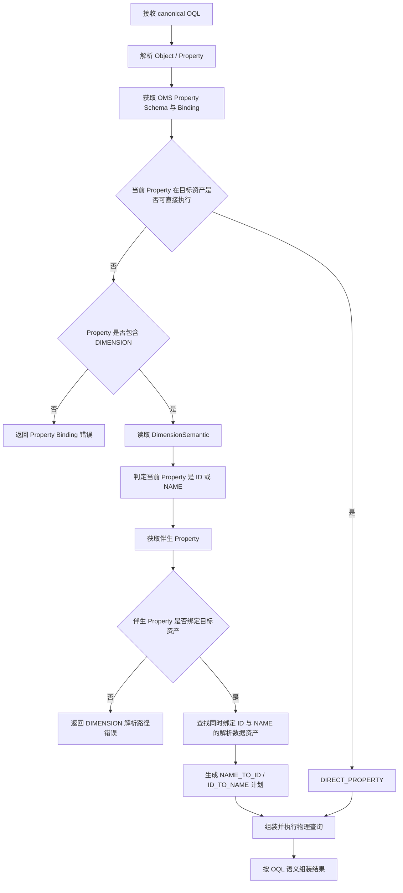

# SR20260829399078 多标识语义解析与自动转换 功能设计说明书

> 文档名称：SR20260829399078 多标识语义解析与自动转换 功能设计说明书  
> 适用服务：OMS（Ontology Model Service）、OAC（Ontology Access）  
> 需求编号：SR20260829399078  
> 文档版本：V1.3  
> 设计范围：本版本仅设计 `DIMENSION` 数据查询语义下的对象属性伴生标识，以及 OAC 基于该语义完成 ID / NAME 解析和物理查询组装。  
> 核心约束：伴生标识仅发生在**当前对象的两个不同属性之间**，固定为 **1:1** 的 `idPropertyId ↔ namePropertyId`。

---

## 0. 设计目标

### 0.1 业务背景

同一个业务维度通常同时存在面向系统的数据标识和面向业务的可读名称，例如：

```text
Cell
├── CGI       —— ID 标识
└── CellName  —— NAME 标识
```

用户、Agent 和 OQL 更倾向于使用业务名称：

```text
Cell.CellName = "MTUTK_001_TaiKooMTR_A_SUB6G"
```

而实际查询的物理数据可能只保存：

```text
FACT_KPI.CGI
```

OMS 需要在对象属性模型中明确表达：

```text
semanticType = DIMENSION

Cell.CGI [ID]
      ↕ 1:1
Cell.CellName [NAME]
```

OAC 基于该语义以及现有 Property Binding 自动识别：

```text
OQL 使用 CellName
        ↓
CellName 是 DIMENSION 的 NAME 属性
        ↓
伴生属性 CGI 是同一 DIMENSION 的 ID 属性
        ↓
目标物理模型绑定 CGI
        ↓
将 NAME 解析为 ID
        ↓
使用 CGI 组装物理过滤条件
```

### 0.2 设计目标

本方案实现以下能力：

1. 在 OMS `Property` 领域模型中增加数据查询语义标识；
2. 将 `semanticType` 与具体语义数据结构解耦；
3. 当前 SR 仅定义 `DIMENSION` 对应的数据结构；
4. DIMENSION 下固定维护当前对象内两个属性的 1:1 ID / NAME 映射；
5. 将 DIMENSION 语义提供给 OAG / Agent / LLM，帮助模型理解属性之间的业务关联；
6. OAC 基于 OQL 属性、DIMENSION 伴生关系和 Property Binding 选择实际物理过滤字段；
7. 保持物理字段 Binding 与对象属性语义相互独立。

---

## 0.3 总体设计原则

| 设计点 | 设计约束 |
|---|---|
| 语义类型解耦 | `semanticType` 只负责标识一级语义类型，不假设所有 semanticType 使用相同的数据结构 |
| 类型专属模型 | DIMENSION 使用独立的 `DimensionSemantic` 数据结构 |
| 同对象 | `idPropertyId` 和 `namePropertyId` 必须属于同一个 ObjectType |
| 固定 1:1 | 一个 DIMENSION 关系固定由一个 ID Property 和一个 NAME Property 组成 |
| Property 可多语义归属 | Property 使用 `semanticTypes` 保存一级语义类型集合；各语义类型的详细数据由独立字段承载 |
| 单一关系 | ID 端和 NAME 端表达的是同一条 DIMENSION 伴生关系 |
| Binding 解耦 | 物理字段到 Property 的连线只表示 Binding，不承担 DIMENSION、ID、NAME 等语义 |
| OQL 保持业务语义 | Agent 不负责把 NAME 改写成物理 ID |
| OAC 负责物理转换 | OAC 根据 DIMENSION 语义与 Binding 选择实际物理过滤条件 |

---

# 第一章 OMS：对象属性 DIMENSION 语义与伴生标识设计

## 1.1 OMS 功能职责

OMS 负责维护以下事实：

```text
ObjectType
  └── Property
        ├── 基础属性定义
        ├── semanticTypes
        │     └── DIMENSION
        └── dimensionSemantic
              ├── semanticId
              ├── idPropertyId
              └── namePropertyId
```

OMS 对外提供的信息需要回答三个问题：

1. 当前 Property 是否具有 DIMENSION 查询语义；
2. 当前 Property 在 DIMENSION 关系中是 ID 还是 NAME；
3. 与当前 Property 1:1 伴生的另一个 Property 是谁。

---

## 1.2 Property.java 领域模型改造

### 1.2.1 现有模型

现有 `Property.java` 已包含：

```java
private String dataType;
private String valueType;
private String defaultValue;
private List<String> refSharedIds;
private Boolean primaryKey;
private Extensions extensions;
```

本需求直接增加一级语义标识和 DIMENSION 专属结构，不使用统一结构承载所有 semanticType 的详细数据。

### 1.2.2 推荐结构

```java
@EqualsAndHashCode(callSuper = true)
@Data
@Slf4j
public class Property extends AbstractElement {

    private String dataType;

    private String valueType;

    private String defaultValue;

    /**
     * 引用的共享属性ID列表。
     */
    private List<String> refSharedIds;

    /**
     * 主键标志。
     */
    private Boolean primaryKey;

    /**
     * 扩展属性。
     */
    private Extensions extensions;

    /**
     * 当前属性所属的数据查询语义类型。
     *
     * 当前 SR 使用 DIMENSION。
     * 该字段只承担一级类型标识，不承载类型专属参数。
     */
    private List<String> semanticTypes;

    /**
     * DIMENSION 查询语义的专属数据结构。
     *
     * 当 semanticTypes 包含 DIMENSION 时使用。
     */
    private DimensionSemantic dimensionSemantic;

    ...
}
```

### 1.2.3 `semanticTypes` 与 `dimensionSemantic` 的职责

两者职责不同：

```text
semanticTypes
    ↓
回答：Property 属于哪些一级数据查询语义

dimensionSemantic
    ↓
回答：DIMENSION 语义具体需要哪些结构化数据
```

Property 只保留通用的一级语义类型集合；具体语义类型使用各自强类型的数据结构。

这样后续扩展新的 semanticType 时，可根据该类型自身的功能需求定义独立领域模型，不要求复用 DIMENSION 的 `idPropertyId/namePropertyId` 结构。

---

## 1.3 DimensionSemantic 数据结构

### 1.3.1 Java 定义

```java
@Data
public class DimensionSemantic {

    /**
     * DIMENSION 伴生关系唯一标识。
     * ID 端和 NAME 端使用同一个 semanticId。
     */
    private String semanticId;

    /**
     * 当前对象中承担 ID 语义的 Property ID。
     */
    private String idPropertyId;

    /**
     * 当前对象中承担 NAME 语义的 Property ID。
     */
    private String namePropertyId;
}
```

### 1.3.2 字段说明

| 字段 | 类型 | 必填 | 说明 |
|---|---|:---:|---|
| `semanticId` | String | 是 | DIMENSION 伴生关系唯一 ID，由 OMS 生成 |
| `idPropertyId` | String | 是 | 当前对象中承担 ID 角色的属性 |
| `namePropertyId` | String | 是 | 当前对象中承担 NAME 角色的属性 |

DIMENSION 的系统级固定约束：

```text
semanticType = DIMENSION
scope        = 当前 ObjectType
cardinality  = 1:1
endpoint     = 两个不同 Property
role         = ID / NAME
```

上述信息不需要重复存储为用户配置项。

---

## 1.4 Property JSON 模型

### 1.4.1 ID Property

```json
{
  "id": "p_cgi",
  "name": "cgi",
  "dataType": "String",
  "semanticTypes": [
    "DIMENSION"
  ],
  "dimensionSemantic": {
    "semanticId": "dim_cell_identity",
    "idPropertyId": "p_cgi",
    "namePropertyId": "p_cell_name"
  }
}
```

### 1.4.2 NAME Property

```json
{
  "id": "p_cell_name",
  "name": "cellName",
  "dataType": "String",
  "semanticTypes": [
    "DIMENSION"
  ],
  "dimensionSemantic": {
    "semanticId": "dim_cell_identity",
    "idPropertyId": "p_cgi",
    "namePropertyId": "p_cell_name"
  }
}
```

两个 Property 使用相同的：

```text
semanticId
idPropertyId
namePropertyId
```

因此任意一端被读取时，都可以得到完整的伴生关系。

---

## 1.5 DIMENSION 角色判定

不额外持久化 `identifierRole`，角色直接由当前 Property ID 与 DIMENSION 两个端点比较得到。

伪代码：

```java
public DimensionRole resolveDimensionRole(Property property) {
    DimensionSemantic semantic = property.getDimensionSemantic();

    if (semantic == null) {
        return DimensionRole.NONE;
    }

    if (property.getId().equals(semantic.getIdPropertyId())) {
        return DimensionRole.ID;
    }

    if (property.getId().equals(semantic.getNamePropertyId())) {
        return DimensionRole.NAME;
    }

    throw new IllegalStateException(
        "Property is not an endpoint of its dimensionSemantic");
}
```

推荐类型定义：

```java
public enum DimensionRole {
    ID,
    NAME,
    NONE
}
```

这样可以避免 `identifierRole` 与 `idPropertyId/namePropertyId` 两份信息发生不一致。

---

## 1.6 数据一致性与存储策略

### 1.6.1 关系一致性

一条 DIMENSION 伴生关系在逻辑上是一条关系：

```text
dim_cell_identity
    ├── idPropertyId   = p_cgi
    └── namePropertyId = p_cell_name
```

ID Property 和 NAME Property 上展示的是同一关系的投影。

OMS Service 在创建、修改和删除时必须作为一个事务同时维护两端：

```text
创建：
p_cgi       <- 写入同一 DimensionSemantic
p_cell_name <- 写入同一 DimensionSemantic

修改：
同时更新两个 Property

删除：
同时清理两个 Property 上的 DIMENSION 投影
```

前端不能分别提交两端形成两条关系。

### 1.6.2 semanticTypes 与 dimensionSemantic 一致性

OMS 必须满足：

```text
dimensionSemantic != null
        ⇔
semanticTypes contains "DIMENSION"
```

服务端保存时统一维护，不允许调用方单独修改其中一侧。

---

## 1.7 Property.validate() 改造

`Property.validate()` 负责单 Property 的结构合法性校验。

建议增加：

```java
public void validate() {
    if (this.name == null || this.name.isEmpty()) {
        log.error("Property validation failed: name is required");
        throw new IllegalArgumentException("Property name is required");
    }

    if (this.dataType == null || this.dataType.isEmpty()) {
        log.error(
            "Property validation failed: dataType is required for property: {}",
            this.name);
        throw new IllegalArgumentException("Property dataType is required");
    }

    validateDimensionSemantic();

    log.debug("Property validation passed: {}", this.name);
}

private void validateDimensionSemantic() {
    boolean hasDimensionType = semanticTypes != null
        && semanticTypes.contains("DIMENSION");

    if (!hasDimensionType && dimensionSemantic == null) {
        return;
    }

    if (!hasDimensionType || dimensionSemantic == null) {
        throw new IllegalArgumentException(
            "DIMENSION semantic type and dimensionSemantic must exist together");
    }

    if (dimensionSemantic.getSemanticId() == null
        || dimensionSemantic.getSemanticId().isEmpty()) {
        throw new IllegalArgumentException(
            "dimensionSemantic.semanticId is required");
    }

    if (dimensionSemantic.getIdPropertyId() == null
        || dimensionSemantic.getIdPropertyId().isEmpty()) {
        throw new IllegalArgumentException(
            "dimensionSemantic.idPropertyId is required");
    }

    if (dimensionSemantic.getNamePropertyId() == null
        || dimensionSemantic.getNamePropertyId().isEmpty()) {
        throw new IllegalArgumentException(
            "dimensionSemantic.namePropertyId is required");
    }

    if (dimensionSemantic.getIdPropertyId()
        .equals(dimensionSemantic.getNamePropertyId())) {
        throw new IllegalArgumentException(
            "DIMENSION idPropertyId and namePropertyId must be different");
    }

    if (!this.id.equals(dimensionSemantic.getIdPropertyId())
        && !this.id.equals(dimensionSemantic.getNamePropertyId())) {
        throw new IllegalArgumentException(
            "Current property must be an endpoint of dimensionSemantic");
    }
}
```

### 1.7.1 OMS Service 层校验

以下校验依赖 ObjectType 上下文，应放在 OMS Service / 聚合层，而不是单个 Property 的 `validate()` 中：

1. `idPropertyId` 对应 Property 必须存在；
2. `namePropertyId` 对应 Property 必须存在；
3. 两个 Property 必须属于当前同一个 ObjectType；
4. 一个 Property 在 DIMENSION 下只能参与一个伴生关系；
5. 两端 `semanticId` 必须一致；
6. 两端 `idPropertyId/namePropertyId` 必须一致；
7. 两端 Property 的状态必须允许参与建模；
8. 删除任一 Property 前必须先处理 DIMENSION 关系。

---

## 1.8 fromSharedProperty() 处理

当前 `Property.fromSharedProperty(...)` 负责从共享属性生成 Property。

本需求下，DIMENSION 关系属于**对象上下文内两个 Property 之间的语义关系**，创建新 Property 时不自动复制原对象中的伴生关系。

因此工厂方法保持：

```text
semanticTypes      = null / empty
dimensionSemantic  = null
```

由用户在目标对象中完成属性创建后，再配置 DIMENSION 伴生关系。

这样可以避免新对象中引用不存在的 `idPropertyId/namePropertyId`。

---

## 1.9 OMS 页面交互

### 1.9.1 页面职责

数据映射页面保持：

```text
左侧：物理模型字段
        │
        │ Physical Binding
        ▼
右侧：对象属性
```

连线只表示 Physical Binding。

DIMENSION 伴生标识只在右侧对象属性上展示和配置。

### 1.9.2 对象属性展示

示例：

| 对象属性 | 数据类型 | 数据查询语义 | 伴生标识 |
|---|---|---|---|
| `cgi` | String | DIMENSION · ID | `cellName [NAME]` |
| `cellName` | String | DIMENSION · NAME | `cgi [ID]` |
| `prbUsage` | Double | — | — |

### 1.9.3 配置入口

从 `cgi` 或 `cellName` 任意一侧进入“伴生标识”配置，打开同一条 DIMENSION 关系。

由于当前功能入口本身就是 DIMENSION 伴生标识配置，`semanticType=DIMENSION` 由系统确定，不要求用户重复选择。

页面仅保留两个必填字段：

| 字段 | 必填 | 说明 |
|---|:---:|---|
| 当前属性标识角色 | 是 | ID / NAME |
| 伴生属性 | 是 | 当前 ObjectType 内除自身外的 Property |

示例：

```text
配置伴生标识

当前属性：cellName

当前属性标识角色 *
[ NAME ▼ ]

伴生属性 *
[ cgi ▼ ]

关系预览：
DIMENSION
cgi [ID] ↔ cellName [NAME]

                         [取消] [保存]
```

保存时 OMS 自动：

1. 创建 `semanticId`；
2. 根据当前角色确定 `idPropertyId/namePropertyId`；
3. 为两端 Property 增加 `DIMENSION` 一级语义标识；
4. 为两端 Property 写入相同的 `DimensionSemantic`。

---

## 1.10 OMS 服务接口设计

### 1.10.1 创建或更新 DIMENSION 伴生关系

推荐服务接口：

```http
PUT /v1/ontologies/{ontologyId}/object-types/{objectTypeId}/dimension-semantic
Content-Type: application/json
```

请求：

```json
{
  "currentPropertyId": "p_cell_name",
  "currentRole": "NAME",
  "companionPropertyId": "p_cgi"
}
```

请求只包含用户真正需要决定的信息。

服务端生成 canonical relation：

```json
{
  "semanticId": "dim_cell_identity",
  "semanticType": "DIMENSION",
  "objectTypeId": "Cell",
  "idPropertyId": "p_cgi",
  "namePropertyId": "p_cell_name"
}
```

### 1.10.2 查询

对象模型查询时直接在 Property 中返回：

```json
{
  "id": "p_cell_name",
  "name": "cellName",
  "semanticTypes": [
    "DIMENSION"
  ],
  "dimensionSemantic": {
    "semanticId": "dim_cell_identity",
    "idPropertyId": "p_cgi",
    "namePropertyId": "p_cell_name"
  }
}
```

### 1.10.3 删除

```http
DELETE /v1/ontologies/{ontologyId}/object-types/{objectTypeId}/dimension-semantic/{semanticId}
```

删除成功后，OMS 同时清理 ID、NAME 两端 Property 的 DIMENSION 数据。

---

## 1.11 面向 OAG / LLM 的 Schema 输出

DIMENSION 数据需要进入本体 Schema / 子图上下文，使大模型能够理解两个属性并非独立字段。

推荐输出：

```json
{
  "objectType": "Cell",
  "properties": [
    {
      "id": "p_cgi",
      "name": "cgi",
      "semanticTypes": [
        "DIMENSION"
      ],
      "dimensionSemantic": {
        "semanticId": "dim_cell_identity",
        "idPropertyId": "p_cgi",
        "namePropertyId": "p_cell_name"
      }
    },
    {
      "id": "p_cell_name",
      "name": "cellName",
      "semanticTypes": [
        "DIMENSION"
      ],
      "dimensionSemantic": {
        "semanticId": "dim_cell_identity",
        "idPropertyId": "p_cgi",
        "namePropertyId": "p_cell_name"
      }
    }
  ]
}
```

LLM 可以据此建立以下理解：

```text
Cell.cgi 和 Cell.cellName
属于同一个 DIMENSION 语义关系；
cgi 是 ID；
cellName 是 NAME；
两者表示同一个 Cell 实例的两种标识。
```

LLM 的职责到此为止。生成 OQL 时仍使用用户真正表达的业务属性。

---

# 第二章 OAC：DIMENSION 伴生标识解析与物理查询组装

## 2.1 OAC 功能职责

OAC 负责把“对象属性语义”转换成“可执行的物理查询”。

对于每个需要解析的 OQL Property，OAC 依次回答：

1. 当前业务 Property 是否能够直接绑定到目标物理模型；
2. 当前 Property 是否具有 DIMENSION 语义；
3. 当前 Property 在 DIMENSION 中是 ID 还是 NAME；
4. 伴生 Property 是谁；
5. 伴生 Property 是否绑定到目标物理模型；
6. 用哪个 Property 作为最终物理过滤字段；
7. 是否需要先执行 NAME ↔ ID 的值解析；
8. 如何按照 OQL 原始业务语义组装返回结果。

---

## 2.2 OAC 输入数据

OAC 执行需要同时获得：

### OQL

```json
{
  "operation": "QUERY",
  "objects": [
    {
      "objectType": "Cell",
      "alias": "c"
    }
  ],
  "conditions": {
    "kind": "PREDICATE",
    "ref": "c",
    "field": "cellName",
    "operator": "EQ",
    "values": [
      "MTUTK_001_TaiKooMTR_A_SUB6G"
    ]
  }
}
```

### OMS Property Schema

```json
{
  "id": "p_cell_name",
  "name": "cellName",
  "semanticTypes": [
    "DIMENSION"
  ],
  "dimensionSemantic": {
    "semanticId": "dim_cell_identity",
    "idPropertyId": "p_cgi",
    "namePropertyId": "p_cell_name"
  }
}
```

### Property Binding

示例：

```text
DIM_CELL.CGI       -> Cell.cgi
DIM_CELL.CELL_NAME -> Cell.cellName

FACT_KPI.CGI       -> Cell.cgi
FACT_KPI.PRB_USAGE -> Cell.prbUsage
```

---

## 2.3 DIMENSION 解析组件

建议 OAC 增加：

```text
DimensionIdentifierResolver
```

职责：

```text
OQL Property
  + DimensionSemantic
  + Property Binding
        ↓
确定业务角色
        ↓
确定伴生 Property
        ↓
确定目标物理过滤 Property
        ↓
生成 ID/NAME 转换计划
```

核心输入：

```java
DimensionResolveRequest {
    String objectTypeId;
    String sourcePropertyId;
    Object conditionValue;
    String targetDataAsset;
    DimensionSemantic dimensionSemantic;
}
```

核心输出：

```java
DimensionResolvePlan {
    String semanticId;
    String sourcePropertyId;
    DimensionRole sourceRole;
    String targetPropertyId;
    DimensionRole targetRole;
    boolean conversionRequired;
    String conversionDirection;
    String targetPhysicalField;
    String resolutionDataAsset;
}
```

---

## 2.4 Property 角色解析

OAC 不读取额外的角色字段，而是根据 Property ID 判定：

```text
property.id == dimensionSemantic.idPropertyId
    → ID

property.id == dimensionSemantic.namePropertyId
    → NAME
```

获得伴生 Property：

```text
当前是 ID
    → companion = namePropertyId

当前是 NAME
    → companion = idPropertyId
```

这样 OMS 与 OAC 对角色的判断规则完全一致。

---

## 2.5 物理过滤 Property 选择规则

OAC 按固定优先级选择：

```text
1. DIRECT_PROPERTY
2. DIMENSION_COMPANION_PROPERTY
3. RESOLUTION_ERROR
```

### 2.5.1 DIRECT_PROPERTY

如果 OQL 使用的 Property 在当前目标物理数据资产已经有 Binding：

```text
OQL:
Cell.cellName = ?

Target Binding:
FACT_X.CELL_NAME -> Cell.cellName
```

则直接使用：

```sql
WHERE CELL_NAME = ?
```

执行计划：

```json
{
  "strategy": "DIRECT_PROPERTY",
  "sourceProperty": "cellName",
  "physicalField": "CELL_NAME",
  "conversionRequired": false
}
```

### 2.5.2 DIMENSION_COMPANION_PROPERTY

如果当前 Property 没有目标物理 Binding，但 DIMENSION 的伴生 Property 有：

```text
OQL:
Cell.cellName = "MTUTK_001_TaiKooMTR_A_SUB6G"

DIMENSION:
cgi [ID] ↔ cellName [NAME]

Target:
FACT_KPI.CGI -> Cell.cgi
```

则 OAC 确定：

```text
sourceProperty = cellName
sourceRole     = NAME
targetProperty = cgi
targetRole     = ID
direction      = NAME_TO_ID
```

再执行伴生值解析。

---

## 2.6 伴生值解析数据源选择

NAME ↔ ID 的转换需要存在一个物理数据资产同时能够提供两个 Property 的绑定。

例如：

```text
DIM_CELL
├── CGI       -> Cell.cgi
└── CELL_NAME -> Cell.cellName
```

OAC 将该数据资产识别为：

```text
resolutionDataAsset = DIM_CELL
```

选择条件：

1. 同一个物理数据资产同时 Binding `idPropertyId` 和 `namePropertyId`；
2. Binding 均处于可用状态；
3. 当前数据源适配器支持等值查询；
4. 若存在多个候选，按照现有 Binding 路由规则确定唯一数据资产；
5. 无唯一可执行候选时返回解析错误。

该规则使 DIMENSION 关系本身只描述对象属性语义，不在 OMS 的语义模型中硬编码物理表。

---

## 2.7 NAME_TO_ID 完整执行样例

### 2.7.1 模型

```text
Cell
├── cgi      [DIMENSION / ID]
├── cellName [DIMENSION / NAME]
└── prbUsage
```

DIMENSION：

```json
{
  "semanticId": "dim_cell_identity",
  "idPropertyId": "p_cgi",
  "namePropertyId": "p_cell_name"
}
```

Binding：

```text
DIM_CELL.CGI       -> Cell.cgi
DIM_CELL.CELL_NAME -> Cell.cellName

FACT_KPI.CGI       -> Cell.cgi
FACT_KPI.PRB_USAGE -> Cell.prbUsage
```

OQL：

```text
Cell.cellName = "MTUTK_001_TaiKooMTR_A_SUB6G"
```

### 2.7.2 解析步骤

```text
Step 1
解析 Cell.cellName
→ propertyId = p_cell_name

Step 2
semanticTypes 包含 DIMENSION
→ 读取 dimensionSemantic

Step 3
p_cell_name == namePropertyId
→ sourceRole = NAME

Step 4
伴生属性
→ targetProperty = p_cgi
→ targetRole = ID

Step 5
目标事实表存在：
FACT_KPI.CGI -> p_cgi

Step 6
查找同时绑定 p_cgi 和 p_cell_name 的数据资产
→ DIM_CELL

Step 7
在 DIM_CELL 中执行：
CELL_NAME -> CGI

Step 8
将解析得到的 CGI 用作 FACT_KPI.CGI 过滤值
```

### 2.7.3 物理 SQL

同一数据库支持子查询时，可生成：

```sql
SELECT
    f.PRB_USAGE
FROM FACT_KPI f
WHERE f.CGI = (
    SELECT d.CGI
    FROM DIM_CELL d
    WHERE d.CELL_NAME = ?
)
```

参数：

```text
MTUTK_001_TaiKooMTR_A_SUB6G
```

如果当前适配器采用分步查询，则逻辑等价为：

```text
Query 1:
SELECT CGI
FROM DIM_CELL
WHERE CELL_NAME = ?

Result:
460-00-12345-001

Query 2:
SELECT PRB_USAGE
FROM FACT_KPI
WHERE CGI = ?
```

OAC Planner 决定采用下推子查询还是分步解析，OMS 不感知该物理执行策略。

---

## 2.8 ID_TO_NAME

同一 DIMENSION 关系天然支持反向解析。

如果 OQL 使用 ID，而目标物理数据只可通过 NAME 查询，则解析方向为：

```text
ID_TO_NAME
```

Resolver 使用同一个：

```text
idPropertyId
namePropertyId
resolutionDataAsset
```

生成相反方向的值解析计划。

---

## 2.9 1:1 运行时约束

DIMENSION 定义固定 1:1，因此单值解析必须满足：

```text
输入一个 ID   -> 至多得到一个 NAME
输入一个 NAME -> 至多得到一个 ID
```

OAC 对解析结果做数量校验：

| 结果数量 | 处理 |
|---:|---|
| 0 | 按“语义值未找到”处理 |
| 1 | 正常进入物理查询 |
| >1 | 判定违反 1:1，返回错误 |

对于 OQL `IN` / `NOT_IN`，对输入集合逐值执行 1:1 解析，最终形成目标 Property 的值集合。

---

## 2.10 支持的条件操作符

DIMENSION 伴生转换首期支持：

| OQL Operator | 处理 |
|---|---|
| `EQ` | 单值 1:1 转换 |
| `NE` | 单值 1:1 转换 |
| `IN` | 输入集合逐值转换 |
| `NOT_IN` | 输入集合逐值转换 |

物理条件生成继续由对应数据源 Translator 完成。

---

## 2.11 返回字段恢复

OQL 返回字段必须保持业务语义。

例如用户要求返回：

```text
Cell.cellName
Cell.prbUsage
```

主事实查询只有：

```text
CGI
PRB_USAGE
```

OAC 根据同一 `semanticId` 的 DIMENSION 关系，将 CGI 恢复为 CellName。

推荐两种执行方式：

1. 查询计划已关联 DIM_CELL 时，直接投影 `CELL_NAME`；
2. 主查询结束后，批量按 CGI 查询 DIM_CELL 并回填 NAME。

最终结果字段仍按 OQL Property / alias 返回。

---

## 2.12 OAC 处理流程



---

## 2.13 OAC 核心伪代码

```text
property = schema.resolveProperty(
    condition.ref,
    condition.field
)

directBinding = bindingRegistry.find(
    targetDataAsset,
    property.id
)

if directBinding exists:
    return buildDirectPredicate(
        directBinding,
        condition.operator,
        condition.values
    )

if !property.semanticTypes.contains("DIMENSION"):
    throw PROPERTY_BINDING_NOT_FOUND

dimension = property.dimensionSemantic
validateDimensionStructure(property, dimension)

sourceRole = resolveRole(property.id, dimension)
companionPropertyId = sourceRole == NAME
    ? dimension.idPropertyId
    : dimension.namePropertyId

targetBinding = bindingRegistry.find(
    targetDataAsset,
    companionPropertyId
)

if targetBinding does not exist:
    throw DIMENSION_TARGET_BINDING_NOT_FOUND

resolutionAsset = bindingRegistry.findCommonAsset(
    dimension.idPropertyId,
    dimension.namePropertyId
)

if resolutionAsset does not exist:
    throw DIMENSION_RESOLUTION_BINDING_NOT_FOUND

resolvedValues = resolveDimensionValues(
    resolutionAsset,
    sourcePropertyId = property.id,
    targetPropertyId = companionPropertyId,
    values = condition.values
)

validateOneToOne(resolvedValues)

return buildPhysicalPredicate(
    targetBinding,
    condition.operator,
    resolvedValues
)
```

---

## 2.14 OMS 与 OAC 的接口契约

OAC 不能根据属性名称包含 `id` 或 `name` 推断角色，必须以 OMS 的 DIMENSION 数据为准。

最小契约：

```json
{
  "propertyId": "p_cell_name",
  "semanticTypes": [
    "DIMENSION"
  ],
  "dimensionSemantic": {
    "semanticId": "dim_cell_identity",
    "idPropertyId": "p_cgi",
    "namePropertyId": "p_cell_name"
  }
}
```

OAC 必须同时能够获取：

```text
Property ID -> Physical Binding
```

因此两个服务之间的运行时闭包是：

```text
Property Schema
+
DimensionSemantic
+
Property Binding
=
可执行的 DIMENSION 标识转换计划
```

---

## 2.15 错误码设计

### OMS

| 错误码 | 场景 |
|---|---|
| `DIMENSION_SEMANTIC_INVALID` | DIMENSION 结构不完整 |
| `DIMENSION_PROPERTY_NOT_FOUND` | ID 或 NAME Property 不存在 |
| `DIMENSION_PROPERTY_SCOPE_INVALID` | 两端 Property 不属于同一 ObjectType |
| `DIMENSION_PROPERTY_CONFLICT` | Property 已参与另一条 DIMENSION 伴生关系 |
| `DIMENSION_SEMANTIC_INCONSISTENT` | 两端 semanticId 或映射内容不一致 |
| `DIMENSION_SEMANTIC_REFERENCE_IN_USE` | 删除 Property 时仍存在 DIMENSION 引用 |

### OAC

| 错误码 | 场景 |
|---|---|
| `PROPERTY_BINDING_NOT_FOUND` | 当前 Property 无直接 Binding 且没有可用 DIMENSION 解析 |
| `DIMENSION_TARGET_BINDING_NOT_FOUND` | 伴生 Property 无目标物理 Binding |
| `DIMENSION_RESOLUTION_BINDING_NOT_FOUND` | 找不到同时绑定 ID、NAME 的解析数据资产 |
| `DIMENSION_VALUE_NOT_FOUND` | 输入标识没有解析到伴生值 |
| `DIMENSION_VALUE_NOT_UNIQUE` | 单个值解析出多个伴生值，违反 1:1 |
| `DIMENSION_OPERATOR_NOT_SUPPORTED` | 当前条件操作符不支持伴生转换 |

---

## 2.16 日志与可观测性

建议 OAC 在 DEBUG / TRACE 级别记录解析决策：

```text
dimensionResolution:
  requestId: xxx
  objectType: Cell
  semanticId: dim_cell_identity
  sourceProperty: cellName
  sourceRole: NAME
  targetProperty: cgi
  targetRole: ID
  targetDataAsset: FACT_KPI
  resolutionDataAsset: DIM_CELL
  strategy: NAME_TO_ID
  resolvedValueCount: 1
```

关键指标：

```text
oac_dimension_resolution_total
oac_dimension_resolution_failed_total
oac_dimension_resolution_latency_ms
oac_dimension_value_not_unique_total
```

日志不得输出敏感业务值明文，建议只记录值数量、类型和哈希摘要。

---

# 第三章 开发改造清单

## 3.1 OMS

| 模块 | 改造内容 |
|---|---|
| Domain | `Property.java` 增加 `semanticTypes`、`dimensionSemantic` |
| Domain | 新增 `DimensionSemantic`、`DimensionRole` |
| Validation | 扩展 `Property.validate()` 做 DIMENSION 本地结构校验 |
| Service | 增加同对象、1:1、两端一致性校验 |
| Service | 创建/编辑/删除 DIMENSION 时原子维护两个 Property |
| API | 增加 DIMENSION 伴生标识创建、查询、删除接口 |
| DTO | Property DTO 输出 `semanticTypes` 与 `dimensionSemantic` |
| UI | 右侧对象属性增加 DIMENSION 语义和伴生标识展示 |
| UI | 配置表单仅保留“当前属性角色、伴生属性”两个必填字段 |
| Import/Export | 本体模型导入导出增加 DIMENSION 字段 |
| OAG Output | Schema / 子图中透传 DIMENSION 语义 |

## 3.2 OAC

| 模块 | 改造内容 |
|---|---|
| Schema DTO | 解析 `semanticTypes`、`dimensionSemantic` |
| Planner | 保持 DIRECT_PROPERTY 优先 |
| Resolver | 新增 `DimensionIdentifierResolver` |
| Binding Resolver | 支持按 Property ID 查目标 Binding |
| Binding Resolver | 支持查找同时绑定 ID/NAME 的 resolutionDataAsset |
| Translator | 接收 Resolver 输出的物理过滤 Property 与值 |
| Result Mapper | 支持按 DIMENSION 关系恢复 ID/NAME |
| Error | 增加 DIMENSION 相关错误码 |
| Observability | 增加解析日志与指标 |
| Test | 增加 OMS/OAC 联调与回归用例 |

---

# 第四章 测试设计

## 4.1 OMS 单元测试

| 用例 | 输入 | 预期 |
|---|---|---|
| 创建 DIMENSION | 当前角色=ID，伴生属性=cellName | 两端写入同一 semanticId |
| NAME 端创建 | 当前角色=NAME，伴生属性=cgi | canonical 关系仍为 cgi ↔ cellName |
| 同属性配置 | idPropertyId = namePropertyId | 拒绝保存 |
| 跨对象配置 | 两端不属于同一 ObjectType | 拒绝保存 |
| 重复参与 | Property 已有 DIMENSION | 返回冲突错误 |
| 删除关系 | semanticId 有效 | 两端同时清理 |
| 删除属性 | Property 被 DIMENSION 引用 | 按引用保护策略处理 |

## 4.2 OAC 单元测试

| 用例 | 条件 | 预期 |
|---|---|---|
| Direct | cellName 在目标资产有 Binding | 直接使用 cellName |
| NAME_TO_ID | cellName 无 Binding，cgi 有 Binding | 解析 NAME 后以 CGI 过滤 |
| ID_TO_NAME | cgi 无 Binding，cellName 有 Binding | 解析 ID 后以 NAME 过滤 |
| 无解析资产 | 找不到同时绑定两端的资产 | 返回解析 Binding 错误 |
| 0 条解析结果 | NAME 无对应 ID | 返回 DIMENSION_VALUE_NOT_FOUND |
| 多条解析结果 | NAME 对应多个 ID | 返回 DIMENSION_VALUE_NOT_UNIQUE |
| IN | 多个 NAME | 每个值按 1:1 转换后生成目标值集合 |
| 返回 NAME | 主查询只返回 ID | 按 DIMENSION 关系恢复 NAME |

## 4.3 联调测试

至少覆盖：

1. OMS 页面创建 DIMENSION 伴生标识；
2. OAG / Schema 查询能够看到两端 Property 的 DIMENSION 数据；
3. OQL 使用 NAME，目标事实表只绑定 ID；
4. OAC 找到解析数据资产并生成物理查询；
5. 查询结果按照 OQL 要求恢复 NAME；
6. 修改和删除 DIMENSION 后 OAC 不再使用旧语义；
7. 模型版本更新后缓存正确失效。

---

# 第五章 验收标准

1. `Property.java` 增加一级语义标识 `semanticTypes`；
2. DIMENSION 使用独立 `DimensionSemantic` 类型，不使用统一的跨 semanticType 详细结构；
3. `DimensionSemantic` 明确定义 `semanticId`、`idPropertyId`、`namePropertyId`；
4. DIMENSION 两端必须属于当前同一个 ObjectType；
5. DIMENSION 固定 1:1；
6. ID 端和 NAME 端共享同一个 semanticId 和映射内容；
7. 当前 Property 的 ID / NAME 角色可以由 Property ID 与映射端点确定；
8. OMS 页面只要求用户配置当前角色和伴生属性；
9. 物理 Binding 连线只表示字段到对象属性的映射；
10. OMS/OAG Schema 能向 LLM 提供 DIMENSION 语义，使其理解两个 Property 的关联；
11. Agent/OQL 保持用户业务属性，不提前改写物理标识；
12. OAC 优先使用当前 Property 的直接 Binding；
13. 当前 Property 不可直接执行时，OAC 能使用 DIMENSION 伴生 Property；
14. OAC 能找到用于 ID/NAME 解析的物理数据资产；
15. OAC 对单值解析执行 1:1 数量校验；
16. OAC 能生成 NAME_TO_ID 和 ID_TO_NAME 两种转换计划；
17. OAC 返回结果保持 OQL 请求的 Property 语义；
18. OMS 创建、修改、删除关系时保持两端原子一致；
19. 模型导入导出和版本管理包含 DIMENSION 数据；
20. DIMENSION 相关异常具备明确错误码和可观测日志。

---

## 附录 A：推荐 Java 代码骨架

```java
@Data
public class DimensionSemantic {

    private String semanticId;

    private String idPropertyId;

    private String namePropertyId;
}
```

```java
public enum DimensionRole {
    ID,
    NAME,
    NONE
}
```

```java
@EqualsAndHashCode(callSuper = true)
@Data
@Slf4j
public class Property extends AbstractElement {

    private String dataType;

    private String valueType;

    private String defaultValue;

    private List<String> refSharedIds;

    private Boolean primaryKey;

    private Extensions extensions;

    /**
     * 一级数据查询语义类型集合。
     * 当前 SR 使用 DIMENSION。
     */
    private List<String> semanticTypes;

    /**
     * DIMENSION 专属语义结构。
     */
    private DimensionSemantic dimensionSemantic;

    public void validate() {
        if (this.name == null || this.name.isEmpty()) {
            throw new IllegalArgumentException(
                "Property name is required");
        }

        if (this.dataType == null || this.dataType.isEmpty()) {
            throw new IllegalArgumentException(
                "Property dataType is required");
        }

        validateDimensionSemantic();
    }

    private void validateDimensionSemantic() {
        boolean dimension = semanticTypes != null
            && semanticTypes.contains("DIMENSION");

        if (!dimension && dimensionSemantic == null) {
            return;
        }

        if (!dimension || dimensionSemantic == null) {
            throw new IllegalArgumentException(
                "DIMENSION type and dimensionSemantic must exist together");
        }

        if (dimensionSemantic.getSemanticId() == null
            || dimensionSemantic.getSemanticId().isEmpty()
            || dimensionSemantic.getIdPropertyId() == null
            || dimensionSemantic.getIdPropertyId().isEmpty()
            || dimensionSemantic.getNamePropertyId() == null
            || dimensionSemantic.getNamePropertyId().isEmpty()) {
            throw new IllegalArgumentException(
                "dimensionSemantic is incomplete");
        }

        if (dimensionSemantic.getIdPropertyId()
            .equals(dimensionSemantic.getNamePropertyId())) {
            throw new IllegalArgumentException(
                "DIMENSION endpoints must be different");
        }

        if (!this.id.equals(dimensionSemantic.getIdPropertyId())
            && !this.id.equals(dimensionSemantic.getNamePropertyId())) {
            throw new IllegalArgumentException(
                "Current Property must be a DIMENSION endpoint");
        }
    }
}
```

---

## 附录 B：最终数据模型

```text
Property
│
├── 基础领域属性
│
├── semanticTypes
│     └── DIMENSION
│
└── dimensionSemantic
      ├── semanticId
      ├── idPropertyId
      └── namePropertyId
```

DIMENSION 表达：

```text
semanticType = DIMENSION

当前 ObjectType
    │
    ├── Property A [ID]
    │
    └── Property B [NAME]

Property A 1:1 Property B
```

Physical Binding 独立表达：

```text
Physical Field
      ↓
Ontology Property
```

最终形成清晰职责：

> **OMS 定义 Property 的 DIMENSION 语义和 1:1 ID/NAME 伴生关系；OAG/LLM 使用该语义理解属性关联；OQL 保持业务表达；OAC 结合 DIMENSION 与 Property Binding 自动选择并转换物理过滤标识。**
