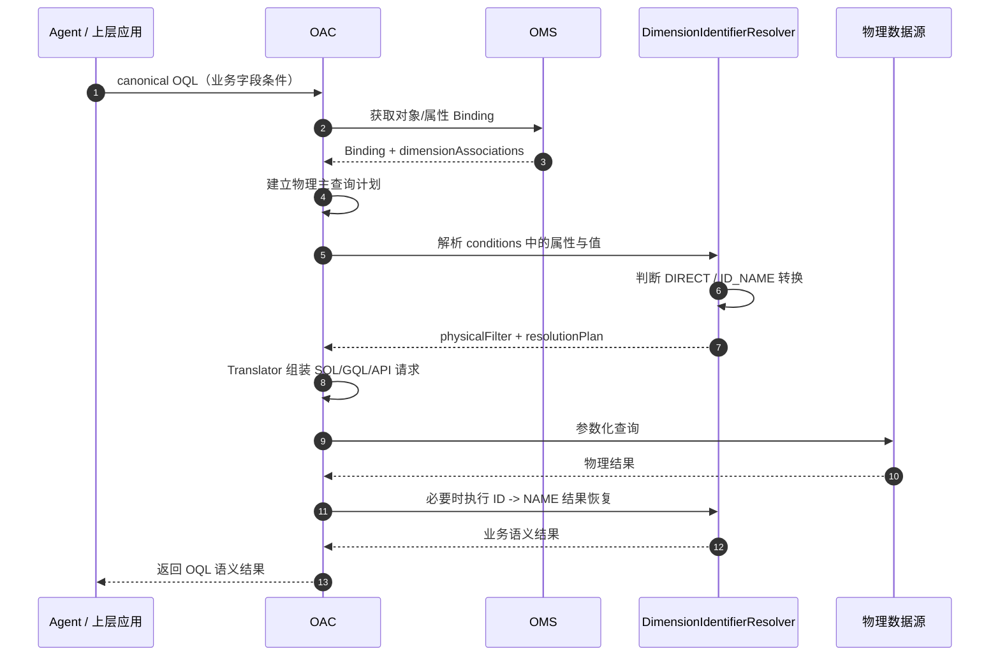

# SR20260829399078 多标识语义解析与自动转换 功能设计说明书

> 文档名称：SR20260829399078 多标识语义解析与自动转换 功能设计说明书  
> 适用服务：OMS（Ontology Model Service）、OAC（Ontology Access）  
> 需求编号：SR20260829399078  
> 文档版本：V1.0  
> 设计目标：支持同一业务实体的 ID / NAME 多标识语义定义、绑定、查询期自动识别与物理查询转换，使 Agent / OQL 保持业务语义，OMS 负责声明语义和物理映射，OAC 负责解析、转换和执行。

---

## 0. 设计背景与总体原则

当前本体对象的同一业务实体通常存在多个可表达同一实例的属性，例如：

- 小区：`CGI`（ID）与 `CellName`（NAME）；
- 用户：`MSISDN`（ID）与 `UserName`（NAME）；
- 套餐：`PackageID`（ID）与 `PackageName`（NAME）；
- 应用：`APP_ID`（ID）与 `APP_NAME`（NAME）。

自然语言、OQL 和底层物理数据对同一实体可能使用不同标识。例如用户问：

> 查询“小区名称 = MTUTK_001_TaiKooMTR_A_SUB6G”的 PRB 利用率。

OQL 应保持业务语义：

```text
Cell.CellName = "MTUTK_001_TaiKooMTR_A_SUB6G"
```

但底层事实表可能只存 `CGI`，因此执行阶段必须自动完成：

```text
CellName(NAME) -> CGI(ID) -> 物理过滤 -> 结果恢复为 CellName(NAME)
```

本需求不把该能力设计成 Agent 侧字符串替换，也不要求 OQL 提前感知底层字段。整体遵循以下原则：

1. **业务语义与物理存储解耦**：OQL 表达用户真实意图；OAC 决定物理查询使用 ID 还是 NAME。
2. **OMS 是语义关系与 Binding 的事实来源**：ID/NAME 的关联必须显式建模，不允许 OAC 通过字段名猜测。
3. **多标识关联不是普通对象关系**：它表达的是“两个属性值指向同一业务实体实例”的维度标识关联，不等价于 N:1、1:N 对象关系。
4. **优先直接过滤，必要时转换**：如果条件属性在目标物理数据集中可直接过滤，则不做无意义转换；否则基于维度关联转换到可过滤标识。
5. **一期仅定义 ID / NAME 两类角色**，模型预留后续 CODE / LABEL / ALIAS 等扩展能力。
6. **同时支持同对象属性关联与跨对象属性关联**：
   - 同一个对象的两个不同属性，例如 `Cell.CGI <-> Cell.CellName`；
   - 两个对象的不同属性，例如 `Experience.CellId <-> Cell.CellName`。

---

# 第一章 本体建模 OMS 服务属性绑定时维度关联定义

## 1.1 功能目标

OMS 在“本体属性 Binding”配置中增加“维度关联”能力，用于声明：

> 当前属性与另一个属性共同表达同一业务实体实例，其中一侧是 ID，另一侧是 NAME。

OMS 需要完成四类能力：

1. 定义 ID / NAME 两个维度角色；
2. 定义两个属性之间的维度关联；
3. 支持“同对象不同属性”和“跨对象不同属性”两种范围；
4. 在 Binding API 中向 OAC 返回完整、可确定执行的维度关联元数据。

---

## 1.2 概念模型

### 1.2.1 维度关联定义

新增逻辑概念：

```text
DimensionAssociation
```

一期固定：

```text
semanticType = ID_NAME
```

一个维度关联由两个端点组成：

```text
DimensionAssociation
├── ID Endpoint
│   ├── objectType
│   └── property
└── NAME Endpoint
    ├── objectType
    └── property
```

示例一：同一个对象的不同属性

```text
Cell
├── CGI       [ID]
└── CellName  [NAME]

Cell.CGI <-> Cell.CellName
```

示例二：两个对象的不同属性

```text
Experience.CellId [ID]
          <->
Cell.CellName      [NAME]
```

这里表示 `Experience.CellId` 中存储的标识值与 `Cell.CellName` 所表示的业务实体值属于同一维度实体的不同标识表达。

---

## 1.3 数据模型设计

### 1.3.1 推荐存储结构

建议在 OMS 中将维度关联作为独立模型存储，由属性 Binding 引用，避免把它混入现有对象关系类型。

```json
{
  "associationId": "dim_assoc_cell_identity_001",
  "semanticType": "ID_NAME",
  "scope": "SAME_OBJECT",
  "enabled": true,
  "idEndpoint": {
    "objectTypeId": "Cell",
    "propertyId": "cgi"
  },
  "nameEndpoint": {
    "objectTypeId": "Cell",
    "propertyId": "cellName"
  },
  "cardinality": "ONE_TO_ONE",
  "description": "Cell CGI 与 CellName 维度标识关联"
}
```

跨对象示例：

```json
{
  "associationId": "dim_assoc_experience_cell_001",
  "semanticType": "ID_NAME",
  "scope": "CROSS_OBJECT",
  "enabled": true,
  "idEndpoint": {
    "objectTypeId": "Experience",
    "propertyId": "cellId"
  },
  "nameEndpoint": {
    "objectTypeId": "Cell",
    "propertyId": "cellName"
  },
  "cardinality": "ONE_TO_ONE",
  "description": "体验数据中的 CellId 与 Cell 对象 CellName 维度关联"
}
```

### 1.3.2 字段定义

| 字段 | 类型 | 必填 | 说明 |
|---|---|:---:|---|
| `associationId` | string | 是 | 维度关联唯一标识 |
| `semanticType` | enum | 是 | 一期固定 `ID_NAME` |
| `scope` | enum | 是 | `SAME_OBJECT` / `CROSS_OBJECT` |
| `enabled` | boolean | 是 | 是否生效 |
| `idEndpoint.objectTypeId` | string | 是 | ID 端对象 |
| `idEndpoint.propertyId` | string | 是 | ID 端属性 |
| `nameEndpoint.objectTypeId` | string | 是 | NAME 端对象 |
| `nameEndpoint.propertyId` | string | 是 | NAME 端属性 |
| `cardinality` | enum | 是 | 一期支持 `ONE_TO_ONE`、`ONE_TO_MANY`、`MANY_TO_ONE` |
| `description` | string | 否 | 设计说明 |

### 1.3.3 属性 Binding 中的引用

属性 Binding 增加只读/引用字段：

```json
{
  "propertyId": "cellName",
  "physicalField": "CELL_NAME",
  "dimensionAssociationRefs": [
    {
      "associationId": "dim_assoc_cell_identity_001",
      "role": "NAME"
    }
  ]
}
```

ID 端：

```json
{
  "propertyId": "cgi",
  "physicalField": "CGI",
  "dimensionAssociationRefs": [
    {
      "associationId": "dim_assoc_cell_identity_001",
      "role": "ID"
    }
  ]
}
```

约束：

- 角色必须由关联端点决定，前端不得单独保存一份易漂移的角色配置；
- 同一 `associationId` 内必须且只能有一个 ID Endpoint 和一个 NAME Endpoint；
- 属性可参与多个维度关联，但一期建议产品侧限制同一属性同一 `semanticType` 仅配置一个启用关联，降低歧义。

---

## 1.4 为什么不直接复用“关系类型”

当前页面已有“对象关系”和“属性关系”的创建入口，关系类型页面也支持源对象、目标对象、源属性、目标属性等配置。

本需求虽然 UI 形态相似，但语义不同：

| 比较项 | 普通对象/属性关系 | 维度关联 |
|---|---|---|
| 表达内容 | 两个业务对象之间的业务关系 | 同一业务实体不同标识的等价/伴生关系 |
| 是否参与 OQL relationship path | 是 | 否 |
| 是否生成业务 JOIN 路径 | 可以 | 仅用于标识解析，不作为业务关系暴露 |
| 是否允许 Agent 感知 | 可以 | 原则上无需感知 |
| OAC 使用目的 | 关联查询 | 过滤条件标识转换、返回值恢复 |

因此建议后端模型独立；前端可以复用现有“关系配置”交互组件，但菜单名称和保存接口必须区分。

---

## 1.5 页面配置方案

### 1.5.1 入口设计

结合当前 OMS 页面已有左侧“对象类型 / 关系类型 / Function / 共享属性”等导航，以及“创建 -> 对象关系 / 属性关系”的交互，推荐两种入口。

**主入口：属性 Binding 编辑页**

在“对象类型 -> 属性 -> Binding 配置”中新增卡片：

```text
维度关联
[ ] 启用维度关联

维度角色： ID / NAME
关联范围： 同对象 / 跨对象
关联对象： [下拉]
关联属性： [下拉]
关联属性角色： 自动显示 NAME / ID
基数配置： 1:1 / 1:N / N:1
```

这是开发主入口，因为需求本质是“属性 Binding 时定义维度关联”。

**辅助入口：关系类型页**

在当前“创建”下拉中，可新增：

```text
创建
├── 对象关系
├── 属性关系
└── 维度关联
```

该入口用于集中查看和维护全部维度关联，避免用户只能进入对象属性逐个查找。

---

## 1.6 创建维度关联的人机交互

### 1.6.1 交互布局

沿用当前“创建属性关系”右侧抽屉风格，顶部用可视化方式展示两个端点：

```text
源端点                                  目标端点
[对象图标] Cell             <---->     [对象图标] Cell
      CGI [ID]                          CellName [NAME]
```

表单建议如下：

| 配置项 | 必填 | 交互 |
|---|:---:|---|
| 关联类型 | 是 | 固定“ID/NAME 维度关联”，一期不可编辑 |
| 关联范围 | 是 | 单选：同对象 / 跨对象 |
| ID 对象 | 是 | 对象下拉 |
| ID 属性 | 是 | 属性下拉 |
| NAME 对象 | 是 | 同对象时自动带出；跨对象时可选 |
| NAME 属性 | 是 | 属性下拉 |
| 基数 | 是 | 1:1 / 1:N / N:1，默认 1:1 |
| 编码名称 | 是 | 支持自动生成后修改 |
| 显示名称 | 是 | 中文展示名 |
| 描述 | 否 | 最多 2000 字符 |
| 启用状态 | 是 | 默认启用 |

编码名称建议自动生成：

```text
dim_<idObject>_<idProperty>__<nameObject>_<nameProperty>
```

例如：

```text
dim_cell_cgi__cell_cell_name
```

---

## 1.7 同对象配置示例

对象：

```text
Cell
├── CGI
├── CellName
└── PRBUsage
```

用户在 `Cell.CGI` Binding 中点击“新增维度关联”：

1. 当前属性自动填充为 ID 端；
2. 关联范围选择“同对象”；
3. NAME 对象自动锁定为 `Cell`；
4. NAME 属性选择 `CellName`；
5. 基数选择 1:1；
6. 保存。

页面展示：

```text
Cell.CGI [ID]  <== ID/NAME ==>  Cell.CellName [NAME]
状态：已启用
```

保存后在 `Cell.CellName` Binding 页面也反向展示同一条关联，不重复创建。

---

## 1.8 跨对象配置示例

对象：

```text
Experience
├── CellId
├── UserId
└── Throughput

Cell
├── CGI
└── CellName
```

配置：

```text
Experience.CellId [ID]
        <->
Cell.CellName [NAME]
```

作用：

- 用户以 `Cell.CellName` 过滤 Experience；
- 目标事实数据仅有 `Experience.CellId`；
- OAC 根据维度关联先把 NAME 解析为 ID，再对 Experience.CellId 过滤。

注意：跨对象维度关联不意味着自动创建业务对象关系，不应出现在 Agent 的 `relationships[]` 中。

---

## 1.9 Binding 返回结构

OMS 面向 OAC 的对象 Binding 响应中，建议增加：

```json
{
  "objectTypes": [
    {
      "objectTypeId": "Experience",
      "properties": [
        {
          "propertyId": "cellId",
          "physicalField": "CELL_ID",
          "dimensionAssociationRefs": [
            {
              "associationId": "dim_assoc_experience_cell_001",
              "role": "ID"
            }
          ]
        }
      ]
    },
    {
      "objectTypeId": "Cell",
      "properties": [
        {
          "propertyId": "cellName",
          "physicalField": "CELL_NAME",
          "dimensionAssociationRefs": [
            {
              "associationId": "dim_assoc_experience_cell_001",
              "role": "NAME"
            }
          ]
        }
      ]
    }
  ],
  "dimensionAssociations": [
    {
      "associationId": "dim_assoc_experience_cell_001",
      "semanticType": "ID_NAME",
      "scope": "CROSS_OBJECT",
      "enabled": true,
      "idEndpoint": {
        "objectTypeId": "Experience",
        "propertyId": "cellId"
      },
      "nameEndpoint": {
        "objectTypeId": "Cell",
        "propertyId": "cellName"
      },
      "cardinality": "ONE_TO_ONE"
    }
  ]
}
```

OAC 不允许根据属性名称中是否包含 `id`、`name` 来推断维度角色。

---

## 1.10 维度值解析所需的物理 Binding

仅知道 `CellId <-> CellName` 的语义关系还不足以执行 NAME -> ID 转换，OMS 必须能够为两个端点返回可访问的物理 Binding。

推荐遵循现有 Property Binding，不新增重复物理字段模型：

```text
Cell.CellName
  -> DIM_CELL.CELL_NAME

Cell.CGI
  -> DIM_CELL.CGI
```

当目标事实表为：

```text
FACT_EXPERIENCE.CELL_ID
```

OAC 可生成以下任一执行计划：

方案 A：子查询

```sql
SELECT ...
FROM FACT_EXPERIENCE f
WHERE f.CELL_ID IN (
  SELECT d.CGI
  FROM DIM_CELL d
  WHERE d.CELL_NAME = ?
)
```

方案 B：JOIN

```sql
SELECT ...
FROM FACT_EXPERIENCE f
JOIN DIM_CELL d
  ON f.CELL_ID = d.CGI
WHERE d.CELL_NAME = ?
```

一期由 OAC Translator 根据已有 Binding 能力选择，OMS 不把 SQL 语句写入维度关联配置。

---

## 1.11 配置校验规则

保存时必须校验：

1. ID Endpoint 与 NAME Endpoint 不得为同一个属性；
2. `scope=SAME_OBJECT` 时两个 endpoint 的 `objectTypeId` 必须相同；
3. `scope=CROSS_OBJECT` 时允许对象相同，但前端应提示建议改为 SAME_OBJECT；
4. 两个属性都必须存在且处于启用状态；
5. 属性类型必须具备可比较性，一期至少支持 string / integer / long；
6. 不允许形成同一 `semanticType` 下的循环歧义，例如：
   `A.name -> B.id`、`B.name -> C.id`、`C.name -> A.id` 且无唯一解析路径；
7. 若 `cardinality=ONE_TO_ONE`，运行期解析出多个 ID 必须按错误处理，不可静默任选一个；
8. 删除属性、对象或 Binding 前，OMS 必须检测维度关联引用并阻止直接删除，或要求用户先解除关联。

建议错误码：

```text
DIMENSION_ASSOCIATION_ENDPOINT_INVALID
DIMENSION_ASSOCIATION_ROLE_CONFLICT
DIMENSION_ASSOCIATION_SCOPE_INVALID
DIMENSION_ASSOCIATION_REFERENCE_IN_USE
DIMENSION_ASSOCIATION_AMBIGUOUS
```

---

## 1.12 页面展示与可观测性

在对象属性列表增加轻量标识：

```text
CGI        [ID]
CellName   [NAME]
```

鼠标悬停显示：

```text
维度关联：dim_cell_cgi__cell_cell_name
关联属性：Cell.CellName
基数：1:1
状态：已启用
```

在“关系类型/维度关联”集中列表中展示：

| 编码名称 | ID 端 | NAME 端 | 范围 | 基数 | 状态 |
|---|---|---|---|---|---|
| dim_cell_cgi__cell_cell_name | Cell.CGI | Cell.CellName | 同对象 | 1:1 | 启用 |
| dim_exp_cellid__cell_name | Experience.CellId | Cell.CellName | 跨对象 | 1:1 | 启用 |

---

# 第二章 本体访问 OAC 服务解析多标识和物理查询组装

## 2.1 功能目标

OAC 在接收到 canonical OQL 后，需要结合 OMS Binding 完成：

1. 识别过滤条件使用的是哪个业务属性；
2. 查询该属性是否参与 ID/NAME 维度关联；
3. 判断目标物理查询中哪个标识属性可以直接作为过滤条件；
4. 若业务条件与物理过滤属性不一致，生成标识解析执行计划；
5. 组装 SQL / GQL / API 等物理查询；
6. 保证最终结果仍符合 OQL 的业务语义。

核心边界：

> Agent 负责表达“查什么”，OAC 负责判断“底层用 ID 还是 NAME 查”。

---

## 2.2 OQL 输入约束

OQL 条件保持业务属性，不新增 `ID()` / `NAME()` 过滤语法。

示例：

```json
{
  "version": "2.0",
  "schemaRef": "telecom-v1",
  "operation": "QUERY",
  "objects": [
    {
      "objectType": "Experience",
      "alias": "e"
    }
  ],
  "conditions": {
    "kind": "PREDICATE",
    "ref": "e",
    "field": "cellName",
    "operator": "EQ",
    "values": ["MTUTK_001_TaiKooMTR_A_SUB6G"]
  },
  "returns": [
    {
      "kind": "FIELDS",
      "ref": "e",
      "fields": ["cellName", "throughput"]
    }
  ]
}
```

说明：

- `conditions` 中仍然是业务字段；
- 现有 OQL 规范中的 `returns.kind=FUNCTION + ID(field)/NAME(field)` 继续只用于返回语义，不用于条件；
- OAC 在执行计划阶段解析维度关联。

---

## 2.3 OAC 新增内部模块

建议新增逻辑组件：

```text
DimensionIdentifierResolver
```

职责：

```text
输入：
- OQL predicate
- object/property binding
- dimension association
- 当前物理查询目标

输出：
- originalSemanticProperty
- physicalFilterProperty
- conversionRequired
- conversionDirection
- valueResolutionPlan
```

建议内部数据结构：

```json
{
  "original": {
    "objectType": "Cell",
    "property": "cellName",
    "role": "NAME",
    "values": ["MTUTK_001_TaiKooMTR_A_SUB6G"]
  },
  "physicalFilter": {
    "objectType": "Experience",
    "property": "cellId",
    "role": "ID",
    "physicalField": "CELL_ID"
  },
  "conversionRequired": true,
  "conversionDirection": "NAME_TO_ID",
  "strategy": "SUBQUERY"
}
```

---

## 2.4 过滤条件识别算法

OAC 对每一个 `PREDICATE` 依次执行。

### Step 1：解析语义字段

根据：

```text
conditions.ref + conditions.field
```

定位对象属性。

例如：

```text
e.cellName
```

解析为：

```text
Experience.cellName
```

### Step 2：读取 Binding

获取：

- 当前属性物理 Binding；
- 当前属性关联的 `dimensionAssociationRefs`；
- 对应完整 `dimensionAssociation`。

### Step 3：确定目标主查询数据集

OAC 根据：

- `objects`；
- `returns`；
- 关系路径；
- Property Binding；
- 数据源路由；

确定当前主查询使用的物理资产，例如：

```text
FACT_EXPERIENCE
```

### Step 4：选择“物理过滤属性”

选择规则必须确定化，推荐顺序：

1. **条件属性本身可在主查询数据集中直接过滤**  
   -> 直接使用条件属性，不转换；
2. 条件属性本身不可直接过滤，但其 ID/NAME 关联属性在主查询数据集中可过滤  
   -> 使用关联属性作为物理过滤字段；
3. 两侧都不在主查询数据集，但可通过已有 Binding 生成 JOIN / 子查询  
   -> 生成标识解析计划；
4. 存在多个可执行候选且无法唯一确定  
   -> 返回歧义错误，不允许随意选一个；
5. 无可执行路径  
   -> 返回 Binding 不完整错误。

### Step 5：确定转换方向

若：

```text
输入属性 role=NAME
物理过滤属性 role=ID
```

则：

```text
NAME_TO_ID
```

若相反，则：

```text
ID_TO_NAME
```

若 role 相同或直接过滤，则：

```text
NONE
```

---

## 2.5 过滤属性选择规则详解

不能简单规定“所有查询都优先用 ID”，否则会破坏已经直接以 NAME 存储的数据源。

推荐采用：

```text
DIRECT > ASSOCIATED_LOCAL > ASSOCIATED_LOOKUP
```

即：

### 规则 A：DIRECT

如果 OQL 条件字段有可直接用于当前目标物理表的 Binding：

```text
WHERE CELL_NAME = ?
```

则直接执行，不进行 NAME -> ID。

### 规则 B：ASSOCIATED_LOCAL

如果目标物理表没有 NAME，但有同一维度关联的 ID：

```text
OQL: CellName = ?
Physical: CELL_ID
```

则执行 NAME -> ID 后：

```text
WHERE CELL_ID = ?
```

### 规则 C：ASSOCIATED_LOOKUP

如果 NAME 与 ID 位于维表/其他对象绑定中，则生成：

```text
NAME condition
   -> dimension lookup
   -> ID set
   -> fact filter
```

---

## 2.6 同对象属性解析场景

### 场景

OMS：

```text
Cell.CGI      [ID]
Cell.CellName [NAME]
```

物理 Binding：

```text
Cell.CGI      -> T_CELL.CGI
Cell.CellName -> T_CELL.CELL_NAME
```

用户条件：

```text
Cell.CellName = "xxx"
```

若当前查询 T_CELL 同时有 `CELL_NAME`：

```sql
WHERE T_CELL.CELL_NAME = ?
```

无需转换。

若目标指标事实表仅有 CGI：

```text
FACT_KPI.CGI
```

则 OAC：

```text
CellName -> CGI
```

并生成：

```sql
SELECT ...
FROM FACT_KPI f
WHERE f.CGI IN (
  SELECT c.CGI
  FROM T_CELL c
  WHERE c.CELL_NAME = ?
)
```

---

## 2.7 跨对象属性解析场景

### 场景

OMS：

```text
Experience.CellId [ID]
Cell.CellName      [NAME]
```

OQL：

```text
查询 CellName="xxx" 的 Experience.Throughput
```

物理 Binding：

```text
Experience.CellId    -> FACT_EXPERIENCE.CELL_ID
Experience.Throughput-> FACT_EXPERIENCE.THROUGHPUT
Cell.CGI             -> DIM_CELL.CGI
Cell.CellName        -> DIM_CELL.CELL_NAME
```

OAC 执行计划：

```text
1. 原始条件：Cell.CellName = xxx
2. 识别 role=NAME
3. 主查询：FACT_EXPERIENCE
4. 主查询可过滤字段：Experience.CellId，role=ID
5. 匹配维度关联
6. 生成 NAME_TO_ID 解析
7. 以 CELL_ID 过滤 FACT_EXPERIENCE
```

SQL：

```sql
SELECT
  f.THROUGHPUT
FROM FACT_EXPERIENCE f
WHERE f.CELL_ID IN (
  SELECT c.CGI
  FROM DIM_CELL c
  WHERE c.CELL_NAME = ?
)
```

---

## 2.8 1:N / N:1 转换处理

### NAME -> 多个 ID

例如：

```text
Terminal.ModelName = "iPhone 16 Pro"
  ->
TAC IN ("12345678", "87654321")
```

OAC 必须将：

```text
EQ NAME
```

转换为：

```sql
ID IN (?, ?)
```

不得只取第一条。

### 多 ID -> 同一个 NAME

返回阶段如多个 ID 对应同一个 NAME，应保持业务结果语义，并由上层查询的 `DISTINCT` / 聚合策略决定是否去重，不由维度解析器擅自去重业务行。

---

## 2.9 Operator 转换规则

一期支持以下条件操作符进行维度转换：

| OQL Operator | 转换后规则 |
|---|---|
| `EQ` | 单值解析后使用 `=` 或 `IN` |
| `NE` | 单值解析后使用 `<>` 或 `NOT IN` |
| `IN` | 每个 NAME 解析为 ID 集合，合并后 `IN` |
| `NOT_IN` | 同上，使用 `NOT IN` |

一期不建议自动对以下操作符做 ID/NAME 转换：

```text
GT / GTE / LT / LTE / BETWEEN
LIKE / CONTAINS / STARTS_WITH / ENDS_WITH
```

原因：

- ID 与 NAME 的排序、模糊匹配语义通常不等价；
- `NAME LIKE 'Jak%'` 转成 ID 集合可能导致大规模枚举与性能不可控。

对于模糊条件，若 NAME 端可直接查询，则直接下推到 NAME 端；否则返回：

```text
UNSUPPORTED_DIMENSION_OPERATOR
```

---

## 2.10 SQL 组装策略

建议 Translator 支持三种策略。

### 2.10.1 DIRECT_FILTER

```sql
WHERE target_field = ?
```

### 2.10.2 SUBQUERY_RESOLVE

```sql
WHERE id_field IN (
  SELECT id_col
  FROM dimension_table
  WHERE name_col = ?
)
```

适合：

- 只需要过滤；
- 维表结果规模小；
- 不需要返回 NAME。

### 2.10.3 JOIN_RESOLVE

```sql
JOIN dimension_table d
  ON fact.id_field = d.id_col
WHERE d.name_col = ?
```

适合：

- 同时需要返回 NAME；
- 查询本身已经需要维表；
- 避免重复解析。

策略选择建议：

```text
需要返回 NAME 或已有 JOIN -> JOIN_RESOLVE
仅过滤 -> 优先 SUBQUERY_RESOLVE
可直接过滤 -> DIRECT_FILTER
```

具体由数据源 Translator 决定，不暴露到 OQL。

---

## 2.11 结果恢复与返回语义

OQL 请求返回：

```json
{
  "kind": "FUNCTION",
  "ref": "c",
  "field": "NAME(cell)",
  "alias": "cell_name"
}
```

或普通返回本体 NAME 属性时，OAC 必须保证最终结果是 NAME 语义。

如果物理查询只得到 ID，可通过：

1. JOIN 维表同时获取 NAME；
2. 批量 ID -> NAME 解析；
3. 复用查询期缓存；

完成结果恢复。

不允许把物理 ID 直接塞到声明为 NAME 的返回字段中。

---

## 2.12 完整处理时序



---

## 2.13 OAC 执行伪代码

```text
for predicate in request.conditions:
    semanticProperty = resolveProperty(predicate.ref, predicate.field)
    binding = bindingRegistry.get(semanticProperty)

    if binding.canFilterDirectly(currentPhysicalPlan):
        addPhysicalPredicate(binding.physicalField, predicate.operator, predicate.values)
        continue

    associations = binding.dimensionAssociationRefs

    if associations is empty:
        throw BINDING_INCOMPLETE

    candidates = []

    for association in associations:
        peer = association.getPeer(semanticProperty)

        if peer.canFilterDirectly(currentPhysicalPlan):
            candidates.add(buildIdentifierPlan(
                original = semanticProperty,
                target = peer,
                predicate = predicate
            ))
        else if canResolveByLookup(association):
            candidates.add(buildLookupPlan(...))

    plan = selectUniqueExecutableCandidate(candidates)

    if plan is null:
        throw DIMENSION_RESOLUTION_PATH_NOT_FOUND

    if candidates.size > 1 and no deterministic winner:
        throw DIMENSION_RESOLUTION_AMBIGUOUS

    apply(plan)
```

---

## 2.14 缓存设计

NAME -> ID 转换可能成为热点，建议 OAC 增加短时缓存：

```text
Key:
tenantId + ontologyId + associationId + role + value

Value:
resolved values + version

TTL:
可配置，默认 5~30 min
```

要求：

- OMS Binding 版本变化后缓存立即失效或通过版本号自然隔离；
- 不缓存权限相关的跨租户结果；
- 1:N 返回结果整体缓存，不只缓存第一条。

---

## 2.15 错误码设计

建议新增：

| 错误码 | 场景 |
|---|---|
| `DIMENSION_ASSOCIATION_NOT_FOUND` | 需要转换但未配置维度关联 |
| `DIMENSION_RESOLUTION_PATH_NOT_FOUND` | 有语义关联，但无法找到可执行物理 Binding |
| `DIMENSION_RESOLUTION_AMBIGUOUS` | 多条转换路径均可执行且无法唯一选择 |
| `DIMENSION_VALUE_NOT_FOUND` | NAME/ID 无对应值 |
| `DIMENSION_VALUE_NOT_UNIQUE` | 配置 1:1 但解析出多值 |
| `UNSUPPORTED_DIMENSION_OPERATOR` | 对不支持的条件操作符进行转换 |
| `DIMENSION_BINDING_INCOMPLETE` | ID/NAME 端 Binding 缺失 |
| `DIMENSION_RESULT_RESTORE_FAILED` | 结果 ID -> NAME 恢复失败 |

错误示例：

```json
{
  "success": false,
  "errors": [
    {
      "code": "DIMENSION_RESOLUTION_AMBIGUOUS",
      "message": "Multiple executable ID/NAME resolution paths found for Cell.cellName.",
      "path": "conditions",
      "details": {
        "objectType": "Cell",
        "property": "cellName",
        "candidateAssociationIds": [
          "dim_assoc_001",
          "dim_assoc_002"
        ]
      }
    }
  ]
}
```

---

## 2.16 安全与参数化要求

维度转换后得到的 ID 值仍然属于外部输入派生值，必须：

- 使用参数化 SQL；
- 禁止拼接用户输入和解析结果；
- 解析结果数量需受限；
- 对超大 `IN` 集合采用临时表、批量参数或 JOIN 方案；
- 对跨租户/跨权限维度值解析复用现有 OAC 鉴权边界。

---

## 2.17 性能约束

建议一期默认约束：

```text
maxResolvedValuesPerPredicate = 1000
maxDimensionResolutionDepth = 1
maxDimensionAssociationsPerProperty = 4
```

说明：

- 一期不允许 ID/NAME 转换链式无限递归；
- 单次只沿一个维度关联进行转换；
- 超过最大解析值数量时返回错误，避免生成超大 `IN`。

后续如需支持：

```text
Alias -> Name -> ID
Code -> Name -> ID
```

应引入显式多跳 Identifier Graph，而不是在一期隐式递归。

---

## 2.18 核心测试用例

### 用例 1：同对象 NAME 可直接过滤

```text
Cell.CellName -> T_CELL.CELL_NAME
```

预期：

- 不执行转换；
- SQL 使用 `CELL_NAME = ?`。

### 用例 2：同对象 NAME -> ID

```text
Cell.CellName [NAME] <-> Cell.CGI [ID]
事实表仅有 CGI
```

预期：

- 生成 NAME_TO_ID；
- 物理过滤 CGI。

### 用例 3：跨对象 NAME -> ID

```text
Cell.CellName [NAME] <-> Experience.CellId [ID]
```

预期：

- OQL 不出现物理 JOIN；
- OAC 使用 Binding 生成子查询或 JOIN。

### 用例 4：NAME -> 多 ID

预期：

- EQ 自动扩展成 `IN`；
- 不丢失 ID。

### 用例 5：1:1 配置但解析到多 ID

预期：

- 返回 `DIMENSION_VALUE_NOT_UNIQUE`。

### 用例 6：未配置维度关联

预期：

- 如果条件属性可直接查询，则正常执行；
- 如果条件属性不可直接查询，则返回 `DIMENSION_ASSOCIATION_NOT_FOUND`。

### 用例 7：LIKE 需要转换

预期：

- NAME 端可直接下推则正常；
- 只能转成 ID 时返回 `UNSUPPORTED_DIMENSION_OPERATOR`。

### 用例 8：返回 NAME、物理只返回 ID

预期：

- OAC 自动恢复 NAME；
- 返回字段与 OQL alias 保持一致。

---

## 2.19 开发改造点汇总

### OMS

需要新增/修改：

1. `DimensionAssociation` 领域模型；
2. 创建、更新、查询、删除 API；
3. Property Binding 增加 `dimensionAssociationRefs`；
4. Binding 查询响应增加 `dimensionAssociations`；
5. 属性 Binding 页面增加“维度关联”配置；
6. 关系类型页增加维度关联集中管理入口；
7. 删除对象/属性/Binding 时增加引用完整性校验；
8. 模型版本变化时纳入 Binding 版本管理。

### OAC

需要新增/修改：

1. Binding DTO 解析 `dimensionAssociations`；
2. 新增 `DimensionIdentifierResolver`；
3. Query Planner 增加物理过滤字段选择；
4. Translator 增加 DIRECT / SUBQUERY / JOIN 三类转换计划；
5. 结果映射增加 ID -> NAME 恢复；
6. 新增缓存；
7. 新增错误码和调用链日志；
8. 增加单元测试、集成测试和多数据源回归测试。

---

## 2.20 日志与可观测性

建议 OAC 调试日志打印“决策”，但不打印敏感数据明文：

```text
dimensionResolution:
  requestId: xxx
  objectType: Cell
  semanticProperty: cellName
  semanticRole: NAME
  physicalProperty: cellId
  physicalRole: ID
  associationId: dim_assoc_experience_cell_001
  strategy: SUBQUERY
  resolvedValueCount: 1
  cacheHit: true
```

关键指标：

```text
oac_dimension_resolution_total
oac_dimension_resolution_failed_total
oac_dimension_resolution_latency_ms
oac_dimension_resolution_cache_hit_rate
oac_dimension_resolved_value_count
```

---

## 2.21 验收标准

功能验收至少满足：

1. OMS 可以通过页面配置同对象两个不同属性的 ID/NAME 维度关联；
2. OMS 可以配置两个对象不同属性的 ID/NAME 维度关联；
3. OMS Binding API 能完整返回关联两端及属性 Binding；
4. OAC 不依赖字段名猜测 ID/NAME；
5. OAC 能识别 OQL 条件当前使用的业务标识；
6. OAC 能判断物理查询应使用哪个属性作为过滤条件；
7. NAME 输入、ID 物理存储时能够自动生成可执行查询；
8. ID 输入、NAME 物理存储时能够反向转换；
9. 1:N 场景能正确展开为集合过滤；
10. 无法唯一确定转换路径时明确报错，不静默降级；
11. OQL 仍保持业务语义，不增加物理字段或物理 JOIN；
12. 返回结果与 OQL 请求的 ID/NAME 语义一致。

---

## 附录 A：推荐一期能力边界

一期支持：

```text
ID <-> NAME
同对象属性
跨对象属性
EQ / NE / IN / NOT_IN
1:1 / 1:N / N:1
SQL 子查询 / JOIN / 直接过滤
返回值 ID/NAME 恢复
```

一期暂不支持：

```text
ID -> NAME -> ALIAS 多跳链式转换
模糊 NAME 自动展开成大规模 ID 集合
跨多个数据源的分布式维度 Join
无显式 Binding 情况下的字段名推断
运行时任意脚本转换
```

---

## 附录 B：关键设计结论

本需求最终形成两层清晰职责：

```text
OMS：
定义“哪个属性是 ID，哪个属性是 NAME，它们属于同一维度实体”，
并提供两端完整 Binding。

OAC：
根据 OQL 条件与当前物理查询目标，
选择实际过滤属性；
必要时执行 ID/NAME 转换；
组装 SQL/GQL/API 请求；
最终恢复成 OQL 要求的业务语义。
```

最终目标不是让 Agent 理解底层数据怎么存，而是实现：

> **业务怎么说，OQL 就怎么表达；数据怎么存，由 OMS Binding + OAC 自动完成语义解析和物理转换。**
