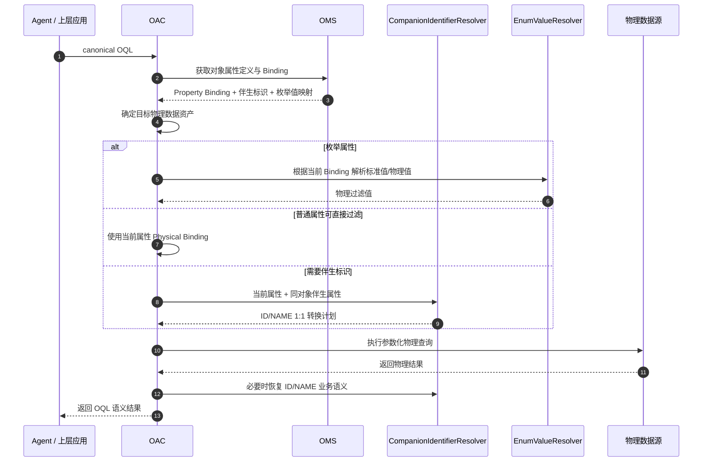

# SR20260829399078 多标识语义解析与自动转换 功能设计说明书

> 文档名称：SR20260829399078 多标识语义解析与自动转换 功能设计说明书  
> 适用服务：OMS（Ontology Model Service）、OAC（Ontology Access）  
> 需求编号：SR20260829399078  
> 文档版本：V1.1  
> 更新说明：根据数据映射页面交互方案收敛伴生标识能力。伴生标识仅支持**当前对象内的对象属性 1:1 映射**；页面不展示固定字段；物理模型到对象属性的连线只表示 Binding，不展示 ID/NAME、伴生标识或值映射信息；伴生标识和值映射统一在右侧对象属性上配置和展示。

---

## 0. 设计背景与总体原则

同一个业务实体通常同时存在面向系统存储的标识和面向业务理解的名称，例如：

- 小区：`CGI`（ID）与 `CellName`（NAME）；
- 用户：`MSISDN`（ID）与 `UserName`（NAME）；
- 套餐：`PackageID`（ID）与 `PackageName`（NAME）；
- 基站：`SiteId`（ID）与 `SiteName`（NAME）。

自然语言、OQL 和物理数据可能使用不同标识。例如用户输入：

> 查询小区名称为 MTUTK_001_TaiKooMTR_A_SUB6G 的 PRB 利用率。

OQL 应保持业务语义：

```text
Cell.CellName = "MTUTK_001_TaiKooMTR_A_SUB6G"
```

物理数据如果仅保存 CGI，则由 OAC 在执行阶段根据 OMS 的对象属性定义和物理 Binding 自动识别：

```text
CellName [NAME]
    ↓
同对象伴生属性
    ↓
CGI [ID]
    ↓
物理字段过滤
```

本方案遵循以下原则：

1. **OQL 保持业务语义**：Agent/OQL 不感知底层字段到底保存 ID 还是 NAME。
2. **物理 Binding 与标识语义分离**：左侧物理模型到右侧对象属性的连线只表达“物理字段绑定到哪个对象属性”。
3. **ID/NAME 只属于对象属性语义层**：ID、NAME、伴生关系均只在右侧对象属性上配置和展示。
4. **值映射只属于对象属性配置**：枚举值映射不在连线上展示，通过对象属性的“值映射”入口集中管理。
5. **伴生标识能力一期收敛为确定模型**：
   - 仅支持对象属性之间映射；
   - 仅支持当前对象内两个不同属性；
   - 映射基数固定为 1:1；
   - 标识角色仅支持 ID / NAME；
   - 不支持跨对象伴生；
   - 不支持 1:N、N:1。
6. **页面仅暴露需要用户决策的字段**：固定规则不要求用户重复配置。

---

# 第一章 本体建模 OMS 服务属性绑定时维度关联定义

## 1.1 功能目标

OMS 在现有“物理模型字段 → 对象属性”的 Binding 能力上增加两类对象属性增强能力：

1. **伴生标识**：在当前对象内定义两个对象属性的 ID / NAME 伴生关系；
2. **值映射**：枚举属性配置物理值到标准枚举值的映射。

两类能力均属于右侧对象属性定义，不改变现有物理字段 Binding 的基本语义。

整体页面关系如下：

```text
左侧：物理模型                         右侧：本体对象属性
┌────────────────┐                  ┌──────────────────────┐
│ tableA.site_id │ ───────────────▶ │ Site.siteId          │
│                │     Binding      │   标识角色：ID       │
│ tableA.status  │ ───────────────▶ │ Site.status          │
└────────────────┘                  │   值映射：StatusMap  │
                                    │                      │
                                    │ Site.siteName        │
                                    │   标识角色：NAME     │
                                    │   伴生：siteId       │
                                    └──────────────────────┘
```

中间连线不承担任何标识或转换配置。

---

## 1.2 现有 Binding 能力的增强边界

### 1.2.1 左侧：物理模型

左侧继续表示现有数据模型中的表、字段、字段类型、示例值等物理信息。

左侧不增加 ID 标签、NAME 标签、伴生标识和值映射标识。

### 1.2.2 中间：Binding 连线

连线语义固定为：

> 物理字段绑定到本体对象属性。

例如：

```text
radio_inventory.site_id ─────▶ Site.siteId
```

连线上不展示：

- ID / NAME；
- “默认转换”；
- “值映射”；
- “伴生标识”；
- 转换方向。

即：

```text
连线 = Physical Field Binding
连线 ≠ Identifier Mapping
连线 ≠ Enum Value Mapping
```

### 1.2.3 右侧：对象属性

右侧对象属性负责展示和配置：

- 数据类型；
- ID / NAME 标识角色；
- 伴生属性；
- 枚举引用；
- 值映射。

这是本次 OMS 页面增强的主要位置。

---

## 1.3 伴生标识概念模型

### 1.3.1 定义

“伴生标识”表示：

> 当前对象内两个不同对象属性共同表达同一个业务实例，一个承担 ID 语义，一个承担 NAME 语义，两者建立固定 1:1 的标识映射关系。

例如：

```text
Cell
├── CGI       [ID]
└── CellName  [NAME]

CGI [ID]  ↔  CellName [NAME]
```

一期能力固定为：

```text
映射类型：对象属性映射
范围：当前对象
语义类型：ID_NAME
基数：1:1
```

这些都是系统规则，不需要用户配置。

---

## 1.4 伴生标识页面配置

### 1.4.1 入口

在数据映射页面右侧对象属性行增加轻量展示：

| 属性 | 类型 | 标识 | 伴生标识 | 值映射 |
|---|---|---|---|---|
| `siteId` | String | ID | `siteName [NAME]` | — |
| `siteName` | String | NAME | `siteId [ID]` | — |
| `status` | ENUM | — | — | `运行状态 · 数值编码` |

点击“伴生标识”或属性编辑入口，打开对象属性配置抽屉。

### 1.4.2 页面仅保留两个必填字段

伴生标识配置页只允许用户配置：

| 字段 | 必填 | 说明 |
|---|:---:|---|
| 当前属性标识角色 | 是 | `ID` / `NAME` |
| 伴生属性 | 是 | 当前对象内除自身外的另一个属性 |

示例：

```text
伴生标识

当前属性：siteId

当前属性标识角色 *
[ ID ▼ ]

伴生属性 *
[ siteName ▼ ]

预览：
siteId [ID] ↔ siteName [NAME]

                         [取消] [保存]
```

### 1.4.3 页面不再展示的确定性字段

以下字段不出现在交互页面：

```text
伴生标识类型 = 对象属性映射
关联范围     = 当前对象
映射基数     = 1:1
伴生属性角色 = 当前角色的相反角色
启用状态     = 保存即生效
所属对象     = 当前对象
```

用户不需要对确定性规则重复选择。

---

## 1.5 伴生标识交互规则

### 1.5.1 当前属性选择 ID

如果用户配置：

```text
siteId
角色 = ID
伴生属性 = siteName
```

系统自动得到：

```text
siteId   = ID
siteName = NAME

siteId [ID] ↔ siteName [NAME]
```

无需再配置 `siteName` 的角色。

### 1.5.2 当前属性选择 NAME

如果用户从 `siteName` 入口配置：

```text
siteName
角色 = NAME
伴生属性 = siteId
```

系统得到完全相同的一条伴生关系：

```text
siteId [ID] ↔ siteName [NAME]
```

伴生关系是双向的，不允许分别保存两条重复记录。

### 1.5.3 反向展示

配置保存后：

- `siteId` 属性显示：`ID / 伴生 siteName [NAME]`；
- `siteName` 属性显示：`NAME / 伴生 siteId [ID]`。

从任意一侧进入都编辑同一条关系。

---

## 1.6 数据模型设计

### 1.6.1 推荐存储模型

建议 OMS 保存最小必要信息：

```json
{
  "associationId": "identifier_assoc_site_001",
  "objectTypeId": "Site",
  "idPropertyId": "siteId",
  "namePropertyId": "siteName"
}
```

这里不保存用户可配置但实际上固定的：

```text
scope
cardinality
mappingType
enabled
```

服务端语义约定即为：

```text
scope       = SAME_OBJECT
cardinality = ONE_TO_ONE
mappingType = PROPERTY
semantic    = ID_NAME
```

如现有后端公共模型要求保留这些字段，也应由服务端自动赋值，不暴露到前端表单。

### 1.6.2 Property DTO 返回

为了便于前端直接展示，可在属性 DTO 中返回派生信息：

```json
{
  "propertyId": "siteId",
  "propertyName": "siteId",
  "identifierRole": "ID",
  "companionIdentifier": {
    "associationId": "identifier_assoc_site_001",
    "propertyId": "siteName",
    "propertyName": "siteName",
    "role": "NAME"
  }
}
```

另一侧：

```json
{
  "propertyId": "siteName",
  "propertyName": "siteName",
  "identifierRole": "NAME",
  "companionIdentifier": {
    "associationId": "identifier_assoc_site_001",
    "propertyId": "siteId",
    "propertyName": "siteId",
    "role": "ID"
  }
}
```

前端不需要自行计算反向关系。

---

## 1.7 配置校验规则

保存伴生标识时必须校验：

1. 当前属性和伴生属性必须属于**同一个对象**；
2. 当前属性和伴生属性不能是同一个属性；
3. 当前角色只能是 `ID` 或 `NAME`；
4. 伴生角色由系统自动取相反角色；
5. 同一属性一期最多参与一个启用的伴生标识关系；
6. 已作为 ID 的属性不能在另一条关系中再次作为 NAME；
7. 两端属性必须是可用于等值比较的类型；
8. 删除任一属性前必须校验伴生引用；
9. 修改关系时需要保证最终仍然是唯一 1:1 配对。

建议错误码：

```text
COMPANION_IDENTIFIER_PROPERTY_INVALID
COMPANION_IDENTIFIER_SAME_PROPERTY
COMPANION_IDENTIFIER_ROLE_CONFLICT
COMPANION_IDENTIFIER_ALREADY_BOUND
COMPANION_IDENTIFIER_REFERENCE_IN_USE
```

---

## 1.8 枚举值映射设计

### 1.8.1 与伴生标识的边界

枚举值映射和伴生标识是两类独立能力。

**伴生标识：**

```text
对象属性 ↔ 对象属性

Site.siteId [ID]
      ↕
Site.siteName [NAME]
```

**枚举值映射：**

```text
物理字段值 → 标准枚举值

0 -> 正常
1 -> 故障
```

因此枚举值映射不作为“伴生标识类型”出现。

### 1.8.2 页面入口

对于 `ENUM` 类型对象属性，在右侧对象属性上显示“值映射”入口。

点击后进入该属性的值映射配置。

连线本身只显示普通 Binding，不显示值映射名称。

### 1.8.3 多物理模型场景

同一个对象属性可以被不同物理模型字段绑定，而不同数据源的编码可能不同。

例如：

```text
radio_inventory_a.rat_type    -> BaseStation.networkGeneration
radio_inventory_b.generation  -> BaseStation.networkGeneration
radio_inventory_c.制式        -> BaseStation.networkGeneration
```

三个物理字段可能分别保存：

```text
3 / 4 / 5
3G / 4G / 5G
三 / 四 / 五
```

因此“值映射”页面以**对象属性为入口**，但内部可以按该属性已有 Binding 分别选择对应的值映射方案：

| 物理 Binding | 值映射 |
|---|---|
| `radio_inventory_a.rat_type` | 网络制式 · 数值编码 |
| `radio_inventory_b.generation` | 网络制式 · 标准文本 |
| `radio_inventory_c.制式` | 网络制式 · 中文编码 |

这样用户的认知入口始终是“对象属性”，同时保留不同物理数据源独立编码的能力。

---

## 1.9 数据映射页面最终交互

推荐最终页面遵循三层语义：

```text
第一层：物理 Binding
左侧物理字段 ─────────────▶ 右侧对象属性

第二层：对象属性伴生标识
右侧：
siteId [ID] ↔ siteName [NAME]

第三层：对象属性值映射
右侧：
networkGeneration [ENUM]
└── 值映射
    ├── 表A -> 数值编码
    ├── 表B -> 标准文本
    └── 表C -> 中文编码
```

其中：

- **连线只负责第一层**；
- **伴生标识只在右侧负责第二层**；
- **值映射只在右侧负责第三层**。

---

## 1.10 OMS 面向 OAC 的 Binding 输出

OMS 返回 Binding 时，需要把现有物理字段 Binding、伴生标识、值映射都提供给 OAC，但结构上保持职责分离。

示例：

```json
{
  "objectTypes": [
    {
      "objectTypeId": "Site",
      "properties": [
        {
          "propertyId": "siteId",
          "identifierRole": "ID",
          "physicalBindings": [
            {
              "dataAsset": "radio_inventory",
              "field": "site_id"
            }
          ],
          "companionIdentifier": {
            "associationId": "identifier_assoc_site_001",
            "propertyId": "siteName",
            "role": "NAME"
          }
        },
        {
          "propertyId": "siteName",
          "identifierRole": "NAME",
          "physicalBindings": [
            {
              "dataAsset": "site_dimension",
              "field": "site_name"
            }
          ],
          "companionIdentifier": {
            "associationId": "identifier_assoc_site_001",
            "propertyId": "siteId",
            "role": "ID"
          }
        }
      ]
    }
  ]
}
```

枚举属性的值映射继续由现有枚举 Binding / mapping 信息提供，不并入 `companionIdentifier`。

---

# 第二章 本体访问 OAC 服务解析多标识和物理查询组装

## 2.1 功能目标

OAC 接收到 canonical OQL 后，需要基于 OMS 返回的信息完成：

1. 解析 OQL 中使用的业务属性；
2. 判断当前属性是否能够直接映射到本次查询的物理字段；
3. 如果不能直接过滤，判断该属性是否配置了同对象伴生标识；
4. 识别当前属性角色是 ID 还是 NAME；
5. 找到伴生属性对应的物理 Binding；
6. 根据 1:1 伴生关系完成 ID / NAME 转换；
7. 对枚举属性应用该物理 Binding 对应的值映射；
8. 生成物理 SQL / GQL / API 请求；
9. 按 OQL 语义恢复返回结果。

核心边界保持不变：

> Agent 表达“查什么”；OMS 定义“属性是什么以及怎么绑定”；OAC 决定“物理上用哪个字段和值查询”。

---

## 2.2 OQL 输入约束

OQL 条件继续保持对象属性语义，不引入物理字段：

```json
{
  "version": "2.0",
  "schemaRef": "telecom-v1",
  "operation": "QUERY",
  "objects": [
    {
      "objectType": "Cell",
      "alias": "c"
    }
  ],
  "conditions": {
    "kind": "PREDICATE",
    "ref": "c",
    "field": "cellName",
    "operator": "EQ",
    "values": [
      "MTUTK_001_TaiKooMTR_A_SUB6G"
    ]
  },
  "returns": [
    {
      "kind": "FIELDS",
      "ref": "c",
      "fields": [
        "cellName",
        "prbUsage"
      ]
    }
  ]
}
```

OAC 不要求 Agent 将 `cellName` 预先改成 `cgi`。

---

## 2.3 OAC 内部解析模型

建议使用：

```text
CompanionIdentifierResolver
```

替代泛化的多对象 `DimensionIdentifierResolver`。

职责仅处理：

```text
当前对象 Property A [ID/NAME]
         ↕ 1:1
当前对象 Property B [NAME/ID]
```

输入：

```text
- OQL predicate
- 当前对象 Property 定义
- Property physical bindings
- companionIdentifier
- 当前执行所选物理数据资产
```

输出：

```text
- semanticProperty
- semanticRole
- physicalFilterProperty
- physicalFilterField
- conversionRequired
- conversionDirection
- valueResolutionPlan
```

---

## 2.4 物理过滤字段选择规则

OAC 的判断顺序固定为：

```text
DIRECT
  >
COMPANION_PROPERTY
  >
ERROR
```

### 2.4.1 DIRECT：当前属性直接可查

如果 OQL 条件属性在目标物理数据资产中已有 Binding：

```text
OQL:
Cell.cellName = ?

Binding:
Cell.cellName -> DIM_CELL.CELL_NAME
```

则直接生成：

```sql
WHERE CELL_NAME = ?
```

即使该属性存在伴生 ID，也不进行无意义转换。

### 2.4.2 COMPANION_PROPERTY：通过伴生属性查询

如果当前属性没有可用物理 Binding，但同对象伴生属性具备可执行 Binding：

```text
Cell.cellName [NAME]
        ↕
Cell.cgi [ID]

当前数据资产：
Cell.cgi -> FACT_KPI.CGI
```

OAC 识别：

```text
语义条件属性 = cellName [NAME]
物理过滤属性 = cgi [ID]
转换方向     = NAME_TO_ID
```

之后通过已有的对象属性 Binding / 数据访问能力解析 NAME 对应的 ID，再拼装物理条件。

### 2.4.3 ERROR：无可执行路径

如果当前属性无直接 Binding、伴生属性也没有可执行 Binding，或缺失标识值解析所需的 Binding，则明确返回 Binding 错误，不根据字段名称进行猜测。

---

## 2.5 1:1 标识解析约束

一期伴生标识固定 1:1，因此：

```text
一个 ID   <-> 一个 NAME
一个 NAME <-> 一个 ID
```

OAC 不需要处理：

- NAME -> 多 ID；
- ID -> 多 NAME；
- EQ 自动扩展 IN；
- 伴生属性多候选路径。

如果运行期查询到一个 NAME 对应多个 ID，说明数据违反 OMS 模型约束，应返回：

```text
COMPANION_IDENTIFIER_NOT_UNIQUE
```

不得任取其中一个值。

---

## 2.6 表字段场景示例

对象定义：

```text
Cell
├── cgi       [ID]
├── cellName  [NAME]
└── prbUsage
```

伴生关系：

```text
cgi [ID] ↔ cellName [NAME]
```

物理 Binding：

```text
DIM_CELL.CGI       -> Cell.cgi
DIM_CELL.CELL_NAME -> Cell.cellName
FACT_KPI.CGI       -> Cell.cgi
FACT_KPI.PRB_USAGE -> Cell.prbUsage
```

用户条件：

```text
Cell.cellName = "MTUTK_001_TaiKooMTR_A_SUB6G"
```

OAC 可生成：

```sql
SELECT
    f.PRB_USAGE
FROM FACT_KPI f
WHERE f.CGI = (
    SELECT d.CGI
    FROM DIM_CELL d
    WHERE d.CELL_NAME = ?
)
```

这里的查询转换完全来自同一个 `Cell` 对象内的 `cellName [NAME] ↔ cgi [ID]`，不需要构造跨对象伴生关系。

---

## 2.7 枚举值映射解析

枚举值映射不经过 `CompanionIdentifierResolver`，而继续使用枚举转换逻辑。

例如：

```text
BaseStation.operatingStatus
标准枚举：
正常
故障

物理表 A：
0 / 1

值映射：
0 -> 正常
1 -> 故障
```

用户条件：

```text
operatingStatus = "故障"
```

OAC 在目标 Binding 为物理表 A 时反向解析：

```text
标准值：故障
    ↓
当前 Binding 的值映射
    ↓
物理值：1
```

生成：

```sql
WHERE OPER_STATUS = ?
-- parameter: 1
```

因此 OAC 内部应清晰区分：

```text
CompanionIdentifierResolver
负责：Property ID ↔ Property NAME

EnumValueResolver
负责：Physical Raw Value ↔ Standard Enum Value
```

二者不能混为同一种转换。

---

## 2.8 伴生标识与值映射的执行边界

推荐执行顺序：

```text
OQL Property
    ↓
解析 Property Binding
    ↓
是否 ENUM？
    ├─ 是 -> 应用当前 Binding 的值映射
    └─ 否
         ↓
是否可直接过滤？
    ├─ 是 -> DIRECT
    └─ 否
         ↓
是否存在伴生标识？
    ├─ 是 -> CompanionIdentifierResolver
    └─ 否 -> Binding Error
```

ID / NAME 伴生属性通常是普通 String / Integer 类型；枚举属性独立走值映射流程。

---

## 2.9 SQL 组装策略

一期保留两类必要策略。

### 2.9.1 DIRECT_FILTER

```sql
WHERE target_field = ?
```

适用于当前对象属性直接有物理 Binding。

### 2.9.2 COMPANION_LOOKUP

```sql
WHERE id_field = (
  SELECT id_col
  FROM dimension_table
  WHERE name_col = ?
)
```

或在现有 Query Planner 已经需要关联维表时使用 JOIN：

```sql
JOIN dimension_table d
  ON fact.id_field = d.id_col
WHERE d.name_col = ?
```

是否采用子查询或 JOIN 是物理执行优化，不作为 OMS 伴生标识配置字段。

---

## 2.10 Operator 支持范围

由于伴生关系固定 1:1，一期建议只对精确匹配类操作符进行标识转换：

| OQL Operator | 伴生标识处理 |
|---|---|
| `EQ` | 支持 |
| `NE` | 支持 |
| `IN` | 支持，逐值做 1:1 转换 |
| `NOT_IN` | 支持，逐值做 1:1 转换 |

以下操作符不做 ID/NAME 自动转换：

```text
GT / GTE / LT / LTE / BETWEEN
LIKE / CONTAINS / STARTS_WITH / ENDS_WITH
```

如果原属性可直接下推，则正常执行；只有通过伴生属性才能执行时返回：

```text
UNSUPPORTED_COMPANION_IDENTIFIER_OPERATOR
```

---

## 2.11 结果恢复

如果 OQL 要求返回 NAME，但实际物理查询只获取到 ID：

```text
Cell.cgi = "460-00-12345-001"
```

OAC 根据同一对象的伴生标识：

```text
cgi [ID] ↔ cellName [NAME]
```

获取 `cellName` 后再按照 OQL 返回。

同理，要求返回 ID、当前结果仅有 NAME 时可以反向恢复。

现有 OQL 中 `ID(field)` / `NAME(field)` 的返回语义继续保留，OAC 使用 OMS 的属性角色和伴生关系进行解析。

---

## 2.12 完整处理时序



---

## 2.13 OAC 执行伪代码

```text
for predicate in request.conditions:
    property = resolveProperty(predicate.ref, predicate.field)
    physicalBinding = selectBinding(property, currentDataAsset)

    if property.type == ENUM:
        physicalValue = enumValueResolver.resolve(
            property,
            physicalBinding,
            predicate.values
        )
        addPhysicalPredicate(
            physicalBinding.field,
            predicate.operator,
            physicalValue
        )
        continue

    if physicalBinding exists:
        addPhysicalPredicate(
            physicalBinding.field,
            predicate.operator,
            predicate.values
        )
        continue

    companion = property.companionIdentifier

    if companion is null:
        throw PROPERTY_BINDING_NOT_FOUND

    companionProperty = resolveProperty(
        property.objectType,
        companion.propertyId
    )

    companionBinding = selectBinding(
        companionProperty,
        currentDataAsset
    )

    plan = companionIdentifierResolver.build(
        property,
        companionProperty,
        predicate,
        companionBinding
    )

    if plan is not executable:
        throw COMPANION_IDENTIFIER_RESOLUTION_PATH_NOT_FOUND

    apply(plan)
```

---

## 2.14 错误码设计

建议使用：

| 错误码 | 场景 |
|---|---|
| `COMPANION_IDENTIFIER_PROPERTY_INVALID` | 伴生属性不存在或不属于当前对象 |
| `COMPANION_IDENTIFIER_ROLE_CONFLICT` | ID / NAME 角色冲突 |
| `COMPANION_IDENTIFIER_ALREADY_BOUND` | 属性已参与其他伴生关系 |
| `COMPANION_IDENTIFIER_NOT_UNIQUE` | 运行期违反 1:1，解析到多个结果 |
| `COMPANION_IDENTIFIER_RESOLUTION_PATH_NOT_FOUND` | 有伴生配置但缺少可执行物理 Binding |
| `UNSUPPORTED_COMPANION_IDENTIFIER_OPERATOR` | 当前操作符不支持伴生转换 |
| `ENUM_VALUE_MAPPING_NOT_FOUND` | 当前物理 Binding 无可用枚举值映射 |
| `PROPERTY_BINDING_NOT_FOUND` | 当前属性和伴生属性都无法形成物理执行路径 |

错误示例：

```json
{
  "success": false,
  "errors": [
    {
      "code": "COMPANION_IDENTIFIER_NOT_UNIQUE",
      "message": "The NAME value resolves to more than one ID while the companion identifier is defined as 1:1.",
      "path": "conditions",
      "details": {
        "objectType": "Cell",
        "property": "cellName",
        "companionProperty": "cgi"
      }
    }
  ]
}
```

---

## 2.15 日志与可观测性

OAC 建议记录：

```text
identifierResolution:
  requestId: xxx
  objectType: Cell
  semanticProperty: cellName
  semanticRole: NAME
  companionProperty: cgi
  companionRole: ID
  strategy: COMPANION_LOOKUP
  resultCount: 1
```

枚举值映射单独记录：

```text
enumValueResolution:
  requestId: xxx
  objectType: BaseStation
  property: operatingStatus
  physicalBinding: radio_inventory_a.oper_status
  mapping: operating_status_numeric
```

建议指标：

```text
oac_companion_identifier_resolution_total
oac_companion_identifier_resolution_failed_total
oac_companion_identifier_resolution_latency_ms
oac_enum_value_resolution_total
oac_enum_value_resolution_failed_total
```

---

## 2.16 开发改造点汇总

### OMS

需要新增/修改：

1. 对象属性增加 `identifierRole` 展示能力；
2. 新增当前对象内的 1:1 Companion Identifier 数据模型；
3. 伴生配置页面只保留“当前属性标识角色”和“伴生属性”；
4. 服务端自动补齐 NAME/ID 反向角色；
5. 同一关系从任意一侧进入均编辑同一条记录；
6. 数据映射连线保持纯 Binding，不展示值映射和 ID/NAME；
7. 枚举值映射从连线交互迁移/收敛为对象属性入口；
8. 值映射页面可按该对象属性的不同物理 Binding 分别配置映射；
9. 删除对象属性时增加伴生引用完整性校验；
10. Binding API 返回 Property Binding、伴生标识和值映射三类信息。

### OAC

需要新增/修改：

1. Binding DTO 解析 `identifierRole` 与 `companionIdentifier`；
2. 新增或收敛 `CompanionIdentifierResolver`；
3. 只处理当前对象属性之间的 1:1 ID/NAME 转换；
4. 删除跨对象伴生解析逻辑；
5. 删除 1:N / N:1 伴生处理逻辑；
6. Query Planner 优先 DIRECT，再尝试伴生属性；
7. 保持独立的 Enum Value Resolver；
8. 结果映射支持 ID / NAME 恢复；
9. 增加对应错误码、日志和测试。

---

## 2.17 核心测试用例

### 用例 1：连线只表示物理 Binding

页面存在：

```text
table.site_id -> Site.siteId
```

预期：

- 连线不显示 `ID`；
- 连线不显示 `NAME`；
- 连线不显示值映射名称；
- 点击右侧对象属性才能查看伴生和值映射。

### 用例 2：当前对象配置 ID / NAME

对象：

```text
Site.siteId
Site.siteName
```

配置：

```text
siteId:
  当前角色 = ID
  伴生属性 = siteName
```

预期自动得到：

```text
siteId [ID] ↔ siteName [NAME]
```

### 用例 3：禁止跨对象

尝试将 `Site.siteId` 伴生到 `Cell.cellName`。

预期：

- UI 不提供其他对象选项；
- API 直接提交跨对象 propertyId 时服务端拒绝。

### 用例 4：固定 1:1

同一个 NAME 在解析过程中命中两个 ID。

预期：

```text
COMPANION_IDENTIFIER_NOT_UNIQUE
```

不得自动转换为 `IN`。

### 用例 5：当前属性可直接过滤

```text
Cell.cellName -> DIM_CELL.CELL_NAME
```

预期直接：

```sql
WHERE CELL_NAME = ?
```

不经过 CGI。

### 用例 6：通过伴生 ID 过滤

```text
cellName [NAME] ↔ cgi [ID]
```

目标物理表仅绑定 `cgi`。

预期：

- OAC 执行 NAME -> ID 1:1 解析；
- 使用 CGI 过滤。

### 用例 7：枚举值映射只从对象属性入口配置

同一枚举属性绑定三张表。

预期：

- 连线上不显示值映射；
- 属性“值映射”入口中可看到三条物理 Binding；
- 每条 Binding 可选不同值映射方案。

### 用例 8：返回语义恢复

OQL 返回 `cellName`，物理主查询只返回 CGI。

预期：

- 根据同对象伴生关系恢复 `cellName`；
- 返回业务语义与 OQL 一致。

---

## 2.18 验收标准

功能验收至少满足：

1. 数据映射左侧始终表示物理模型，右侧表示对象属性；
2. 连线仅表示物理字段到对象属性的 Binding；
3. 连线上不展示 ID / NAME；
4. 连线上不展示值映射；
5. 伴生标识只在对象属性上配置与展示；
6. 值映射只在对象属性入口配置与展示；
7. 伴生标识只能选择当前对象内的另一个属性；
8. 伴生标识固定 1:1；
9. 页面只要求用户填写“当前属性标识角色”和“伴生属性”；
10. 系统自动推导伴生属性的相反角色；
11. 从 ID 或 NAME 任意一侧进入编辑的是同一条伴生关系；
12. OAC 不根据字段名猜测 ID / NAME；
13. OAC 优先使用当前属性的直接物理 Binding；
14. 当前属性不可直接执行时，OAC 可以通过同对象伴生属性完成 1:1 转换；
15. 枚举属性使用当前物理 Binding 对应的值映射；
16. 1:1 数据不唯一时明确报错；
17. OQL 始终保持对象业务语义。

---

## 附录 A：一期能力边界

### 支持

```text
对象属性 ID ↔ NAME
仅当前对象
固定 1:1
两个不同对象属性
物理字段 → 对象属性 Binding
对象属性级枚举值映射
EQ / NE / IN / NOT_IN 精确标识转换
直接过滤 / 伴生属性解析
ID / NAME 返回语义恢复
```

### 不支持

```text
跨对象伴生标识
1:N / N:1 伴生标识
一个属性关联多个伴生属性
ID -> NAME -> ALIAS 多跳标识链
在物理 Binding 连线上配置或显示 ID/NAME
在物理 Binding 连线上配置或显示值映射
根据字段名称自动猜测 ID/NAME
模糊查询自动展开大规模 ID 集合
```

---

## 附录 B：关键设计结论

最终产品模型明确分为三层：

```text
1. Physical Binding
   物理字段 -> 对象属性
   仅由数据映射连线表达

2. Companion Identifier
   当前对象属性 ID <-> NAME
   固定 1:1
   仅由右侧对象属性配置

3. Enum Value Mapping
   物理原始值 -> 标准枚举值
   以对象属性为入口，按物理 Binding 配置
```

其中伴生标识页面只需要用户做两个决策：

```text
当前属性是什么角色：ID / NAME？
它的伴生属性是哪一个？
```

其余信息全部由产品规则确定，不在页面重复暴露。

最终目标是：

> **物理 Binding 保持简单，标识语义回归对象属性，值映射回归枚举属性；OAC 基于 OMS 的确定性定义自动完成 ID / NAME 与物理值之间的查询转换。**
