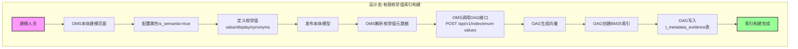
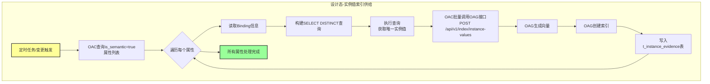
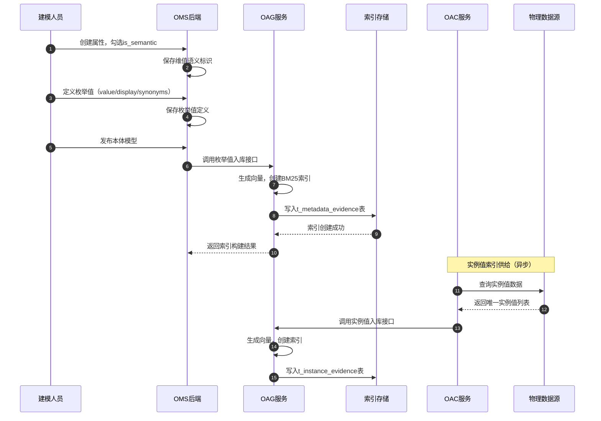
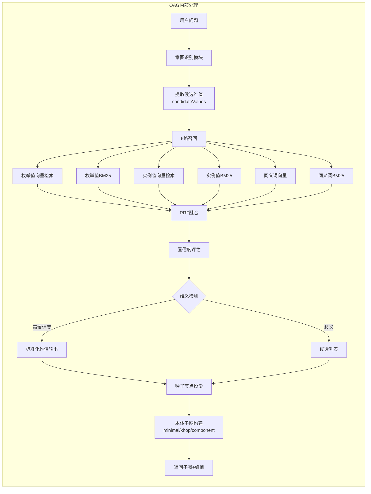
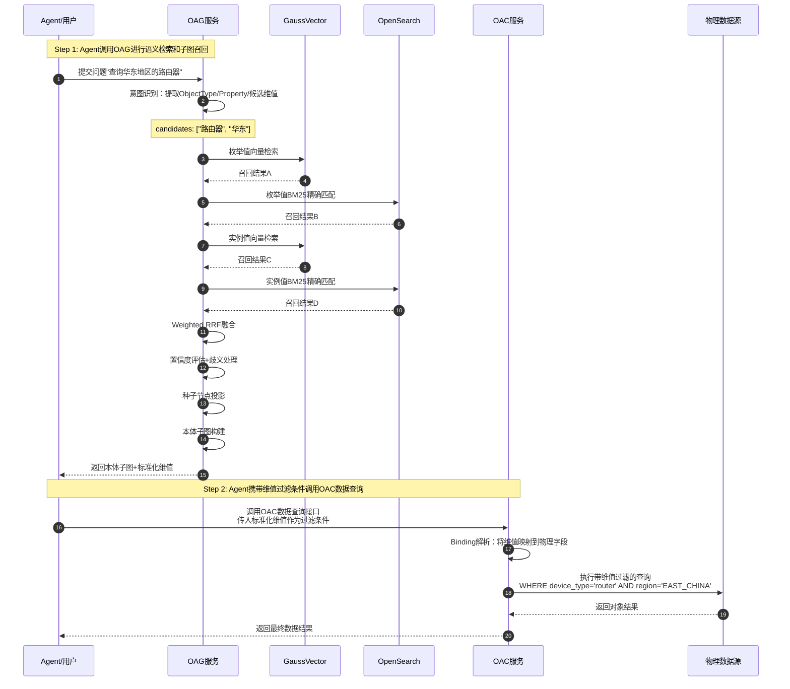
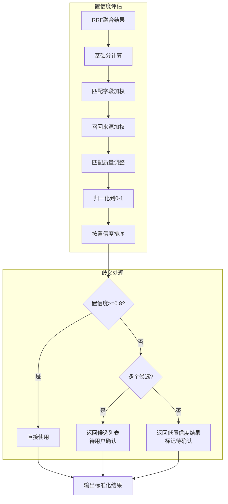

# 需求分析说明书：本体维值建模与检索

| 版本 | 日期 | 修订人 | 修订说明 |
| --- | --- | --- | --- |
| V0.10 | 2026-08-12 | CodeAgent | 基于《本体维值建模与检索》原始需求完成需求分析初稿 |

---

# 需求 IR-ONT-DIM-001 描述

> **需求名称**：本体维值建模与检索
> **关联系统需求**：SR202607XXXXX（待定）
> **说明**：本文中以 `.01`、`.02` 等后缀表示需求分析阶段的 SR 子需求追踪编号，正式编号以需求管理系统落号为准。

## 价值

基于本体解决复杂问题时，用户问题通常同时包含业务对象、属性及地区、设备类型、厂家等维值信息。用户输入的维值可能采用简称、别名、口语或模糊描述，无法直接匹配本体属性及底层数据中的标准值。

若维值识别不准确，将影响后续 OAG 本体检索的上下文范围，以及 OAC 本体数据访问的查询条件。当前本体属性缺少维值语义标识，系统难以判断哪些属性需要进行维值识别、标准化和检索。

本需求通过"**维值语义标识—意图提取—模糊检索—标准化映射—OAG/OAC 联动**"的端到端能力，实现以下业务价值：

1. **统一维值语义标识**：在本体属性上标识是否具有维值语义，明确维值来源和管理方式
2. **意图识别与维值提取**：支持意图识别同时提取本体对象、属性和用户问题中的候选维值
3. **模糊检索与标准化**：支持根据模糊输入检索标准维值，并识别该维值对应的本体对象和属性
4. **OAG 语义检索增强**：支持将标准化后的对象、属性和维值作为 OAG 本体检索的输入条件
5. **OAC 数据访问精确过滤**：支持将精确维值及其属性映射作为 OAC 本体数据访问的过滤条件
6. **多表达统一匹配**：支持维值别名、简称、同义词和多种业务表达的统一匹配
7. **检索结果可信评估**：支持对维值检索结果进行置信度评估、排序和歧义处理

## 术语与缩写

| 术语/缩写 | 定义 |
| --- | --- |
| OAC | Ontology Access Service，本体访问服务，负责 OQL 校验、Binding 解析、维值数据查询和结果装配 |
| OAG | Ontology Analytics and Graph，本体分析与图服务，负责语义检索、向量化索引和本体子图构建 |
| OMS | Ontology Model Service，本体模型服务，负责本体属性维值语义标识、枚举值定义和模型发布 |
| 维值 | 具有维值语义的属性值，包括有限枚举值（enum）和实例值两类 |
| 有限枚举值 | 在本体属性上定义的有限取值集合，通过 enum 字段承载 |
| 实例值 | 属性对应数据库中的实际取值，映射物理模型、多维模型、三方接口等数据源 |
| 维值语义标识 | 属性上的 `is_semantic` 字段，标识该属性是否需要进行维值识别、标准化和检索 |
| 维值来源 | 枚举值在本体模型中定义；实例值来自物理模型、多维模型、三方接口 |
| 模糊匹配 | 支持简称、别名、口语、同义词等多种业务表达的维值匹配 |
| 置信度 | 维值检索结果的可靠程度，用于排序和歧义处理 |

---

## 系统上下文

### 目标系统

| 字段 | 内容 |
| --- | --- |
| 系统名称 | GTS Data Cube / Agentic Operation Center 27.1.0 本体知识平台 |
| 系统边界说明（内部/外部判定依据） | **系统内部**：OMS（维值语义标识建模）、OAC（维值数据查询与索引供给）、OAG（向量化索引创建与语义检索）、Binding 存储、缓存及监控能力。<br>**系统外部**：Agent/上层应用、物理数据库、图数据库、多维模型、三方接口。<br>内部与外部以"是否由本体知识平台团队负责发布、升级和运行"为判定依据。 |

### 周边交互方清单

| 编号 | 外部系统名称 | 类型（人/系统/服务/设备/协议栈） | 交互接口类型（API/协议/UI/SDK/Kit/设备接口/文件/其他） | 交互接口主要功能 |
| --- | --- | --- | --- | --- |
| ES-01 | 业务 Agent / 上层应用 | 系统/服务 | REST API / OQL JSON | 向 OAC 提交对象查询请求，接收包含维值标准化结果的对象结果 |
| ES-02 | 业务研发/SA/建模人员 | 人 | OMS Web UI | 在本体属性上标识维值语义、定义有限枚举值、发布本体模型 |
| ES-03 | 物理数据源（OpenGauss/NebulaGraph） | 系统/服务 | JDBC/GQL | 存储并查询实际业务数据，包含维值实例值 |
| ES-04 | 多维模型（MDX/ROLAP） | 系统/服务 | REST API / MDX | 提供多维模型中的维值数据 |
| ES-05 | 三方业务接口 | 系统/服务 | REST API | 提供三方业务系统中的维值数据 |
| ES-06 | 运维与监控平台 | 系统/服务 | Prometheus / 日志 / 告警 API | 采集维值检索调用、索引构建、错误率、时延和熔断状态 |

---

## 需求描述

| **设计资产** | **描述** |
| --- | --- |
| IR标识 | IR-ONT-DIM-001 |
| 名称 | 本体维值建模与检索 |
| 描述 | 本体知识平台应支持在本体属性上标识维值语义，支持有限枚举值和实例值两种维值类型；支持意图识别提取候选维值；支持模糊输入检索标准维值并识别对应的本体对象和属性；支持将标准化维值作为 OAG 检索条件和 OAC 查询过滤条件；支持多表达统一匹配和置信度评估。 |
| Who | 业务 Agent、上层应用开发者、业务研发、SA、建模人员、平台开发和运维人员 |
| Where | CNAI2.0 底座上的本体知识平台；业务数据源可部署在同一集群或经 API 接入 |
| When | 本体建模时定义维值语义标识、枚举值定义；运行时进行维值意图识别、模糊检索、标准化映射和查询过滤 |
| Why | 解决用户维值输入的简称、别名、口语和模糊描述无法匹配本体标准值的问题，提升复杂问题理解和数据访问准确性 |
| What | 维值语义标识、有限枚举值定义、维值实例值映射、意图识别与候选维值提取、模糊检索与标准化、OAG 索引构建、OAC 维值数据查询、置信度评估与排序 |
| How | OMS 提供维值语义标识和枚举值建模接口；OAC 根据 is_semantic 字段查询实例数据并调用 OAG 创建索引；OAG 提供模糊检索和混合召回能力；OAC 将标准化维值作为查询过滤条件 |
| 类别 | 设计类 |

---

## 假设和约束

| 序号 | 约束类别 | 约束描述 | 对验收的影响 |
| --- | --- | --- | --- |
| 1 | 维值类型 | 维值只包含有限枚举值（enum）和实例值两类，不包含其他类型 | 测试必须覆盖两种维值类型 |
| 2 | 有限枚举定义位置 | 有限枚举值在本体属性上定义，由 OMS 负责建模和存储 | 枚举定义测试需验证 OMS 建模功能 |
| 3 | 实例值数据源 | 实例值来自物理模型、多维模型、三方接口等外部数据源 | OAC 需支持多数据源的实例值查询 |
| 4 | 索引构建职责 | 有限枚举值的索引由 OAG 负责解析入库；实例值索引由 OAC 根据 is_semantic 字段定义查询实例数据后调用 OAG 接口创建 | 索引构建测试需覆盖两种维值来源 |
| 5 | is_semantic 字段 | 属性中的 is_semantic 字段标识该属性是否需要进行维值识别、标准化和检索 | 缺少 is_semantic 定义时不做维值处理 |
| 6 | 模糊匹配范围 | 模糊匹配支持简称、别名、口语、同义词等多种业务表达 | 匹配算法测试需覆盖多种表达形式 |
| 7 | 置信度要求 | 维值检索结果必须支持置信度评估和排序 | 检索结果缺少置信度时使用默认低置信度 |
| 8 | 歧义处理 | 当存在多个可能的维值匹配时，需要进行歧义处理 | 歧义场景返回候选列表而非单一结果 |
| 9 | OAG/OAC 职责边界 | OAG 负责向量化索引创建和语义检索；OAC 负责维度数据查询和供给 | 两服务接口契约需明确定义 |
| 10 | 性能基线 | 维值检索 P95 建议小于 200 ms；索引构建吞吐量需支持批量处理 | 性能指标为设计建议值，正式性能门限需在项目计划中确认 |

---

# 场景用例分析

## 场景清单

| 变更类型 | 场景编号 | 场景名称 | 场景要素覆盖 | 优先级 | 备注 |
| --- | --- | --- | --- | --- | --- |
| ADD | SC-001 | 本体属性维值语义标识与建模 | OMS UI、OMS 后端、属性建模、is_semantic 标识 | 高 | 对应设计态建模 |
| ADD | SC-002 | 有限枚举值定义与索引构建 | OMS、OAG、枚举值解析、索引创建 | 高 | 对应设计态枚举 |
| ADD | SC-003 | 维值实例值数据查询与索引供给 | OAC、物理数据源、实例值查询、OAG 索引接口 | 高 | 对应运行态数据供给 |
| ADD | SC-004 | 用户问题维值意图识别与提取 | OAC、意图识别、候选维值提取 | 高 | 对应运行态意图提取 |
| ADD | SC-005 | 模糊维值检索与标准化 | OAG、模糊匹配、同义词匹配、标准化输出 | 高 | 对应运行态检索 |
| ADD | SC-006 | 维值置信度评估与歧义处理 | OAG、置信度计算、排序、歧义处理 | 中 | 对应运行态评估 |
| ADD | SC-007 | OAG 本体检索输入条件组装 | OAC/OAG 联动、标准化维值、检索条件 | 高 | 对应 OAG 检索增强 |
| ADD | SC-008 | OAC 本体数据访问过滤 | OAC、精确维值、过滤条件、查询执行 | 高 | 对应 OAC 查询增强 |

## 设计态模块交互流程

### 1. 有限枚举值索引构建流程



### 2. 实例值索引供给流程



### 3. 设计态端到端交互时序图



## 设计态场景

### ADD 场景 SC-001：本体属性维值语义标识与建模

#### 场景描述

建模人员在 OMS 页面编辑本体对象属性时，可以标识该属性是否具有维值语义。当属性需要支持模糊维值检索时，建模人员开启 `is_semantic` 开关，并指定维值来源（枚举值定义/实例值映射）。

#### 场景要素分析

| 场景要素 | 取值 |
| --- | --- |
| **T** 生命周期阶段 | 本体设计、修改、评审和发布 |
| **G** 场景目标 | 建立可标识维值语义的本体属性定义 |
| **E** 环境 | OMS 本体建模页面和后端服务 |
| **A** 参与者 | 建模人员、OMS 后端、OAC |
| **S** 系统状态 | 目标本体处于草稿状态，建模人员具备编辑权限 |

#### 用例清单

| 变更类型 | 用例编号 | 用例名称 | 用例目的 | 用例描述 | 是否基础用例 |
| --- | --- | --- | --- | --- | --- |
| ADD | SC001-UC001 | 在本体属性上标识维值语义 | 建立维值语义标识能力 | 建模人员为属性开启 is_semantic，指定维值来源 | 是 |
| ADD | SC001-UC002 | 维护维值语义标识并发布 | 使维值语义标识生效 | 保存并发布维值语义标识，使其在运行态可用 | 是 |

#### ADD 用例 SC001-UC001：在本体属性上标识维值语义

##### 简要说明

建模人员在 OMS 页面选择本体对象属性，勾选"具有维值语义"选项，并配置维值来源（枚举值或实例值）。

##### Actor

| 角色 | 类型（主/次，人/系统） | 与系统的关系 |
| --- | --- | --- |
| 建模人员 | 主/人 | 定义属性的维值语义标识 |
| OMS 本体建模页面 | 主/系统 | 提供属性编辑和维值配置 UI |
| OMS 后端 | 主/系统 | 保存维值语义标识配置 |

##### 前置条件

| 场景要素 | 本用例采用的取值 | 对用例的影响点 |
| --- | --- | --- |
| **T** 生命周期阶段 | 草稿建模 | 维值标识可修改 |
| **G** 场景目标 | 形成可发布的维值语义标识 | DoD 包含标识配置完整 |
| **E** 环境 | OMS 页面/服务正常 | 页面和后端均需可用 |
| **A** 参与者 | 建模人员、OMS | 权限和职责分离 |
| **S** 系统状态 | 目标属性存在 | 属性不存在则不能配置 |

##### 成功保证（后置条件）

1. 属性的 `is_semantic` 字段被设置为 `true`。
2. 维值来源类型（enum/instance）被正确记录。
3. 对于 enum 类型，关联到对应的枚举值定义。
4. 对于 instance 类型，关联到对应的数据源配置。
5. 维值标识配置已保存到草稿版本。

##### 触发事件

建模人员在 OMS 页面选择本体属性，勾选"具有维值语义"并配置维值来源。

##### 主成功路径

```
1. 建模人员选择目标本体对象和属性
2. 勾选"具有维值语义"开关
3. 选择维值来源类型（有限枚举值 / 实例值）
4. 如果选择"有限枚举值"，关联或创建枚举值定义
5. 如果选择"实例值"，配置数据源映射信息
6. 保存维值语义标识配置
7. OMS 持久化配置到草稿版本
```

##### 扩展路径

```
3a. 维值来源类型未选择
    OMS 返回 SEMANTIC_SOURCE_REQUIRED

4a. 枚举值定义为空或无效
    OMS 返回 ENUM_DEFINITION_INVALID

5a. 数据源映射信息不完整
    OMS 返回 DATASOURCE_MAPPING_INCOMPLETE
```

##### 验证达成标准

```gherkin
Given OMS 中存在草稿状态的本体对象 NetworkElement
And   属性 deviceType 存在
When  建模人员为 deviceType 勾选"具有维值语义"
And   选择维值来源为"实例值"并配置数据源映射
Then  属性 deviceType 的 is_semantic = true
And   维值来源类型为 instance
And   数据源映射信息已保存
```

---

### ADD 场景 SC-002：有限枚举值定义与索引构建

#### 场景描述

建模人员在 OMS 中定义属性的有限枚举值，OAG 解析枚举值定义并创建向量化索引，支持枚举值的语义检索。

#### 场景要素分析

| 场景要素 | 取值 |
| --- | --- |
| **T** 生命周期阶段 | 本体设计、枚举值定义、索引构建 |
| **G** 场景目标 | 建立可检索的有限枚举值索引 |
| **E** 环境 | OMS、OAG、本体索引存储 |
| **A** 参与者 | 建模人员、OMS、OAG |
| **S** 系统状态 | 枚举值定义完成，本体处于已发布状态 |

#### 用例清单

| 变更类型 | 用例编号 | 用例名称 | 用例目的 | 用例描述 | 是否基础用例 |
| --- | --- | --- | --- | --- | --- |
| ADD | SC002-UC001 | 定义属性有限枚举值 | 建立有限枚举值定义 | 为属性定义 enum 字段，包含所有可选值 | 是 |
| ADD | SC002-UC002 | OAG 解析枚举值并创建索引 | 建立枚举值检索能力 | OAG 接收枚举值元数据，创建向量化索引 | 是 |

#### ADD 用例 SC002-UC002：OAG 解析枚举值并创建索引

##### 简要说明

当本体发布时，OAG 接收 OMS 的枚举值元数据，解析枚举值的 value、display、description、synonyms 等字段，创建向量化索引记录到 `t_metadata_evidence_{ontology_id}` 表。

##### Actor

| 角色 | 类型（主/次，人/系统） | 与系统的关系 |
| --- | --- | --- |
| OMS | 主/系统 | 发布枚举值元数据到 OAG |
| OAG | 主/系统 | 接收枚举值并创建向量化索引 |
| OpenSearch/GaussVector | 次/系统 | 存储枚举值索引 |

##### 前置条件

| 场景要素 | 本用例采用的取值 | 对用例的影响点 |
| --- | --- | --- |
| **T** 生命周期阶段 | 本体发布 | 触发索引构建 |
| **G** 场景目标 | 形成可检索的枚举值索引 | DoD 包含索引创建成功 |
| **E** 环境 | OAG 服务正常，索引存储可用 | 服务异常进入扩展路径 |
| **A** 参与者 | OMS、OAG | 异步触发 |
| **S** 系统状态 | 枚举值定义已发布 | 未发布不触发索引 |

##### 成功保证（后置条件）

1. OAG 接收到完整的枚举值元数据。
2. 每个枚举值创建一条索引记录，包含 value、display、description、synonyms。
3. 枚举值索引的 parent_id 指向所属 Property。
4. 向量化和 BM25 索引均创建成功。
5. 索引记录可通过 OAG 检索接口查询。

##### 触发事件

本体模型发布时，OMS 调用 OAG 枚举值入库接口。

##### 主成功路径

```
1. 本体模型发布触发事件
2. OMS 收集所有 is_semantic=true 属性的枚举值定义
3. OMS 调用 OAG 接口 POST /api/v1/index/enum-values
4. OAG 解析枚举值元数据（value、display、description、synonyms）
5. OAG 为每个枚举值生成向量
6. OAG 创建 BM25 索引记录
7. OAG 批量写入 t_metadata_evidence_{ontology_id} 表
8. OAG 返回索引构建结果给 OMS
```

##### 扩展路径

```
3a. OAG 接口调用失败
    OMS 重试 3 次，仍失败则记录错误并继续，不阻塞发布流程

4a. 枚举值数据格式不合法
    OAG 返回 ENUM_VALUE_FORMAT_INVALID

5a. 向量化服务不可用
    OAG 使用默认值填充 vector，重试向量化
```

##### 验证达成标准

```gherkin
Given OMS 中存在已发布的本体属性 priority
And   priority 的 is_semantic = true
And   priority 定义了枚举值 HIGH/MEDIUM/LOW
When  本体模型发布
Then  OAG 创建 3 条枚举值索引记录
And   每条记录包含 value、display、description、synonyms
And   每条记录的 parent_id = priority.id
And   向量化和 BM25 索引均创建成功
And   枚举值可通过 OAG 检索接口查询到
```

---

## 运行态模块交互流程

### 1. 运行态端到端流程（正确调用顺序）

```mermaid
flowchart TD
    subgraph 运行态-正确调用顺序
        A[Agent/用户] -->|提交问题| B[OAG语义检索入口]
        B --> C[OAG意图识别<br/>提取ObjectType/Property/候选维值]
        C --> D[OAG维值检索<br/>6路召回+RRF融合]
        D --> E[OAG置信度评估<br/>与歧义处理]
        E --> F[OAG本体子图召回<br/>SeedNodeProjector]
        F --> G[构建本体子图<br/>返回种子节点+标准化维值]
        G --> H[调用OAC数据查询<br/>传入维值过滤条件]
        H --> I[OAC Binding解析<br/>映射到物理字段]
        I --> J[OAC执行查询<br/>带维值过滤]
        J --> K[OAC结果装配<br/>返回对象结果]
        K --> L[返回最终结果<br/>给Agent/用户]
    end

    style A fill:#f9f,stroke:#333,stroke-width:2px
    style L fill:#9f9,stroke:#333,stroke-width:2px
```



### 2. OAG子图召回内部流程



### 3. Agent→OAG→OAC联动时序图（正确顺序）



### 4. 置信度评估与歧义处理流程



## 运行态场景

### ADD 场景 SC-003：维值实例值数据查询与索引供给

#### 场景描述

OAC 根据属性的 `is_semantic=true` 配置，查询属性对应的实例值数据，并调用 OAG 接口创建实例值索引。

#### 场景要素分析

| 场景要素 | 取值 |
| --- | --- |
| **T** 生命周期阶段 | 运行态数据查询与索引构建 |
| **G** 场景目标 | 建立实例值维值数据的索引供给能力 |
| **E** 环境 | OAC、物理数据源、OAG |
| **A** 参与者 | OAC、OAG、物理数据源 |
| **S** 系统状态 | 本体已发布，属性 is_semantic=true，数据源可访问 |

#### 用例清单

| 变更类型 | 用例编号 | 用例名称 | 用例目的 | 用例描述 | 是否基础用例 |
| --- | --- | --- | --- | --- | --- |
| ADD | SC003-UC001 | OAC 查询实例值数据 | 获取属性对应的实例值 | OAC 根据 Binding 查询物理数据源获取属性实例值 | 是 |
| ADD | SC003-UC002 | OAC 调用 OAG 创建实例值索引 | 建立实例值检索能力 | OAC 将实例值数据调用 OAG 接口创建向量化索引 | 是 |

#### ADD 用例 SC003-UC001：OAC 查询实例值数据

##### 简要说明

OAC 扫描所有 is_semantic=true 的属性，根据 Binding 信息查询对应的物理数据源，获取属性的所有实例值。

##### Actor

| 角色 | 类型（主/次，人/系统） | 与系统的关系 |
| --- | --- | --- |
| OAC | 主/系统 | 查询实例值并调用 OAG 索引接口 |
| 物理数据源 | 次/系统 | 提供属性实例值数据 |
| OAG | 次/系统 | 接收实例值并创建索引 |

##### 前置条件

| 场景要素 | 本用例采用的取值 | 对用例的影响点 |
| --- | --- | --- |
| **T** 生命周期阶段 | 运行态定时触发或变更触发 | 可配置触发策略 |
| **G** 场景目标 | 获取完整的实例值数据 | DoD 包含实例值查询成功 |
| **E** 环境 | OAC、物理数据源、OAG 均可用 | 服务异常进入扩展路径 |
| **A** 参与者 | OAC、OAG、数据源 | 异步执行 |
| **S** 系统状态 | 本体已发布，属性 is_semantic=true，Binding 完整 | Binding 不完整则跳过该属性 |

##### 成功保证（后置条件）

1. OAC 正确解析所有 is_semantic=true 的属性。
2. 每个属性根据 Binding 信息构建查询语句。
3. 查询结果包含属性的所有唯一实例值。
4. 实例值数据被收集并准备调用 OAG 索引接口。
5. 错误不影响其他属性的处理。

##### 触发事件

定时任务触发（每日/每周）或本体变更触发。

##### 主成功路径

```
1. 定时任务或变更事件触发实例值同步
2. OAC 查询所有 is_semantic=true 的属性列表
3. 对于每个属性：
   3.1 读取属性对应的 Binding 信息
   3.2 根据 Binding 构建 SELECT DISTINCT 查询
   3.3 执行查询获取所有唯一实例值
   3.4 收集实例值数据（value、display 可选）
4. OAC 批量调用 OAG 接口创建实例值索引
5. OAG 返回索引创建结果
6. OAC 记录同步结果和统计信息
```

##### 扩展路径

```
3a. Binding 信息不完整
    OAC 跳过该属性，记录警告日志

3b. 数据源查询超时
    OAC 重试 2 次，仍超时则记录错误并继续

3c. 实例值数据量过大
    OAC 分批处理，每批最多 10000 条

4a. OAG 接口调用失败
    OAC 重试 3 次，仍失败则记录错误并告警
```

##### 验证达成标准

```gherkin
Given 本体中属性 deviceType 的 is_semantic = true
And   deviceType 绑定的物理字段为 network_element.device_type
When  实例值同步任务触发
Then  OAC 执行 SELECT DISTINCT device_type FROM network_element
And   获取所有唯一实例值如 ["router", "switch", "firewall"]
And   OAC 调用 OAG 创建 3 条实例值索引记录
And   每条记录的 parent_id = deviceType.id
And   索引记录可通过 OAG 检索接口查询到
```

---

### ADD 场景 SC-004：用户问题维值意图识别与提取

#### 场景描述

当用户输入问题时，OAC 通过意图识别模块同时提取本体对象、属性和用户问题中的候选维值。

#### 场景要素分析

| 场景要素 | 取值 |
| --- | --- |
| **T** 生命周期阶段 | 运行态用户请求处理 |
| **G** 场景目标 | 提取用户问题中的候选维值用于后续匹配 |
| **E** 环境 | OAC、意图识别模块 |
| **A** 参与者 | OAC、意图识别模块 |
| **S** 系统状态 | OAC 服务正常，本体索引已构建 |

#### 用例清单

| 变更类型 | 用例编号 | 用例名称 | 用例目的 | 用例描述 | 是否基础用例 |
| --- | --- | --- | --- | --- | --- |
| ADD | SC004-UC001 | 意图识别提取候选维值 | 建立维值候选提取能力 | 从用户问题中识别并提取候选维值 | 是 |

#### ADD 用例 SC004-UC001：意图识别提取候选维值

##### 简要说明

OAC 接收用户问题后，通过意图识别模块分析问题内容，识别出用户提到的本体对象、属性和候选维值（可能使用简称、别名、口语等）。

##### Actor

| 角色 | 类型（主/次，人/系统） | 与系统的关系 |
| --- | --- | --- |
| OAC | 主/系统 | 接收问题并调用意图识别 |
| 意图识别模块 | 主/系统 | 分析问题并提取候选维值 |
| OAG | 次/系统 | 提供语义检索能力 |

##### 前置条件

| 场景要素 | 本用例采用的取值 | 对用例的影响点 |
| --- | --- | --- |
| **T** 生命周期阶段 | 运行态用户请求 | 实时处理 |
| **G** 场景目标 | 提取完整的候选维值列表 | DoD 包含维值提取结果 |
| **E** 环境 | OAC、意图识别、OAG 均可用 | 服务异常返回错误 |
| **A** 参与者 | OAC、意图识别 | 实时调用 |
| **S** 系统状态 | 本体索引已构建 | 索引未构建时返回空结果 |

##### 成功保证（后置条件）

1. 意图识别模块正确解析用户问题文本。
2. 识别出用户提及的本体对象类型（ObjectType）。
3. 识别出用户提及的属性名称（Property）。
4. 识别出用户使用的候选维值（可能是简称、别名、口语）。
5. 候选维值与对应的 ObjectType 和 Property 关联。
6. 输出包含 objectType、property、candidateValues 的结构化结果。

##### 触发事件

用户通过 Agent 或 API 提交本体查询问题。

##### 主成功路径

```
1. 用户提交问题 "查询华东地区的路由器设备"
2. OAC 接收问题并调用意图识别模块
3. 意图识别模块分析问题文本
4. 识别出 ObjectType = NetworkElement
5. 识别出 Property = deviceType（设备类型）
6. 识别出 Property = region（地区）
7. 识别出候选维值：["路由器", "router"] -> deviceType
8. 识别出候选维值：["华东", "EAST_CHINA"] -> region
9. 意图识别返回结构化结果
10. 后续流程使用候选维值进行模糊检索
```

##### 扩展路径

```
3a. 问题文本无法解析
    返回空结果，继续后续流程但不进行维值匹配

7a. 多个可能的 ObjectType 匹配
    返回候选 ObjectType 列表供后续消歧
```

##### 验证达成标准

```gherkin
Given 本体中存在 ObjectType NetworkElement
And   属性 deviceType 的 is_semantic = true
And   属性 region 的 is_semantic = true
When  用户提交问题 "查询华东地区的路由器设备"
Then  意图识别返回：
  objectType = NetworkElement
  property维值列表：
    - property: deviceType, candidateValues: ["路由器", "router"]
    - property: region, candidateValues: ["华东", "EAST_CHINA"]
```

---

### ADD 场景 SC-005：模糊维值检索与标准化

#### 场景描述

基于用户问题中提取的候选维值，OAG 通过模糊检索匹配标准维值，返回标准化结果及对应的本体对象和属性。

#### 场景要素分析

| 场景要素 | 取值 |
| --- | --- |
| **T** 生命周期阶段 | 运行态检索处理 |
| **G** 场景目标 | 通过模糊输入检索到标准维值并建立映射 |
| **E** 环境 | OAG、OpenSearch/GaussVector |
| **A** 参与者 | OAG、OAC |
| **S** 系统状态 | 维值索引已构建，OAG 服务正常 |

#### 用例清单

| 变更类型 | 用例编号 | 用例名称 | 用例目的 | 用例描述 | 是否基础用例 |
| --- | --- | --- | --- | --- | --- |
| ADD | SC005-UC001 | 模糊维值检索 | 建立模糊匹配能力 | 支持简称、别名、口语、同义词等多种表达的匹配 | 是 |
| ADD | SC005-UC002 | 维值标准化输出 | 建立标准化结果输出 | 返回标准维值及其对应的 ObjectType 和 Property | 是 |

#### ADD 用例 SC005-UC001：模糊维值检索

##### 简要说明

OAG 接收候选维值，通过多路召回（向量检索 + BM25 精确匹配）找到匹配的标准维值，支持简称、别名、口语、同义词等多种业务表达。

##### Actor

| 角色 | 类型（主/次，人/系统） | 与系统的关系 |
| --- | --- | --- |
| OAG | 主/系统 | 执行模糊检索和混合召回 |
| OpenSearch | 次/系统 | 提供 BM25 精确匹配 |
| GaussVector | 次/系统 | 提供向量相似度检索 |

##### 前置条件

| 场景要素 | 本用例采用的取值 | 对用例的影响点 |
| --- | --- | --- |
| **T** 生命周期阶段 | 运行态用户请求 | 实时处理 |
| **G** 场景目标 | 召回匹配的标准维值 | DoD 包含检索结果 |
| **E** 环境 | OAG、OpenSearch、GaussVector 均可用 | 服务异常返回错误 |
| **A** 参与者 | OAG、OAC | 实时调用 |
| **S** 系统状态 | 维值索引已构建（枚举值+实例值） | 索引未构建时返回空 |

##### 成功保证（后置条件）

1. 对每个候选维值执行多路召回（向量 + BM25）。
2. 召回结果按 RRF（Reciprocal Rank Fusion）融合排序。
3. 返回匹配的标准维值及其原始值。
4. 匹配的标准维值包含 value、display、synonyms。
5. 匹配结果包含 matched_field 和 matched_value（命中来源）。
6. 每个匹配结果关联到对应的 Property 和 ObjectType。
7. 结果包含置信度分数用于后续排序。

##### 触发事件

OAC 调用 OAG 维值检索接口，传入候选维值列表。

##### 主成功路径

```
1. OAC 调用 OAG 接口 POST /api/v1/retrieve/dim-values
2. 传入候选维值列表：
   [{
     "property": "deviceType",
     "candidateValues": ["路由器", "router"]
   }, {
     "property": "region",
     "candidateValues": ["华东", "EAST_CHINA"]
   }]
3. OAG 对每个候选维值执行 6 路召回：
   - 枚举值向量检索
   - 枚举值 BM25 精确匹配
   - 实例值向量检索
   - 实例值 BM25 精确匹配
4. OAG 执行 Weighted RRF 融合
5. OAG 按 Property 分组返回匹配结果
6. 每个匹配结果包含：
   - standardValue: 标准维值
   - matchedValue: 原始匹配值
   - matchedField: 命中的字段（name/display/synonyms/value）
   - confidence: 置信度分数
   - propertyId: 关联的属性 ID
   - objectTypeId: 关联的对象类型 ID
```

##### 扩展路径

```
3a. 候选维值为空
    返回空结果

3b. 某个属性无匹配结果
    该属性返回空列表，不影响其他属性

4a. 召回结果超过阈值
    按置信度截断，保留 Top 100
```

##### 验证达成标准

```gherkin
Given 维值索引中 deviceType 有枚举值：
  - value: "router", display: {"zh": "路由器"}, synonyms: {"zh": ["router", "路由设备"]}
When  候选维值 "路由器" 进行模糊检索
Then  返回匹配结果：
  - standardValue: "router"
  - matchedValue: "路由器"
  - matchedField: "display.zh"
  - confidence: 0.95
  - propertyId: deviceType.id

Given 维值索引中 region 有实例值：
  - value: "EAST_CHINA", display: {"zh": "华东地区"}
When  候选维值 "华东" 进行模糊检索
Then  返回匹配结果：
  - standardValue: "EAST_CHINA"
  - matchedValue: "华东"
  - matchedField: "display.zh"
  - confidence: 0.88
  - propertyId: region.id
```

---

### ADD 场景 SC-006：维值置信度评估与歧义处理

#### 场景描述

对于维值检索结果，进行置信度评估和歧义处理，返回最可能的匹配或候选列表供用户确认。

#### 场景要素分析

| 场景要素 | 取值 |
| --- | --- |
| **T** 生命周期阶段 | 运行态结果处理 |
| **G** 场景目标 | 提供可信的维值匹配结果或歧义提示 |
| **E** 环境 | OAG、置信度评估模块 |
| **A** 参与者 | OAG、OAC |
| **S** 系统状态 | 维值检索已完成 |

#### 用例清单

| 变更类型 | 用例编号 | 用例名称 | 用例目的 | 用例描述 | 是否基础用例 |
| --- | --- | --- | --- | --- | --- |
| ADD | SC006-UC001 | 置信度评估与排序 | 建立结果可信度评估 | 对检索结果进行置信度评分和排序 | 是 |
| ADD | SC006-UC002 | 歧义检测与处理 | 建立歧义处理能力 | 当存在多个可能匹配时进行歧义处理 | 是 |

#### ADD 用例 SC006-UC001：置信度评估与排序

##### 简要说明

OAG 对维值检索结果进行置信度评估，综合考虑匹配字段类型（value/display/synonyms）、召回来源（向量/BM25）、匹配质量等因素，计算置信度分数并排序。

##### Actor

| 角色 | 类型（主/次，人/系统） | 与系统的关系 |
| --- | --- | --- |
| OAG | 主/系统 | 执行置信度评估和排序 |
| LLM（可选） | 次/系统 | 提供语义级别的置信度校准 |

##### 前置条件

| 场景要素 | 本用例采用的取值 | 对用例的影响点 |
| --- | --- | --- |
| **T** 生命周期阶段 | 运行态检索后处理 | 实时处理 |
| **G** 场景目标 | 对结果进行可信度排序 | DoD 包含排序结果 |
| **E** 环境 | OAG 可用 | 服务异常跳过置信度评估 |
| **A** 参与者 | OAG | 自动处理 |
| **S** 系统状态 | 维值检索已完成 | 无结果时跳过 |

##### 成功保证（后置条件）

1. 每个检索结果包含置信度分数（0-1）。
2. 同属性内结果按置信度降序排列。
3. 高置信度结果（>=0.8）可直接使用。
4. 中置信度结果（0.5-0.8）标记为待确认。
5. 低置信度结果（<0.5）标记为低可信。
6. 置信度计算因素记录在结果中供追溯。

##### 主成功路径

```
1. 获取维值检索的 RRF 融合结果
2. 对每个结果计算置信度分数：
   2.1 基础分 = RRF 排名分数
   2.2 匹配字段加权：
       - value 精确匹配：+0.2
       - display 匹配：+0.15
       - synonyms 匹配：+0.1
   2.3 召回来源加权：
       - 向量+BM25 同时召回：+0.1
       - 仅向量召回：+0.05
   2.4 匹配质量调整：
       - 完全匹配：+0.1
       - 前缀匹配：+0.05
       - 子串匹配：+0.02
3. 归一化置信度分数到 [0, 1] 范围
4. 按置信度降序排列
5. 附加置信度因素说明
```

##### 验证达成标准

```gherkin
Given 候选维值 "路由器" 检索结果：
  - 结果A: value精确匹配router, display.zh匹配
  - 结果B: synonyms.zh匹配路由设备
When  执行置信度评估
Then  结果A置信度 > 结果B置信度
And   结果A置信度 >= 0.8
And   结果按置信度降序排列
```

---

### ADD 场景 SC-007：OAG 本体检索输入条件组装

#### 场景描述

OAC 将标准化后的维值及其对应的 ObjectType 和 Property 作为 OAG 本体检索的输入条件，增强 OAG 语义检索的上下文。

#### 场景要素分析

| 场景要素 | 取值 |
| --- | --- |
| **T** 生命周期阶段 | 运行态检索增强 |
| **G** 场景目标 | 将维值标准化结果作为 OAG 检索条件 |
| **E** 环境 | OAC、OAG |
| **A** 参与者 | OAC、OAG |
| **S** 系统状态 | 维值检索完成，标准化结果可用 |

#### 用例清单

| 变更类型 | 用例编号 | 用例名称 | 用例目的 | 用例描述 | 是否基础用例 |
| --- | --- | --- | --- | --- | --- |
| ADD | SC007-UC001 | 组装 OAG 检索条件 | 建立检索增强能力 | 将维值标准化结果组装为 OAG 检索输入 | 是 |

#### ADD 用例 SC007-UC001：组装 OAG 检索条件

##### 简要说明

OAC 将维值检索得到的标准化结果（ObjectType、Property、standardValue）组装为 OAG 本体检索的输入条件，提供更精确的检索上下文。

##### Actor

| 角色 | 类型（主/次，人/系统） | 与系统的关系 |
| --- | --- | --- |
| OAC | 主/系统 | 组装检索条件并调用 OAG |
| OAG | 次/系统 | 执行增强的本体检索 |

##### 前置条件

| 场景要素 | 本用例采用的取值 | 对用例的影响点 |
| --- | --- | --- |
| **T** 生命周期阶段 | 运行态检索增强 | 实时处理 |
| **G** 场景目标 | 提供增强的检索上下文 | DoD 包含检索条件组装 |
| **E** 环境 | OAC、OAG 均可用 | 服务异常返回错误 |
| **A** 参与者 | OAC、OAG | 实时调用 |
| **S** 系统状态 | 维值检索已完成且有有效结果 | 无结果时跳过维值条件 |

##### 成功保证（后置条件）

1. 维值标准化结果被正确解析。
2. 每个高置信度结果（>=0.8）转换为检索条件。
3. 检索条件包含 ObjectType、Property、standardValue。
4. 多个维值条件之间使用 AND 逻辑组合。
5. 组合后的检索条件传递给 OAG。

##### 主成功路径

```
1. 获取维值检索和置信度评估结果
2. 筛选高置信度结果（>=0.8）作为有效条件
3. 对每个有效结果：
   3.1 提取 ObjectType 和 Property
   3.2 提取 standardValue 作为过滤值
   3.3 组装为 { objectType, property, value } 结构
4. 将多个维值条件组合为检索条件数组
5. 调用 OAG 本体检索接口，传入：
   - 用户原始问题
   - 维值检索条件
6. OAG 执行增强的语义检索
```

##### 验证达成标准

```gherkin
Given 维值检索结果：
  - ObjectType: NetworkElement, Property: deviceType, Value: "router", confidence: 0.95
  - ObjectType: NetworkElement, Property: region, Value: "EAST_CHINA", confidence: 0.92
When  组装 OAG 检索条件
Then  调用 OAG 接口传入条件：
  [{
    "objectType": "NetworkElement",
    "property": "deviceType",
    "value": "router"
  }, {
    "objectType": "NetworkElement",
    "property": "region",
    "value": "EAST_CHINA"
  }]
And   条件之间使用 AND 逻辑
```

---

### ADD 场景 SC-008：OAC 本体数据访问过滤

#### 场景描述

OAC 将精确维值及其属性映射作为本体数据访问的过滤条件，执行精确查询并返回结果。

#### 场景要素分析

| 场景要素 | 取值 |
| --- | --- |
| **T** 生命周期阶段 | 运行态数据查询 |
| **G** 场景目标 | 使用精确维值过滤条件执行查询 |
| **E** 环境 | OAC、物理数据源 |
| **A** 参与者 | OAC、Binding 模块、物理数据源 |
| **S** 系统状态 | Binding 完整，标准化维值可用 |

#### 用例清单

| 变更类型 | 用例编号 | 用例名称 | 用例目的 | 用例描述 | 是否基础用例 |
| --- | --- | --- | --- | --- | --- |
| ADD | SC008-UC001 | 组装 OAC 查询过滤条件 | 建立精确过滤能力 | 将维值标准化结果转换为 OAC 查询条件 | 是 |
| ADD | SC008-UC002 | 执行带维值过滤的查询 | 建立查询执行能力 | 使用维值过滤条件执行物理查询 | 是 |

#### ADD 用例 SC008-UC002：执行带维值过滤的查询

##### 简要说明

OAC 将标准化后的维值转换为 Binding 对应的物理字段过滤条件，构建精确的查询语句并执行。

##### Actor

| 角色 | 类型（主/次，人/系统） | 与系统的关系 |
| --- | --- | --- |
| OAC | 主/系统 | 组装查询条件并执行 |
| Binding 模块 | 次/系统 | 提供属性到字段的映射 |
| 物理数据源 | 次/系统 | 执行物理查询 |

##### 前置条件

| 场景要素 | 本用例采用的取值 | 对用例的影响点 |
| --- | --- | --- |
| **T** 生命周期阶段 | 运行态数据查询 | 实时处理 |
| **G** 场景目标 | 使用维值过滤执行精确查询 | DoD 包含查询执行和结果返回 |
| **E** 环境 | OAC、Binding、物理数据源均可用 | 服务异常返回错误 |
| **A** 参与者 | OAC、Binding、数据源 | 实时调用 |
| **S** 系统状态 | Binding 完整，维值标准化结果可用 | Binding 不完整返回错误 |

##### 成功保证（后置条件）

1. 维值标准化结果被正确解析。
2. 每个维值条件通过 Binding 映射到物理字段。
3. 构建的 WHERE 条件包含精确的字段=值过滤。
4. 查询语句被正确执行。
5. 返回的对象结果包含用户请求的属性。
6. 查询结果符合 OQL 语义。

##### 主成功路径

```
1. 获取维值标准化结果
2. 对每个维值条件：
   2.1 查找属性对应的 Binding
   2.2 获取物理字段路径（如 network_element.device_type）
   2.3 提取 standardValue 作为过滤值
   2.4 组装为 { field: "network_element.device_type", operator: "=", value: "router" }
3. 将多个维值条件组合为 AND 过滤数组
4. OAC 将过滤条件加入查询请求
5. OAC 执行物理查询
6. OAC 组装对象结果返回
```

##### 验证达成标准

```gherkin
Given 维值标准化结果：
  - Property: deviceType, Value: "router"
  - Property: region, Value: "EAST_CHINA"
And   Binding 映射：
  - deviceType -> network_element.device_type
  - region -> network_element.region_code
When  执行带维值过滤的查询
Then  构建查询语句：
  SELECT * FROM network_element
  WHERE device_type = 'router' AND region_code = 'EAST_CHINA'
And   返回匹配的对象结果
```

---

# 功能影响列表

## 设计态功能

| 功能编号 | 功能描述 | 影响类型（新增/修改/删除） | 影响描述（详细变更点） | 影响来源 |
| --- | --- | --- | --- | --- |
| F-DIM-001 | 本体属性维值语义标识 | 新增 | 支持 is_semantic 字段标识属性是否具有维值语义 | SC-001 |
| F-DIM-002 | 维值来源配置 | 新增 | 支持配置维值来源类型（enum/instance）和关联信息 | SC-001 |
| F-DIM-003 | 有限枚举值定义 | 新增 | 支持在属性上定义有限枚举值（value、display、synonyms） | SC-002 |
| F-DIM-004 | 枚举值元数据发布 | 新增 | 支持将枚举值元数据发布到 OAG | SC-002 |

## 运行态功能

| 功能编号 | 功能描述 | 影响类型（新增/修改/删除） | 影响描述（详细变更点） | 影响来源 |
| --- | --- | --- | --- | --- |
| F-DIM-005 | 实例值数据查询 | 新增 | 支持根据 Binding 查询属性对应的实例值数据 | SC-003 |
| F-DIM-006 | 实例值索引供给 | 新增 | 支持调用 OAG 接口创建实例值向量化索引 | SC-003 |
| F-DIM-007 | 维值意图识别 | 新增 | 支持从用户问题中提取候选维值 | SC-004 |
| F-DIM-008 | 模糊维值检索 | 新增 | 支持简称、别名、口语、同义词等多种表达的模糊匹配 | SC-005 |
| F-DIM-009 | 维值标准化输出 | 新增 | 支持返回标准维值及对应的 ObjectType 和 Property | SC-005 |
| F-DIM-010 | 置信度评估与排序 | 新增 | 支持对检索结果进行置信度评分和排序 | SC-006 |
| F-DIM-011 | 歧义检测与处理 | 新增 | 支持多匹配时的歧义检测和候选列表输出 | SC-006 |
| F-DIM-012 | OAG 检索条件组装 | 新增 | 支持将标准化维值组装为 OAG 检索输入条件 | SC-007 |
| F-DIM-013 | OAC 查询过滤组装 | 新增 | 支持将精确维值组装为 OAC 查询过滤条件 | SC-008 |

---

# 需求分解列表（IR → SR）

| IR 编号 | SR 编号 | SR 名称 | SR 描述 | 关联功能 | 关联功能编号 |
| --- | --- | --- | --- | --- | --- |
| IR-ONT-DIM-001 | SR-XXX-01 | 维值语义标识与建模 | OMS 支持在本体属性上标识 is_semantic 并配置维值来源 | 维值语义标识 | F-DIM-001, F-DIM-002 |
| IR-ONT-DIM-001 | SR-XXX-02 | 有限枚举值定义与索引 | OMS 支持枚举值定义，OAG 支持枚举值索引创建 | 枚举值定义与索引 | F-DIM-003, F-DIM-004 |
| IR-ONT-DIM-001 | SR-XXX-03 | 实例值查询与索引供给 | OAC 支持查询实例值并调用 OAG 创建索引 | 实例值查询与索引 | F-DIM-005, F-DIM-006 |
| IR-ONT-DIM-001 | SR-XXX-04 | 维值意图识别与提取 | OAC 支持从用户问题中识别并提取候选维值 | 意图识别与提取 | F-DIM-007 |
| IR-ONT-DIM-001 | SR-XXX-05 | 模糊维值检索与标准化 | OAG 支持模糊检索和标准化输出 | 模糊检索与标准化 | F-DIM-008, F-DIM-009 |
| IR-ONT-DIM-001 | SR-XXX-06 | 置信度评估与歧义处理 | OAG 支持置信度评估和歧义处理 | 置信度与歧义处理 | F-DIM-010, F-DIM-011 |
| IR-ONT-DIM-001 | SR-XXX-07 | OAG/OAC 检索增强集成 | OAC 将标准化维值作为 OAG 检索条件和 OAC 过滤条件 | 检索增强集成 | F-DIM-012, F-DIM-013 |

---

# 接口设计概要

## OAC → OAG 接口

### 1. 枚举值索引创建接口

```
POST /api/v1/index/enum-values
Content-Type: application/json

Request:
{
  "ontologyId": "string",
  "enumValues": [{
    "propertyId": "string",
    "objectTypeId": "string",
    "value": "string",
    "display": {"zh": "string", "en": "string"},
    "description": {"zh": "string", "en": "string"},
    "synonyms": {"zh": ["string"], "en": ["string"]}
  }]
}

Response:
{
  "code": "0",
  "message": "success",
  "data": {
    "totalCount": 0,
    "successCount": 0,
    "failedCount": 0,
    "failedItems": []
  }
}
```

### 2. 实例值索引创建接口

```
POST /api/v1/index/instance-values
Content-Type: application/json

Request:
{
  "ontologyId": "string",
  "instanceValues": [{
    "propertyId": "string",
    "objectTypeId": "string",
    "value": "string",
    "display": {"zh": "string", "en": "string"}
  }]
}

Response:
{
  "code": "0",
  "message": "success",
  "data": {
    "totalCount": 0,
    "successCount": 0,
    "failedCount": 0
  }
}
```

### 3. 维值模糊检索接口

```
POST /api/v1/retrieve/dim-values
Content-Type: application/json

Request:
{
  "ontologyId": "string",
  "candidateValues": [{
    "property": "string",
    "propertyId": "string",
    "values": ["string"]
  }],
  "topK": 10,
  "minConfidence": 0.5
}

Response:
{
  "code": "0",
  "message": "success",
  "data": {
    "results": [{
      "propertyId": "string",
      "objectTypeId": "string",
      "matches": [{
        "standardValue": "string",
        "matchedValue": "string",
        "matchedField": "string",
        "confidence": 0.95
      }]
    }]
  }
}
```

## OAC 内部接口

### 4. 维值意图识别接口

```
POST /api/v1/internal/semantic/intent
Content-Type: application/json

Request:
{
  "ontologyId": "string",
  "queryText": "string"
}

Response:
{
  "code": "0",
  "message": "success",
  "data": {
    "objectTypes": ["string"],
    "properties": [{
      "propertyId": "string",
      "propertyName": "string"
    }],
    "candidateValues": [{
      "propertyId": "string",
      "values": ["string"]
    }]
  }
}
```

### 5. 维值标准化接口

```
POST /api/v1/internal/semantic/normalize
Content-Type: application/json

Request:
{
  "ontologyId": "string",
  "candidateValues": [{
    "propertyId": "string",
    "values": ["string"]
  }]
}

Response:
{
  "code": "0",
  "message": "success",
  "data": {
    "normalizedValues": [{
      "propertyId": "string",
      "objectTypeId": "string",
      "standardValue": "string",
      "confidence": 0.95,
      "isAmbiguous": false
    }]
  }
}
```

---

# 数据模型设计概要

## OMS 侧数据结构

### 属性维值语义标识扩展

```json
{
  "propertyId": "string",
  "isSemantic": true,
  "semanticSource": "enum|instance",
  "enumDefinition": {
    "enumTypeId": "string",
    "values": [{
      "value": "string",
      "display": {"zh": "string", "en": "string"},
      "description": {"zh": "string", "en": "string"},
      "synonyms": {"zh": ["string"], "en": ["string"]}
    }]
  },
  "instanceMapping": {
    "bindingId": "string",
    "dataSourceType": "string"
  }
}
```

## OAG 侧索引结构

### 枚举值/实例值索引表 (t_metadata_evidence_{ontology_id})

| 字段 | 类型 | 非空 | 说明 |
| --- | --- | --- | --- |
| id | VARCHAR(256) | ✔ | 枚举值/实例值唯一 ID |
| parent_id | VARCHAR(256) | ✔ | 关联的 Property ID |
| type | INT | ✔ | 0=枚举值，1=实例值 |
| value | VARCHAR(512) | ✔ | 标准值 |
| display_zh | VARCHAR(512) | | 中文显示名 |
| display_en | VARCHAR(512) | | 英文显示名 |
| description_zh | VARCHAR(1024) | | 中文描述 |
| description_en | VARCHAR(1024) | | 英文描述 |
| synonyms_zh | VARCHAR(1024) | | 中文同义词，JSON 数组格式 |
| synonyms_en | VARCHAR(1024) | | 英文同义词，JSON 数组格式 |
| vector | DOUBLE[] | | 1024 维向量 |
| confidence | DOUBLE | | 默认置信度 |

---

# 验收标准概要

## 设计态验收

1. **SC001-UC001 验收**：属性 is_semantic 标识可正确设置并保存
2. **SC001-UC002 验收**：维值语义标识发布后生效
3. **SC002-UC001 验收**：枚举值定义包含 value、display、synonyms
4. **SC002-UC002 验收**：枚举值索引创建成功，可通过 OAG 检索

## 运行态验收

1. **SC003-UC001 验收**：实例值数据查询返回所有唯一值
2. **SC003-UC002 验收**：实例值索引创建成功
3. **SC004-UC001 验收**：意图识别正确提取 ObjectType、Property、候选维值
4. **SC005-UC001 验收**：模糊匹配支持简称、别名、口语、同义词
5. **SC005-UC002 验收**：标准化输出包含 standardValue、matchedField、confidence
6. **SC006-UC001 验收**：置信度评估正确反映匹配质量
7. **SC006-UC002 验收**：歧义检测正确识别多匹配场景
8. **SC007-UC001 验收**：OAG 检索条件正确组装
9. **SC008-UC002 验收**：OAC 查询过滤条件正确执行

---

# 附录

## 参考文档

1. 《需求分析Spec_三方数据模型注册和访问.md》
2. 《OAG本体锚点语义检索与向量索引设计方案.md》
3. 《枚举设计文档1.0.md》

## 术语表

| 术语 | 定义 |
| --- | --- |
| is_semantic | 属性维值语义标识字段，true 表示该属性需要进行维值识别、标准化和检索 |
| 维值来源 | enum（有限枚举值）或 instance（实例值） |
| 模糊匹配 | 支持简称、别名、口语、同义词等多种业务表达的匹配 |
| 置信度 | 维值检索结果的可信程度，0-1 之间 |
