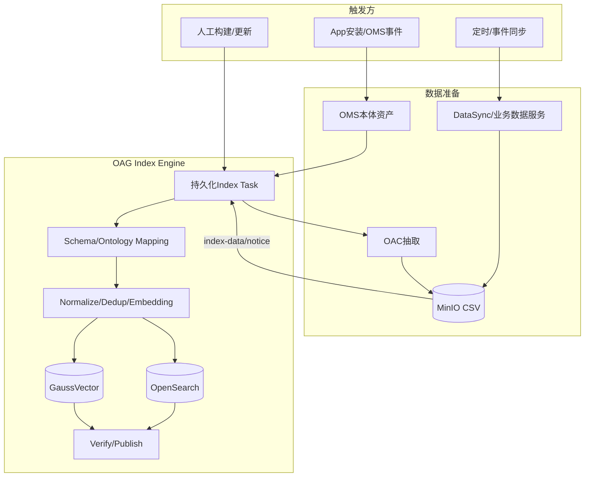
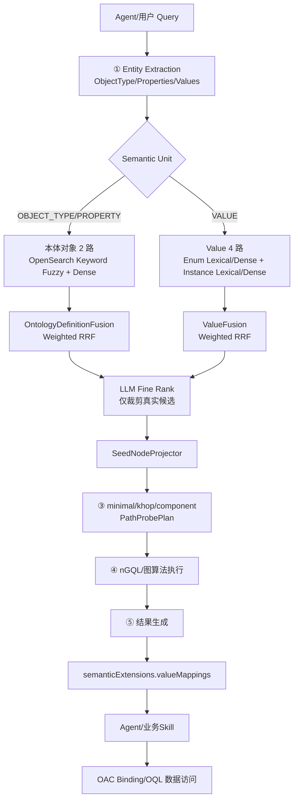

# 需求分析说明书：本体维值建模与检索

---

# 需求 IR-ONT-DIM-001 描述

> **需求名称**：本体维值建模与检索  
> **关联系统需求**：SR202607XXXXX（待定）  
> **说明**：本文中以 `.01`、`.02` 等后缀表示需求分析阶段的 SR 子需求追踪编号，正式编号以需求管理系统落号为准。

## 1. 需求定位

本需求中的“维值”是业务需求层术语，在 OAG 正式语义模型中统一落为两类 Value 语义实体：

```text
枚举元素（Enum Element）
  = Enum Value

实例元素（Instance Element）
  = 真实 Instance Value
```

维值检索不是一套独立于 OAG 子图检索的旁路能力，而是 OAG Entity Extraction / Entity Linking 主链路中 `VALUE` Semantic Unit 的组成部分。

OAG 的完整语义检索对象包括：

```text
本体对象（Ontology Object）
  = ObjectType / Property

枚举元素（Enum Element）
  = Enum Value

实例元素（Instance Element）
  = Instance Value
```

其中：

- ObjectType / Property 负责形成 Core Graph 的真实本体对象；
- Enum Value / Instance Value 负责把用户原始业务值链接到真实标准值及其 Property/ObjectType 归属；
- Enum/Instance 命中后通过 `property_id + object_type_id` 投影回真实本体对象，不直接成为图路径算法顶点；
- 最终值语义通过 `semanticExtensions.valueMappings` 返回给 Agent/下游查询生成逻辑；
- OAC 在 OAG 完成语义检索后，使用确定的 Property/ObjectType 与标准值执行 Binding/OQL 数据访问。

## 2. 价值

用户问题通常同时包含业务对象、属性以及地区、设备类型、厂家、产品名称、客户等级、状态等业务值。用户输入可能采用别名、黑话、简称、多语言或近义表达，无法直接匹配本体定义和底层数据中的真实标准值。

本需求通过“**本体建模 → 语义索引构建 → Entity Extraction → Entity Linking → 混合召回与精排 → 值语义映射 → OAC 数据访问**”的端到端能力，实现以下价值：

1. **统一语义模型**：ObjectType、Property、Enum Value、Instance Value 使用同一套 OAG Entity Linking 主链路。
2. **多表达统一匹配**：支持名称、显示名、描述、同义词、黑话和多语言业务表达的检索。
3. **标准值确定性映射**：将用户原始值稳定映射到真实索引中的 `value`，并确定所属 Property/ObjectType。
4. **混合检索增强准确率**：通过 OpenSearch Keyword Fuzzy + GaussVector Dense 的混合召回和 Weighted RRF 提升召回与排序质量。
5. **LLM 受控消歧**：LLM 只从真实候选中做 0/1/N 裁剪，不生成不存在的本体 ID 或标准值。
6. **子图检索与值语义联动**：值命中可反向补齐 Property/ObjectType，并参与后续本体对象投影与子图构建。
7. **OAC 精确过滤**：通过 `semanticExtensions.valueMappings` 向 Agent/OAC 提供查询所需的标准值及属性归属。
8. **可恢复索引构建**：动态 Enum/Instance 统一使用 MinIO CSV + 持久化 Task，支持 FULL_REPLACE / INCREMENTAL / CLEAR、校验、恢复和观测。

---

# 术语与缩写

| 术语/缩写 | 定义 |
| --- | --- |
| OAC | Ontology Access Service，本体访问服务；负责根据本体 Binding/OQL 访问真实业务数据，并在 OAG 手动索引构建模式下承担业务数据抽取与 MinIO 文件交付 |
| OAG | 本体语义检索与图服务；负责语义索引构建、Entity Extraction、Entity Linking、混合召回、Weighted RRF、LLM 精排、本体对象投影和子图构建 |
| OMS | Ontology Model Service，本体模型服务；负责 ObjectType、Property、EnumType、SynonymType、多语言显示/描述等本体资产建模与发布 |
| 本体对象 | ObjectType / Property |
| 枚举元素 | 本体模型中真实定义的 Enum Value |
| 实例元素 | 属性对应真实数据源中去重后的 Instance Value |
| 维值 | 本需求的业务术语，正式实现中对应 Enum Value / Instance Value |
| Semantic Unit | Query Understanding 后的一个检索语义单元；主要包括 OBJECT_TYPE / PROPERTY / VALUE |
| Seed | 经 Entity Linking 和 LLM 精排后参与图构建的本体对象 |
| Supporting Hit | 支撑候选归属的 Enum/Instance/同义词等具体命中证据，仅用于召回、粗排、调试与可观测性 |
| Core Graph | 只由 ObjectType / Property / Relationship 等本体拓扑元素组成的路径计算图 |
| Keyword Fuzzy | OpenSearch 基于 Analyzer + BM25 + fuzziness 的关键词模糊召回；Exact/Phrase 可作为同一 lexical 查询中的 boost，但不单独形成独立召回通道 |
| Dense | GaussVector 基于 BGE-M3 1024 维向量和 COSINE 的向量召回 |
| Weighted RRF | 对不同检索通道的 rank 进行加权 Reciprocal Rank Fusion，不直接比较 OpenSearch `_score` 与 cosine 原始分数 |
| semanticExtensions | OAG 最终响应中的确定性语义扩展 |
| valueMappings | `semanticExtensions` 中表达 `sourceValue → canonicalValue → Property → ObjectType` 的值语义映射 |

历史字段 `is_semantic`、`seed*`、`metadata*`、`instance*` 可以在兼容层读取，但不作为本文新需求和新接口的正式术语。

---

# 系统上下文

## 1. 系统边界

| 字段 | 内容 |
| --- | --- |
| 系统名称 | GTS Data Cube / Agentic Operation Center 27.1.0 本体知识平台 |
| 系统内部 | OMS、OAG、OAC、Binding、GaussVector、OpenSearch、GaussDB Task、MinIO 接入与观测能力 |
| 系统外部 | Agent/业务 Skill/上层应用、物理数据库、图数据库、多维模型、三方接口、DataSync/业务数据服务 |

## 2. 周边交互方清单

| 编号 | 交互方 | 类型 | 交互方式 | 主要职责 |
| --- | --- | --- | --- | --- |
| ES-01 | Agent / 业务 Skill / 上层应用 | 系统/服务 | REST API | 调用 OAG 子图语义检索；消费子图和 `semanticExtensions.valueMappings`；按业务需要调用 OAC |
| ES-02 | 建模人员 | 人 | OMS Web UI | 维护 ObjectType、Property、EnumType、SynonymType、多语言资产及 Property 检索准入配置 |
| ES-03 | OMS | 系统/服务 | 内部 API / 事件 | 向 OAG 提供本体对象、静态 Enum、SynonymType 和归属关系资产 |
| ES-04 | OAC | 系统/服务 | REST API / MinIO | 手动构建模式下抽取业务 Enum/Instance，上传 MinIO 并 notice；运行时执行 Binding/OQL 数据访问 |
| ES-05 | DataSync / 业务数据服务 | 系统/服务 | MinIO + REST API | 定时/事件同步大规模 Enum/Instance 数据，上传 CSV 后通知 OAG |
| ES-06 | 业务数据源 | 系统/服务 | JDBC/GQL/REST/MDX | 提供真实实例值和最终业务查询数据 |
| ES-07 | 运维监控平台 | 系统/服务 | Metrics/日志/告警 | 观测索引任务、检索时延、错误码、依赖状态和容量指标 |

---

# 需求描述

| 设计资产 | 描述 |
| --- | --- |
| IR 标识 | IR-ONT-DIM-001 |
| 名称 | 本体维值建模与检索 |
| 描述 | 平台应支持 Enum Value / Instance Value 的语义建模与索引，支持从用户问题中抽取 ObjectType / Property / Value，基于本体对象 2 路和值 4 路混合召回完成 Entity Linking，并通过 LLM 精排、本体对象投影和 `semanticExtensions.valueMappings` 将用户原始业务值映射到真实标准值及 Property/ObjectType，供后续子图构建和 OAC 查询过滤使用。 |
| Who | 建模人员、业务 Agent/Skill、平台开发者、OAG/OAC/DataSync 开发者、运维人员 |
| Where | 本体知识平台及其连接的业务数据源 |
| When | 设计态完成本体对象/枚举/同义词/检索准入建模；索引构建阶段完成数据准备与导入；运行时完成 Entity Extraction、Entity Linking、子图构建和值语义映射 |
| Why | 解决用户自然语言值表达与真实本体/数据值不一致导致的检索和查询条件错误问题 |
| What | 本体对象/Enum/Instance 索引、同义词、多语言、动态数据接入、混合召回、Weighted RRF、LLM 精排、ValueMapping、OAC 过滤 |
| How | OMS 提供资产；OAC/DataSync 通过 MinIO CSV 提供动态数据；OAG 统一完成 Normalize/Dedup/Embedding/双写、语义检索与子图构建；Agent/OAC 消费 OAG 输出进行数据查询 |
| 类别 | 设计类 |

---

# 假设和约束

| 序号 | 约束类别 | 约束描述 | 对验收的影响 |
| --- | --- | --- | --- |
| 1 | 正式数据分类 | OAG 语义索引分为本体对象、枚举元素、实例元素三类稳定实体 | 必须分别验证三类索引，不再使用“枚举/实例混表” |
| 2 | Property 检索准入 | Instance Value 索引准入以 `Property.retrieval.enabled=true` 为正式开关，并结合 `datatype_eligible / value_shape_eligible / cardinality_eligible`；历史 `is_semantic` 仅作为兼容来源 | 验收不得以 `is_semantic` 作为唯一正式协议字段 |
| 3 | 静态枚举来源 | 静态 Enum Value 来自 OMS 的 EnumType/values[] 与 Property 引用关系，由 OAG 读取/解析本体资产构建 | 验证 EnumType 被多个 Property 引用时按实际 Property 展开 |
| 4 | 动态数据交付 | 动态 Enum/Instance 无论数据量大小，统一通过 UTF-8 MinIO CSV + `/index-data/notice` 交付 | 不验收直接把大批 JSON value 列表写入 OAG 的旧接口 |
| 5 | 数据读取责任 | `instanceDataSourceMode` 只决定谁访问业务数据源：`OAC` 或 `BUSINESS_NOTICE`；不允许按单次数据量动态切换模式 | OAC 与 DataSync 场景分别覆盖 |
| 6 | OAG Owner | OAG 统一负责 Schema/Ontology Mapping、Normalize、Dedup、Embedding、GaussVector/OpenSearch 双写、Verify、Publish 和 Task 终态 | 生产者不得直接写 GaussVector/OpenSearch |
| 7 | 三类物理索引 | `t_oag_{ontology_id}`、`t_oag_enum_{ontology_id}`、`t_oag_instance_{ontology_id}` 分别承载本体对象、Enum Value、Instance Value | 验收物理结构与稳定业务键 |
| 8 | Stable Key | 本体对象键为 `id`；Enum/Instance 键为 `object_type_id + property_id + normalized(value)` | 重复导入必须幂等覆盖 |
| 9 | Synonym | SynonymType 在 OMS 保留结构化多语言；进入 OAG 后平铺为 LF 分隔 `synonyms` String，不建立独立向量/全文记录 | 不再验收 `synonyms_zh/synonyms_en` 独立 JSON 数组列 |
| 10 | 多语言 | 本体对象和 Enum 支持 zh/en/lang_1/lang_2 固定槽位；Instance 不配置 display/description 多语言字段 | Instance 索引只保留 value/synonyms/归属字段 |
| 11 | Embedding | Dense 使用 BGE-M3 1024 维向量，COSINE 距离；Instance Dense 输入只拼 `{value}\n{synonyms}` | 验收 Embedding 输入与 Schema 一致 |
| 12 | 混合召回 | 系统共有 6 个物理通道，但不是所有 Semantic Unit 都走 6 路：OBJECT_TYPE/PROPERTY 走本体定义 2 路，VALUE 走 Enum/Instance 4 路 | 测试必须验证路由隔离 |
| 13 | Lexical | OpenSearch lexical 采用 Keyword Fuzzy（Analyzer + BM25 + fuzziness）；Exact/Phrase 仅作为 boost，不形成额外独立 Ranked List | 禁止把“BM25 精确匹配”描述为独立通道 |
| 14 | Weighted RRF | RRF 只融合各通道 rank；权重、TopK、阈值通过配置和评测校准，不在需求中写死业务置信度公式 | 验收排序稳定性和候选真实性，不验收手工 +0.2/+0.1 公式 |
| 15 | Dense Threshold | `similarityThreshold` 只作用于 Dense 通道，lexical 不使用 Dense 阈值过滤 | 覆盖边界测试 |
| 16 | LLM 边界 | LLM Fine Rank 只能裁剪 Entity Linking 已召回的真实候选，允许 0/1/N，不得生成新的 ObjectType/Property/Value ID | 验收 Candidate Membership 和 Ownership 校验 |
| 17 | Core Graph | Enum/Instance 不直接作为 minimal/khop/component 图算法顶点；命中后投影为 Property/ObjectType | 覆盖值命中后子图构建场景 |
| 18 | ValueMapping | 最终标准值必须来自真实索引 `value`；下游过滤使用 `canonicalValue`/必要时 `defaultDataValue`，不得使用 synonym/display 作为权威值 | 验收 `semanticExtensions.valueMappings` |
| 19 | 高基数控制 | UUID、手机号、时间戳、连续数值、高随机编码等默认不建议进入 Instance Dense；高基数自由文本进入独立 Document/RAG Index | 验收准入策略和容量指标 |
| 20 | 性能指标 | 检索时延和索引吞吐量以项目性能规格/压测结果为准，本文不写死未验证的 P95 200ms 等门限 | 通过性能基线文档单独验收 |

---

# 总体流程

## 1. 索引构建总体流程



### 场景选择

| 场景 | 数据流 | instanceDataSourceMode | importMode |
| --- | --- | --- | --- |
| App 安装/OMS 事件构建本体对象和静态 Enum | OMS → OAG | - | FULL_REPLACE/内部资产同步 |
| 首次全量，有 OAC | OAG build → OAC 抽取 → MinIO → notice(triggerTaskId) → OAG | OAC | FULL_REPLACE |
| 人工触发增量，有 OAC | OAG build → OAC 抽取 → MinIO → notice(triggerTaskId) → OAG | OAC | INCREMENTAL |
| 定时/事件同步 | DataSync/业务服务 → MinIO → notice → OAG | BUSINESS_NOTICE | INCREMENTAL |
| 已有全量文件重建 | MinIO → notice → OAG | BUSINESS_NOTICE | FULL_REPLACE |
| 清理当前本体实例索引 | notice | - | INSTANCE_VALUE + CLEAR |

## 2. 运行态端到端流程



运行边界：

1. Entity Extraction 只识别业务表达，不生成内部本体 ID，也不预判 Value 是 Enum 还是 Instance；
2. Entity Linking 负责把文本和值链接到真实索引记录；
3. VALUE 命中根据真实 `property_id + object_type_id` 解析归属；
4. LLM 只做候选裁剪，不重新检索、不生成新 ID；
5. 图策略只消费真实 ObjectType/Property；
6. OAG 最终把值语义装配到 `semanticExtensions.valueMappings`；
7. Agent/OAC 使用确定性映射生成查询条件，OAG 不在第一版返回可执行 filterHints/operator。

---

# 场景用例分析

## 场景清单

| 变更类型 | 场景编号 | 场景名称 | 主要覆盖 | 优先级 |
| --- | --- | --- | --- | --- |
| MODIFY | SC-001 | Property 检索准入、Enum/Synonym 建模 | OMS、retrieval.enabled、EnumType、SynonymType、多语言 | 高 |
| MODIFY | SC-002 | 本体对象与静态 Enum 索引构建 | OMS → OAG、三类索引、Embedding、OpenSearch | 高 |
| MODIFY | SC-003 | 动态 Enum/Instance 数据准备与导入 | OAC/DataSync、MinIO、Task、FULL_REPLACE/INCREMENTAL/CLEAR | 高 |
| MODIFY | SC-004 | Entity Extraction / Value 提取 | OAG、query/extractedEntities、ValueHint | 高 |
| MODIFY | SC-005 | Entity Linking 与混合召回 | 2 路/4 路、Keyword Fuzzy、Dense、Weighted RRF | 高 |
| MODIFY | SC-006 | LLM 精排与 unresolved | Candidate Membership、0/1/N、最小充分种子 | 高 |
| MODIFY | SC-007 | 本体对象投影、子图与 ValueMapping | SeedNodeProjector、minimal/khop/component、semanticExtensions | 高 |
| MODIFY | SC-008 | OAC 本体数据访问过滤 | Agent/OAC、Binding/OQL、canonicalValue/defaultDataValue | 高 |

---

## SC-001：Property 检索准入、Enum/Synonym 建模

### 场景描述

建模人员通过 OMS 维护 ObjectType、Property、EnumType、SynonymType 及多语言显示/描述。对需要建立 Instance Value 语义索引的 Property，通过 `Property.retrieval.enabled=true` 开启检索准入；是否最终建立 Instance 索引还需通过数据类型、值形态和基数准入。

### 成功保证

1. Property 的正式检索配置可发布并被 OAG/DataSync/OAC 读取；
2. Enum Value 通过 Property → EnumType 引用关系确定归属；
3. SynonymType 在 OMS 保留语言 Map，进入 OAG 时由 `SynonymFlattener` 平铺为 LF String；
4. 本体对象/Enum 支持 zh/en/lang_1/lang_2；Instance 不增加 display/description 多语言列；
5. 同义词不建立独立索引记录。

### 验收示例

```gherkin
Given Property customerLevel 已发布
And   customerLevel.retrieval.enabled = true
And   customerLevel 引用 EnumType CustomerLevelEnum
And   枚举 VIP 的 SynonymType 含 zh:["贵宾","VIP客户"], en:["VIP customer"]
When  OAG 构建语义索引
Then  VIP 作为独立 Enum Value 记录入 t_oag_enum_{ontology_id}
And   synonyms 以 LF String 保存
And   不创建独立 synonym 向量记录
```

---

## SC-002：本体对象与静态 Enum 索引构建

### 场景描述

App 安装或 OMS 资产变更触发 OAG 构建本体对象和静态 Enum 索引。OAG 读取 OMS 资产，完成归属校验、规范化、去重、Embedding 及 GaussVector/OpenSearch 双写。

### 索引粒度

```text
t_oag_{ontology_id}
  → 1 个 ObjectType / Property 1 条记录

t_oag_enum_{ontology_id}
  → 1 个 Property 下的 1 个 Enum Value 1 条记录
```

同一 EnumType 被多个 Property 复用时，按实际引用 Property 展开为多条归属明确的记录。

### 成功保证

1. 本体对象稳定键为 `id`；
2. Enum 稳定键为 `object_type_id + property_id + normalized(value)`；
3. BGE-M3 生成 1024 维向量；
4. OpenSearch 与 GaussVector 使用同一业务语义和稳定键；
5. 重复构建幂等覆盖，不产生重复向量或重复全文文档；
6. OAG 完成 Verify/Publish 后任务才进入成功终态。

---

## SC-003：动态 Enum/Instance 数据准备与导入

### 场景描述

动态 Enum/Instance 由 OAC 或 DataSync/业务数据服务访问真实业务数据源、执行源侧基础标准化和必要去重，生成 UTF-8 CSV 上传到约定 MinIO Bucket，再调用 OAG `index-data/notice`。OAG 负责最终映射校验、去重、Embedding、双写、验证和发布。

### OAC 模式

```text
OAG 手动 build
→ 创建持久化 Task
→ OAG 编排 OAC
→ OAC 抽取业务数据
→ CSV 上传 MinIO
→ OAC 调用 index-data/notice(triggerTaskId)
→ OAG 继续原 Task
→ Validate/Normalize/Dedup/Embedding/双写/Verify/Publish
```

### BUSINESS_NOTICE 模式

```text
DataSync/业务服务
→ 定时/事件读取业务数据源
→ CSV 上传 MinIO
→ index-data/notice
→ OAG 创建 Task
→ Validate/Normalize/Dedup/Embedding/双写/Verify/Publish
```

### Instance 去重规则

同一个 Property/ObjectType 作用域内按 `normalized(value)` 去重。例如源表 5000 万行，但 `subLevel` 只有 VIP/GOLD/SILVER/NORMAL 四个唯一值，则最终 Instance 语义索引只保存 4 条记录。

### 验收示例

```gherkin
Given Property deviceType.retrieval.enabled = true
And   OAG 当前 instanceDataSourceMode = OAC
When  用户发起 FULL_REPLACE 手动构建
Then  OAG 创建持久化 Task 并通知 OAC 抽取
And   OAC 上传 UTF-8 CSV 到 MinIO
And   OAC 使用 triggerTaskId 调用 /v1/onto-retrieval/{ontologyId}/index-data/notice
And   OAG 按 object_type_id + property_id + normalized(value) 再次去重
And   GaussVector 与 OpenSearch 双写完成后 Verify/Publish
```

---

## SC-004：Entity Extraction / Value 提取

### 场景描述

运行时由 OAG 语义子图检索入口处理自然语言 `query` 或业务 Skill 提供的 `extractedEntities`。Entity Extraction 只识别 ObjectType、Properties 和 Values，不生成内部 ID、不绑定 Relationship、不把 Value 强制分类为 Enum/Instance。

### 正式结构

```json
{
  "extractedEntities": [
    {
      "ObjectType": "Account",
      "Properties": ["accountStatus", "customerLevel"],
      "Values": [
        {"Property": "accountStatus", "Value": "在用"},
        {"Property": "customerLevel", "Value": "VIP"}
      ]
    }
  ]
}
```

允许 value-only：

```json
{
  "extractedEntities": [
    {
      "Values": [
        {"Value": "12JKS0885_IN_RSNM_KALIBATA3_MC"}
      ]
    }
  ]
}
```

### 成功保证

1. `query` 与 `extractedEntities` 至少一个非空；
2. `Properties` 非空时必须存在 `ObjectType`；
3. Value 的 Property 未知时允许只传 `Value`；
4. 不根据编码形态猜测 Site/BaseStation/nativeId 等归属；
5. 连续数值、范围、时间、聚合等语义默认保留在原始 query 中，不强行作为 Enum/Instance Value。

---

## SC-005：Entity Linking 与混合召回

### 场景描述

OAG 根据 Semantic Unit 类型路由不同检索域：

| Semantic Unit | 检索通道 | 融合 |
| --- | --- | --- |
| OBJECT_TYPE | `ontologyObjectLexical + ontologyObjectDense` | 本体定义 2 路 Weighted RRF |
| PROPERTY | 当前 ObjectType 作用域内 `ontologyObjectLexical + ontologyObjectDense` | 本体定义 2 路 Weighted RRF |
| VALUE | `enumLexical + enumDense + instanceLexical + instanceDense` | Value 4 路 Weighted RRF |

### 核心规则

1. OBJECT_TYPE/PROPERTY 不发送到 Enum/Instance 索引；
2. VALUE 不发送到本体对象索引并与本体定义混合成同一 Ranked List；
3. Property 必须在候选 ObjectType 作用域内检索，使用 `type=PROPERTY + parent_id=<ObjectType.id>`；
4. Value 有 Property Hint 时，必须先把业务 Property 文本链接成真实 Property 后再作为 filter；
5. Value-only 在全本体 Enum/Instance 4 路召回后，根据真实命中记录反解 Property/ObjectType；
6. RRF 前按 `semantic_unit_id + channel + group_id` 去重，避免同一 Property 因多个 synonym/value 重复占 rank；
7. supporting hit 保留用于内部可观测性，但不继续传递给 LLM Fine Rank Prompt；
8. RRF 只使用通道 rank；Dense 在 RRF 前使用 `similarityThreshold`，lexical 使用 Keyword Fuzzy 自身的 TopK/fuzziness/minimum_should_match 控制。

### 验收示例

```gherkin
Given query 中 VALUE = "VIP"
When  执行 Entity Linking
Then  只进入 enumLexical/enumDense/instanceLexical/instanceDense 四个值通道
And   结果按真实 object_type_id + property_id 聚合
And   使用 Weighted RRF 融合通道 rank
And   返回的实际 value 来自真实索引记录
```

---

## SC-006：LLM 精排与 unresolved

### 场景描述

Entity Linking 粗排后，OAG 使用 LLM Fine Rank 结合 `original_query + search_context + extracted_entities` 对真实 ObjectType/Property 候选进行严格裁剪。

### 核心规则

1. LLM 只能选择已召回候选，不能新增候选；
2. id/name/score 必须从输入候选原样复制；
3. Property 只能保留在所属 ObjectType 下，不允许跨 ObjectType 移动；
4. 允许每个源实体保留 0/1/N 个候选；
5. 无可信候选时进入 `unresolved`，不强制 Top1；
6. 最终种子遵循“最小充分集合”原则；
7. 程序侧必须执行 Schema、Candidate Membership 和 Ownership 校验。

### 验收示例

```gherkin
Given 粗排候选中存在 ObjectType A/B
And   B 的名称相似但不满足用户业务目标
When  LLM Fine Rank 执行
Then  LLM 只能从 A/B 中裁剪
And   不得生成候选 C
And   若 A/B 均不可信则返回 unresolved
```

---

## SC-007：本体对象投影、子图与 ValueMapping

### 场景描述

精排完成后，OAG 把最终 ObjectType/Property 投影为图构建种子，执行 `minimal / khop / component` 策略并统一转换为 `PathProbePlan`。Enum/Instance 命中不直接进入 Core Graph，而在最终结果阶段装配为 `semanticExtensions.valueMappings`。

### ValueMapping 正式语义

```text
SemanticExtensions
└── valueMappings[]
     ├── sourceValue
     ├── canonicalValue
     ├── objectType { id, name }
     ├── property   { id, name }
     └── defaultDataValue（Enum 可选）
```

| 字段 | 必选 | 说明 |
| --- | ---: | --- |
| `sourceValue` | 是 | 用户问题/ExtractedEntity 中的原始值 |
| `canonicalValue` | 是 | Entity Linking 确认的真实标准值，必须来自真实索引 `value` |
| `objectType` | 是 | 值所属 ObjectType `{id,name}` |
| `property` | 是 | 值所属 Property `{id,name}` |
| `defaultDataValue` | 否 | Enum 的数据库原始值，例如展示值“华为”对应数据库过滤值 `0` |

### 生成规则

1. 只为最终确认的 Enum/Instance 命中生成 ValueMapping；
2. `sourceValue` 保留用户原文；
3. `canonicalValue` 不得使用 display/synonym/LLM 新造值；
4. 同一 sourceValue 存在多个合法归属时允许生成多个 Mapping；
5. 第一版不返回可执行 `filterHints/operator`，范围、时间、比较、聚合语义由 Agent/LLM 结合原始问题生成；
6. 子图结果仍返回 ObjectType、Property、Relationship、RelationshipProperty，并按开关扩展 Function/Action。

### 验收示例

```gherkin
Given 用户原始值 = "严重"
And   Enum 索引真实 value = "CRITICAL"
And   该值属于 Alarm.severity
When  OAG 生成最终语义结果
Then  semanticExtensions.valueMappings 包含 sourceValue="严重"
And   canonicalValue="CRITICAL"
And   objectType 指向 Alarm
And   property 指向 severity
```

---

## SC-008：OAC 本体数据访问过滤

### 场景描述

Agent/业务 Skill 消费 OAG 的子图与 `semanticExtensions.valueMappings` 后，根据业务任务组装 OAC 查询。OAC 根据 Property Binding 将标准值映射到物理字段并执行 OQL/底层查询。

### 核心规则

1. OAG 在语义检索阶段不直接执行 OAC 数据查询；
2. Agent/Skill 使用 OAG 返回的真实 ObjectType/Property 和 `canonicalValue` 生成过滤语义；
3. Enum 存在 `defaultDataValue` 时，底层过滤优先使用设计约定的数据库原始值；
4. OAC 负责 Binding 解析、查询执行和结果装配；
5. OAC 不重新做 Enum/Instance Entity Linking。

### 验收示例

```gherkin
Given OAG 返回 Alarm.severity 的 canonicalValue="CRITICAL"
And   defaultDataValue="0"
When  Agent 调用 OAC 查询
Then  OAC 根据 severity Binding 定位真实物理字段
And   按协议使用 canonicalValue 或 defaultDataValue 形成过滤条件
And   OAC 不重新通过模糊检索猜测标准值
```

---

# 功能影响列表

## 设计态功能

| 功能编号 | 功能描述 | 影响类型 | 影响描述 | 来源 |
| --- | --- | --- | --- | --- |
| F-DIM-001 | Property 检索准入配置 | 修改 | 正式使用 `Property.retrieval.enabled`，结合 datatype/value-shape/cardinality 准入；历史 is_semantic 仅兼容 | SC-001 |
| F-DIM-002 | EnumType / Property 引用 | 修改 | Enum Value 按实际 Property 展开并保留 object_type_id/property_id 归属 | SC-001/SC-002 |
| F-DIM-003 | SynonymType 建模与平铺 | 修改 | OMS 保留多语言结构；OAG 统一 LF String，不建独立 synonym 记录 | SC-001 |
| F-DIM-004 | 多语言索引字段 | 修改 | 本体对象/Enum 使用 zh/en/lang_1/lang_2；Instance 不使用 display/description 多语言字段 | SC-001/SC-002 |

## 索引构建功能

| 功能编号 | 功能描述 | 影响类型 | 影响描述 | 来源 |
| --- | --- | --- | --- | --- |
| F-DIM-005 | 三类物理索引 | 修改 | 使用 `t_oag_* / t_oag_enum_* / t_oag_instance_*` | SC-002/SC-003 |
| F-DIM-006 | MinIO CSV 数据接入 | 修改 | 动态 Enum/Instance 统一 MinIO CSV + notice | SC-003 |
| F-DIM-007 | 持久化索引 Task | 新增/明确 | OAG 负责 Task、状态、Checkpoint、Verify、Publish | SC-003 |
| F-DIM-008 | 幂等 UPSERT/DELETE | 修改 | 使用稳定业务键保证 GaussVector/OpenSearch 一致 | SC-002/SC-003 |

## 运行态功能

| 功能编号 | 功能描述 | 影响类型 | 影响描述 | 来源 |
| --- | --- | --- | --- | --- |
| F-DIM-009 | Entity Extraction | 修改 | OAG 识别 ObjectType/Properties/Values；支持业务侧直接传 extractedEntities | SC-004 |
| F-DIM-010 | 2/4 路混合召回 | 修改 | ObjectType/Property 2 路；Value 4 路 | SC-005 |
| F-DIM-011 | Weighted RRF | 修改 | 按 Semantic Unit 独立融合通道 rank | SC-005 |
| F-DIM-012 | LLM Fine Rank | 修改 | 只裁剪真实候选，支持 unresolved | SC-006 |
| F-DIM-013 | SeedNodeProjector / 子图构建 | 修改 | Enum/Instance 投影到 Property/ObjectType，不直接进 Core Graph | SC-007 |
| F-DIM-014 | semanticExtensions.valueMappings | 新增/明确 | 返回 sourceValue/canonicalValue/Property/ObjectType/defaultDataValue | SC-007 |
| F-DIM-015 | OAC 查询过滤 | 修改 | OAC 使用已确认值映射进行 Binding/OQL 数据访问，不重复 Entity Linking | SC-008 |

---

# 需求分解列表（IR → SR）

| IR 编号 | SR 编号 | SR 名称 | SR 描述 | 关联功能 |
| --- | --- | --- | --- | --- |
| IR-ONT-DIM-001 | SR-XXX-01 | Property 检索准入与维值模型 | OMS 支持 Property 检索准入、EnumType、SynonymType、多语言资产建模 | F-DIM-001~004 |
| IR-ONT-DIM-001 | SR-XXX-02 | 三类语义索引 | OAG 分别构建本体对象、Enum、Instance 的 GaussVector/OpenSearch 索引 | F-DIM-005,008 |
| IR-ONT-DIM-001 | SR-XXX-03 | 动态值数据接入与任务 | OAC/DataSync 通过 MinIO CSV 供数，OAG 管理 Task/Import/Verify/Publish | F-DIM-006~008 |
| IR-ONT-DIM-001 | SR-XXX-04 | Entity Extraction | OAG 从 query 或 extractedEntities 获取 ObjectType/Property/Value Semantic Unit | F-DIM-009 |
| IR-ONT-DIM-001 | SR-XXX-05 | Entity Linking 与混合召回 | OAG 按 2 路/4 路检索、Weighted RRF 完成真实本体和值归属链接 | F-DIM-010,011 |
| IR-ONT-DIM-001 | SR-XXX-06 | LLM 精排与候选校验 | LLM 只裁剪真实候选，程序执行 Membership/Ownership 校验 | F-DIM-012 |
| IR-ONT-DIM-001 | SR-XXX-07 | 子图和值语义扩展 | SeedNodeProjector 构建 Core Graph；输出 semanticExtensions.valueMappings | F-DIM-013,014 |
| IR-ONT-DIM-001 | SR-XXX-08 | OAC 精确数据访问 | Agent/OAC 使用 OAG 确定的 Property/ObjectType/canonicalValue 进行数据查询 | F-DIM-015 |

---

# 接口设计概要

## 1. OAG 运行态语义子图检索接口

正式接口：

```text
POST /v2/onto-retrieval/{ontologyId}/subgraph/semantic-search
```

支持三种模式：

| 模式 | query | extractedEntities | searchContext | 说明 |
| --- | ---: | ---: | ---: | --- |
| 自然语言模式 | 有 | 无 | 可选 | OAG 自动执行 Entity Extraction |
| 结构化模式 | 无 | 有 | 可选 | 业务 Skill 已完成提取，OAG 直接 Entity Linking |
| 组合模式 | 有 | 有 | 可选 | extractedEntities 提供强提示，query/searchContext 用于补充与消歧，推荐 |

核心请求字段：

```json
{
  "query": "查询VIP客户",
  "searchContext": {
    "target_entity": "Account",
    "search_path": "",
    "extensions": {}
  },
  "extractedEntities": [
    {
      "ObjectType": "Account",
      "Properties": ["customerLevel"],
      "Values": [
        {"Property": "customerLevel", "Value": "VIP"}
      ]
    }
  ],
  "seedRetrievalMode": "hybrid",
  "similarityThreshold": 0.6,
  "topk": 3,
  "graphExpansionStrategy": "minimal",
  "hopLimit": 3,
  "includeFunctions": 0,
  "includeActions": 0
}
```

约束：`query` 与 `extractedEntities` 至少一个不为空；`similarityThreshold` 只作用于 Dense 通道。

## 2. 动态 Enum/Instance 文件导入通知接口

```text
POST /v1/onto-retrieval/{ontologyId}/index-data/notice
Header: x-gde-tenant-id
```

核心请求：

```json
{
  "requestId": "datasync-20260906-000001",
  "triggerTaskId": "idx-task-optional",
  "dataType": "INSTANCE_VALUE",
  "importMode": "INCREMENTAL",
  "files": [
    {
      "bucket": "onto-retrieval",
      "objectKey": "tenant/ontology/INSTANCE_VALUE/part-00000.csv",
      "fileFormat": "CSV",
      "encoding": "UTF-8",
      "hasHeader": true,
      "rowCount": 1000,
      "size": 102400,
      "sha256": "<64-hex>"
    }
  ]
}
```

约束：

- `dataType`: `METADATA_ENUM | INSTANCE_VALUE`；
- `importMode`: `FULL_REPLACE | INCREMENTAL | CLEAR`；
- `CLEAR` 仅允许 `INSTANCE_VALUE`，且无需依赖文件；
- `triggerTaskId` 用于 OAC 交付文件时继续人工构建产生的原任务；
- 动态 Enum/Instance 不再定义 `POST /api/v1/index/enum-values`、`POST /api/v1/index/instance-values` 作为正式数据交付协议。

## 3. 索引任务批量查询

```text
POST /v1/onto-retrieval/{ontologyId}/index-tasks/query
```

以 GaussDB `T_OAG_INDEX_TASK` 为事实来源，返回任务状态、stage、计数、稳定错误码、文件列表和恢复窗口。自动化重试不得解析 `errorMessage` 文本决定策略。

---

# 数据模型设计概要

## 1. 本体对象索引

```text
t_oag_{ontology_id}
```

核心字段：

| 字段 | 说明 |
| --- | --- |
| vector | BGE-M3 1024 维向量 |
| type | 0 ObjectType；1 Property |
| id | ObjectType / Property 全局唯一 ID，业务键 |
| parent_id | Property 所属 ObjectType.id |
| name | 本体真实名称 |
| display_zh/en/lang_1/lang_2 | 多语言显示名 |
| description_zh/en/lang_1/lang_2 | 多语言描述 |
| synonyms | LF 分隔同义词 String |

Embedding 顺序：

```text
{name}
{display_zh}
{display_en}
{display_lang_1}
{display_lang_2}
{description_zh}
{description_en}
{description_lang_1}
{description_lang_2}
{synonyms}
```

## 2. Enum Value 索引

```text
t_oag_enum_{ontology_id}
```

核心字段：

| 字段 | 说明 |
| --- | --- |
| vector | Enum Value 1024 维向量 |
| value | 真实标准枚举值，权威语义值 |
| property_id | 引用该 Enum 的 Property.id |
| object_type_id | Property 所属 ObjectType.id |
| display_zh/en/lang_1/lang_2 | 多语言 display |
| description_zh/en/lang_1/lang_2 | 多语言 description |
| synonyms | LF 分隔同义词 |
| defaultDataValue | 数据库原始值，可用于下游过滤 |

稳定键：

```text
object_type_id + property_id + normalized(value)
```

Embedding：

```text
{value}
{display_zh}
{display_en}
{display_lang_1}
{display_lang_2}
{description_zh}
{description_en}
{description_lang_1}
{description_lang_2}
{synonyms}
```

## 3. Instance Value 索引

```text
t_oag_instance_{ontology_id}
```

核心字段：

| 字段 | 说明 |
| --- | --- |
| vector | Instance Value 1024 维向量 |
| value | 去重后的真实标准列值，权威语义值 |
| synonyms | LF 分隔实例值同义词 |
| property_id | 所属 Property.id |
| object_type_id | 所属 ObjectType.id |

稳定键：

```text
object_type_id + property_id + normalized(value)
```

Embedding：

```text
{value}
{synonyms}
```

Instance 不配置 `display_* / description_*`，也不拼接 Property/ObjectType 名称作为 Dense 文本。

---

# 验收标准概要

## 1. 设计态

1. Property 可通过 `retrieval.enabled` 配置 Instance Value 检索准入，历史 `is_semantic` 不再作为正式验收字段。
2. EnumType/Enum Value、Property 引用关系和 SynonymType 可正确发布。
3. SynonymType 进入 OAG 后转换为 LF String，不生成独立 synonym 索引记录。
4. 本体对象/Enum 支持 zh/en/lang_1/lang_2；Instance 无 display/description 多语言字段。

## 2. 索引构建

1. 本体对象、Enum、Instance 分别写入三类物理索引。
2. GaussVector/OpenSearch 使用相同稳定业务键且幂等一致。
3. 动态 Enum/Instance 统一通过 MinIO CSV + notice 进入 OAG。
4. OAC 模式和 BUSINESS_NOTICE 模式均可正常完成 Task 生命周期。
5. FULL_REPLACE / INCREMENTAL / INSTANCE_VALUE+CLEAR 行为符合协议。
6. OAG 完成 Normalize/Dedup/Embedding/双写/Verify/Publish 后任务才成功。

## 3. Entity Extraction / Linking

1. `/v2/onto-retrieval/{ontologyId}/subgraph/semantic-search` 支持自然语言、结构化、组合三种模式。
2. ExtractedEntity 只包含 ObjectType/Properties/Values；Value 不预判 Enum/Instance。
3. OBJECT_TYPE/PROPERTY 只走本体定义 2 路；VALUE 只走 Enum/Instance 4 路。
4. Property 必须在候选 ObjectType 作用域内检索。
5. Weighted RRF 只融合 rank；Dense threshold 不作用于 lexical。
6. value-only 能依据真实命中反解 Property/ObjectType，不根据字符串形态猜测。

## 4. LLM 精排与子图

1. LLM 只能裁剪真实候选，不新增/修改 ID、name、score。
2. 无可信候选时允许 unresolved，不强制 Top1。
3. Enum/Instance 不直接进入 Core Graph，必须投影到 Property/ObjectType。
4. minimal/khop/component 的输入为真实本体对象。

## 5. ValueMapping 与 OAC 联动

1. `semanticExtensions.valueMappings` 至少包含 sourceValue、canonicalValue、objectType、property；Enum 可带 defaultDataValue。
2. canonicalValue 必须来自真实索引 value，不得使用 synonym/display/LLM 新造值。
3. OAC 使用 OAG 已确认的 Property/ObjectType/value 进行 Binding/OQL 数据访问，不重复执行模糊 Entity Linking。
4. 下游过滤字段准确率、Value→Property/ObjectType Mapping Accuracy、canonicalValue/defaultDataValue Accuracy 纳入端到端评测。

---

## 需求级术语映射

| 旧术语                | 正式术语/处理方式                                                          |
| ------------------ | ------------------------------------------------------------------ |
| 维值                 | Enum Value / Instance Value                                        |
| 枚举值索引              | t_oag_enum_{ontology_id}                                           |
| 实例值索引              | t_oag_instance_{ontology_id}                                       |
| 维值意图识别             | Entity Extraction 中 Values / ValueHint                             |
| 维值模糊检索             | VALUE Semantic Unit 的 Enum/Instance 4 路 Entity Linking             |
| 维值标准化              | valueMappings 中 sourceValue → canonicalValue + Property/ObjectType |
| 置信度人工公式            | Weighted RRF 粗排 + LLM Fine Rank + unresolved                       |
