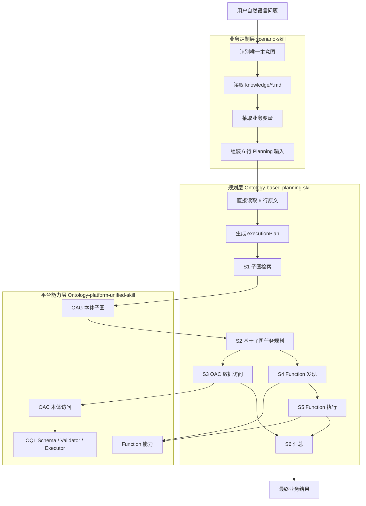

# 本体 Agent Skill 架构设计文档

本文档描述 `onto-skill` 的最新实现架构、分层职责、执行链路和开发约束。当前版本以“业务 Skill 组装 6 行输入，Planning Skill 直接读取并执行，Platform Skill 封装平台能力”为核心。

## 1. 设计目标

本体 Skill 体系面向 Agent 和业务定制场景，目标是：

- 让业务开发人员用 Markdown 维护业务知识。
- 让业务 Skill 只做业务语义识别和 6 行输入组装。
- 让 Planning Skill 基于本体子图生成执行计划。
- 让 Platform Skill 统一封装 OAG、OAC、Function 能力。
- 减少重复解析、重复上下文构造和不必要的大模型调用。

## 2. 三层架构

```text
用户问题
  -> scenario-skill 业务定制层
  -> Ontology-based-planning-skill 规划层
  -> Ontology-platform-unified-skill 平台能力层
  -> OAG / OAC / Function
```

| 层级 | 主要职责 | 不做什么 |
|---|---|---|
| 业务定制层 scenario-skill | 识别主意图，读取业务知识，抽取变量，组装 6 行输入 | 不执行 OAG/OAC/Function，不生成 OQL |
| 规划层 Ontology-based-planning-skill | 直接读取 6 行输入，生成 executionPlan，执行 S1-S6 | 不重新改写业务意图，不重复构造字段映射对象 |
| 平台能力层 Ontology-platform-unified-skill | 封装 OAG、OAC、Function、OQL schema、validator、executor | 不承担业务场景语义识别 |

## 3. 架构流程图



## 4. 6 行输入协议

业务 Skill 传给 Planning 的唯一输入是 6 行文本：

```text
本体ID：<公共本体ID>
业务意图：<详细自然语言问题>
业务领域知识：<本次执行需要的场景知识、业务规则、子图检索规则、任务规划规则、查询规则、Function 规则、返回要求和失败策略；没有则写无>
流程级定制：<只填写相对默认流程的覆盖项；无覆盖写“使用默认流程”>
步骤级定制：<只填写相对默认步骤模板的业务增量规则；无增量写“使用默认步骤模板”>
缺失信息：<没有则写无>
```

Planning 运行时直接读取这 6 行原文，不再把它们重复转换为另一套字段结构。

## 5. 执行步骤 S1-S6

| 步骤 | 名称 | 说明 |
|---|---|---|
| S1 | 子图检索 | 基于本体ID、业务意图和业务知识请求 OAG 子图 |
| S2 | 基于本体子图的任务规划 | 基于对象、字段、关系、函数候选生成任务计划 |
| S3 | OAC 数据访问 | 生成、校验、执行 OQL，返回对象结构 |
| S4 | Function 发现 | 根据子图和业务规则选择函数候选 |
| S5 | Function 执行 | 获取参数规格并执行函数能力 |
| S6 | 汇总 | 汇总对象结构、函数结果、缺失项和失败原因 |

默认流程：

```text
S1 -> S2 -> S3 -> S6
```

需要 Function 时，可由业务 Skill 在流程级定制中写明：

```text
S1 -> S2 -> S4 -> S5 -> S3 -> S6
```

## 6. 业务定制层设计模式

业务 Skill 推荐结构：

```text
scenario-skill/<business-skill>/
├── SKILL.md
└── knowledge/
    ├── <intent-a>.md
    ├── <intent-b>.md
    └── <intent-c>.md
```

`SKILL.md` 负责选择主意图和组装 6 行输入。

`knowledge/*.md` 负责维护业务知识，建议按以下段落组织：

```text
## 本体ID
## 业务意图
## 业务领域知识
## 流程级定制
## 步骤级定制
## 缺失信息
## 可注入 6 行片段
```

其中“可注入 6 行片段”只是骨架，不能替代完整业务知识。业务 Skill 组装时必须保留业务领域知识中的细粒度规则。

## 7. Planning 层设计模式

Planning Skill 的核心原则：

- 直接使用 6 行输入原文。
- 根据流程级定制生成 `executionPlan`。
- 默认执行 `S1 -> S2 -> S3 -> S6`。
- 只有流程级定制要求 Function 时才加入 S4/S5。
- 每个步骤直接消费业务领域知识、步骤级定制和上游输出。
- 不重复构造 `planningContext`、`inputGate`、`stepRuleMap`。

## 8. Platform 层设计模式

`Ontology-platform-unified-skill` 封装三类能力。

| 能力 | 职责 | 输出 |
|---|---|---|
| OAG | 检索本体子图、对象、字段、关系、函数候选 | 子图原始结果和候选摘要 |
| OAC | 生成、校验、执行 OQL | `{objects, relationships}` |
| Function | 选择函数、获取参数规格、执行函数能力 | 函数结果或缺失项 |

OAC 中间过程可以包含 operation 判断、OQL 和 validation，但最终业务输出只保留对象结构和必要摘要。

## 9. OAC 生成与校验原则

OAC 遵循 Generator + Reviewer 模式：

```text
业务意图 / 业务知识 / 子图结果
  -> 判断 operation
  -> 读取唯一操作手册
  -> 读取对应 schema
  -> 生成 OQL JSON
  -> validator 校验
  -> 按需 executor 执行
```

复杂 OQL、长数组或跨 Shell 场景优先使用 UTF-8 JSON 文件和 `--input <json文件>`。短小 JSON 且确认引号安全时才使用 `--oac-json`。

执行真实 OAC 前必须确认服务环境变量已配置。缺少服务环境时，只能报告环境缺失，不得声称真实查询完成。

## 10. Shell 兼容原则

Skill 生成命令时必须考虑操作系统和 Shell：

- 看到 Windows 路径时，默认使用 Windows 兼容写法。
- 不确定 Shell 时，不生成链式命令。
- 默认优先使用绝对脚本路径，避免 `cd && python`。
- 只有用户明确说明当前是 Bash、zsh、CMD、WSL 或 Git Bash 并要求链式命令时，才使用对应 Shell 连接符。

## 11. 质量保障

建议建立以下测试：

- 业务 Skill：测试主意图识别、knowledge 读取、变量抽取、6 行组装。
- Planning Skill：测试 executionPlan 生成和 S1-S6 步骤衔接。
- Platform Skill：测试 OQL schema、validator、executor、Function 参数规格。
- Golden Case：覆盖简单查询、关系查询、聚合查询、Function 流程、多方向业务流程。

## 12. 关键边界

- 业务 Skill 不执行平台能力。
- Planning Skill 不编造本体事实。
- Platform Skill 不替代业务语义识别。
- 空结果是有效结果时，不自动放宽条件。
- 子图缺少对象、字段、关系或函数候选时，返回缺失信息，不猜测。