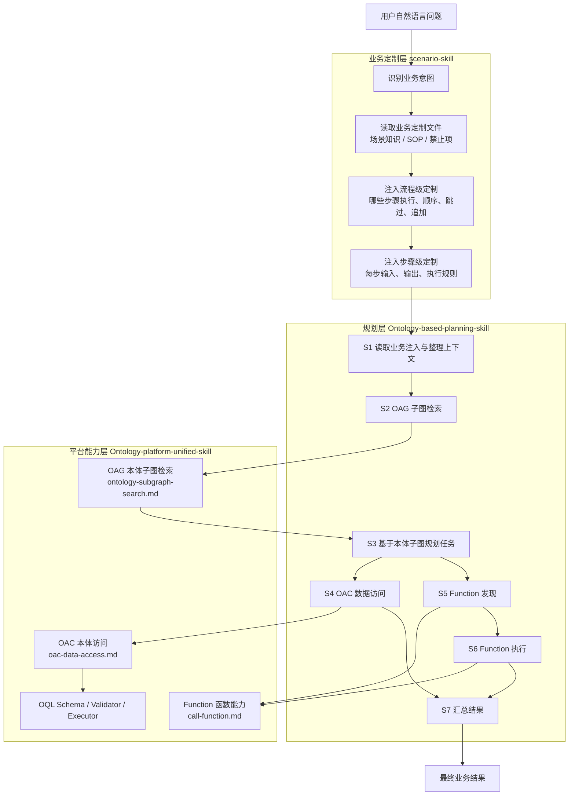
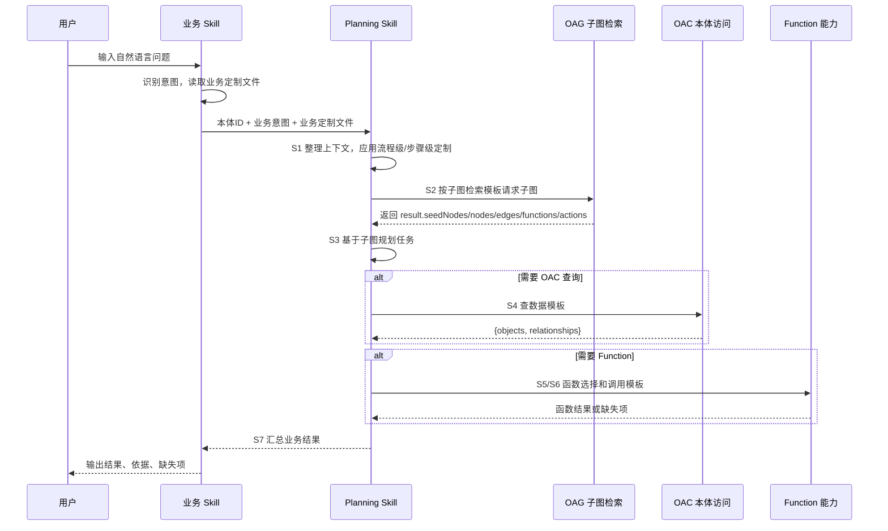

# 本体 Agent Skill 设计模式说明

## 1. 文档目标

本文面向业务 Skill 开发者、Planning Skill 维护者和平台能力开发者，说明 `onto-skill` 目录下本体 Agent Skill 的最新设计思想、分层架构、业务定制方式、默认执行闭环、模块输入输出模板和质量保障方法。

本体 Skill 的核心目标是：让业务侧用自然语言和 Markdown 文件低成本注入业务知识，让 Planning 层基于本体子图进行可控任务规划，让平台层通过 OAG、OAC、Function 三类能力完成执行闭环。

---

## 2. 总体设计思想

### 2.1 三层解耦

本体 Skill 体系采用三层结构。

```text
scenario-skill
  -> Ontology-based-planning-skill
    -> Ontology-platform-unified-skill
      -> OAG 本体子图 / OAC 本体访问 / Function 函数能力
```

三层职责边界如下。

| 层级 | 职责 | 不做什么 |
|---|---|---|
| 业务定制层 `scenario-skill` | 识别业务意图，读取业务定制文件，注入场景知识、SOP、流程级定制和步骤级定制 | 不直接拼平台接口参数，不直接绕过 Planning 调 OAC/Function |
| 规划层 `Ontology-based-planning-skill` | 基于本体子图规划单步或多步执行任务，决定使用 OAG/OAC/Function 的顺序、依赖和输入输出模板 | 不编造对象、字段、关系、函数；不承担底层接口实现 |
| 平台能力层 `Ontology-platform-unified-skill` | 封装 OAG 子图检索、OAC 查询执行、Function 参数规格和调用 | 不做跨阶段业务规划，不替代业务定制规则 |

### 2.2 对外一个本体ID

对业务侧来说，本体是一个整体。业务 Skill 对外只需要提供公共 `本体ID`，不需要同时理解 `ontologyId` 和 `schemaRef`。

- OAG 子图检索使用公共 `本体ID` 作为检索范围。
- OAC 数据访问使用公共 `本体ID` 作为 OQL `schemaRef` 来源。
- Function 调用优先使用公共 `本体ID`，如果函数候选返回更精确的 `properties.ontologyId`，以函数候选为准。

### 2.3 自然语言优先，结构化内部化

业务定制文件可以保持 Markdown 自然语言写法，不要求业务方构造复杂 JSON 字段表。Planning 层负责把自然语言业务规则整理成内部规划上下文，并按平台模块的自然语言输入模板委托执行。

这类设计可以降低业务 Skill 定制成本，同时保留业务规则的可读性和可维护性。

### 2.4 基于本体子图规划，而不是凭空规划

Planning 层的关键输入是 OAG 返回的本体子图。对象、字段、关系、函数最终都必须来自本体子图或平台返回结果。

业务定制文件的流程级和步骤级规则优先级最高，可以覆盖 Planning 和 Platform 的默认模板和默认规则；但当业务规则与平台返回结构冲突时，必须输出冲突或缺失说明，不能编造平台不存在的对象、字段、关系、函数或参数规格。

---

## 3. 总体架构图



---

## 4. 业务 Skill 定制的两层模型

业务 Skill 的定制内容分为两部分：流程级定制和步骤级定制。

### 4.1 流程级定制

流程级定制回答：默认 planning 大流程要执行哪些步骤、是否跳过、是否追加、步骤顺序如何。

默认流程为：

```text
S1 读取业务注入与整理上下文
  -> S2 OAG 子图检索
  -> S3 基于本体子图的任务规划
  -> S4 OAC 数据访问
  -> S5 Function 发现
  -> S6 Function 执行
  -> S7 汇总结果
```

业务 Skill 可以自然语言说明：

- 执行全部默认步骤。
- 只执行 S2/S3，输出模型解释或子图规划结果。
- 只执行 S2/S3/S4，生成或执行 OAC 查询。
- 对某些业务场景跳过 S5/S6 Function。
- 先 Function，再 OAC，或 Function 作为备选。
- 多方向、多对象、多路径必须串行或并行。
- 某些步骤必须跳过，并给出原因。

### 4.2 步骤级定制

步骤级定制回答：每个步骤输入什么、输出什么、执行规则是什么。

可定制内容包括：

| 步骤 | 可定制内容 |
|---|---|
| S2 子图检索 | query 改写、检索策略、扩展方向、函数候选返回要求、子图返回结构要求 |
| S3 基于子图规划 | 起点对象、终点对象、路径选择、OAC / Function 优先级、任务拆分规则 |
| S4 OAC 查询 | 操作类型、查询对象、关系路径、过滤条件、返回对象字段、排序分组、空结果策略 |
| S5/S6 Function | 函数选择依据、参数规格获取、参数组装、缺参策略、调用结果要求 |
| S7 汇总结果 | 展示维度、分方向/分步骤输出、依据保留要求 |

业务定制文件是业务定制模式的必填输入。业务 Skill 不再维护独立结构化字段契约，只需传自然语言业务定制文件和定制说明。

### 4.3 覆盖优先级

业务定制文件中的流程级定制和步骤级定制优先级最高，可以覆盖 `Ontology-based-planning-skill` 和 `Ontology-platform-unified-skill` 中预置的默认流程、默认输入模板、默认输出模板和默认执行规则。

优先级从高到低：

```text
用户当前明确要求
> 业务定制文件中的流程级定制
> 业务定制文件中的步骤级定制
> 业务定制文件中的场景知识、SOP、禁止项、返回要求
> Ontology-based-planning-skill 默认流程和模板
> Ontology-platform-unified-skill 各模块默认模板
```

---

## 5. 业务定制文件建议结构

业务定制文件可以保持 Markdown 自然语言写法，不要求 JSON 化。推荐组织为：

```text
# <场景或规则名称>

## 场景知识
<行业规则、业务含义、对象解释>

## 流程级定制
<执行哪些步骤、跳过哪些步骤、是否追加步骤、步骤顺序、串行/并行要求>

## 子图检索规则
<如何改写 OAG query，是否需要函数候选，扩展方向，返回哪些子图字段>

## 基于子图的任务规划规则
<从哪个对象出发，查到哪个对象；单步还是多步；先 OAC 还是先 Function；路径和方向选择>

## OAC 查询规则
<操作类型、查询对象、过滤条件、返回字段、排序、maxResults、空结果策略>

## Function 调用规则
<函数选择依据、参数来源、缺参策略、是否必须调用>

## 汇总规则
<输出结构、分方向或分对象汇总、空结果说明>
```

业务定制可以覆盖 Skill 模板和规则，但不能编造平台事实。平台返回缺少业务要求的对象、字段、关系、函数或参数规格时，必须输出缺失或冲突说明。

---

## 6. 默认执行闭环流程图



---

## 7. Tool Wrapper：Ontology-platform-unified-skill

`Ontology-platform-unified-skill` 是本体平台能力包装器，对上层隐藏 OAG、OAC、Function 的接口差异。

| 能力 | 职责 | 入口 |
|---|---|---|
| OAG 本体子图 | 基于自然语言业务意图、公共本体ID和业务子图检索规则，返回 `result.seedNodes/nodes/edges/functions/actions` | `references/ontology-subgraph-search.md` |
| OAC 本体访问 | 基于公共本体ID、业务意图、本体子图依据和业务查询规则生成、校验、执行 OQL，并返回对象结构结果 | `references/oac-data-access.md` |
| Function 函数能力 | 基于公共本体ID、`result.functions` 和业务函数规则获取规格、组装参数、调用函数 | `references/call-function.md` |

平台层不做跨阶段业务规划，只做能力路由和平台协议封装。

---

## 8. OAG / S3 / OAC / Function 职责边界

### 8.1 OAG：找本体结构依据

OAG 输入是自然语言业务意图、公共 `本体ID` 和业务子图检索规则，输出本体子图 JSON 及规划可用摘要。

OAG 负责：

- 检索对象、属性、关系、函数候选。
- 保留 `result.seedNodes`、`result.nodes`、`result.edges`、`result.functions`、`result.actions` 原始结构。
- 按业务定制返回结构要求输出摘要。
- 为 S3、OAC 和 Function 提供可信依据。

OAG 不负责生成 OQL、不执行数据查询、不直接调用函数。

### 8.2 S3：基于本体子图规划任务

S3 是 `Ontology-based-planning-skill` 内部规划步骤，不属于平台能力。

S3 输入为：OAG 子图结果 + 业务定制规划规则文件。输出为可执行步骤列表，包括 OAC 查询任务、Function 发现/调用任务、汇总任务等。

默认规划规则：

1. 识别任务目标：单对象查询、关系路径查询、聚合统计、函数计算或组合任务。
2. 确认起点对象和终点对象；如果是单对象查询，只确认查询对象。
3. 从子图读取对象、字段归属、关系候选和函数候选。
4. 判断应使用 OAC `QUERY`、`ASSOCIATION_QUERY`、`AGGREGATE` 还是 Function。
5. 生成步骤依赖关系，明确哪些步骤必须等待上游输出。
6. 应用业务定制文件中的流程级和步骤级覆盖规则。
7. 输出 `plannedTasks`，每个任务都要说明输入、输出、依据和失败策略。

### 8.3 OAC：生成、校验、执行本体查询并返回对象结构

OAC 输入是公共 `本体ID`、自然语言数据访问业务意图、OAG 子图依据和业务查询规则。

OAC 负责：

- 判断 `QUERY / ASSOCIATION_QUERY / AGGREGATE`。
- 将公共 `本体ID` 作为 OQL `schemaRef` 来源。
- 读取唯一 operation 手册和对应 schema。
- 生成 OQL JSON。
- 运行 validator 校验。
- 用户或 planning 明确要求执行时调用 executor。
- 最终返回对象结构：`{objects, relationships}`。

`operationDecision`、`oql`、`validation` 属于中间过程日志，不作为最终输出字段。

### 8.4 Function：调用本体函数

Function 输入是公共 `本体ID`、业务函数意图、`result.functions` 候选、函数选择规则和上下文参数。

Function 固定流程：

1. 根据 `result.functions[].properties.description` 选择目标函数。
2. 提取 `properties.ontologyId` 和 `properties.id`。
3. 调用 `get_params_spec(ontology_id, function_id)`。
4. 解析 `physicalName`。
5. 调用 `call_function(physicalName, function_id, params)`。

Function 不检索本体子图、不生成 OQL、不编造参数或成功结果。

---

## 9. 面向自然语言的模块输入模板与输出格式

### 9.1 OAG 本体子图检索

```text
先找相关子图。
本体ID：<公共本体ID>
业务意图：<改写后的详细自然语言问题，用于检索对象、属性、关系、函数候选>
业务定制文件：<已读取的子图检索规则文件或场景知识文件；业务定制模式必填>
子图检索规则：<业务定制的检索策略、固定 query 模板、扩展方向、最大跳数、是否返回函数候选等；可覆盖默认规则>
检索目标：<需要检索哪些对象、属性、关系、函数候选；不得提前编造平台字段名>
子图返回结构要求：<业务希望从 result.seedNodes / nodes / edges / functions / actions 中保留哪些字段内容；未指定时保留完整原始 result>
期望输出：返回 OAG 原始图结构 JSON，包括 result.seedNodes、result.nodes、result.edges、result.functions、result.actions；同时按业务返回结构要求输出可用于后续规划的对象、字段归属、关系候选和函数候选摘要。
```

### 9.2 基于本体子图的任务规划

```text
基于本体子图规划执行任务。
本体ID：<公共本体ID>
业务意图：<改写后的详细自然语言问题>
本体子图结果：<S2 返回的 subgraphRawResult 与摘要>
业务定制规划规则文件：<已读取的任务规划规则文件；业务定制模式必填，可覆盖默认规划规则>
规划目标：<例如“从【起点对象类型】出发，查找到【终点对象类型】”；如果是单对象查询，说明只查询起点对象>
可用结构依据：<objectType、property、has_property、defines_relation、functions 的确认结果>
业务规划规则：<步骤顺序、优先使用 Function 或 OAC、路径选择、方向、返回要求、空结果策略>
期望输出：返回计划步骤列表；每个步骤说明 actionType、输入模板、依赖关系、预期输出、是否必须执行、失败策略。
```

### 9.3 OAC 本体数据访问

```text
查数据
本体ID：<公共本体ID，平台侧作为 schemaRef 来源>
操作类型：<QUERY / ASSOCIATION_QUERY / AGGREGATE / 模型查询，如可判断>
查询对象：<对象类型和别名建议，来自子图 objectType>
关系路径：<仅在关系查询时填写，关系名必须来自 defines_relation.properties.name>
过滤条件：<用户条件及其对应字段依据；单位换算和枚举值说明>
返回要求：<返回字段、排序、分组、maxResults、空结果策略；可由业务定制文件覆盖>
执行要求：先生成并校验 OQL；通过后再执行；结果为空视为有效结果，不自动放宽条件重试。
期望输出：只返回对象结构结果，包含 objects 和 relationships；不输出 operationDecision、oql、validation。
```

OAC 最终输出：

```json
{
  "objects": [],
  "relationships": []
}
```

### 9.4 Function 函数调用

```text
调用function。
本体ID：<公共本体ID；函数候选返回更精确本体ID时以候选为准>
业务意图：<为什么需要函数能力，要解决什么问题>
函数来源：<来自 OAG result.functions，或上层业务 Skill 明确注入的函数目标>
functionId：<函数ID；发现阶段未知时说明需要从候选函数中选择>
函数选择依据：<使用 description、name、业务规则或上层知识说明选择原因；可由业务定制文件覆盖>
上下文参数：<来自用户、OAC 结果、业务知识或上游步骤的参数值>
参数缺失策略：<缺少参数时停止并返回 missing，不得猜测；可由业务定制文件覆盖>
输出要求：<需要返回函数结果、参数绑定、未执行原因或业务解释；可由业务定制文件覆盖>
期望输出：返回函数选择结果、参数规格、参数组装结果、调用状态、函数原始结果或缺失项。
```

---

## 10. 关键设计亮点

### 10.1 自然语言业务定制，降低业务开发成本

业务侧可以继续写 Markdown 规则文件，不需要编写复杂 JSON，也不需要理解底层 OAG/OAC/Function API。

### 10.2 流程级和步骤级双重定制

业务可以覆盖整体执行流程，也可以覆盖每个步骤的输入、输出和执行规则，既支持简单单对象查询，也支持多方向传播证据、多步骤 Function + OAC 组合任务。

### 10.3 基于本体子图的可解释规划

Planning 层不直接凭自然语言生成查询，而是先通过 OAG 获取本体子图，再基于对象、字段、关系、函数候选进行任务规划，提升可解释性和可控性。

### 10.4 中间过程可见，最终输出稳定

OAC 的 operation 判断、OQL、validation 是中间过程，可以打印和追踪；最终输出只保留对象结构 `{objects, relationships}`，便于下游业务 Agent 消费。

### 10.5 Function 调用协议收敛

Function 调用统一通过 `result.functions -> get_params_spec -> physicalName -> call_function`，避免函数参数和物理执行名被模型臆造。

### 10.6 空结果不自动放宽条件

空结果是有效结果，不能自动换方向、放宽条件或重试，从而避免业务证据验证类场景出现误判。

---

## 11. Generator：OAC 操作手册与 Schema

OAC 子模块承担 Generator 模式，将用户目标、业务变量和本体子图结果生成 OQL JSON。

| 操作 | 文档 | Schema |
|---|---|---|
| `QUERY` | `references/oac-query.md` | `schemas/oql-query.schema.json` |
| `ASSOCIATION_QUERY` | `references/oac-association-query.md` | `schemas/oql-association-query.schema.json` |
| `AGGREGATE` | `references/oac-aggregate.md` | `schemas/oql-aggregate.schema.json` |

生成链路：

```text
业务意图 / 业务查询规则 / OAG 子图结果
  -> 判断 operation
  -> 读取唯一 operation 手册
  -> 读取对应 schema
  -> 生成 OQL JSON
```

---

## 12. Reviewer：OQL Validator 与执行前校验

OAC 子模块同时承担 Reviewer 模式。所有 OQL 在执行前必须通过统一校验。

校验重点：

- 顶层结构是否合法。
- `version` 是否符合 schema。
- `schemaRef` 是否来自公共本体ID。
- 字段是否来自子图属性并确认归属。
- 关系是否来自 `defines_relation.properties.name`。
- `maxResults` 等字段类型是否正确。

---

## 13. 质量保障与测试建议

### 13.1 静态规则检查

检查所有 Skill 是否满足：

- 业务定制模式必须包含业务定制文件路径或内容。
- OAC 最终输出不得包含 `operationDecision`、`oql`、`validation`。
- OAC 最终输出必须为 `{objects, relationships}`。
- 对外模板只暴露公共 `本体ID`。
- Function 必须使用 `physicalName`。

### 13.2 端到端 Golden Case

建议为 `scenario-skill` 下每个业务场景建立端到端样例：

```text
用户问题
  -> 业务意图
  -> 业务定制文件
  -> 期望执行步骤
  -> 期望 OAG 子图摘要
  -> 期望 S3 plannedTasks
  -> 期望 OAC 对象结构
  -> 期望 Function 选择和结果
```

### 13.3 分层契约测试

- S2 测 OAG 输入输出模板。
- S3 测子图规划任务是否正确。
- S4 测 OAC 操作类型、OQL 校验和对象结构输出。
- S5/S6 测 Function 选择、参数规格和 `physicalName`。

### 13.4 回归门禁

建议至少设置以下门禁：

| 指标 | 阈值 |
|---|---:|
| Skill 静态规则检查通过率 | 100% |
| OAC 输出对象结构合规率 | 100% |
| OQL schema 校验通过率 | 100% |
| 不编造对象/字段/关系/函数 | 100% |
| Golden Case 端到端通过率 | ≥ 95% |
| 业务规则保真率 | ≥ 95% |

---

## 14. 关键设计原则

1. 业务定制模式必须有业务定制文件路径或内容。
2. 流程级定制和步骤级定制优先级最高，可覆盖 planning 和 platform 默认模板。
3. 业务 Skill 不需要构造复杂 JSON 字段表。
4. Planning 层负责读取业务文件，生成默认或定制化执行步骤。
5. OAG 负责找结构，S3 负责规划，OAC 负责查数据，Function 负责调函数。
6. OAC 最终输出是对象结构 `{objects, relationships}`。
7. 空结果是有效结果，不自动放宽条件重试。
8. 业务规则可以覆盖默认 Skill 模板，但不能编造平台没有返回的对象、字段、关系、函数和参数规格。
