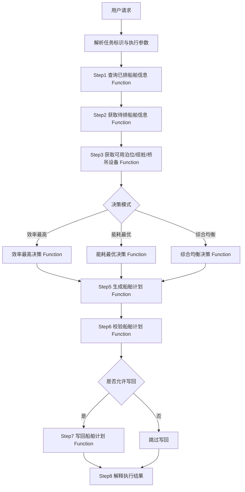

---

# 船舶泊位调度 Function 编排 Skill

## 1. Skill 目标

本 Skill 用于指导 AI Agent 在已经获取到本体对象图谱和 Function 图谱后，按照船舶泊位调度业务流程，顺序调用本体 Function，完成船舶计划生成。

本 Skill 不承载任何代码，不定义具体对象、不定义具体数据源、不定义具体 Function 实现。

所有查询、转换、校验、决策、算法和写回能力均由本体 Function 承载，并通过沙箱执行。

本 Skill 只描述：

```text
流程怎么跑；
Function 按什么顺序调用；
每一步 Function 的输入是什么；
每一步 Function 的输出是什么；
上一步输出如何成为下一步输入；
异常时如何处理。
```

---

## 2. 适用场景

当用户需要执行以下任务时，使用本 Skill：

```text
查询已排船舶信息；
获取待排船舶信息；
获取可用泊位、缆桩、桥吊设备；
按效率最高策略生成计划；
按能耗最优策略生成计划；
按综合均衡策略生成计划；
生成船舶计划；
校验船舶计划；
写回船舶计划；
解释船舶计划生成结果。
```

---

## 3. 核心原则

Agent 必须遵守以下原则：

```text
Skill 只描述流程；
Function 承载执行逻辑；
沙箱运行 Function；
Agent 只负责编排 Function 调用；
上一步 Function 输出必须作为下一步 Function 输入；
禁止跳过 Function 依赖；
禁止手工修改 Function 输出结果。
```

Agent 不允许：

```text
直接实现算法；
直接拼 SQL；
直接访问数据库；
直接修改计划结果；
绕过 Function 校验；
编造缺失数据；
在 Function 失败时声称流程成功。
```

---

## 4. 输入参数

用户请求中至少需要包含：

```text
调度任务标识
```

可选包含：

```text
决策模式：效率最高、能耗最优、综合均衡；
是否写回结果；
是否试运行；
是否返回明细；
是否返回摘要。
```

如果用户未指定决策模式，默认采用：

```text
综合均衡
```

如果用户表达“试运行、只验证、不要写回、不入库”，则不写回结果。

---

## 5. 总体 Function 调用顺序

Agent 必须按照以下顺序执行 Function：

```text
Step1：查询已排船舶信息
Step2：获取待排船舶信息
Step3：获取待排船舶可用泊位、缆桩、桥吊设备
Step4：执行效率最高 / 能耗最优 / 综合均衡决策
Step5：生成船舶计划
Step6：校验船舶计划
Step7：按需写回船舶计划
Step8：解释执行结果
```

其中 Step1 至 Step5 是主流程，Step6 至 Step8 是结果校验、写回和解释流程。

---

# 6. Function 编排流程

## Step1：查询已排船舶信息

### 目标

获取当前调度范围内已经占用泊位、岸线、缆桩或设备的船舶信息。

包括：

```text
已靠泊船舶；
已安排船舶；
固定船舶；
不可调整船舶；
历史计划占用；
会影响本次调度的岸线或设备占用。
```

### 调用 Function

调用语义为：

```text
查询已排船舶信息 Function
```

### 输入

```text
调度任务标识；
调度时间范围；
调度空间范围；
任务参数；
已获取的本体上下文。
```

### 输出

```text
已排船舶集合；
已占用泊位集合；
已占用缆桩集合；
已占用岸线区间；
已占用桥吊设备；
已占用时间窗口；
是否允许调整标识；
固定计划标识；
冲突影响范围。
```

### 输出传递

Step1 的输出必须传递给：

```text
Step3：资源可用性计算；
Step4：调度决策；
Step5：计划生成；
Step6：计划校验。
```

---

## Step2：获取待排船舶信息

### 目标

获取本次任务需要安排或重新安排的船舶集合。

包括：

```text
未安排船舶；
待优化船舶；
需要重新排泊船舶；
任务指定范围内的候选船舶。
```

### 调用 Function

调用语义为：

```text
获取待排船舶信息 Function
```

### 输入

```text
调度任务标识；
任务参数；
调度时间范围；
船舶筛选条件；
已获取的本体上下文。
```

### 输出

```text
待排船舶集合；
船舶基础属性；
船舶作业属性；
预计到港时间；
预计作业时长；
船舶优先级；
船舶约束条件；
是否允许调整标识。
```

### 输出传递

Step2 的输出必须传递给：

```text
Step3：匹配可用泊位、缆桩、桥吊；
Step4：执行调度决策；
Step5：生成船舶计划。
```

如果待排船舶集合为空，Agent 应停止计划生成流程，并说明没有需要排泊的船舶。

---

## Step3：获取待排船舶可用泊位、缆桩、桥吊设备

### 目标

基于已排船舶和待排船舶，计算每条待排船舶可用的资源集合。

资源包括：

```text
可用泊位；
可用岸线；
可用缆桩；
可用桥吊；
桥吊可用时间窗口；
桥吊作业效率；
桥吊能耗指标。
```

### 调用 Function

优先调用语义为：

```text
资源可用性匹配 Function
```

如果 Function 图谱中存在更细粒度 Function，则按以下顺序执行：

```text
泊位可用性计算 Function；
缆桩可用性计算 Function；
岸线区间可用性计算 Function；
桥吊可用性计算 Function；
桥吊维修冲突校验 Function；
桥吊效率计算 Function；
桥吊能耗计算 Function。
```

### 输入

```text
已排船舶集合；
待排船舶集合；
调度任务参数；
资源约束条件；
安全间距要求；
时间窗口要求；
已获取的本体上下文。
```

### 输出

```text
每条待排船舶的可用泊位列表；
每条待排船舶的可用缆桩范围；
每条待排船舶的可用岸线区间；
每条待排船舶的可用桥吊列表；
每组资源的可用时间窗口；
每组资源的效率指标；
每组资源的能耗指标；
资源不可用原因；
资源冲突清单。
```

### 输出传递

Step3 的输出必须传递给：

```text
Step4：效率最高 / 能耗最优决策；
Step5：生成船舶计划；
Step6：计划校验。
```

如果某条待排船舶没有任何可用资源，Agent 必须记录不可排原因，并在最终结果中说明。

---

## Step4：效率最高 / 能耗最优决策执行

### 目标

根据待排船舶、已排船舶和可用资源，选择最优调度方案。

支持三种策略：

```text
效率最高；
能耗最优；
综合均衡。
```

### 调用 Function

根据用户指定或默认决策模式，调用对应决策 Function。

#### 4.1 效率最高模式

调用语义为：

```text
效率最高决策 Function
```

输入：

```text
已排船舶集合；
待排船舶集合；
可用泊位集合；
可用缆桩集合；
可用桥吊集合；
资源效率指标；
作业时间窗口；
约束校验结果。
```

输出：

```text
效率最高候选方案；
推荐方案；
效率评分；
预计完工时间；
吞吐效率；
关键资源瓶颈；
不可排船舶原因。
```

#### 4.2 能耗最优模式

调用语义为：

```text
能耗最优决策 Function
```

输入：

```text
已排船舶集合；
待排船舶集合；
可用泊位集合；
可用缆桩集合；
可用桥吊集合；
资源能耗指标；
作业时间窗口；
约束校验结果。
```

输出：

```text
能耗最优候选方案；
推荐方案；
能耗评分；
预计总能耗；
设备能耗明细；
节能收益；
不可排船舶原因。
```

#### 4.3 综合均衡模式

调用语义为：

```text
综合均衡决策 Function
```

输入：

```text
已排船舶集合；
待排船舶集合；
可用资源集合；
效率指标；
能耗指标；
业务优先级；
约束校验结果。
```

输出：

```text
综合评分候选方案；
推荐方案；
效率评分；
能耗评分；
综合评分；
推荐理由；
主要风险；
不可排船舶原因。
```

### 输出传递

Step4 的输出必须传递给：

```text
Step5：生成船舶计划；
Step6：计划校验；
Step8：结果解释。
```

如果决策 Function 返回无可行方案，Agent 必须停止正式计划生成流程，并说明失败约束和不可排原因。

---

## Step5：生成船舶计划

### 目标

基于 Step4 的推荐方案生成正式船舶计划。

计划应表达：

```text
船舶；
泊位；
起止缆桩；
岸线坐标；
计划开始时间；
计划结束时间；
桥吊分配；
作业效率；
预计能耗；
计划状态；
计划来源；
约束校验状态。
```

### 调用 Function

调用语义为：

```text
生成船舶计划 Function
```

### 输入

```text
调度任务标识；
推荐调度方案；
已排船舶集合；
待排船舶集合；
可用资源集合；
决策模式；
决策评分；
约束校验结果。
```

### 输出

```text
船舶计划结果；
船舶计划明细；
未排船舶清单；
未排原因；
计划摘要；
计划指标；
计划风险；
待写回结果。
```

### 输出传递

Step5 的输出必须传递给：

```text
Step6：计划校验；
Step7：按需写回；
Step8：结果解释。
```

---

## Step6：校验船舶计划

### 目标

对生成的船舶计划执行最终校验，确保计划满足业务约束。

### 调用 Function

根据 Function 图谱中可用能力，依次调用以下语义的校验 Function：

```text
岸线边界校验 Function；
缆桩范围校验 Function；
船舶时空冲突校验 Function；
泊位占用冲突校验 Function；
桥吊可用性校验 Function；
桥吊维修冲突校验 Function；
水深 / 潮汐约束校验 Function；
作业时间窗口校验 Function。
```

### 输入

```text
船舶计划结果；
已排船舶集合；
可用资源集合；
业务约束条件；
调度任务参数。
```

### 输出

```text
校验是否通过；
违规数量；
违规类型；
涉及船舶；
涉及泊位；
涉及缆桩；
涉及桥吊；
涉及时间窗口；
违规原因；
修复建议。
```

### 输出传递

Step6 的输出必须传递给：

```text
Step7：判断是否允许写回；
Step8：解释结果。
```

如果最终校验失败，默认不允许写回正式计划。

---

## Step7：按需写回船舶计划

### 目标

在用户要求写回且计划校验通过时，将船舶计划结果写回业务系统。

### 调用 Function

调用语义为：

```text
写回船舶计划 Function
```

如存在任务结果更新能力，还应调用：

```text
更新调度任务结果 Function
```

### 输入

```text
调度任务标识；
船舶计划结果；
计划校验结果；
写回策略；
执行摘要。
```

### 输出

```text
写回状态；
写回成功数量；
写回失败数量；
失败原因；
任务状态更新结果；
结果标识。
```

### 写回条件

只有同时满足以下条件才允许写回：

```text
用户要求写回；
不是试运行；
船舶计划结果非空；
最终校验通过；
写回 Function 可用。
```

以下情况必须跳过写回：

```text
用户要求试运行；
用户明确不写回；
计划结果为空；
最终校验失败；
生成计划 Function 执行失败。
```

---

## Step8：解释执行结果

### 目标

向用户说明本次船舶计划生成过程、结果和风险。

### 输入

```text
已排船舶查询结果；
待排船舶查询结果；
资源可用性结果；
决策结果；
船舶计划结果；
最终校验结果；
写回结果。
```

### 输出

```text
执行摘要；
每个步骤是否成功；
处理船舶数量；
生成计划数量；
未排船舶数量；
采用的决策模式；
效率指标；
能耗指标；
约束违规情况；
是否写回；
最终结论。
```

---

# 7. Function 调用顺序图



---

# 8. Agent 决策规则

## 8.1 决策模式识别

如果用户表达：

```text
效率最高；
作业最快；
最短完工时间；
提升吞吐效率；
最大化作业效率。
```

则选择：

```text
效率最高决策 Function
```

如果用户表达：

```text
能耗最优；
节能；
最低能耗；
降低设备能耗；
能耗成本最低。
```

则选择：

```text
能耗最优决策 Function
```

如果用户没有指定策略，则选择：

```text
综合均衡决策 Function
```

并在结果解释中说明：

```text
用户未指定优化策略，已采用综合均衡策略。
```

---

## 8.2 写回识别

如果用户表达：

```text
写回；
保存；
入库；
生成正式计划；
更新任务结果。
```

则允许调用写回 Function。

如果用户表达：

```text
试运行；
只看结果；
不要写回；
不入库。
```

则禁止调用写回 Function。

---

## 8.3 校验失败处理

如果船舶计划最终校验失败：

```text
不得默认写回；
必须说明违规原因；
必须说明涉及船舶和资源；
必须说明是否可以重新执行决策。
```

---

## 8.4 无可行解处理

如果决策 Function 返回无可行方案：

```text
不得生成正式计划；
不得写回；
必须说明失败约束；
必须列出不可排船舶及原因。
```

---

# 9. 异常处理

## 9.1 Function 不存在

如果某一步找不到可用 Function，Agent 必须停止该步骤，并说明：

```text
缺失的步骤；
缺失的 Function 能力；
对整体流程的影响。
```

---

## 9.2 Function 执行失败

如果 Function 执行失败，Agent 必须说明：

```text
失败 Function；
所属步骤；
失败原因；
是否中止流程；
是否存在可重试条件。
```

---

## 9.3 输入不足

如果某个 Function 的输入不足，Agent 必须说明：

```text
缺失输入；
上游步骤是否成功；
是否需要重新查询或补充参数。
```

---

## 9.4 结果为空

如果 Function 输出为空，Agent 必须判断：

```text
该结果是否允许为空；
为空是否影响后续步骤；
是否需要终止流程。
```

---

# 10. 最终输出格式

Agent 最终向用户输出时，应包含：

```text
1. 任务标识；
2. 执行状态；
3. 已排船舶数量；
4. 待排船舶数量；
5. 可用泊位、缆桩、桥吊数量；
6. 决策模式；
7. 生成计划数量；
8. 未排船舶数量；
9. 效率指标；
10. 能耗指标；
11. 校验结果；
12. 写回结果；
13. 结论和建议。
```

推荐中文摘要格式：

```text
已完成本次船舶计划生成流程。

执行结果：
- 查询已排船舶信息：成功/失败，数量 x
- 获取待排船舶信息：成功/失败，数量 x
- 获取可用泊位、缆桩、桥吊设备：成功/失败
- 执行决策策略：效率最高/能耗最优/综合均衡
- 生成船舶计划：成功/失败，计划数量 x
- 最终校验：通过/不通过
- 写回状态：成功/失败/跳过

结论：
xxx
```

---

# 11. 禁止事项

Agent 不允许：

```text
在 Skill 中实现 Function 代码；
在 Skill 中实现算法代码；
直接访问数据库；
直接拼 SQL；
绕过 Function；
跳过 Function 依赖；
手工修改 Function 输出；
默认写回失败计划；
默认写回空计划；
编造缺失数据；
在 Function 执行失败时声称成功。
```
