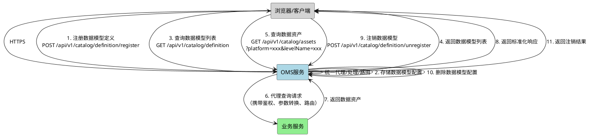
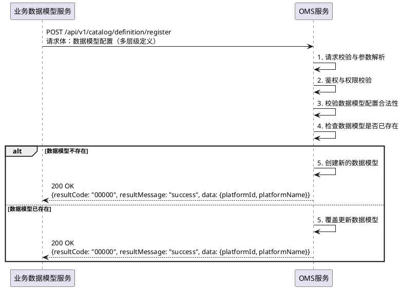
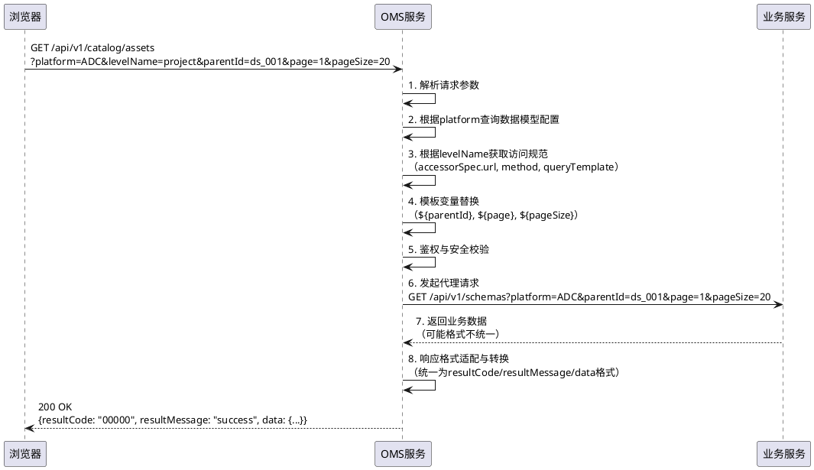
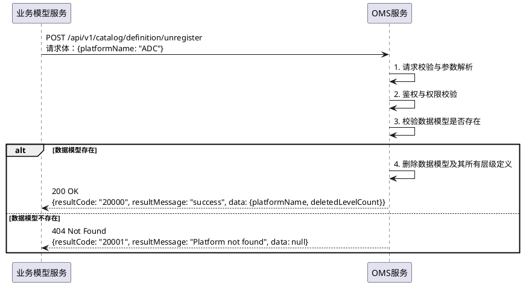

# 数据模型Catalog平台集成 - 对外接口规范 v0.94

> **业务交付文档** - 本文档档为业务方提供数据目录集成指导

---

## 0. 部署说明

### 0.1 CNAI2.0 底座部署说明

本服务部署于 **CNAI2.0** 底座环境。未支持 CNAI2.0 调用的服务，需要通过 **Istio Ingress Gateway** 进行调用。

**网关地址**：
```
https://istio-ingressgateway.{{.Values.global.namespace}}.svc.cluster.local:39090
```

**调用方式**：
- 服务间调用通过网关代理，使用 `https` 协议
- 请求头需要携带认证信息（通过 CNAI2.0 平台统一鉴权）
- 网关会自动进行负载均衡和限流保护


---

## 1. 名词解释与概念定义

### 1.1 数据资产特征

数据资产有以下4种**特征**（Feature），每种特征定义数据的不同方面：

| 特征 | 英文 | 说明 | 示例 |
|------|------|------|------|
| **datasource** | DataSource | 如何连接到数据 | JDBC连接信息、REST接口地址、数据源服务ID |
| **schema** | Schema | 数据目录下的隔离分层 | 项目空间、数据库实例、命名空间 |
| **dataset** | Dataset | 一组字段的集合容器 | 表、Tag、Edge、维度、视图 |
| **field** | Field | 字段或属性 | 列字段、属性、指标、度量 |

### 1.2 数据目录组合规则

> **重要**：数据目录由业务方根据实际需求，将4个特征**灵活组合**形成层级结构。

**支持的组合模式**：

```
模式1（最简组合）：datasource → dataset → field
模式2（标准组合）：datasource → schema → dataset → field  
模式3（多层隔离）：datasource → schema → schema → dataset → field
```

**组合示例**：

| 组合模式 | 层级结构 | 适用场景 |
|----------|----------|----------|
| 模式1 | ADCDataModel → Table → Column | 简单数据源，无需项目隔离 |
| 模式2 | ADCDataModel → Project → Table → Column | 需要项目隔离的标准场景 |
| 模式3 | ADCDataModel → Domain → Project → Table → Column | 多层隔离的大型平台 |

### 1.3 核心概念

| 概念 | 英文 | 说明 |
|------|------|------|
| **数据目录** | Catalog | 元数据的统一存储容器，提供数据资产的统一访问入口 |
| **数据模型** | Data Model | 由多个特征组合而成的完整数据结构定义 |
| **数据模型定义** | Data Model Definition | 注册到Catalog的完整数据模型配置 |
| **层级定义** | Level Definition | 数据模型中某一层的定义（包含特征类型和访问规范） |

---

## 2. 端到端流程图

### 2.1 整体架构图



### 2.2 注册数据模型流程



### 2.3 查询数据资产流程（OMS统一代理）



### 2.4 注销数据模型流程



---

## 3. OMS服务内部能力

### 3.1 统一代理能力

OMS服务作为统一代理层，提供以下能力：

| 能力 | 说明 |
|------|------|
| **请求路由** | 根据数据模型配置，将请求路由到对应的业务服务 |
| **参数转换** | 将标准化请求参数转换为业务服务需要的格式 |
| **模板替换** | 支持${parentId}、${page}、${pageSize}等变量替换 |
| **响应适配** | 将业务服务的各种响应格式统一转换为标准格式 |
| **鉴权校验** | 对所有请求进行统一鉴权和安全校验 |
| **限流保护** | 对外部服务调用进行限流保护 |
| **错误处理** | 统一处理外部服务异常，返回标准化错误信息 |

### 3.2 数据模型配置管理

| 能力 | 说明 |
|------|------|
| **注册管理** | 支持新增和覆盖式注册数据模型 |
| **配置存储** | 持久化存储数据模型配置 |
| **层级关系** | 维护层级之间的父子关系 |

---

## 4. 接口总览

### 4.1 OMS服务提供的接口

| 接口名称 | 方法 | 路径 | 功能 |
|----------|------|------|------|
| **注册数据模型** | POST | `/api/v1/catalog/definition/register` | 注册或更新数据模型定义 |
| **注销数据模型** | POST | `/api/v1/catalog/definition/unregister` | 注销已注册的数据模型 |
| **查询数据模型列表** | GET | `/api/v1/catalog/definition` | 获取所有已注册数据模型 |
| **查询数据模型详情** | GET | `/api/v1/catalog/definition?platform=xxx` | 获取指定数据模型详情 |
| **查询数据资产** | GET | `/api/v1/catalog/assets` | 通过OMS代理查询数据资产 |
| **查询对象类型绑定信息** | GET | `/api/v1/ontologies/{ontologyId}/object-types/{objectTypeId}/bindings/query` | 查询对象类型的数据模型绑定详情 |
| **查询关系类型绑定信息** | GET | `/api/v1/ontologies/{ontologyId}/relation-types/{relationTypeId}/bindings/query` | 查询关系类型的数据模型绑定详情 |

### 4.2 业务服务提供的接口（按本规范实现）

| 接口名称 | 方法 | 路径 | 功能 |
|----------|------|------|------|
| **查询数据源** | GET | `/api/v1/datasources` | 查询datasource层级数据 |
| **查询通用容器** | GET | `/api/v1/schemas` | 查询schema层级数据 |
| **查询数据集** | GET | `/api/v1/datasets` | 查询dataset层级数据 |
| **查询字段** | GET | `/api/v1/fields` | 查询field层级数据 |
| **搜索数据资产** | GET | `/api/v1/assets/search` | 跨层级搜索数据资产 |
| **查询数据资产详情** | GET | `/api/v1/assets/{assetId}` | 获取指定资产详情 |

---

## 5. OMS服务接口详情

### 5.1 注册数据模型

**接口**: `POST /api/v1/catalog/definition/register`

**功能**: 注册或更新数据模型定义。采用覆盖式注册，已存在则自动更新。

**请求体**:
```json
{
  "platformName": "ADC",
  "display": {
    "zh": "ADC数据平台",
    "en": "ADC Data Platform"
  },
  "levelDefinitions": [
    {
      "name": "ADCDataModel",
      "display": {"zh": "ADC数据模型", "en": "ADC Data Model"},
      "assetType": "datasource",
      "possibleChildDefines": ["project"],
      "accessorSpec": {
        "type": "DEFAULT",
        "defaults": []
      }
    },
    {
      "name": "project",
      "display": {"zh": "项目", "en": "Project"},
      "assetType": "schema",
      "possibleChildDefines": ["module"],
      "accessorSpec": {
        "type": "REST",
        "url": "http://biz-service:8080/api/v1/schemas",
        "method": "GET",
        "queryTemplate": "platform=ADC&parentId=${parentId}&page=${page}&pageSize=${pageSize}",
        "responseFormat": "data.schemas"
      }
    },
    {
      "name": "module",
      "display": {"zh": "模块", "en": "Module"},
      "assetType": "schema",
      "possibleChildDefines": ["table"],
      "accessorSpec": {
        "type": "REST",
        "url": "http://biz-service:8080/api/v1/schemas",
        "method": "GET",
        "queryTemplate": "platform=ADC&parentId=${parentId}&page=${page}&pageSize=${pageSize}",
        "responseFormat": "data.schemas"
      }
    },
    {
      "name": "table",
      "display": {"zh": "表", "en": "Table"},
      "assetType": "dataset",
      "possibleChildDefines": ["column"],
      "accessorSpec": {
        "type": "REST",
        "url": "http://biz-service:8080/api/v1/datasets",
        "method": "GET",
        "queryTemplate": "platform=ADC&parentId=${parentId}&page=${page}&pageSize=${pageSize}",
        "responseFormat": "data.datasets"
      }
    },
    {
      "name": "column",
      "display": {"zh": "列", "en": "Column"},
      "assetType": "field",
      "possibleChildDefines": [],
      "accessorSpec": {
        "type": "REST",
        "url": "http://biz-service:8080/api/v1/fields",
        "method": "GET",
        "queryTemplate": "platform=ADC&parentId=${parentId}&page=${page}&pageSize=${pageSize}",
        "responseFormat": "data.fields"
      }
    }
  ]
}
```

**请求参数说明**:

| 参数名 | 类型 | 必填 | 说明 |
|--------|------|------|------|
| platformName | string | 是 | 数据模型唯一标识（建议使用英文、数字、下划线） |
| display | object | 否 | 显示名称（支持多语言） |
| display.zh | string | 否 | 中文显示名 |
| display.en | string | 否 | 英文显示名 |
| levelDefinitions | array | 是 | 层级定义数组，定义数据模型的完整层级结构 |

**LevelDefinition参数说明**:

| 参数名 | 类型 | 必填 | 说明 |
|--------|------|------|------|
| name | string | 是 | 层级名称（数据模型内唯一） |
| display | object | 否 | 显示名称 |
| assetType | string | 是 | 资产特征类型：`datasource` / `schema` / `dataset` / `field` |
| possibleChildDefines | array | 否 | 可能的下级层级名称列表 |
| accessorSpec | object | 否 | 访问规范，定义业务服务接口地址 |

**AccessorSpec参数说明**:

| 参数名 | 类型 | 必填 | 说明 |
|--------|------|------|------|
| type | string | 是 | 访问器类型：`DEFAULT` / `REST` / `CLASS` |
| url | string | 否 | REST类型必填，业务服务接口地址 |
| method | string | 否 | HTTP方法：`GET` / `POST` |
| queryTemplate | string | 否 | GET请求的查询参数模板 |
| bodyTemplate | string | 否 | POST请求的请求体模板 |
| responseFormat | string | 否 | 响应格式：data.xxx |
| timeout | int | 否 | 超时时间（毫秒），默认30000 |
| defaults | array | 否 | DEFAULT类型返回的默认数据 |
| resolver | string | 否 | CLASS类型对应的Spring Bean名称 |

**响应**:
```json
{
  "resultCode": "20000",
  "resultMessage": "success",
  "data": {
    "platformId": "dtmi.adc.xxx.v1",
    "platformName": "ADC",
    "levelCount": 5,
    "levelNames": ["ADCDataModel", "project", "module", "table", "column"]
  }
}
```

**响应参数说明**:

| 参数名 | 类型 | 说明 |
|--------|------|------|
| resultCode | string | 状态码，20000表示成功 |
| resultMessage | string | 状态信息 |
| data.platformId | string | 数据模型ID（DTMI格式） |
| data.platformName | string | 数据模型名称 |
| data.levelCount | int | 层级数量 |
| data.levelNames | array | 层级名称列表 |

---

### 5.2 注销数据模型

**接口**: `POST /api/v1/catalog/definition/unregister`

**功能**: 注销已注册的数据模型，删除该数据模型的所有层级定义

**请求体**:
```json
{
  "platformName": "ADC"
}
```

**请求参数说明**:

| 参数名 | 类型 | 必填 | 说明 |
|--------|------|------|------|
| platformName | string | 是 | 要注销的数据模型名称 |

**响应**:
```json
{
  "resultCode": "20000",
  "resultMessage": "success",
  "data": {
    "platformName": "ADC",
    "deletedLevelCount": 5
  }
}
```

**响应参数说明**:

| 参数名 | 类型 | 说明 |
|--------|------|------|
| resultCode | string | 状态码 |
| resultMessage | string | 状态信息 |
| data.platformName | string | 被注销的数据模型名称 |
| data.deletedLevelCount | int | 被删除的层级数量 |

---

### 5.3 查询数据模型列表

**接口**: `GET /api/v1/catalog/definition`

**功能**: 获取所有已注册的数据模型列表

**响应**:
```json
{
  "resultCode": "20000",
  "resultMessage": "success",
  "data": [
    {
      "platformId": "dtmi.adc.xxx.v1",
      "platformName": "ADC",
      "display": {
        "zh": "ADC数据平台",
        "en": "ADC Data Platform"
      },
      "levelCount": 5,
      "levelNames": ["ADCDataModel", "project", "module", "table", "column"],
      "createTime": "2026-07-06T10:00:00Z",
      "updateTime": "2026-07-06T10:00:00Z"
    },
    {
      "platformId": "dtmi.ams.xxx.v1",
      "platformName": "AMS",
      "display": {
        "zh": "AMS数据平台",
        "en": "AMS Data Platform"
      },
      "levelCount": 4,
      "levelNames": ["AMSDataModel", "domain", "dataset", "field"],
      "createTime": "2026-07-05T10:00:00Z",
      "updateTime": "2026-07-06T10:00:00Z"
    }
  ]
}
```

**响应参数说明**:

| 参数名 | 类型 | 说明 |
|--------|------|------|
| resultCode | string | 状态码 |
| resultMessage | string | 状态信息 |
| data | array | 数据模型列表 |
| data[].platformId | string | 数据模型ID |
| data[].platformName | string | 数据模型名称 |
| data[].display | object | 显示名称 |
| data[].display.zh | string | 中文显示名 |
| data[].display.en | string | 英文显示名 |
| data[].levelCount | int | 层级数量 |
| data[].levelNames | array | 层级名称列表 |
| data[].createTime | string | 创建时间 |
| data[].updateTime | string | 更新时间 |

---

### 5.4 查询数据模型详情

**接口**: `GET /api/v1/catalog/definition?platform=xxx`

**功能**: 获取指定数据模型的详细配置信息

**请求参数说明**:

| 参数名 | 类型 | 必填 | 说明 |
|--------|------|------|------|
| platform | string | 是 | 数据模型名称 |

**响应**:
```json
{
  "resultCode": "20000",
  "resultMessage": "success",
  "data": {
    "platformId": "dtmi.adc.xxx.v1",
    "platformName": "ADC",
    "display": {
      "zh": "ADC数据平台",
      "en": "ADC Data Platform"
    },
    "levelDefinitions": [
      {
        "id": "level_001",
        "name": "ADCDataModel",
        "display": {"zh": "ADC数据模型", "en": "ADC Data Model"},
        "assetType": "datasource",
        "possibleChildDefines": ["project"],
        "accessorSpec": {
          "type": "DEFAULT"
        }
      },
      {
        "id": "level_002",
        "name": "project",
        "display": {"zh": "项目", "en": "Project"},
        "assetType": "schema",
        "possibleChildDefines": ["module"],
        "accessorSpec": {
          "type": "REST",
          "url": "http://biz-service:8080/api/v1/schemas",
          "method": "GET",
          "queryTemplate": "platform=ADC&parentId=${parentId}&page=${page}&pageSize=${pageSize}",
          "responseFormat": "data.schemas"
        }
      }
    ],
    "createTime": "2026-07-06T10:00:00Z",
    "updateTime": "2026-07-06T10:00:00Z"
  }
}
```

---

### 5.5 查询数据资产（OMS统一代理）

**接口**: `GET /api/v1/catalog/assets`

**功能**: 通过OMS代理查询业务服务的数据资产

**请求参数说明**:

| 参数名 | 类型 | 必填 | 说明 |
|--------|------|------|------|
| platform | string | 是 | 数据模型名称 |
| levelName | string | 是 | 层级名称（如 project、table、column） |
| parentId | string | 是 | 父节点ID（顶级查询时传数据源的assetId） |
| page | int | 否 | 页码（默认1） |
| pageSize | int | 否 | 每页条数（默认20，最大100） |

**响应**:
```json
{
  "resultCode": "20000",
  "resultMessage": "success",
  "data": {
    "pages": 10,
    "total": 200,
    "current": 1,
    "pageSize": 20,
    "assets": [
      {
        "assetId": "schema_001",
        "name": "sales_project",
        "displayName": "销售项目",
        "assetType": "schema",
        "parentId": "ds_001",
        "platform": "ADC",
        "levelName": "project",
        "description": "销售业务项目"
      }
    ]
  }
}
```

**响应参数说明**:

| 参数名 | 类型 | 说明 |
|--------|------|------|
| resultCode | string | 状态码 |
| resultMessage | string | 状态信息 |
| data.pages | long | 总页数 |
| data.total | long | 总记录数 |
| data.current | long | 当前页码 |
| data.pageSize | long | 每页条数 |
| data.assets | array | 数据资产列表 |

---

### 5.6 查询对象类型绑定信息

**接口**: `GET /api/v1/ontologies/{ontologyId}/object-types/{objectTypeId}/bindings/query`

**功能**: 查询指定对象类型的数据模型绑定详情，包括属性绑定信息和目录上下文（数据源、Schema、数据集、字段）

**请求参数说明**:

| 参数名 | 类型 | 必填 | 说明 |
|--------|------|------|------|
| ontologyId | string | 是 | 本体ID |
| objectTypeId | string | 是 | 对象类型ID |

**响应**:
```json
{
  "resultCode": "20000",
  "resultMessage": "success",
  "data": {
    "objectTypeContext": {
      "objectTypeId": "obj_001",
      "name": "OrderObject",
      "description": "订单对象",
      "primaryKeys": ["order_id"],
      "bindings": null
    },
    "propertyBindings": [
      {
        "propertyId": "prop_001",
        "propertyName": "order_id",
        "dataType": "BIGINT",
        "bindings": [
          {
            "bindingId": "bind_001",
            "assetId": "field_001",
            "groupId": null,
            "assetIds": null,
            "expression": null,
            "joinKeys": null,
            "timeseriesFieldId": null,
            "extendAttribute": {}
          }
        ]
      }
    ],
    "catalogContext": {
      "dataSources": [
        {
          "id": "ds_001",
          "name": "mysql_prod",
          "displayName": "MySQL生产集群",
          "datasourceType": "MYSQL",
          "connectionConfig": {},
          "description": "MySQL生产环境数据源"
        }
      ],
      "schemas": [
        {
          "id": "schema_001",
          "name": "sales_db",
          "displayName": "销售数据库",
          "datasourceId": "ds_001",
          "description": "销售业务数据库"
        }
      ],
      "datasets": [
        {
          "id": "ds_table_001",
          "name": "t_orders",
          "displayName": "订单表",
          "schemaId": "schema_001",
          "storageType": "Table",
          "description": "订单主表"
        }
      ],
      "fields": [
        {
          "id": "field_001",
          "name": "order_id",
          "displayName": "订单ID",
          "datasetId": "ds_table_001",
          "dataType": "BIGINT",
          "description": "订单唯一标识"
        }
      ]
    }
  }
}
```

**响应参数说明**:

| 参数名 | 类型 | 说明 |
|--------|------|------|
| resultCode | string | 状态码，20000表示成功 |
| resultMessage | string | 状态信息 |
| data.objectTypeContext | object | 对象类型上下文 |
| data.objectTypeContext.objectTypeId | string | 对象类型ID，本体中唯一标识 |
| data.objectTypeContext.name | string | 对象类型名称，英文标识 |
| data.objectTypeContext.description | string | 对象类型描述信息 |
| data.objectTypeContext.primaryKeys | array | 主键字段名称列表，如 ["order_id", "tenant_id"] |
| data.objectTypeContext.bindings | array | 对象直接绑定信息（预留，暂为null） |
| data.propertyBindings | array | 属性绑定列表，每个属性一行绑定信息 |
| data.propertyBindings[].propertyId | string | 属性ID，本体中唯一标识 |
| data.propertyBindings[].propertyName | string | 属性名称，英文标识 |
| data.propertyBindings[].dataType | string | 数据类型：STRING/INT/BIGINT/DOUBLE/BOOLEAN/TIMESTAMP/STRUCT 等 |
| data.propertyBindings[].bindings | array | 绑定信息列表，无绑定时为 null 或空列表 |
| data.propertyBindings[].bindings[].bindingId | string | 绑定记录ID，唯一标识一次绑定关系 |
| data.propertyBindings[].bindings[].assetId | string | 数据资产ID（一对一绑定时使用） |
| data.propertyBindings[].bindings[].groupId | string | 分组ID，用于区分同一属性的多绑定场景 |
| data.propertyBindings[].bindings[].assetIds | array | 数据资产ID列表（一对多绑定时使用） |
| data.propertyBindings[].bindings[].expression | string | 绑定表达式，支持简单 UDF 计算（如拼接、转换） |
| data.propertyBindings[].bindings[].joinKeys | string | Join 关联键，用于多表关联场景 |
| data.propertyBindings[].bindings[].timeseriesFieldId | string | 时序字段ID，时序属性专用 |
| data.propertyBindings[].bindings[].extendAttribute | object | 扩展属性，键值对形式存储额外信息 |
| data.catalogContext | object | 目录上下文，包含查询链路涉及的所有数据资产 |
| data.catalogContext.dataSources | array | 数据源列表，去重后的数据源集合 |
| data.catalogContext.schemas | array | Schema列表，数据库/命名空间等 |
| data.catalogContext.datasets | array | 数据集列表，表/视图/Tag 等 |
| data.catalogContext.fields | array | 字段列表，列/属性/指标等 |

**CatalogContext 详细字段说明**:

#### DataSource（数据源）

| 字段 | 类型 | 说明 | 示例 |
|------|------|------|------|
| id | string | 数据源唯一键 | "ds_001" |
| parentAssetId | string | 父资产ID（顶级数据源无父资产） | null |
| displayName | string | 显示名称（支持多语言） | "MySQL生产集群" |
| connectionConfig | object | 连接配置，包含连接类型和连接信息 | 见下方 ConnectionConfig |

**ConnectionConfig 连接配置**：

| 字段 | 类型 | 说明 | 示例 |
|------|------|------|------|
| connectionType | string | 连接类型：DataCube / ADCDataModel | "DataCube" |

- **DataCube 类型**：关联数据中台数据源
  ```json
  {
    "connectionType": "DataCube",
    "name": "数据中台数据源名称",
    "datasourceId": "datasourc_xxx",
    "datasourceType": "MYSQL",
    "modelType": "物理"
  }
  ```
- **ADCDataModel 类型**：ADC数据模型（暂无额外字段）

#### Schema（数据架构）

| 字段 | 类型 | 说明 | 示例 |
|------|------|------|------|
| id | string | Schema唯一键 | "schema_001" |
| parentAssetId | string | 父资产ID，指向所属数据源 | "ds_001" |
| name | string | Schema名称 | "sales_db" |

#### Dataset（数据集）

| 字段 | 类型 | 说明 | 示例 |
|------|------|------|------|
| id | string | Dataset唯一键 | "ds_table_001" |
| parentAssetId | string | 父资产ID，指向所属Schema | "schema_001" |
| name | string | Dataset名称 | "t_orders" |
| storageType | string | 存储类型：Table / View / Tag / Edge / Dimension | "Table" |
| primaryKeys | string | 主键字段，JSON数组格式字符串 | "[\"order_id\",\"tenant_id\"]" |
| extendAttribute | object | 扩展属性 | {"owner": "admin", "retentionDays": 30} |

#### Field（字段）

| 字段 | 类型 | 说明 | 示例 |
|------|------|------|------|
| id | string | Field唯一键 | "field_001" |
| parentAssetId | string | 父资产ID，指向所属Dataset | "ds_table_001" |
| name | string | 字段名称 | "order_id" |
| description | string | 字段描述 | "订单唯一标识" |
| dataType | string | 数据类型：STRING/INT/BIGINT/DOUBLE/DECIMAL/TIMESTAMP/BOOLEAN | "BIGINT" |
| sortOrder | string | 排序顺序 | "1" |
| semanticRole | string | 语义角色：DIMENSION / MEASURE / TIMESTAMP | "DIMENSION" |
| technicalType | string | 技术类型：VARCHAR / INT / BIGINT / TEXT 等 | "BIGINT" |
| cubeContext | object | Cube上下文，多维模型专用 | 见下方 CubeContext |
| timeSeriesInfo | object | 时序信息，时序数据专用 | 见下方 TimeSeriesInfo |
| extendAttribute | object | 扩展属性 | {"nullable": true} |

**CubeContext 多维上下文**：

| 字段 | 类型 | 说明 | 示例 |
|------|------|------|------|
| attributeId | string | 属性ID | "attr_001" |
| type | string | 类型 | "DIMENSION" |
| name | string | 名称 | "product_category" |
| levelId | string | 层级ID | "level_001" |
| levelName | string | 层级名称 | "产品分类" |

**TimeSeriesInfo 时序信息**：

| 字段 | 类型 | 说明 | 示例 |
|------|------|------|------|
| timeRole | string | 时间角色：TIMESTAMP / START_TIME / END_TIME | "TIMESTAMP" |
| format | string | 时间格式 | "yyyy-MM-dd HH:mm:ss" |
| timeValueType | string | 时间值类型 | "LONG" |
| interval | string | 时间间隔 | "1d" |

---

### 5.7 查询关系类型绑定信息

**接口**: `GET /api/v1/ontologies/{ontologyId}/relation-types/{relationTypeId}/bindings/query`

**功能**: 查询指定关系类型的数据模型绑定详情，包括关系上下文、属性绑定信息和目录上下文

**请求参数说明**:

| 参数名 | 类型 | 必填 | 说明 |
|--------|------|------|------|
| ontologyId | string | 是 | 本体ID |
| relationTypeId | string | 是 | 关系类型ID（支持ID或名称精确匹配） |

**响应**:
```json
{
  "resultCode": "20000",
  "resultMessage": "success",
  "data": {
    "relationshipContext": {
      "relationTypeId": "rel_001",
      "name": "order_has_product",
      "description": "订单关联产品",
      "sourceObjectTypeId": "obj_order",
      "targetObjectTypeId": "obj_product",
      "connectionType": "OBJECT_TO_OBJECT",
      "junctionDatasetId": "ds_junction",
      "backingObjectTypeId": "obj_junction",
      "junctionConfig": "{}",
      "relationProperties": "[]",
      "junctionDatasetName": "t_order_product"
    },
    "propertyBindings": [
      {
        "propertyId": "prop_junc_001",
        "propertyName": "quantity",
        "dataType": "INT",
        "bindings": [
          {
            "bindingId": "bind_002",
            "assetId": "field_qty",
            "groupId": null,
            "assetIds": null,
            "expression": null,
            "joinKeys": null,
            "timeseriesFieldId": null,
            "extendAttribute": {}
          }
        ]
      }
    ],
    "catalogContext": {
      "dataSources": [
        {
          "id": "ds_001",
          "name": "mysql_prod",
          "displayName": "MySQL生产集群",
          "datasourceType": "MYSQL",
          "connectionConfig": {},
          "description": "MySQL生产环境数据源"
        }
      ],
      "schemas": [
        {
          "id": "schema_001",
          "name": "sales_db",
          "displayName": "销售数据库",
          "datasourceId": "ds_001",
          "description": "销售业务数据库"
        }
      ],
      "datasets": [
        {
          "id": "ds_junction",
          "name": "t_order_product",
          "displayName": "订单产品关联表",
          "schemaId": "schema_001",
          "storageType": "Table",
          "description": "订单与产品的关联表"
        }
      ],
      "fields": [
        {
          "id": "field_qty",
          "name": "quantity",
          "displayName": "数量",
          "datasetId": "ds_junction",
          "dataType": "INT",
          "description": "订购数量"
        }
      ]
    }
  }
}
```

**响应参数说明**:

| 参数名 | 类型 | 说明 |
|--------|------|------|
| resultCode | string | 状态码 |
| resultMessage | string | 状态信息 |
| data.relationshipContext | object | 关系上下文 |
| data.relationshipContext.relationTypeId | string | 关系类型ID |
| data.relationshipContext.name | string | 关系名称 |
| data.relationshipContext.description | string | 关系描述 |
| data.relationshipContext.sourceObjectTypeId | string | 源对象类型ID |
| data.relationshipContext.targetObjectTypeId | string | 目标对象类型ID |
| data.relationshipContext.connectionType | string | 连接类型（OBJECT_TO_OBJECT/PROPERTY_TO_PROPERTY） |
| data.relationshipContext.junctionDatasetId | string | 关联数据集ID |
| data.relationshipContext.backingObjectTypeId | string | 支撑对象类型ID |
| data.relationshipContext.junctionConfig | string | 关联配置 |
| data.relationshipContext.relationProperties | string | 关系属性配置 |
| data.relationshipContext.junctionDatasetName | string | 关联数据集名称 |
| data.propertyBindings | array | 属性绑定列表（同5.6） |
| data.catalogContext | object | 目录上下文（同5.6） |

---

## 6. 业务服务接口规范

> **重要**：本节定义的接口由**业务服务方按照本规范实现**，OMS服务通过代理方式统一访问。
> **说明**：业务数据资产查询接口统一入参 `AccessContext` 作为请求体传入，支持灵活指定查询层级、祖先路径、关键词搜索和分页。

**请求体** (AccessContext):

```json
{
  "parentDefineId": "level_table",
  "ancestors": [
    {
      "id": "ds_001",
      "name": "mysql_prod",
      "nodeType": "DATASOURCE"
    },
    {
      "id": "schema_001",
      "name": "sales_db",
      "nodeType": "SCHEMA"
    }
  ],
  "parentAsset": {
    "id": "schema_001",
    "name": "sales_db",
    "nodeType": "SCHEMA"
  },
  "keyword": "order",
  "page": 1,
  "pageSize": 20
}
```

**请求参数说明** (AccessContext):

| 参数名 | 类型 | 必填 | 说明 |
|--------|------|------|------|
| parentDefineId | string | 是 | 父层级定义ID（要查询的层级ID） |
| ancestors | array | 否 | 祖先节点列表，从根到当前父节点的完整链路 |
| ancestors[].id | string | 是 | 资产ID |
| ancestors[].name | string | 是 | 资产名称 |
| ancestors[].nodeType | string | 是 | 节点类型：DATASOURCE / SCHEMA / DATASET / FIELD |
| parentAsset | object | 否 | 当前层级的直接父资产（等于 ancestors 最后一个元素） |
| parentAsset.id | string | 是 | 父资产ID |
| parentAsset.name | string | 是 | 父资产名称 |
| parentAsset.nodeType | string | 是 | 父资产节点类型 |
| keyword | string | 否 | 关键词搜索（仅支持当前层级过滤，不跨层级） |
| page | int | 否 | 页码（默认1） |
| pageSize | int | 否 | 每页条数（默认20，最大100） |

### 6.1 查询数据源

**接口**: `GET /api/v1/datasources`

**功能**: 查询datasource层级的数据源列表

**请求参数说明**:

| 参数名 | 类型 | 必填 | 说明 |
|--------|------|------|------|
| platform | string | 是 | 数据模型名称（与注册时一致） |
| page | int | 否 | 页码（默认1） |
| pageSize | int | 否 | 每页条数（默认20，最大100） |

**响应**:
```json
{
  "resultCode": "20000",
  "resultMessage": "success",
  "data": {
    "pages": 5,
    "total": 100,
    "current": 1,
    "pageSize": 20,
    "datasources": [
      {
        "assetId": "ds_001",
        "name": "mysql_prod",
        "displayName": "MySQL生产集群",
        "assetType": "datasource",
        "platform": "ADC",
        "levelName": "ADCDataModel",
        "description": "MySQL生产环境数据源",
        "extendAttribute": "{\"jdbcUrl\":\"jdbc:mysql://host:3306\"}"
      }
    ]
  }
}
```

**Datasource字段说明**:

| 参数名 | 类型 | 说明 |
|--------|------|------|
| assetId | string | 数据源ID |
| name | string | 数据源名称 |
| displayName | string | 显示名称 |
| assetType | string | 固定为 "datasource" |
| platform | string | 所属数据模型 |
| levelName | string | 层级名称 |
| description | string | 描述信息 |
| extendAttribute | string | 扩展属性（JSON格式，如连接信息） |

---

### 6.2 查询通用容器

**接口**: `GET /api/v1/schemas`

**功能**: 查询schema层级的通用容器列表（用于数据目录隔离分层）

**请求参数说明**:

| 参数名 | 类型 | 必填 | 说明 |
|--------|------|------|------|
| platform | string | 是 | 数据模型名称 |
| parentId | string | 是 | 父节点ID（顶级传数据源的assetId） |
| page | int | 否 | 页码（默认1） |
| pageSize | int | 否 | 每页条数（默认20，最大100） |

**响应**:
```json
{
  "resultCode": "20000",
  "resultMessage": "success",
  "data": {
    "pages": 10,
    "total": 200,
    "current": 1,
    "pageSize": 20,
    "schemas": [
      {
        "assetId": "schema_001",
        "name": "sales_project",
        "displayName": "销售项目",
        "assetType": "schema",
        "parentId": "ds_001",
        "platform": "ADC",
        "levelName": "project",
        "description": "销售业务项目"
      }
    ]
  }
}
```

**Schema字段说明**:

| 参数名 | 类型 | 说明 |
|--------|------|------|
| assetId | string | 容器ID |
| name | string | 容器名称 |
| displayName | string | 显示名称 |
| assetType | string | 固定为 "schema" |
| parentId | string | 父节点ID |
| platform | string | 所属数据模型 |
| levelName | string | 层级名称（如 project、domain） |
| description | string | 描述信息 |

---

### 6.3 查询数据集

**接口**: `GET /api/v1/datasets`

**功能**: 查询dataset层级的数据集列表（一组字段的集合容器）

**请求参数说明**:

| 参数名 | 类型 | 必填 | 说明 |
|--------|------|------|------|
| platform | string | 是 | 数据模型名称 |
| parentId | string | 是 | 父节点ID（schema层级的assetId） |
| page | int | 否 | 页码（默认1） |
| pageSize | int | 否 | 每页条数（默认20，最大100） |

**响应**:
```json
{
  "resultCode": "20000",
  "resultMessage": "success",
  "data": {
    "pages": 50,
    "total": 1000,
    "current": 1,
    "pageSize": 20,
    "datasets": [
      {
        "assetId": "ds_table_001",
        "name": "t_orders",
        "displayName": "订单表",
        "assetType": "dataset",
        "parentId": "schema_001",
        "platform": "ADC",
        "levelName": "table",
        "datasetType": "Table",
        "description": "订单主表",
        "extendAttribute": "{\"owner\":\"admin\",\"retentionDays\":30}"
      }
    ]
  }
}
```

**Dataset字段说明**:

| 参数名 | 类型 | 说明 |
|--------|------|------|
| assetId | string | 数据集ID |
| name | string | 数据集名称 |
| displayName | string | 显示名称 |
| assetType | string | 固定为 "dataset" |
| parentId | string | 父节点ID |
| platform | string | 所属数据模型 |
| levelName | string | 层级名称（如 table、tag、edge） |
| datasetType | string | 数据集类型：Table、Tag、Edge、View等 |
| description | string | 描述信息 |
| extendAttribute | string | 扩展属性（JSON格式） |

---

### 6.4 查询字段

**接口**: `GET /api/v1/fields`

**功能**: 查询field层级的字段列表

**请求参数说明**:

| 参数名 | 类型 | 必填 | 说明 |
|--------|------|------|------|
| platform | string | 是 | 数据模型名称 |
| parentId | string | 是 | 父节点ID（dataset层级的assetId） |
| page | int | 否 | 页码（默认1） |
| pageSize | int | 否 | 每页条数（默认20，最大100） |

**响应**:
```json
{
  "resultCode": "20000",
  "resultMessage": "success",
  "data": {
    "pages": 1,
    "total": 15,
    "current": 1,
    "pageSize": 20,
    "fields": [
      {
        "assetId": "fld_001",
        "name": "order_id",
        "displayName": "订单ID",
        "assetType": "field",
        "parentId": "ds_table_001",
        "platform": "ADC",
        "levelName": "column",
        "dataType": "BIGINT",
        "description": "订单唯一标识",
        "isPrimaryKey": true,
        "isNullable": false
      }
    ]
  }
}
```

**Field字段说明**:

| 参数名 | 类型 | 说明 |
|--------|------|------|
| assetId | string | 字段ID |
| name | string | 字段名称 |
| displayName | string | 显示名称 |
| assetType | string | 固定为 "field" |
| parentId | string | 父节点ID |
| platform | string | 所属数据模型 |
| levelName | string | 层级名称（如 column、property） |
| dataType | string | 数据类型：INT、BIGINT、VARCHAR、TIMESTAMP等 |
| description | string | 描述信息 |
| isPrimaryKey | boolean | 是否为主键 |
| isNullable | boolean | 是否可为空 |

---

## 7. 模板变量说明

### 7.1 支持的变量

| 变量 | 类型 | 说明 | 示例 |
|------|------|------|------|
| `${parentId}` | String | 父节点ID | `parentId=${parentId}` |
| `${ancestor0Id}` | String | 第1层祖先节点ID | `projectId=${ancestor0Id}` |
| `${ancestor1Id}` | String | 第2层祖先节点ID | `domainId=${ancestor1Id}` |
| `${ancestor2Id}` | String | 第3层祖先节点ID | `moduleId=${ancestor2Id}` |
| `${page}` | Integer | 页码（无引号） | `page=${page}` |
| `${pageSize}` | Integer | 每页条数（无引号） | `pageSize=${pageSize}` |
| `${keyword}` | String | 搜索关键字（有引号） | `keyword="${keyword}"` |

### 7.2 Ancestor索引规则

| 查询层级 | `${parentId}` | `${ancestor0Id}` | `${ancestor1Id}` | `${ancestor2Id}` |
|---------|---------------|------------------|------------------|------------------|
| 第1层(顶级) | root ID | root ID | - | - |
| 第2层 | 第1层ID | 第1层ID | - | - |
| 第3层 | 第2层ID | 第1层ID | 第2层ID | - |
| 第4层 | 第3层ID | 第1层ID | 第2层ID | 第3层ID |
| 第5层 | 第4层ID | 第1层ID | 第2层ID | 第3层ID |

---

## 8. 错误码规范

### 8.1 统一响应格式

所有接口统一使用以下响应格式：

```json
{
  "resultCode": "20000",
  "resultMessage": "success",
  "data": {}
}
```

| 字段 | 类型 | 说明 |
|------|------|------|
| resultCode | string | 状态码，5位数字字符串，20000表示成功 |
| resultMessage | string | 状态信息，成功时为 "success" |
| data | object/array | 响应数据，成功时有值 |

### 8.2 错误码列表

#### 8.2.1 成功码

| resultCode | resultMessage | 说明 |
|------------|---------------|------|
| 20000 | success | 成功 |

#### 8.2.2 参数错误码（1xxxx）

| resultCode | resultMessage | 说明 |
|------------|---------------|------|
| 10001 | Invalid platform name | 无效的数据模型名称 |
| 10002 | Platform name is required | 数据模型名称必填 |
| 10003 | Level definitions is required | 层级定义必填 |
| 10004 | Invalid asset type | 无效的资产特征类型 |
| 10005 | Level name is required | 层级名称必填 |
| 10006 | Level name already exists | 层级名称已存在 |
| 10007 | Invalid page parameter | 无效的分页参数 |
| 10008 | Invalid page size | 无效的页面大小 |
| 10009 | Parent id is required | 父节点ID必填 |
| 10010 | Invalid asset type for this operation | 该操作不支持此资产特征类型 |
| 10011 | Invalid accessor spec type | 无效的访问器类型 |
| 10012 | Accessor spec url is required for REST type | REST类型访问器必须提供URL |
| 10013 | Invalid level name format | 层级名称格式无效 |
| 10014 | Level name too long | 层级名称过长 |
| 10015 | Level count exceeds maximum | 层级数量超过上限 |
| 10016 | Invalid parent level reference | 无效的父层级引用 |

#### 8.2.3 资源错误码（2xxxx）

| resultCode | resultMessage | 说明 |
|------------|---------------|------|
| 20001 | Platform not found | 数据模型不存在 |
| 20002 | Level definition not found | 层级定义不存在 |
| 20003 | Asset not found | 数据资产不存在 |
| 20004 | Parent asset not found | 父级数据资产不存在 |
| 20005 | Asset already exists | 数据资产已存在 |
| 20006 | Accessor spec not found | 访问规范不存在 |
| 20007 | Parent level not found | 父层级不存在 |

#### 8.2.4 业务错误码（3xxxx）

| resultCode | resultMessage | 说明 |
|------------|---------------|------|
| 30001 | Query datasource failed | 查询数据源失败 |
| 30002 | Query schema failed | 查询通用容器失败 |
| 30003 | Query dataset failed | 查询数据集失败 |
| 30004 | Query field failed | 查询字段失败 |
| 30005 | Search asset failed | 搜索数据资产失败 |
| 30006 | Get asset detail failed | 获取资产详情失败 |
| 30007 | Register platform failed | 注册数据模型失败 |
| 30008 | Unregister platform failed | 注销数据模型失败 |
| 30009 | Update platform failed | 更新数据模型失败 |
| 30010 | List platforms failed | 获取数据模型列表失败 |
| 30011 | Get platform detail failed | 获取数据模型详情失败 |
| 30012 | Validate platform config failed | 数据模型配置校验失败 |

#### 8.2.5 外部服务错误码（4xxxx）

| resultCode | resultMessage | 说明 |
|------------|---------------|------|
| 40001 | External service unavailable | 外部服务不可用 |
| 40002 | External service timeout | 外部服务超时 |
| 40003 | External service response error | 外部服务响应错误 |
| 40004 | External service response parse error | 外部服务响应解析错误 |
| 40005 | External service connection failed | 外部服务连接失败 |
| 40006 | External service authentication failed | 外部服务认证失败 |
| 40007 | External service rate limit exceeded | 外部服务限流 |
| 40008 | External service internal error | 外部服务内部错误 |
| 40009 | External service not found | 外部服务不存在 |
| 40010 | External service bad gateway | 外部服务网关错误 |

#### 8.2.6 系统错误码（5xxxx）

| resultCode | resultMessage | 说明 |
|------------|---------------|------|
| 50001 | Internal server error | 服务器内部错误 |
| 50002 | Database error | 数据库错误 |
| 50003 | Cache error | 缓存错误 |
| 50004 | Configuration error | 配置错误 |
| 50005 | Serialization error | 序列化错误 |
| 50006 | Deserialization error | 反序列化错误 |
| 50007 | Request body too large | 请求体过大 |
| 50008 | Unsupported media type | 不支持的媒体类型 |
| 50009 | Method not allowed | 方法不允许 |
| 50010 | Resource access denied | 资源访问被拒绝 |
| 50011 | Service unavailable | 服务不可用 |
| 50012 | Service temporarily overloaded | 服务暂时过载 |
| 50013 | Gateway timeout | 网关超时 |
| 50014 | Invalid response from upstream | 上游服务响应无效 |

---

## 9. 响应格式适配

### 9.1 支持的响应格式

业务服务返回的数据可能包含不同的JSON结构，OMS支持以下格式的自动适配：

| responseFormat | 业务服务返回格式 | 解析路径 |
|----------------|-----------------|----------|
| `data.datasources` | `{"data": {"datasources": [...]}}` | `$.data.datasources` |
| `data.schemas` | `{"data": {"schemas": [...]}}` | `$.data.schemas` |
| `data.datasets` | `{"data": {"datasets": [...]}}` | `$.data.datasets` |
| `data.fields` | `{"data": {"fields": [...]}}` | `$.data.fields` |
| `data.items` | `{"data": {"items": [...]}}` | `$.data.items` |
| `data.list` | `{"data": {"list": [...]}}` | `$.data.list` |
| `data[]` | `{"data": [...]}` | `$.data` |
| `list[]` | `[...]` (裸数组) | `$` |

### 9.2 响应格式示例

**标准格式（推荐）**:
```json
{
  "resultCode": "20000",
  "resultMessage": "success",
  "data": {
    "pages": 5,
    "total": 100,
    "current": 1,
    "pageSize": 20,
    "datasets": [...]
  }
}
```

---

## 10. 附录

### 附录A：支持的数据源类型

系统支持多种数据源类型的统一接入，按类别分组如下：

#### A.1 Hadoop 生态

| 数据源类型 | 类型代码 | 说明 |
|-----------|----------|------|
| HDFS | HDFS | Hadoop 分布式文件系统 |
| HIVE | HIVE | Hive 数据仓库 |
| HBASE | HBASE | HBase NoSQL 数据库 |
| CARBON | CARBON | SparkSQL CarbonData |
| IMPALA | IMPALA | Cloudera Impala SQL 引擎 |
| DUBHE | Dubhe | 华为大数据平台 |

#### A.2 关系型数据库

| 数据源类型 | 类型代码 | 说明 |
|-----------|----------|------|
| MySQL | MySQL | MySQL 关系型数据库 |
| PostgreSQL | PostgreSql | PostgreSQL 关系型数据库 |
| GaussDB 100 V3R1 | Gaussdb100V3R1 | 华为 GaussDB 100 V3R1 |
| GaussDB 100 V1R3 | Gaussdb100V1R3 | 华为 GaussDB 100 V1R3 |
| GaussDB 200 | Gaussdb200 | 华为 GaussDB 200 分布式数据库 |
| ClickHouse | ClickHouse | ClickHouse 列式数据库 |
| Oracle | Oracle | Oracle 关系型数据库（预留） |
| SQL Server | SqlServer | Microsoft SQL Server（预留） |

#### A.3 消息队列

| 数据源类型 | 类型代码 | 说明 |
|-----------|----------|------|
| Kafka | KAFKA | Apache Kafka 消息队列 |
| Redis | Redis | Redis 键值数据库 |

#### A.4 对象存储

| 数据源类型 | 类型代码 | 说明 |
|-----------|----------|------|
| OBS | OBS | 华为对象存储服务 |
| MinIO | MinIO | MinIO 对象存储 |
| FTP | FTP | FTP 文件传输 |

#### A.5 图数据库

| 数据源类型 | 类型代码 | 说明 |
|-----------|----------|------|
| InfinityGraph | InfinityGraph | 华为图数据库 |
| Nebula Graph | NebulaGraph | Nebula Graph 分布式图数据库（预留） |
| Neo4j | Neo4j | Neo4j 图数据库（预留） |

##### A.5.1 图数据库系统属性说明

在图数据库（Graph Database）的本体建模与数据模型管理过程中，节点（Vertex/Node）和边（Edge/Relationship）在底层存储层均存在原生的隐藏标识符（Native ID）。

**背景问题**：
- **边端点信息缺失**：许多外部数据模型（尤其是关系型数据库导出、CSV、API 接口等）在描述图边时，并未显式定义源端点（Source）和目标端点（Target）的标识信息
- **模型一致性不足**：本体模型需要对图的拓扑结构进行显式建模，以便支持数据导入校验、关系映射、模型治理
- **命名冲突风险**：若直接将源/目标端点 ID 作为普通业务属性定义，极易与业务系统中已有的 source、target、from、to、origin 等属性名称发生冲突
- **系统与业务关注点分离需求**：企业级模型管理平台需要严格区分"系统元数据"和"业务属性"

**解决方案**：引入系统属性（System Properties），通过命名规范和校验机制实现隔离。

##### A.5.2 系统属性定义

| 所属元素 | 系统属性名 | 数据类型 | 显示名称（英文） | 显示名称（中文） | 用途说明 | 是否系统自动维护 | 是否必填 | 命名冲突防护机制 | 对应图数据库原生访问方式 | 备注 |
|---------|-----------|----------|-----------------|-----------------|----------|-----------------|----------|-----------------|-------------------------|------|
| 节点 | `__vid` | string | System node ID (native hidden ID, auto-managed) | 系统节点ID（原生隐藏ID，由系统自动维护） | 节点在图数据库中的原生唯一标识（相当于 VID / Internal ID） | 是 | 是 | 双下划线 + 黑名单校验 | `id(vertex)` / `id(node)` | 节点自身系统ID |
| 边 | `__srcId` | string | System source vertex ID (auto-managed) | 系统源端点ID（由系统自动维护） | 边的起始节点（源端点）的系统ID | 是 | 是 | 双下划线 + 黑名单校验 | `src(edge)` | 边的起点引用 |
| 边 | `__dstId` | string | System target vertex ID (auto-managed) | 系统目标端点ID（由系统自动维护） | 边的终止节点（目标端点）的系统ID | 是 | 是 | 双下划线 + 黑名单校验 | `dst(edge)` | 边的终点引用 |

##### A.5.3 系统属性命名规范

| 规范项 | 要求 |
|--------|------|
| **前缀** | 必须使用双下划线 `__` 作为前缀，与业务属性区分 |
| **命名校验** | 系统属性名必须加入全局黑名单，禁止业务属性使用以下名称：<br>`__vid`, `__srcId`, `__dstId`, `__id`, `__type`, `__label`, `__from`, `__to`, `__source`, `__target`, `__origin` |
| **自动维护** | 系统属性由平台自动维护，创建/更新节点和边时自动写入，不允许业务方手动修改 |
| **只读性** | 系统属性在业务层为只读，查询时可返回但不可变更 |
| **存储隔离** | 系统属性存储于独立的系统列/字段，与业务属性物理隔离 |

##### A.5.4 图数据库原生 ID 访问方式对照表

| 图数据库 | 节点 ID 访问 | 边源端点访问 | 边目标端点访问 |
|----------|-------------|-------------|---------------|
| Nebula Graph | `id(vertex)` / `VID()` | `src(edge)` | `dst(edge)` |
| Neo4j | `id(node)` | `startNode(relationship)` | `endNode(relationship)` |
| InfinityGraph | `id(vertex)` | `src(edge)` | `dst(edge)` |
| JanusGraph | `id(vertex)` | `E.srcId` | `E.dstId` |
| Apache AGE | `id(vertex)` | `start_id(edge)` | `end_id(edge)` |

##### A.5.5 使用示例

**节点创建（含系统属性）**：
```json
{
  "name": "OrderObject",
  "__vid": "order_001",
  "primaryKeys": ["order_id"],
  "properties": [
    {"name": "order_id", "dataType": "STRING"},
    {"name": "order_date", "dataType": "TIMESTAMP"}
  ]
}
```

**边创建（含系统属性）**：
```json
{
  "name": "order_has_product",
  "__srcId": "order_001",
  "__dstId": "product_001",
  "sourceObjectTypeId": "obj_order",
  "targetObjectTypeId": "obj_product",
  "properties": [
    {"name": "quantity", "dataType": "INT"}
  ]
}
```

##### A.5.6 校验规则

| 规则类型 | 说明 |
|----------|------|
| **属性名黑名单校验** | 业务属性名不得使用系统属性名（`__` 前缀或黑名单列表） |
| **必填校验** | 节点必须包含 `__vid`，边必须包含 `__srcId` 和 `__dstId` |
| **格式校验** | `__vid` 必须与对应的节点 `__vid` 匹配 |
| **一致性校验** | 边的 `__srcId`/`__dstId` 必须指向已存在的节点 `__vid` |

#### A.6 数据源分组集合

| 分组名称 | 包含类型 |
|----------|----------|
| HADOOP_DS | HDFS, HIVE, CARBON, HBASE, IMPALA, DUBHE |
| RDB_DS | GAUSSDB100V3R1, CLICKHOUSE, GAUSSDB100V1R3, GAUSSDB200, MYSQL, POSTGRESQL |

---

### 附录B：数据源连接安全回调接口

#### B.1 安全说明

> **重要**：数据源连接信息（包含用户名、密码、密钥等敏感信息）直接存储存在安全风险。为保障数据安全，业务服务返回数据源信息时，**不应直接返回完整的连接配置（含密码）**，而应返回**连接回调接口**。

OMS 服务通过调用回调接口获取实时的连接信息，而不存储敏感的认证凭据。

#### B.2 回调接口规范

业务服务需要实现以下回调接口，供 OMS 调用以获取实时的连接信息：

**接口**: `POST /api/v1/datasources/{datasourceId}/connection`

**功能**: 获取指定数据源的连接信息（实时回调，不存储敏感信息）

**请求头**:
| 参数名 | 类型 | 说明 |
|--------|------|------|
| Authorization | string | 认证 Token（Bearer Token） |

**请求参数说明**:

| 参数名 | 类型 | 必填 | 说明 |
|--------|------|------|------|
| datasourceId | string | 是 | 数据源ID |

**响应**:
```json
{
  "resultCode": "20000",
  "resultMessage": "success",
  "data": {
    "datasourceId": "ds_001",
    "datasourceType": "MySQL",
    "connectionConfig": {
      "connectionType": "DataCube",
      "host": "mysql.prod.huawei.com",
      "port": 3306,
      "database": "sales_db",
      "username": "oms_reader",
      "password": "encrypted_or_token_ref",
      "ssl": true,
      "extraParams": {
        "useSSL": true,
        "serverTimezone": "UTC"
      }
    }
  }
}
```

**ConnectionConfig 连接配置字段说明**：

| 字段 | 类型 | 说明 | 示例 |
|------|------|------|------|
| connectionType | string | 连接类型 | "DataCube" |
| host | string | 主机地址 | "mysql.prod.huawei.com" |
| port | int | 端口号 | 3306 |
| database | string | 数据库名称 | "sales_db" |
| username | string | 用户名 | "oms_reader" |
| password | string | 密码或临时 Token | "token_or_encrypted" |
| ssl | boolean | 是否启用 SSL | true |
| extraParams | object | 额外参数（可选） | {"useSSL": true} |

#### B.3 回调接口鉴权

回调接口需要支持以下任一鉴权方式：

| 鉴权方式 | 说明 | 适用场景 |
|----------|------|----------|
| **Bearer Token** | 在请求头中携带 `Authorization: Bearer <token>` | 通用场景 |
| **HMAC 签名** | 使用共享密钥对请求进行签名验证 | 高安全要求场景 |
| **OAuth 2.0** | 标准 OAuth 2.0 客户端凭证模式 | 企业级集成 |

#### B.4 回调接口错误处理

| HTTP 状态码 | resultCode | 说明 |
|-------------|------------|------|
| 200 | 20000 | 成功获取连接信息 |
| 401 | 40006 | 认证失败 |
| 403 | 40007 | 无权限访问该数据源 |
| 404 | 20003 | 数据源不存在 |
| 429 | 40007 | 请求过于频繁，触发限流 |
| 500 | 50001 | 服务内部错误 |

---

## 11. 变更记录

| 版本 | 日期 | 变更说明 |
|------|------|----------|
| 0.94 | 2026-07-20 | 新增第0章部署说明（CNAI2.0底座网关地址）；新增5.6/5.7节对象类型和关系类型的数据模型绑定信息查询接口；完善 CatalogContext 各类型字段详细说明；新增6.5节查询层级数据资产接口（支持关键词过滤）；移除6.6节不支持的数据资产详情接口；新增附录A支持的数据源类型、附录B数据源连接安全回调接口规范 |
| 0.93 | 2026-07-06 | 修正UML图：展示OMS内部统一代理/处理/路由能力（但不暴露具体实现类名） |
| 0.92 | 2026-07-06 | UML图改为端到端流程；RestResponse格式改为resultCode/resultMessage/data；错误码改为5位数字字符串；明确4个数据资产特征和灵活组合规则 |
| 0.91 | 2026-07-06 | 接口命名改为/register和/unregister后缀；移除更新接口（覆盖式注册）；明确注册范围可以是部分或全部；明确数据资产接口由业务服务提供 |
| 0.9 | 2026-07-06 | 新增PlantUML端到端流程图；完善注册/注销/查询接口详细出入参；增加模板变量和响应格式适配说明 |
| 0.72 | 2026-07-04 | 术语体系与业界标准严格对齐 |
| 0.71 | 2026-07-04 | 术语标准化 |
| 0.7 | 2026-07-04 | 明确数据资产层级特征 |
| 0.6 | 2026-07-04 | 明确两类接口 |
| 0.5 | 2026-07-03 | 框架重构 |
| 0.1 | 2026-07-03 | 初始版本 |
